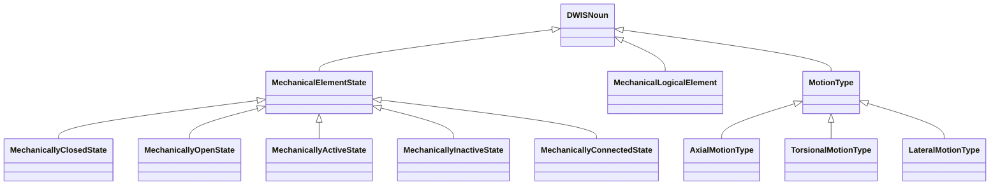
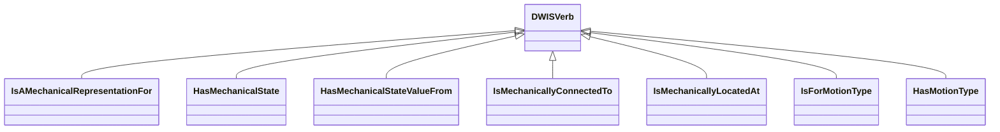
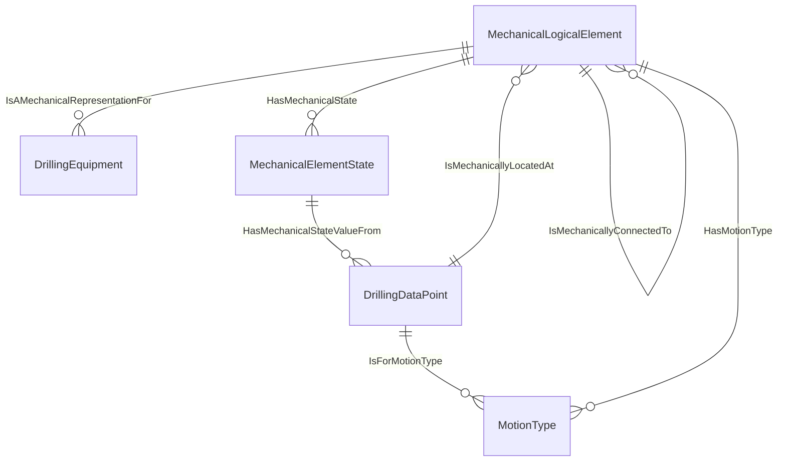

# Mechanics<!-- DEFINITION SET HEADER -->
- Description: 
this part refers to the mechanical circuit, and should only contain the "abstract" or conceptual part of the vocabulary. Additional nouns coming from the drilling equipment category will be used when constructing the semantic graphs.

# Nouns
## Class Inheritance for Nouns
Here is a class inheritance diagram for the nouns contained in this definition set.

## MechanicalElementState <!-- NOUN -->
- Display name: MechanicalElementState
- Parent class: [DWISNoun](./DWISSemantics.md#DWISNoun)
- Attributes:
  - Value
    - Type: bool
    - Description: 
- Description: 

- Definition set: Mechanics
- Examples:
## MechanicallyClosedState <!-- NOUN -->
- Display name: MechanicallyClosedState
- Parent class: [MechanicalElementState](./Mechanics.md#MechanicalElementState)
- Description: 

- Definition set: Mechanics
- Examples:
## MechanicallyOpenState <!-- NOUN -->
- Display name: MechanicallyOpenState
- Parent class: [MechanicalElementState](./Mechanics.md#MechanicalElementState)
- Description: 

- Definition set: Mechanics
- Examples:
## MechanicallyActiveState <!-- NOUN -->
- Display name: MechanicallyActiveState
- Parent class: [MechanicalElementState](./Mechanics.md#MechanicalElementState)
- Description: 

- Definition set: Mechanics
- Examples:
## MechanicallyInactiveState <!-- NOUN -->
- Display name: MechanicallyInactiveState
- Parent class: [MechanicalElementState](./Mechanics.md#MechanicalElementState)
- Description: 

- Definition set: Mechanics
- Examples:
## MechanicallyConnectedState <!-- NOUN -->
- Display name: MechanicallyConnectedState
- Parent class: [MechanicalElementState](./Mechanics.md#MechanicalElementState)
- Description: 

- Definition set: Mechanics
- Examples:
## MechanicalLogicalElement <!-- NOUN -->
- Display name: MechanicalLogicalElement
- Parent class: [DWISNoun](./DWISSemantics.md#DWISNoun)
- Description: 

- Definition set: Mechanics
- Examples:
## MotionType <!-- NOUN -->
- Display name: MotionType
- Parent class: [DWISNoun](./DWISSemantics.md#DWISNoun)
- Description: 

- Definition set: Mechanics
- Examples:
## AxialMotionType <!-- NOUN -->
- Display name: AxialMotionType
- Parent class: [MotionType](./Mechanics.md#MotionType)
- Description: 

- Definition set: Mechanics
- Examples:
## TorsionalMotionType <!-- NOUN -->
- Display name: TorsionalMotionType
- Parent class: [MotionType](./Mechanics.md#MotionType)
- Description: 

- Definition set: Mechanics
- Examples:
## LateralMotionType <!-- NOUN -->
- Display name: LateralMotionType
- Parent class: [MotionType](./Mechanics.md#MotionType)
- Description: 

- Definition set: Mechanics
- Examples:
# Verbs
## Class Inheritance for Verbs
Here is a class inheritance diagram for the verbs contained in this definition set.

## Relations
Here is a graph representing the relations that can be made with the verbs defined in this definition set.

## IsAMechanicalRepresentationFor <!-- VERB -->
- Display name: IsAMechanicalRepresentationFor
- Parent verb: [DWISVerb](./DWISSemantics.md#DWISVerb)
- Subject class: [MechanicalLogicalElement](./Mechanics.md#MechanicalLogicalElement)
- Object class: [DrillingEquipment](./DrillingEquipment.md#DrillingEquipment)
- Definition set: Mechanics
- Description: 

- Examples:
## HasMechanicalState <!-- VERB -->
- Display name: HasMechanicalState
- Parent verb: [DWISVerb](./DWISSemantics.md#DWISVerb)
- Subject class: [MechanicalLogicalElement](./Mechanics.md#MechanicalLogicalElement)
- Object class: [MechanicalElementState](./Mechanics.md#MechanicalElementState)
- Definition set: Mechanics
- Description: 

- Examples:
## HasMechanicalStateValueFrom <!-- VERB -->
- Display name: HasMechanicalStateValueFrom
- Parent verb: [DWISVerb](./DWISSemantics.md#DWISVerb)
- Subject class: [MechanicalElementState](./Mechanics.md#MechanicalElementState)
- Object class: [DrillingDataPoint](./DrillingDataSemantics.md#DrillingDataPoint)
- Definition set: Mechanics
- Description: 

- Examples:
## IsMechanicallyConnectedTo <!-- VERB -->
- Display name: IsMechanicallyConnectTo
- Parent verb: [DWISVerb](./DWISSemantics.md#DWISVerb)
- Subject class: [MechanicalLogicalElement](./Mechanics.md#MechanicalLogicalElement)
- Object class: [MechanicalLogicalElement](./Mechanics.md#MechanicalLogicalElement)
- Definition set: Mechanics
- Description: 

- Examples:
## IsMechanicallyLocatedAt <!-- VERB -->
- Display name: IsMechanicallyLocatedAt
- Parent verb: [DWISVerb](./DWISSemantics.md#DWISVerb)
- Subject class: [DrillingDataPoint](./DrillingDataSemantics.md#DrillingDataPoint)
- Object class: [MechanicalLogicalElement](./Mechanics.md#MechanicalLogicalElement)
- Definition set: Mechanics
- Description: 

- Examples:
## IsForMotionType <!-- VERB -->
- Display name: IsForMotionType
- Parent verb: [DWISVerb](./DWISSemantics.md#DWISVerb)
- Subject class: [DrillingDataPoint](./DrillingDataSemantics.md#DrillingDataPoint)
- Object class: [MotionType](./Mechanics.md#MotionType)
- Definition set: Mechanics
- Description: 

- Examples:
## HasMotionType <!-- VERB -->
- Display name: HasMotionType
- Parent verb: [DWISVerb](./DWISSemantics.md#DWISVerb)
- Subject class: [MechanicalLogicalElement](./Mechanics.md#MechanicalLogicalElement)
- Object class: [MotionType](./Mechanics.md#MotionType)
- Definition set: Mechanics
- Description: 

- Examples:
