# Mechanics<!-- DEFINITION SET HEADER -->
- Description: 
this part refers to the mechanical circuit, and should only contain the "abstract" or conceptual part of the vocabulary. Additional nouns coming from the drilling equipment category will be used when constructing the semantic graphs.

# Nouns
## Class Inheritance for Nouns
Here is a class inheritance diagram for the nouns contained in this definition set.
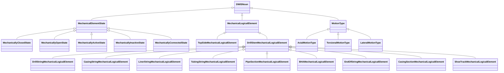
## MechanicalElementState <!-- NOUN -->
- Display name: MechanicalElementState
- Parent class: [DWISNoun](./DWISSemantics.md#DWISNoun)
- Attributes:
  - Value
    - Type: bool
    - Description: 
- Description: 
Represents the state of a mechanical element such as open/closed or active/inactive.
- Definition set: Mechanics
- Examples:
```dwis mechState
MechanicalElementState:mechanicalState
MechanicalLogicalElement:topDriveClutch
topDriveClutch HasMechanicalState mechanicalState
```
An example semantic graph looks like as follow:
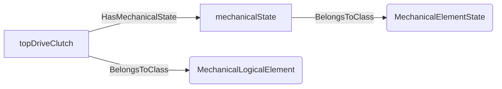
An example SparQL query looks like this:
```sparql
PREFIX rdf: <http://www.w3.org/1999/02/22-rdf-syntax-ns#>
PREFIX ddhub: <http://ddhub.no/>
PREFIX quantity: <http://ddhub.no/UnitAndQuantity>
SELECT ?mechState
WHERE {
	?mechanicalState rdf:type ddhub:MechanicalElementState .
	?topDriveClutch rdf:type ddhub:MechanicalLogicalElement .
	?topDriveClutch ddhub:HasMechanicalState ?mechanicalState .
}
```
This example assigns a state to a mechanical element.
## MechanicallyClosedState <!-- NOUN -->
- Display name: MechanicallyClosedState
- Parent class: [MechanicalElementState](./Mechanics.md#MechanicalElementState)
- Description: 
A state indicating a mechanical closure (e.g., valve closed).
- Definition set: Mechanics
- Examples:
```dwis closedState
MechanicallyClosedState:closedState
MechanicalLogicalElement:blowoutPreventer
blowoutPreventer HasMechanicalState closedState
```
An example semantic graph looks like as follow:
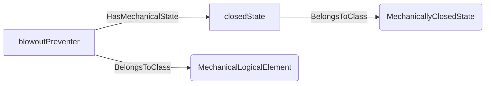
An example SparQL query looks like this:
```sparql
PREFIX rdf: <http://www.w3.org/1999/02/22-rdf-syntax-ns#>
PREFIX ddhub: <http://ddhub.no/>
PREFIX quantity: <http://ddhub.no/UnitAndQuantity>
SELECT ?closedState
WHERE {
	?closedState rdf:type ddhub:MechanicallyClosedState .
	?blowoutPreventer rdf:type ddhub:MechanicalLogicalElement .
	?blowoutPreventer ddhub:HasMechanicalState ?closedState .
}
```
This example denotes a closed state on a BOP element.
## MechanicallyOpenState <!-- NOUN -->
- Display name: MechanicallyOpenState
- Parent class: [MechanicalElementState](./Mechanics.md#MechanicalElementState)
- Description: 
A state indicating a mechanical opening.
- Definition set: Mechanics
- Examples:
```dwis openState
MechanicallyOpenState:openState
MechanicalLogicalElement:annularPreventer
annularPreventer HasMechanicalState openState
```
An example semantic graph looks like as follow:
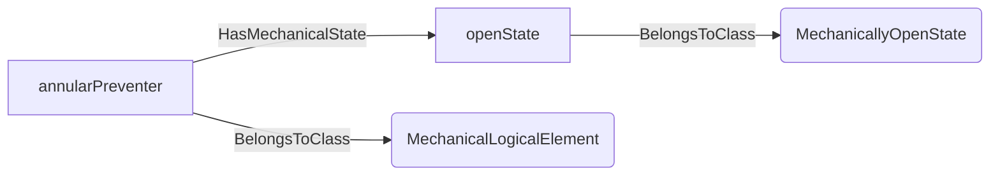
An example SparQL query looks like this:
```sparql
PREFIX rdf: <http://www.w3.org/1999/02/22-rdf-syntax-ns#>
PREFIX ddhub: <http://ddhub.no/>
PREFIX quantity: <http://ddhub.no/UnitAndQuantity>
SELECT ?openState
WHERE {
	?openState rdf:type ddhub:MechanicallyOpenState .
	?annularPreventer rdf:type ddhub:MechanicalLogicalElement .
	?annularPreventer ddhub:HasMechanicalState ?openState .
}
```
This example sets an open state on an annular preventer.
## MechanicallyActiveState <!-- NOUN -->
- Display name: MechanicallyActiveState
- Parent class: [MechanicalElementState](./Mechanics.md#MechanicalElementState)
- Description: 
Indicates that a mechanical element is active/engaged.
- Definition set: Mechanics
- Examples:
```dwis activeState
MechanicallyActiveState:activeState
MechanicalLogicalElement:topDrive
topDrive HasMechanicalState activeState
```
An example semantic graph looks like as follow:
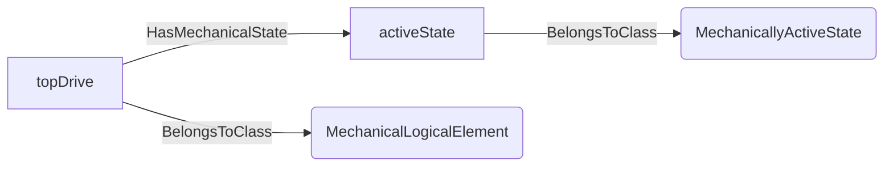
An example SparQL query looks like this:
```sparql
PREFIX rdf: <http://www.w3.org/1999/02/22-rdf-syntax-ns#>
PREFIX ddhub: <http://ddhub.no/>
PREFIX quantity: <http://ddhub.no/UnitAndQuantity>
SELECT ?activeState
WHERE {
	?activeState rdf:type ddhub:MechanicallyActiveState .
	?topDrive rdf:type ddhub:MechanicalLogicalElement .
	?topDrive ddhub:HasMechanicalState ?activeState .
}
```
This example marks a top drive as active.
## MechanicallyInactiveState <!-- NOUN -->
- Display name: MechanicallyInactiveState
- Parent class: [MechanicalElementState](./Mechanics.md#MechanicalElementState)
- Description: 
Indicates that a mechanical element is inactive/disengaged.
- Definition set: Mechanics
- Examples:
```dwis inactiveState
MechanicallyInactiveState:inactiveState
MechanicalLogicalElement:topDrive
topDrive HasMechanicalState inactiveState
```
An example semantic graph looks like as follow:
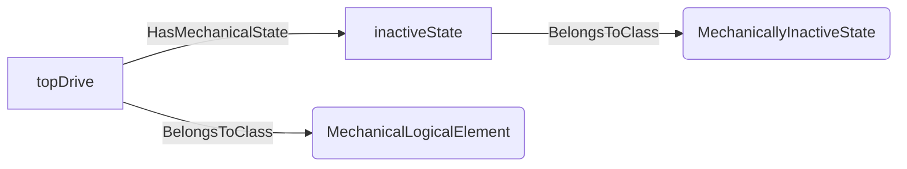
An example SparQL query looks like this:
```sparql
PREFIX rdf: <http://www.w3.org/1999/02/22-rdf-syntax-ns#>
PREFIX ddhub: <http://ddhub.no/>
PREFIX quantity: <http://ddhub.no/UnitAndQuantity>
SELECT ?inactiveState
WHERE {
	?inactiveState rdf:type ddhub:MechanicallyInactiveState .
	?topDrive rdf:type ddhub:MechanicalLogicalElement .
	?topDrive ddhub:HasMechanicalState ?inactiveState .
}
```
This example marks a top drive as inactive.
## MechanicallyConnectedState <!-- NOUN -->
- Display name: MechanicallyConnectedState
- Parent class: [MechanicalElementState](./Mechanics.md#MechanicalElementState)
- Description: 
Indicates whether two mechanical elements are connected.
- Definition set: Mechanics
- Examples:
```dwis connectedState
MechanicallyConnectedState:connectedState
MechanicalLogicalElement:pipeConnection
pipeConnection HasMechanicalState connectedState
```
An example semantic graph looks like as follow:
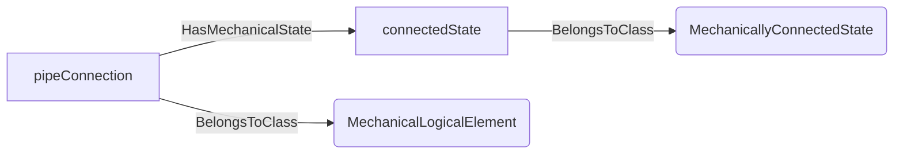
An example SparQL query looks like this:
```sparql
PREFIX rdf: <http://www.w3.org/1999/02/22-rdf-syntax-ns#>
PREFIX ddhub: <http://ddhub.no/>
PREFIX quantity: <http://ddhub.no/UnitAndQuantity>
SELECT ?connectedState
WHERE {
	?connectedState rdf:type ddhub:MechanicallyConnectedState .
	?pipeConnection rdf:type ddhub:MechanicalLogicalElement .
	?pipeConnection ddhub:HasMechanicalState ?connectedState .
}
```
This example records a connection state for a pipe joint.
## MechanicalLogicalElement <!-- NOUN -->
- Display name: Mechanical Logical Element
- Parent class: [DWISNoun](./DWISSemantics.md#DWISNoun)
- Description: 
Abstract mechanical element used to model kinematic or connection relationships.
- Definition set: Mechanics
- Examples:
```dwis mechanicalElementExample
MechanicalLogicalElement:topDrive
DrillingEquipment:topDriveEquipment
topDrive IsAMechanicalRepresentationFor topDriveEquipment
```
An example semantic graph looks like as follow:
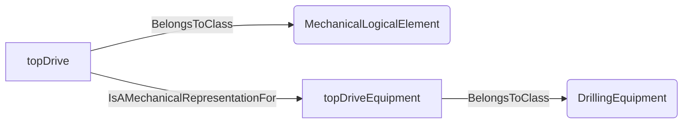
An example SparQL query looks like this:
```sparql
PREFIX rdf: <http://www.w3.org/1999/02/22-rdf-syntax-ns#>
PREFIX ddhub: <http://ddhub.no/>
PREFIX quantity: <http://ddhub.no/UnitAndQuantity>
SELECT ?mechanicalElementExample
WHERE {
	?topDrive rdf:type ddhub:MechanicalLogicalElement .
	?topDriveEquipment rdf:type ddhub:DrillingEquipment .
	?topDrive ddhub:IsAMechanicalRepresentationFor ?topDriveEquipment .
}
```
This example represents a top drive as a mechanical logical element.
## TopSideMechanicalLogicalElement <!-- NOUN -->
- Display name: Top Side Mechanical Logical Element
- Parent class: [MechanicalLogicalElement](./Mechanics.md#MechanicalLogicalElement)
- Description: 
Abstract mechanical element concerning the top-side mechanical infrastructure like for instance the top-drive, the rotary table, the kelly.
- Definition set: Mechanics
- Examples:
```dwis TopSideMechanicalLogicalElementExample
TopSideMechanicalLogicalElement:topDriveLogical
TopDrive:topDriveEquipment
topDriveLogical IsAMechanicalRepresentationFor topDriveEquipment
```
An example semantic graph looks like as follow:
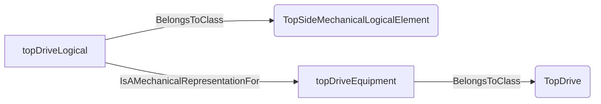
An example SparQL query looks like this:
```sparql
PREFIX rdf: <http://www.w3.org/1999/02/22-rdf-syntax-ns#>
PREFIX ddhub: <http://ddhub.no/>
PREFIX quantity: <http://ddhub.no/UnitAndQuantity>
SELECT ?TopSideMechanicalLogicalElementExample
WHERE {
	?topDriveLogical rdf:type ddhub:TopSideMechanicalLogicalElement .
	?topDriveEquipment rdf:type ddhub:TopDrive .
	?topDriveLogical ddhub:IsAMechanicalRepresentationFor ?topDriveEquipment .
}
```
This example represents a top drive as a mechanical logical element.
## DrillStemMechanicalLogicalElement <!-- NOUN -->
- Display name: Drill-stem Mechanical Logical Element
- Parent class: [MechanicalLogicalElement](./Mechanics.md#MechanicalLogicalElement)
- Description: 
Abstract mechanical representation of a drill-stem, e.g., a drill-string, a casing-string, a tubing-string.
- Definition set: Mechanics
- Examples:
```dwis DrillStemMechanicalLogicalElementExample
TopSideMechanicalLogicalElement:topSideHoistingAndRotationLogical
DrillStemMechanicalLogicalElement:drillStemLogical
topSideHoistingAndRotationLogical IsMechanicallyConnectedTo drillStemLogical
```
An example semantic graph looks like as follow:
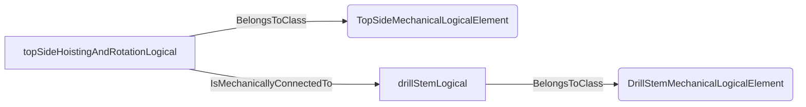
An example SparQL query looks like this:
```sparql
PREFIX rdf: <http://www.w3.org/1999/02/22-rdf-syntax-ns#>
PREFIX ddhub: <http://ddhub.no/>
PREFIX quantity: <http://ddhub.no/UnitAndQuantity>
SELECT ?DrillStemMechanicalLogicalElementExample
WHERE {
	?topSideHoistingAndRotationLogical rdf:type ddhub:TopSideMechanicalLogicalElement .
	?drillStemLogical rdf:type ddhub:DrillStemMechanicalLogicalElement .
	?topSideHoistingAndRotationLogical ddhub:IsMechanicallyConnectedTo ?drillStemLogical .
}
```
This example describes that the top-drive or kelly is mechanically connected to the drill-stem.
## DrillStringMechanicalLogicalElement <!-- NOUN -->
- Display name: Drill-string Mechanical Logical Element
- Parent class: [DrillStemMechanicalLogicalElement](./Mechanics.md#DrillStemMechanicalLogicalElement)
- Description: 
Abstract mechanical representation of a drill-string, i.e., a drill-stem that is used during a drilling operation.
- Definition set: Mechanics
- Examples:
```dwis DrillStringMechanicalLogicalElementExample
TopSideMechanicalLogicalElement:topSideHoistingAndRotationLogical
DrillStemMechanicalLogicalElement:drillStemLogical
topSideHoistingAndRotationLogical IsMechanicallyConnectedTo drillStemLogical
```
An example semantic graph looks like as follow:

An example SparQL query looks like this:
```sparql
PREFIX rdf: <http://www.w3.org/1999/02/22-rdf-syntax-ns#>
PREFIX ddhub: <http://ddhub.no/>
PREFIX quantity: <http://ddhub.no/UnitAndQuantity>
SELECT ?DrillStringMechanicalLogicalElementExample
WHERE {
	?topSideHoistingAndRotationLogical rdf:type ddhub:TopSideMechanicalLogicalElement .
	?drillStemLogical rdf:type ddhub:DrillStemMechanicalLogicalElement .
	?topSideHoistingAndRotationLogical ddhub:IsMechanicallyConnectedTo ?drillStemLogical .
}
```
This example describes that the top-drive or kelly is mechanically connected to the drill-stem.
## CasingStringMechanicalLogicalElement <!-- NOUN -->
- Display name: Casing-string Mechanical Logical Element
- Parent class: [DrillStemMechanicalLogicalElement](./Mechanics.md#DrillStemMechanicalLogicalElement)
- Description: 
Abstract mechanical representation of a casing-string, i.e., a drill-stem that is composed of casing joints, a casing shoe and similar elements.
- Definition set: Mechanics
- Examples:
```dwis CasingStringMechanicalLogicalElementExample
TopSideMechanicalLogicalElement:topSideHoistingAndRotationLogical
CasingStringMechanicalLogicalElement:casingStringLogical
topSideHoistingAndRotationLogical IsMechanicallyConnectedTo casingStringLogical
```
An example semantic graph looks like as follow:

An example SparQL query looks like this:
```sparql
PREFIX rdf: <http://www.w3.org/1999/02/22-rdf-syntax-ns#>
PREFIX ddhub: <http://ddhub.no/>
PREFIX quantity: <http://ddhub.no/UnitAndQuantity>
SELECT ?CasingStringMechanicalLogicalElementExample
WHERE {
	?topSideHoistingAndRotationLogical rdf:type ddhub:TopSideMechanicalLogicalElement .
	?casingStringLogical rdf:type ddhub:CasingStringMechanicalLogicalElement .
	?topSideHoistingAndRotationLogical ddhub:IsMechanicallyConnectedTo ?casingStringLogical .
}
```
This example describes that the top-drive or kelly is mechanically connected to a casing string.
## LinerStringMechanicalLogicalElement <!-- NOUN -->
- Display name: Liner-string Mechanical Logical Element
- Parent class: [DrillStemMechanicalLogicalElement](./Mechanics.md#DrillStemMechanicalLogicalElement)
- Description: 
Abstract mechanical representation of a liner-string, i.e., a drill-stem that is composed of a pipe section first and casing joints, a casing shoe and similar elements below.
- Definition set: Mechanics
- Examples:
```dwis LinerStringMechanicalLogicalElementExample
TopSideMechanicalLogicalElement:topSideHoistingAndRotationLogical
LinerStringMechanicalLogicalElement:linerStringLogical
topSideHoistingAndRotationLogical IsMechanicallyConnectedTo linerStringLogical
```
An example semantic graph looks like as follow:
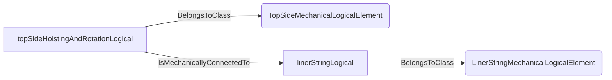
An example SparQL query looks like this:
```sparql
PREFIX rdf: <http://www.w3.org/1999/02/22-rdf-syntax-ns#>
PREFIX ddhub: <http://ddhub.no/>
PREFIX quantity: <http://ddhub.no/UnitAndQuantity>
SELECT ?LinerStringMechanicalLogicalElementExample
WHERE {
	?topSideHoistingAndRotationLogical rdf:type ddhub:TopSideMechanicalLogicalElement .
	?linerStringLogical rdf:type ddhub:LinerStringMechanicalLogicalElement .
	?topSideHoistingAndRotationLogical ddhub:IsMechanicallyConnectedTo ?linerStringLogical .
}
```
This example describes that the top-drive or kelly is mechanically connected to a liner string.
## TubingStringMechanicalLogicalElement <!-- NOUN -->
- Display name: Tubing-string Mechanical Logical Element
- Parent class: [DrillStemMechanicalLogicalElement](./Mechanics.md#DrillStemMechanicalLogicalElement)
- Description: 
Abstract mechanical representation of a tubing-string, i.e., a drill-stem that is composed of a tubings, expansion joint, packers and similar elements.
- Definition set: Mechanics
- Examples:
```dwis TubingStringMechanicalLogicalElementExample
TopSideMechanicalLogicalElement:topSideHoistingAndRotationLogical
TubingStringMechanicalLogicalElement:tubingStringLogical
topSideHoistingAndRotationLogical IsMechanicallyConnectedTo tubingStringLogical
```
An example semantic graph looks like as follow:
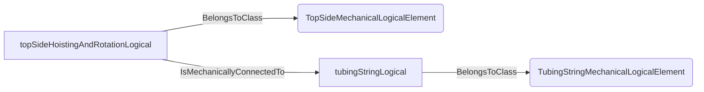
An example SparQL query looks like this:
```sparql
PREFIX rdf: <http://www.w3.org/1999/02/22-rdf-syntax-ns#>
PREFIX ddhub: <http://ddhub.no/>
PREFIX quantity: <http://ddhub.no/UnitAndQuantity>
SELECT ?TubingStringMechanicalLogicalElementExample
WHERE {
	?topSideHoistingAndRotationLogical rdf:type ddhub:TopSideMechanicalLogicalElement .
	?tubingStringLogical rdf:type ddhub:TubingStringMechanicalLogicalElement .
	?topSideHoistingAndRotationLogical ddhub:IsMechanicallyConnectedTo ?tubingStringLogical .
}
```
This example describes that the top-side hoisting system is mechanically connected to a tubing string.
## PipeSectionMechanicalLogicalElement <!-- NOUN -->
- Display name: Pipe Section Mechanical Logical Element
- Parent class: [DrillStemMechanicalLogicalElement](./Mechanics.md#DrillStemMechanicalLogicalElement)
- Description: 
Abstract mechanical representation of the pipe section of a drill-stem. The pipe section contains drill-pipe,
heavy-weight drill-pipe, jar, accelerator and other similar components.
- Definition set: Mechanics
- Examples:
```dwis PipeSectionMechanicalLogicalElementExample
PipeSectionMechanicalLogicalElement:pipeSectionLogical
BHAMechanicalLogicalElement:BHALogical
pipeSectionLogical IsMechanicallyConnectedTo BHALogical
```
An example semantic graph looks like as follow:
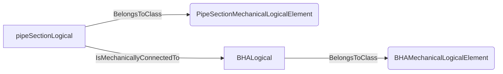
An example SparQL query looks like this:
```sparql
PREFIX rdf: <http://www.w3.org/1999/02/22-rdf-syntax-ns#>
PREFIX ddhub: <http://ddhub.no/>
PREFIX quantity: <http://ddhub.no/UnitAndQuantity>
SELECT ?PipeSectionMechanicalLogicalElementExample
WHERE {
	?pipeSectionLogical rdf:type ddhub:PipeSectionMechanicalLogicalElement .
	?BHALogical rdf:type ddhub:BHAMechanicalLogicalElement .
	?pipeSectionLogical ddhub:IsMechanicallyConnectedTo ?BHALogical .
}
```
This example describes that the pipe section is mechanically connected to the BHA.
## BHAMechanicalLogicalElement <!-- NOUN -->
- Display name: BHA Mechanical Logical Element
- Parent class: [DrillStemMechanicalLogicalElement](./Mechanics.md#DrillStemMechanicalLogicalElement)
- Description: 
Abstract mechanical representation of the BHA portion of a drill-string.
- Definition set: Mechanics
- Examples:
```dwis BHAMechanicalLogicalElementExample
PipeSectionMechanicalLogicalElement:pipeSectionLogical
BHAMechanicalLogicalElement:BHALogical
pipeSectionLogical IsMechanicallyConnectedTo BHALogical
```
An example semantic graph looks like as follow:

An example SparQL query looks like this:
```sparql
PREFIX rdf: <http://www.w3.org/1999/02/22-rdf-syntax-ns#>
PREFIX ddhub: <http://ddhub.no/>
PREFIX quantity: <http://ddhub.no/UnitAndQuantity>
SELECT ?BHAMechanicalLogicalElementExample
WHERE {
	?pipeSectionLogical rdf:type ddhub:PipeSectionMechanicalLogicalElement .
	?BHALogical rdf:type ddhub:BHAMechanicalLogicalElement .
	?pipeSectionLogical ddhub:IsMechanicallyConnectedTo ?BHALogical .
}
```
This example describes that the pipe section is mechanically connected to the BHA.
## EndOfStringMechanicalLogicalElement <!-- NOUN -->
- Display name: End Of String Mechanical Logical Element
- Parent class: [DrillStemMechanicalLogicalElement](./Mechanics.md#DrillStemMechanicalLogicalElement)
- Description: 
Abstract mechanical representation of the end of the drill-stem, e.g., bit, bull-nose, casing shoe, etc.
- Definition set: Mechanics
- Examples:
```dwis EndOfStringMechanicalLogicalElementExample
BHAMechanicalLogicalElement:BHALogical
EndOfStringMechanicalLogicalElement:BitLogical
BHALogical IsMechanicallyConnectedTo BitLogical
```
An example semantic graph looks like as follow:
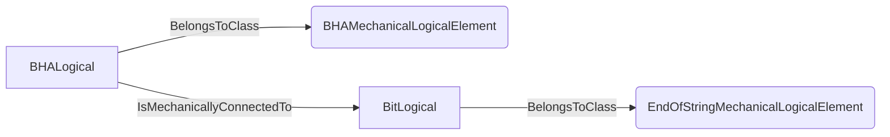
An example SparQL query looks like this:
```sparql
PREFIX rdf: <http://www.w3.org/1999/02/22-rdf-syntax-ns#>
PREFIX ddhub: <http://ddhub.no/>
PREFIX quantity: <http://ddhub.no/UnitAndQuantity>
SELECT ?EndOfStringMechanicalLogicalElementExample
WHERE {
	?BHALogical rdf:type ddhub:BHAMechanicalLogicalElement .
	?BitLogical rdf:type ddhub:EndOfStringMechanicalLogicalElement .
	?BHALogical ddhub:IsMechanicallyConnectedTo ?BitLogical .
}
```
This example describes that the BHA is mechanically connected to the Bit.
## CasingSectionMechanicalLogicalElement <!-- NOUN -->
- Display name: Casing-section Mechanical Logical Element
- Parent class: [DrillStemMechanicalLogicalElement](./Mechanics.md#DrillStemMechanicalLogicalElement)
- Description: 
Abstract mechanical representation of the casing-section portion of a casing or liner string.
- Definition set: Mechanics
- Examples:
```dwis CasingSectionMechanicalLogicalElementExample
PipeSectionMechanicalLogicalElement:pipeSectionLogical
CasingSectionMechanicalLogicalElement:casingSectionLogical
ShoeTrackMechanicalLogicalElement:shoeTrackLogical
pipeSectionLogical IsMechanicallyConnectedTo casingSectionLogical
casingSectionLogical IsMechanicallyConnectedTo shoeTrackLogical
```
An example semantic graph looks like as follow:
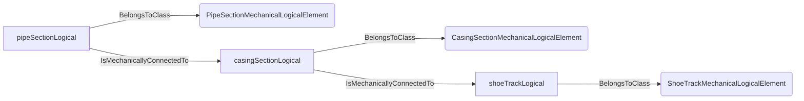
An example SparQL query looks like this:
```sparql
PREFIX rdf: <http://www.w3.org/1999/02/22-rdf-syntax-ns#>
PREFIX ddhub: <http://ddhub.no/>
PREFIX quantity: <http://ddhub.no/UnitAndQuantity>
SELECT ?CasingSectionMechanicalLogicalElementExample
WHERE {
	?pipeSectionLogical rdf:type ddhub:PipeSectionMechanicalLogicalElement .
	?casingSectionLogical rdf:type ddhub:CasingSectionMechanicalLogicalElement .
	?shoeTrackLogical rdf:type ddhub:ShoeTrackMechanicalLogicalElement .
	?pipeSectionLogical ddhub:IsMechanicallyConnectedTo ?casingSectionLogical .
	?casingSectionLogical ddhub:IsMechanicallyConnectedTo ?shoeTrackLogical .
}
```
This example describes that the logical decomposition of a liner-string in a pipe section attached to a casing section attached to a shoe-track.
## ShoeTrackMechanicalLogicalElement <!-- NOUN -->
- Display name: Shoe-track Mechanical Logical Element
- Parent class: [DrillStemMechanicalLogicalElement](./Mechanics.md#DrillStemMechanicalLogicalElement)
- Description: 
Abstract mechanical representation of the show-track portion of a casing or liner string.
- Definition set: Mechanics
- Examples:
```dwis ShoeTrackMechanicalLogicalElementExample
CasingSectionMechanicalLogicalElement:casingSectionLogical
ShoeTrackMechanicalLogicalElement:shoeTrackLogical
casingSectionLogical IsMechanicallyConnectedTo shoeTrackLogical
```
An example semantic graph looks like as follow:
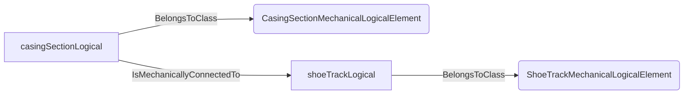
An example SparQL query looks like this:
```sparql
PREFIX rdf: <http://www.w3.org/1999/02/22-rdf-syntax-ns#>
PREFIX ddhub: <http://ddhub.no/>
PREFIX quantity: <http://ddhub.no/UnitAndQuantity>
SELECT ?ShoeTrackMechanicalLogicalElementExample
WHERE {
	?casingSectionLogical rdf:type ddhub:CasingSectionMechanicalLogicalElement .
	?shoeTrackLogical rdf:type ddhub:ShoeTrackMechanicalLogicalElement .
	?casingSectionLogical ddhub:IsMechanicallyConnectedTo ?shoeTrackLogical .
}
```
This example describes that a casing-string that is composed of a casing-sectiond attached to a shoe-track.
## MotionType <!-- NOUN -->
- Display name: MotionType
- Parent class: [DWISNoun](./DWISSemantics.md#DWISNoun)
- Description: 
Classifies the type of motion considered (axial, torsional, lateral).
- Definition set: Mechanics
- Examples:
```dwis motionType
MotionType:motion
DrillingDataPoint:hookload
hookload IsForMotionType motion
```
An example semantic graph looks like as follow:
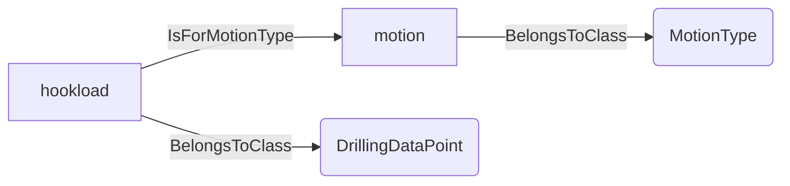
An example SparQL query looks like this:
```sparql
PREFIX rdf: <http://www.w3.org/1999/02/22-rdf-syntax-ns#>
PREFIX ddhub: <http://ddhub.no/>
PREFIX quantity: <http://ddhub.no/UnitAndQuantity>
SELECT ?motionType
WHERE {
	?motion rdf:type ddhub:MotionType .
	?hookload rdf:type ddhub:DrillingDataPoint .
	?hookload ddhub:IsForMotionType ?motion .
}
```
This example relates a signal to a motion type.
## AxialMotionType <!-- NOUN -->
- Display name: AxialMotionType
- Parent class: [MotionType](./Mechanics.md#MotionType)
- Description: 
Motion along the string axis.
- Definition set: Mechanics
- Examples:
```dwis axialMotion
AxialMotionType:axialMotion
MechanicalLogicalElement:drillString
drillString HasMotionType axialMotion
```
An example semantic graph looks like as follow:
```mermaid
graph LR
	N0000[axialMotion] -->|BelongsToClass| N0001(AxialMotionType) 
	N0002[drillString] -->|BelongsToClass| N0003(MechanicalLogicalElement) 
	N0002[drillString] -->|HasMotionType| N0000[axialMotion] 
```
An example SparQL query looks like this:
```sparql
PREFIX rdf: <http://www.w3.org/1999/02/22-rdf-syntax-ns#>
PREFIX ddhub: <http://ddhub.no/>
PREFIX quantity: <http://ddhub.no/UnitAndQuantity>
SELECT ?axialMotion
WHERE {
	?axialMotion rdf:type ddhub:AxialMotionType .
	?drillString rdf:type ddhub:MechanicalLogicalElement .
	?drillString ddhub:HasMotionType ?axialMotion .
}
```
This example tags axial motion for a drill string element.
## TorsionalMotionType <!-- NOUN -->
- Display name: TorsionalMotionType
- Parent class: [MotionType](./Mechanics.md#MotionType)
- Description: 
Rotational motion around the axis.
- Definition set: Mechanics
- Examples:
```dwis torsionalMotion
TorsionalMotionType:torsionalMotion
MechanicalLogicalElement:drillString
drillString HasMotionType torsionalMotion
```
An example semantic graph looks like as follow:
```mermaid
graph LR
	N0000[torsionalMotion] -->|BelongsToClass| N0001(TorsionalMotionType) 
	N0002[drillString] -->|BelongsToClass| N0003(MechanicalLogicalElement) 
	N0002[drillString] -->|HasMotionType| N0000[torsionalMotion] 
```
An example SparQL query looks like this:
```sparql
PREFIX rdf: <http://www.w3.org/1999/02/22-rdf-syntax-ns#>
PREFIX ddhub: <http://ddhub.no/>
PREFIX quantity: <http://ddhub.no/UnitAndQuantity>
SELECT ?torsionalMotion
WHERE {
	?torsionalMotion rdf:type ddhub:TorsionalMotionType .
	?drillString rdf:type ddhub:MechanicalLogicalElement .
	?drillString ddhub:HasMotionType ?torsionalMotion .
}
```
This example tags torsional motion for a drill string element.
## LateralMotionType <!-- NOUN -->
- Display name: LateralMotionType
- Parent class: [MotionType](./Mechanics.md#MotionType)
- Description: 
Motion perpendicular to the string axis.
- Definition set: Mechanics
- Examples:
```dwis lateralMotion
LateralMotionType:lateralMotion
MechanicalLogicalElement:drillString
drillString HasMotionType lateralMotion
```
An example semantic graph looks like as follow:
```mermaid
graph LR
	N0000[lateralMotion] -->|BelongsToClass| N0001(LateralMotionType) 
	N0002[drillString] -->|BelongsToClass| N0003(MechanicalLogicalElement) 
	N0002[drillString] -->|HasMotionType| N0000[lateralMotion] 
```
An example SparQL query looks like this:
```sparql
PREFIX rdf: <http://www.w3.org/1999/02/22-rdf-syntax-ns#>
PREFIX ddhub: <http://ddhub.no/>
PREFIX quantity: <http://ddhub.no/UnitAndQuantity>
SELECT ?lateralMotion
WHERE {
	?lateralMotion rdf:type ddhub:LateralMotionType .
	?drillString rdf:type ddhub:MechanicalLogicalElement .
	?drillString ddhub:HasMotionType ?lateralMotion .
}
```
This example tags lateral motion for a drill string element.
# Verbs
## Class Inheritance for Verbs
Here is a class inheritance diagram for the verbs contained in this definition set.
```mermaid
classDiagram
DWISVerb <|-- IsAMechanicalRepresentationFor
DWISVerb <|-- HasMechanicalState
DWISVerb <|-- HasMechanicalStateValueFrom
DWISVerb <|-- IsMechanicallyConnectedTo
DWISVerb <|-- IsMechanicallyLocatedAt
DWISVerb <|-- IsForMotionType
DWISVerb <|-- HasMotionType
```
## Relations
Here is a graph representing the relations that can be made with the verbs defined in this definition set.
```mermaid
erDiagram
MechanicalLogicalElement ||--o{ DrillingEquipment : IsAMechanicalRepresentationFor
MechanicalLogicalElement ||--o{ MechanicalElementState : HasMechanicalState
MechanicalElementState ||--o{ DrillingDataPoint : HasMechanicalStateValueFrom
MechanicalLogicalElement ||--o{ MechanicalLogicalElement : IsMechanicallyConnectedTo
DrillingDataPoint ||--o{ MechanicalLogicalElement : IsMechanicallyLocatedAt
DrillingDataPoint ||--o{ MotionType : IsForMotionType
MechanicalLogicalElement ||--o{ MotionType : HasMotionType
```
## IsAMechanicalRepresentationFor <!-- VERB -->
- Display name: IsAMechanicalRepresentationFor
- Parent verb: [DWISVerb](./DWISSemantics.md#DWISVerb)
- Subject class: [MechanicalLogicalElement](./Mechanics.md#MechanicalLogicalElement)
- Object class: [DrillingEquipment](./DrillingEquipment.md#DrillingEquipment)
- Definition set: Mechanics
- Description: 
Links a mechanical logical element to the equipment it represents.
- Examples:
```dwis mechRepresentation
MechanicalLogicalElement:topDrive
DrillingEquipment:topDriveEquipment
topDrive IsAMechanicalRepresentationFor topDriveEquipment
```
An example semantic graph looks like as follow:
```mermaid
graph LR
	N0000[topDrive] -->|BelongsToClass| N0001(MechanicalLogicalElement) 
	N0002[topDriveEquipment] -->|BelongsToClass| N0003(DrillingEquipment) 
	N0000[topDrive] -->|IsAMechanicalRepresentationFor| N0002[topDriveEquipment] 
```
An example SparQL query looks like this:
```sparql
PREFIX rdf: <http://www.w3.org/1999/02/22-rdf-syntax-ns#>
PREFIX ddhub: <http://ddhub.no/>
PREFIX quantity: <http://ddhub.no/UnitAndQuantity>
SELECT ?mechRepresentation
WHERE {
	?topDrive rdf:type ddhub:MechanicalLogicalElement .
	?topDriveEquipment rdf:type ddhub:DrillingEquipment .
	?topDrive ddhub:IsAMechanicalRepresentationFor ?topDriveEquipment .
}
```
This example maps a logical element to the top drive equipment.
## HasMechanicalState <!-- VERB -->
- Display name: HasMechanicalState
- Parent verb: [DWISVerb](./DWISSemantics.md#DWISVerb)
- Subject class: [MechanicalLogicalElement](./Mechanics.md#MechanicalLogicalElement)
- Object class: [MechanicalElementState](./Mechanics.md#MechanicalElementState)
- Definition set: Mechanics
- Description: 
Assigns a mechanical state to an element.
- Examples:
```dwis mechStateExample
MechanicalLogicalElement:topDrive
MechanicalElementState:mechanicalState
topDrive HasMechanicalState mechanicalState
```
An example semantic graph looks like as follow:
```mermaid
graph LR
	N0000[topDrive] -->|BelongsToClass| N0001(MechanicalLogicalElement) 
	N0002[mechanicalState] -->|BelongsToClass| N0003(MechanicalElementState) 
	N0000[topDrive] -->|HasMechanicalState| N0002[mechanicalState] 
```
An example SparQL query looks like this:
```sparql
PREFIX rdf: <http://www.w3.org/1999/02/22-rdf-syntax-ns#>
PREFIX ddhub: <http://ddhub.no/>
PREFIX quantity: <http://ddhub.no/UnitAndQuantity>
SELECT ?mechStateExample
WHERE {
	?topDrive rdf:type ddhub:MechanicalLogicalElement .
	?mechanicalState rdf:type ddhub:MechanicalElementState .
	?topDrive ddhub:HasMechanicalState ?mechanicalState .
}
```
This example attaches a state to the top drive.
## HasMechanicalStateValueFrom <!-- VERB -->
- Display name: HasMechanicalStateValueFrom
- Parent verb: [DWISVerb](./DWISSemantics.md#DWISVerb)
- Subject class: [MechanicalElementState](./Mechanics.md#MechanicalElementState)
- Object class: [DrillingDataPoint](./DrillingDataSemantics.md#DrillingDataPoint)
- Definition set: Mechanics
- Description: 
Indicates the data point providing the state value.
- Examples:
```dwis stateValue
MechanicalElementState:mechanicalState
DrillingDataPoint:topDriveStatusSignal
mechanicalState HasMechanicalStateValueFrom topDriveStatusSignal
```
An example semantic graph looks like as follow:
```mermaid
graph LR
	N0000[mechanicalState] -->|BelongsToClass| N0001(MechanicalElementState) 
	N0002[topDriveStatusSignal] -->|BelongsToClass| N0003(DrillingDataPoint) 
	N0000[mechanicalState] -->|HasMechanicalStateValueFrom| N0002[topDriveStatusSignal] 
```
An example SparQL query looks like this:
```sparql
PREFIX rdf: <http://www.w3.org/1999/02/22-rdf-syntax-ns#>
PREFIX ddhub: <http://ddhub.no/>
PREFIX quantity: <http://ddhub.no/UnitAndQuantity>
SELECT ?stateValue
WHERE {
	?mechanicalState rdf:type ddhub:MechanicalElementState .
	?topDriveStatusSignal rdf:type ddhub:DrillingDataPoint .
	?mechanicalState ddhub:HasMechanicalStateValueFrom ?topDriveStatusSignal .
}
```
This example sets the state value from a status signal.
## IsMechanicallyConnectedTo <!-- VERB -->
- Display name: IsMechanicallyConnectTo
- Parent verb: [DWISVerb](./DWISSemantics.md#DWISVerb)
- Subject class: [MechanicalLogicalElement](./Mechanics.md#MechanicalLogicalElement)
- Object class: [MechanicalLogicalElement](./Mechanics.md#MechanicalLogicalElement)
- Definition set: Mechanics
- Description: 
Indicates a mechanical connection between two elements.
- Examples:
```dwis mechanicalConnection
MechanicalLogicalElement:drillString
MechanicalLogicalElement:topDrive
drillString IsMechanicallyConnectedTo topDrive
```
An example semantic graph looks like as follow:
```mermaid
graph LR
	N0000[drillString] -->|BelongsToClass| N0001(MechanicalLogicalElement) 
	N0002[topDrive] -->|BelongsToClass| N0001(MechanicalLogicalElement) 
	N0000[drillString] -->|IsMechanicallyConnectedTo| N0002[topDrive] 
```
An example SparQL query looks like this:
```sparql
PREFIX rdf: <http://www.w3.org/1999/02/22-rdf-syntax-ns#>
PREFIX ddhub: <http://ddhub.no/>
PREFIX quantity: <http://ddhub.no/UnitAndQuantity>
SELECT ?mechanicalConnection
WHERE {
	?drillString rdf:type ddhub:MechanicalLogicalElement .
	?topDrive rdf:type ddhub:MechanicalLogicalElement .
	?drillString ddhub:IsMechanicallyConnectedTo ?topDrive .
}
```
This example connects the drill string to the top drive.
## IsMechanicallyLocatedAt <!-- VERB -->
- Display name: IsMechanicallyLocatedAt
- Parent verb: [DWISVerb](./DWISSemantics.md#DWISVerb)
- Subject class: [DrillingDataPoint](./DrillingDataSemantics.md#DrillingDataPoint)
- Object class: [MechanicalLogicalElement](./Mechanics.md#MechanicalLogicalElement)
- Definition set: Mechanics
- Description: 
Places a mechanical measurement at a specific element.
- Examples:
```dwis IsMechanicallyLocatedAtExample
DrillingDataPoint:torqueAtBit
MechanicalLogicalElement:bit
torqueAtBit IsMechanicallyLocatedAt bit
```
An example semantic graph looks like as follow:
```mermaid
graph LR
	N0000[torqueAtBit] -->|BelongsToClass| N0001(DrillingDataPoint) 
	N0002[bit] -->|BelongsToClass| N0003(MechanicalLogicalElement) 
	N0000[torqueAtBit] -->|IsMechanicallyLocatedAt| N0002[bit] 
```
An example SparQL query looks like this:
```sparql
PREFIX rdf: <http://www.w3.org/1999/02/22-rdf-syntax-ns#>
PREFIX ddhub: <http://ddhub.no/>
PREFIX quantity: <http://ddhub.no/UnitAndQuantity>
SELECT ?IsMechanicallyLocatedAtExample
WHERE {
	?torqueAtBit rdf:type ddhub:DrillingDataPoint .
	?bit rdf:type ddhub:MechanicalLogicalElement .
	?torqueAtBit ddhub:IsMechanicallyLocatedAt ?bit .
}
```
This example locates torque measurement at the bit.
```dwis ASMInsidePressureExample
DynamicDrillingSignal:BlackStreamMeasuredStringPressure
DerivedMeasurement:BlackStreamMeasuredStringPressure#01
BlackStreamMeasuredStringPressure#01 BelongsToClass JSonDataType
BlackStreamMeasuredStringPressure#01 HasDynamicValue BlackStreamMeasuredStringPressure
BlackStreamMeasuredStringPressure#01 IsOfMeasurableQuantity PressureDrilling
MovingAverage:movingAverageBlackStreamMeasuredStringPressure
BlackStreamMeasuredStringPressure#01 IsTransformationOutput movingAverageBlackStreamMeasuredStringPressure
WiredPipeTelemetry:wiredPipeTelemetry
BlackStreamMeasuredStringPressure#01 IsTransmittedBy wiredPipeTelemetry
DynamicDrillingSignal:BlackStreamMeasuredStringPressureUncertainty
DrillingDataPoint:BlackStreamMeasuredStringPressureUncertainty#01
BlackStreamMeasuredStringPressureUncertainty#01 BelongsToClass ContinuousDataType
BlackStreamMeasuredStringPressureUncertainty#01 IsOfMeasurableQuantity PressureDrilling
BlackStreamMeasuredStringPressureUncertainty#01 HasDynamicValue BlackStreamMeasuredStringPressureUncertainty
GaussianUncertainty:BlackStreamMeasuredStringPressureGaussianUncertainty#01
BlackStreamMeasuredStringPressureGaussianUncertainty#01 HasUncertaintyStandardDeviation BlackStreamMeasuredStringPressureUncertainty#01
BlackStreamMeasuredStringPressure#01 HasUncertainty BlackStreamMeasuredStringPressureGaussianUncertainty#01
TopOfStringJunction:topOfStringJunction#01
HydraulicBranch:stringHydraulicBranch#01
topOfStringJunction#01 HasDownstreamBranch stringHydraulicBranch#01
BlackStreamMeasuredStringPressure#01 IsAssociatedToHydraulicBranch stringHydraulicBranch#01
PipeSectionMechanicalLogicalElement:pipeSection#01
BlackStreamMeasuredStringPressure#01 IsMechanicallyLocatedAt pipeSection#01
InstrumentationCompany:NOV#01
BlackStreamMeasuredStringPressure#01 IsProvidedBy NOV#01
```
An example semantic graph looks like as follow:
```mermaid
graph LR
	N0000[BlackStreamMeasuredStringPressure] -->|BelongsToClass| N0001(DynamicDrillingSignal) 
	N0002[BlackStreamMeasuredStringPressure#01] -->|BelongsToClass| N0003(DerivedMeasurement) 
	N0002[BlackStreamMeasuredStringPressure#01] -->|BelongsToClass| N0004(JSonDataType) 
	N0002[BlackStreamMeasuredStringPressure#01] -->|HasDynamicValue| N0000[BlackStreamMeasuredStringPressure] 
	N0002[BlackStreamMeasuredStringPressure#01] -->|IsOfMeasurableQuantity| N0005[PressureDrilling] 
	N0006[movingAverageBlackStreamMeasuredStringPressure] -->|BelongsToClass| N0007(MovingAverage) 
	N0002[BlackStreamMeasuredStringPressure#01] -->|IsTransformationOutput| N0006[movingAverageBlackStreamMeasuredStringPressure] 
	N0008[wiredPipeTelemetry] -->|BelongsToClass| N0009(WiredPipeTelemetry) 
	N0002[BlackStreamMeasuredStringPressure#01] -->|IsTransmittedBy| N0008[wiredPipeTelemetry] 
	N0010[BlackStreamMeasuredStringPressureUncertainty] -->|BelongsToClass| N0001(DynamicDrillingSignal) 
	N0011[BlackStreamMeasuredStringPressureUncertainty#01] -->|BelongsToClass| N0012(DrillingDataPoint) 
	N0011[BlackStreamMeasuredStringPressureUncertainty#01] -->|BelongsToClass| N0013(ContinuousDataType) 
	N0011[BlackStreamMeasuredStringPressureUncertainty#01] -->|IsOfMeasurableQuantity| N0005[PressureDrilling] 
	N0011[BlackStreamMeasuredStringPressureUncertainty#01] -->|HasDynamicValue| N0010[BlackStreamMeasuredStringPressureUncertainty] 
	N0014[BlackStreamMeasuredStringPressureGaussianUncertainty#01] -->|BelongsToClass| N0015(GaussianUncertainty) 
	N0014[BlackStreamMeasuredStringPressureGaussianUncertainty#01] -->|HasUncertaintyStandardDeviation| N0011[BlackStreamMeasuredStringPressureUncertainty#01] 
	N0002[BlackStreamMeasuredStringPressure#01] -->|HasUncertainty| N0014[BlackStreamMeasuredStringPressureGaussianUncertainty#01] 
	N0016[topOfStringJunction#01] -->|BelongsToClass| N0017(TopOfStringJunction) 
	N0018[stringHydraulicBranch#01] -->|BelongsToClass| N0019(HydraulicBranch) 
	N0016[topOfStringJunction#01] -->|HasDownstreamBranch| N0018[stringHydraulicBranch#01] 
	N0002[BlackStreamMeasuredStringPressure#01] -->|IsAssociatedToHydraulicBranch| N0018[stringHydraulicBranch#01] 
	N0020[pipeSection#01] -->|BelongsToClass| N0021(PipeSectionMechanicalLogicalElement) 
	N0002[BlackStreamMeasuredStringPressure#01] -->|IsMechanicallyLocatedAt| N0020[pipeSection#01] 
	N0022[NOV#01] -->|BelongsToClass| N0023(InstrumentationCompany) 
	N0002[BlackStreamMeasuredStringPressure#01] -->|IsProvidedBy| N0022[NOV#01] 
```
An example SparQL query looks like this:
```sparql
PREFIX rdf: <http://www.w3.org/1999/02/22-rdf-syntax-ns#>
PREFIX ddhub: <http://ddhub.no/>
PREFIX quantity: <http://ddhub.no/UnitAndQuantity>
SELECT ?ASMInsidePressureExample
WHERE {
	?BlackStreamMeasuredStringPressure rdf:type ddhub:DynamicDrillingSignal .
	?BlackStreamMeasuredStringPressure#01 rdf:type ddhub:DerivedMeasurement .
	?BlackStreamMeasuredStringPressure#01 rdf:type ddhub:JSonDataType .
	?BlackStreamMeasuredStringPressure#01 ddhub:HasDynamicValue ?BlackStreamMeasuredStringPressure .
	?BlackStreamMeasuredStringPressure#01 ddhub:IsOfMeasurableQuantity ?PressureDrilling .
	?movingAverageBlackStreamMeasuredStringPressure rdf:type ddhub:MovingAverage .
	?BlackStreamMeasuredStringPressure#01 ddhub:IsTransformationOutput ?movingAverageBlackStreamMeasuredStringPressure .
	?wiredPipeTelemetry rdf:type ddhub:WiredPipeTelemetry .
	?BlackStreamMeasuredStringPressure#01 ddhub:IsTransmittedBy ?wiredPipeTelemetry .
	?BlackStreamMeasuredStringPressureUncertainty rdf:type ddhub:DynamicDrillingSignal .
	?BlackStreamMeasuredStringPressureUncertainty#01 rdf:type ddhub:DrillingDataPoint .
	?BlackStreamMeasuredStringPressureUncertainty#01 rdf:type ddhub:ContinuousDataType .
	?BlackStreamMeasuredStringPressureUncertainty#01 ddhub:IsOfMeasurableQuantity ?PressureDrilling .
	?BlackStreamMeasuredStringPressureUncertainty#01 ddhub:HasDynamicValue ?BlackStreamMeasuredStringPressureUncertainty .
	?BlackStreamMeasuredStringPressureGaussianUncertainty#01 rdf:type ddhub:GaussianUncertainty .
	?BlackStreamMeasuredStringPressureGaussianUncertainty#01 ddhub:HasUncertaintyStandardDeviation ?BlackStreamMeasuredStringPressureUncertainty#01 .
	?BlackStreamMeasuredStringPressure#01 ddhub:HasUncertainty ?BlackStreamMeasuredStringPressureGaussianUncertainty#01 .
	?topOfStringJunction#01 rdf:type ddhub:TopOfStringJunction .
	?stringHydraulicBranch#01 rdf:type ddhub:HydraulicBranch .
	?topOfStringJunction#01 ddhub:HasDownstreamBranch ?stringHydraulicBranch#01 .
	?BlackStreamMeasuredStringPressure#01 ddhub:IsAssociatedToHydraulicBranch ?stringHydraulicBranch#01 .
	?pipeSection#01 rdf:type ddhub:PipeSectionMechanicalLogicalElement .
	?BlackStreamMeasuredStringPressure#01 ddhub:IsMechanicallyLocatedAt ?pipeSection#01 .
	?NOV#01 rdf:type ddhub:InstrumentationCompany .
	?BlackStreamMeasuredStringPressure#01 ddhub:IsProvidedBy ?NOV#01 .
}
```
This example describes a pressure signal that is measured inside the drill string and located at the drill string element.
## IsForMotionType <!-- VERB -->
- Display name: IsForMotionType
- Parent verb: [DWISVerb](./DWISSemantics.md#DWISVerb)
- Subject class: [DrillingDataPoint](./DrillingDataSemantics.md#DrillingDataPoint)
- Object class: [MotionType](./Mechanics.md#MotionType)
- Definition set: Mechanics
- Description: 
Indicates that a data point relates to a specific motion type.
- Examples:
```dwis motionTypeSignal
DrillingDataPoint:axialVelocity
AxialMotionType:axialMotion
axialVelocity IsForMotionType axialMotion
```
An example semantic graph looks like as follow:
```mermaid
graph LR
	N0000[axialVelocity] -->|BelongsToClass| N0001(DrillingDataPoint) 
	N0002[axialMotion] -->|BelongsToClass| N0003(AxialMotionType) 
	N0000[axialVelocity] -->|IsForMotionType| N0002[axialMotion] 
```
An example SparQL query looks like this:
```sparql
PREFIX rdf: <http://www.w3.org/1999/02/22-rdf-syntax-ns#>
PREFIX ddhub: <http://ddhub.no/>
PREFIX quantity: <http://ddhub.no/UnitAndQuantity>
SELECT ?motionTypeSignal
WHERE {
	?axialVelocity rdf:type ddhub:DrillingDataPoint .
	?axialMotion rdf:type ddhub:AxialMotionType .
	?axialVelocity ddhub:IsForMotionType ?axialMotion .
}
```
This example tags axial velocity with an axial motion type.
## HasMotionType <!-- VERB -->
- Display name: HasMotionType
- Parent verb: [DWISVerb](./DWISSemantics.md#DWISVerb)
- Subject class: [MechanicalLogicalElement](./Mechanics.md#MechanicalLogicalElement)
- Object class: [MotionType](./Mechanics.md#MotionType)
- Definition set: Mechanics
- Description: 
Declares the types of motion a mechanical element can exhibit or model.
- Examples:
```dwis elementMotionType
MechanicalLogicalElement:drillString
TorsionalMotionType:torsionalMotion
drillString HasMotionType torsionalMotion
```
An example semantic graph looks like as follow:
```mermaid
graph LR
	N0000[drillString] -->|BelongsToClass| N0001(MechanicalLogicalElement) 
	N0002[torsionalMotion] -->|BelongsToClass| N0003(TorsionalMotionType) 
	N0000[drillString] -->|HasMotionType| N0002[torsionalMotion] 
```
An example SparQL query looks like this:
```sparql
PREFIX rdf: <http://www.w3.org/1999/02/22-rdf-syntax-ns#>
PREFIX ddhub: <http://ddhub.no/>
PREFIX quantity: <http://ddhub.no/UnitAndQuantity>
SELECT ?elementMotionType
WHERE {
	?drillString rdf:type ddhub:MechanicalLogicalElement .
	?torsionalMotion rdf:type ddhub:TorsionalMotionType .
	?drillString ddhub:HasMotionType ?torsionalMotion .
}
```
This example notes torsional motion for the drill string.
