# Model<!-- DEFINITION SET HEADER -->
- Description: 
high level and generic vocabulary for mathematical models of the drilling process

# Nouns
## Class Inheritance for Nouns
Here is a class inheritance diagram for the nouns contained in this definition set.

```mermaid
classDiagram
DWISNoun <|-- ModelType
ModelType <|-- DeterministicModel
ModelType <|-- StochasticModel
DWISNoun <|-- TemporalBehaviorModel
TemporalBehaviorModel <|-- SteadyStateModel
TemporalBehaviorModel <|-- TransientModel
DWISNoun <|-- ModelingApproach
ModelingApproach <|-- ForwardModel
ModelingApproach <|-- InversionModel
ModelingApproach <|-- HybridAnalysisModel
DWISNoun <|-- ModelingParadigm
ModelingParadigm <|-- EmpiricalModel
ModelingParadigm <|-- MechanisticModel
ModelingParadigm <|-- PhysicsInformedDataDrivenModel
DWISNoun <|-- MathematicalFormulation
MathematicalFormulation <|-- AlgebraicModel
MathematicalFormulation <|-- OrdinaryDifferentialEquationModel
MathematicalFormulation <|-- PartialDifferentialEquationModel
MathematicalFormulation <|-- IntegralModel
DWISNoun <|-- ModelingObjective
ModelingObjective <|-- PredictiveModel
ModelingObjective <|-- DescriptiveModel
ModelingObjective <|-- CalibrationModel
ModelingObjective <|-- ControlModel
DWISNoun <|-- ModelScope
ModelScope <|-- GeneralModel
ModelScope <|-- SpecializedModel
DWISNoun <|-- ModelTransparency
ModelTransparency <|-- BlackBoxModel
ModelTransparency <|-- GrayBoxModel
ModelTransparency <|-- WhiteBoxModel
DWISNoun <|-- DataIntegrationStrategy
DataIntegrationStrategy <|-- DataLevelIntegationModel
DataIntegrationStrategy <|-- FeatureLevelIntegationModel
DataIntegrationStrategy <|-- DecisionLevelIntegationModel
DWISNoun <|-- ModelledDegreeOfFreedom
ModelledDegreeOfFreedom <|-- AxialModelling
ModelledDegreeOfFreedom <|-- RotationalModelling
ModelledDegreeOfFreedom <|-- LateralModelling
LateralModelling <|-- RadialModelling
LateralModelling <|-- AngularLateralModelling
LateralModelling <|-- TangentialModelling
TangentialModelling <|-- VerticalOndulationModelling
TangentialModelling <|-- HorizontalOndulationModelling
DWISNoun <|-- ModellingDimensions
ModellingDimensions <|-- OneDModelling
ModellingDimensions <|-- TwoDModelling
ModellingDimensions <|-- ThreeDModelling
DWISNoun <|-- ModellingDiscretization
ModellingDiscretization <|-- BoundaryDiscretization
ModellingDiscretization <|-- StrainWaveBasedDiscretization
ModellingDiscretization <|-- MassTransferBasedDiscretization
```

## ModelType <!-- NOUN -->
- Display name: ModelType
- Parent class: [DWISNoun](./DWISSemantics.md#DWISNoun)
- Definition set: Model
## DeterministicModel <!-- NOUN -->
- Display name: DeterministicModel
- Parent class: [ModelType](./Model.md#ModelType)
- Definition set: Model
## StochasticModel <!-- NOUN -->
- Display name: StochasticModel
- Parent class: [ModelType](./Model.md#ModelType)
- Definition set: Model
## TemporalBehaviorModel <!-- NOUN -->
- Display name: Temporal Behavior Model
- Parent class: [DWISNoun](./DWISSemantics.md#DWISNoun)
- Description: 
A classification of a model as a function of its temporal behavior.
- Definition set: Model
## SteadyStateModel <!-- NOUN -->
- Display name: Steady state model
- Parent class: [TemporalBehaviorModel](./Model.md#TemporalBehaviorModel)
- Description: 
A model for which the state variables do not change with time.
- Definition set: Model
## TransientModel <!-- NOUN -->
- Display name: Transient model
- Parent class: [TemporalBehaviorModel](./Model.md#TemporalBehaviorModel)
- Description: 
A model for which the state variables changes with time.
- Definition set: Model
## ModelingApproach <!-- NOUN -->
- Display name: Modeling Approach
- Parent class: [DWISNoun](./DWISSemantics.md#DWISNoun)
- Description: 
A classification of the modeling direction of a model.
- Definition set: Model
## ForwardModel <!-- NOUN -->
- Display name: Forward Model
- Parent class: [ModelingApproach](./Model.md#ModelingApproach)
- Description: 
For a forward model, the inputs are used to predict outputs.
- Definition set: Model
## InversionModel <!-- NOUN -->
- Display name: Inversion Model
- Parent class: [ModelingApproach](./Model.md#ModelingApproach)
- Description: 
For an inversion model, the outputs are used to infer inputs or parameters.
- Definition set: Model
## HybridAnalysisModel <!-- NOUN -->
- Display name: Hybrid Analysis Model
- Parent class: [ModelingApproach](./Model.md#ModelingApproach)
- Description: 
A hybrid analysis model may combine forward and inverse steps in an iterative approach.
- Definition set: Model
## ModelingParadigm <!-- NOUN -->
- Display name: Modeling Paradigm
- Parent class: [DWISNoun](./DWISSemantics.md#DWISNoun)
- Description: 
A classification of the relationship of the model to data or physical laws.
- Definition set: Model
## EmpiricalModel <!-- NOUN -->
- Display name: Empirical Model
- Parent class: [ModelingParadigm](./Model.md#ModelingParadigm)
- Description: 
A model that heavily rely on data without using explicitly physical laws.
- Definition set: Model
## MechanisticModel <!-- NOUN -->
- Display name: Mechanistic Model
- Parent class: [ModelingParadigm](./Model.md#ModelingParadigm)
- Description: 
A model that is based on first principles or physical laws.
- Definition set: Model
## PhysicsInformedDataDrivenModel <!-- NOUN -->
- Display name: Physics Informed Data Driven Model
- Parent class: [ModelingParadigm](./Model.md#ModelingParadigm)
- Description: 
A hybrid model that uses both physical laws and data.
- Definition set: Model
## MathematicalFormulation <!-- NOUN -->
- Display name: Mathematical Formulation
- Parent class: [DWISNoun](./DWISSemantics.md#DWISNoun)
- Description: 
A classification of the mathematical formulation used by a model.
- Definition set: Model
## AlgebraicModel <!-- NOUN -->
- Display name: Algebraic Model
- Parent class: [MathematicalFormulation](./Model.md#MathematicalFormulation)
- Description: 
A model that uses algebraic equations.
- Definition set: Model
## OrdinaryDifferentialEquationModel <!-- NOUN -->
- Display name: Ordinary Differential Equation Model
- Parent class: [MathematicalFormulation](./Model.md#MathematicalFormulation)
- Description: 
A model that uses ordinary differential equations.
- Definition set: Model
## PartialDifferentialEquationModel <!-- NOUN -->
- Display name: Partial Differential Equation Model
- Parent class: [MathematicalFormulation](./Model.md#MathematicalFormulation)
- Description: 
A model that uses partial differential equations.
- Definition set: Model
## IntegralModel <!-- NOUN -->
- Display name: Integral Model
- Parent class: [MathematicalFormulation](./Model.md#MathematicalFormulation)
- Description: 
A model that uses integral equations.
- Definition set: Model
## ModelingObjective <!-- NOUN -->
- Display name: Modeling Objective
- Parent class: [DWISNoun](./DWISSemantics.md#DWISNoun)
- Description: 
A classification of the objective/purpose of a model.
- Definition set: Model
## PredictiveModel <!-- NOUN -->
- Display name: Predictive Model
- Parent class: [ModelingObjective](./Model.md#ModelingObjective)
- Description: 
A model that aims to forecast future behavior based on current data or conditions.
- Definition set: Model
## DescriptiveModel <!-- NOUN -->
- Display name: Descriptive Model
- Parent class: [ModelingObjective](./Model.md#ModelingObjective)
- Description: 
A model that seeks to explain or describe a system's behavior or underlying mechanisms.
- Definition set: Model
## CalibrationModel <!-- NOUN -->
- Display name: Calibration Model
- Parent class: [ModelingObjective](./Model.md#ModelingObjective)
- Description: 
A model that focuses on adjusting parameters to improve alignment with observed data.
- Definition set: Model
## ControlModel <!-- NOUN -->
- Display name: Control Model
- Parent class: [ModelingObjective](./Model.md#ModelingObjective)
- Description: 
A model that regulate or steer a system's behavior toward a desired outcome through inputs.
- Definition set: Model
## ModelScope <!-- NOUN -->
- Display name: Model Scope
- Parent class: [DWISNoun](./DWISSemantics.md#DWISNoun)
- Description: 
A classification of a model with regards to its range of applicability.
- Definition set: Model
## GeneralModel <!-- NOUN -->
- Display name: General Model
- Parent class: [ModelScope](./Model.md#ModelScope)
- Description: 
A model with a broad range of application across various systems or phenomena.
- Definition set: Model
## SpecializedModel <!-- NOUN -->
- Display name: Specialized Model
- Parent class: [ModelScope](./Model.md#ModelScope)
- Description: 
A model that is tailored to specific systems, scenarios or conditions.
- Definition set: Model
## ModelTransparency <!-- NOUN -->
- Display name: Model Transparency
- Parent class: [DWISNoun](./DWISSemantics.md#DWISNoun)
- Description: 
A classification of a model with regards to its transparency or interpretability.
- Definition set: Model
## BlackBoxModel <!-- NOUN -->
- Display name: Black Box Model
- Parent class: [ModelTransparency](./Model.md#ModelTransparency)
- Description: 
The internal workings of the model are unknown or not interpretable, focusing only on the input-output relationship.
- Definition set: Model
## GrayBoxModel <!-- NOUN -->
- Display name: Gray Box Model
- Parent class: [ModelTransparency](./Model.md#ModelTransparency)
- Description: 
The model combines both data-drive and mechanistic models offering a partial transparency.
- Definition set: Model
## WhiteBoxModel <!-- NOUN -->
- Display name: White Box Model
- Parent class: [ModelTransparency](./Model.md#ModelTransparency)
- Description: 
The model is fully transparent and interpretable, with all internal mechanisms and assumptions clearly defined.
- Definition set: Model
## DataIntegrationStrategy <!-- NOUN -->
- Display name: Data Integration Strategy
- Parent class: [DWISNoun](./DWISSemantics.md#DWISNoun)
- Description: 
A classification of a model with regards to its strategy for integrating data.
- Definition set: Model
## DataLevelIntegationModel <!-- NOUN -->
- Display name: Data Level Integation Model
- Parent class: [DataIntegrationStrategy](./Model.md#DataIntegrationStrategy)
- Description: 
A model that integrates data at a low-level like direct merging, using data transforms or filtering.
- Definition set: Model
## FeatureLevelIntegationModel <!-- NOUN -->
- Display name: Data Level Integation Model
- Parent class: [DataIntegrationStrategy](./Model.md#DataIntegrationStrategy)
- Description: 
A model that integrates data at a medium-level like using feature extraction and merging, reducing dimensionality,
weighting features, or correlating features.
- Definition set: Model
## DecisionLevelIntegationModel <!-- NOUN -->
- Display name: Data Level Integation Model
- Parent class: [DataIntegrationStrategy](./Model.md#DataIntegrationStrategy)
- Description: 
A model that integrates data at a high-level like using majority voting, ensemble methods, Bayesian decision fusion,
Dempster-Shafer theory.
- Definition set: Model
## ModelledDegreeOfFreedom <!-- NOUN -->
- Display name: Modelled degree of freedom
- Parent class: [DWISNoun](./DWISSemantics.md#DWISNoun)
- Description: 
In physics and chemistry, a degree of freedom is an independent physical parameter in the formal description of the state of a physical system. A model may account for some or all of the degrees of freedom of the physical system.
- Definition set: Model
- Examples:
Axial, rotational...
## AxialModelling <!-- NOUN -->
- Display name: Axial modelling
- Parent class: [ModelledDegreeOfFreedom](./Model.md#ModelledDegreeOfFreedom)
- Description: 
The model accounts for the axial movement of some parts of the physical system.
- Definition set: Model
- Examples:
A hydraulic model accounts for the axial velocity of fluid inside a pipe or an annulus. A torque and drag model accounts for the axial displacement of a drill-stem.
## RotationalModelling <!-- NOUN -->
- Display name: Rotational modelling
- Parent class: [ModelledDegreeOfFreedom](./Model.md#ModelledDegreeOfFreedom)
- Description: 
The model accounts for the rotational movement of some parts of the physical system.
- Definition set: Model
- Examples:
A hydraulic model accounts for the effect of pipe rotation on the fluid velocity in an annulus. A torque and drag model accounts for the rotational movement of a drill-stem.
## LateralModelling <!-- NOUN -->
- Display name: Lateral modelling
- Parent class: [ModelledDegreeOfFreedom](./Model.md#ModelledDegreeOfFreedom)
- Description: 
The model accounts for the lateral movement of some parts of the physical system.
- Definition set: Model
- Examples:
A hydraulic model accounts for the effect of the lateral pipe displacement on the fluid velocity in an annulus. A torque and drag model accounts for the lateral  movement of a drill-stem.
## RadialModelling <!-- NOUN -->
- Display name: Radial modelling
- Parent class: [LateralModelling](./Model.md#LateralModelling)
- Description: 
The model accounts for the radial movement of some parts of the physical system.
- Definition set: Model
- Examples:
A hydraulic model accounts for the effect of the radial pipe displacement on the fluid velocity in an annulus. A torque and drag model accounts for the radial  movement of a drill-stem.
## AngularLateralModelling <!-- NOUN -->
- Display name: Angular lateral modelling
- Parent class: [LateralModelling](./Model.md#LateralModelling)
- Description: 
The model accounts for the angular lateral movement of some parts of the physical system.
- Definition set: Model
- Examples:
A hydraulic model accounts for the effect of the pipe wobbling on the fluid velocity in an annulus. A torque and drag model accounts for the wobbling of a drill-stem.
## TangentialModelling <!-- NOUN -->
- Display name: Tangential modelling
- Parent class: [LateralModelling](./Model.md#LateralModelling)
- Description: 
The model accounts for the change of tangential direction of some parts of the physical system.
- Definition set: Model
- Examples:
A hydraulic model accounts for the effect of the pipe ondulation on the fluid velocity in an annulus. A torque and drag model accounts for the ondulation of a drill-stem.
## VerticalOndulationModelling <!-- NOUN -->
- Display name: Vertical ondulation modelling
- Parent class: [TangentialModelling](./Model.md#TangentialModelling)
- Description: 
The model accounts for the change of inclination of some parts of the physical system.
- Definition set: Model
- Examples:
A hydraulic model accounts for the effect of the pipe vertical ondulation on the fluid velocity in an annulus. A torque and drag model accounts for the vertical ondulation of a drill-stem.
## HorizontalOndulationModelling <!-- NOUN -->
- Display name: Horizontal ondulation modelling
- Parent class: [TangentialModelling](./Model.md#TangentialModelling)
- Description: 
The model accounts for the change of azimuth of some parts of the physical system.
- Definition set: Model
- Examples:
A hydraulic model accounts for the effect of the pipe horizontal ondulation on the fluid velocity in an annulus. A torque and drag model accounts for the horizontal ondulation of a drill-stem.
## ModellingDimensions <!-- NOUN -->
- Display name: Modelling dimensions
- Parent class: [DWISNoun](./DWISSemantics.md#DWISNoun)
- Description: 
The number of dimensions that are accounted by the model
- Definition set: Model
## OneDModelling <!-- NOUN -->
- Display name: 1D modelling
- Parent class: [ModellingDimensions](./Model.md#ModellingDimensions)
- Description: 
The model only accounts for one dimension
- Definition set: Model
- Examples:
A hydraulic model only considers the axial direction for the flow in a pipe and in an annulus.
## TwoDModelling <!-- NOUN -->
- Display name: 2D modelling
- Parent class: [ModellingDimensions](./Model.md#ModellingDimensions)
- Description: 
The model only accounts for two dimensions
- Definition set: Model
- Examples:
A hydraulic calculation considers the fluid velocity field in a cross-section but does not consider the axial direction. A heat transfer model considers the radial and axial heat transfer but assumes complete angular symmetry.
## ThreeDModelling <!-- NOUN -->
- Display name: 3D modelling
- Parent class: [ModellingDimensions](./Model.md#ModellingDimensions)
- Description: 
The model only accounts for three dimensions
- Definition set: Model
- Examples:
A hydraulic calculation considers the fluid velocity field in a cross-section and in the axial direction. A heat transfer model considers the radial, angular and axial heat transfer.
## ModellingDiscretization <!-- NOUN -->
- Display name: Modelling discretization
- Parent class: [DWISNoun](./DWISSemantics.md#DWISNoun)
- Description: 
A characteristic of the discretization made by the model.
- Definition set: Model
## BoundaryDiscretization <!-- NOUN -->
- Display name: Boundary discretization
- Parent class: [ModellingDiscretization](./Model.md#ModellingDiscretization)
- Description: 
A model only considers the bounds of the physical system and does not apply any intermediate discretization.
- Definition set: Model
- Examples:
The Kaasa model (https://doi.org/10.2118/143097-PA) is an example of hydraulic model that only accounts for the boundaries and does not utilize any intermediate discretization.
## StrainWaveBasedDiscretization <!-- NOUN -->
- Display name: Strain-wave based discretization
- Parent class: [ModellingDiscretization](./Model.md#ModellingDiscretization)
- Description: 
A model can properly estimate values at the level of strain wave propagation.
- Definition set: Model
- Examples:
A transient mechanical model that is compatible with modelling acoustic waves in the drill-string.
## MassTransferBasedDiscretization <!-- NOUN -->
- Display name: Elasticity based discretization
- Parent class: [ModellingDiscretization](./Model.md#ModellingDiscretization)
- Description: 
A model can properly estimate values at the level of mass transfer propagation.
- Definition set: Model
- Examples:
A transient mechanical model that is compatible with modelling axial, rotationa and lateral drill-string displacement. A transient hydraulic model that is compatible with modelling fluid mass transfer inside the string and the annulus.
# Verbs
