# Model<!-- DEFINITION SET HEADER -->
- Description: 
high level and generic vocabulary for mathematical models of the drilling process

# Nouns
## Class Inheritance for Nouns
Here is a class inheritance diagram for the nouns contained in this definition set.
```mermaid
classDiagram
DWISNoun <|-- ModelType
ModelType <|-- DeterministicModel
ModelType <|-- StochasticModel
DWISNoun <|-- TemporalBehaviorModel
TemporalBehaviorModel <|-- SteadyStateModel
TemporalBehaviorModel <|-- TransientModel
DWISNoun <|-- ModelingApproach
ModelingApproach <|-- ForwardModel
ModelingApproach <|-- InversionModel
ModelingApproach <|-- HybridAnalysisModel
DWISNoun <|-- ModelingParadigm
ModelingParadigm <|-- EmpiricalModel
ModelingParadigm <|-- MechanisticModel
ModelingParadigm <|-- PhysicsInformedDataDrivenModel
DWISNoun <|-- MathematicalFormulation
MathematicalFormulation <|-- AlgebraicModel
MathematicalFormulation <|-- OrdinaryDifferentialEquationModel
MathematicalFormulation <|-- PartialDifferentialEquationModel
MathematicalFormulation <|-- IntegralModel
DWISNoun <|-- ModelingObjective
ModelingObjective <|-- PredictiveModel
ModelingObjective <|-- DescriptiveModel
ModelingObjective <|-- CalibrationModel
ModelingObjective <|-- ControlModel
DWISNoun <|-- ModelScope
ModelScope <|-- GeneralModel
ModelScope <|-- SpecializedModel
DWISNoun <|-- ModelTransparency
ModelTransparency <|-- BlackBoxModel
ModelTransparency <|-- GrayBoxModel
ModelTransparency <|-- WhiteBoxModel
DWISNoun <|-- DataIntegrationStrategy
DataIntegrationStrategy <|-- DataLevelIntegationModel
DataIntegrationStrategy <|-- FeatureLevelIntegationModel
DataIntegrationStrategy <|-- DecisionLevelIntegationModel
DWISNoun <|-- ModelledDegreeOfFreedom
ModelledDegreeOfFreedom <|-- AxialModelling
ModelledDegreeOfFreedom <|-- RotationalModelling
ModelledDegreeOfFreedom <|-- LateralModelling
LateralModelling <|-- RadialModelling
LateralModelling <|-- AngularLateralModelling
LateralModelling <|-- TangentialModelling
TangentialModelling <|-- VerticalOndulationModelling
TangentialModelling <|-- HorizontalOndulationModelling
DWISNoun <|-- ModellingDimensions
ModellingDimensions <|-- OneDModelling
ModellingDimensions <|-- TwoDModelling
ModellingDimensions <|-- ThreeDModelling
DWISNoun <|-- ModellingDiscretization
ModellingDiscretization <|-- BoundaryDiscretization
ModellingDiscretization <|-- StrainWaveBasedDiscretization
ModellingDiscretization <|-- MassTransferBasedDiscretization
```
## ModelType <!-- NOUN -->
- Display name: ModelType
- Parent class: [DWISNoun](./DWISSemantics.md#DWISNoun)
- Description: 
Generic classification of a mathematical model for the drilling process.
- Definition set: Model
- Examples:
```dwis modelTypeExample
ModelType:modelType
DrillStemMechanicalModel:torqueDragModel
torqueDragModel BelongsToClass modelType
```
An example semantic graph looks like as follow:
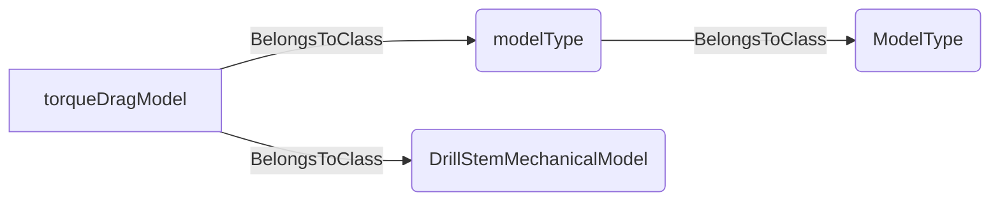
An example SparQL query looks like this:
```sparql
PREFIX rdf: <http://www.w3.org/1999/02/22-rdf-syntax-ns#>
PREFIX ddhub: <http://ddhub.no/>
PREFIX quantity: <http://ddhub.no/UnitAndQuantity>
SELECT ?modelTypeExample
WHERE {
	?modelType rdf:type ddhub:ModelType .
	?torqueDragModel rdf:type ddhub:DrillStemMechanicalModel .
	?torqueDragModel rdf:type ddhub:modelType .
}
```
This example assigns a model type to a torque and drag model.
## DeterministicModel <!-- NOUN -->
- Display name: DeterministicModel
- Parent class: [ModelType](./Model.md#ModelType)
- Description: 
A model whose outputs are fully determined by inputs and parameters without randomness.
- Definition set: Model
- Examples:
```dwis deterministicModel
DeterministicModel:detModel
DrillStemMechanicalModel:torqueDragModel
torqueDragModel BelongsToClass detModel
```
An example semantic graph looks like as follow:
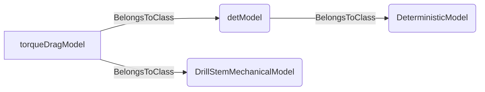
An example SparQL query looks like this:
```sparql
PREFIX rdf: <http://www.w3.org/1999/02/22-rdf-syntax-ns#>
PREFIX ddhub: <http://ddhub.no/>
PREFIX quantity: <http://ddhub.no/UnitAndQuantity>
SELECT ?deterministicModel
WHERE {
	?detModel rdf:type ddhub:DeterministicModel .
	?torqueDragModel rdf:type ddhub:DrillStemMechanicalModel .
	?torqueDragModel rdf:type ddhub:detModel .
}
```
This example marks a torque and drag model as deterministic.
## StochasticModel <!-- NOUN -->
- Display name: StochasticModel
- Parent class: [ModelType](./Model.md#ModelType)
- Description: 
A model that incorporates randomness or probabilistic components.
- Definition set: Model
- Examples:
```dwis stochasticModel
StochasticModel:stochModel
ModelType:modelType
stochModel BelongsToClass ModelType
```
An example semantic graph looks like as follow:
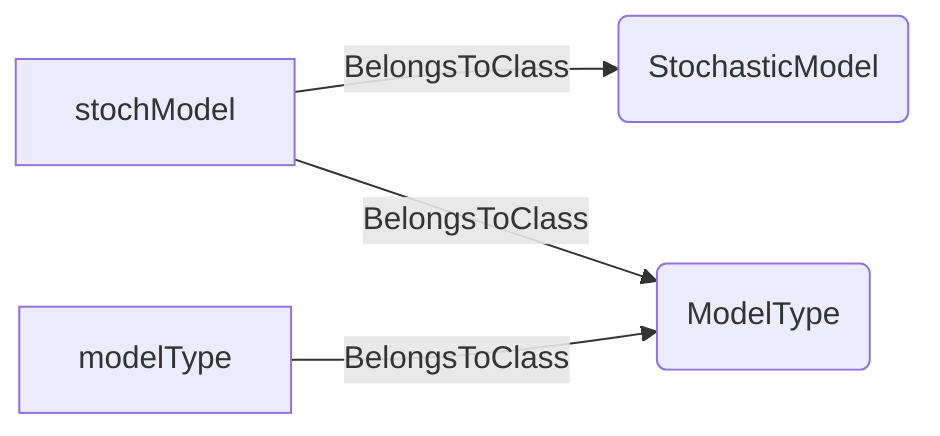
An example SparQL query looks like this:
```sparql
PREFIX rdf: <http://www.w3.org/1999/02/22-rdf-syntax-ns#>
PREFIX ddhub: <http://ddhub.no/>
PREFIX quantity: <http://ddhub.no/UnitAndQuantity>
SELECT ?stochasticModel
WHERE {
	?stochModel rdf:type ddhub:StochasticModel .
	?modelType rdf:type ddhub:ModelType .
	?stochModel rdf:type ddhub:ModelType .
}
```
This example defines a stochastic model classification.
## TemporalBehaviorModel <!-- NOUN -->
- Display name: Temporal Behavior Model
- Parent class: [DWISNoun](./DWISSemantics.md#DWISNoun)
- Description: 
A classification of a model as a function of its temporal behavior.
- Definition set: Model
- Examples:
```dwis temporalBehavior
TemporalBehaviorModel:temporalBehavior
ModelType:modelType
temporalBehavior BelongsToClass TemporalBehaviorModel
```
An example semantic graph looks like as follow:
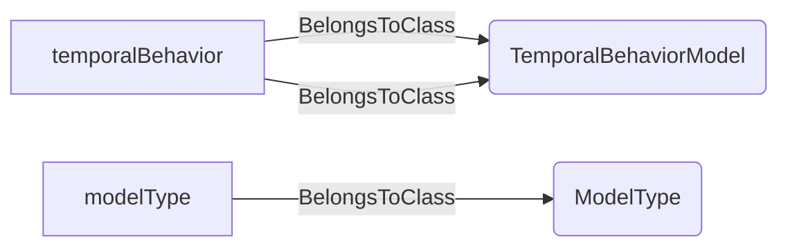
An example SparQL query looks like this:
```sparql
PREFIX rdf: <http://www.w3.org/1999/02/22-rdf-syntax-ns#>
PREFIX ddhub: <http://ddhub.no/>
PREFIX quantity: <http://ddhub.no/UnitAndQuantity>
SELECT ?temporalBehavior
WHERE {
	?temporalBehavior rdf:type ddhub:TemporalBehaviorModel .
	?modelType rdf:type ddhub:ModelType .
	?temporalBehavior rdf:type ddhub:TemporalBehaviorModel .
}
```
This example declares a temporal behavior classification.
## SteadyStateModel <!-- NOUN -->
- Display name: Steady state model
- Parent class: [TemporalBehaviorModel](./Model.md#TemporalBehaviorModel)
- Description: 
A model for which the state variables do not change with time.
- Definition set: Model
- Examples:
```dwis steadyStateModel
SteadyStateModel:steadyModel
DrillStemMechanicalModel:torqueDragModel
torqueDragModel BelongsToClass steadyModel
```
An example semantic graph looks like as follow:
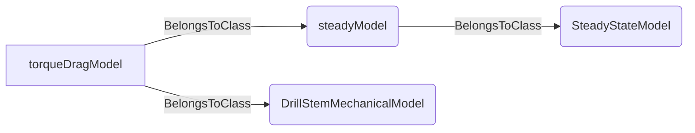
An example SparQL query looks like this:
```sparql
PREFIX rdf: <http://www.w3.org/1999/02/22-rdf-syntax-ns#>
PREFIX ddhub: <http://ddhub.no/>
PREFIX quantity: <http://ddhub.no/UnitAndQuantity>
SELECT ?steadyStateModel
WHERE {
	?steadyModel rdf:type ddhub:SteadyStateModel .
	?torqueDragModel rdf:type ddhub:DrillStemMechanicalModel .
	?torqueDragModel rdf:type ddhub:steadyModel .
}
```
This example tags a torque and drag model as steady-state.
## TransientModel <!-- NOUN -->
- Display name: Transient model
- Parent class: [TemporalBehaviorModel](./Model.md#TemporalBehaviorModel)
- Description: 
A model for which the state variables changes with time.
- Definition set: Model
- Examples:
```dwis transientModel
TransientModel:transientModel
HydraulicNetwork:downholeNetwork
transientModel BelongsToClass TransientModel
```
An example semantic graph looks like as follow:
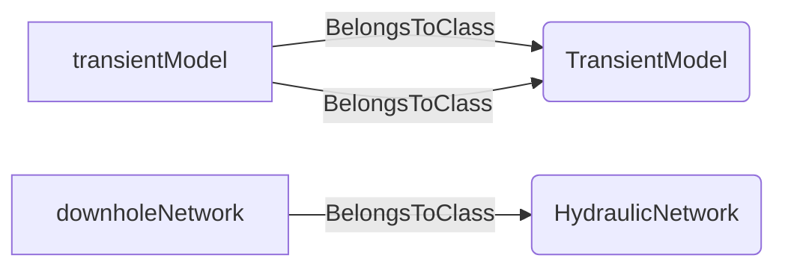
An example SparQL query looks like this:
```sparql
PREFIX rdf: <http://www.w3.org/1999/02/22-rdf-syntax-ns#>
PREFIX ddhub: <http://ddhub.no/>
PREFIX quantity: <http://ddhub.no/UnitAndQuantity>
SELECT ?transientModel
WHERE {
	?transientModel rdf:type ddhub:TransientModel .
	?downholeNetwork rdf:type ddhub:HydraulicNetwork .
	?transientModel rdf:type ddhub:TransientModel .
}
```
This example declares a transient hydraulic model.
## ModelingApproach <!-- NOUN -->
- Display name: Modeling Approach
- Parent class: [DWISNoun](./DWISSemantics.md#DWISNoun)
- Description: 
A classification of the modeling direction of a model.
- Definition set: Model
- Examples:
```dwis modellingApproach
ModelingApproach:approach
ModelType:modelType
approach BelongsToClass ModelingApproach
```
An example semantic graph looks like as follow:

An example SparQL query looks like this:
```sparql
PREFIX rdf: <http://www.w3.org/1999/02/22-rdf-syntax-ns#>
PREFIX ddhub: <http://ddhub.no/>
PREFIX quantity: <http://ddhub.no/UnitAndQuantity>
SELECT ?modellingApproach
WHERE {
	?approach rdf:type ddhub:ModelingApproach .
	?modelType rdf:type ddhub:ModelType .
	?approach rdf:type ddhub:ModelingApproach .
}
```
This example introduces a modeling approach classification.
## ForwardModel <!-- NOUN -->
- Display name: Forward Model
- Parent class: [ModelingApproach](./Model.md#ModelingApproach)
- Description: 
For a forward model, the inputs are used to predict outputs.
- Definition set: Model
- Examples:
```dwis forwardModel
ForwardModel:forwardModel
DeterministicModel:detModel
forwardModel BelongsToClass DeterministicModel
```
An example semantic graph looks like as follow:
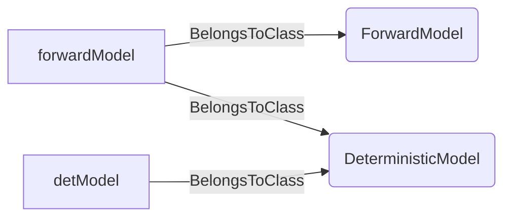
An example SparQL query looks like this:
```sparql
PREFIX rdf: <http://www.w3.org/1999/02/22-rdf-syntax-ns#>
PREFIX ddhub: <http://ddhub.no/>
PREFIX quantity: <http://ddhub.no/UnitAndQuantity>
SELECT ?forwardModel
WHERE {
	?forwardModel rdf:type ddhub:ForwardModel .
	?detModel rdf:type ddhub:DeterministicModel .
	?forwardModel rdf:type ddhub:DeterministicModel .
}
```
This example defines a forward deterministic model.
## InversionModel <!-- NOUN -->
- Display name: Inversion Model
- Parent class: [ModelingApproach](./Model.md#ModelingApproach)
- Description: 
For an inversion model, the outputs are used to infer inputs or parameters.
- Definition set: Model
- Examples:
```dwis inversionModel
InversionModel:inverseModel
StochasticModel:stochModel
inverseModel BelongsToClass StochasticModel
```
An example semantic graph looks like as follow:
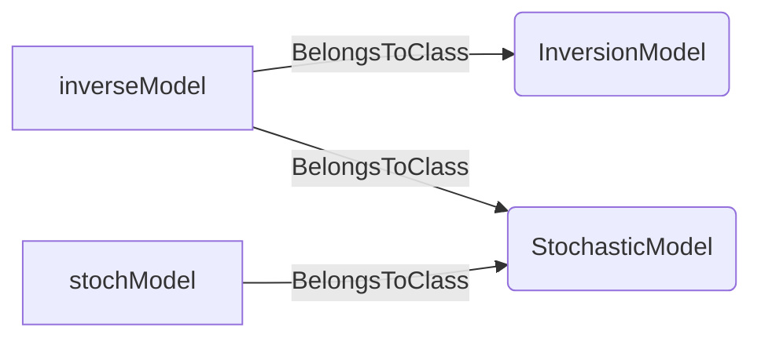
An example SparQL query looks like this:
```sparql
PREFIX rdf: <http://www.w3.org/1999/02/22-rdf-syntax-ns#>
PREFIX ddhub: <http://ddhub.no/>
PREFIX quantity: <http://ddhub.no/UnitAndQuantity>
SELECT ?inversionModel
WHERE {
	?inverseModel rdf:type ddhub:InversionModel .
	?stochModel rdf:type ddhub:StochasticModel .
	?inverseModel rdf:type ddhub:StochasticModel .
}
```
This example defines an inversion model classification.
## HybridAnalysisModel <!-- NOUN -->
- Display name: Hybrid Analysis Model
- Parent class: [ModelingApproach](./Model.md#ModelingApproach)
- Description: 
A hybrid analysis model may combine forward and inverse steps in an iterative approach.
- Definition set: Model
- Examples:
```dwis hybridModel
HybridAnalysisModel:hybridModel
ModelType:modelType
hybridModel BelongsToClass ModelType
```
An example semantic graph looks like as follow:
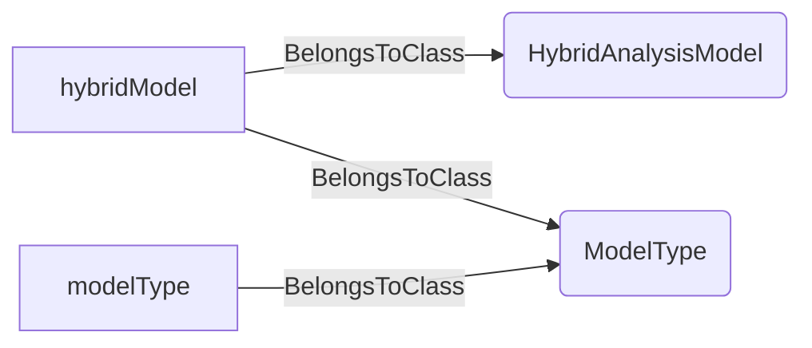
An example SparQL query looks like this:
```sparql
PREFIX rdf: <http://www.w3.org/1999/02/22-rdf-syntax-ns#>
PREFIX ddhub: <http://ddhub.no/>
PREFIX quantity: <http://ddhub.no/UnitAndQuantity>
SELECT ?hybridModel
WHERE {
	?hybridModel rdf:type ddhub:HybridAnalysisModel .
	?modelType rdf:type ddhub:ModelType .
	?hybridModel rdf:type ddhub:ModelType .
}
```
This example represents a hybrid analysis model.
## ModelingParadigm <!-- NOUN -->
- Display name: Modeling Paradigm
- Parent class: [DWISNoun](./DWISSemantics.md#DWISNoun)
- Description: 
A classification of the relationship of the model to data or physical laws.
- Definition set: Model
- Examples:
```dwis paradigm
ModelingParadigm:paradigm
ModelType:modelType
paradigm BelongsToClass ModelingParadigm
```
An example semantic graph looks like as follow:
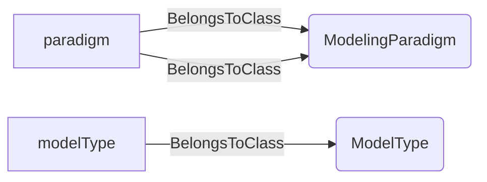
An example SparQL query looks like this:
```sparql
PREFIX rdf: <http://www.w3.org/1999/02/22-rdf-syntax-ns#>
PREFIX ddhub: <http://ddhub.no/>
PREFIX quantity: <http://ddhub.no/UnitAndQuantity>
SELECT ?paradigm
WHERE {
	?paradigm rdf:type ddhub:ModelingParadigm .
	?modelType rdf:type ddhub:ModelType .
	?paradigm rdf:type ddhub:ModelingParadigm .
}
```
This example introduces a modeling paradigm classification.
## EmpiricalModel <!-- NOUN -->
- Display name: Empirical Model
- Parent class: [ModelingParadigm](./Model.md#ModelingParadigm)
- Description: 
A model that heavily rely on data without using explicitly physical laws.
- Definition set: Model
- Examples:
```dwis empiricalModel
EmpiricalModel:empiricalModel
ModelType:modelType
empiricalModel BelongsToClass ModelType
```
An example semantic graph looks like as follow:
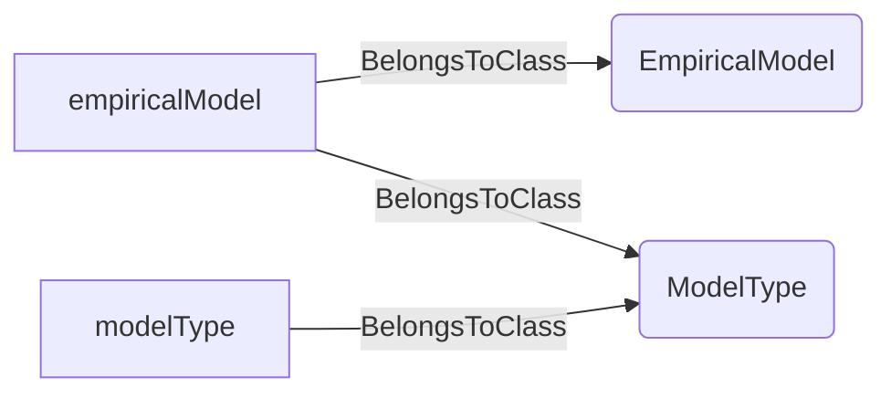
An example SparQL query looks like this:
```sparql
PREFIX rdf: <http://www.w3.org/1999/02/22-rdf-syntax-ns#>
PREFIX ddhub: <http://ddhub.no/>
PREFIX quantity: <http://ddhub.no/UnitAndQuantity>
SELECT ?empiricalModel
WHERE {
	?empiricalModel rdf:type ddhub:EmpiricalModel .
	?modelType rdf:type ddhub:ModelType .
	?empiricalModel rdf:type ddhub:ModelType .
}
```
This example defines an empirical model class.
## MechanisticModel <!-- NOUN -->
- Display name: Mechanistic Model
- Parent class: [ModelingParadigm](./Model.md#ModelingParadigm)
- Description: 
A model that is based on first principles or physical laws.
- Definition set: Model
- Examples:
```dwis mechanisticModel
MechanisticModel:mechanisticModel
ModelType:modelType
mechanisticModel BelongsToClass ModelType
```
An example semantic graph looks like as follow:
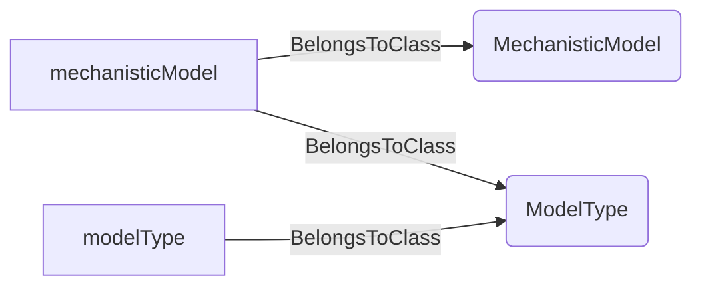
An example SparQL query looks like this:
```sparql
PREFIX rdf: <http://www.w3.org/1999/02/22-rdf-syntax-ns#>
PREFIX ddhub: <http://ddhub.no/>
PREFIX quantity: <http://ddhub.no/UnitAndQuantity>
SELECT ?mechanisticModel
WHERE {
	?mechanisticModel rdf:type ddhub:MechanisticModel .
	?modelType rdf:type ddhub:ModelType .
	?mechanisticModel rdf:type ddhub:ModelType .
}
```
This example defines a mechanistic model class.
## PhysicsInformedDataDrivenModel <!-- NOUN -->
- Display name: Physics Informed Data Driven Model
- Parent class: [ModelingParadigm](./Model.md#ModelingParadigm)
- Description: 
A hybrid model that uses both physical laws and data.
- Definition set: Model
- Examples:
```dwis pidddModel
PhysicsInformedDataDrivenModel:pidddModel
ModelType:modelType
pidddModel BelongsToClass ModelType
```
An example semantic graph looks like as follow:
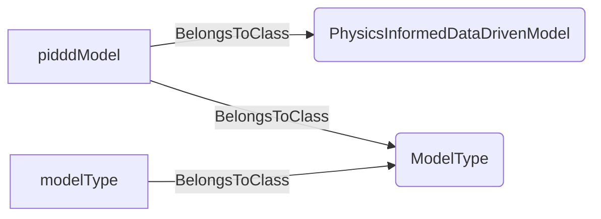
An example SparQL query looks like this:
```sparql
PREFIX rdf: <http://www.w3.org/1999/02/22-rdf-syntax-ns#>
PREFIX ddhub: <http://ddhub.no/>
PREFIX quantity: <http://ddhub.no/UnitAndQuantity>
SELECT ?pidddModel
WHERE {
	?pidddModel rdf:type ddhub:PhysicsInformedDataDrivenModel .
	?modelType rdf:type ddhub:ModelType .
	?pidddModel rdf:type ddhub:ModelType .
}
```
This example defines a physics-informed data-driven model.
## MathematicalFormulation <!-- NOUN -->
- Display name: Mathematical Formulation
- Parent class: [DWISNoun](./DWISSemantics.md#DWISNoun)
- Description: 
A classification of the mathematical formulation used by a model.
- Definition set: Model
- Examples:
```dwis formulation
MathematicalFormulation:formulation
ModelType:modelType
formulation BelongsToClass MathematicalFormulation
```
An example semantic graph looks like as follow:
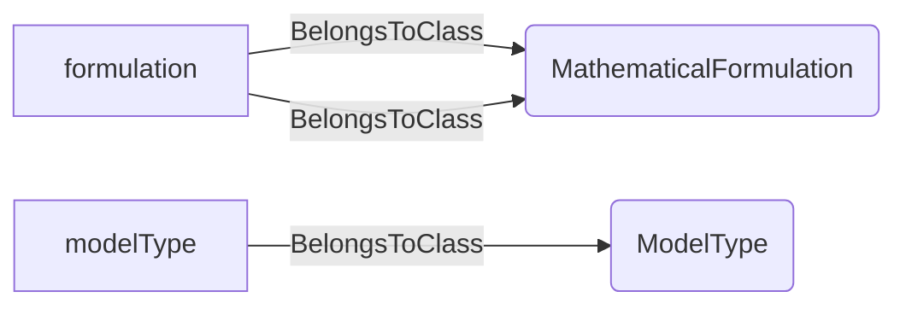
An example SparQL query looks like this:
```sparql
PREFIX rdf: <http://www.w3.org/1999/02/22-rdf-syntax-ns#>
PREFIX ddhub: <http://ddhub.no/>
PREFIX quantity: <http://ddhub.no/UnitAndQuantity>
SELECT ?formulation
WHERE {
	?formulation rdf:type ddhub:MathematicalFormulation .
	?modelType rdf:type ddhub:ModelType .
	?formulation rdf:type ddhub:MathematicalFormulation .
}
```
This example introduces a mathematical formulation classification.
## AlgebraicModel <!-- NOUN -->
- Display name: Algebraic Model
- Parent class: [MathematicalFormulation](./Model.md#MathematicalFormulation)
- Description: 
A model that uses algebraic equations.
- Definition set: Model
- Examples:
```dwis algebraicModel
AlgebraicModel:algebraicModel
ModelType:modelType
algebraicModel BelongsToClass ModelType
```
An example semantic graph looks like as follow:

An example SparQL query looks like this:
```sparql
PREFIX rdf: <http://www.w3.org/1999/02/22-rdf-syntax-ns#>
PREFIX ddhub: <http://ddhub.no/>
PREFIX quantity: <http://ddhub.no/UnitAndQuantity>
SELECT ?algebraicModel
WHERE {
	?algebraicModel rdf:type ddhub:AlgebraicModel .
	?modelType rdf:type ddhub:ModelType .
	?algebraicModel rdf:type ddhub:ModelType .
}
```
This example defines an algebraic model class.
## OrdinaryDifferentialEquationModel <!-- NOUN -->
- Display name: Ordinary Differential Equation Model
- Parent class: [MathematicalFormulation](./Model.md#MathematicalFormulation)
- Description: 
A model that uses ordinary differential equations.
- Definition set: Model
- Examples:
```dwis odeModel
OrdinaryDifferentialEquationModel:odeModel
ModelType:modelType
odeModel BelongsToClass ModelType
```
An example semantic graph looks like as follow:
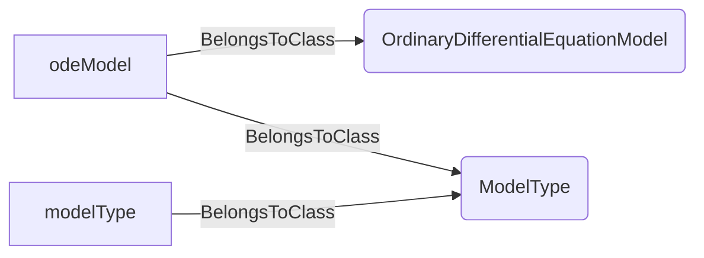
An example SparQL query looks like this:
```sparql
PREFIX rdf: <http://www.w3.org/1999/02/22-rdf-syntax-ns#>
PREFIX ddhub: <http://ddhub.no/>
PREFIX quantity: <http://ddhub.no/UnitAndQuantity>
SELECT ?odeModel
WHERE {
	?odeModel rdf:type ddhub:OrdinaryDifferentialEquationModel .
	?modelType rdf:type ddhub:ModelType .
	?odeModel rdf:type ddhub:ModelType .
}
```
This example defines an ODE-based model.
## PartialDifferentialEquationModel <!-- NOUN -->
- Display name: Partial Differential Equation Model
- Parent class: [MathematicalFormulation](./Model.md#MathematicalFormulation)
- Description: 
A model that uses partial differential equations.
- Definition set: Model
- Examples:
```dwis pdeModel
PartialDifferentialEquationModel:pdeModel
ModelType:modelType
pdeModel BelongsToClass ModelType
```
An example semantic graph looks like as follow:
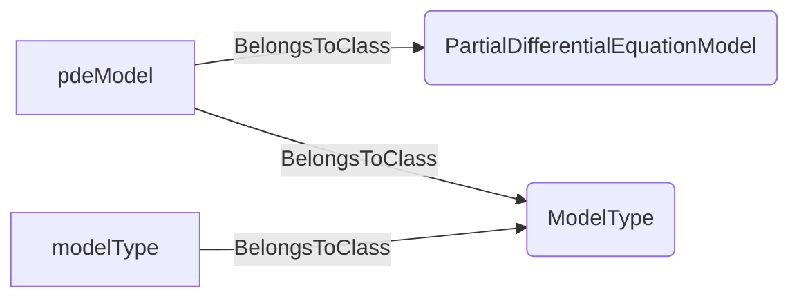
An example SparQL query looks like this:
```sparql
PREFIX rdf: <http://www.w3.org/1999/02/22-rdf-syntax-ns#>
PREFIX ddhub: <http://ddhub.no/>
PREFIX quantity: <http://ddhub.no/UnitAndQuantity>
SELECT ?pdeModel
WHERE {
	?pdeModel rdf:type ddhub:PartialDifferentialEquationModel .
	?modelType rdf:type ddhub:ModelType .
	?pdeModel rdf:type ddhub:ModelType .
}
```
This example defines a PDE-based model.
## IntegralModel <!-- NOUN -->
- Display name: Integral Model
- Parent class: [MathematicalFormulation](./Model.md#MathematicalFormulation)
- Description: 
A model that uses integral equations.
- Definition set: Model
- Examples:
```dwis integralModel
IntegralModel:integralModel
ModelType:modelType
integralModel BelongsToClass ModelType
```
An example semantic graph looks like as follow:
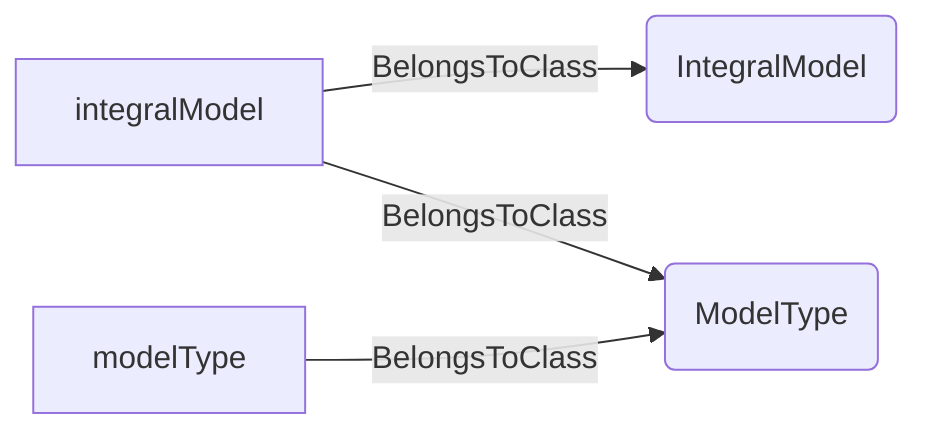
An example SparQL query looks like this:
```sparql
PREFIX rdf: <http://www.w3.org/1999/02/22-rdf-syntax-ns#>
PREFIX ddhub: <http://ddhub.no/>
PREFIX quantity: <http://ddhub.no/UnitAndQuantity>
SELECT ?integralModel
WHERE {
	?integralModel rdf:type ddhub:IntegralModel .
	?modelType rdf:type ddhub:ModelType .
	?integralModel rdf:type ddhub:ModelType .
}
```
This example defines an integral equation model.
## ModelingObjective <!-- NOUN -->
- Display name: Modeling Objective
- Parent class: [DWISNoun](./DWISSemantics.md#DWISNoun)
- Description: 
A classification of the objective/purpose of a model.
- Definition set: Model
- Examples:
```dwis modellingObjective
ModelingObjective:objective
ModelType:modelType
objective BelongsToClass ModelingObjective
```
An example semantic graph looks like as follow:
```mermaid
graph LR
	N0000[objective] -->|BelongsToClass| N0001(ModelingObjective) 
	N0002[modelType] -->|BelongsToClass| N0003(ModelType) 
	N0000[objective] -->|BelongsToClass| N0001(ModelingObjective) 
```
An example SparQL query looks like this:
```sparql
PREFIX rdf: <http://www.w3.org/1999/02/22-rdf-syntax-ns#>
PREFIX ddhub: <http://ddhub.no/>
PREFIX quantity: <http://ddhub.no/UnitAndQuantity>
SELECT ?modellingObjective
WHERE {
	?objective rdf:type ddhub:ModelingObjective .
	?modelType rdf:type ddhub:ModelType .
	?objective rdf:type ddhub:ModelingObjective .
}
```
This example introduces a modeling objective classification.
## PredictiveModel <!-- NOUN -->
- Display name: Predictive Model
- Parent class: [ModelingObjective](./Model.md#ModelingObjective)
- Description: 
A model that aims to forecast future behavior based on current data or conditions.
- Definition set: Model
- Examples:
```dwis predictiveModel
PredictiveModel:predictiveModel
ModelType:modelType
predictiveModel BelongsToClass ModelType
```
An example semantic graph looks like as follow:
```mermaid
graph LR
	N0000[predictiveModel] -->|BelongsToClass| N0001(PredictiveModel) 
	N0002[modelType] -->|BelongsToClass| N0003(ModelType) 
	N0000[predictiveModel] -->|BelongsToClass| N0003(ModelType) 
```
An example SparQL query looks like this:
```sparql
PREFIX rdf: <http://www.w3.org/1999/02/22-rdf-syntax-ns#>
PREFIX ddhub: <http://ddhub.no/>
PREFIX quantity: <http://ddhub.no/UnitAndQuantity>
SELECT ?predictiveModel
WHERE {
	?predictiveModel rdf:type ddhub:PredictiveModel .
	?modelType rdf:type ddhub:ModelType .
	?predictiveModel rdf:type ddhub:ModelType .
}
```
This example defines a predictive model class.
## DescriptiveModel <!-- NOUN -->
- Display name: Descriptive Model
- Parent class: [ModelingObjective](./Model.md#ModelingObjective)
- Description: 
A model that seeks to explain or describe a system's behavior or underlying mechanisms.
- Definition set: Model
- Examples:
```dwis descriptiveModel
DescriptiveModel:descriptiveModel
ModelType:modelType
descriptiveModel BelongsToClass ModelType
```
An example semantic graph looks like as follow:
```mermaid
graph LR
	N0000[descriptiveModel] -->|BelongsToClass| N0001(DescriptiveModel) 
	N0002[modelType] -->|BelongsToClass| N0003(ModelType) 
	N0000[descriptiveModel] -->|BelongsToClass| N0003(ModelType) 
```
An example SparQL query looks like this:
```sparql
PREFIX rdf: <http://www.w3.org/1999/02/22-rdf-syntax-ns#>
PREFIX ddhub: <http://ddhub.no/>
PREFIX quantity: <http://ddhub.no/UnitAndQuantity>
SELECT ?descriptiveModel
WHERE {
	?descriptiveModel rdf:type ddhub:DescriptiveModel .
	?modelType rdf:type ddhub:ModelType .
	?descriptiveModel rdf:type ddhub:ModelType .
}
```
This example defines a descriptive model class.
## CalibrationModel <!-- NOUN -->
- Display name: Calibration Model
- Parent class: [ModelingObjective](./Model.md#ModelingObjective)
- Description: 
A model that focuses on adjusting parameters to improve alignment with observed data.
- Definition set: Model
- Examples:
```dwis calibrationModel
CalibrationModel:calibrationModel
ModelType:modelType
calibrationModel BelongsToClass ModelType
```
An example semantic graph looks like as follow:
```mermaid
graph LR
	N0000[calibrationModel] -->|BelongsToClass| N0001(CalibrationModel) 
	N0002[modelType] -->|BelongsToClass| N0003(ModelType) 
	N0000[calibrationModel] -->|BelongsToClass| N0003(ModelType) 
```
An example SparQL query looks like this:
```sparql
PREFIX rdf: <http://www.w3.org/1999/02/22-rdf-syntax-ns#>
PREFIX ddhub: <http://ddhub.no/>
PREFIX quantity: <http://ddhub.no/UnitAndQuantity>
SELECT ?calibrationModel
WHERE {
	?calibrationModel rdf:type ddhub:CalibrationModel .
	?modelType rdf:type ddhub:ModelType .
	?calibrationModel rdf:type ddhub:ModelType .
}
```
This example defines a calibration model class.
## ControlModel <!-- NOUN -->
- Display name: Control Model
- Parent class: [ModelingObjective](./Model.md#ModelingObjective)
- Description: 
A model that regulate or steer a system's behavior toward a desired outcome through inputs.
- Definition set: Model
- Examples:
```dwis controlModel
ControlModel:controlModel
ModelType:modelType
controlModel BelongsToClass ModelType
```
An example semantic graph looks like as follow:
```mermaid
graph LR
	N0000[controlModel] -->|BelongsToClass| N0001(ControlModel) 
	N0002[modelType] -->|BelongsToClass| N0003(ModelType) 
	N0000[controlModel] -->|BelongsToClass| N0003(ModelType) 
```
An example SparQL query looks like this:
```sparql
PREFIX rdf: <http://www.w3.org/1999/02/22-rdf-syntax-ns#>
PREFIX ddhub: <http://ddhub.no/>
PREFIX quantity: <http://ddhub.no/UnitAndQuantity>
SELECT ?controlModel
WHERE {
	?controlModel rdf:type ddhub:ControlModel .
	?modelType rdf:type ddhub:ModelType .
	?controlModel rdf:type ddhub:ModelType .
}
```
This example defines a control model class.
## ModelScope <!-- NOUN -->
- Display name: Model Scope
- Parent class: [DWISNoun](./DWISSemantics.md#DWISNoun)
- Description: 
A classification of a model with regards to its range of applicability.
- Definition set: Model
- Examples:
```dwis modelScope
ModelScope:modelScope
ModelType:modelType
modelScope BelongsToClass ModelScope
```
An example semantic graph looks like as follow:
```mermaid
graph LR
	N0000[modelScope] -->|BelongsToClass| N0001(ModelScope) 
	N0002[modelType] -->|BelongsToClass| N0003(ModelType) 
	N0000[modelScope] -->|BelongsToClass| N0001(ModelScope) 
```
An example SparQL query looks like this:
```sparql
PREFIX rdf: <http://www.w3.org/1999/02/22-rdf-syntax-ns#>
PREFIX ddhub: <http://ddhub.no/>
PREFIX quantity: <http://ddhub.no/UnitAndQuantity>
SELECT ?modelScope
WHERE {
	?modelScope rdf:type ddhub:ModelScope .
	?modelType rdf:type ddhub:ModelType .
	?modelScope rdf:type ddhub:ModelScope .
}
```
This example introduces a model scope classification.
## GeneralModel <!-- NOUN -->
- Display name: General Model
- Parent class: [ModelScope](./Model.md#ModelScope)
- Description: 
A model with a broad range of application across various systems or phenomena.
- Definition set: Model
- Examples:
```dwis generalModel
GeneralModel:generalModel
ModelType:modelType
generalModel BelongsToClass ModelType
```
An example semantic graph looks like as follow:
```mermaid
graph LR
	N0000[generalModel] -->|BelongsToClass| N0001(GeneralModel) 
	N0002[modelType] -->|BelongsToClass| N0003(ModelType) 
	N0000[generalModel] -->|BelongsToClass| N0003(ModelType) 
```
An example SparQL query looks like this:
```sparql
PREFIX rdf: <http://www.w3.org/1999/02/22-rdf-syntax-ns#>
PREFIX ddhub: <http://ddhub.no/>
PREFIX quantity: <http://ddhub.no/UnitAndQuantity>
SELECT ?generalModel
WHERE {
	?generalModel rdf:type ddhub:GeneralModel .
	?modelType rdf:type ddhub:ModelType .
	?generalModel rdf:type ddhub:ModelType .
}
```
This example defines a general model class.
## SpecializedModel <!-- NOUN -->
- Display name: Specialized Model
- Parent class: [ModelScope](./Model.md#ModelScope)
- Description: 
A model that is tailored to specific systems, scenarios or conditions.
- Definition set: Model
- Examples:
```dwis specializedModel
SpecializedModel:specializedModel
ModelType:modelType
specializedModel BelongsToClass ModelType
```
An example semantic graph looks like as follow:
```mermaid
graph LR
	N0000[specializedModel] -->|BelongsToClass| N0001(SpecializedModel) 
	N0002[modelType] -->|BelongsToClass| N0003(ModelType) 
	N0000[specializedModel] -->|BelongsToClass| N0003(ModelType) 
```
An example SparQL query looks like this:
```sparql
PREFIX rdf: <http://www.w3.org/1999/02/22-rdf-syntax-ns#>
PREFIX ddhub: <http://ddhub.no/>
PREFIX quantity: <http://ddhub.no/UnitAndQuantity>
SELECT ?specializedModel
WHERE {
	?specializedModel rdf:type ddhub:SpecializedModel .
	?modelType rdf:type ddhub:ModelType .
	?specializedModel rdf:type ddhub:ModelType .
}
```
This example defines a specialized model class.
## ModelTransparency <!-- NOUN -->
- Display name: Model Transparency
- Parent class: [DWISNoun](./DWISSemantics.md#DWISNoun)
- Description: 
A classification of a model with regards to its transparency or interpretability.
- Definition set: Model
- Examples:
```dwis transparency
ModelTransparency:transparency
ModelType:modelType
transparency BelongsToClass ModelTransparency
```
An example semantic graph looks like as follow:
```mermaid
graph LR
	N0000[transparency] -->|BelongsToClass| N0001(ModelTransparency) 
	N0002[modelType] -->|BelongsToClass| N0003(ModelType) 
	N0000[transparency] -->|BelongsToClass| N0001(ModelTransparency) 
```
An example SparQL query looks like this:
```sparql
PREFIX rdf: <http://www.w3.org/1999/02/22-rdf-syntax-ns#>
PREFIX ddhub: <http://ddhub.no/>
PREFIX quantity: <http://ddhub.no/UnitAndQuantity>
SELECT ?transparency
WHERE {
	?transparency rdf:type ddhub:ModelTransparency .
	?modelType rdf:type ddhub:ModelType .
	?transparency rdf:type ddhub:ModelTransparency .
}
```
This example introduces model transparency classification.
## BlackBoxModel <!-- NOUN -->
- Display name: Black Box Model
- Parent class: [ModelTransparency](./Model.md#ModelTransparency)
- Description: 
The internal workings of the model are unknown or not interpretable, focusing only on the input-output relationship.
- Definition set: Model
- Examples:
```dwis blackBox
BlackBoxModel:blackBoxModel
ModelType:modelType
blackBoxModel BelongsToClass ModelType
```
An example semantic graph looks like as follow:
```mermaid
graph LR
	N0000[blackBoxModel] -->|BelongsToClass| N0001(BlackBoxModel) 
	N0002[modelType] -->|BelongsToClass| N0003(ModelType) 
	N0000[blackBoxModel] -->|BelongsToClass| N0003(ModelType) 
```
An example SparQL query looks like this:
```sparql
PREFIX rdf: <http://www.w3.org/1999/02/22-rdf-syntax-ns#>
PREFIX ddhub: <http://ddhub.no/>
PREFIX quantity: <http://ddhub.no/UnitAndQuantity>
SELECT ?blackBox
WHERE {
	?blackBoxModel rdf:type ddhub:BlackBoxModel .
	?modelType rdf:type ddhub:ModelType .
	?blackBoxModel rdf:type ddhub:ModelType .
}
```
This example defines a black-box model class.
## GrayBoxModel <!-- NOUN -->
- Display name: Gray Box Model
- Parent class: [ModelTransparency](./Model.md#ModelTransparency)
- Description: 
The model combines both data-drive and mechanistic models offering a partial transparency.
- Definition set: Model
- Examples:
```dwis grayBox
GrayBoxModel:grayBoxModel
ModelType:modelType
grayBoxModel BelongsToClass ModelType
```
An example semantic graph looks like as follow:
```mermaid
graph LR
	N0000[grayBoxModel] -->|BelongsToClass| N0001(GrayBoxModel) 
	N0002[modelType] -->|BelongsToClass| N0003(ModelType) 
	N0000[grayBoxModel] -->|BelongsToClass| N0003(ModelType) 
```
An example SparQL query looks like this:
```sparql
PREFIX rdf: <http://www.w3.org/1999/02/22-rdf-syntax-ns#>
PREFIX ddhub: <http://ddhub.no/>
PREFIX quantity: <http://ddhub.no/UnitAndQuantity>
SELECT ?grayBox
WHERE {
	?grayBoxModel rdf:type ddhub:GrayBoxModel .
	?modelType rdf:type ddhub:ModelType .
	?grayBoxModel rdf:type ddhub:ModelType .
}
```
This example defines a gray-box model class.
## WhiteBoxModel <!-- NOUN -->
- Display name: White Box Model
- Parent class: [ModelTransparency](./Model.md#ModelTransparency)
- Description: 
The model is fully transparent and interpretable, with all internal mechanisms and assumptions clearly defined.
- Definition set: Model
- Examples:
```dwis whiteBox
WhiteBoxModel:whiteBoxModel
ModelType:modelType
whiteBoxModel BelongsToClass ModelType
```
An example semantic graph looks like as follow:
```mermaid
graph LR
	N0000[whiteBoxModel] -->|BelongsToClass| N0001(WhiteBoxModel) 
	N0002[modelType] -->|BelongsToClass| N0003(ModelType) 
	N0000[whiteBoxModel] -->|BelongsToClass| N0003(ModelType) 
```
An example SparQL query looks like this:
```sparql
PREFIX rdf: <http://www.w3.org/1999/02/22-rdf-syntax-ns#>
PREFIX ddhub: <http://ddhub.no/>
PREFIX quantity: <http://ddhub.no/UnitAndQuantity>
SELECT ?whiteBox
WHERE {
	?whiteBoxModel rdf:type ddhub:WhiteBoxModel .
	?modelType rdf:type ddhub:ModelType .
	?whiteBoxModel rdf:type ddhub:ModelType .
}
```
This example defines a white-box model class.
## DataIntegrationStrategy <!-- NOUN -->
- Display name: Data Integration Strategy
- Parent class: [DWISNoun](./DWISSemantics.md#DWISNoun)
- Description: 
A classification of a model with regards to its strategy for integrating data.
- Definition set: Model
- Examples:
```dwis integrationStrategy
DataIntegrationStrategy:integrationStrategy
ModelType:modelType
integrationStrategy BelongsToClass DataIntegrationStrategy
```
An example semantic graph looks like as follow:
```mermaid
graph LR
	N0000[integrationStrategy] -->|BelongsToClass| N0001(DataIntegrationStrategy) 
	N0002[modelType] -->|BelongsToClass| N0003(ModelType) 
	N0000[integrationStrategy] -->|BelongsToClass| N0001(DataIntegrationStrategy) 
```
An example SparQL query looks like this:
```sparql
PREFIX rdf: <http://www.w3.org/1999/02/22-rdf-syntax-ns#>
PREFIX ddhub: <http://ddhub.no/>
PREFIX quantity: <http://ddhub.no/UnitAndQuantity>
SELECT ?integrationStrategy
WHERE {
	?integrationStrategy rdf:type ddhub:DataIntegrationStrategy .
	?modelType rdf:type ddhub:ModelType .
	?integrationStrategy rdf:type ddhub:DataIntegrationStrategy .
}
```
This example introduces a data integration strategy classification.
## DataLevelIntegationModel <!-- NOUN -->
- Display name: Data Level Integation Model
- Parent class: [DataIntegrationStrategy](./Model.md#DataIntegrationStrategy)
- Description: 
A model that integrates data at a low-level like direct merging, using data transforms or filtering.
- Definition set: Model
- Examples:
```dwis dataLevelIntegration
DataLevelIntegationModel:dataLevelIntegration
ModelType:modelType
dataLevelIntegration BelongsToClass ModelType
```
An example semantic graph looks like as follow:
```mermaid
graph LR
	N0000[dataLevelIntegration] -->|BelongsToClass| N0001(DataLevelIntegationModel) 
	N0002[modelType] -->|BelongsToClass| N0003(ModelType) 
	N0000[dataLevelIntegration] -->|BelongsToClass| N0003(ModelType) 
```
An example SparQL query looks like this:
```sparql
PREFIX rdf: <http://www.w3.org/1999/02/22-rdf-syntax-ns#>
PREFIX ddhub: <http://ddhub.no/>
PREFIX quantity: <http://ddhub.no/UnitAndQuantity>
SELECT ?dataLevelIntegration
WHERE {
	?dataLevelIntegration rdf:type ddhub:DataLevelIntegationModel .
	?modelType rdf:type ddhub:ModelType .
	?dataLevelIntegration rdf:type ddhub:ModelType .
}
```
This example defines a data-level integration model.
## FeatureLevelIntegationModel <!-- NOUN -->
- Display name: Data Level Integation Model
- Parent class: [DataIntegrationStrategy](./Model.md#DataIntegrationStrategy)
- Description: 
A model that integrates data at a medium-level like using feature extraction and merging, reducing dimensionality,
weighting features, or correlating features.
- Definition set: Model
- Examples:
```dwis featureLevelIntegration
FeatureLevelIntegationModel:featureLevelIntegration
ModelType:modelType
featureLevelIntegration BelongsToClass ModelType
```
An example semantic graph looks like as follow:
```mermaid
graph LR
	N0000[featureLevelIntegration] -->|BelongsToClass| N0001(FeatureLevelIntegationModel) 
	N0002[modelType] -->|BelongsToClass| N0003(ModelType) 
	N0000[featureLevelIntegration] -->|BelongsToClass| N0003(ModelType) 
```
An example SparQL query looks like this:
```sparql
PREFIX rdf: <http://www.w3.org/1999/02/22-rdf-syntax-ns#>
PREFIX ddhub: <http://ddhub.no/>
PREFIX quantity: <http://ddhub.no/UnitAndQuantity>
SELECT ?featureLevelIntegration
WHERE {
	?featureLevelIntegration rdf:type ddhub:FeatureLevelIntegationModel .
	?modelType rdf:type ddhub:ModelType .
	?featureLevelIntegration rdf:type ddhub:ModelType .
}
```
This example defines a feature-level integration model.
## DecisionLevelIntegationModel <!-- NOUN -->
- Display name: Data Level Integation Model
- Parent class: [DataIntegrationStrategy](./Model.md#DataIntegrationStrategy)
- Description: 
A model that integrates data at a high-level like using majority voting, ensemble methods, Bayesian decision fusion,
Dempster-Shafer theory.
- Definition set: Model
- Examples:
```dwis decisionLevelIntegration
DecisionLevelIntegationModel:decisionLevelIntegration
ModelType:modelType
decisionLevelIntegration BelongsToClass ModelType
```
An example semantic graph looks like as follow:
```mermaid
graph LR
	N0000[decisionLevelIntegration] -->|BelongsToClass| N0001(DecisionLevelIntegationModel) 
	N0002[modelType] -->|BelongsToClass| N0003(ModelType) 
	N0000[decisionLevelIntegration] -->|BelongsToClass| N0003(ModelType) 
```
An example SparQL query looks like this:
```sparql
PREFIX rdf: <http://www.w3.org/1999/02/22-rdf-syntax-ns#>
PREFIX ddhub: <http://ddhub.no/>
PREFIX quantity: <http://ddhub.no/UnitAndQuantity>
SELECT ?decisionLevelIntegration
WHERE {
	?decisionLevelIntegration rdf:type ddhub:DecisionLevelIntegationModel .
	?modelType rdf:type ddhub:ModelType .
	?decisionLevelIntegration rdf:type ddhub:ModelType .
}
```
This example defines a decision-level integration model.
## ModelledDegreeOfFreedom <!-- NOUN -->
- Display name: Modelled degree of freedom
- Parent class: [DWISNoun](./DWISSemantics.md#DWISNoun)
- Description: 
In physics and chemistry, a degree of freedom is an independent physical parameter in the formal description of the state of a physical system. A model may account for some or all of the degrees of freedom of the physical system.
- Definition set: Model
- Examples:
Axial, rotational...
## AxialModelling <!-- NOUN -->
- Display name: Axial modelling
- Parent class: [ModelledDegreeOfFreedom](./Model.md#ModelledDegreeOfFreedom)
- Description: 
The model accounts for the axial movement of some parts of the physical system.
- Definition set: Model
- Examples:
A hydraulic model accounts for the axial velocity of fluid inside a pipe or an annulus. A torque and drag model accounts for the axial displacement of a drill-stem.
## RotationalModelling <!-- NOUN -->
- Display name: Rotational modelling
- Parent class: [ModelledDegreeOfFreedom](./Model.md#ModelledDegreeOfFreedom)
- Description: 
The model accounts for the rotational movement of some parts of the physical system.
- Definition set: Model
- Examples:
A hydraulic model accounts for the effect of pipe rotation on the fluid velocity in an annulus. A torque and drag model accounts for the rotational movement of a drill-stem.
## LateralModelling <!-- NOUN -->
- Display name: Lateral modelling
- Parent class: [ModelledDegreeOfFreedom](./Model.md#ModelledDegreeOfFreedom)
- Description: 
The model accounts for the lateral movement of some parts of the physical system.
- Definition set: Model
- Examples:
A hydraulic model accounts for the effect of the lateral pipe displacement on the fluid velocity in an annulus. A torque and drag model accounts for the lateral  movement of a drill-stem.
## RadialModelling <!-- NOUN -->
- Display name: Radial modelling
- Parent class: [LateralModelling](./Model.md#LateralModelling)
- Description: 
The model accounts for the radial movement of some parts of the physical system.
- Definition set: Model
- Examples:
A hydraulic model accounts for the effect of the radial pipe displacement on the fluid velocity in an annulus. A torque and drag model accounts for the radial  movement of a drill-stem.
## AngularLateralModelling <!-- NOUN -->
- Display name: Angular lateral modelling
- Parent class: [LateralModelling](./Model.md#LateralModelling)
- Description: 
The model accounts for the angular lateral movement of some parts of the physical system.
- Definition set: Model
- Examples:
A hydraulic model accounts for the effect of the pipe wobbling on the fluid velocity in an annulus. A torque and drag model accounts for the wobbling of a drill-stem.
## TangentialModelling <!-- NOUN -->
- Display name: Tangential modelling
- Parent class: [LateralModelling](./Model.md#LateralModelling)
- Description: 
The model accounts for the change of tangential direction of some parts of the physical system.
- Definition set: Model
- Examples:
A hydraulic model accounts for the effect of the pipe ondulation on the fluid velocity in an annulus. A torque and drag model accounts for the ondulation of a drill-stem.
## VerticalOndulationModelling <!-- NOUN -->
- Display name: Vertical ondulation modelling
- Parent class: [TangentialModelling](./Model.md#TangentialModelling)
- Description: 
The model accounts for the change of inclination of some parts of the physical system.
- Definition set: Model
- Examples:
A hydraulic model accounts for the effect of the pipe vertical ondulation on the fluid velocity in an annulus. A torque and drag model accounts for the vertical ondulation of a drill-stem.
## HorizontalOndulationModelling <!-- NOUN -->
- Display name: Horizontal ondulation modelling
- Parent class: [TangentialModelling](./Model.md#TangentialModelling)
- Description: 
The model accounts for the change of azimuth of some parts of the physical system.
- Definition set: Model
- Examples:
A hydraulic model accounts for the effect of the pipe horizontal ondulation on the fluid velocity in an annulus. A torque and drag model accounts for the horizontal ondulation of a drill-stem.
## ModellingDimensions <!-- NOUN -->
- Display name: Modelling dimensions
- Parent class: [DWISNoun](./DWISSemantics.md#DWISNoun)
- Description: 
The number of dimensions that are accounted by the model
- Definition set: Model
- Examples:
```dwis modellingDimensions
DrillingDataPoint:modellingDimensions
modellingDimensions BelongsToClass ModellingDimensions
```
An example semantic graph looks like as follow:
```mermaid
graph LR
	N0000[modellingDimensions] -->|BelongsToClass| N0001(DrillingDataPoint) 
	N0000[modellingDimensions] -->|BelongsToClass| N0002(ModellingDimensions) 
```
An example SparQL query looks like this:
```sparql
PREFIX rdf: <http://www.w3.org/1999/02/22-rdf-syntax-ns#>
PREFIX ddhub: <http://ddhub.no/>
PREFIX quantity: <http://ddhub.no/UnitAndQuantity>
SELECT ?modellingDimensions
WHERE {
	?modellingDimensions rdf:type ddhub:DrillingDataPoint .
	?modellingDimensions rdf:type ddhub:ModellingDimensions .
}
```
This example links a drilling data point to the ModellingDimensions definition.
## OneDModelling <!-- NOUN -->
- Display name: 1D modelling
- Parent class: [ModellingDimensions](./Model.md#ModellingDimensions)
- Description: 
The model only accounts for one dimension
- Definition set: Model
- Examples:
A hydraulic model only considers the axial direction for the flow in a pipe and in an annulus.
## TwoDModelling <!-- NOUN -->
- Display name: 2D modelling
- Parent class: [ModellingDimensions](./Model.md#ModellingDimensions)
- Description: 
The model only accounts for two dimensions
- Definition set: Model
- Examples:
A hydraulic calculation considers the fluid velocity field in a cross-section but does not consider the axial direction. A heat transfer model considers the radial and axial heat transfer but assumes complete angular symmetry.
## ThreeDModelling <!-- NOUN -->
- Display name: 3D modelling
- Parent class: [ModellingDimensions](./Model.md#ModellingDimensions)
- Description: 
The model only accounts for three dimensions
- Definition set: Model
- Examples:
A hydraulic calculation considers the fluid velocity field in a cross-section and in the axial direction. A heat transfer model considers the radial, angular and axial heat transfer.
## ModellingDiscretization <!-- NOUN -->
- Display name: Modelling discretization
- Parent class: [DWISNoun](./DWISSemantics.md#DWISNoun)
- Description: 
A characteristic of the discretization made by the model.
- Definition set: Model
- Examples:
```dwis modellingDiscretization
DrillingDataPoint:modellingDiscretization
modellingDiscretization BelongsToClass ModellingDiscretization
```
An example semantic graph looks like as follow:
```mermaid
graph LR
	N0000[modellingDiscretization] -->|BelongsToClass| N0001(DrillingDataPoint) 
	N0000[modellingDiscretization] -->|BelongsToClass| N0002(ModellingDiscretization) 
```
An example SparQL query looks like this:
```sparql
PREFIX rdf: <http://www.w3.org/1999/02/22-rdf-syntax-ns#>
PREFIX ddhub: <http://ddhub.no/>
PREFIX quantity: <http://ddhub.no/UnitAndQuantity>
SELECT ?modellingDiscretization
WHERE {
	?modellingDiscretization rdf:type ddhub:DrillingDataPoint .
	?modellingDiscretization rdf:type ddhub:ModellingDiscretization .
}
```
This example links a drilling data point to the ModellingDiscretization definition.
## BoundaryDiscretization <!-- NOUN -->
- Display name: Boundary discretization
- Parent class: [ModellingDiscretization](./Model.md#ModellingDiscretization)
- Description: 
A model only considers the bounds of the physical system and does not apply any intermediate discretization.
- Definition set: Model
- Examples:
The Kaasa model (https://doi.org/10.2118/143097-PA) is an example of hydraulic model that only accounts for the boundaries and does not utilize any intermediate discretization.
## StrainWaveBasedDiscretization <!-- NOUN -->
- Display name: Strain-wave based discretization
- Parent class: [ModellingDiscretization](./Model.md#ModellingDiscretization)
- Description: 
A model can properly estimate values at the level of strain wave propagation.
- Definition set: Model
- Examples:
A transient mechanical model that is compatible with modelling acoustic waves in the drill-string.
## MassTransferBasedDiscretization <!-- NOUN -->
- Display name: Elasticity based discretization
- Parent class: [ModellingDiscretization](./Model.md#ModellingDiscretization)
- Description: 
A model can properly estimate values at the level of mass transfer propagation.
- Definition set: Model
- Examples:
A transient mechanical model that is compatible with modelling axial, rotationa and lateral drill-string displacement. A transient hydraulic model that is compatible with modelling fluid mass transfer inside the string and the annulus.
# Verbs
