# Organizations<!-- DEFINITION SET HEADER -->
- Description: 
actual organizations and companies that generate, manage, transmit, standardize, or process drilling and well-construction data.

# Nouns
## Class Inheritance for Nouns
Here is a class inheritance diagram for the nouns contained in this definition set.
```mermaid
classDiagram
DataProvider <|-- DrillingDataEcosystemOrganization
ServiceCompany <|-- IntegratedOilfieldServiceCompany
DataAnalysisServiceCompany <|-- DrillingAnalyticsAutomationCompany
DataProvider <|-- RealTimeDrillingDataInfrastructureCompany
DataProvider <|-- WellPlanningReportingSoftwareCompany
InstrumentationCompany <|-- DownholeMeasurementDynamicsCompany
DataProvider <|-- RigEquipmentOEM
RigEquipmentOEM <|-- RigControlSystemProvider
LoggingServiceCompany <|-- MudLoggingCompany
DataProvider <|-- CloudEnergyDataPlatformProvider
DrillingDataEcosystemOrganization <|-- EnergyDataStandardsOrganization
EnergyDataStandardsOrganization <|-- DrillingIndustryOrganization
IntegratedOilfieldServiceCompany <|-- SLB
IntegratedOilfieldServiceCompany <|-- Halliburton
IntegratedOilfieldServiceCompany <|-- BakerHughes
IntegratedOilfieldServiceCompany <|-- Weatherford
IntegratedOilfieldServiceCompany <|-- NOV
RigControlSystemProvider <|-- HMH
DrillingAnalyticsAutomationCompany <|-- Sekal
DrillingAnalyticsAutomationCompany <|-- Exebenus
DrillingAnalyticsAutomationCompany <|-- Corva
DrillingAnalyticsAutomationCompany <|-- TDEGroup
DrillingAnalyticsAutomationCompany <|-- PrimeDrillingIDP
DrillingContractor <|-- Nabors
DrillingContractor <|-- HelmerichPayne
DrillingAnalyticsAutomationCompany <|-- Drill2Frac
DrillingAnalyticsAutomationCompany <|-- Rogii
RealTimeDrillingDataInfrastructureCompany <|-- Petrolink
RealTimeDrillingDataInfrastructureCompany <|-- KongsbergDigital
RealTimeDrillingDataInfrastructureCompany <|-- Pason
RealTimeDrillingDataInfrastructureCompany <|-- IndependentDataServices
MudLoggingCompany <|-- Geolog
MudLoggingCompany <|-- GeoDataLogging
WellPlanningReportingSoftwareCompany <|-- Peloton
WellPlanningReportingSoftwareCompany <|-- QuorumSoftware
CloudEnergyDataPlatformProvider <|-- Cognite
CloudEnergyDataPlatformProvider <|-- AVEVA
CloudEnergyDataPlatformProvider <|-- AspenTech
CloudEnergyDataPlatformProvider <|-- Emerson
CloudEnergyDataPlatformProvider <|-- Honeywell
CloudEnergyDataPlatformProvider <|-- Siemens
WellPlanningReportingSoftwareCompany <|-- ProWellPlan
DownholeMeasurementDynamicsCompany <|-- WellID
DownholeMeasurementDynamicsCompany <|-- Tomax
DownholeMeasurementDynamicsCompany <|-- APSTechnology
DownholeMeasurementDynamicsCompany <|-- ScientificDrilling
DownholeMeasurementDynamicsCompany <|-- Gyrodata
DownholeMeasurementDynamicsCompany <|-- PhoenixTechnologyServices
DownholeMeasurementDynamicsCompany <|-- CathedralEnergyServices
DownholeMeasurementDynamicsCompany <|-- EnteqTechnologies
RigControlSystemProvider <|-- Canrig
RigEquipmentOEM <|-- Huisman
RigEquipmentOEM <|-- Drillmec
RigEquipmentOEM <|-- SLBCameron
RigEquipmentOEM <|-- AkerSolutions
RigEquipmentOEM <|-- Drillform
DrillingContractor <|-- PattersonUTI
DrillingContractor <|-- Transocean
DrillingContractor <|-- Seadrill
DrillingContractor <|-- OdfjellDrilling
DrillingContractor <|-- Valaris
DrillingContractor <|-- Noble
DrillingContractor <|-- KCADeutag
DrillingContractor <|-- Saipem
DrillingContractor <|-- COSL
DrillingContractor <|-- MaerskDrilling
MudLoggingCompany <|-- Exlog
MudLoggingCompany <|-- NationalRegionalMudLoggingCompany
OperatingCompany <|-- Equinor
OperatingCompany <|-- AkerBP
OperatingCompany <|-- TotalEnergies
OperatingCompany <|-- BP
OperatingCompany <|-- Shell
OperatingCompany <|-- ExxonMobil
OperatingCompany <|-- Chevron
OperatingCompany <|-- ADNOC
DrillingContractor <|-- ADNOCDrilling
DrillingAnalyticsAutomationCompany <|-- AIQ
OperatingCompany <|-- SaudiAramco
OperatingCompany <|-- Petrobras
OperatingCompany <|-- ConocoPhillips
OperatingCompany <|-- Eni
OperatingCompany <|-- Repsol
OperatingCompany <|-- OMV
OperatingCompany <|-- Petronas
OperatingCompany <|-- QatarEnergy
OperatingCompany <|-- WoodsideEnergy
OperatingCompany <|-- HarbourEnergy
EnergyDataStandardsOrganization <|-- Energistics
EnergyDataStandardsOrganization <|-- OSDUForum
EnergyDataStandardsOrganization <|-- OpenGroup
CloudEnergyDataPlatformProvider <|-- MicrosoftAzure
CloudEnergyDataPlatformProvider <|-- AWS
CloudEnergyDataPlatformProvider <|-- GoogleCloud
EnergyDataStandardsOrganization <|-- OPCFoundation
DrillingIndustryOrganization <|-- DWIS
DrillingIndustryOrganization <|-- IADC
DrillingIndustryOrganization <|-- SPEDSATS
```
## DrillingDataEcosystemOrganization <!-- NOUN -->
- Display name: Drilling Data Ecosystem Organization
- Parent class: [DataProvider](./DataProviders.md#DataProvider)
- Description: 
An organization that generates, owns, processes, transmits, standardizes, analyzes, visualizes, or consumes drilling and well-construction data.
- Definition set: Organizations
- Examples:
```dwis drillingDataProvider
DynamicDrillingSignal:drillingDataSignal
DrillingDataEcosystemOrganization:provider
drillingDataSignal IsProvidedBy provider
```
An example semantic graph looks like as follow:
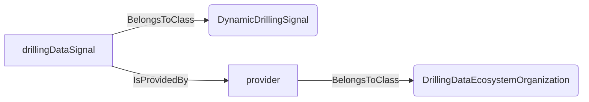
An example SparQL query looks like this:
```sparql
PREFIX rdf: <http://www.w3.org/1999/02/22-rdf-syntax-ns#>
PREFIX ddhub: <http://ddhub.no/>
PREFIX quantity: <http://ddhub.no/UnitAndQuantity>
SELECT ?drillingDataProvider
WHERE {
	?drillingDataSignal rdf:type ddhub:DynamicDrillingSignal .
	?provider rdf:type ddhub:DrillingDataEcosystemOrganization .
	?drillingDataSignal ddhub:IsProvidedBy ?provider .
}
```
## IntegratedOilfieldServiceCompany <!-- NOUN -->
- Display name: Integrated Oilfield Service Company
- Parent class: [ServiceCompany](./DataProviders.md#ServiceCompany)
- Description: 
A broad oilfield service company that may provide drilling services, directional drilling, MWD/LWD, real-time operations, drilling optimization, drilling automation, software, and data infrastructure.
- Definition set: Organizations
- Examples:
```dwis integratedOFS
IntegratedOilfieldServiceCompany:ofsCompany
DrillingDataPoint:drillingData
drillingData IsProvidedBy ofsCompany
```
An example semantic graph looks like as follow:
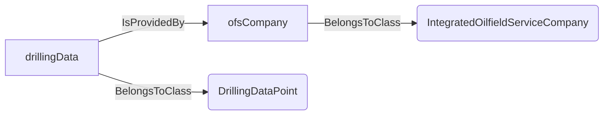
An example SparQL query looks like this:
```sparql
PREFIX rdf: <http://www.w3.org/1999/02/22-rdf-syntax-ns#>
PREFIX ddhub: <http://ddhub.no/>
PREFIX quantity: <http://ddhub.no/UnitAndQuantity>
SELECT ?integratedOFS
WHERE {
	?ofsCompany rdf:type ddhub:IntegratedOilfieldServiceCompany .
	?drillingData rdf:type ddhub:DrillingDataPoint .
	?drillingData ddhub:IsProvidedBy ?ofsCompany .
}
```
## DrillingAnalyticsAutomationCompany <!-- NOUN -->
- Display name: Drilling Analytics and Automation Company
- Parent class: [DataAnalysisServiceCompany](./DataProviders.md#DataAnalysisServiceCompany)
- Description: 
A company that provides drilling analytics, AI, automation, advisory, dysfunction detection, ROP optimization, risk prediction, or real-time decision-support services.
- Definition set: Organizations
- Examples:
```dwis drillingAnalytics
DrillingAnalyticsAutomationCompany:analyticsProvider
DrillingControlAdvice:drillingAdvice
drillingAdvice IsProvidedBy analyticsProvider
```
An example semantic graph looks like as follow:

An example SparQL query looks like this:
```sparql
PREFIX rdf: <http://www.w3.org/1999/02/22-rdf-syntax-ns#>
PREFIX ddhub: <http://ddhub.no/>
PREFIX quantity: <http://ddhub.no/UnitAndQuantity>
SELECT ?drillingAnalytics
WHERE {
	?analyticsProvider rdf:type ddhub:DrillingAnalyticsAutomationCompany .
	?drillingAdvice rdf:type ddhub:DrillingControlAdvice .
	?drillingAdvice ddhub:IsProvidedBy ?analyticsProvider .
}
```
## RealTimeDrillingDataInfrastructureCompany <!-- NOUN -->
- Display name: Real-Time Drilling Data Infrastructure Company
- Parent class: [DataProvider](./DataProviders.md#DataProvider)
- Description: 
A company that provides drilling-data acquisition, aggregation, transmission, WITS/WITSML services, visualization, storage, remote collaboration, or operational data delivery.
- Definition set: Organizations
- Examples:
```dwis realTimeDataInfrastructure
RealTimeDrillingDataInfrastructureCompany:dataInfrastructureProvider
DynamicDrillingSignal:standpipePressure
standpipePressure IsProvidedBy dataInfrastructureProvider
```
An example semantic graph looks like as follow:
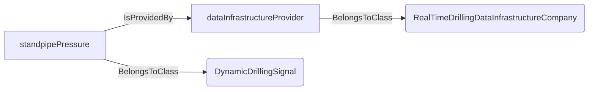
An example SparQL query looks like this:
```sparql
PREFIX rdf: <http://www.w3.org/1999/02/22-rdf-syntax-ns#>
PREFIX ddhub: <http://ddhub.no/>
PREFIX quantity: <http://ddhub.no/UnitAndQuantity>
SELECT ?realTimeDataInfrastructure
WHERE {
	?dataInfrastructureProvider rdf:type ddhub:RealTimeDrillingDataInfrastructureCompany .
	?standpipePressure rdf:type ddhub:DynamicDrillingSignal .
	?standpipePressure ddhub:IsProvidedBy ?dataInfrastructureProvider .
}
```
## WellPlanningReportingSoftwareCompany <!-- NOUN -->
- Display name: Well Planning and Reporting Software Company
- Parent class: [DataProvider](./DataProviders.md#DataProvider)
- Description: 
A company that provides well planning, drilling engineering workflows, drilling reports, daily operations reporting, lessons learned, or well lifecycle data-management software.
- Definition set: Organizations
- Examples:
```dwis planningReporting
WellPlanningReportingSoftwareCompany:planningProvider
RigActionPlan:rigActionPlan
rigActionPlan IsProvidedBy planningProvider
```
An example semantic graph looks like as follow:
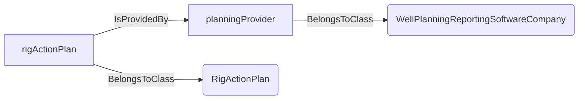
An example SparQL query looks like this:
```sparql
PREFIX rdf: <http://www.w3.org/1999/02/22-rdf-syntax-ns#>
PREFIX ddhub: <http://ddhub.no/>
PREFIX quantity: <http://ddhub.no/UnitAndQuantity>
SELECT ?planningReporting
WHERE {
	?planningProvider rdf:type ddhub:WellPlanningReportingSoftwareCompany .
	?rigActionPlan rdf:type ddhub:RigActionPlan .
	?rigActionPlan ddhub:IsProvidedBy ?planningProvider .
}
```
## DownholeMeasurementDynamicsCompany <!-- NOUN -->
- Display name: Downhole Measurement and Dynamics Company
- Parent class: [InstrumentationCompany](./DataProviders.md#InstrumentationCompany)
- Description: 
A company that generates or interprets downhole drilling data such as MWD/LWD, survey, pressure, vibration, drilling dynamics, BHA behavior, stick-slip, torque/drag, and drilling dysfunction measurements.
- Definition set: Organizations
- Examples:
```dwis downholeMeasurement
DownholeMeasurementDynamicsCompany:downholeProvider
DynamicDrillingSignal:downholePressure
downholePressure IsProvidedBy downholeProvider
```
An example semantic graph looks like as follow:
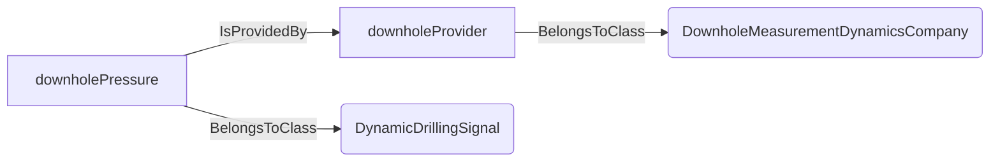
An example SparQL query looks like this:
```sparql
PREFIX rdf: <http://www.w3.org/1999/02/22-rdf-syntax-ns#>
PREFIX ddhub: <http://ddhub.no/>
PREFIX quantity: <http://ddhub.no/UnitAndQuantity>
SELECT ?downholeMeasurement
WHERE {
	?downholeProvider rdf:type ddhub:DownholeMeasurementDynamicsCompany .
	?downholePressure rdf:type ddhub:DynamicDrillingSignal .
	?downholePressure ddhub:IsProvidedBy ?downholeProvider .
}
```
## RigEquipmentOEM <!-- NOUN -->
- Display name: Rig Equipment OEM
- Parent class: [DataProvider](./DataProviders.md#DataProvider)
- Description: 
An original equipment manufacturer or equipment supplier whose rig equipment, controls, automation, or pipe-handling systems generate or consume drilling operational data.
- Definition set: Organizations
- Examples:
```dwis rigEquipmentOEM
RigEquipmentOEM:equipmentProvider
DynamicDrillingSignal:topDriveTorque
topDriveTorque IsProvidedBy equipmentProvider
```
An example semantic graph looks like as follow:
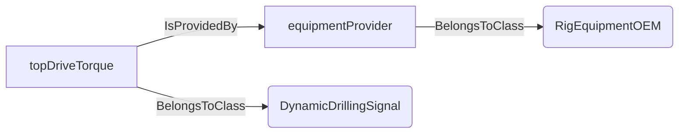
An example SparQL query looks like this:
```sparql
PREFIX rdf: <http://www.w3.org/1999/02/22-rdf-syntax-ns#>
PREFIX ddhub: <http://ddhub.no/>
PREFIX quantity: <http://ddhub.no/UnitAndQuantity>
SELECT ?rigEquipmentOEM
WHERE {
	?equipmentProvider rdf:type ddhub:RigEquipmentOEM .
	?topDriveTorque rdf:type ddhub:DynamicDrillingSignal .
	?topDriveTorque ddhub:IsProvidedBy ?equipmentProvider .
}
```
## RigControlSystemProvider <!-- NOUN -->
- Display name: Rig Control System Provider
- Parent class: [RigEquipmentOEM](./Organizations.md#RigEquipmentOEM)
- Description: 
A rig equipment or automation provider that supplies control systems, drilling automation, rig sequencing, advisory control interfaces, or equipment-generated drilling data.
- Definition set: Organizations
- Examples:
```dwis rigControl
RigControlSystemProvider:controlSystemProvider
DWISADCSInterface:adcsInterface
adcsInterface IsProvidedBy controlSystemProvider
```
An example semantic graph looks like as follow:
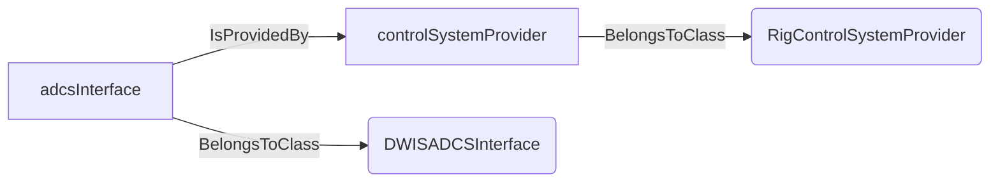
An example SparQL query looks like this:
```sparql
PREFIX rdf: <http://www.w3.org/1999/02/22-rdf-syntax-ns#>
PREFIX ddhub: <http://ddhub.no/>
PREFIX quantity: <http://ddhub.no/UnitAndQuantity>
SELECT ?rigControl
WHERE {
	?controlSystemProvider rdf:type ddhub:RigControlSystemProvider .
	?adcsInterface rdf:type ddhub:DWISADCSInterface .
	?adcsInterface ddhub:IsProvidedBy ?controlSystemProvider .
}
```
## MudLoggingCompany <!-- NOUN -->
- Display name: Mud Logging Company
- Parent class: [LoggingServiceCompany](./DataProviders.md#LoggingServiceCompany)
- Description: 
A company that provides mud logging, surface logging, gas logging, wellsite geology, and structured wellsite drilling data.
- Definition set: Organizations
- Examples:
```dwis mudLogging
MudLoggingCompany:mudLogger
StratigraphyDescription:stratigraphy
stratigraphy IsProvidedBy mudLogger
```
An example semantic graph looks like as follow:
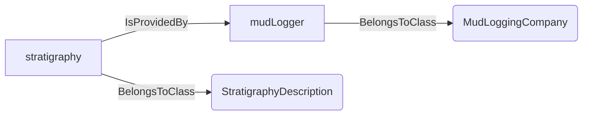
An example SparQL query looks like this:
```sparql
PREFIX rdf: <http://www.w3.org/1999/02/22-rdf-syntax-ns#>
PREFIX ddhub: <http://ddhub.no/>
PREFIX quantity: <http://ddhub.no/UnitAndQuantity>
SELECT ?mudLogging
WHERE {
	?mudLogger rdf:type ddhub:MudLoggingCompany .
	?stratigraphy rdf:type ddhub:StratigraphyDescription .
	?stratigraphy ddhub:IsProvidedBy ?mudLogger .
}
```
## CloudEnergyDataPlatformProvider <!-- NOUN -->
- Display name: Cloud Energy Data Platform Provider
- Parent class: [DataProvider](./DataProviders.md#DataProvider)
- Description: 
A cloud or industrial data-platform provider that supports energy data lakes, edge/IoT, historians, contextualization, analytics, AI/ML, or operational data infrastructure used with drilling data.
- Definition set: Organizations
- Examples:
```dwis cloudEnergyPlatform
CloudEnergyDataPlatformProvider:cloudProvider
DrillingDataPoint:storedDrillingData
storedDrillingData IsProvidedTo cloudProvider
```
An example semantic graph looks like as follow:
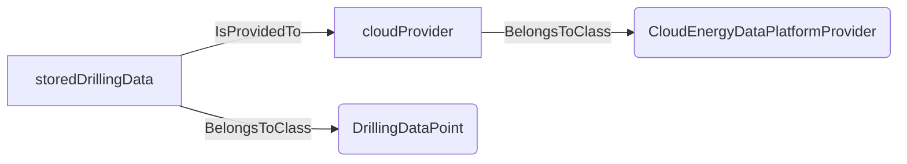
An example SparQL query looks like this:
```sparql
PREFIX rdf: <http://www.w3.org/1999/02/22-rdf-syntax-ns#>
PREFIX ddhub: <http://ddhub.no/>
PREFIX quantity: <http://ddhub.no/UnitAndQuantity>
SELECT ?cloudEnergyPlatform
WHERE {
	?cloudProvider rdf:type ddhub:CloudEnergyDataPlatformProvider .
	?storedDrillingData rdf:type ddhub:DrillingDataPoint .
	?storedDrillingData ddhub:IsProvidedTo ?cloudProvider .
}
```
## EnergyDataStandardsOrganization <!-- NOUN -->
- Display name: Energy Data Standards Organization
- Parent class: [DrillingDataEcosystemOrganization](./Organizations.md#DrillingDataEcosystemOrganization)
- Description: 
An organization or consortium that defines standards, interoperability specifications, data models, or industry practices relevant to drilling and well data.
- Definition set: Organizations
- Examples:
```dwis standardsOrganization
EnergyDataStandardsOrganization:standardsBody
DrillingDataPoint:standardizedData
standardizedData IsProvidedTo standardsBody
```
An example semantic graph looks like as follow:
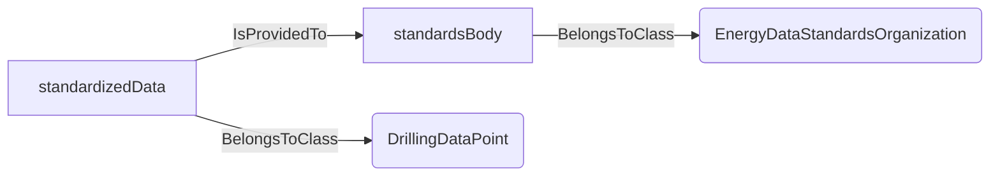
An example SparQL query looks like this:
```sparql
PREFIX rdf: <http://www.w3.org/1999/02/22-rdf-syntax-ns#>
PREFIX ddhub: <http://ddhub.no/>
PREFIX quantity: <http://ddhub.no/UnitAndQuantity>
SELECT ?standardsOrganization
WHERE {
	?standardsBody rdf:type ddhub:EnergyDataStandardsOrganization .
	?standardizedData rdf:type ddhub:DrillingDataPoint .
	?standardizedData ddhub:IsProvidedTo ?standardsBody .
}
```
## DrillingIndustryOrganization <!-- NOUN -->
- Display name: Drilling Industry Organization
- Parent class: [EnergyDataStandardsOrganization](./Organizations.md#EnergyDataStandardsOrganization)
- Description: 
An industry association, technical community, or standards group focused on drilling contractors, drilling automation, well construction, interoperability, reporting, or operational practices.
- Definition set: Organizations
- Examples:
```dwis drillingIndustryOrganization
DrillingIndustryOrganization:industryBody
DrillingDataPoint:reportedData
reportedData IsProvidedTo industryBody
```
An example semantic graph looks like as follow:
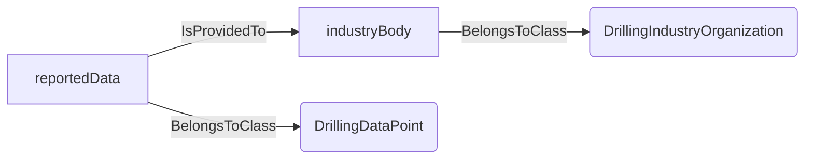
An example SparQL query looks like this:
```sparql
PREFIX rdf: <http://www.w3.org/1999/02/22-rdf-syntax-ns#>
PREFIX ddhub: <http://ddhub.no/>
PREFIX quantity: <http://ddhub.no/UnitAndQuantity>
SELECT ?drillingIndustryOrganization
WHERE {
	?industryBody rdf:type ddhub:DrillingIndustryOrganization .
	?reportedData rdf:type ddhub:DrillingDataPoint .
	?reportedData ddhub:IsProvidedTo ?industryBody .
}
```
## SLB <!-- NOUN -->
- Display name: SLB
- Parent class: [IntegratedOilfieldServiceCompany](./Organizations.md#IntegratedOilfieldServiceCompany)
- Description: 
An integrated oilfield service company active in real-time drilling data services, drilling optimization, MWD/LWD, drilling engineering workflows, and digital well-construction platforms such as Delfi.
- Definition set: Organizations
- Examples:
```dwis slbProvider
SLB:slb
DrillingDataPoint:drillingData
drillingData IsProvidedBy slb
```
An example semantic graph looks like as follow:
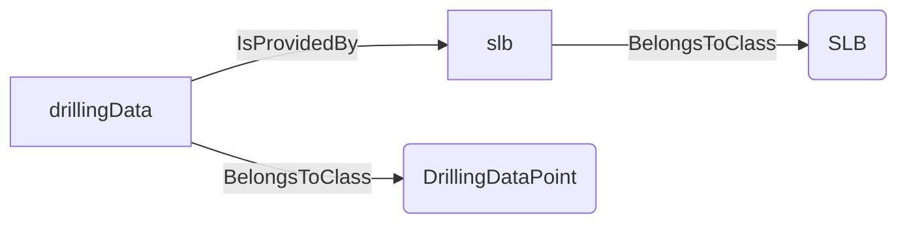
An example SparQL query looks like this:
```sparql
PREFIX rdf: <http://www.w3.org/1999/02/22-rdf-syntax-ns#>
PREFIX ddhub: <http://ddhub.no/>
PREFIX quantity: <http://ddhub.no/UnitAndQuantity>
SELECT ?slbProvider
WHERE {
	?slb rdf:type ddhub:SLB .
	?drillingData rdf:type ddhub:DrillingDataPoint .
	?drillingData ddhub:IsProvidedBy ?slb .
}
```
## Halliburton <!-- NOUN -->
- Display name: Halliburton
- Parent class: [IntegratedOilfieldServiceCompany](./Organizations.md#IntegratedOilfieldServiceCompany)
- Description: 
An integrated oilfield service company active in drilling data, Landmark/iEnergy, DecisionSpace, LOGIX automation, Sperry Drilling, MWD/LWD, drilling optimization, and real-time operations.
- Definition set: Organizations
- Examples:
```dwis halliburtonProvider
Halliburton:halliburton
DrillingDataPoint:drillingData
drillingData IsProvidedBy halliburton
```
An example semantic graph looks like as follow:
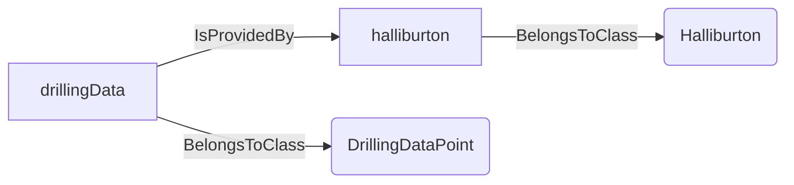
An example SparQL query looks like this:
```sparql
PREFIX rdf: <http://www.w3.org/1999/02/22-rdf-syntax-ns#>
PREFIX ddhub: <http://ddhub.no/>
PREFIX quantity: <http://ddhub.no/UnitAndQuantity>
SELECT ?halliburtonProvider
WHERE {
	?halliburton rdf:type ddhub:Halliburton .
	?drillingData rdf:type ddhub:DrillingDataPoint .
	?drillingData ddhub:IsProvidedBy ?halliburton .
}
```
## BakerHughes <!-- NOUN -->
- Display name: Baker Hughes
- Parent class: [IntegratedOilfieldServiceCompany](./Organizations.md#IntegratedOilfieldServiceCompany)
- Description: 
An integrated oilfield service company active in real-time drilling optimization, well planning, MWD/LWD, drilling engineering software, downhole data, and surface drilling-data workflows.
- Definition set: Organizations
- Examples:
```dwis bakerHughesProvider
BakerHughes:bakerHughes
DrillingDataPoint:drillingData
drillingData IsProvidedBy bakerHughes
```
An example semantic graph looks like as follow:
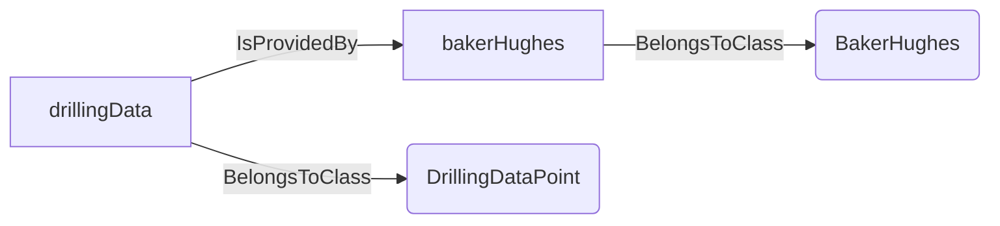
An example SparQL query looks like this:
```sparql
PREFIX rdf: <http://www.w3.org/1999/02/22-rdf-syntax-ns#>
PREFIX ddhub: <http://ddhub.no/>
PREFIX quantity: <http://ddhub.no/UnitAndQuantity>
SELECT ?bakerHughesProvider
WHERE {
	?bakerHughes rdf:type ddhub:BakerHughes .
	?drillingData rdf:type ddhub:DrillingDataPoint .
	?drillingData ddhub:IsProvidedBy ?bakerHughes .
}
```
## Weatherford <!-- NOUN -->
- Display name: Weatherford
- Parent class: [IntegratedOilfieldServiceCompany](./Organizations.md#IntegratedOilfieldServiceCompany)
- Description: 
An oilfield service company active in drilling analytics, managed pressure drilling data, MWD/LWD, real-time drilling optimization, drilling dynamics, and wellbore placement data.
- Definition set: Organizations
- Examples:
```dwis weatherfordProvider
Weatherford:weatherford
DrillingDataPoint:drillingData
drillingData IsProvidedBy weatherford
```
An example semantic graph looks like as follow:
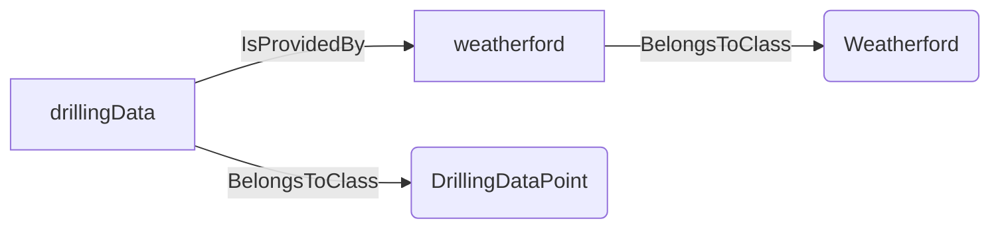
An example SparQL query looks like this:
```sparql
PREFIX rdf: <http://www.w3.org/1999/02/22-rdf-syntax-ns#>
PREFIX ddhub: <http://ddhub.no/>
PREFIX quantity: <http://ddhub.no/UnitAndQuantity>
SELECT ?weatherfordProvider
WHERE {
	?weatherford rdf:type ddhub:Weatherford .
	?drillingData rdf:type ddhub:DrillingDataPoint .
	?drillingData ddhub:IsProvidedBy ?weatherford .
}
```
## NOV <!-- NOUN -->
- Display name: NOV
- Parent class: [IntegratedOilfieldServiceCompany](./Organizations.md#IntegratedOilfieldServiceCompany)
- Description: 
A drilling equipment, automation, and data company active in NOVOS, Max drilling automation, rig equipment integration, IntelliServ wired drill pipe, and rig-control data workflows.
- Definition set: Organizations
- Examples:
```dwis novosProvider
NOV:nov
DWISADCSInterface:adcsInterface
adcsInterface IsProvidedBy nov
```
An example semantic graph looks like as follow:
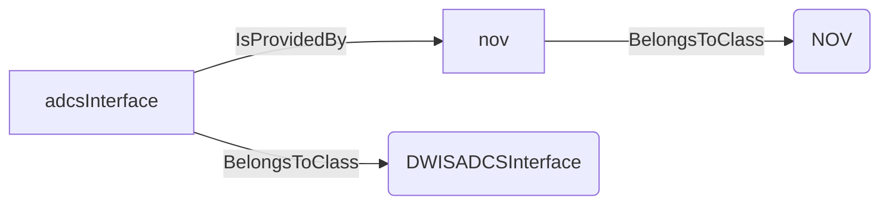
An example SparQL query looks like this:
```sparql
PREFIX rdf: <http://www.w3.org/1999/02/22-rdf-syntax-ns#>
PREFIX ddhub: <http://ddhub.no/>
PREFIX quantity: <http://ddhub.no/UnitAndQuantity>
SELECT ?novosProvider
WHERE {
	?nov rdf:type ddhub:NOV .
	?adcsInterface rdf:type ddhub:DWISADCSInterface .
	?adcsInterface ddhub:IsProvidedBy ?nov .
}
```
## HMH <!-- NOUN -->
- Display name: HMH
- Parent class: [RigControlSystemProvider](./Organizations.md#RigControlSystemProvider)
- Description: 
A rig equipment, control-system, and drilling automation company active in DEAL, CADS, drillersAssist, DrillView, DrillPerform, digital services, and equipment-generated drilling data.
- Definition set: Organizations
- Examples:
```dwis hmhProvider
HMH:hmh
DynamicDrillingSignal:equipmentSignal
equipmentSignal IsProvidedBy hmh
```
An example semantic graph looks like as follow:
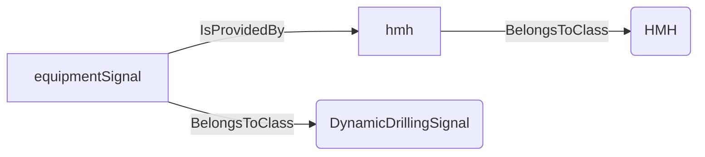
An example SparQL query looks like this:
```sparql
PREFIX rdf: <http://www.w3.org/1999/02/22-rdf-syntax-ns#>
PREFIX ddhub: <http://ddhub.no/>
PREFIX quantity: <http://ddhub.no/UnitAndQuantity>
SELECT ?hmhProvider
WHERE {
	?hmh rdf:type ddhub:HMH .
	?equipmentSignal rdf:type ddhub:DynamicDrillingSignal .
	?equipmentSignal ddhub:IsProvidedBy ?hmh .
}
```
## Sekal <!-- NOUN -->
- Display name: Sekal
- Parent class: [DrillingAnalyticsAutomationCompany](./Organizations.md#DrillingAnalyticsAutomationCompany)
- Description: 
A drilling automation and advisory company active in DrillScene, DrillTronics, real-time diagnostics, drilling automation, and drilling advisory workflows.
- Definition set: Organizations
- Examples:
```dwis sekalProvider
Sekal:sekal
DrillingControlAdvice:drillingAdvice
drillingAdvice IsProvidedBy sekal
```
An example semantic graph looks like as follow:
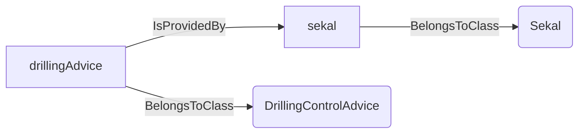
An example SparQL query looks like this:
```sparql
PREFIX rdf: <http://www.w3.org/1999/02/22-rdf-syntax-ns#>
PREFIX ddhub: <http://ddhub.no/>
PREFIX quantity: <http://ddhub.no/UnitAndQuantity>
SELECT ?sekalProvider
WHERE {
	?sekal rdf:type ddhub:Sekal .
	?drillingAdvice rdf:type ddhub:DrillingControlAdvice .
	?drillingAdvice ddhub:IsProvidedBy ?sekal .
}
```
## Exebenus <!-- NOUN -->
- Display name: Exebenus
- Parent class: [DrillingAnalyticsAutomationCompany](./Organizations.md#DrillingAnalyticsAutomationCompany)
- Description: 
A predictive drilling AI company active in stuck-pipe prediction, ROP optimization, vibration and dysfunction detection, and real-time drilling recommendations.
- Definition set: Organizations
- Examples:
```dwis exebenusProvider
Exebenus:exebenus
DrillingControlAdvice:drillingAdvice
drillingAdvice IsProvidedBy exebenus
```
An example semantic graph looks like as follow:
```mermaid
graph LR
	N0000[exebenus] -->|BelongsToClass| N0001(Exebenus) 
	N0002[drillingAdvice] -->|BelongsToClass| N0003(DrillingControlAdvice) 
	N0002[drillingAdvice] -->|IsProvidedBy| N0000[exebenus] 
```
An example SparQL query looks like this:
```sparql
PREFIX rdf: <http://www.w3.org/1999/02/22-rdf-syntax-ns#>
PREFIX ddhub: <http://ddhub.no/>
PREFIX quantity: <http://ddhub.no/UnitAndQuantity>
SELECT ?exebenusProvider
WHERE {
	?exebenus rdf:type ddhub:Exebenus .
	?drillingAdvice rdf:type ddhub:DrillingControlAdvice .
	?drillingAdvice ddhub:IsProvidedBy ?exebenus .
}
```
## Corva <!-- NOUN -->
- Display name: Corva
- Parent class: [DrillingAnalyticsAutomationCompany](./Organizations.md#DrillingAnalyticsAutomationCompany)
- Description: 
A cloud drilling analytics platform company active in real-time drilling applications, drilling optimization, and operational analytics.
- Definition set: Organizations
- Examples:
```dwis corvaProvider
Corva:corva
DrillingControlAdvice:drillingAdvice
drillingAdvice IsProvidedBy corva
```
An example semantic graph looks like as follow:
```mermaid
graph LR
	N0000[corva] -->|BelongsToClass| N0001(Corva) 
	N0002[drillingAdvice] -->|BelongsToClass| N0003(DrillingControlAdvice) 
	N0002[drillingAdvice] -->|IsProvidedBy| N0000[corva] 
```
An example SparQL query looks like this:
```sparql
PREFIX rdf: <http://www.w3.org/1999/02/22-rdf-syntax-ns#>
PREFIX ddhub: <http://ddhub.no/>
PREFIX quantity: <http://ddhub.no/UnitAndQuantity>
SELECT ?corvaProvider
WHERE {
	?corva rdf:type ddhub:Corva .
	?drillingAdvice rdf:type ddhub:DrillingControlAdvice .
	?drillingAdvice ddhub:IsProvidedBy ?corva .
}
```
## TDEGroup <!-- NOUN -->
- Display name: TDE Group
- Parent class: [DrillingAnalyticsAutomationCompany](./Organizations.md#DrillingAnalyticsAutomationCompany)
- Description: 
A drilling analytics company active in rig-state detection, performance analytics, benchmarking, and automated reporting.
- Definition set: Organizations
- Examples:
```dwis tdeProvider
TDEGroup:tdeGroup
DrillingDataPoint:performanceData
performanceData IsProvidedBy tdeGroup
```
An example semantic graph looks like as follow:
```mermaid
graph LR
	N0000[tdeGroup] -->|BelongsToClass| N0001(TDEGroup) 
	N0002[performanceData] -->|BelongsToClass| N0003(DrillingDataPoint) 
	N0002[performanceData] -->|IsProvidedBy| N0000[tdeGroup] 
```
An example SparQL query looks like this:
```sparql
PREFIX rdf: <http://www.w3.org/1999/02/22-rdf-syntax-ns#>
PREFIX ddhub: <http://ddhub.no/>
PREFIX quantity: <http://ddhub.no/UnitAndQuantity>
SELECT ?tdeProvider
WHERE {
	?tdeGroup rdf:type ddhub:TDEGroup .
	?performanceData rdf:type ddhub:DrillingDataPoint .
	?performanceData ddhub:IsProvidedBy ?tdeGroup .
}
```
## PrimeDrillingIDP <!-- NOUN -->
- Display name: Prime Drilling IDP
- Parent class: [DrillingAnalyticsAutomationCompany](./Organizations.md#DrillingAnalyticsAutomationCompany)
- Description: 
A drilling-data analytics and drilling-performance platform provider active in real-time drilling-data analysis and performance workflows.
- Definition set: Organizations
- Examples:
```dwis idpProvider
PrimeDrillingIDP:idp
DrillingDataPoint:performanceData
performanceData IsProvidedBy idp
```
An example semantic graph looks like as follow:
```mermaid
graph LR
	N0000[idp] -->|BelongsToClass| N0001(PrimeDrillingIDP) 
	N0002[performanceData] -->|BelongsToClass| N0003(DrillingDataPoint) 
	N0002[performanceData] -->|IsProvidedBy| N0000[idp] 
```
An example SparQL query looks like this:
```sparql
PREFIX rdf: <http://www.w3.org/1999/02/22-rdf-syntax-ns#>
PREFIX ddhub: <http://ddhub.no/>
PREFIX quantity: <http://ddhub.no/UnitAndQuantity>
SELECT ?idpProvider
WHERE {
	?idp rdf:type ddhub:PrimeDrillingIDP .
	?performanceData rdf:type ddhub:DrillingDataPoint .
	?performanceData ddhub:IsProvidedBy ?idp .
}
```
## Nabors <!-- NOUN -->
- Display name: Nabors
- Parent class: [DrillingContractor](./DataProviders.md#DrillingContractor)
- Description: 
A drilling contractor and rig-data platform provider active in RigCLOUD, SmartROS, drilling automation, edge/cloud rig data, and performance analytics.
- Definition set: Organizations
- Examples:
```dwis naborsProvider
Nabors:nabors
RigDescription:rigDescription
rigDescription IsProvidedBy nabors
```
An example semantic graph looks like as follow:
```mermaid
graph LR
	N0000[nabors] -->|BelongsToClass| N0001(Nabors) 
	N0002[rigDescription] -->|BelongsToClass| N0003(RigDescription) 
	N0002[rigDescription] -->|IsProvidedBy| N0000[nabors] 
```
An example SparQL query looks like this:
```sparql
PREFIX rdf: <http://www.w3.org/1999/02/22-rdf-syntax-ns#>
PREFIX ddhub: <http://ddhub.no/>
PREFIX quantity: <http://ddhub.no/UnitAndQuantity>
SELECT ?naborsProvider
WHERE {
	?nabors rdf:type ddhub:Nabors .
	?rigDescription rdf:type ddhub:RigDescription .
	?rigDescription ddhub:IsProvidedBy ?nabors .
}
```
## HelmerichPayne <!-- NOUN -->
- Display name: Helmerich & Payne
- Parent class: [DrillingContractor](./DataProviders.md#DrillingContractor)
- Description: 
A drilling contractor active in FlexRig, rig automation, performance optimization, well planning, and digital drilling workflows.
- Definition set: Organizations
- Examples:
```dwis hpProvider
HelmerichPayne:helmerichPayne
RigDescription:rigDescription
rigDescription IsProvidedBy helmerichPayne
```
An example semantic graph looks like as follow:
```mermaid
graph LR
	N0000[helmerichPayne] -->|BelongsToClass| N0001(HelmerichPayne) 
	N0002[rigDescription] -->|BelongsToClass| N0003(RigDescription) 
	N0002[rigDescription] -->|IsProvidedBy| N0000[helmerichPayne] 
```
An example SparQL query looks like this:
```sparql
PREFIX rdf: <http://www.w3.org/1999/02/22-rdf-syntax-ns#>
PREFIX ddhub: <http://ddhub.no/>
PREFIX quantity: <http://ddhub.no/UnitAndQuantity>
SELECT ?hpProvider
WHERE {
	?helmerichPayne rdf:type ddhub:HelmerichPayne .
	?rigDescription rdf:type ddhub:RigDescription .
	?rigDescription ddhub:IsProvidedBy ?helmerichPayne .
}
```
## Drill2Frac <!-- NOUN -->
- Display name: Drill2Frac
- Parent class: [DrillingAnalyticsAutomationCompany](./Organizations.md#DrillingAnalyticsAutomationCompany)
- Description: 
A drilling analytics company active in drilling-data-derived dysfunction detection and completion or fracture-treatment optimization.
- Definition set: Organizations
- Examples:
```dwis drill2FracProvider
Drill2Frac:drill2Frac
DrillingDataPoint:drillingData
drillingData IsProvidedBy drill2Frac
```
An example semantic graph looks like as follow:
```mermaid
graph LR
	N0000[drill2Frac] -->|BelongsToClass| N0001(Drill2Frac) 
	N0002[drillingData] -->|BelongsToClass| N0003(DrillingDataPoint) 
	N0002[drillingData] -->|IsProvidedBy| N0000[drill2Frac] 
```
An example SparQL query looks like this:
```sparql
PREFIX rdf: <http://www.w3.org/1999/02/22-rdf-syntax-ns#>
PREFIX ddhub: <http://ddhub.no/>
PREFIX quantity: <http://ddhub.no/UnitAndQuantity>
SELECT ?drill2FracProvider
WHERE {
	?drill2Frac rdf:type ddhub:Drill2Frac .
	?drillingData rdf:type ddhub:DrillingDataPoint .
	?drillingData ddhub:IsProvidedBy ?drill2Frac .
}
```
## Rogii <!-- NOUN -->
- Display name: Rogii
- Parent class: [DrillingAnalyticsAutomationCompany](./Organizations.md#DrillingAnalyticsAutomationCompany)
- Description: 
A geosteering and well-placement software company active in real-time geosteering data workflows.
- Definition set: Organizations
- Examples:
```dwis rogiiProvider
Rogii:rogii
TrajectoryDescription:trajectoryDescription
trajectoryDescription IsProvidedBy rogii
```
An example semantic graph looks like as follow:
```mermaid
graph LR
	N0000[rogii] -->|BelongsToClass| N0001(Rogii) 
	N0002[trajectoryDescription] -->|BelongsToClass| N0003(TrajectoryDescription) 
	N0002[trajectoryDescription] -->|IsProvidedBy| N0000[rogii] 
```
An example SparQL query looks like this:
```sparql
PREFIX rdf: <http://www.w3.org/1999/02/22-rdf-syntax-ns#>
PREFIX ddhub: <http://ddhub.no/>
PREFIX quantity: <http://ddhub.no/UnitAndQuantity>
SELECT ?rogiiProvider
WHERE {
	?rogii rdf:type ddhub:Rogii .
	?trajectoryDescription rdf:type ddhub:TrajectoryDescription .
	?trajectoryDescription ddhub:IsProvidedBy ?rogii .
}
```
## Petrolink <!-- NOUN -->
- Display name: Petrolink
- Parent class: [RealTimeDrillingDataInfrastructureCompany](./Organizations.md#RealTimeDrillingDataInfrastructureCompany)
- Description: 
A real-time drilling-data infrastructure company active in WITSML, PetroVue, rig-to-office data transmission, data aggregation, and remote visualization.
- Definition set: Organizations
- Examples:
```dwis petrolinkProvider
Petrolink:petrolink
DynamicDrillingSignal:realTimeSignal
realTimeSignal IsProvidedBy petrolink
```
An example semantic graph looks like as follow:
```mermaid
graph LR
	N0000[petrolink] -->|BelongsToClass| N0001(Petrolink) 
	N0002[realTimeSignal] -->|BelongsToClass| N0003(DynamicDrillingSignal) 
	N0002[realTimeSignal] -->|IsProvidedBy| N0000[petrolink] 
```
An example SparQL query looks like this:
```sparql
PREFIX rdf: <http://www.w3.org/1999/02/22-rdf-syntax-ns#>
PREFIX ddhub: <http://ddhub.no/>
PREFIX quantity: <http://ddhub.no/UnitAndQuantity>
SELECT ?petrolinkProvider
WHERE {
	?petrolink rdf:type ddhub:Petrolink .
	?realTimeSignal rdf:type ddhub:DynamicDrillingSignal .
	?realTimeSignal ddhub:IsProvidedBy ?petrolink .
}
```
## KongsbergDigital <!-- NOUN -->
- Display name: Kongsberg Digital
- Parent class: [RealTimeDrillingDataInfrastructureCompany](./Organizations.md#RealTimeDrillingDataInfrastructureCompany)
- Description: 
A digital technology company active in SiteCom, real-time operations, drilling and well data aggregation, visualization, and remote collaboration workflows.
- Definition set: Organizations
- Examples:
```dwis kongsbergDigitalProvider
KongsbergDigital:kongsbergDigital
DynamicDrillingSignal:realTimeSignal
realTimeSignal IsProvidedBy kongsbergDigital
```
An example semantic graph looks like as follow:
```mermaid
graph LR
	N0000[kongsbergDigital] -->|BelongsToClass| N0001(KongsbergDigital) 
	N0002[realTimeSignal] -->|BelongsToClass| N0003(DynamicDrillingSignal) 
	N0002[realTimeSignal] -->|IsProvidedBy| N0000[kongsbergDigital] 
```
An example SparQL query looks like this:
```sparql
PREFIX rdf: <http://www.w3.org/1999/02/22-rdf-syntax-ns#>
PREFIX ddhub: <http://ddhub.no/>
PREFIX quantity: <http://ddhub.no/UnitAndQuantity>
SELECT ?kongsbergDigitalProvider
WHERE {
	?kongsbergDigital rdf:type ddhub:KongsbergDigital .
	?realTimeSignal rdf:type ddhub:DynamicDrillingSignal .
	?realTimeSignal ddhub:IsProvidedBy ?kongsbergDigital .
}
```
## Pason <!-- NOUN -->
- Display name: Pason
- Parent class: [RealTimeDrillingDataInfrastructureCompany](./Organizations.md#RealTimeDrillingDataInfrastructureCompany)
- Description: 
A rigsite drilling-data acquisition company active in electronic drilling recorders, DataLink, DataHub, DataMart, WITSML delivery, and rigsite operational data.
- Definition set: Organizations
- Examples:
```dwis pasonProvider
Pason:pason
DynamicDrillingSignal:rigSignal
rigSignal IsProvidedBy pason
```
An example semantic graph looks like as follow:
```mermaid
graph LR
	N0000[pason] -->|BelongsToClass| N0001(Pason) 
	N0002[rigSignal] -->|BelongsToClass| N0003(DynamicDrillingSignal) 
	N0002[rigSignal] -->|IsProvidedBy| N0000[pason] 
```
An example SparQL query looks like this:
```sparql
PREFIX rdf: <http://www.w3.org/1999/02/22-rdf-syntax-ns#>
PREFIX ddhub: <http://ddhub.no/>
PREFIX quantity: <http://ddhub.no/UnitAndQuantity>
SELECT ?pasonProvider
WHERE {
	?pason rdf:type ddhub:Pason .
	?rigSignal rdf:type ddhub:DynamicDrillingSignal .
	?rigSignal ddhub:IsProvidedBy ?pason .
}
```
## IndependentDataServices <!-- NOUN -->
- Display name: Independent Data Services
- Parent class: [RealTimeDrillingDataInfrastructureCompany](./Organizations.md#RealTimeDrillingDataInfrastructureCompany)
- Description: 
A drilling-data and reporting company active in DataNet, daily drilling reports, WITSML workflows, automated reporting, and operations data capture.
- Definition set: Organizations
- Examples:
```dwis idsProvider
IndependentDataServices:ids
RigActionPlan:dailyReport
dailyReport IsProvidedBy ids
```
An example semantic graph looks like as follow:
```mermaid
graph LR
	N0000[ids] -->|BelongsToClass| N0001(IndependentDataServices) 
	N0002[dailyReport] -->|BelongsToClass| N0003(RigActionPlan) 
	N0002[dailyReport] -->|IsProvidedBy| N0000[ids] 
```
An example SparQL query looks like this:
```sparql
PREFIX rdf: <http://www.w3.org/1999/02/22-rdf-syntax-ns#>
PREFIX ddhub: <http://ddhub.no/>
PREFIX quantity: <http://ddhub.no/UnitAndQuantity>
SELECT ?idsProvider
WHERE {
	?ids rdf:type ddhub:IndependentDataServices .
	?dailyReport rdf:type ddhub:RigActionPlan .
	?dailyReport ddhub:IsProvidedBy ?ids .
}
```
## Geolog <!-- NOUN -->
- Display name: Geolog
- Parent class: [MudLoggingCompany](./Organizations.md#MudLoggingCompany)
- Description: 
A mud logging and surface logging company active in GeoWITSML, wellsite data aggregation, geology data, and drilling operational data.
- Definition set: Organizations
- Examples:
```dwis geologProvider
Geolog:geolog
StratigraphyDescription:stratigraphy
stratigraphy IsProvidedBy geolog
```
An example semantic graph looks like as follow:
```mermaid
graph LR
	N0000[geolog] -->|BelongsToClass| N0001(Geolog) 
	N0002[stratigraphy] -->|BelongsToClass| N0003(StratigraphyDescription) 
	N0002[stratigraphy] -->|IsProvidedBy| N0000[geolog] 
```
An example SparQL query looks like this:
```sparql
PREFIX rdf: <http://www.w3.org/1999/02/22-rdf-syntax-ns#>
PREFIX ddhub: <http://ddhub.no/>
PREFIX quantity: <http://ddhub.no/UnitAndQuantity>
SELECT ?geologProvider
WHERE {
	?geolog rdf:type ddhub:Geolog .
	?stratigraphy rdf:type ddhub:StratigraphyDescription .
	?stratigraphy ddhub:IsProvidedBy ?geolog .
}
```
## GeoDataLogging <!-- NOUN -->
- Display name: Geo-data Logging
- Parent class: [MudLoggingCompany](./Organizations.md#MudLoggingCompany)
- Description: 
A surface data acquisition and drilling monitoring company active in rig data acquisition and WITS, WITSML, OPC, and Modbus integration.
- Definition set: Organizations
- Examples:
```dwis geoDataLoggingProvider
GeoDataLogging:geoDataLogging
DynamicDrillingSignal:surfaceSignal
surfaceSignal IsProvidedBy geoDataLogging
```
An example semantic graph looks like as follow:
```mermaid
graph LR
	N0000[geoDataLogging] -->|BelongsToClass| N0001(GeoDataLogging) 
	N0002[surfaceSignal] -->|BelongsToClass| N0003(DynamicDrillingSignal) 
	N0002[surfaceSignal] -->|IsProvidedBy| N0000[geoDataLogging] 
```
An example SparQL query looks like this:
```sparql
PREFIX rdf: <http://www.w3.org/1999/02/22-rdf-syntax-ns#>
PREFIX ddhub: <http://ddhub.no/>
PREFIX quantity: <http://ddhub.no/UnitAndQuantity>
SELECT ?geoDataLoggingProvider
WHERE {
	?geoDataLogging rdf:type ddhub:GeoDataLogging .
	?surfaceSignal rdf:type ddhub:DynamicDrillingSignal .
	?surfaceSignal ddhub:IsProvidedBy ?geoDataLogging .
}
```
## Peloton <!-- NOUN -->
- Display name: Peloton
- Parent class: [WellPlanningReportingSoftwareCompany](./Organizations.md#WellPlanningReportingSoftwareCompany)
- Description: 
A well operations data-management software company active in WellView, SiteView, well lifecycle data, drilling reports, and operations reporting.
- Definition set: Organizations
- Examples:
```dwis pelotonProvider
Peloton:peloton
RigActionPlan:drillingReport
drillingReport IsProvidedBy peloton
```
An example semantic graph looks like as follow:
```mermaid
graph LR
	N0000[peloton] -->|BelongsToClass| N0001(Peloton) 
	N0002[drillingReport] -->|BelongsToClass| N0003(RigActionPlan) 
	N0002[drillingReport] -->|IsProvidedBy| N0000[peloton] 
```
An example SparQL query looks like this:
```sparql
PREFIX rdf: <http://www.w3.org/1999/02/22-rdf-syntax-ns#>
PREFIX ddhub: <http://ddhub.no/>
PREFIX quantity: <http://ddhub.no/UnitAndQuantity>
SELECT ?pelotonProvider
WHERE {
	?peloton rdf:type ddhub:Peloton .
	?drillingReport rdf:type ddhub:RigActionPlan .
	?drillingReport ddhub:IsProvidedBy ?peloton .
}
```
## QuorumSoftware <!-- NOUN -->
- Display name: Quorum Software
- Parent class: [WellPlanningReportingSoftwareCompany](./Organizations.md#WellPlanningReportingSoftwareCompany)
- Description: 
A software company active in upstream operations data, reporting, well operations, planning data management, and production data workflows.
- Definition set: Organizations
- Examples:
```dwis quorumProvider
QuorumSoftware:quorum
RigActionPlan:operationsReport
operationsReport IsProvidedBy quorum
```
An example semantic graph looks like as follow:
```mermaid
graph LR
	N0000[quorum] -->|BelongsToClass| N0001(QuorumSoftware) 
	N0002[operationsReport] -->|BelongsToClass| N0003(RigActionPlan) 
	N0002[operationsReport] -->|IsProvidedBy| N0000[quorum] 
```
An example SparQL query looks like this:
```sparql
PREFIX rdf: <http://www.w3.org/1999/02/22-rdf-syntax-ns#>
PREFIX ddhub: <http://ddhub.no/>
PREFIX quantity: <http://ddhub.no/UnitAndQuantity>
SELECT ?quorumProvider
WHERE {
	?quorum rdf:type ddhub:QuorumSoftware .
	?operationsReport rdf:type ddhub:RigActionPlan .
	?operationsReport ddhub:IsProvidedBy ?quorum .
}
```
## Cognite <!-- NOUN -->
- Display name: Cognite
- Parent class: [CloudEnergyDataPlatformProvider](./Organizations.md#CloudEnergyDataPlatformProvider)
- Description: 
An industrial data platform company active in data contextualization and integration of drilling, rig, and operational data into broader industrial data platforms.
- Definition set: Organizations
- Examples:
```dwis cogniteProvider
Cognite:cognite
DrillingDataPoint:contextualizedData
contextualizedData IsProvidedTo cognite
```
An example semantic graph looks like as follow:
```mermaid
graph LR
	N0000[cognite] -->|BelongsToClass| N0001(Cognite) 
	N0002[contextualizedData] -->|BelongsToClass| N0003(DrillingDataPoint) 
	N0002[contextualizedData] -->|IsProvidedTo| N0000[cognite] 
```
An example SparQL query looks like this:
```sparql
PREFIX rdf: <http://www.w3.org/1999/02/22-rdf-syntax-ns#>
PREFIX ddhub: <http://ddhub.no/>
PREFIX quantity: <http://ddhub.no/UnitAndQuantity>
SELECT ?cogniteProvider
WHERE {
	?cognite rdf:type ddhub:Cognite .
	?contextualizedData rdf:type ddhub:DrillingDataPoint .
	?contextualizedData ddhub:IsProvidedTo ?cognite .
}
```
## AVEVA <!-- NOUN -->
- Display name: AVEVA
- Parent class: [CloudEnergyDataPlatformProvider](./Organizations.md#CloudEnergyDataPlatformProvider)
- Description: 
An industrial software and operational data infrastructure company active in time-series historian, industrial information management, and operational data systems including OSIsoft PI technology.
- Definition set: Organizations
- Examples:
```dwis avevaProvider
AVEVA:aveva
DrillingDataPoint:historianData
historianData IsProvidedTo aveva
```
An example semantic graph looks like as follow:
```mermaid
graph LR
	N0000[aveva] -->|BelongsToClass| N0001(AVEVA) 
	N0002[historianData] -->|BelongsToClass| N0003(DrillingDataPoint) 
	N0002[historianData] -->|IsProvidedTo| N0000[aveva] 
```
An example SparQL query looks like this:
```sparql
PREFIX rdf: <http://www.w3.org/1999/02/22-rdf-syntax-ns#>
PREFIX ddhub: <http://ddhub.no/>
PREFIX quantity: <http://ddhub.no/UnitAndQuantity>
SELECT ?avevaProvider
WHERE {
	?aveva rdf:type ddhub:AVEVA .
	?historianData rdf:type ddhub:DrillingDataPoint .
	?historianData ddhub:IsProvidedTo ?aveva .
}
```
## AspenTech <!-- NOUN -->
- Display name: AspenTech
- Parent class: [CloudEnergyDataPlatformProvider](./Organizations.md#CloudEnergyDataPlatformProvider)
- Description: 
An industrial software company active in industrial analytics and operational data platforms relevant to drilling and upstream operational data.
- Definition set: Organizations
- Examples:
```dwis aspenTechProvider
AspenTech:aspenTech
DrillingDataPoint:operationsData
operationsData IsProvidedTo aspenTech
```
An example semantic graph looks like as follow:
```mermaid
graph LR
	N0000[aspenTech] -->|BelongsToClass| N0001(AspenTech) 
	N0002[operationsData] -->|BelongsToClass| N0003(DrillingDataPoint) 
	N0002[operationsData] -->|IsProvidedTo| N0000[aspenTech] 
```
An example SparQL query looks like this:
```sparql
PREFIX rdf: <http://www.w3.org/1999/02/22-rdf-syntax-ns#>
PREFIX ddhub: <http://ddhub.no/>
PREFIX quantity: <http://ddhub.no/UnitAndQuantity>
SELECT ?aspenTechProvider
WHERE {
	?aspenTech rdf:type ddhub:AspenTech .
	?operationsData rdf:type ddhub:DrillingDataPoint .
	?operationsData ddhub:IsProvidedTo ?aspenTech .
}
```
## Emerson <!-- NOUN -->
- Display name: Emerson
- Parent class: [CloudEnergyDataPlatformProvider](./Organizations.md#CloudEnergyDataPlatformProvider)
- Description: 
An industrial automation company active in control systems, historians, instrumentation, and operational data infrastructure relevant to drilling and rig data.
- Definition set: Organizations
- Examples:
```dwis emersonProvider
Emerson:emerson
DynamicDrillingSignal:operationsSignal
operationsSignal IsProvidedBy emerson
```
An example semantic graph looks like as follow:
```mermaid
graph LR
	N0000[emerson] -->|BelongsToClass| N0001(Emerson) 
	N0002[operationsSignal] -->|BelongsToClass| N0003(DynamicDrillingSignal) 
	N0002[operationsSignal] -->|IsProvidedBy| N0000[emerson] 
```
An example SparQL query looks like this:
```sparql
PREFIX rdf: <http://www.w3.org/1999/02/22-rdf-syntax-ns#>
PREFIX ddhub: <http://ddhub.no/>
PREFIX quantity: <http://ddhub.no/UnitAndQuantity>
SELECT ?emersonProvider
WHERE {
	?emerson rdf:type ddhub:Emerson .
	?operationsSignal rdf:type ddhub:DynamicDrillingSignal .
	?operationsSignal ddhub:IsProvidedBy ?emerson .
}
```
## Honeywell <!-- NOUN -->
- Display name: Honeywell
- Parent class: [CloudEnergyDataPlatformProvider](./Organizations.md#CloudEnergyDataPlatformProvider)
- Description: 
An industrial automation and control company active in control systems, historians, and operational data infrastructure relevant to drilling and rig operations.
- Definition set: Organizations
- Examples:
```dwis honeywellProvider
Honeywell:honeywell
DynamicDrillingSignal:operationsSignal
operationsSignal IsProvidedBy honeywell
```
An example semantic graph looks like as follow:
```mermaid
graph LR
	N0000[honeywell] -->|BelongsToClass| N0001(Honeywell) 
	N0002[operationsSignal] -->|BelongsToClass| N0003(DynamicDrillingSignal) 
	N0002[operationsSignal] -->|IsProvidedBy| N0000[honeywell] 
```
An example SparQL query looks like this:
```sparql
PREFIX rdf: <http://www.w3.org/1999/02/22-rdf-syntax-ns#>
PREFIX ddhub: <http://ddhub.no/>
PREFIX quantity: <http://ddhub.no/UnitAndQuantity>
SELECT ?honeywellProvider
WHERE {
	?honeywell rdf:type ddhub:Honeywell .
	?operationsSignal rdf:type ddhub:DynamicDrillingSignal .
	?operationsSignal ddhub:IsProvidedBy ?honeywell .
}
```
## Siemens <!-- NOUN -->
- Display name: Siemens
- Parent class: [CloudEnergyDataPlatformProvider](./Organizations.md#CloudEnergyDataPlatformProvider)
- Description: 
An industrial automation and digital infrastructure company active in controls, edge systems, industrial data infrastructure, and automation relevant to rig operations.
- Definition set: Organizations
- Examples:
```dwis siemensProvider
Siemens:siemens
DynamicDrillingSignal:operationsSignal
operationsSignal IsProvidedBy siemens
```
An example semantic graph looks like as follow:
```mermaid
graph LR
	N0000[siemens] -->|BelongsToClass| N0001(Siemens) 
	N0002[operationsSignal] -->|BelongsToClass| N0003(DynamicDrillingSignal) 
	N0002[operationsSignal] -->|IsProvidedBy| N0000[siemens] 
```
An example SparQL query looks like this:
```sparql
PREFIX rdf: <http://www.w3.org/1999/02/22-rdf-syntax-ns#>
PREFIX ddhub: <http://ddhub.no/>
PREFIX quantity: <http://ddhub.no/UnitAndQuantity>
SELECT ?siemensProvider
WHERE {
	?siemens rdf:type ddhub:Siemens .
	?operationsSignal rdf:type ddhub:DynamicDrillingSignal .
	?operationsSignal ddhub:IsProvidedBy ?siemens .
}
```
## ProWellPlan <!-- NOUN -->
- Display name: Pro Well Plan
- Parent class: [WellPlanningReportingSoftwareCompany](./Organizations.md#WellPlanningReportingSoftwareCompany)
- Description: 
A well planning and drilling/completions operations software company that structures spreadsheet and fragmented well data into data-driven workflows and automation.
- Definition set: Organizations
- Examples:
```dwis proWellPlanProvider
ProWellPlan:proWellPlan
RigActionPlan:wellPlan
wellPlan IsProvidedBy proWellPlan
```
An example semantic graph looks like as follow:
```mermaid
graph LR
	N0000[proWellPlan] -->|BelongsToClass| N0001(ProWellPlan) 
	N0002[wellPlan] -->|BelongsToClass| N0003(RigActionPlan) 
	N0002[wellPlan] -->|IsProvidedBy| N0000[proWellPlan] 
```
An example SparQL query looks like this:
```sparql
PREFIX rdf: <http://www.w3.org/1999/02/22-rdf-syntax-ns#>
PREFIX ddhub: <http://ddhub.no/>
PREFIX quantity: <http://ddhub.no/UnitAndQuantity>
SELECT ?proWellPlanProvider
WHERE {
	?proWellPlan rdf:type ddhub:ProWellPlan .
	?wellPlan rdf:type ddhub:RigActionPlan .
	?wellPlan ddhub:IsProvidedBy ?proWellPlan .
}
```
## WellID <!-- NOUN -->
- Display name: Well ID
- Parent class: [DownholeMeasurementDynamicsCompany](./Organizations.md#DownholeMeasurementDynamicsCompany)
- Description: 
A downhole measurement company active in high-frequency downhole pressure and drilling-dynamics measurements, drilling intelligence, borehole stability, dysfunction detection, and bit/drillstring insight.
- Definition set: Organizations
- Examples:
```dwis wellIDProvider
WellID:wellID
DynamicDrillingSignal:downholeDynamics
downholeDynamics IsProvidedBy wellID
```
An example semantic graph looks like as follow:
```mermaid
graph LR
	N0000[wellID] -->|BelongsToClass| N0001(WellID) 
	N0002[downholeDynamics] -->|BelongsToClass| N0003(DynamicDrillingSignal) 
	N0002[downholeDynamics] -->|IsProvidedBy| N0000[wellID] 
```
An example SparQL query looks like this:
```sparql
PREFIX rdf: <http://www.w3.org/1999/02/22-rdf-syntax-ns#>
PREFIX ddhub: <http://ddhub.no/>
PREFIX quantity: <http://ddhub.no/UnitAndQuantity>
SELECT ?wellIDProvider
WHERE {
	?wellID rdf:type ddhub:WellID .
	?downholeDynamics rdf:type ddhub:DynamicDrillingSignal .
	?downholeDynamics ddhub:IsProvidedBy ?wellID .
}
```
## Tomax <!-- NOUN -->
- Display name: Tomax
- Parent class: [DownholeMeasurementDynamicsCompany](./Organizations.md#DownholeMeasurementDynamicsCompany)
- Description: 
A drilling dynamics and downhole regulation company active in anti stick-slip technology, bit loading stabilization, and stick-slip mitigation.
- Definition set: Organizations
- Examples:
```dwis tomaxProvider
Tomax:tomax
DrillingControlAdvice:stickSlipAdvice
stickSlipAdvice IsProvidedBy tomax
```
An example semantic graph looks like as follow:
```mermaid
graph LR
	N0000[tomax] -->|BelongsToClass| N0001(Tomax) 
	N0002[stickSlipAdvice] -->|BelongsToClass| N0003(DrillingControlAdvice) 
	N0002[stickSlipAdvice] -->|IsProvidedBy| N0000[tomax] 
```
An example SparQL query looks like this:
```sparql
PREFIX rdf: <http://www.w3.org/1999/02/22-rdf-syntax-ns#>
PREFIX ddhub: <http://ddhub.no/>
PREFIX quantity: <http://ddhub.no/UnitAndQuantity>
SELECT ?tomaxProvider
WHERE {
	?tomax rdf:type ddhub:Tomax .
	?stickSlipAdvice rdf:type ddhub:DrillingControlAdvice .
	?stickSlipAdvice ddhub:IsProvidedBy ?tomax .
}
```
## APSTechnology <!-- NOUN -->
- Display name: APS Technology
- Parent class: [DownholeMeasurementDynamicsCompany](./Organizations.md#DownholeMeasurementDynamicsCompany)
- Description: 
A downhole technology company active in MWD/LWD technology, drilling dynamics, and downhole data.
- Definition set: Organizations
- Examples:
```dwis apsProvider
APSTechnology:apsTechnology
DynamicDrillingSignal:downholeSignal
downholeSignal IsProvidedBy apsTechnology
```
An example semantic graph looks like as follow:
```mermaid
graph LR
	N0000[apsTechnology] -->|BelongsToClass| N0001(APSTechnology) 
	N0002[downholeSignal] -->|BelongsToClass| N0003(DynamicDrillingSignal) 
	N0002[downholeSignal] -->|IsProvidedBy| N0000[apsTechnology] 
```
An example SparQL query looks like this:
```sparql
PREFIX rdf: <http://www.w3.org/1999/02/22-rdf-syntax-ns#>
PREFIX ddhub: <http://ddhub.no/>
PREFIX quantity: <http://ddhub.no/UnitAndQuantity>
SELECT ?apsProvider
WHERE {
	?apsTechnology rdf:type ddhub:APSTechnology .
	?downholeSignal rdf:type ddhub:DynamicDrillingSignal .
	?downholeSignal ddhub:IsProvidedBy ?apsTechnology .
}
```
## ScientificDrilling <!-- NOUN -->
- Display name: Scientific Drilling
- Parent class: [DownholeMeasurementDynamicsCompany](./Organizations.md#DownholeMeasurementDynamicsCompany)
- Description: 
A directional drilling and measurement company active in MWD, survey, wellbore placement, and directional drilling data.
- Definition set: Organizations
- Examples:
```dwis scientificDrillingProvider
ScientificDrilling:scientificDrilling
TrajectoryDescription:surveyData
surveyData IsProvidedBy scientificDrilling
```
An example semantic graph looks like as follow:
```mermaid
graph LR
	N0000[scientificDrilling] -->|BelongsToClass| N0001(ScientificDrilling) 
	N0002[surveyData] -->|BelongsToClass| N0003(TrajectoryDescription) 
	N0002[surveyData] -->|IsProvidedBy| N0000[scientificDrilling] 
```
An example SparQL query looks like this:
```sparql
PREFIX rdf: <http://www.w3.org/1999/02/22-rdf-syntax-ns#>
PREFIX ddhub: <http://ddhub.no/>
PREFIX quantity: <http://ddhub.no/UnitAndQuantity>
SELECT ?scientificDrillingProvider
WHERE {
	?scientificDrilling rdf:type ddhub:ScientificDrilling .
	?surveyData rdf:type ddhub:TrajectoryDescription .
	?surveyData ddhub:IsProvidedBy ?scientificDrilling .
}
```
## Gyrodata <!-- NOUN -->
- Display name: Gyrodata
- Parent class: [DownholeMeasurementDynamicsCompany](./Organizations.md#DownholeMeasurementDynamicsCompany)
- Description: 
A gyro survey and wellbore positioning company active in survey data and wellbore placement data.
- Definition set: Organizations
- Examples:
```dwis gyrodataProvider
Gyrodata:gyrodata
TrajectoryDescription:surveyData
surveyData IsProvidedBy gyrodata
```
An example semantic graph looks like as follow:
```mermaid
graph LR
	N0000[gyrodata] -->|BelongsToClass| N0001(Gyrodata) 
	N0002[surveyData] -->|BelongsToClass| N0003(TrajectoryDescription) 
	N0002[surveyData] -->|IsProvidedBy| N0000[gyrodata] 
```
An example SparQL query looks like this:
```sparql
PREFIX rdf: <http://www.w3.org/1999/02/22-rdf-syntax-ns#>
PREFIX ddhub: <http://ddhub.no/>
PREFIX quantity: <http://ddhub.no/UnitAndQuantity>
SELECT ?gyrodataProvider
WHERE {
	?gyrodata rdf:type ddhub:Gyrodata .
	?surveyData rdf:type ddhub:TrajectoryDescription .
	?surveyData ddhub:IsProvidedBy ?gyrodata .
}
```
## PhoenixTechnologyServices <!-- NOUN -->
- Display name: Phoenix Technology Services
- Parent class: [DownholeMeasurementDynamicsCompany](./Organizations.md#DownholeMeasurementDynamicsCompany)
- Description: 
A directional drilling and MWD company active in drilling performance data and wellbore placement data.
- Definition set: Organizations
- Examples:
```dwis phoenixProvider
PhoenixTechnologyServices:phoenixTechnologyServices
TrajectoryDescription:surveyData
surveyData IsProvidedBy phoenixTechnologyServices
```
An example semantic graph looks like as follow:
```mermaid
graph LR
	N0000[phoenixTechnologyServices] -->|BelongsToClass| N0001(PhoenixTechnologyServices) 
	N0002[surveyData] -->|BelongsToClass| N0003(TrajectoryDescription) 
	N0002[surveyData] -->|IsProvidedBy| N0000[phoenixTechnologyServices] 
```
An example SparQL query looks like this:
```sparql
PREFIX rdf: <http://www.w3.org/1999/02/22-rdf-syntax-ns#>
PREFIX ddhub: <http://ddhub.no/>
PREFIX quantity: <http://ddhub.no/UnitAndQuantity>
SELECT ?phoenixProvider
WHERE {
	?phoenixTechnologyServices rdf:type ddhub:PhoenixTechnologyServices .
	?surveyData rdf:type ddhub:TrajectoryDescription .
	?surveyData ddhub:IsProvidedBy ?phoenixTechnologyServices .
}
```
## CathedralEnergyServices <!-- NOUN -->
- Display name: Cathedral Energy Services
- Parent class: [DownholeMeasurementDynamicsCompany](./Organizations.md#DownholeMeasurementDynamicsCompany)
- Description: 
A directional drilling and MWD company active in drilling optimization data and wellbore placement workflows.
- Definition set: Organizations
- Examples:
```dwis cathedralProvider
CathedralEnergyServices:cathedralEnergyServices
TrajectoryDescription:surveyData
surveyData IsProvidedBy cathedralEnergyServices
```
An example semantic graph looks like as follow:
```mermaid
graph LR
	N0000[cathedralEnergyServices] -->|BelongsToClass| N0001(CathedralEnergyServices) 
	N0002[surveyData] -->|BelongsToClass| N0003(TrajectoryDescription) 
	N0002[surveyData] -->|IsProvidedBy| N0000[cathedralEnergyServices] 
```
An example SparQL query looks like this:
```sparql
PREFIX rdf: <http://www.w3.org/1999/02/22-rdf-syntax-ns#>
PREFIX ddhub: <http://ddhub.no/>
PREFIX quantity: <http://ddhub.no/UnitAndQuantity>
SELECT ?cathedralProvider
WHERE {
	?cathedralEnergyServices rdf:type ddhub:CathedralEnergyServices .
	?surveyData rdf:type ddhub:TrajectoryDescription .
	?surveyData ddhub:IsProvidedBy ?cathedralEnergyServices .
}
```
## EnteqTechnologies <!-- NOUN -->
- Display name: Enteq Technologies
- Parent class: [DownholeMeasurementDynamicsCompany](./Organizations.md#DownholeMeasurementDynamicsCompany)
- Description: 
A downhole technology company active in MWD/LWD technology and downhole drilling data.
- Definition set: Organizations
- Examples:
```dwis enteqProvider
EnteqTechnologies:enteq
DynamicDrillingSignal:downholeSignal
downholeSignal IsProvidedBy enteq
```
An example semantic graph looks like as follow:
```mermaid
graph LR
	N0000[enteq] -->|BelongsToClass| N0001(EnteqTechnologies) 
	N0002[downholeSignal] -->|BelongsToClass| N0003(DynamicDrillingSignal) 
	N0002[downholeSignal] -->|IsProvidedBy| N0000[enteq] 
```
An example SparQL query looks like this:
```sparql
PREFIX rdf: <http://www.w3.org/1999/02/22-rdf-syntax-ns#>
PREFIX ddhub: <http://ddhub.no/>
PREFIX quantity: <http://ddhub.no/UnitAndQuantity>
SELECT ?enteqProvider
WHERE {
	?enteq rdf:type ddhub:EnteqTechnologies .
	?downholeSignal rdf:type ddhub:DynamicDrillingSignal .
	?downholeSignal ddhub:IsProvidedBy ?enteq .
}
```
## Canrig <!-- NOUN -->
- Display name: Canrig
- Parent class: [RigControlSystemProvider](./Organizations.md#RigControlSystemProvider)
- Description: 
A rig equipment and automation company associated with Nabors, active in top drives, rig equipment, automation, and control-system data.
- Definition set: Organizations
- Examples:
```dwis canrigProvider
Canrig:canrig
DynamicDrillingSignal:topDriveSignal
topDriveSignal IsProvidedBy canrig
```
An example semantic graph looks like as follow:
```mermaid
graph LR
	N0000[canrig] -->|BelongsToClass| N0001(Canrig) 
	N0002[topDriveSignal] -->|BelongsToClass| N0003(DynamicDrillingSignal) 
	N0002[topDriveSignal] -->|IsProvidedBy| N0000[canrig] 
```
An example SparQL query looks like this:
```sparql
PREFIX rdf: <http://www.w3.org/1999/02/22-rdf-syntax-ns#>
PREFIX ddhub: <http://ddhub.no/>
PREFIX quantity: <http://ddhub.no/UnitAndQuantity>
SELECT ?canrigProvider
WHERE {
	?canrig rdf:type ddhub:Canrig .
	?topDriveSignal rdf:type ddhub:DynamicDrillingSignal .
	?topDriveSignal ddhub:IsProvidedBy ?canrig .
}
```
## Huisman <!-- NOUN -->
- Display name: Huisman
- Parent class: [RigEquipmentOEM](./Organizations.md#RigEquipmentOEM)
- Description: 
A rig equipment and automated drilling systems provider active in equipment data and rig automation.
- Definition set: Organizations
- Examples:
```dwis huismanProvider
Huisman:huisman
DynamicDrillingSignal:equipmentSignal
equipmentSignal IsProvidedBy huisman
```
An example semantic graph looks like as follow:
```mermaid
graph LR
	N0000[huisman] -->|BelongsToClass| N0001(Huisman) 
	N0002[equipmentSignal] -->|BelongsToClass| N0003(DynamicDrillingSignal) 
	N0002[equipmentSignal] -->|IsProvidedBy| N0000[huisman] 
```
An example SparQL query looks like this:
```sparql
PREFIX rdf: <http://www.w3.org/1999/02/22-rdf-syntax-ns#>
PREFIX ddhub: <http://ddhub.no/>
PREFIX quantity: <http://ddhub.no/UnitAndQuantity>
SELECT ?huismanProvider
WHERE {
	?huisman rdf:type ddhub:Huisman .
	?equipmentSignal rdf:type ddhub:DynamicDrillingSignal .
	?equipmentSignal ddhub:IsProvidedBy ?huisman .
}
```
## Drillmec <!-- NOUN -->
- Display name: Drillmec
- Parent class: [RigEquipmentOEM](./Organizations.md#RigEquipmentOEM)
- Description: 
A rig equipment and drilling automation provider active in equipment data and drilling control workflows.
- Definition set: Organizations
- Examples:
```dwis drillmecProvider
Drillmec:drillmec
DynamicDrillingSignal:equipmentSignal
equipmentSignal IsProvidedBy drillmec
```
An example semantic graph looks like as follow:
```mermaid
graph LR
	N0000[drillmec] -->|BelongsToClass| N0001(Drillmec) 
	N0002[equipmentSignal] -->|BelongsToClass| N0003(DynamicDrillingSignal) 
	N0002[equipmentSignal] -->|IsProvidedBy| N0000[drillmec] 
```
An example SparQL query looks like this:
```sparql
PREFIX rdf: <http://www.w3.org/1999/02/22-rdf-syntax-ns#>
PREFIX ddhub: <http://ddhub.no/>
PREFIX quantity: <http://ddhub.no/UnitAndQuantity>
SELECT ?drillmecProvider
WHERE {
	?drillmec rdf:type ddhub:Drillmec .
	?equipmentSignal rdf:type ddhub:DynamicDrillingSignal .
	?equipmentSignal ddhub:IsProvidedBy ?drillmec .
}
```
## SLBCameron <!-- NOUN -->
- Display name: SLB Cameron
- Parent class: [RigEquipmentOEM](./Organizations.md#RigEquipmentOEM)
- Description: 
A pressure control and drilling equipment business associated with SLB, active in equipment data and pressure-control workflows.
- Definition set: Organizations
- Examples:
```dwis slbCameronProvider
SLBCameron:slbCameron
DynamicDrillingSignal:equipmentSignal
equipmentSignal IsProvidedBy slbCameron
```
An example semantic graph looks like as follow:
```mermaid
graph LR
	N0000[slbCameron] -->|BelongsToClass| N0001(SLBCameron) 
	N0002[equipmentSignal] -->|BelongsToClass| N0003(DynamicDrillingSignal) 
	N0002[equipmentSignal] -->|IsProvidedBy| N0000[slbCameron] 
```
An example SparQL query looks like this:
```sparql
PREFIX rdf: <http://www.w3.org/1999/02/22-rdf-syntax-ns#>
PREFIX ddhub: <http://ddhub.no/>
PREFIX quantity: <http://ddhub.no/UnitAndQuantity>
SELECT ?slbCameronProvider
WHERE {
	?slbCameron rdf:type ddhub:SLBCameron .
	?equipmentSignal rdf:type ddhub:DynamicDrillingSignal .
	?equipmentSignal ddhub:IsProvidedBy ?slbCameron .
}
```
## AkerSolutions <!-- NOUN -->
- Display name: Aker Solutions
- Parent class: [RigEquipmentOEM](./Organizations.md#RigEquipmentOEM)
- Description: 
An engineering and equipment company relevant to drilling equipment and control-system lineage, including MHWirth legacy technologies now associated with HMH.
- Definition set: Organizations
- Examples:
```dwis akerSolutionsProvider
AkerSolutions:akerSolutions
DynamicDrillingSignal:equipmentSignal
equipmentSignal IsProvidedBy akerSolutions
```
An example semantic graph looks like as follow:
```mermaid
graph LR
	N0000[akerSolutions] -->|BelongsToClass| N0001(AkerSolutions) 
	N0002[equipmentSignal] -->|BelongsToClass| N0003(DynamicDrillingSignal) 
	N0002[equipmentSignal] -->|IsProvidedBy| N0000[akerSolutions] 
```
An example SparQL query looks like this:
```sparql
PREFIX rdf: <http://www.w3.org/1999/02/22-rdf-syntax-ns#>
PREFIX ddhub: <http://ddhub.no/>
PREFIX quantity: <http://ddhub.no/UnitAndQuantity>
SELECT ?akerSolutionsProvider
WHERE {
	?akerSolutions rdf:type ddhub:AkerSolutions .
	?equipmentSignal rdf:type ddhub:DynamicDrillingSignal .
	?equipmentSignal ddhub:IsProvidedBy ?akerSolutions .
}
```
## Drillform <!-- NOUN -->
- Display name: Drillform
- Parent class: [RigEquipmentOEM](./Organizations.md#RigEquipmentOEM)
- Description: 
A provider of automated drilling tools and pipe-handling equipment, relevant to rig automation and equipment-generated data.
- Definition set: Organizations
- Examples:
```dwis drillformProvider
Drillform:drillform
DynamicDrillingSignal:equipmentSignal
equipmentSignal IsProvidedBy drillform
```
An example semantic graph looks like as follow:
```mermaid
graph LR
	N0000[drillform] -->|BelongsToClass| N0001(Drillform) 
	N0002[equipmentSignal] -->|BelongsToClass| N0003(DynamicDrillingSignal) 
	N0002[equipmentSignal] -->|IsProvidedBy| N0000[drillform] 
```
An example SparQL query looks like this:
```sparql
PREFIX rdf: <http://www.w3.org/1999/02/22-rdf-syntax-ns#>
PREFIX ddhub: <http://ddhub.no/>
PREFIX quantity: <http://ddhub.no/UnitAndQuantity>
SELECT ?drillformProvider
WHERE {
	?drillform rdf:type ddhub:Drillform .
	?equipmentSignal rdf:type ddhub:DynamicDrillingSignal .
	?equipmentSignal ddhub:IsProvidedBy ?drillform .
}
```
## PattersonUTI <!-- NOUN -->
- Display name: Patterson-UTI
- Parent class: [DrillingContractor](./DataProviders.md#DrillingContractor)
- Description: 
A drilling contractor active in rig operations, directional drilling, and drilling performance data.
- Definition set: Organizations
- Examples:
```dwis pattersonUTIProvider
PattersonUTI:pattersonUTI
RigDescription:rigDescription
rigDescription IsProvidedBy pattersonUTI
```
An example semantic graph looks like as follow:
```mermaid
graph LR
	N0000[pattersonUTI] -->|BelongsToClass| N0001(PattersonUTI) 
	N0002[rigDescription] -->|BelongsToClass| N0003(RigDescription) 
	N0002[rigDescription] -->|IsProvidedBy| N0000[pattersonUTI] 
```
An example SparQL query looks like this:
```sparql
PREFIX rdf: <http://www.w3.org/1999/02/22-rdf-syntax-ns#>
PREFIX ddhub: <http://ddhub.no/>
PREFIX quantity: <http://ddhub.no/UnitAndQuantity>
SELECT ?pattersonUTIProvider
WHERE {
	?pattersonUTI rdf:type ddhub:PattersonUTI .
	?rigDescription rdf:type ddhub:RigDescription .
	?rigDescription ddhub:IsProvidedBy ?pattersonUTI .
}
```
## Transocean <!-- NOUN -->
- Display name: Transocean
- Parent class: [DrillingContractor](./DataProviders.md#DrillingContractor)
- Description: 
An offshore drilling contractor active in offshore drilling data, rig automation, and performance monitoring.
- Definition set: Organizations
- Examples:
```dwis transoceanProvider
Transocean:transocean
RigDescription:rigDescription
rigDescription IsProvidedBy transocean
```
An example semantic graph looks like as follow:
```mermaid
graph LR
	N0000[transocean] -->|BelongsToClass| N0001(Transocean) 
	N0002[rigDescription] -->|BelongsToClass| N0003(RigDescription) 
	N0002[rigDescription] -->|IsProvidedBy| N0000[transocean] 
```
An example SparQL query looks like this:
```sparql
PREFIX rdf: <http://www.w3.org/1999/02/22-rdf-syntax-ns#>
PREFIX ddhub: <http://ddhub.no/>
PREFIX quantity: <http://ddhub.no/UnitAndQuantity>
SELECT ?transoceanProvider
WHERE {
	?transocean rdf:type ddhub:Transocean .
	?rigDescription rdf:type ddhub:RigDescription .
	?rigDescription ddhub:IsProvidedBy ?transocean .
}
```
## Seadrill <!-- NOUN -->
- Display name: Seadrill
- Parent class: [DrillingContractor](./DataProviders.md#DrillingContractor)
- Description: 
An offshore drilling contractor active in offshore rig data, digital operations, and performance monitoring.
- Definition set: Organizations
- Examples:
```dwis seadrillProvider
Seadrill:seadrill
RigDescription:rigDescription
rigDescription IsProvidedBy seadrill
```
An example semantic graph looks like as follow:
```mermaid
graph LR
	N0000[seadrill] -->|BelongsToClass| N0001(Seadrill) 
	N0002[rigDescription] -->|BelongsToClass| N0003(RigDescription) 
	N0002[rigDescription] -->|IsProvidedBy| N0000[seadrill] 
```
An example SparQL query looks like this:
```sparql
PREFIX rdf: <http://www.w3.org/1999/02/22-rdf-syntax-ns#>
PREFIX ddhub: <http://ddhub.no/>
PREFIX quantity: <http://ddhub.no/UnitAndQuantity>
SELECT ?seadrillProvider
WHERE {
	?seadrill rdf:type ddhub:Seadrill .
	?rigDescription rdf:type ddhub:RigDescription .
	?rigDescription ddhub:IsProvidedBy ?seadrill .
}
```
## OdfjellDrilling <!-- NOUN -->
- Display name: Odfjell Drilling
- Parent class: [DrillingContractor](./DataProviders.md#DrillingContractor)
- Description: 
An offshore drilling contractor active in offshore drilling, digitalized operations, and performance monitoring.
- Definition set: Organizations
- Examples:
```dwis odfjellProvider
OdfjellDrilling:odfjellDrilling
RigDescription:rigDescription
rigDescription IsProvidedBy odfjellDrilling
```
An example semantic graph looks like as follow:
```mermaid
graph LR
	N0000[odfjellDrilling] -->|BelongsToClass| N0001(OdfjellDrilling) 
	N0002[rigDescription] -->|BelongsToClass| N0003(RigDescription) 
	N0002[rigDescription] -->|IsProvidedBy| N0000[odfjellDrilling] 
```
An example SparQL query looks like this:
```sparql
PREFIX rdf: <http://www.w3.org/1999/02/22-rdf-syntax-ns#>
PREFIX ddhub: <http://ddhub.no/>
PREFIX quantity: <http://ddhub.no/UnitAndQuantity>
SELECT ?odfjellProvider
WHERE {
	?odfjellDrilling rdf:type ddhub:OdfjellDrilling .
	?rigDescription rdf:type ddhub:RigDescription .
	?rigDescription ddhub:IsProvidedBy ?odfjellDrilling .
}
```
## Valaris <!-- NOUN -->
- Display name: Valaris
- Parent class: [DrillingContractor](./DataProviders.md#DrillingContractor)
- Description: 
An offshore drilling contractor active in offshore rig data and performance systems.
- Definition set: Organizations
- Examples:
```dwis valarisProvider
Valaris:valaris
RigDescription:rigDescription
rigDescription IsProvidedBy valaris
```
An example semantic graph looks like as follow:
```mermaid
graph LR
	N0000[valaris] -->|BelongsToClass| N0001(Valaris) 
	N0002[rigDescription] -->|BelongsToClass| N0003(RigDescription) 
	N0002[rigDescription] -->|IsProvidedBy| N0000[valaris] 
```
An example SparQL query looks like this:
```sparql
PREFIX rdf: <http://www.w3.org/1999/02/22-rdf-syntax-ns#>
PREFIX ddhub: <http://ddhub.no/>
PREFIX quantity: <http://ddhub.no/UnitAndQuantity>
SELECT ?valarisProvider
WHERE {
	?valaris rdf:type ddhub:Valaris .
	?rigDescription rdf:type ddhub:RigDescription .
	?rigDescription ddhub:IsProvidedBy ?valaris .
}
```
## Noble <!-- NOUN -->
- Display name: Noble
- Parent class: [DrillingContractor](./DataProviders.md#DrillingContractor)
- Description: 
An offshore drilling contractor active in rig data, automation, performance systems, and offshore drilling workflows.
- Definition set: Organizations
- Examples:
```dwis nobleProvider
Noble:noble
RigDescription:rigDescription
rigDescription IsProvidedBy noble
```
An example semantic graph looks like as follow:
```mermaid
graph LR
	N0000[noble] -->|BelongsToClass| N0001(Noble) 
	N0002[rigDescription] -->|BelongsToClass| N0003(RigDescription) 
	N0002[rigDescription] -->|IsProvidedBy| N0000[noble] 
```
An example SparQL query looks like this:
```sparql
PREFIX rdf: <http://www.w3.org/1999/02/22-rdf-syntax-ns#>
PREFIX ddhub: <http://ddhub.no/>
PREFIX quantity: <http://ddhub.no/UnitAndQuantity>
SELECT ?nobleProvider
WHERE {
	?noble rdf:type ddhub:Noble .
	?rigDescription rdf:type ddhub:RigDescription .
	?rigDescription ddhub:IsProvidedBy ?noble .
}
```
## KCADeutag <!-- NOUN -->
- Display name: KCA Deutag
- Parent class: [DrillingContractor](./DataProviders.md#DrillingContractor)
- Description: 
A land and offshore drilling contractor active in digital rig performance and monitoring.
- Definition set: Organizations
- Examples:
```dwis kcaDeutagProvider
KCADeutag:kcaDeutag
RigDescription:rigDescription
rigDescription IsProvidedBy kcaDeutag
```
An example semantic graph looks like as follow:
```mermaid
graph LR
	N0000[kcaDeutag] -->|BelongsToClass| N0001(KCADeutag) 
	N0002[rigDescription] -->|BelongsToClass| N0003(RigDescription) 
	N0002[rigDescription] -->|IsProvidedBy| N0000[kcaDeutag] 
```
An example SparQL query looks like this:
```sparql
PREFIX rdf: <http://www.w3.org/1999/02/22-rdf-syntax-ns#>
PREFIX ddhub: <http://ddhub.no/>
PREFIX quantity: <http://ddhub.no/UnitAndQuantity>
SELECT ?kcaDeutagProvider
WHERE {
	?kcaDeutag rdf:type ddhub:KCADeutag .
	?rigDescription rdf:type ddhub:RigDescription .
	?rigDescription ddhub:IsProvidedBy ?kcaDeutag .
}
```
## Saipem <!-- NOUN -->
- Display name: Saipem
- Parent class: [DrillingContractor](./DataProviders.md#DrillingContractor)
- Description: 
An offshore drilling contractor and engineering company active in offshore drilling data and digital operations.
- Definition set: Organizations
- Examples:
```dwis saipemProvider
Saipem:saipem
RigDescription:rigDescription
rigDescription IsProvidedBy saipem
```
An example semantic graph looks like as follow:
```mermaid
graph LR
	N0000[saipem] -->|BelongsToClass| N0001(Saipem) 
	N0002[rigDescription] -->|BelongsToClass| N0003(RigDescription) 
	N0002[rigDescription] -->|IsProvidedBy| N0000[saipem] 
```
An example SparQL query looks like this:
```sparql
PREFIX rdf: <http://www.w3.org/1999/02/22-rdf-syntax-ns#>
PREFIX ddhub: <http://ddhub.no/>
PREFIX quantity: <http://ddhub.no/UnitAndQuantity>
SELECT ?saipemProvider
WHERE {
	?saipem rdf:type ddhub:Saipem .
	?rigDescription rdf:type ddhub:RigDescription .
	?rigDescription ddhub:IsProvidedBy ?saipem .
}
```
## COSL <!-- NOUN -->
- Display name: COSL
- Parent class: [DrillingContractor](./DataProviders.md#DrillingContractor)
- Description: 
An offshore drilling contractor active in offshore rig data and operational data workflows.
- Definition set: Organizations
- Examples:
```dwis coslProvider
COSL:cosl
RigDescription:rigDescription
rigDescription IsProvidedBy cosl
```
An example semantic graph looks like as follow:
```mermaid
graph LR
	N0000[cosl] -->|BelongsToClass| N0001(COSL) 
	N0002[rigDescription] -->|BelongsToClass| N0003(RigDescription) 
	N0002[rigDescription] -->|IsProvidedBy| N0000[cosl] 
```
An example SparQL query looks like this:
```sparql
PREFIX rdf: <http://www.w3.org/1999/02/22-rdf-syntax-ns#>
PREFIX ddhub: <http://ddhub.no/>
PREFIX quantity: <http://ddhub.no/UnitAndQuantity>
SELECT ?coslProvider
WHERE {
	?cosl rdf:type ddhub:COSL .
	?rigDescription rdf:type ddhub:RigDescription .
	?rigDescription ddhub:IsProvidedBy ?cosl .
}
```
## MaerskDrilling <!-- NOUN -->
- Display name: Maersk Drilling
- Parent class: [DrillingContractor](./DataProviders.md#DrillingContractor)
- Description: 
A legacy offshore drilling contractor organization relevant to offshore rig digitalization and performance data, now associated with Noble through merger history.
- Definition set: Organizations
- Examples:
```dwis maerskDrillingProvider
MaerskDrilling:maerskDrilling
RigDescription:rigDescription
rigDescription IsProvidedBy maerskDrilling
```
An example semantic graph looks like as follow:
```mermaid
graph LR
	N0000[maerskDrilling] -->|BelongsToClass| N0001(MaerskDrilling) 
	N0002[rigDescription] -->|BelongsToClass| N0003(RigDescription) 
	N0002[rigDescription] -->|IsProvidedBy| N0000[maerskDrilling] 
```
An example SparQL query looks like this:
```sparql
PREFIX rdf: <http://www.w3.org/1999/02/22-rdf-syntax-ns#>
PREFIX ddhub: <http://ddhub.no/>
PREFIX quantity: <http://ddhub.no/UnitAndQuantity>
SELECT ?maerskDrillingProvider
WHERE {
	?maerskDrilling rdf:type ddhub:MaerskDrilling .
	?rigDescription rdf:type ddhub:RigDescription .
	?rigDescription ddhub:IsProvidedBy ?maerskDrilling .
}
```
## Exlog <!-- NOUN -->
- Display name: Exlog
- Parent class: [MudLoggingCompany](./Organizations.md#MudLoggingCompany)
- Description: 
A mud logging and wellsite geology company active in wellsite drilling data, gas logging, lithology, and drilling parameters.
- Definition set: Organizations
- Examples:
```dwis exlogProvider
Exlog:exlog
StratigraphyDescription:stratigraphy
stratigraphy IsProvidedBy exlog
```
An example semantic graph looks like as follow:
```mermaid
graph LR
	N0000[exlog] -->|BelongsToClass| N0001(Exlog) 
	N0002[stratigraphy] -->|BelongsToClass| N0003(StratigraphyDescription) 
	N0002[stratigraphy] -->|IsProvidedBy| N0000[exlog] 
```
An example SparQL query looks like this:
```sparql
PREFIX rdf: <http://www.w3.org/1999/02/22-rdf-syntax-ns#>
PREFIX ddhub: <http://ddhub.no/>
PREFIX quantity: <http://ddhub.no/UnitAndQuantity>
SELECT ?exlogProvider
WHERE {
	?exlog rdf:type ddhub:Exlog .
	?stratigraphy rdf:type ddhub:StratigraphyDescription .
	?stratigraphy ddhub:IsProvidedBy ?exlog .
}
```
## NationalRegionalMudLoggingCompany <!-- NOUN -->
- Display name: National or Regional Mud Logging Company
- Parent class: [MudLoggingCompany](./Organizations.md#MudLoggingCompany)
- Description: 
A local or regional mud logging company that captures wellsite data, gas logs, lithology, and drilling parameters.
- Definition set: Organizations
- Examples:
```dwis regionalMudLoggingProvider
NationalRegionalMudLoggingCompany:regionalMudLogger
StratigraphyDescription:stratigraphy
stratigraphy IsProvidedBy regionalMudLogger
```
An example semantic graph looks like as follow:
```mermaid
graph LR
	N0000[regionalMudLogger] -->|BelongsToClass| N0001(NationalRegionalMudLoggingCompany) 
	N0002[stratigraphy] -->|BelongsToClass| N0003(StratigraphyDescription) 
	N0002[stratigraphy] -->|IsProvidedBy| N0000[regionalMudLogger] 
```
An example SparQL query looks like this:
```sparql
PREFIX rdf: <http://www.w3.org/1999/02/22-rdf-syntax-ns#>
PREFIX ddhub: <http://ddhub.no/>
PREFIX quantity: <http://ddhub.no/UnitAndQuantity>
SELECT ?regionalMudLoggingProvider
WHERE {
	?regionalMudLogger rdf:type ddhub:NationalRegionalMudLoggingCompany .
	?stratigraphy rdf:type ddhub:StratigraphyDescription .
	?stratigraphy ddhub:IsProvidedBy ?regionalMudLogger .
}
```
## Equinor <!-- NOUN -->
- Display name: Equinor
- Parent class: [OperatingCompany](./DataProviders.md#OperatingCompany)
- Description: 
An operating company active in automated drilling, real-time operations, drilling data, and the Norwegian Continental Shelf digital drilling ecosystem.
- Definition set: Organizations
- Examples:
```dwis equinorProvider
Equinor:equinor
RigActionPlan:rigActionPlan
rigActionPlan IsProvidedBy equinor
```
An example semantic graph looks like as follow:
```mermaid
graph LR
	N0000[equinor] -->|BelongsToClass| N0001(Equinor) 
	N0002[rigActionPlan] -->|BelongsToClass| N0003(RigActionPlan) 
	N0002[rigActionPlan] -->|IsProvidedBy| N0000[equinor] 
```
An example SparQL query looks like this:
```sparql
PREFIX rdf: <http://www.w3.org/1999/02/22-rdf-syntax-ns#>
PREFIX ddhub: <http://ddhub.no/>
PREFIX quantity: <http://ddhub.no/UnitAndQuantity>
SELECT ?equinorProvider
WHERE {
	?equinor rdf:type ddhub:Equinor .
	?rigActionPlan rdf:type ddhub:RigActionPlan .
	?rigActionPlan ddhub:IsProvidedBy ?equinor .
}
```
## AkerBP <!-- NOUN -->
- Display name: Aker BP
- Parent class: [OperatingCompany](./DataProviders.md#OperatingCompany)
- Description: 
An operating company active in digitalized drilling operations, automation, drilling data, and vendor-integrated workflows.
- Definition set: Organizations
- Examples:
```dwis akerBPProvider
AkerBP:akerBP
RigActionPlan:rigActionPlan
rigActionPlan IsProvidedBy akerBP
```
An example semantic graph looks like as follow:
```mermaid
graph LR
	N0000[akerBP] -->|BelongsToClass| N0001(AkerBP) 
	N0002[rigActionPlan] -->|BelongsToClass| N0003(RigActionPlan) 
	N0002[rigActionPlan] -->|IsProvidedBy| N0000[akerBP] 
```
An example SparQL query looks like this:
```sparql
PREFIX rdf: <http://www.w3.org/1999/02/22-rdf-syntax-ns#>
PREFIX ddhub: <http://ddhub.no/>
PREFIX quantity: <http://ddhub.no/UnitAndQuantity>
SELECT ?akerBPProvider
WHERE {
	?akerBP rdf:type ddhub:AkerBP .
	?rigActionPlan rdf:type ddhub:RigActionPlan .
	?rigActionPlan ddhub:IsProvidedBy ?akerBP .
}
```
## TotalEnergies <!-- NOUN -->
- Display name: TotalEnergies
- Parent class: [OperatingCompany](./DataProviders.md#OperatingCompany)
- Description: 
An operating company active in real-time monitoring, drilling assistance, SmartRoom-style operations, and drilling data workflows.
- Definition set: Organizations
- Examples:
```dwis totalEnergiesProvider
TotalEnergies:totalEnergies
RigActionPlan:rigActionPlan
rigActionPlan IsProvidedBy totalEnergies
```
An example semantic graph looks like as follow:
```mermaid
graph LR
	N0000[totalEnergies] -->|BelongsToClass| N0001(TotalEnergies) 
	N0002[rigActionPlan] -->|BelongsToClass| N0003(RigActionPlan) 
	N0002[rigActionPlan] -->|IsProvidedBy| N0000[totalEnergies] 
```
An example SparQL query looks like this:
```sparql
PREFIX rdf: <http://www.w3.org/1999/02/22-rdf-syntax-ns#>
PREFIX ddhub: <http://ddhub.no/>
PREFIX quantity: <http://ddhub.no/UnitAndQuantity>
SELECT ?totalEnergiesProvider
WHERE {
	?totalEnergies rdf:type ddhub:TotalEnergies .
	?rigActionPlan rdf:type ddhub:RigActionPlan .
	?rigActionPlan ddhub:IsProvidedBy ?totalEnergies .
}
```
## BP <!-- NOUN -->
- Display name: BP
- Parent class: [OperatingCompany](./DataProviders.md#OperatingCompany)
- Description: 
An operating company active in real-time drilling decision support, digital wells, AI, and operational analytics.
- Definition set: Organizations
- Examples:
```dwis bpProvider
BP:bp
RigActionPlan:rigActionPlan
rigActionPlan IsProvidedBy bp
```
An example semantic graph looks like as follow:
```mermaid
graph LR
	N0000[bp] -->|BelongsToClass| N0001(BP) 
	N0002[rigActionPlan] -->|BelongsToClass| N0003(RigActionPlan) 
	N0002[rigActionPlan] -->|IsProvidedBy| N0000[bp] 
```
An example SparQL query looks like this:
```sparql
PREFIX rdf: <http://www.w3.org/1999/02/22-rdf-syntax-ns#>
PREFIX ddhub: <http://ddhub.no/>
PREFIX quantity: <http://ddhub.no/UnitAndQuantity>
SELECT ?bpProvider
WHERE {
	?bp rdf:type ddhub:BP .
	?rigActionPlan rdf:type ddhub:RigActionPlan .
	?rigActionPlan ddhub:IsProvidedBy ?bp .
}
```
## Shell <!-- NOUN -->
- Display name: Shell
- Parent class: [OperatingCompany](./DataProviders.md#OperatingCompany)
- Description: 
An operating company active in digital wells, remote operations, drilling data integration, and operational analytics.
- Definition set: Organizations
- Examples:
```dwis shellProvider
Shell:shell
RigActionPlan:rigActionPlan
rigActionPlan IsProvidedBy shell
```
An example semantic graph looks like as follow:
```mermaid
graph LR
	N0000[shell] -->|BelongsToClass| N0001(Shell) 
	N0002[rigActionPlan] -->|BelongsToClass| N0003(RigActionPlan) 
	N0002[rigActionPlan] -->|IsProvidedBy| N0000[shell] 
```
An example SparQL query looks like this:
```sparql
PREFIX rdf: <http://www.w3.org/1999/02/22-rdf-syntax-ns#>
PREFIX ddhub: <http://ddhub.no/>
PREFIX quantity: <http://ddhub.no/UnitAndQuantity>
SELECT ?shellProvider
WHERE {
	?shell rdf:type ddhub:Shell .
	?rigActionPlan rdf:type ddhub:RigActionPlan .
	?rigActionPlan ddhub:IsProvidedBy ?shell .
}
```
## ExxonMobil <!-- NOUN -->
- Display name: ExxonMobil
- Parent class: [OperatingCompany](./DataProviders.md#OperatingCompany)
- Description: 
An operating company active in automated well placement, closed-loop drilling, real-time optimization, and digital drilling workflows.
- Definition set: Organizations
- Examples:
```dwis exxonMobilProvider
ExxonMobil:exxonMobil
RigActionPlan:rigActionPlan
rigActionPlan IsProvidedBy exxonMobil
```
An example semantic graph looks like as follow:
```mermaid
graph LR
	N0000[exxonMobil] -->|BelongsToClass| N0001(ExxonMobil) 
	N0002[rigActionPlan] -->|BelongsToClass| N0003(RigActionPlan) 
	N0002[rigActionPlan] -->|IsProvidedBy| N0000[exxonMobil] 
```
An example SparQL query looks like this:
```sparql
PREFIX rdf: <http://www.w3.org/1999/02/22-rdf-syntax-ns#>
PREFIX ddhub: <http://ddhub.no/>
PREFIX quantity: <http://ddhub.no/UnitAndQuantity>
SELECT ?exxonMobilProvider
WHERE {
	?exxonMobil rdf:type ddhub:ExxonMobil .
	?rigActionPlan rdf:type ddhub:RigActionPlan .
	?rigActionPlan ddhub:IsProvidedBy ?exxonMobil .
}
```
## Chevron <!-- NOUN -->
- Display name: Chevron
- Parent class: [OperatingCompany](./DataProviders.md#OperatingCompany)
- Description: 
An operating company active in edge analytics, digital drilling, remote operations, and AI workflows.
- Definition set: Organizations
- Examples:
```dwis chevronProvider
Chevron:chevron
RigActionPlan:rigActionPlan
rigActionPlan IsProvidedBy chevron
```
An example semantic graph looks like as follow:
```mermaid
graph LR
	N0000[chevron] -->|BelongsToClass| N0001(Chevron) 
	N0002[rigActionPlan] -->|BelongsToClass| N0003(RigActionPlan) 
	N0002[rigActionPlan] -->|IsProvidedBy| N0000[chevron] 
```
An example SparQL query looks like this:
```sparql
PREFIX rdf: <http://www.w3.org/1999/02/22-rdf-syntax-ns#>
PREFIX ddhub: <http://ddhub.no/>
PREFIX quantity: <http://ddhub.no/UnitAndQuantity>
SELECT ?chevronProvider
WHERE {
	?chevron rdf:type ddhub:Chevron .
	?rigActionPlan rdf:type ddhub:RigActionPlan .
	?rigActionPlan ddhub:IsProvidedBy ?chevron .
}
```
## ADNOC <!-- NOUN -->
- Display name: ADNOC
- Parent class: [OperatingCompany](./DataProviders.md#OperatingCompany)
- Description: 
An operating company active in AI-based ROP optimization, drilling automation, digital drilling programs, and operator-side drilling data workflows.
- Definition set: Organizations
- Examples:
```dwis adnocProvider
ADNOC:adnoc
RigActionPlan:rigActionPlan
rigActionPlan IsProvidedBy adnoc
```
An example semantic graph looks like as follow:
```mermaid
graph LR
	N0000[adnoc] -->|BelongsToClass| N0001(ADNOC) 
	N0002[rigActionPlan] -->|BelongsToClass| N0003(RigActionPlan) 
	N0002[rigActionPlan] -->|IsProvidedBy| N0000[adnoc] 
```
An example SparQL query looks like this:
```sparql
PREFIX rdf: <http://www.w3.org/1999/02/22-rdf-syntax-ns#>
PREFIX ddhub: <http://ddhub.no/>
PREFIX quantity: <http://ddhub.no/UnitAndQuantity>
SELECT ?adnocProvider
WHERE {
	?adnoc rdf:type ddhub:ADNOC .
	?rigActionPlan rdf:type ddhub:RigActionPlan .
	?rigActionPlan ddhub:IsProvidedBy ?adnoc .
}
```
## ADNOCDrilling <!-- NOUN -->
- Display name: ADNOC Drilling
- Parent class: [DrillingContractor](./DataProviders.md#DrillingContractor)
- Description: 
A drilling contractor associated with ADNOC, active in drilling operations, automation, rig data, and digital drilling workflows.
- Definition set: Organizations
- Examples:
```dwis adnocDrillingProvider
ADNOCDrilling:adnocDrilling
RigDescription:rigDescription
rigDescription IsProvidedBy adnocDrilling
```
An example semantic graph looks like as follow:
```mermaid
graph LR
	N0000[adnocDrilling] -->|BelongsToClass| N0001(ADNOCDrilling) 
	N0002[rigDescription] -->|BelongsToClass| N0003(RigDescription) 
	N0002[rigDescription] -->|IsProvidedBy| N0000[adnocDrilling] 
```
An example SparQL query looks like this:
```sparql
PREFIX rdf: <http://www.w3.org/1999/02/22-rdf-syntax-ns#>
PREFIX ddhub: <http://ddhub.no/>
PREFIX quantity: <http://ddhub.no/UnitAndQuantity>
SELECT ?adnocDrillingProvider
WHERE {
	?adnocDrilling rdf:type ddhub:ADNOCDrilling .
	?rigDescription rdf:type ddhub:RigDescription .
	?rigDescription ddhub:IsProvidedBy ?adnocDrilling .
}
```
## AIQ <!-- NOUN -->
- Display name: AIQ
- Parent class: [DrillingAnalyticsAutomationCompany](./Organizations.md#DrillingAnalyticsAutomationCompany)
- Description: 
An AI and analytics company associated with ADNOC digital workflows, relevant to AI-based drilling optimization and digital oilfield data.
- Definition set: Organizations
- Examples:
```dwis aiqProvider
AIQ:aiq
DrillingControlAdvice:drillingAdvice
drillingAdvice IsProvidedBy aiq
```
An example semantic graph looks like as follow:
```mermaid
graph LR
	N0000[aiq] -->|BelongsToClass| N0001(AIQ) 
	N0002[drillingAdvice] -->|BelongsToClass| N0003(DrillingControlAdvice) 
	N0002[drillingAdvice] -->|IsProvidedBy| N0000[aiq] 
```
An example SparQL query looks like this:
```sparql
PREFIX rdf: <http://www.w3.org/1999/02/22-rdf-syntax-ns#>
PREFIX ddhub: <http://ddhub.no/>
PREFIX quantity: <http://ddhub.no/UnitAndQuantity>
SELECT ?aiqProvider
WHERE {
	?aiq rdf:type ddhub:AIQ .
	?drillingAdvice rdf:type ddhub:DrillingControlAdvice .
	?drillingAdvice ddhub:IsProvidedBy ?aiq .
}
```
## SaudiAramco <!-- NOUN -->
- Display name: Saudi Aramco
- Parent class: [OperatingCompany](./DataProviders.md#OperatingCompany)
- Description: 
An operating company active in drilling automation, real-time operations, AI, and digital oilfield programs.
- Definition set: Organizations
- Examples:
```dwis saudiAramcoProvider
SaudiAramco:saudiAramco
RigActionPlan:rigActionPlan
rigActionPlan IsProvidedBy saudiAramco
```
An example semantic graph looks like as follow:
```mermaid
graph LR
	N0000[saudiAramco] -->|BelongsToClass| N0001(SaudiAramco) 
	N0002[rigActionPlan] -->|BelongsToClass| N0003(RigActionPlan) 
	N0002[rigActionPlan] -->|IsProvidedBy| N0000[saudiAramco] 
```
An example SparQL query looks like this:
```sparql
PREFIX rdf: <http://www.w3.org/1999/02/22-rdf-syntax-ns#>
PREFIX ddhub: <http://ddhub.no/>
PREFIX quantity: <http://ddhub.no/UnitAndQuantity>
SELECT ?saudiAramcoProvider
WHERE {
	?saudiAramco rdf:type ddhub:SaudiAramco .
	?rigActionPlan rdf:type ddhub:RigActionPlan .
	?rigActionPlan ddhub:IsProvidedBy ?saudiAramco .
}
```
## Petrobras <!-- NOUN -->
- Display name: Petrobras
- Parent class: [OperatingCompany](./DataProviders.md#OperatingCompany)
- Description: 
An operating company active in offshore drilling data, pre-salt operations, digital drilling, and real-time support.
- Definition set: Organizations
- Examples:
```dwis petrobrasProvider
Petrobras:petrobras
RigActionPlan:rigActionPlan
rigActionPlan IsProvidedBy petrobras
```
An example semantic graph looks like as follow:
```mermaid
graph LR
	N0000[petrobras] -->|BelongsToClass| N0001(Petrobras) 
	N0002[rigActionPlan] -->|BelongsToClass| N0003(RigActionPlan) 
	N0002[rigActionPlan] -->|IsProvidedBy| N0000[petrobras] 
```
An example SparQL query looks like this:
```sparql
PREFIX rdf: <http://www.w3.org/1999/02/22-rdf-syntax-ns#>
PREFIX ddhub: <http://ddhub.no/>
PREFIX quantity: <http://ddhub.no/UnitAndQuantity>
SELECT ?petrobrasProvider
WHERE {
	?petrobras rdf:type ddhub:Petrobras .
	?rigActionPlan rdf:type ddhub:RigActionPlan .
	?rigActionPlan ddhub:IsProvidedBy ?petrobras .
}
```
## ConocoPhillips <!-- NOUN -->
- Display name: ConocoPhillips
- Parent class: [OperatingCompany](./DataProviders.md#OperatingCompany)
- Description: 
An operating company active in unconventional drilling optimization and real-time operations.
- Definition set: Organizations
- Examples:
```dwis conocophillipsProvider
ConocoPhillips:conocoPhillips
RigActionPlan:rigActionPlan
rigActionPlan IsProvidedBy conocoPhillips
```
An example semantic graph looks like as follow:
```mermaid
graph LR
	N0000[conocoPhillips] -->|BelongsToClass| N0001(ConocoPhillips) 
	N0002[rigActionPlan] -->|BelongsToClass| N0003(RigActionPlan) 
	N0002[rigActionPlan] -->|IsProvidedBy| N0000[conocoPhillips] 
```
An example SparQL query looks like this:
```sparql
PREFIX rdf: <http://www.w3.org/1999/02/22-rdf-syntax-ns#>
PREFIX ddhub: <http://ddhub.no/>
PREFIX quantity: <http://ddhub.no/UnitAndQuantity>
SELECT ?conocophillipsProvider
WHERE {
	?conocoPhillips rdf:type ddhub:ConocoPhillips .
	?rigActionPlan rdf:type ddhub:RigActionPlan .
	?rigActionPlan ddhub:IsProvidedBy ?conocoPhillips .
}
```
## Eni <!-- NOUN -->
- Display name: Eni
- Parent class: [OperatingCompany](./DataProviders.md#OperatingCompany)
- Description: 
An operating company active in digital upstream, drilling optimization, and operational analytics.
- Definition set: Organizations
- Examples:
```dwis eniProvider
Eni:eni
RigActionPlan:rigActionPlan
rigActionPlan IsProvidedBy eni
```
An example semantic graph looks like as follow:
```mermaid
graph LR
	N0000[eni] -->|BelongsToClass| N0001(Eni) 
	N0002[rigActionPlan] -->|BelongsToClass| N0003(RigActionPlan) 
	N0002[rigActionPlan] -->|IsProvidedBy| N0000[eni] 
```
An example SparQL query looks like this:
```sparql
PREFIX rdf: <http://www.w3.org/1999/02/22-rdf-syntax-ns#>
PREFIX ddhub: <http://ddhub.no/>
PREFIX quantity: <http://ddhub.no/UnitAndQuantity>
SELECT ?eniProvider
WHERE {
	?eni rdf:type ddhub:Eni .
	?rigActionPlan rdf:type ddhub:RigActionPlan .
	?rigActionPlan ddhub:IsProvidedBy ?eni .
}
```
## Repsol <!-- NOUN -->
- Display name: Repsol
- Parent class: [OperatingCompany](./DataProviders.md#OperatingCompany)
- Description: 
An operating company active in digital upstream and drilling or well analytics.
- Definition set: Organizations
- Examples:
```dwis repsolProvider
Repsol:repsol
RigActionPlan:rigActionPlan
rigActionPlan IsProvidedBy repsol
```
An example semantic graph looks like as follow:
```mermaid
graph LR
	N0000[repsol] -->|BelongsToClass| N0001(Repsol) 
	N0002[rigActionPlan] -->|BelongsToClass| N0003(RigActionPlan) 
	N0002[rigActionPlan] -->|IsProvidedBy| N0000[repsol] 
```
An example SparQL query looks like this:
```sparql
PREFIX rdf: <http://www.w3.org/1999/02/22-rdf-syntax-ns#>
PREFIX ddhub: <http://ddhub.no/>
PREFIX quantity: <http://ddhub.no/UnitAndQuantity>
SELECT ?repsolProvider
WHERE {
	?repsol rdf:type ddhub:Repsol .
	?rigActionPlan rdf:type ddhub:RigActionPlan .
	?rigActionPlan ddhub:IsProvidedBy ?repsol .
}
```
## OMV <!-- NOUN -->
- Display name: OMV
- Parent class: [OperatingCompany](./DataProviders.md#OperatingCompany)
- Description: 
An operating company active in digital well operations and real-time drilling workflows.
- Definition set: Organizations
- Examples:
```dwis omvProvider
OMV:omv
RigActionPlan:rigActionPlan
rigActionPlan IsProvidedBy omv
```
An example semantic graph looks like as follow:
```mermaid
graph LR
	N0000[omv] -->|BelongsToClass| N0001(OMV) 
	N0002[rigActionPlan] -->|BelongsToClass| N0003(RigActionPlan) 
	N0002[rigActionPlan] -->|IsProvidedBy| N0000[omv] 
```
An example SparQL query looks like this:
```sparql
PREFIX rdf: <http://www.w3.org/1999/02/22-rdf-syntax-ns#>
PREFIX ddhub: <http://ddhub.no/>
PREFIX quantity: <http://ddhub.no/UnitAndQuantity>
SELECT ?omvProvider
WHERE {
	?omv rdf:type ddhub:OMV .
	?rigActionPlan rdf:type ddhub:RigActionPlan .
	?rigActionPlan ddhub:IsProvidedBy ?omv .
}
```
## Petronas <!-- NOUN -->
- Display name: Petronas
- Parent class: [OperatingCompany](./DataProviders.md#OperatingCompany)
- Description: 
An operating company active in real-time operations, drilling analytics, and digital oilfield workflows.
- Definition set: Organizations
- Examples:
```dwis petronasProvider
Petronas:petronas
RigActionPlan:rigActionPlan
rigActionPlan IsProvidedBy petronas
```
An example semantic graph looks like as follow:
```mermaid
graph LR
	N0000[petronas] -->|BelongsToClass| N0001(Petronas) 
	N0002[rigActionPlan] -->|BelongsToClass| N0003(RigActionPlan) 
	N0002[rigActionPlan] -->|IsProvidedBy| N0000[petronas] 
```
An example SparQL query looks like this:
```sparql
PREFIX rdf: <http://www.w3.org/1999/02/22-rdf-syntax-ns#>
PREFIX ddhub: <http://ddhub.no/>
PREFIX quantity: <http://ddhub.no/UnitAndQuantity>
SELECT ?petronasProvider
WHERE {
	?petronas rdf:type ddhub:Petronas .
	?rigActionPlan rdf:type ddhub:RigActionPlan .
	?rigActionPlan ddhub:IsProvidedBy ?petronas .
}
```
## QatarEnergy <!-- NOUN -->
- Display name: QatarEnergy
- Parent class: [OperatingCompany](./DataProviders.md#OperatingCompany)
- Description: 
An operating company active in large-scale drilling operations and vendor-integrated data workflows.
- Definition set: Organizations
- Examples:
```dwis qatarEnergyProvider
QatarEnergy:qatarEnergy
RigActionPlan:rigActionPlan
rigActionPlan IsProvidedBy qatarEnergy
```
An example semantic graph looks like as follow:
```mermaid
graph LR
	N0000[qatarEnergy] -->|BelongsToClass| N0001(QatarEnergy) 
	N0002[rigActionPlan] -->|BelongsToClass| N0003(RigActionPlan) 
	N0002[rigActionPlan] -->|IsProvidedBy| N0000[qatarEnergy] 
```
An example SparQL query looks like this:
```sparql
PREFIX rdf: <http://www.w3.org/1999/02/22-rdf-syntax-ns#>
PREFIX ddhub: <http://ddhub.no/>
PREFIX quantity: <http://ddhub.no/UnitAndQuantity>
SELECT ?qatarEnergyProvider
WHERE {
	?qatarEnergy rdf:type ddhub:QatarEnergy .
	?rigActionPlan rdf:type ddhub:RigActionPlan .
	?rigActionPlan ddhub:IsProvidedBy ?qatarEnergy .
}
```
## WoodsideEnergy <!-- NOUN -->
- Display name: Woodside Energy
- Parent class: [OperatingCompany](./DataProviders.md#OperatingCompany)
- Description: 
An operating company active in offshore digital drilling, remote operations, and operational data platforms.
- Definition set: Organizations
- Examples:
```dwis woodsideProvider
WoodsideEnergy:woodsideEnergy
RigActionPlan:rigActionPlan
rigActionPlan IsProvidedBy woodsideEnergy
```
An example semantic graph looks like as follow:
```mermaid
graph LR
	N0000[woodsideEnergy] -->|BelongsToClass| N0001(WoodsideEnergy) 
	N0002[rigActionPlan] -->|BelongsToClass| N0003(RigActionPlan) 
	N0002[rigActionPlan] -->|IsProvidedBy| N0000[woodsideEnergy] 
```
An example SparQL query looks like this:
```sparql
PREFIX rdf: <http://www.w3.org/1999/02/22-rdf-syntax-ns#>
PREFIX ddhub: <http://ddhub.no/>
PREFIX quantity: <http://ddhub.no/UnitAndQuantity>
SELECT ?woodsideProvider
WHERE {
	?woodsideEnergy rdf:type ddhub:WoodsideEnergy .
	?rigActionPlan rdf:type ddhub:RigActionPlan .
	?rigActionPlan ddhub:IsProvidedBy ?woodsideEnergy .
}
```
## HarbourEnergy <!-- NOUN -->
- Display name: Harbour Energy
- Parent class: [OperatingCompany](./DataProviders.md#OperatingCompany)
- Description: 
An operating company active in operator-side drilling and well data workflows and performance workflows.
- Definition set: Organizations
- Examples:
```dwis harbourEnergyProvider
HarbourEnergy:harbourEnergy
RigActionPlan:rigActionPlan
rigActionPlan IsProvidedBy harbourEnergy
```
An example semantic graph looks like as follow:
```mermaid
graph LR
	N0000[harbourEnergy] -->|BelongsToClass| N0001(HarbourEnergy) 
	N0002[rigActionPlan] -->|BelongsToClass| N0003(RigActionPlan) 
	N0002[rigActionPlan] -->|IsProvidedBy| N0000[harbourEnergy] 
```
An example SparQL query looks like this:
```sparql
PREFIX rdf: <http://www.w3.org/1999/02/22-rdf-syntax-ns#>
PREFIX ddhub: <http://ddhub.no/>
PREFIX quantity: <http://ddhub.no/UnitAndQuantity>
SELECT ?harbourEnergyProvider
WHERE {
	?harbourEnergy rdf:type ddhub:HarbourEnergy .
	?rigActionPlan rdf:type ddhub:RigActionPlan .
	?rigActionPlan ddhub:IsProvidedBy ?harbourEnergy .
}
```
## Energistics <!-- NOUN -->
- Display name: Energistics
- Parent class: [EnergyDataStandardsOrganization](./Organizations.md#EnergyDataStandardsOrganization)
- Description: 
An energy data standards organization associated with WITSML, PRODML, and RESQML standards.
- Definition set: Organizations
- Examples:
```dwis energisticsProvider
Energistics:energistics
DrillingDataPoint:witsmlData
witsmlData IsProvidedTo energistics
```
An example semantic graph looks like as follow:
```mermaid
graph LR
	N0000[energistics] -->|BelongsToClass| N0001(Energistics) 
	N0002[witsmlData] -->|BelongsToClass| N0003(DrillingDataPoint) 
	N0002[witsmlData] -->|IsProvidedTo| N0000[energistics] 
```
An example SparQL query looks like this:
```sparql
PREFIX rdf: <http://www.w3.org/1999/02/22-rdf-syntax-ns#>
PREFIX ddhub: <http://ddhub.no/>
PREFIX quantity: <http://ddhub.no/UnitAndQuantity>
SELECT ?energisticsProvider
WHERE {
	?energistics rdf:type ddhub:Energistics .
	?witsmlData rdf:type ddhub:DrillingDataPoint .
	?witsmlData ddhub:IsProvidedTo ?energistics .
}
```
## OSDUForum <!-- NOUN -->
- Display name: OSDU Forum
- Parent class: [EnergyDataStandardsOrganization](./Organizations.md#EnergyDataStandardsOrganization)
- Description: 
An Open Group forum defining subsurface and energy data platform standards relevant to drilling and well data reuse.
- Definition set: Organizations
- Examples:
```dwis osduProvider
OSDUForum:osduForum
DrillingDataPoint:energyData
energyData IsProvidedTo osduForum
```
An example semantic graph looks like as follow:
```mermaid
graph LR
	N0000[osduForum] -->|BelongsToClass| N0001(OSDUForum) 
	N0002[energyData] -->|BelongsToClass| N0003(DrillingDataPoint) 
	N0002[energyData] -->|IsProvidedTo| N0000[osduForum] 
```
An example SparQL query looks like this:
```sparql
PREFIX rdf: <http://www.w3.org/1999/02/22-rdf-syntax-ns#>
PREFIX ddhub: <http://ddhub.no/>
PREFIX quantity: <http://ddhub.no/UnitAndQuantity>
SELECT ?osduProvider
WHERE {
	?osduForum rdf:type ddhub:OSDUForum .
	?energyData rdf:type ddhub:DrillingDataPoint .
	?energyData ddhub:IsProvidedTo ?osduForum .
}
```
## OpenGroup <!-- NOUN -->
- Display name: Open Group
- Parent class: [EnergyDataStandardsOrganization](./Organizations.md#EnergyDataStandardsOrganization)
- Description: 
A standards organization associated with open technology standards and the OSDU Forum for energy data platforms.
- Definition set: Organizations
- Examples:
```dwis openGroupProvider
OpenGroup:openGroup
DrillingDataPoint:energyData
energyData IsProvidedTo openGroup
```
An example semantic graph looks like as follow:
```mermaid
graph LR
	N0000[openGroup] -->|BelongsToClass| N0001(OpenGroup) 
	N0002[energyData] -->|BelongsToClass| N0003(DrillingDataPoint) 
	N0002[energyData] -->|IsProvidedTo| N0000[openGroup] 
```
An example SparQL query looks like this:
```sparql
PREFIX rdf: <http://www.w3.org/1999/02/22-rdf-syntax-ns#>
PREFIX ddhub: <http://ddhub.no/>
PREFIX quantity: <http://ddhub.no/UnitAndQuantity>
SELECT ?openGroupProvider
WHERE {
	?openGroup rdf:type ddhub:OpenGroup .
	?energyData rdf:type ddhub:DrillingDataPoint .
	?energyData ddhub:IsProvidedTo ?openGroup .
}
```
## MicrosoftAzure <!-- NOUN -->
- Display name: Microsoft Azure
- Parent class: [CloudEnergyDataPlatformProvider](./Organizations.md#CloudEnergyDataPlatformProvider)
- Description: 
A cloud platform provider relevant to energy data workflows, Microsoft Energy Data Services, data lakes, edge/IoT, analytics, and AI/ML.
- Definition set: Organizations
- Examples:
```dwis azureProvider
MicrosoftAzure:azure
DrillingDataPoint:cloudData
cloudData IsProvidedTo azure
```
An example semantic graph looks like as follow:
```mermaid
graph LR
	N0000[azure] -->|BelongsToClass| N0001(MicrosoftAzure) 
	N0002[cloudData] -->|BelongsToClass| N0003(DrillingDataPoint) 
	N0002[cloudData] -->|IsProvidedTo| N0000[azure] 
```
An example SparQL query looks like this:
```sparql
PREFIX rdf: <http://www.w3.org/1999/02/22-rdf-syntax-ns#>
PREFIX ddhub: <http://ddhub.no/>
PREFIX quantity: <http://ddhub.no/UnitAndQuantity>
SELECT ?azureProvider
WHERE {
	?azure rdf:type ddhub:MicrosoftAzure .
	?cloudData rdf:type ddhub:DrillingDataPoint .
	?cloudData ddhub:IsProvidedTo ?azure .
}
```
## AWS <!-- NOUN -->
- Display name: AWS
- Parent class: [CloudEnergyDataPlatformProvider](./Organizations.md#CloudEnergyDataPlatformProvider)
- Description: 
A cloud platform provider relevant to energy data lakes, edge/IoT, cloud analytics, AI/ML, and drilling data infrastructure.
- Definition set: Organizations
- Examples:
```dwis awsProvider
AWS:aws
DrillingDataPoint:cloudData
cloudData IsProvidedTo aws
```
An example semantic graph looks like as follow:
```mermaid
graph LR
	N0000[aws] -->|BelongsToClass| N0001(AWS) 
	N0002[cloudData] -->|BelongsToClass| N0003(DrillingDataPoint) 
	N0002[cloudData] -->|IsProvidedTo| N0000[aws] 
```
An example SparQL query looks like this:
```sparql
PREFIX rdf: <http://www.w3.org/1999/02/22-rdf-syntax-ns#>
PREFIX ddhub: <http://ddhub.no/>
PREFIX quantity: <http://ddhub.no/UnitAndQuantity>
SELECT ?awsProvider
WHERE {
	?aws rdf:type ddhub:AWS .
	?cloudData rdf:type ddhub:DrillingDataPoint .
	?cloudData ddhub:IsProvidedTo ?aws .
}
```
## GoogleCloud <!-- NOUN -->
- Display name: Google Cloud
- Parent class: [CloudEnergyDataPlatformProvider](./Organizations.md#CloudEnergyDataPlatformProvider)
- Description: 
A cloud platform provider relevant to cloud analytics, AI/ML, data platforms, and energy data workflows.
- Definition set: Organizations
- Examples:
```dwis googleCloudProvider
GoogleCloud:googleCloud
DrillingDataPoint:cloudData
cloudData IsProvidedTo googleCloud
```
An example semantic graph looks like as follow:
```mermaid
graph LR
	N0000[googleCloud] -->|BelongsToClass| N0001(GoogleCloud) 
	N0002[cloudData] -->|BelongsToClass| N0003(DrillingDataPoint) 
	N0002[cloudData] -->|IsProvidedTo| N0000[googleCloud] 
```
An example SparQL query looks like this:
```sparql
PREFIX rdf: <http://www.w3.org/1999/02/22-rdf-syntax-ns#>
PREFIX ddhub: <http://ddhub.no/>
PREFIX quantity: <http://ddhub.no/UnitAndQuantity>
SELECT ?googleCloudProvider
WHERE {
	?googleCloud rdf:type ddhub:GoogleCloud .
	?cloudData rdf:type ddhub:DrillingDataPoint .
	?cloudData ddhub:IsProvidedTo ?googleCloud .
}
```
## OPCFoundation <!-- NOUN -->
- Display name: OPC Foundation
- Parent class: [EnergyDataStandardsOrganization](./Organizations.md#EnergyDataStandardsOrganization)
- Description: 
A standards organization responsible for OPC UA industrial interoperability, relevant for rig equipment, automation, and operational drilling data.
- Definition set: Organizations
- Examples:
```dwis opcFoundationProvider
OPCFoundation:opcFoundation
DrillingDataPoint:opcUAData
opcUAData IsProvidedTo opcFoundation
```
An example semantic graph looks like as follow:
```mermaid
graph LR
	N0000[opcFoundation] -->|BelongsToClass| N0001(OPCFoundation) 
	N0002[opcUAData] -->|BelongsToClass| N0003(DrillingDataPoint) 
	N0002[opcUAData] -->|IsProvidedTo| N0000[opcFoundation] 
```
An example SparQL query looks like this:
```sparql
PREFIX rdf: <http://www.w3.org/1999/02/22-rdf-syntax-ns#>
PREFIX ddhub: <http://ddhub.no/>
PREFIX quantity: <http://ddhub.no/UnitAndQuantity>
SELECT ?opcFoundationProvider
WHERE {
	?opcFoundation rdf:type ddhub:OPCFoundation .
	?opcUAData rdf:type ddhub:DrillingDataPoint .
	?opcUAData ddhub:IsProvidedTo ?opcFoundation .
}
```
## DWIS <!-- NOUN -->
- Display name: D-WIS
- Parent class: [DrillingIndustryOrganization](./Organizations.md#DrillingIndustryOrganization)
- Description: 
A drilling and wells interoperability initiative focused on semantic data models and digital interoperability for drilling and well construction.
- Definition set: Organizations
- Examples:
```dwis dwisOrganization
DWIS:dwisOrganization
DrillingDataPoint:semanticData
semanticData IsProvidedTo dwisOrganization
```
An example semantic graph looks like as follow:
```mermaid
graph LR
	N0000[dwisOrganization] -->|BelongsToClass| N0001(DWIS) 
	N0002[semanticData] -->|BelongsToClass| N0003(DrillingDataPoint) 
	N0002[semanticData] -->|IsProvidedTo| N0000[dwisOrganization] 
```
An example SparQL query looks like this:
```sparql
PREFIX rdf: <http://www.w3.org/1999/02/22-rdf-syntax-ns#>
PREFIX ddhub: <http://ddhub.no/>
PREFIX quantity: <http://ddhub.no/UnitAndQuantity>
SELECT ?rganization
WHERE {
	?dwisOrganization rdf:type ddhub:DWIS .
	?semanticData rdf:type ddhub:DrillingDataPoint .
	?semanticData ddhub:IsProvidedTo ?dwisOrganization .
}
```
## IADC <!-- NOUN -->
- Display name: IADC
- Parent class: [DrillingIndustryOrganization](./Organizations.md#DrillingIndustryOrganization)
- Description: 
A drilling contractor industry organization relevant to drilling contractor standards, reporting, and operational frameworks.
- Definition set: Organizations
- Examples:
```dwis iadcProvider
IADC:iadc
RigDescription:rigReport
rigReport IsProvidedTo iadc
```
An example semantic graph looks like as follow:
```mermaid
graph LR
	N0000[iadc] -->|BelongsToClass| N0001(IADC) 
	N0002[rigReport] -->|BelongsToClass| N0003(RigDescription) 
	N0002[rigReport] -->|IsProvidedTo| N0000[iadc] 
```
An example SparQL query looks like this:
```sparql
PREFIX rdf: <http://www.w3.org/1999/02/22-rdf-syntax-ns#>
PREFIX ddhub: <http://ddhub.no/>
PREFIX quantity: <http://ddhub.no/UnitAndQuantity>
SELECT ?iadcProvider
WHERE {
	?iadc rdf:type ddhub:IADC .
	?rigReport rdf:type ddhub:RigDescription .
	?rigReport ddhub:IsProvidedTo ?iadc .
}
```
## SPEDSATS <!-- NOUN -->
- Display name: SPE DSATS
- Parent class: [DrillingIndustryOrganization](./Organizations.md#DrillingIndustryOrganization)
- Description: 
A SPE drilling systems advancement technical community relevant to drilling automation, data, controls, and interoperability discussions.
- Definition set: Organizations
- Examples:
```dwis speDsatsProvider
SPEDSATS:speDsats
DrillingDataPoint:automationData
automationData IsProvidedTo speDsats
```
An example semantic graph looks like as follow:
```mermaid
graph LR
	N0000[speDsats] -->|BelongsToClass| N0001(SPEDSATS) 
	N0002[automationData] -->|BelongsToClass| N0003(DrillingDataPoint) 
	N0002[automationData] -->|IsProvidedTo| N0000[speDsats] 
```
An example SparQL query looks like this:
```sparql
PREFIX rdf: <http://www.w3.org/1999/02/22-rdf-syntax-ns#>
PREFIX ddhub: <http://ddhub.no/>
PREFIX quantity: <http://ddhub.no/UnitAndQuantity>
SELECT ?speDsatsProvider
WHERE {
	?speDsats rdf:type ddhub:SPEDSATS .
	?automationData rdf:type ddhub:DrillingDataPoint .
	?automationData ddhub:IsProvidedTo ?speDsats .
}
```
# Verbs
