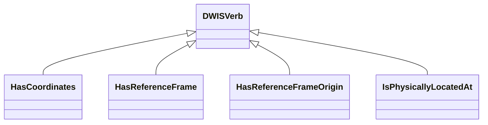
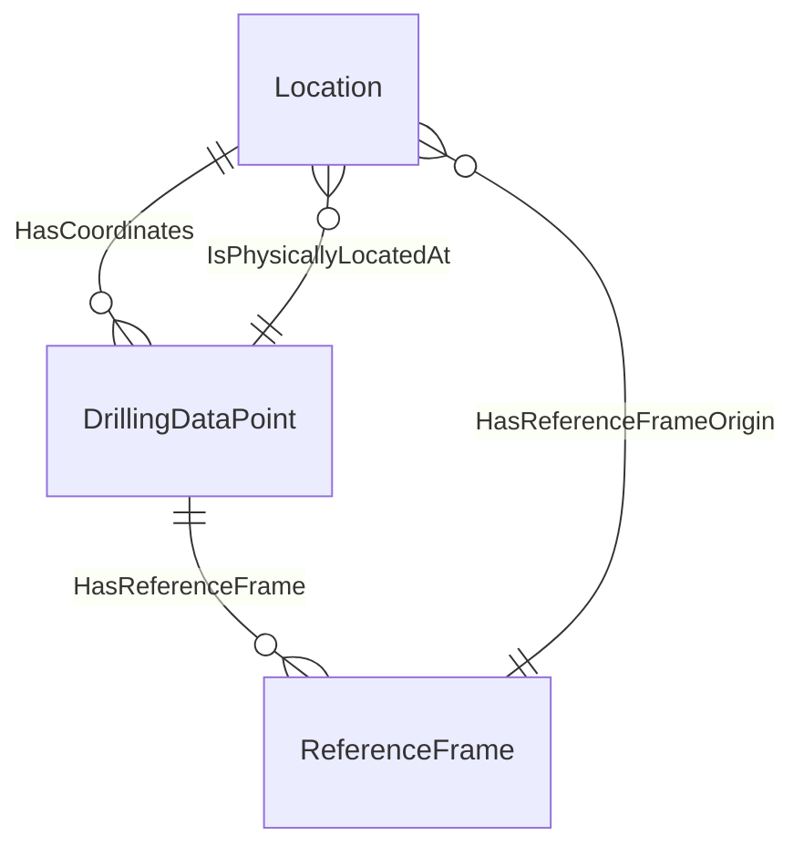

# PhysicalLocation<!-- DEFINITION SET HEADER -->
- Description: 
this category contains the vocabulary necessary to specify the location of various items on a rig. Coordinate systems are the main element here.

# Nouns
## Class Inheritance for Nouns
Here is a class inheritance diagram for the nouns contained in this definition set.

```mermaid
classDiagram
DWISNoun <|-- Location
Location <|-- VerticalReferenceLocation
VerticalReferenceLocation <|-- WGS84VerticalLocation
VerticalReferenceLocation <|-- CasingFlangeVerticalLocation
VerticalReferenceLocation <|-- CrownValveVerticalLocation
VerticalReferenceLocation <|-- DerrickFloorVerticalLocation
VerticalReferenceLocation <|-- KellyBushingVerticalLocation
VerticalReferenceLocation <|-- RotaryTableVerticalLocation
VerticalReferenceLocation <|-- StickUpHeightVerticalLocation
VerticalReferenceLocation <|-- MinDrillHeightVerticalLocation
VerticalReferenceLocation <|-- WellHeadVerticalLocation
VerticalReferenceLocation <|-- GroundLevelVerticalLocation
VerticalReferenceLocation <|-- SeaFloorVerticalLocation
VerticalReferenceLocation <|-- LowestAstronomicalTideVerticalLocation
VerticalReferenceLocation <|-- MeanSeaLevelVerticalLocation
VerticalReferenceLocation <|-- MeanHigherHighWaterVerticalLocation
VerticalReferenceLocation <|-- MeanHighWaterVerticalLocation
VerticalReferenceLocation <|-- MeanLowerLowWaterVerticalLocation
VerticalReferenceLocation <|-- MeanLowWaterVerticalLocation
VerticalReferenceLocation <|-- MeanTideLevelVerticalLocation
VerticalReferenceLocation <|-- KickOffVerticalLocation
Location <|-- PositionReferenceLocation
PositionReferenceLocation <|-- WGS84PositionLocation
PositionReferenceLocation <|-- WellHeadPositionLocation
PositionReferenceLocation <|-- ClusterPositionLocation
PositionReferenceLocation <|-- LeaseLinePositionLocation
Location <|-- AxialReferenceLocation
AxialReferenceLocation <|-- BottomShoulderAxialLocation
AxialReferenceLocation <|-- TopShoulderAxialLocation
Location <|-- AbscissaReferenceLocation
AbscissaReferenceLocation <|-- BottomOfStringReferenceLocation
AbscissaReferenceLocation <|-- TopOfStringReferenceLocation
AbscissaReferenceLocation <|-- ToolJoint1ReferenceLocation
AbscissaReferenceLocation <|-- ToolJoint2ReferenceLocation
AbscissaReferenceLocation <|-- ToolJoint3ReferenceLocation
AbscissaReferenceLocation <|-- ToolJoint4ReferenceLocation
AbscissaReferenceLocation <|-- LastCasingShoeReferenceLocation
AbscissaReferenceLocation <|-- HoleBottomLocation
AbscissaReferenceLocation <|-- TopOfRatHoleLocation
AbscissaReferenceLocation <|-- LedgeLocation
AbscissaReferenceLocation <|-- CuttingsBedLocation
AbscissaReferenceLocation <|-- FormationFluidTransferLocation
AbscissaReferenceLocation <|-- DifferentialStickingLocation
AbscissaReferenceLocation <|-- FormationCollapseLocation
AbscissaReferenceLocation <|-- PipeWashoutLocation
AbscissaReferenceLocation <|-- FormationWashoutLocation
Location <|-- AngleReferenceLocation
AngleReferenceLocation <|-- ScribeLineAngleLocation
AngleReferenceLocation <|-- GravityHighSideAngleLocation
AngleReferenceLocation <|-- MagneticHighSideAngleLocation
AngleReferenceLocation <|-- UpperSideAngleLocation
Location <|-- AzimuthReferenceLocation
AzimuthReferenceLocation <|-- TrueNorthAzimuthLocation
AzimuthReferenceLocation <|-- MagneticNorthAzimuthLocation
AzimuthReferenceLocation <|-- GridNorthAzimuthLocation
DWISNoun <|-- ReferenceFrame
ReferenceFrame <|-- OneDimensionalReferenceFrame
OneDimensionalReferenceFrame <|-- AngleReferenceFrame
OneDimensionalReferenceFrame <|-- OneDimensionalCartesianReferenceFrame
OneDimensionalCartesianReferenceFrame <|-- VerticalDepthFrame
OneDimensionalReferenceFrame <|-- OneDimensionalCurviLinearReferenceFrame
OneDimensionalCurviLinearReferenceFrame <|-- DrillStringCenterLineFrame
OneDimensionalCurviLinearReferenceFrame <|-- WellboreCenterLineFrame
ReferenceFrame <|-- DepthAndAngleFrame
ReferenceFrame <|-- TwoDimensionalReferenceFrame
TwoDimensionalReferenceFrame <|-- CartesianTwoDimensionalReferenceFrame
CartesianTwoDimensionalReferenceFrame <|-- NorthEastFrame
TwoDimensionalReferenceFrame <|-- PolarReferenceFrame
TwoDimensionalReferenceFrame <|-- RiemannianManifoldTwoDimensionalReferenceFrame
ReferenceFrame <|-- ThreeDimensionalReferenceFrame
ThreeDimensionalReferenceFrame <|-- CartesianThreeDimensionalReferenceFrame
CartesianThreeDimensionalReferenceFrame <|-- NorthEastTVDFrame
ThreeDimensionalReferenceFrame <|-- FrenetSerretReferenceFrame
ThreeDimensionalReferenceFrame <|-- RiemannianManifoldThreeDimensionalReferenceFrame
ThreeDimensionalReferenceFrame <|-- CylindricalReferenceFrame
ThreeDimensionalReferenceFrame <|-- SphericalReferenceFrame
ReferenceFrame <|-- FourDimensionalReferenceFrame
FourDimensionalReferenceFrame <|-- CartesianFourDimensionalReferenceFrame
FourDimensionalReferenceFrame <|-- RiemannianManifoldFourDimensionalReferenceFrame
```

## Location <!-- NOUN -->
- Display name: Location
- Parent class: [DWISNoun](./DWISSemantics.md#DWISNoun)
- Description: 
Physical location for a signal. Refers to: 1) a reference frame (via the HasReferenceFrame relation), that works as a system of coordinates 2) an origin (of type Location) via the HasReferenceFrameOrigin relation.
 - some coordinates
- Definition set: PhysicalLocation
- Examples:
## VerticalReferenceLocation <!-- NOUN -->
- Display name: VerticalReferenceLocation
- Parent class: [Location](./PhysicalLocation.md#Location)
- Description: 

- Definition set: PhysicalLocation
- Examples:
## WGS84VerticalLocation <!-- NOUN -->
- Display name: WGS84VerticalLocation
- Parent class: [VerticalReferenceLocation](./PhysicalLocation.md#VerticalReferenceLocation)
- Description: 

- Definition set: PhysicalLocation
- Examples:
## CasingFlangeVerticalLocation <!-- NOUN -->
- Display name: CasingFlangeVerticalLocation
- Parent class: [VerticalReferenceLocation](./PhysicalLocation.md#VerticalReferenceLocation)
- Description: 

- Definition set: PhysicalLocation
- Examples:
## CrownValveVerticalLocation <!-- NOUN -->
- Display name: CrownValveVerticalLocation
- Parent class: [VerticalReferenceLocation](./PhysicalLocation.md#VerticalReferenceLocation)
- Description: 

- Definition set: PhysicalLocation
- Examples:
## DerrickFloorVerticalLocation <!-- NOUN -->
- Display name: DerrickFloorVerticalLocation
- Parent class: [VerticalReferenceLocation](./PhysicalLocation.md#VerticalReferenceLocation)
- Description: 

- Definition set: PhysicalLocation
- Examples:
## KellyBushingVerticalLocation <!-- NOUN -->
- Display name: KellyBushingVerticalLocation
- Parent class: [VerticalReferenceLocation](./PhysicalLocation.md#VerticalReferenceLocation)
- Description: 

- Definition set: PhysicalLocation
- Examples:
## RotaryTableVerticalLocation <!-- NOUN -->
- Display name: RotaryTableVerticalLocation
- Parent class: [VerticalReferenceLocation](./PhysicalLocation.md#VerticalReferenceLocation)
- Description: 

- Definition set: PhysicalLocation
- Examples:
## StickUpHeightVerticalLocation <!-- NOUN -->
- Display name: StickUpHeightVerticalLocation
- Parent class: [VerticalReferenceLocation](./PhysicalLocation.md#VerticalReferenceLocation)
- Description: 

- Definition set: PhysicalLocation
- Examples:
## MinDrillHeightVerticalLocation <!-- NOUN -->
- Display name: MinDrillHeightVerticalLocation
- Parent class: [VerticalReferenceLocation](./PhysicalLocation.md#VerticalReferenceLocation)
- Description: 

- Definition set: PhysicalLocation
- Examples:
## WellHeadVerticalLocation <!-- NOUN -->
- Display name: WellHeadVerticalLocation
- Parent class: [VerticalReferenceLocation](./PhysicalLocation.md#VerticalReferenceLocation)
- Description: 

- Definition set: PhysicalLocation
- Examples:
## GroundLevelVerticalLocation <!-- NOUN -->
- Display name: GroundLevelVerticalLocation
- Parent class: [VerticalReferenceLocation](./PhysicalLocation.md#VerticalReferenceLocation)
- Description: 

- Definition set: PhysicalLocation
- Examples:
## SeaFloorVerticalLocation <!-- NOUN -->
- Display name: SeaFloorVerticalLocation
- Parent class: [VerticalReferenceLocation](./PhysicalLocation.md#VerticalReferenceLocation)
- Description: 

- Definition set: PhysicalLocation
- Examples:
## LowestAstronomicalTideVerticalLocation <!-- NOUN -->
- Display name: LowestAstronomicalTideVerticalLocation
- Parent class: [VerticalReferenceLocation](./PhysicalLocation.md#VerticalReferenceLocation)
- Description: 

- Definition set: PhysicalLocation
- Examples:
## MeanSeaLevelVerticalLocation <!-- NOUN -->
- Display name: MeanSeaLevelVerticalLocation
- Parent class: [VerticalReferenceLocation](./PhysicalLocation.md#VerticalReferenceLocation)
- Description: 

- Definition set: PhysicalLocation
- Examples:
## MeanHigherHighWaterVerticalLocation <!-- NOUN -->
- Display name: MeanHigherHighWaterVerticalLocation
- Parent class: [VerticalReferenceLocation](./PhysicalLocation.md#VerticalReferenceLocation)
- Description: 

- Definition set: PhysicalLocation
- Examples:
## MeanHighWaterVerticalLocation <!-- NOUN -->
- Display name: MeanHighWaterVerticalLocation
- Parent class: [VerticalReferenceLocation](./PhysicalLocation.md#VerticalReferenceLocation)
- Description: 

- Definition set: PhysicalLocation
- Examples:
## MeanLowerLowWaterVerticalLocation <!-- NOUN -->
- Display name: MeanLowerLowWaterVerticalLocation
- Parent class: [VerticalReferenceLocation](./PhysicalLocation.md#VerticalReferenceLocation)
- Description: 

- Definition set: PhysicalLocation
- Examples:
## MeanLowWaterVerticalLocation <!-- NOUN -->
- Display name: MeanLowWaterVerticalLocation
- Parent class: [VerticalReferenceLocation](./PhysicalLocation.md#VerticalReferenceLocation)
- Description: 

- Definition set: PhysicalLocation
- Examples:
## MeanTideLevelVerticalLocation <!-- NOUN -->
- Display name: MeanTideLevelVerticalLocation
- Parent class: [VerticalReferenceLocation](./PhysicalLocation.md#VerticalReferenceLocation)
- Description: 

- Definition set: PhysicalLocation
- Examples:
## KickOffVerticalLocation <!-- NOUN -->
- Display name: KickOffVerticalLocation
- Parent class: [VerticalReferenceLocation](./PhysicalLocation.md#VerticalReferenceLocation)
- Description: 

- Definition set: PhysicalLocation
- Examples:
## PositionReferenceLocation <!-- NOUN -->
- Display name: PositionReferenceLocation
- Parent class: [Location](./PhysicalLocation.md#Location)
- Description: 

- Definition set: PhysicalLocation
- Examples:
## WGS84PositionLocation <!-- NOUN -->
- Display name: WGS84PositionLocation
- Parent class: [PositionReferenceLocation](./PhysicalLocation.md#PositionReferenceLocation)
- Description: 

- Definition set: PhysicalLocation
- Examples:
## WellHeadPositionLocation <!-- NOUN -->
- Display name: WellHeadPositionLocation
- Parent class: [PositionReferenceLocation](./PhysicalLocation.md#PositionReferenceLocation)
- Description: 

- Definition set: PhysicalLocation
- Examples:
## ClusterPositionLocation <!-- NOUN -->
- Display name: ClusterPositionLocation
- Parent class: [PositionReferenceLocation](./PhysicalLocation.md#PositionReferenceLocation)
- Description: 

- Definition set: PhysicalLocation
- Examples:
## LeaseLinePositionLocation <!-- NOUN -->
- Display name: LeaseLinePositionLocation
- Parent class: [PositionReferenceLocation](./PhysicalLocation.md#PositionReferenceLocation)
- Description: 

- Definition set: PhysicalLocation
- Examples:
## AxialReferenceLocation <!-- NOUN -->
- Display name: AxialReferenceLocation
- Parent class: [Location](./PhysicalLocation.md#Location)
- Description: 

- Definition set: PhysicalLocation
- Examples:
## BottomShoulderAxialLocation <!-- NOUN -->
- Display name: BottomShoulderAxialLocation
- Parent class: [AxialReferenceLocation](./PhysicalLocation.md#AxialReferenceLocation)
- Description: 

- Definition set: PhysicalLocation
- Examples:
## TopShoulderAxialLocation <!-- NOUN -->
- Display name: TopShoulderAxialLocation
- Parent class: [AxialReferenceLocation](./PhysicalLocation.md#AxialReferenceLocation)
- Description: 

- Definition set: PhysicalLocation
- Examples:
## AbscissaReferenceLocation <!-- NOUN -->
- Display name: AbscissaReferenceLocation
- Parent class: [Location](./PhysicalLocation.md#Location)
- Description: 

- Definition set: PhysicalLocation
- Examples:
## BottomOfStringReferenceLocation <!-- NOUN -->
- Display name: BottomOfStringReferenceLocation
- Parent class: [AbscissaReferenceLocation](./PhysicalLocation.md#AbscissaReferenceLocation)
- Description: 

- Definition set: PhysicalLocation
- Examples:
## TopOfStringReferenceLocation <!-- NOUN -->
- Display name: TopOfStringReferenceLocation
- Parent class: [AbscissaReferenceLocation](./PhysicalLocation.md#AbscissaReferenceLocation)
- Description: 

- Definition set: PhysicalLocation
- Examples:
## ToolJoint1ReferenceLocation <!-- NOUN -->
- Display name: ToolJoint1ReferenceLocation
- Parent class: [AbscissaReferenceLocation](./PhysicalLocation.md#AbscissaReferenceLocation)
- Description: 

- Definition set: PhysicalLocation
- Examples:
## ToolJoint2ReferenceLocation <!-- NOUN -->
- Display name: ToolJoint2ReferenceLocation
- Parent class: [AbscissaReferenceLocation](./PhysicalLocation.md#AbscissaReferenceLocation)
- Description: 

- Definition set: PhysicalLocation
- Examples:
## ToolJoint3ReferenceLocation <!-- NOUN -->
- Display name: ToolJoint3ReferenceLocation
- Parent class: [AbscissaReferenceLocation](./PhysicalLocation.md#AbscissaReferenceLocation)
- Description: 

- Definition set: PhysicalLocation
- Examples:
## ToolJoint4ReferenceLocation <!-- NOUN -->
- Display name: ToolJoint4ReferenceLocation
- Parent class: [AbscissaReferenceLocation](./PhysicalLocation.md#AbscissaReferenceLocation)
- Description: 

- Definition set: PhysicalLocation
- Examples:
## LastCasingShoeReferenceLocation <!-- NOUN -->
- Display name: LastCasingShoeReferenceLocation
- Parent class: [AbscissaReferenceLocation](./PhysicalLocation.md#AbscissaReferenceLocation)
- Description: 

- Definition set: PhysicalLocation
- Examples:
## HoleBottomLocation <!-- NOUN -->
- Display name: HoleBottomLocation
- Parent class: [AbscissaReferenceLocation](./PhysicalLocation.md#AbscissaReferenceLocation)
- Description: 

- Definition set: PhysicalLocation
- Examples:
## TopOfRatHoleLocation <!-- NOUN -->
- Display name: TopOfRatHoleLocation
- Parent class: [AbscissaReferenceLocation](./PhysicalLocation.md#AbscissaReferenceLocation)
- Description: 

- Definition set: PhysicalLocation
- Examples:
## LedgeLocation <!-- NOUN -->
- Display name: LedgeLocation
- Parent class: [AbscissaReferenceLocation](./PhysicalLocation.md#AbscissaReferenceLocation)
- Description: 

- Definition set: PhysicalLocation
- Examples:
## CuttingsBedLocation <!-- NOUN -->
- Display name: CuttingsBedLocation
- Parent class: [AbscissaReferenceLocation](./PhysicalLocation.md#AbscissaReferenceLocation)
- Description: 

- Definition set: PhysicalLocation
- Examples:
## FormationFluidTransferLocation <!-- NOUN -->
- Display name: FormationFluidTransferLocation
- Parent class: [AbscissaReferenceLocation](./PhysicalLocation.md#AbscissaReferenceLocation)
- Description: 

- Definition set: PhysicalLocation
- Examples:
## DifferentialStickingLocation <!-- NOUN -->
- Display name: DifferentialStickingLocation
- Parent class: [AbscissaReferenceLocation](./PhysicalLocation.md#AbscissaReferenceLocation)
- Description: 

- Definition set: PhysicalLocation
- Examples:
## FormationCollapseLocation <!-- NOUN -->
- Display name: FormationCollapseLocation
- Parent class: [AbscissaReferenceLocation](./PhysicalLocation.md#AbscissaReferenceLocation)
- Description: 

- Definition set: PhysicalLocation
- Examples:
## PipeWashoutLocation <!-- NOUN -->
- Display name: PipeWashoutLocation
- Parent class: [AbscissaReferenceLocation](./PhysicalLocation.md#AbscissaReferenceLocation)
- Description: 

- Definition set: PhysicalLocation
- Examples:
## FormationWashoutLocation <!-- NOUN -->
- Display name: FormationWashoutLocation
- Parent class: [AbscissaReferenceLocation](./PhysicalLocation.md#AbscissaReferenceLocation)
- Description: 

- Definition set: PhysicalLocation
- Examples:
## AngleReferenceLocation <!-- NOUN -->
- Display name: AngleReferenceLocation
- Parent class: [Location](./PhysicalLocation.md#Location)
- Description: 

- Definition set: PhysicalLocation
- Examples:
## ScribeLineAngleLocation <!-- NOUN -->
- Display name: ScribeLineAngleLocation
- Parent class: [AngleReferenceLocation](./PhysicalLocation.md#AngleReferenceLocation)
- Description: 

- Definition set: PhysicalLocation
- Examples:
## GravityHighSideAngleLocation <!-- NOUN -->
- Display name: GravityHighSideAngleLocation
- Parent class: [AngleReferenceLocation](./PhysicalLocation.md#AngleReferenceLocation)
- Description: 

- Definition set: PhysicalLocation
- Examples:
## MagneticHighSideAngleLocation <!-- NOUN -->
- Display name: MagneticHighSideAngleLocation
- Parent class: [AngleReferenceLocation](./PhysicalLocation.md#AngleReferenceLocation)
- Description: 

- Definition set: PhysicalLocation
- Examples:
## UpperSideAngleLocation <!-- NOUN -->
- Display name: UpperSideAngleLocation
- Parent class: [AngleReferenceLocation](./PhysicalLocation.md#AngleReferenceLocation)
- Description: 

- Definition set: PhysicalLocation
- Examples:
## AzimuthReferenceLocation <!-- NOUN -->
- Display name: AzimuthReferenceLocation
- Parent class: [Location](./PhysicalLocation.md#Location)
- Description: 

- Definition set: PhysicalLocation
- Examples:
## TrueNorthAzimuthLocation <!-- NOUN -->
- Display name: TrueNorthAzimuthLocation
- Parent class: [AzimuthReferenceLocation](./PhysicalLocation.md#AzimuthReferenceLocation)
- Description: 

- Definition set: PhysicalLocation
- Examples:
## MagneticNorthAzimuthLocation <!-- NOUN -->
- Display name: MagneticNorthAzimuthLocation
- Parent class: [AzimuthReferenceLocation](./PhysicalLocation.md#AzimuthReferenceLocation)
- Description: 

- Definition set: PhysicalLocation
- Examples:
## GridNorthAzimuthLocation <!-- NOUN -->
- Display name: GridNorthAzimuthLocation
- Parent class: [AzimuthReferenceLocation](./PhysicalLocation.md#AzimuthReferenceLocation)
- Description: 

- Definition set: PhysicalLocation
- Examples:
## ReferenceFrame <!-- NOUN -->
- Display name: ReferenceFrame
- Parent class: [DWISNoun](./DWISSemantics.md#DWISNoun)
- Description: 
Represents a system of coordinates
- Definition set: PhysicalLocation
- Examples:
## OneDimensionalReferenceFrame <!-- NOUN -->
- Display name: OneDimensionalReferenceFrame
- Parent class: [ReferenceFrame](./PhysicalLocation.md#ReferenceFrame)
- Attributes:
  - PostiveUpward
    - Type: bool
    - Description: 
- Description: 

- Definition set: PhysicalLocation
- Examples:
## AngleReferenceFrame <!-- NOUN -->
- Display name: AngleReferenceFrame
- Parent class: [OneDimensionalReferenceFrame](./PhysicalLocation.md#OneDimensionalReferenceFrame)
- Description: 

- Definition set: PhysicalLocation
- Examples:
## OneDimensionalCartesianReferenceFrame <!-- NOUN -->
- Display name: OneDimensionalCartesianReferenceFrame
- Parent class: [OneDimensionalReferenceFrame](./PhysicalLocation.md#OneDimensionalReferenceFrame)
- Description: 

- Definition set: PhysicalLocation
- Examples:
## VerticalDepthFrame <!-- NOUN -->
- Display name: VerticalDepthFrame
- Parent class: [OneDimensionalCartesianReferenceFrame](./PhysicalLocation.md#OneDimensionalCartesianReferenceFrame)
- Description: 

- Definition set: PhysicalLocation
- Examples:
## OneDimensionalCurviLinearReferenceFrame <!-- NOUN -->
- Display name: OneDimensionalCurviLinearReferenceFrame
- Parent class: [OneDimensionalReferenceFrame](./PhysicalLocation.md#OneDimensionalReferenceFrame)
- Description: 

- Definition set: PhysicalLocation
- Examples:
## DrillStringCenterLineFrame <!-- NOUN -->
- Display name: DrillStringCenterLineFrame
- Parent class: [OneDimensionalCurviLinearReferenceFrame](./PhysicalLocation.md#OneDimensionalCurviLinearReferenceFrame)
- Description: 

- Definition set: PhysicalLocation
- Examples:
## WellboreCenterLineFrame <!-- NOUN -->
- Display name: WellboreCenterLineFrame
- Parent class: [OneDimensionalCurviLinearReferenceFrame](./PhysicalLocation.md#OneDimensionalCurviLinearReferenceFrame)
- Description: 

- Definition set: PhysicalLocation
- Examples:
## DepthAndAngleFrame <!-- NOUN -->
- Display name: DepthAndAngleFrame
- Parent class: [ReferenceFrame](./PhysicalLocation.md#ReferenceFrame)
- Description: 

- Definition set: PhysicalLocation
- Examples:
## TwoDimensionalReferenceFrame <!-- NOUN -->
- Display name: TwoDimensionalReferenceFrame
- Parent class: [ReferenceFrame](./PhysicalLocation.md#ReferenceFrame)
- Description: 

- Definition set: PhysicalLocation
- Examples:
## CartesianTwoDimensionalReferenceFrame <!-- NOUN -->
- Display name: CartesianTwoDimensionalReferenceFrame
- Parent class: [TwoDimensionalReferenceFrame](./PhysicalLocation.md#TwoDimensionalReferenceFrame)
- Description: 

- Definition set: PhysicalLocation
- Examples:
## NorthEastFrame <!-- NOUN -->
- Display name: NorthEastFrame
- Parent class: [CartesianTwoDimensionalReferenceFrame](./PhysicalLocation.md#CartesianTwoDimensionalReferenceFrame)
- Description: 

- Definition set: PhysicalLocation
- Examples:
## PolarReferenceFrame <!-- NOUN -->
- Display name: PolarReferenceFrame
- Parent class: [TwoDimensionalReferenceFrame](./PhysicalLocation.md#TwoDimensionalReferenceFrame)
- Description: 

- Definition set: PhysicalLocation
- Examples:
## RiemannianManifoldTwoDimensionalReferenceFrame <!-- NOUN -->
- Display name: RiemannianManifoldTwoDimensionalReferenceFrame
- Parent class: [TwoDimensionalReferenceFrame](./PhysicalLocation.md#TwoDimensionalReferenceFrame)
- Description: 

- Definition set: PhysicalLocation
- Examples:
## ThreeDimensionalReferenceFrame <!-- NOUN -->
- Display name: ThreeDimensionalReferenceFrame
- Parent class: [ReferenceFrame](./PhysicalLocation.md#ReferenceFrame)
- Description: 

- Definition set: PhysicalLocation
- Examples:
## CartesianThreeDimensionalReferenceFrame <!-- NOUN -->
- Display name: CartesianThreeDimensionalReferenceFrame
- Parent class: [ThreeDimensionalReferenceFrame](./PhysicalLocation.md#ThreeDimensionalReferenceFrame)
- Description: 

- Definition set: PhysicalLocation
- Examples:
## NorthEastTVDFrame <!-- NOUN -->
- Display name: NorthEastTVDFrame
- Parent class: [CartesianThreeDimensionalReferenceFrame](./PhysicalLocation.md#CartesianThreeDimensionalReferenceFrame)
- Description: 

- Definition set: PhysicalLocation
- Examples:
## FrenetSerretReferenceFrame <!-- NOUN -->
- Display name: FrenetSerretReferenceFrame
- Parent class: [ThreeDimensionalReferenceFrame](./PhysicalLocation.md#ThreeDimensionalReferenceFrame)
- Description: 

- Definition set: PhysicalLocation
- Examples:
## RiemannianManifoldThreeDimensionalReferenceFrame <!-- NOUN -->
- Display name: RiemannianManifoldThreeDimensionalReferenceFrame
- Parent class: [ThreeDimensionalReferenceFrame](./PhysicalLocation.md#ThreeDimensionalReferenceFrame)
- Description: 

- Definition set: PhysicalLocation
- Examples:
## CylindricalReferenceFrame <!-- NOUN -->
- Display name: CylindricalReferenceFrame
- Parent class: [ThreeDimensionalReferenceFrame](./PhysicalLocation.md#ThreeDimensionalReferenceFrame)
- Description: 

- Definition set: PhysicalLocation
- Examples:
## SphericalReferenceFrame <!-- NOUN -->
- Display name: SphericalReferenceFrame
- Parent class: [ThreeDimensionalReferenceFrame](./PhysicalLocation.md#ThreeDimensionalReferenceFrame)
- Description: 

- Definition set: PhysicalLocation
- Examples:
## FourDimensionalReferenceFrame <!-- NOUN -->
- Display name: FourDimensionalReferenceFrame
- Parent class: [ReferenceFrame](./PhysicalLocation.md#ReferenceFrame)
- Description: 

- Definition set: PhysicalLocation
- Examples:
## CartesianFourDimensionalReferenceFrame <!-- NOUN -->
- Display name: CartesianFourDimensionalReferenceFrame
- Parent class: [FourDimensionalReferenceFrame](./PhysicalLocation.md#FourDimensionalReferenceFrame)
- Description: 

- Definition set: PhysicalLocation
- Examples:
## RiemannianManifoldFourDimensionalReferenceFrame <!-- NOUN -->
- Display name: RiemannianManifoldFourDimensionalReferenceFrame
- Parent class: [FourDimensionalReferenceFrame](./PhysicalLocation.md#FourDimensionalReferenceFrame)
- Description: 

- Definition set: PhysicalLocation
- Examples:
# Verbs
## Class Inheritance for Verbs
Here is a class inheritance diagram for the verbs contained in this definition set.

## Relations
Here is a graph representing the relations that can be made with the verbs defined in this definition set.

## HasCoordinates <!-- VERB -->
- Display name: HasCoordinates
- Parent verb: [DWISVerb](./DWISSemantics.md#DWISVerb)
- Subject class: [Location](./PhysicalLocation.md#Location)
- Object class: [DrillingDataPoint](./DrillingDataSemantics.md#DrillingDataPoint)
- Definition set: PhysicalLocation
- Description: 

- Examples:
## HasReferenceFrame <!-- VERB -->
- Display name: HasReferenceFrame
- Parent verb: [DWISVerb](./DWISSemantics.md#DWISVerb)
- Subject class: [DrillingDataPoint](./DrillingDataSemantics.md#DrillingDataPoint)
- Object class: [ReferenceFrame](./PhysicalLocation.md#ReferenceFrame)
- Definition set: PhysicalLocation
- Description: 

- Examples:
## HasReferenceFrameOrigin <!-- VERB -->
- Display name: HasReferenceFrameOrigin
- Parent verb: [DWISVerb](./DWISSemantics.md#DWISVerb)
- Subject class: [ReferenceFrame](./PhysicalLocation.md#ReferenceFrame)
- Object class: [Location](./PhysicalLocation.md#Location)
- Definition set: PhysicalLocation
- Description: 

- Examples:
## IsPhysicallyLocatedAt <!-- VERB -->
- Display name: IsPhysicallyLocatedAt
- Parent verb: [DWISVerb](./DWISSemantics.md#DWISVerb)
- Subject class: [DrillingDataPoint](./DrillingDataSemantics.md#DrillingDataPoint)
- Object class: [Location](./PhysicalLocation.md#Location)
- Definition set: PhysicalLocation
- Description: 

- Examples:
