# PhysicalLocation<!-- DEFINITION SET HEADER -->
- Description: 
this category contains the vocabulary necessary to specify the location of various items on a rig. Coordinate systems are the main element here.

# Nouns
## Class Inheritance for Nouns
Here is a class inheritance diagram for the nouns contained in this definition set.

```mermaid
classDiagram
DWISNoun <|-- Location
Location <|-- VerticalReferenceLocation
VerticalReferenceLocation <|-- WGS84VerticalLocation
VerticalReferenceLocation <|-- CasingFlangeVerticalLocation
VerticalReferenceLocation <|-- CrownValveVerticalLocation
VerticalReferenceLocation <|-- DerrickFloorVerticalLocation
VerticalReferenceLocation <|-- KellyBushingVerticalLocation
VerticalReferenceLocation <|-- RotaryTableVerticalLocation
VerticalReferenceLocation <|-- StickUpHeightVerticalLocation
VerticalReferenceLocation <|-- MinDrillHeightVerticalLocation
VerticalReferenceLocation <|-- WellHeadVerticalLocation
VerticalReferenceLocation <|-- GroundLevelVerticalLocation
VerticalReferenceLocation <|-- SeaFloorVerticalLocation
VerticalReferenceLocation <|-- LowestAstronomicalTideVerticalLocation
VerticalReferenceLocation <|-- MeanSeaLevelVerticalLocation
VerticalReferenceLocation <|-- MeanHigherHighWaterVerticalLocation
VerticalReferenceLocation <|-- MeanHighWaterVerticalLocation
VerticalReferenceLocation <|-- MeanLowerLowWaterVerticalLocation
VerticalReferenceLocation <|-- MeanLowWaterVerticalLocation
VerticalReferenceLocation <|-- MeanTideLevelVerticalLocation
VerticalReferenceLocation <|-- KickOffVerticalLocation
Location <|-- PositionReferenceLocation
PositionReferenceLocation <|-- WGS84PositionLocation
PositionReferenceLocation <|-- WellHeadPositionLocation
PositionReferenceLocation <|-- ClusterPositionLocation
PositionReferenceLocation <|-- LeaseLinePositionLocation
Location <|-- AxialReferenceLocation
AxialReferenceLocation <|-- BottomShoulderAxialLocation
AxialReferenceLocation <|-- TopShoulderAxialLocation
Location <|-- AbscissaReferenceLocation
AbscissaReferenceLocation <|-- BottomOfStringReferenceLocation
AbscissaReferenceLocation <|-- TangencyLength
AbscissaReferenceLocation <|-- RotatingDriveSystemLocation
AbscissaReferenceLocation <|-- TopOfStringReferenceLocation
AbscissaReferenceLocation <|-- ToolJoint1ReferenceLocation
AbscissaReferenceLocation <|-- ToolJoint2ReferenceLocation
AbscissaReferenceLocation <|-- ToolJoint3ReferenceLocation
AbscissaReferenceLocation <|-- ToolJoint4ReferenceLocation
AbscissaReferenceLocation <|-- LastCasingShoeReferenceLocation
AbscissaReferenceLocation <|-- HoleBottomLocation
AbscissaReferenceLocation <|-- TopOfRatHoleLocation
AbscissaReferenceLocation <|-- LedgeLocation
AbscissaReferenceLocation <|-- CuttingsBedLocation
AbscissaReferenceLocation <|-- FormationFluidTransferLocation
AbscissaReferenceLocation <|-- DifferentialStickingLocation
AbscissaReferenceLocation <|-- FormationCollapseLocation
AbscissaReferenceLocation <|-- PipeWashoutLocation
AbscissaReferenceLocation <|-- FormationWashoutLocation
Location <|-- AngleReferenceLocation
AngleReferenceLocation <|-- ScribeLineAngleLocation
AngleReferenceLocation <|-- GravityHighSideAngleLocation
AngleReferenceLocation <|-- MagneticHighSideAngleLocation
AngleReferenceLocation <|-- UpperSideAngleLocation
Location <|-- AzimuthReferenceLocation
AzimuthReferenceLocation <|-- TrueNorthAzimuthLocation
AzimuthReferenceLocation <|-- MagneticNorthAzimuthLocation
AzimuthReferenceLocation <|-- GridNorthAzimuthLocation
DWISNoun <|-- Axis
Axis <|-- XAxis
Axis <|-- YAxis
Axis <|-- ZAxis
DWISNoun <|-- ReferenceFrame
ReferenceFrame <|-- OneDimensionalReferenceFrame
OneDimensionalReferenceFrame <|-- AngleReferenceFrame
OneDimensionalReferenceFrame <|-- RadialReferenceFrame
OneDimensionalReferenceFrame <|-- TangentialReferenceFrame
OneDimensionalReferenceFrame <|-- AxialReferenceFrame
OneDimensionalReferenceFrame <|-- OneDimensionalCartesianReferenceFrame
OneDimensionalCartesianReferenceFrame <|-- HorizontalDirectionFrame
OneDimensionalCartesianReferenceFrame <|-- VerticalDirectionFrame
VerticalDirectionFrame <|-- VerticalDepthFrame
VerticalDirectionFrame <|-- VerticalElevationFrame
HorizontalDirectionFrame <|-- NorthDirectionFrame
HorizontalDirectionFrame <|-- EastDirectionFrame
OneDimensionalCartesianReferenceFrame <|-- LengthDirectionFrame
OneDimensionalCartesianReferenceFrame <|-- WidthDirectionFrame
OneDimensionalCartesianReferenceFrame <|-- HeightDirectionFrame
OneDimensionalReferenceFrame <|-- OneDimensionalCurviLinearReferenceFrame
OneDimensionalCurviLinearReferenceFrame <|-- DrillStringCenterLineFrame
OneDimensionalCurviLinearReferenceFrame <|-- WellboreCenterLineFrame
ReferenceFrame <|-- DepthAndAngleFrame
ReferenceFrame <|-- TwoDimensionalReferenceFrame
TwoDimensionalReferenceFrame <|-- CartesianTwoDimensionalReferenceFrame
CartesianTwoDimensionalReferenceFrame <|-- NorthEastFrame
TwoDimensionalReferenceFrame <|-- PolarReferenceFrame
TwoDimensionalReferenceFrame <|-- RiemannianManifoldTwoDimensionalReferenceFrame
ReferenceFrame <|-- ThreeDimensionalReferenceFrame
ThreeDimensionalReferenceFrame <|-- CartesianThreeDimensionalReferenceFrame
CartesianThreeDimensionalReferenceFrame <|-- NorthEastTVDFrame
ThreeDimensionalReferenceFrame <|-- FrenetSerretReferenceFrame
ThreeDimensionalReferenceFrame <|-- RiemannianManifoldThreeDimensionalReferenceFrame
ThreeDimensionalReferenceFrame <|-- CylindricalReferenceFrame
ThreeDimensionalReferenceFrame <|-- SphericalReferenceFrame
ReferenceFrame <|-- FourDimensionalReferenceFrame
FourDimensionalReferenceFrame <|-- CartesianFourDimensionalReferenceFrame
FourDimensionalReferenceFrame <|-- RiemannianManifoldFourDimensionalReferenceFrame
```

## Location <!-- NOUN -->
- Display name: Location
- Parent class: [DWISNoun](./DWISSemantics.md#DWISNoun)
- Description: 
Physical location for a signal. Refers to: 1) a reference frame (via the HasReferenceFrame relation), that works as a system of coordinates 2) an origin (of type Location) via the HasReferenceFrameOrigin relation.
 - some coordinates
- Definition set: PhysicalLocation
- Examples:
```dwis location
Location:location
location BelongsToClass Location
```
An example semantic graph looks like as follow:

An example SparQL query looks like this:
```sparql
PREFIX rdf: <http://www.w3.org/1999/02/22-rdf-syntax-ns#>
PREFIX ddhub: <http://ddhub.no/>
PREFIX quantity: <http://ddhub.no/UnitAndQuantity>
SELECT ?location
WHERE {
	?location rdf:type ddhub:Location .
	?location rdf:type ddhub:Location .
}
```
This example declares the Location reference location.
## VerticalReferenceLocation <!-- NOUN -->
- Display name: VerticalReferenceLocation
- Parent class: [Location](./PhysicalLocation.md#Location)
- Description: 
Reference location for VerticalReferenceLocation.
- Definition set: PhysicalLocation
- Examples:
```dwis verticalReferenceLocation
Location:verticalReferenceLocation
verticalReferenceLocation BelongsToClass VerticalReferenceLocation
```
An example semantic graph looks like as follow:

An example SparQL query looks like this:
```sparql
PREFIX rdf: <http://www.w3.org/1999/02/22-rdf-syntax-ns#>
PREFIX ddhub: <http://ddhub.no/>
PREFIX quantity: <http://ddhub.no/UnitAndQuantity>
SELECT ?verticalReferenceLocation
WHERE {
	?verticalReferenceLocation rdf:type ddhub:Location .
	?verticalReferenceLocation rdf:type ddhub:VerticalReferenceLocation .
}
```
This example declares the VerticalReferenceLocation reference location.
## WGS84VerticalLocation <!-- NOUN -->
- Display name: WGS84VerticalLocation
- Parent class: [VerticalReferenceLocation](./PhysicalLocation.md#VerticalReferenceLocation)
- Description: 
Reference location for WGS84VerticalLocation.
- Definition set: PhysicalLocation
- Examples:
```dwis wGS84VerticalLocation
Location:wGS84VerticalLocation
wGS84VerticalLocation BelongsToClass WGS84VerticalLocation
```
An example semantic graph looks like as follow:

An example SparQL query looks like this:
```sparql
PREFIX rdf: <http://www.w3.org/1999/02/22-rdf-syntax-ns#>
PREFIX ddhub: <http://ddhub.no/>
PREFIX quantity: <http://ddhub.no/UnitAndQuantity>
SELECT ?wGS84VerticalLocation
WHERE {
	?wGS84VerticalLocation rdf:type ddhub:Location .
	?wGS84VerticalLocation rdf:type ddhub:WGS84VerticalLocation .
}
```
This example declares the WGS84VerticalLocation reference location.
## CasingFlangeVerticalLocation <!-- NOUN -->
- Display name: CasingFlangeVerticalLocation
- Parent class: [VerticalReferenceLocation](./PhysicalLocation.md#VerticalReferenceLocation)
- Description: 
Reference location for CasingFlangeVerticalLocation.
- Definition set: PhysicalLocation
- Examples:
```dwis casingFlangeVerticalLocation
Location:casingFlangeVerticalLocation
casingFlangeVerticalLocation BelongsToClass CasingFlangeVerticalLocation
```
An example semantic graph looks like as follow:

An example SparQL query looks like this:
```sparql
PREFIX rdf: <http://www.w3.org/1999/02/22-rdf-syntax-ns#>
PREFIX ddhub: <http://ddhub.no/>
PREFIX quantity: <http://ddhub.no/UnitAndQuantity>
SELECT ?casingFlangeVerticalLocation
WHERE {
	?casingFlangeVerticalLocation rdf:type ddhub:Location .
	?casingFlangeVerticalLocation rdf:type ddhub:CasingFlangeVerticalLocation .
}
```
This example declares the CasingFlangeVerticalLocation reference location.
## CrownValveVerticalLocation <!-- NOUN -->
- Display name: CrownValveVerticalLocation
- Parent class: [VerticalReferenceLocation](./PhysicalLocation.md#VerticalReferenceLocation)
- Description: 
Reference location for CrownValveVerticalLocation.
- Definition set: PhysicalLocation
- Examples:
```dwis crownValveVerticalLocation
Location:crownValveVerticalLocation
crownValveVerticalLocation BelongsToClass CrownValveVerticalLocation
```
An example semantic graph looks like as follow:

An example SparQL query looks like this:
```sparql
PREFIX rdf: <http://www.w3.org/1999/02/22-rdf-syntax-ns#>
PREFIX ddhub: <http://ddhub.no/>
PREFIX quantity: <http://ddhub.no/UnitAndQuantity>
SELECT ?crownValveVerticalLocation
WHERE {
	?crownValveVerticalLocation rdf:type ddhub:Location .
	?crownValveVerticalLocation rdf:type ddhub:CrownValveVerticalLocation .
}
```
This example declares the CrownValveVerticalLocation reference location.
## DerrickFloorVerticalLocation <!-- NOUN -->
- Display name: DerrickFloorVerticalLocation
- Parent class: [VerticalReferenceLocation](./PhysicalLocation.md#VerticalReferenceLocation)
- Description: 
Reference location for DerrickFloorVerticalLocation.
- Definition set: PhysicalLocation
- Examples:
```dwis derrickFloorVerticalLocation
Location:derrickFloorVerticalLocation
derrickFloorVerticalLocation BelongsToClass DerrickFloorVerticalLocation
```
An example semantic graph looks like as follow:

An example SparQL query looks like this:
```sparql
PREFIX rdf: <http://www.w3.org/1999/02/22-rdf-syntax-ns#>
PREFIX ddhub: <http://ddhub.no/>
PREFIX quantity: <http://ddhub.no/UnitAndQuantity>
SELECT ?derrickFloorVerticalLocation
WHERE {
	?derrickFloorVerticalLocation rdf:type ddhub:Location .
	?derrickFloorVerticalLocation rdf:type ddhub:DerrickFloorVerticalLocation .
}
```
This example declares the DerrickFloorVerticalLocation reference location.
## KellyBushingVerticalLocation <!-- NOUN -->
- Display name: KellyBushingVerticalLocation
- Parent class: [VerticalReferenceLocation](./PhysicalLocation.md#VerticalReferenceLocation)
- Description: 
Reference location for KellyBushingVerticalLocation.
- Definition set: PhysicalLocation
- Examples:
```dwis kellyBushingVerticalLocation
Location:kellyBushingVerticalLocation
kellyBushingVerticalLocation BelongsToClass KellyBushingVerticalLocation
```
An example semantic graph looks like as follow:

An example SparQL query looks like this:
```sparql
PREFIX rdf: <http://www.w3.org/1999/02/22-rdf-syntax-ns#>
PREFIX ddhub: <http://ddhub.no/>
PREFIX quantity: <http://ddhub.no/UnitAndQuantity>
SELECT ?kellyBushingVerticalLocation
WHERE {
	?kellyBushingVerticalLocation rdf:type ddhub:Location .
	?kellyBushingVerticalLocation rdf:type ddhub:KellyBushingVerticalLocation .
}
```
This example declares the KellyBushingVerticalLocation reference location.
## RotaryTableVerticalLocation <!-- NOUN -->
- Display name: RotaryTableVerticalLocation
- Parent class: [VerticalReferenceLocation](./PhysicalLocation.md#VerticalReferenceLocation)
- Description: 
Reference location for RotaryTableVerticalLocation.
- Definition set: PhysicalLocation
- Examples:
```dwis rotaryTableVerticalLocation
Location:rotaryTableVerticalLocation
rotaryTableVerticalLocation BelongsToClass RotaryTableVerticalLocation
```
An example semantic graph looks like as follow:

An example SparQL query looks like this:
```sparql
PREFIX rdf: <http://www.w3.org/1999/02/22-rdf-syntax-ns#>
PREFIX ddhub: <http://ddhub.no/>
PREFIX quantity: <http://ddhub.no/UnitAndQuantity>
SELECT ?rotaryTableVerticalLocation
WHERE {
	?rotaryTableVerticalLocation rdf:type ddhub:Location .
	?rotaryTableVerticalLocation rdf:type ddhub:RotaryTableVerticalLocation .
}
```
This example declares the RotaryTableVerticalLocation reference location.
## StickUpHeightVerticalLocation <!-- NOUN -->
- Display name: StickUpHeightVerticalLocation
- Parent class: [VerticalReferenceLocation](./PhysicalLocation.md#VerticalReferenceLocation)
- Description: 
Reference location for StickUpHeightVerticalLocation.
- Definition set: PhysicalLocation
- Examples:
```dwis stickUpHeightVerticalLocation
Location:stickUpHeightVerticalLocation
stickUpHeightVerticalLocation BelongsToClass StickUpHeightVerticalLocation
```
An example semantic graph looks like as follow:

An example SparQL query looks like this:
```sparql
PREFIX rdf: <http://www.w3.org/1999/02/22-rdf-syntax-ns#>
PREFIX ddhub: <http://ddhub.no/>
PREFIX quantity: <http://ddhub.no/UnitAndQuantity>
SELECT ?stickUpHeightVerticalLocation
WHERE {
	?stickUpHeightVerticalLocation rdf:type ddhub:Location .
	?stickUpHeightVerticalLocation rdf:type ddhub:StickUpHeightVerticalLocation .
}
```
This example declares the StickUpHeightVerticalLocation reference location.
## MinDrillHeightVerticalLocation <!-- NOUN -->
- Display name: MinDrillHeightVerticalLocation
- Parent class: [VerticalReferenceLocation](./PhysicalLocation.md#VerticalReferenceLocation)
- Description: 
Reference location for MinDrillHeightVerticalLocation.
- Definition set: PhysicalLocation
- Examples:
```dwis minDrillHeightVerticalLocation
Location:minDrillHeightVerticalLocation
minDrillHeightVerticalLocation BelongsToClass MinDrillHeightVerticalLocation
```
An example semantic graph looks like as follow:

An example SparQL query looks like this:
```sparql
PREFIX rdf: <http://www.w3.org/1999/02/22-rdf-syntax-ns#>
PREFIX ddhub: <http://ddhub.no/>
PREFIX quantity: <http://ddhub.no/UnitAndQuantity>
SELECT ?minDrillHeightVerticalLocation
WHERE {
	?minDrillHeightVerticalLocation rdf:type ddhub:Location .
	?minDrillHeightVerticalLocation rdf:type ddhub:MinDrillHeightVerticalLocation .
}
```
This example declares the MinDrillHeightVerticalLocation reference location.
## WellHeadVerticalLocation <!-- NOUN -->
- Display name: WellHeadVerticalLocation
- Parent class: [VerticalReferenceLocation](./PhysicalLocation.md#VerticalReferenceLocation)
- Description: 
Reference location for WellHeadVerticalLocation.
- Definition set: PhysicalLocation
- Examples:
```dwis wellHeadVerticalLocation
Location:wellHeadVerticalLocation
wellHeadVerticalLocation BelongsToClass WellHeadVerticalLocation
```
An example semantic graph looks like as follow:

An example SparQL query looks like this:
```sparql
PREFIX rdf: <http://www.w3.org/1999/02/22-rdf-syntax-ns#>
PREFIX ddhub: <http://ddhub.no/>
PREFIX quantity: <http://ddhub.no/UnitAndQuantity>
SELECT ?wellHeadVerticalLocation
WHERE {
	?wellHeadVerticalLocation rdf:type ddhub:Location .
	?wellHeadVerticalLocation rdf:type ddhub:WellHeadVerticalLocation .
}
```
This example declares the WellHeadVerticalLocation reference location.
## GroundLevelVerticalLocation <!-- NOUN -->
- Display name: GroundLevelVerticalLocation
- Parent class: [VerticalReferenceLocation](./PhysicalLocation.md#VerticalReferenceLocation)
- Description: 
Reference location for GroundLevelVerticalLocation.
- Definition set: PhysicalLocation
- Examples:
```dwis groundLevelVerticalLocation
Location:groundLevelVerticalLocation
groundLevelVerticalLocation BelongsToClass GroundLevelVerticalLocation
```
An example semantic graph looks like as follow:

An example SparQL query looks like this:
```sparql
PREFIX rdf: <http://www.w3.org/1999/02/22-rdf-syntax-ns#>
PREFIX ddhub: <http://ddhub.no/>
PREFIX quantity: <http://ddhub.no/UnitAndQuantity>
SELECT ?groundLevelVerticalLocation
WHERE {
	?groundLevelVerticalLocation rdf:type ddhub:Location .
	?groundLevelVerticalLocation rdf:type ddhub:GroundLevelVerticalLocation .
}
```
This example declares the GroundLevelVerticalLocation reference location.
## SeaFloorVerticalLocation <!-- NOUN -->
- Display name: SeaFloorVerticalLocation
- Parent class: [VerticalReferenceLocation](./PhysicalLocation.md#VerticalReferenceLocation)
- Description: 
Reference location for SeaFloorVerticalLocation.
- Definition set: PhysicalLocation
- Examples:
```dwis seaFloorVerticalLocation
Location:seaFloorVerticalLocation
seaFloorVerticalLocation BelongsToClass SeaFloorVerticalLocation
```
An example semantic graph looks like as follow:

An example SparQL query looks like this:
```sparql
PREFIX rdf: <http://www.w3.org/1999/02/22-rdf-syntax-ns#>
PREFIX ddhub: <http://ddhub.no/>
PREFIX quantity: <http://ddhub.no/UnitAndQuantity>
SELECT ?seaFloorVerticalLocation
WHERE {
	?seaFloorVerticalLocation rdf:type ddhub:Location .
	?seaFloorVerticalLocation rdf:type ddhub:SeaFloorVerticalLocation .
}
```
This example declares the SeaFloorVerticalLocation reference location.
## LowestAstronomicalTideVerticalLocation <!-- NOUN -->
- Display name: LowestAstronomicalTideVerticalLocation
- Parent class: [VerticalReferenceLocation](./PhysicalLocation.md#VerticalReferenceLocation)
- Description: 
Reference location for LowestAstronomicalTideVerticalLocation.
- Definition set: PhysicalLocation
- Examples:
```dwis lowestAstronomicalTideVerticalLocation
Location:lowestAstronomicalTideVerticalLocation
lowestAstronomicalTideVerticalLocation BelongsToClass LowestAstronomicalTideVerticalLocation
```
An example semantic graph looks like as follow:

An example SparQL query looks like this:
```sparql
PREFIX rdf: <http://www.w3.org/1999/02/22-rdf-syntax-ns#>
PREFIX ddhub: <http://ddhub.no/>
PREFIX quantity: <http://ddhub.no/UnitAndQuantity>
SELECT ?lowestAstronomicalTideVerticalLocation
WHERE {
	?lowestAstronomicalTideVerticalLocation rdf:type ddhub:Location .
	?lowestAstronomicalTideVerticalLocation rdf:type ddhub:LowestAstronomicalTideVerticalLocation .
}
```
This example declares the LowestAstronomicalTideVerticalLocation reference location.
## MeanSeaLevelVerticalLocation <!-- NOUN -->
- Display name: MeanSeaLevelVerticalLocation
- Parent class: [VerticalReferenceLocation](./PhysicalLocation.md#VerticalReferenceLocation)
- Description: 
Reference location for MeanSeaLevelVerticalLocation.
- Definition set: PhysicalLocation
- Examples:
```dwis meanSeaLevelVerticalLocation
Location:meanSeaLevelVerticalLocation
meanSeaLevelVerticalLocation BelongsToClass MeanSeaLevelVerticalLocation
```
An example semantic graph looks like as follow:

An example SparQL query looks like this:
```sparql
PREFIX rdf: <http://www.w3.org/1999/02/22-rdf-syntax-ns#>
PREFIX ddhub: <http://ddhub.no/>
PREFIX quantity: <http://ddhub.no/UnitAndQuantity>
SELECT ?meanSeaLevelVerticalLocation
WHERE {
	?meanSeaLevelVerticalLocation rdf:type ddhub:Location .
	?meanSeaLevelVerticalLocation rdf:type ddhub:MeanSeaLevelVerticalLocation .
}
```
This example declares the MeanSeaLevelVerticalLocation reference location.
## MeanHigherHighWaterVerticalLocation <!-- NOUN -->
- Display name: MeanHigherHighWaterVerticalLocation
- Parent class: [VerticalReferenceLocation](./PhysicalLocation.md#VerticalReferenceLocation)
- Description: 
Reference location for MeanHigherHighWaterVerticalLocation.
- Definition set: PhysicalLocation
- Examples:
```dwis meanHigherHighWaterVerticalLocation
Location:meanHigherHighWaterVerticalLocation
meanHigherHighWaterVerticalLocation BelongsToClass MeanHigherHighWaterVerticalLocation
```
An example semantic graph looks like as follow:

An example SparQL query looks like this:
```sparql
PREFIX rdf: <http://www.w3.org/1999/02/22-rdf-syntax-ns#>
PREFIX ddhub: <http://ddhub.no/>
PREFIX quantity: <http://ddhub.no/UnitAndQuantity>
SELECT ?meanHigherHighWaterVerticalLocation
WHERE {
	?meanHigherHighWaterVerticalLocation rdf:type ddhub:Location .
	?meanHigherHighWaterVerticalLocation rdf:type ddhub:MeanHigherHighWaterVerticalLocation .
}
```
This example declares the MeanHigherHighWaterVerticalLocation reference location.
## MeanHighWaterVerticalLocation <!-- NOUN -->
- Display name: MeanHighWaterVerticalLocation
- Parent class: [VerticalReferenceLocation](./PhysicalLocation.md#VerticalReferenceLocation)
- Description: 
Reference location for MeanHighWaterVerticalLocation.
- Definition set: PhysicalLocation
- Examples:
```dwis meanHighWaterVerticalLocation
Location:meanHighWaterVerticalLocation
meanHighWaterVerticalLocation BelongsToClass MeanHighWaterVerticalLocation
```
An example semantic graph looks like as follow:

An example SparQL query looks like this:
```sparql
PREFIX rdf: <http://www.w3.org/1999/02/22-rdf-syntax-ns#>
PREFIX ddhub: <http://ddhub.no/>
PREFIX quantity: <http://ddhub.no/UnitAndQuantity>
SELECT ?meanHighWaterVerticalLocation
WHERE {
	?meanHighWaterVerticalLocation rdf:type ddhub:Location .
	?meanHighWaterVerticalLocation rdf:type ddhub:MeanHighWaterVerticalLocation .
}
```
This example declares the MeanHighWaterVerticalLocation reference location.
## MeanLowerLowWaterVerticalLocation <!-- NOUN -->
- Display name: MeanLowerLowWaterVerticalLocation
- Parent class: [VerticalReferenceLocation](./PhysicalLocation.md#VerticalReferenceLocation)
- Description: 
Reference location for MeanLowerLowWaterVerticalLocation.
- Definition set: PhysicalLocation
- Examples:
```dwis meanLowerLowWaterVerticalLocation
Location:meanLowerLowWaterVerticalLocation
meanLowerLowWaterVerticalLocation BelongsToClass MeanLowerLowWaterVerticalLocation
```
An example semantic graph looks like as follow:

An example SparQL query looks like this:
```sparql
PREFIX rdf: <http://www.w3.org/1999/02/22-rdf-syntax-ns#>
PREFIX ddhub: <http://ddhub.no/>
PREFIX quantity: <http://ddhub.no/UnitAndQuantity>
SELECT ?meanLowerLowWaterVerticalLocation
WHERE {
	?meanLowerLowWaterVerticalLocation rdf:type ddhub:Location .
	?meanLowerLowWaterVerticalLocation rdf:type ddhub:MeanLowerLowWaterVerticalLocation .
}
```
This example declares the MeanLowerLowWaterVerticalLocation reference location.
## MeanLowWaterVerticalLocation <!-- NOUN -->
- Display name: MeanLowWaterVerticalLocation
- Parent class: [VerticalReferenceLocation](./PhysicalLocation.md#VerticalReferenceLocation)
- Description: 
Reference location for MeanLowWaterVerticalLocation.
- Definition set: PhysicalLocation
- Examples:
```dwis meanLowWaterVerticalLocation
Location:meanLowWaterVerticalLocation
meanLowWaterVerticalLocation BelongsToClass MeanLowWaterVerticalLocation
```
An example semantic graph looks like as follow:

An example SparQL query looks like this:
```sparql
PREFIX rdf: <http://www.w3.org/1999/02/22-rdf-syntax-ns#>
PREFIX ddhub: <http://ddhub.no/>
PREFIX quantity: <http://ddhub.no/UnitAndQuantity>
SELECT ?meanLowWaterVerticalLocation
WHERE {
	?meanLowWaterVerticalLocation rdf:type ddhub:Location .
	?meanLowWaterVerticalLocation rdf:type ddhub:MeanLowWaterVerticalLocation .
}
```
This example declares the MeanLowWaterVerticalLocation reference location.
## MeanTideLevelVerticalLocation <!-- NOUN -->
- Display name: MeanTideLevelVerticalLocation
- Parent class: [VerticalReferenceLocation](./PhysicalLocation.md#VerticalReferenceLocation)
- Description: 
Reference location for MeanTideLevelVerticalLocation.
- Definition set: PhysicalLocation
- Examples:
```dwis meanTideLevelVerticalLocation
Location:meanTideLevelVerticalLocation
meanTideLevelVerticalLocation BelongsToClass MeanTideLevelVerticalLocation
```
An example semantic graph looks like as follow:
```mermaid
graph LR
	N0000[meanTideLevelVerticalLocation] -->|BelongsToClass| N0001(Location) 
	N0000[meanTideLevelVerticalLocation] -->|BelongsToClass| N0002(MeanTideLevelVerticalLocation) 
```
An example SparQL query looks like this:
```sparql
PREFIX rdf: <http://www.w3.org/1999/02/22-rdf-syntax-ns#>
PREFIX ddhub: <http://ddhub.no/>
PREFIX quantity: <http://ddhub.no/UnitAndQuantity>
SELECT ?meanTideLevelVerticalLocation
WHERE {
	?meanTideLevelVerticalLocation rdf:type ddhub:Location .
	?meanTideLevelVerticalLocation rdf:type ddhub:MeanTideLevelVerticalLocation .
}
```
This example declares the MeanTideLevelVerticalLocation reference location.
## KickOffVerticalLocation <!-- NOUN -->
- Display name: KickOffVerticalLocation
- Parent class: [VerticalReferenceLocation](./PhysicalLocation.md#VerticalReferenceLocation)
- Description: 
Reference location for KickOffVerticalLocation.
- Definition set: PhysicalLocation
- Examples:
```dwis kickOffVerticalLocation
Location:kickOffVerticalLocation
kickOffVerticalLocation BelongsToClass KickOffVerticalLocation
```
An example semantic graph looks like as follow:
```mermaid
graph LR
	N0000[kickOffVerticalLocation] -->|BelongsToClass| N0001(Location) 
	N0000[kickOffVerticalLocation] -->|BelongsToClass| N0002(KickOffVerticalLocation) 
```
An example SparQL query looks like this:
```sparql
PREFIX rdf: <http://www.w3.org/1999/02/22-rdf-syntax-ns#>
PREFIX ddhub: <http://ddhub.no/>
PREFIX quantity: <http://ddhub.no/UnitAndQuantity>
SELECT ?kickOffVerticalLocation
WHERE {
	?kickOffVerticalLocation rdf:type ddhub:Location .
	?kickOffVerticalLocation rdf:type ddhub:KickOffVerticalLocation .
}
```
This example declares the KickOffVerticalLocation reference location.
## PositionReferenceLocation <!-- NOUN -->
- Display name: PositionReferenceLocation
- Parent class: [Location](./PhysicalLocation.md#Location)
- Description: 
Reference location for PositionReferenceLocation.
- Definition set: PhysicalLocation
- Examples:
```dwis positionReferenceLocation
Location:positionReferenceLocation
positionReferenceLocation BelongsToClass PositionReferenceLocation
```
An example semantic graph looks like as follow:
```mermaid
graph LR
	N0000[positionReferenceLocation] -->|BelongsToClass| N0001(Location) 
	N0000[positionReferenceLocation] -->|BelongsToClass| N0002(PositionReferenceLocation) 
```
An example SparQL query looks like this:
```sparql
PREFIX rdf: <http://www.w3.org/1999/02/22-rdf-syntax-ns#>
PREFIX ddhub: <http://ddhub.no/>
PREFIX quantity: <http://ddhub.no/UnitAndQuantity>
SELECT ?positionReferenceLocation
WHERE {
	?positionReferenceLocation rdf:type ddhub:Location .
	?positionReferenceLocation rdf:type ddhub:PositionReferenceLocation .
}
```
This example declares the PositionReferenceLocation reference location.
## WGS84PositionLocation <!-- NOUN -->
- Display name: WGS84PositionLocation
- Parent class: [PositionReferenceLocation](./PhysicalLocation.md#PositionReferenceLocation)
- Description: 
Reference location for WGS84PositionLocation.
- Definition set: PhysicalLocation
- Examples:
```dwis wGS84PositionLocation
Location:wGS84PositionLocation
wGS84PositionLocation BelongsToClass WGS84PositionLocation
```
An example semantic graph looks like as follow:
```mermaid
graph LR
	N0000[wGS84PositionLocation] -->|BelongsToClass| N0001(Location) 
	N0000[wGS84PositionLocation] -->|BelongsToClass| N0002(WGS84PositionLocation) 
```
An example SparQL query looks like this:
```sparql
PREFIX rdf: <http://www.w3.org/1999/02/22-rdf-syntax-ns#>
PREFIX ddhub: <http://ddhub.no/>
PREFIX quantity: <http://ddhub.no/UnitAndQuantity>
SELECT ?wGS84PositionLocation
WHERE {
	?wGS84PositionLocation rdf:type ddhub:Location .
	?wGS84PositionLocation rdf:type ddhub:WGS84PositionLocation .
}
```
This example declares the WGS84PositionLocation reference location.
## WellHeadPositionLocation <!-- NOUN -->
- Display name: WellHeadPositionLocation
- Parent class: [PositionReferenceLocation](./PhysicalLocation.md#PositionReferenceLocation)
- Description: 
Reference location for WellHeadPositionLocation.
- Definition set: PhysicalLocation
- Examples:
```dwis wellHeadPositionLocation
Location:wellHeadPositionLocation
wellHeadPositionLocation BelongsToClass WellHeadPositionLocation
```
An example semantic graph looks like as follow:
```mermaid
graph LR
	N0000[wellHeadPositionLocation] -->|BelongsToClass| N0001(Location) 
	N0000[wellHeadPositionLocation] -->|BelongsToClass| N0002(WellHeadPositionLocation) 
```
An example SparQL query looks like this:
```sparql
PREFIX rdf: <http://www.w3.org/1999/02/22-rdf-syntax-ns#>
PREFIX ddhub: <http://ddhub.no/>
PREFIX quantity: <http://ddhub.no/UnitAndQuantity>
SELECT ?wellHeadPositionLocation
WHERE {
	?wellHeadPositionLocation rdf:type ddhub:Location .
	?wellHeadPositionLocation rdf:type ddhub:WellHeadPositionLocation .
}
```
This example declares the WellHeadPositionLocation reference location.
## ClusterPositionLocation <!-- NOUN -->
- Display name: ClusterPositionLocation
- Parent class: [PositionReferenceLocation](./PhysicalLocation.md#PositionReferenceLocation)
- Description: 
Reference location for ClusterPositionLocation.
- Definition set: PhysicalLocation
- Examples:
```dwis clusterPositionLocation
Location:clusterPositionLocation
clusterPositionLocation BelongsToClass ClusterPositionLocation
```
An example semantic graph looks like as follow:
```mermaid
graph LR
	N0000[clusterPositionLocation] -->|BelongsToClass| N0001(Location) 
	N0000[clusterPositionLocation] -->|BelongsToClass| N0002(ClusterPositionLocation) 
```
An example SparQL query looks like this:
```sparql
PREFIX rdf: <http://www.w3.org/1999/02/22-rdf-syntax-ns#>
PREFIX ddhub: <http://ddhub.no/>
PREFIX quantity: <http://ddhub.no/UnitAndQuantity>
SELECT ?clusterPositionLocation
WHERE {
	?clusterPositionLocation rdf:type ddhub:Location .
	?clusterPositionLocation rdf:type ddhub:ClusterPositionLocation .
}
```
This example declares the ClusterPositionLocation reference location.
## LeaseLinePositionLocation <!-- NOUN -->
- Display name: LeaseLinePositionLocation
- Parent class: [PositionReferenceLocation](./PhysicalLocation.md#PositionReferenceLocation)
- Description: 
Reference location for LeaseLinePositionLocation.
- Definition set: PhysicalLocation
- Examples:
```dwis leaseLinePositionLocation
Location:leaseLinePositionLocation
leaseLinePositionLocation BelongsToClass LeaseLinePositionLocation
```
An example semantic graph looks like as follow:
```mermaid
graph LR
	N0000[leaseLinePositionLocation] -->|BelongsToClass| N0001(Location) 
	N0000[leaseLinePositionLocation] -->|BelongsToClass| N0002(LeaseLinePositionLocation) 
```
An example SparQL query looks like this:
```sparql
PREFIX rdf: <http://www.w3.org/1999/02/22-rdf-syntax-ns#>
PREFIX ddhub: <http://ddhub.no/>
PREFIX quantity: <http://ddhub.no/UnitAndQuantity>
SELECT ?leaseLinePositionLocation
WHERE {
	?leaseLinePositionLocation rdf:type ddhub:Location .
	?leaseLinePositionLocation rdf:type ddhub:LeaseLinePositionLocation .
}
```
This example declares the LeaseLinePositionLocation reference location.
## AxialReferenceLocation <!-- NOUN -->
- Display name: AxialReferenceLocation
- Parent class: [Location](./PhysicalLocation.md#Location)
- Description: 
Reference location for AxialReferenceLocation.
- Definition set: PhysicalLocation
- Examples:
```dwis axialReferenceLocation
Location:axialReferenceLocation
axialReferenceLocation BelongsToClass AxialReferenceLocation
```
An example semantic graph looks like as follow:
```mermaid
graph LR
	N0000[axialReferenceLocation] -->|BelongsToClass| N0001(Location) 
	N0000[axialReferenceLocation] -->|BelongsToClass| N0002(AxialReferenceLocation) 
```
An example SparQL query looks like this:
```sparql
PREFIX rdf: <http://www.w3.org/1999/02/22-rdf-syntax-ns#>
PREFIX ddhub: <http://ddhub.no/>
PREFIX quantity: <http://ddhub.no/UnitAndQuantity>
SELECT ?axialReferenceLocation
WHERE {
	?axialReferenceLocation rdf:type ddhub:Location .
	?axialReferenceLocation rdf:type ddhub:AxialReferenceLocation .
}
```
This example declares the AxialReferenceLocation reference location.
## BottomShoulderAxialLocation <!-- NOUN -->
- Display name: BottomShoulderAxialLocation
- Parent class: [AxialReferenceLocation](./PhysicalLocation.md#AxialReferenceLocation)
- Description: 
Reference location for BottomShoulderAxialLocation.
- Definition set: PhysicalLocation
- Examples:
```dwis bottomShoulderAxialLocation
Location:bottomShoulderAxialLocation
bottomShoulderAxialLocation BelongsToClass BottomShoulderAxialLocation
```
An example semantic graph looks like as follow:
```mermaid
graph LR
	N0000[bottomShoulderAxialLocation] -->|BelongsToClass| N0001(Location) 
	N0000[bottomShoulderAxialLocation] -->|BelongsToClass| N0002(BottomShoulderAxialLocation) 
```
An example SparQL query looks like this:
```sparql
PREFIX rdf: <http://www.w3.org/1999/02/22-rdf-syntax-ns#>
PREFIX ddhub: <http://ddhub.no/>
PREFIX quantity: <http://ddhub.no/UnitAndQuantity>
SELECT ?bottomShoulderAxialLocation
WHERE {
	?bottomShoulderAxialLocation rdf:type ddhub:Location .
	?bottomShoulderAxialLocation rdf:type ddhub:BottomShoulderAxialLocation .
}
```
This example declares the BottomShoulderAxialLocation reference location.
## TopShoulderAxialLocation <!-- NOUN -->
- Display name: TopShoulderAxialLocation
- Parent class: [AxialReferenceLocation](./PhysicalLocation.md#AxialReferenceLocation)
- Description: 
Reference location for TopShoulderAxialLocation.
- Definition set: PhysicalLocation
- Examples:
```dwis topShoulderAxialLocation
Location:topShoulderAxialLocation
topShoulderAxialLocation BelongsToClass TopShoulderAxialLocation
```
An example semantic graph looks like as follow:
```mermaid
graph LR
	N0000[topShoulderAxialLocation] -->|BelongsToClass| N0001(Location) 
	N0000[topShoulderAxialLocation] -->|BelongsToClass| N0002(TopShoulderAxialLocation) 
```
An example SparQL query looks like this:
```sparql
PREFIX rdf: <http://www.w3.org/1999/02/22-rdf-syntax-ns#>
PREFIX ddhub: <http://ddhub.no/>
PREFIX quantity: <http://ddhub.no/UnitAndQuantity>
SELECT ?topShoulderAxialLocation
WHERE {
	?topShoulderAxialLocation rdf:type ddhub:Location .
	?topShoulderAxialLocation rdf:type ddhub:TopShoulderAxialLocation .
}
```
This example declares the TopShoulderAxialLocation reference location.
## AbscissaReferenceLocation <!-- NOUN -->
- Display name: AbscissaReferenceLocation
- Parent class: [Location](./PhysicalLocation.md#Location)
- Description: 
Reference location for AbscissaReferenceLocation.
- Definition set: PhysicalLocation
- Examples:
```dwis abscissaReferenceLocation
Location:abscissaReferenceLocation
abscissaReferenceLocation BelongsToClass AbscissaReferenceLocation
```
An example semantic graph looks like as follow:
```mermaid
graph LR
	N0000[abscissaReferenceLocation] -->|BelongsToClass| N0001(Location) 
	N0000[abscissaReferenceLocation] -->|BelongsToClass| N0002(AbscissaReferenceLocation) 
```
An example SparQL query looks like this:
```sparql
PREFIX rdf: <http://www.w3.org/1999/02/22-rdf-syntax-ns#>
PREFIX ddhub: <http://ddhub.no/>
PREFIX quantity: <http://ddhub.no/UnitAndQuantity>
SELECT ?abscissaReferenceLocation
WHERE {
	?abscissaReferenceLocation rdf:type ddhub:Location .
	?abscissaReferenceLocation rdf:type ddhub:AbscissaReferenceLocation .
}
```
This example declares the AbscissaReferenceLocation reference location.
## BottomOfStringReferenceLocation <!-- NOUN -->
- Display name: BottomOfStringReferenceLocation
- Parent class: [AbscissaReferenceLocation](./PhysicalLocation.md#AbscissaReferenceLocation)
- Description: 
Reference location for BottomOfStringReferenceLocation.
- Definition set: PhysicalLocation
- Examples:
```dwis bottomOfStringReferenceLocation
Location:bottomOfStringReferenceLocation
bottomOfStringReferenceLocation BelongsToClass BottomOfStringReferenceLocation
```
An example semantic graph looks like as follow:
```mermaid
graph LR
	N0000[bottomOfStringReferenceLocation] -->|BelongsToClass| N0001(Location) 
	N0000[bottomOfStringReferenceLocation] -->|BelongsToClass| N0002(BottomOfStringReferenceLocation) 
```
An example SparQL query looks like this:
```sparql
PREFIX rdf: <http://www.w3.org/1999/02/22-rdf-syntax-ns#>
PREFIX ddhub: <http://ddhub.no/>
PREFIX quantity: <http://ddhub.no/UnitAndQuantity>
SELECT ?bottomOfStringReferenceLocation
WHERE {
	?bottomOfStringReferenceLocation rdf:type ddhub:Location .
	?bottomOfStringReferenceLocation rdf:type ddhub:BottomOfStringReferenceLocation .
}
```
This example declares the BottomOfStringReferenceLocation reference location.
```dwis 
DynamicDrillingSignal:lagDepth
PhysicalData:lagDepth#01
lagDepth#01 BelongsToClass ContinuousDataType
lagDepth#01 HasDynamicValue lagDepth
lagDepth#01 IsOfMeasurableQuantity DepthDrilling
MovingAverage:movingAverage
lagDepth#01 IsTransformationOutput movingAverage
CuttingsComponent:cuttings
lagDepth#01 ConcernsAFluidComponent cuttings
BottomOfStringReferenceLocation:bos#01
ReturnFlowLine:returnFlowLine#01
lagDepth#01 IsDependentOn bos#01
lagDepth#01 IsDependentOn returnFlowLine#01
lagDepth#01 IsHydraulicallyLocatedAt returnFlowLine#01
```
An example semantic graph looks like as follow:
```mermaid
graph LR
	N0000[lagDepth] -->|BelongsToClass| N0001(DynamicDrillingSignal) 
	N0002[lagDepth#01] -->|BelongsToClass| N0003(PhysicalData) 
	N0002[lagDepth#01] -->|BelongsToClass| N0004(ContinuousDataType) 
	N0002[lagDepth#01] -->|HasDynamicValue| N0000[lagDepth] 
	N0002[lagDepth#01] -->|IsOfMeasurableQuantity| N0005[DepthDrilling] 
	N0006[movingAverage] -->|BelongsToClass| N0007(MovingAverage) 
	N0002[lagDepth#01] -->|IsTransformationOutput| N0006[movingAverage] 
	N0008[cuttings] -->|BelongsToClass| N0009(CuttingsComponent) 
	N0002[lagDepth#01] -->|ConcernsAFluidComponent| N0008[cuttings] 
	N0010[bos#01] -->|BelongsToClass| N0011(BottomOfStringReferenceLocation) 
	N0012[returnFlowLine#01] -->|BelongsToClass| N0013(ReturnFlowLine) 
	N0002[lagDepth#01] -->|IsDependentOn| N0010[bos#01] 
	N0002[lagDepth#01] -->|IsDependentOn| N0012[returnFlowLine#01] 
	N0002[lagDepth#01] -->|IsHydraulicallyLocatedAt| N0012[returnFlowLine#01] 
```
This example defines a drilling data point as being the lag depth measured at the bottom of the drill string and dependent on the return flow line.
## TangencyLength <!-- NOUN -->
- Display name: Tangency length
- Parent class: [AbscissaReferenceLocation](./PhysicalLocation.md#AbscissaReferenceLocation)
- Description: 
the position along the drill-string, counted from the bit, from which we can consider that the pipes direction is tangential with the borehole direction.
- Definition set: PhysicalLocation
- Examples:
```dwis tangencyLengthExample
DrillStemMechanicalModel:stiffTorqueDragModel
MechanicalStiffModel:stiffModel
stiffTorqueDragModel IsOfMechanicalStiffnessType stiffModel
DynamicDrillingSignal:tangencyLengthSignal
DrillingDataPoint:tangencyLengthSignal_01
tangencyLengthSignal_01 BelongsToClass ContinuousDataType
tangencyLengthSignal_01 HasDynamicValue tangencyLengthSignal
tangencyLengthSignal_01 IsOfMeasurableQuantity LengthDrilling
tangencyLengthSignal_01 IsComputedBy stiffTorqueDragModel
TangencyLength:tangencyLengthLocation
tangencyLengthSignal_01 IsPhysicallyLocatedAt tangencyLengthLocation
```
An example semantic graph looks like as follow:
```mermaid
graph LR
	N0000[stiffTorqueDragModel] -->|BelongsToClass| N0001(DrillStemMechanicalModel) 
	N0002[stiffModel] -->|BelongsToClass| N0003(MechanicalStiffModel) 
	N0000[stiffTorqueDragModel] -->|IsOfMechanicalStiffnessType| N0002[stiffModel] 
	N0004[tangencyLengthSignal] -->|BelongsToClass| N0005(DynamicDrillingSignal) 
	N0006[tangencyLengthSignal_01] -->|BelongsToClass| N0007(DrillingDataPoint) 
	N0006[tangencyLengthSignal_01] -->|BelongsToClass| N0008(ContinuousDataType) 
	N0006[tangencyLengthSignal_01] -->|HasDynamicValue| N0004[tangencyLengthSignal] 
	N0006[tangencyLengthSignal_01] -->|IsOfMeasurableQuantity| N0009[LengthDrilling] 
	N0006[tangencyLengthSignal_01] -->|IsComputedBy| N0000[stiffTorqueDragModel] 
	N0010[tangencyLengthLocation] -->|BelongsToClass| N0011(TangencyLength) 
	N0006[tangencyLengthSignal_01] -->|IsPhysicallyLocatedAt| N0010[tangencyLengthLocation] 
```
An example SparQL query looks like this:
```sparql
PREFIX rdf: <http://www.w3.org/1999/02/22-rdf-syntax-ns#>
PREFIX ddhub: <http://ddhub.no/>
PREFIX quantity: <http://ddhub.no/UnitAndQuantity>
SELECT ?tangencyLengthExample
WHERE {
	?stiffTorqueDragModel rdf:type ddhub:DrillStemMechanicalModel .
	?stiffModel rdf:type ddhub:MechanicalStiffModel .
	?stiffTorqueDragModel ddhub:IsOfMechanicalStiffnessType ?stiffModel .
	?tangencyLengthSignal rdf:type ddhub:DynamicDrillingSignal .
	?tangencyLengthSignal_01 rdf:type ddhub:DrillingDataPoint .
	?tangencyLengthSignal_01 rdf:type ddhub:ContinuousDataType .
	?tangencyLengthSignal_01 ddhub:HasDynamicValue ?tangencyLengthSignal .
	?tangencyLengthSignal_01 ddhub:IsOfMeasurableQuantity ?LengthDrilling .
	?tangencyLengthSignal_01 ddhub:IsComputedBy ?stiffTorqueDragModel .
	?tangencyLengthLocation rdf:type ddhub:TangencyLength .
	?tangencyLengthSignal_01 ddhub:IsPhysicallyLocatedAt ?tangencyLengthLocation .
}
```
This example defines a drilling data point as being the tangency length calculated by a stiff torque and drag model.
## RotatingDriveSystemLocation <!-- NOUN -->
- Display name: RotatingDriveSystemLocation
- Parent class: [AbscissaReferenceLocation](./PhysicalLocation.md#AbscissaReferenceLocation)
- Description: 
Reference location for rotating drive system, i.e., a generic denomination for the top-drive,
a power swivel, a rotary table with a kelly.
- Definition set: PhysicalLocation
- Examples:
```dwis RotatingDriveSystemLocation
DynamicDrillingSignal:surfaceTorque
PhysicalData:surfaceTorque_01
ContinuousDataType:surfaceTorque_01
surfaceTorque_01 HasDynamicValue surfaceTorque
surfaceTorque_01 IsOfMeasurableQuantity TorqueDrilling
MovingAverage:movingAverage
surfaceTorque_01 IsTransformationOutput movingAverage
RotatingDriveSystemLocation:rotatingDriveSystem
surfaceTorque_01 IsPhysicallyLocatedAt rotatingDriveSystem
```
An example semantic graph looks like as follow:
```mermaid
graph LR
	N0000[surfaceTorque] -->|BelongsToClass| N0001(DynamicDrillingSignal) 
	N0002[surfaceTorque_01] -->|BelongsToClass| N0003(PhysicalData) 
	N0002[surfaceTorque_01] -->|BelongsToClass| N0004(ContinuousDataType) 
	N0002[surfaceTorque_01] -->|HasDynamicValue| N0000[surfaceTorque] 
	N0002[surfaceTorque_01] -->|IsOfMeasurableQuantity| N0005[TorqueDrilling] 
	N0006[movingAverage] -->|BelongsToClass| N0007(MovingAverage) 
	N0002[surfaceTorque_01] -->|IsTransformationOutput| N0006[movingAverage] 
	N0008[rotatingDriveSystem] -->|BelongsToClass| N0009(RotatingDriveSystemLocation) 
	N0002[surfaceTorque_01] -->|IsPhysicallyLocatedAt| N0008[rotatingDriveSystem] 
```
An example SparQL query looks like this:
```sparql
PREFIX rdf: <http://www.w3.org/1999/02/22-rdf-syntax-ns#>
PREFIX ddhub: <http://ddhub.no/>
PREFIX quantity: <http://ddhub.no/UnitAndQuantity>
SELECT ?RotatingDriveSystemLocation
WHERE {
	?surfaceTorque rdf:type ddhub:DynamicDrillingSignal .
	?surfaceTorque_01 rdf:type ddhub:PhysicalData .
	?surfaceTorque_01 rdf:type ddhub:ContinuousDataType .
	?surfaceTorque_01 ddhub:HasDynamicValue ?surfaceTorque .
	?surfaceTorque_01 ddhub:IsOfMeasurableQuantity ?TorqueDrilling .
	?movingAverage rdf:type ddhub:MovingAverage .
	?surfaceTorque_01 ddhub:IsTransformationOutput ?movingAverage .
	?rotatingDriveSystem rdf:type ddhub:RotatingDriveSystemLocation .
	?surfaceTorque_01 ddhub:IsPhysicallyLocatedAt ?rotatingDriveSystem .
}
```
This example hows how the RotatingDriveSystemLocation is used to define a rotating drive system torque.
## TopOfStringReferenceLocation <!-- NOUN -->
- Display name: TopOfStringReferenceLocation
- Parent class: [AbscissaReferenceLocation](./PhysicalLocation.md#AbscissaReferenceLocation)
- Description: 
Reference location for TopOfStringReferenceLocation.
- Definition set: PhysicalLocation
- Examples:
```dwis topOfStringReferenceLocation
Location:topOfStringReferenceLocation
topOfStringReferenceLocation BelongsToClass TopOfStringReferenceLocation
```
An example semantic graph looks like as follow:
```mermaid
graph LR
	N0000[topOfStringReferenceLocation] -->|BelongsToClass| N0001(Location) 
	N0000[topOfStringReferenceLocation] -->|BelongsToClass| N0002(TopOfStringReferenceLocation) 
```
An example SparQL query looks like this:
```sparql
PREFIX rdf: <http://www.w3.org/1999/02/22-rdf-syntax-ns#>
PREFIX ddhub: <http://ddhub.no/>
PREFIX quantity: <http://ddhub.no/UnitAndQuantity>
SELECT ?topOfStringReferenceLocation
WHERE {
	?topOfStringReferenceLocation rdf:type ddhub:Location .
	?topOfStringReferenceLocation rdf:type ddhub:TopOfStringReferenceLocation .
}
```
This example declares the TopOfStringReferenceLocation reference location.
```dwis surfaceROPExample
DynamicDrillingSignal:ROP
PhysicalData:ROP#01
ROP#01 BelongsToClass ContinuousDataType
ROP#01 HasDynamicValue ROP
ROP#01 IsOfMeasurableQuantity RateOfPenetrationDrilling
MovingAverage:movingAverage
ROP#01 IsTransformationOutput movingAverage
TopOfStringReferenceLocation:tos#01
ROP#01 IsPhysicallyLocatedAt tos#01
HoleBottomLocation:bh#01
ROP#01 IsDependentOn bh#01
```
An example semantic graph looks like as follow:
```mermaid
graph LR
	N0000[ROP] -->|BelongsToClass| N0001(DynamicDrillingSignal) 
	N0002[ROP#01] -->|BelongsToClass| N0003(PhysicalData) 
	N0002[ROP#01] -->|BelongsToClass| N0004(ContinuousDataType) 
	N0002[ROP#01] -->|HasDynamicValue| N0000[ROP] 
	N0002[ROP#01] -->|IsOfMeasurableQuantity| N0005[RateOfPenetrationDrilling] 
	N0006[movingAverage] -->|BelongsToClass| N0007(MovingAverage) 
	N0002[ROP#01] -->|IsTransformationOutput| N0006[movingAverage] 
	N0008[tos#01] -->|BelongsToClass| N0009(TopOfStringReferenceLocation) 
	N0002[ROP#01] -->|IsPhysicallyLocatedAt| N0008[tos#01] 
	N0010[bh#01] -->|BelongsToClass| N0011(HoleBottomLocation) 
	N0002[ROP#01] -->|IsDependentOn| N0010[bh#01] 
```
An example SparQL query looks like this:
```sparql
PREFIX rdf: <http://www.w3.org/1999/02/22-rdf-syntax-ns#>
PREFIX ddhub: <http://ddhub.no/>
PREFIX quantity: <http://ddhub.no/UnitAndQuantity>
SELECT ?surfaceROPExample
WHERE {
	?ROP rdf:type ddhub:DynamicDrillingSignal .
	?ROP#01 rdf:type ddhub:PhysicalData .
	?ROP#01 rdf:type ddhub:ContinuousDataType .
	?ROP#01 ddhub:HasDynamicValue ?ROP .
	?ROP#01 ddhub:IsOfMeasurableQuantity ?RateOfPenetrationDrilling .
	?movingAverage rdf:type ddhub:MovingAverage .
	?ROP#01 ddhub:IsTransformationOutput ?movingAverage .
	?tos#01 rdf:type ddhub:TopOfStringReferenceLocation .
	?ROP#01 ddhub:IsPhysicallyLocatedAt ?tos#01 .
	?bh#01 rdf:type ddhub:HoleBottomLocation .
	?ROP#01 ddhub:IsDependentOn ?bh#01 .
}
```
This example defines a drilling data point as being the surface rate of penetration measured at the top of the drill string and dependent on the hole bottom location.
## ToolJoint1ReferenceLocation <!-- NOUN -->
- Display name: ToolJoint1ReferenceLocation
- Parent class: [AbscissaReferenceLocation](./PhysicalLocation.md#AbscissaReferenceLocation)
- Description: 
Reference location for ToolJoint1ReferenceLocation.
- Definition set: PhysicalLocation
- Examples:
```dwis toolJoint1ReferenceLocation
Location:toolJoint1ReferenceLocation
toolJoint1ReferenceLocation BelongsToClass ToolJoint1ReferenceLocation
```
An example semantic graph looks like as follow:
```mermaid
graph LR
	N0000[toolJoint1ReferenceLocation] -->|BelongsToClass| N0001(Location) 
	N0000[toolJoint1ReferenceLocation] -->|BelongsToClass| N0002(ToolJoint1ReferenceLocation) 
```
An example SparQL query looks like this:
```sparql
PREFIX rdf: <http://www.w3.org/1999/02/22-rdf-syntax-ns#>
PREFIX ddhub: <http://ddhub.no/>
PREFIX quantity: <http://ddhub.no/UnitAndQuantity>
SELECT ?toolJoint1ReferenceLocation
WHERE {
	?toolJoint1ReferenceLocation rdf:type ddhub:Location .
	?toolJoint1ReferenceLocation rdf:type ddhub:ToolJoint1ReferenceLocation .
}
```
This example declares the ToolJoint1ReferenceLocation reference location.
## ToolJoint2ReferenceLocation <!-- NOUN -->
- Display name: ToolJoint2ReferenceLocation
- Parent class: [AbscissaReferenceLocation](./PhysicalLocation.md#AbscissaReferenceLocation)
- Description: 
Reference location for ToolJoint2ReferenceLocation.
- Definition set: PhysicalLocation
- Examples:
```dwis toolJoint2ReferenceLocation
Location:toolJoint2ReferenceLocation
toolJoint2ReferenceLocation BelongsToClass ToolJoint2ReferenceLocation
```
An example semantic graph looks like as follow:
```mermaid
graph LR
	N0000[toolJoint2ReferenceLocation] -->|BelongsToClass| N0001(Location) 
	N0000[toolJoint2ReferenceLocation] -->|BelongsToClass| N0002(ToolJoint2ReferenceLocation) 
```
An example SparQL query looks like this:
```sparql
PREFIX rdf: <http://www.w3.org/1999/02/22-rdf-syntax-ns#>
PREFIX ddhub: <http://ddhub.no/>
PREFIX quantity: <http://ddhub.no/UnitAndQuantity>
SELECT ?toolJoint2ReferenceLocation
WHERE {
	?toolJoint2ReferenceLocation rdf:type ddhub:Location .
	?toolJoint2ReferenceLocation rdf:type ddhub:ToolJoint2ReferenceLocation .
}
```
This example declares the ToolJoint2ReferenceLocation reference location.
## ToolJoint3ReferenceLocation <!-- NOUN -->
- Display name: ToolJoint3ReferenceLocation
- Parent class: [AbscissaReferenceLocation](./PhysicalLocation.md#AbscissaReferenceLocation)
- Description: 
Reference location for ToolJoint3ReferenceLocation.
- Definition set: PhysicalLocation
- Examples:
```dwis toolJoint3ReferenceLocation
Location:toolJoint3ReferenceLocation
toolJoint3ReferenceLocation BelongsToClass ToolJoint3ReferenceLocation
```
An example semantic graph looks like as follow:
```mermaid
graph LR
	N0000[toolJoint3ReferenceLocation] -->|BelongsToClass| N0001(Location) 
	N0000[toolJoint3ReferenceLocation] -->|BelongsToClass| N0002(ToolJoint3ReferenceLocation) 
```
An example SparQL query looks like this:
```sparql
PREFIX rdf: <http://www.w3.org/1999/02/22-rdf-syntax-ns#>
PREFIX ddhub: <http://ddhub.no/>
PREFIX quantity: <http://ddhub.no/UnitAndQuantity>
SELECT ?toolJoint3ReferenceLocation
WHERE {
	?toolJoint3ReferenceLocation rdf:type ddhub:Location .
	?toolJoint3ReferenceLocation rdf:type ddhub:ToolJoint3ReferenceLocation .
}
```
This example declares the ToolJoint3ReferenceLocation reference location.
## ToolJoint4ReferenceLocation <!-- NOUN -->
- Display name: ToolJoint4ReferenceLocation
- Parent class: [AbscissaReferenceLocation](./PhysicalLocation.md#AbscissaReferenceLocation)
- Description: 
Reference location for ToolJoint4ReferenceLocation.
- Definition set: PhysicalLocation
- Examples:
```dwis toolJoint4ReferenceLocation
Location:toolJoint4ReferenceLocation
toolJoint4ReferenceLocation BelongsToClass ToolJoint4ReferenceLocation
```
An example semantic graph looks like as follow:
```mermaid
graph LR
	N0000[toolJoint4ReferenceLocation] -->|BelongsToClass| N0001(Location) 
	N0000[toolJoint4ReferenceLocation] -->|BelongsToClass| N0002(ToolJoint4ReferenceLocation) 
```
An example SparQL query looks like this:
```sparql
PREFIX rdf: <http://www.w3.org/1999/02/22-rdf-syntax-ns#>
PREFIX ddhub: <http://ddhub.no/>
PREFIX quantity: <http://ddhub.no/UnitAndQuantity>
SELECT ?toolJoint4ReferenceLocation
WHERE {
	?toolJoint4ReferenceLocation rdf:type ddhub:Location .
	?toolJoint4ReferenceLocation rdf:type ddhub:ToolJoint4ReferenceLocation .
}
```
This example declares the ToolJoint4ReferenceLocation reference location.
## LastCasingShoeReferenceLocation <!-- NOUN -->
- Display name: LastCasingShoeReferenceLocation
- Parent class: [AbscissaReferenceLocation](./PhysicalLocation.md#AbscissaReferenceLocation)
- Description: 
Reference location for LastCasingShoeReferenceLocation.
- Definition set: PhysicalLocation
- Examples:
```dwis lastCasingShoeReferenceLocation
Location:lastCasingShoeReferenceLocation
lastCasingShoeReferenceLocation BelongsToClass LastCasingShoeReferenceLocation
```
An example semantic graph looks like as follow:
```mermaid
graph LR
	N0000[lastCasingShoeReferenceLocation] -->|BelongsToClass| N0001(Location) 
	N0000[lastCasingShoeReferenceLocation] -->|BelongsToClass| N0002(LastCasingShoeReferenceLocation) 
```
An example SparQL query looks like this:
```sparql
PREFIX rdf: <http://www.w3.org/1999/02/22-rdf-syntax-ns#>
PREFIX ddhub: <http://ddhub.no/>
PREFIX quantity: <http://ddhub.no/UnitAndQuantity>
SELECT ?lastCasingShoeReferenceLocation
WHERE {
	?lastCasingShoeReferenceLocation rdf:type ddhub:Location .
	?lastCasingShoeReferenceLocation rdf:type ddhub:LastCasingShoeReferenceLocation .
}
```
This example declares the LastCasingShoeReferenceLocation reference location.
## HoleBottomLocation <!-- NOUN -->
- Display name: HoleBottomLocation
- Parent class: [AbscissaReferenceLocation](./PhysicalLocation.md#AbscissaReferenceLocation)
- Description: 
Reference location for HoleBottomLocation.
- Definition set: PhysicalLocation
- Examples:
```dwis holeBottomLocation
Location:holeBottomLocation
holeBottomLocation BelongsToClass HoleBottomLocation
```
An example semantic graph looks like as follow:
```mermaid
graph LR
	N0000[holeBottomLocation] -->|BelongsToClass| N0001(Location) 
	N0000[holeBottomLocation] -->|BelongsToClass| N0002(HoleBottomLocation) 
```
An example SparQL query looks like this:
```sparql
PREFIX rdf: <http://www.w3.org/1999/02/22-rdf-syntax-ns#>
PREFIX ddhub: <http://ddhub.no/>
PREFIX quantity: <http://ddhub.no/UnitAndQuantity>
SELECT ?holeBottomLocation
WHERE {
	?holeBottomLocation rdf:type ddhub:Location .
	?holeBottomLocation rdf:type ddhub:HoleBottomLocation .
}
```
This example declares the HoleBottomLocation reference location.
## TopOfRatHoleLocation <!-- NOUN -->
- Display name: TopOfRatHoleLocation
- Parent class: [AbscissaReferenceLocation](./PhysicalLocation.md#AbscissaReferenceLocation)
- Description: 
Reference location for TopOfRatHoleLocation.
- Definition set: PhysicalLocation
- Examples:
```dwis topOfRatHoleLocation
Location:topOfRatHoleLocation
topOfRatHoleLocation BelongsToClass TopOfRatHoleLocation
```
An example semantic graph looks like as follow:
```mermaid
graph LR
	N0000[topOfRatHoleLocation] -->|BelongsToClass| N0001(Location) 
	N0000[topOfRatHoleLocation] -->|BelongsToClass| N0002(TopOfRatHoleLocation) 
```
An example SparQL query looks like this:
```sparql
PREFIX rdf: <http://www.w3.org/1999/02/22-rdf-syntax-ns#>
PREFIX ddhub: <http://ddhub.no/>
PREFIX quantity: <http://ddhub.no/UnitAndQuantity>
SELECT ?topOfRatHoleLocation
WHERE {
	?topOfRatHoleLocation rdf:type ddhub:Location .
	?topOfRatHoleLocation rdf:type ddhub:TopOfRatHoleLocation .
}
```
This example declares the TopOfRatHoleLocation reference location.
## LedgeLocation <!-- NOUN -->
- Display name: LedgeLocation
- Parent class: [AbscissaReferenceLocation](./PhysicalLocation.md#AbscissaReferenceLocation)
- Description: 
Reference location for LedgeLocation.
- Definition set: PhysicalLocation
- Examples:
```dwis ledgeLocation
Location:ledgeLocation
ledgeLocation BelongsToClass LedgeLocation
```
An example semantic graph looks like as follow:
```mermaid
graph LR
	N0000[ledgeLocation] -->|BelongsToClass| N0001(Location) 
	N0000[ledgeLocation] -->|BelongsToClass| N0002(LedgeLocation) 
```
An example SparQL query looks like this:
```sparql
PREFIX rdf: <http://www.w3.org/1999/02/22-rdf-syntax-ns#>
PREFIX ddhub: <http://ddhub.no/>
PREFIX quantity: <http://ddhub.no/UnitAndQuantity>
SELECT ?ledgeLocation
WHERE {
	?ledgeLocation rdf:type ddhub:Location .
	?ledgeLocation rdf:type ddhub:LedgeLocation .
}
```
This example declares the LedgeLocation reference location.
## CuttingsBedLocation <!-- NOUN -->
- Display name: CuttingsBedLocation
- Parent class: [AbscissaReferenceLocation](./PhysicalLocation.md#AbscissaReferenceLocation)
- Description: 
Reference location for CuttingsBedLocation.
- Definition set: PhysicalLocation
- Examples:
```dwis cuttingsBedLocation
Location:cuttingsBedLocation
cuttingsBedLocation BelongsToClass CuttingsBedLocation
```
An example semantic graph looks like as follow:
```mermaid
graph LR
	N0000[cuttingsBedLocation] -->|BelongsToClass| N0001(Location) 
	N0000[cuttingsBedLocation] -->|BelongsToClass| N0002(CuttingsBedLocation) 
```
An example SparQL query looks like this:
```sparql
PREFIX rdf: <http://www.w3.org/1999/02/22-rdf-syntax-ns#>
PREFIX ddhub: <http://ddhub.no/>
PREFIX quantity: <http://ddhub.no/UnitAndQuantity>
SELECT ?cuttingsBedLocation
WHERE {
	?cuttingsBedLocation rdf:type ddhub:Location .
	?cuttingsBedLocation rdf:type ddhub:CuttingsBedLocation .
}
```
This example declares the CuttingsBedLocation reference location.
## FormationFluidTransferLocation <!-- NOUN -->
- Display name: FormationFluidTransferLocation
- Parent class: [AbscissaReferenceLocation](./PhysicalLocation.md#AbscissaReferenceLocation)
- Description: 
Reference location for FormationFluidTransferLocation.
- Definition set: PhysicalLocation
- Examples:
```dwis formationFluidTransferLocation
Location:formationFluidTransferLocation
formationFluidTransferLocation BelongsToClass FormationFluidTransferLocation
```
An example semantic graph looks like as follow:
```mermaid
graph LR
	N0000[formationFluidTransferLocation] -->|BelongsToClass| N0001(Location) 
	N0000[formationFluidTransferLocation] -->|BelongsToClass| N0002(FormationFluidTransferLocation) 
```
An example SparQL query looks like this:
```sparql
PREFIX rdf: <http://www.w3.org/1999/02/22-rdf-syntax-ns#>
PREFIX ddhub: <http://ddhub.no/>
PREFIX quantity: <http://ddhub.no/UnitAndQuantity>
SELECT ?formationFluidTransferLocation
WHERE {
	?formationFluidTransferLocation rdf:type ddhub:Location .
	?formationFluidTransferLocation rdf:type ddhub:FormationFluidTransferLocation .
}
```
This example declares the FormationFluidTransferLocation reference location.
## DifferentialStickingLocation <!-- NOUN -->
- Display name: DifferentialStickingLocation
- Parent class: [AbscissaReferenceLocation](./PhysicalLocation.md#AbscissaReferenceLocation)
- Description: 
Reference location for DifferentialStickingLocation.
- Definition set: PhysicalLocation
- Examples:
```dwis differentialStickingLocation
Location:differentialStickingLocation
differentialStickingLocation BelongsToClass DifferentialStickingLocation
```
An example semantic graph looks like as follow:
```mermaid
graph LR
	N0000[differentialStickingLocation] -->|BelongsToClass| N0001(Location) 
	N0000[differentialStickingLocation] -->|BelongsToClass| N0002(DifferentialStickingLocation) 
```
An example SparQL query looks like this:
```sparql
PREFIX rdf: <http://www.w3.org/1999/02/22-rdf-syntax-ns#>
PREFIX ddhub: <http://ddhub.no/>
PREFIX quantity: <http://ddhub.no/UnitAndQuantity>
SELECT ?differentialStickingLocation
WHERE {
	?differentialStickingLocation rdf:type ddhub:Location .
	?differentialStickingLocation rdf:type ddhub:DifferentialStickingLocation .
}
```
This example declares the DifferentialStickingLocation reference location.
## FormationCollapseLocation <!-- NOUN -->
- Display name: FormationCollapseLocation
- Parent class: [AbscissaReferenceLocation](./PhysicalLocation.md#AbscissaReferenceLocation)
- Description: 
Reference location for FormationCollapseLocation.
- Definition set: PhysicalLocation
- Examples:
```dwis formationCollapseLocation
Location:formationCollapseLocation
formationCollapseLocation BelongsToClass FormationCollapseLocation
```
An example semantic graph looks like as follow:
```mermaid
graph LR
	N0000[formationCollapseLocation] -->|BelongsToClass| N0001(Location) 
	N0000[formationCollapseLocation] -->|BelongsToClass| N0002(FormationCollapseLocation) 
```
An example SparQL query looks like this:
```sparql
PREFIX rdf: <http://www.w3.org/1999/02/22-rdf-syntax-ns#>
PREFIX ddhub: <http://ddhub.no/>
PREFIX quantity: <http://ddhub.no/UnitAndQuantity>
SELECT ?formationCollapseLocation
WHERE {
	?formationCollapseLocation rdf:type ddhub:Location .
	?formationCollapseLocation rdf:type ddhub:FormationCollapseLocation .
}
```
This example declares the FormationCollapseLocation reference location.
## PipeWashoutLocation <!-- NOUN -->
- Display name: PipeWashoutLocation
- Parent class: [AbscissaReferenceLocation](./PhysicalLocation.md#AbscissaReferenceLocation)
- Description: 
Reference location for PipeWashoutLocation.
- Definition set: PhysicalLocation
- Examples:
```dwis pipeWashoutLocation
Location:pipeWashoutLocation
pipeWashoutLocation BelongsToClass PipeWashoutLocation
```
An example semantic graph looks like as follow:
```mermaid
graph LR
	N0000[pipeWashoutLocation] -->|BelongsToClass| N0001(Location) 
	N0000[pipeWashoutLocation] -->|BelongsToClass| N0002(PipeWashoutLocation) 
```
An example SparQL query looks like this:
```sparql
PREFIX rdf: <http://www.w3.org/1999/02/22-rdf-syntax-ns#>
PREFIX ddhub: <http://ddhub.no/>
PREFIX quantity: <http://ddhub.no/UnitAndQuantity>
SELECT ?pipeWashoutLocation
WHERE {
	?pipeWashoutLocation rdf:type ddhub:Location .
	?pipeWashoutLocation rdf:type ddhub:PipeWashoutLocation .
}
```
This example declares the PipeWashoutLocation reference location.
## FormationWashoutLocation <!-- NOUN -->
- Display name: FormationWashoutLocation
- Parent class: [AbscissaReferenceLocation](./PhysicalLocation.md#AbscissaReferenceLocation)
- Description: 
Reference location for FormationWashoutLocation.
- Definition set: PhysicalLocation
- Examples:
```dwis formationWashoutLocation
Location:formationWashoutLocation
formationWashoutLocation BelongsToClass FormationWashoutLocation
```
An example semantic graph looks like as follow:
```mermaid
graph LR
	N0000[formationWashoutLocation] -->|BelongsToClass| N0001(Location) 
	N0000[formationWashoutLocation] -->|BelongsToClass| N0002(FormationWashoutLocation) 
```
An example SparQL query looks like this:
```sparql
PREFIX rdf: <http://www.w3.org/1999/02/22-rdf-syntax-ns#>
PREFIX ddhub: <http://ddhub.no/>
PREFIX quantity: <http://ddhub.no/UnitAndQuantity>
SELECT ?formationWashoutLocation
WHERE {
	?formationWashoutLocation rdf:type ddhub:Location .
	?formationWashoutLocation rdf:type ddhub:FormationWashoutLocation .
}
```
This example declares the FormationWashoutLocation reference location.
## AngleReferenceLocation <!-- NOUN -->
- Display name: AngleReferenceLocation
- Parent class: [Location](./PhysicalLocation.md#Location)
- Description: 
Reference location for AngleReferenceLocation.
- Definition set: PhysicalLocation
- Examples:
```dwis angleReferenceLocation
Location:angleReferenceLocation
angleReferenceLocation BelongsToClass AngleReferenceLocation
```
An example semantic graph looks like as follow:
```mermaid
graph LR
	N0000[angleReferenceLocation] -->|BelongsToClass| N0001(Location) 
	N0000[angleReferenceLocation] -->|BelongsToClass| N0002(AngleReferenceLocation) 
```
An example SparQL query looks like this:
```sparql
PREFIX rdf: <http://www.w3.org/1999/02/22-rdf-syntax-ns#>
PREFIX ddhub: <http://ddhub.no/>
PREFIX quantity: <http://ddhub.no/UnitAndQuantity>
SELECT ?angleReferenceLocation
WHERE {
	?angleReferenceLocation rdf:type ddhub:Location .
	?angleReferenceLocation rdf:type ddhub:AngleReferenceLocation .
}
```
This example declares the AngleReferenceLocation reference location.
## ScribeLineAngleLocation <!-- NOUN -->
- Display name: ScribeLineAngleLocation
- Parent class: [AngleReferenceLocation](./PhysicalLocation.md#AngleReferenceLocation)
- Description: 
Reference location for ScribeLineAngleLocation.
- Definition set: PhysicalLocation
- Examples:
```dwis scribeLineAngleLocation
Location:scribeLineAngleLocation
scribeLineAngleLocation BelongsToClass ScribeLineAngleLocation
```
An example semantic graph looks like as follow:
```mermaid
graph LR
	N0000[scribeLineAngleLocation] -->|BelongsToClass| N0001(Location) 
	N0000[scribeLineAngleLocation] -->|BelongsToClass| N0002(ScribeLineAngleLocation) 
```
An example SparQL query looks like this:
```sparql
PREFIX rdf: <http://www.w3.org/1999/02/22-rdf-syntax-ns#>
PREFIX ddhub: <http://ddhub.no/>
PREFIX quantity: <http://ddhub.no/UnitAndQuantity>
SELECT ?scribeLineAngleLocation
WHERE {
	?scribeLineAngleLocation rdf:type ddhub:Location .
	?scribeLineAngleLocation rdf:type ddhub:ScribeLineAngleLocation .
}
```
This example declares the ScribeLineAngleLocation reference location.
## GravityHighSideAngleLocation <!-- NOUN -->
- Display name: GravityHighSideAngleLocation
- Parent class: [AngleReferenceLocation](./PhysicalLocation.md#AngleReferenceLocation)
- Description: 
Reference location for GravityHighSideAngleLocation.
- Definition set: PhysicalLocation
- Examples:
```dwis gravityHighSideAngleLocation
Location:gravityHighSideAngleLocation
gravityHighSideAngleLocation BelongsToClass GravityHighSideAngleLocation
```
An example semantic graph looks like as follow:
```mermaid
graph LR
	N0000[gravityHighSideAngleLocation] -->|BelongsToClass| N0001(Location) 
	N0000[gravityHighSideAngleLocation] -->|BelongsToClass| N0002(GravityHighSideAngleLocation) 
```
An example SparQL query looks like this:
```sparql
PREFIX rdf: <http://www.w3.org/1999/02/22-rdf-syntax-ns#>
PREFIX ddhub: <http://ddhub.no/>
PREFIX quantity: <http://ddhub.no/UnitAndQuantity>
SELECT ?gravityHighSideAngleLocation
WHERE {
	?gravityHighSideAngleLocation rdf:type ddhub:Location .
	?gravityHighSideAngleLocation rdf:type ddhub:GravityHighSideAngleLocation .
}
```
This example declares the GravityHighSideAngleLocation reference location.
## MagneticHighSideAngleLocation <!-- NOUN -->
- Display name: MagneticHighSideAngleLocation
- Parent class: [AngleReferenceLocation](./PhysicalLocation.md#AngleReferenceLocation)
- Description: 
Reference location for MagneticHighSideAngleLocation.
- Definition set: PhysicalLocation
- Examples:
```dwis magneticHighSideAngleLocation
Location:magneticHighSideAngleLocation
magneticHighSideAngleLocation BelongsToClass MagneticHighSideAngleLocation
```
An example semantic graph looks like as follow:
```mermaid
graph LR
	N0000[magneticHighSideAngleLocation] -->|BelongsToClass| N0001(Location) 
	N0000[magneticHighSideAngleLocation] -->|BelongsToClass| N0002(MagneticHighSideAngleLocation) 
```
An example SparQL query looks like this:
```sparql
PREFIX rdf: <http://www.w3.org/1999/02/22-rdf-syntax-ns#>
PREFIX ddhub: <http://ddhub.no/>
PREFIX quantity: <http://ddhub.no/UnitAndQuantity>
SELECT ?magneticHighSideAngleLocation
WHERE {
	?magneticHighSideAngleLocation rdf:type ddhub:Location .
	?magneticHighSideAngleLocation rdf:type ddhub:MagneticHighSideAngleLocation .
}
```
This example declares the MagneticHighSideAngleLocation reference location.
## UpperSideAngleLocation <!-- NOUN -->
- Display name: UpperSideAngleLocation
- Parent class: [AngleReferenceLocation](./PhysicalLocation.md#AngleReferenceLocation)
- Description: 
Reference location for UpperSideAngleLocation.
- Definition set: PhysicalLocation
- Examples:
```dwis upperSideAngleLocation
Location:upperSideAngleLocation
upperSideAngleLocation BelongsToClass UpperSideAngleLocation
```
An example semantic graph looks like as follow:
```mermaid
graph LR
	N0000[upperSideAngleLocation] -->|BelongsToClass| N0001(Location) 
	N0000[upperSideAngleLocation] -->|BelongsToClass| N0002(UpperSideAngleLocation) 
```
An example SparQL query looks like this:
```sparql
PREFIX rdf: <http://www.w3.org/1999/02/22-rdf-syntax-ns#>
PREFIX ddhub: <http://ddhub.no/>
PREFIX quantity: <http://ddhub.no/UnitAndQuantity>
SELECT ?upperSideAngleLocation
WHERE {
	?upperSideAngleLocation rdf:type ddhub:Location .
	?upperSideAngleLocation rdf:type ddhub:UpperSideAngleLocation .
}
```
This example declares the UpperSideAngleLocation reference location.
## AzimuthReferenceLocation <!-- NOUN -->
- Display name: AzimuthReferenceLocation
- Parent class: [Location](./PhysicalLocation.md#Location)
- Description: 
Reference location for AzimuthReferenceLocation.
- Definition set: PhysicalLocation
- Examples:
```dwis azimuthReferenceLocation
Location:azimuthReferenceLocation
azimuthReferenceLocation BelongsToClass AzimuthReferenceLocation
```
An example semantic graph looks like as follow:
```mermaid
graph LR
	N0000[azimuthReferenceLocation] -->|BelongsToClass| N0001(Location) 
	N0000[azimuthReferenceLocation] -->|BelongsToClass| N0002(AzimuthReferenceLocation) 
```
An example SparQL query looks like this:
```sparql
PREFIX rdf: <http://www.w3.org/1999/02/22-rdf-syntax-ns#>
PREFIX ddhub: <http://ddhub.no/>
PREFIX quantity: <http://ddhub.no/UnitAndQuantity>
SELECT ?azimuthReferenceLocation
WHERE {
	?azimuthReferenceLocation rdf:type ddhub:Location .
	?azimuthReferenceLocation rdf:type ddhub:AzimuthReferenceLocation .
}
```
This example declares the AzimuthReferenceLocation reference location.
## TrueNorthAzimuthLocation <!-- NOUN -->
- Display name: TrueNorthAzimuthLocation
- Parent class: [AzimuthReferenceLocation](./PhysicalLocation.md#AzimuthReferenceLocation)
- Description: 
Reference location for TrueNorthAzimuthLocation.
- Definition set: PhysicalLocation
- Examples:
```dwis trueNorthAzimuthLocation
Location:trueNorthAzimuthLocation
trueNorthAzimuthLocation BelongsToClass TrueNorthAzimuthLocation
```
An example semantic graph looks like as follow:
```mermaid
graph LR
	N0000[trueNorthAzimuthLocation] -->|BelongsToClass| N0001(Location) 
	N0000[trueNorthAzimuthLocation] -->|BelongsToClass| N0002(TrueNorthAzimuthLocation) 
```
An example SparQL query looks like this:
```sparql
PREFIX rdf: <http://www.w3.org/1999/02/22-rdf-syntax-ns#>
PREFIX ddhub: <http://ddhub.no/>
PREFIX quantity: <http://ddhub.no/UnitAndQuantity>
SELECT ?trueNorthAzimuthLocation
WHERE {
	?trueNorthAzimuthLocation rdf:type ddhub:Location .
	?trueNorthAzimuthLocation rdf:type ddhub:TrueNorthAzimuthLocation .
}
```
This example declares the TrueNorthAzimuthLocation reference location.
## MagneticNorthAzimuthLocation <!-- NOUN -->
- Display name: MagneticNorthAzimuthLocation
- Parent class: [AzimuthReferenceLocation](./PhysicalLocation.md#AzimuthReferenceLocation)
- Description: 
Reference location for MagneticNorthAzimuthLocation.
- Definition set: PhysicalLocation
- Examples:
```dwis magneticNorthAzimuthLocation
Location:magneticNorthAzimuthLocation
magneticNorthAzimuthLocation BelongsToClass MagneticNorthAzimuthLocation
```
An example semantic graph looks like as follow:
```mermaid
graph LR
	N0000[magneticNorthAzimuthLocation] -->|BelongsToClass| N0001(Location) 
	N0000[magneticNorthAzimuthLocation] -->|BelongsToClass| N0002(MagneticNorthAzimuthLocation) 
```
An example SparQL query looks like this:
```sparql
PREFIX rdf: <http://www.w3.org/1999/02/22-rdf-syntax-ns#>
PREFIX ddhub: <http://ddhub.no/>
PREFIX quantity: <http://ddhub.no/UnitAndQuantity>
SELECT ?magneticNorthAzimuthLocation
WHERE {
	?magneticNorthAzimuthLocation rdf:type ddhub:Location .
	?magneticNorthAzimuthLocation rdf:type ddhub:MagneticNorthAzimuthLocation .
}
```
This example declares the MagneticNorthAzimuthLocation reference location.
## GridNorthAzimuthLocation <!-- NOUN -->
- Display name: GridNorthAzimuthLocation
- Parent class: [AzimuthReferenceLocation](./PhysicalLocation.md#AzimuthReferenceLocation)
- Description: 
Reference location for GridNorthAzimuthLocation.
- Definition set: PhysicalLocation
- Examples:
```dwis gridNorthAzimuthLocation
Location:gridNorthAzimuthLocation
gridNorthAzimuthLocation BelongsToClass GridNorthAzimuthLocation
```
An example semantic graph looks like as follow:
```mermaid
graph LR
	N0000[gridNorthAzimuthLocation] -->|BelongsToClass| N0001(Location) 
	N0000[gridNorthAzimuthLocation] -->|BelongsToClass| N0002(GridNorthAzimuthLocation) 
```
An example SparQL query looks like this:
```sparql
PREFIX rdf: <http://www.w3.org/1999/02/22-rdf-syntax-ns#>
PREFIX ddhub: <http://ddhub.no/>
PREFIX quantity: <http://ddhub.no/UnitAndQuantity>
SELECT ?gridNorthAzimuthLocation
WHERE {
	?gridNorthAzimuthLocation rdf:type ddhub:Location .
	?gridNorthAzimuthLocation rdf:type ddhub:GridNorthAzimuthLocation .
}
```
This example declares the GridNorthAzimuthLocation reference location.
## Axis <!-- NOUN -->
- Display name: Axis
- Parent class: [DWISNoun](./DWISSemantics.md#DWISNoun)
- Description: 
Represents an axis in a coordinate system
- Definition set: PhysicalLocation
- Examples:
```dwis AxisExample
Axis:axis
ReferenceFrame:referenceFrame
referenceFrame HasAxis axis
```
An example semantic graph looks like as follow:
```mermaid
graph LR
	N0000[axis] -->|BelongsToClass| N0001(Axis) 
	N0002[referenceFrame] -->|BelongsToClass| N0003(ReferenceFrame) 
	N0002[referenceFrame] -->|HasAxis| N0000[axis] 
```
An example SparQL query looks like this:
```sparql
PREFIX rdf: <http://www.w3.org/1999/02/22-rdf-syntax-ns#>
PREFIX ddhub: <http://ddhub.no/>
PREFIX quantity: <http://ddhub.no/UnitAndQuantity>
SELECT ?AxisExample
WHERE {
	?axis rdf:type ddhub:Axis .
	?referenceFrame rdf:type ddhub:ReferenceFrame .
	?referenceFrame ddhub:HasAxis ?axis .
}
```
This example declares that a reference frame has an axis.
## XAxis <!-- NOUN -->
- Display name: XAxis
- Parent class: [Axis](./PhysicalLocation.md#Axis)
- Description: 
Represents the first axis in a coordinate system with at least one dimension
- Definition set: PhysicalLocation
- Examples:
```dwis XAxisExample
XAxis:xAxis
ReferenceFrame:referenceFrame
referenceFrame HasAxis xAxis
DrillingDataPoint:xCoordinate
xCoordinate HasReferenceFrame referenceFrame
xCoordinate IsComponentAlongAxis xAxis
```
An example semantic graph looks like as follow:
```mermaid
graph LR
	N0000[xAxis] -->|BelongsToClass| N0001(XAxis) 
	N0002[referenceFrame] -->|BelongsToClass| N0003(ReferenceFrame) 
	N0002[referenceFrame] -->|HasAxis| N0000[xAxis] 
	N0004[xCoordinate] -->|BelongsToClass| N0005(DrillingDataPoint) 
	N0004[xCoordinate] -->|HasReferenceFrame| N0002[referenceFrame] 
	N0004[xCoordinate] -->|IsComponentAlongAxis| N0000[xAxis] 
```
An example SparQL query looks like this:
```sparql
PREFIX rdf: <http://www.w3.org/1999/02/22-rdf-syntax-ns#>
PREFIX ddhub: <http://ddhub.no/>
PREFIX quantity: <http://ddhub.no/UnitAndQuantity>
SELECT ?XAxisExample
WHERE {
	?xAxis rdf:type ddhub:XAxis .
	?referenceFrame rdf:type ddhub:ReferenceFrame .
	?referenceFrame ddhub:HasAxis ?xAxis .
	?xCoordinate rdf:type ddhub:DrillingDataPoint .
	?xCoordinate ddhub:HasReferenceFrame ?referenceFrame .
	?xCoordinate ddhub:IsComponentAlongAxis ?xAxis .
}
```
This example declares that a drilling data point has a reference frame and that it is a component along the x-axis.
```dwis MeasuredBendingMomentXExample
DynamicDrillingSignal:OmniViewMeasuredBendingMomentX
DirectMeasurement:OmniViewMeasuredBendingMomentX#01
OmniViewMeasuredBendingMomentX#01 BelongsToClass ContinuousDataType
OmniViewMeasuredBendingMomentX#01 HasDynamicValue OmniViewMeasuredBendingMomentX
OmniViewMeasuredBendingMomentX#01 IsOfMeasurableQuantity BendingMomentDrilling
TopSideTelemetry:topSideTelemetry
OmniViewMeasuredBendingMomentX#01 IsTransmittedBy topSideTelemetry
DynamicDrillingSignal:Sigma_OmniViewMeasuredBendingMomentX
DrillingDataPoint:Sigma_OmniViewMeasuredBendingMomentX#01
Sigma_OmniViewMeasuredBendingMomentX#01 BelongsToClass ContinuousDataType
Sigma_OmniViewMeasuredBendingMomentX#01 IsOfMeasurableQuantity BendingMomentDrilling
Sigma_OmniViewMeasuredBendingMomentX#01 HasDynamicValue Sigma_OmniViewMeasuredBendingMomentX
GaussianUncertainty:OmniViewMeasuredBendingMomentXGaussianUncertainty#01
OmniViewMeasuredBendingMomentX#01 HasUncertainty OmniViewMeasuredBendingMomentXGaussianUncertainty#01
OmniViewMeasuredBendingMomentXGaussianUncertainty#01 HasUncertaintyMean OmniViewMeasuredBendingMomentX#01
OmniViewMeasuredBendingMomentXGaussianUncertainty#01 HasUncertaintyStandardDeviation Sigma_OmniViewMeasuredBendingMomentX#01
XAxis:xAxis#01
OmniViewMeasuredBendingMomentX#01 IsComponentAlongAxis xAxis#01
SwivelSub:SwivelSub#01
OmniViewMeasuredBendingMomentX#01 IsMechanicallyLocatedAt SwivelSub#01
RotatingDriveSystemLocation:rotatingDriveSystem
OmniViewMeasuredBendingMomentX#01 IsPhysicallyLocatedAt rotatingDriveSystem
InstrumentationCompany:Petromar#01
OmniViewMeasuredBendingMomentX#01 IsProvidedBy Petromar#01
```
An example semantic graph looks like as follow:
```mermaid
graph LR
	N0000[OmniViewMeasuredBendingMomentX] -->|BelongsToClass| N0001(DynamicDrillingSignal) 
	N0002[OmniViewMeasuredBendingMomentX#01] -->|BelongsToClass| N0003(DirectMeasurement) 
	N0002[OmniViewMeasuredBendingMomentX#01] -->|BelongsToClass| N0004(ContinuousDataType) 
	N0002[OmniViewMeasuredBendingMomentX#01] -->|HasDynamicValue| N0000[OmniViewMeasuredBendingMomentX] 
	N0002[OmniViewMeasuredBendingMomentX#01] -->|IsOfMeasurableQuantity| N0005[BendingMomentDrilling] 
	N0006[topSideTelemetry] -->|BelongsToClass| N0007(TopSideTelemetry) 
	N0002[OmniViewMeasuredBendingMomentX#01] -->|IsTransmittedBy| N0006[topSideTelemetry] 
	N0008[Sigma_OmniViewMeasuredBendingMomentX] -->|BelongsToClass| N0001(DynamicDrillingSignal) 
	N0009[Sigma_OmniViewMeasuredBendingMomentX#01] -->|BelongsToClass| N0010(DrillingDataPoint) 
	N0009[Sigma_OmniViewMeasuredBendingMomentX#01] -->|BelongsToClass| N0004(ContinuousDataType) 
	N0009[Sigma_OmniViewMeasuredBendingMomentX#01] -->|IsOfMeasurableQuantity| N0005[BendingMomentDrilling] 
	N0009[Sigma_OmniViewMeasuredBendingMomentX#01] -->|HasDynamicValue| N0008[Sigma_OmniViewMeasuredBendingMomentX] 
	N0011[OmniViewMeasuredBendingMomentXGaussianUncertainty#01] -->|BelongsToClass| N0012(GaussianUncertainty) 
	N0002[OmniViewMeasuredBendingMomentX#01] -->|HasUncertainty| N0011[OmniViewMeasuredBendingMomentXGaussianUncertainty#01] 
	N0011[OmniViewMeasuredBendingMomentXGaussianUncertainty#01] -->|HasUncertaintyMean| N0002[OmniViewMeasuredBendingMomentX#01] 
	N0011[OmniViewMeasuredBendingMomentXGaussianUncertainty#01] -->|HasUncertaintyStandardDeviation| N0009[Sigma_OmniViewMeasuredBendingMomentX#01] 
	N0013[xAxis#01] -->|BelongsToClass| N0014(XAxis) 
	N0002[OmniViewMeasuredBendingMomentX#01] -->|IsComponentAlongAxis| N0013[xAxis#01] 
	N0015[SwivelSub#01] -->|BelongsToClass| N0016(SwivelSub) 
	N0002[OmniViewMeasuredBendingMomentX#01] -->|IsMechanicallyLocatedAt| N0015[SwivelSub#01] 
	N0017[rotatingDriveSystem] -->|BelongsToClass| N0018(RotatingDriveSystemLocation) 
	N0002[OmniViewMeasuredBendingMomentX#01] -->|IsPhysicallyLocatedAt| N0017[rotatingDriveSystem] 
	N0019[Petromar#01] -->|BelongsToClass| N0020(InstrumentationCompany) 
	N0002[OmniViewMeasuredBendingMomentX#01] -->|IsProvidedBy| N0019[Petromar#01] 
```
An example SparQL query looks like this:
```sparql
PREFIX rdf: <http://www.w3.org/1999/02/22-rdf-syntax-ns#>
PREFIX ddhub: <http://ddhub.no/>
PREFIX quantity: <http://ddhub.no/UnitAndQuantity>
SELECT ?MeasuredBendingMomentXExample
WHERE {
	?OmniViewMeasuredBendingMomentX rdf:type ddhub:DynamicDrillingSignal .
	?OmniViewMeasuredBendingMomentX#01 rdf:type ddhub:DirectMeasurement .
	?OmniViewMeasuredBendingMomentX#01 rdf:type ddhub:ContinuousDataType .
	?OmniViewMeasuredBendingMomentX#01 ddhub:HasDynamicValue ?OmniViewMeasuredBendingMomentX .
	?OmniViewMeasuredBendingMomentX#01 ddhub:IsOfMeasurableQuantity ?BendingMomentDrilling .
	?topSideTelemetry rdf:type ddhub:TopSideTelemetry .
	?OmniViewMeasuredBendingMomentX#01 ddhub:IsTransmittedBy ?topSideTelemetry .
	?Sigma_OmniViewMeasuredBendingMomentX rdf:type ddhub:DynamicDrillingSignal .
	?Sigma_OmniViewMeasuredBendingMomentX#01 rdf:type ddhub:DrillingDataPoint .
	?Sigma_OmniViewMeasuredBendingMomentX#01 rdf:type ddhub:ContinuousDataType .
	?Sigma_OmniViewMeasuredBendingMomentX#01 ddhub:IsOfMeasurableQuantity ?BendingMomentDrilling .
	?Sigma_OmniViewMeasuredBendingMomentX#01 ddhub:HasDynamicValue ?Sigma_OmniViewMeasuredBendingMomentX .
	?OmniViewMeasuredBendingMomentXGaussianUncertainty#01 rdf:type ddhub:GaussianUncertainty .
	?OmniViewMeasuredBendingMomentX#01 ddhub:HasUncertainty ?OmniViewMeasuredBendingMomentXGaussianUncertainty#01 .
	?OmniViewMeasuredBendingMomentXGaussianUncertainty#01 ddhub:HasUncertaintyMean ?OmniViewMeasuredBendingMomentX#01 .
	?OmniViewMeasuredBendingMomentXGaussianUncertainty#01 ddhub:HasUncertaintyStandardDeviation ?Sigma_OmniViewMeasuredBendingMomentX#01 .
	?xAxis#01 rdf:type ddhub:XAxis .
	?OmniViewMeasuredBendingMomentX#01 ddhub:IsComponentAlongAxis ?xAxis#01 .
	?SwivelSub#01 rdf:type ddhub:SwivelSub .
	?OmniViewMeasuredBendingMomentX#01 ddhub:IsMechanicallyLocatedAt ?SwivelSub#01 .
	?rotatingDriveSystem rdf:type ddhub:RotatingDriveSystemLocation .
	?OmniViewMeasuredBendingMomentX#01 ddhub:IsPhysicallyLocatedAt ?rotatingDriveSystem .
	?Petromar#01 rdf:type ddhub:InstrumentationCompany .
	?OmniViewMeasuredBendingMomentX#01 ddhub:IsProvidedBy ?Petromar#01 .
}
```
This example defines a drilling data point as being the x-component of the measured bending moment at the rotating drive system location.
## YAxis <!-- NOUN -->
- Display name: YAxis
- Parent class: [Axis](./PhysicalLocation.md#Axis)
- Description: 
Represents the second axis in a coordinate system with at least two dimensions
- Definition set: PhysicalLocation
- Examples:
```dwis YAxisExample
YAxis:yAxis
ReferenceFrame:referenceFrame
referenceFrame HasAxis yAxis
DrillingDataPoint:yCoordinate
yCoordinate HasReferenceFrame referenceFrame
yCoordinate IsComponentAlongAxis yAxis
```
An example semantic graph looks like as follow:
```mermaid
graph LR
	N0000[yAxis] -->|BelongsToClass| N0001(YAxis) 
	N0002[referenceFrame] -->|BelongsToClass| N0003(ReferenceFrame) 
	N0002[referenceFrame] -->|HasAxis| N0000[yAxis] 
	N0004[yCoordinate] -->|BelongsToClass| N0005(DrillingDataPoint) 
	N0004[yCoordinate] -->|HasReferenceFrame| N0002[referenceFrame] 
	N0004[yCoordinate] -->|IsComponentAlongAxis| N0000[yAxis] 
```
An example SparQL query looks like this:
```sparql
PREFIX rdf: <http://www.w3.org/1999/02/22-rdf-syntax-ns#>
PREFIX ddhub: <http://ddhub.no/>
PREFIX quantity: <http://ddhub.no/UnitAndQuantity>
SELECT ?YAxisExample
WHERE {
	?yAxis rdf:type ddhub:YAxis .
	?referenceFrame rdf:type ddhub:ReferenceFrame .
	?referenceFrame ddhub:HasAxis ?yAxis .
	?yCoordinate rdf:type ddhub:DrillingDataPoint .
	?yCoordinate ddhub:HasReferenceFrame ?referenceFrame .
	?yCoordinate ddhub:IsComponentAlongAxis ?yAxis .
}
```
This example declares that a drilling data point has a reference frame and that it is a component along the y-axis.
```dwis MeasuredMagneticFieldYExample
DynamicDrillingSignal:OmniViewMeasuredMagneticFieldY
DirectMeasurement:OmniViewMeasuredMagneticFieldY#01
OmniViewMeasuredMagneticFieldY#01 BelongsToClass ContinuousDataType
OmniViewMeasuredMagneticFieldY#01 HasDynamicValue OmniViewMeasuredMagneticFieldY
OmniViewMeasuredMagneticFieldY#01 IsOfMeasurableQuantity EarthMagneticFluxDensity
TopSideTelemetry:topSideTelemetry
OmniViewMeasuredMagneticFieldY#01 IsTransmittedBy topSideTelemetry
DynamicDrillingSignal:Sigma_OmniViewMeasuredMagneticFieldY
DrillingDataPoint:Sigma_OmniViewMeasuredMagneticFieldY#01
Sigma_OmniViewMeasuredMagneticFieldY#01 BelongsToClass ContinuousDataType
Sigma_OmniViewMeasuredMagneticFieldY#01 IsOfMeasurableQuantity EarthMagneticFluxDensity
Sigma_OmniViewMeasuredMagneticFieldY#01 HasDynamicValue Sigma_OmniViewMeasuredMagneticFieldY
GaussianUncertainty:OmniViewMeasuredMagneticFieldYGaussianUncertainty#01
OmniViewMeasuredMagneticFieldY#01 HasUncertainty OmniViewMeasuredMagneticFieldYGaussianUncertainty#01
OmniViewMeasuredMagneticFieldYGaussianUncertainty#01 HasUncertaintyMean OmniViewMeasuredMagneticFieldY#01
OmniViewMeasuredMagneticFieldYGaussianUncertainty#01 HasUncertaintyStandardDeviation Sigma_OmniViewMeasuredMagneticFieldY#01
YAxis:yAxis#01
OmniViewMeasuredMagneticFieldY#01 IsComponentAlongAxis yAxis#01
SwivelSub:SwivelSub#01
OmniViewMeasuredMagneticFieldY#01 IsMechanicallyLocatedAt SwivelSub#01
RotatingDriveSystemLocation:rotatingDriveSystem
OmniViewMeasuredMagneticFieldY#01 IsPhysicallyLocatedAt rotatingDriveSystem
InstrumentationCompany:Petromar#01
OmniViewMeasuredMagneticFieldY#01 IsProvidedBy Petromar#011
```
An example semantic graph looks like as follow:
```mermaid
graph LR
	N0000[OmniViewMeasuredMagneticFieldY] -->|BelongsToClass| N0001(DynamicDrillingSignal) 
	N0002[OmniViewMeasuredMagneticFieldY#01] -->|BelongsToClass| N0003(DirectMeasurement) 
	N0002[OmniViewMeasuredMagneticFieldY#01] -->|BelongsToClass| N0004(ContinuousDataType) 
	N0002[OmniViewMeasuredMagneticFieldY#01] -->|HasDynamicValue| N0000[OmniViewMeasuredMagneticFieldY] 
	N0002[OmniViewMeasuredMagneticFieldY#01] -->|IsOfMeasurableQuantity| N0005[EarthMagneticFluxDensity] 
	N0006[topSideTelemetry] -->|BelongsToClass| N0007(TopSideTelemetry) 
	N0002[OmniViewMeasuredMagneticFieldY#01] -->|IsTransmittedBy| N0006[topSideTelemetry] 
	N0008[Sigma_OmniViewMeasuredMagneticFieldY] -->|BelongsToClass| N0001(DynamicDrillingSignal) 
	N0009[Sigma_OmniViewMeasuredMagneticFieldY#01] -->|BelongsToClass| N0010(DrillingDataPoint) 
	N0009[Sigma_OmniViewMeasuredMagneticFieldY#01] -->|BelongsToClass| N0004(ContinuousDataType) 
	N0009[Sigma_OmniViewMeasuredMagneticFieldY#01] -->|IsOfMeasurableQuantity| N0005[EarthMagneticFluxDensity] 
	N0009[Sigma_OmniViewMeasuredMagneticFieldY#01] -->|HasDynamicValue| N0008[Sigma_OmniViewMeasuredMagneticFieldY] 
	N0011[OmniViewMeasuredMagneticFieldYGaussianUncertainty#01] -->|BelongsToClass| N0012(GaussianUncertainty) 
	N0002[OmniViewMeasuredMagneticFieldY#01] -->|HasUncertainty| N0011[OmniViewMeasuredMagneticFieldYGaussianUncertainty#01] 
	N0011[OmniViewMeasuredMagneticFieldYGaussianUncertainty#01] -->|HasUncertaintyMean| N0002[OmniViewMeasuredMagneticFieldY#01] 
	N0011[OmniViewMeasuredMagneticFieldYGaussianUncertainty#01] -->|HasUncertaintyStandardDeviation| N0009[Sigma_OmniViewMeasuredMagneticFieldY#01] 
	N0013[yAxis#01] -->|BelongsToClass| N0014(YAxis) 
	N0002[OmniViewMeasuredMagneticFieldY#01] -->|IsComponentAlongAxis| N0013[yAxis#01] 
	N0015[SwivelSub#01] -->|BelongsToClass| N0016(SwivelSub) 
	N0002[OmniViewMeasuredMagneticFieldY#01] -->|IsMechanicallyLocatedAt| N0015[SwivelSub#01] 
	N0017[rotatingDriveSystem] -->|BelongsToClass| N0018(RotatingDriveSystemLocation) 
	N0002[OmniViewMeasuredMagneticFieldY#01] -->|IsPhysicallyLocatedAt| N0017[rotatingDriveSystem] 
	N0019[Petromar#01] -->|BelongsToClass| N0020(InstrumentationCompany) 
	N0002[OmniViewMeasuredMagneticFieldY#01] -->|IsProvidedBy| N0021[Petromar#011] 
```
An example SparQL query looks like this:
```sparql
PREFIX rdf: <http://www.w3.org/1999/02/22-rdf-syntax-ns#>
PREFIX ddhub: <http://ddhub.no/>
PREFIX quantity: <http://ddhub.no/UnitAndQuantity>
SELECT ?MeasuredMagneticFieldYExample
WHERE {
	?OmniViewMeasuredMagneticFieldY rdf:type ddhub:DynamicDrillingSignal .
	?OmniViewMeasuredMagneticFieldY#01 rdf:type ddhub:DirectMeasurement .
	?OmniViewMeasuredMagneticFieldY#01 rdf:type ddhub:ContinuousDataType .
	?OmniViewMeasuredMagneticFieldY#01 ddhub:HasDynamicValue ?OmniViewMeasuredMagneticFieldY .
	?OmniViewMeasuredMagneticFieldY#01 ddhub:IsOfMeasurableQuantity ?EarthMagneticFluxDensity .
	?topSideTelemetry rdf:type ddhub:TopSideTelemetry .
	?OmniViewMeasuredMagneticFieldY#01 ddhub:IsTransmittedBy ?topSideTelemetry .
	?Sigma_OmniViewMeasuredMagneticFieldY rdf:type ddhub:DynamicDrillingSignal .
	?Sigma_OmniViewMeasuredMagneticFieldY#01 rdf:type ddhub:DrillingDataPoint .
	?Sigma_OmniViewMeasuredMagneticFieldY#01 rdf:type ddhub:ContinuousDataType .
	?Sigma_OmniViewMeasuredMagneticFieldY#01 ddhub:IsOfMeasurableQuantity ?EarthMagneticFluxDensity .
	?Sigma_OmniViewMeasuredMagneticFieldY#01 ddhub:HasDynamicValue ?Sigma_OmniViewMeasuredMagneticFieldY .
	?OmniViewMeasuredMagneticFieldYGaussianUncertainty#01 rdf:type ddhub:GaussianUncertainty .
	?OmniViewMeasuredMagneticFieldY#01 ddhub:HasUncertainty ?OmniViewMeasuredMagneticFieldYGaussianUncertainty#01 .
	?OmniViewMeasuredMagneticFieldYGaussianUncertainty#01 ddhub:HasUncertaintyMean ?OmniViewMeasuredMagneticFieldY#01 .
	?OmniViewMeasuredMagneticFieldYGaussianUncertainty#01 ddhub:HasUncertaintyStandardDeviation ?Sigma_OmniViewMeasuredMagneticFieldY#01 .
	?yAxis#01 rdf:type ddhub:YAxis .
	?OmniViewMeasuredMagneticFieldY#01 ddhub:IsComponentAlongAxis ?yAxis#01 .
	?SwivelSub#01 rdf:type ddhub:SwivelSub .
	?OmniViewMeasuredMagneticFieldY#01 ddhub:IsMechanicallyLocatedAt ?SwivelSub#01 .
	?rotatingDriveSystem rdf:type ddhub:RotatingDriveSystemLocation .
	?OmniViewMeasuredMagneticFieldY#01 ddhub:IsPhysicallyLocatedAt ?rotatingDriveSystem .
	?Petromar#01 rdf:type ddhub:InstrumentationCompany .
	?OmniViewMeasuredMagneticFieldY#01 ddhub:IsProvidedBy ?Petromar#011 .
}
```
This example defines a drilling data point as being the y-component of the measured magnetic field at the rotating drive system location.
## ZAxis <!-- NOUN -->
- Display name: ZAxis
- Parent class: [Axis](./PhysicalLocation.md#Axis)
- Description: 
Represents the third axis in a coordinate system with at least three dimensions
- Definition set: PhysicalLocation
- Examples:
```dwis ZAxisExample
ZAxis:zAxis
ReferenceFrame:referenceFrame
referenceFrame HasAxis zAxis
DrillingDataPoint:zCoordinate
zCoordinate HasReferenceFrame referenceFrame
zCoordinate IsComponentAlongAxis zAxis
```
An example semantic graph looks like as follow:
```mermaid
graph LR
	N0000[zAxis] -->|BelongsToClass| N0001(ZAxis) 
	N0002[referenceFrame] -->|BelongsToClass| N0003(ReferenceFrame) 
	N0002[referenceFrame] -->|HasAxis| N0000[zAxis] 
	N0004[zCoordinate] -->|BelongsToClass| N0005(DrillingDataPoint) 
	N0004[zCoordinate] -->|HasReferenceFrame| N0002[referenceFrame] 
	N0004[zCoordinate] -->|IsComponentAlongAxis| N0000[zAxis] 
```
An example SparQL query looks like this:
```sparql
PREFIX rdf: <http://www.w3.org/1999/02/22-rdf-syntax-ns#>
PREFIX ddhub: <http://ddhub.no/>
PREFIX quantity: <http://ddhub.no/UnitAndQuantity>
SELECT ?ZAxisExample
WHERE {
	?zAxis rdf:type ddhub:ZAxis .
	?referenceFrame rdf:type ddhub:ReferenceFrame .
	?referenceFrame ddhub:HasAxis ?zAxis .
	?zCoordinate rdf:type ddhub:DrillingDataPoint .
	?zCoordinate ddhub:HasReferenceFrame ?referenceFrame .
	?zCoordinate ddhub:IsComponentAlongAxis ?zAxis .
}
```
This example declares that a drilling data point has a reference frame and that it is a component along the z-axis.
## ReferenceFrame <!-- NOUN -->
- Display name: ReferenceFrame
- Parent class: [DWISNoun](./DWISSemantics.md#DWISNoun)
- Description: 
Represents a system of coordinates
- Definition set: PhysicalLocation
- Examples:
```dwis referenceFrame
Location:referenceFrame
referenceFrame BelongsToClass ReferenceFrame
```
An example semantic graph looks like as follow:
```mermaid
graph LR
	N0000[referenceFrame] -->|BelongsToClass| N0001(Location) 
	N0000[referenceFrame] -->|BelongsToClass| N0002(ReferenceFrame) 
```
An example SparQL query looks like this:
```sparql
PREFIX rdf: <http://www.w3.org/1999/02/22-rdf-syntax-ns#>
PREFIX ddhub: <http://ddhub.no/>
PREFIX quantity: <http://ddhub.no/UnitAndQuantity>
SELECT ?referenceFrame
WHERE {
	?referenceFrame rdf:type ddhub:Location .
	?referenceFrame rdf:type ddhub:ReferenceFrame .
}
```
This example declares the ReferenceFrame reference location.
## OneDimensionalReferenceFrame <!-- NOUN -->
- Display name: OneDimensionalReferenceFrame
- Parent class: [ReferenceFrame](./PhysicalLocation.md#ReferenceFrame)
- Attributes:
  - PostiveUpward
    - Type: bool
    - Description: 
- Description: 
Reference location for OneDimensionalReferenceFrame.
- Definition set: PhysicalLocation
- Examples:
```dwis oneDimensionalReferenceFrame
Location:oneDimensionalReferenceFrame
oneDimensionalReferenceFrame BelongsToClass OneDimensionalReferenceFrame
```
An example semantic graph looks like as follow:
```mermaid
graph LR
	N0000[oneDimensionalReferenceFrame] -->|BelongsToClass| N0001(Location) 
	N0000[oneDimensionalReferenceFrame] -->|BelongsToClass| N0002(OneDimensionalReferenceFrame) 
```
An example SparQL query looks like this:
```sparql
PREFIX rdf: <http://www.w3.org/1999/02/22-rdf-syntax-ns#>
PREFIX ddhub: <http://ddhub.no/>
PREFIX quantity: <http://ddhub.no/UnitAndQuantity>
SELECT ?oneDimensionalReferenceFrame
WHERE {
	?oneDimensionalReferenceFrame rdf:type ddhub:Location .
	?oneDimensionalReferenceFrame rdf:type ddhub:OneDimensionalReferenceFrame .
}
```
This example declares the OneDimensionalReferenceFrame reference location.
## AngleReferenceFrame <!-- NOUN -->
- Display name: AngleReferenceFrame
- Parent class: [OneDimensionalReferenceFrame](./PhysicalLocation.md#OneDimensionalReferenceFrame)
- Description: 
Reference frame for angles.
- Definition set: PhysicalLocation
- Examples:
```dwis angleReferenceFrame
Location:angleReferenceFrame
angleReferenceFrame BelongsToClass AngleReferenceFrame
```
An example semantic graph looks like as follow:
```mermaid
graph LR
	N0000[angleReferenceFrame] -->|BelongsToClass| N0001(Location) 
	N0000[angleReferenceFrame] -->|BelongsToClass| N0002(AngleReferenceFrame) 
```
An example SparQL query looks like this:
```sparql
PREFIX rdf: <http://www.w3.org/1999/02/22-rdf-syntax-ns#>
PREFIX ddhub: <http://ddhub.no/>
PREFIX quantity: <http://ddhub.no/UnitAndQuantity>
SELECT ?angleReferenceFrame
WHERE {
	?angleReferenceFrame rdf:type ddhub:Location .
	?angleReferenceFrame rdf:type ddhub:AngleReferenceFrame .
}
```
This example declares the AngleReferenceFrame reference location.
## RadialReferenceFrame <!-- NOUN -->
- Display name: Radial Reference Frame
- Parent class: [OneDimensionalReferenceFrame](./PhysicalLocation.md#OneDimensionalReferenceFrame)
- Description: 
A reference frame for radial values.
- Definition set: PhysicalLocation
- Examples:
```dwis RadialReferenceFrameExample
DrillingDataPoint:bitDiameter
RadialReferenceFrame:radialReferenceFrame
bitDiameter HasReferenceFrame radialReferenceFrame
```
An example semantic graph looks like as follow:
```mermaid
graph LR
	N0000[bitDiameter] -->|BelongsToClass| N0001(DrillingDataPoint) 
	N0002[radialReferenceFrame] -->|BelongsToClass| N0003(RadialReferenceFrame) 
	N0000[bitDiameter] -->|HasReferenceFrame| N0002[radialReferenceFrame] 
```
An example SparQL query looks like this:
```sparql
PREFIX rdf: <http://www.w3.org/1999/02/22-rdf-syntax-ns#>
PREFIX ddhub: <http://ddhub.no/>
PREFIX quantity: <http://ddhub.no/UnitAndQuantity>
SELECT ?RadialReferenceFrameExample
WHERE {
	?bitDiameter rdf:type ddhub:DrillingDataPoint .
	?radialReferenceFrame rdf:type ddhub:RadialReferenceFrame .
	?bitDiameter ddhub:HasReferenceFrame ?radialReferenceFrame .
}
```
This example declares bit diameter that is measured in a radial reference frame.
```dwis BitDiameterSignalExample
DynamicDrillingSignal:BitDiameter
PhysicalData:BitDiameter#01
BitDiameter#01 BelongsToClass ContinuousDataType
BitDiameter#01 HasDynamicValue BitDiameter
BitDiameter#01 IsOfMeasurableQuantity DiameterPipeDrilling
MovingAverage:movingAverage
BitDiameter#01 IsTransformationOutput movingAverage
RadialReferenceFrame:radialReferenceFrame#01
BitDiameter#01 HasReferenceFrame radialReferenceFrame#01
BottomOfStringReferenceLocation:bos#01
BitDiameter#01 IsPhysicallyLocatedAt bos#01
```
An example semantic graph looks like as follow:
```mermaid
graph LR
	N0000[BitDiameter] -->|BelongsToClass| N0001(DynamicDrillingSignal) 
	N0002[BitDiameter#01] -->|BelongsToClass| N0003(PhysicalData) 
	N0002[BitDiameter#01] -->|BelongsToClass| N0004(ContinuousDataType) 
	N0002[BitDiameter#01] -->|HasDynamicValue| N0000[BitDiameter] 
	N0002[BitDiameter#01] -->|IsOfMeasurableQuantity| N0005[DiameterPipeDrilling] 
	N0006[movingAverage] -->|BelongsToClass| N0007(MovingAverage) 
	N0002[BitDiameter#01] -->|IsTransformationOutput| N0006[movingAverage] 
	N0008[radialReferenceFrame#01] -->|BelongsToClass| N0009(RadialReferenceFrame) 
	N0002[BitDiameter#01] -->|HasReferenceFrame| N0008[radialReferenceFrame#01] 
	N0010[bos#01] -->|BelongsToClass| N0011(BottomOfStringReferenceLocation) 
	N0002[BitDiameter#01] -->|IsPhysicallyLocatedAt| N0010[bos#01] 
```
An example SparQL query looks like this:
```sparql
PREFIX rdf: <http://www.w3.org/1999/02/22-rdf-syntax-ns#>
PREFIX ddhub: <http://ddhub.no/>
PREFIX quantity: <http://ddhub.no/UnitAndQuantity>
SELECT ?BitDiameterSignalExample
WHERE {
	?BitDiameter rdf:type ddhub:DynamicDrillingSignal .
	?BitDiameter#01 rdf:type ddhub:PhysicalData .
	?BitDiameter#01 rdf:type ddhub:ContinuousDataType .
	?BitDiameter#01 ddhub:HasDynamicValue ?BitDiameter .
	?BitDiameter#01 ddhub:IsOfMeasurableQuantity ?DiameterPipeDrilling .
	?movingAverage rdf:type ddhub:MovingAverage .
	?BitDiameter#01 ddhub:IsTransformationOutput ?movingAverage .
	?radialReferenceFrame#01 rdf:type ddhub:RadialReferenceFrame .
	?BitDiameter#01 ddhub:HasReferenceFrame ?radialReferenceFrame#01 .
	?bos#01 rdf:type ddhub:BottomOfStringReferenceLocation .
	?BitDiameter#01 ddhub:IsPhysicallyLocatedAt ?bos#01 .
}
```
This example defines a drilling data point as being the bit diameter measured at the bottom of the drill string in a radial reference frame.
```dwis MeasuredAccelerationRadialExample
DynamicDrillingSignal:OmniViewMeasuredAccelerationRadial
DirectMeasurement:OmniViewMeasuredAccelerationRadial#01
OmniViewMeasuredAccelerationRadial#01 BelongsToClass ContinuousDataType
OmniViewMeasuredAccelerationRadial#01 HasDynamicValue OmniViewMeasuredAccelerationRadial
OmniViewMeasuredAccelerationRadial#01 IsOfMeasurableQuantity AccelerationDrilling
TopSideTelemetry:topSideTelemetry
OmniViewMeasuredAccelerationRadial#01 IsTransmittedBy topSideTelemetry
DynamicDrillingSignal:Sigma_OmniViewMeasuredAccelerationRadial
DrillingDataPoint:Sigma_OmniViewMeasuredAccelerationRadial#01
Sigma_OmniViewMeasuredAccelerationRadial#01 BelongsToClass ContinuousDataType
Sigma_OmniViewMeasuredAccelerationRadial#01 IsOfMeasurableQuantity AccelerationDrilling
Sigma_OmniViewMeasuredAccelerationRadial#01 HasDynamicValue Sigma_OmniViewMeasuredAccelerationRadial
GaussianUncertainty:OmniViewMeasuredAccelerationRadialGaussianUncertainty#01
OmniViewMeasuredAccelerationRadial#01 HasUncertainty OmniViewMeasuredAccelerationRadialGaussianUncertainty#01
OmniViewMeasuredAccelerationRadialGaussianUncertainty#01 HasUncertaintyMean OmniViewMeasuredAccelerationRadial#01
OmniViewMeasuredAccelerationRadialGaussianUncertainty#01 HasUncertaintyStandardDeviation Sigma_OmniViewMeasuredAccelerationRadial#01
RadialReferenceFrame:RadialReferenceFrame#01
OmniViewMeasuredAccelerationRadial#01 HasReferenceFrame RadialReferenceFrame#01
SwivelSub:SwivelSub#01
OmniViewMeasuredAccelerationRadial#01 IsMechanicallyLocatedAt SwivelSub#01
RotatingDriveSystemLocation:rotatingDriveSystem
OmniViewMeasuredAccelerationRadial#01 IsPhysicallyLocatedAt rotatingDriveSystem
InstrumentationCompany:Petromar#01
OmniViewMeasuredAccelerationRadial#01 IsProvidedBy Petromar#01
```
An example semantic graph looks like as follow:
```mermaid
graph LR
	N0000[OmniViewMeasuredAccelerationRadial] -->|BelongsToClass| N0001(DynamicDrillingSignal) 
	N0002[OmniViewMeasuredAccelerationRadial#01] -->|BelongsToClass| N0003(DirectMeasurement) 
	N0002[OmniViewMeasuredAccelerationRadial#01] -->|BelongsToClass| N0004(ContinuousDataType) 
	N0002[OmniViewMeasuredAccelerationRadial#01] -->|HasDynamicValue| N0000[OmniViewMeasuredAccelerationRadial] 
	N0002[OmniViewMeasuredAccelerationRadial#01] -->|IsOfMeasurableQuantity| N0005[AccelerationDrilling] 
	N0006[topSideTelemetry] -->|BelongsToClass| N0007(TopSideTelemetry) 
	N0002[OmniViewMeasuredAccelerationRadial#01] -->|IsTransmittedBy| N0006[topSideTelemetry] 
	N0008[Sigma_OmniViewMeasuredAccelerationRadial] -->|BelongsToClass| N0001(DynamicDrillingSignal) 
	N0009[Sigma_OmniViewMeasuredAccelerationRadial#01] -->|BelongsToClass| N0010(DrillingDataPoint) 
	N0009[Sigma_OmniViewMeasuredAccelerationRadial#01] -->|BelongsToClass| N0004(ContinuousDataType) 
	N0009[Sigma_OmniViewMeasuredAccelerationRadial#01] -->|IsOfMeasurableQuantity| N0005[AccelerationDrilling] 
	N0009[Sigma_OmniViewMeasuredAccelerationRadial#01] -->|HasDynamicValue| N0008[Sigma_OmniViewMeasuredAccelerationRadial] 
	N0011[OmniViewMeasuredAccelerationRadialGaussianUncertainty#01] -->|BelongsToClass| N0012(GaussianUncertainty) 
	N0002[OmniViewMeasuredAccelerationRadial#01] -->|HasUncertainty| N0011[OmniViewMeasuredAccelerationRadialGaussianUncertainty#01] 
	N0011[OmniViewMeasuredAccelerationRadialGaussianUncertainty#01] -->|HasUncertaintyMean| N0002[OmniViewMeasuredAccelerationRadial#01] 
	N0011[OmniViewMeasuredAccelerationRadialGaussianUncertainty#01] -->|HasUncertaintyStandardDeviation| N0009[Sigma_OmniViewMeasuredAccelerationRadial#01] 
	N0013[RadialReferenceFrame#01] -->|BelongsToClass| N0014(RadialReferenceFrame) 
	N0002[OmniViewMeasuredAccelerationRadial#01] -->|HasReferenceFrame| N0013[RadialReferenceFrame#01] 
	N0015[SwivelSub#01] -->|BelongsToClass| N0016(SwivelSub) 
	N0002[OmniViewMeasuredAccelerationRadial#01] -->|IsMechanicallyLocatedAt| N0015[SwivelSub#01] 
	N0017[rotatingDriveSystem] -->|BelongsToClass| N0018(RotatingDriveSystemLocation) 
	N0002[OmniViewMeasuredAccelerationRadial#01] -->|IsPhysicallyLocatedAt| N0017[rotatingDriveSystem] 
	N0019[Petromar#01] -->|BelongsToClass| N0020(InstrumentationCompany) 
	N0002[OmniViewMeasuredAccelerationRadial#01] -->|IsProvidedBy| N0019[Petromar#01] 
```
An example SparQL query looks like this:
```sparql
PREFIX rdf: <http://www.w3.org/1999/02/22-rdf-syntax-ns#>
PREFIX ddhub: <http://ddhub.no/>
PREFIX quantity: <http://ddhub.no/UnitAndQuantity>
SELECT ?MeasuredAccelerationRadialExample
WHERE {
	?OmniViewMeasuredAccelerationRadial rdf:type ddhub:DynamicDrillingSignal .
	?OmniViewMeasuredAccelerationRadial#01 rdf:type ddhub:DirectMeasurement .
	?OmniViewMeasuredAccelerationRadial#01 rdf:type ddhub:ContinuousDataType .
	?OmniViewMeasuredAccelerationRadial#01 ddhub:HasDynamicValue ?OmniViewMeasuredAccelerationRadial .
	?OmniViewMeasuredAccelerationRadial#01 ddhub:IsOfMeasurableQuantity ?AccelerationDrilling .
	?topSideTelemetry rdf:type ddhub:TopSideTelemetry .
	?OmniViewMeasuredAccelerationRadial#01 ddhub:IsTransmittedBy ?topSideTelemetry .
	?Sigma_OmniViewMeasuredAccelerationRadial rdf:type ddhub:DynamicDrillingSignal .
	?Sigma_OmniViewMeasuredAccelerationRadial#01 rdf:type ddhub:DrillingDataPoint .
	?Sigma_OmniViewMeasuredAccelerationRadial#01 rdf:type ddhub:ContinuousDataType .
	?Sigma_OmniViewMeasuredAccelerationRadial#01 ddhub:IsOfMeasurableQuantity ?AccelerationDrilling .
	?Sigma_OmniViewMeasuredAccelerationRadial#01 ddhub:HasDynamicValue ?Sigma_OmniViewMeasuredAccelerationRadial .
	?OmniViewMeasuredAccelerationRadialGaussianUncertainty#01 rdf:type ddhub:GaussianUncertainty .
	?OmniViewMeasuredAccelerationRadial#01 ddhub:HasUncertainty ?OmniViewMeasuredAccelerationRadialGaussianUncertainty#01 .
	?OmniViewMeasuredAccelerationRadialGaussianUncertainty#01 ddhub:HasUncertaintyMean ?OmniViewMeasuredAccelerationRadial#01 .
	?OmniViewMeasuredAccelerationRadialGaussianUncertainty#01 ddhub:HasUncertaintyStandardDeviation ?Sigma_OmniViewMeasuredAccelerationRadial#01 .
	?RadialReferenceFrame#01 rdf:type ddhub:RadialReferenceFrame .
	?OmniViewMeasuredAccelerationRadial#01 ddhub:HasReferenceFrame ?RadialReferenceFrame#01 .
	?SwivelSub#01 rdf:type ddhub:SwivelSub .
	?OmniViewMeasuredAccelerationRadial#01 ddhub:IsMechanicallyLocatedAt ?SwivelSub#01 .
	?rotatingDriveSystem rdf:type ddhub:RotatingDriveSystemLocation .
	?OmniViewMeasuredAccelerationRadial#01 ddhub:IsPhysicallyLocatedAt ?rotatingDriveSystem .
	?Petromar#01 rdf:type ddhub:InstrumentationCompany .
	?OmniViewMeasuredAccelerationRadial#01 ddhub:IsProvidedBy ?Petromar#01 .
}
```
This example defines a drilling data point as being the radial component of the measured acceleration at the rotating drive system location.
## TangentialReferenceFrame <!-- NOUN -->
- Display name: Tangential Reference Frame
- Parent class: [OneDimensionalReferenceFrame](./PhysicalLocation.md#OneDimensionalReferenceFrame)
- Description: 
A reference frame for tangential values.
- Definition set: PhysicalLocation
- Examples:
```dwis TangentialReferenceFrameExample
DrillingDataPoint:tangentialAcceleration
TangentialReferenceFrame:tangentialReferenceFrame
tangentialAcceleration HasReferenceFrame tangentialReferenceFrame
```
An example semantic graph looks like as follow:
```mermaid
graph LR
	N0000[tangentialAcceleration] -->|BelongsToClass| N0001(DrillingDataPoint) 
	N0002[tangentialReferenceFrame] -->|BelongsToClass| N0003(TangentialReferenceFrame) 
	N0000[tangentialAcceleration] -->|HasReferenceFrame| N0002[tangentialReferenceFrame] 
```
An example SparQL query looks like this:
```sparql
PREFIX rdf: <http://www.w3.org/1999/02/22-rdf-syntax-ns#>
PREFIX ddhub: <http://ddhub.no/>
PREFIX quantity: <http://ddhub.no/UnitAndQuantity>
SELECT ?TangentialReferenceFrameExample
WHERE {
	?tangentialAcceleration rdf:type ddhub:DrillingDataPoint .
	?tangentialReferenceFrame rdf:type ddhub:TangentialReferenceFrame .
	?tangentialAcceleration ddhub:HasReferenceFrame ?tangentialReferenceFrame .
}
```
This example declares the tangentialAcceleration drilling data point is measured in a tangential reference frame.
```dwis MeasuredAccelerationTangentialExample
DynamicDrillingSignal:OmniViewMeasuredAccelerationTangential
DirectMeasurement:OmniViewMeasuredAccelerationTangential#01
OmniViewMeasuredAccelerationTangential#01 BelongsToClass ContinuousDataType
OmniViewMeasuredAccelerationTangential#01 HasDynamicValue OmniViewMeasuredAccelerationTangential
OmniViewMeasuredAccelerationTangential#01 IsOfMeasurableQuantity AccelerationDrilling
TopSideTelemetry:topSideTelemetry
OmniViewMeasuredAccelerationTangential#01 IsTransmittedBy topSideTelemetry
DynamicDrillingSignal:Sigma_OmniViewMeasuredAccelerationTangential
DrillingDataPoint:Sigma_OmniViewMeasuredAccelerationTangential#01
Sigma_OmniViewMeasuredAccelerationTangential#01 BelongsToClass ContinuousDataType
Sigma_OmniViewMeasuredAccelerationTangential#01 IsOfMeasurableQuantity AccelerationDrilling
Sigma_OmniViewMeasuredAccelerationTangential#01 HasDynamicValue Sigma_OmniViewMeasuredAccelerationTangential
GaussianUncertainty:OmniViewMeasuredAccelerationTangentialGaussianUncertainty#01
OmniViewMeasuredAccelerationTangential#01 HasUncertainty OmniViewMeasuredAccelerationTangentialGaussianUncertainty#01
OmniViewMeasuredAccelerationTangentialGaussianUncertainty#01 HasUncertaintyMean OmniViewMeasuredAccelerationTangential#01
OmniViewMeasuredAccelerationTangentialGaussianUncertainty#01 HasUncertaintyStandardDeviation Sigma_OmniViewMeasuredAccelerationTangential#01
TangentialReferenceFrame:TangentialReferenceFrame#01
OmniViewMeasuredAccelerationTangential#01 HasReferenceFrame TangentialReferenceFrame#01
SwivelSub:SwivelSub#01
OmniViewMeasuredAccelerationTangential#01 IsMechanicallyLocatedAt SwivelSub#01
RotatingDriveSystemLocation:rotatingDriveSystem
OmniViewMeasuredAccelerationTangential#01 IsPhysicallyLocatedAt rotatingDriveSystem
InstrumentationCompany:Petromar#01
```
An example semantic graph looks like as follow:
```mermaid
graph LR
	N0000[OmniViewMeasuredAccelerationTangential] -->|BelongsToClass| N0001(DynamicDrillingSignal) 
	N0002[OmniViewMeasuredAccelerationTangential#01] -->|BelongsToClass| N0003(DirectMeasurement) 
	N0002[OmniViewMeasuredAccelerationTangential#01] -->|BelongsToClass| N0004(ContinuousDataType) 
	N0002[OmniViewMeasuredAccelerationTangential#01] -->|HasDynamicValue| N0000[OmniViewMeasuredAccelerationTangential] 
	N0002[OmniViewMeasuredAccelerationTangential#01] -->|IsOfMeasurableQuantity| N0005[AccelerationDrilling] 
	N0006[topSideTelemetry] -->|BelongsToClass| N0007(TopSideTelemetry) 
	N0002[OmniViewMeasuredAccelerationTangential#01] -->|IsTransmittedBy| N0006[topSideTelemetry] 
	N0008[Sigma_OmniViewMeasuredAccelerationTangential] -->|BelongsToClass| N0001(DynamicDrillingSignal) 
	N0009[Sigma_OmniViewMeasuredAccelerationTangential#01] -->|BelongsToClass| N0010(DrillingDataPoint) 
	N0009[Sigma_OmniViewMeasuredAccelerationTangential#01] -->|BelongsToClass| N0004(ContinuousDataType) 
	N0009[Sigma_OmniViewMeasuredAccelerationTangential#01] -->|IsOfMeasurableQuantity| N0005[AccelerationDrilling] 
	N0009[Sigma_OmniViewMeasuredAccelerationTangential#01] -->|HasDynamicValue| N0008[Sigma_OmniViewMeasuredAccelerationTangential] 
	N0011[OmniViewMeasuredAccelerationTangentialGaussianUncertainty#01] -->|BelongsToClass| N0012(GaussianUncertainty) 
	N0002[OmniViewMeasuredAccelerationTangential#01] -->|HasUncertainty| N0011[OmniViewMeasuredAccelerationTangentialGaussianUncertainty#01] 
	N0011[OmniViewMeasuredAccelerationTangentialGaussianUncertainty#01] -->|HasUncertaintyMean| N0002[OmniViewMeasuredAccelerationTangential#01] 
	N0011[OmniViewMeasuredAccelerationTangentialGaussianUncertainty#01] -->|HasUncertaintyStandardDeviation| N0009[Sigma_OmniViewMeasuredAccelerationTangential#01] 
	N0013[TangentialReferenceFrame#01] -->|BelongsToClass| N0014(TangentialReferenceFrame) 
	N0002[OmniViewMeasuredAccelerationTangential#01] -->|HasReferenceFrame| N0013[TangentialReferenceFrame#01] 
	N0015[SwivelSub#01] -->|BelongsToClass| N0016(SwivelSub) 
	N0002[OmniViewMeasuredAccelerationTangential#01] -->|IsMechanicallyLocatedAt| N0015[SwivelSub#01] 
	N0017[rotatingDriveSystem] -->|BelongsToClass| N0018(RotatingDriveSystemLocation) 
	N0002[OmniViewMeasuredAccelerationTangential#01] -->|IsPhysicallyLocatedAt| N0017[rotatingDriveSystem] 
	N0019[Petromar#01] -->|BelongsToClass| N0020(InstrumentationCompany) 
```
An example SparQL query looks like this:
```sparql
PREFIX rdf: <http://www.w3.org/1999/02/22-rdf-syntax-ns#>
PREFIX ddhub: <http://ddhub.no/>
PREFIX quantity: <http://ddhub.no/UnitAndQuantity>
SELECT ?MeasuredAccelerationTangentialExample
WHERE {
	?OmniViewMeasuredAccelerationTangential rdf:type ddhub:DynamicDrillingSignal .
	?OmniViewMeasuredAccelerationTangential#01 rdf:type ddhub:DirectMeasurement .
	?OmniViewMeasuredAccelerationTangential#01 rdf:type ddhub:ContinuousDataType .
	?OmniViewMeasuredAccelerationTangential#01 ddhub:HasDynamicValue ?OmniViewMeasuredAccelerationTangential .
	?OmniViewMeasuredAccelerationTangential#01 ddhub:IsOfMeasurableQuantity ?AccelerationDrilling .
	?topSideTelemetry rdf:type ddhub:TopSideTelemetry .
	?OmniViewMeasuredAccelerationTangential#01 ddhub:IsTransmittedBy ?topSideTelemetry .
	?Sigma_OmniViewMeasuredAccelerationTangential rdf:type ddhub:DynamicDrillingSignal .
	?Sigma_OmniViewMeasuredAccelerationTangential#01 rdf:type ddhub:DrillingDataPoint .
	?Sigma_OmniViewMeasuredAccelerationTangential#01 rdf:type ddhub:ContinuousDataType .
	?Sigma_OmniViewMeasuredAccelerationTangential#01 ddhub:IsOfMeasurableQuantity ?AccelerationDrilling .
	?Sigma_OmniViewMeasuredAccelerationTangential#01 ddhub:HasDynamicValue ?Sigma_OmniViewMeasuredAccelerationTangential .
	?OmniViewMeasuredAccelerationTangentialGaussianUncertainty#01 rdf:type ddhub:GaussianUncertainty .
	?OmniViewMeasuredAccelerationTangential#01 ddhub:HasUncertainty ?OmniViewMeasuredAccelerationTangentialGaussianUncertainty#01 .
	?OmniViewMeasuredAccelerationTangentialGaussianUncertainty#01 ddhub:HasUncertaintyMean ?OmniViewMeasuredAccelerationTangential#01 .
	?OmniViewMeasuredAccelerationTangentialGaussianUncertainty#01 ddhub:HasUncertaintyStandardDeviation ?Sigma_OmniViewMeasuredAccelerationTangential#01 .
	?TangentialReferenceFrame#01 rdf:type ddhub:TangentialReferenceFrame .
	?OmniViewMeasuredAccelerationTangential#01 ddhub:HasReferenceFrame ?TangentialReferenceFrame#01 .
	?SwivelSub#01 rdf:type ddhub:SwivelSub .
	?OmniViewMeasuredAccelerationTangential#01 ddhub:IsMechanicallyLocatedAt ?SwivelSub#01 .
	?rotatingDriveSystem rdf:type ddhub:RotatingDriveSystemLocation .
	?OmniViewMeasuredAccelerationTangential#01 ddhub:IsPhysicallyLocatedAt ?rotatingDriveSystem .
	?Petromar#01 rdf:type ddhub:InstrumentationCompany .
}
```
This example defines a drilling data point as being the tangential component of the measured acceleration at the rotating drive system location.
## AxialReferenceFrame <!-- NOUN -->
- Display name: Axial Reference Frame
- Parent class: [OneDimensionalReferenceFrame](./PhysicalLocation.md#OneDimensionalReferenceFrame)
- Description: 
A reference frame for axial values.
- Definition set: PhysicalLocation
- Examples:
```dwis AxialReferenceFrameExample
DrillingDataPoint:axialAcceleration
AxialReferenceFrame:axialReferenceFrame
axialAcceleration HasReferenceFrame axialReferenceFrame
```
An example semantic graph looks like as follow:
```mermaid
graph LR
	N0000[axialAcceleration] -->|BelongsToClass| N0001(DrillingDataPoint) 
	N0002[axialReferenceFrame] -->|BelongsToClass| N0003(AxialReferenceFrame) 
	N0000[axialAcceleration] -->|HasReferenceFrame| N0002[axialReferenceFrame] 
```
An example SparQL query looks like this:
```sparql
PREFIX rdf: <http://www.w3.org/1999/02/22-rdf-syntax-ns#>
PREFIX ddhub: <http://ddhub.no/>
PREFIX quantity: <http://ddhub.no/UnitAndQuantity>
SELECT ?AxialReferenceFrameExample
WHERE {
	?axialAcceleration rdf:type ddhub:DrillingDataPoint .
	?axialReferenceFrame rdf:type ddhub:AxialReferenceFrame .
	?axialAcceleration ddhub:HasReferenceFrame ?axialReferenceFrame .
}
```
This example declares the axialAcceleration drilling data point is measured in a axial reference frame.
```dwis MeasuredAccelerationAxialExample
DynamicDrillingSignal:OmniViewMeasuredAccelerationAxial
DirectMeasurement:OmniViewMeasuredAccelerationAxial#01
OmniViewMeasuredAccelerationAxial#01 BelongsToClass ContinuousDataType
OmniViewMeasuredAccelerationAxial#01 HasDynamicValue OmniViewMeasuredAccelerationAxial
OmniViewMeasuredAccelerationAxial#01 IsOfMeasurableQuantity AccelerationDrilling
TopSideTelemetry:topSideTelemetry
OmniViewMeasuredAccelerationAxial#01 IsTransmittedBy topSideTelemetry
DynamicDrillingSignal:Sigma_OmniViewMeasuredAccelerationAxial
DrillingDataPoint:Sigma_OmniViewMeasuredAccelerationAxial#01
Sigma_OmniViewMeasuredAccelerationAxial#01 BelongsToClass ContinuousDataType
Sigma_OmniViewMeasuredAccelerationAxial#01 IsOfMeasurableQuantity AccelerationDrilling
Sigma_OmniViewMeasuredAccelerationAxial#01 HasDynamicValue Sigma_OmniViewMeasuredAccelerationAxial
GaussianUncertainty:OmniViewMeasuredAccelerationAxialGaussianUncertainty#01
OmniViewMeasuredAccelerationAxial#01 HasUncertainty OmniViewMeasuredAccelerationAxialGaussianUncertainty#01
OmniViewMeasuredAccelerationAxialGaussianUncertainty#01 HasUncertaintyMean OmniViewMeasuredAccelerationAxial#01
OmniViewMeasuredAccelerationAxialGaussianUncertainty#01 HasUncertaintyStandardDeviation Sigma_OmniViewMeasuredAccelerationAxial#01
AxialReferenceFrame:AxialReferenceFrame#01
OmniViewMeasuredAccelerationAxial#01 HasReferenceFrame AxialReferenceFrame#01
SwivelSub:SwivelSub#01
OmniViewMeasuredAccelerationAxial#01 IsMechanicallyLocatedAt SwivelSub#01
RotatingDriveSystemLocation:rotatingDriveSystem
OmniViewMeasuredAccelerationAxial#01 IsPhysicallyLocatedAt rotatingDriveSystem
InstrumentationCompany:Petromar#01
OmniViewMeasuredAccelerationAxial#01 IsProvidedBy Petromar#01
```
An example semantic graph looks like as follow:
```mermaid
graph LR
	N0000[OmniViewMeasuredAccelerationAxial] -->|BelongsToClass| N0001(DynamicDrillingSignal) 
	N0002[OmniViewMeasuredAccelerationAxial#01] -->|BelongsToClass| N0003(DirectMeasurement) 
	N0002[OmniViewMeasuredAccelerationAxial#01] -->|BelongsToClass| N0004(ContinuousDataType) 
	N0002[OmniViewMeasuredAccelerationAxial#01] -->|HasDynamicValue| N0000[OmniViewMeasuredAccelerationAxial] 
	N0002[OmniViewMeasuredAccelerationAxial#01] -->|IsOfMeasurableQuantity| N0005[AccelerationDrilling] 
	N0006[topSideTelemetry] -->|BelongsToClass| N0007(TopSideTelemetry) 
	N0002[OmniViewMeasuredAccelerationAxial#01] -->|IsTransmittedBy| N0006[topSideTelemetry] 
	N0008[Sigma_OmniViewMeasuredAccelerationAxial] -->|BelongsToClass| N0001(DynamicDrillingSignal) 
	N0009[Sigma_OmniViewMeasuredAccelerationAxial#01] -->|BelongsToClass| N0010(DrillingDataPoint) 
	N0009[Sigma_OmniViewMeasuredAccelerationAxial#01] -->|BelongsToClass| N0004(ContinuousDataType) 
	N0009[Sigma_OmniViewMeasuredAccelerationAxial#01] -->|IsOfMeasurableQuantity| N0005[AccelerationDrilling] 
	N0009[Sigma_OmniViewMeasuredAccelerationAxial#01] -->|HasDynamicValue| N0008[Sigma_OmniViewMeasuredAccelerationAxial] 
	N0011[OmniViewMeasuredAccelerationAxialGaussianUncertainty#01] -->|BelongsToClass| N0012(GaussianUncertainty) 
	N0002[OmniViewMeasuredAccelerationAxial#01] -->|HasUncertainty| N0011[OmniViewMeasuredAccelerationAxialGaussianUncertainty#01] 
	N0011[OmniViewMeasuredAccelerationAxialGaussianUncertainty#01] -->|HasUncertaintyMean| N0002[OmniViewMeasuredAccelerationAxial#01] 
	N0011[OmniViewMeasuredAccelerationAxialGaussianUncertainty#01] -->|HasUncertaintyStandardDeviation| N0009[Sigma_OmniViewMeasuredAccelerationAxial#01] 
	N0013[AxialReferenceFrame#01] -->|BelongsToClass| N0014(AxialReferenceFrame) 
	N0002[OmniViewMeasuredAccelerationAxial#01] -->|HasReferenceFrame| N0013[AxialReferenceFrame#01] 
	N0015[SwivelSub#01] -->|BelongsToClass| N0016(SwivelSub) 
	N0002[OmniViewMeasuredAccelerationAxial#01] -->|IsMechanicallyLocatedAt| N0015[SwivelSub#01] 
	N0017[rotatingDriveSystem] -->|BelongsToClass| N0018(RotatingDriveSystemLocation) 
	N0002[OmniViewMeasuredAccelerationAxial#01] -->|IsPhysicallyLocatedAt| N0017[rotatingDriveSystem] 
	N0019[Petromar#01] -->|BelongsToClass| N0020(InstrumentationCompany) 
	N0002[OmniViewMeasuredAccelerationAxial#01] -->|IsProvidedBy| N0019[Petromar#01] 
```
An example SparQL query looks like this:
```sparql
PREFIX rdf: <http://www.w3.org/1999/02/22-rdf-syntax-ns#>
PREFIX ddhub: <http://ddhub.no/>
PREFIX quantity: <http://ddhub.no/UnitAndQuantity>
SELECT ?MeasuredAccelerationAxialExample
WHERE {
	?OmniViewMeasuredAccelerationAxial rdf:type ddhub:DynamicDrillingSignal .
	?OmniViewMeasuredAccelerationAxial#01 rdf:type ddhub:DirectMeasurement .
	?OmniViewMeasuredAccelerationAxial#01 rdf:type ddhub:ContinuousDataType .
	?OmniViewMeasuredAccelerationAxial#01 ddhub:HasDynamicValue ?OmniViewMeasuredAccelerationAxial .
	?OmniViewMeasuredAccelerationAxial#01 ddhub:IsOfMeasurableQuantity ?AccelerationDrilling .
	?topSideTelemetry rdf:type ddhub:TopSideTelemetry .
	?OmniViewMeasuredAccelerationAxial#01 ddhub:IsTransmittedBy ?topSideTelemetry .
	?Sigma_OmniViewMeasuredAccelerationAxial rdf:type ddhub:DynamicDrillingSignal .
	?Sigma_OmniViewMeasuredAccelerationAxial#01 rdf:type ddhub:DrillingDataPoint .
	?Sigma_OmniViewMeasuredAccelerationAxial#01 rdf:type ddhub:ContinuousDataType .
	?Sigma_OmniViewMeasuredAccelerationAxial#01 ddhub:IsOfMeasurableQuantity ?AccelerationDrilling .
	?Sigma_OmniViewMeasuredAccelerationAxial#01 ddhub:HasDynamicValue ?Sigma_OmniViewMeasuredAccelerationAxial .
	?OmniViewMeasuredAccelerationAxialGaussianUncertainty#01 rdf:type ddhub:GaussianUncertainty .
	?OmniViewMeasuredAccelerationAxial#01 ddhub:HasUncertainty ?OmniViewMeasuredAccelerationAxialGaussianUncertainty#01 .
	?OmniViewMeasuredAccelerationAxialGaussianUncertainty#01 ddhub:HasUncertaintyMean ?OmniViewMeasuredAccelerationAxial#01 .
	?OmniViewMeasuredAccelerationAxialGaussianUncertainty#01 ddhub:HasUncertaintyStandardDeviation ?Sigma_OmniViewMeasuredAccelerationAxial#01 .
	?AxialReferenceFrame#01 rdf:type ddhub:AxialReferenceFrame .
	?OmniViewMeasuredAccelerationAxial#01 ddhub:HasReferenceFrame ?AxialReferenceFrame#01 .
	?SwivelSub#01 rdf:type ddhub:SwivelSub .
	?OmniViewMeasuredAccelerationAxial#01 ddhub:IsMechanicallyLocatedAt ?SwivelSub#01 .
	?rotatingDriveSystem rdf:type ddhub:RotatingDriveSystemLocation .
	?OmniViewMeasuredAccelerationAxial#01 ddhub:IsPhysicallyLocatedAt ?rotatingDriveSystem .
	?Petromar#01 rdf:type ddhub:InstrumentationCompany .
	?OmniViewMeasuredAccelerationAxial#01 ddhub:IsProvidedBy ?Petromar#01 .
}
```
This example defines a drilling data point as being the axial component of the measured acceleration at the rotating drive system location.
## OneDimensionalCartesianReferenceFrame <!-- NOUN -->
- Display name: OneDimensionalCartesianReferenceFrame
- Parent class: [OneDimensionalReferenceFrame](./PhysicalLocation.md#OneDimensionalReferenceFrame)
- Description: 
Reference location for OneDimensionalCartesianReferenceFrame.
- Definition set: PhysicalLocation
- Examples:
```dwis oneDimensionalCartesianReferenceFrame
Location:oneDimensionalCartesianReferenceFrame
oneDimensionalCartesianReferenceFrame BelongsToClass OneDimensionalCartesianReferenceFrame
```
An example semantic graph looks like as follow:
```mermaid
graph LR
	N0000[oneDimensionalCartesianReferenceFrame] -->|BelongsToClass| N0001(Location) 
	N0000[oneDimensionalCartesianReferenceFrame] -->|BelongsToClass| N0002(OneDimensionalCartesianReferenceFrame) 
```
An example SparQL query looks like this:
```sparql
PREFIX rdf: <http://www.w3.org/1999/02/22-rdf-syntax-ns#>
PREFIX ddhub: <http://ddhub.no/>
PREFIX quantity: <http://ddhub.no/UnitAndQuantity>
SELECT ?oneDimensionalCartesianReferenceFrame
WHERE {
	?oneDimensionalCartesianReferenceFrame rdf:type ddhub:Location .
	?oneDimensionalCartesianReferenceFrame rdf:type ddhub:OneDimensionalCartesianReferenceFrame .
}
```
This example declares the OneDimensionalCartesianReferenceFrame reference location.
## HorizontalDirectionFrame <!-- NOUN -->
- Display name: HorizontalDirectionFrame
- Parent class: [OneDimensionalCartesianReferenceFrame](./PhysicalLocation.md#OneDimensionalCartesianReferenceFrame)
- Description: 
A reference frame that is horizontal but without privileged azimuthal direction.
- Definition set: PhysicalLocation
- Examples:
```dwis HorizontalDirectionFrameExample
DrillingDataPoint:horizontalLength
HorizontalDirectionFrame:horizontalDirectionFrame
horizontalLength HasReferenceFrame horizontalDirectionFrame
```
An example semantic graph looks like as follow:
```mermaid
graph LR
	N0000[horizontalLength] -->|BelongsToClass| N0001(DrillingDataPoint) 
	N0002[horizontalDirectionFrame] -->|BelongsToClass| N0003(HorizontalDirectionFrame) 
	N0000[horizontalLength] -->|HasReferenceFrame| N0002[horizontalDirectionFrame] 
```
An example SparQL query looks like this:
```sparql
PREFIX rdf: <http://www.w3.org/1999/02/22-rdf-syntax-ns#>
PREFIX ddhub: <http://ddhub.no/>
PREFIX quantity: <http://ddhub.no/UnitAndQuantity>
SELECT ?HorizontalDirectionFrameExample
WHERE {
	?horizontalLength rdf:type ddhub:DrillingDataPoint .
	?horizontalDirectionFrame rdf:type ddhub:HorizontalDirectionFrame .
	?horizontalLength ddhub:HasReferenceFrame ?horizontalDirectionFrame .
}
```
This example declares the horizontal length is a measure of the horizontal length of something.
## VerticalDirectionFrame <!-- NOUN -->
- Display name: VerticalDirectionFrame
- Parent class: [OneDimensionalCartesianReferenceFrame](./PhysicalLocation.md#OneDimensionalCartesianReferenceFrame)
- Description: 
A reference frame that is vertical but without privileged upward or downward direction.
- Definition set: PhysicalLocation
- Examples:
```dwis VerticalDirectionFrameExample
DrillingDataPoint:verticalHeight
VerticalDirectionFrame:verticalDirectionFrame
verticalHeight HasReferenceFrame verticalDirectionFrame
```
An example semantic graph looks like as follow:
```mermaid
graph LR
	N0000[verticalHeight] -->|BelongsToClass| N0001(DrillingDataPoint) 
	N0002[verticalDirectionFrame] -->|BelongsToClass| N0003(VerticalDirectionFrame) 
	N0000[verticalHeight] -->|HasReferenceFrame| N0002[verticalDirectionFrame] 
```
An example SparQL query looks like this:
```sparql
PREFIX rdf: <http://www.w3.org/1999/02/22-rdf-syntax-ns#>
PREFIX ddhub: <http://ddhub.no/>
PREFIX quantity: <http://ddhub.no/UnitAndQuantity>
SELECT ?VerticalDirectionFrameExample
WHERE {
	?verticalHeight rdf:type ddhub:DrillingDataPoint .
	?verticalDirectionFrame rdf:type ddhub:VerticalDirectionFrame .
	?verticalHeight ddhub:HasReferenceFrame ?verticalDirectionFrame .
}
```
This example declares the value vertical height is a measure of the vertical height of something.
## VerticalDepthFrame <!-- NOUN -->
- Display name: VerticalDepthFrame
- Parent class: [VerticalDirectionFrame](./PhysicalLocation.md#VerticalDirectionFrame)
- Description: 
A reference frame that follows the downward vertical.
- Definition set: PhysicalLocation
- Examples:
```dwis verticalDepthFrame
DrillingDataPoint:inclination
VerticalDepthFrame:verticalDepthFrame
inclination IsMeasuredFromReferenceFrame verticalDepthFrame
```
An example semantic graph looks like as follow:
```mermaid
graph LR
	N0000[inclination] -->|BelongsToClass| N0001(DrillingDataPoint) 
	N0002[verticalDepthFrame] -->|BelongsToClass| N0003(VerticalDepthFrame) 
	N0000[inclination] -->|IsMeasuredFromReferenceFrame| N0002[verticalDepthFrame] 
```
An example SparQL query looks like this:
```sparql
PREFIX rdf: <http://www.w3.org/1999/02/22-rdf-syntax-ns#>
PREFIX ddhub: <http://ddhub.no/>
PREFIX quantity: <http://ddhub.no/UnitAndQuantity>
SELECT ?verticalDepthFrame
WHERE {
	?inclination rdf:type ddhub:DrillingDataPoint .
	?verticalDepthFrame rdf:type ddhub:VerticalDepthFrame .
	?inclination ddhub:IsMeasuredFromReferenceFrame ?verticalDepthFrame .
}
```
This example declares an inclination that is measured from the downward vertical.
```dwis VerticalDepthSignalExample
DynamicDrillingSignal:BOS_VerticalDepth
PhysicalData:BOS_VerticalDepth#01
BOS_VerticalDepth#01 BelongsToClass ContinuousDataType
BOS_VerticalDepth#01 HasDynamicValue BOS_VerticalDepth
BOS_VerticalDepth#01 IsOfMeasurableQuantity DepthDrilling
MovingAverage:movingAverage
BOS_VerticalDepth#01 IsTransformationOutput movingAverage
VerticalDepthFrame:verticalDirection#01
BOS_VerticalDepth#01 HasReferenceFrame verticalDirection#01
BottomOfStringReferenceLocation:bos#01
BOS_VerticalDepth#01 IsPhysicallyLocatedAt bos#01
```
An example semantic graph looks like as follow:
```mermaid
graph LR
	N0000[BOS_VerticalDepth] -->|BelongsToClass| N0001(DynamicDrillingSignal) 
	N0002[BOS_VerticalDepth#01] -->|BelongsToClass| N0003(PhysicalData) 
	N0002[BOS_VerticalDepth#01] -->|BelongsToClass| N0004(ContinuousDataType) 
	N0002[BOS_VerticalDepth#01] -->|HasDynamicValue| N0000[BOS_VerticalDepth] 
	N0002[BOS_VerticalDepth#01] -->|IsOfMeasurableQuantity| N0005[DepthDrilling] 
	N0006[movingAverage] -->|BelongsToClass| N0007(MovingAverage) 
	N0002[BOS_VerticalDepth#01] -->|IsTransformationOutput| N0006[movingAverage] 
	N0008[verticalDirection#01] -->|BelongsToClass| N0009(VerticalDepthFrame) 
	N0002[BOS_VerticalDepth#01] -->|HasReferenceFrame| N0008[verticalDirection#01] 
	N0010[bos#01] -->|BelongsToClass| N0011(BottomOfStringReferenceLocation) 
	N0002[BOS_VerticalDepth#01] -->|IsPhysicallyLocatedAt| N0010[bos#01] 
```
An example SparQL query looks like this:
```sparql
PREFIX rdf: <http://www.w3.org/1999/02/22-rdf-syntax-ns#>
PREFIX ddhub: <http://ddhub.no/>
PREFIX quantity: <http://ddhub.no/UnitAndQuantity>
SELECT ?VerticalDepthSignalExample
WHERE {
	?BOS_VerticalDepth rdf:type ddhub:DynamicDrillingSignal .
	?BOS_VerticalDepth#01 rdf:type ddhub:PhysicalData .
	?BOS_VerticalDepth#01 rdf:type ddhub:ContinuousDataType .
	?BOS_VerticalDepth#01 ddhub:HasDynamicValue ?BOS_VerticalDepth .
	?BOS_VerticalDepth#01 ddhub:IsOfMeasurableQuantity ?DepthDrilling .
	?movingAverage rdf:type ddhub:MovingAverage .
	?BOS_VerticalDepth#01 ddhub:IsTransformationOutput ?movingAverage .
	?verticalDirection#01 rdf:type ddhub:VerticalDepthFrame .
	?BOS_VerticalDepth#01 ddhub:HasReferenceFrame ?verticalDirection#01 .
	?bos#01 rdf:type ddhub:BottomOfStringReferenceLocation .
	?BOS_VerticalDepth#01 ddhub:IsPhysicallyLocatedAt ?bos#01 .
}
```
This example defines a drilling data point as being the vertical depth at the bottom of the drill string in a vertical depth reference frame.
## VerticalElevationFrame <!-- NOUN -->
- Display name: VerticalElevationFrame
- Parent class: [VerticalDirectionFrame](./PhysicalLocation.md#VerticalDirectionFrame)
- Description: 
A reference frame that follows the upward vertical.
- Definition set: PhysicalLocation
- Examples:
```dwis verticalDepthFrame
DrillingDataPoint:toolface
VerticalElevationFrame:highSideReferenceFrame
toolface IsMeasuredFromReferenceFrame highSideReferenceFrame
```
An example semantic graph looks like as follow:
```mermaid
graph LR
	N0000[toolface] -->|BelongsToClass| N0001(DrillingDataPoint) 
	N0002[highSideReferenceFrame] -->|BelongsToClass| N0003(VerticalElevationFrame) 
	N0000[toolface] -->|IsMeasuredFromReferenceFrame| N0002[highSideReferenceFrame] 
```
An example SparQL query looks like this:
```sparql
PREFIX rdf: <http://www.w3.org/1999/02/22-rdf-syntax-ns#>
PREFIX ddhub: <http://ddhub.no/>
PREFIX quantity: <http://ddhub.no/UnitAndQuantity>
SELECT ?verticalDepthFrame
WHERE {
	?toolface rdf:type ddhub:DrillingDataPoint .
	?highSideReferenceFrame rdf:type ddhub:VerticalElevationFrame .
	?toolface ddhub:IsMeasuredFromReferenceFrame ?highSideReferenceFrame .
}
```
This example declares an inclination that is measured from the downward vertical.
## NorthDirectionFrame <!-- NOUN -->
- Display name: NorthDirectionFrame
- Parent class: [HorizontalDirectionFrame](./PhysicalLocation.md#HorizontalDirectionFrame)
- Description: 
A reference frame that follows the north direction.
- Definition set: PhysicalLocation
- Examples:
```dwis NorthDirectionFrame
DrillingDataPoint:azimuth
NorthDirectionFrame:northDirectionFrame
azimuth IsMeasuredFromReferenceFrame northDirectionFrame
```
An example semantic graph looks like as follow:
```mermaid
graph LR
	N0000[azimuth] -->|BelongsToClass| N0001(DrillingDataPoint) 
	N0002[northDirectionFrame] -->|BelongsToClass| N0003(NorthDirectionFrame) 
	N0000[azimuth] -->|IsMeasuredFromReferenceFrame| N0002[northDirectionFrame] 
```
An example SparQL query looks like this:
```sparql
PREFIX rdf: <http://www.w3.org/1999/02/22-rdf-syntax-ns#>
PREFIX ddhub: <http://ddhub.no/>
PREFIX quantity: <http://ddhub.no/UnitAndQuantity>
SELECT ?NorthDirectionFrame
WHERE {
	?azimuth rdf:type ddhub:DrillingDataPoint .
	?northDirectionFrame rdf:type ddhub:NorthDirectionFrame .
	?azimuth ddhub:IsMeasuredFromReferenceFrame ?northDirectionFrame .
}
```
This example declares an azimuth that is measured from the north direction.
## EastDirectionFrame <!-- NOUN -->
- Display name: EastDirectionFrame
- Parent class: [HorizontalDirectionFrame](./PhysicalLocation.md#HorizontalDirectionFrame)
- Description: 
A reference frame that follows the east direction.
- Definition set: PhysicalLocation
- Examples:
```dwis EastDirectionFrameExample
DrillingDataPoint:eastCoordinate
EastDirectionFrame:eastDirectionFrame
eastCoordinate HasReferenceFrame eastDirectionFrame
```
An example semantic graph looks like as follow:
```mermaid
graph LR
	N0000[eastCoordinate] -->|BelongsToClass| N0001(DrillingDataPoint) 
	N0002[eastDirectionFrame] -->|BelongsToClass| N0003(EastDirectionFrame) 
	N0000[eastCoordinate] -->|HasReferenceFrame| N0002[eastDirectionFrame] 
```
An example SparQL query looks like this:
```sparql
PREFIX rdf: <http://www.w3.org/1999/02/22-rdf-syntax-ns#>
PREFIX ddhub: <http://ddhub.no/>
PREFIX quantity: <http://ddhub.no/UnitAndQuantity>
SELECT ?EastDirectionFrameExample
WHERE {
	?eastCoordinate rdf:type ddhub:DrillingDataPoint .
	?eastDirectionFrame rdf:type ddhub:EastDirectionFrame .
	?eastCoordinate ddhub:HasReferenceFrame ?eastDirectionFrame .
}
```
This example declares an east coordinate is measured along the east direction.
## LengthDirectionFrame <!-- NOUN -->
- Display name: LengthDirectionFrame
- Parent class: [OneDimensionalCartesianReferenceFrame](./PhysicalLocation.md#OneDimensionalCartesianReferenceFrame)
- Description: 
A reference frame that follows the length direction.
- Definition set: PhysicalLocation
- Examples:
```dwis LengthDirectionFrameExample
DrillingDataPoint:length
LengthDirectionFrame:lengthDirectionFrame
length HasReferenceFrame lengthDirectionFrame
```
An example semantic graph looks like as follow:
```mermaid
graph LR
	N0000[length] -->|BelongsToClass| N0001(DrillingDataPoint) 
	N0002[lengthDirectionFrame] -->|BelongsToClass| N0003(LengthDirectionFrame) 
	N0000[length] -->|HasReferenceFrame| N0002[lengthDirectionFrame] 
```
An example SparQL query looks like this:
```sparql
PREFIX rdf: <http://www.w3.org/1999/02/22-rdf-syntax-ns#>
PREFIX ddhub: <http://ddhub.no/>
PREFIX quantity: <http://ddhub.no/UnitAndQuantity>
SELECT ?LengthDirectionFrameExample
WHERE {
	?length rdf:type ddhub:DrillingDataPoint .
	?lengthDirectionFrame rdf:type ddhub:LengthDirectionFrame .
	?length ddhub:HasReferenceFrame ?lengthDirectionFrame .
}
```
This example declares the value length is a measure of the length of something.
## WidthDirectionFrame <!-- NOUN -->
- Display name: WidthDirectionFrame
- Parent class: [OneDimensionalCartesianReferenceFrame](./PhysicalLocation.md#OneDimensionalCartesianReferenceFrame)
- Description: 
A reference frame that follows the width direction.
- Definition set: PhysicalLocation
- Examples:
```dwis WidthDirectionFrameExample
DrillingDataPoint:width
WidthDirectionFrame:widthDirectionFrame
width HasReferenceFrame widthDirectionFrame
```
An example semantic graph looks like as follow:
```mermaid
graph LR
	N0000[width] -->|BelongsToClass| N0001(DrillingDataPoint) 
	N0002[widthDirectionFrame] -->|BelongsToClass| N0003(WidthDirectionFrame) 
	N0000[width] -->|HasReferenceFrame| N0002[widthDirectionFrame] 
```
An example SparQL query looks like this:
```sparql
PREFIX rdf: <http://www.w3.org/1999/02/22-rdf-syntax-ns#>
PREFIX ddhub: <http://ddhub.no/>
PREFIX quantity: <http://ddhub.no/UnitAndQuantity>
SELECT ?WidthDirectionFrameExample
WHERE {
	?width rdf:type ddhub:DrillingDataPoint .
	?widthDirectionFrame rdf:type ddhub:WidthDirectionFrame .
	?width ddhub:HasReferenceFrame ?widthDirectionFrame .
}
```
This example declares the value width is a measure of the width of something.
## HeightDirectionFrame <!-- NOUN -->
- Display name: HeightDirectionFrame
- Parent class: [OneDimensionalCartesianReferenceFrame](./PhysicalLocation.md#OneDimensionalCartesianReferenceFrame)
- Description: 
A reference frame that follows the height direction.
- Definition set: PhysicalLocation
- Examples:
```dwis HeightDirectionFrameExample
DrillingDataPoint:height
HeightDirectionFrame:heightDirectionFrame
height HasReferenceFrame heightDirectionFrame
```
An example semantic graph looks like as follow:
```mermaid
graph LR
	N0000[height] -->|BelongsToClass| N0001(DrillingDataPoint) 
	N0002[heightDirectionFrame] -->|BelongsToClass| N0003(HeightDirectionFrame) 
	N0000[height] -->|HasReferenceFrame| N0002[heightDirectionFrame] 
```
An example SparQL query looks like this:
```sparql
PREFIX rdf: <http://www.w3.org/1999/02/22-rdf-syntax-ns#>
PREFIX ddhub: <http://ddhub.no/>
PREFIX quantity: <http://ddhub.no/UnitAndQuantity>
SELECT ?HeightDirectionFrameExample
WHERE {
	?height rdf:type ddhub:DrillingDataPoint .
	?heightDirectionFrame rdf:type ddhub:HeightDirectionFrame .
	?height ddhub:HasReferenceFrame ?heightDirectionFrame .
}
```
This example declares the value height is a measure of the height of something.
## OneDimensionalCurviLinearReferenceFrame <!-- NOUN -->
- Display name: OneDimensionalCurviLinearReferenceFrame
- Parent class: [OneDimensionalReferenceFrame](./PhysicalLocation.md#OneDimensionalReferenceFrame)
- Description: 
Reference location for OneDimensionalCurviLinearReferenceFrame.
- Definition set: PhysicalLocation
- Examples:
```dwis oneDimensionalCurviLinearReferenceFrame
DynamicDrillingSignal:BH_depth
PhysicalData:BH_depth#01
BH_depth#01 BelongsToClass ContinuousDataType
BH_depth#01 HasDynamicValue BH_depth
BH_depth#01 IsOfMeasurableQuantity DepthDrilling
MovingAverage:movingAverage
BH_depth#01 IsTransformationOutput movingAverage
OneDimensionalCurviLinearReferenceFrame:curvilinearAbscissaFrame#01
BH_depth#01 HasReferenceFrame curvilinearAbscissaFrame#01
HoleBottomLocation:bh#01
BH_depth#01 IsPhysicallyLocatedAt bh#01
```
An example semantic graph looks like as follow:
```mermaid
graph LR
	N0000[BH_depth] -->|BelongsToClass| N0001(DynamicDrillingSignal) 
	N0002[BH_depth#01] -->|BelongsToClass| N0003(PhysicalData) 
	N0002[BH_depth#01] -->|BelongsToClass| N0004(ContinuousDataType) 
	N0002[BH_depth#01] -->|HasDynamicValue| N0000[BH_depth] 
	N0002[BH_depth#01] -->|IsOfMeasurableQuantity| N0005[DepthDrilling] 
	N0006[movingAverage] -->|BelongsToClass| N0007(MovingAverage) 
	N0002[BH_depth#01] -->|IsTransformationOutput| N0006[movingAverage] 
	N0008[curvilinearAbscissaFrame#01] -->|BelongsToClass| N0009(OneDimensionalCurviLinearReferenceFrame) 
	N0002[BH_depth#01] -->|HasReferenceFrame| N0008[curvilinearAbscissaFrame#01] 
	N0010[bh#01] -->|BelongsToClass| N0011(HoleBottomLocation) 
	N0002[BH_depth#01] -->|IsPhysicallyLocatedAt| N0010[bh#01] 
```
An example SparQL query looks like this:
```sparql
PREFIX rdf: <http://www.w3.org/1999/02/22-rdf-syntax-ns#>
PREFIX ddhub: <http://ddhub.no/>
PREFIX quantity: <http://ddhub.no/UnitAndQuantity>
SELECT ?oneDimensionalCurviLinearReferenceFrame
WHERE {
	?BH_depth rdf:type ddhub:DynamicDrillingSignal .
	?BH_depth#01 rdf:type ddhub:PhysicalData .
	?BH_depth#01 rdf:type ddhub:ContinuousDataType .
	?BH_depth#01 ddhub:HasDynamicValue ?BH_depth .
	?BH_depth#01 ddhub:IsOfMeasurableQuantity ?DepthDrilling .
	?movingAverage rdf:type ddhub:MovingAverage .
	?BH_depth#01 ddhub:IsTransformationOutput ?movingAverage .
	?curvilinearAbscissaFrame#01 rdf:type ddhub:OneDimensionalCurviLinearReferenceFrame .
	?BH_depth#01 ddhub:HasReferenceFrame ?curvilinearAbscissaFrame#01 .
	?bh#01 rdf:type ddhub:HoleBottomLocation .
	?BH_depth#01 ddhub:IsPhysicallyLocatedAt ?bh#01 .
}
```
This example defines a drilling data point as being the hole bottom depth measured in a curvilinear abscissa reference frame.
## DrillStringCenterLineFrame <!-- NOUN -->
- Display name: DrillStringCenterLineFrame
- Parent class: [OneDimensionalCurviLinearReferenceFrame](./PhysicalLocation.md#OneDimensionalCurviLinearReferenceFrame)
- Description: 
Reference location for DrillStringCenterLineFrame.
- Definition set: PhysicalLocation
- Examples:
```dwis drillStringCenterLineFrame
Location:drillStringCenterLineFrame
drillStringCenterLineFrame BelongsToClass DrillStringCenterLineFrame
```
An example semantic graph looks like as follow:
```mermaid
graph LR
	N0000[drillStringCenterLineFrame] -->|BelongsToClass| N0001(Location) 
	N0000[drillStringCenterLineFrame] -->|BelongsToClass| N0002(DrillStringCenterLineFrame) 
```
An example SparQL query looks like this:
```sparql
PREFIX rdf: <http://www.w3.org/1999/02/22-rdf-syntax-ns#>
PREFIX ddhub: <http://ddhub.no/>
PREFIX quantity: <http://ddhub.no/UnitAndQuantity>
SELECT ?drillStringCenterLineFrame
WHERE {
	?drillStringCenterLineFrame rdf:type ddhub:Location .
	?drillStringCenterLineFrame rdf:type ddhub:DrillStringCenterLineFrame .
}
```
This example declares the DrillStringCenterLineFrame reference location.
## WellboreCenterLineFrame <!-- NOUN -->
- Display name: WellboreCenterLineFrame
- Parent class: [OneDimensionalCurviLinearReferenceFrame](./PhysicalLocation.md#OneDimensionalCurviLinearReferenceFrame)
- Description: 
Reference location for WellboreCenterLineFrame.
- Definition set: PhysicalLocation
- Examples:
```dwis wellboreCenterLineFrame
Location:wellboreCenterLineFrame
wellboreCenterLineFrame BelongsToClass WellboreCenterLineFrame
```
An example semantic graph looks like as follow:
```mermaid
graph LR
	N0000[wellboreCenterLineFrame] -->|BelongsToClass| N0001(Location) 
	N0000[wellboreCenterLineFrame] -->|BelongsToClass| N0002(WellboreCenterLineFrame) 
```
An example SparQL query looks like this:
```sparql
PREFIX rdf: <http://www.w3.org/1999/02/22-rdf-syntax-ns#>
PREFIX ddhub: <http://ddhub.no/>
PREFIX quantity: <http://ddhub.no/UnitAndQuantity>
SELECT ?wellboreCenterLineFrame
WHERE {
	?wellboreCenterLineFrame rdf:type ddhub:Location .
	?wellboreCenterLineFrame rdf:type ddhub:WellboreCenterLineFrame .
}
```
This example declares the WellboreCenterLineFrame reference location.
## DepthAndAngleFrame <!-- NOUN -->
- Display name: DepthAndAngleFrame
- Parent class: [ReferenceFrame](./PhysicalLocation.md#ReferenceFrame)
- Description: 
Reference location for DepthAndAngleFrame.
- Definition set: PhysicalLocation
- Examples:
```dwis depthAndAngleFrame
Location:depthAndAngleFrame
depthAndAngleFrame BelongsToClass DepthAndAngleFrame
```
An example semantic graph looks like as follow:
```mermaid
graph LR
	N0000[depthAndAngleFrame] -->|BelongsToClass| N0001(Location) 
	N0000[depthAndAngleFrame] -->|BelongsToClass| N0002(DepthAndAngleFrame) 
```
An example SparQL query looks like this:
```sparql
PREFIX rdf: <http://www.w3.org/1999/02/22-rdf-syntax-ns#>
PREFIX ddhub: <http://ddhub.no/>
PREFIX quantity: <http://ddhub.no/UnitAndQuantity>
SELECT ?depthAndAngleFrame
WHERE {
	?depthAndAngleFrame rdf:type ddhub:Location .
	?depthAndAngleFrame rdf:type ddhub:DepthAndAngleFrame .
}
```
This example declares the DepthAndAngleFrame reference location.
## TwoDimensionalReferenceFrame <!-- NOUN -->
- Display name: TwoDimensionalReferenceFrame
- Parent class: [ReferenceFrame](./PhysicalLocation.md#ReferenceFrame)
- Description: 
Reference location for TwoDimensionalReferenceFrame.
- Definition set: PhysicalLocation
- Examples:
```dwis twoDimensionalReferenceFrame
Location:twoDimensionalReferenceFrame
twoDimensionalReferenceFrame BelongsToClass TwoDimensionalReferenceFrame
```
An example semantic graph looks like as follow:
```mermaid
graph LR
	N0000[twoDimensionalReferenceFrame] -->|BelongsToClass| N0001(Location) 
	N0000[twoDimensionalReferenceFrame] -->|BelongsToClass| N0002(TwoDimensionalReferenceFrame) 
```
An example SparQL query looks like this:
```sparql
PREFIX rdf: <http://www.w3.org/1999/02/22-rdf-syntax-ns#>
PREFIX ddhub: <http://ddhub.no/>
PREFIX quantity: <http://ddhub.no/UnitAndQuantity>
SELECT ?twoDimensionalReferenceFrame
WHERE {
	?twoDimensionalReferenceFrame rdf:type ddhub:Location .
	?twoDimensionalReferenceFrame rdf:type ddhub:TwoDimensionalReferenceFrame .
}
```
This example declares the TwoDimensionalReferenceFrame reference location.
## CartesianTwoDimensionalReferenceFrame <!-- NOUN -->
- Display name: CartesianTwoDimensionalReferenceFrame
- Parent class: [TwoDimensionalReferenceFrame](./PhysicalLocation.md#TwoDimensionalReferenceFrame)
- Description: 
Reference location for CartesianTwoDimensionalReferenceFrame.
- Definition set: PhysicalLocation
- Examples:
```dwis cartesianTwoDimensionalReferenceFrame
Location:cartesianTwoDimensionalReferenceFrame
cartesianTwoDimensionalReferenceFrame BelongsToClass CartesianTwoDimensionalReferenceFrame
```
An example semantic graph looks like as follow:
```mermaid
graph LR
	N0000[cartesianTwoDimensionalReferenceFrame] -->|BelongsToClass| N0001(Location) 
	N0000[cartesianTwoDimensionalReferenceFrame] -->|BelongsToClass| N0002(CartesianTwoDimensionalReferenceFrame) 
```
An example SparQL query looks like this:
```sparql
PREFIX rdf: <http://www.w3.org/1999/02/22-rdf-syntax-ns#>
PREFIX ddhub: <http://ddhub.no/>
PREFIX quantity: <http://ddhub.no/UnitAndQuantity>
SELECT ?cartesianTwoDimensionalReferenceFrame
WHERE {
	?cartesianTwoDimensionalReferenceFrame rdf:type ddhub:Location .
	?cartesianTwoDimensionalReferenceFrame rdf:type ddhub:CartesianTwoDimensionalReferenceFrame .
}
```
This example declares the CartesianTwoDimensionalReferenceFrame reference location.
## NorthEastFrame <!-- NOUN -->
- Display name: NorthEastFrame
- Parent class: [CartesianTwoDimensionalReferenceFrame](./PhysicalLocation.md#CartesianTwoDimensionalReferenceFrame)
- Description: 
Reference location for NorthEastFrame.
- Definition set: PhysicalLocation
- Examples:
```dwis northEastFrame
Location:northEastFrame
northEastFrame BelongsToClass NorthEastFrame
```
An example semantic graph looks like as follow:
```mermaid
graph LR
	N0000[northEastFrame] -->|BelongsToClass| N0001(Location) 
	N0000[northEastFrame] -->|BelongsToClass| N0002(NorthEastFrame) 
```
An example SparQL query looks like this:
```sparql
PREFIX rdf: <http://www.w3.org/1999/02/22-rdf-syntax-ns#>
PREFIX ddhub: <http://ddhub.no/>
PREFIX quantity: <http://ddhub.no/UnitAndQuantity>
SELECT ?northEastFrame
WHERE {
	?northEastFrame rdf:type ddhub:Location .
	?northEastFrame rdf:type ddhub:NorthEastFrame .
}
```
This example declares the NorthEastFrame reference location.
## PolarReferenceFrame <!-- NOUN -->
- Display name: PolarReferenceFrame
- Parent class: [TwoDimensionalReferenceFrame](./PhysicalLocation.md#TwoDimensionalReferenceFrame)
- Description: 
Reference location for PolarReferenceFrame.
- Definition set: PhysicalLocation
- Examples:
```dwis polarReferenceFrame
Location:polarReferenceFrame
polarReferenceFrame BelongsToClass PolarReferenceFrame
```
An example semantic graph looks like as follow:
```mermaid
graph LR
	N0000[polarReferenceFrame] -->|BelongsToClass| N0001(Location) 
	N0000[polarReferenceFrame] -->|BelongsToClass| N0002(PolarReferenceFrame) 
```
An example SparQL query looks like this:
```sparql
PREFIX rdf: <http://www.w3.org/1999/02/22-rdf-syntax-ns#>
PREFIX ddhub: <http://ddhub.no/>
PREFIX quantity: <http://ddhub.no/UnitAndQuantity>
SELECT ?polarReferenceFrame
WHERE {
	?polarReferenceFrame rdf:type ddhub:Location .
	?polarReferenceFrame rdf:type ddhub:PolarReferenceFrame .
}
```
This example declares the PolarReferenceFrame reference location.
## RiemannianManifoldTwoDimensionalReferenceFrame <!-- NOUN -->
- Display name: RiemannianManifoldTwoDimensionalReferenceFrame
- Parent class: [TwoDimensionalReferenceFrame](./PhysicalLocation.md#TwoDimensionalReferenceFrame)
- Description: 
Reference location for RiemannianManifoldTwoDimensionalReferenceFrame.
- Definition set: PhysicalLocation
- Examples:
```dwis riemannianManifoldTwoDimensionalReferenceFrame
Location:riemannianManifoldTwoDimensionalReferenceFrame
riemannianManifoldTwoDimensionalReferenceFrame BelongsToClass RiemannianManifoldTwoDimensionalReferenceFrame
```
An example semantic graph looks like as follow:
```mermaid
graph LR
	N0000[riemannianManifoldTwoDimensionalReferenceFrame] -->|BelongsToClass| N0001(Location) 
	N0000[riemannianManifoldTwoDimensionalReferenceFrame] -->|BelongsToClass| N0002(RiemannianManifoldTwoDimensionalReferenceFrame) 
```
An example SparQL query looks like this:
```sparql
PREFIX rdf: <http://www.w3.org/1999/02/22-rdf-syntax-ns#>
PREFIX ddhub: <http://ddhub.no/>
PREFIX quantity: <http://ddhub.no/UnitAndQuantity>
SELECT ?riemannianManifoldTwoDimensionalReferenceFrame
WHERE {
	?riemannianManifoldTwoDimensionalReferenceFrame rdf:type ddhub:Location .
	?riemannianManifoldTwoDimensionalReferenceFrame rdf:type ddhub:RiemannianManifoldTwoDimensionalReferenceFrame .
}
```
This example declares the RiemannianManifoldTwoDimensionalReferenceFrame reference location.
## ThreeDimensionalReferenceFrame <!-- NOUN -->
- Display name: ThreeDimensionalReferenceFrame
- Parent class: [ReferenceFrame](./PhysicalLocation.md#ReferenceFrame)
- Description: 
Reference location for ThreeDimensionalReferenceFrame.
- Definition set: PhysicalLocation
- Examples:
```dwis threeDimensionalReferenceFrame
Location:threeDimensionalReferenceFrame
threeDimensionalReferenceFrame BelongsToClass ThreeDimensionalReferenceFrame
```
An example semantic graph looks like as follow:
```mermaid
graph LR
	N0000[threeDimensionalReferenceFrame] -->|BelongsToClass| N0001(Location) 
	N0000[threeDimensionalReferenceFrame] -->|BelongsToClass| N0002(ThreeDimensionalReferenceFrame) 
```
An example SparQL query looks like this:
```sparql
PREFIX rdf: <http://www.w3.org/1999/02/22-rdf-syntax-ns#>
PREFIX ddhub: <http://ddhub.no/>
PREFIX quantity: <http://ddhub.no/UnitAndQuantity>
SELECT ?threeDimensionalReferenceFrame
WHERE {
	?threeDimensionalReferenceFrame rdf:type ddhub:Location .
	?threeDimensionalReferenceFrame rdf:type ddhub:ThreeDimensionalReferenceFrame .
}
```
This example declares the ThreeDimensionalReferenceFrame reference location.
## CartesianThreeDimensionalReferenceFrame <!-- NOUN -->
- Display name: CartesianThreeDimensionalReferenceFrame
- Parent class: [ThreeDimensionalReferenceFrame](./PhysicalLocation.md#ThreeDimensionalReferenceFrame)
- Description: 
Reference location for CartesianThreeDimensionalReferenceFrame.
- Definition set: PhysicalLocation
- Examples:
```dwis cartesianThreeDimensionalReferenceFrame
Location:cartesianThreeDimensionalReferenceFrame
cartesianThreeDimensionalReferenceFrame BelongsToClass CartesianThreeDimensionalReferenceFrame
```
An example semantic graph looks like as follow:
```mermaid
graph LR
	N0000[cartesianThreeDimensionalReferenceFrame] -->|BelongsToClass| N0001(Location) 
	N0000[cartesianThreeDimensionalReferenceFrame] -->|BelongsToClass| N0002(CartesianThreeDimensionalReferenceFrame) 
```
An example SparQL query looks like this:
```sparql
PREFIX rdf: <http://www.w3.org/1999/02/22-rdf-syntax-ns#>
PREFIX ddhub: <http://ddhub.no/>
PREFIX quantity: <http://ddhub.no/UnitAndQuantity>
SELECT ?cartesianThreeDimensionalReferenceFrame
WHERE {
	?cartesianThreeDimensionalReferenceFrame rdf:type ddhub:Location .
	?cartesianThreeDimensionalReferenceFrame rdf:type ddhub:CartesianThreeDimensionalReferenceFrame .
}
```
This example declares the CartesianThreeDimensionalReferenceFrame reference location.
## NorthEastTVDFrame <!-- NOUN -->
- Display name: NorthEastTVDFrame
- Parent class: [CartesianThreeDimensionalReferenceFrame](./PhysicalLocation.md#CartesianThreeDimensionalReferenceFrame)
- Description: 
Reference location for NorthEastTVDFrame.
- Definition set: PhysicalLocation
- Examples:
```dwis northEastTVDFrame
Location:northEastTVDFrame
northEastTVDFrame BelongsToClass NorthEastTVDFrame
```
An example semantic graph looks like as follow:
```mermaid
graph LR
	N0000[northEastTVDFrame] -->|BelongsToClass| N0001(Location) 
	N0000[northEastTVDFrame] -->|BelongsToClass| N0002(NorthEastTVDFrame) 
```
An example SparQL query looks like this:
```sparql
PREFIX rdf: <http://www.w3.org/1999/02/22-rdf-syntax-ns#>
PREFIX ddhub: <http://ddhub.no/>
PREFIX quantity: <http://ddhub.no/UnitAndQuantity>
SELECT ?northEastTVDFrame
WHERE {
	?northEastTVDFrame rdf:type ddhub:Location .
	?northEastTVDFrame rdf:type ddhub:NorthEastTVDFrame .
}
```
This example declares the NorthEastTVDFrame reference location.
## FrenetSerretReferenceFrame <!-- NOUN -->
- Display name: FrenetSerretReferenceFrame
- Parent class: [ThreeDimensionalReferenceFrame](./PhysicalLocation.md#ThreeDimensionalReferenceFrame)
- Description: 
Reference location for FrenetSerretReferenceFrame.
- Definition set: PhysicalLocation
- Examples:
```dwis frenetSerretReferenceFrame
Location:frenetSerretReferenceFrame
frenetSerretReferenceFrame BelongsToClass FrenetSerretReferenceFrame
```
An example semantic graph looks like as follow:
```mermaid
graph LR
	N0000[frenetSerretReferenceFrame] -->|BelongsToClass| N0001(Location) 
	N0000[frenetSerretReferenceFrame] -->|BelongsToClass| N0002(FrenetSerretReferenceFrame) 
```
An example SparQL query looks like this:
```sparql
PREFIX rdf: <http://www.w3.org/1999/02/22-rdf-syntax-ns#>
PREFIX ddhub: <http://ddhub.no/>
PREFIX quantity: <http://ddhub.no/UnitAndQuantity>
SELECT ?frenetSerretReferenceFrame
WHERE {
	?frenetSerretReferenceFrame rdf:type ddhub:Location .
	?frenetSerretReferenceFrame rdf:type ddhub:FrenetSerretReferenceFrame .
}
```
This example declares the FrenetSerretReferenceFrame reference location.
## RiemannianManifoldThreeDimensionalReferenceFrame <!-- NOUN -->
- Display name: RiemannianManifoldThreeDimensionalReferenceFrame
- Parent class: [ThreeDimensionalReferenceFrame](./PhysicalLocation.md#ThreeDimensionalReferenceFrame)
- Description: 
Reference location for RiemannianManifoldThreeDimensionalReferenceFrame.
- Definition set: PhysicalLocation
- Examples:
```dwis riemannianManifoldThreeDimensionalReferenceFrame
Location:riemannianManifoldThreeDimensionalReferenceFrame
riemannianManifoldThreeDimensionalReferenceFrame BelongsToClass RiemannianManifoldThreeDimensionalReferenceFrame
```
An example semantic graph looks like as follow:
```mermaid
graph LR
	N0000[riemannianManifoldThreeDimensionalReferenceFrame] -->|BelongsToClass| N0001(Location) 
	N0000[riemannianManifoldThreeDimensionalReferenceFrame] -->|BelongsToClass| N0002(RiemannianManifoldThreeDimensionalReferenceFrame) 
```
An example SparQL query looks like this:
```sparql
PREFIX rdf: <http://www.w3.org/1999/02/22-rdf-syntax-ns#>
PREFIX ddhub: <http://ddhub.no/>
PREFIX quantity: <http://ddhub.no/UnitAndQuantity>
SELECT ?riemannianManifoldThreeDimensionalReferenceFrame
WHERE {
	?riemannianManifoldThreeDimensionalReferenceFrame rdf:type ddhub:Location .
	?riemannianManifoldThreeDimensionalReferenceFrame rdf:type ddhub:RiemannianManifoldThreeDimensionalReferenceFrame .
}
```
This example declares the RiemannianManifoldThreeDimensionalReferenceFrame reference location.
## CylindricalReferenceFrame <!-- NOUN -->
- Display name: CylindricalReferenceFrame
- Parent class: [ThreeDimensionalReferenceFrame](./PhysicalLocation.md#ThreeDimensionalReferenceFrame)
- Description: 
Reference location for CylindricalReferenceFrame.
- Definition set: PhysicalLocation
- Examples:
```dwis cylindricalReferenceFrame
Location:cylindricalReferenceFrame
cylindricalReferenceFrame BelongsToClass CylindricalReferenceFrame
```
An example semantic graph looks like as follow:
```mermaid
graph LR
	N0000[cylindricalReferenceFrame] -->|BelongsToClass| N0001(Location) 
	N0000[cylindricalReferenceFrame] -->|BelongsToClass| N0002(CylindricalReferenceFrame) 
```
An example SparQL query looks like this:
```sparql
PREFIX rdf: <http://www.w3.org/1999/02/22-rdf-syntax-ns#>
PREFIX ddhub: <http://ddhub.no/>
PREFIX quantity: <http://ddhub.no/UnitAndQuantity>
SELECT ?cylindricalReferenceFrame
WHERE {
	?cylindricalReferenceFrame rdf:type ddhub:Location .
	?cylindricalReferenceFrame rdf:type ddhub:CylindricalReferenceFrame .
}
```
This example declares the CylindricalReferenceFrame reference location.
## SphericalReferenceFrame <!-- NOUN -->
- Display name: SphericalReferenceFrame
- Parent class: [ThreeDimensionalReferenceFrame](./PhysicalLocation.md#ThreeDimensionalReferenceFrame)
- Description: 
Reference location for SphericalReferenceFrame.
- Definition set: PhysicalLocation
- Examples:
```dwis sphericalReferenceFrame
Location:sphericalReferenceFrame
sphericalReferenceFrame BelongsToClass SphericalReferenceFrame
```
An example semantic graph looks like as follow:
```mermaid
graph LR
	N0000[sphericalReferenceFrame] -->|BelongsToClass| N0001(Location) 
	N0000[sphericalReferenceFrame] -->|BelongsToClass| N0002(SphericalReferenceFrame) 
```
An example SparQL query looks like this:
```sparql
PREFIX rdf: <http://www.w3.org/1999/02/22-rdf-syntax-ns#>
PREFIX ddhub: <http://ddhub.no/>
PREFIX quantity: <http://ddhub.no/UnitAndQuantity>
SELECT ?sphericalReferenceFrame
WHERE {
	?sphericalReferenceFrame rdf:type ddhub:Location .
	?sphericalReferenceFrame rdf:type ddhub:SphericalReferenceFrame .
}
```
This example declares the SphericalReferenceFrame reference location.
## FourDimensionalReferenceFrame <!-- NOUN -->
- Display name: FourDimensionalReferenceFrame
- Parent class: [ReferenceFrame](./PhysicalLocation.md#ReferenceFrame)
- Description: 
Reference location for FourDimensionalReferenceFrame.
- Definition set: PhysicalLocation
- Examples:
```dwis fourDimensionalReferenceFrame
Location:fourDimensionalReferenceFrame
fourDimensionalReferenceFrame BelongsToClass FourDimensionalReferenceFrame
```
An example semantic graph looks like as follow:
```mermaid
graph LR
	N0000[fourDimensionalReferenceFrame] -->|BelongsToClass| N0001(Location) 
	N0000[fourDimensionalReferenceFrame] -->|BelongsToClass| N0002(FourDimensionalReferenceFrame) 
```
An example SparQL query looks like this:
```sparql
PREFIX rdf: <http://www.w3.org/1999/02/22-rdf-syntax-ns#>
PREFIX ddhub: <http://ddhub.no/>
PREFIX quantity: <http://ddhub.no/UnitAndQuantity>
SELECT ?fourDimensionalReferenceFrame
WHERE {
	?fourDimensionalReferenceFrame rdf:type ddhub:Location .
	?fourDimensionalReferenceFrame rdf:type ddhub:FourDimensionalReferenceFrame .
}
```
This example declares the FourDimensionalReferenceFrame reference location.
## CartesianFourDimensionalReferenceFrame <!-- NOUN -->
- Display name: CartesianFourDimensionalReferenceFrame
- Parent class: [FourDimensionalReferenceFrame](./PhysicalLocation.md#FourDimensionalReferenceFrame)
- Description: 
Reference location for CartesianFourDimensionalReferenceFrame.
- Definition set: PhysicalLocation
- Examples:
```dwis cartesianFourDimensionalReferenceFrame
Location:cartesianFourDimensionalReferenceFrame
cartesianFourDimensionalReferenceFrame BelongsToClass CartesianFourDimensionalReferenceFrame
```
An example semantic graph looks like as follow:
```mermaid
graph LR
	N0000[cartesianFourDimensionalReferenceFrame] -->|BelongsToClass| N0001(Location) 
	N0000[cartesianFourDimensionalReferenceFrame] -->|BelongsToClass| N0002(CartesianFourDimensionalReferenceFrame) 
```
An example SparQL query looks like this:
```sparql
PREFIX rdf: <http://www.w3.org/1999/02/22-rdf-syntax-ns#>
PREFIX ddhub: <http://ddhub.no/>
PREFIX quantity: <http://ddhub.no/UnitAndQuantity>
SELECT ?cartesianFourDimensionalReferenceFrame
WHERE {
	?cartesianFourDimensionalReferenceFrame rdf:type ddhub:Location .
	?cartesianFourDimensionalReferenceFrame rdf:type ddhub:CartesianFourDimensionalReferenceFrame .
}
```
This example declares the CartesianFourDimensionalReferenceFrame reference location.
## RiemannianManifoldFourDimensionalReferenceFrame <!-- NOUN -->
- Display name: RiemannianManifoldFourDimensionalReferenceFrame
- Parent class: [FourDimensionalReferenceFrame](./PhysicalLocation.md#FourDimensionalReferenceFrame)
- Description: 
Reference location for RiemannianManifoldFourDimensionalReferenceFrame.
- Definition set: PhysicalLocation
- Examples:
```dwis riemannianManifoldFourDimensionalReferenceFrame
Location:riemannianManifoldFourDimensionalReferenceFrame
riemannianManifoldFourDimensionalReferenceFrame BelongsToClass RiemannianManifoldFourDimensionalReferenceFrame
```
An example semantic graph looks like as follow:
```mermaid
graph LR
	N0000[riemannianManifoldFourDimensionalReferenceFrame] -->|BelongsToClass| N0001(Location) 
	N0000[riemannianManifoldFourDimensionalReferenceFrame] -->|BelongsToClass| N0002(RiemannianManifoldFourDimensionalReferenceFrame) 
```
An example SparQL query looks like this:
```sparql
PREFIX rdf: <http://www.w3.org/1999/02/22-rdf-syntax-ns#>
PREFIX ddhub: <http://ddhub.no/>
PREFIX quantity: <http://ddhub.no/UnitAndQuantity>
SELECT ?riemannianManifoldFourDimensionalReferenceFrame
WHERE {
	?riemannianManifoldFourDimensionalReferenceFrame rdf:type ddhub:Location .
	?riemannianManifoldFourDimensionalReferenceFrame rdf:type ddhub:RiemannianManifoldFourDimensionalReferenceFrame .
}
```
This example declares the RiemannianManifoldFourDimensionalReferenceFrame reference location.
# Verbs
## Class Inheritance for Verbs
Here is a class inheritance diagram for the verbs contained in this definition set.
```mermaid
classDiagram
DWISVerb <|-- HasCoordinates
DWISVerb <|-- HasAxis
DWISVerb <|-- IsComponentAlongAxis
DWISVerb <|-- HasReferenceFrame
DWISVerb <|-- HasReferenceFrameOrigin
DWISVerb <|-- IsPhysicallyLocatedAt
DWISVerb <|-- IsMeasuredFromReferenceFrame
```
## Relations
Here is a graph representing the relations that can be made with the verbs defined in this definition set.
```mermaid
erDiagram
Location ||--o{ DrillingDataPoint : HasCoordinates
ReferenceFrame ||--o{ Axis : HasAxis
DrillingDataPoint ||--o{ Axis : IsComponentAlongAxis
DrillingDataPoint ||--o{ ReferenceFrame : HasReferenceFrame
ReferenceFrame ||--o{ Location : HasReferenceFrameOrigin
DWISNoun ||--o{ Location : IsPhysicallyLocatedAt
DrillingDataPoint ||--o{ ReferenceFrame : IsMeasuredFromReferenceFrame
```
## HasCoordinates <!-- VERB -->
- Display name: HasCoordinates
- Parent verb: [DWISVerb](./DWISSemantics.md#DWISVerb)
- Subject class: [Location](./PhysicalLocation.md#Location)
- Object class: [DrillingDataPoint](./DrillingDataSemantics.md#DrillingDataPoint)
- Definition set: PhysicalLocation
- Description: 
Reference location for HasCoordinates.
- Examples:
```dwis hasCoordinates
DrillingDataPoint:bitCoordinates
Location:bitLocation
bitLocation HasCoordinates bitCoordinates
```
An example semantic graph looks like as follow:
```mermaid
graph LR
	N0000[bitCoordinates] -->|BelongsToClass| N0001(DrillingDataPoint) 
	N0002[bitLocation] -->|BelongsToClass| N0003(Location) 
	N0002[bitLocation] -->|HasCoordinates| N0000[bitCoordinates] 
```
An example SparQL query looks like this:
```sparql
PREFIX rdf: <http://www.w3.org/1999/02/22-rdf-syntax-ns#>
PREFIX ddhub: <http://ddhub.no/>
PREFIX quantity: <http://ddhub.no/UnitAndQuantity>
SELECT ?hasCoordinates
WHERE {
	?bitCoordinates rdf:type ddhub:DrillingDataPoint .
	?bitLocation rdf:type ddhub:Location .
	?bitLocation ddhub:HasCoordinates ?bitCoordinates .
}
```
This example ties bit location to its coordinate values.
## HasAxis <!-- VERB -->
- Display name: Has Axis
- Parent verb: [DWISVerb](./DWISSemantics.md#DWISVerb)
- Subject class: [ReferenceFrame](./PhysicalLocation.md#ReferenceFrame)
- Object class: [Axis](./PhysicalLocation.md#Axis)
- Definition set: PhysicalLocation
- Description: 
Associate an axis with a reference frame.
- Examples:
```dwis HasAxis
Axis:axis
ReferenceFrame:referenceFrame
referenceFrame HasAxis axis
```
An example semantic graph looks like as follow:
```mermaid
graph LR
	N0000[axis] -->|BelongsToClass| N0001(Axis) 
	N0002[referenceFrame] -->|BelongsToClass| N0003(ReferenceFrame) 
	N0002[referenceFrame] -->|HasAxis| N0000[axis] 
```
An example SparQL query looks like this:
```sparql
PREFIX rdf: <http://www.w3.org/1999/02/22-rdf-syntax-ns#>
PREFIX ddhub: <http://ddhub.no/>
PREFIX quantity: <http://ddhub.no/UnitAndQuantity>
SELECT ?HasAxis
WHERE {
	?axis rdf:type ddhub:Axis .
	?referenceFrame rdf:type ddhub:ReferenceFrame .
	?referenceFrame ddhub:HasAxis ?axis .
}
```
This example associates an axis to a reference frame.
## IsComponentAlongAxis <!-- VERB -->
- Display name: Is Component Along Axis
- Parent verb: [DWISVerb](./DWISSemantics.md#DWISVerb)
- Subject class: [DrillingDataPoint](./DrillingDataSemantics.md#DrillingDataPoint)
- Object class: [Axis](./PhysicalLocation.md#Axis)
- Definition set: PhysicalLocation
- Description: 
Stipulate that a drilling data point is a component along an axis.
- Examples:
```dwis IsComponentAlongAxis
XAxis:xAxis
DrillingDataPoint:xCoordinate
xCoordinate IsComponentAlongAxis xAxis
```
An example semantic graph looks like as follow:
```mermaid
graph LR
	N0000[xAxis] -->|BelongsToClass| N0001(XAxis) 
	N0002[xCoordinate] -->|BelongsToClass| N0003(DrillingDataPoint) 
	N0002[xCoordinate] -->|IsComponentAlongAxis| N0000[xAxis] 
```
An example SparQL query looks like this:
```sparql
PREFIX rdf: <http://www.w3.org/1999/02/22-rdf-syntax-ns#>
PREFIX ddhub: <http://ddhub.no/>
PREFIX quantity: <http://ddhub.no/UnitAndQuantity>
SELECT ?IsComponentAlongAxis
WHERE {
	?xAxis rdf:type ddhub:XAxis .
	?xCoordinate rdf:type ddhub:DrillingDataPoint .
	?xCoordinate ddhub:IsComponentAlongAxis ?xAxis .
}
```
This example states that the drilling data point xCoordinate is a component along the xAxis.
## HasReferenceFrame <!-- VERB -->
- Display name: HasReferenceFrame
- Parent verb: [DWISVerb](./DWISSemantics.md#DWISVerb)
- Subject class: [DrillingDataPoint](./DrillingDataSemantics.md#DrillingDataPoint)
- Object class: [ReferenceFrame](./PhysicalLocation.md#ReferenceFrame)
- Definition set: PhysicalLocation
- Description: 
Indicates the reference frame used to express a measurement.
- Examples:
```dwis referenceFrameExample
DrillingDataPoint:bitDepth
ReferenceFrame:verticalDepthFrame
bitDepth HasReferenceFrame verticalDepthFrame
```
An example semantic graph looks like as follow:
```mermaid
graph LR
	N0000[bitDepth] -->|BelongsToClass| N0001(DrillingDataPoint) 
	N0002[verticalDepthFrame] -->|BelongsToClass| N0003(ReferenceFrame) 
	N0000[bitDepth] -->|HasReferenceFrame| N0002[verticalDepthFrame] 
```
An example SparQL query looks like this:
```sparql
PREFIX rdf: <http://www.w3.org/1999/02/22-rdf-syntax-ns#>
PREFIX ddhub: <http://ddhub.no/>
PREFIX quantity: <http://ddhub.no/UnitAndQuantity>
SELECT ?referenceFrameExample
WHERE {
	?bitDepth rdf:type ddhub:DrillingDataPoint .
	?verticalDepthFrame rdf:type ddhub:ReferenceFrame .
	?bitDepth ddhub:HasReferenceFrame ?verticalDepthFrame .
}
```
This example sets the reference frame for bit depth.
## HasReferenceFrameOrigin <!-- VERB -->
- Display name: HasReferenceFrameOrigin
- Parent verb: [DWISVerb](./DWISSemantics.md#DWISVerb)
- Subject class: [ReferenceFrame](./PhysicalLocation.md#ReferenceFrame)
- Object class: [Location](./PhysicalLocation.md#Location)
- Definition set: PhysicalLocation
- Description: 
Specifies the origin location of a reference frame.
- Examples:
```dwis frameOrigin
ReferenceFrame:verticalDepthFrame
Location:kellyBushing
verticalDepthFrame HasReferenceFrameOrigin kellyBushing
```
An example semantic graph looks like as follow:
```mermaid
graph LR
	N0000[verticalDepthFrame] -->|BelongsToClass| N0001(ReferenceFrame) 
	N0002[kellyBushing] -->|BelongsToClass| N0003(Location) 
	N0000[verticalDepthFrame] -->|HasReferenceFrameOrigin| N0002[kellyBushing] 
```
An example SparQL query looks like this:
```sparql
PREFIX rdf: <http://www.w3.org/1999/02/22-rdf-syntax-ns#>
PREFIX ddhub: <http://ddhub.no/>
PREFIX quantity: <http://ddhub.no/UnitAndQuantity>
SELECT ?frameOrigin
WHERE {
	?verticalDepthFrame rdf:type ddhub:ReferenceFrame .
	?kellyBushing rdf:type ddhub:Location .
	?verticalDepthFrame ddhub:HasReferenceFrameOrigin ?kellyBushing .
}
```
This example defines the kelly bushing as origin of the vertical depth frame.
## IsPhysicallyLocatedAt <!-- VERB -->
- Display name: IsPhysicallyLocatedAt
- Parent verb: [DWISVerb](./DWISSemantics.md#DWISVerb)
- Subject class: [DWISNoun](./DWISSemantics.md#DWISNoun)
- Object class: [Location](./PhysicalLocation.md#Location)
- Definition set: PhysicalLocation
- Description: 
Places an object at a given physical location.
- Examples:
```dwis physicalLocationExample
DWISNoun:measurementSensor
Location:standpipeLocation
measurementSensor IsPhysicallyLocatedAt standpipeLocation
```
An example semantic graph looks like as follow:
```mermaid
graph LR
	N0000[measurementSensor] -->|BelongsToClass| N0001(DWISNoun) 
	N0002[standpipeLocation] -->|BelongsToClass| N0003(Location) 
	N0000[measurementSensor] -->|IsPhysicallyLocatedAt| N0002[standpipeLocation] 
```
An example SparQL query looks like this:
```sparql
PREFIX rdf: <http://www.w3.org/1999/02/22-rdf-syntax-ns#>
PREFIX ddhub: <http://ddhub.no/>
PREFIX quantity: <http://ddhub.no/UnitAndQuantity>
SELECT ?physicalLocationExample
WHERE {
	?measurementSensor rdf:type ddhub:DWISNoun .
	?standpipeLocation rdf:type ddhub:Location .
	?measurementSensor ddhub:IsPhysicallyLocatedAt ?standpipeLocation .
}
```
This example places a sensor at the standpipe location.
## IsMeasuredFromReferenceFrame <!-- VERB -->
- Display name: IsMeasuredFromReferenceFrame
- Parent verb: [DWISVerb](./DWISSemantics.md#DWISVerb)
- Subject class: [DrillingDataPoint](./DrillingDataSemantics.md#DrillingDataPoint)
- Object class: [ReferenceFrame](./PhysicalLocation.md#ReferenceFrame)
- Definition set: PhysicalLocation
- Description: 
Indicates that the signal is measured from a given reference frame.
- Examples:
```dwis IsMeasuredFromReferenceFrameExample
DrillingDataPoint:toolface
VerticalElevationFrame:highSideReferenceFrame
toolface IsMeasuredFromReferenceFrame highSideReferenceFrame
```
An example semantic graph looks like as follow:
```mermaid
graph LR
	N0000[toolface] -->|BelongsToClass| N0001(DrillingDataPoint) 
	N0002[highSideReferenceFrame] -->|BelongsToClass| N0003(VerticalElevationFrame) 
	N0000[toolface] -->|IsMeasuredFromReferenceFrame| N0002[highSideReferenceFrame] 
```
An example SparQL query looks like this:
```sparql
PREFIX rdf: <http://www.w3.org/1999/02/22-rdf-syntax-ns#>
PREFIX ddhub: <http://ddhub.no/>
PREFIX quantity: <http://ddhub.no/UnitAndQuantity>
SELECT ?IsMeasuredFromReferenceFrameExample
WHERE {
	?toolface rdf:type ddhub:DrillingDataPoint .
	?highSideReferenceFrame rdf:type ddhub:VerticalElevationFrame .
	?toolface ddhub:IsMeasuredFromReferenceFrame ?highSideReferenceFrame .
}
```
This example indicates that the toolface is measured from the high side reference frame.
```dwis InclinationSignalExample
DynamicDrillingSignal:BOS_Inclination
PhysicalData:BOS_Inclination#01
BOS_Inclination#01 BelongsToClass ContinuousDataType
BOS_Inclination#01 HasDynamicValue BOS_Inclination
BOS_Inclination#01 IsOfMeasurableQuantity PlaneAngleDrilling
VerticalDepthFrame:verticalDirection#01
BOS_Inclination#01 IsMeasuredFromReferenceFrame verticalDirection#01
MovingAverage:movingAverage
BOS_Inclination#01 IsTransformationOutput movingAverage
BottomOfStringReferenceLocation:bos#01
BOS_Inclination#01 IsPhysicallyLocatedAt bos#01
```
An example semantic graph looks like as follow:
```mermaid
graph LR
	N0000[BOS_Inclination] -->|BelongsToClass| N0001(DynamicDrillingSignal) 
	N0002[BOS_Inclination#01] -->|BelongsToClass| N0003(PhysicalData) 
	N0002[BOS_Inclination#01] -->|BelongsToClass| N0004(ContinuousDataType) 
	N0002[BOS_Inclination#01] -->|HasDynamicValue| N0000[BOS_Inclination] 
	N0002[BOS_Inclination#01] -->|IsOfMeasurableQuantity| N0005[PlaneAngleDrilling] 
	N0006[verticalDirection#01] -->|BelongsToClass| N0007(VerticalDepthFrame) 
	N0002[BOS_Inclination#01] -->|IsMeasuredFromReferenceFrame| N0006[verticalDirection#01] 
	N0008[movingAverage] -->|BelongsToClass| N0009(MovingAverage) 
	N0002[BOS_Inclination#01] -->|IsTransformationOutput| N0008[movingAverage] 
	N0010[bos#01] -->|BelongsToClass| N0011(BottomOfStringReferenceLocation) 
	N0002[BOS_Inclination#01] -->|IsPhysicallyLocatedAt| N0010[bos#01] 
```
An example SparQL query looks like this:
```sparql
PREFIX rdf: <http://www.w3.org/1999/02/22-rdf-syntax-ns#>
PREFIX ddhub: <http://ddhub.no/>
PREFIX quantity: <http://ddhub.no/UnitAndQuantity>
SELECT ?InclinationSignalExample
WHERE {
	?BOS_Inclination rdf:type ddhub:DynamicDrillingSignal .
	?BOS_Inclination#01 rdf:type ddhub:PhysicalData .
	?BOS_Inclination#01 rdf:type ddhub:ContinuousDataType .
	?BOS_Inclination#01 ddhub:HasDynamicValue ?BOS_Inclination .
	?BOS_Inclination#01 ddhub:IsOfMeasurableQuantity ?PlaneAngleDrilling .
	?verticalDirection#01 rdf:type ddhub:VerticalDepthFrame .
	?BOS_Inclination#01 ddhub:IsMeasuredFromReferenceFrame ?verticalDirection#01 .
	?movingAverage rdf:type ddhub:MovingAverage .
	?BOS_Inclination#01 ddhub:IsTransformationOutput ?movingAverage .
	?bos#01 rdf:type ddhub:BottomOfStringReferenceLocation .
	?BOS_Inclination#01 ddhub:IsPhysicallyLocatedAt ?bos#01 .
}
```
This example defines a drilling data point as being the inclination measured at the bottom of the drill string from the vertical depth reference frame.
