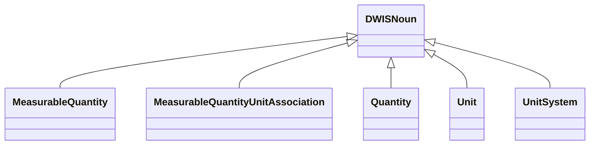
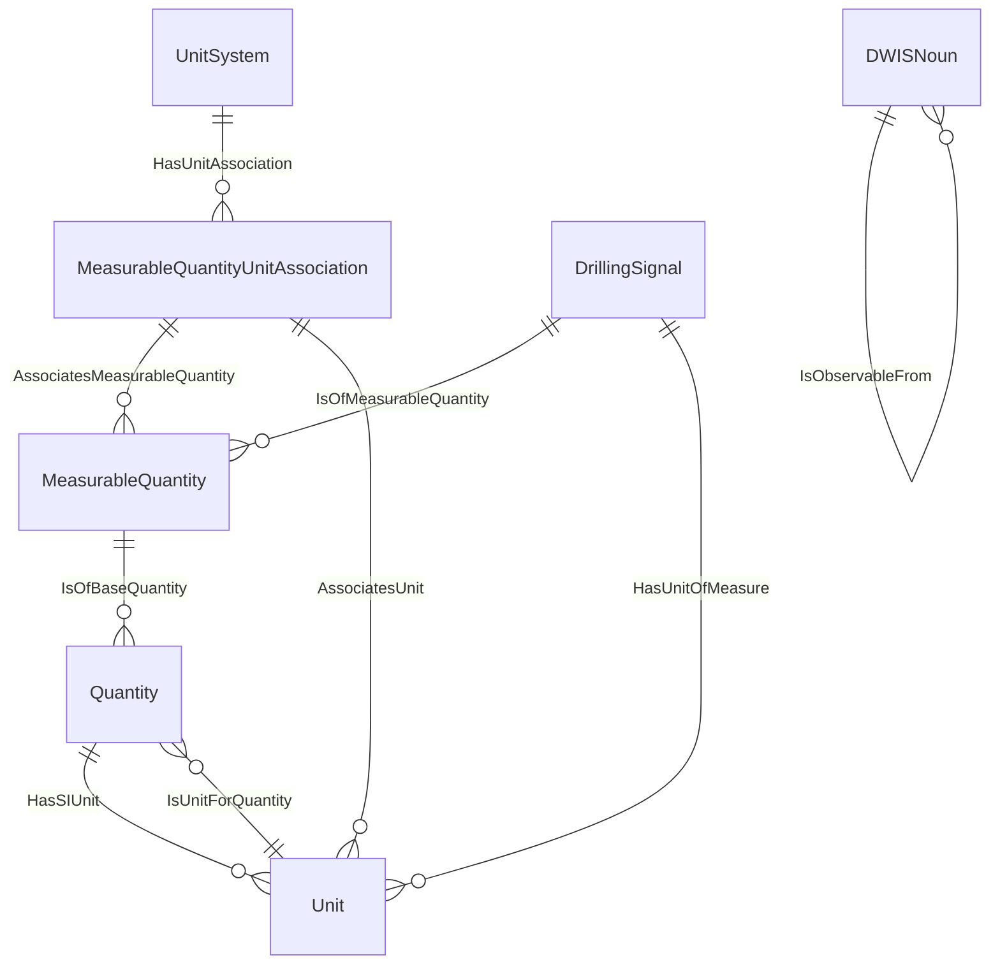

# Quantities<!-- DEFINITION SET HEADER -->
- Description: 
quantities and units

# Nouns
## Class Inheritance for Nouns
Here is a class inheritance diagram for the nouns contained in this definition set.

## MeasurableQuantity <!-- NOUN -->
- Display name: MeasurableQuantity
- Parent class: [DWISNoun](./DWISSemantics.md#DWISNoun)
- Attributes:
  - MeaningfulPrecision
    - Type: double
    - Description: 
- Description: 
Represents a quantity that allows meaningful comparisons.
Are related by a Quantity via the "IsObservableFrom" relation. 
Context dependent: for example, Fluid density and Equivalent Circulating Density are represented as two different "Measurable quantities", although they both refer to the same base SI quantities. 
- Definition set: Quantities
## MeasurableQuantityUnitAssociation <!-- NOUN -->
- Display name: MeasurableQuantityUnitAssociation
- Parent class: [DWISNoun](./DWISSemantics.md#DWISNoun)
- Definition set: Quantities
## Quantity <!-- NOUN -->
- Display name: Quantity
- Parent class: [DWISNoun](./DWISSemantics.md#DWISNoun)
- Attributes:
  - L
    - Type: double
    - Description: Length exponent.
    SI Unit: meter (m)
  - M
    - Type: double
    - Description: Mass exponent.
    SI Unit: Kilogram (kg)
  - T
    - Type: double
    - Description: Time exponent.
    SI Unit: Second (s)
  - I
    - Type: double
    - Description: Electric current exponent.
    SI Unit: Ampere (A)
  - ThT
    - Type: double
    - Description: Thermodynamic temperature exponent.
    SI Unit: Kelvin (K)
  - N
    - Type: double
    - Description: Amount of substance exponent.
    SI Unit: Mole (N)
  - J
    - Type: double
    - Description: Luminous intensity exponent.
    SI Unit: Candela (cd)
  - Theta
    - Type: double
    - Description: plane angle exponent.
    SI Unit: radian (rad)
  - Omega
    - Type: double
    - Description: solid angle exponent.
    SI Unit: steradian (sr)
  - SIUnit
    - Type: string
    - Description: 
- Specialization:
  - L = 0
  - T = 0
  - M = 0
  - I = 0
  - ThT = 0
  - N = 0
  - J = 0
  - Theta = 0
  - Omega = 0
- Definition set: Quantities
## Unit <!-- NOUN -->
- Display name: Unit
- Parent class: [DWISNoun](./DWISSemantics.md#DWISNoun)
- Attributes:
  - Symbol
    - Type: string
    - Description: 
  - ConversionFactorA
    - Type: double
    - Description: Unit conversion from SI unit is performed as:
    ConvertedValue = ConversionFactorA + SIValue * ConversionFactorB
  - ConversionFactorB
    - Type: double
    - Description: Unit conversion from SI unit is performed as:
    ConvertedValue = ConversionFactorA + SIValue * ConversionFactorB
- Definition set: Quantities
## UnitSystem <!-- NOUN -->
- Display name: UnitSystem
- Parent class: [DWISNoun](./DWISSemantics.md#DWISNoun)
- Description: 
A set of associations between measurable quantities and units
- Definition set: Quantities
# Verbs
## Class Inheritance for Verbs
Here is a class inheritance diagram for the verbs contained in this definition set.

## Relations
Here is a graph representing the relations that can be made with the verbs defined in this definition set.

## AssociatesMeasurableQuantity <!-- VERB -->
- Display name: AssociatesMeasurableQuantity
- Parent verb: [DWISVerb](./DWISSemantics.md#DWISVerb)
- Subject class: [MeasurableQuantityUnitAssociation](./Quantities.md#MeasurableQuantityUnitAssociation)
- Object class: [MeasurableQuantity](./Quantities.md#MeasurableQuantity)
- Definition set: Quantities
## AssociatesUnit <!-- VERB -->
- Display name: AssociatesUnit
- Parent verb: [DWISVerb](./DWISSemantics.md#DWISVerb)
- Subject class: [MeasurableQuantityUnitAssociation](./Quantities.md#MeasurableQuantityUnitAssociation)
- Object class: [Unit](./Quantities.md#Unit)
- Definition set: Quantities
## HasUnitAssociation <!-- VERB -->
- Display name: HasUnitAssociation
- Parent verb: [DWISVerb](./DWISSemantics.md#DWISVerb)
- Subject class: [UnitSystem](./Quantities.md#UnitSystem)
- Object class: [MeasurableQuantityUnitAssociation](./Quantities.md#MeasurableQuantityUnitAssociation)
- Definition set: Quantities
## IsObservableFrom <!-- VERB -->
- Display name: IsObservableFrom
- Parent verb: [DWISVerb](./DWISSemantics.md#DWISVerb)
- Subject class: [DWISNoun](./DWISSemantics.md#DWISNoun)
- Object class: [DWISNoun](./DWISSemantics.md#DWISNoun)
- Definition set: Quantities
## IsOfBaseQuantity <!-- VERB -->
- Display name: IsOfBaseQuantity
- Parent verb: [DWISVerb](./DWISSemantics.md#DWISVerb)
- Subject class: [MeasurableQuantity](./Quantities.md#MeasurableQuantity)
- Object class: [Quantity](./Quantities.md#Quantity)
- Definition set: Quantities
## IsOfMeasurableQuantity <!-- VERB -->
- Display name: IsOfMeasurableQuantity
- Parent verb: [DWISVerb](./DWISSemantics.md#DWISVerb)
- Subject class: [DrillingSignal](./DrillingDataSemantics.md#DrillingSignal)
- Object class: [MeasurableQuantity](./Quantities.md#MeasurableQuantity)
- Definition set: Quantities
## IsUnitForQuantity <!-- VERB -->
- Display name: IsUnitForQuantity
- Parent verb: [DWISVerb](./DWISSemantics.md#DWISVerb)
- Subject class: [Unit](./Quantities.md#Unit)
- Object class: [Quantity](./Quantities.md#Quantity)
- Definition set: Quantities
## HasSIUnit <!-- VERB -->
- Display name: HasSIUnit
- Parent verb: [DWISVerb](./DWISSemantics.md#DWISVerb)
- Subject class: [Quantity](./Quantities.md#Quantity)
- Object class: [Unit](./Quantities.md#Unit)
- Definition set: Quantities
## HasUnitOfMeasure <!-- VERB -->
- Display name: HasUnitOfMeasure
- Parent verb: [DWISVerb](./DWISSemantics.md#DWISVerb)
- Subject class: [DrillingSignal](./DrillingDataSemantics.md#DrillingSignal)
- Object class: [Unit](./Quantities.md#Unit)
- Definition set: Quantities
