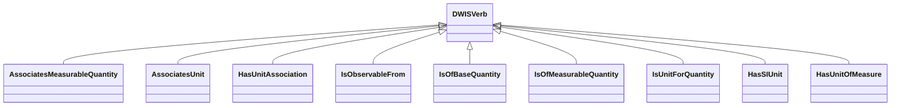
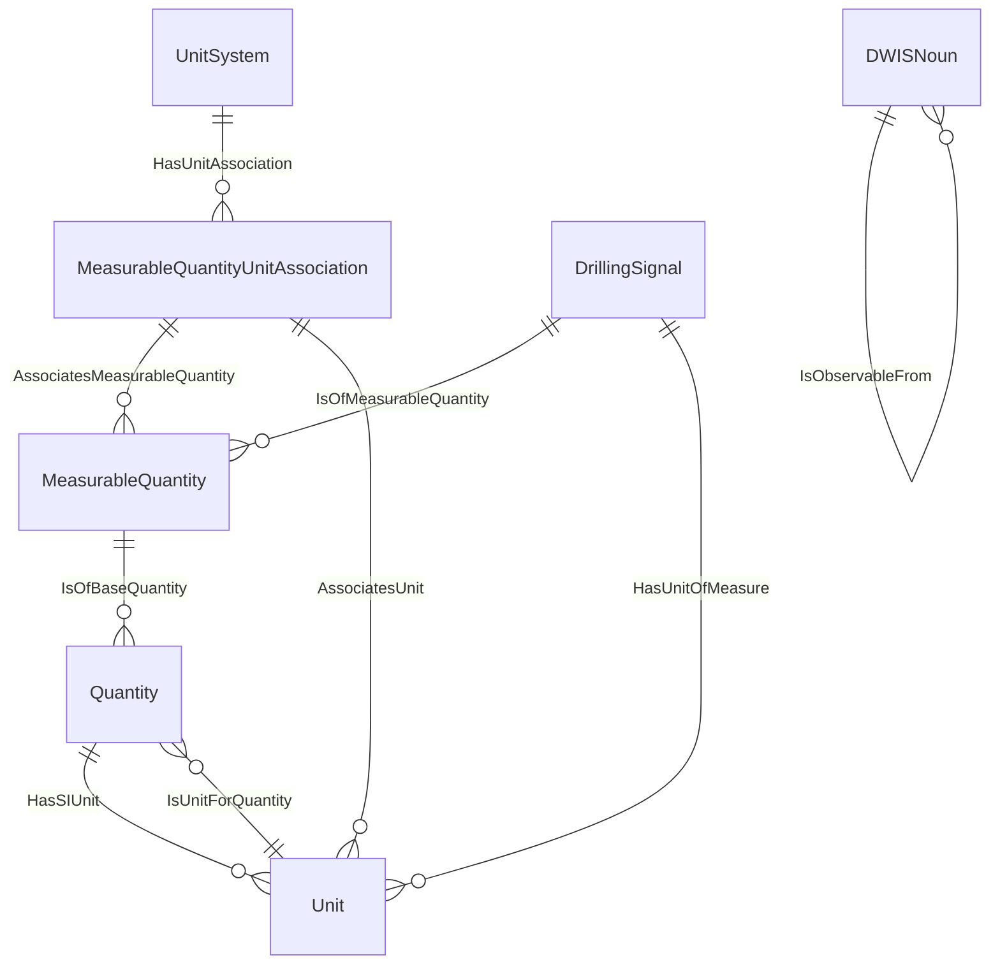

# Quantities<!-- DEFINITION SET HEADER -->
- Description: 
quantities and units

# Nouns
## Class Inheritance for Nouns
Here is a class inheritance diagram for the nouns contained in this definition set.

```mermaid
classDiagram
DWISNoun <|-- MeasurableQuantity
MeasurableQuantity <|-- BitTorqueQuantity
MeasurableQuantity <|-- BlockAccelerationQuantity
MeasurableQuantity <|-- BlockPositionQuantity
MeasurableQuantity <|-- BlockVelocityQuantity
MeasurableQuantity <|-- DepthQuantity
MeasurableQuantity <|-- DownholePressureQuantity
MeasurableQuantity <|-- EMWQuantity
MeasurableQuantity <|-- FlowRateQuantity
MeasurableQuantity <|-- FluidDensityInQuantity
MeasurableQuantity <|-- FluidTemperatureInQuantity
MeasurableQuantity <|-- FormationPorosityQuantity
MeasurableQuantity <|-- HookloadQuantity
MeasurableQuantity <|-- PumpRateQuantity
MeasurableQuantity <|-- Resistivity
MeasurableQuantity <|-- RockDensityQuantity
MeasurableQuantity <|-- SPPQuantity
MeasurableQuantity <|-- SurfaceRPMQuantity
MeasurableQuantity <|-- SurfaceTorqueQuantity
MeasurableQuantity <|-- TopOfStringForceQuantity
MeasurableQuantity <|-- TVDQuantity
MeasurableQuantity <|-- WOBQuantity
DWISNoun <|-- MeasurableQuantityUnitAssociation
DWISNoun <|-- Quantity
Quantity <|-- AccelerationQuantity
Quantity <|-- AreaQuantity
Quantity <|-- ElectricResistivityQuantity
Quantity <|-- ForceQuantity
Quantity <|-- FrequencyQuantity
Quantity <|-- LengthQuantity
Quantity <|-- MassDensityQuantity
Quantity <|-- MassQuantity
Quantity <|-- MassRate
Quantity <|-- PowerQuantity
Quantity <|-- PressureQuantity
Quantity <|-- ProportionQuantity
Quantity <|-- TemperatureQuantity
Quantity <|-- TorqueQuantity
Quantity <|-- VelocityQuantity
Quantity <|-- VolumeQuantity
Quantity <|-- VolumetricRateQuantity
Quantity <|-- VolumetricFlowateRateOfChangeQuantity
DWISNoun <|-- Unit
DWISNoun <|-- UnitSystem
```

## MeasurableQuantity <!-- NOUN -->
- Display name: MeasurableQuantity
- Parent class: [DWISNoun](./DWISSemantics.md#DWISNoun)
- Attributes:
  - MeaningfulPrecision
    - Type: double
    - Description: 
- Description: 
Represents a quantity that allows meaningful comparisons.
Are related by a Quantity via the "IsObservableFrom" relation. 
Context dependent: for example, Fluid density and Equivalent Circulating Density are represented as two different "Measurable quantities", although they both refer to the same base SI quantities. 
- Definition set: Quantities
- Examples:
## BitTorqueQuantity <!-- NOUN -->
- Display name: BitTorqueQuantity
- Parent class: [MeasurableQuantity](./Quantities.md#MeasurableQuantity)
- Description: 

- Definition set: Quantities
- Examples:
## BlockAccelerationQuantity <!-- NOUN -->
- Display name: BlockAccelerationQuantity
- Parent class: [MeasurableQuantity](./Quantities.md#MeasurableQuantity)
- Description: 

- Definition set: Quantities
- Examples:
## BlockPositionQuantity <!-- NOUN -->
- Display name: BlockPositionQuantity
- Parent class: [MeasurableQuantity](./Quantities.md#MeasurableQuantity)
- Description: 

- Definition set: Quantities
- Examples:
## BlockVelocityQuantity <!-- NOUN -->
- Display name: BlockVelocityQuantity
- Parent class: [MeasurableQuantity](./Quantities.md#MeasurableQuantity)
- Description: 

- Definition set: Quantities
- Examples:
## DepthQuantity <!-- NOUN -->
- Display name: DepthQuantity
- Parent class: [MeasurableQuantity](./Quantities.md#MeasurableQuantity)
- Description: 

- Definition set: Quantities
- Examples:
## DownholePressureQuantity <!-- NOUN -->
- Display name: DownholePressureQuantity
- Parent class: [MeasurableQuantity](./Quantities.md#MeasurableQuantity)
- Description: 

- Definition set: Quantities
- Examples:
## EMWQuantity <!-- NOUN -->
- Display name: EMWQuantity
- Parent class: [MeasurableQuantity](./Quantities.md#MeasurableQuantity)
- Description: 

- Definition set: Quantities
- Examples:
## FlowRateQuantity <!-- NOUN -->
- Display name: FlowRateQuantity
- Parent class: [MeasurableQuantity](./Quantities.md#MeasurableQuantity)
- Description: 

- Definition set: Quantities
- Examples:
## FluidDensityInQuantity <!-- NOUN -->
- Display name: FluidDensityInQuantity
- Parent class: [MeasurableQuantity](./Quantities.md#MeasurableQuantity)
- Description: 

- Definition set: Quantities
- Examples:
## FluidTemperatureInQuantity <!-- NOUN -->
- Display name: FluidTemperatureInQuantity
- Parent class: [MeasurableQuantity](./Quantities.md#MeasurableQuantity)
- Description: 

- Definition set: Quantities
- Examples:
## FormationPorosityQuantity <!-- NOUN -->
- Display name: FormationPorosityQuantity
- Parent class: [MeasurableQuantity](./Quantities.md#MeasurableQuantity)
- Description: 

- Definition set: Quantities
- Examples:
## HookloadQuantity <!-- NOUN -->
- Display name: HookloadQuantity
- Parent class: [MeasurableQuantity](./Quantities.md#MeasurableQuantity)
- Description: 

- Definition set: Quantities
- Examples:
## PumpRateQuantity <!-- NOUN -->
- Display name: PumpRateQuantity
- Parent class: [MeasurableQuantity](./Quantities.md#MeasurableQuantity)
- Description: 

- Definition set: Quantities
- Examples:
## Resistivity <!-- NOUN -->
- Display name: Resistivity
- Parent class: [MeasurableQuantity](./Quantities.md#MeasurableQuantity)
- Description: 

- Definition set: Quantities
- Examples:
## RockDensityQuantity <!-- NOUN -->
- Display name: RockDensityQuantity
- Parent class: [MeasurableQuantity](./Quantities.md#MeasurableQuantity)
- Description: 

- Definition set: Quantities
- Examples:
## SPPQuantity <!-- NOUN -->
- Display name: SPPQuantity
- Parent class: [MeasurableQuantity](./Quantities.md#MeasurableQuantity)
- Description: 

- Definition set: Quantities
- Examples:
## SurfaceRPMQuantity <!-- NOUN -->
- Display name: SurfaceRPMQuantity
- Parent class: [MeasurableQuantity](./Quantities.md#MeasurableQuantity)
- Description: 

- Definition set: Quantities
- Examples:
## SurfaceTorqueQuantity <!-- NOUN -->
- Display name: SurfaceTorqueQuantity
- Parent class: [MeasurableQuantity](./Quantities.md#MeasurableQuantity)
- Description: 

- Definition set: Quantities
- Examples:
## TopOfStringForceQuantity <!-- NOUN -->
- Display name: TopOfStringForceQuantity
- Parent class: [MeasurableQuantity](./Quantities.md#MeasurableQuantity)
- Description: 

- Definition set: Quantities
- Examples:
## TVDQuantity <!-- NOUN -->
- Display name: TVDQuantity
- Parent class: [MeasurableQuantity](./Quantities.md#MeasurableQuantity)
- Description: 

- Definition set: Quantities
- Examples:
## WOBQuantity <!-- NOUN -->
- Display name: WOBQuantity
- Parent class: [MeasurableQuantity](./Quantities.md#MeasurableQuantity)
- Description: 

- Definition set: Quantities
- Examples:
## MeasurableQuantityUnitAssociation <!-- NOUN -->
- Display name: MeasurableQuantityUnitAssociation
- Parent class: [DWISNoun](./DWISSemantics.md#DWISNoun)
- Description: 

- Definition set: Quantities
- Examples:
## Quantity <!-- NOUN -->
- Display name: Quantity
- Parent class: [DWISNoun](./DWISSemantics.md#DWISNoun)
- Attributes:
  - L
    - Type: int
    - Description: Length exponent.
  - M
    - Type: int
    - Description: Mass exponent.
  - T
    - Type: int
    - Description: Time exponent.
  - I
    - Type: int
    - Description: Electric current exponent.
  - ThT
    - Type: int
    - Description: Thermodynamic temperature exponent.
  - N
    - Type: int
    - Description: Amount of substance exponent.
  - J
    - Type: int
    - Description: Luminous intensity exponent.
  - SIUnit
    - Type: string
    - Description: 
- Specialization:
  - L = 0
  - T = 0
  - M = 0
  - I = 0
  - ThT = 0
  - N = 0
  - J = 0
- Description: 

- Definition set: Quantities
- Examples:
## AccelerationQuantity <!-- NOUN -->
- Display name: AccelerationQuantity
- Parent class: [Quantity](./Quantities.md#Quantity)
- Specialization:
  - L = 1
  - T = -2
  - Name = Acceleration quantity
- Description: 

- Definition set: Quantities
- Examples:
## AreaQuantity <!-- NOUN -->
- Display name: AreaQuantity
- Parent class: [Quantity](./Quantities.md#Quantity)
- Specialization:
  - L = 2
- Description: 

- Definition set: Quantities
- Examples:
## ElectricResistivityQuantity <!-- NOUN -->
- Display name: ElectricResistivityQuantity
- Parent class: [Quantity](./Quantities.md#Quantity)
- Specialization:
  - L = 3
  - M = 1
  - T = -3
  - I = -2
- Description: 

- Definition set: Quantities
- Examples:
## ForceQuantity <!-- NOUN -->
- Display name: ForceQuantity
- Parent class: [Quantity](./Quantities.md#Quantity)
- Specialization:
  - L = 1
  - M = 1
  - T = -2
- Description: 

- Definition set: Quantities
- Examples:
## FrequencyQuantity <!-- NOUN -->
- Display name: FrequencyQuantity
- Parent class: [Quantity](./Quantities.md#Quantity)
- Specialization:
  - T = -1
- Description: 

- Definition set: Quantities
- Examples:
## LengthQuantity <!-- NOUN -->
- Display name: LengthQuantity
- Parent class: [Quantity](./Quantities.md#Quantity)
- Specialization:
  - L = 1
- Description: 

- Definition set: Quantities
- Examples:
## MassDensityQuantity <!-- NOUN -->
- Display name: MassDensityQuantity
- Parent class: [Quantity](./Quantities.md#Quantity)
- Specialization:
  - L = 3
  - M = 1
- Description: 

- Definition set: Quantities
- Examples:
## MassQuantity <!-- NOUN -->
- Display name: MassQuantity
- Parent class: [Quantity](./Quantities.md#Quantity)
- Specialization:
  - M = 1
- Description: 

- Definition set: Quantities
- Examples:
## MassRate <!-- NOUN -->
- Display name: MassRate
- Parent class: [Quantity](./Quantities.md#Quantity)
- Specialization:
  - M = 1
  - T = -1
- Description: 

- Definition set: Quantities
- Examples:
## PowerQuantity <!-- NOUN -->
- Display name: PowerQuantity
- Parent class: [Quantity](./Quantities.md#Quantity)
- Specialization:
  - L = 2
  - M = 1
  - T = -3
- Description: 

- Definition set: Quantities
- Examples:
## PressureQuantity <!-- NOUN -->
- Display name: PressureQuantity
- Parent class: [Quantity](./Quantities.md#Quantity)
- Specialization:
  - L = -1
  - M = 1
  - T = 2
- Description: 

- Definition set: Quantities
- Examples:
## ProportionQuantity <!-- NOUN -->
- Display name: ProportionQuantity
- Parent class: [Quantity](./Quantities.md#Quantity)
- Description: 

- Definition set: Quantities
- Examples:
## TemperatureQuantity <!-- NOUN -->
- Display name: TemperatureQuantity
- Parent class: [Quantity](./Quantities.md#Quantity)
- Specialization:
  - ThT = 1
- Description: 

- Definition set: Quantities
- Examples:
## TorqueQuantity <!-- NOUN -->
- Display name: TorqueQuantity
- Parent class: [Quantity](./Quantities.md#Quantity)
- Specialization:
  - L = 2
  - M = 1
  - T = -2
- Description: 

- Definition set: Quantities
- Examples:
## VelocityQuantity <!-- NOUN -->
- Display name: VelocityQuantity
- Parent class: [Quantity](./Quantities.md#Quantity)
- Specialization:
  - L = 1
  - T = -1
- Description: 

- Definition set: Quantities
- Examples:
## VolumeQuantity <!-- NOUN -->
- Display name: VolumeQuantity
- Parent class: [Quantity](./Quantities.md#Quantity)
- Specialization:
  - L = 3
- Description: 

- Definition set: Quantities
- Examples:
## VolumetricRateQuantity <!-- NOUN -->
- Display name: VolumetricRateQuantity
- Parent class: [Quantity](./Quantities.md#Quantity)
- Specialization:
  - L = 3
  - T = -1
- Description: 

- Definition set: Quantities
- Examples:
## VolumetricFlowateRateOfChangeQuantity <!-- NOUN -->
- Display name: VolumetricFlowateRateOfChangeQuantity
- Parent class: [Quantity](./Quantities.md#Quantity)
- Specialization:
  - L = 3
  - T = -2
- Description: 

- Definition set: Quantities
- Examples:
## Unit <!-- NOUN -->
- Display name: Unit
- Parent class: [DWISNoun](./DWISSemantics.md#DWISNoun)
- Attributes:
  - Symbol
    - Type: string
    - Description: 
  - ConversionFactorA
    - Type: double
    - Description: Unit conversion from SI unit is performed as:
  - ConversionFactorB
    - Type: double
    - Description: Unit conversion from SI unit is performed as:
- Description: 

- Definition set: Quantities
- Examples:
## UnitSystem <!-- NOUN -->
- Display name: UnitSystem
- Parent class: [DWISNoun](./DWISSemantics.md#DWISNoun)
- Description: 
A set of associations between measurable quantities and units
- Definition set: Quantities
- Examples:
# Verbs
## Class Inheritance for Verbs
Here is a class inheritance diagram for the verbs contained in this definition set.

## Relations
Here is a graph representing the relations that can be made with the verbs defined in this definition set.

## AssociatesMeasurableQuantity <!-- VERB -->
- Display name: AssociatesMeasurableQuantity
- Parent verb: [DWISVerb](./DWISSemantics.md#DWISVerb)
- Subject class: [MeasurableQuantityUnitAssociation](./Quantities.md#MeasurableQuantityUnitAssociation)
- Object class: [MeasurableQuantity](./Quantities.md#MeasurableQuantity)
- Definition set: Quantities
- Description: 

- Examples:
## AssociatesUnit <!-- VERB -->
- Display name: AssociatesUnit
- Parent verb: [DWISVerb](./DWISSemantics.md#DWISVerb)
- Subject class: [MeasurableQuantityUnitAssociation](./Quantities.md#MeasurableQuantityUnitAssociation)
- Object class: [Unit](./Quantities.md#Unit)
- Definition set: Quantities
- Description: 

- Examples:
## HasUnitAssociation <!-- VERB -->
- Display name: HasUnitAssociation
- Parent verb: [DWISVerb](./DWISSemantics.md#DWISVerb)
- Subject class: [UnitSystem](./Quantities.md#UnitSystem)
- Object class: [MeasurableQuantityUnitAssociation](./Quantities.md#MeasurableQuantityUnitAssociation)
- Definition set: Quantities
- Description: 

- Examples:
## IsObservableFrom <!-- VERB -->
- Display name: IsObservableFrom
- Parent verb: [DWISVerb](./DWISSemantics.md#DWISVerb)
- Subject class: [DWISNoun](./DWISSemantics.md#DWISNoun)
- Object class: [DWISNoun](./DWISSemantics.md#DWISNoun)
- Definition set: Quantities
- Description: 

- Examples:
## IsOfBaseQuantity <!-- VERB -->
- Display name: IsOfBaseQuantity
- Parent verb: [DWISVerb](./DWISSemantics.md#DWISVerb)
- Subject class: [MeasurableQuantity](./Quantities.md#MeasurableQuantity)
- Object class: [Quantity](./Quantities.md#Quantity)
- Definition set: Quantities
- Description: 

- Examples:
## IsOfMeasurableQuantity <!-- VERB -->
- Display name: IsOfMeasurableQuantity
- Parent verb: [DWISVerb](./DWISSemantics.md#DWISVerb)
- Subject class: [DrillingSignal](./DrillingDataSemantics.md#DrillingSignal)
- Object class: [MeasurableQuantity](./Quantities.md#MeasurableQuantity)
- Definition set: Quantities
- Description: 

- Examples:
## IsUnitForQuantity <!-- VERB -->
- Display name: IsUnitForQuantity
- Parent verb: [DWISVerb](./DWISSemantics.md#DWISVerb)
- Subject class: [Unit](./Quantities.md#Unit)
- Object class: [Quantity](./Quantities.md#Quantity)
- Definition set: Quantities
- Description: 

- Examples:
## HasSIUnit <!-- VERB -->
- Display name: HasSIUnit
- Parent verb: [DWISVerb](./DWISSemantics.md#DWISVerb)
- Subject class: [Quantity](./Quantities.md#Quantity)
- Object class: [Unit](./Quantities.md#Unit)
- Definition set: Quantities
- Description: 

- Examples:
## HasUnitOfMeasure <!-- VERB -->
- Display name: HasUnitOfMeasure
- Parent verb: [DWISVerb](./DWISSemantics.md#DWISVerb)
- Subject class: [DrillingSignal](./DrillingDataSemantics.md#DrillingSignal)
- Object class: [Unit](./Quantities.md#Unit)
- Definition set: Quantities
- Description: 

- Examples:
