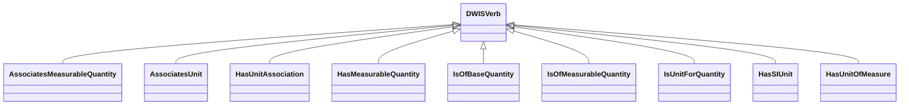

# Quantities<!-- DEFINITION SET HEADER -->
- Description: 
quantities and units

# Nouns
## Class Inheritance for Nouns
Here is a class inheritance diagram for the nouns contained in this definition set.

## MeasurableQuantity <!-- NOUN -->
- Display name: MeasurableQuantity
- Parent class: [DWISNoun](./DWISSemantics.md#DWISNoun)
- Attributes:
  - MeaningfulPrecision
    - Type: double
    - Description: 
- Description: 
Represents a quantity that allows meaningful comparisons.
A `MeasurableQuantity` is related to a Quantity using the `HasMeasurableQuantity` relation and its reciprocal
relation called `IsOfBaseQuantity`.
Context dependence: for example, Fluid density and Equivalent Circulating Density are represented 
as two different "Measurable quantities", although they both refer to the same base SI quantities. 
Typical sub-types of `MeasurableQuantity` are provided in MeasurableQuantityTypes. These types
can be used in a sort of singleton pattern, i.e., it is not necessary to create an individual to use them
in a relation. Also, if individuals are created with the same characteristics, they are considered as being 
multiple representations of the same `Noun`. The list of `MeasurableQuantity` in MeasurableQuantityTypes is automatically generated
from the `PhysicalQuantities` defined in the Open Source Drilling Community ([OSDC](https://opensourcedrilling.org/)) project called `UnitConversion` 
(see [`OSDC UnitConversion`](https://github.com/Open-Source-Drilling-Community/UnitConversion)). Only the
physical quantities for which a `MeaningfulPrecision` has beed defined are used to generate MeasurableQuantityTypes. 
It is possible to look at all the physical quantities defined in the `OSDC UnitConversion` project by
using the web application hosted here: [`OSDC Physical Quantity Web App`](https://dev.digiwells.no/UnitConversion/webapp/PhysicalQuantity).
- Definition set: Quantities
- Examples:
``` dwis signal_1
DrillingDataPoint: acceleration_1
acceleration_1 IsOfMeasurableQuantity AccelerationDrillingQuantity
```
An example semantic graph looks like as follow:

An example SparQL query looks like this:
```sparql
PREFIX rdf: <http://www.w3.org/1999/02/22-rdf-syntax-ns#>
PREFIX ddhub: <http://ddhub.no/>
PREFIX quantity: <http://ddhub.no/UnitAndQuantity>
SELECT ?signal_1
WHERE {
	?acceleration_1 ddhub:IsOfMeasurableQuantity ?AccelerationDrillingQuantity .
}
```
## MeasurableQuantityUnitAssociation <!-- NOUN -->
- Display name: MeasurableQuantityUnitAssociation
- Parent class: [DWISNoun](./DWISSemantics.md#DWISNoun)
- Description: 
This `noun` is typically used to create an association between a `MeasurableQuantity`
and a `Unit` as for example when defining a `UnitSystem`.
- Definition set: Quantities
- Examples:
``` dwis 
UnitSystem:metricUnitSystem_1
MeasurableQuantityUnitAssociation:metricAssociationAcceleration
metricAssociationAcceleration AssociatesUnit MetrePerSecondSquared
metricAssociationAcceleration AssociatesMeasurableQuantity AccelerationDrillingQuantity
metricUnitSystem_1 hasUnitAssociation metricAssociationAcceleration
```
An example semantic graph looks like as follow:

## Quantity <!-- NOUN -->
- Display name: Quantity
- Parent class: [DWISNoun](./DWISSemantics.md#DWISNoun)
- Attributes:
  - L
    - Type: double
    - Description: Length exponent.
    SI Unit: metre (m)
  - M
    - Type: double
    - Description: Mass exponent.
    SI Unit: Kilogram (kg)
  - T
    - Type: double
    - Description: Time exponent.
    SI Unit: Second (s)
  - I
    - Type: double
    - Description: Electric current exponent.
    SI Unit: Ampere (A)
  - ThT
    - Type: double
    - Description: Thermodynamic temperature exponent.
    SI Unit: Kelvin (K)
  - N
    - Type: double
    - Description: Amount of substance exponent.
    SI Unit: Mole (N)
  - J
    - Type: double
    - Description: Luminous intensity exponent.
    SI Unit: Candela (cd)
  - Theta
    - Type: double
    - Description: plane angle exponent.
    SI Unit: radian (rad)
  - Omega
    - Type: double
    - Description: solid angle exponent.
    SI Unit: steradian (sr)
  - SIUnit
    - Type: string
    - Description: 
- Description: 
A `Quantity` represents a physical quantity. A `Quantity` is characterized by its physical dimensions as defined in the SI
International System of units. There are typical sub-types of `Quantity` defined in `QuantityTypes`. These types can be used in a sort of singleton pattern, i.e., it is not necessary to create an individual to use them
in a relation. Also, if individuals are created with the same characteristics, they are considered as being 
multiple representations of the same `Noun`. These typical
sub-types are automatically generated from the `PhysicalQuantities` defined in the Open Source Drilling 
Community ([OSDC](https://opensourcedrilling.org/)) project called `UnitConversion` (see [`OSDC UnitConversion`](https://github.com/Open-Source-Drilling-Community/UnitConversion)).
Only the physical quantities for which a `MeaningfulPrecision` is *not* defined are used to generate 
QuantityTypes. It is possible to look at all the physical quantities defined in the `OSDC UnitConversion` project by
using the web application hosted here: [`OSDC Physical Quantity Web App`](https://dev.digiwells.no/UnitConversion/webapp/PhysicalQuantity).
- Definition set: Quantities
- Examples:
Here is an example making use of a predifined quantity defined in `QuantityTypes`
``` dwis
DrillingSignal:acceleration_signal
DrillingDataPoint:acceleration_1
acceleration_1 HasValue acceleration_signal
acceleration_1 IsOfMeasurableQuantity AccelerationDrillingQuantity
acceleration_signal HasUnitOfMeasure MetrePerSecondSquared
```
An example semantic graph looks like as follow:

And here is an example where the `Quantity` is defined from scratch:
``` dwis
Quantity:linearDisplacementQuantity
linearDisplacement.L = 2
MeasurableQuantity:measurableLinearDisplacementQuantity
measurableLinearDisplacementQuantity.MeaningfulPrecision = 0.001
measurableLinearDisplacementQuantity IsOfBaseQuantity linearDisplacementQuantity
linearDisplacementQuantity HasMeasurableQuantity measurableLinearDisplacementQuantity
Unit:cubicMetrePerMetre
cubicMetrePerMetre.ConversionFactorA = 0
cubicMetrePerMetre.ConversionFactorB = 1
cubicMetrePerMetre.Symbol = "m^3/m"
cubicMetrePerMetre IsUnitForQuantity linearDisplacementQuantity
linearDisplacementQuantity HasSIUnit cubicMetrePerMetre
DrillingSignal:linearDisplacement_signal
DrillingDataPoint:linearDisplacement_1
linearDisplacement_1 HasValue linearDisplacement_signal
linearDisplacement_1 IsOfMeasurableQuantity measurableLinearDisplacementQuantity
linearDisplacement_signal HasUnitOfMeasure cubicMetrePerMetre
```
An example semantic graph looks like as follow:

## Unit <!-- NOUN -->
- Display name: Unit
- Parent class: [DWISNoun](./DWISSemantics.md#DWISNoun)
- Attributes:
  - Symbol
    - Type: string
    - Description: a typical label for that unit.
  - ConversionFactorA
    - Type: double
    - Description: Unit conversion from SI unit is performed as:
    ConvertedValue = ConversionFactorA + SIValue * ConversionFactorB
  - ConversionFactorB
    - Type: double
    - Description: Unit conversion from SI unit is performed as:
    ConvertedValue = ConversionFactorA + SIValue * ConversionFactorB
- Description: 
Physical quantities, such as length, mass, time, temperature, and
electric current, are described using both a numerical value and a `Unit`. The `Unit` defines what 
standard is being used to measure that quantity. A `Unit` is characterized by two attributes `ConversionFactorA`
and `ConversionFactorB` that are used to convert a SI value to the unit. Typical sub-types are made available. These types
can be used in a sort of singleton pattern, i.e., it is not necessary to create an individual to use them
in a relation. Also, if individuals are created with the same characteristics, they are considered as being 
multiple representations of the same `Noun`. Typical sub-types for the Noun `Unit`
are defined in UnitTypes. These units are automatically generated from the unit conversions of each individual 
`PhysicalQuantities` defined in the Open Source Drilling Community ([OSDC](https://opensourcedrilling.org/)) project called `UnitConversion` 
(see [`OSDC UnitConversion`](https://github.com/Open-Source-Drilling-Community/UnitConversion)).
It is possible to look at all the physical quantities defined in the `OSDC UnitConversion` project by
using the web application hosted here: [`OSDC Physical Quantity Web App`](https://dev.digiwells.no/UnitConversion/webapp/PhysicalQuantity). 
- Definition set: Quantities
- Examples:
``` dwis
DrillingSignal:acceleration_signal
DrillingDataPoint:acceleration_1
acceleration_1 HasValue acceleration_signal
acceleration_1 IsOfMeasurableQuantity AccelerationDrillingQuantity
acceleration_signal HasUnitOfMeasure MetrePerSecondSquared
```
An example semantic graph looks like as follow:

## UnitSystem <!-- NOUN -->
- Display name: UnitSystem
- Parent class: [DWISNoun](./DWISSemantics.md#DWISNoun)
- Description: 
A set of associations between measurable quantities and units.
- Definition set: Quantities
- Examples:
``` dwis
UnitSystem:metricUnitSystem_1
MeasurableQuantityUnitAssociation:metricAssociationAcceleration
metricAssociationAcceleration AssociatesUnit MetrePerSecondSquared
metricAssociationAcceleration AssociatesMeasurableQuantity AccelerationDrillingQuantity
metricUnitSystem_1 hasUnitAssociation metricAssociationAcceleration
```
An example semantic graph looks like as follow:

# Verbs
## Class Inheritance for Verbs
Here is a class inheritance diagram for the verbs contained in this definition set.

## Relations
Here is a graph representing the relations that can be made with the verbs defined in this definition set.

## AssociatesMeasurableQuantity <!-- VERB -->
- Display name: AssociatesMeasurableQuantity
- Parent verb: [DWISVerb](./DWISSemantics.md#DWISVerb)
- Subject class: [MeasurableQuantityUnitAssociation](./Quantities.md#MeasurableQuantityUnitAssociation)
- Object class: [MeasurableQuantity](./Quantities.md#MeasurableQuantity)
- Definition set: Quantities
- Description: 
This `Verb` is typically used when defining a `UnitSystem`. It allows to associate a
`MeasurableQuantityUnitAssociation` with a `MeasurableQuantity`.
- Examples:
``` dwis
UnitSystem:metricUnitSystem_1
MeasurableQuantityUnitAssociation:metricAssociationAcceleration
metricAssociationAcceleration AssociatesUnit MetrePerSecondSquared
metricAssociationAcceleration AssociatesMeasurableQuantity AccelerationDrillingQuantity
metricUnitSystem_1 hasUnitAssociation metricAssociationAcceleration
```
An example semantic graph looks like as follow:

## AssociatesUnit <!-- VERB -->
- Display name: AssociatesUnit
- Parent verb: [DWISVerb](./DWISSemantics.md#DWISVerb)
- Subject class: [MeasurableQuantityUnitAssociation](./Quantities.md#MeasurableQuantityUnitAssociation)
- Object class: [Unit](./Quantities.md#Unit)
- Definition set: Quantities
- Description: 
This `Verb` is typically used when defining a `UnitSystem`. It allows to associate a
`MeasurableQuantityUnitAssociation` with a `Unit`.
- Examples:
``` dwis
UnitSystem:metricUnitSystem_1
MeasurableQuantityUnitAssociation:metricAssociationAcceleration
metricAssociationAcceleration AssociatesUnit MetrePerSecondSquared
metricAssociationAcceleration AssociatesMeasurableQuantity AccelerationDrillingQuantity
metricUnitSystem_1 hasUnitAssociation metricAssociationAcceleration
```
An example semantic graph looks like as follow:

## HasUnitAssociation <!-- VERB -->
- Display name: HasUnitAssociation
- Parent verb: [DWISVerb](./DWISSemantics.md#DWISVerb)
- Subject class: [UnitSystem](./Quantities.md#UnitSystem)
- Object class: [MeasurableQuantityUnitAssociation](./Quantities.md#MeasurableQuantityUnitAssociation)
- Definition set: Quantities
- Description: 
This `Verb` is typically used when defining a `UnitSystem`. It allows to associate a
`UnitSystem` with a `MeasurableQuantityUnitAssociation`.
- Examples:
``` dwis
UnitSystem:metricUnitSystem_1
MeasurableQuantityUnitAssociation:metricAssociationAcceleration
metricAssociationAcceleration AssociatesUnit MetrePerSecondSquared
metricAssociationAcceleration AssociatesMeasurableQuantity AccelerationDrillingQuantity
metricUnitSystem_1 hasUnitAssociation metricAssociationAcceleration
```
An example semantic graph looks like as follow:

## HasMeasurableQuantity <!-- VERB -->
- Display name: HasMeasurableQuantity
- Parent verb: [DWISVerb](./DWISSemantics.md#DWISVerb)
- Subject class: [Quantity](./Quantities.md#Quantity)
- Object class: [MeasurableQuantity](./Quantities.md#MeasurableQuantity)
- Definition set: Quantities
- Description: 
This `Verb` is used to define the reciprocal relationship of `IsOfBaseQuantity`, i.e., to relate
a `Quantity` with a `MeasureableQuantity`.
- Examples:
``` dwis
Quantity:linearDisplacementQuantity
linearDisplacement.L = 2
MeasurableQuantity:measurableLinearDisplacementQuantity
measurableLinearDisplacementQuantity.MeaningfulPrecision = 0.001
measurableLinearDisplacementQuantity IsOfBaseQuantity linearDisplacementQuantity
linearDisplacementQuantity HasMeasurableQuantity measurableLinearDisplacementQuantity
```
An example semantic graph looks like as follow:

## IsOfBaseQuantity <!-- VERB -->
- Display name: IsOfBaseQuantity
- Parent verb: [DWISVerb](./DWISSemantics.md#DWISVerb)
- Subject class: [MeasurableQuantity](./Quantities.md#MeasurableQuantity)
- Object class: [Quantity](./Quantities.md#Quantity)
- Definition set: Quantities
- Description: 
This `Verb` is used to associate a `MeasurableQuantity` with a `Quantity`. It is the reciprocal
relationship to `HasMeasurableQuantity`. 
- Examples:
``` dwis
Quantity:linearDisplacementQuantity
linearDisplacement.L = 2
MeasurableQuantity:measurableLinearDisplacementQuantity
measurableLinearDisplacementQuantity.MeaningfulPrecision = 0.001
measurableLinearDisplacementQuantity IsOfBaseQuantity linearDisplacementQuantity
linearDisplacementQuantity HasMeasurableQuantity measurableLinearDisplacementQuantity
```
An example semantic graph looks like as follow:

## IsOfMeasurableQuantity <!-- VERB -->
- Display name: IsOfMeasurableQuantity
- Parent verb: [DWISVerb](./DWISSemantics.md#DWISVerb)
- Subject class: [DrillingDataPoint](./DrillingDataSemantics.md#DrillingDataPoint)
- Object class: [MeasurableQuantity](./Quantities.md#MeasurableQuantity)
- Definition set: Quantities
- Description: 
This `verb` is used to relate a `MeasureableQuantity` to a `DrillingDataPoint`.
- Examples:
``` dwis
DrillingDataPoint:acceleration_1
acceleration_1 IsOfMeasurableQuantity AccelerationDrillingQuantity
```
An example semantic graph looks like as follow:

## IsUnitForQuantity <!-- VERB -->
- Display name: IsUnitForQuantity
- Parent verb: [DWISVerb](./DWISSemantics.md#DWISVerb)
- Subject class: [Unit](./Quantities.md#Unit)
- Object class: [Quantity](./Quantities.md#Quantity)
- Definition set: Quantities
- Description: 
This `verb` is used to relate a `Unit` with a `Quantity`.
- Examples:
``` dwis
Quantity:linearDisplacementQuantity
linearDisplacement.L = 2
Unit:cubicMetrePerMetre
cubicMetrePerMetre.ConversionFactorA = 0
cubicMetrePerMetre.ConversionFactorB = 1
ConversionFactorB.Symbol = "m^3/m"
cubicMetrePerMetre IsUnitForQuantity linearDisplacementQuantity
```
An example semantic graph looks like as follow:

## HasSIUnit <!-- VERB -->
- Display name: HasSIUnit
- Parent verb: [DWISVerb](./DWISSemantics.md#DWISVerb)
- Subject class: [Quantity](./Quantities.md#Quantity)
- Object class: [Unit](./Quantities.md#Unit)
- Definition set: Quantities
- Description: 
This `verb` is used to be define a relation between a `Quantity` and a `Unit`.
- Examples:
``` dwis
Quantity:linearDisplacementQuantity
linearDisplacement.L = 2
Unit:cubicMetrePerMetre
cubicMetrePerMetre.ConversionFactorA = 0
cubicMetrePerMetre.ConversionFactorB = 1
ConversionFactorB.Symbol = "m^3/m"
cubicMetrePerMetre IsUnitForQuantity linearDisplacementQuantity
linearDisplacementQuantity HasSIUnit cubicMetrePerMetre
```
An example semantic graph looks like as follow:

## HasUnitOfMeasure <!-- VERB -->
- Display name: HasUnitOfMeasure
- Parent verb: [DWISVerb](./DWISSemantics.md#DWISVerb)
- Subject class: [DrillingSignal](./DrillingDataSemantics.md#DrillingSignal)
- Object class: [Unit](./Quantities.md#Unit)
- Definition set: Quantities
- Examples:
This `verb` is used to be define a relation between a `DrillingSignal` and a `Unit`.
``` dwis
DrillingSignal:acceleration_signal
DrillingDataPoint:acceleration_1
acceleration_1 HasValue acceleration_signal
acceleration_1 IsOfMeasurableQuantity AccelerationDrillingQuantity
acceleration_signal HasUnitOfMeasure MetrePerSecondSquared
```
An example semantic graph looks like as follow:

