# QuantityTypes<!-- DEFINITION SET HEADER -->
# Nouns
## Class Inheritance for Nouns
Here is a class inheritance diagram for the nouns contained in this definition set.

## AccelerationQuantity <!-- NOUN -->
- Display name: Acceleration
- Parent class: [Quantity](./Quantities.md#Quantity)
- Specialization:
  - L = 1
  - T = -2
- Description: 
**Acceleration** is defined as the rate of change of velocity with respect to time. Velocity itself is the rate of change of displacement (or position) with respect to time. Therefore, acceleration is the rate of change of displacement twice with respect to time.
Let's break this down:
1. **Displacement** (or position) has the dimension of **Length(L)**.
2. **Velocity** is displacement per unit time:
$$\text{Velocity} = \frac{\text{Length}}{\text{Time}} = \frac{L}{T}$$
So, the dimension of velocity is **$[L T^{ -1}]$**.
3. **Acceleration** is the rate of change of velocity with respect to time:
$$\text{Acceleration} = \frac{\text{Velocity}}{\text{Time}} = \frac{L T^{ -1}}{T} = L T ^{-2}$$
Therefore, the dimension of acceleration is $[LT^{-2}]$.
The SI unit for **acceleration** is: metre per second squared with the associated unit label $\frac{m}{s^{2}}$
- Definition set: QuantityTypes
- Examples:
``` dwis
Quantity:AccelerationQuantity
AccelerationQuantity.L = 1
AccelerationQuantity.T = -2
Unit:MetrePerSecondSquared
MetrePerSecondSquared.ConversionFactorA = 0
MetrePerSecondSquared.ConversionFactorB = 1
MetrePerSecondSquared.Symbol = "m/s²"
MetrePerSecondSquared IsUnitForQuantity AccelerationQuantity
AccelerationQuantity HasSIUnit MetrePerSecondSquared
Unit:FootPerSecondSquared
FootPerSecondSquared.ConversionFactorA = 0
FootPerSecondSquared.ConversionFactorB = 3.280839895013124
FootPerSecondSquared.Symbol = "ft/s²"
FootPerSecondSquared IsUnitForQuantity AccelerationQuantity
Unit:CentimetrePerSecondSquared
CentimetrePerSecondSquared.ConversionFactorA = 0
CentimetrePerSecondSquared.ConversionFactorB = 100
CentimetrePerSecondSquared.Symbol = "cm/s²"
CentimetrePerSecondSquared IsUnitForQuantity AccelerationQuantity
Unit:CentimetrePerHourPerSecond
CentimetrePerHourPerSecond.ConversionFactorA = 0
CentimetrePerHourPerSecond.ConversionFactorB = 360000
CentimetrePerHourPerSecond.Symbol = "cm/(h•s)"
CentimetrePerHourPerSecond IsUnitForQuantity AccelerationQuantity
Unit:CentimetrePerMinutePerSecond
CentimetrePerMinutePerSecond.ConversionFactorA = 0
CentimetrePerMinutePerSecond.ConversionFactorB = 6000
CentimetrePerMinutePerSecond.Symbol = "cm/(min•s)"
CentimetrePerMinutePerSecond IsUnitForQuantity AccelerationQuantity
Unit:FootPerHourPerSecond
FootPerHourPerSecond.ConversionFactorA = 0
FootPerHourPerSecond.ConversionFactorB = 11811.023622047245
FootPerHourPerSecond.Symbol = "ft/(h•s)"
FootPerHourPerSecond IsUnitForQuantity AccelerationQuantity
Unit:FootPerMinutePerSecond
FootPerMinutePerSecond.ConversionFactorA = 0
FootPerMinutePerSecond.ConversionFactorB = 196.85039370078744
FootPerMinutePerSecond.Symbol = "ft/(min•s)"
FootPerMinutePerSecond IsUnitForQuantity AccelerationQuantity
Unit:Galileo
Galileo.ConversionFactorA = 0
Galileo.ConversionFactorB = 100
Galileo.Symbol = "Gal"
Galileo IsUnitForQuantity AccelerationQuantity
Unit:GravityStandard
GravityStandard.ConversionFactorA = 0
GravityStandard.ConversionFactorB = 0.10197162129779283
GravityStandard.Symbol = "gn"
GravityStandard IsUnitForQuantity AccelerationQuantity
Unit:InchPerHourPerSecond
InchPerHourPerSecond.ConversionFactorA = 0
InchPerHourPerSecond.ConversionFactorB = 141732.28346456692
InchPerHourPerSecond.Symbol = "in/(h•s)"
InchPerHourPerSecond IsUnitForQuantity AccelerationQuantity
Unit:InchPerMinutePerSecond
InchPerMinutePerSecond.ConversionFactorA = 0
InchPerMinutePerSecond.ConversionFactorB = 2362.2047244094488
InchPerMinutePerSecond.Symbol = "in/(min•s)"
InchPerMinutePerSecond IsUnitForQuantity AccelerationQuantity
Unit:InchPerSecondSquared
InchPerSecondSquared.ConversionFactorA = 0
InchPerSecondSquared.ConversionFactorB = 39.37007874015748
InchPerSecondSquared.Symbol = "in/s²"
InchPerSecondSquared IsUnitForQuantity AccelerationQuantity
Unit:KnotPerSecond
KnotPerSecond.ConversionFactorA = 0
KnotPerSecond.ConversionFactorB = 1.9438444924406046
KnotPerSecond.Symbol = "kn/s"
KnotPerSecond IsUnitForQuantity AccelerationQuantity
Unit:MetrePerSecondPerMillisecond
MetrePerSecondPerMillisecond.ConversionFactorA = 0
MetrePerSecondPerMillisecond.ConversionFactorB = 0.001
MetrePerSecondPerMillisecond.Symbol = "m/(s•ms)"
MetrePerSecondPerMillisecond IsUnitForQuantity AccelerationQuantity
Unit:MilePerHourPerSecond
MilePerHourPerSecond.ConversionFactorA = 0
MilePerHourPerSecond.ConversionFactorB = 2.2369362920544025
MilePerHourPerSecond.Symbol = "mi/(h•s)"
MilePerHourPerSecond IsUnitForQuantity AccelerationQuantity
Unit:MilePerMinutePerSecond
MilePerMinutePerSecond.ConversionFactorA = 0
MilePerMinutePerSecond.ConversionFactorB = 0.03728227153424004
MilePerMinutePerSecond.Symbol = "mi/(min•s)"
MilePerMinutePerSecond IsUnitForQuantity AccelerationQuantity
Unit:MilePerSecondSquared
MilePerSecondSquared.ConversionFactorA = 0
MilePerSecondSquared.ConversionFactorB = 0.000621371192237334
MilePerSecondSquared.Symbol = "mi/s²"
MilePerSecondSquared IsUnitForQuantity AccelerationQuantity
Unit:KilometrePerSecondSquared
KilometrePerSecondSquared.ConversionFactorA = 0
KilometrePerSecondSquared.ConversionFactorB = 0.001
KilometrePerSecondSquared.Symbol = "km/s²"
KilometrePerSecondSquared IsUnitForQuantity AccelerationQuantity
Unit:KilometrePerHourPerSecond
KilometrePerHourPerSecond.ConversionFactorA = 0
KilometrePerHourPerSecond.ConversionFactorB = 3.6
KilometrePerHourPerSecond.Symbol = "km/(h•s)"
KilometrePerHourPerSecond IsUnitForQuantity AccelerationQuantity
Unit:KilometrePerMinutePerSecond
KilometrePerMinutePerSecond.ConversionFactorA = 0
KilometrePerMinutePerSecond.ConversionFactorB = 0.06
KilometrePerMinutePerSecond.Symbol = "km/(min•s)"
KilometrePerMinutePerSecond IsUnitForQuantity AccelerationQuantity
```
An example semantic graph looks like as follow:
```mermaid
graph LR
	N0000[AccelerationQuantity] -->|BelongsToClass| N0001(Quantity) 
	N0000[AccelerationQuantity] -->|L| N0002(("1")) 
	N0000[AccelerationQuantity] -->|T| N0003(("-2")) 
	N0004[MetrePerSecondSquared] -->|BelongsToClass| N0005(Unit) 
	N0004[MetrePerSecondSquared] -->|ConversionFactorA| N0006(("0")) 
	N0004[MetrePerSecondSquared] -->|ConversionFactorB| N0002(("1")) 
	N0004[MetrePerSecondSquared] -->|Symbol| N0007(("m/s²")) 
	N0004[MetrePerSecondSquared] -->|IsUnitForQuantity| N0000[AccelerationQuantity] 
	N0000[AccelerationQuantity] -->|HasSIUnit| N0004[MetrePerSecondSquared] 
	N0008[FootPerSecondSquared] -->|BelongsToClass| N0005(Unit) 
	N0008[FootPerSecondSquared] -->|ConversionFactorA| N0006(("0")) 
	N0008[FootPerSecondSquared] -->|ConversionFactorB| N0009(("3.280839895013124")) 
	N0008[FootPerSecondSquared] -->|Symbol| N0010(("ft/s²")) 
	N0008[FootPerSecondSquared] -->|IsUnitForQuantity| N0000[AccelerationQuantity] 
	N0011[CentimetrePerSecondSquared] -->|BelongsToClass| N0005(Unit) 
	N0011[CentimetrePerSecondSquared] -->|ConversionFactorA| N0006(("0")) 
	N0011[CentimetrePerSecondSquared] -->|ConversionFactorB| N0012(("100")) 
	N0011[CentimetrePerSecondSquared] -->|Symbol| N0013(("cm/s²")) 
	N0011[CentimetrePerSecondSquared] -->|IsUnitForQuantity| N0000[AccelerationQuantity] 
	N0014[CentimetrePerHourPerSecond] -->|BelongsToClass| N0005(Unit) 
	N0014[CentimetrePerHourPerSecond] -->|ConversionFactorA| N0006(("0")) 
	N0014[CentimetrePerHourPerSecond] -->|ConversionFactorB| N0015(("360000")) 
	N0014[CentimetrePerHourPerSecond] -->|Symbol| N0016(("cm/(h•s)")) 
	N0014[CentimetrePerHourPerSecond] -->|IsUnitForQuantity| N0000[AccelerationQuantity] 
	N0017[CentimetrePerMinutePerSecond] -->|BelongsToClass| N0005(Unit) 
	N0017[CentimetrePerMinutePerSecond] -->|ConversionFactorA| N0006(("0")) 
	N0017[CentimetrePerMinutePerSecond] -->|ConversionFactorB| N0018(("6000")) 
	N0017[CentimetrePerMinutePerSecond] -->|Symbol| N0019(("cm/(min•s)")) 
	N0017[CentimetrePerMinutePerSecond] -->|IsUnitForQuantity| N0000[AccelerationQuantity] 
	N0020[FootPerHourPerSecond] -->|BelongsToClass| N0005(Unit) 
	N0020[FootPerHourPerSecond] -->|ConversionFactorA| N0006(("0")) 
	N0020[FootPerHourPerSecond] -->|ConversionFactorB| N0021(("11811.023622047245")) 
	N0020[FootPerHourPerSecond] -->|Symbol| N0022(("ft/(h•s)")) 
	N0020[FootPerHourPerSecond] -->|IsUnitForQuantity| N0000[AccelerationQuantity] 
	N0023[FootPerMinutePerSecond] -->|BelongsToClass| N0005(Unit) 
	N0023[FootPerMinutePerSecond] -->|ConversionFactorA| N0006(("0")) 
	N0023[FootPerMinutePerSecond] -->|ConversionFactorB| N0024(("196.85039370078744")) 
	N0023[FootPerMinutePerSecond] -->|Symbol| N0025(("ft/(min•s)")) 
	N0023[FootPerMinutePerSecond] -->|IsUnitForQuantity| N0000[AccelerationQuantity] 
	N0026[Galileo] -->|BelongsToClass| N0005(Unit) 
	N0026[Galileo] -->|ConversionFactorA| N0006(("0")) 
	N0026[Galileo] -->|ConversionFactorB| N0012(("100")) 
	N0026[Galileo] -->|Symbol| N0027(("Gal")) 
	N0026[Galileo] -->|IsUnitForQuantity| N0000[AccelerationQuantity] 
	N0028[GravityStandard] -->|BelongsToClass| N0005(Unit) 
	N0028[GravityStandard] -->|ConversionFactorA| N0006(("0")) 
	N0028[GravityStandard] -->|ConversionFactorB| N0029(("0.10197162129779283")) 
	N0028[GravityStandard] -->|Symbol| N0030(("gn")) 
	N0028[GravityStandard] -->|IsUnitForQuantity| N0000[AccelerationQuantity] 
	N0031[InchPerHourPerSecond] -->|BelongsToClass| N0005(Unit) 
	N0031[InchPerHourPerSecond] -->|ConversionFactorA| N0006(("0")) 
	N0031[InchPerHourPerSecond] -->|ConversionFactorB| N0032(("141732.28346456692")) 
	N0031[InchPerHourPerSecond] -->|Symbol| N0033(("in/(h•s)")) 
	N0031[InchPerHourPerSecond] -->|IsUnitForQuantity| N0000[AccelerationQuantity] 
	N0034[InchPerMinutePerSecond] -->|BelongsToClass| N0005(Unit) 
	N0034[InchPerMinutePerSecond] -->|ConversionFactorA| N0006(("0")) 
	N0034[InchPerMinutePerSecond] -->|ConversionFactorB| N0035(("2362.2047244094488")) 
	N0034[InchPerMinutePerSecond] -->|Symbol| N0036(("in/(min•s)")) 
	N0034[InchPerMinutePerSecond] -->|IsUnitForQuantity| N0000[AccelerationQuantity] 
	N0037[InchPerSecondSquared] -->|BelongsToClass| N0005(Unit) 
	N0037[InchPerSecondSquared] -->|ConversionFactorA| N0006(("0")) 
	N0037[InchPerSecondSquared] -->|ConversionFactorB| N0038(("39.37007874015748")) 
	N0037[InchPerSecondSquared] -->|Symbol| N0039(("in/s²")) 
	N0037[InchPerSecondSquared] -->|IsUnitForQuantity| N0000[AccelerationQuantity] 
	N0040[KnotPerSecond] -->|BelongsToClass| N0005(Unit) 
	N0040[KnotPerSecond] -->|ConversionFactorA| N0006(("0")) 
	N0040[KnotPerSecond] -->|ConversionFactorB| N0041(("1.9438444924406046")) 
	N0040[KnotPerSecond] -->|Symbol| N0042(("kn/s")) 
	N0040[KnotPerSecond] -->|IsUnitForQuantity| N0000[AccelerationQuantity] 
	N0043[MetrePerSecondPerMillisecond] -->|BelongsToClass| N0005(Unit) 
	N0043[MetrePerSecondPerMillisecond] -->|ConversionFactorA| N0006(("0")) 
	N0043[MetrePerSecondPerMillisecond] -->|ConversionFactorB| N0044(("0.001")) 
	N0043[MetrePerSecondPerMillisecond] -->|Symbol| N0045(("m/(s•ms)")) 
	N0043[MetrePerSecondPerMillisecond] -->|IsUnitForQuantity| N0000[AccelerationQuantity] 
	N0046[MilePerHourPerSecond] -->|BelongsToClass| N0005(Unit) 
	N0046[MilePerHourPerSecond] -->|ConversionFactorA| N0006(("0")) 
	N0046[MilePerHourPerSecond] -->|ConversionFactorB| N0047(("2.2369362920544025")) 
	N0046[MilePerHourPerSecond] -->|Symbol| N0048(("mi/(h•s)")) 
	N0046[MilePerHourPerSecond] -->|IsUnitForQuantity| N0000[AccelerationQuantity] 
	N0049[MilePerMinutePerSecond] -->|BelongsToClass| N0005(Unit) 
	N0049[MilePerMinutePerSecond] -->|ConversionFactorA| N0006(("0")) 
	N0049[MilePerMinutePerSecond] -->|ConversionFactorB| N0050(("0.03728227153424004")) 
	N0049[MilePerMinutePerSecond] -->|Symbol| N0051(("mi/(min•s)")) 
	N0049[MilePerMinutePerSecond] -->|IsUnitForQuantity| N0000[AccelerationQuantity] 
	N0052[MilePerSecondSquared] -->|BelongsToClass| N0005(Unit) 
	N0052[MilePerSecondSquared] -->|ConversionFactorA| N0006(("0")) 
	N0052[MilePerSecondSquared] -->|ConversionFactorB| N0053(("0.000621371192237334")) 
	N0052[MilePerSecondSquared] -->|Symbol| N0054(("mi/s²")) 
	N0052[MilePerSecondSquared] -->|IsUnitForQuantity| N0000[AccelerationQuantity] 
	N0055[KilometrePerSecondSquared] -->|BelongsToClass| N0005(Unit) 
	N0055[KilometrePerSecondSquared] -->|ConversionFactorA| N0006(("0")) 
	N0055[KilometrePerSecondSquared] -->|ConversionFactorB| N0044(("0.001")) 
	N0055[KilometrePerSecondSquared] -->|Symbol| N0056(("km/s²")) 
	N0055[KilometrePerSecondSquared] -->|IsUnitForQuantity| N0000[AccelerationQuantity] 
	N0057[KilometrePerHourPerSecond] -->|BelongsToClass| N0005(Unit) 
	N0057[KilometrePerHourPerSecond] -->|ConversionFactorA| N0006(("0")) 
	N0057[KilometrePerHourPerSecond] -->|ConversionFactorB| N0058(("3.6")) 
	N0057[KilometrePerHourPerSecond] -->|Symbol| N0059(("km/(h•s)")) 
	N0057[KilometrePerHourPerSecond] -->|IsUnitForQuantity| N0000[AccelerationQuantity] 
	N0060[KilometrePerMinutePerSecond] -->|BelongsToClass| N0005(Unit) 
	N0060[KilometrePerMinutePerSecond] -->|ConversionFactorA| N0006(("0")) 
	N0060[KilometrePerMinutePerSecond] -->|ConversionFactorB| N0061(("0.06")) 
	N0060[KilometrePerMinutePerSecond] -->|Symbol| N0062(("km/(min•s)")) 
	N0060[KilometrePerMinutePerSecond] -->|IsUnitForQuantity| N0000[AccelerationQuantity] 
```
## AmountSubstanceQuantity <!-- NOUN -->
- Display name: AmountSubstance
- Parent class: [Quantity](./Quantities.md#Quantity)
- Specialization:
  - N = 1
- Description: 
The **amount of substance** refers to the quantity of entities (such as atoms, molecules, ions, or other particles) in a system.The standard unit used to measure the amount of substance is the **mole** (mol). One mole corresponds to $6.022×10^{23}$ entities (Avogadro's number) of the given substance.
This is one of the nine fundamental dimensions in the International System of Units (SI).A fundamental quantity does not depend on any combinations of other fundamental dimensions.It is denoted $[N]$.
The SI unit for **amount substance** is: mole with the associated unit label $mol$
- Definition set: QuantityTypes
- Examples:
``` dwis
Quantity:AmountSubstanceQuantity
AmountSubstanceQuantity.N = 1
Unit:Mole
Mole.ConversionFactorA = 0
Mole.ConversionFactorB = 1
Mole.Symbol = "mol"
Mole IsUnitForQuantity AmountSubstanceQuantity
AmountSubstanceQuantity HasSIUnit Mole
Unit:Decimole
Decimole.ConversionFactorA = 0
Decimole.ConversionFactorB = 10
Decimole.Symbol = "dmol"
Decimole IsUnitForQuantity AmountSubstanceQuantity
Unit:Centimole
Centimole.ConversionFactorA = 0
Centimole.ConversionFactorB = 100
Centimole.Symbol = "cmol"
Centimole IsUnitForQuantity AmountSubstanceQuantity
Unit:Millimole
Millimole.ConversionFactorA = 0
Millimole.ConversionFactorB = 1000
Millimole.Symbol = "mmol"
Millimole IsUnitForQuantity AmountSubstanceQuantity
Unit:Micromole
Micromole.ConversionFactorA = 0
Micromole.ConversionFactorB = 1000000
Micromole.Symbol = "µmol"
Micromole IsUnitForQuantity AmountSubstanceQuantity
Unit:Nanomole
Nanomole.ConversionFactorA = 0
Nanomole.ConversionFactorB = 999999999.9999999
Nanomole.Symbol = "nmol"
Nanomole IsUnitForQuantity AmountSubstanceQuantity
Unit:Picomole
Picomole.ConversionFactorA = 0
Picomole.ConversionFactorB = 1000000000000
Picomole.Symbol = "pmol"
Picomole IsUnitForQuantity AmountSubstanceQuantity
Unit:Kilomole
Kilomole.ConversionFactorA = 0
Kilomole.ConversionFactorB = 0.001
Kilomole.Symbol = "kmol"
Kilomole IsUnitForQuantity AmountSubstanceQuantity
```
An example semantic graph looks like as follow:
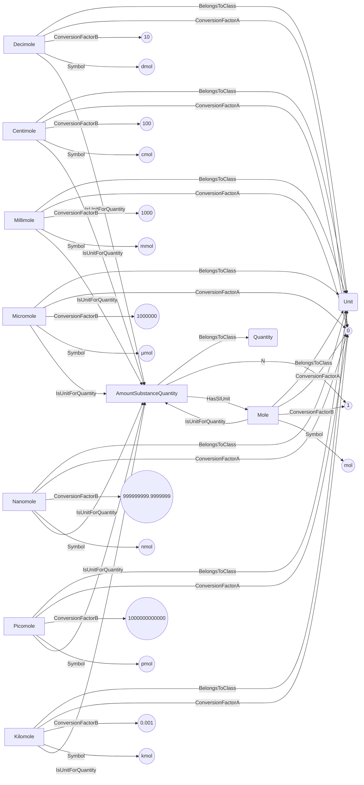
## AngleGradientPerLengthQuantity <!-- NOUN -->
- Display name: AngleGradientPerLength
- Parent class: [Quantity](./Quantities.md#Quantity)
- Specialization:
  - L = -1
  - Theta = 1
- Description: 
Consider a situation where you have a length $L$ along which an angle $\theta$ changes. The angle variation gradient is defined as the **rate of change of the angle** per unit change in length. Mathematically, it can be expressed as: 
$$\text{ Angle Variation Gradient} = \frac{ d\theta}{ dL}$$
where: 
- Definition set: QuantityTypes
- Examples:
``` dwis
Quantity:AngleGradientPerLengthQuantity
AngleGradientPerLengthQuantity.L = -1
AngleGradientPerLengthQuantity.Theta = 1
Unit:RadianPerMetre
RadianPerMetre.ConversionFactorA = 0
RadianPerMetre.ConversionFactorB = 1
RadianPerMetre.Symbol = "rad/m"
RadianPerMetre IsUnitForQuantity AngleGradientPerLengthQuantity
AngleGradientPerLengthQuantity HasSIUnit RadianPerMetre
Unit:DegreePerMetre
DegreePerMetre.ConversionFactorA = 0
DegreePerMetre.ConversionFactorB = 57.29577951308232
DegreePerMetre.Symbol = "°/m"
DegreePerMetre IsUnitForQuantity AngleGradientPerLengthQuantity
Unit:DegreePerCentimetre
DegreePerCentimetre.ConversionFactorA = 0
DegreePerCentimetre.ConversionFactorB = 0.5729577951308232
DegreePerCentimetre.Symbol = "°/cm"
DegreePerCentimetre IsUnitForQuantity AngleGradientPerLengthQuantity
Unit:DegreePerFoot
DegreePerFoot.ConversionFactorA = 0
DegreePerFoot.ConversionFactorB = 17.46375359558749
DegreePerFoot.Symbol = "°/ft"
DegreePerFoot IsUnitForQuantity AngleGradientPerLengthQuantity
Unit:DegreePerInch
DegreePerInch.ConversionFactorA = 0
DegreePerInch.ConversionFactorB = 1.455312799632291
DegreePerInch.Symbol = "°/in"
DegreePerInch IsUnitForQuantity AngleGradientPerLengthQuantity
Unit:DegreePerDecimetre
DegreePerDecimetre.ConversionFactorA = 0
DegreePerDecimetre.ConversionFactorB = 5.729577951308233
DegreePerDecimetre.Symbol = "°/dm"
DegreePerDecimetre IsUnitForQuantity AngleGradientPerLengthQuantity
Unit:DegreePerMillimetre
DegreePerMillimetre.ConversionFactorA = 0
DegreePerMillimetre.ConversionFactorB = 0.057295779513082325
DegreePerMillimetre.Symbol = "°/mm"
DegreePerMillimetre IsUnitForQuantity AngleGradientPerLengthQuantity
Unit:RadianPerMillimetre
RadianPerMillimetre.ConversionFactorA = 0
RadianPerMillimetre.ConversionFactorB = 0.001
RadianPerMillimetre.Symbol = "rad/mm"
RadianPerMillimetre IsUnitForQuantity AngleGradientPerLengthQuantity
Unit:RadianPerCentimetre
RadianPerCentimetre.ConversionFactorA = 0
RadianPerCentimetre.ConversionFactorB = 0.01
RadianPerCentimetre.Symbol = "rad/cm"
RadianPerCentimetre IsUnitForQuantity AngleGradientPerLengthQuantity
Unit:RadianPerDecimetre
RadianPerDecimetre.ConversionFactorA = 0
RadianPerDecimetre.ConversionFactorB = 0.1
RadianPerDecimetre.Symbol = "rad/dm"
RadianPerDecimetre IsUnitForQuantity AngleGradientPerLengthQuantity
Unit:RadianPerFoot
RadianPerFoot.ConversionFactorA = 0
RadianPerFoot.ConversionFactorB = 0.30479999999999996
RadianPerFoot.Symbol = "rad/ft"
RadianPerFoot IsUnitForQuantity AngleGradientPerLengthQuantity
Unit:RadianPerInch
RadianPerInch.ConversionFactorA = 0
RadianPerInch.ConversionFactorB = 0.0254
RadianPerInch.Symbol = "rad/in"
RadianPerInch IsUnitForQuantity AngleGradientPerLengthQuantity
```
An example semantic graph looks like as follow:
```mermaid
graph LR
	N0000[AngleGradientPerLengthQuantity] -->|BelongsToClass| N0001(Quantity) 
	N0000[AngleGradientPerLengthQuantity] -->|L| N0002(("-1")) 
	N0000[AngleGradientPerLengthQuantity] -->|Theta| N0003(("1")) 
	N0004[RadianPerMetre] -->|BelongsToClass| N0005(Unit) 
	N0004[RadianPerMetre] -->|ConversionFactorA| N0006(("0")) 
	N0004[RadianPerMetre] -->|ConversionFactorB| N0003(("1")) 
	N0004[RadianPerMetre] -->|Symbol| N0007(("rad/m")) 
	N0004[RadianPerMetre] -->|IsUnitForQuantity| N0000[AngleGradientPerLengthQuantity] 
	N0000[AngleGradientPerLengthQuantity] -->|HasSIUnit| N0004[RadianPerMetre] 
	N0008[DegreePerMetre] -->|BelongsToClass| N0005(Unit) 
	N0008[DegreePerMetre] -->|ConversionFactorA| N0006(("0")) 
	N0008[DegreePerMetre] -->|ConversionFactorB| N0009(("57.29577951308232")) 
	N0008[DegreePerMetre] -->|Symbol| N0010(("°/m")) 
	N0008[DegreePerMetre] -->|IsUnitForQuantity| N0000[AngleGradientPerLengthQuantity] 
	N0011[DegreePerCentimetre] -->|BelongsToClass| N0005(Unit) 
	N0011[DegreePerCentimetre] -->|ConversionFactorA| N0006(("0")) 
	N0011[DegreePerCentimetre] -->|ConversionFactorB| N0012(("0.5729577951308232")) 
	N0011[DegreePerCentimetre] -->|Symbol| N0013(("°/cm")) 
	N0011[DegreePerCentimetre] -->|IsUnitForQuantity| N0000[AngleGradientPerLengthQuantity] 
	N0014[DegreePerFoot] -->|BelongsToClass| N0005(Unit) 
	N0014[DegreePerFoot] -->|ConversionFactorA| N0006(("0")) 
	N0014[DegreePerFoot] -->|ConversionFactorB| N0015(("17.46375359558749")) 
	N0014[DegreePerFoot] -->|Symbol| N0016(("°/ft")) 
	N0014[DegreePerFoot] -->|IsUnitForQuantity| N0000[AngleGradientPerLengthQuantity] 
	N0017[DegreePerInch] -->|BelongsToClass| N0005(Unit) 
	N0017[DegreePerInch] -->|ConversionFactorA| N0006(("0")) 
	N0017[DegreePerInch] -->|ConversionFactorB| N0018(("1.455312799632291")) 
	N0017[DegreePerInch] -->|Symbol| N0019(("°/in")) 
	N0017[DegreePerInch] -->|IsUnitForQuantity| N0000[AngleGradientPerLengthQuantity] 
	N0020[DegreePerDecimetre] -->|BelongsToClass| N0005(Unit) 
	N0020[DegreePerDecimetre] -->|ConversionFactorA| N0006(("0")) 
	N0020[DegreePerDecimetre] -->|ConversionFactorB| N0021(("5.729577951308233")) 
	N0020[DegreePerDecimetre] -->|Symbol| N0022(("°/dm")) 
	N0020[DegreePerDecimetre] -->|IsUnitForQuantity| N0000[AngleGradientPerLengthQuantity] 
	N0023[DegreePerMillimetre] -->|BelongsToClass| N0005(Unit) 
	N0023[DegreePerMillimetre] -->|ConversionFactorA| N0006(("0")) 
	N0023[DegreePerMillimetre] -->|ConversionFactorB| N0024(("0.057295779513082325")) 
	N0023[DegreePerMillimetre] -->|Symbol| N0025(("°/mm")) 
	N0023[DegreePerMillimetre] -->|IsUnitForQuantity| N0000[AngleGradientPerLengthQuantity] 
	N0026[RadianPerMillimetre] -->|BelongsToClass| N0005(Unit) 
	N0026[RadianPerMillimetre] -->|ConversionFactorA| N0006(("0")) 
	N0026[RadianPerMillimetre] -->|ConversionFactorB| N0027(("0.001")) 
	N0026[RadianPerMillimetre] -->|Symbol| N0028(("rad/mm")) 
	N0026[RadianPerMillimetre] -->|IsUnitForQuantity| N0000[AngleGradientPerLengthQuantity] 
	N0029[RadianPerCentimetre] -->|BelongsToClass| N0005(Unit) 
	N0029[RadianPerCentimetre] -->|ConversionFactorA| N0006(("0")) 
	N0029[RadianPerCentimetre] -->|ConversionFactorB| N0030(("0.01")) 
	N0029[RadianPerCentimetre] -->|Symbol| N0031(("rad/cm")) 
	N0029[RadianPerCentimetre] -->|IsUnitForQuantity| N0000[AngleGradientPerLengthQuantity] 
	N0032[RadianPerDecimetre] -->|BelongsToClass| N0005(Unit) 
	N0032[RadianPerDecimetre] -->|ConversionFactorA| N0006(("0")) 
	N0032[RadianPerDecimetre] -->|ConversionFactorB| N0033(("0.1")) 
	N0032[RadianPerDecimetre] -->|Symbol| N0034(("rad/dm")) 
	N0032[RadianPerDecimetre] -->|IsUnitForQuantity| N0000[AngleGradientPerLengthQuantity] 
	N0035[RadianPerFoot] -->|BelongsToClass| N0005(Unit) 
	N0035[RadianPerFoot] -->|ConversionFactorA| N0006(("0")) 
	N0035[RadianPerFoot] -->|ConversionFactorB| N0036(("0.30479999999999996")) 
	N0035[RadianPerFoot] -->|Symbol| N0037(("rad/ft")) 
	N0035[RadianPerFoot] -->|IsUnitForQuantity| N0000[AngleGradientPerLengthQuantity] 
	N0038[RadianPerInch] -->|BelongsToClass| N0005(Unit) 
	N0038[RadianPerInch] -->|ConversionFactorA| N0006(("0")) 
	N0038[RadianPerInch] -->|ConversionFactorB| N0039(("0.0254")) 
	N0038[RadianPerInch] -->|Symbol| N0040(("rad/in")) 
	N0038[RadianPerInch] -->|IsUnitForQuantity| N0000[AngleGradientPerLengthQuantity] 
```
## AngleMagneticFluxDensityQuantity <!-- NOUN -->
- Display name: AngleMagneticFluxDensity
- Parent class: [Quantity](./Quantities.md#Quantity)
- Specialization:
  - M = 1
  - T = -2
  - I = -1
  - Theta = 1
- Description: 
The **angle magnetic flux density** is the product of an angle by a magnetic flux density. Let's break it down step by step:
1. Magnetic Flux Density
The **magnetic flux density** $\mathbf{B}$ is a measure of the strength and direction of the magnetic field at a particular point in space. It represents the amount of magnetic flux passing through a unit area perpendicular to the direction of the magnetic field. In simpler terms, it describes how dense or concentrated the magnetic field lines are in a given region.It can be expressed in terms of the fundamental dimensions as:
$$[M][T]^{-2}[I]^{-1}$$
Where:
- Definition set: QuantityTypes
- Examples:
``` dwis
Quantity:AngleMagneticFluxDensityQuantity
AngleMagneticFluxDensityQuantity.M = 1
AngleMagneticFluxDensityQuantity.T = -2
AngleMagneticFluxDensityQuantity.I = -1
AngleMagneticFluxDensityQuantity.Theta = 1
Unit:RadianTesla
RadianTesla.ConversionFactorA = 0
RadianTesla.ConversionFactorB = 1
RadianTesla.Symbol = "rad•T"
RadianTesla IsUnitForQuantity AngleMagneticFluxDensityQuantity
AngleMagneticFluxDensityQuantity HasSIUnit RadianTesla
Unit:RadianGauss
RadianGauss.ConversionFactorA = 0
RadianGauss.ConversionFactorB = 10000
RadianGauss.Symbol = "rad•G"
RadianGauss IsUnitForQuantity AngleMagneticFluxDensityQuantity
Unit:RadianMilligauss
RadianMilligauss.ConversionFactorA = 0
RadianMilligauss.ConversionFactorB = 10000000
RadianMilligauss.Symbol = "rad•mG"
RadianMilligauss IsUnitForQuantity AngleMagneticFluxDensityQuantity
Unit:RadianMillitesla
RadianMillitesla.ConversionFactorA = 0
RadianMillitesla.ConversionFactorB = 1000
RadianMillitesla.Symbol = "rad•mT"
RadianMillitesla IsUnitForQuantity AngleMagneticFluxDensityQuantity
Unit:RadianMicrotesla
RadianMicrotesla.ConversionFactorA = 0
RadianMicrotesla.ConversionFactorB = 1000000
RadianMicrotesla.Symbol = "rad•µT"
RadianMicrotesla IsUnitForQuantity AngleMagneticFluxDensityQuantity
Unit:RadianNanotesla
RadianNanotesla.ConversionFactorA = 0
RadianNanotesla.ConversionFactorB = 999999999.9999999
RadianNanotesla.Symbol = "rad•nT"
RadianNanotesla IsUnitForQuantity AngleMagneticFluxDensityQuantity
Unit:RadianMaxwellPerSquareCentimetre
RadianMaxwellPerSquareCentimetre.ConversionFactorA = 0
RadianMaxwellPerSquareCentimetre.ConversionFactorB = 10000
RadianMaxwellPerSquareCentimetre.Symbol = "rad•Mx/cm²"
RadianMaxwellPerSquareCentimetre IsUnitForQuantity AngleMagneticFluxDensityQuantity
Unit:RadianWeberPerSquareMetre
RadianWeberPerSquareMetre.ConversionFactorA = 0
RadianWeberPerSquareMetre.ConversionFactorB = 1
RadianWeberPerSquareMetre.Symbol = "rad•Wb/m²"
RadianWeberPerSquareMetre IsUnitForQuantity AngleMagneticFluxDensityQuantity
Unit:DegreeTesla
DegreeTesla.ConversionFactorA = 0
DegreeTesla.ConversionFactorB = 57.29577951308232
DegreeTesla.Symbol = "°•T"
DegreeTesla IsUnitForQuantity AngleMagneticFluxDensityQuantity
Unit:DegreeGauss
DegreeGauss.ConversionFactorA = 0
DegreeGauss.ConversionFactorB = 572957.7951308232
DegreeGauss.Symbol = "°•G"
DegreeGauss IsUnitForQuantity AngleMagneticFluxDensityQuantity
Unit:DegreeMilligauss
DegreeMilligauss.ConversionFactorA = 0
DegreeMilligauss.ConversionFactorB = 572957795.1308231
DegreeMilligauss.Symbol = "°•mG"
DegreeMilligauss IsUnitForQuantity AngleMagneticFluxDensityQuantity
Unit:DegreeMillitesla
DegreeMillitesla.ConversionFactorA = 0
DegreeMillitesla.ConversionFactorB = 57295.77951308232
DegreeMillitesla.Symbol = "°•mT"
DegreeMillitesla IsUnitForQuantity AngleMagneticFluxDensityQuantity
Unit:DegreeMicrotesla
DegreeMicrotesla.ConversionFactorA = 0
DegreeMicrotesla.ConversionFactorB = 57295779.513082325
DegreeMicrotesla.Symbol = "°•µT"
DegreeMicrotesla IsUnitForQuantity AngleMagneticFluxDensityQuantity
Unit:DegreeNanotesla
DegreeNanotesla.ConversionFactorA = 0
DegreeNanotesla.ConversionFactorB = 57295779513.08232
DegreeNanotesla.Symbol = "°•nT"
DegreeNanotesla IsUnitForQuantity AngleMagneticFluxDensityQuantity
Unit:DegreeMaxwellPerSquareCentimetre
DegreeMaxwellPerSquareCentimetre.ConversionFactorA = 0
DegreeMaxwellPerSquareCentimetre.ConversionFactorB = 572957.7951308232
DegreeMaxwellPerSquareCentimetre.Symbol = "°•Mx/cm²"
DegreeMaxwellPerSquareCentimetre IsUnitForQuantity AngleMagneticFluxDensityQuantity
Unit:DegreeWeberPerSquareMetre
DegreeWeberPerSquareMetre.ConversionFactorA = 0
DegreeWeberPerSquareMetre.ConversionFactorB = 57.29577951308232
DegreeWeberPerSquareMetre.Symbol = "°•Wb/m²"
DegreeWeberPerSquareMetre IsUnitForQuantity AngleMagneticFluxDensityQuantity
```
An example semantic graph looks like as follow:
```mermaid
graph LR
	N0000[AngleMagneticFluxDensityQuantity] -->|BelongsToClass| N0001(Quantity) 
	N0000[AngleMagneticFluxDensityQuantity] -->|M| N0002(("1")) 
	N0000[AngleMagneticFluxDensityQuantity] -->|T| N0003(("-2")) 
	N0000[AngleMagneticFluxDensityQuantity] -->|I| N0004(("-1")) 
	N0000[AngleMagneticFluxDensityQuantity] -->|Theta| N0002(("1")) 
	N0005[RadianTesla] -->|BelongsToClass| N0006(Unit) 
	N0005[RadianTesla] -->|ConversionFactorA| N0007(("0")) 
	N0005[RadianTesla] -->|ConversionFactorB| N0002(("1")) 
	N0005[RadianTesla] -->|Symbol| N0008(("rad•T")) 
	N0005[RadianTesla] -->|IsUnitForQuantity| N0000[AngleMagneticFluxDensityQuantity] 
	N0000[AngleMagneticFluxDensityQuantity] -->|HasSIUnit| N0005[RadianTesla] 
	N0009[RadianGauss] -->|BelongsToClass| N0006(Unit) 
	N0009[RadianGauss] -->|ConversionFactorA| N0007(("0")) 
	N0009[RadianGauss] -->|ConversionFactorB| N0010(("10000")) 
	N0009[RadianGauss] -->|Symbol| N0011(("rad•G")) 
	N0009[RadianGauss] -->|IsUnitForQuantity| N0000[AngleMagneticFluxDensityQuantity] 
	N0012[RadianMilligauss] -->|BelongsToClass| N0006(Unit) 
	N0012[RadianMilligauss] -->|ConversionFactorA| N0007(("0")) 
	N0012[RadianMilligauss] -->|ConversionFactorB| N0013(("10000000")) 
	N0012[RadianMilligauss] -->|Symbol| N0014(("rad•mG")) 
	N0012[RadianMilligauss] -->|IsUnitForQuantity| N0000[AngleMagneticFluxDensityQuantity] 
	N0015[RadianMillitesla] -->|BelongsToClass| N0006(Unit) 
	N0015[RadianMillitesla] -->|ConversionFactorA| N0007(("0")) 
	N0015[RadianMillitesla] -->|ConversionFactorB| N0016(("1000")) 
	N0015[RadianMillitesla] -->|Symbol| N0017(("rad•mT")) 
	N0015[RadianMillitesla] -->|IsUnitForQuantity| N0000[AngleMagneticFluxDensityQuantity] 
	N0018[RadianMicrotesla] -->|BelongsToClass| N0006(Unit) 
	N0018[RadianMicrotesla] -->|ConversionFactorA| N0007(("0")) 
	N0018[RadianMicrotesla] -->|ConversionFactorB| N0019(("1000000")) 
	N0018[RadianMicrotesla] -->|Symbol| N0020(("rad•µT")) 
	N0018[RadianMicrotesla] -->|IsUnitForQuantity| N0000[AngleMagneticFluxDensityQuantity] 
	N0021[RadianNanotesla] -->|BelongsToClass| N0006(Unit) 
	N0021[RadianNanotesla] -->|ConversionFactorA| N0007(("0")) 
	N0021[RadianNanotesla] -->|ConversionFactorB| N0022(("999999999.9999999")) 
	N0021[RadianNanotesla] -->|Symbol| N0023(("rad•nT")) 
	N0021[RadianNanotesla] -->|IsUnitForQuantity| N0000[AngleMagneticFluxDensityQuantity] 
	N0024[RadianMaxwellPerSquareCentimetre] -->|BelongsToClass| N0006(Unit) 
	N0024[RadianMaxwellPerSquareCentimetre] -->|ConversionFactorA| N0007(("0")) 
	N0024[RadianMaxwellPerSquareCentimetre] -->|ConversionFactorB| N0010(("10000")) 
	N0024[RadianMaxwellPerSquareCentimetre] -->|Symbol| N0025(("rad•Mx/cm²")) 
	N0024[RadianMaxwellPerSquareCentimetre] -->|IsUnitForQuantity| N0000[AngleMagneticFluxDensityQuantity] 
	N0026[RadianWeberPerSquareMetre] -->|BelongsToClass| N0006(Unit) 
	N0026[RadianWeberPerSquareMetre] -->|ConversionFactorA| N0007(("0")) 
	N0026[RadianWeberPerSquareMetre] -->|ConversionFactorB| N0002(("1")) 
	N0026[RadianWeberPerSquareMetre] -->|Symbol| N0027(("rad•Wb/m²")) 
	N0026[RadianWeberPerSquareMetre] -->|IsUnitForQuantity| N0000[AngleMagneticFluxDensityQuantity] 
	N0028[DegreeTesla] -->|BelongsToClass| N0006(Unit) 
	N0028[DegreeTesla] -->|ConversionFactorA| N0007(("0")) 
	N0028[DegreeTesla] -->|ConversionFactorB| N0029(("57.29577951308232")) 
	N0028[DegreeTesla] -->|Symbol| N0030(("°•T")) 
	N0028[DegreeTesla] -->|IsUnitForQuantity| N0000[AngleMagneticFluxDensityQuantity] 
	N0031[DegreeGauss] -->|BelongsToClass| N0006(Unit) 
	N0031[DegreeGauss] -->|ConversionFactorA| N0007(("0")) 
	N0031[DegreeGauss] -->|ConversionFactorB| N0032(("572957.7951308232")) 
	N0031[DegreeGauss] -->|Symbol| N0033(("°•G")) 
	N0031[DegreeGauss] -->|IsUnitForQuantity| N0000[AngleMagneticFluxDensityQuantity] 
	N0034[DegreeMilligauss] -->|BelongsToClass| N0006(Unit) 
	N0034[DegreeMilligauss] -->|ConversionFactorA| N0007(("0")) 
	N0034[DegreeMilligauss] -->|ConversionFactorB| N0035(("572957795.1308231")) 
	N0034[DegreeMilligauss] -->|Symbol| N0036(("°•mG")) 
	N0034[DegreeMilligauss] -->|IsUnitForQuantity| N0000[AngleMagneticFluxDensityQuantity] 
	N0037[DegreeMillitesla] -->|BelongsToClass| N0006(Unit) 
	N0037[DegreeMillitesla] -->|ConversionFactorA| N0007(("0")) 
	N0037[DegreeMillitesla] -->|ConversionFactorB| N0038(("57295.77951308232")) 
	N0037[DegreeMillitesla] -->|Symbol| N0039(("°•mT")) 
	N0037[DegreeMillitesla] -->|IsUnitForQuantity| N0000[AngleMagneticFluxDensityQuantity] 
	N0040[DegreeMicrotesla] -->|BelongsToClass| N0006(Unit) 
	N0040[DegreeMicrotesla] -->|ConversionFactorA| N0007(("0")) 
	N0040[DegreeMicrotesla] -->|ConversionFactorB| N0041(("57295779.513082325")) 
	N0040[DegreeMicrotesla] -->|Symbol| N0042(("°•µT")) 
	N0040[DegreeMicrotesla] -->|IsUnitForQuantity| N0000[AngleMagneticFluxDensityQuantity] 
	N0043[DegreeNanotesla] -->|BelongsToClass| N0006(Unit) 
	N0043[DegreeNanotesla] -->|ConversionFactorA| N0007(("0")) 
	N0043[DegreeNanotesla] -->|ConversionFactorB| N0044(("57295779513.08232")) 
	N0043[DegreeNanotesla] -->|Symbol| N0045(("°•nT")) 
	N0043[DegreeNanotesla] -->|IsUnitForQuantity| N0000[AngleMagneticFluxDensityQuantity] 
	N0046[DegreeMaxwellPerSquareCentimetre] -->|BelongsToClass| N0006(Unit) 
	N0046[DegreeMaxwellPerSquareCentimetre] -->|ConversionFactorA| N0007(("0")) 
	N0046[DegreeMaxwellPerSquareCentimetre] -->|ConversionFactorB| N0032(("572957.7951308232")) 
	N0046[DegreeMaxwellPerSquareCentimetre] -->|Symbol| N0047(("°•Mx/cm²")) 
	N0046[DegreeMaxwellPerSquareCentimetre] -->|IsUnitForQuantity| N0000[AngleMagneticFluxDensityQuantity] 
	N0048[DegreeWeberPerSquareMetre] -->|BelongsToClass| N0006(Unit) 
	N0048[DegreeWeberPerSquareMetre] -->|ConversionFactorA| N0007(("0")) 
	N0048[DegreeWeberPerSquareMetre] -->|ConversionFactorB| N0029(("57.29577951308232")) 
	N0048[DegreeWeberPerSquareMetre] -->|Symbol| N0049(("°•Wb/m²")) 
	N0048[DegreeWeberPerSquareMetre] -->|IsUnitForQuantity| N0000[AngleMagneticFluxDensityQuantity] 
```
## AngularAccelerationQuantity <!-- NOUN -->
- Display name: AngularAcceleration
- Parent class: [Quantity](./Quantities.md#Quantity)
- Specialization:
  - T = -2
  - Theta = 1
- Description: 
An angular acceleration is the second derivative compared to time of a plan angle: $\frac{d^2\theta}{dt^2}$.
The dimension of angular acceleration is:
$$[{\theta}T^{-2}]$$.
The SI unit for **angular acceleration** is: radian per second squared with the associated unit label $\frac{rad}{s^{2}}$
- Definition set: QuantityTypes
- Examples:
``` dwis
Quantity:AngularAccelerationQuantity
AngularAccelerationQuantity.T = -2
AngularAccelerationQuantity.Theta = 1
Unit:RadianPerSecondSquared
RadianPerSecondSquared.ConversionFactorA = 0
RadianPerSecondSquared.ConversionFactorB = 1
RadianPerSecondSquared.Symbol = "rad/s²"
RadianPerSecondSquared IsUnitForQuantity AngularAccelerationQuantity
AngularAccelerationQuantity HasSIUnit RadianPerSecondSquared
Unit:DegreePerSecondSquared
DegreePerSecondSquared.ConversionFactorA = 0
DegreePerSecondSquared.ConversionFactorB = 57.29577951308232
DegreePerSecondSquared.Symbol = "°/s²"
DegreePerSecondSquared IsUnitForQuantity AngularAccelerationQuantity
Unit:RadianPerDayPerSecond
RadianPerDayPerSecond.ConversionFactorA = 0
RadianPerDayPerSecond.ConversionFactorB = 86400
RadianPerDayPerSecond.Symbol = "rad/d/s"
RadianPerDayPerSecond IsUnitForQuantity AngularAccelerationQuantity
Unit:RadianPerHourPerSecond
RadianPerHourPerSecond.ConversionFactorA = 0
RadianPerHourPerSecond.ConversionFactorB = 3600
RadianPerHourPerSecond.Symbol = "rad/h/s"
RadianPerHourPerSecond IsUnitForQuantity AngularAccelerationQuantity
Unit:RadianPerMinutePerSecond
RadianPerMinutePerSecond.ConversionFactorA = 0
RadianPerMinutePerSecond.ConversionFactorB = 60
RadianPerMinutePerSecond.Symbol = "rad/min/s"
RadianPerMinutePerSecond IsUnitForQuantity AngularAccelerationQuantity
Unit:DegreePerDayPerSecond
DegreePerDayPerSecond.ConversionFactorA = 0
DegreePerDayPerSecond.ConversionFactorB = 4950355.3499303125
DegreePerDayPerSecond.Symbol = "°/d/s"
DegreePerDayPerSecond IsUnitForQuantity AngularAccelerationQuantity
Unit:DegreePerHourPerSecond
DegreePerHourPerSecond.ConversionFactorA = 0
DegreePerHourPerSecond.ConversionFactorB = 206264.80624709636
DegreePerHourPerSecond.Symbol = "°/h/s"
DegreePerHourPerSecond IsUnitForQuantity AngularAccelerationQuantity
Unit:DegreePerMinutePerSecond
DegreePerMinutePerSecond.ConversionFactorA = 0
DegreePerMinutePerSecond.ConversionFactorB = 3437.746770784939
DegreePerMinutePerSecond.Symbol = "°/min/s"
DegreePerMinutePerSecond IsUnitForQuantity AngularAccelerationQuantity
Unit:RadianPerSecondPerMinute
RadianPerSecondPerMinute.ConversionFactorA = 0
RadianPerSecondPerMinute.ConversionFactorB = 60
RadianPerSecondPerMinute.Symbol = "rad/s/min"
RadianPerSecondPerMinute IsUnitForQuantity AngularAccelerationQuantity
Unit:DegreePerSecondPerMinute
DegreePerSecondPerMinute.ConversionFactorA = 0
DegreePerSecondPerMinute.ConversionFactorB = 3437.746770784939
DegreePerSecondPerMinute.Symbol = "°/s/min"
DegreePerSecondPerMinute IsUnitForQuantity AngularAccelerationQuantity
Unit:RadianPerDayPerMinute
RadianPerDayPerMinute.ConversionFactorA = 0
RadianPerDayPerMinute.ConversionFactorB = 5184000
RadianPerDayPerMinute.Symbol = "rad/d/min"
RadianPerDayPerMinute IsUnitForQuantity AngularAccelerationQuantity
Unit:RadianPerHourPerMinute
RadianPerHourPerMinute.ConversionFactorA = 0
RadianPerHourPerMinute.ConversionFactorB = 216000
RadianPerHourPerMinute.Symbol = "rad/h/min"
RadianPerHourPerMinute IsUnitForQuantity AngularAccelerationQuantity
Unit:RadianPerMinuteSquared
RadianPerMinuteSquared.ConversionFactorA = 0
RadianPerMinuteSquared.ConversionFactorB = 3600
RadianPerMinuteSquared.Symbol = "rad/min²"
RadianPerMinuteSquared IsUnitForQuantity AngularAccelerationQuantity
Unit:DegreePerDayPerMinute
DegreePerDayPerMinute.ConversionFactorA = 0
DegreePerDayPerMinute.ConversionFactorB = 297021320.99581873
DegreePerDayPerMinute.Symbol = "°/d/min"
DegreePerDayPerMinute IsUnitForQuantity AngularAccelerationQuantity
Unit:DegreePerHourPerMinute
DegreePerHourPerMinute.ConversionFactorA = 0
DegreePerHourPerMinute.ConversionFactorB = 12375888.374825781
DegreePerHourPerMinute.Symbol = "°/h/min"
DegreePerHourPerMinute IsUnitForQuantity AngularAccelerationQuantity
Unit:DegreePerMinuteSquared
DegreePerMinuteSquared.ConversionFactorA = 0
DegreePerMinuteSquared.ConversionFactorB = 206264.80624709636
DegreePerMinuteSquared.Symbol = "°/min²"
DegreePerMinuteSquared IsUnitForQuantity AngularAccelerationQuantity
Unit:RadianPerSecondPerHour
RadianPerSecondPerHour.ConversionFactorA = 0
RadianPerSecondPerHour.ConversionFactorB = 3600
RadianPerSecondPerHour.Symbol = "rad/s/h"
RadianPerSecondPerHour IsUnitForQuantity AngularAccelerationQuantity
Unit:DegreePerSecondPerHour
DegreePerSecondPerHour.ConversionFactorA = 0
DegreePerSecondPerHour.ConversionFactorB = 206264.80624709636
DegreePerSecondPerHour.Symbol = "°/s/h"
DegreePerSecondPerHour IsUnitForQuantity AngularAccelerationQuantity
Unit:RadianPerDayPerHour
RadianPerDayPerHour.ConversionFactorA = 0
RadianPerDayPerHour.ConversionFactorB = 311040000
RadianPerDayPerHour.Symbol = "rad/d/h"
RadianPerDayPerHour IsUnitForQuantity AngularAccelerationQuantity
Unit:RadianPerHourSquared
RadianPerHourSquared.ConversionFactorA = 0
RadianPerHourSquared.ConversionFactorB = 12960000
RadianPerHourSquared.Symbol = "rad/h²"
RadianPerHourSquared IsUnitForQuantity AngularAccelerationQuantity
Unit:RadianPerMinutePerHour
RadianPerMinutePerHour.ConversionFactorA = 0
RadianPerMinutePerHour.ConversionFactorB = 216000
RadianPerMinutePerHour.Symbol = "rad/min/h"
RadianPerMinutePerHour IsUnitForQuantity AngularAccelerationQuantity
Unit:DegreePerDayPerHour
DegreePerDayPerHour.ConversionFactorA = 0
DegreePerDayPerHour.ConversionFactorB = 17821279259.749126
DegreePerDayPerHour.Symbol = "°/d/h"
DegreePerDayPerHour IsUnitForQuantity AngularAccelerationQuantity
Unit:DegreePerHourSquared
DegreePerHourSquared.ConversionFactorA = 0
DegreePerHourSquared.ConversionFactorB = 742553302.4895469
DegreePerHourSquared.Symbol = "°/h²"
DegreePerHourSquared IsUnitForQuantity AngularAccelerationQuantity
Unit:DegreePerMinutePerHour
DegreePerMinutePerHour.ConversionFactorA = 0
DegreePerMinutePerHour.ConversionFactorB = 12375888.374825781
DegreePerMinutePerHour.Symbol = "°/min/h"
DegreePerMinutePerHour IsUnitForQuantity AngularAccelerationQuantity
Unit:RadianPerSecondPerDay
RadianPerSecondPerDay.ConversionFactorA = 0
RadianPerSecondPerDay.ConversionFactorB = 86400
RadianPerSecondPerDay.Symbol = "rad/s/d"
RadianPerSecondPerDay IsUnitForQuantity AngularAccelerationQuantity
Unit:DegreePerSecondPerDay
DegreePerSecondPerDay.ConversionFactorA = 0
DegreePerSecondPerDay.ConversionFactorB = 4950355.3499303125
DegreePerSecondPerDay.Symbol = "°/s/d"
DegreePerSecondPerDay IsUnitForQuantity AngularAccelerationQuantity
Unit:RadianPerDaySquared
RadianPerDaySquared.ConversionFactorA = 0
RadianPerDaySquared.ConversionFactorB = 7464960000
RadianPerDaySquared.Symbol = "rad/d²"
RadianPerDaySquared IsUnitForQuantity AngularAccelerationQuantity
Unit:RadianPerHourPerDay
RadianPerHourPerDay.ConversionFactorA = 0
RadianPerHourPerDay.ConversionFactorB = 311040000
RadianPerHourPerDay.Symbol = "rad/h/d"
RadianPerHourPerDay IsUnitForQuantity AngularAccelerationQuantity
Unit:RadianPerMinutePerDay
RadianPerMinutePerDay.ConversionFactorA = 0
RadianPerMinutePerDay.ConversionFactorB = 5184000
RadianPerMinutePerDay.Symbol = "rad/min/d"
RadianPerMinutePerDay IsUnitForQuantity AngularAccelerationQuantity
Unit:DegreePerDaySquared
DegreePerDaySquared.ConversionFactorA = 0
DegreePerDaySquared.ConversionFactorB = 427710702233.979
DegreePerDaySquared.Symbol = "°/d²"
DegreePerDaySquared IsUnitForQuantity AngularAccelerationQuantity
Unit:DegreePerHourPerDay
DegreePerHourPerDay.ConversionFactorA = 0
DegreePerHourPerDay.ConversionFactorB = 17821279259.749126
DegreePerHourPerDay.Symbol = "°/h/d"
DegreePerHourPerDay IsUnitForQuantity AngularAccelerationQuantity
Unit:DegreePerMinutePerDay
DegreePerMinutePerDay.ConversionFactorA = 0
DegreePerMinutePerDay.ConversionFactorB = 297021320.99581873
DegreePerMinutePerDay.Symbol = "°/min/d"
DegreePerMinutePerDay IsUnitForQuantity AngularAccelerationQuantity
```
An example semantic graph looks like as follow:
```mermaid
graph LR
	N0000[AngularAccelerationQuantity] -->|BelongsToClass| N0001(Quantity) 
	N0000[AngularAccelerationQuantity] -->|T| N0002(("-2")) 
	N0000[AngularAccelerationQuantity] -->|Theta| N0003(("1")) 
	N0004[RadianPerSecondSquared] -->|BelongsToClass| N0005(Unit) 
	N0004[RadianPerSecondSquared] -->|ConversionFactorA| N0006(("0")) 
	N0004[RadianPerSecondSquared] -->|ConversionFactorB| N0003(("1")) 
	N0004[RadianPerSecondSquared] -->|Symbol| N0007(("rad/s²")) 
	N0004[RadianPerSecondSquared] -->|IsUnitForQuantity| N0000[AngularAccelerationQuantity] 
	N0000[AngularAccelerationQuantity] -->|HasSIUnit| N0004[RadianPerSecondSquared] 
	N0008[DegreePerSecondSquared] -->|BelongsToClass| N0005(Unit) 
	N0008[DegreePerSecondSquared] -->|ConversionFactorA| N0006(("0")) 
	N0008[DegreePerSecondSquared] -->|ConversionFactorB| N0009(("57.29577951308232")) 
	N0008[DegreePerSecondSquared] -->|Symbol| N0010(("°/s²")) 
	N0008[DegreePerSecondSquared] -->|IsUnitForQuantity| N0000[AngularAccelerationQuantity] 
	N0011[RadianPerDayPerSecond] -->|BelongsToClass| N0005(Unit) 
	N0011[RadianPerDayPerSecond] -->|ConversionFactorA| N0006(("0")) 
	N0011[RadianPerDayPerSecond] -->|ConversionFactorB| N0012(("86400")) 
	N0011[RadianPerDayPerSecond] -->|Symbol| N0013(("rad/d/s")) 
	N0011[RadianPerDayPerSecond] -->|IsUnitForQuantity| N0000[AngularAccelerationQuantity] 
	N0014[RadianPerHourPerSecond] -->|BelongsToClass| N0005(Unit) 
	N0014[RadianPerHourPerSecond] -->|ConversionFactorA| N0006(("0")) 
	N0014[RadianPerHourPerSecond] -->|ConversionFactorB| N0015(("3600")) 
	N0014[RadianPerHourPerSecond] -->|Symbol| N0016(("rad/h/s")) 
	N0014[RadianPerHourPerSecond] -->|IsUnitForQuantity| N0000[AngularAccelerationQuantity] 
	N0017[RadianPerMinutePerSecond] -->|BelongsToClass| N0005(Unit) 
	N0017[RadianPerMinutePerSecond] -->|ConversionFactorA| N0006(("0")) 
	N0017[RadianPerMinutePerSecond] -->|ConversionFactorB| N0018(("60")) 
	N0017[RadianPerMinutePerSecond] -->|Symbol| N0019(("rad/min/s")) 
	N0017[RadianPerMinutePerSecond] -->|IsUnitForQuantity| N0000[AngularAccelerationQuantity] 
	N0020[DegreePerDayPerSecond] -->|BelongsToClass| N0005(Unit) 
	N0020[DegreePerDayPerSecond] -->|ConversionFactorA| N0006(("0")) 
	N0020[DegreePerDayPerSecond] -->|ConversionFactorB| N0021(("4950355.3499303125")) 
	N0020[DegreePerDayPerSecond] -->|Symbol| N0022(("°/d/s")) 
	N0020[DegreePerDayPerSecond] -->|IsUnitForQuantity| N0000[AngularAccelerationQuantity] 
	N0023[DegreePerHourPerSecond] -->|BelongsToClass| N0005(Unit) 
	N0023[DegreePerHourPerSecond] -->|ConversionFactorA| N0006(("0")) 
	N0023[DegreePerHourPerSecond] -->|ConversionFactorB| N0024(("206264.80624709636")) 
	N0023[DegreePerHourPerSecond] -->|Symbol| N0025(("°/h/s")) 
	N0023[DegreePerHourPerSecond] -->|IsUnitForQuantity| N0000[AngularAccelerationQuantity] 
	N0026[DegreePerMinutePerSecond] -->|BelongsToClass| N0005(Unit) 
	N0026[DegreePerMinutePerSecond] -->|ConversionFactorA| N0006(("0")) 
	N0026[DegreePerMinutePerSecond] -->|ConversionFactorB| N0027(("3437.746770784939")) 
	N0026[DegreePerMinutePerSecond] -->|Symbol| N0028(("°/min/s")) 
	N0026[DegreePerMinutePerSecond] -->|IsUnitForQuantity| N0000[AngularAccelerationQuantity] 
	N0029[RadianPerSecondPerMinute] -->|BelongsToClass| N0005(Unit) 
	N0029[RadianPerSecondPerMinute] -->|ConversionFactorA| N0006(("0")) 
	N0029[RadianPerSecondPerMinute] -->|ConversionFactorB| N0018(("60")) 
	N0029[RadianPerSecondPerMinute] -->|Symbol| N0030(("rad/s/min")) 
	N0029[RadianPerSecondPerMinute] -->|IsUnitForQuantity| N0000[AngularAccelerationQuantity] 
	N0031[DegreePerSecondPerMinute] -->|BelongsToClass| N0005(Unit) 
	N0031[DegreePerSecondPerMinute] -->|ConversionFactorA| N0006(("0")) 
	N0031[DegreePerSecondPerMinute] -->|ConversionFactorB| N0027(("3437.746770784939")) 
	N0031[DegreePerSecondPerMinute] -->|Symbol| N0032(("°/s/min")) 
	N0031[DegreePerSecondPerMinute] -->|IsUnitForQuantity| N0000[AngularAccelerationQuantity] 
	N0033[RadianPerDayPerMinute] -->|BelongsToClass| N0005(Unit) 
	N0033[RadianPerDayPerMinute] -->|ConversionFactorA| N0006(("0")) 
	N0033[RadianPerDayPerMinute] -->|ConversionFactorB| N0034(("5184000")) 
	N0033[RadianPerDayPerMinute] -->|Symbol| N0035(("rad/d/min")) 
	N0033[RadianPerDayPerMinute] -->|IsUnitForQuantity| N0000[AngularAccelerationQuantity] 
	N0036[RadianPerHourPerMinute] -->|BelongsToClass| N0005(Unit) 
	N0036[RadianPerHourPerMinute] -->|ConversionFactorA| N0006(("0")) 
	N0036[RadianPerHourPerMinute] -->|ConversionFactorB| N0037(("216000")) 
	N0036[RadianPerHourPerMinute] -->|Symbol| N0038(("rad/h/min")) 
	N0036[RadianPerHourPerMinute] -->|IsUnitForQuantity| N0000[AngularAccelerationQuantity] 
	N0039[RadianPerMinuteSquared] -->|BelongsToClass| N0005(Unit) 
	N0039[RadianPerMinuteSquared] -->|ConversionFactorA| N0006(("0")) 
	N0039[RadianPerMinuteSquared] -->|ConversionFactorB| N0015(("3600")) 
	N0039[RadianPerMinuteSquared] -->|Symbol| N0040(("rad/min²")) 
	N0039[RadianPerMinuteSquared] -->|IsUnitForQuantity| N0000[AngularAccelerationQuantity] 
	N0041[DegreePerDayPerMinute] -->|BelongsToClass| N0005(Unit) 
	N0041[DegreePerDayPerMinute] -->|ConversionFactorA| N0006(("0")) 
	N0041[DegreePerDayPerMinute] -->|ConversionFactorB| N0042(("297021320.99581873")) 
	N0041[DegreePerDayPerMinute] -->|Symbol| N0043(("°/d/min")) 
	N0041[DegreePerDayPerMinute] -->|IsUnitForQuantity| N0000[AngularAccelerationQuantity] 
	N0044[DegreePerHourPerMinute] -->|BelongsToClass| N0005(Unit) 
	N0044[DegreePerHourPerMinute] -->|ConversionFactorA| N0006(("0")) 
	N0044[DegreePerHourPerMinute] -->|ConversionFactorB| N0045(("12375888.374825781")) 
	N0044[DegreePerHourPerMinute] -->|Symbol| N0046(("°/h/min")) 
	N0044[DegreePerHourPerMinute] -->|IsUnitForQuantity| N0000[AngularAccelerationQuantity] 
	N0047[DegreePerMinuteSquared] -->|BelongsToClass| N0005(Unit) 
	N0047[DegreePerMinuteSquared] -->|ConversionFactorA| N0006(("0")) 
	N0047[DegreePerMinuteSquared] -->|ConversionFactorB| N0024(("206264.80624709636")) 
	N0047[DegreePerMinuteSquared] -->|Symbol| N0048(("°/min²")) 
	N0047[DegreePerMinuteSquared] -->|IsUnitForQuantity| N0000[AngularAccelerationQuantity] 
	N0049[RadianPerSecondPerHour] -->|BelongsToClass| N0005(Unit) 
	N0049[RadianPerSecondPerHour] -->|ConversionFactorA| N0006(("0")) 
	N0049[RadianPerSecondPerHour] -->|ConversionFactorB| N0015(("3600")) 
	N0049[RadianPerSecondPerHour] -->|Symbol| N0050(("rad/s/h")) 
	N0049[RadianPerSecondPerHour] -->|IsUnitForQuantity| N0000[AngularAccelerationQuantity] 
	N0051[DegreePerSecondPerHour] -->|BelongsToClass| N0005(Unit) 
	N0051[DegreePerSecondPerHour] -->|ConversionFactorA| N0006(("0")) 
	N0051[DegreePerSecondPerHour] -->|ConversionFactorB| N0024(("206264.80624709636")) 
	N0051[DegreePerSecondPerHour] -->|Symbol| N0052(("°/s/h")) 
	N0051[DegreePerSecondPerHour] -->|IsUnitForQuantity| N0000[AngularAccelerationQuantity] 
	N0053[RadianPerDayPerHour] -->|BelongsToClass| N0005(Unit) 
	N0053[RadianPerDayPerHour] -->|ConversionFactorA| N0006(("0")) 
	N0053[RadianPerDayPerHour] -->|ConversionFactorB| N0054(("311040000")) 
	N0053[RadianPerDayPerHour] -->|Symbol| N0055(("rad/d/h")) 
	N0053[RadianPerDayPerHour] -->|IsUnitForQuantity| N0000[AngularAccelerationQuantity] 
	N0056[RadianPerHourSquared] -->|BelongsToClass| N0005(Unit) 
	N0056[RadianPerHourSquared] -->|ConversionFactorA| N0006(("0")) 
	N0056[RadianPerHourSquared] -->|ConversionFactorB| N0057(("12960000")) 
	N0056[RadianPerHourSquared] -->|Symbol| N0058(("rad/h²")) 
	N0056[RadianPerHourSquared] -->|IsUnitForQuantity| N0000[AngularAccelerationQuantity] 
	N0059[RadianPerMinutePerHour] -->|BelongsToClass| N0005(Unit) 
	N0059[RadianPerMinutePerHour] -->|ConversionFactorA| N0006(("0")) 
	N0059[RadianPerMinutePerHour] -->|ConversionFactorB| N0037(("216000")) 
	N0059[RadianPerMinutePerHour] -->|Symbol| N0060(("rad/min/h")) 
	N0059[RadianPerMinutePerHour] -->|IsUnitForQuantity| N0000[AngularAccelerationQuantity] 
	N0061[DegreePerDayPerHour] -->|BelongsToClass| N0005(Unit) 
	N0061[DegreePerDayPerHour] -->|ConversionFactorA| N0006(("0")) 
	N0061[DegreePerDayPerHour] -->|ConversionFactorB| N0062(("17821279259.749126")) 
	N0061[DegreePerDayPerHour] -->|Symbol| N0063(("°/d/h")) 
	N0061[DegreePerDayPerHour] -->|IsUnitForQuantity| N0000[AngularAccelerationQuantity] 
	N0064[DegreePerHourSquared] -->|BelongsToClass| N0005(Unit) 
	N0064[DegreePerHourSquared] -->|ConversionFactorA| N0006(("0")) 
	N0064[DegreePerHourSquared] -->|ConversionFactorB| N0065(("742553302.4895469")) 
	N0064[DegreePerHourSquared] -->|Symbol| N0066(("°/h²")) 
	N0064[DegreePerHourSquared] -->|IsUnitForQuantity| N0000[AngularAccelerationQuantity] 
	N0067[DegreePerMinutePerHour] -->|BelongsToClass| N0005(Unit) 
	N0067[DegreePerMinutePerHour] -->|ConversionFactorA| N0006(("0")) 
	N0067[DegreePerMinutePerHour] -->|ConversionFactorB| N0045(("12375888.374825781")) 
	N0067[DegreePerMinutePerHour] -->|Symbol| N0068(("°/min/h")) 
	N0067[DegreePerMinutePerHour] -->|IsUnitForQuantity| N0000[AngularAccelerationQuantity] 
	N0069[RadianPerSecondPerDay] -->|BelongsToClass| N0005(Unit) 
	N0069[RadianPerSecondPerDay] -->|ConversionFactorA| N0006(("0")) 
	N0069[RadianPerSecondPerDay] -->|ConversionFactorB| N0012(("86400")) 
	N0069[RadianPerSecondPerDay] -->|Symbol| N0070(("rad/s/d")) 
	N0069[RadianPerSecondPerDay] -->|IsUnitForQuantity| N0000[AngularAccelerationQuantity] 
	N0071[DegreePerSecondPerDay] -->|BelongsToClass| N0005(Unit) 
	N0071[DegreePerSecondPerDay] -->|ConversionFactorA| N0006(("0")) 
	N0071[DegreePerSecondPerDay] -->|ConversionFactorB| N0021(("4950355.3499303125")) 
	N0071[DegreePerSecondPerDay] -->|Symbol| N0072(("°/s/d")) 
	N0071[DegreePerSecondPerDay] -->|IsUnitForQuantity| N0000[AngularAccelerationQuantity] 
	N0073[RadianPerDaySquared] -->|BelongsToClass| N0005(Unit) 
	N0073[RadianPerDaySquared] -->|ConversionFactorA| N0006(("0")) 
	N0073[RadianPerDaySquared] -->|ConversionFactorB| N0074(("7464960000")) 
	N0073[RadianPerDaySquared] -->|Symbol| N0075(("rad/d²")) 
	N0073[RadianPerDaySquared] -->|IsUnitForQuantity| N0000[AngularAccelerationQuantity] 
	N0076[RadianPerHourPerDay] -->|BelongsToClass| N0005(Unit) 
	N0076[RadianPerHourPerDay] -->|ConversionFactorA| N0006(("0")) 
	N0076[RadianPerHourPerDay] -->|ConversionFactorB| N0054(("311040000")) 
	N0076[RadianPerHourPerDay] -->|Symbol| N0077(("rad/h/d")) 
	N0076[RadianPerHourPerDay] -->|IsUnitForQuantity| N0000[AngularAccelerationQuantity] 
	N0078[RadianPerMinutePerDay] -->|BelongsToClass| N0005(Unit) 
	N0078[RadianPerMinutePerDay] -->|ConversionFactorA| N0006(("0")) 
	N0078[RadianPerMinutePerDay] -->|ConversionFactorB| N0034(("5184000")) 
	N0078[RadianPerMinutePerDay] -->|Symbol| N0079(("rad/min/d")) 
	N0078[RadianPerMinutePerDay] -->|IsUnitForQuantity| N0000[AngularAccelerationQuantity] 
	N0080[DegreePerDaySquared] -->|BelongsToClass| N0005(Unit) 
	N0080[DegreePerDaySquared] -->|ConversionFactorA| N0006(("0")) 
	N0080[DegreePerDaySquared] -->|ConversionFactorB| N0081(("427710702233.979")) 
	N0080[DegreePerDaySquared] -->|Symbol| N0082(("°/d²")) 
	N0080[DegreePerDaySquared] -->|IsUnitForQuantity| N0000[AngularAccelerationQuantity] 
	N0083[DegreePerHourPerDay] -->|BelongsToClass| N0005(Unit) 
	N0083[DegreePerHourPerDay] -->|ConversionFactorA| N0006(("0")) 
	N0083[DegreePerHourPerDay] -->|ConversionFactorB| N0062(("17821279259.749126")) 
	N0083[DegreePerHourPerDay] -->|Symbol| N0084(("°/h/d")) 
	N0083[DegreePerHourPerDay] -->|IsUnitForQuantity| N0000[AngularAccelerationQuantity] 
	N0085[DegreePerMinutePerDay] -->|BelongsToClass| N0005(Unit) 
	N0085[DegreePerMinutePerDay] -->|ConversionFactorA| N0006(("0")) 
	N0085[DegreePerMinutePerDay] -->|ConversionFactorB| N0042(("297021320.99581873")) 
	N0085[DegreePerMinutePerDay] -->|Symbol| N0086(("°/min/d")) 
	N0085[DegreePerMinutePerDay] -->|IsUnitForQuantity| N0000[AngularAccelerationQuantity] 
```
## AngularVelocityQuantity <!-- NOUN -->
- Display name: AngularVelocity
- Parent class: [Quantity](./Quantities.md#Quantity)
- Specialization:
  - T = -1
  - Theta = 1
- Description: 
An angular velocity is the first derivative compared to time of a plan angle: $\frac{d\theta}{dt}$.
The dimension of angular velocity is:
$$[{\theta}T^{-1}]$$.
The SI unit for **angular velocity** is: radian per second with the associated unit label $\frac{rad}{s}$
- Definition set: QuantityTypes
- Examples:
``` dwis
Quantity:AngularVelocityQuantity
AngularVelocityQuantity.T = -1
AngularVelocityQuantity.Theta = 1
Unit:RadianPerSecond
RadianPerSecond.ConversionFactorA = 0
RadianPerSecond.ConversionFactorB = 1
RadianPerSecond.Symbol = "rad/s"
RadianPerSecond IsUnitForQuantity AngularVelocityQuantity
AngularVelocityQuantity HasSIUnit RadianPerSecond
Unit:DegreePerSecond
DegreePerSecond.ConversionFactorA = 0
DegreePerSecond.ConversionFactorB = 57.29577951308232
DegreePerSecond.Symbol = "°/s"
DegreePerSecond IsUnitForQuantity AngularVelocityQuantity
Unit:RadianPerDay
RadianPerDay.ConversionFactorA = 0
RadianPerDay.ConversionFactorB = 86400
RadianPerDay.Symbol = "rad/d"
RadianPerDay IsUnitForQuantity AngularVelocityQuantity
Unit:RadianPerHour
RadianPerHour.ConversionFactorA = 0
RadianPerHour.ConversionFactorB = 3600
RadianPerHour.Symbol = "rad/h"
RadianPerHour IsUnitForQuantity AngularVelocityQuantity
Unit:RadianPerMinute
RadianPerMinute.ConversionFactorA = 0
RadianPerMinute.ConversionFactorB = 60
RadianPerMinute.Symbol = "rad/min"
RadianPerMinute IsUnitForQuantity AngularVelocityQuantity
Unit:DegreePerDay
DegreePerDay.ConversionFactorA = 0
DegreePerDay.ConversionFactorB = 4950355.3499303125
DegreePerDay.Symbol = "°/d"
DegreePerDay IsUnitForQuantity AngularVelocityQuantity
Unit:DegreePerHour
DegreePerHour.ConversionFactorA = 0
DegreePerHour.ConversionFactorB = 206264.80624709636
DegreePerHour.Symbol = "°/h"
DegreePerHour IsUnitForQuantity AngularVelocityQuantity
Unit:DegreePerMinute
DegreePerMinute.ConversionFactorA = 0
DegreePerMinute.ConversionFactorB = 3437.746770784939
DegreePerMinute.Symbol = "°/min"
DegreePerMinute IsUnitForQuantity AngularVelocityQuantity
Unit:RevolutionPerSecond
RevolutionPerSecond.ConversionFactorA = 0
RevolutionPerSecond.ConversionFactorB = 0.15915494309189535
RevolutionPerSecond.Symbol = "rps"
RevolutionPerSecond IsUnitForQuantity AngularVelocityQuantity
Unit:RevolutionPerMinute
RevolutionPerMinute.ConversionFactorA = 0
RevolutionPerMinute.ConversionFactorB = 9.549296585513721
RevolutionPerMinute.Symbol = "rpm"
RevolutionPerMinute IsUnitForQuantity AngularVelocityQuantity
Unit:RevolutionPerHour
RevolutionPerHour.ConversionFactorA = 0
RevolutionPerHour.ConversionFactorB = 572.9577951308232
RevolutionPerHour.Symbol = "rph"
RevolutionPerHour IsUnitForQuantity AngularVelocityQuantity
Unit:ThousandRevolutionPerSecond
ThousandRevolutionPerSecond.ConversionFactorA = 0
ThousandRevolutionPerSecond.ConversionFactorB = 0.00015915494309189535
ThousandRevolutionPerSecond.Symbol = "1000xrps"
ThousandRevolutionPerSecond IsUnitForQuantity AngularVelocityQuantity
Unit:ThousandRevolutionPerMinute
ThousandRevolutionPerMinute.ConversionFactorA = 0
ThousandRevolutionPerMinute.ConversionFactorB = 0.009549296585513721
ThousandRevolutionPerMinute.Symbol = "1000xrpm"
ThousandRevolutionPerMinute IsUnitForQuantity AngularVelocityQuantity
Unit:ThousandRevolutionPerHour
ThousandRevolutionPerHour.ConversionFactorA = 0
ThousandRevolutionPerHour.ConversionFactorB = 0.5729577951308232
ThousandRevolutionPerHour.Symbol = "1000xrph"
ThousandRevolutionPerHour IsUnitForQuantity AngularVelocityQuantity
Unit:StrokePerSecond
StrokePerSecond.ConversionFactorA = 0
StrokePerSecond.ConversionFactorB = 0.15915494309189535
StrokePerSecond.Symbol = "sps"
StrokePerSecond IsUnitForQuantity AngularVelocityQuantity
Unit:StrokePerMinute
StrokePerMinute.ConversionFactorA = 0
StrokePerMinute.ConversionFactorB = 9.549296585513721
StrokePerMinute.Symbol = "spm"
StrokePerMinute IsUnitForQuantity AngularVelocityQuantity
Unit:StrokePerHour
StrokePerHour.ConversionFactorA = 0
StrokePerHour.ConversionFactorB = 572.9577951308232
StrokePerHour.Symbol = "sph"
StrokePerHour IsUnitForQuantity AngularVelocityQuantity
Unit:ThousandStrokePerSecond
ThousandStrokePerSecond.ConversionFactorA = 0
ThousandStrokePerSecond.ConversionFactorB = 0.00015915494309189535
ThousandStrokePerSecond.Symbol = "1000xsps"
ThousandStrokePerSecond IsUnitForQuantity AngularVelocityQuantity
Unit:ThousandStrokePerMinute
ThousandStrokePerMinute.ConversionFactorA = 0
ThousandStrokePerMinute.ConversionFactorB = 0.009549296585513721
ThousandStrokePerMinute.Symbol = "1000xspm"
ThousandStrokePerMinute IsUnitForQuantity AngularVelocityQuantity
Unit:ThousandStrokePerHour
ThousandStrokePerHour.ConversionFactorA = 0
ThousandStrokePerHour.ConversionFactorB = 0.5729577951308232
ThousandStrokePerHour.Symbol = "1000xsph"
ThousandStrokePerHour IsUnitForQuantity AngularVelocityQuantity
```
An example semantic graph looks like as follow:
```mermaid
graph LR
	N0000[AngularVelocityQuantity] -->|BelongsToClass| N0001(Quantity) 
	N0000[AngularVelocityQuantity] -->|T| N0002(("-1")) 
	N0000[AngularVelocityQuantity] -->|Theta| N0003(("1")) 
	N0004[RadianPerSecond] -->|BelongsToClass| N0005(Unit) 
	N0004[RadianPerSecond] -->|ConversionFactorA| N0006(("0")) 
	N0004[RadianPerSecond] -->|ConversionFactorB| N0003(("1")) 
	N0004[RadianPerSecond] -->|Symbol| N0007(("rad/s")) 
	N0004[RadianPerSecond] -->|IsUnitForQuantity| N0000[AngularVelocityQuantity] 
	N0000[AngularVelocityQuantity] -->|HasSIUnit| N0004[RadianPerSecond] 
	N0008[DegreePerSecond] -->|BelongsToClass| N0005(Unit) 
	N0008[DegreePerSecond] -->|ConversionFactorA| N0006(("0")) 
	N0008[DegreePerSecond] -->|ConversionFactorB| N0009(("57.29577951308232")) 
	N0008[DegreePerSecond] -->|Symbol| N0010(("°/s")) 
	N0008[DegreePerSecond] -->|IsUnitForQuantity| N0000[AngularVelocityQuantity] 
	N0011[RadianPerDay] -->|BelongsToClass| N0005(Unit) 
	N0011[RadianPerDay] -->|ConversionFactorA| N0006(("0")) 
	N0011[RadianPerDay] -->|ConversionFactorB| N0012(("86400")) 
	N0011[RadianPerDay] -->|Symbol| N0013(("rad/d")) 
	N0011[RadianPerDay] -->|IsUnitForQuantity| N0000[AngularVelocityQuantity] 
	N0014[RadianPerHour] -->|BelongsToClass| N0005(Unit) 
	N0014[RadianPerHour] -->|ConversionFactorA| N0006(("0")) 
	N0014[RadianPerHour] -->|ConversionFactorB| N0015(("3600")) 
	N0014[RadianPerHour] -->|Symbol| N0016(("rad/h")) 
	N0014[RadianPerHour] -->|IsUnitForQuantity| N0000[AngularVelocityQuantity] 
	N0017[RadianPerMinute] -->|BelongsToClass| N0005(Unit) 
	N0017[RadianPerMinute] -->|ConversionFactorA| N0006(("0")) 
	N0017[RadianPerMinute] -->|ConversionFactorB| N0018(("60")) 
	N0017[RadianPerMinute] -->|Symbol| N0019(("rad/min")) 
	N0017[RadianPerMinute] -->|IsUnitForQuantity| N0000[AngularVelocityQuantity] 
	N0020[DegreePerDay] -->|BelongsToClass| N0005(Unit) 
	N0020[DegreePerDay] -->|ConversionFactorA| N0006(("0")) 
	N0020[DegreePerDay] -->|ConversionFactorB| N0021(("4950355.3499303125")) 
	N0020[DegreePerDay] -->|Symbol| N0022(("°/d")) 
	N0020[DegreePerDay] -->|IsUnitForQuantity| N0000[AngularVelocityQuantity] 
	N0023[DegreePerHour] -->|BelongsToClass| N0005(Unit) 
	N0023[DegreePerHour] -->|ConversionFactorA| N0006(("0")) 
	N0023[DegreePerHour] -->|ConversionFactorB| N0024(("206264.80624709636")) 
	N0023[DegreePerHour] -->|Symbol| N0025(("°/h")) 
	N0023[DegreePerHour] -->|IsUnitForQuantity| N0000[AngularVelocityQuantity] 
	N0026[DegreePerMinute] -->|BelongsToClass| N0005(Unit) 
	N0026[DegreePerMinute] -->|ConversionFactorA| N0006(("0")) 
	N0026[DegreePerMinute] -->|ConversionFactorB| N0027(("3437.746770784939")) 
	N0026[DegreePerMinute] -->|Symbol| N0028(("°/min")) 
	N0026[DegreePerMinute] -->|IsUnitForQuantity| N0000[AngularVelocityQuantity] 
	N0029[RevolutionPerSecond] -->|BelongsToClass| N0005(Unit) 
	N0029[RevolutionPerSecond] -->|ConversionFactorA| N0006(("0")) 
	N0029[RevolutionPerSecond] -->|ConversionFactorB| N0030(("0.15915494309189535")) 
	N0029[RevolutionPerSecond] -->|Symbol| N0031(("rps")) 
	N0029[RevolutionPerSecond] -->|IsUnitForQuantity| N0000[AngularVelocityQuantity] 
	N0032[RevolutionPerMinute] -->|BelongsToClass| N0005(Unit) 
	N0032[RevolutionPerMinute] -->|ConversionFactorA| N0006(("0")) 
	N0032[RevolutionPerMinute] -->|ConversionFactorB| N0033(("9.549296585513721")) 
	N0032[RevolutionPerMinute] -->|Symbol| N0034(("rpm")) 
	N0032[RevolutionPerMinute] -->|IsUnitForQuantity| N0000[AngularVelocityQuantity] 
	N0035[RevolutionPerHour] -->|BelongsToClass| N0005(Unit) 
	N0035[RevolutionPerHour] -->|ConversionFactorA| N0006(("0")) 
	N0035[RevolutionPerHour] -->|ConversionFactorB| N0036(("572.9577951308232")) 
	N0035[RevolutionPerHour] -->|Symbol| N0037(("rph")) 
	N0035[RevolutionPerHour] -->|IsUnitForQuantity| N0000[AngularVelocityQuantity] 
	N0038[ThousandRevolutionPerSecond] -->|BelongsToClass| N0005(Unit) 
	N0038[ThousandRevolutionPerSecond] -->|ConversionFactorA| N0006(("0")) 
	N0038[ThousandRevolutionPerSecond] -->|ConversionFactorB| N0039(("0.00015915494309189535")) 
	N0038[ThousandRevolutionPerSecond] -->|Symbol| N0040(("1000xrps")) 
	N0038[ThousandRevolutionPerSecond] -->|IsUnitForQuantity| N0000[AngularVelocityQuantity] 
	N0041[ThousandRevolutionPerMinute] -->|BelongsToClass| N0005(Unit) 
	N0041[ThousandRevolutionPerMinute] -->|ConversionFactorA| N0006(("0")) 
	N0041[ThousandRevolutionPerMinute] -->|ConversionFactorB| N0042(("0.009549296585513721")) 
	N0041[ThousandRevolutionPerMinute] -->|Symbol| N0043(("1000xrpm")) 
	N0041[ThousandRevolutionPerMinute] -->|IsUnitForQuantity| N0000[AngularVelocityQuantity] 
	N0044[ThousandRevolutionPerHour] -->|BelongsToClass| N0005(Unit) 
	N0044[ThousandRevolutionPerHour] -->|ConversionFactorA| N0006(("0")) 
	N0044[ThousandRevolutionPerHour] -->|ConversionFactorB| N0045(("0.5729577951308232")) 
	N0044[ThousandRevolutionPerHour] -->|Symbol| N0046(("1000xrph")) 
	N0044[ThousandRevolutionPerHour] -->|IsUnitForQuantity| N0000[AngularVelocityQuantity] 
	N0047[StrokePerSecond] -->|BelongsToClass| N0005(Unit) 
	N0047[StrokePerSecond] -->|ConversionFactorA| N0006(("0")) 
	N0047[StrokePerSecond] -->|ConversionFactorB| N0030(("0.15915494309189535")) 
	N0047[StrokePerSecond] -->|Symbol| N0048(("sps")) 
	N0047[StrokePerSecond] -->|IsUnitForQuantity| N0000[AngularVelocityQuantity] 
	N0049[StrokePerMinute] -->|BelongsToClass| N0005(Unit) 
	N0049[StrokePerMinute] -->|ConversionFactorA| N0006(("0")) 
	N0049[StrokePerMinute] -->|ConversionFactorB| N0033(("9.549296585513721")) 
	N0049[StrokePerMinute] -->|Symbol| N0050(("spm")) 
	N0049[StrokePerMinute] -->|IsUnitForQuantity| N0000[AngularVelocityQuantity] 
	N0051[StrokePerHour] -->|BelongsToClass| N0005(Unit) 
	N0051[StrokePerHour] -->|ConversionFactorA| N0006(("0")) 
	N0051[StrokePerHour] -->|ConversionFactorB| N0036(("572.9577951308232")) 
	N0051[StrokePerHour] -->|Symbol| N0052(("sph")) 
	N0051[StrokePerHour] -->|IsUnitForQuantity| N0000[AngularVelocityQuantity] 
	N0053[ThousandStrokePerSecond] -->|BelongsToClass| N0005(Unit) 
	N0053[ThousandStrokePerSecond] -->|ConversionFactorA| N0006(("0")) 
	N0053[ThousandStrokePerSecond] -->|ConversionFactorB| N0039(("0.00015915494309189535")) 
	N0053[ThousandStrokePerSecond] -->|Symbol| N0054(("1000xsps")) 
	N0053[ThousandStrokePerSecond] -->|IsUnitForQuantity| N0000[AngularVelocityQuantity] 
	N0055[ThousandStrokePerMinute] -->|BelongsToClass| N0005(Unit) 
	N0055[ThousandStrokePerMinute] -->|ConversionFactorA| N0006(("0")) 
	N0055[ThousandStrokePerMinute] -->|ConversionFactorB| N0042(("0.009549296585513721")) 
	N0055[ThousandStrokePerMinute] -->|Symbol| N0056(("1000xspm")) 
	N0055[ThousandStrokePerMinute] -->|IsUnitForQuantity| N0000[AngularVelocityQuantity] 
	N0057[ThousandStrokePerHour] -->|BelongsToClass| N0005(Unit) 
	N0057[ThousandStrokePerHour] -->|ConversionFactorA| N0006(("0")) 
	N0057[ThousandStrokePerHour] -->|ConversionFactorB| N0045(("0.5729577951308232")) 
	N0057[ThousandStrokePerHour] -->|Symbol| N0058(("1000xsph")) 
	N0057[ThousandStrokePerHour] -->|IsUnitForQuantity| N0000[AngularVelocityQuantity] 
```
## AreaQuantity <!-- NOUN -->
- Display name: Area
- Parent class: [Quantity](./Quantities.md#Quantity)
- Specialization:
  - L = 2
- Description: 
Area is the measure of the extent of a surface or the size of a two-dimensional shape.
The dimension of area is:
$$[L^{2}]$$.
The SI unit for **area** is: square metre with the associated unit label $m^{2}$
- Definition set: QuantityTypes
- Examples:
``` dwis
Quantity:AreaQuantity
AreaQuantity.L = 2
Unit:SquareMetre
SquareMetre.ConversionFactorA = 0
SquareMetre.ConversionFactorB = 1
SquareMetre.Symbol = "m²"
SquareMetre IsUnitForQuantity AreaQuantity
AreaQuantity HasSIUnit SquareMetre
Unit:SquareKilometre
SquareKilometre.ConversionFactorA = 0
SquareKilometre.ConversionFactorB = 1E-06
SquareKilometre.Symbol = "km²"
SquareKilometre IsUnitForQuantity AreaQuantity
Unit:Hectare
Hectare.ConversionFactorA = 0
Hectare.ConversionFactorB = 0.0001
Hectare.Symbol = "ha"
Hectare IsUnitForQuantity AreaQuantity
Unit:SquareDecametre
SquareDecametre.ConversionFactorA = 0
SquareDecametre.ConversionFactorB = 0.01
SquareDecametre.Symbol = "dam²"
SquareDecametre IsUnitForQuantity AreaQuantity
Unit:SquareDecimetre
SquareDecimetre.ConversionFactorA = 0
SquareDecimetre.ConversionFactorB = 99.99999999999999
SquareDecimetre.Symbol = "dm²"
SquareDecimetre IsUnitForQuantity AreaQuantity
Unit:SquareCentimetre
SquareCentimetre.ConversionFactorA = 0
SquareCentimetre.ConversionFactorB = 10000
SquareCentimetre.Symbol = "cm²"
SquareCentimetre IsUnitForQuantity AreaQuantity
Unit:SquareMillimetre
SquareMillimetre.ConversionFactorA = 0
SquareMillimetre.ConversionFactorB = 1000000
SquareMillimetre.Symbol = "mm²"
SquareMillimetre IsUnitForQuantity AreaQuantity
Unit:SquareMicrometre
SquareMicrometre.ConversionFactorA = 0
SquareMicrometre.ConversionFactorB = 1000000000000
SquareMicrometre.Symbol = "µm²"
SquareMicrometre IsUnitForQuantity AreaQuantity
Unit:SquareFoot
SquareFoot.ConversionFactorA = 0
SquareFoot.ConversionFactorB = 10.763910416709725
SquareFoot.Symbol = "ft²"
SquareFoot IsUnitForQuantity AreaQuantity
Unit:SquareInch
SquareInch.ConversionFactorA = 0
SquareInch.ConversionFactorB = 1550.0031000062002
SquareInch.Symbol = "in²"
SquareInch IsUnitForQuantity AreaQuantity
Unit:SquareYard
SquareYard.ConversionFactorA = 0
SquareYard.ConversionFactorB = 1.1959900463010806
SquareYard.Symbol = "yd²"
SquareYard IsUnitForQuantity AreaQuantity
Unit:Acre
Acre.ConversionFactorA = 0
Acre.ConversionFactorB = 0.0002471053814671654
Acre.Symbol = "ac"
Acre IsUnitForQuantity AreaQuantity
Unit:SquareMile
SquareMile.ConversionFactorA = 0
SquareMile.ConversionFactorB = 3.861021585424459E-07
SquareMile.Symbol = "mi²"
SquareMile IsUnitForQuantity AreaQuantity
```
An example semantic graph looks like as follow:
```mermaid
graph LR
	N0000[AreaQuantity] -->|BelongsToClass| N0001(Quantity) 
	N0000[AreaQuantity] -->|L| N0002(("2")) 
	N0003[SquareMetre] -->|BelongsToClass| N0004(Unit) 
	N0003[SquareMetre] -->|ConversionFactorA| N0005(("0")) 
	N0003[SquareMetre] -->|ConversionFactorB| N0006(("1")) 
	N0003[SquareMetre] -->|Symbol| N0007(("m²")) 
	N0003[SquareMetre] -->|IsUnitForQuantity| N0000[AreaQuantity] 
	N0000[AreaQuantity] -->|HasSIUnit| N0003[SquareMetre] 
	N0008[SquareKilometre] -->|BelongsToClass| N0004(Unit) 
	N0008[SquareKilometre] -->|ConversionFactorA| N0005(("0")) 
	N0008[SquareKilometre] -->|ConversionFactorB| N0009(("1E-06")) 
	N0008[SquareKilometre] -->|Symbol| N0010(("km²")) 
	N0008[SquareKilometre] -->|IsUnitForQuantity| N0000[AreaQuantity] 
	N0011[Hectare] -->|BelongsToClass| N0004(Unit) 
	N0011[Hectare] -->|ConversionFactorA| N0005(("0")) 
	N0011[Hectare] -->|ConversionFactorB| N0012(("0.0001")) 
	N0011[Hectare] -->|Symbol| N0013(("ha")) 
	N0011[Hectare] -->|IsUnitForQuantity| N0000[AreaQuantity] 
	N0014[SquareDecametre] -->|BelongsToClass| N0004(Unit) 
	N0014[SquareDecametre] -->|ConversionFactorA| N0005(("0")) 
	N0014[SquareDecametre] -->|ConversionFactorB| N0015(("0.01")) 
	N0014[SquareDecametre] -->|Symbol| N0016(("dam²")) 
	N0014[SquareDecametre] -->|IsUnitForQuantity| N0000[AreaQuantity] 
	N0017[SquareDecimetre] -->|BelongsToClass| N0004(Unit) 
	N0017[SquareDecimetre] -->|ConversionFactorA| N0005(("0")) 
	N0017[SquareDecimetre] -->|ConversionFactorB| N0018(("99.99999999999999")) 
	N0017[SquareDecimetre] -->|Symbol| N0019(("dm²")) 
	N0017[SquareDecimetre] -->|IsUnitForQuantity| N0000[AreaQuantity] 
	N0020[SquareCentimetre] -->|BelongsToClass| N0004(Unit) 
	N0020[SquareCentimetre] -->|ConversionFactorA| N0005(("0")) 
	N0020[SquareCentimetre] -->|ConversionFactorB| N0021(("10000")) 
	N0020[SquareCentimetre] -->|Symbol| N0022(("cm²")) 
	N0020[SquareCentimetre] -->|IsUnitForQuantity| N0000[AreaQuantity] 
	N0023[SquareMillimetre] -->|BelongsToClass| N0004(Unit) 
	N0023[SquareMillimetre] -->|ConversionFactorA| N0005(("0")) 
	N0023[SquareMillimetre] -->|ConversionFactorB| N0024(("1000000")) 
	N0023[SquareMillimetre] -->|Symbol| N0025(("mm²")) 
	N0023[SquareMillimetre] -->|IsUnitForQuantity| N0000[AreaQuantity] 
	N0026[SquareMicrometre] -->|BelongsToClass| N0004(Unit) 
	N0026[SquareMicrometre] -->|ConversionFactorA| N0005(("0")) 
	N0026[SquareMicrometre] -->|ConversionFactorB| N0027(("1000000000000")) 
	N0026[SquareMicrometre] -->|Symbol| N0028(("µm²")) 
	N0026[SquareMicrometre] -->|IsUnitForQuantity| N0000[AreaQuantity] 
	N0029[SquareFoot] -->|BelongsToClass| N0004(Unit) 
	N0029[SquareFoot] -->|ConversionFactorA| N0005(("0")) 
	N0029[SquareFoot] -->|ConversionFactorB| N0030(("10.763910416709725")) 
	N0029[SquareFoot] -->|Symbol| N0031(("ft²")) 
	N0029[SquareFoot] -->|IsUnitForQuantity| N0000[AreaQuantity] 
	N0032[SquareInch] -->|BelongsToClass| N0004(Unit) 
	N0032[SquareInch] -->|ConversionFactorA| N0005(("0")) 
	N0032[SquareInch] -->|ConversionFactorB| N0033(("1550.0031000062002")) 
	N0032[SquareInch] -->|Symbol| N0034(("in²")) 
	N0032[SquareInch] -->|IsUnitForQuantity| N0000[AreaQuantity] 
	N0035[SquareYard] -->|BelongsToClass| N0004(Unit) 
	N0035[SquareYard] -->|ConversionFactorA| N0005(("0")) 
	N0035[SquareYard] -->|ConversionFactorB| N0036(("1.1959900463010806")) 
	N0035[SquareYard] -->|Symbol| N0037(("yd²")) 
	N0035[SquareYard] -->|IsUnitForQuantity| N0000[AreaQuantity] 
	N0038[Acre] -->|BelongsToClass| N0004(Unit) 
	N0038[Acre] -->|ConversionFactorA| N0005(("0")) 
	N0038[Acre] -->|ConversionFactorB| N0039(("0.0002471053814671654")) 
	N0038[Acre] -->|Symbol| N0040(("ac")) 
	N0038[Acre] -->|IsUnitForQuantity| N0000[AreaQuantity] 
	N0041[SquareMile] -->|BelongsToClass| N0004(Unit) 
	N0041[SquareMile] -->|ConversionFactorA| N0005(("0")) 
	N0041[SquareMile] -->|ConversionFactorB| N0042(("3.861021585424459E-07")) 
	N0041[SquareMile] -->|Symbol| N0043(("mi²")) 
	N0041[SquareMile] -->|IsUnitForQuantity| N0000[AreaQuantity] 
```
## CompressibilityQuantity <!-- NOUN -->
- Display name: Compressibility
- Parent class: [Quantity](./Quantities.md#Quantity)
- Specialization:
  - L = 1
  - M = -1
  - T = 2
- Description: 
Compressibility is the measure of how much a substance's volume decreases under pressure. It indicates how easily a material or fluid can be compressed and is typically expressed as a change in volume per unit change in pressure.
The dimension of compressibility is:
$$[T^{2}LM^{-1}]$$.
The SI unit for **compressibility** is: inverse pascal with the associated unit label $\frac{1}{Pa}$
- Definition set: QuantityTypes
- Examples:
``` dwis
Quantity:CompressibilityQuantity
CompressibilityQuantity.L = 1
CompressibilityQuantity.M = -1
CompressibilityQuantity.T = 2
Unit:InversePascal
InversePascal.ConversionFactorA = 0
InversePascal.ConversionFactorB = 1
InversePascal.Symbol = "1/Pa"
InversePascal IsUnitForQuantity CompressibilityQuantity
CompressibilityQuantity HasSIUnit InversePascal
Unit:InverseBar
InverseBar.ConversionFactorA = 0
InverseBar.ConversionFactorB = 100000
InverseBar.Symbol = "1/bar"
InverseBar IsUnitForQuantity CompressibilityQuantity
Unit:InversePoundPerSquareInch
InversePoundPerSquareInch.ConversionFactorA = 0
InversePoundPerSquareInch.ConversionFactorB = 6894.757293168361
InversePoundPerSquareInch.Symbol = "1/psi"
InversePoundPerSquareInch IsUnitForQuantity CompressibilityQuantity
Unit:InverseAtmosphere
InverseAtmosphere.ConversionFactorA = 0
InverseAtmosphere.ConversionFactorB = 101325
InverseAtmosphere.Symbol = "1/atm"
InverseAtmosphere IsUnitForQuantity CompressibilityQuantity
```
An example semantic graph looks like as follow:
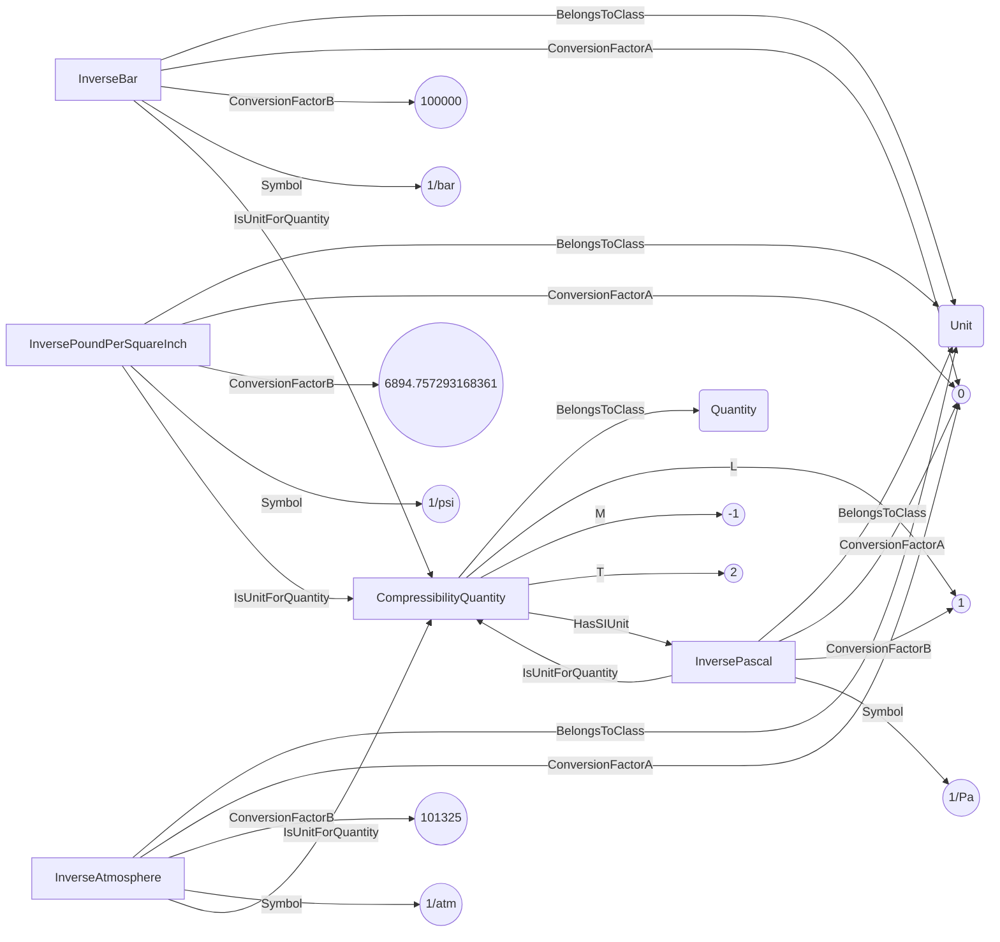
## CurvatureQuantity <!-- NOUN -->
- Display name: Curvature
- Parent class: [Quantity](./Quantities.md#Quantity)
- Specialization:
  - L = -1
  - Theta = 1
- Description: 
A curvature is the second derivative of a position compared to the curvilinear abscissa: $\frac{d^2x}{ds^2}$, where $x$ is the position and $s$ is the curvilinear abscissa.
The dimension of curvature is:
$$[{\theta}L^{-1}]$$.
The SI unit for **curvature** is: radian per metre with the associated unit label $\frac{rad}{m}$
- Definition set: QuantityTypes
- Examples:
``` dwis
Quantity:CurvatureQuantity
CurvatureQuantity.L = -1
CurvatureQuantity.Theta = 1
Unit:RadianPerMetre
RadianPerMetre.ConversionFactorA = 0
RadianPerMetre.ConversionFactorB = 1
RadianPerMetre.Symbol = "rad/m"
RadianPerMetre IsUnitForQuantity CurvatureQuantity
CurvatureQuantity HasSIUnit RadianPerMetre
Unit:DegreePer10m
DegreePer10m.ConversionFactorA = 0
DegreePer10m.ConversionFactorB = 572.9577951308232
DegreePer10m.Symbol = "°/10m"
DegreePer10m IsUnitForQuantity CurvatureQuantity
Unit:DegreePer30m
DegreePer30m.ConversionFactorA = 0
DegreePer30m.ConversionFactorB = 1718.8733853924696
DegreePer30m.Symbol = "°/30m"
DegreePer30m IsUnitForQuantity CurvatureQuantity
Unit:DegreePer30ft
DegreePer30ft.ConversionFactorA = 0
DegreePer30ft.ConversionFactorB = 523.9126078676246
DegreePer30ft.Symbol = "°/30ft"
DegreePer30ft IsUnitForQuantity CurvatureQuantity
Unit:DegreePer100ft
DegreePer100ft.ConversionFactorA = 0
DegreePer100ft.ConversionFactorB = 1746.375359558749
DegreePer100ft.Symbol = "°/100ft"
DegreePer100ft IsUnitForQuantity CurvatureQuantity
Unit:DegreePerFoot
DegreePerFoot.ConversionFactorA = 0
DegreePerFoot.ConversionFactorB = 17.46375359558749
DegreePerFoot.Symbol = "°/ft"
DegreePerFoot IsUnitForQuantity CurvatureQuantity
Unit:RadianPerFoot
RadianPerFoot.ConversionFactorA = 0
RadianPerFoot.ConversionFactorB = 0.30479999999999996
RadianPerFoot.Symbol = "rad/ft"
RadianPerFoot IsUnitForQuantity CurvatureQuantity
Unit:DegreePerMetre
DegreePerMetre.ConversionFactorA = 0
DegreePerMetre.ConversionFactorB = 57.29577951308232
DegreePerMetre.Symbol = "°/m"
DegreePerMetre IsUnitForQuantity CurvatureQuantity
Unit:DegreePerDecimeter
DegreePerDecimeter.ConversionFactorA = 0
DegreePerDecimeter.ConversionFactorB = 5.729577951308233
DegreePerDecimeter.Symbol = "°/dm"
DegreePerDecimeter IsUnitForQuantity CurvatureQuantity
Unit:DegreePerCentimeter
DegreePerCentimeter.ConversionFactorA = 0
DegreePerCentimeter.ConversionFactorB = 0.5729577951308232
DegreePerCentimeter.Symbol = "°/cm"
DegreePerCentimeter IsUnitForQuantity CurvatureQuantity
Unit:DegreePerMillimeter
DegreePerMillimeter.ConversionFactorA = 0
DegreePerMillimeter.ConversionFactorB = 0.057295779513082325
DegreePerMillimeter.Symbol = "°/mm"
DegreePerMillimeter IsUnitForQuantity CurvatureQuantity
Unit:DegreePerMicrometer
DegreePerMicrometer.ConversionFactorA = 0
DegreePerMicrometer.ConversionFactorB = 5.729577951308232E-05
DegreePerMicrometer.Symbol = "°/mm"
DegreePerMicrometer IsUnitForQuantity CurvatureQuantity
Unit:DegreePerNanometer
DegreePerNanometer.ConversionFactorA = 0
DegreePerNanometer.ConversionFactorB = 5.7295779513082324E-08
DegreePerNanometer.Symbol = "°/mm"
DegreePerNanometer IsUnitForQuantity CurvatureQuantity
Unit:DegreePerDecameter
DegreePerDecameter.ConversionFactorA = 0
DegreePerDecameter.ConversionFactorB = 572.9577951308232
DegreePerDecameter.Symbol = "°/dam"
DegreePerDecameter IsUnitForQuantity CurvatureQuantity
Unit:DegreePerHectometer
DegreePerHectometer.ConversionFactorA = 0
DegreePerHectometer.ConversionFactorB = 5729.5779513082325
DegreePerHectometer.Symbol = "°/hm"
DegreePerHectometer IsUnitForQuantity CurvatureQuantity
Unit:DegreePerKilometer
DegreePerKilometer.ConversionFactorA = 0
DegreePerKilometer.ConversionFactorB = 57295.77951308232
DegreePerKilometer.Symbol = "°/km"
DegreePerKilometer IsUnitForQuantity CurvatureQuantity
Unit:RadianPerDecimeter
RadianPerDecimeter.ConversionFactorA = 0
RadianPerDecimeter.ConversionFactorB = 0.1
RadianPerDecimeter.Symbol = "rad/dm"
RadianPerDecimeter IsUnitForQuantity CurvatureQuantity
Unit:RadianPerCentimeter
RadianPerCentimeter.ConversionFactorA = 0
RadianPerCentimeter.ConversionFactorB = 0.01
RadianPerCentimeter.Symbol = "rad/cm"
RadianPerCentimeter IsUnitForQuantity CurvatureQuantity
Unit:RadianPerMillimeter
RadianPerMillimeter.ConversionFactorA = 0
RadianPerMillimeter.ConversionFactorB = 0.001
RadianPerMillimeter.Symbol = "rad/mm"
RadianPerMillimeter IsUnitForQuantity CurvatureQuantity
Unit:RadianPerMicrometer
RadianPerMicrometer.ConversionFactorA = 0
RadianPerMicrometer.ConversionFactorB = 1E-06
RadianPerMicrometer.Symbol = "rad/mm"
RadianPerMicrometer IsUnitForQuantity CurvatureQuantity
Unit:RadianPerNanometer
RadianPerNanometer.ConversionFactorA = 0
RadianPerNanometer.ConversionFactorB = 1E-09
RadianPerNanometer.Symbol = "rad/mm"
RadianPerNanometer IsUnitForQuantity CurvatureQuantity
Unit:RadianPerDecameter
RadianPerDecameter.ConversionFactorA = 0
RadianPerDecameter.ConversionFactorB = 10
RadianPerDecameter.Symbol = "rad/dam"
RadianPerDecameter IsUnitForQuantity CurvatureQuantity
Unit:RadianPerHectometer
RadianPerHectometer.ConversionFactorA = 0
RadianPerHectometer.ConversionFactorB = 100
RadianPerHectometer.Symbol = "rad/hm"
RadianPerHectometer IsUnitForQuantity CurvatureQuantity
Unit:RadianPerKilometer
RadianPerKilometer.ConversionFactorA = 0
RadianPerKilometer.ConversionFactorB = 1000
RadianPerKilometer.Symbol = "rad/km"
RadianPerKilometer IsUnitForQuantity CurvatureQuantity
Unit:DegreePerYard
DegreePerYard.ConversionFactorA = 0
DegreePerYard.ConversionFactorB = 52.391260786762466
DegreePerYard.Symbol = "°/yd"
DegreePerYard IsUnitForQuantity CurvatureQuantity
Unit:DegreePerMile
DegreePerMile.ConversionFactorA = 0
DegreePerMile.ConversionFactorB = 92208.61898470194
DegreePerMile.Symbol = "°/mi"
DegreePerMile IsUnitForQuantity CurvatureQuantity
Unit:RadianPerYard
RadianPerYard.ConversionFactorA = 0
RadianPerYard.ConversionFactorB = 0.9143999999999999
RadianPerYard.Symbol = "rad/yd"
RadianPerYard IsUnitForQuantity CurvatureQuantity
Unit:RadianPerMile
RadianPerMile.ConversionFactorA = 0
RadianPerMile.ConversionFactorB = 1609.3439999999998
RadianPerMile.Symbol = "rad/mi"
RadianPerMile IsUnitForQuantity CurvatureQuantity
```
An example semantic graph looks like as follow:
```mermaid
graph LR
	N0000[CurvatureQuantity] -->|BelongsToClass| N0001(Quantity) 
	N0000[CurvatureQuantity] -->|L| N0002(("-1")) 
	N0000[CurvatureQuantity] -->|Theta| N0003(("1")) 
	N0004[RadianPerMetre] -->|BelongsToClass| N0005(Unit) 
	N0004[RadianPerMetre] -->|ConversionFactorA| N0006(("0")) 
	N0004[RadianPerMetre] -->|ConversionFactorB| N0003(("1")) 
	N0004[RadianPerMetre] -->|Symbol| N0007(("rad/m")) 
	N0004[RadianPerMetre] -->|IsUnitForQuantity| N0000[CurvatureQuantity] 
	N0000[CurvatureQuantity] -->|HasSIUnit| N0004[RadianPerMetre] 
	N0008[DegreePer10m] -->|BelongsToClass| N0005(Unit) 
	N0008[DegreePer10m] -->|ConversionFactorA| N0006(("0")) 
	N0008[DegreePer10m] -->|ConversionFactorB| N0009(("572.9577951308232")) 
	N0008[DegreePer10m] -->|Symbol| N0010(("°/10m")) 
	N0008[DegreePer10m] -->|IsUnitForQuantity| N0000[CurvatureQuantity] 
	N0011[DegreePer30m] -->|BelongsToClass| N0005(Unit) 
	N0011[DegreePer30m] -->|ConversionFactorA| N0006(("0")) 
	N0011[DegreePer30m] -->|ConversionFactorB| N0012(("1718.8733853924696")) 
	N0011[DegreePer30m] -->|Symbol| N0013(("°/30m")) 
	N0011[DegreePer30m] -->|IsUnitForQuantity| N0000[CurvatureQuantity] 
	N0014[DegreePer30ft] -->|BelongsToClass| N0005(Unit) 
	N0014[DegreePer30ft] -->|ConversionFactorA| N0006(("0")) 
	N0014[DegreePer30ft] -->|ConversionFactorB| N0015(("523.9126078676246")) 
	N0014[DegreePer30ft] -->|Symbol| N0016(("°/30ft")) 
	N0014[DegreePer30ft] -->|IsUnitForQuantity| N0000[CurvatureQuantity] 
	N0017[DegreePer100ft] -->|BelongsToClass| N0005(Unit) 
	N0017[DegreePer100ft] -->|ConversionFactorA| N0006(("0")) 
	N0017[DegreePer100ft] -->|ConversionFactorB| N0018(("1746.375359558749")) 
	N0017[DegreePer100ft] -->|Symbol| N0019(("°/100ft")) 
	N0017[DegreePer100ft] -->|IsUnitForQuantity| N0000[CurvatureQuantity] 
	N0020[DegreePerFoot] -->|BelongsToClass| N0005(Unit) 
	N0020[DegreePerFoot] -->|ConversionFactorA| N0006(("0")) 
	N0020[DegreePerFoot] -->|ConversionFactorB| N0021(("17.46375359558749")) 
	N0020[DegreePerFoot] -->|Symbol| N0022(("°/ft")) 
	N0020[DegreePerFoot] -->|IsUnitForQuantity| N0000[CurvatureQuantity] 
	N0023[RadianPerFoot] -->|BelongsToClass| N0005(Unit) 
	N0023[RadianPerFoot] -->|ConversionFactorA| N0006(("0")) 
	N0023[RadianPerFoot] -->|ConversionFactorB| N0024(("0.30479999999999996")) 
	N0023[RadianPerFoot] -->|Symbol| N0025(("rad/ft")) 
	N0023[RadianPerFoot] -->|IsUnitForQuantity| N0000[CurvatureQuantity] 
	N0026[DegreePerMetre] -->|BelongsToClass| N0005(Unit) 
	N0026[DegreePerMetre] -->|ConversionFactorA| N0006(("0")) 
	N0026[DegreePerMetre] -->|ConversionFactorB| N0027(("57.29577951308232")) 
	N0026[DegreePerMetre] -->|Symbol| N0028(("°/m")) 
	N0026[DegreePerMetre] -->|IsUnitForQuantity| N0000[CurvatureQuantity] 
	N0029[DegreePerDecimeter] -->|BelongsToClass| N0005(Unit) 
	N0029[DegreePerDecimeter] -->|ConversionFactorA| N0006(("0")) 
	N0029[DegreePerDecimeter] -->|ConversionFactorB| N0030(("5.729577951308233")) 
	N0029[DegreePerDecimeter] -->|Symbol| N0031(("°/dm")) 
	N0029[DegreePerDecimeter] -->|IsUnitForQuantity| N0000[CurvatureQuantity] 
	N0032[DegreePerCentimeter] -->|BelongsToClass| N0005(Unit) 
	N0032[DegreePerCentimeter] -->|ConversionFactorA| N0006(("0")) 
	N0032[DegreePerCentimeter] -->|ConversionFactorB| N0033(("0.5729577951308232")) 
	N0032[DegreePerCentimeter] -->|Symbol| N0034(("°/cm")) 
	N0032[DegreePerCentimeter] -->|IsUnitForQuantity| N0000[CurvatureQuantity] 
	N0035[DegreePerMillimeter] -->|BelongsToClass| N0005(Unit) 
	N0035[DegreePerMillimeter] -->|ConversionFactorA| N0006(("0")) 
	N0035[DegreePerMillimeter] -->|ConversionFactorB| N0036(("0.057295779513082325")) 
	N0035[DegreePerMillimeter] -->|Symbol| N0037(("°/mm")) 
	N0035[DegreePerMillimeter] -->|IsUnitForQuantity| N0000[CurvatureQuantity] 
	N0038[DegreePerMicrometer] -->|BelongsToClass| N0005(Unit) 
	N0038[DegreePerMicrometer] -->|ConversionFactorA| N0006(("0")) 
	N0038[DegreePerMicrometer] -->|ConversionFactorB| N0039(("5.729577951308232E-05")) 
	N0038[DegreePerMicrometer] -->|Symbol| N0037(("°/mm")) 
	N0038[DegreePerMicrometer] -->|IsUnitForQuantity| N0000[CurvatureQuantity] 
	N0040[DegreePerNanometer] -->|BelongsToClass| N0005(Unit) 
	N0040[DegreePerNanometer] -->|ConversionFactorA| N0006(("0")) 
	N0040[DegreePerNanometer] -->|ConversionFactorB| N0041(("5.7295779513082324E-08")) 
	N0040[DegreePerNanometer] -->|Symbol| N0037(("°/mm")) 
	N0040[DegreePerNanometer] -->|IsUnitForQuantity| N0000[CurvatureQuantity] 
	N0042[DegreePerDecameter] -->|BelongsToClass| N0005(Unit) 
	N0042[DegreePerDecameter] -->|ConversionFactorA| N0006(("0")) 
	N0042[DegreePerDecameter] -->|ConversionFactorB| N0009(("572.9577951308232")) 
	N0042[DegreePerDecameter] -->|Symbol| N0043(("°/dam")) 
	N0042[DegreePerDecameter] -->|IsUnitForQuantity| N0000[CurvatureQuantity] 
	N0044[DegreePerHectometer] -->|BelongsToClass| N0005(Unit) 
	N0044[DegreePerHectometer] -->|ConversionFactorA| N0006(("0")) 
	N0044[DegreePerHectometer] -->|ConversionFactorB| N0045(("5729.5779513082325")) 
	N0044[DegreePerHectometer] -->|Symbol| N0046(("°/hm")) 
	N0044[DegreePerHectometer] -->|IsUnitForQuantity| N0000[CurvatureQuantity] 
	N0047[DegreePerKilometer] -->|BelongsToClass| N0005(Unit) 
	N0047[DegreePerKilometer] -->|ConversionFactorA| N0006(("0")) 
	N0047[DegreePerKilometer] -->|ConversionFactorB| N0048(("57295.77951308232")) 
	N0047[DegreePerKilometer] -->|Symbol| N0049(("°/km")) 
	N0047[DegreePerKilometer] -->|IsUnitForQuantity| N0000[CurvatureQuantity] 
	N0050[RadianPerDecimeter] -->|BelongsToClass| N0005(Unit) 
	N0050[RadianPerDecimeter] -->|ConversionFactorA| N0006(("0")) 
	N0050[RadianPerDecimeter] -->|ConversionFactorB| N0051(("0.1")) 
	N0050[RadianPerDecimeter] -->|Symbol| N0052(("rad/dm")) 
	N0050[RadianPerDecimeter] -->|IsUnitForQuantity| N0000[CurvatureQuantity] 
	N0053[RadianPerCentimeter] -->|BelongsToClass| N0005(Unit) 
	N0053[RadianPerCentimeter] -->|ConversionFactorA| N0006(("0")) 
	N0053[RadianPerCentimeter] -->|ConversionFactorB| N0054(("0.01")) 
	N0053[RadianPerCentimeter] -->|Symbol| N0055(("rad/cm")) 
	N0053[RadianPerCentimeter] -->|IsUnitForQuantity| N0000[CurvatureQuantity] 
	N0056[RadianPerMillimeter] -->|BelongsToClass| N0005(Unit) 
	N0056[RadianPerMillimeter] -->|ConversionFactorA| N0006(("0")) 
	N0056[RadianPerMillimeter] -->|ConversionFactorB| N0057(("0.001")) 
	N0056[RadianPerMillimeter] -->|Symbol| N0058(("rad/mm")) 
	N0056[RadianPerMillimeter] -->|IsUnitForQuantity| N0000[CurvatureQuantity] 
	N0059[RadianPerMicrometer] -->|BelongsToClass| N0005(Unit) 
	N0059[RadianPerMicrometer] -->|ConversionFactorA| N0006(("0")) 
	N0059[RadianPerMicrometer] -->|ConversionFactorB| N0060(("1E-06")) 
	N0059[RadianPerMicrometer] -->|Symbol| N0058(("rad/mm")) 
	N0059[RadianPerMicrometer] -->|IsUnitForQuantity| N0000[CurvatureQuantity] 
	N0061[RadianPerNanometer] -->|BelongsToClass| N0005(Unit) 
	N0061[RadianPerNanometer] -->|ConversionFactorA| N0006(("0")) 
	N0061[RadianPerNanometer] -->|ConversionFactorB| N0062(("1E-09")) 
	N0061[RadianPerNanometer] -->|Symbol| N0058(("rad/mm")) 
	N0061[RadianPerNanometer] -->|IsUnitForQuantity| N0000[CurvatureQuantity] 
	N0063[RadianPerDecameter] -->|BelongsToClass| N0005(Unit) 
	N0063[RadianPerDecameter] -->|ConversionFactorA| N0006(("0")) 
	N0063[RadianPerDecameter] -->|ConversionFactorB| N0064(("10")) 
	N0063[RadianPerDecameter] -->|Symbol| N0065(("rad/dam")) 
	N0063[RadianPerDecameter] -->|IsUnitForQuantity| N0000[CurvatureQuantity] 
	N0066[RadianPerHectometer] -->|BelongsToClass| N0005(Unit) 
	N0066[RadianPerHectometer] -->|ConversionFactorA| N0006(("0")) 
	N0066[RadianPerHectometer] -->|ConversionFactorB| N0067(("100")) 
	N0066[RadianPerHectometer] -->|Symbol| N0068(("rad/hm")) 
	N0066[RadianPerHectometer] -->|IsUnitForQuantity| N0000[CurvatureQuantity] 
	N0069[RadianPerKilometer] -->|BelongsToClass| N0005(Unit) 
	N0069[RadianPerKilometer] -->|ConversionFactorA| N0006(("0")) 
	N0069[RadianPerKilometer] -->|ConversionFactorB| N0070(("1000")) 
	N0069[RadianPerKilometer] -->|Symbol| N0071(("rad/km")) 
	N0069[RadianPerKilometer] -->|IsUnitForQuantity| N0000[CurvatureQuantity] 
	N0072[DegreePerYard] -->|BelongsToClass| N0005(Unit) 
	N0072[DegreePerYard] -->|ConversionFactorA| N0006(("0")) 
	N0072[DegreePerYard] -->|ConversionFactorB| N0073(("52.391260786762466")) 
	N0072[DegreePerYard] -->|Symbol| N0074(("°/yd")) 
	N0072[DegreePerYard] -->|IsUnitForQuantity| N0000[CurvatureQuantity] 
	N0075[DegreePerMile] -->|BelongsToClass| N0005(Unit) 
	N0075[DegreePerMile] -->|ConversionFactorA| N0006(("0")) 
	N0075[DegreePerMile] -->|ConversionFactorB| N0076(("92208.61898470194")) 
	N0075[DegreePerMile] -->|Symbol| N0077(("°/mi")) 
	N0075[DegreePerMile] -->|IsUnitForQuantity| N0000[CurvatureQuantity] 
	N0078[RadianPerYard] -->|BelongsToClass| N0005(Unit) 
	N0078[RadianPerYard] -->|ConversionFactorA| N0006(("0")) 
	N0078[RadianPerYard] -->|ConversionFactorB| N0079(("0.9143999999999999")) 
	N0078[RadianPerYard] -->|Symbol| N0080(("rad/yd")) 
	N0078[RadianPerYard] -->|IsUnitForQuantity| N0000[CurvatureQuantity] 
	N0081[RadianPerMile] -->|BelongsToClass| N0005(Unit) 
	N0081[RadianPerMile] -->|ConversionFactorA| N0006(("0")) 
	N0081[RadianPerMile] -->|ConversionFactorB| N0082(("1609.3439999999998")) 
	N0081[RadianPerMile] -->|Symbol| N0083(("rad/mi")) 
	N0081[RadianPerMile] -->|IsUnitForQuantity| N0000[CurvatureQuantity] 
```
## DimensionlessQuantity <!-- NOUN -->
- Display name: Dimensionless
- Parent class: [Quantity](./Quantities.md#Quantity)
- Description: 
As its name indicates, a dimensionless quantity has no dimension:
- Definition set: QuantityTypes
- Examples:
``` dwis
Quantity:DimensionlessQuantity
Unit:Dimensionless
Dimensionless.ConversionFactorA = 0
Dimensionless.ConversionFactorB = 1
Dimensionless IsUnitForQuantity DimensionlessQuantity
DimensionlessQuantity HasSIUnit Dimensionless
```
An example semantic graph looks like as follow:
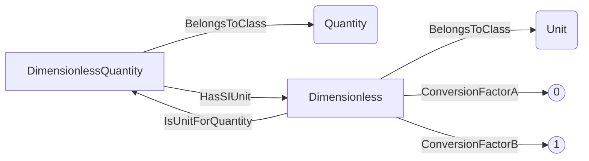
## DynamicViscosityQuantity <!-- NOUN -->
- Display name: DynamicViscosity
- Parent class: [Quantity](./Quantities.md#Quantity)
- Specialization:
  - L = -1
  - M = 1
  - T = -1
- Description: 
Dynamic viscosity is a measure of a fluid's resistance to shear or flow when a force is applied. It quantifies how thick or thin the fluid is.
The dimension of dynamic viscosity is:
$$[ML^{-1}T^{-1}]$$.
The SI unit for **dynamic viscosity** is: pascal second with the associated unit label $Pa \cdot s$
- Definition set: QuantityTypes
- Examples:
``` dwis
Quantity:DynamicViscosityQuantity
DynamicViscosityQuantity.L = -1
DynamicViscosityQuantity.M = 1
DynamicViscosityQuantity.T = -1
Unit:PascalSecond
PascalSecond.ConversionFactorA = 0
PascalSecond.ConversionFactorB = 1
PascalSecond.Symbol = "Pa•s"
PascalSecond IsUnitForQuantity DynamicViscosityQuantity
DynamicViscosityQuantity HasSIUnit PascalSecond
Unit:MillipascalSecond
MillipascalSecond.ConversionFactorA = 0
MillipascalSecond.ConversionFactorB = 1000
MillipascalSecond.Symbol = "mPa•s"
MillipascalSecond IsUnitForQuantity DynamicViscosityQuantity
Unit:MicropascalSecond
MicropascalSecond.ConversionFactorA = 0
MicropascalSecond.ConversionFactorB = 1000000
MicropascalSecond.Symbol = "µPa•s"
MicropascalSecond IsUnitForQuantity DynamicViscosityQuantity
Unit:Poise
Poise.ConversionFactorA = 0
Poise.ConversionFactorB = 10
Poise.Symbol = "P"
Poise IsUnitForQuantity DynamicViscosityQuantity
Unit:Centipoise
Centipoise.ConversionFactorA = 0
Centipoise.ConversionFactorB = 1000
Centipoise.Symbol = "cP"
Centipoise IsUnitForQuantity DynamicViscosityQuantity
Unit:Millipoise
Millipoise.ConversionFactorA = 0
Millipoise.ConversionFactorB = 10000
Millipoise.Symbol = "mP"
Millipoise IsUnitForQuantity DynamicViscosityQuantity
Unit:Micropoise
Micropoise.ConversionFactorA = 0
Micropoise.ConversionFactorB = 10000000
Micropoise.Symbol = "µP"
Micropoise IsUnitForQuantity DynamicViscosityQuantity
Unit:PoundSecondPerSquareFoot
PoundSecondPerSquareFoot.ConversionFactorA = 0
PoundSecondPerSquareFoot.ConversionFactorB = 0.020885434233150126
PoundSecondPerSquareFoot.Symbol = "lb•s/ft²"
PoundSecondPerSquareFoot IsUnitForQuantity DynamicViscosityQuantity
Unit:PoundSecondPer100SquareFoot
PoundSecondPer100SquareFoot.ConversionFactorA = 0
PoundSecondPer100SquareFoot.ConversionFactorB = 2.0885434233150124
PoundSecondPer100SquareFoot.Symbol = "lb•s/100ft²"
PoundSecondPer100SquareFoot IsUnitForQuantity DynamicViscosityQuantity
Unit:PoundSecondPerSquareInch
PoundSecondPerSquareInch.ConversionFactorA = 0
PoundSecondPerSquareInch.ConversionFactorB = 0.0001450377377302092
PoundSecondPerSquareInch.Symbol = "lb•s/in²"
PoundSecondPerSquareInch IsUnitForQuantity DynamicViscosityQuantity
Unit:DyneSecondPerSquareCentimetre
DyneSecondPerSquareCentimetre.ConversionFactorA = 0
DyneSecondPerSquareCentimetre.ConversionFactorB = 10
DyneSecondPerSquareCentimetre.Symbol = "dyne•s/cm²"
DyneSecondPerSquareCentimetre IsUnitForQuantity DynamicViscosityQuantity
```
An example semantic graph looks like as follow:
```mermaid
graph LR
	N0000[DynamicViscosityQuantity] -->|BelongsToClass| N0001(Quantity) 
	N0000[DynamicViscosityQuantity] -->|L| N0002(("-1")) 
	N0000[DynamicViscosityQuantity] -->|M| N0003(("1")) 
	N0000[DynamicViscosityQuantity] -->|T| N0002(("-1")) 
	N0004[PascalSecond] -->|BelongsToClass| N0005(Unit) 
	N0004[PascalSecond] -->|ConversionFactorA| N0006(("0")) 
	N0004[PascalSecond] -->|ConversionFactorB| N0003(("1")) 
	N0004[PascalSecond] -->|Symbol| N0007(("Pa•s")) 
	N0004[PascalSecond] -->|IsUnitForQuantity| N0000[DynamicViscosityQuantity] 
	N0000[DynamicViscosityQuantity] -->|HasSIUnit| N0004[PascalSecond] 
	N0008[MillipascalSecond] -->|BelongsToClass| N0005(Unit) 
	N0008[MillipascalSecond] -->|ConversionFactorA| N0006(("0")) 
	N0008[MillipascalSecond] -->|ConversionFactorB| N0009(("1000")) 
	N0008[MillipascalSecond] -->|Symbol| N0010(("mPa•s")) 
	N0008[MillipascalSecond] -->|IsUnitForQuantity| N0000[DynamicViscosityQuantity] 
	N0011[MicropascalSecond] -->|BelongsToClass| N0005(Unit) 
	N0011[MicropascalSecond] -->|ConversionFactorA| N0006(("0")) 
	N0011[MicropascalSecond] -->|ConversionFactorB| N0012(("1000000")) 
	N0011[MicropascalSecond] -->|Symbol| N0013(("µPa•s")) 
	N0011[MicropascalSecond] -->|IsUnitForQuantity| N0000[DynamicViscosityQuantity] 
	N0014[Poise] -->|BelongsToClass| N0005(Unit) 
	N0014[Poise] -->|ConversionFactorA| N0006(("0")) 
	N0014[Poise] -->|ConversionFactorB| N0015(("10")) 
	N0014[Poise] -->|Symbol| N0016(("P")) 
	N0014[Poise] -->|IsUnitForQuantity| N0000[DynamicViscosityQuantity] 
	N0017[Centipoise] -->|BelongsToClass| N0005(Unit) 
	N0017[Centipoise] -->|ConversionFactorA| N0006(("0")) 
	N0017[Centipoise] -->|ConversionFactorB| N0009(("1000")) 
	N0017[Centipoise] -->|Symbol| N0018(("cP")) 
	N0017[Centipoise] -->|IsUnitForQuantity| N0000[DynamicViscosityQuantity] 
	N0019[Millipoise] -->|BelongsToClass| N0005(Unit) 
	N0019[Millipoise] -->|ConversionFactorA| N0006(("0")) 
	N0019[Millipoise] -->|ConversionFactorB| N0020(("10000")) 
	N0019[Millipoise] -->|Symbol| N0021(("mP")) 
	N0019[Millipoise] -->|IsUnitForQuantity| N0000[DynamicViscosityQuantity] 
	N0022[Micropoise] -->|BelongsToClass| N0005(Unit) 
	N0022[Micropoise] -->|ConversionFactorA| N0006(("0")) 
	N0022[Micropoise] -->|ConversionFactorB| N0023(("10000000")) 
	N0022[Micropoise] -->|Symbol| N0024(("µP")) 
	N0022[Micropoise] -->|IsUnitForQuantity| N0000[DynamicViscosityQuantity] 
	N0025[PoundSecondPerSquareFoot] -->|BelongsToClass| N0005(Unit) 
	N0025[PoundSecondPerSquareFoot] -->|ConversionFactorA| N0006(("0")) 
	N0025[PoundSecondPerSquareFoot] -->|ConversionFactorB| N0026(("0.020885434233150126")) 
	N0025[PoundSecondPerSquareFoot] -->|Symbol| N0027(("lb•s/ft²")) 
	N0025[PoundSecondPerSquareFoot] -->|IsUnitForQuantity| N0000[DynamicViscosityQuantity] 
	N0028[PoundSecondPer100SquareFoot] -->|BelongsToClass| N0005(Unit) 
	N0028[PoundSecondPer100SquareFoot] -->|ConversionFactorA| N0006(("0")) 
	N0028[PoundSecondPer100SquareFoot] -->|ConversionFactorB| N0029(("2.0885434233150124")) 
	N0028[PoundSecondPer100SquareFoot] -->|Symbol| N0030(("lb•s/100ft²")) 
	N0028[PoundSecondPer100SquareFoot] -->|IsUnitForQuantity| N0000[DynamicViscosityQuantity] 
	N0031[PoundSecondPerSquareInch] -->|BelongsToClass| N0005(Unit) 
	N0031[PoundSecondPerSquareInch] -->|ConversionFactorA| N0006(("0")) 
	N0031[PoundSecondPerSquareInch] -->|ConversionFactorB| N0032(("0.0001450377377302092")) 
	N0031[PoundSecondPerSquareInch] -->|Symbol| N0033(("lb•s/in²")) 
	N0031[PoundSecondPerSquareInch] -->|IsUnitForQuantity| N0000[DynamicViscosityQuantity] 
	N0034[DyneSecondPerSquareCentimetre] -->|BelongsToClass| N0005(Unit) 
	N0034[DyneSecondPerSquareCentimetre] -->|ConversionFactorA| N0006(("0")) 
	N0034[DyneSecondPerSquareCentimetre] -->|ConversionFactorB| N0015(("10")) 
	N0034[DyneSecondPerSquareCentimetre] -->|Symbol| N0035(("dyne•s/cm²")) 
	N0034[DyneSecondPerSquareCentimetre] -->|IsUnitForQuantity| N0000[DynamicViscosityQuantity] 
```
## ElectricCapacitanceQuantity <!-- NOUN -->
- Display name: ElectricCapacitance
- Parent class: [Quantity](./Quantities.md#Quantity)
- Specialization:
  - L = -2
  - M = -1
  - T = 4
  - I = 2
- Description: 
lectric capacitance is the ability of a capacitor or a component to store electrical charge per unit voltage applied across it.
The dimension of electric capacitance is:
$$[T^{4}I^{2}M^{-1}L^{-2}]$$.
The SI unit for **electric capacitance** is: farad with the associated unit label $F$
- Definition set: QuantityTypes
- Examples:
``` dwis
Quantity:ElectricCapacitanceQuantity
ElectricCapacitanceQuantity.L = -2
ElectricCapacitanceQuantity.M = -1
ElectricCapacitanceQuantity.T = 4
ElectricCapacitanceQuantity.I = 2
Unit:Farad
Farad.ConversionFactorA = 0
Farad.ConversionFactorB = 1
Farad.Symbol = "F"
Farad IsUnitForQuantity ElectricCapacitanceQuantity
ElectricCapacitanceQuantity HasSIUnit Farad
Unit:CoulombPerVolt
CoulombPerVolt.ConversionFactorA = 0
CoulombPerVolt.ConversionFactorB = 1
CoulombPerVolt.Symbol = "C/V"
CoulombPerVolt IsUnitForQuantity ElectricCapacitanceQuantity
Unit:Millifarad
Millifarad.ConversionFactorA = 0
Millifarad.ConversionFactorB = 1000
Millifarad.Symbol = "mF"
Millifarad IsUnitForQuantity ElectricCapacitanceQuantity
Unit:Microfarad
Microfarad.ConversionFactorA = 0
Microfarad.ConversionFactorB = 1000000
Microfarad.Symbol = "μF"
Microfarad IsUnitForQuantity ElectricCapacitanceQuantity
Unit:Nanofarad
Nanofarad.ConversionFactorA = 0
Nanofarad.ConversionFactorB = 999999999.9999999
Nanofarad.Symbol = "nF"
Nanofarad IsUnitForQuantity ElectricCapacitanceQuantity
Unit:Picofarad
Picofarad.ConversionFactorA = 0
Picofarad.ConversionFactorB = 1000000000000
Picofarad.Symbol = "pF"
Picofarad IsUnitForQuantity ElectricCapacitanceQuantity
```
An example semantic graph looks like as follow:
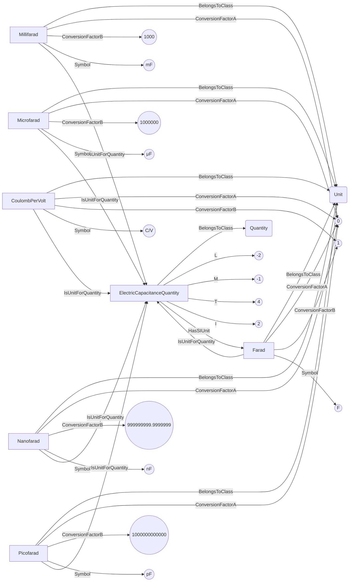
## ElectricCurrentQuantity <!-- NOUN -->
- Display name: ElectricCurrent
- Parent class: [Quantity](./Quantities.md#Quantity)
- Specialization:
  - I = 1
- Description: 
Electric current is the flow of electric charge through a conductor or circuit.
The dimension of electric current is:
$$[I]$$.
The SI unit for **electric current** is: ampere with the associated unit label $A$
- Definition set: QuantityTypes
- Examples:
``` dwis
Quantity:ElectricCurrentQuantity
ElectricCurrentQuantity.I = 1
Unit:Ampere
Ampere.ConversionFactorA = 0
Ampere.ConversionFactorB = 1
Ampere.Symbol = "A"
Ampere IsUnitForQuantity ElectricCurrentQuantity
ElectricCurrentQuantity HasSIUnit Ampere
Unit:CoulombPerSecond
CoulombPerSecond.ConversionFactorA = 0
CoulombPerSecond.ConversionFactorB = 1
CoulombPerSecond.Symbol = "C/s"
CoulombPerSecond IsUnitForQuantity ElectricCurrentQuantity
Unit:SiemensVolt
SiemensVolt.ConversionFactorA = 0
SiemensVolt.ConversionFactorB = 1
SiemensVolt.Symbol = "S•V"
SiemensVolt IsUnitForQuantity ElectricCurrentQuantity
Unit:VoltPerOhm
VoltPerOhm.ConversionFactorA = 0
VoltPerOhm.ConversionFactorB = 1
VoltPerOhm.Symbol = "V/Ω"
VoltPerOhm IsUnitForQuantity ElectricCurrentQuantity
Unit:WattPerVolt
WattPerVolt.ConversionFactorA = 0
WattPerVolt.ConversionFactorB = 1
WattPerVolt.Symbol = "W/V"
WattPerVolt IsUnitForQuantity ElectricCurrentQuantity
Unit:WeberPerHenry
WeberPerHenry.ConversionFactorA = 0
WeberPerHenry.ConversionFactorB = 1
WeberPerHenry.Symbol = "Wb/H"
WeberPerHenry IsUnitForQuantity ElectricCurrentQuantity
Unit:Deciampere
Deciampere.ConversionFactorA = 0
Deciampere.ConversionFactorB = 10
Deciampere.Symbol = "dA"
Deciampere IsUnitForQuantity ElectricCurrentQuantity
Unit:Centiampere
Centiampere.ConversionFactorA = 0
Centiampere.ConversionFactorB = 100
Centiampere.Symbol = "cA"
Centiampere IsUnitForQuantity ElectricCurrentQuantity
Unit:Milliampere
Milliampere.ConversionFactorA = 0
Milliampere.ConversionFactorB = 1000
Milliampere.Symbol = "mA"
Milliampere IsUnitForQuantity ElectricCurrentQuantity
Unit:Microampere
Microampere.ConversionFactorA = 0
Microampere.ConversionFactorB = 1000000
Microampere.Symbol = "µA"
Microampere IsUnitForQuantity ElectricCurrentQuantity
Unit:Nanoampere
Nanoampere.ConversionFactorA = 0
Nanoampere.ConversionFactorB = 999999999.9999999
Nanoampere.Symbol = "nA"
Nanoampere IsUnitForQuantity ElectricCurrentQuantity
Unit:Picoampere
Picoampere.ConversionFactorA = 0
Picoampere.ConversionFactorB = 1000000000000
Picoampere.Symbol = "pA"
Picoampere IsUnitForQuantity ElectricCurrentQuantity
Unit:Biot
Biot.ConversionFactorA = 0
Biot.ConversionFactorB = 0.1
Biot.Symbol = "Bi"
Biot IsUnitForQuantity ElectricCurrentQuantity
Unit:Abampere
Abampere.ConversionFactorA = 0
Abampere.ConversionFactorB = 0.1
Abampere.Symbol = "abA"
Abampere IsUnitForQuantity ElectricCurrentQuantity
Unit:Kiloampere
Kiloampere.ConversionFactorA = 0
Kiloampere.ConversionFactorB = 0.001
Kiloampere.Symbol = "kA"
Kiloampere IsUnitForQuantity ElectricCurrentQuantity
Unit:Megaampere
Megaampere.ConversionFactorA = 0
Megaampere.ConversionFactorB = 1E-06
Megaampere.Symbol = "MA"
Megaampere IsUnitForQuantity ElectricCurrentQuantity
Unit:Gigaampere
Gigaampere.ConversionFactorA = 0
Gigaampere.ConversionFactorB = 1E-09
Gigaampere.Symbol = "GA"
Gigaampere IsUnitForQuantity ElectricCurrentQuantity
Unit:Teraampere
Teraampere.ConversionFactorA = 0
Teraampere.ConversionFactorB = 1E-12
Teraampere.Symbol = "TA"
Teraampere IsUnitForQuantity ElectricCurrentQuantity
Unit:Statampere
Statampere.ConversionFactorA = 0
Statampere.ConversionFactorB = 2997924580
Statampere.Symbol = "stA"
Statampere IsUnitForQuantity ElectricCurrentQuantity
```
An example semantic graph looks like as follow:
```mermaid
graph LR
	N0000[ElectricCurrentQuantity] -->|BelongsToClass| N0001(Quantity) 
	N0000[ElectricCurrentQuantity] -->|I| N0002(("1")) 
	N0003[Ampere] -->|BelongsToClass| N0004(Unit) 
	N0003[Ampere] -->|ConversionFactorA| N0005(("0")) 
	N0003[Ampere] -->|ConversionFactorB| N0002(("1")) 
	N0003[Ampere] -->|Symbol| N0006(("A")) 
	N0003[Ampere] -->|IsUnitForQuantity| N0000[ElectricCurrentQuantity] 
	N0000[ElectricCurrentQuantity] -->|HasSIUnit| N0003[Ampere] 
	N0007[CoulombPerSecond] -->|BelongsToClass| N0004(Unit) 
	N0007[CoulombPerSecond] -->|ConversionFactorA| N0005(("0")) 
	N0007[CoulombPerSecond] -->|ConversionFactorB| N0002(("1")) 
	N0007[CoulombPerSecond] -->|Symbol| N0008(("C/s")) 
	N0007[CoulombPerSecond] -->|IsUnitForQuantity| N0000[ElectricCurrentQuantity] 
	N0009[SiemensVolt] -->|BelongsToClass| N0004(Unit) 
	N0009[SiemensVolt] -->|ConversionFactorA| N0005(("0")) 
	N0009[SiemensVolt] -->|ConversionFactorB| N0002(("1")) 
	N0009[SiemensVolt] -->|Symbol| N0010(("S•V")) 
	N0009[SiemensVolt] -->|IsUnitForQuantity| N0000[ElectricCurrentQuantity] 
	N0011[VoltPerOhm] -->|BelongsToClass| N0004(Unit) 
	N0011[VoltPerOhm] -->|ConversionFactorA| N0005(("0")) 
	N0011[VoltPerOhm] -->|ConversionFactorB| N0002(("1")) 
	N0011[VoltPerOhm] -->|Symbol| N0012(("V/Ω")) 
	N0011[VoltPerOhm] -->|IsUnitForQuantity| N0000[ElectricCurrentQuantity] 
	N0013[WattPerVolt] -->|BelongsToClass| N0004(Unit) 
	N0013[WattPerVolt] -->|ConversionFactorA| N0005(("0")) 
	N0013[WattPerVolt] -->|ConversionFactorB| N0002(("1")) 
	N0013[WattPerVolt] -->|Symbol| N0014(("W/V")) 
	N0013[WattPerVolt] -->|IsUnitForQuantity| N0000[ElectricCurrentQuantity] 
	N0015[WeberPerHenry] -->|BelongsToClass| N0004(Unit) 
	N0015[WeberPerHenry] -->|ConversionFactorA| N0005(("0")) 
	N0015[WeberPerHenry] -->|ConversionFactorB| N0002(("1")) 
	N0015[WeberPerHenry] -->|Symbol| N0016(("Wb/H")) 
	N0015[WeberPerHenry] -->|IsUnitForQuantity| N0000[ElectricCurrentQuantity] 
	N0017[Deciampere] -->|BelongsToClass| N0004(Unit) 
	N0017[Deciampere] -->|ConversionFactorA| N0005(("0")) 
	N0017[Deciampere] -->|ConversionFactorB| N0018(("10")) 
	N0017[Deciampere] -->|Symbol| N0019(("dA")) 
	N0017[Deciampere] -->|IsUnitForQuantity| N0000[ElectricCurrentQuantity] 
	N0020[Centiampere] -->|BelongsToClass| N0004(Unit) 
	N0020[Centiampere] -->|ConversionFactorA| N0005(("0")) 
	N0020[Centiampere] -->|ConversionFactorB| N0021(("100")) 
	N0020[Centiampere] -->|Symbol| N0022(("cA")) 
	N0020[Centiampere] -->|IsUnitForQuantity| N0000[ElectricCurrentQuantity] 
	N0023[Milliampere] -->|BelongsToClass| N0004(Unit) 
	N0023[Milliampere] -->|ConversionFactorA| N0005(("0")) 
	N0023[Milliampere] -->|ConversionFactorB| N0024(("1000")) 
	N0023[Milliampere] -->|Symbol| N0025(("mA")) 
	N0023[Milliampere] -->|IsUnitForQuantity| N0000[ElectricCurrentQuantity] 
	N0026[Microampere] -->|BelongsToClass| N0004(Unit) 
	N0026[Microampere] -->|ConversionFactorA| N0005(("0")) 
	N0026[Microampere] -->|ConversionFactorB| N0027(("1000000")) 
	N0026[Microampere] -->|Symbol| N0028(("µA")) 
	N0026[Microampere] -->|IsUnitForQuantity| N0000[ElectricCurrentQuantity] 
	N0029[Nanoampere] -->|BelongsToClass| N0004(Unit) 
	N0029[Nanoampere] -->|ConversionFactorA| N0005(("0")) 
	N0029[Nanoampere] -->|ConversionFactorB| N0030(("999999999.9999999")) 
	N0029[Nanoampere] -->|Symbol| N0031(("nA")) 
	N0029[Nanoampere] -->|IsUnitForQuantity| N0000[ElectricCurrentQuantity] 
	N0032[Picoampere] -->|BelongsToClass| N0004(Unit) 
	N0032[Picoampere] -->|ConversionFactorA| N0005(("0")) 
	N0032[Picoampere] -->|ConversionFactorB| N0033(("1000000000000")) 
	N0032[Picoampere] -->|Symbol| N0034(("pA")) 
	N0032[Picoampere] -->|IsUnitForQuantity| N0000[ElectricCurrentQuantity] 
	N0035[Biot] -->|BelongsToClass| N0004(Unit) 
	N0035[Biot] -->|ConversionFactorA| N0005(("0")) 
	N0035[Biot] -->|ConversionFactorB| N0036(("0.1")) 
	N0035[Biot] -->|Symbol| N0037(("Bi")) 
	N0035[Biot] -->|IsUnitForQuantity| N0000[ElectricCurrentQuantity] 
	N0038[Abampere] -->|BelongsToClass| N0004(Unit) 
	N0038[Abampere] -->|ConversionFactorA| N0005(("0")) 
	N0038[Abampere] -->|ConversionFactorB| N0036(("0.1")) 
	N0038[Abampere] -->|Symbol| N0039(("abA")) 
	N0038[Abampere] -->|IsUnitForQuantity| N0000[ElectricCurrentQuantity] 
	N0040[Kiloampere] -->|BelongsToClass| N0004(Unit) 
	N0040[Kiloampere] -->|ConversionFactorA| N0005(("0")) 
	N0040[Kiloampere] -->|ConversionFactorB| N0041(("0.001")) 
	N0040[Kiloampere] -->|Symbol| N0042(("kA")) 
	N0040[Kiloampere] -->|IsUnitForQuantity| N0000[ElectricCurrentQuantity] 
	N0043[Megaampere] -->|BelongsToClass| N0004(Unit) 
	N0043[Megaampere] -->|ConversionFactorA| N0005(("0")) 
	N0043[Megaampere] -->|ConversionFactorB| N0044(("1E-06")) 
	N0043[Megaampere] -->|Symbol| N0045(("MA")) 
	N0043[Megaampere] -->|IsUnitForQuantity| N0000[ElectricCurrentQuantity] 
	N0046[Gigaampere] -->|BelongsToClass| N0004(Unit) 
	N0046[Gigaampere] -->|ConversionFactorA| N0005(("0")) 
	N0046[Gigaampere] -->|ConversionFactorB| N0047(("1E-09")) 
	N0046[Gigaampere] -->|Symbol| N0048(("GA")) 
	N0046[Gigaampere] -->|IsUnitForQuantity| N0000[ElectricCurrentQuantity] 
	N0049[Teraampere] -->|BelongsToClass| N0004(Unit) 
	N0049[Teraampere] -->|ConversionFactorA| N0005(("0")) 
	N0049[Teraampere] -->|ConversionFactorB| N0050(("1E-12")) 
	N0049[Teraampere] -->|Symbol| N0051(("TA")) 
	N0049[Teraampere] -->|IsUnitForQuantity| N0000[ElectricCurrentQuantity] 
	N0052[Statampere] -->|BelongsToClass| N0004(Unit) 
	N0052[Statampere] -->|ConversionFactorA| N0005(("0")) 
	N0052[Statampere] -->|ConversionFactorB| N0053(("2997924580")) 
	N0052[Statampere] -->|Symbol| N0054(("stA")) 
	N0052[Statampere] -->|IsUnitForQuantity| N0000[ElectricCurrentQuantity] 
```
## ElectricResistivityQuantity <!-- NOUN -->
- Display name: ElectricResistivity
- Parent class: [Quantity](./Quantities.md#Quantity)
- Specialization:
  - L = 3
  - M = 1
  - T = -3
  - I = -2
- Description: 
Electric resistivity is a material's inherent property that measures how strongly it resists the flow of electric current.
The dimension of resistivity is:
$$[L^{3}MI^{-2}T^{-3}]$$.
The SI unit for **electric resistivity** is: ohm metre with the associated unit label $\Omega \cdot m$
- Definition set: QuantityTypes
- Examples:
``` dwis
Quantity:ElectricResistivityQuantity
ElectricResistivityQuantity.L = 3
ElectricResistivityQuantity.M = 1
ElectricResistivityQuantity.T = -3
ElectricResistivityQuantity.I = -2
Unit:OhmMetre
OhmMetre.ConversionFactorA = 0
OhmMetre.ConversionFactorB = 1
OhmMetre.Symbol = "Ω•m"
OhmMetre IsUnitForQuantity ElectricResistivityQuantity
ElectricResistivityQuantity HasSIUnit OhmMetre
Unit:KiloOhmMetre
KiloOhmMetre.ConversionFactorA = 0
KiloOhmMetre.ConversionFactorB = 0.001
KiloOhmMetre.Symbol = "kΩ•m"
KiloOhmMetre IsUnitForQuantity ElectricResistivityQuantity
Unit:MegaOhmMetre
MegaOhmMetre.ConversionFactorA = 0
MegaOhmMetre.ConversionFactorB = 1E-06
MegaOhmMetre.Symbol = "MΩ•m"
MegaOhmMetre IsUnitForQuantity ElectricResistivityQuantity
Unit:GigaOhmMetre
GigaOhmMetre.ConversionFactorA = 0
GigaOhmMetre.ConversionFactorB = 1E-09
GigaOhmMetre.Symbol = "GΩ•m"
GigaOhmMetre IsUnitForQuantity ElectricResistivityQuantity
```
An example semantic graph looks like as follow:
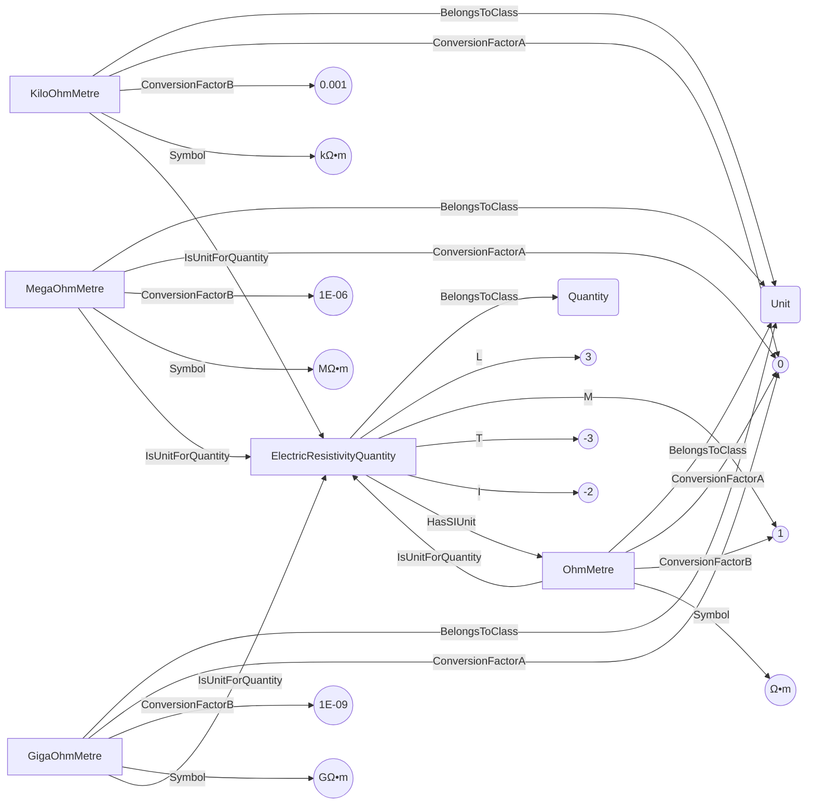
## ElongationGradientPerLengthQuantity <!-- NOUN -->
- Display name: ElongationGradientPerLength
- Parent class: [Quantity](./Quantities.md#Quantity)
- Description: 
An elongation gradient per length is the first derivative of an elongation compared to a distance: $\frac{d\epsilon}{ds}$, where $\epsilon$ is an elongation and $s$ is a distance.
It is dimensionless.
The SI unit for **elongation gradient per length** is: metre per metre with the associated unit label $\frac{m}{m}$
- Definition set: QuantityTypes
- Examples:
``` dwis
Quantity:ElongationGradientPerLengthQuantity
Unit:MetrePerMetre
MetrePerMetre.ConversionFactorA = 0
MetrePerMetre.ConversionFactorB = 1
MetrePerMetre.Symbol = "m/m"
MetrePerMetre IsUnitForQuantity ElongationGradientPerLengthQuantity
ElongationGradientPerLengthQuantity HasSIUnit MetrePerMetre
Unit:DecimetrePerMetre
DecimetrePerMetre.ConversionFactorA = 0
DecimetrePerMetre.ConversionFactorB = 10
DecimetrePerMetre.Symbol = "dm/m"
DecimetrePerMetre IsUnitForQuantity ElongationGradientPerLengthQuantity
Unit:CentimetrePerMetre
CentimetrePerMetre.ConversionFactorA = 0
CentimetrePerMetre.ConversionFactorB = 100
CentimetrePerMetre.Symbol = "cm/m"
CentimetrePerMetre IsUnitForQuantity ElongationGradientPerLengthQuantity
Unit:MillimetrePerMetre
MillimetrePerMetre.ConversionFactorA = 0
MillimetrePerMetre.ConversionFactorB = 1000
MillimetrePerMetre.Symbol = "mm/m"
MillimetrePerMetre IsUnitForQuantity ElongationGradientPerLengthQuantity
Unit:MicrometrePerMetre
MicrometrePerMetre.ConversionFactorA = 0
MicrometrePerMetre.ConversionFactorB = 1000000
MicrometrePerMetre.Symbol = "µm/m"
MicrometrePerMetre IsUnitForQuantity ElongationGradientPerLengthQuantity
Unit:MetrePerKilometre
MetrePerKilometre.ConversionFactorA = 0
MetrePerKilometre.ConversionFactorB = 1000
MetrePerKilometre.Symbol = "m/km"
MetrePerKilometre IsUnitForQuantity ElongationGradientPerLengthQuantity
Unit:DecimetrePerKilometre
DecimetrePerKilometre.ConversionFactorA = 0
DecimetrePerKilometre.ConversionFactorB = 10000
DecimetrePerKilometre.Symbol = "dm/km"
DecimetrePerKilometre IsUnitForQuantity ElongationGradientPerLengthQuantity
Unit:CentimetrePerKilometre
CentimetrePerKilometre.ConversionFactorA = 0
CentimetrePerKilometre.ConversionFactorB = 100000
CentimetrePerKilometre.Symbol = "cm/km"
CentimetrePerKilometre IsUnitForQuantity ElongationGradientPerLengthQuantity
Unit:MillimetrePerKilometre
MillimetrePerKilometre.ConversionFactorA = 0
MillimetrePerKilometre.ConversionFactorB = 1000000
MillimetrePerKilometre.Symbol = "mm/km"
MillimetrePerKilometre IsUnitForQuantity ElongationGradientPerLengthQuantity
Unit:MicrometrePerKilometre
MicrometrePerKilometre.ConversionFactorA = 0
MicrometrePerKilometre.ConversionFactorB = 1000000000
MicrometrePerKilometre.Symbol = "µm/km"
MicrometrePerKilometre IsUnitForQuantity ElongationGradientPerLengthQuantity
Unit:InchPerFoot
InchPerFoot.ConversionFactorA = 0
InchPerFoot.ConversionFactorB = 11.999999999999998
InchPerFoot.Symbol = "in/ft"
InchPerFoot IsUnitForQuantity ElongationGradientPerLengthQuantity
Unit:InchPerYard
InchPerYard.ConversionFactorA = 0
InchPerYard.ConversionFactorB = 36
InchPerYard.Symbol = "in/yd"
InchPerYard IsUnitForQuantity ElongationGradientPerLengthQuantity
Unit:InchPerMile
InchPerMile.ConversionFactorA = 0
InchPerMile.ConversionFactorB = 63359.99999999999
InchPerMile.Symbol = "in/mi"
InchPerMile IsUnitForQuantity ElongationGradientPerLengthQuantity
Unit:FootPerFoot
FootPerFoot.ConversionFactorA = 0
FootPerFoot.ConversionFactorB = 1
FootPerFoot.Symbol = "ft/ft"
FootPerFoot IsUnitForQuantity ElongationGradientPerLengthQuantity
Unit:FootPerYard
FootPerYard.ConversionFactorA = 0
FootPerYard.ConversionFactorB = 3
FootPerYard.Symbol = "ft/yd"
FootPerYard IsUnitForQuantity ElongationGradientPerLengthQuantity
Unit:FootPerMile
FootPerMile.ConversionFactorA = 0
FootPerMile.ConversionFactorB = 5280
FootPerMile.Symbol = "ft/mi"
FootPerMile IsUnitForQuantity ElongationGradientPerLengthQuantity
Unit:YardPerFoot
YardPerFoot.ConversionFactorA = 0
YardPerFoot.ConversionFactorB = 0.3333333333333333
YardPerFoot.Symbol = "yd/ft"
YardPerFoot IsUnitForQuantity ElongationGradientPerLengthQuantity
Unit:YardPerYard
YardPerYard.ConversionFactorA = 0
YardPerYard.ConversionFactorB = 1
YardPerYard.Symbol = "yd/yd"
YardPerYard IsUnitForQuantity ElongationGradientPerLengthQuantity
Unit:YardPerMile
YardPerMile.ConversionFactorA = 0
YardPerMile.ConversionFactorB = 1760
YardPerMile.Symbol = "yd/mi"
YardPerMile IsUnitForQuantity ElongationGradientPerLengthQuantity
```
An example semantic graph looks like as follow:
```mermaid
graph LR
	N0000[ElongationGradientPerLengthQuantity] -->|BelongsToClass| N0001(Quantity) 
	N0002[MetrePerMetre] -->|BelongsToClass| N0003(Unit) 
	N0002[MetrePerMetre] -->|ConversionFactorA| N0004(("0")) 
	N0002[MetrePerMetre] -->|ConversionFactorB| N0005(("1")) 
	N0002[MetrePerMetre] -->|Symbol| N0006(("m/m")) 
	N0002[MetrePerMetre] -->|IsUnitForQuantity| N0000[ElongationGradientPerLengthQuantity] 
	N0000[ElongationGradientPerLengthQuantity] -->|HasSIUnit| N0002[MetrePerMetre] 
	N0007[DecimetrePerMetre] -->|BelongsToClass| N0003(Unit) 
	N0007[DecimetrePerMetre] -->|ConversionFactorA| N0004(("0")) 
	N0007[DecimetrePerMetre] -->|ConversionFactorB| N0008(("10")) 
	N0007[DecimetrePerMetre] -->|Symbol| N0009(("dm/m")) 
	N0007[DecimetrePerMetre] -->|IsUnitForQuantity| N0000[ElongationGradientPerLengthQuantity] 
	N0010[CentimetrePerMetre] -->|BelongsToClass| N0003(Unit) 
	N0010[CentimetrePerMetre] -->|ConversionFactorA| N0004(("0")) 
	N0010[CentimetrePerMetre] -->|ConversionFactorB| N0011(("100")) 
	N0010[CentimetrePerMetre] -->|Symbol| N0012(("cm/m")) 
	N0010[CentimetrePerMetre] -->|IsUnitForQuantity| N0000[ElongationGradientPerLengthQuantity] 
	N0013[MillimetrePerMetre] -->|BelongsToClass| N0003(Unit) 
	N0013[MillimetrePerMetre] -->|ConversionFactorA| N0004(("0")) 
	N0013[MillimetrePerMetre] -->|ConversionFactorB| N0014(("1000")) 
	N0013[MillimetrePerMetre] -->|Symbol| N0015(("mm/m")) 
	N0013[MillimetrePerMetre] -->|IsUnitForQuantity| N0000[ElongationGradientPerLengthQuantity] 
	N0016[MicrometrePerMetre] -->|BelongsToClass| N0003(Unit) 
	N0016[MicrometrePerMetre] -->|ConversionFactorA| N0004(("0")) 
	N0016[MicrometrePerMetre] -->|ConversionFactorB| N0017(("1000000")) 
	N0016[MicrometrePerMetre] -->|Symbol| N0018(("µm/m")) 
	N0016[MicrometrePerMetre] -->|IsUnitForQuantity| N0000[ElongationGradientPerLengthQuantity] 
	N0019[MetrePerKilometre] -->|BelongsToClass| N0003(Unit) 
	N0019[MetrePerKilometre] -->|ConversionFactorA| N0004(("0")) 
	N0019[MetrePerKilometre] -->|ConversionFactorB| N0014(("1000")) 
	N0019[MetrePerKilometre] -->|Symbol| N0020(("m/km")) 
	N0019[MetrePerKilometre] -->|IsUnitForQuantity| N0000[ElongationGradientPerLengthQuantity] 
	N0021[DecimetrePerKilometre] -->|BelongsToClass| N0003(Unit) 
	N0021[DecimetrePerKilometre] -->|ConversionFactorA| N0004(("0")) 
	N0021[DecimetrePerKilometre] -->|ConversionFactorB| N0022(("10000")) 
	N0021[DecimetrePerKilometre] -->|Symbol| N0023(("dm/km")) 
	N0021[DecimetrePerKilometre] -->|IsUnitForQuantity| N0000[ElongationGradientPerLengthQuantity] 
	N0024[CentimetrePerKilometre] -->|BelongsToClass| N0003(Unit) 
	N0024[CentimetrePerKilometre] -->|ConversionFactorA| N0004(("0")) 
	N0024[CentimetrePerKilometre] -->|ConversionFactorB| N0025(("100000")) 
	N0024[CentimetrePerKilometre] -->|Symbol| N0026(("cm/km")) 
	N0024[CentimetrePerKilometre] -->|IsUnitForQuantity| N0000[ElongationGradientPerLengthQuantity] 
	N0027[MillimetrePerKilometre] -->|BelongsToClass| N0003(Unit) 
	N0027[MillimetrePerKilometre] -->|ConversionFactorA| N0004(("0")) 
	N0027[MillimetrePerKilometre] -->|ConversionFactorB| N0017(("1000000")) 
	N0027[MillimetrePerKilometre] -->|Symbol| N0028(("mm/km")) 
	N0027[MillimetrePerKilometre] -->|IsUnitForQuantity| N0000[ElongationGradientPerLengthQuantity] 
	N0029[MicrometrePerKilometre] -->|BelongsToClass| N0003(Unit) 
	N0029[MicrometrePerKilometre] -->|ConversionFactorA| N0004(("0")) 
	N0029[MicrometrePerKilometre] -->|ConversionFactorB| N0030(("1000000000")) 
	N0029[MicrometrePerKilometre] -->|Symbol| N0031(("µm/km")) 
	N0029[MicrometrePerKilometre] -->|IsUnitForQuantity| N0000[ElongationGradientPerLengthQuantity] 
	N0032[InchPerFoot] -->|BelongsToClass| N0003(Unit) 
	N0032[InchPerFoot] -->|ConversionFactorA| N0004(("0")) 
	N0032[InchPerFoot] -->|ConversionFactorB| N0033(("11.999999999999998")) 
	N0032[InchPerFoot] -->|Symbol| N0034(("in/ft")) 
	N0032[InchPerFoot] -->|IsUnitForQuantity| N0000[ElongationGradientPerLengthQuantity] 
	N0035[InchPerYard] -->|BelongsToClass| N0003(Unit) 
	N0035[InchPerYard] -->|ConversionFactorA| N0004(("0")) 
	N0035[InchPerYard] -->|ConversionFactorB| N0036(("36")) 
	N0035[InchPerYard] -->|Symbol| N0037(("in/yd")) 
	N0035[InchPerYard] -->|IsUnitForQuantity| N0000[ElongationGradientPerLengthQuantity] 
	N0038[InchPerMile] -->|BelongsToClass| N0003(Unit) 
	N0038[InchPerMile] -->|ConversionFactorA| N0004(("0")) 
	N0038[InchPerMile] -->|ConversionFactorB| N0039(("63359.99999999999")) 
	N0038[InchPerMile] -->|Symbol| N0040(("in/mi")) 
	N0038[InchPerMile] -->|IsUnitForQuantity| N0000[ElongationGradientPerLengthQuantity] 
	N0041[FootPerFoot] -->|BelongsToClass| N0003(Unit) 
	N0041[FootPerFoot] -->|ConversionFactorA| N0004(("0")) 
	N0041[FootPerFoot] -->|ConversionFactorB| N0005(("1")) 
	N0041[FootPerFoot] -->|Symbol| N0042(("ft/ft")) 
	N0041[FootPerFoot] -->|IsUnitForQuantity| N0000[ElongationGradientPerLengthQuantity] 
	N0043[FootPerYard] -->|BelongsToClass| N0003(Unit) 
	N0043[FootPerYard] -->|ConversionFactorA| N0004(("0")) 
	N0043[FootPerYard] -->|ConversionFactorB| N0044(("3")) 
	N0043[FootPerYard] -->|Symbol| N0045(("ft/yd")) 
	N0043[FootPerYard] -->|IsUnitForQuantity| N0000[ElongationGradientPerLengthQuantity] 
	N0046[FootPerMile] -->|BelongsToClass| N0003(Unit) 
	N0046[FootPerMile] -->|ConversionFactorA| N0004(("0")) 
	N0046[FootPerMile] -->|ConversionFactorB| N0047(("5280")) 
	N0046[FootPerMile] -->|Symbol| N0048(("ft/mi")) 
	N0046[FootPerMile] -->|IsUnitForQuantity| N0000[ElongationGradientPerLengthQuantity] 
	N0049[YardPerFoot] -->|BelongsToClass| N0003(Unit) 
	N0049[YardPerFoot] -->|ConversionFactorA| N0004(("0")) 
	N0049[YardPerFoot] -->|ConversionFactorB| N0050(("0.3333333333333333")) 
	N0049[YardPerFoot] -->|Symbol| N0051(("yd/ft")) 
	N0049[YardPerFoot] -->|IsUnitForQuantity| N0000[ElongationGradientPerLengthQuantity] 
	N0052[YardPerYard] -->|BelongsToClass| N0003(Unit) 
	N0052[YardPerYard] -->|ConversionFactorA| N0004(("0")) 
	N0052[YardPerYard] -->|ConversionFactorB| N0005(("1")) 
	N0052[YardPerYard] -->|Symbol| N0053(("yd/yd")) 
	N0052[YardPerYard] -->|IsUnitForQuantity| N0000[ElongationGradientPerLengthQuantity] 
	N0054[YardPerMile] -->|BelongsToClass| N0003(Unit) 
	N0054[YardPerMile] -->|ConversionFactorA| N0004(("0")) 
	N0054[YardPerMile] -->|ConversionFactorB| N0055(("1760")) 
	N0054[YardPerMile] -->|Symbol| N0056(("yd/mi")) 
	N0054[YardPerMile] -->|IsUnitForQuantity| N0000[ElongationGradientPerLengthQuantity] 
```
## EnergyDensityQuantity <!-- NOUN -->
- Display name: EnergyDensity
- Parent class: [Quantity](./Quantities.md#Quantity)
- Specialization:
  - L = -1
  - M = 1
  - T = -2
- Description: 
Energy density is the amount of energy stored per unit volume or mass of a substance or system.
The dimension of energy density is:
$$[ML^{-1}T^{-2}]$$.
The SI unit for **energy density** is: joule per cubic metre with the associated unit label $\frac{J}{m^{3}}$
- Definition set: QuantityTypes
- Examples:
``` dwis
Quantity:EnergyDensityQuantity
EnergyDensityQuantity.L = -1
EnergyDensityQuantity.M = 1
EnergyDensityQuantity.T = -2
Unit:JoulePerCubicMetre
JoulePerCubicMetre.ConversionFactorA = 0
JoulePerCubicMetre.ConversionFactorB = 1
JoulePerCubicMetre.Symbol = "J/m³"
JoulePerCubicMetre IsUnitForQuantity EnergyDensityQuantity
EnergyDensityQuantity HasSIUnit JoulePerCubicMetre
Unit:JoulePerLitre
JoulePerLitre.ConversionFactorA = 0
JoulePerLitre.ConversionFactorB = 0.001
JoulePerLitre.Symbol = "J/L"
JoulePerLitre IsUnitForQuantity EnergyDensityQuantity
Unit:KilojoulePerCubicMetre
KilojoulePerCubicMetre.ConversionFactorA = 0
KilojoulePerCubicMetre.ConversionFactorB = 0.001
KilojoulePerCubicMetre.Symbol = "kJ/m³"
KilojoulePerCubicMetre IsUnitForQuantity EnergyDensityQuantity
Unit:KilojoulePerLitre
KilojoulePerLitre.ConversionFactorA = 0
KilojoulePerLitre.ConversionFactorB = 1E-06
KilojoulePerLitre.Symbol = "kJ/L"
KilojoulePerLitre IsUnitForQuantity EnergyDensityQuantity
Unit:MegajoulePerCubicMetre
MegajoulePerCubicMetre.ConversionFactorA = 0
MegajoulePerCubicMetre.ConversionFactorB = 1E-06
MegajoulePerCubicMetre.Symbol = "MJ/m³"
MegajoulePerCubicMetre IsUnitForQuantity EnergyDensityQuantity
Unit:MegajoulePerLitre
MegajoulePerLitre.ConversionFactorA = 0
MegajoulePerLitre.ConversionFactorB = 1E-09
MegajoulePerLitre.Symbol = "MJ/L"
MegajoulePerLitre IsUnitForQuantity EnergyDensityQuantity
Unit:GigajoulePerCubicMetre
GigajoulePerCubicMetre.ConversionFactorA = 0
GigajoulePerCubicMetre.ConversionFactorB = 1E-09
GigajoulePerCubicMetre.Symbol = "GJ/m³"
GigajoulePerCubicMetre IsUnitForQuantity EnergyDensityQuantity
Unit:GigajoulePerLitre
GigajoulePerLitre.ConversionFactorA = 0
GigajoulePerLitre.ConversionFactorB = 1E-12
GigajoulePerLitre.Symbol = "GJ/L"
GigajoulePerLitre IsUnitForQuantity EnergyDensityQuantity
Unit:CaloriePerCubicMetre
CaloriePerCubicMetre.ConversionFactorA = 0
CaloriePerCubicMetre.ConversionFactorB = 0.2390057361376673
CaloriePerCubicMetre.Symbol = "cal/m³"
CaloriePerCubicMetre IsUnitForQuantity EnergyDensityQuantity
Unit:CaloriePerLitre
CaloriePerLitre.ConversionFactorA = 0
CaloriePerLitre.ConversionFactorB = 0.0002390057361376673
CaloriePerLitre.Symbol = "cal/L"
CaloriePerLitre IsUnitForQuantity EnergyDensityQuantity
Unit:KilocaloriePerCubicMetre
KilocaloriePerCubicMetre.ConversionFactorA = 0
KilocaloriePerCubicMetre.ConversionFactorB = 0.0002390057361376673
KilocaloriePerCubicMetre.Symbol = "Cal/m³"
KilocaloriePerCubicMetre IsUnitForQuantity EnergyDensityQuantity
Unit:KilocaloriePerLitre
KilocaloriePerLitre.ConversionFactorA = 0
KilocaloriePerLitre.ConversionFactorB = 2.390057361376673E-07
KilocaloriePerLitre.Symbol = "Cal/L"
KilocaloriePerLitre IsUnitForQuantity EnergyDensityQuantity
Unit:JoulePerCubicFoot
JoulePerCubicFoot.ConversionFactorA = 0
JoulePerCubicFoot.ConversionFactorB = 0.02831684659199999
JoulePerCubicFoot.Symbol = "J/ft³"
JoulePerCubicFoot IsUnitForQuantity EnergyDensityQuantity
Unit:KilojoulePerCubicFoot
KilojoulePerCubicFoot.ConversionFactorA = 0
KilojoulePerCubicFoot.ConversionFactorB = 2.831684659199999E-05
KilojoulePerCubicFoot.Symbol = "kJ/ft³"
KilojoulePerCubicFoot IsUnitForQuantity EnergyDensityQuantity
Unit:MegajoulePerCubicFoot
MegajoulePerCubicFoot.ConversionFactorA = 0
MegajoulePerCubicFoot.ConversionFactorB = 2.831684659199999E-08
MegajoulePerCubicFoot.Symbol = "MJ/ft³"
MegajoulePerCubicFoot IsUnitForQuantity EnergyDensityQuantity
Unit:GigajoulePerCubicFoot
GigajoulePerCubicFoot.ConversionFactorA = 0
GigajoulePerCubicFoot.ConversionFactorB = 2.831684659199999E-11
GigajoulePerCubicFoot.Symbol = "GJ/ft³"
GigajoulePerCubicFoot IsUnitForQuantity EnergyDensityQuantity
Unit:CaloriePerCubicFoot
CaloriePerCubicFoot.ConversionFactorA = 0
CaloriePerCubicFoot.ConversionFactorB = 0.006767888764818353
CaloriePerCubicFoot.Symbol = "cal/ft³"
CaloriePerCubicFoot IsUnitForQuantity EnergyDensityQuantity
Unit:KilocaloriePerCubicFoot
KilocaloriePerCubicFoot.ConversionFactorA = 0
KilocaloriePerCubicFoot.ConversionFactorB = 6.767888764818354E-06
KilocaloriePerCubicFoot.Symbol = "Cal/ft³"
KilocaloriePerCubicFoot IsUnitForQuantity EnergyDensityQuantity
Unit:JoulePerCubicInch
JoulePerCubicInch.ConversionFactorA = 0
JoulePerCubicInch.ConversionFactorB = 1.6387064E-05
JoulePerCubicInch.Symbol = "J/in³"
JoulePerCubicInch IsUnitForQuantity EnergyDensityQuantity
Unit:KilojoulePerCubicInch
KilojoulePerCubicInch.ConversionFactorA = 0
KilojoulePerCubicInch.ConversionFactorB = 1.6387064E-08
KilojoulePerCubicInch.Symbol = "kJ/in³"
KilojoulePerCubicInch IsUnitForQuantity EnergyDensityQuantity
Unit:MegajoulePerCubicInch
MegajoulePerCubicInch.ConversionFactorA = 0
MegajoulePerCubicInch.ConversionFactorB = 1.6387064E-11
MegajoulePerCubicInch.Symbol = "MJ/in³"
MegajoulePerCubicInch IsUnitForQuantity EnergyDensityQuantity
Unit:GigajoulePerCubicInch
GigajoulePerCubicInch.ConversionFactorA = 0
GigajoulePerCubicInch.ConversionFactorB = 1.6387064E-14
GigajoulePerCubicInch.Symbol = "GJ/in³"
GigajoulePerCubicInch IsUnitForQuantity EnergyDensityQuantity
Unit:CaloriePerCubicInch
CaloriePerCubicInch.ConversionFactorA = 0
CaloriePerCubicInch.ConversionFactorB = 3.916602294455067E-06
CaloriePerCubicInch.Symbol = "cal/in³"
CaloriePerCubicInch IsUnitForQuantity EnergyDensityQuantity
Unit:KilocaloriePerCubicInch
KilocaloriePerCubicInch.ConversionFactorA = 0
KilocaloriePerCubicInch.ConversionFactorB = 3.916602294455067E-09
KilocaloriePerCubicInch.Symbol = "Cal/in³"
KilocaloriePerCubicInch IsUnitForQuantity EnergyDensityQuantity
Unit:JoulePerGallonUk
JoulePerGallonUk.ConversionFactorA = 0
JoulePerGallonUk.ConversionFactorB = 0.00454609
JoulePerGallonUk.Symbol = "J/gal(UK)"
JoulePerGallonUk IsUnitForQuantity EnergyDensityQuantity
Unit:KilojoulePerGallonUk
KilojoulePerGallonUk.ConversionFactorA = 0
KilojoulePerGallonUk.ConversionFactorB = 4.54609E-06
KilojoulePerGallonUk.Symbol = "kJ/gal(UK)"
KilojoulePerGallonUk IsUnitForQuantity EnergyDensityQuantity
Unit:MegajoulePerGallonUk
MegajoulePerGallonUk.ConversionFactorA = 0
MegajoulePerGallonUk.ConversionFactorB = 4.54609E-09
MegajoulePerGallonUk.Symbol = "MJ/gal(UK)"
MegajoulePerGallonUk IsUnitForQuantity EnergyDensityQuantity
Unit:GigajoulePerGallonUk
GigajoulePerGallonUk.ConversionFactorA = 0
GigajoulePerGallonUk.ConversionFactorB = 4.54609E-12
GigajoulePerGallonUk.Symbol = "GJ/gal(UK)"
GigajoulePerGallonUk IsUnitForQuantity EnergyDensityQuantity
Unit:CaloriePerGallonUk
CaloriePerGallonUk.ConversionFactorA = 0
CaloriePerGallonUk.ConversionFactorB = 0.0010865415869980878
CaloriePerGallonUk.Symbol = "cal/gal(UK)"
CaloriePerGallonUk IsUnitForQuantity EnergyDensityQuantity
Unit:KilocaloriePerGallonUk
KilocaloriePerGallonUk.ConversionFactorA = 0
KilocaloriePerGallonUk.ConversionFactorB = 1.086541586998088E-06
KilocaloriePerGallonUk.Symbol = "Cal/gal(UK)"
KilocaloriePerGallonUk IsUnitForQuantity EnergyDensityQuantity
Unit:JoulePerGallonUs
JoulePerGallonUs.ConversionFactorA = 0
JoulePerGallonUs.ConversionFactorB = 0.0037854117839999997
JoulePerGallonUs.Symbol = "J/gal(US)"
JoulePerGallonUs IsUnitForQuantity EnergyDensityQuantity
Unit:KilojoulePerGallonUs
KilojoulePerGallonUs.ConversionFactorA = 0
KilojoulePerGallonUs.ConversionFactorB = 3.7854117839999998E-06
KilojoulePerGallonUs.Symbol = "kJ/gal(US)"
KilojoulePerGallonUs IsUnitForQuantity EnergyDensityQuantity
Unit:MegajoulePerGallonUs
MegajoulePerGallonUs.ConversionFactorA = 0
MegajoulePerGallonUs.ConversionFactorB = 3.7854117839999995E-09
MegajoulePerGallonUs.Symbol = "MJ/gal(US)"
MegajoulePerGallonUs IsUnitForQuantity EnergyDensityQuantity
Unit:GigajoulePerGallonUs
GigajoulePerGallonUs.ConversionFactorA = 0
GigajoulePerGallonUs.ConversionFactorB = 3.785411784E-12
GigajoulePerGallonUs.Symbol = "GJ/gal(US)"
GigajoulePerGallonUs IsUnitForQuantity EnergyDensityQuantity
Unit:CaloriePerGallonUs
CaloriePerGallonUs.ConversionFactorA = 0
CaloriePerGallonUs.ConversionFactorB = 0.0009047351300191204
CaloriePerGallonUs.Symbol = "cal/gal(US)"
CaloriePerGallonUs IsUnitForQuantity EnergyDensityQuantity
Unit:KilocaloriePerGallonUs
KilocaloriePerGallonUs.ConversionFactorA = 0
KilocaloriePerGallonUs.ConversionFactorB = 9.047351300191203E-07
KilocaloriePerGallonUs.Symbol = "Cal/gal(US)"
KilocaloriePerGallonUs IsUnitForQuantity EnergyDensityQuantity
Unit:BritishThermalUnitPerCubicMetre
BritishThermalUnitPerCubicMetre.ConversionFactorA = 0
BritishThermalUnitPerCubicMetre.ConversionFactorB = 0.0009484516526770049
BritishThermalUnitPerCubicMetre.Symbol = "BTU/m³"
BritishThermalUnitPerCubicMetre IsUnitForQuantity EnergyDensityQuantity
Unit:BritishThermalUnitPerLitre
BritishThermalUnitPerLitre.ConversionFactorA = 0
BritishThermalUnitPerLitre.ConversionFactorB = 9.484516526770049E-07
BritishThermalUnitPerLitre.Symbol = "BTU/L"
BritishThermalUnitPerLitre IsUnitForQuantity EnergyDensityQuantity
Unit:BritishThermalUnitPerCubicFoot
BritishThermalUnitPerCubicFoot.ConversionFactorA = 0
BritishThermalUnitPerCubicFoot.ConversionFactorB = 2.6857159948783606E-05
BritishThermalUnitPerCubicFoot.Symbol = "BTU/ft³"
BritishThermalUnitPerCubicFoot IsUnitForQuantity EnergyDensityQuantity
Unit:BritishThermalUnitPerCubicInch
BritishThermalUnitPerCubicInch.ConversionFactorA = 0
BritishThermalUnitPerCubicInch.ConversionFactorB = 1.554233793332385E-08
BritishThermalUnitPerCubicInch.Symbol = "BTU/in³"
BritishThermalUnitPerCubicInch IsUnitForQuantity EnergyDensityQuantity
Unit:BritishThermalUnitPerGallonUk
BritishThermalUnitPerGallonUk.ConversionFactorA = 0
BritishThermalUnitPerGallonUk.ConversionFactorB = 4.311746573718405E-06
BritishThermalUnitPerGallonUk.Symbol = "BTU/gal(UK)"
BritishThermalUnitPerGallonUk IsUnitForQuantity EnergyDensityQuantity
Unit:BritishThermalUnitPerGallonUs
BritishThermalUnitPerGallonUs.ConversionFactorA = 0
BritishThermalUnitPerGallonUs.ConversionFactorB = 3.5902800625978092E-06
BritishThermalUnitPerGallonUs.Symbol = "BTU/gal(US)"
BritishThermalUnitPerGallonUs IsUnitForQuantity EnergyDensityQuantity
Unit:KiloBritishThermalUnitPerCubicMetre
KiloBritishThermalUnitPerCubicMetre.ConversionFactorA = 0
KiloBritishThermalUnitPerCubicMetre.ConversionFactorB = 9.484516526770048E-07
KiloBritishThermalUnitPerCubicMetre.Symbol = "kBTU/m³"
KiloBritishThermalUnitPerCubicMetre IsUnitForQuantity EnergyDensityQuantity
Unit:KiloBritishThermalUnitPerLitre
KiloBritishThermalUnitPerLitre.ConversionFactorA = 0
KiloBritishThermalUnitPerLitre.ConversionFactorB = 9.48451652677005E-10
KiloBritishThermalUnitPerLitre.Symbol = "kBTU/L"
KiloBritishThermalUnitPerLitre IsUnitForQuantity EnergyDensityQuantity
Unit:KiloBritishThermalUnitPerCubicFoot
KiloBritishThermalUnitPerCubicFoot.ConversionFactorA = 0
KiloBritishThermalUnitPerCubicFoot.ConversionFactorB = 2.6857159948783602E-08
KiloBritishThermalUnitPerCubicFoot.Symbol = "kBTU/ft³"
KiloBritishThermalUnitPerCubicFoot IsUnitForQuantity EnergyDensityQuantity
Unit:KiloBritishThermalUnitPerCubicInch
KiloBritishThermalUnitPerCubicInch.ConversionFactorA = 0
KiloBritishThermalUnitPerCubicInch.ConversionFactorB = 1.5542337933323848E-11
KiloBritishThermalUnitPerCubicInch.Symbol = "kBTU/in³"
KiloBritishThermalUnitPerCubicInch IsUnitForQuantity EnergyDensityQuantity
Unit:KiloBritishThermalUnitPerGallonUk
KiloBritishThermalUnitPerGallonUk.ConversionFactorA = 0
KiloBritishThermalUnitPerGallonUk.ConversionFactorB = 4.311746573718405E-09
KiloBritishThermalUnitPerGallonUk.Symbol = "kBTU/gal(UK)"
KiloBritishThermalUnitPerGallonUk IsUnitForQuantity EnergyDensityQuantity
Unit:KiloBritishThermalUnitPerGallonUs
KiloBritishThermalUnitPerGallonUs.ConversionFactorA = 0
KiloBritishThermalUnitPerGallonUs.ConversionFactorB = 3.5902800625978087E-09
KiloBritishThermalUnitPerGallonUs.Symbol = "kBTU/gal(US)"
KiloBritishThermalUnitPerGallonUs IsUnitForQuantity EnergyDensityQuantity
```
An example semantic graph looks like as follow:
```mermaid
graph LR
	N0000[EnergyDensityQuantity] -->|BelongsToClass| N0001(Quantity) 
	N0000[EnergyDensityQuantity] -->|L| N0002(("-1")) 
	N0000[EnergyDensityQuantity] -->|M| N0003(("1")) 
	N0000[EnergyDensityQuantity] -->|T| N0004(("-2")) 
	N0005[JoulePerCubicMetre] -->|BelongsToClass| N0006(Unit) 
	N0005[JoulePerCubicMetre] -->|ConversionFactorA| N0007(("0")) 
	N0005[JoulePerCubicMetre] -->|ConversionFactorB| N0003(("1")) 
	N0005[JoulePerCubicMetre] -->|Symbol| N0008(("J/m³")) 
	N0005[JoulePerCubicMetre] -->|IsUnitForQuantity| N0000[EnergyDensityQuantity] 
	N0000[EnergyDensityQuantity] -->|HasSIUnit| N0005[JoulePerCubicMetre] 
	N0009[JoulePerLitre] -->|BelongsToClass| N0006(Unit) 
	N0009[JoulePerLitre] -->|ConversionFactorA| N0007(("0")) 
	N0009[JoulePerLitre] -->|ConversionFactorB| N0010(("0.001")) 
	N0009[JoulePerLitre] -->|Symbol| N0011(("J/L")) 
	N0009[JoulePerLitre] -->|IsUnitForQuantity| N0000[EnergyDensityQuantity] 
	N0012[KilojoulePerCubicMetre] -->|BelongsToClass| N0006(Unit) 
	N0012[KilojoulePerCubicMetre] -->|ConversionFactorA| N0007(("0")) 
	N0012[KilojoulePerCubicMetre] -->|ConversionFactorB| N0010(("0.001")) 
	N0012[KilojoulePerCubicMetre] -->|Symbol| N0013(("kJ/m³")) 
	N0012[KilojoulePerCubicMetre] -->|IsUnitForQuantity| N0000[EnergyDensityQuantity] 
	N0014[KilojoulePerLitre] -->|BelongsToClass| N0006(Unit) 
	N0014[KilojoulePerLitre] -->|ConversionFactorA| N0007(("0")) 
	N0014[KilojoulePerLitre] -->|ConversionFactorB| N0015(("1E-06")) 
	N0014[KilojoulePerLitre] -->|Symbol| N0016(("kJ/L")) 
	N0014[KilojoulePerLitre] -->|IsUnitForQuantity| N0000[EnergyDensityQuantity] 
	N0017[MegajoulePerCubicMetre] -->|BelongsToClass| N0006(Unit) 
	N0017[MegajoulePerCubicMetre] -->|ConversionFactorA| N0007(("0")) 
	N0017[MegajoulePerCubicMetre] -->|ConversionFactorB| N0015(("1E-06")) 
	N0017[MegajoulePerCubicMetre] -->|Symbol| N0018(("MJ/m³")) 
	N0017[MegajoulePerCubicMetre] -->|IsUnitForQuantity| N0000[EnergyDensityQuantity] 
	N0019[MegajoulePerLitre] -->|BelongsToClass| N0006(Unit) 
	N0019[MegajoulePerLitre] -->|ConversionFactorA| N0007(("0")) 
	N0019[MegajoulePerLitre] -->|ConversionFactorB| N0020(("1E-09")) 
	N0019[MegajoulePerLitre] -->|Symbol| N0021(("MJ/L")) 
	N0019[MegajoulePerLitre] -->|IsUnitForQuantity| N0000[EnergyDensityQuantity] 
	N0022[GigajoulePerCubicMetre] -->|BelongsToClass| N0006(Unit) 
	N0022[GigajoulePerCubicMetre] -->|ConversionFactorA| N0007(("0")) 
	N0022[GigajoulePerCubicMetre] -->|ConversionFactorB| N0020(("1E-09")) 
	N0022[GigajoulePerCubicMetre] -->|Symbol| N0023(("GJ/m³")) 
	N0022[GigajoulePerCubicMetre] -->|IsUnitForQuantity| N0000[EnergyDensityQuantity] 
	N0024[GigajoulePerLitre] -->|BelongsToClass| N0006(Unit) 
	N0024[GigajoulePerLitre] -->|ConversionFactorA| N0007(("0")) 
	N0024[GigajoulePerLitre] -->|ConversionFactorB| N0025(("1E-12")) 
	N0024[GigajoulePerLitre] -->|Symbol| N0026(("GJ/L")) 
	N0024[GigajoulePerLitre] -->|IsUnitForQuantity| N0000[EnergyDensityQuantity] 
	N0027[CaloriePerCubicMetre] -->|BelongsToClass| N0006(Unit) 
	N0027[CaloriePerCubicMetre] -->|ConversionFactorA| N0007(("0")) 
	N0027[CaloriePerCubicMetre] -->|ConversionFactorB| N0028(("0.2390057361376673")) 
	N0027[CaloriePerCubicMetre] -->|Symbol| N0029(("cal/m³")) 
	N0027[CaloriePerCubicMetre] -->|IsUnitForQuantity| N0000[EnergyDensityQuantity] 
	N0030[CaloriePerLitre] -->|BelongsToClass| N0006(Unit) 
	N0030[CaloriePerLitre] -->|ConversionFactorA| N0007(("0")) 
	N0030[CaloriePerLitre] -->|ConversionFactorB| N0031(("0.0002390057361376673")) 
	N0030[CaloriePerLitre] -->|Symbol| N0032(("cal/L")) 
	N0030[CaloriePerLitre] -->|IsUnitForQuantity| N0000[EnergyDensityQuantity] 
	N0033[KilocaloriePerCubicMetre] -->|BelongsToClass| N0006(Unit) 
	N0033[KilocaloriePerCubicMetre] -->|ConversionFactorA| N0007(("0")) 
	N0033[KilocaloriePerCubicMetre] -->|ConversionFactorB| N0031(("0.0002390057361376673")) 
	N0033[KilocaloriePerCubicMetre] -->|Symbol| N0034(("Cal/m³")) 
	N0033[KilocaloriePerCubicMetre] -->|IsUnitForQuantity| N0000[EnergyDensityQuantity] 
	N0035[KilocaloriePerLitre] -->|BelongsToClass| N0006(Unit) 
	N0035[KilocaloriePerLitre] -->|ConversionFactorA| N0007(("0")) 
	N0035[KilocaloriePerLitre] -->|ConversionFactorB| N0036(("2.390057361376673E-07")) 
	N0035[KilocaloriePerLitre] -->|Symbol| N0037(("Cal/L")) 
	N0035[KilocaloriePerLitre] -->|IsUnitForQuantity| N0000[EnergyDensityQuantity] 
	N0038[JoulePerCubicFoot] -->|BelongsToClass| N0006(Unit) 
	N0038[JoulePerCubicFoot] -->|ConversionFactorA| N0007(("0")) 
	N0038[JoulePerCubicFoot] -->|ConversionFactorB| N0039(("0.02831684659199999")) 
	N0038[JoulePerCubicFoot] -->|Symbol| N0040(("J/ft³")) 
	N0038[JoulePerCubicFoot] -->|IsUnitForQuantity| N0000[EnergyDensityQuantity] 
	N0041[KilojoulePerCubicFoot] -->|BelongsToClass| N0006(Unit) 
	N0041[KilojoulePerCubicFoot] -->|ConversionFactorA| N0007(("0")) 
	N0041[KilojoulePerCubicFoot] -->|ConversionFactorB| N0042(("2.831684659199999E-05")) 
	N0041[KilojoulePerCubicFoot] -->|Symbol| N0043(("kJ/ft³")) 
	N0041[KilojoulePerCubicFoot] -->|IsUnitForQuantity| N0000[EnergyDensityQuantity] 
	N0044[MegajoulePerCubicFoot] -->|BelongsToClass| N0006(Unit) 
	N0044[MegajoulePerCubicFoot] -->|ConversionFactorA| N0007(("0")) 
	N0044[MegajoulePerCubicFoot] -->|ConversionFactorB| N0045(("2.831684659199999E-08")) 
	N0044[MegajoulePerCubicFoot] -->|Symbol| N0046(("MJ/ft³")) 
	N0044[MegajoulePerCubicFoot] -->|IsUnitForQuantity| N0000[EnergyDensityQuantity] 
	N0047[GigajoulePerCubicFoot] -->|BelongsToClass| N0006(Unit) 
	N0047[GigajoulePerCubicFoot] -->|ConversionFactorA| N0007(("0")) 
	N0047[GigajoulePerCubicFoot] -->|ConversionFactorB| N0048(("2.831684659199999E-11")) 
	N0047[GigajoulePerCubicFoot] -->|Symbol| N0049(("GJ/ft³")) 
	N0047[GigajoulePerCubicFoot] -->|IsUnitForQuantity| N0000[EnergyDensityQuantity] 
	N0050[CaloriePerCubicFoot] -->|BelongsToClass| N0006(Unit) 
	N0050[CaloriePerCubicFoot] -->|ConversionFactorA| N0007(("0")) 
	N0050[CaloriePerCubicFoot] -->|ConversionFactorB| N0051(("0.006767888764818353")) 
	N0050[CaloriePerCubicFoot] -->|Symbol| N0052(("cal/ft³")) 
	N0050[CaloriePerCubicFoot] -->|IsUnitForQuantity| N0000[EnergyDensityQuantity] 
	N0053[KilocaloriePerCubicFoot] -->|BelongsToClass| N0006(Unit) 
	N0053[KilocaloriePerCubicFoot] -->|ConversionFactorA| N0007(("0")) 
	N0053[KilocaloriePerCubicFoot] -->|ConversionFactorB| N0054(("6.767888764818354E-06")) 
	N0053[KilocaloriePerCubicFoot] -->|Symbol| N0055(("Cal/ft³")) 
	N0053[KilocaloriePerCubicFoot] -->|IsUnitForQuantity| N0000[EnergyDensityQuantity] 
	N0056[JoulePerCubicInch] -->|BelongsToClass| N0006(Unit) 
	N0056[JoulePerCubicInch] -->|ConversionFactorA| N0007(("0")) 
	N0056[JoulePerCubicInch] -->|ConversionFactorB| N0057(("1.6387064E-05")) 
	N0056[JoulePerCubicInch] -->|Symbol| N0058(("J/in³")) 
	N0056[JoulePerCubicInch] -->|IsUnitForQuantity| N0000[EnergyDensityQuantity] 
	N0059[KilojoulePerCubicInch] -->|BelongsToClass| N0006(Unit) 
	N0059[KilojoulePerCubicInch] -->|ConversionFactorA| N0007(("0")) 
	N0059[KilojoulePerCubicInch] -->|ConversionFactorB| N0060(("1.6387064E-08")) 
	N0059[KilojoulePerCubicInch] -->|Symbol| N0061(("kJ/in³")) 
	N0059[KilojoulePerCubicInch] -->|IsUnitForQuantity| N0000[EnergyDensityQuantity] 
	N0062[MegajoulePerCubicInch] -->|BelongsToClass| N0006(Unit) 
	N0062[MegajoulePerCubicInch] -->|ConversionFactorA| N0007(("0")) 
	N0062[MegajoulePerCubicInch] -->|ConversionFactorB| N0063(("1.6387064E-11")) 
	N0062[MegajoulePerCubicInch] -->|Symbol| N0064(("MJ/in³")) 
	N0062[MegajoulePerCubicInch] -->|IsUnitForQuantity| N0000[EnergyDensityQuantity] 
	N0065[GigajoulePerCubicInch] -->|BelongsToClass| N0006(Unit) 
	N0065[GigajoulePerCubicInch] -->|ConversionFactorA| N0007(("0")) 
	N0065[GigajoulePerCubicInch] -->|ConversionFactorB| N0066(("1.6387064E-14")) 
	N0065[GigajoulePerCubicInch] -->|Symbol| N0067(("GJ/in³")) 
	N0065[GigajoulePerCubicInch] -->|IsUnitForQuantity| N0000[EnergyDensityQuantity] 
	N0068[CaloriePerCubicInch] -->|BelongsToClass| N0006(Unit) 
	N0068[CaloriePerCubicInch] -->|ConversionFactorA| N0007(("0")) 
	N0068[CaloriePerCubicInch] -->|ConversionFactorB| N0069(("3.916602294455067E-06")) 
	N0068[CaloriePerCubicInch] -->|Symbol| N0070(("cal/in³")) 
	N0068[CaloriePerCubicInch] -->|IsUnitForQuantity| N0000[EnergyDensityQuantity] 
	N0071[KilocaloriePerCubicInch] -->|BelongsToClass| N0006(Unit) 
	N0071[KilocaloriePerCubicInch] -->|ConversionFactorA| N0007(("0")) 
	N0071[KilocaloriePerCubicInch] -->|ConversionFactorB| N0072(("3.916602294455067E-09")) 
	N0071[KilocaloriePerCubicInch] -->|Symbol| N0073(("Cal/in³")) 
	N0071[KilocaloriePerCubicInch] -->|IsUnitForQuantity| N0000[EnergyDensityQuantity] 
	N0074[JoulePerGallonUk] -->|BelongsToClass| N0006(Unit) 
	N0074[JoulePerGallonUk] -->|ConversionFactorA| N0007(("0")) 
	N0074[JoulePerGallonUk] -->|ConversionFactorB| N0075(("0.00454609")) 
	N0074[JoulePerGallonUk] -->|Symbol| N0076(("J/gal(UK)")) 
	N0074[JoulePerGallonUk] -->|IsUnitForQuantity| N0000[EnergyDensityQuantity] 
	N0077[KilojoulePerGallonUk] -->|BelongsToClass| N0006(Unit) 
	N0077[KilojoulePerGallonUk] -->|ConversionFactorA| N0007(("0")) 
	N0077[KilojoulePerGallonUk] -->|ConversionFactorB| N0078(("4.54609E-06")) 
	N0077[KilojoulePerGallonUk] -->|Symbol| N0079(("kJ/gal(UK)")) 
	N0077[KilojoulePerGallonUk] -->|IsUnitForQuantity| N0000[EnergyDensityQuantity] 
	N0080[MegajoulePerGallonUk] -->|BelongsToClass| N0006(Unit) 
	N0080[MegajoulePerGallonUk] -->|ConversionFactorA| N0007(("0")) 
	N0080[MegajoulePerGallonUk] -->|ConversionFactorB| N0081(("4.54609E-09")) 
	N0080[MegajoulePerGallonUk] -->|Symbol| N0082(("MJ/gal(UK)")) 
	N0080[MegajoulePerGallonUk] -->|IsUnitForQuantity| N0000[EnergyDensityQuantity] 
	N0083[GigajoulePerGallonUk] -->|BelongsToClass| N0006(Unit) 
	N0083[GigajoulePerGallonUk] -->|ConversionFactorA| N0007(("0")) 
	N0083[GigajoulePerGallonUk] -->|ConversionFactorB| N0084(("4.54609E-12")) 
	N0083[GigajoulePerGallonUk] -->|Symbol| N0085(("GJ/gal(UK)")) 
	N0083[GigajoulePerGallonUk] -->|IsUnitForQuantity| N0000[EnergyDensityQuantity] 
	N0086[CaloriePerGallonUk] -->|BelongsToClass| N0006(Unit) 
	N0086[CaloriePerGallonUk] -->|ConversionFactorA| N0007(("0")) 
	N0086[CaloriePerGallonUk] -->|ConversionFactorB| N0087(("0.0010865415869980878")) 
	N0086[CaloriePerGallonUk] -->|Symbol| N0088(("cal/gal(UK)")) 
	N0086[CaloriePerGallonUk] -->|IsUnitForQuantity| N0000[EnergyDensityQuantity] 
	N0089[KilocaloriePerGallonUk] -->|BelongsToClass| N0006(Unit) 
	N0089[KilocaloriePerGallonUk] -->|ConversionFactorA| N0007(("0")) 
	N0089[KilocaloriePerGallonUk] -->|ConversionFactorB| N0090(("1.086541586998088E-06")) 
	N0089[KilocaloriePerGallonUk] -->|Symbol| N0091(("Cal/gal(UK)")) 
	N0089[KilocaloriePerGallonUk] -->|IsUnitForQuantity| N0000[EnergyDensityQuantity] 
	N0092[JoulePerGallonUs] -->|BelongsToClass| N0006(Unit) 
	N0092[JoulePerGallonUs] -->|ConversionFactorA| N0007(("0")) 
	N0092[JoulePerGallonUs] -->|ConversionFactorB| N0093(("0.0037854117839999997")) 
	N0092[JoulePerGallonUs] -->|Symbol| N0094(("J/gal(US)")) 
	N0092[JoulePerGallonUs] -->|IsUnitForQuantity| N0000[EnergyDensityQuantity] 
	N0095[KilojoulePerGallonUs] -->|BelongsToClass| N0006(Unit) 
	N0095[KilojoulePerGallonUs] -->|ConversionFactorA| N0007(("0")) 
	N0095[KilojoulePerGallonUs] -->|ConversionFactorB| N0096(("3.7854117839999998E-06")) 
	N0095[KilojoulePerGallonUs] -->|Symbol| N0097(("kJ/gal(US)")) 
	N0095[KilojoulePerGallonUs] -->|IsUnitForQuantity| N0000[EnergyDensityQuantity] 
	N0098[MegajoulePerGallonUs] -->|BelongsToClass| N0006(Unit) 
	N0098[MegajoulePerGallonUs] -->|ConversionFactorA| N0007(("0")) 
	N0098[MegajoulePerGallonUs] -->|ConversionFactorB| N0099(("3.7854117839999995E-09")) 
	N0098[MegajoulePerGallonUs] -->|Symbol| N0100(("MJ/gal(US)")) 
	N0098[MegajoulePerGallonUs] -->|IsUnitForQuantity| N0000[EnergyDensityQuantity] 
	N0101[GigajoulePerGallonUs] -->|BelongsToClass| N0006(Unit) 
	N0101[GigajoulePerGallonUs] -->|ConversionFactorA| N0007(("0")) 
	N0101[GigajoulePerGallonUs] -->|ConversionFactorB| N0102(("3.785411784E-12")) 
	N0101[GigajoulePerGallonUs] -->|Symbol| N0103(("GJ/gal(US)")) 
	N0101[GigajoulePerGallonUs] -->|IsUnitForQuantity| N0000[EnergyDensityQuantity] 
	N0104[CaloriePerGallonUs] -->|BelongsToClass| N0006(Unit) 
	N0104[CaloriePerGallonUs] -->|ConversionFactorA| N0007(("0")) 
	N0104[CaloriePerGallonUs] -->|ConversionFactorB| N0105(("0.0009047351300191204")) 
	N0104[CaloriePerGallonUs] -->|Symbol| N0106(("cal/gal(US)")) 
	N0104[CaloriePerGallonUs] -->|IsUnitForQuantity| N0000[EnergyDensityQuantity] 
	N0107[KilocaloriePerGallonUs] -->|BelongsToClass| N0006(Unit) 
	N0107[KilocaloriePerGallonUs] -->|ConversionFactorA| N0007(("0")) 
	N0107[KilocaloriePerGallonUs] -->|ConversionFactorB| N0108(("9.047351300191203E-07")) 
	N0107[KilocaloriePerGallonUs] -->|Symbol| N0109(("Cal/gal(US)")) 
	N0107[KilocaloriePerGallonUs] -->|IsUnitForQuantity| N0000[EnergyDensityQuantity] 
	N0110[BritishThermalUnitPerCubicMetre] -->|BelongsToClass| N0006(Unit) 
	N0110[BritishThermalUnitPerCubicMetre] -->|ConversionFactorA| N0007(("0")) 
	N0110[BritishThermalUnitPerCubicMetre] -->|ConversionFactorB| N0111(("0.0009484516526770049")) 
	N0110[BritishThermalUnitPerCubicMetre] -->|Symbol| N0112(("BTU/m³")) 
	N0110[BritishThermalUnitPerCubicMetre] -->|IsUnitForQuantity| N0000[EnergyDensityQuantity] 
	N0113[BritishThermalUnitPerLitre] -->|BelongsToClass| N0006(Unit) 
	N0113[BritishThermalUnitPerLitre] -->|ConversionFactorA| N0007(("0")) 
	N0113[BritishThermalUnitPerLitre] -->|ConversionFactorB| N0114(("9.484516526770049E-07")) 
	N0113[BritishThermalUnitPerLitre] -->|Symbol| N0115(("BTU/L")) 
	N0113[BritishThermalUnitPerLitre] -->|IsUnitForQuantity| N0000[EnergyDensityQuantity] 
	N0116[BritishThermalUnitPerCubicFoot] -->|BelongsToClass| N0006(Unit) 
	N0116[BritishThermalUnitPerCubicFoot] -->|ConversionFactorA| N0007(("0")) 
	N0116[BritishThermalUnitPerCubicFoot] -->|ConversionFactorB| N0117(("2.6857159948783606E-05")) 
	N0116[BritishThermalUnitPerCubicFoot] -->|Symbol| N0118(("BTU/ft³")) 
	N0116[BritishThermalUnitPerCubicFoot] -->|IsUnitForQuantity| N0000[EnergyDensityQuantity] 
	N0119[BritishThermalUnitPerCubicInch] -->|BelongsToClass| N0006(Unit) 
	N0119[BritishThermalUnitPerCubicInch] -->|ConversionFactorA| N0007(("0")) 
	N0119[BritishThermalUnitPerCubicInch] -->|ConversionFactorB| N0120(("1.554233793332385E-08")) 
	N0119[BritishThermalUnitPerCubicInch] -->|Symbol| N0121(("BTU/in³")) 
	N0119[BritishThermalUnitPerCubicInch] -->|IsUnitForQuantity| N0000[EnergyDensityQuantity] 
	N0122[BritishThermalUnitPerGallonUk] -->|BelongsToClass| N0006(Unit) 
	N0122[BritishThermalUnitPerGallonUk] -->|ConversionFactorA| N0007(("0")) 
	N0122[BritishThermalUnitPerGallonUk] -->|ConversionFactorB| N0123(("4.311746573718405E-06")) 
	N0122[BritishThermalUnitPerGallonUk] -->|Symbol| N0124(("BTU/gal(UK)")) 
	N0122[BritishThermalUnitPerGallonUk] -->|IsUnitForQuantity| N0000[EnergyDensityQuantity] 
	N0125[BritishThermalUnitPerGallonUs] -->|BelongsToClass| N0006(Unit) 
	N0125[BritishThermalUnitPerGallonUs] -->|ConversionFactorA| N0007(("0")) 
	N0125[BritishThermalUnitPerGallonUs] -->|ConversionFactorB| N0126(("3.5902800625978092E-06")) 
	N0125[BritishThermalUnitPerGallonUs] -->|Symbol| N0127(("BTU/gal(US)")) 
	N0125[BritishThermalUnitPerGallonUs] -->|IsUnitForQuantity| N0000[EnergyDensityQuantity] 
	N0128[KiloBritishThermalUnitPerCubicMetre] -->|BelongsToClass| N0006(Unit) 
	N0128[KiloBritishThermalUnitPerCubicMetre] -->|ConversionFactorA| N0007(("0")) 
	N0128[KiloBritishThermalUnitPerCubicMetre] -->|ConversionFactorB| N0129(("9.484516526770048E-07")) 
	N0128[KiloBritishThermalUnitPerCubicMetre] -->|Symbol| N0130(("kBTU/m³")) 
	N0128[KiloBritishThermalUnitPerCubicMetre] -->|IsUnitForQuantity| N0000[EnergyDensityQuantity] 
	N0131[KiloBritishThermalUnitPerLitre] -->|BelongsToClass| N0006(Unit) 
	N0131[KiloBritishThermalUnitPerLitre] -->|ConversionFactorA| N0007(("0")) 
	N0131[KiloBritishThermalUnitPerLitre] -->|ConversionFactorB| N0132(("9.48451652677005E-10")) 
	N0131[KiloBritishThermalUnitPerLitre] -->|Symbol| N0133(("kBTU/L")) 
	N0131[KiloBritishThermalUnitPerLitre] -->|IsUnitForQuantity| N0000[EnergyDensityQuantity] 
	N0134[KiloBritishThermalUnitPerCubicFoot] -->|BelongsToClass| N0006(Unit) 
	N0134[KiloBritishThermalUnitPerCubicFoot] -->|ConversionFactorA| N0007(("0")) 
	N0134[KiloBritishThermalUnitPerCubicFoot] -->|ConversionFactorB| N0135(("2.6857159948783602E-08")) 
	N0134[KiloBritishThermalUnitPerCubicFoot] -->|Symbol| N0136(("kBTU/ft³")) 
	N0134[KiloBritishThermalUnitPerCubicFoot] -->|IsUnitForQuantity| N0000[EnergyDensityQuantity] 
	N0137[KiloBritishThermalUnitPerCubicInch] -->|BelongsToClass| N0006(Unit) 
	N0137[KiloBritishThermalUnitPerCubicInch] -->|ConversionFactorA| N0007(("0")) 
	N0137[KiloBritishThermalUnitPerCubicInch] -->|ConversionFactorB| N0138(("1.5542337933323848E-11")) 
	N0137[KiloBritishThermalUnitPerCubicInch] -->|Symbol| N0139(("kBTU/in³")) 
	N0137[KiloBritishThermalUnitPerCubicInch] -->|IsUnitForQuantity| N0000[EnergyDensityQuantity] 
	N0140[KiloBritishThermalUnitPerGallonUk] -->|BelongsToClass| N0006(Unit) 
	N0140[KiloBritishThermalUnitPerGallonUk] -->|ConversionFactorA| N0007(("0")) 
	N0140[KiloBritishThermalUnitPerGallonUk] -->|ConversionFactorB| N0141(("4.311746573718405E-09")) 
	N0140[KiloBritishThermalUnitPerGallonUk] -->|Symbol| N0142(("kBTU/gal(UK)")) 
	N0140[KiloBritishThermalUnitPerGallonUk] -->|IsUnitForQuantity| N0000[EnergyDensityQuantity] 
	N0143[KiloBritishThermalUnitPerGallonUs] -->|BelongsToClass| N0006(Unit) 
	N0143[KiloBritishThermalUnitPerGallonUs] -->|ConversionFactorA| N0007(("0")) 
	N0143[KiloBritishThermalUnitPerGallonUs] -->|ConversionFactorB| N0144(("3.5902800625978087E-09")) 
	N0143[KiloBritishThermalUnitPerGallonUs] -->|Symbol| N0145(("kBTU/gal(US)")) 
	N0143[KiloBritishThermalUnitPerGallonUs] -->|IsUnitForQuantity| N0000[EnergyDensityQuantity] 
```
## EnergyQuantity <!-- NOUN -->
- Display name: Energy
- Parent class: [Quantity](./Quantities.md#Quantity)
- Specialization:
  - L = 2
  - M = 1
  - T = -2
- Description: 
Energy is the quantitative property that is transferred to a body or to a physical system, recognizable in the performance of work and in the form of heat and light. Energy is a conserved quantity—the law of conservation of energy states that energy can be converted in form, but not created or destroyed; matter and energy may also be converted to one another.
The dimension of energy is:
$$[L^{2}MT^{-2}]$$.
The SI unit for **energy** is: joule with the associated unit label $J$
- Definition set: QuantityTypes
- Examples:
``` dwis
Quantity:EnergyQuantity
EnergyQuantity.L = 2
EnergyQuantity.M = 1
EnergyQuantity.T = -2
Unit:Joule
Joule.ConversionFactorA = 0
Joule.ConversionFactorB = 1
Joule.Symbol = "J"
Joule IsUnitForQuantity EnergyQuantity
EnergyQuantity HasSIUnit Joule
Unit:Kilojoule
Kilojoule.ConversionFactorA = 0
Kilojoule.ConversionFactorB = 0.001
Kilojoule.Symbol = "kJ"
Kilojoule IsUnitForQuantity EnergyQuantity
Unit:Megajoule
Megajoule.ConversionFactorA = 0
Megajoule.ConversionFactorB = 1E-06
Megajoule.Symbol = "MJ"
Megajoule IsUnitForQuantity EnergyQuantity
Unit:Gigajoule
Gigajoule.ConversionFactorA = 0
Gigajoule.ConversionFactorB = 1E-09
Gigajoule.Symbol = "GJ"
Gigajoule IsUnitForQuantity EnergyQuantity
Unit:Calorie
Calorie.ConversionFactorA = 0
Calorie.ConversionFactorB = 0.2390057361376673
Calorie.Symbol = "cal"
Calorie IsUnitForQuantity EnergyQuantity
Unit:Kilocalorie
Kilocalorie.ConversionFactorA = 0
Kilocalorie.ConversionFactorB = 0.0002390057361376673
Kilocalorie.Symbol = "Cal"
Kilocalorie IsUnitForQuantity EnergyQuantity
Unit:BritishThermalUnit
BritishThermalUnit.ConversionFactorA = 0
BritishThermalUnit.ConversionFactorB = 0.0009484516526770049
BritishThermalUnit.Symbol = "BTU"
BritishThermalUnit IsUnitForQuantity EnergyQuantity
Unit:KiloBritishThermalUnit
KiloBritishThermalUnit.ConversionFactorA = 0
KiloBritishThermalUnit.ConversionFactorB = 9.484516526770048E-07
KiloBritishThermalUnit.Symbol = "kBTU"
KiloBritishThermalUnit IsUnitForQuantity EnergyQuantity
Unit:MegaBritishThermalUnit
MegaBritishThermalUnit.ConversionFactorA = 0
MegaBritishThermalUnit.ConversionFactorB = 9.48451652677005E-10
MegaBritishThermalUnit.Symbol = "MMBTU"
MegaBritishThermalUnit IsUnitForQuantity EnergyQuantity
```
An example semantic graph looks like as follow:
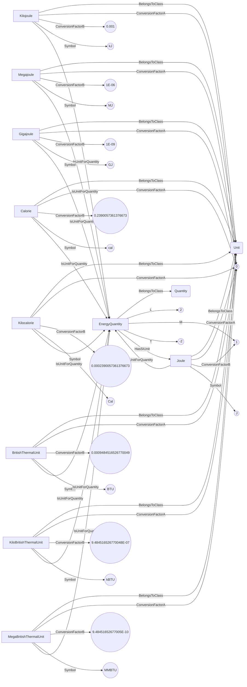
## MassDensityGradientPerLengthQuantity <!-- NOUN -->
- Display name: MassDensityGradientPerLength
- Parent class: [Quantity](./Quantities.md#Quantity)
- Specialization:
  - L = -4
  - M = 1
- Description: 
A mass density gradient per length is the first derivative of a mass density compared to a distance: $\frac{d\rho}{ds}$, where $\rho$ is the mass density and $s$ is a distance.
The dimension of mass density gradient per length is:
$$[ML^{-4}]$$.
The SI unit for **mass density gradient per length** is: kilogram per cubic metre per metre with the associated unit label $\frac{\frac{kg}{m^{3}}}{m}$
- Definition set: QuantityTypes
- Examples:
``` dwis
Quantity:MassDensityGradientPerLengthQuantity
MassDensityGradientPerLengthQuantity.L = -4
MassDensityGradientPerLengthQuantity.M = 1
Unit:KilogramPerCubicMetrePerMetre
KilogramPerCubicMetrePerMetre.ConversionFactorA = 0
KilogramPerCubicMetrePerMetre.ConversionFactorB = 1
KilogramPerCubicMetrePerMetre.Symbol = "kg/m³/m"
KilogramPerCubicMetrePerMetre IsUnitForQuantity MassDensityGradientPerLengthQuantity
MassDensityGradientPerLengthQuantity HasSIUnit KilogramPerCubicMetrePerMetre
Unit:SpecificGravityPerMetre
SpecificGravityPerMetre.ConversionFactorA = 0
SpecificGravityPerMetre.ConversionFactorB = 0.001000028000784022
SpecificGravityPerMetre.Symbol = "sg/m"
SpecificGravityPerMetre IsUnitForQuantity MassDensityGradientPerLengthQuantity
Unit:SpecificGravityPer10Metre
SpecificGravityPer10Metre.ConversionFactorA = 0
SpecificGravityPer10Metre.ConversionFactorB = 0.01000028000784022
SpecificGravityPer10Metre.Symbol = "sg/10m"
SpecificGravityPer10Metre IsUnitForQuantity MassDensityGradientPerLengthQuantity
Unit:SpecificGravityPer30Metre
SpecificGravityPer30Metre.ConversionFactorA = 0
SpecificGravityPer30Metre.ConversionFactorB = 0.03000084002352066
SpecificGravityPer30Metre.Symbol = "sg/30m"
SpecificGravityPer30Metre IsUnitForQuantity MassDensityGradientPerLengthQuantity
Unit:SpecificGravityPer100Metre
SpecificGravityPer100Metre.ConversionFactorA = 0
SpecificGravityPer100Metre.ConversionFactorB = 0.10000280007840219
SpecificGravityPer100Metre.Symbol = "sg/100m"
SpecificGravityPer100Metre IsUnitForQuantity MassDensityGradientPerLengthQuantity
Unit:GramPerCubicCentimetrePer100Metre
GramPerCubicCentimetrePer100Metre.ConversionFactorA = 0
GramPerCubicCentimetrePer100Metre.ConversionFactorB = 0.10000000000000002
GramPerCubicCentimetrePer100Metre.Symbol = "g/cm³/100m"
GramPerCubicCentimetrePer100Metre IsUnitForQuantity MassDensityGradientPerLengthQuantity
Unit:PoundPerGallonUkPerFoot
PoundPerGallonUkPerFoot.ConversionFactorA = 0
PoundPerGallonUkPerFoot.ConversionFactorB = 0.00305483143819196
PoundPerGallonUkPerFoot.Symbol = "ppgUK/ft"
PoundPerGallonUkPerFoot IsUnitForQuantity MassDensityGradientPerLengthQuantity
Unit:PoundPerGallonUkPer30Foot
PoundPerGallonUkPer30Foot.ConversionFactorA = 0
PoundPerGallonUkPer30Foot.ConversionFactorB = 0.0916449431457588
PoundPerGallonUkPer30Foot.Symbol = "ppgUK/30ft"
PoundPerGallonUkPer30Foot IsUnitForQuantity MassDensityGradientPerLengthQuantity
Unit:PoundPerGallonUkPer100Foot
PoundPerGallonUkPer100Foot.ConversionFactorA = 0
PoundPerGallonUkPer100Foot.ConversionFactorB = 0.305483143819196
PoundPerGallonUkPer100Foot.Symbol = "ppgUK/100ft"
PoundPerGallonUkPer100Foot IsUnitForQuantity MassDensityGradientPerLengthQuantity
Unit:PoundPerGallonUsPerFoot
PoundPerGallonUsPerFoot.ConversionFactorA = 0
PoundPerGallonUsPerFoot.ConversionFactorB = 0.0025436792769754917
PoundPerGallonUsPerFoot.Symbol = "ppgUS/ft"
PoundPerGallonUsPerFoot IsUnitForQuantity MassDensityGradientPerLengthQuantity
Unit:PoundPerGallonUsPer30Foot
PoundPerGallonUsPer30Foot.ConversionFactorA = 0
PoundPerGallonUsPer30Foot.ConversionFactorB = 0.07631037830926475
PoundPerGallonUsPer30Foot.Symbol = "ppgUS/30ft"
PoundPerGallonUsPer30Foot IsUnitForQuantity MassDensityGradientPerLengthQuantity
Unit:PoundPerGallonUsPer100Foot
PoundPerGallonUsPer100Foot.ConversionFactorA = 0
PoundPerGallonUsPer100Foot.ConversionFactorB = 0.2543679276975492
PoundPerGallonUsPer100Foot.Symbol = "ppgUS/100ft"
PoundPerGallonUsPer100Foot IsUnitForQuantity MassDensityGradientPerLengthQuantity
Unit:KilogramPerCubicMetrePer10Metre
KilogramPerCubicMetrePer10Metre.ConversionFactorA = 0
KilogramPerCubicMetrePer10Metre.ConversionFactorB = 10
KilogramPerCubicMetrePer10Metre.Symbol = "kg/m³/10m"
KilogramPerCubicMetrePer10Metre IsUnitForQuantity MassDensityGradientPerLengthQuantity
Unit:KilogramPerCubicMetrePer30Metre
KilogramPerCubicMetrePer30Metre.ConversionFactorA = 0
KilogramPerCubicMetrePer30Metre.ConversionFactorB = 30
KilogramPerCubicMetrePer30Metre.Symbol = "kg/m³/30m"
KilogramPerCubicMetrePer30Metre IsUnitForQuantity MassDensityGradientPerLengthQuantity
Unit:KilogramPerCubicMetrePer100Metre
KilogramPerCubicMetrePer100Metre.ConversionFactorA = 0
KilogramPerCubicMetrePer100Metre.ConversionFactorB = 100
KilogramPerCubicMetrePer100Metre.Symbol = "kg/m³/30m"
KilogramPerCubicMetrePer100Metre IsUnitForQuantity MassDensityGradientPerLengthQuantity
Unit:GramPerCubicCentimetrePerMetre
GramPerCubicCentimetrePerMetre.ConversionFactorA = 0
GramPerCubicCentimetrePerMetre.ConversionFactorB = 0.0010000000000000002
GramPerCubicCentimetrePerMetre.Symbol = "g/cm³/m"
GramPerCubicCentimetrePerMetre IsUnitForQuantity MassDensityGradientPerLengthQuantity
Unit:GramPerCubicCentimetrePer10Metre
GramPerCubicCentimetrePer10Metre.ConversionFactorA = 0
GramPerCubicCentimetrePer10Metre.ConversionFactorB = 0.010000000000000002
GramPerCubicCentimetrePer10Metre.Symbol = "g/cm³/10m"
GramPerCubicCentimetrePer10Metre IsUnitForQuantity MassDensityGradientPerLengthQuantity
Unit:GramPerCubicCentimetrePer30Metre
GramPerCubicCentimetrePer30Metre.ConversionFactorA = 0
GramPerCubicCentimetrePer30Metre.ConversionFactorB = 0.030000000000000002
GramPerCubicCentimetrePer30Metre.Symbol = "g/cm³/30m"
GramPerCubicCentimetrePer30Metre IsUnitForQuantity MassDensityGradientPerLengthQuantity
Unit:PoundPerCubicFootPerFoot
PoundPerCubicFootPerFoot.ConversionFactorA = 0
PoundPerCubicFootPerFoot.ConversionFactorB = 0.019028042383608865
PoundPerCubicFootPerFoot.Symbol = "lb/ft³/ft"
PoundPerCubicFootPerFoot IsUnitForQuantity MassDensityGradientPerLengthQuantity
Unit:PoundPerCubicFootPer30Foot
PoundPerCubicFootPer30Foot.ConversionFactorA = 0
PoundPerCubicFootPer30Foot.ConversionFactorB = 0.570841271508266
PoundPerCubicFootPer30Foot.Symbol = "lb/ft³/30ft"
PoundPerCubicFootPer30Foot IsUnitForQuantity MassDensityGradientPerLengthQuantity
Unit:PoundPerCubicFootPer100Foot
PoundPerCubicFootPer100Foot.ConversionFactorA = 0
PoundPerCubicFootPer100Foot.ConversionFactorB = 1.902804238360887
PoundPerCubicFootPer100Foot.Symbol = "lb/ft³/100ft"
PoundPerCubicFootPer100Foot IsUnitForQuantity MassDensityGradientPerLengthQuantity
Unit:PoundPerCubicInchPerFoot
PoundPerCubicInchPerFoot.ConversionFactorA = 0
PoundPerCubicInchPerFoot.ConversionFactorB = 1.1011598601625506E-05
PoundPerCubicInchPerFoot.Symbol = "lb/in³/ft"
PoundPerCubicInchPerFoot IsUnitForQuantity MassDensityGradientPerLengthQuantity
Unit:PoundPerCubicInchPer30Foot
PoundPerCubicInchPer30Foot.ConversionFactorA = 0
PoundPerCubicInchPer30Foot.ConversionFactorB = 0.00033034795804876514
PoundPerCubicInchPer30Foot.Symbol = "lb/in³/30ft"
PoundPerCubicInchPer30Foot IsUnitForQuantity MassDensityGradientPerLengthQuantity
Unit:PoundPerCubicInchPer100Foot
PoundPerCubicInchPer100Foot.ConversionFactorA = 0
PoundPerCubicInchPer100Foot.ConversionFactorB = 0.0011011598601625506
PoundPerCubicInchPer100Foot.Symbol = "lb/in³/100ft"
PoundPerCubicInchPer100Foot IsUnitForQuantity MassDensityGradientPerLengthQuantity
Unit:PoundPerCubicYardPerFoot
PoundPerCubicYardPerFoot.ConversionFactorA = 0
PoundPerCubicYardPerFoot.ConversionFactorB = 0.5137571443574394
PoundPerCubicYardPerFoot.Symbol = "lb/yd³/ft"
PoundPerCubicYardPerFoot IsUnitForQuantity MassDensityGradientPerLengthQuantity
Unit:PoundPerCubicYardPer30Foot
PoundPerCubicYardPer30Foot.ConversionFactorA = 0
PoundPerCubicYardPer30Foot.ConversionFactorB = 15.412714330723183
PoundPerCubicYardPer30Foot.Symbol = "lb/yd³/30ft"
PoundPerCubicYardPer30Foot IsUnitForQuantity MassDensityGradientPerLengthQuantity
Unit:PoundPerCubicYardPer100Foot
PoundPerCubicYardPer100Foot.ConversionFactorA = 0
PoundPerCubicYardPer100Foot.ConversionFactorB = 51.37571443574393
PoundPerCubicYardPer100Foot.Symbol = "lb/yd³/100ft"
PoundPerCubicYardPer100Foot IsUnitForQuantity MassDensityGradientPerLengthQuantity
```
An example semantic graph looks like as follow:
```mermaid
graph LR
	N0000[MassDensityGradientPerLengthQuantity] -->|BelongsToClass| N0001(Quantity) 
	N0000[MassDensityGradientPerLengthQuantity] -->|L| N0002(("-4")) 
	N0000[MassDensityGradientPerLengthQuantity] -->|M| N0003(("1")) 
	N0004[KilogramPerCubicMetrePerMetre] -->|BelongsToClass| N0005(Unit) 
	N0004[KilogramPerCubicMetrePerMetre] -->|ConversionFactorA| N0006(("0")) 
	N0004[KilogramPerCubicMetrePerMetre] -->|ConversionFactorB| N0003(("1")) 
	N0004[KilogramPerCubicMetrePerMetre] -->|Symbol| N0007(("kg/m³/m")) 
	N0004[KilogramPerCubicMetrePerMetre] -->|IsUnitForQuantity| N0000[MassDensityGradientPerLengthQuantity] 
	N0000[MassDensityGradientPerLengthQuantity] -->|HasSIUnit| N0004[KilogramPerCubicMetrePerMetre] 
	N0008[SpecificGravityPerMetre] -->|BelongsToClass| N0005(Unit) 
	N0008[SpecificGravityPerMetre] -->|ConversionFactorA| N0006(("0")) 
	N0008[SpecificGravityPerMetre] -->|ConversionFactorB| N0009(("0.001000028000784022")) 
	N0008[SpecificGravityPerMetre] -->|Symbol| N0010(("sg/m")) 
	N0008[SpecificGravityPerMetre] -->|IsUnitForQuantity| N0000[MassDensityGradientPerLengthQuantity] 
	N0011[SpecificGravityPer10Metre] -->|BelongsToClass| N0005(Unit) 
	N0011[SpecificGravityPer10Metre] -->|ConversionFactorA| N0006(("0")) 
	N0011[SpecificGravityPer10Metre] -->|ConversionFactorB| N0012(("0.01000028000784022")) 
	N0011[SpecificGravityPer10Metre] -->|Symbol| N0013(("sg/10m")) 
	N0011[SpecificGravityPer10Metre] -->|IsUnitForQuantity| N0000[MassDensityGradientPerLengthQuantity] 
	N0014[SpecificGravityPer30Metre] -->|BelongsToClass| N0005(Unit) 
	N0014[SpecificGravityPer30Metre] -->|ConversionFactorA| N0006(("0")) 
	N0014[SpecificGravityPer30Metre] -->|ConversionFactorB| N0015(("0.03000084002352066")) 
	N0014[SpecificGravityPer30Metre] -->|Symbol| N0016(("sg/30m")) 
	N0014[SpecificGravityPer30Metre] -->|IsUnitForQuantity| N0000[MassDensityGradientPerLengthQuantity] 
	N0017[SpecificGravityPer100Metre] -->|BelongsToClass| N0005(Unit) 
	N0017[SpecificGravityPer100Metre] -->|ConversionFactorA| N0006(("0")) 
	N0017[SpecificGravityPer100Metre] -->|ConversionFactorB| N0018(("0.10000280007840219")) 
	N0017[SpecificGravityPer100Metre] -->|Symbol| N0019(("sg/100m")) 
	N0017[SpecificGravityPer100Metre] -->|IsUnitForQuantity| N0000[MassDensityGradientPerLengthQuantity] 
	N0020[GramPerCubicCentimetrePer100Metre] -->|BelongsToClass| N0005(Unit) 
	N0020[GramPerCubicCentimetrePer100Metre] -->|ConversionFactorA| N0006(("0")) 
	N0020[GramPerCubicCentimetrePer100Metre] -->|ConversionFactorB| N0021(("0.10000000000000002")) 
	N0020[GramPerCubicCentimetrePer100Metre] -->|Symbol| N0022(("g/cm³/100m")) 
	N0020[GramPerCubicCentimetrePer100Metre] -->|IsUnitForQuantity| N0000[MassDensityGradientPerLengthQuantity] 
	N0023[PoundPerGallonUkPerFoot] -->|BelongsToClass| N0005(Unit) 
	N0023[PoundPerGallonUkPerFoot] -->|ConversionFactorA| N0006(("0")) 
	N0023[PoundPerGallonUkPerFoot] -->|ConversionFactorB| N0024(("0.00305483143819196")) 
	N0023[PoundPerGallonUkPerFoot] -->|Symbol| N0025(("ppgUK/ft")) 
	N0023[PoundPerGallonUkPerFoot] -->|IsUnitForQuantity| N0000[MassDensityGradientPerLengthQuantity] 
	N0026[PoundPerGallonUkPer30Foot] -->|BelongsToClass| N0005(Unit) 
	N0026[PoundPerGallonUkPer30Foot] -->|ConversionFactorA| N0006(("0")) 
	N0026[PoundPerGallonUkPer30Foot] -->|ConversionFactorB| N0027(("0.0916449431457588")) 
	N0026[PoundPerGallonUkPer30Foot] -->|Symbol| N0028(("ppgUK/30ft")) 
	N0026[PoundPerGallonUkPer30Foot] -->|IsUnitForQuantity| N0000[MassDensityGradientPerLengthQuantity] 
	N0029[PoundPerGallonUkPer100Foot] -->|BelongsToClass| N0005(Unit) 
	N0029[PoundPerGallonUkPer100Foot] -->|ConversionFactorA| N0006(("0")) 
	N0029[PoundPerGallonUkPer100Foot] -->|ConversionFactorB| N0030(("0.305483143819196")) 
	N0029[PoundPerGallonUkPer100Foot] -->|Symbol| N0031(("ppgUK/100ft")) 
	N0029[PoundPerGallonUkPer100Foot] -->|IsUnitForQuantity| N0000[MassDensityGradientPerLengthQuantity] 
	N0032[PoundPerGallonUsPerFoot] -->|BelongsToClass| N0005(Unit) 
	N0032[PoundPerGallonUsPerFoot] -->|ConversionFactorA| N0006(("0")) 
	N0032[PoundPerGallonUsPerFoot] -->|ConversionFactorB| N0033(("0.0025436792769754917")) 
	N0032[PoundPerGallonUsPerFoot] -->|Symbol| N0034(("ppgUS/ft")) 
	N0032[PoundPerGallonUsPerFoot] -->|IsUnitForQuantity| N0000[MassDensityGradientPerLengthQuantity] 
	N0035[PoundPerGallonUsPer30Foot] -->|BelongsToClass| N0005(Unit) 
	N0035[PoundPerGallonUsPer30Foot] -->|ConversionFactorA| N0006(("0")) 
	N0035[PoundPerGallonUsPer30Foot] -->|ConversionFactorB| N0036(("0.07631037830926475")) 
	N0035[PoundPerGallonUsPer30Foot] -->|Symbol| N0037(("ppgUS/30ft")) 
	N0035[PoundPerGallonUsPer30Foot] -->|IsUnitForQuantity| N0000[MassDensityGradientPerLengthQuantity] 
	N0038[PoundPerGallonUsPer100Foot] -->|BelongsToClass| N0005(Unit) 
	N0038[PoundPerGallonUsPer100Foot] -->|ConversionFactorA| N0006(("0")) 
	N0038[PoundPerGallonUsPer100Foot] -->|ConversionFactorB| N0039(("0.2543679276975492")) 
	N0038[PoundPerGallonUsPer100Foot] -->|Symbol| N0040(("ppgUS/100ft")) 
	N0038[PoundPerGallonUsPer100Foot] -->|IsUnitForQuantity| N0000[MassDensityGradientPerLengthQuantity] 
	N0041[KilogramPerCubicMetrePer10Metre] -->|BelongsToClass| N0005(Unit) 
	N0041[KilogramPerCubicMetrePer10Metre] -->|ConversionFactorA| N0006(("0")) 
	N0041[KilogramPerCubicMetrePer10Metre] -->|ConversionFactorB| N0042(("10")) 
	N0041[KilogramPerCubicMetrePer10Metre] -->|Symbol| N0043(("kg/m³/10m")) 
	N0041[KilogramPerCubicMetrePer10Metre] -->|IsUnitForQuantity| N0000[MassDensityGradientPerLengthQuantity] 
	N0044[KilogramPerCubicMetrePer30Metre] -->|BelongsToClass| N0005(Unit) 
	N0044[KilogramPerCubicMetrePer30Metre] -->|ConversionFactorA| N0006(("0")) 
	N0044[KilogramPerCubicMetrePer30Metre] -->|ConversionFactorB| N0045(("30")) 
	N0044[KilogramPerCubicMetrePer30Metre] -->|Symbol| N0046(("kg/m³/30m")) 
	N0044[KilogramPerCubicMetrePer30Metre] -->|IsUnitForQuantity| N0000[MassDensityGradientPerLengthQuantity] 
	N0047[KilogramPerCubicMetrePer100Metre] -->|BelongsToClass| N0005(Unit) 
	N0047[KilogramPerCubicMetrePer100Metre] -->|ConversionFactorA| N0006(("0")) 
	N0047[KilogramPerCubicMetrePer100Metre] -->|ConversionFactorB| N0048(("100")) 
	N0047[KilogramPerCubicMetrePer100Metre] -->|Symbol| N0046(("kg/m³/30m")) 
	N0047[KilogramPerCubicMetrePer100Metre] -->|IsUnitForQuantity| N0000[MassDensityGradientPerLengthQuantity] 
	N0049[GramPerCubicCentimetrePerMetre] -->|BelongsToClass| N0005(Unit) 
	N0049[GramPerCubicCentimetrePerMetre] -->|ConversionFactorA| N0006(("0")) 
	N0049[GramPerCubicCentimetrePerMetre] -->|ConversionFactorB| N0050(("0.0010000000000000002")) 
	N0049[GramPerCubicCentimetrePerMetre] -->|Symbol| N0051(("g/cm³/m")) 
	N0049[GramPerCubicCentimetrePerMetre] -->|IsUnitForQuantity| N0000[MassDensityGradientPerLengthQuantity] 
	N0052[GramPerCubicCentimetrePer10Metre] -->|BelongsToClass| N0005(Unit) 
	N0052[GramPerCubicCentimetrePer10Metre] -->|ConversionFactorA| N0006(("0")) 
	N0052[GramPerCubicCentimetrePer10Metre] -->|ConversionFactorB| N0053(("0.010000000000000002")) 
	N0052[GramPerCubicCentimetrePer10Metre] -->|Symbol| N0054(("g/cm³/10m")) 
	N0052[GramPerCubicCentimetrePer10Metre] -->|IsUnitForQuantity| N0000[MassDensityGradientPerLengthQuantity] 
	N0055[GramPerCubicCentimetrePer30Metre] -->|BelongsToClass| N0005(Unit) 
	N0055[GramPerCubicCentimetrePer30Metre] -->|ConversionFactorA| N0006(("0")) 
	N0055[GramPerCubicCentimetrePer30Metre] -->|ConversionFactorB| N0056(("0.030000000000000002")) 
	N0055[GramPerCubicCentimetrePer30Metre] -->|Symbol| N0057(("g/cm³/30m")) 
	N0055[GramPerCubicCentimetrePer30Metre] -->|IsUnitForQuantity| N0000[MassDensityGradientPerLengthQuantity] 
	N0058[PoundPerCubicFootPerFoot] -->|BelongsToClass| N0005(Unit) 
	N0058[PoundPerCubicFootPerFoot] -->|ConversionFactorA| N0006(("0")) 
	N0058[PoundPerCubicFootPerFoot] -->|ConversionFactorB| N0059(("0.019028042383608865")) 
	N0058[PoundPerCubicFootPerFoot] -->|Symbol| N0060(("lb/ft³/ft")) 
	N0058[PoundPerCubicFootPerFoot] -->|IsUnitForQuantity| N0000[MassDensityGradientPerLengthQuantity] 
	N0061[PoundPerCubicFootPer30Foot] -->|BelongsToClass| N0005(Unit) 
	N0061[PoundPerCubicFootPer30Foot] -->|ConversionFactorA| N0006(("0")) 
	N0061[PoundPerCubicFootPer30Foot] -->|ConversionFactorB| N0062(("0.570841271508266")) 
	N0061[PoundPerCubicFootPer30Foot] -->|Symbol| N0063(("lb/ft³/30ft")) 
	N0061[PoundPerCubicFootPer30Foot] -->|IsUnitForQuantity| N0000[MassDensityGradientPerLengthQuantity] 
	N0064[PoundPerCubicFootPer100Foot] -->|BelongsToClass| N0005(Unit) 
	N0064[PoundPerCubicFootPer100Foot] -->|ConversionFactorA| N0006(("0")) 
	N0064[PoundPerCubicFootPer100Foot] -->|ConversionFactorB| N0065(("1.902804238360887")) 
	N0064[PoundPerCubicFootPer100Foot] -->|Symbol| N0066(("lb/ft³/100ft")) 
	N0064[PoundPerCubicFootPer100Foot] -->|IsUnitForQuantity| N0000[MassDensityGradientPerLengthQuantity] 
	N0067[PoundPerCubicInchPerFoot] -->|BelongsToClass| N0005(Unit) 
	N0067[PoundPerCubicInchPerFoot] -->|ConversionFactorA| N0006(("0")) 
	N0067[PoundPerCubicInchPerFoot] -->|ConversionFactorB| N0068(("1.1011598601625506E-05")) 
	N0067[PoundPerCubicInchPerFoot] -->|Symbol| N0069(("lb/in³/ft")) 
	N0067[PoundPerCubicInchPerFoot] -->|IsUnitForQuantity| N0000[MassDensityGradientPerLengthQuantity] 
	N0070[PoundPerCubicInchPer30Foot] -->|BelongsToClass| N0005(Unit) 
	N0070[PoundPerCubicInchPer30Foot] -->|ConversionFactorA| N0006(("0")) 
	N0070[PoundPerCubicInchPer30Foot] -->|ConversionFactorB| N0071(("0.00033034795804876514")) 
	N0070[PoundPerCubicInchPer30Foot] -->|Symbol| N0072(("lb/in³/30ft")) 
	N0070[PoundPerCubicInchPer30Foot] -->|IsUnitForQuantity| N0000[MassDensityGradientPerLengthQuantity] 
	N0073[PoundPerCubicInchPer100Foot] -->|BelongsToClass| N0005(Unit) 
	N0073[PoundPerCubicInchPer100Foot] -->|ConversionFactorA| N0006(("0")) 
	N0073[PoundPerCubicInchPer100Foot] -->|ConversionFactorB| N0074(("0.0011011598601625506")) 
	N0073[PoundPerCubicInchPer100Foot] -->|Symbol| N0075(("lb/in³/100ft")) 
	N0073[PoundPerCubicInchPer100Foot] -->|IsUnitForQuantity| N0000[MassDensityGradientPerLengthQuantity] 
	N0076[PoundPerCubicYardPerFoot] -->|BelongsToClass| N0005(Unit) 
	N0076[PoundPerCubicYardPerFoot] -->|ConversionFactorA| N0006(("0")) 
	N0076[PoundPerCubicYardPerFoot] -->|ConversionFactorB| N0077(("0.5137571443574394")) 
	N0076[PoundPerCubicYardPerFoot] -->|Symbol| N0078(("lb/yd³/ft")) 
	N0076[PoundPerCubicYardPerFoot] -->|IsUnitForQuantity| N0000[MassDensityGradientPerLengthQuantity] 
	N0079[PoundPerCubicYardPer30Foot] -->|BelongsToClass| N0005(Unit) 
	N0079[PoundPerCubicYardPer30Foot] -->|ConversionFactorA| N0006(("0")) 
	N0079[PoundPerCubicYardPer30Foot] -->|ConversionFactorB| N0080(("15.412714330723183")) 
	N0079[PoundPerCubicYardPer30Foot] -->|Symbol| N0081(("lb/yd³/30ft")) 
	N0079[PoundPerCubicYardPer30Foot] -->|IsUnitForQuantity| N0000[MassDensityGradientPerLengthQuantity] 
	N0082[PoundPerCubicYardPer100Foot] -->|BelongsToClass| N0005(Unit) 
	N0082[PoundPerCubicYardPer100Foot] -->|ConversionFactorA| N0006(("0")) 
	N0082[PoundPerCubicYardPer100Foot] -->|ConversionFactorB| N0083(("51.37571443574393")) 
	N0082[PoundPerCubicYardPer100Foot] -->|Symbol| N0084(("lb/yd³/100ft")) 
	N0082[PoundPerCubicYardPer100Foot] -->|IsUnitForQuantity| N0000[MassDensityGradientPerLengthQuantity] 
```
## MassDensityGradientPerTemperatureQuantity <!-- NOUN -->
- Display name: MassDensityGradientPerTemperature
- Parent class: [Quantity](./Quantities.md#Quantity)
- Specialization:
  - L = -3
  - M = 1
  - ThT = -1
- Description: 
A mass density gradient per temperature is the first derivative of a mass density compared to temperature: $\frac{d\rho}{dT}$, where $\rho$ is a mass density and $T$ is temperature.
The dimension of mass density gradient per temperature is:
$$[MK^{-1}L^{-3}]$$.
The SI unit for **mass density gradient per temperature** is: kilogram per cubic metre per kelvin with the associated unit label $\frac{\frac{kg}{m^{3}}}{K}$
- Definition set: QuantityTypes
- Examples:
``` dwis
Quantity:MassDensityGradientPerTemperatureQuantity
MassDensityGradientPerTemperatureQuantity.L = -3
MassDensityGradientPerTemperatureQuantity.M = 1
MassDensityGradientPerTemperatureQuantity.ThT = -1
Unit:KilogramPerCubicMetrePerKelvin
KilogramPerCubicMetrePerKelvin.ConversionFactorA = 0
KilogramPerCubicMetrePerKelvin.ConversionFactorB = 1
KilogramPerCubicMetrePerKelvin.Symbol = "kg/m³/K"
KilogramPerCubicMetrePerKelvin IsUnitForQuantity MassDensityGradientPerTemperatureQuantity
MassDensityGradientPerTemperatureQuantity HasSIUnit KilogramPerCubicMetrePerKelvin
Unit:SpecificGravityPerCelsius
SpecificGravityPerCelsius.ConversionFactorA = 0
SpecificGravityPerCelsius.ConversionFactorB = 0.001000028000784022
SpecificGravityPerCelsius.Symbol = "sg/°C"
SpecificGravityPerCelsius IsUnitForQuantity MassDensityGradientPerTemperatureQuantity
Unit:GramPerCubicCentimetrePerCelsius
GramPerCubicCentimetrePerCelsius.ConversionFactorA = 0
GramPerCubicCentimetrePerCelsius.ConversionFactorB = 0.0010000000000000002
GramPerCubicCentimetrePerCelsius.Symbol = "g/cm³/°C"
GramPerCubicCentimetrePerCelsius IsUnitForQuantity MassDensityGradientPerTemperatureQuantity
Unit:PoundPerGallonUkPerCelsius
PoundPerGallonUkPerCelsius.ConversionFactorA = 0
PoundPerGallonUkPerCelsius.ConversionFactorB = 0.010022412854960501
PoundPerGallonUkPerCelsius.Symbol = "ppgUK/°C"
PoundPerGallonUkPerCelsius IsUnitForQuantity MassDensityGradientPerTemperatureQuantity
Unit:PoundPerGallonUsPerFahrenheit
PoundPerGallonUsPerFahrenheit.ConversionFactorA = 0
PoundPerGallonUsPerFahrenheit.ConversionFactorB = 0.004636335806677406
PoundPerGallonUsPerFahrenheit.Symbol = "ppgUS/°F"
PoundPerGallonUsPerFahrenheit IsUnitForQuantity MassDensityGradientPerTemperatureQuantity
Unit:PoundPerGallonUkPerFahrenheit
PoundPerGallonUkPerFahrenheit.ConversionFactorA = 0
PoundPerGallonUkPerFahrenheit.ConversionFactorB = 0.005568007141644723
PoundPerGallonUkPerFahrenheit.Symbol = "ppgUK/°F"
PoundPerGallonUkPerFahrenheit IsUnitForQuantity MassDensityGradientPerTemperatureQuantity
Unit:PoundPerGallonUsPerCelsius
PoundPerGallonUsPerCelsius.ConversionFactorA = 0
PoundPerGallonUsPerCelsius.ConversionFactorB = 0.00834540445201933
PoundPerGallonUsPerCelsius.Symbol = "ppgUS/°C"
PoundPerGallonUsPerCelsius IsUnitForQuantity MassDensityGradientPerTemperatureQuantity
Unit:PoundPerCubicFootPerCelsius
PoundPerCubicFootPerCelsius.ConversionFactorA = 0
PoundPerCubicFootPerCelsius.ConversionFactorB = 0.06242796057614459
PoundPerCubicFootPerCelsius.Symbol = "lb/ft³/°C"
PoundPerCubicFootPerCelsius IsUnitForQuantity MassDensityGradientPerTemperatureQuantity
Unit:PoundPerCubicFootPerFahrenheit
PoundPerCubicFootPerFahrenheit.ConversionFactorA = 0
PoundPerCubicFootPerFahrenheit.ConversionFactorB = 0.03468220032008033
PoundPerCubicFootPerFahrenheit.Symbol = "lb/ft³/°F"
PoundPerCubicFootPerFahrenheit IsUnitForQuantity MassDensityGradientPerTemperatureQuantity
Unit:PoundPerCubicInchPerCelsius
PoundPerCubicInchPerCelsius.ConversionFactorA = 0
PoundPerCubicInchPerCelsius.ConversionFactorB = 3.612729200008369E-05
PoundPerCubicInchPerCelsius.Symbol = "lb/in³/°C"
PoundPerCubicInchPerCelsius IsUnitForQuantity MassDensityGradientPerTemperatureQuantity
Unit:PoundPerCubicInchPerFahrenheit
PoundPerCubicInchPerFahrenheit.ConversionFactorA = 0
PoundPerCubicInchPerFahrenheit.ConversionFactorB = 2.0070717777824268E-05
PoundPerCubicInchPerFahrenheit.Symbol = "lb/in³/°F"
PoundPerCubicInchPerFahrenheit IsUnitForQuantity MassDensityGradientPerTemperatureQuantity
Unit:PoundPerCubicYardPerCelsius
PoundPerCubicYardPerCelsius.ConversionFactorA = 0
PoundPerCubicYardPerCelsius.ConversionFactorB = 1.6855549355559039
PoundPerCubicYardPerCelsius.Symbol = "lb/yd³/°C"
PoundPerCubicYardPerCelsius IsUnitForQuantity MassDensityGradientPerTemperatureQuantity
Unit:PoundPerCubicYeardPerFahrenheit
PoundPerCubicYeardPerFahrenheit.ConversionFactorA = 0
PoundPerCubicYeardPerFahrenheit.ConversionFactorB = 0.9364194086421688
PoundPerCubicYeardPerFahrenheit.Symbol = "lb/yd³/°F"
PoundPerCubicYeardPerFahrenheit IsUnitForQuantity MassDensityGradientPerTemperatureQuantity
```
An example semantic graph looks like as follow:
```mermaid
graph LR
	N0000[MassDensityGradientPerTemperatureQuantity] -->|BelongsToClass| N0001(Quantity) 
	N0000[MassDensityGradientPerTemperatureQuantity] -->|L| N0002(("-3")) 
	N0000[MassDensityGradientPerTemperatureQuantity] -->|M| N0003(("1")) 
	N0000[MassDensityGradientPerTemperatureQuantity] -->|ThT| N0004(("-1")) 
	N0005[KilogramPerCubicMetrePerKelvin] -->|BelongsToClass| N0006(Unit) 
	N0005[KilogramPerCubicMetrePerKelvin] -->|ConversionFactorA| N0007(("0")) 
	N0005[KilogramPerCubicMetrePerKelvin] -->|ConversionFactorB| N0003(("1")) 
	N0005[KilogramPerCubicMetrePerKelvin] -->|Symbol| N0008(("kg/m³/K")) 
	N0005[KilogramPerCubicMetrePerKelvin] -->|IsUnitForQuantity| N0000[MassDensityGradientPerTemperatureQuantity] 
	N0000[MassDensityGradientPerTemperatureQuantity] -->|HasSIUnit| N0005[KilogramPerCubicMetrePerKelvin] 
	N0009[SpecificGravityPerCelsius] -->|BelongsToClass| N0006(Unit) 
	N0009[SpecificGravityPerCelsius] -->|ConversionFactorA| N0007(("0")) 
	N0009[SpecificGravityPerCelsius] -->|ConversionFactorB| N0010(("0.001000028000784022")) 
	N0009[SpecificGravityPerCelsius] -->|Symbol| N0011(("sg/°C")) 
	N0009[SpecificGravityPerCelsius] -->|IsUnitForQuantity| N0000[MassDensityGradientPerTemperatureQuantity] 
	N0012[GramPerCubicCentimetrePerCelsius] -->|BelongsToClass| N0006(Unit) 
	N0012[GramPerCubicCentimetrePerCelsius] -->|ConversionFactorA| N0007(("0")) 
	N0012[GramPerCubicCentimetrePerCelsius] -->|ConversionFactorB| N0013(("0.0010000000000000002")) 
	N0012[GramPerCubicCentimetrePerCelsius] -->|Symbol| N0014(("g/cm³/°C")) 
	N0012[GramPerCubicCentimetrePerCelsius] -->|IsUnitForQuantity| N0000[MassDensityGradientPerTemperatureQuantity] 
	N0015[PoundPerGallonUkPerCelsius] -->|BelongsToClass| N0006(Unit) 
	N0015[PoundPerGallonUkPerCelsius] -->|ConversionFactorA| N0007(("0")) 
	N0015[PoundPerGallonUkPerCelsius] -->|ConversionFactorB| N0016(("0.010022412854960501")) 
	N0015[PoundPerGallonUkPerCelsius] -->|Symbol| N0017(("ppgUK/°C")) 
	N0015[PoundPerGallonUkPerCelsius] -->|IsUnitForQuantity| N0000[MassDensityGradientPerTemperatureQuantity] 
	N0018[PoundPerGallonUsPerFahrenheit] -->|BelongsToClass| N0006(Unit) 
	N0018[PoundPerGallonUsPerFahrenheit] -->|ConversionFactorA| N0007(("0")) 
	N0018[PoundPerGallonUsPerFahrenheit] -->|ConversionFactorB| N0019(("0.004636335806677406")) 
	N0018[PoundPerGallonUsPerFahrenheit] -->|Symbol| N0020(("ppgUS/°F")) 
	N0018[PoundPerGallonUsPerFahrenheit] -->|IsUnitForQuantity| N0000[MassDensityGradientPerTemperatureQuantity] 
	N0021[PoundPerGallonUkPerFahrenheit] -->|BelongsToClass| N0006(Unit) 
	N0021[PoundPerGallonUkPerFahrenheit] -->|ConversionFactorA| N0007(("0")) 
	N0021[PoundPerGallonUkPerFahrenheit] -->|ConversionFactorB| N0022(("0.005568007141644723")) 
	N0021[PoundPerGallonUkPerFahrenheit] -->|Symbol| N0023(("ppgUK/°F")) 
	N0021[PoundPerGallonUkPerFahrenheit] -->|IsUnitForQuantity| N0000[MassDensityGradientPerTemperatureQuantity] 
	N0024[PoundPerGallonUsPerCelsius] -->|BelongsToClass| N0006(Unit) 
	N0024[PoundPerGallonUsPerCelsius] -->|ConversionFactorA| N0007(("0")) 
	N0024[PoundPerGallonUsPerCelsius] -->|ConversionFactorB| N0025(("0.00834540445201933")) 
	N0024[PoundPerGallonUsPerCelsius] -->|Symbol| N0026(("ppgUS/°C")) 
	N0024[PoundPerGallonUsPerCelsius] -->|IsUnitForQuantity| N0000[MassDensityGradientPerTemperatureQuantity] 
	N0027[PoundPerCubicFootPerCelsius] -->|BelongsToClass| N0006(Unit) 
	N0027[PoundPerCubicFootPerCelsius] -->|ConversionFactorA| N0007(("0")) 
	N0027[PoundPerCubicFootPerCelsius] -->|ConversionFactorB| N0028(("0.06242796057614459")) 
	N0027[PoundPerCubicFootPerCelsius] -->|Symbol| N0029(("lb/ft³/°C")) 
	N0027[PoundPerCubicFootPerCelsius] -->|IsUnitForQuantity| N0000[MassDensityGradientPerTemperatureQuantity] 
	N0030[PoundPerCubicFootPerFahrenheit] -->|BelongsToClass| N0006(Unit) 
	N0030[PoundPerCubicFootPerFahrenheit] -->|ConversionFactorA| N0007(("0")) 
	N0030[PoundPerCubicFootPerFahrenheit] -->|ConversionFactorB| N0031(("0.03468220032008033")) 
	N0030[PoundPerCubicFootPerFahrenheit] -->|Symbol| N0032(("lb/ft³/°F")) 
	N0030[PoundPerCubicFootPerFahrenheit] -->|IsUnitForQuantity| N0000[MassDensityGradientPerTemperatureQuantity] 
	N0033[PoundPerCubicInchPerCelsius] -->|BelongsToClass| N0006(Unit) 
	N0033[PoundPerCubicInchPerCelsius] -->|ConversionFactorA| N0007(("0")) 
	N0033[PoundPerCubicInchPerCelsius] -->|ConversionFactorB| N0034(("3.612729200008369E-05")) 
	N0033[PoundPerCubicInchPerCelsius] -->|Symbol| N0035(("lb/in³/°C")) 
	N0033[PoundPerCubicInchPerCelsius] -->|IsUnitForQuantity| N0000[MassDensityGradientPerTemperatureQuantity] 
	N0036[PoundPerCubicInchPerFahrenheit] -->|BelongsToClass| N0006(Unit) 
	N0036[PoundPerCubicInchPerFahrenheit] -->|ConversionFactorA| N0007(("0")) 
	N0036[PoundPerCubicInchPerFahrenheit] -->|ConversionFactorB| N0037(("2.0070717777824268E-05")) 
	N0036[PoundPerCubicInchPerFahrenheit] -->|Symbol| N0038(("lb/in³/°F")) 
	N0036[PoundPerCubicInchPerFahrenheit] -->|IsUnitForQuantity| N0000[MassDensityGradientPerTemperatureQuantity] 
	N0039[PoundPerCubicYardPerCelsius] -->|BelongsToClass| N0006(Unit) 
	N0039[PoundPerCubicYardPerCelsius] -->|ConversionFactorA| N0007(("0")) 
	N0039[PoundPerCubicYardPerCelsius] -->|ConversionFactorB| N0040(("1.6855549355559039")) 
	N0039[PoundPerCubicYardPerCelsius] -->|Symbol| N0041(("lb/yd³/°C")) 
	N0039[PoundPerCubicYardPerCelsius] -->|IsUnitForQuantity| N0000[MassDensityGradientPerTemperatureQuantity] 
	N0042[PoundPerCubicYeardPerFahrenheit] -->|BelongsToClass| N0006(Unit) 
	N0042[PoundPerCubicYeardPerFahrenheit] -->|ConversionFactorA| N0007(("0")) 
	N0042[PoundPerCubicYeardPerFahrenheit] -->|ConversionFactorB| N0043(("0.9364194086421688")) 
	N0042[PoundPerCubicYeardPerFahrenheit] -->|Symbol| N0044(("lb/yd³/°F")) 
	N0042[PoundPerCubicYeardPerFahrenheit] -->|IsUnitForQuantity| N0000[MassDensityGradientPerTemperatureQuantity] 
```
## MassDensityQuantity <!-- NOUN -->
- Display name: MassDensity
- Parent class: [Quantity](./Quantities.md#Quantity)
- Specialization:
  - L = -3
  - M = 1
- Description: 
Mass density is the amount of mass per unit volume of a substance.
The dimension of mass density is:
$$[ML^{-3}]$$.
The SI unit for **mass density** is: kilogram per cubic metre with the associated unit label $\frac{kg}{m^{3}}$
- Definition set: QuantityTypes
- Examples:
``` dwis
Quantity:MassDensityQuantity
MassDensityQuantity.L = -3
MassDensityQuantity.M = 1
Unit:KilogramPerCubicMetre
KilogramPerCubicMetre.ConversionFactorA = 0
KilogramPerCubicMetre.ConversionFactorB = 1
KilogramPerCubicMetre.Symbol = "kg/m³"
KilogramPerCubicMetre IsUnitForQuantity MassDensityQuantity
MassDensityQuantity HasSIUnit KilogramPerCubicMetre
Unit:GramPerCubicMetre
GramPerCubicMetre.ConversionFactorA = 0
GramPerCubicMetre.ConversionFactorB = 1000
GramPerCubicMetre.Symbol = "g/m³"
GramPerCubicMetre IsUnitForQuantity MassDensityQuantity
Unit:SpecificGravity
SpecificGravity.ConversionFactorA = 0
SpecificGravity.ConversionFactorB = 999.972
SpecificGravity.Symbol = "s.g."
SpecificGravity IsUnitForQuantity MassDensityQuantity
Unit:GramPerCubicCentimetre
GramPerCubicCentimetre.ConversionFactorA = 0
GramPerCubicCentimetre.ConversionFactorB = 0.0010000000000000002
GramPerCubicCentimetre.Symbol = "g/cm³"
GramPerCubicCentimetre IsUnitForQuantity MassDensityQuantity
Unit:PoundPerGallonUk
PoundPerGallonUk.ConversionFactorA = 0
PoundPerGallonUk.ConversionFactorB = 0.010022412854960501
PoundPerGallonUk.Symbol = "ppgUK"
PoundPerGallonUk IsUnitForQuantity MassDensityQuantity
Unit:PoundPerGallonUs
PoundPerGallonUs.ConversionFactorA = 0
PoundPerGallonUs.ConversionFactorB = 0.00834540445201933
PoundPerGallonUs.Symbol = "ppgUS"
PoundPerGallonUs IsUnitForQuantity MassDensityQuantity
Unit:PoundPerCubicFoot
PoundPerCubicFoot.ConversionFactorA = 0
PoundPerCubicFoot.ConversionFactorB = 0.06242796057614459
PoundPerCubicFoot.Symbol = "lb/ft³"
PoundPerCubicFoot IsUnitForQuantity MassDensityQuantity
Unit:PoundPerCubicInch
PoundPerCubicInch.ConversionFactorA = 0
PoundPerCubicInch.ConversionFactorB = 3.612729200008369E-05
PoundPerCubicInch.Symbol = "lb/in³"
PoundPerCubicInch IsUnitForQuantity MassDensityQuantity
Unit:PoundPerCubicYard
PoundPerCubicYard.ConversionFactorA = 0
PoundPerCubicYard.ConversionFactorB = 1.6855549355559039
PoundPerCubicYard.Symbol = "lb/yd³"
PoundPerCubicYard IsUnitForQuantity MassDensityQuantity
```
An example semantic graph looks like as follow:
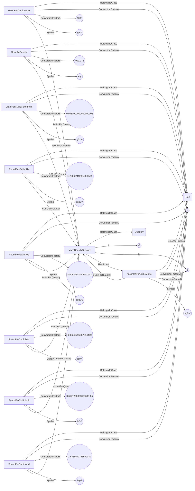
## MassDensityRateOfChangeQuantity <!-- NOUN -->
- Display name: MassDensityRateOfChange
- Parent class: [Quantity](./Quantities.md#Quantity)
- Specialization:
  - L = -3
  - M = 1
  - T = -1
- Description: 
A mass density rate of change is the time derivative of a mass density: $\frac{d\rho}{dt}$, where $\rho$ is the mass density and $t$ is time.
The dimension of mass density rate of change is:
$$[MT^{-1}L^{-3}]$$.
The SI unit for **mass density rate of change** is: kilogram per cubic metre per second with the associated unit label $\frac{\frac{kg}{m^{3}}}{s}$
- Definition set: QuantityTypes
- Examples:
``` dwis
Quantity:MassDensityRateOfChangeQuantity
MassDensityRateOfChangeQuantity.L = -3
MassDensityRateOfChangeQuantity.M = 1
MassDensityRateOfChangeQuantity.T = -1
Unit:KilogramPerCubicMetrePerSecond
KilogramPerCubicMetrePerSecond.ConversionFactorA = 0
KilogramPerCubicMetrePerSecond.ConversionFactorB = 1
KilogramPerCubicMetrePerSecond.Symbol = "kg/m³/s"
KilogramPerCubicMetrePerSecond IsUnitForQuantity MassDensityRateOfChangeQuantity
MassDensityRateOfChangeQuantity HasSIUnit KilogramPerCubicMetrePerSecond
Unit:SpecificGravityPerSecond
SpecificGravityPerSecond.ConversionFactorA = 0
SpecificGravityPerSecond.ConversionFactorB = 0.001000028000784022
SpecificGravityPerSecond.Symbol = "sg/s"
SpecificGravityPerSecond IsUnitForQuantity MassDensityRateOfChangeQuantity
Unit:SpecificGravityPerMinute
SpecificGravityPerMinute.ConversionFactorA = 0
SpecificGravityPerMinute.ConversionFactorB = 0.06000168004704132
SpecificGravityPerMinute.Symbol = "sg/min"
SpecificGravityPerMinute IsUnitForQuantity MassDensityRateOfChangeQuantity
Unit:SpecificGravityPerHour
SpecificGravityPerHour.ConversionFactorA = 0
SpecificGravityPerHour.ConversionFactorB = 3.600100802822479
SpecificGravityPerHour.Symbol = "sg/h"
SpecificGravityPerHour IsUnitForQuantity MassDensityRateOfChangeQuantity
Unit:GramPerCubicCentimetrePerSecond
GramPerCubicCentimetrePerSecond.ConversionFactorA = 0
GramPerCubicCentimetrePerSecond.ConversionFactorB = 0.001
GramPerCubicCentimetrePerSecond.Symbol = "g/cm³/s"
GramPerCubicCentimetrePerSecond IsUnitForQuantity MassDensityRateOfChangeQuantity
Unit:GramPerCubicCentimetrePerMinute
GramPerCubicCentimetrePerMinute.ConversionFactorA = 0
GramPerCubicCentimetrePerMinute.ConversionFactorB = 0.06
GramPerCubicCentimetrePerMinute.Symbol = "g/cm³/min"
GramPerCubicCentimetrePerMinute IsUnitForQuantity MassDensityRateOfChangeQuantity
Unit:GramPerCubicCentimetrePerHour
GramPerCubicCentimetrePerHour.ConversionFactorA = 0
GramPerCubicCentimetrePerHour.ConversionFactorB = 3.6
GramPerCubicCentimetrePerHour.Symbol = "g/cm³/h"
GramPerCubicCentimetrePerHour IsUnitForQuantity MassDensityRateOfChangeQuantity
Unit:PoundPerGallonUkPerSecond
PoundPerGallonUkPerSecond.ConversionFactorA = 0
PoundPerGallonUkPerSecond.ConversionFactorB = 0.010022412854960501
PoundPerGallonUkPerSecond.Symbol = "ppgUK/s"
PoundPerGallonUkPerSecond IsUnitForQuantity MassDensityRateOfChangeQuantity
Unit:PoundPerGallonUkPerMinute
PoundPerGallonUkPerMinute.ConversionFactorA = 0
PoundPerGallonUkPerMinute.ConversionFactorB = 0.6013447712976301
PoundPerGallonUkPerMinute.Symbol = "ppgUK/min"
PoundPerGallonUkPerMinute IsUnitForQuantity MassDensityRateOfChangeQuantity
Unit:PoundPerGallonUkPerHour
PoundPerGallonUkPerHour.ConversionFactorA = 0
PoundPerGallonUkPerHour.ConversionFactorB = 36.08068627785781
PoundPerGallonUkPerHour.Symbol = "ppgUK/h"
PoundPerGallonUkPerHour IsUnitForQuantity MassDensityRateOfChangeQuantity
Unit:PoundPerGallonUsPerSecond
PoundPerGallonUsPerSecond.ConversionFactorA = 0
PoundPerGallonUsPerSecond.ConversionFactorB = 0.00834540445201933
PoundPerGallonUsPerSecond.Symbol = "ppgUS/s"
PoundPerGallonUsPerSecond IsUnitForQuantity MassDensityRateOfChangeQuantity
Unit:PoundPerGallonUsPerMinute
PoundPerGallonUsPerMinute.ConversionFactorA = 0
PoundPerGallonUsPerMinute.ConversionFactorB = 0.5007242671211598
PoundPerGallonUsPerMinute.Symbol = "ppgUS/min"
PoundPerGallonUsPerMinute IsUnitForQuantity MassDensityRateOfChangeQuantity
Unit:PoundPerGallonUsPerHour
PoundPerGallonUsPerHour.ConversionFactorA = 0
PoundPerGallonUsPerHour.ConversionFactorB = 30.043456027269592
PoundPerGallonUsPerHour.Symbol = "ppgUS/h"
PoundPerGallonUsPerHour IsUnitForQuantity MassDensityRateOfChangeQuantity
```
An example semantic graph looks like as follow:
```mermaid
graph LR
	N0000[MassDensityRateOfChangeQuantity] -->|BelongsToClass| N0001(Quantity) 
	N0000[MassDensityRateOfChangeQuantity] -->|L| N0002(("-3")) 
	N0000[MassDensityRateOfChangeQuantity] -->|M| N0003(("1")) 
	N0000[MassDensityRateOfChangeQuantity] -->|T| N0004(("-1")) 
	N0005[KilogramPerCubicMetrePerSecond] -->|BelongsToClass| N0006(Unit) 
	N0005[KilogramPerCubicMetrePerSecond] -->|ConversionFactorA| N0007(("0")) 
	N0005[KilogramPerCubicMetrePerSecond] -->|ConversionFactorB| N0003(("1")) 
	N0005[KilogramPerCubicMetrePerSecond] -->|Symbol| N0008(("kg/m³/s")) 
	N0005[KilogramPerCubicMetrePerSecond] -->|IsUnitForQuantity| N0000[MassDensityRateOfChangeQuantity] 
	N0000[MassDensityRateOfChangeQuantity] -->|HasSIUnit| N0005[KilogramPerCubicMetrePerSecond] 
	N0009[SpecificGravityPerSecond] -->|BelongsToClass| N0006(Unit) 
	N0009[SpecificGravityPerSecond] -->|ConversionFactorA| N0007(("0")) 
	N0009[SpecificGravityPerSecond] -->|ConversionFactorB| N0010(("0.001000028000784022")) 
	N0009[SpecificGravityPerSecond] -->|Symbol| N0011(("sg/s")) 
	N0009[SpecificGravityPerSecond] -->|IsUnitForQuantity| N0000[MassDensityRateOfChangeQuantity] 
	N0012[SpecificGravityPerMinute] -->|BelongsToClass| N0006(Unit) 
	N0012[SpecificGravityPerMinute] -->|ConversionFactorA| N0007(("0")) 
	N0012[SpecificGravityPerMinute] -->|ConversionFactorB| N0013(("0.06000168004704132")) 
	N0012[SpecificGravityPerMinute] -->|Symbol| N0014(("sg/min")) 
	N0012[SpecificGravityPerMinute] -->|IsUnitForQuantity| N0000[MassDensityRateOfChangeQuantity] 
	N0015[SpecificGravityPerHour] -->|BelongsToClass| N0006(Unit) 
	N0015[SpecificGravityPerHour] -->|ConversionFactorA| N0007(("0")) 
	N0015[SpecificGravityPerHour] -->|ConversionFactorB| N0016(("3.600100802822479")) 
	N0015[SpecificGravityPerHour] -->|Symbol| N0017(("sg/h")) 
	N0015[SpecificGravityPerHour] -->|IsUnitForQuantity| N0000[MassDensityRateOfChangeQuantity] 
	N0018[GramPerCubicCentimetrePerSecond] -->|BelongsToClass| N0006(Unit) 
	N0018[GramPerCubicCentimetrePerSecond] -->|ConversionFactorA| N0007(("0")) 
	N0018[GramPerCubicCentimetrePerSecond] -->|ConversionFactorB| N0019(("0.001")) 
	N0018[GramPerCubicCentimetrePerSecond] -->|Symbol| N0020(("g/cm³/s")) 
	N0018[GramPerCubicCentimetrePerSecond] -->|IsUnitForQuantity| N0000[MassDensityRateOfChangeQuantity] 
	N0021[GramPerCubicCentimetrePerMinute] -->|BelongsToClass| N0006(Unit) 
	N0021[GramPerCubicCentimetrePerMinute] -->|ConversionFactorA| N0007(("0")) 
	N0021[GramPerCubicCentimetrePerMinute] -->|ConversionFactorB| N0022(("0.06")) 
	N0021[GramPerCubicCentimetrePerMinute] -->|Symbol| N0023(("g/cm³/min")) 
	N0021[GramPerCubicCentimetrePerMinute] -->|IsUnitForQuantity| N0000[MassDensityRateOfChangeQuantity] 
	N0024[GramPerCubicCentimetrePerHour] -->|BelongsToClass| N0006(Unit) 
	N0024[GramPerCubicCentimetrePerHour] -->|ConversionFactorA| N0007(("0")) 
	N0024[GramPerCubicCentimetrePerHour] -->|ConversionFactorB| N0025(("3.6")) 
	N0024[GramPerCubicCentimetrePerHour] -->|Symbol| N0026(("g/cm³/h")) 
	N0024[GramPerCubicCentimetrePerHour] -->|IsUnitForQuantity| N0000[MassDensityRateOfChangeQuantity] 
	N0027[PoundPerGallonUkPerSecond] -->|BelongsToClass| N0006(Unit) 
	N0027[PoundPerGallonUkPerSecond] -->|ConversionFactorA| N0007(("0")) 
	N0027[PoundPerGallonUkPerSecond] -->|ConversionFactorB| N0028(("0.010022412854960501")) 
	N0027[PoundPerGallonUkPerSecond] -->|Symbol| N0029(("ppgUK/s")) 
	N0027[PoundPerGallonUkPerSecond] -->|IsUnitForQuantity| N0000[MassDensityRateOfChangeQuantity] 
	N0030[PoundPerGallonUkPerMinute] -->|BelongsToClass| N0006(Unit) 
	N0030[PoundPerGallonUkPerMinute] -->|ConversionFactorA| N0007(("0")) 
	N0030[PoundPerGallonUkPerMinute] -->|ConversionFactorB| N0031(("0.6013447712976301")) 
	N0030[PoundPerGallonUkPerMinute] -->|Symbol| N0032(("ppgUK/min")) 
	N0030[PoundPerGallonUkPerMinute] -->|IsUnitForQuantity| N0000[MassDensityRateOfChangeQuantity] 
	N0033[PoundPerGallonUkPerHour] -->|BelongsToClass| N0006(Unit) 
	N0033[PoundPerGallonUkPerHour] -->|ConversionFactorA| N0007(("0")) 
	N0033[PoundPerGallonUkPerHour] -->|ConversionFactorB| N0034(("36.08068627785781")) 
	N0033[PoundPerGallonUkPerHour] -->|Symbol| N0035(("ppgUK/h")) 
	N0033[PoundPerGallonUkPerHour] -->|IsUnitForQuantity| N0000[MassDensityRateOfChangeQuantity] 
	N0036[PoundPerGallonUsPerSecond] -->|BelongsToClass| N0006(Unit) 
	N0036[PoundPerGallonUsPerSecond] -->|ConversionFactorA| N0007(("0")) 
	N0036[PoundPerGallonUsPerSecond] -->|ConversionFactorB| N0037(("0.00834540445201933")) 
	N0036[PoundPerGallonUsPerSecond] -->|Symbol| N0038(("ppgUS/s")) 
	N0036[PoundPerGallonUsPerSecond] -->|IsUnitForQuantity| N0000[MassDensityRateOfChangeQuantity] 
	N0039[PoundPerGallonUsPerMinute] -->|BelongsToClass| N0006(Unit) 
	N0039[PoundPerGallonUsPerMinute] -->|ConversionFactorA| N0007(("0")) 
	N0039[PoundPerGallonUsPerMinute] -->|ConversionFactorB| N0040(("0.5007242671211598")) 
	N0039[PoundPerGallonUsPerMinute] -->|Symbol| N0041(("ppgUS/min")) 
	N0039[PoundPerGallonUsPerMinute] -->|IsUnitForQuantity| N0000[MassDensityRateOfChangeQuantity] 
	N0042[PoundPerGallonUsPerHour] -->|BelongsToClass| N0006(Unit) 
	N0042[PoundPerGallonUsPerHour] -->|ConversionFactorA| N0007(("0")) 
	N0042[PoundPerGallonUsPerHour] -->|ConversionFactorB| N0043(("30.043456027269592")) 
	N0042[PoundPerGallonUsPerHour] -->|Symbol| N0044(("ppgUS/h")) 
	N0042[PoundPerGallonUsPerHour] -->|IsUnitForQuantity| N0000[MassDensityRateOfChangeQuantity] 
```
## ForceGradientPerLengthQuantity <!-- NOUN -->
- Display name: ForceGradientPerLength
- Parent class: [Quantity](./Quantities.md#Quantity)
- Specialization:
  - M = 1
  - T = -2
- Description: 
A force gradient per length is the first derivative compared to a distance of a force: $\frac{dF}{ds}$ where $F$ is a force and $s$ is a distance.
The dimension of force gradient per length is:
$$[MT^{-2}]$$.
The SI unit for **force gradient per length** is: newton per metre with the associated unit label $\frac{N}{m}$
- Definition set: QuantityTypes
- Examples:
``` dwis
Quantity:ForceGradientPerLengthQuantity
ForceGradientPerLengthQuantity.M = 1
ForceGradientPerLengthQuantity.T = -2
Unit:NewtonPerMetre
NewtonPerMetre.ConversionFactorA = 0
NewtonPerMetre.ConversionFactorB = 1
NewtonPerMetre.Symbol = "N/m"
NewtonPerMetre IsUnitForQuantity ForceGradientPerLengthQuantity
ForceGradientPerLengthQuantity HasSIUnit NewtonPerMetre
Unit:NewtonPer30Metre
NewtonPer30Metre.ConversionFactorA = 0
NewtonPer30Metre.ConversionFactorB = 30
NewtonPer30Metre.Symbol = "N/30m"
NewtonPer30Metre IsUnitForQuantity ForceGradientPerLengthQuantity
Unit:NewtonPer10Metre
NewtonPer10Metre.ConversionFactorA = 0
NewtonPer10Metre.ConversionFactorB = 10
NewtonPer10Metre.Symbol = "N/10m"
NewtonPer10Metre IsUnitForQuantity ForceGradientPerLengthQuantity
Unit:NewtonPerDecimetre
NewtonPerDecimetre.ConversionFactorA = 0
NewtonPerDecimetre.ConversionFactorB = 0.1
NewtonPerDecimetre.Symbol = "N/dm"
NewtonPerDecimetre IsUnitForQuantity ForceGradientPerLengthQuantity
Unit:NewtonPerCentimetre
NewtonPerCentimetre.ConversionFactorA = 0
NewtonPerCentimetre.ConversionFactorB = 0.01
NewtonPerCentimetre.Symbol = "N/cm"
NewtonPerCentimetre IsUnitForQuantity ForceGradientPerLengthQuantity
Unit:NewtonPerMillimetre
NewtonPerMillimetre.ConversionFactorA = 0
NewtonPerMillimetre.ConversionFactorB = 0.001
NewtonPerMillimetre.Symbol = "N/mm"
NewtonPerMillimetre IsUnitForQuantity ForceGradientPerLengthQuantity
Unit:DecanewtonPerMetre
DecanewtonPerMetre.ConversionFactorA = 0
DecanewtonPerMetre.ConversionFactorB = 0.1
DecanewtonPerMetre.Symbol = "daN/m"
DecanewtonPerMetre IsUnitForQuantity ForceGradientPerLengthQuantity
Unit:DecanewtonPer30Metre
DecanewtonPer30Metre.ConversionFactorA = 0
DecanewtonPer30Metre.ConversionFactorB = 3
DecanewtonPer30Metre.Symbol = "daN/30m"
DecanewtonPer30Metre IsUnitForQuantity ForceGradientPerLengthQuantity
Unit:DecanewtonPer10Metre
DecanewtonPer10Metre.ConversionFactorA = 0
DecanewtonPer10Metre.ConversionFactorB = 1
DecanewtonPer10Metre.Symbol = "daN/10m"
DecanewtonPer10Metre IsUnitForQuantity ForceGradientPerLengthQuantity
Unit:DecanewtonPerDecimetre
DecanewtonPerDecimetre.ConversionFactorA = 0
DecanewtonPerDecimetre.ConversionFactorB = 0.01
DecanewtonPerDecimetre.Symbol = "daN/dm"
DecanewtonPerDecimetre IsUnitForQuantity ForceGradientPerLengthQuantity
Unit:DecanewtonPerCentimetre
DecanewtonPerCentimetre.ConversionFactorA = 0
DecanewtonPerCentimetre.ConversionFactorB = 0.001
DecanewtonPerCentimetre.Symbol = "daN/cm"
DecanewtonPerCentimetre IsUnitForQuantity ForceGradientPerLengthQuantity
Unit:DecanewtonPerMillimetre
DecanewtonPerMillimetre.ConversionFactorA = 0
DecanewtonPerMillimetre.ConversionFactorB = 0.0001
DecanewtonPerMillimetre.Symbol = "daN/mm"
DecanewtonPerMillimetre IsUnitForQuantity ForceGradientPerLengthQuantity
Unit:KilonewtonPerMetre
KilonewtonPerMetre.ConversionFactorA = 0
KilonewtonPerMetre.ConversionFactorB = 0.001
KilonewtonPerMetre.Symbol = "kN/m"
KilonewtonPerMetre IsUnitForQuantity ForceGradientPerLengthQuantity
Unit:KilonewtonPer30Metre
KilonewtonPer30Metre.ConversionFactorA = 0
KilonewtonPer30Metre.ConversionFactorB = 0.03
KilonewtonPer30Metre.Symbol = "kN/30m"
KilonewtonPer30Metre IsUnitForQuantity ForceGradientPerLengthQuantity
Unit:KilonewtonPer10Metre
KilonewtonPer10Metre.ConversionFactorA = 0
KilonewtonPer10Metre.ConversionFactorB = 0.01
KilonewtonPer10Metre.Symbol = "kN/10m"
KilonewtonPer10Metre IsUnitForQuantity ForceGradientPerLengthQuantity
Unit:KilonewtonPerDecimetre
KilonewtonPerDecimetre.ConversionFactorA = 0
KilonewtonPerDecimetre.ConversionFactorB = 0.0001
KilonewtonPerDecimetre.Symbol = "kN/dm"
KilonewtonPerDecimetre IsUnitForQuantity ForceGradientPerLengthQuantity
Unit:KilonewtonPerCentimetre
KilonewtonPerCentimetre.ConversionFactorA = 0
KilonewtonPerCentimetre.ConversionFactorB = 1E-05
KilonewtonPerCentimetre.Symbol = "kN/cm"
KilonewtonPerCentimetre IsUnitForQuantity ForceGradientPerLengthQuantity
Unit:KilonewtonPerMillimetre
KilonewtonPerMillimetre.ConversionFactorA = 0
KilonewtonPerMillimetre.ConversionFactorB = 1E-06
KilonewtonPerMillimetre.Symbol = "kN/mm"
KilonewtonPerMillimetre IsUnitForQuantity ForceGradientPerLengthQuantity
Unit:PoundPerFoot
PoundPerFoot.ConversionFactorA = 0
PoundPerFoot.ConversionFactorB = 0.06852176585679175
PoundPerFoot.Symbol = "lbf/ft"
PoundPerFoot IsUnitForQuantity ForceGradientPerLengthQuantity
Unit:PoundPerInch
PoundPerInch.ConversionFactorA = 0
PoundPerInch.ConversionFactorB = 0.0057101471547326465
PoundPerInch.Symbol = "lbf/in"
PoundPerInch IsUnitForQuantity ForceGradientPerLengthQuantity
Unit:KilopoundPerFoot
KilopoundPerFoot.ConversionFactorA = 0
KilopoundPerFoot.ConversionFactorB = 6.852176585679175E-05
KilopoundPerFoot.Symbol = "klbf/ft"
KilopoundPerFoot IsUnitForQuantity ForceGradientPerLengthQuantity
Unit:KilopoundPerInch
KilopoundPerInch.ConversionFactorA = 0
KilopoundPerInch.ConversionFactorB = 5.7101471547326466E-06
KilopoundPerInch.Symbol = "klbf/in"
KilopoundPerInch IsUnitForQuantity ForceGradientPerLengthQuantity
Unit:PoundPer30Foot
PoundPer30Foot.ConversionFactorA = 0
PoundPer30Foot.ConversionFactorB = 2.0556529757037523
PoundPer30Foot.Symbol = "lbf/30ft"
PoundPer30Foot IsUnitForQuantity ForceGradientPerLengthQuantity
Unit:PoundPer100Foot
PoundPer100Foot.ConversionFactorA = 0
PoundPer100Foot.ConversionFactorB = 6.852176585679175
PoundPer100Foot.Symbol = "lbf/100ft"
PoundPer100Foot IsUnitForQuantity ForceGradientPerLengthQuantity
Unit:KilopoundPer30Foot
KilopoundPer30Foot.ConversionFactorA = 0
KilopoundPer30Foot.ConversionFactorB = 0.0020556529757037524
KilopoundPer30Foot.Symbol = "klbf/30ft"
KilopoundPer30Foot IsUnitForQuantity ForceGradientPerLengthQuantity
Unit:KilopoundPer100Foot
KilopoundPer100Foot.ConversionFactorA = 0
KilopoundPer100Foot.ConversionFactorB = 0.006852176585679175
KilopoundPer100Foot.Symbol = "klbf/100ft"
KilopoundPer100Foot IsUnitForQuantity ForceGradientPerLengthQuantity
```
An example semantic graph looks like as follow:
```mermaid
graph LR
	N0000[ForceGradientPerLengthQuantity] -->|BelongsToClass| N0001(Quantity) 
	N0000[ForceGradientPerLengthQuantity] -->|M| N0002(("1")) 
	N0000[ForceGradientPerLengthQuantity] -->|T| N0003(("-2")) 
	N0004[NewtonPerMetre] -->|BelongsToClass| N0005(Unit) 
	N0004[NewtonPerMetre] -->|ConversionFactorA| N0006(("0")) 
	N0004[NewtonPerMetre] -->|ConversionFactorB| N0002(("1")) 
	N0004[NewtonPerMetre] -->|Symbol| N0007(("N/m")) 
	N0004[NewtonPerMetre] -->|IsUnitForQuantity| N0000[ForceGradientPerLengthQuantity] 
	N0000[ForceGradientPerLengthQuantity] -->|HasSIUnit| N0004[NewtonPerMetre] 
	N0008[NewtonPer30Metre] -->|BelongsToClass| N0005(Unit) 
	N0008[NewtonPer30Metre] -->|ConversionFactorA| N0006(("0")) 
	N0008[NewtonPer30Metre] -->|ConversionFactorB| N0009(("30")) 
	N0008[NewtonPer30Metre] -->|Symbol| N0010(("N/30m")) 
	N0008[NewtonPer30Metre] -->|IsUnitForQuantity| N0000[ForceGradientPerLengthQuantity] 
	N0011[NewtonPer10Metre] -->|BelongsToClass| N0005(Unit) 
	N0011[NewtonPer10Metre] -->|ConversionFactorA| N0006(("0")) 
	N0011[NewtonPer10Metre] -->|ConversionFactorB| N0012(("10")) 
	N0011[NewtonPer10Metre] -->|Symbol| N0013(("N/10m")) 
	N0011[NewtonPer10Metre] -->|IsUnitForQuantity| N0000[ForceGradientPerLengthQuantity] 
	N0014[NewtonPerDecimetre] -->|BelongsToClass| N0005(Unit) 
	N0014[NewtonPerDecimetre] -->|ConversionFactorA| N0006(("0")) 
	N0014[NewtonPerDecimetre] -->|ConversionFactorB| N0015(("0.1")) 
	N0014[NewtonPerDecimetre] -->|Symbol| N0016(("N/dm")) 
	N0014[NewtonPerDecimetre] -->|IsUnitForQuantity| N0000[ForceGradientPerLengthQuantity] 
	N0017[NewtonPerCentimetre] -->|BelongsToClass| N0005(Unit) 
	N0017[NewtonPerCentimetre] -->|ConversionFactorA| N0006(("0")) 
	N0017[NewtonPerCentimetre] -->|ConversionFactorB| N0018(("0.01")) 
	N0017[NewtonPerCentimetre] -->|Symbol| N0019(("N/cm")) 
	N0017[NewtonPerCentimetre] -->|IsUnitForQuantity| N0000[ForceGradientPerLengthQuantity] 
	N0020[NewtonPerMillimetre] -->|BelongsToClass| N0005(Unit) 
	N0020[NewtonPerMillimetre] -->|ConversionFactorA| N0006(("0")) 
	N0020[NewtonPerMillimetre] -->|ConversionFactorB| N0021(("0.001")) 
	N0020[NewtonPerMillimetre] -->|Symbol| N0022(("N/mm")) 
	N0020[NewtonPerMillimetre] -->|IsUnitForQuantity| N0000[ForceGradientPerLengthQuantity] 
	N0023[DecanewtonPerMetre] -->|BelongsToClass| N0005(Unit) 
	N0023[DecanewtonPerMetre] -->|ConversionFactorA| N0006(("0")) 
	N0023[DecanewtonPerMetre] -->|ConversionFactorB| N0015(("0.1")) 
	N0023[DecanewtonPerMetre] -->|Symbol| N0024(("daN/m")) 
	N0023[DecanewtonPerMetre] -->|IsUnitForQuantity| N0000[ForceGradientPerLengthQuantity] 
	N0025[DecanewtonPer30Metre] -->|BelongsToClass| N0005(Unit) 
	N0025[DecanewtonPer30Metre] -->|ConversionFactorA| N0006(("0")) 
	N0025[DecanewtonPer30Metre] -->|ConversionFactorB| N0026(("3")) 
	N0025[DecanewtonPer30Metre] -->|Symbol| N0027(("daN/30m")) 
	N0025[DecanewtonPer30Metre] -->|IsUnitForQuantity| N0000[ForceGradientPerLengthQuantity] 
	N0028[DecanewtonPer10Metre] -->|BelongsToClass| N0005(Unit) 
	N0028[DecanewtonPer10Metre] -->|ConversionFactorA| N0006(("0")) 
	N0028[DecanewtonPer10Metre] -->|ConversionFactorB| N0002(("1")) 
	N0028[DecanewtonPer10Metre] -->|Symbol| N0029(("daN/10m")) 
	N0028[DecanewtonPer10Metre] -->|IsUnitForQuantity| N0000[ForceGradientPerLengthQuantity] 
	N0030[DecanewtonPerDecimetre] -->|BelongsToClass| N0005(Unit) 
	N0030[DecanewtonPerDecimetre] -->|ConversionFactorA| N0006(("0")) 
	N0030[DecanewtonPerDecimetre] -->|ConversionFactorB| N0018(("0.01")) 
	N0030[DecanewtonPerDecimetre] -->|Symbol| N0031(("daN/dm")) 
	N0030[DecanewtonPerDecimetre] -->|IsUnitForQuantity| N0000[ForceGradientPerLengthQuantity] 
	N0032[DecanewtonPerCentimetre] -->|BelongsToClass| N0005(Unit) 
	N0032[DecanewtonPerCentimetre] -->|ConversionFactorA| N0006(("0")) 
	N0032[DecanewtonPerCentimetre] -->|ConversionFactorB| N0021(("0.001")) 
	N0032[DecanewtonPerCentimetre] -->|Symbol| N0033(("daN/cm")) 
	N0032[DecanewtonPerCentimetre] -->|IsUnitForQuantity| N0000[ForceGradientPerLengthQuantity] 
	N0034[DecanewtonPerMillimetre] -->|BelongsToClass| N0005(Unit) 
	N0034[DecanewtonPerMillimetre] -->|ConversionFactorA| N0006(("0")) 
	N0034[DecanewtonPerMillimetre] -->|ConversionFactorB| N0035(("0.0001")) 
	N0034[DecanewtonPerMillimetre] -->|Symbol| N0036(("daN/mm")) 
	N0034[DecanewtonPerMillimetre] -->|IsUnitForQuantity| N0000[ForceGradientPerLengthQuantity] 
	N0037[KilonewtonPerMetre] -->|BelongsToClass| N0005(Unit) 
	N0037[KilonewtonPerMetre] -->|ConversionFactorA| N0006(("0")) 
	N0037[KilonewtonPerMetre] -->|ConversionFactorB| N0021(("0.001")) 
	N0037[KilonewtonPerMetre] -->|Symbol| N0038(("kN/m")) 
	N0037[KilonewtonPerMetre] -->|IsUnitForQuantity| N0000[ForceGradientPerLengthQuantity] 
	N0039[KilonewtonPer30Metre] -->|BelongsToClass| N0005(Unit) 
	N0039[KilonewtonPer30Metre] -->|ConversionFactorA| N0006(("0")) 
	N0039[KilonewtonPer30Metre] -->|ConversionFactorB| N0040(("0.03")) 
	N0039[KilonewtonPer30Metre] -->|Symbol| N0041(("kN/30m")) 
	N0039[KilonewtonPer30Metre] -->|IsUnitForQuantity| N0000[ForceGradientPerLengthQuantity] 
	N0042[KilonewtonPer10Metre] -->|BelongsToClass| N0005(Unit) 
	N0042[KilonewtonPer10Metre] -->|ConversionFactorA| N0006(("0")) 
	N0042[KilonewtonPer10Metre] -->|ConversionFactorB| N0018(("0.01")) 
	N0042[KilonewtonPer10Metre] -->|Symbol| N0043(("kN/10m")) 
	N0042[KilonewtonPer10Metre] -->|IsUnitForQuantity| N0000[ForceGradientPerLengthQuantity] 
	N0044[KilonewtonPerDecimetre] -->|BelongsToClass| N0005(Unit) 
	N0044[KilonewtonPerDecimetre] -->|ConversionFactorA| N0006(("0")) 
	N0044[KilonewtonPerDecimetre] -->|ConversionFactorB| N0035(("0.0001")) 
	N0044[KilonewtonPerDecimetre] -->|Symbol| N0045(("kN/dm")) 
	N0044[KilonewtonPerDecimetre] -->|IsUnitForQuantity| N0000[ForceGradientPerLengthQuantity] 
	N0046[KilonewtonPerCentimetre] -->|BelongsToClass| N0005(Unit) 
	N0046[KilonewtonPerCentimetre] -->|ConversionFactorA| N0006(("0")) 
	N0046[KilonewtonPerCentimetre] -->|ConversionFactorB| N0047(("1E-05")) 
	N0046[KilonewtonPerCentimetre] -->|Symbol| N0048(("kN/cm")) 
	N0046[KilonewtonPerCentimetre] -->|IsUnitForQuantity| N0000[ForceGradientPerLengthQuantity] 
	N0049[KilonewtonPerMillimetre] -->|BelongsToClass| N0005(Unit) 
	N0049[KilonewtonPerMillimetre] -->|ConversionFactorA| N0006(("0")) 
	N0049[KilonewtonPerMillimetre] -->|ConversionFactorB| N0050(("1E-06")) 
	N0049[KilonewtonPerMillimetre] -->|Symbol| N0051(("kN/mm")) 
	N0049[KilonewtonPerMillimetre] -->|IsUnitForQuantity| N0000[ForceGradientPerLengthQuantity] 
	N0052[PoundPerFoot] -->|BelongsToClass| N0005(Unit) 
	N0052[PoundPerFoot] -->|ConversionFactorA| N0006(("0")) 
	N0052[PoundPerFoot] -->|ConversionFactorB| N0053(("0.06852176585679175")) 
	N0052[PoundPerFoot] -->|Symbol| N0054(("lbf/ft")) 
	N0052[PoundPerFoot] -->|IsUnitForQuantity| N0000[ForceGradientPerLengthQuantity] 
	N0055[PoundPerInch] -->|BelongsToClass| N0005(Unit) 
	N0055[PoundPerInch] -->|ConversionFactorA| N0006(("0")) 
	N0055[PoundPerInch] -->|ConversionFactorB| N0056(("0.0057101471547326465")) 
	N0055[PoundPerInch] -->|Symbol| N0057(("lbf/in")) 
	N0055[PoundPerInch] -->|IsUnitForQuantity| N0000[ForceGradientPerLengthQuantity] 
	N0058[KilopoundPerFoot] -->|BelongsToClass| N0005(Unit) 
	N0058[KilopoundPerFoot] -->|ConversionFactorA| N0006(("0")) 
	N0058[KilopoundPerFoot] -->|ConversionFactorB| N0059(("6.852176585679175E-05")) 
	N0058[KilopoundPerFoot] -->|Symbol| N0060(("klbf/ft")) 
	N0058[KilopoundPerFoot] -->|IsUnitForQuantity| N0000[ForceGradientPerLengthQuantity] 
	N0061[KilopoundPerInch] -->|BelongsToClass| N0005(Unit) 
	N0061[KilopoundPerInch] -->|ConversionFactorA| N0006(("0")) 
	N0061[KilopoundPerInch] -->|ConversionFactorB| N0062(("5.7101471547326466E-06")) 
	N0061[KilopoundPerInch] -->|Symbol| N0063(("klbf/in")) 
	N0061[KilopoundPerInch] -->|IsUnitForQuantity| N0000[ForceGradientPerLengthQuantity] 
	N0064[PoundPer30Foot] -->|BelongsToClass| N0005(Unit) 
	N0064[PoundPer30Foot] -->|ConversionFactorA| N0006(("0")) 
	N0064[PoundPer30Foot] -->|ConversionFactorB| N0065(("2.0556529757037523")) 
	N0064[PoundPer30Foot] -->|Symbol| N0066(("lbf/30ft")) 
	N0064[PoundPer30Foot] -->|IsUnitForQuantity| N0000[ForceGradientPerLengthQuantity] 
	N0067[PoundPer100Foot] -->|BelongsToClass| N0005(Unit) 
	N0067[PoundPer100Foot] -->|ConversionFactorA| N0006(("0")) 
	N0067[PoundPer100Foot] -->|ConversionFactorB| N0068(("6.852176585679175")) 
	N0067[PoundPer100Foot] -->|Symbol| N0069(("lbf/100ft")) 
	N0067[PoundPer100Foot] -->|IsUnitForQuantity| N0000[ForceGradientPerLengthQuantity] 
	N0070[KilopoundPer30Foot] -->|BelongsToClass| N0005(Unit) 
	N0070[KilopoundPer30Foot] -->|ConversionFactorA| N0006(("0")) 
	N0070[KilopoundPer30Foot] -->|ConversionFactorB| N0071(("0.0020556529757037524")) 
	N0070[KilopoundPer30Foot] -->|Symbol| N0072(("klbf/30ft")) 
	N0070[KilopoundPer30Foot] -->|IsUnitForQuantity| N0000[ForceGradientPerLengthQuantity] 
	N0073[KilopoundPer100Foot] -->|BelongsToClass| N0005(Unit) 
	N0073[KilopoundPer100Foot] -->|ConversionFactorA| N0006(("0")) 
	N0073[KilopoundPer100Foot] -->|ConversionFactorB| N0074(("0.006852176585679175")) 
	N0073[KilopoundPer100Foot] -->|Symbol| N0075(("klbf/100ft")) 
	N0073[KilopoundPer100Foot] -->|IsUnitForQuantity| N0000[ForceGradientPerLengthQuantity] 
```
## ForceQuantity <!-- NOUN -->
- Display name: Force
- Parent class: [Quantity](./Quantities.md#Quantity)
- Specialization:
  - L = 1
  - M = 1
  - T = -2
- Description: 
A force is an influence that can cause an object to change its velocity unless counterbalanced by other forces.
The dimension of force is:
$$[LMT^{-2}]$$.
The SI unit for **force** is: newton with the associated unit label $N$
- Definition set: QuantityTypes
- Examples:
``` dwis
Quantity:ForceQuantity
ForceQuantity.L = 1
ForceQuantity.M = 1
ForceQuantity.T = -2
Unit:Newton
Newton.ConversionFactorA = 0
Newton.ConversionFactorB = 1
Newton.Symbol = "N"
Newton IsUnitForQuantity ForceQuantity
ForceQuantity HasSIUnit Newton
Unit:Decanewton
Decanewton.ConversionFactorA = 0
Decanewton.ConversionFactorB = 0.1
Decanewton.Symbol = "daN"
Decanewton IsUnitForQuantity ForceQuantity
Unit:Kilonewton
Kilonewton.ConversionFactorA = 0
Kilonewton.ConversionFactorB = 0.001
Kilonewton.Symbol = "kN"
Kilonewton IsUnitForQuantity ForceQuantity
Unit:Kilodecanewton
Kilodecanewton.ConversionFactorA = 0
Kilodecanewton.ConversionFactorB = 0.0001
Kilodecanewton.Symbol = "kdaN"
Kilodecanewton IsUnitForQuantity ForceQuantity
Unit:KilogramForce
KilogramForce.ConversionFactorA = 0
KilogramForce.ConversionFactorB = 0.10197162129779283
KilogramForce.Symbol = "kgf"
KilogramForce IsUnitForQuantity ForceQuantity
Unit:TonneForce
TonneForce.ConversionFactorA = 0
TonneForce.ConversionFactorB = 0.00010197162129779283
TonneForce.Symbol = "tf"
TonneForce IsUnitForQuantity ForceQuantity
Unit:PoundForce
PoundForce.ConversionFactorA = 0
PoundForce.ConversionFactorB = 0.2248089430997105
PoundForce.Symbol = "lbf"
PoundForce IsUnitForQuantity ForceQuantity
Unit:KilopoundForce
KilopoundForce.ConversionFactorA = 0
KilopoundForce.ConversionFactorB = 0.0002248089430997105
KilopoundForce.Symbol = "klbf"
KilopoundForce IsUnitForQuantity ForceQuantity
```
An example semantic graph looks like as follow:
```mermaid
graph LR
	N0000[ForceQuantity] -->|BelongsToClass| N0001(Quantity) 
	N0000[ForceQuantity] -->|L| N0002(("1")) 
	N0000[ForceQuantity] -->|M| N0002(("1")) 
	N0000[ForceQuantity] -->|T| N0003(("-2")) 
	N0004[Newton] -->|BelongsToClass| N0005(Unit) 
	N0004[Newton] -->|ConversionFactorA| N0006(("0")) 
	N0004[Newton] -->|ConversionFactorB| N0002(("1")) 
	N0004[Newton] -->|Symbol| N0007(("N")) 
	N0004[Newton] -->|IsUnitForQuantity| N0000[ForceQuantity] 
	N0000[ForceQuantity] -->|HasSIUnit| N0004[Newton] 
	N0008[Decanewton] -->|BelongsToClass| N0005(Unit) 
	N0008[Decanewton] -->|ConversionFactorA| N0006(("0")) 
	N0008[Decanewton] -->|ConversionFactorB| N0009(("0.1")) 
	N0008[Decanewton] -->|Symbol| N0010(("daN")) 
	N0008[Decanewton] -->|IsUnitForQuantity| N0000[ForceQuantity] 
	N0011[Kilonewton] -->|BelongsToClass| N0005(Unit) 
	N0011[Kilonewton] -->|ConversionFactorA| N0006(("0")) 
	N0011[Kilonewton] -->|ConversionFactorB| N0012(("0.001")) 
	N0011[Kilonewton] -->|Symbol| N0013(("kN")) 
	N0011[Kilonewton] -->|IsUnitForQuantity| N0000[ForceQuantity] 
	N0014[Kilodecanewton] -->|BelongsToClass| N0005(Unit) 
	N0014[Kilodecanewton] -->|ConversionFactorA| N0006(("0")) 
	N0014[Kilodecanewton] -->|ConversionFactorB| N0015(("0.0001")) 
	N0014[Kilodecanewton] -->|Symbol| N0016(("kdaN")) 
	N0014[Kilodecanewton] -->|IsUnitForQuantity| N0000[ForceQuantity] 
	N0017[KilogramForce] -->|BelongsToClass| N0005(Unit) 
	N0017[KilogramForce] -->|ConversionFactorA| N0006(("0")) 
	N0017[KilogramForce] -->|ConversionFactorB| N0018(("0.10197162129779283")) 
	N0017[KilogramForce] -->|Symbol| N0019(("kgf")) 
	N0017[KilogramForce] -->|IsUnitForQuantity| N0000[ForceQuantity] 
	N0020[TonneForce] -->|BelongsToClass| N0005(Unit) 
	N0020[TonneForce] -->|ConversionFactorA| N0006(("0")) 
	N0020[TonneForce] -->|ConversionFactorB| N0021(("0.00010197162129779283")) 
	N0020[TonneForce] -->|Symbol| N0022(("tf")) 
	N0020[TonneForce] -->|IsUnitForQuantity| N0000[ForceQuantity] 
	N0023[PoundForce] -->|BelongsToClass| N0005(Unit) 
	N0023[PoundForce] -->|ConversionFactorA| N0006(("0")) 
	N0023[PoundForce] -->|ConversionFactorB| N0024(("0.2248089430997105")) 
	N0023[PoundForce] -->|Symbol| N0025(("lbf")) 
	N0023[PoundForce] -->|IsUnitForQuantity| N0000[ForceQuantity] 
	N0026[KilopoundForce] -->|BelongsToClass| N0005(Unit) 
	N0026[KilopoundForce] -->|ConversionFactorA| N0006(("0")) 
	N0026[KilopoundForce] -->|ConversionFactorB| N0027(("0.0002248089430997105")) 
	N0026[KilopoundForce] -->|Symbol| N0028(("klbf")) 
	N0026[KilopoundForce] -->|IsUnitForQuantity| N0000[ForceQuantity] 
```
## FrequencyQuantity <!-- NOUN -->
- Display name: Frequency
- Parent class: [Quantity](./Quantities.md#Quantity)
- Specialization:
  - T = -1
- Description: 
Frequency is the number of occurrences of a repeating event per unit of time.
The dimension of frequency is:
$$[T^{-1}]$$.
The SI unit for **frequency** is: hertz with the associated unit label $Hz$
- Definition set: QuantityTypes
- Examples:
``` dwis
Quantity:FrequencyQuantity
FrequencyQuantity.T = -1
Unit:Hertz
Hertz.ConversionFactorA = 0
Hertz.ConversionFactorB = 1
Hertz.Symbol = "Hz"
Hertz IsUnitForQuantity FrequencyQuantity
FrequencyQuantity HasSIUnit Hertz
Unit:ReciprocalSecond
ReciprocalSecond.ConversionFactorA = 0
ReciprocalSecond.ConversionFactorB = 1
ReciprocalSecond.Symbol = "1/s"
ReciprocalSecond IsUnitForQuantity FrequencyQuantity
Unit:Kilohertz
Kilohertz.ConversionFactorA = 0
Kilohertz.ConversionFactorB = 0.001
Kilohertz.Symbol = "kHz"
Kilohertz IsUnitForQuantity FrequencyQuantity
Unit:Megahertz
Megahertz.ConversionFactorA = 0
Megahertz.ConversionFactorB = 1E-06
Megahertz.Symbol = "MHz"
Megahertz IsUnitForQuantity FrequencyQuantity
Unit:Gigahertz
Gigahertz.ConversionFactorA = 0
Gigahertz.ConversionFactorB = 1E-09
Gigahertz.Symbol = "GHz"
Gigahertz IsUnitForQuantity FrequencyQuantity
Unit:Terahertz
Terahertz.ConversionFactorA = 0
Terahertz.ConversionFactorB = 1E-12
Terahertz.Symbol = "THz"
Terahertz IsUnitForQuantity FrequencyQuantity
Unit:Rpm
Rpm.ConversionFactorA = 0
Rpm.ConversionFactorB = 60
Rpm.Symbol = "rpm"
Rpm IsUnitForQuantity FrequencyQuantity
Unit:Spm
Spm.ConversionFactorA = 0
Spm.ConversionFactorB = 60
Spm.Symbol = "spm"
Spm IsUnitForQuantity FrequencyQuantity
Unit:RotationPerSecond
RotationPerSecond.ConversionFactorA = 0
RotationPerSecond.ConversionFactorB = 1
RotationPerSecond.Symbol = "rps"
RotationPerSecond IsUnitForQuantity FrequencyQuantity
Unit:StrokePerSecond
StrokePerSecond.ConversionFactorA = 0
StrokePerSecond.ConversionFactorB = 1
StrokePerSecond.Symbol = "sps"
StrokePerSecond IsUnitForQuantity FrequencyQuantity
Unit:StrokePerHour
StrokePerHour.ConversionFactorA = 0
StrokePerHour.ConversionFactorB = 3600
StrokePerHour.Symbol = "sph"
StrokePerHour IsUnitForQuantity FrequencyQuantity
Unit:RotationPerHour
RotationPerHour.ConversionFactorA = 0
RotationPerHour.ConversionFactorB = 3600
RotationPerHour.Symbol = "rph"
RotationPerHour IsUnitForQuantity FrequencyQuantity
Unit:ShockPerSecond
ShockPerSecond.ConversionFactorA = 0
ShockPerSecond.ConversionFactorB = 1
ShockPerSecond.Symbol = "sps"
ShockPerSecond IsUnitForQuantity FrequencyQuantity
Unit:ShockPerMinute
ShockPerMinute.ConversionFactorA = 0
ShockPerMinute.ConversionFactorB = 60
ShockPerMinute.Symbol = "spm"
ShockPerMinute IsUnitForQuantity FrequencyQuantity
Unit:ShockPerHour
ShockPerHour.ConversionFactorA = 0
ShockPerHour.ConversionFactorB = 3600
ShockPerHour.Symbol = "spm"
ShockPerHour IsUnitForQuantity FrequencyQuantity
Unit:RadianPerSecond
RadianPerSecond.ConversionFactorA = 0
RadianPerSecond.ConversionFactorB = 6.283185307179586
RadianPerSecond.Symbol = "rad/s"
RadianPerSecond IsUnitForQuantity FrequencyQuantity
FrequencyQuantity HasSIUnit RadianPerSecond
Unit:DegreePerSecond
DegreePerSecond.ConversionFactorA = 0
DegreePerSecond.ConversionFactorB = 360
DegreePerSecond.Symbol = "°/s"
DegreePerSecond IsUnitForQuantity FrequencyQuantity
Unit:RadianPerDay
RadianPerDay.ConversionFactorA = 0
RadianPerDay.ConversionFactorB = 542867.2105403163
RadianPerDay.Symbol = "rad/d"
RadianPerDay IsUnitForQuantity FrequencyQuantity
Unit:RadianPerHour
RadianPerHour.ConversionFactorA = 0
RadianPerHour.ConversionFactorB = 22619.46710584651
RadianPerHour.Symbol = "rad/h"
RadianPerHour IsUnitForQuantity FrequencyQuantity
Unit:RadianPerMinute
RadianPerMinute.ConversionFactorA = 0
RadianPerMinute.ConversionFactorB = 376.99111843077515
RadianPerMinute.Symbol = "rad/min"
RadianPerMinute IsUnitForQuantity FrequencyQuantity
Unit:DegreePerDay
DegreePerDay.ConversionFactorA = 0
DegreePerDay.ConversionFactorB = 31104000
DegreePerDay.Symbol = "°/d"
DegreePerDay IsUnitForQuantity FrequencyQuantity
Unit:DegreePerHour
DegreePerHour.ConversionFactorA = 0
DegreePerHour.ConversionFactorB = 1296000
DegreePerHour.Symbol = "°/h"
DegreePerHour IsUnitForQuantity FrequencyQuantity
Unit:DegreePerMinute
DegreePerMinute.ConversionFactorA = 0
DegreePerMinute.ConversionFactorB = 21600
DegreePerMinute.Symbol = "°/min"
DegreePerMinute IsUnitForQuantity FrequencyQuantity
```
An example semantic graph looks like as follow:
```mermaid
graph LR
	N0000[FrequencyQuantity] -->|BelongsToClass| N0001(Quantity) 
	N0000[FrequencyQuantity] -->|T| N0002(("-1")) 
	N0003[Hertz] -->|BelongsToClass| N0004(Unit) 
	N0003[Hertz] -->|ConversionFactorA| N0005(("0")) 
	N0003[Hertz] -->|ConversionFactorB| N0006(("1")) 
	N0003[Hertz] -->|Symbol| N0007(("Hz")) 
	N0003[Hertz] -->|IsUnitForQuantity| N0000[FrequencyQuantity] 
	N0000[FrequencyQuantity] -->|HasSIUnit| N0003[Hertz] 
	N0008[ReciprocalSecond] -->|BelongsToClass| N0004(Unit) 
	N0008[ReciprocalSecond] -->|ConversionFactorA| N0005(("0")) 
	N0008[ReciprocalSecond] -->|ConversionFactorB| N0006(("1")) 
	N0008[ReciprocalSecond] -->|Symbol| N0009(("1/s")) 
	N0008[ReciprocalSecond] -->|IsUnitForQuantity| N0000[FrequencyQuantity] 
	N0010[Kilohertz] -->|BelongsToClass| N0004(Unit) 
	N0010[Kilohertz] -->|ConversionFactorA| N0005(("0")) 
	N0010[Kilohertz] -->|ConversionFactorB| N0011(("0.001")) 
	N0010[Kilohertz] -->|Symbol| N0012(("kHz")) 
	N0010[Kilohertz] -->|IsUnitForQuantity| N0000[FrequencyQuantity] 
	N0013[Megahertz] -->|BelongsToClass| N0004(Unit) 
	N0013[Megahertz] -->|ConversionFactorA| N0005(("0")) 
	N0013[Megahertz] -->|ConversionFactorB| N0014(("1E-06")) 
	N0013[Megahertz] -->|Symbol| N0015(("MHz")) 
	N0013[Megahertz] -->|IsUnitForQuantity| N0000[FrequencyQuantity] 
	N0016[Gigahertz] -->|BelongsToClass| N0004(Unit) 
	N0016[Gigahertz] -->|ConversionFactorA| N0005(("0")) 
	N0016[Gigahertz] -->|ConversionFactorB| N0017(("1E-09")) 
	N0016[Gigahertz] -->|Symbol| N0018(("GHz")) 
	N0016[Gigahertz] -->|IsUnitForQuantity| N0000[FrequencyQuantity] 
	N0019[Terahertz] -->|BelongsToClass| N0004(Unit) 
	N0019[Terahertz] -->|ConversionFactorA| N0005(("0")) 
	N0019[Terahertz] -->|ConversionFactorB| N0020(("1E-12")) 
	N0019[Terahertz] -->|Symbol| N0021(("THz")) 
	N0019[Terahertz] -->|IsUnitForQuantity| N0000[FrequencyQuantity] 
	N0022[Rpm] -->|BelongsToClass| N0004(Unit) 
	N0022[Rpm] -->|ConversionFactorA| N0005(("0")) 
	N0022[Rpm] -->|ConversionFactorB| N0023(("60")) 
	N0022[Rpm] -->|Symbol| N0024(("rpm")) 
	N0022[Rpm] -->|IsUnitForQuantity| N0000[FrequencyQuantity] 
	N0025[Spm] -->|BelongsToClass| N0004(Unit) 
	N0025[Spm] -->|ConversionFactorA| N0005(("0")) 
	N0025[Spm] -->|ConversionFactorB| N0023(("60")) 
	N0025[Spm] -->|Symbol| N0026(("spm")) 
	N0025[Spm] -->|IsUnitForQuantity| N0000[FrequencyQuantity] 
	N0027[RotationPerSecond] -->|BelongsToClass| N0004(Unit) 
	N0027[RotationPerSecond] -->|ConversionFactorA| N0005(("0")) 
	N0027[RotationPerSecond] -->|ConversionFactorB| N0006(("1")) 
	N0027[RotationPerSecond] -->|Symbol| N0028(("rps")) 
	N0027[RotationPerSecond] -->|IsUnitForQuantity| N0000[FrequencyQuantity] 
	N0029[StrokePerSecond] -->|BelongsToClass| N0004(Unit) 
	N0029[StrokePerSecond] -->|ConversionFactorA| N0005(("0")) 
	N0029[StrokePerSecond] -->|ConversionFactorB| N0006(("1")) 
	N0029[StrokePerSecond] -->|Symbol| N0030(("sps")) 
	N0029[StrokePerSecond] -->|IsUnitForQuantity| N0000[FrequencyQuantity] 
	N0031[StrokePerHour] -->|BelongsToClass| N0004(Unit) 
	N0031[StrokePerHour] -->|ConversionFactorA| N0005(("0")) 
	N0031[StrokePerHour] -->|ConversionFactorB| N0032(("3600")) 
	N0031[StrokePerHour] -->|Symbol| N0033(("sph")) 
	N0031[StrokePerHour] -->|IsUnitForQuantity| N0000[FrequencyQuantity] 
	N0034[RotationPerHour] -->|BelongsToClass| N0004(Unit) 
	N0034[RotationPerHour] -->|ConversionFactorA| N0005(("0")) 
	N0034[RotationPerHour] -->|ConversionFactorB| N0032(("3600")) 
	N0034[RotationPerHour] -->|Symbol| N0035(("rph")) 
	N0034[RotationPerHour] -->|IsUnitForQuantity| N0000[FrequencyQuantity] 
	N0036[ShockPerSecond] -->|BelongsToClass| N0004(Unit) 
	N0036[ShockPerSecond] -->|ConversionFactorA| N0005(("0")) 
	N0036[ShockPerSecond] -->|ConversionFactorB| N0006(("1")) 
	N0036[ShockPerSecond] -->|Symbol| N0030(("sps")) 
	N0036[ShockPerSecond] -->|IsUnitForQuantity| N0000[FrequencyQuantity] 
	N0037[ShockPerMinute] -->|BelongsToClass| N0004(Unit) 
	N0037[ShockPerMinute] -->|ConversionFactorA| N0005(("0")) 
	N0037[ShockPerMinute] -->|ConversionFactorB| N0023(("60")) 
	N0037[ShockPerMinute] -->|Symbol| N0026(("spm")) 
	N0037[ShockPerMinute] -->|IsUnitForQuantity| N0000[FrequencyQuantity] 
	N0038[ShockPerHour] -->|BelongsToClass| N0004(Unit) 
	N0038[ShockPerHour] -->|ConversionFactorA| N0005(("0")) 
	N0038[ShockPerHour] -->|ConversionFactorB| N0032(("3600")) 
	N0038[ShockPerHour] -->|Symbol| N0026(("spm")) 
	N0038[ShockPerHour] -->|IsUnitForQuantity| N0000[FrequencyQuantity] 
	N0039[RadianPerSecond] -->|BelongsToClass| N0004(Unit) 
	N0039[RadianPerSecond] -->|ConversionFactorA| N0005(("0")) 
	N0039[RadianPerSecond] -->|ConversionFactorB| N0040(("6.283185307179586")) 
	N0039[RadianPerSecond] -->|Symbol| N0041(("rad/s")) 
	N0039[RadianPerSecond] -->|IsUnitForQuantity| N0000[FrequencyQuantity] 
	N0000[FrequencyQuantity] -->|HasSIUnit| N0039[RadianPerSecond] 
	N0042[DegreePerSecond] -->|BelongsToClass| N0004(Unit) 
	N0042[DegreePerSecond] -->|ConversionFactorA| N0005(("0")) 
	N0042[DegreePerSecond] -->|ConversionFactorB| N0043(("360")) 
	N0042[DegreePerSecond] -->|Symbol| N0044(("°/s")) 
	N0042[DegreePerSecond] -->|IsUnitForQuantity| N0000[FrequencyQuantity] 
	N0045[RadianPerDay] -->|BelongsToClass| N0004(Unit) 
	N0045[RadianPerDay] -->|ConversionFactorA| N0005(("0")) 
	N0045[RadianPerDay] -->|ConversionFactorB| N0046(("542867.2105403163")) 
	N0045[RadianPerDay] -->|Symbol| N0047(("rad/d")) 
	N0045[RadianPerDay] -->|IsUnitForQuantity| N0000[FrequencyQuantity] 
	N0048[RadianPerHour] -->|BelongsToClass| N0004(Unit) 
	N0048[RadianPerHour] -->|ConversionFactorA| N0005(("0")) 
	N0048[RadianPerHour] -->|ConversionFactorB| N0049(("22619.46710584651")) 
	N0048[RadianPerHour] -->|Symbol| N0050(("rad/h")) 
	N0048[RadianPerHour] -->|IsUnitForQuantity| N0000[FrequencyQuantity] 
	N0051[RadianPerMinute] -->|BelongsToClass| N0004(Unit) 
	N0051[RadianPerMinute] -->|ConversionFactorA| N0005(("0")) 
	N0051[RadianPerMinute] -->|ConversionFactorB| N0052(("376.99111843077515")) 
	N0051[RadianPerMinute] -->|Symbol| N0053(("rad/min")) 
	N0051[RadianPerMinute] -->|IsUnitForQuantity| N0000[FrequencyQuantity] 
	N0054[DegreePerDay] -->|BelongsToClass| N0004(Unit) 
	N0054[DegreePerDay] -->|ConversionFactorA| N0005(("0")) 
	N0054[DegreePerDay] -->|ConversionFactorB| N0055(("31104000")) 
	N0054[DegreePerDay] -->|Symbol| N0056(("°/d")) 
	N0054[DegreePerDay] -->|IsUnitForQuantity| N0000[FrequencyQuantity] 
	N0057[DegreePerHour] -->|BelongsToClass| N0004(Unit) 
	N0057[DegreePerHour] -->|ConversionFactorA| N0005(("0")) 
	N0057[DegreePerHour] -->|ConversionFactorB| N0058(("1296000")) 
	N0057[DegreePerHour] -->|Symbol| N0059(("°/h")) 
	N0057[DegreePerHour] -->|IsUnitForQuantity| N0000[FrequencyQuantity] 
	N0060[DegreePerMinute] -->|BelongsToClass| N0004(Unit) 
	N0060[DegreePerMinute] -->|ConversionFactorA| N0005(("0")) 
	N0060[DegreePerMinute] -->|ConversionFactorB| N0061(("21600")) 
	N0060[DegreePerMinute] -->|Symbol| N0062(("°/min")) 
	N0060[DegreePerMinute] -->|IsUnitForQuantity| N0000[FrequencyQuantity] 
```
## FrequencyRateOfChangeQuantity <!-- NOUN -->
- Display name: FrequencyRateOfChange
- Parent class: [Quantity](./Quantities.md#Quantity)
- Specialization:
  - T = -2
- Description: 
A frequency rate of change is the time derivative of a frequency: $\frac{df}{dt}$, where $f$ is a frequency and $t$ is time.
The dimension of frequency rate of change is:
$$[T^{-2}]$$.
The SI unit for **frequency rate of change** is: hertz per second with the associated unit label $\frac{Hz}{s}$
- Definition set: QuantityTypes
- Examples:
``` dwis
Quantity:FrequencyRateOfChangeQuantity
FrequencyRateOfChangeQuantity.T = -2
Unit:HertzPerSecond
HertzPerSecond.ConversionFactorA = 0
HertzPerSecond.ConversionFactorB = 1
HertzPerSecond.Symbol = "Hz/s"
HertzPerSecond IsUnitForQuantity FrequencyRateOfChangeQuantity
FrequencyRateOfChangeQuantity HasSIUnit HertzPerSecond
Unit:KiloHertzPerSecond
KiloHertzPerSecond.ConversionFactorA = 0
KiloHertzPerSecond.ConversionFactorB = 0.001
KiloHertzPerSecond.Symbol = "kHz/s"
KiloHertzPerSecond IsUnitForQuantity FrequencyRateOfChangeQuantity
Unit:MegaHertzPerSecond
MegaHertzPerSecond.ConversionFactorA = 0
MegaHertzPerSecond.ConversionFactorB = 1E-06
MegaHertzPerSecond.Symbol = "MHz/s"
MegaHertzPerSecond IsUnitForQuantity FrequencyRateOfChangeQuantity
Unit:GigaHertzPerSecond
GigaHertzPerSecond.ConversionFactorA = 0
GigaHertzPerSecond.ConversionFactorB = 1E-09
GigaHertzPerSecond.Symbol = "GHz/s"
GigaHertzPerSecond IsUnitForQuantity FrequencyRateOfChangeQuantity
Unit:HertzPerMinute
HertzPerMinute.ConversionFactorA = 0
HertzPerMinute.ConversionFactorB = 60
HertzPerMinute.Symbol = "Hz/min"
HertzPerMinute IsUnitForQuantity FrequencyRateOfChangeQuantity
Unit:KiloHertzPerMinute
KiloHertzPerMinute.ConversionFactorA = 0
KiloHertzPerMinute.ConversionFactorB = 0.06
KiloHertzPerMinute.Symbol = "kHz/min"
KiloHertzPerMinute IsUnitForQuantity FrequencyRateOfChangeQuantity
Unit:MegaHertzPerMinute
MegaHertzPerMinute.ConversionFactorA = 0
MegaHertzPerMinute.ConversionFactorB = 6E-05
MegaHertzPerMinute.Symbol = "MHz/min"
MegaHertzPerMinute IsUnitForQuantity FrequencyRateOfChangeQuantity
Unit:GigaHertzPerMinute
GigaHertzPerMinute.ConversionFactorA = 0
GigaHertzPerMinute.ConversionFactorB = 6E-08
GigaHertzPerMinute.Symbol = "GHz/min"
GigaHertzPerMinute IsUnitForQuantity FrequencyRateOfChangeQuantity
Unit:HertzPerHour
HertzPerHour.ConversionFactorA = 0
HertzPerHour.ConversionFactorB = 3600
HertzPerHour.Symbol = "Hz/h"
HertzPerHour IsUnitForQuantity FrequencyRateOfChangeQuantity
Unit:KiloHertzPerHour
KiloHertzPerHour.ConversionFactorA = 0
KiloHertzPerHour.ConversionFactorB = 3.6
KiloHertzPerHour.Symbol = "kHz/h"
KiloHertzPerHour IsUnitForQuantity FrequencyRateOfChangeQuantity
Unit:MegaHertzPerHour
MegaHertzPerHour.ConversionFactorA = 0
MegaHertzPerHour.ConversionFactorB = 0.0036
MegaHertzPerHour.Symbol = "MHz/h"
MegaHertzPerHour IsUnitForQuantity FrequencyRateOfChangeQuantity
Unit:GigaHertzPerHour
GigaHertzPerHour.ConversionFactorA = 0
GigaHertzPerHour.ConversionFactorB = 3.6E-06
GigaHertzPerHour.Symbol = "GHz/h"
GigaHertzPerHour IsUnitForQuantity FrequencyRateOfChangeQuantity
Unit:HertzPerDay
HertzPerDay.ConversionFactorA = 0
HertzPerDay.ConversionFactorB = 86400
HertzPerDay.Symbol = "Hz/d"
HertzPerDay IsUnitForQuantity FrequencyRateOfChangeQuantity
Unit:KiloHertzPerDay
KiloHertzPerDay.ConversionFactorA = 0
KiloHertzPerDay.ConversionFactorB = 86.4
KiloHertzPerDay.Symbol = "kHz/d"
KiloHertzPerDay IsUnitForQuantity FrequencyRateOfChangeQuantity
Unit:MegaHertzPerDay
MegaHertzPerDay.ConversionFactorA = 0
MegaHertzPerDay.ConversionFactorB = 0.0864
MegaHertzPerDay.Symbol = "MHz/d"
MegaHertzPerDay IsUnitForQuantity FrequencyRateOfChangeQuantity
Unit:GigaHertzPerDay
GigaHertzPerDay.ConversionFactorA = 0
GigaHertzPerDay.ConversionFactorB = 8.64E-05
GigaHertzPerDay.Symbol = "GHz/d"
GigaHertzPerDay IsUnitForQuantity FrequencyRateOfChangeQuantity
Unit:HertzPerYear
HertzPerYear.ConversionFactorA = 0
HertzPerYear.ConversionFactorB = 31557600
HertzPerYear.Symbol = "Hz/y"
HertzPerYear IsUnitForQuantity FrequencyRateOfChangeQuantity
Unit:KiloHertzPerYear
KiloHertzPerYear.ConversionFactorA = 0
KiloHertzPerYear.ConversionFactorB = 31557.6
KiloHertzPerYear.Symbol = "kHz/y"
KiloHertzPerYear IsUnitForQuantity FrequencyRateOfChangeQuantity
Unit:MegaHertzPerYear
MegaHertzPerYear.ConversionFactorA = 0
MegaHertzPerYear.ConversionFactorB = 31.5576
MegaHertzPerYear.Symbol = "MHz/y"
MegaHertzPerYear IsUnitForQuantity FrequencyRateOfChangeQuantity
Unit:GigaHertzPerYear
GigaHertzPerYear.ConversionFactorA = 0
GigaHertzPerYear.ConversionFactorB = 0.0315576
GigaHertzPerYear.Symbol = "GHz/y"
GigaHertzPerYear IsUnitForQuantity FrequencyRateOfChangeQuantity
Unit:RpmPerSecond
RpmPerSecond.ConversionFactorA = 0
RpmPerSecond.ConversionFactorB = 1
RpmPerSecond.Symbol = "rpm/s"
RpmPerSecond IsUnitForQuantity FrequencyRateOfChangeQuantity
Unit:SpmPerSecond
SpmPerSecond.ConversionFactorA = 0
SpmPerSecond.ConversionFactorB = 1
SpmPerSecond.Symbol = "spm/s"
SpmPerSecond IsUnitForQuantity FrequencyRateOfChangeQuantity
```
An example semantic graph looks like as follow:
```mermaid
graph LR
	N0000[FrequencyRateOfChangeQuantity] -->|BelongsToClass| N0001(Quantity) 
	N0000[FrequencyRateOfChangeQuantity] -->|T| N0002(("-2")) 
	N0003[HertzPerSecond] -->|BelongsToClass| N0004(Unit) 
	N0003[HertzPerSecond] -->|ConversionFactorA| N0005(("0")) 
	N0003[HertzPerSecond] -->|ConversionFactorB| N0006(("1")) 
	N0003[HertzPerSecond] -->|Symbol| N0007(("Hz/s")) 
	N0003[HertzPerSecond] -->|IsUnitForQuantity| N0000[FrequencyRateOfChangeQuantity] 
	N0000[FrequencyRateOfChangeQuantity] -->|HasSIUnit| N0003[HertzPerSecond] 
	N0008[KiloHertzPerSecond] -->|BelongsToClass| N0004(Unit) 
	N0008[KiloHertzPerSecond] -->|ConversionFactorA| N0005(("0")) 
	N0008[KiloHertzPerSecond] -->|ConversionFactorB| N0009(("0.001")) 
	N0008[KiloHertzPerSecond] -->|Symbol| N0010(("kHz/s")) 
	N0008[KiloHertzPerSecond] -->|IsUnitForQuantity| N0000[FrequencyRateOfChangeQuantity] 
	N0011[MegaHertzPerSecond] -->|BelongsToClass| N0004(Unit) 
	N0011[MegaHertzPerSecond] -->|ConversionFactorA| N0005(("0")) 
	N0011[MegaHertzPerSecond] -->|ConversionFactorB| N0012(("1E-06")) 
	N0011[MegaHertzPerSecond] -->|Symbol| N0013(("MHz/s")) 
	N0011[MegaHertzPerSecond] -->|IsUnitForQuantity| N0000[FrequencyRateOfChangeQuantity] 
	N0014[GigaHertzPerSecond] -->|BelongsToClass| N0004(Unit) 
	N0014[GigaHertzPerSecond] -->|ConversionFactorA| N0005(("0")) 
	N0014[GigaHertzPerSecond] -->|ConversionFactorB| N0015(("1E-09")) 
	N0014[GigaHertzPerSecond] -->|Symbol| N0016(("GHz/s")) 
	N0014[GigaHertzPerSecond] -->|IsUnitForQuantity| N0000[FrequencyRateOfChangeQuantity] 
	N0017[HertzPerMinute] -->|BelongsToClass| N0004(Unit) 
	N0017[HertzPerMinute] -->|ConversionFactorA| N0005(("0")) 
	N0017[HertzPerMinute] -->|ConversionFactorB| N0018(("60")) 
	N0017[HertzPerMinute] -->|Symbol| N0019(("Hz/min")) 
	N0017[HertzPerMinute] -->|IsUnitForQuantity| N0000[FrequencyRateOfChangeQuantity] 
	N0020[KiloHertzPerMinute] -->|BelongsToClass| N0004(Unit) 
	N0020[KiloHertzPerMinute] -->|ConversionFactorA| N0005(("0")) 
	N0020[KiloHertzPerMinute] -->|ConversionFactorB| N0021(("0.06")) 
	N0020[KiloHertzPerMinute] -->|Symbol| N0022(("kHz/min")) 
	N0020[KiloHertzPerMinute] -->|IsUnitForQuantity| N0000[FrequencyRateOfChangeQuantity] 
	N0023[MegaHertzPerMinute] -->|BelongsToClass| N0004(Unit) 
	N0023[MegaHertzPerMinute] -->|ConversionFactorA| N0005(("0")) 
	N0023[MegaHertzPerMinute] -->|ConversionFactorB| N0024(("6E-05")) 
	N0023[MegaHertzPerMinute] -->|Symbol| N0025(("MHz/min")) 
	N0023[MegaHertzPerMinute] -->|IsUnitForQuantity| N0000[FrequencyRateOfChangeQuantity] 
	N0026[GigaHertzPerMinute] -->|BelongsToClass| N0004(Unit) 
	N0026[GigaHertzPerMinute] -->|ConversionFactorA| N0005(("0")) 
	N0026[GigaHertzPerMinute] -->|ConversionFactorB| N0027(("6E-08")) 
	N0026[GigaHertzPerMinute] -->|Symbol| N0028(("GHz/min")) 
	N0026[GigaHertzPerMinute] -->|IsUnitForQuantity| N0000[FrequencyRateOfChangeQuantity] 
	N0029[HertzPerHour] -->|BelongsToClass| N0004(Unit) 
	N0029[HertzPerHour] -->|ConversionFactorA| N0005(("0")) 
	N0029[HertzPerHour] -->|ConversionFactorB| N0030(("3600")) 
	N0029[HertzPerHour] -->|Symbol| N0031(("Hz/h")) 
	N0029[HertzPerHour] -->|IsUnitForQuantity| N0000[FrequencyRateOfChangeQuantity] 
	N0032[KiloHertzPerHour] -->|BelongsToClass| N0004(Unit) 
	N0032[KiloHertzPerHour] -->|ConversionFactorA| N0005(("0")) 
	N0032[KiloHertzPerHour] -->|ConversionFactorB| N0033(("3.6")) 
	N0032[KiloHertzPerHour] -->|Symbol| N0034(("kHz/h")) 
	N0032[KiloHertzPerHour] -->|IsUnitForQuantity| N0000[FrequencyRateOfChangeQuantity] 
	N0035[MegaHertzPerHour] -->|BelongsToClass| N0004(Unit) 
	N0035[MegaHertzPerHour] -->|ConversionFactorA| N0005(("0")) 
	N0035[MegaHertzPerHour] -->|ConversionFactorB| N0036(("0.0036")) 
	N0035[MegaHertzPerHour] -->|Symbol| N0037(("MHz/h")) 
	N0035[MegaHertzPerHour] -->|IsUnitForQuantity| N0000[FrequencyRateOfChangeQuantity] 
	N0038[GigaHertzPerHour] -->|BelongsToClass| N0004(Unit) 
	N0038[GigaHertzPerHour] -->|ConversionFactorA| N0005(("0")) 
	N0038[GigaHertzPerHour] -->|ConversionFactorB| N0039(("3.6E-06")) 
	N0038[GigaHertzPerHour] -->|Symbol| N0040(("GHz/h")) 
	N0038[GigaHertzPerHour] -->|IsUnitForQuantity| N0000[FrequencyRateOfChangeQuantity] 
	N0041[HertzPerDay] -->|BelongsToClass| N0004(Unit) 
	N0041[HertzPerDay] -->|ConversionFactorA| N0005(("0")) 
	N0041[HertzPerDay] -->|ConversionFactorB| N0042(("86400")) 
	N0041[HertzPerDay] -->|Symbol| N0043(("Hz/d")) 
	N0041[HertzPerDay] -->|IsUnitForQuantity| N0000[FrequencyRateOfChangeQuantity] 
	N0044[KiloHertzPerDay] -->|BelongsToClass| N0004(Unit) 
	N0044[KiloHertzPerDay] -->|ConversionFactorA| N0005(("0")) 
	N0044[KiloHertzPerDay] -->|ConversionFactorB| N0045(("86.4")) 
	N0044[KiloHertzPerDay] -->|Symbol| N0046(("kHz/d")) 
	N0044[KiloHertzPerDay] -->|IsUnitForQuantity| N0000[FrequencyRateOfChangeQuantity] 
	N0047[MegaHertzPerDay] -->|BelongsToClass| N0004(Unit) 
	N0047[MegaHertzPerDay] -->|ConversionFactorA| N0005(("0")) 
	N0047[MegaHertzPerDay] -->|ConversionFactorB| N0048(("0.0864")) 
	N0047[MegaHertzPerDay] -->|Symbol| N0049(("MHz/d")) 
	N0047[MegaHertzPerDay] -->|IsUnitForQuantity| N0000[FrequencyRateOfChangeQuantity] 
	N0050[GigaHertzPerDay] -->|BelongsToClass| N0004(Unit) 
	N0050[GigaHertzPerDay] -->|ConversionFactorA| N0005(("0")) 
	N0050[GigaHertzPerDay] -->|ConversionFactorB| N0051(("8.64E-05")) 
	N0050[GigaHertzPerDay] -->|Symbol| N0052(("GHz/d")) 
	N0050[GigaHertzPerDay] -->|IsUnitForQuantity| N0000[FrequencyRateOfChangeQuantity] 
	N0053[HertzPerYear] -->|BelongsToClass| N0004(Unit) 
	N0053[HertzPerYear] -->|ConversionFactorA| N0005(("0")) 
	N0053[HertzPerYear] -->|ConversionFactorB| N0054(("31557600")) 
	N0053[HertzPerYear] -->|Symbol| N0055(("Hz/y")) 
	N0053[HertzPerYear] -->|IsUnitForQuantity| N0000[FrequencyRateOfChangeQuantity] 
	N0056[KiloHertzPerYear] -->|BelongsToClass| N0004(Unit) 
	N0056[KiloHertzPerYear] -->|ConversionFactorA| N0005(("0")) 
	N0056[KiloHertzPerYear] -->|ConversionFactorB| N0057(("31557.6")) 
	N0056[KiloHertzPerYear] -->|Symbol| N0058(("kHz/y")) 
	N0056[KiloHertzPerYear] -->|IsUnitForQuantity| N0000[FrequencyRateOfChangeQuantity] 
	N0059[MegaHertzPerYear] -->|BelongsToClass| N0004(Unit) 
	N0059[MegaHertzPerYear] -->|ConversionFactorA| N0005(("0")) 
	N0059[MegaHertzPerYear] -->|ConversionFactorB| N0060(("31.5576")) 
	N0059[MegaHertzPerYear] -->|Symbol| N0061(("MHz/y")) 
	N0059[MegaHertzPerYear] -->|IsUnitForQuantity| N0000[FrequencyRateOfChangeQuantity] 
	N0062[GigaHertzPerYear] -->|BelongsToClass| N0004(Unit) 
	N0062[GigaHertzPerYear] -->|ConversionFactorA| N0005(("0")) 
	N0062[GigaHertzPerYear] -->|ConversionFactorB| N0063(("0.0315576")) 
	N0062[GigaHertzPerYear] -->|Symbol| N0064(("GHz/y")) 
	N0062[GigaHertzPerYear] -->|IsUnitForQuantity| N0000[FrequencyRateOfChangeQuantity] 
	N0065[RpmPerSecond] -->|BelongsToClass| N0004(Unit) 
	N0065[RpmPerSecond] -->|ConversionFactorA| N0005(("0")) 
	N0065[RpmPerSecond] -->|ConversionFactorB| N0006(("1")) 
	N0065[RpmPerSecond] -->|Symbol| N0066(("rpm/s")) 
	N0065[RpmPerSecond] -->|IsUnitForQuantity| N0000[FrequencyRateOfChangeQuantity] 
	N0067[SpmPerSecond] -->|BelongsToClass| N0004(Unit) 
	N0067[SpmPerSecond] -->|ConversionFactorA| N0005(("0")) 
	N0067[SpmPerSecond] -->|ConversionFactorB| N0006(("1")) 
	N0067[SpmPerSecond] -->|Symbol| N0068(("spm/s")) 
	N0067[SpmPerSecond] -->|IsUnitForQuantity| N0000[FrequencyRateOfChangeQuantity] 
```
## HeatTransferCoefficientQuantity <!-- NOUN -->
- Display name: HeatTransferCoefficient
- Parent class: [Quantity](./Quantities.md#Quantity)
- Specialization:
  - M = 1
  - T = -3
  - ThT = -1
- Description: 
Heat transfer coefficient is a measure of the efficiency with which heat is transferred between a solid surface and a fluid (or between two fluids) per unit area and temperature difference.
The dimension of heat transfer coefficient is:
$$[MK^{-1}T^{-3}]$$.
The SI unit for **heat transfer coefficient** is: watt per square metre per kelvin with the associated unit label $\frac{W}{m^{2} \cdot K}$
- Definition set: QuantityTypes
- Examples:
``` dwis
Quantity:HeatTransferCoefficientQuantity
HeatTransferCoefficientQuantity.M = 1
HeatTransferCoefficientQuantity.T = -3
HeatTransferCoefficientQuantity.ThT = -1
Unit:WattPerSquareMetrePerKelvin
WattPerSquareMetrePerKelvin.ConversionFactorA = 0
WattPerSquareMetrePerKelvin.ConversionFactorB = 1
WattPerSquareMetrePerKelvin.Symbol = "W/m²/K"
WattPerSquareMetrePerKelvin IsUnitForQuantity HeatTransferCoefficientQuantity
HeatTransferCoefficientQuantity HasSIUnit WattPerSquareMetrePerKelvin
Unit:BritishThermalUnitPerHourPerSquareFootPerDegreeFahrenheit
BritishThermalUnitPerHourPerSquareFootPerDegreeFahrenheit.ConversionFactorA = 0
BritishThermalUnitPerHourPerSquareFootPerDegreeFahrenheit.ConversionFactorB = 0.17622808365343573
BritishThermalUnitPerHourPerSquareFootPerDegreeFahrenheit.Symbol = "BTU/h/ft²/°F"
BritishThermalUnitPerHourPerSquareFootPerDegreeFahrenheit IsUnitForQuantity HeatTransferCoefficientQuantity
```
An example semantic graph looks like as follow:
```mermaid
graph LR
	N0000[HeatTransferCoefficientQuantity] -->|BelongsToClass| N0001(Quantity) 
	N0000[HeatTransferCoefficientQuantity] -->|M| N0002(("1")) 
	N0000[HeatTransferCoefficientQuantity] -->|T| N0003(("-3")) 
	N0000[HeatTransferCoefficientQuantity] -->|ThT| N0004(("-1")) 
	N0005[WattPerSquareMetrePerKelvin] -->|BelongsToClass| N0006(Unit) 
	N0005[WattPerSquareMetrePerKelvin] -->|ConversionFactorA| N0007(("0")) 
	N0005[WattPerSquareMetrePerKelvin] -->|ConversionFactorB| N0002(("1")) 
	N0005[WattPerSquareMetrePerKelvin] -->|Symbol| N0008(("W/m²/K")) 
	N0005[WattPerSquareMetrePerKelvin] -->|IsUnitForQuantity| N0000[HeatTransferCoefficientQuantity] 
	N0000[HeatTransferCoefficientQuantity] -->|HasSIUnit| N0005[WattPerSquareMetrePerKelvin] 
	N0009[BritishThermalUnitPerHourPerSquareFootPerDegreeFahrenheit] -->|BelongsToClass| N0006(Unit) 
	N0009[BritishThermalUnitPerHourPerSquareFootPerDegreeFahrenheit] -->|ConversionFactorA| N0007(("0")) 
	N0009[BritishThermalUnitPerHourPerSquareFootPerDegreeFahrenheit] -->|ConversionFactorB| N0010(("0.17622808365343573")) 
	N0009[BritishThermalUnitPerHourPerSquareFootPerDegreeFahrenheit] -->|Symbol| N0011(("BTU/h/ft²/°F")) 
	N0009[BritishThermalUnitPerHourPerSquareFootPerDegreeFahrenheit] -->|IsUnitForQuantity| N0000[HeatTransferCoefficientQuantity] 
```
## InterfacialTensionQuantity <!-- NOUN -->
- Display name: InterfacialTension
- Parent class: [Quantity](./Quantities.md#Quantity)
- Specialization:
  - M = 1
  - T = -2
- Description: 
Interfacial tension is the force per unit length acting along the boundary between two immiscible liquids, resisting their mixing.
The dimension of interfacial tension is:
$$[MT^{-2}]$$.
The SI unit for **interfacial tension** is: newton per metre with the associated unit label $\frac{N}{m}$
- Definition set: QuantityTypes
- Examples:
``` dwis
Quantity:InterfacialTensionQuantity
InterfacialTensionQuantity.M = 1
InterfacialTensionQuantity.T = -2
Unit:NewtonPerMetre
NewtonPerMetre.ConversionFactorA = 0
NewtonPerMetre.ConversionFactorB = 1
NewtonPerMetre.Symbol = "N/m"
NewtonPerMetre IsUnitForQuantity InterfacialTensionQuantity
InterfacialTensionQuantity HasSIUnit NewtonPerMetre
Unit:MillinewtonPerMetre
MillinewtonPerMetre.ConversionFactorA = 0
MillinewtonPerMetre.ConversionFactorB = 1000
MillinewtonPerMetre.Symbol = "mN/m"
MillinewtonPerMetre IsUnitForQuantity InterfacialTensionQuantity
Unit:DynePerCentimetre
DynePerCentimetre.ConversionFactorA = 0
DynePerCentimetre.ConversionFactorB = 999.9999999999999
DynePerCentimetre.Symbol = "dyne/cm"
DynePerCentimetre IsUnitForQuantity InterfacialTensionQuantity
Unit:PoundPerSecondSquared
PoundPerSecondSquared.ConversionFactorA = 0
PoundPerSecondSquared.ConversionFactorB = 2.2046226218487757
PoundPerSecondSquared.Symbol = "lb/s²"
PoundPerSecondSquared IsUnitForQuantity InterfacialTensionQuantity
```
An example semantic graph looks like as follow:
```mermaid
graph LR
	N0000[InterfacialTensionQuantity] -->|BelongsToClass| N0001(Quantity) 
	N0000[InterfacialTensionQuantity] -->|M| N0002(("1")) 
	N0000[InterfacialTensionQuantity] -->|T| N0003(("-2")) 
	N0004[NewtonPerMetre] -->|BelongsToClass| N0005(Unit) 
	N0004[NewtonPerMetre] -->|ConversionFactorA| N0006(("0")) 
	N0004[NewtonPerMetre] -->|ConversionFactorB| N0002(("1")) 
	N0004[NewtonPerMetre] -->|Symbol| N0007(("N/m")) 
	N0004[NewtonPerMetre] -->|IsUnitForQuantity| N0000[InterfacialTensionQuantity] 
	N0000[InterfacialTensionQuantity] -->|HasSIUnit| N0004[NewtonPerMetre] 
	N0008[MillinewtonPerMetre] -->|BelongsToClass| N0005(Unit) 
	N0008[MillinewtonPerMetre] -->|ConversionFactorA| N0006(("0")) 
	N0008[MillinewtonPerMetre] -->|ConversionFactorB| N0009(("1000")) 
	N0008[MillinewtonPerMetre] -->|Symbol| N0010(("mN/m")) 
	N0008[MillinewtonPerMetre] -->|IsUnitForQuantity| N0000[InterfacialTensionQuantity] 
	N0011[DynePerCentimetre] -->|BelongsToClass| N0005(Unit) 
	N0011[DynePerCentimetre] -->|ConversionFactorA| N0006(("0")) 
	N0011[DynePerCentimetre] -->|ConversionFactorB| N0012(("999.9999999999999")) 
	N0011[DynePerCentimetre] -->|Symbol| N0013(("dyne/cm")) 
	N0011[DynePerCentimetre] -->|IsUnitForQuantity| N0000[InterfacialTensionQuantity] 
	N0014[PoundPerSecondSquared] -->|BelongsToClass| N0005(Unit) 
	N0014[PoundPerSecondSquared] -->|ConversionFactorA| N0006(("0")) 
	N0014[PoundPerSecondSquared] -->|ConversionFactorB| N0015(("2.2046226218487757")) 
	N0014[PoundPerSecondSquared] -->|Symbol| N0016(("lb/s²")) 
	N0014[PoundPerSecondSquared] -->|IsUnitForQuantity| N0000[InterfacialTensionQuantity] 
```
## LengthQuantity <!-- NOUN -->
- Display name: Length
- Parent class: [Quantity](./Quantities.md#Quantity)
- Specialization:
  - L = 1
- Description: 
Length is a measure of distance.
The dimension of length is:
$$[L]$$.
The SI unit for **length** is: metre with the associated unit label $m$
- Definition set: QuantityTypes
- Examples:
``` dwis
Quantity:LengthQuantity
LengthQuantity.L = 1
Unit:Metre
Metre.ConversionFactorA = 0
Metre.ConversionFactorB = 1
Metre.Symbol = "m"
Metre IsUnitForQuantity LengthQuantity
LengthQuantity HasSIUnit Metre
Unit:Decimetre
Decimetre.ConversionFactorA = 0
Decimetre.ConversionFactorB = 10
Decimetre.Symbol = "dm"
Decimetre IsUnitForQuantity LengthQuantity
Unit:Centimetre
Centimetre.ConversionFactorA = 0
Centimetre.ConversionFactorB = 100
Centimetre.Symbol = "cm"
Centimetre IsUnitForQuantity LengthQuantity
Unit:Millimetre
Millimetre.ConversionFactorA = 0
Millimetre.ConversionFactorB = 1000
Millimetre.Symbol = "mm"
Millimetre IsUnitForQuantity LengthQuantity
Unit:Micrometre
Micrometre.ConversionFactorA = 0
Micrometre.ConversionFactorB = 1000000
Micrometre.Symbol = "µm"
Micrometre IsUnitForQuantity LengthQuantity
Unit:Nanometre
Nanometre.ConversionFactorA = 0
Nanometre.ConversionFactorB = 999999999.9999999
Nanometre.Symbol = "nm"
Nanometre IsUnitForQuantity LengthQuantity
Unit:Aangstroem
Aangstroem.ConversionFactorA = 0
Aangstroem.ConversionFactorB = 10000000000
Aangstroem.Symbol = "Å"
Aangstroem IsUnitForQuantity LengthQuantity
Unit:Picometre
Picometre.ConversionFactorA = 0
Picometre.ConversionFactorB = 1000000000000
Picometre.Symbol = "pm"
Picometre IsUnitForQuantity LengthQuantity
Unit:Decametre
Decametre.ConversionFactorA = 0
Decametre.ConversionFactorB = 0.1
Decametre.Symbol = "dam"
Decametre IsUnitForQuantity LengthQuantity
Unit:Hectometre
Hectometre.ConversionFactorA = 0
Hectometre.ConversionFactorB = 0.01
Hectometre.Symbol = "hm"
Hectometre IsUnitForQuantity LengthQuantity
Unit:Kilometre
Kilometre.ConversionFactorA = 0
Kilometre.ConversionFactorB = 0.001
Kilometre.Symbol = "km"
Kilometre IsUnitForQuantity LengthQuantity
Unit:AstronomicalUnit
AstronomicalUnit.ConversionFactorA = 0
AstronomicalUnit.ConversionFactorB = 6.684587122268445E-12
AstronomicalUnit.Symbol = "au"
AstronomicalUnit IsUnitForQuantity LengthQuantity
Unit:LightYear
LightYear.ConversionFactorA = 0
LightYear.ConversionFactorB = 1.0570008340246154E-16
LightYear.Symbol = "ly"
LightYear IsUnitForQuantity LengthQuantity
Unit:Parsec
Parsec.ConversionFactorA = 0
Parsec.ConversionFactorB = 3.240779289444365E-17
Parsec.Symbol = "pc"
Parsec IsUnitForQuantity LengthQuantity
Unit:Foot
Foot.ConversionFactorA = 0
Foot.ConversionFactorB = 3.280839895013124
Foot.Symbol = "ft"
Foot IsUnitForQuantity LengthQuantity
Unit:UsSurveyFoot
UsSurveyFoot.ConversionFactorA = 0
UsSurveyFoot.ConversionFactorB = 3.2808333333333337
UsSurveyFoot.Symbol = "ft"
UsSurveyFoot IsUnitForQuantity LengthQuantity
Unit:Inch
Inch.ConversionFactorA = 0
Inch.ConversionFactorB = 39.37007874015748
Inch.Symbol = "in"
Inch IsUnitForQuantity LengthQuantity
Unit:Yard
Yard.ConversionFactorA = 0
Yard.ConversionFactorB = 1.093613298337708
Yard.Symbol = "yd"
Yard IsUnitForQuantity LengthQuantity
Unit:Fathom
Fathom.ConversionFactorA = 0
Fathom.ConversionFactorB = 0.546806649168854
Fathom.Symbol = "fathom"
Fathom IsUnitForQuantity LengthQuantity
Unit:SurveyorSChain
SurveyorSChain.ConversionFactorA = 0
SurveyorSChain.ConversionFactorB = 0.04970969537898672
SurveyorSChain.Symbol = "chain"
SurveyorSChain IsUnitForQuantity LengthQuantity
Unit:Mile
Mile.ConversionFactorA = 0
Mile.ConversionFactorB = 0.000621371192237334
Mile.Symbol = "mi"
Mile IsUnitForQuantity LengthQuantity
Unit:InternationalNauticalMile
InternationalNauticalMile.ConversionFactorA = 0
InternationalNauticalMile.ConversionFactorB = 0.0005399568034557236
InternationalNauticalMile.Symbol = "nmi"
InternationalNauticalMile IsUnitForQuantity LengthQuantity
Unit:UkNauticalMile
UkNauticalMile.ConversionFactorA = 0
UkNauticalMile.ConversionFactorB = 0.0005396118248376849
UkNauticalMile.Symbol = "UK nmi"
UkNauticalMile IsUnitForQuantity LengthQuantity
Unit:ScandinavianMile
ScandinavianMile.ConversionFactorA = 0
ScandinavianMile.ConversionFactorB = 0.0001
ScandinavianMile.Symbol = "mil"
ScandinavianMile IsUnitForQuantity LengthQuantity
Unit:InchPer32
InchPer32.ConversionFactorA = 0
InchPer32.ConversionFactorB = 1259.8425196850394
InchPer32.Symbol = "in/32"
InchPer32 IsUnitForQuantity LengthQuantity
Unit:Mil
Mil.ConversionFactorA = 0
Mil.ConversionFactorB = 39370.07874015748
Mil.Symbol = "mil"
Mil IsUnitForQuantity LengthQuantity
Unit:Thou
Thou.ConversionFactorA = 0
Thou.ConversionFactorB = 39370.07874015748
Thou.Symbol = "thou"
Thou IsUnitForQuantity LengthQuantity
Unit:Hand
Hand.ConversionFactorA = 0
Hand.ConversionFactorB = 9.84251968503937
Hand.Symbol = "hand"
Hand IsUnitForQuantity LengthQuantity
Unit:Furlong
Furlong.ConversionFactorA = 0
Furlong.ConversionFactorB = 0.004970969537898672
Furlong.Symbol = "furlong"
Furlong IsUnitForQuantity LengthQuantity
```
An example semantic graph looks like as follow:
```mermaid
graph LR
	N0000[LengthQuantity] -->|BelongsToClass| N0001(Quantity) 
	N0000[LengthQuantity] -->|L| N0002(("1")) 
	N0003[Metre] -->|BelongsToClass| N0004(Unit) 
	N0003[Metre] -->|ConversionFactorA| N0005(("0")) 
	N0003[Metre] -->|ConversionFactorB| N0002(("1")) 
	N0003[Metre] -->|Symbol| N0006(("m")) 
	N0003[Metre] -->|IsUnitForQuantity| N0000[LengthQuantity] 
	N0000[LengthQuantity] -->|HasSIUnit| N0003[Metre] 
	N0007[Decimetre] -->|BelongsToClass| N0004(Unit) 
	N0007[Decimetre] -->|ConversionFactorA| N0005(("0")) 
	N0007[Decimetre] -->|ConversionFactorB| N0008(("10")) 
	N0007[Decimetre] -->|Symbol| N0009(("dm")) 
	N0007[Decimetre] -->|IsUnitForQuantity| N0000[LengthQuantity] 
	N0010[Centimetre] -->|BelongsToClass| N0004(Unit) 
	N0010[Centimetre] -->|ConversionFactorA| N0005(("0")) 
	N0010[Centimetre] -->|ConversionFactorB| N0011(("100")) 
	N0010[Centimetre] -->|Symbol| N0012(("cm")) 
	N0010[Centimetre] -->|IsUnitForQuantity| N0000[LengthQuantity] 
	N0013[Millimetre] -->|BelongsToClass| N0004(Unit) 
	N0013[Millimetre] -->|ConversionFactorA| N0005(("0")) 
	N0013[Millimetre] -->|ConversionFactorB| N0014(("1000")) 
	N0013[Millimetre] -->|Symbol| N0015(("mm")) 
	N0013[Millimetre] -->|IsUnitForQuantity| N0000[LengthQuantity] 
	N0016[Micrometre] -->|BelongsToClass| N0004(Unit) 
	N0016[Micrometre] -->|ConversionFactorA| N0005(("0")) 
	N0016[Micrometre] -->|ConversionFactorB| N0017(("1000000")) 
	N0016[Micrometre] -->|Symbol| N0018(("µm")) 
	N0016[Micrometre] -->|IsUnitForQuantity| N0000[LengthQuantity] 
	N0019[Nanometre] -->|BelongsToClass| N0004(Unit) 
	N0019[Nanometre] -->|ConversionFactorA| N0005(("0")) 
	N0019[Nanometre] -->|ConversionFactorB| N0020(("999999999.9999999")) 
	N0019[Nanometre] -->|Symbol| N0021(("nm")) 
	N0019[Nanometre] -->|IsUnitForQuantity| N0000[LengthQuantity] 
	N0022[Aangstroem] -->|BelongsToClass| N0004(Unit) 
	N0022[Aangstroem] -->|ConversionFactorA| N0005(("0")) 
	N0022[Aangstroem] -->|ConversionFactorB| N0023(("10000000000")) 
	N0022[Aangstroem] -->|Symbol| N0024(("Å")) 
	N0022[Aangstroem] -->|IsUnitForQuantity| N0000[LengthQuantity] 
	N0025[Picometre] -->|BelongsToClass| N0004(Unit) 
	N0025[Picometre] -->|ConversionFactorA| N0005(("0")) 
	N0025[Picometre] -->|ConversionFactorB| N0026(("1000000000000")) 
	N0025[Picometre] -->|Symbol| N0027(("pm")) 
	N0025[Picometre] -->|IsUnitForQuantity| N0000[LengthQuantity] 
	N0028[Decametre] -->|BelongsToClass| N0004(Unit) 
	N0028[Decametre] -->|ConversionFactorA| N0005(("0")) 
	N0028[Decametre] -->|ConversionFactorB| N0029(("0.1")) 
	N0028[Decametre] -->|Symbol| N0030(("dam")) 
	N0028[Decametre] -->|IsUnitForQuantity| N0000[LengthQuantity] 
	N0031[Hectometre] -->|BelongsToClass| N0004(Unit) 
	N0031[Hectometre] -->|ConversionFactorA| N0005(("0")) 
	N0031[Hectometre] -->|ConversionFactorB| N0032(("0.01")) 
	N0031[Hectometre] -->|Symbol| N0033(("hm")) 
	N0031[Hectometre] -->|IsUnitForQuantity| N0000[LengthQuantity] 
	N0034[Kilometre] -->|BelongsToClass| N0004(Unit) 
	N0034[Kilometre] -->|ConversionFactorA| N0005(("0")) 
	N0034[Kilometre] -->|ConversionFactorB| N0035(("0.001")) 
	N0034[Kilometre] -->|Symbol| N0036(("km")) 
	N0034[Kilometre] -->|IsUnitForQuantity| N0000[LengthQuantity] 
	N0037[AstronomicalUnit] -->|BelongsToClass| N0004(Unit) 
	N0037[AstronomicalUnit] -->|ConversionFactorA| N0005(("0")) 
	N0037[AstronomicalUnit] -->|ConversionFactorB| N0038(("6.684587122268445E-12")) 
	N0037[AstronomicalUnit] -->|Symbol| N0039(("au")) 
	N0037[AstronomicalUnit] -->|IsUnitForQuantity| N0000[LengthQuantity] 
	N0040[LightYear] -->|BelongsToClass| N0004(Unit) 
	N0040[LightYear] -->|ConversionFactorA| N0005(("0")) 
	N0040[LightYear] -->|ConversionFactorB| N0041(("1.0570008340246154E-16")) 
	N0040[LightYear] -->|Symbol| N0042(("ly")) 
	N0040[LightYear] -->|IsUnitForQuantity| N0000[LengthQuantity] 
	N0043[Parsec] -->|BelongsToClass| N0004(Unit) 
	N0043[Parsec] -->|ConversionFactorA| N0005(("0")) 
	N0043[Parsec] -->|ConversionFactorB| N0044(("3.240779289444365E-17")) 
	N0043[Parsec] -->|Symbol| N0045(("pc")) 
	N0043[Parsec] -->|IsUnitForQuantity| N0000[LengthQuantity] 
	N0046[Foot] -->|BelongsToClass| N0004(Unit) 
	N0046[Foot] -->|ConversionFactorA| N0005(("0")) 
	N0046[Foot] -->|ConversionFactorB| N0047(("3.280839895013124")) 
	N0046[Foot] -->|Symbol| N0048(("ft")) 
	N0046[Foot] -->|IsUnitForQuantity| N0000[LengthQuantity] 
	N0049[UsSurveyFoot] -->|BelongsToClass| N0004(Unit) 
	N0049[UsSurveyFoot] -->|ConversionFactorA| N0005(("0")) 
	N0049[UsSurveyFoot] -->|ConversionFactorB| N0050(("3.2808333333333337")) 
	N0049[UsSurveyFoot] -->|Symbol| N0048(("ft")) 
	N0049[UsSurveyFoot] -->|IsUnitForQuantity| N0000[LengthQuantity] 
	N0051[Inch] -->|BelongsToClass| N0004(Unit) 
	N0051[Inch] -->|ConversionFactorA| N0005(("0")) 
	N0051[Inch] -->|ConversionFactorB| N0052(("39.37007874015748")) 
	N0051[Inch] -->|Symbol| N0053(("in")) 
	N0051[Inch] -->|IsUnitForQuantity| N0000[LengthQuantity] 
	N0054[Yard] -->|BelongsToClass| N0004(Unit) 
	N0054[Yard] -->|ConversionFactorA| N0005(("0")) 
	N0054[Yard] -->|ConversionFactorB| N0055(("1.093613298337708")) 
	N0054[Yard] -->|Symbol| N0056(("yd")) 
	N0054[Yard] -->|IsUnitForQuantity| N0000[LengthQuantity] 
	N0057[Fathom] -->|BelongsToClass| N0004(Unit) 
	N0057[Fathom] -->|ConversionFactorA| N0005(("0")) 
	N0057[Fathom] -->|ConversionFactorB| N0058(("0.546806649168854")) 
	N0057[Fathom] -->|Symbol| N0059(("fathom")) 
	N0057[Fathom] -->|IsUnitForQuantity| N0000[LengthQuantity] 
	N0060[SurveyorSChain] -->|BelongsToClass| N0004(Unit) 
	N0060[SurveyorSChain] -->|ConversionFactorA| N0005(("0")) 
	N0060[SurveyorSChain] -->|ConversionFactorB| N0061(("0.04970969537898672")) 
	N0060[SurveyorSChain] -->|Symbol| N0062(("chain")) 
	N0060[SurveyorSChain] -->|IsUnitForQuantity| N0000[LengthQuantity] 
	N0063[Mile] -->|BelongsToClass| N0004(Unit) 
	N0063[Mile] -->|ConversionFactorA| N0005(("0")) 
	N0063[Mile] -->|ConversionFactorB| N0064(("0.000621371192237334")) 
	N0063[Mile] -->|Symbol| N0065(("mi")) 
	N0063[Mile] -->|IsUnitForQuantity| N0000[LengthQuantity] 
	N0066[InternationalNauticalMile] -->|BelongsToClass| N0004(Unit) 
	N0066[InternationalNauticalMile] -->|ConversionFactorA| N0005(("0")) 
	N0066[InternationalNauticalMile] -->|ConversionFactorB| N0067(("0.0005399568034557236")) 
	N0066[InternationalNauticalMile] -->|Symbol| N0068(("nmi")) 
	N0066[InternationalNauticalMile] -->|IsUnitForQuantity| N0000[LengthQuantity] 
	N0069[UkNauticalMile] -->|BelongsToClass| N0004(Unit) 
	N0069[UkNauticalMile] -->|ConversionFactorA| N0005(("0")) 
	N0069[UkNauticalMile] -->|ConversionFactorB| N0070(("0.0005396118248376849")) 
	N0069[UkNauticalMile] -->|Symbol| N0071(("UK nmi")) 
	N0069[UkNauticalMile] -->|IsUnitForQuantity| N0000[LengthQuantity] 
	N0072[ScandinavianMile] -->|BelongsToClass| N0004(Unit) 
	N0072[ScandinavianMile] -->|ConversionFactorA| N0005(("0")) 
	N0072[ScandinavianMile] -->|ConversionFactorB| N0073(("0.0001")) 
	N0072[ScandinavianMile] -->|Symbol| N0074(("mil")) 
	N0072[ScandinavianMile] -->|IsUnitForQuantity| N0000[LengthQuantity] 
	N0075[InchPer32] -->|BelongsToClass| N0004(Unit) 
	N0075[InchPer32] -->|ConversionFactorA| N0005(("0")) 
	N0075[InchPer32] -->|ConversionFactorB| N0076(("1259.8425196850394")) 
	N0075[InchPer32] -->|Symbol| N0077(("in/32")) 
	N0075[InchPer32] -->|IsUnitForQuantity| N0000[LengthQuantity] 
	N0078[Mil] -->|BelongsToClass| N0004(Unit) 
	N0078[Mil] -->|ConversionFactorA| N0005(("0")) 
	N0078[Mil] -->|ConversionFactorB| N0079(("39370.07874015748")) 
	N0078[Mil] -->|Symbol| N0074(("mil")) 
	N0078[Mil] -->|IsUnitForQuantity| N0000[LengthQuantity] 
	N0080[Thou] -->|BelongsToClass| N0004(Unit) 
	N0080[Thou] -->|ConversionFactorA| N0005(("0")) 
	N0080[Thou] -->|ConversionFactorB| N0079(("39370.07874015748")) 
	N0080[Thou] -->|Symbol| N0081(("thou")) 
	N0080[Thou] -->|IsUnitForQuantity| N0000[LengthQuantity] 
	N0082[Hand] -->|BelongsToClass| N0004(Unit) 
	N0082[Hand] -->|ConversionFactorA| N0005(("0")) 
	N0082[Hand] -->|ConversionFactorB| N0083(("9.84251968503937")) 
	N0082[Hand] -->|Symbol| N0084(("hand")) 
	N0082[Hand] -->|IsUnitForQuantity| N0000[LengthQuantity] 
	N0085[Furlong] -->|BelongsToClass| N0004(Unit) 
	N0085[Furlong] -->|ConversionFactorA| N0005(("0")) 
	N0085[Furlong] -->|ConversionFactorB| N0086(("0.004970969537898672")) 
	N0085[Furlong] -->|Symbol| N0087(("furlong")) 
	N0085[Furlong] -->|IsUnitForQuantity| N0000[LengthQuantity] 
```
## LuminousIntensityQuantity <!-- NOUN -->
- Display name: LuminousIntensity
- Parent class: [Quantity](./Quantities.md#Quantity)
- Specialization:
  - J = 1
- Description: 
Luminous intensity is the measure of the amount of visible light emitted by a source in a particular direction.
The dimension of luminous intensity is:
$$[J]$$.
The SI unit for **luminous intensity** is: candela with the associated unit label $cd$
- Definition set: QuantityTypes
- Examples:
``` dwis
Quantity:LuminousIntensityQuantity
LuminousIntensityQuantity.J = 1
Unit:Candela
Candela.ConversionFactorA = 0
Candela.ConversionFactorB = 1
Candela.Symbol = "cd"
Candela IsUnitForQuantity LuminousIntensityQuantity
LuminousIntensityQuantity HasSIUnit Candela
Unit:LumenPerSteradian
LumenPerSteradian.ConversionFactorA = 0
LumenPerSteradian.ConversionFactorB = 1
LumenPerSteradian.Symbol = "lm/st"
LumenPerSteradian IsUnitForQuantity LuminousIntensityQuantity
Unit:Millicandela
Millicandela.ConversionFactorA = 0
Millicandela.ConversionFactorB = 1000
Millicandela.Symbol = "mcd"
Millicandela IsUnitForQuantity LuminousIntensityQuantity
Unit:Kilocandela
Kilocandela.ConversionFactorA = 0
Kilocandela.ConversionFactorB = 0.001
Kilocandela.Symbol = "kcd"
Kilocandela IsUnitForQuantity LuminousIntensityQuantity
Unit:Hefnerkerze
Hefnerkerze.ConversionFactorA = 0
Hefnerkerze.ConversionFactorB = 1.0869565217391304
Hefnerkerze.Symbol = "hefnerkerze"
Hefnerkerze IsUnitForQuantity LuminousIntensityQuantity
Unit:InternationalCandle
InternationalCandle.ConversionFactorA = 0
InternationalCandle.ConversionFactorB = 0.9803921568627451
InternationalCandle.Symbol = "int. candle"
InternationalCandle IsUnitForQuantity LuminousIntensityQuantity
Unit:DecimalCandle
DecimalCandle.ConversionFactorA = 0
DecimalCandle.ConversionFactorB = 1
DecimalCandle.Symbol = "dec. candle"
DecimalCandle IsUnitForQuantity LuminousIntensityQuantity
Unit:BerlinerLichteinheit
BerlinerLichteinheit.ConversionFactorA = 0
BerlinerLichteinheit.ConversionFactorB = 1.0869565217391304
BerlinerLichteinheit.Symbol = "berliner lichteinheit"
BerlinerLichteinheit IsUnitForQuantity LuminousIntensityQuantity
Unit:DvwgCandle
DvwgCandle.ConversionFactorA = 0
DvwgCandle.ConversionFactorB = 0.9354186934071691
DvwgCandle.Symbol = "DVWG candle"
DvwgCandle IsUnitForQuantity LuminousIntensityQuantity
Unit:Violle
Violle.ConversionFactorA = 0
Violle.ConversionFactorB = 0.016666666666666666
Violle.Symbol = "violle"
Violle IsUnitForQuantity LuminousIntensityQuantity
Unit:Carcel
Carcel.ConversionFactorA = 0
Carcel.ConversionFactorB = 0.1026694045174538
Carcel.Symbol = "carcel"
Carcel IsUnitForQuantity LuminousIntensityQuantity
```
An example semantic graph looks like as follow:
```mermaid
graph LR
	N0000[LuminousIntensityQuantity] -->|BelongsToClass| N0001(Quantity) 
	N0000[LuminousIntensityQuantity] -->|J| N0002(("1")) 
	N0003[Candela] -->|BelongsToClass| N0004(Unit) 
	N0003[Candela] -->|ConversionFactorA| N0005(("0")) 
	N0003[Candela] -->|ConversionFactorB| N0002(("1")) 
	N0003[Candela] -->|Symbol| N0006(("cd")) 
	N0003[Candela] -->|IsUnitForQuantity| N0000[LuminousIntensityQuantity] 
	N0000[LuminousIntensityQuantity] -->|HasSIUnit| N0003[Candela] 
	N0007[LumenPerSteradian] -->|BelongsToClass| N0004(Unit) 
	N0007[LumenPerSteradian] -->|ConversionFactorA| N0005(("0")) 
	N0007[LumenPerSteradian] -->|ConversionFactorB| N0002(("1")) 
	N0007[LumenPerSteradian] -->|Symbol| N0008(("lm/st")) 
	N0007[LumenPerSteradian] -->|IsUnitForQuantity| N0000[LuminousIntensityQuantity] 
	N0009[Millicandela] -->|BelongsToClass| N0004(Unit) 
	N0009[Millicandela] -->|ConversionFactorA| N0005(("0")) 
	N0009[Millicandela] -->|ConversionFactorB| N0010(("1000")) 
	N0009[Millicandela] -->|Symbol| N0011(("mcd")) 
	N0009[Millicandela] -->|IsUnitForQuantity| N0000[LuminousIntensityQuantity] 
	N0012[Kilocandela] -->|BelongsToClass| N0004(Unit) 
	N0012[Kilocandela] -->|ConversionFactorA| N0005(("0")) 
	N0012[Kilocandela] -->|ConversionFactorB| N0013(("0.001")) 
	N0012[Kilocandela] -->|Symbol| N0014(("kcd")) 
	N0012[Kilocandela] -->|IsUnitForQuantity| N0000[LuminousIntensityQuantity] 
	N0015[Hefnerkerze] -->|BelongsToClass| N0004(Unit) 
	N0015[Hefnerkerze] -->|ConversionFactorA| N0005(("0")) 
	N0015[Hefnerkerze] -->|ConversionFactorB| N0016(("1.0869565217391304")) 
	N0015[Hefnerkerze] -->|Symbol| N0017(("hefnerkerze")) 
	N0015[Hefnerkerze] -->|IsUnitForQuantity| N0000[LuminousIntensityQuantity] 
	N0018[InternationalCandle] -->|BelongsToClass| N0004(Unit) 
	N0018[InternationalCandle] -->|ConversionFactorA| N0005(("0")) 
	N0018[InternationalCandle] -->|ConversionFactorB| N0019(("0.9803921568627451")) 
	N0018[InternationalCandle] -->|Symbol| N0020(("int. candle")) 
	N0018[InternationalCandle] -->|IsUnitForQuantity| N0000[LuminousIntensityQuantity] 
	N0021[DecimalCandle] -->|BelongsToClass| N0004(Unit) 
	N0021[DecimalCandle] -->|ConversionFactorA| N0005(("0")) 
	N0021[DecimalCandle] -->|ConversionFactorB| N0002(("1")) 
	N0021[DecimalCandle] -->|Symbol| N0022(("dec. candle")) 
	N0021[DecimalCandle] -->|IsUnitForQuantity| N0000[LuminousIntensityQuantity] 
	N0023[BerlinerLichteinheit] -->|BelongsToClass| N0004(Unit) 
	N0023[BerlinerLichteinheit] -->|ConversionFactorA| N0005(("0")) 
	N0023[BerlinerLichteinheit] -->|ConversionFactorB| N0016(("1.0869565217391304")) 
	N0023[BerlinerLichteinheit] -->|Symbol| N0024(("berliner lichteinheit")) 
	N0023[BerlinerLichteinheit] -->|IsUnitForQuantity| N0000[LuminousIntensityQuantity] 
	N0025[DvwgCandle] -->|BelongsToClass| N0004(Unit) 
	N0025[DvwgCandle] -->|ConversionFactorA| N0005(("0")) 
	N0025[DvwgCandle] -->|ConversionFactorB| N0026(("0.9354186934071691")) 
	N0025[DvwgCandle] -->|Symbol| N0027(("DVWG candle")) 
	N0025[DvwgCandle] -->|IsUnitForQuantity| N0000[LuminousIntensityQuantity] 
	N0028[Violle] -->|BelongsToClass| N0004(Unit) 
	N0028[Violle] -->|ConversionFactorA| N0005(("0")) 
	N0028[Violle] -->|ConversionFactorB| N0029(("0.016666666666666666")) 
	N0028[Violle] -->|Symbol| N0030(("violle")) 
	N0028[Violle] -->|IsUnitForQuantity| N0000[LuminousIntensityQuantity] 
	N0031[Carcel] -->|BelongsToClass| N0004(Unit) 
	N0031[Carcel] -->|ConversionFactorA| N0005(("0")) 
	N0031[Carcel] -->|ConversionFactorB| N0032(("0.1026694045174538")) 
	N0031[Carcel] -->|Symbol| N0033(("carcel")) 
	N0031[Carcel] -->|IsUnitForQuantity| N0000[LuminousIntensityQuantity] 
```
## MagneticFluxDensityQuantity <!-- NOUN -->
- Display name: MagneticFluxDensity
- Parent class: [Quantity](./Quantities.md#Quantity)
- Specialization:
  - M = 1
  - T = -2
  - I = -1
- Description: 
Magnetic flux density is the measure of the strength of a magnetic field per unit area through which the magnetic flux passes. It indicates how concentrated the magnetic field is.
The dimension of magnetic flux density is:
$$[MI^{-1}T^{-2}]$$.
The SI unit for **magnetic flux density** is: tesla with the associated unit label $T$
- Definition set: QuantityTypes
- Examples:
``` dwis
Quantity:MagneticFluxDensityQuantity
MagneticFluxDensityQuantity.M = 1
MagneticFluxDensityQuantity.T = -2
MagneticFluxDensityQuantity.I = -1
Unit:Tesla
Tesla.ConversionFactorA = 0
Tesla.ConversionFactorB = 1
Tesla.Symbol = "T"
Tesla IsUnitForQuantity MagneticFluxDensityQuantity
MagneticFluxDensityQuantity HasSIUnit Tesla
Unit:Gauss
Gauss.ConversionFactorA = 0
Gauss.ConversionFactorB = 10000
Gauss.Symbol = "G"
Gauss IsUnitForQuantity MagneticFluxDensityQuantity
Unit:Milligauss
Milligauss.ConversionFactorA = 0
Milligauss.ConversionFactorB = 10000000
Milligauss.Symbol = "mG"
Milligauss IsUnitForQuantity MagneticFluxDensityQuantity
Unit:Millitesla
Millitesla.ConversionFactorA = 0
Millitesla.ConversionFactorB = 1000
Millitesla.Symbol = "mT"
Millitesla IsUnitForQuantity MagneticFluxDensityQuantity
Unit:Microtesla
Microtesla.ConversionFactorA = 0
Microtesla.ConversionFactorB = 1000000
Microtesla.Symbol = "µT"
Microtesla IsUnitForQuantity MagneticFluxDensityQuantity
Unit:Nanotesla
Nanotesla.ConversionFactorA = 0
Nanotesla.ConversionFactorB = 999999999.9999999
Nanotesla.Symbol = "nT"
Nanotesla IsUnitForQuantity MagneticFluxDensityQuantity
Unit:MaxwellPerSquareCentimetre
MaxwellPerSquareCentimetre.ConversionFactorA = 0
MaxwellPerSquareCentimetre.ConversionFactorB = 0.0001
MaxwellPerSquareCentimetre.Symbol = "Mx/cm²"
MaxwellPerSquareCentimetre IsUnitForQuantity MagneticFluxDensityQuantity
Unit:WeberPerSquareMetre
WeberPerSquareMetre.ConversionFactorA = 0
WeberPerSquareMetre.ConversionFactorB = 1
WeberPerSquareMetre.Symbol = "Wb/m²"
WeberPerSquareMetre IsUnitForQuantity MagneticFluxDensityQuantity
```
An example semantic graph looks like as follow:
```mermaid
graph LR
	N0000[MagneticFluxDensityQuantity] -->|BelongsToClass| N0001(Quantity) 
	N0000[MagneticFluxDensityQuantity] -->|M| N0002(("1")) 
	N0000[MagneticFluxDensityQuantity] -->|T| N0003(("-2")) 
	N0000[MagneticFluxDensityQuantity] -->|I| N0004(("-1")) 
	N0005[Tesla] -->|BelongsToClass| N0006(Unit) 
	N0005[Tesla] -->|ConversionFactorA| N0007(("0")) 
	N0005[Tesla] -->|ConversionFactorB| N0002(("1")) 
	N0005[Tesla] -->|Symbol| N0008(("T")) 
	N0005[Tesla] -->|IsUnitForQuantity| N0000[MagneticFluxDensityQuantity] 
	N0000[MagneticFluxDensityQuantity] -->|HasSIUnit| N0005[Tesla] 
	N0009[Gauss] -->|BelongsToClass| N0006(Unit) 
	N0009[Gauss] -->|ConversionFactorA| N0007(("0")) 
	N0009[Gauss] -->|ConversionFactorB| N0010(("10000")) 
	N0009[Gauss] -->|Symbol| N0011(("G")) 
	N0009[Gauss] -->|IsUnitForQuantity| N0000[MagneticFluxDensityQuantity] 
	N0012[Milligauss] -->|BelongsToClass| N0006(Unit) 
	N0012[Milligauss] -->|ConversionFactorA| N0007(("0")) 
	N0012[Milligauss] -->|ConversionFactorB| N0013(("10000000")) 
	N0012[Milligauss] -->|Symbol| N0014(("mG")) 
	N0012[Milligauss] -->|IsUnitForQuantity| N0000[MagneticFluxDensityQuantity] 
	N0015[Millitesla] -->|BelongsToClass| N0006(Unit) 
	N0015[Millitesla] -->|ConversionFactorA| N0007(("0")) 
	N0015[Millitesla] -->|ConversionFactorB| N0016(("1000")) 
	N0015[Millitesla] -->|Symbol| N0017(("mT")) 
	N0015[Millitesla] -->|IsUnitForQuantity| N0000[MagneticFluxDensityQuantity] 
	N0018[Microtesla] -->|BelongsToClass| N0006(Unit) 
	N0018[Microtesla] -->|ConversionFactorA| N0007(("0")) 
	N0018[Microtesla] -->|ConversionFactorB| N0019(("1000000")) 
	N0018[Microtesla] -->|Symbol| N0020(("µT")) 
	N0018[Microtesla] -->|IsUnitForQuantity| N0000[MagneticFluxDensityQuantity] 
	N0021[Nanotesla] -->|BelongsToClass| N0006(Unit) 
	N0021[Nanotesla] -->|ConversionFactorA| N0007(("0")) 
	N0021[Nanotesla] -->|ConversionFactorB| N0022(("999999999.9999999")) 
	N0021[Nanotesla] -->|Symbol| N0023(("nT")) 
	N0021[Nanotesla] -->|IsUnitForQuantity| N0000[MagneticFluxDensityQuantity] 
	N0024[MaxwellPerSquareCentimetre] -->|BelongsToClass| N0006(Unit) 
	N0024[MaxwellPerSquareCentimetre] -->|ConversionFactorA| N0007(("0")) 
	N0024[MaxwellPerSquareCentimetre] -->|ConversionFactorB| N0025(("0.0001")) 
	N0024[MaxwellPerSquareCentimetre] -->|Symbol| N0026(("Mx/cm²")) 
	N0024[MaxwellPerSquareCentimetre] -->|IsUnitForQuantity| N0000[MagneticFluxDensityQuantity] 
	N0027[WeberPerSquareMetre] -->|BelongsToClass| N0006(Unit) 
	N0027[WeberPerSquareMetre] -->|ConversionFactorA| N0007(("0")) 
	N0027[WeberPerSquareMetre] -->|ConversionFactorB| N0002(("1")) 
	N0027[WeberPerSquareMetre] -->|Symbol| N0028(("Wb/m²")) 
	N0027[WeberPerSquareMetre] -->|IsUnitForQuantity| N0000[MagneticFluxDensityQuantity] 
```
## MagneticFluxQuantity <!-- NOUN -->
- Display name: MagneticFlux
- Parent class: [Quantity](./Quantities.md#Quantity)
- Specialization:
  - L = 2
  - M = 1
  - T = -2
  - I = -1
- Description: 
Magnetic flux is the measure of the total magnetic field passing through a given area. It quantifies the strength and distribution of a magnetic field over a surface.
The dimension of magnetic flux is:
$$[L^{2}MI^{-1}T^{-2}]$$.
The SI unit for **magnetic flux** is: weber with the associated unit label $Wb$
- Definition set: QuantityTypes
- Examples:
``` dwis
Quantity:MagneticFluxQuantity
MagneticFluxQuantity.L = 2
MagneticFluxQuantity.M = 1
MagneticFluxQuantity.T = -2
MagneticFluxQuantity.I = -1
Unit:Weber
Weber.ConversionFactorA = 0
Weber.ConversionFactorB = 1
Weber.Symbol = "Wb"
Weber IsUnitForQuantity MagneticFluxQuantity
MagneticFluxQuantity HasSIUnit Weber
Unit:Milliweber
Milliweber.ConversionFactorA = 0
Milliweber.ConversionFactorB = 1000
Milliweber.Symbol = "mWb"
Milliweber IsUnitForQuantity MagneticFluxQuantity
Unit:Microweber
Microweber.ConversionFactorA = 0
Microweber.ConversionFactorB = 1000000
Microweber.Symbol = "µWb"
Microweber IsUnitForQuantity MagneticFluxQuantity
Unit:VoltSecond
VoltSecond.ConversionFactorA = 0
VoltSecond.ConversionFactorB = 1
VoltSecond.Symbol = "V•s"
VoltSecond IsUnitForQuantity MagneticFluxQuantity
Unit:UnitPole
UnitPole.ConversionFactorA = 0
UnitPole.ConversionFactorB = 795774715459476.8
UnitPole.Symbol = "unit pole"
UnitPole IsUnitForQuantity MagneticFluxQuantity
Unit:Megaline
Megaline.ConversionFactorA = 0
Megaline.ConversionFactorB = 100
Megaline.Symbol = "megaline"
Megaline IsUnitForQuantity MagneticFluxQuantity
Unit:Kiloline
Kiloline.ConversionFactorA = 0
Kiloline.ConversionFactorB = 99999.99999999999
Kiloline.Symbol = "kiloline"
Kiloline IsUnitForQuantity MagneticFluxQuantity
Unit:Line
Line.ConversionFactorA = 0
Line.ConversionFactorB = 100000000
Line.Symbol = "line"
Line IsUnitForQuantity MagneticFluxQuantity
Unit:Maxwell
Maxwell.ConversionFactorA = 0
Maxwell.ConversionFactorB = 100000000
Maxwell.Symbol = "Mx"
Maxwell IsUnitForQuantity MagneticFluxQuantity
Unit:TeslaSquareMetre
TeslaSquareMetre.ConversionFactorA = 0
TeslaSquareMetre.ConversionFactorB = 1
TeslaSquareMetre.Symbol = "T•m²"
TeslaSquareMetre IsUnitForQuantity MagneticFluxQuantity
Unit:TeslaSquareCentimetre
TeslaSquareCentimetre.ConversionFactorA = 0
TeslaSquareCentimetre.ConversionFactorB = 10000
TeslaSquareCentimetre.Symbol = "T•cm²"
TeslaSquareCentimetre IsUnitForQuantity MagneticFluxQuantity
Unit:GaussSquareCentimetre
GaussSquareCentimetre.ConversionFactorA = 0
GaussSquareCentimetre.ConversionFactorB = 99999999.99999999
GaussSquareCentimetre.Symbol = "G•cm²"
GaussSquareCentimetre IsUnitForQuantity MagneticFluxQuantity
Unit:MagneticFluxQuantum
MagneticFluxQuantum.ConversionFactorA = 0
MagneticFluxQuantum.ConversionFactorB = 483597848416983.56
MagneticFluxQuantum.Symbol = "mag flux quant"
MagneticFluxQuantum IsUnitForQuantity MagneticFluxQuantity
```
An example semantic graph looks like as follow:
```mermaid
graph LR
	N0000[MagneticFluxQuantity] -->|BelongsToClass| N0001(Quantity) 
	N0000[MagneticFluxQuantity] -->|L| N0002(("2")) 
	N0000[MagneticFluxQuantity] -->|M| N0003(("1")) 
	N0000[MagneticFluxQuantity] -->|T| N0004(("-2")) 
	N0000[MagneticFluxQuantity] -->|I| N0005(("-1")) 
	N0006[Weber] -->|BelongsToClass| N0007(Unit) 
	N0006[Weber] -->|ConversionFactorA| N0008(("0")) 
	N0006[Weber] -->|ConversionFactorB| N0003(("1")) 
	N0006[Weber] -->|Symbol| N0009(("Wb")) 
	N0006[Weber] -->|IsUnitForQuantity| N0000[MagneticFluxQuantity] 
	N0000[MagneticFluxQuantity] -->|HasSIUnit| N0006[Weber] 
	N0010[Milliweber] -->|BelongsToClass| N0007(Unit) 
	N0010[Milliweber] -->|ConversionFactorA| N0008(("0")) 
	N0010[Milliweber] -->|ConversionFactorB| N0011(("1000")) 
	N0010[Milliweber] -->|Symbol| N0012(("mWb")) 
	N0010[Milliweber] -->|IsUnitForQuantity| N0000[MagneticFluxQuantity] 
	N0013[Microweber] -->|BelongsToClass| N0007(Unit) 
	N0013[Microweber] -->|ConversionFactorA| N0008(("0")) 
	N0013[Microweber] -->|ConversionFactorB| N0014(("1000000")) 
	N0013[Microweber] -->|Symbol| N0015(("µWb")) 
	N0013[Microweber] -->|IsUnitForQuantity| N0000[MagneticFluxQuantity] 
	N0016[VoltSecond] -->|BelongsToClass| N0007(Unit) 
	N0016[VoltSecond] -->|ConversionFactorA| N0008(("0")) 
	N0016[VoltSecond] -->|ConversionFactorB| N0003(("1")) 
	N0016[VoltSecond] -->|Symbol| N0017(("V•s")) 
	N0016[VoltSecond] -->|IsUnitForQuantity| N0000[MagneticFluxQuantity] 
	N0018[UnitPole] -->|BelongsToClass| N0007(Unit) 
	N0018[UnitPole] -->|ConversionFactorA| N0008(("0")) 
	N0018[UnitPole] -->|ConversionFactorB| N0019(("795774715459476.8")) 
	N0018[UnitPole] -->|Symbol| N0020(("unit pole")) 
	N0018[UnitPole] -->|IsUnitForQuantity| N0000[MagneticFluxQuantity] 
	N0021[Megaline] -->|BelongsToClass| N0007(Unit) 
	N0021[Megaline] -->|ConversionFactorA| N0008(("0")) 
	N0021[Megaline] -->|ConversionFactorB| N0022(("100")) 
	N0021[Megaline] -->|Symbol| N0023(("megaline")) 
	N0021[Megaline] -->|IsUnitForQuantity| N0000[MagneticFluxQuantity] 
	N0024[Kiloline] -->|BelongsToClass| N0007(Unit) 
	N0024[Kiloline] -->|ConversionFactorA| N0008(("0")) 
	N0024[Kiloline] -->|ConversionFactorB| N0025(("99999.99999999999")) 
	N0024[Kiloline] -->|Symbol| N0026(("kiloline")) 
	N0024[Kiloline] -->|IsUnitForQuantity| N0000[MagneticFluxQuantity] 
	N0027[Line] -->|BelongsToClass| N0007(Unit) 
	N0027[Line] -->|ConversionFactorA| N0008(("0")) 
	N0027[Line] -->|ConversionFactorB| N0028(("100000000")) 
	N0027[Line] -->|Symbol| N0029(("line")) 
	N0027[Line] -->|IsUnitForQuantity| N0000[MagneticFluxQuantity] 
	N0030[Maxwell] -->|BelongsToClass| N0007(Unit) 
	N0030[Maxwell] -->|ConversionFactorA| N0008(("0")) 
	N0030[Maxwell] -->|ConversionFactorB| N0028(("100000000")) 
	N0030[Maxwell] -->|Symbol| N0031(("Mx")) 
	N0030[Maxwell] -->|IsUnitForQuantity| N0000[MagneticFluxQuantity] 
	N0032[TeslaSquareMetre] -->|BelongsToClass| N0007(Unit) 
	N0032[TeslaSquareMetre] -->|ConversionFactorA| N0008(("0")) 
	N0032[TeslaSquareMetre] -->|ConversionFactorB| N0003(("1")) 
	N0032[TeslaSquareMetre] -->|Symbol| N0033(("T•m²")) 
	N0032[TeslaSquareMetre] -->|IsUnitForQuantity| N0000[MagneticFluxQuantity] 
	N0034[TeslaSquareCentimetre] -->|BelongsToClass| N0007(Unit) 
	N0034[TeslaSquareCentimetre] -->|ConversionFactorA| N0008(("0")) 
	N0034[TeslaSquareCentimetre] -->|ConversionFactorB| N0035(("10000")) 
	N0034[TeslaSquareCentimetre] -->|Symbol| N0036(("T•cm²")) 
	N0034[TeslaSquareCentimetre] -->|IsUnitForQuantity| N0000[MagneticFluxQuantity] 
	N0037[GaussSquareCentimetre] -->|BelongsToClass| N0007(Unit) 
	N0037[GaussSquareCentimetre] -->|ConversionFactorA| N0008(("0")) 
	N0037[GaussSquareCentimetre] -->|ConversionFactorB| N0038(("99999999.99999999")) 
	N0037[GaussSquareCentimetre] -->|Symbol| N0039(("G•cm²")) 
	N0037[GaussSquareCentimetre] -->|IsUnitForQuantity| N0000[MagneticFluxQuantity] 
	N0040[MagneticFluxQuantum] -->|BelongsToClass| N0007(Unit) 
	N0040[MagneticFluxQuantum] -->|ConversionFactorA| N0008(("0")) 
	N0040[MagneticFluxQuantum] -->|ConversionFactorB| N0041(("483597848416983.56")) 
	N0040[MagneticFluxQuantum] -->|Symbol| N0042(("mag flux quant")) 
	N0040[MagneticFluxQuantum] -->|IsUnitForQuantity| N0000[MagneticFluxQuantity] 
```
## MassGradientPerLengthQuantity <!-- NOUN -->
- Display name: MassGradientPerLength
- Parent class: [Quantity](./Quantities.md#Quantity)
- Specialization:
  - L = -1
  - M = 1
- Description: 
A mass gradient per length is the first derivative of a mass compared to a distance: $\frac{dm}{ds}$, where $m$ is a mass and $s$ is a distance.
The dimension of mass gradient per length is:
$$[ML^{-1}]$$.
The SI unit for **mass gradient per length** is: kilogram per metre with the associated unit label $\frac{kg}{m}$
- Definition set: QuantityTypes
- Examples:
``` dwis
Quantity:MassGradientPerLengthQuantity
MassGradientPerLengthQuantity.L = -1
MassGradientPerLengthQuantity.M = 1
Unit:KilogramPerMetre
KilogramPerMetre.ConversionFactorA = 0
KilogramPerMetre.ConversionFactorB = 1
KilogramPerMetre.Symbol = "kg/m"
KilogramPerMetre IsUnitForQuantity MassGradientPerLengthQuantity
MassGradientPerLengthQuantity HasSIUnit KilogramPerMetre
Unit:PoundPerFoot
PoundPerFoot.ConversionFactorA = 0
PoundPerFoot.ConversionFactorB = 0.6719689751395067
PoundPerFoot.Symbol = "lb/ft"
PoundPerFoot IsUnitForQuantity MassGradientPerLengthQuantity
Unit:GramPerMetre
GramPerMetre.ConversionFactorA = 0
GramPerMetre.ConversionFactorB = 1000
GramPerMetre.Symbol = "g/m"
GramPerMetre IsUnitForQuantity MassGradientPerLengthQuantity
```
An example semantic graph looks like as follow:
```mermaid
graph LR
	N0000[MassGradientPerLengthQuantity] -->|BelongsToClass| N0001(Quantity) 
	N0000[MassGradientPerLengthQuantity] -->|L| N0002(("-1")) 
	N0000[MassGradientPerLengthQuantity] -->|M| N0003(("1")) 
	N0004[KilogramPerMetre] -->|BelongsToClass| N0005(Unit) 
	N0004[KilogramPerMetre] -->|ConversionFactorA| N0006(("0")) 
	N0004[KilogramPerMetre] -->|ConversionFactorB| N0003(("1")) 
	N0004[KilogramPerMetre] -->|Symbol| N0007(("kg/m")) 
	N0004[KilogramPerMetre] -->|IsUnitForQuantity| N0000[MassGradientPerLengthQuantity] 
	N0000[MassGradientPerLengthQuantity] -->|HasSIUnit| N0004[KilogramPerMetre] 
	N0008[PoundPerFoot] -->|BelongsToClass| N0005(Unit) 
	N0008[PoundPerFoot] -->|ConversionFactorA| N0006(("0")) 
	N0008[PoundPerFoot] -->|ConversionFactorB| N0009(("0.6719689751395067")) 
	N0008[PoundPerFoot] -->|Symbol| N0010(("lb/ft")) 
	N0008[PoundPerFoot] -->|IsUnitForQuantity| N0000[MassGradientPerLengthQuantity] 
	N0011[GramPerMetre] -->|BelongsToClass| N0005(Unit) 
	N0011[GramPerMetre] -->|ConversionFactorA| N0006(("0")) 
	N0011[GramPerMetre] -->|ConversionFactorB| N0012(("1000")) 
	N0011[GramPerMetre] -->|Symbol| N0013(("g/m")) 
	N0011[GramPerMetre] -->|IsUnitForQuantity| N0000[MassGradientPerLengthQuantity] 
```
## MassRateQuantity <!-- NOUN -->
- Display name: MassRate
- Parent class: [Quantity](./Quantities.md#Quantity)
- Specialization:
  - M = 1
  - T = -1
- Description: 
A mass rate is the time derivative of a mass: $\frac{dm}{dt}$, where $m$ is a mass and $t$ is time.
The dimension of mass rate is:
$$[MT^{-1}]$$.
The SI unit for **mass rate** is: kilogram per second with the associated unit label $\frac{kg}{s}$
- Definition set: QuantityTypes
- Examples:
``` dwis
Quantity:MassRateQuantity
MassRateQuantity.M = 1
MassRateQuantity.T = -1
Unit:KilogramPerSecond
KilogramPerSecond.ConversionFactorA = 0
KilogramPerSecond.ConversionFactorB = 1
KilogramPerSecond.Symbol = "kg/s"
KilogramPerSecond IsUnitForQuantity MassRateQuantity
MassRateQuantity HasSIUnit KilogramPerSecond
Unit:KilogramPerMinute
KilogramPerMinute.ConversionFactorA = 0
KilogramPerMinute.ConversionFactorB = 60
KilogramPerMinute.Symbol = "kg/min"
KilogramPerMinute IsUnitForQuantity MassRateQuantity
Unit:KilogramPerHour
KilogramPerHour.ConversionFactorA = 0
KilogramPerHour.ConversionFactorB = 3600
KilogramPerHour.Symbol = "kg/h"
KilogramPerHour IsUnitForQuantity MassRateQuantity
Unit:KilogramPerYear
KilogramPerYear.ConversionFactorA = 0
KilogramPerYear.ConversionFactorB = 31557600
KilogramPerYear.Symbol = "kg/y"
KilogramPerYear IsUnitForQuantity MassRateQuantity
Unit:PoundPerSecond
PoundPerSecond.ConversionFactorA = 0
PoundPerSecond.ConversionFactorB = 2.2046226218487757
PoundPerSecond.Symbol = "lb/s"
PoundPerSecond IsUnitForQuantity MassRateQuantity
Unit:PoundPerMinute
PoundPerMinute.ConversionFactorA = 0
PoundPerMinute.ConversionFactorB = 132.27735731092653
PoundPerMinute.Symbol = "lb/min"
PoundPerMinute IsUnitForQuantity MassRateQuantity
Unit:PoundPerHour
PoundPerHour.ConversionFactorA = 0
PoundPerHour.ConversionFactorB = 7936.6414386555925
PoundPerHour.Symbol = "lb/h"
PoundPerHour IsUnitForQuantity MassRateQuantity
Unit:PoundPerYear
PoundPerYear.ConversionFactorA = 0
PoundPerYear.ConversionFactorB = 69572598.85125493
PoundPerYear.Symbol = "lb/y"
PoundPerYear IsUnitForQuantity MassRateQuantity
```
An example semantic graph looks like as follow:
```mermaid
graph LR
	N0000[MassRateQuantity] -->|BelongsToClass| N0001(Quantity) 
	N0000[MassRateQuantity] -->|M| N0002(("1")) 
	N0000[MassRateQuantity] -->|T| N0003(("-1")) 
	N0004[KilogramPerSecond] -->|BelongsToClass| N0005(Unit) 
	N0004[KilogramPerSecond] -->|ConversionFactorA| N0006(("0")) 
	N0004[KilogramPerSecond] -->|ConversionFactorB| N0002(("1")) 
	N0004[KilogramPerSecond] -->|Symbol| N0007(("kg/s")) 
	N0004[KilogramPerSecond] -->|IsUnitForQuantity| N0000[MassRateQuantity] 
	N0000[MassRateQuantity] -->|HasSIUnit| N0004[KilogramPerSecond] 
	N0008[KilogramPerMinute] -->|BelongsToClass| N0005(Unit) 
	N0008[KilogramPerMinute] -->|ConversionFactorA| N0006(("0")) 
	N0008[KilogramPerMinute] -->|ConversionFactorB| N0009(("60")) 
	N0008[KilogramPerMinute] -->|Symbol| N0010(("kg/min")) 
	N0008[KilogramPerMinute] -->|IsUnitForQuantity| N0000[MassRateQuantity] 
	N0011[KilogramPerHour] -->|BelongsToClass| N0005(Unit) 
	N0011[KilogramPerHour] -->|ConversionFactorA| N0006(("0")) 
	N0011[KilogramPerHour] -->|ConversionFactorB| N0012(("3600")) 
	N0011[KilogramPerHour] -->|Symbol| N0013(("kg/h")) 
	N0011[KilogramPerHour] -->|IsUnitForQuantity| N0000[MassRateQuantity] 
	N0014[KilogramPerYear] -->|BelongsToClass| N0005(Unit) 
	N0014[KilogramPerYear] -->|ConversionFactorA| N0006(("0")) 
	N0014[KilogramPerYear] -->|ConversionFactorB| N0015(("31557600")) 
	N0014[KilogramPerYear] -->|Symbol| N0016(("kg/y")) 
	N0014[KilogramPerYear] -->|IsUnitForQuantity| N0000[MassRateQuantity] 
	N0017[PoundPerSecond] -->|BelongsToClass| N0005(Unit) 
	N0017[PoundPerSecond] -->|ConversionFactorA| N0006(("0")) 
	N0017[PoundPerSecond] -->|ConversionFactorB| N0018(("2.2046226218487757")) 
	N0017[PoundPerSecond] -->|Symbol| N0019(("lb/s")) 
	N0017[PoundPerSecond] -->|IsUnitForQuantity| N0000[MassRateQuantity] 
	N0020[PoundPerMinute] -->|BelongsToClass| N0005(Unit) 
	N0020[PoundPerMinute] -->|ConversionFactorA| N0006(("0")) 
	N0020[PoundPerMinute] -->|ConversionFactorB| N0021(("132.27735731092653")) 
	N0020[PoundPerMinute] -->|Symbol| N0022(("lb/min")) 
	N0020[PoundPerMinute] -->|IsUnitForQuantity| N0000[MassRateQuantity] 
	N0023[PoundPerHour] -->|BelongsToClass| N0005(Unit) 
	N0023[PoundPerHour] -->|ConversionFactorA| N0006(("0")) 
	N0023[PoundPerHour] -->|ConversionFactorB| N0024(("7936.6414386555925")) 
	N0023[PoundPerHour] -->|Symbol| N0025(("lb/h")) 
	N0023[PoundPerHour] -->|IsUnitForQuantity| N0000[MassRateQuantity] 
	N0026[PoundPerYear] -->|BelongsToClass| N0005(Unit) 
	N0026[PoundPerYear] -->|ConversionFactorA| N0006(("0")) 
	N0026[PoundPerYear] -->|ConversionFactorB| N0027(("69572598.85125493")) 
	N0026[PoundPerYear] -->|Symbol| N0028(("lb/y")) 
	N0026[PoundPerYear] -->|IsUnitForQuantity| N0000[MassRateQuantity] 
```
## MaterialStrengthQuantity <!-- NOUN -->
- Display name: MaterialStrength
- Parent class: [Quantity](./Quantities.md#Quantity)
- Specialization:
  - L = -1
  - M = 1
  - T = -2
- Description: 
Material strength refers to the ability of a material to withstand an applied force or load without failing or deforming. It measures how much stress a material can endure before it breaks, bends, or permanently deforms, often categorized into types like tensile, compressive, and shear strength.
The dimension of material strength is:
$$[ML^{-1}T^{-2}]$$.
The SI unit for **material strength** is: pascal with the associated unit label $Pa$
- Definition set: QuantityTypes
- Examples:
``` dwis
Quantity:MaterialStrengthQuantity
MaterialStrengthQuantity.L = -1
MaterialStrengthQuantity.M = 1
MaterialStrengthQuantity.T = -2
Unit:Pascal
Pascal.ConversionFactorA = 0
Pascal.ConversionFactorB = 1
Pascal.Symbol = "Pa"
Pascal IsUnitForQuantity MaterialStrengthQuantity
MaterialStrengthQuantity HasSIUnit Pascal
Unit:Megapascal
Megapascal.ConversionFactorA = 0
Megapascal.ConversionFactorB = 1E-06
Megapascal.Symbol = "MPa"
Megapascal IsUnitForQuantity MaterialStrengthQuantity
Unit:Gigapascal
Gigapascal.ConversionFactorA = 0
Gigapascal.ConversionFactorB = 1E-09
Gigapascal.Symbol = "GPa"
Gigapascal IsUnitForQuantity MaterialStrengthQuantity
Unit:Psi
Psi.ConversionFactorA = 0
Psi.ConversionFactorB = 0.00014503773773020924
Psi.Symbol = "psi"
Psi IsUnitForQuantity MaterialStrengthQuantity
Unit:PoundPer100SquareFoot
PoundPer100SquareFoot.ConversionFactorA = 0
PoundPer100SquareFoot.ConversionFactorB = 2.0885434233150124
PoundPer100SquareFoot.Symbol = "lbf/100ft²"
PoundPer100SquareFoot IsUnitForQuantity MaterialStrengthQuantity
Unit:MegapoundPerSquareInch
MegapoundPerSquareInch.ConversionFactorA = 0
MegapoundPerSquareInch.ConversionFactorB = 1.4503773773020922E-10
MegapoundPerSquareInch.Symbol = "Mpsi"
MegapoundPerSquareInch IsUnitForQuantity MaterialStrengthQuantity
```
An example semantic graph looks like as follow:
```mermaid
graph LR
	N0000[MaterialStrengthQuantity] -->|BelongsToClass| N0001(Quantity) 
	N0000[MaterialStrengthQuantity] -->|L| N0002(("-1")) 
	N0000[MaterialStrengthQuantity] -->|M| N0003(("1")) 
	N0000[MaterialStrengthQuantity] -->|T| N0004(("-2")) 
	N0005[Pascal] -->|BelongsToClass| N0006(Unit) 
	N0005[Pascal] -->|ConversionFactorA| N0007(("0")) 
	N0005[Pascal] -->|ConversionFactorB| N0003(("1")) 
	N0005[Pascal] -->|Symbol| N0008(("Pa")) 
	N0005[Pascal] -->|IsUnitForQuantity| N0000[MaterialStrengthQuantity] 
	N0000[MaterialStrengthQuantity] -->|HasSIUnit| N0005[Pascal] 
	N0009[Megapascal] -->|BelongsToClass| N0006(Unit) 
	N0009[Megapascal] -->|ConversionFactorA| N0007(("0")) 
	N0009[Megapascal] -->|ConversionFactorB| N0010(("1E-06")) 
	N0009[Megapascal] -->|Symbol| N0011(("MPa")) 
	N0009[Megapascal] -->|IsUnitForQuantity| N0000[MaterialStrengthQuantity] 
	N0012[Gigapascal] -->|BelongsToClass| N0006(Unit) 
	N0012[Gigapascal] -->|ConversionFactorA| N0007(("0")) 
	N0012[Gigapascal] -->|ConversionFactorB| N0013(("1E-09")) 
	N0012[Gigapascal] -->|Symbol| N0014(("GPa")) 
	N0012[Gigapascal] -->|IsUnitForQuantity| N0000[MaterialStrengthQuantity] 
	N0015[Psi] -->|BelongsToClass| N0006(Unit) 
	N0015[Psi] -->|ConversionFactorA| N0007(("0")) 
	N0015[Psi] -->|ConversionFactorB| N0016(("0.00014503773773020924")) 
	N0015[Psi] -->|Symbol| N0017(("psi")) 
	N0015[Psi] -->|IsUnitForQuantity| N0000[MaterialStrengthQuantity] 
	N0018[PoundPer100SquareFoot] -->|BelongsToClass| N0006(Unit) 
	N0018[PoundPer100SquareFoot] -->|ConversionFactorA| N0007(("0")) 
	N0018[PoundPer100SquareFoot] -->|ConversionFactorB| N0019(("2.0885434233150124")) 
	N0018[PoundPer100SquareFoot] -->|Symbol| N0020(("lbf/100ft²")) 
	N0018[PoundPer100SquareFoot] -->|IsUnitForQuantity| N0000[MaterialStrengthQuantity] 
	N0021[MegapoundPerSquareInch] -->|BelongsToClass| N0006(Unit) 
	N0021[MegapoundPerSquareInch] -->|ConversionFactorA| N0007(("0")) 
	N0021[MegapoundPerSquareInch] -->|ConversionFactorB| N0022(("1.4503773773020922E-10")) 
	N0021[MegapoundPerSquareInch] -->|Symbol| N0023(("Mpsi")) 
	N0021[MegapoundPerSquareInch] -->|IsUnitForQuantity| N0000[MaterialStrengthQuantity] 
```
## PorousMediumPermeabilityQuantity <!-- NOUN -->
- Display name: PorousMediumPermeability
- Parent class: [Quantity](./Quantities.md#Quantity)
- Specialization:
  - L = 2
- Description: 
The permeability is a property of porous medium that quantifies its ability to allow fluids to pass through it.
The dimension of porous medium permeability is:
$$[L^{2}]$$.
The SI unit for **porous medium permeability** is: square metre with the associated unit label $m^{2}$
- Definition set: QuantityTypes
- Examples:
``` dwis
Quantity:PorousMediumPermeabilityQuantity
PorousMediumPermeabilityQuantity.L = 2
Unit:SquareMetre
SquareMetre.ConversionFactorA = 0
SquareMetre.ConversionFactorB = 1
SquareMetre.Symbol = "m²"
SquareMetre IsUnitForQuantity PorousMediumPermeabilityQuantity
PorousMediumPermeabilityQuantity HasSIUnit SquareMetre
Unit:Darcy
Darcy.ConversionFactorA = 0
Darcy.ConversionFactorB = 1013250000000
Darcy.Symbol = "D"
Darcy IsUnitForQuantity PorousMediumPermeabilityQuantity
Unit:Millidarcy
Millidarcy.ConversionFactorA = 0
Millidarcy.ConversionFactorB = 1013250000000000.1
Millidarcy.Symbol = "mD"
Millidarcy IsUnitForQuantity PorousMediumPermeabilityQuantity
Unit:Microdarcy
Microdarcy.ConversionFactorA = 0
Microdarcy.ConversionFactorB = 1.01325E+18
Microdarcy.Symbol = "µD"
Microdarcy IsUnitForQuantity PorousMediumPermeabilityQuantity
Unit:Nanodarcy
Nanodarcy.ConversionFactorA = 0
Nanodarcy.ConversionFactorB = 1.01325E+21
Nanodarcy.Symbol = "nD"
Nanodarcy IsUnitForQuantity PorousMediumPermeabilityQuantity
```
An example semantic graph looks like as follow:
```mermaid
graph LR
	N0000[PorousMediumPermeabilityQuantity] -->|BelongsToClass| N0001(Quantity) 
	N0000[PorousMediumPermeabilityQuantity] -->|L| N0002(("2")) 
	N0003[SquareMetre] -->|BelongsToClass| N0004(Unit) 
	N0003[SquareMetre] -->|ConversionFactorA| N0005(("0")) 
	N0003[SquareMetre] -->|ConversionFactorB| N0006(("1")) 
	N0003[SquareMetre] -->|Symbol| N0007(("m²")) 
	N0003[SquareMetre] -->|IsUnitForQuantity| N0000[PorousMediumPermeabilityQuantity] 
	N0000[PorousMediumPermeabilityQuantity] -->|HasSIUnit| N0003[SquareMetre] 
	N0008[Darcy] -->|BelongsToClass| N0004(Unit) 
	N0008[Darcy] -->|ConversionFactorA| N0005(("0")) 
	N0008[Darcy] -->|ConversionFactorB| N0009(("1013250000000")) 
	N0008[Darcy] -->|Symbol| N0010(("D")) 
	N0008[Darcy] -->|IsUnitForQuantity| N0000[PorousMediumPermeabilityQuantity] 
	N0011[Millidarcy] -->|BelongsToClass| N0004(Unit) 
	N0011[Millidarcy] -->|ConversionFactorA| N0005(("0")) 
	N0011[Millidarcy] -->|ConversionFactorB| N0012(("1013250000000000.1")) 
	N0011[Millidarcy] -->|Symbol| N0013(("mD")) 
	N0011[Millidarcy] -->|IsUnitForQuantity| N0000[PorousMediumPermeabilityQuantity] 
	N0014[Microdarcy] -->|BelongsToClass| N0004(Unit) 
	N0014[Microdarcy] -->|ConversionFactorA| N0005(("0")) 
	N0014[Microdarcy] -->|ConversionFactorB| N0015(("1.01325E+18")) 
	N0014[Microdarcy] -->|Symbol| N0016(("µD")) 
	N0014[Microdarcy] -->|IsUnitForQuantity| N0000[PorousMediumPermeabilityQuantity] 
	N0017[Nanodarcy] -->|BelongsToClass| N0004(Unit) 
	N0017[Nanodarcy] -->|ConversionFactorA| N0005(("0")) 
	N0017[Nanodarcy] -->|ConversionFactorB| N0018(("1.01325E+21")) 
	N0017[Nanodarcy] -->|Symbol| N0019(("nD")) 
	N0017[Nanodarcy] -->|IsUnitForQuantity| N0000[PorousMediumPermeabilityQuantity] 
```
## PlaneAngleQuantity <!-- NOUN -->
- Display name: PlaneAngle
- Parent class: [Quantity](./Quantities.md#Quantity)
- Specialization:
  - Theta = 1
- Description: 
A plane angle is the angle formed between two intersecting lines or planes in a two-dimensional or three-dimensional space.
The dimension of plane angle is:
$$[{\theta}]$$.
The SI unit for **plane angle** is: radian with the associated unit label $rad$
- Definition set: QuantityTypes
- Examples:
``` dwis
Quantity:PlaneAngleQuantity
PlaneAngleQuantity.Theta = 1
Unit:Radian
Radian.ConversionFactorA = 0
Radian.ConversionFactorB = 1
Radian.Symbol = "rad"
Radian IsUnitForQuantity PlaneAngleQuantity
PlaneAngleQuantity HasSIUnit Radian
Unit:Milliradian
Milliradian.ConversionFactorA = 0
Milliradian.ConversionFactorB = 1000
Milliradian.Symbol = "mrad"
Milliradian IsUnitForQuantity PlaneAngleQuantity
Unit:Degree
Degree.ConversionFactorA = 0
Degree.ConversionFactorB = 57.29577951308232
Degree.Symbol = "°"
Degree IsUnitForQuantity PlaneAngleQuantity
Unit:Grad
Grad.ConversionFactorA = 0
Grad.ConversionFactorB = 63.66197723675813
Grad.Symbol = "grad"
Grad IsUnitForQuantity PlaneAngleQuantity
Unit:Gon
Gon.ConversionFactorA = 0
Gon.ConversionFactorB = 63.66197723675813
Gon.Symbol = "gon"
Gon IsUnitForQuantity PlaneAngleQuantity
Unit:Circle
Circle.ConversionFactorA = 0
Circle.ConversionFactorB = 0.15915494309189535
Circle.Symbol = "circle"
Circle IsUnitForQuantity PlaneAngleQuantity
Unit:Revolution
Revolution.ConversionFactorA = 0
Revolution.ConversionFactorB = 0.15915494309189535
Revolution.Symbol = "revolution"
Revolution IsUnitForQuantity PlaneAngleQuantity
Unit:Quadrant
Quadrant.ConversionFactorA = 0
Quadrant.ConversionFactorB = 0.6366197723675814
Quadrant.Symbol = "quadrant"
Quadrant IsUnitForQuantity PlaneAngleQuantity
Unit:Sextant
Sextant.ConversionFactorA = 0
Sextant.ConversionFactorB = 0.954929658551372
Sextant.Symbol = "sextant"
Sextant IsUnitForQuantity PlaneAngleQuantity
Unit:Octant
Octant.ConversionFactorA = 0
Octant.ConversionFactorB = 1.2732395447351628
Octant.Symbol = "octant"
Octant IsUnitForQuantity PlaneAngleQuantity
Unit:ArcMinute
ArcMinute.ConversionFactorA = 0
ArcMinute.ConversionFactorB = 3437.746770784939
ArcMinute.Symbol = "'"
ArcMinute IsUnitForQuantity PlaneAngleQuantity
Unit:ArcSecond
ArcSecond.ConversionFactorA = 0
ArcSecond.ConversionFactorB = 206264.80624709636
ArcSecond.Symbol = """
ArcSecond IsUnitForQuantity PlaneAngleQuantity
```
An example semantic graph looks like as follow:
```mermaid
graph LR
	N0000[PlaneAngleQuantity] -->|BelongsToClass| N0001(Quantity) 
	N0000[PlaneAngleQuantity] -->|Theta| N0002(("1")) 
	N0003[Radian] -->|BelongsToClass| N0004(Unit) 
	N0003[Radian] -->|ConversionFactorA| N0005(("0")) 
	N0003[Radian] -->|ConversionFactorB| N0002(("1")) 
	N0003[Radian] -->|Symbol| N0006(("rad")) 
	N0003[Radian] -->|IsUnitForQuantity| N0000[PlaneAngleQuantity] 
	N0000[PlaneAngleQuantity] -->|HasSIUnit| N0003[Radian] 
	N0007[Milliradian] -->|BelongsToClass| N0004(Unit) 
	N0007[Milliradian] -->|ConversionFactorA| N0005(("0")) 
	N0007[Milliradian] -->|ConversionFactorB| N0008(("1000")) 
	N0007[Milliradian] -->|Symbol| N0009(("mrad")) 
	N0007[Milliradian] -->|IsUnitForQuantity| N0000[PlaneAngleQuantity] 
	N0010[Degree] -->|BelongsToClass| N0004(Unit) 
	N0010[Degree] -->|ConversionFactorA| N0005(("0")) 
	N0010[Degree] -->|ConversionFactorB| N0011(("57.29577951308232")) 
	N0010[Degree] -->|Symbol| N0012(("°")) 
	N0010[Degree] -->|IsUnitForQuantity| N0000[PlaneAngleQuantity] 
	N0013[Grad] -->|BelongsToClass| N0004(Unit) 
	N0013[Grad] -->|ConversionFactorA| N0005(("0")) 
	N0013[Grad] -->|ConversionFactorB| N0014(("63.66197723675813")) 
	N0013[Grad] -->|Symbol| N0015(("grad")) 
	N0013[Grad] -->|IsUnitForQuantity| N0000[PlaneAngleQuantity] 
	N0016[Gon] -->|BelongsToClass| N0004(Unit) 
	N0016[Gon] -->|ConversionFactorA| N0005(("0")) 
	N0016[Gon] -->|ConversionFactorB| N0014(("63.66197723675813")) 
	N0016[Gon] -->|Symbol| N0017(("gon")) 
	N0016[Gon] -->|IsUnitForQuantity| N0000[PlaneAngleQuantity] 
	N0018[Circle] -->|BelongsToClass| N0004(Unit) 
	N0018[Circle] -->|ConversionFactorA| N0005(("0")) 
	N0018[Circle] -->|ConversionFactorB| N0019(("0.15915494309189535")) 
	N0018[Circle] -->|Symbol| N0020(("circle")) 
	N0018[Circle] -->|IsUnitForQuantity| N0000[PlaneAngleQuantity] 
	N0021[Revolution] -->|BelongsToClass| N0004(Unit) 
	N0021[Revolution] -->|ConversionFactorA| N0005(("0")) 
	N0021[Revolution] -->|ConversionFactorB| N0019(("0.15915494309189535")) 
	N0021[Revolution] -->|Symbol| N0022(("revolution")) 
	N0021[Revolution] -->|IsUnitForQuantity| N0000[PlaneAngleQuantity] 
	N0023[Quadrant] -->|BelongsToClass| N0004(Unit) 
	N0023[Quadrant] -->|ConversionFactorA| N0005(("0")) 
	N0023[Quadrant] -->|ConversionFactorB| N0024(("0.6366197723675814")) 
	N0023[Quadrant] -->|Symbol| N0025(("quadrant")) 
	N0023[Quadrant] -->|IsUnitForQuantity| N0000[PlaneAngleQuantity] 
	N0026[Sextant] -->|BelongsToClass| N0004(Unit) 
	N0026[Sextant] -->|ConversionFactorA| N0005(("0")) 
	N0026[Sextant] -->|ConversionFactorB| N0027(("0.954929658551372")) 
	N0026[Sextant] -->|Symbol| N0028(("sextant")) 
	N0026[Sextant] -->|IsUnitForQuantity| N0000[PlaneAngleQuantity] 
	N0029[Octant] -->|BelongsToClass| N0004(Unit) 
	N0029[Octant] -->|ConversionFactorA| N0005(("0")) 
	N0029[Octant] -->|ConversionFactorB| N0030(("1.2732395447351628")) 
	N0029[Octant] -->|Symbol| N0031(("octant")) 
	N0029[Octant] -->|IsUnitForQuantity| N0000[PlaneAngleQuantity] 
	N0032[ArcMinute] -->|BelongsToClass| N0004(Unit) 
	N0032[ArcMinute] -->|ConversionFactorA| N0005(("0")) 
	N0032[ArcMinute] -->|ConversionFactorB| N0033(("3437.746770784939")) 
	N0032[ArcMinute] -->|Symbol| N0034(("'")) 
	N0032[ArcMinute] -->|IsUnitForQuantity| N0000[PlaneAngleQuantity] 
	N0035[ArcSecond] -->|BelongsToClass| N0004(Unit) 
	N0035[ArcSecond] -->|ConversionFactorA| N0005(("0")) 
	N0035[ArcSecond] -->|ConversionFactorB| N0036(("206264.80624709636")) 
	N0035[ArcSecond] -->|Symbol| N0037(("''")) 
	N0035[ArcSecond] -->|IsUnitForQuantity| N0000[PlaneAngleQuantity] 
```
## PowerQuantity <!-- NOUN -->
- Display name: Power
- Parent class: [Quantity](./Quantities.md#Quantity)
- Specialization:
  - L = 2
  - M = 1
  - T = -3
- Description: 
Power is the rate at which work is done or energy is transferred over time.
The dimension of power is:
$$[L^{2}MT^{-3}]$$.
The SI unit for **power** is: watt with the associated unit label $W$
- Definition set: QuantityTypes
- Examples:
``` dwis
Quantity:PowerQuantity
PowerQuantity.L = 2
PowerQuantity.M = 1
PowerQuantity.T = -3
Unit:Watt
Watt.ConversionFactorA = 0
Watt.ConversionFactorB = 1
Watt.Symbol = "W"
Watt IsUnitForQuantity PowerQuantity
PowerQuantity HasSIUnit Watt
Unit:Decawatt
Decawatt.ConversionFactorA = 0
Decawatt.ConversionFactorB = 0.1
Decawatt.Symbol = "daW"
Decawatt IsUnitForQuantity PowerQuantity
Unit:Hectowatt
Hectowatt.ConversionFactorA = 0
Hectowatt.ConversionFactorB = 0.01
Hectowatt.Symbol = "hW"
Hectowatt IsUnitForQuantity PowerQuantity
Unit:Kilowatt
Kilowatt.ConversionFactorA = 0
Kilowatt.ConversionFactorB = 0.001
Kilowatt.Symbol = "kW"
Kilowatt IsUnitForQuantity PowerQuantity
Unit:Megawatt
Megawatt.ConversionFactorA = 0
Megawatt.ConversionFactorB = 1E-06
Megawatt.Symbol = "MW"
Megawatt IsUnitForQuantity PowerQuantity
Unit:Gigawatt
Gigawatt.ConversionFactorA = 0
Gigawatt.ConversionFactorB = 1E-09
Gigawatt.Symbol = "GW"
Gigawatt IsUnitForQuantity PowerQuantity
Unit:Terawatt
Terawatt.ConversionFactorA = 0
Terawatt.ConversionFactorB = 1E-12
Terawatt.Symbol = "TW"
Terawatt IsUnitForQuantity PowerQuantity
Unit:Petawatt
Petawatt.ConversionFactorA = 0
Petawatt.ConversionFactorB = 1E-15
Petawatt.Symbol = "PW"
Petawatt IsUnitForQuantity PowerQuantity
Unit:Exawatt
Exawatt.ConversionFactorA = 0
Exawatt.ConversionFactorB = 1E-18
Exawatt.Symbol = "EW"
Exawatt IsUnitForQuantity PowerQuantity
Unit:Deciwatt
Deciwatt.ConversionFactorA = 0
Deciwatt.ConversionFactorB = 10
Deciwatt.Symbol = "dW"
Deciwatt IsUnitForQuantity PowerQuantity
Unit:Centiwatt
Centiwatt.ConversionFactorA = 0
Centiwatt.ConversionFactorB = 100
Centiwatt.Symbol = "cW"
Centiwatt IsUnitForQuantity PowerQuantity
Unit:Milliwatt
Milliwatt.ConversionFactorA = 0
Milliwatt.ConversionFactorB = 1000
Milliwatt.Symbol = "mW"
Milliwatt IsUnitForQuantity PowerQuantity
Unit:Microwatt
Microwatt.ConversionFactorA = 0
Microwatt.ConversionFactorB = 1000000
Microwatt.Symbol = "µW"
Microwatt IsUnitForQuantity PowerQuantity
Unit:Nanowatt
Nanowatt.ConversionFactorA = 0
Nanowatt.ConversionFactorB = 999999999.9999999
Nanowatt.Symbol = "nW"
Nanowatt IsUnitForQuantity PowerQuantity
Unit:Picowatt
Picowatt.ConversionFactorA = 0
Picowatt.ConversionFactorB = 1000000000000
Picowatt.Symbol = "pW"
Picowatt IsUnitForQuantity PowerQuantity
Unit:Femtowatt
Femtowatt.ConversionFactorA = 0
Femtowatt.ConversionFactorB = 999999999999999.9
Femtowatt.Symbol = "fW"
Femtowatt IsUnitForQuantity PowerQuantity
Unit:Attowatt
Attowatt.ConversionFactorA = 0
Attowatt.ConversionFactorB = 9.999999999999999E+17
Attowatt.Symbol = "aW"
Attowatt IsUnitForQuantity PowerQuantity
```
An example semantic graph looks like as follow:
```mermaid
graph LR
	N0000[PowerQuantity] -->|BelongsToClass| N0001(Quantity) 
	N0000[PowerQuantity] -->|L| N0002(("2")) 
	N0000[PowerQuantity] -->|M| N0003(("1")) 
	N0000[PowerQuantity] -->|T| N0004(("-3")) 
	N0005[Watt] -->|BelongsToClass| N0006(Unit) 
	N0005[Watt] -->|ConversionFactorA| N0007(("0")) 
	N0005[Watt] -->|ConversionFactorB| N0003(("1")) 
	N0005[Watt] -->|Symbol| N0008(("W")) 
	N0005[Watt] -->|IsUnitForQuantity| N0000[PowerQuantity] 
	N0000[PowerQuantity] -->|HasSIUnit| N0005[Watt] 
	N0009[Decawatt] -->|BelongsToClass| N0006(Unit) 
	N0009[Decawatt] -->|ConversionFactorA| N0007(("0")) 
	N0009[Decawatt] -->|ConversionFactorB| N0010(("0.1")) 
	N0009[Decawatt] -->|Symbol| N0011(("daW")) 
	N0009[Decawatt] -->|IsUnitForQuantity| N0000[PowerQuantity] 
	N0012[Hectowatt] -->|BelongsToClass| N0006(Unit) 
	N0012[Hectowatt] -->|ConversionFactorA| N0007(("0")) 
	N0012[Hectowatt] -->|ConversionFactorB| N0013(("0.01")) 
	N0012[Hectowatt] -->|Symbol| N0014(("hW")) 
	N0012[Hectowatt] -->|IsUnitForQuantity| N0000[PowerQuantity] 
	N0015[Kilowatt] -->|BelongsToClass| N0006(Unit) 
	N0015[Kilowatt] -->|ConversionFactorA| N0007(("0")) 
	N0015[Kilowatt] -->|ConversionFactorB| N0016(("0.001")) 
	N0015[Kilowatt] -->|Symbol| N0017(("kW")) 
	N0015[Kilowatt] -->|IsUnitForQuantity| N0000[PowerQuantity] 
	N0018[Megawatt] -->|BelongsToClass| N0006(Unit) 
	N0018[Megawatt] -->|ConversionFactorA| N0007(("0")) 
	N0018[Megawatt] -->|ConversionFactorB| N0019(("1E-06")) 
	N0018[Megawatt] -->|Symbol| N0020(("MW")) 
	N0018[Megawatt] -->|IsUnitForQuantity| N0000[PowerQuantity] 
	N0021[Gigawatt] -->|BelongsToClass| N0006(Unit) 
	N0021[Gigawatt] -->|ConversionFactorA| N0007(("0")) 
	N0021[Gigawatt] -->|ConversionFactorB| N0022(("1E-09")) 
	N0021[Gigawatt] -->|Symbol| N0023(("GW")) 
	N0021[Gigawatt] -->|IsUnitForQuantity| N0000[PowerQuantity] 
	N0024[Terawatt] -->|BelongsToClass| N0006(Unit) 
	N0024[Terawatt] -->|ConversionFactorA| N0007(("0")) 
	N0024[Terawatt] -->|ConversionFactorB| N0025(("1E-12")) 
	N0024[Terawatt] -->|Symbol| N0026(("TW")) 
	N0024[Terawatt] -->|IsUnitForQuantity| N0000[PowerQuantity] 
	N0027[Petawatt] -->|BelongsToClass| N0006(Unit) 
	N0027[Petawatt] -->|ConversionFactorA| N0007(("0")) 
	N0027[Petawatt] -->|ConversionFactorB| N0028(("1E-15")) 
	N0027[Petawatt] -->|Symbol| N0029(("PW")) 
	N0027[Petawatt] -->|IsUnitForQuantity| N0000[PowerQuantity] 
	N0030[Exawatt] -->|BelongsToClass| N0006(Unit) 
	N0030[Exawatt] -->|ConversionFactorA| N0007(("0")) 
	N0030[Exawatt] -->|ConversionFactorB| N0031(("1E-18")) 
	N0030[Exawatt] -->|Symbol| N0032(("EW")) 
	N0030[Exawatt] -->|IsUnitForQuantity| N0000[PowerQuantity] 
	N0033[Deciwatt] -->|BelongsToClass| N0006(Unit) 
	N0033[Deciwatt] -->|ConversionFactorA| N0007(("0")) 
	N0033[Deciwatt] -->|ConversionFactorB| N0034(("10")) 
	N0033[Deciwatt] -->|Symbol| N0035(("dW")) 
	N0033[Deciwatt] -->|IsUnitForQuantity| N0000[PowerQuantity] 
	N0036[Centiwatt] -->|BelongsToClass| N0006(Unit) 
	N0036[Centiwatt] -->|ConversionFactorA| N0007(("0")) 
	N0036[Centiwatt] -->|ConversionFactorB| N0037(("100")) 
	N0036[Centiwatt] -->|Symbol| N0038(("cW")) 
	N0036[Centiwatt] -->|IsUnitForQuantity| N0000[PowerQuantity] 
	N0039[Milliwatt] -->|BelongsToClass| N0006(Unit) 
	N0039[Milliwatt] -->|ConversionFactorA| N0007(("0")) 
	N0039[Milliwatt] -->|ConversionFactorB| N0040(("1000")) 
	N0039[Milliwatt] -->|Symbol| N0041(("mW")) 
	N0039[Milliwatt] -->|IsUnitForQuantity| N0000[PowerQuantity] 
	N0042[Microwatt] -->|BelongsToClass| N0006(Unit) 
	N0042[Microwatt] -->|ConversionFactorA| N0007(("0")) 
	N0042[Microwatt] -->|ConversionFactorB| N0043(("1000000")) 
	N0042[Microwatt] -->|Symbol| N0044(("µW")) 
	N0042[Microwatt] -->|IsUnitForQuantity| N0000[PowerQuantity] 
	N0045[Nanowatt] -->|BelongsToClass| N0006(Unit) 
	N0045[Nanowatt] -->|ConversionFactorA| N0007(("0")) 
	N0045[Nanowatt] -->|ConversionFactorB| N0046(("999999999.9999999")) 
	N0045[Nanowatt] -->|Symbol| N0047(("nW")) 
	N0045[Nanowatt] -->|IsUnitForQuantity| N0000[PowerQuantity] 
	N0048[Picowatt] -->|BelongsToClass| N0006(Unit) 
	N0048[Picowatt] -->|ConversionFactorA| N0007(("0")) 
	N0048[Picowatt] -->|ConversionFactorB| N0049(("1000000000000")) 
	N0048[Picowatt] -->|Symbol| N0050(("pW")) 
	N0048[Picowatt] -->|IsUnitForQuantity| N0000[PowerQuantity] 
	N0051[Femtowatt] -->|BelongsToClass| N0006(Unit) 
	N0051[Femtowatt] -->|ConversionFactorA| N0007(("0")) 
	N0051[Femtowatt] -->|ConversionFactorB| N0052(("999999999999999.9")) 
	N0051[Femtowatt] -->|Symbol| N0053(("fW")) 
	N0051[Femtowatt] -->|IsUnitForQuantity| N0000[PowerQuantity] 
	N0054[Attowatt] -->|BelongsToClass| N0006(Unit) 
	N0054[Attowatt] -->|ConversionFactorA| N0007(("0")) 
	N0054[Attowatt] -->|ConversionFactorB| N0055(("9.999999999999999E+17")) 
	N0054[Attowatt] -->|Symbol| N0056(("aW")) 
	N0054[Attowatt] -->|IsUnitForQuantity| N0000[PowerQuantity] 
```
## PressureGradientPerLengthQuantity <!-- NOUN -->
- Display name: PressureGradientPerLength
- Parent class: [Quantity](./Quantities.md#Quantity)
- Specialization:
  - L = -2
  - M = 1
  - T = -2
- Description: 
A pressure gradient per length is the first derivative of a pressure compared to a distance: $\frac{dp}{ds}$, where $p$ is a pressure and $s$ is a distance.
The dimension of pressure gradient per length is:
$$[ML^{-2}T^{-2}]$$.
The SI unit for **pressure gradient per length** is: pascal per metre with the associated unit label $\frac{Pa}{m}$
- Definition set: QuantityTypes
- Examples:
``` dwis
Quantity:PressureGradientPerLengthQuantity
PressureGradientPerLengthQuantity.L = -2
PressureGradientPerLengthQuantity.M = 1
PressureGradientPerLengthQuantity.T = -2
Unit:PascalPerMetre
PascalPerMetre.ConversionFactorA = 0
PascalPerMetre.ConversionFactorB = 1
PascalPerMetre.Symbol = "Pa/m"
PascalPerMetre IsUnitForQuantity PressureGradientPerLengthQuantity
PressureGradientPerLengthQuantity HasSIUnit PascalPerMetre
Unit:BarPerMetre
BarPerMetre.ConversionFactorA = 0
BarPerMetre.ConversionFactorB = 1E-05
BarPerMetre.Symbol = "bar/m"
BarPerMetre IsUnitForQuantity PressureGradientPerLengthQuantity
Unit:PsiPerMetre
PsiPerMetre.ConversionFactorA = 0
PsiPerMetre.ConversionFactorB = 0.00014503773773020924
PsiPerMetre.Symbol = "psi/m"
PsiPerMetre IsUnitForQuantity PressureGradientPerLengthQuantity
Unit:PsiPerFoot
PsiPerFoot.ConversionFactorA = 0
PsiPerFoot.ConversionFactorB = 4.4207502460167764E-05
PsiPerFoot.Symbol = "psi/ft"
PsiPerFoot IsUnitForQuantity PressureGradientPerLengthQuantity
```
An example semantic graph looks like as follow:
```mermaid
graph LR
	N0000[PressureGradientPerLengthQuantity] -->|BelongsToClass| N0001(Quantity) 
	N0000[PressureGradientPerLengthQuantity] -->|L| N0002(("-2")) 
	N0000[PressureGradientPerLengthQuantity] -->|M| N0003(("1")) 
	N0000[PressureGradientPerLengthQuantity] -->|T| N0002(("-2")) 
	N0004[PascalPerMetre] -->|BelongsToClass| N0005(Unit) 
	N0004[PascalPerMetre] -->|ConversionFactorA| N0006(("0")) 
	N0004[PascalPerMetre] -->|ConversionFactorB| N0003(("1")) 
	N0004[PascalPerMetre] -->|Symbol| N0007(("Pa/m")) 
	N0004[PascalPerMetre] -->|IsUnitForQuantity| N0000[PressureGradientPerLengthQuantity] 
	N0000[PressureGradientPerLengthQuantity] -->|HasSIUnit| N0004[PascalPerMetre] 
	N0008[BarPerMetre] -->|BelongsToClass| N0005(Unit) 
	N0008[BarPerMetre] -->|ConversionFactorA| N0006(("0")) 
	N0008[BarPerMetre] -->|ConversionFactorB| N0009(("1E-05")) 
	N0008[BarPerMetre] -->|Symbol| N0010(("bar/m")) 
	N0008[BarPerMetre] -->|IsUnitForQuantity| N0000[PressureGradientPerLengthQuantity] 
	N0011[PsiPerMetre] -->|BelongsToClass| N0005(Unit) 
	N0011[PsiPerMetre] -->|ConversionFactorA| N0006(("0")) 
	N0011[PsiPerMetre] -->|ConversionFactorB| N0012(("0.00014503773773020924")) 
	N0011[PsiPerMetre] -->|Symbol| N0013(("psi/m")) 
	N0011[PsiPerMetre] -->|IsUnitForQuantity| N0000[PressureGradientPerLengthQuantity] 
	N0014[PsiPerFoot] -->|BelongsToClass| N0005(Unit) 
	N0014[PsiPerFoot] -->|ConversionFactorA| N0006(("0")) 
	N0014[PsiPerFoot] -->|ConversionFactorB| N0015(("4.4207502460167764E-05")) 
	N0014[PsiPerFoot] -->|Symbol| N0016(("psi/ft")) 
	N0014[PsiPerFoot] -->|IsUnitForQuantity| N0000[PressureGradientPerLengthQuantity] 
```
## PressureLossConstantQuantity <!-- NOUN -->
- Display name: PressureLossConstant
- Parent class: [Quantity](./Quantities.md#Quantity)
- Specialization:
  - L = 4
- Description: 
The pressure loss constant is a parameter used to quantify the resistance to flow in a system, such as a pipe or more complex tubulars, which leads to a reduction in pressure. It helps in calculating the pressure drop due to friction or other factors in fluid dynamics.
The dimension of pressure loss constant is:
$$[L^{4}]$$.
The SI unit for **pressure loss constant** is: pressure loss constant SI with the associated unit label $(\frac{m^{3}}{s})^{2} \cdot \frac{(\frac{kg}{m^{3}})}{Pa}$
- Definition set: QuantityTypes
- Examples:
``` dwis
Quantity:PressureLossConstantQuantity
PressureLossConstantQuantity.L = 4
Unit:PressureLossConstantSi
PressureLossConstantSi.ConversionFactorA = 0
PressureLossConstantSi.ConversionFactorB = 1
PressureLossConstantSi.Symbol = "(m³/s)²•(kg/m³)/Pa"
PressureLossConstantSi IsUnitForQuantity PressureLossConstantQuantity
PressureLossConstantQuantity HasSIUnit PressureLossConstantSi
Unit:PressureLossConstantMetric
PressureLossConstantMetric.ConversionFactorA = 0
PressureLossConstantMetric.ConversionFactorB = 360010080282.2479
PressureLossConstantMetric.Symbol = "(l/min)²•sg/bar"
PressureLossConstantMetric IsUnitForQuantity PressureLossConstantQuantity
Unit:PressureLossConstantUk
PressureLossConstantUk.ConversionFactorA = 0
PressureLossConstantUk.ConversionFactorB = 12036984846.853645
PressureLossConstantUk.Symbol = "gpmuk²•ppguk/psi"
PressureLossConstantUk IsUnitForQuantity PressureLossConstantQuantity
Unit:PressureLossConstantUs
PressureLossConstantUs.ConversionFactorA = 0
PressureLossConstantUs.ConversionFactorB = 14455816055.131952
PressureLossConstantUs.Symbol = "gpmus²•ppgus/psi"
PressureLossConstantUs IsUnitForQuantity PressureLossConstantQuantity
```
An example semantic graph looks like as follow:
```mermaid
graph LR
	N0000[PressureLossConstantQuantity] -->|BelongsToClass| N0001(Quantity) 
	N0000[PressureLossConstantQuantity] -->|L| N0002(("4")) 
	N0003[PressureLossConstantSi] -->|BelongsToClass| N0004(Unit) 
	N0003[PressureLossConstantSi] -->|ConversionFactorA| N0005(("0")) 
	N0003[PressureLossConstantSi] -->|ConversionFactorB| N0006(("1")) 
	N0003[PressureLossConstantSi] -->|Symbol| N0007(("(m³/s)²•(kg/m³)/Pa")) 
	N0003[PressureLossConstantSi] -->|IsUnitForQuantity| N0000[PressureLossConstantQuantity] 
	N0000[PressureLossConstantQuantity] -->|HasSIUnit| N0003[PressureLossConstantSi] 
	N0008[PressureLossConstantMetric] -->|BelongsToClass| N0004(Unit) 
	N0008[PressureLossConstantMetric] -->|ConversionFactorA| N0005(("0")) 
	N0008[PressureLossConstantMetric] -->|ConversionFactorB| N0009(("360010080282.2479")) 
	N0008[PressureLossConstantMetric] -->|Symbol| N0010(("(l/min)²•sg/bar")) 
	N0008[PressureLossConstantMetric] -->|IsUnitForQuantity| N0000[PressureLossConstantQuantity] 
	N0011[PressureLossConstantUk] -->|BelongsToClass| N0004(Unit) 
	N0011[PressureLossConstantUk] -->|ConversionFactorA| N0005(("0")) 
	N0011[PressureLossConstantUk] -->|ConversionFactorB| N0012(("12036984846.853645")) 
	N0011[PressureLossConstantUk] -->|Symbol| N0013(("gpmuk²•ppguk/psi")) 
	N0011[PressureLossConstantUk] -->|IsUnitForQuantity| N0000[PressureLossConstantQuantity] 
	N0014[PressureLossConstantUs] -->|BelongsToClass| N0004(Unit) 
	N0014[PressureLossConstantUs] -->|ConversionFactorA| N0005(("0")) 
	N0014[PressureLossConstantUs] -->|ConversionFactorB| N0015(("14455816055.131952")) 
	N0014[PressureLossConstantUs] -->|Symbol| N0016(("gpmus²•ppgus/psi")) 
	N0014[PressureLossConstantUs] -->|IsUnitForQuantity| N0000[PressureLossConstantQuantity] 
```
## PressureQuantity <!-- NOUN -->
- Display name: Pressure
- Parent class: [Quantity](./Quantities.md#Quantity)
- Specialization:
  - L = -1
  - M = 1
  - T = -2
- Description: 
Pressure is the force applied per unit area on a surface.
The dimension of pressure is:
$$[ML^{-1}T^{-2}]$$.
The SI unit for **pressure** is: pascal with the associated unit label $Pa$
- Definition set: QuantityTypes
- Examples:
``` dwis
Quantity:PressureQuantity
PressureQuantity.L = -1
PressureQuantity.M = 1
PressureQuantity.T = -2
Unit:Pascal
Pascal.ConversionFactorA = 0
Pascal.ConversionFactorB = 1
Pascal.Symbol = "Pa"
Pascal IsUnitForQuantity PressureQuantity
PressureQuantity HasSIUnit Pascal
Unit:Kilopascal
Kilopascal.ConversionFactorA = 0
Kilopascal.ConversionFactorB = 0.001
Kilopascal.Symbol = "KPa"
Kilopascal IsUnitForQuantity PressureQuantity
Unit:Bar
Bar.ConversionFactorA = 0
Bar.ConversionFactorB = 1E-05
Bar.Symbol = "bar"
Bar IsUnitForQuantity PressureQuantity
Unit:Millibar
Millibar.ConversionFactorA = 0
Millibar.ConversionFactorB = 0.01
Millibar.Symbol = "mbar"
Millibar IsUnitForQuantity PressureQuantity
Unit:Microbar
Microbar.ConversionFactorA = 0
Microbar.ConversionFactorB = 10
Microbar.Symbol = "µbar"
Microbar IsUnitForQuantity PressureQuantity
Unit:PoundPerSquareInch
PoundPerSquareInch.ConversionFactorA = 0
PoundPerSquareInch.ConversionFactorB = 0.00014503773773020924
PoundPerSquareInch.Symbol = "psi"
PoundPerSquareInch IsUnitForQuantity PressureQuantity
Unit:PoundPer100SquareFoot
PoundPer100SquareFoot.ConversionFactorA = 0
PoundPer100SquareFoot.ConversionFactorB = 2.0885434233150124
PoundPer100SquareFoot.Symbol = "lbf/100ft²"
PoundPer100SquareFoot IsUnitForQuantity PressureQuantity
Unit:KilopoundPerSquareInch
KilopoundPerSquareInch.ConversionFactorA = 0
KilopoundPerSquareInch.ConversionFactorB = 1.4503773773020924E-07
KilopoundPerSquareInch.Symbol = "ksi"
KilopoundPerSquareInch IsUnitForQuantity PressureQuantity
Unit:StandardAtmosphere
StandardAtmosphere.ConversionFactorA = 0
StandardAtmosphere.ConversionFactorB = 9.869232667160129E-06
StandardAtmosphere.Symbol = "atm"
StandardAtmosphere IsUnitForQuantity PressureQuantity
Unit:PoundPerSquareFoot
PoundPerSquareFoot.ConversionFactorA = 0
PoundPerSquareFoot.ConversionFactorB = 0.020885434233150126
PoundPerSquareFoot.Symbol = "lb/ft²"
PoundPerSquareFoot IsUnitForQuantity PressureQuantity
Unit:Megapascal
Megapascal.ConversionFactorA = 0
Megapascal.ConversionFactorB = 1E-06
Megapascal.Symbol = "MPa"
Megapascal IsUnitForQuantity PressureQuantity
Unit:Gigapascal
Gigapascal.ConversionFactorA = 0
Gigapascal.ConversionFactorB = 1E-09
Gigapascal.Symbol = "GPa"
Gigapascal IsUnitForQuantity PressureQuantity
Unit:NewtonPerSquareMetre
NewtonPerSquareMetre.ConversionFactorA = 0
NewtonPerSquareMetre.ConversionFactorB = 1
NewtonPerSquareMetre.Symbol = "N/m²"
NewtonPerSquareMetre IsUnitForQuantity PressureQuantity
Unit:NewtonPerSquareCentimetre
NewtonPerSquareCentimetre.ConversionFactorA = 0
NewtonPerSquareCentimetre.ConversionFactorB = 0.0001
NewtonPerSquareCentimetre.Symbol = "N/cm²"
NewtonPerSquareCentimetre IsUnitForQuantity PressureQuantity
Unit:NewtonPerSquareMillimetre
NewtonPerSquareMillimetre.ConversionFactorA = 0
NewtonPerSquareMillimetre.ConversionFactorB = 1E-06
NewtonPerSquareMillimetre.Symbol = "N/mm²"
NewtonPerSquareMillimetre IsUnitForQuantity PressureQuantity
Unit:KilonewtonPerSquareMetre
KilonewtonPerSquareMetre.ConversionFactorA = 0
KilonewtonPerSquareMetre.ConversionFactorB = 0.001
KilonewtonPerSquareMetre.Symbol = "kN/m²"
KilonewtonPerSquareMetre IsUnitForQuantity PressureQuantity
Unit:MegapoundPerSquareInch
MegapoundPerSquareInch.ConversionFactorA = 0
MegapoundPerSquareInch.ConversionFactorB = 1.4503773773020922E-10
MegapoundPerSquareInch.Symbol = "Mpsi"
MegapoundPerSquareInch IsUnitForQuantity PressureQuantity
Unit:Torr
Torr.ConversionFactorA = 0
Torr.ConversionFactorB = 0.007500616827041697
Torr.Symbol = "Torr"
Torr IsUnitForQuantity PressureQuantity
Unit:CentimetreMercuryAtZeroDegreeCelsius
CentimetreMercuryAtZeroDegreeCelsius.ConversionFactorA = 0
CentimetreMercuryAtZeroDegreeCelsius.ConversionFactorB = 0.0007500615758456563
CentimetreMercuryAtZeroDegreeCelsius.Symbol = "cm Hg 0°C"
CentimetreMercuryAtZeroDegreeCelsius IsUnitForQuantity PressureQuantity
Unit:MillimetreMercuryAtZeroDegreeCelsius
MillimetreMercuryAtZeroDegreeCelsius.ConversionFactorA = 0
MillimetreMercuryAtZeroDegreeCelsius.ConversionFactorB = 0.007500615758456563
MillimetreMercuryAtZeroDegreeCelsius.Symbol = "mm Hg 0°C"
MillimetreMercuryAtZeroDegreeCelsius IsUnitForQuantity PressureQuantity
Unit:InchMercuryAt32DegreeFahrenheit
InchMercuryAt32DegreeFahrenheit.ConversionFactorA = 0
InchMercuryAt32DegreeFahrenheit.ConversionFactorB = 3386.3890000000006
InchMercuryAt32DegreeFahrenheit.Symbol = "in Hg 32°F"
InchMercuryAt32DegreeFahrenheit IsUnitForQuantity PressureQuantity
Unit:InchMercuryAt60DegreeFahrenheit
InchMercuryAt60DegreeFahrenheit.ConversionFactorA = 0
InchMercuryAt60DegreeFahrenheit.ConversionFactorB = 3376.85
InchMercuryAt60DegreeFahrenheit.Symbol = "in Hg 60°F"
InchMercuryAt60DegreeFahrenheit IsUnitForQuantity PressureQuantity
Unit:CentimetreWaterAt4DegreeCelsius
CentimetreWaterAt4DegreeCelsius.ConversionFactorA = 0
CentimetreWaterAt4DegreeCelsius.ConversionFactorB = 0.010104429276573386
CentimetreWaterAt4DegreeCelsius.Symbol = "cm Aq 4°C"
CentimetreWaterAt4DegreeCelsius IsUnitForQuantity PressureQuantity
Unit:MillimetreWaterAt4DegreeCelsius
MillimetreWaterAt4DegreeCelsius.ConversionFactorA = 0
MillimetreWaterAt4DegreeCelsius.ConversionFactorB = 0.10104429276573387
MillimetreWaterAt4DegreeCelsius.Symbol = "mm Aq 4°C"
MillimetreWaterAt4DegreeCelsius IsUnitForQuantity PressureQuantity
Unit:InchWaterAt4DegreeCelsius
InchWaterAt4DegreeCelsius.ConversionFactorA = 0
InchWaterAt4DegreeCelsius.ConversionFactorB = 0.00401474213311279
InchWaterAt4DegreeCelsius.Symbol = "in Aq 4°C"
InchWaterAt4DegreeCelsius IsUnitForQuantity PressureQuantity
Unit:FootWaterAt4DegreeCelsius
FootWaterAt4DegreeCelsius.ConversionFactorA = 0
FootWaterAt4DegreeCelsius.ConversionFactorB = 0.0003345525543589354
FootWaterAt4DegreeCelsius.Symbol = "ft Aq 4°C"
FootWaterAt4DegreeCelsius IsUnitForQuantity PressureQuantity
Unit:DynePerSquareCentimetre
DynePerSquareCentimetre.ConversionFactorA = 0
DynePerSquareCentimetre.ConversionFactorB = 10
DynePerSquareCentimetre.Symbol = "dyne/cm²"
DynePerSquareCentimetre IsUnitForQuantity PressureQuantity
```
An example semantic graph looks like as follow:
```mermaid
graph LR
	N0000[PressureQuantity] -->|BelongsToClass| N0001(Quantity) 
	N0000[PressureQuantity] -->|L| N0002(("-1")) 
	N0000[PressureQuantity] -->|M| N0003(("1")) 
	N0000[PressureQuantity] -->|T| N0004(("-2")) 
	N0005[Pascal] -->|BelongsToClass| N0006(Unit) 
	N0005[Pascal] -->|ConversionFactorA| N0007(("0")) 
	N0005[Pascal] -->|ConversionFactorB| N0003(("1")) 
	N0005[Pascal] -->|Symbol| N0008(("Pa")) 
	N0005[Pascal] -->|IsUnitForQuantity| N0000[PressureQuantity] 
	N0000[PressureQuantity] -->|HasSIUnit| N0005[Pascal] 
	N0009[Kilopascal] -->|BelongsToClass| N0006(Unit) 
	N0009[Kilopascal] -->|ConversionFactorA| N0007(("0")) 
	N0009[Kilopascal] -->|ConversionFactorB| N0010(("0.001")) 
	N0009[Kilopascal] -->|Symbol| N0011(("KPa")) 
	N0009[Kilopascal] -->|IsUnitForQuantity| N0000[PressureQuantity] 
	N0012[Bar] -->|BelongsToClass| N0006(Unit) 
	N0012[Bar] -->|ConversionFactorA| N0007(("0")) 
	N0012[Bar] -->|ConversionFactorB| N0013(("1E-05")) 
	N0012[Bar] -->|Symbol| N0014(("bar")) 
	N0012[Bar] -->|IsUnitForQuantity| N0000[PressureQuantity] 
	N0015[Millibar] -->|BelongsToClass| N0006(Unit) 
	N0015[Millibar] -->|ConversionFactorA| N0007(("0")) 
	N0015[Millibar] -->|ConversionFactorB| N0016(("0.01")) 
	N0015[Millibar] -->|Symbol| N0017(("mbar")) 
	N0015[Millibar] -->|IsUnitForQuantity| N0000[PressureQuantity] 
	N0018[Microbar] -->|BelongsToClass| N0006(Unit) 
	N0018[Microbar] -->|ConversionFactorA| N0007(("0")) 
	N0018[Microbar] -->|ConversionFactorB| N0019(("10")) 
	N0018[Microbar] -->|Symbol| N0020(("µbar")) 
	N0018[Microbar] -->|IsUnitForQuantity| N0000[PressureQuantity] 
	N0021[PoundPerSquareInch] -->|BelongsToClass| N0006(Unit) 
	N0021[PoundPerSquareInch] -->|ConversionFactorA| N0007(("0")) 
	N0021[PoundPerSquareInch] -->|ConversionFactorB| N0022(("0.00014503773773020924")) 
	N0021[PoundPerSquareInch] -->|Symbol| N0023(("psi")) 
	N0021[PoundPerSquareInch] -->|IsUnitForQuantity| N0000[PressureQuantity] 
	N0024[PoundPer100SquareFoot] -->|BelongsToClass| N0006(Unit) 
	N0024[PoundPer100SquareFoot] -->|ConversionFactorA| N0007(("0")) 
	N0024[PoundPer100SquareFoot] -->|ConversionFactorB| N0025(("2.0885434233150124")) 
	N0024[PoundPer100SquareFoot] -->|Symbol| N0026(("lbf/100ft²")) 
	N0024[PoundPer100SquareFoot] -->|IsUnitForQuantity| N0000[PressureQuantity] 
	N0027[KilopoundPerSquareInch] -->|BelongsToClass| N0006(Unit) 
	N0027[KilopoundPerSquareInch] -->|ConversionFactorA| N0007(("0")) 
	N0027[KilopoundPerSquareInch] -->|ConversionFactorB| N0028(("1.4503773773020924E-07")) 
	N0027[KilopoundPerSquareInch] -->|Symbol| N0029(("ksi")) 
	N0027[KilopoundPerSquareInch] -->|IsUnitForQuantity| N0000[PressureQuantity] 
	N0030[StandardAtmosphere] -->|BelongsToClass| N0006(Unit) 
	N0030[StandardAtmosphere] -->|ConversionFactorA| N0007(("0")) 
	N0030[StandardAtmosphere] -->|ConversionFactorB| N0031(("9.869232667160129E-06")) 
	N0030[StandardAtmosphere] -->|Symbol| N0032(("atm")) 
	N0030[StandardAtmosphere] -->|IsUnitForQuantity| N0000[PressureQuantity] 
	N0033[PoundPerSquareFoot] -->|BelongsToClass| N0006(Unit) 
	N0033[PoundPerSquareFoot] -->|ConversionFactorA| N0007(("0")) 
	N0033[PoundPerSquareFoot] -->|ConversionFactorB| N0034(("0.020885434233150126")) 
	N0033[PoundPerSquareFoot] -->|Symbol| N0035(("lb/ft²")) 
	N0033[PoundPerSquareFoot] -->|IsUnitForQuantity| N0000[PressureQuantity] 
	N0036[Megapascal] -->|BelongsToClass| N0006(Unit) 
	N0036[Megapascal] -->|ConversionFactorA| N0007(("0")) 
	N0036[Megapascal] -->|ConversionFactorB| N0037(("1E-06")) 
	N0036[Megapascal] -->|Symbol| N0038(("MPa")) 
	N0036[Megapascal] -->|IsUnitForQuantity| N0000[PressureQuantity] 
	N0039[Gigapascal] -->|BelongsToClass| N0006(Unit) 
	N0039[Gigapascal] -->|ConversionFactorA| N0007(("0")) 
	N0039[Gigapascal] -->|ConversionFactorB| N0040(("1E-09")) 
	N0039[Gigapascal] -->|Symbol| N0041(("GPa")) 
	N0039[Gigapascal] -->|IsUnitForQuantity| N0000[PressureQuantity] 
	N0042[NewtonPerSquareMetre] -->|BelongsToClass| N0006(Unit) 
	N0042[NewtonPerSquareMetre] -->|ConversionFactorA| N0007(("0")) 
	N0042[NewtonPerSquareMetre] -->|ConversionFactorB| N0003(("1")) 
	N0042[NewtonPerSquareMetre] -->|Symbol| N0043(("N/m²")) 
	N0042[NewtonPerSquareMetre] -->|IsUnitForQuantity| N0000[PressureQuantity] 
	N0044[NewtonPerSquareCentimetre] -->|BelongsToClass| N0006(Unit) 
	N0044[NewtonPerSquareCentimetre] -->|ConversionFactorA| N0007(("0")) 
	N0044[NewtonPerSquareCentimetre] -->|ConversionFactorB| N0045(("0.0001")) 
	N0044[NewtonPerSquareCentimetre] -->|Symbol| N0046(("N/cm²")) 
	N0044[NewtonPerSquareCentimetre] -->|IsUnitForQuantity| N0000[PressureQuantity] 
	N0047[NewtonPerSquareMillimetre] -->|BelongsToClass| N0006(Unit) 
	N0047[NewtonPerSquareMillimetre] -->|ConversionFactorA| N0007(("0")) 
	N0047[NewtonPerSquareMillimetre] -->|ConversionFactorB| N0037(("1E-06")) 
	N0047[NewtonPerSquareMillimetre] -->|Symbol| N0048(("N/mm²")) 
	N0047[NewtonPerSquareMillimetre] -->|IsUnitForQuantity| N0000[PressureQuantity] 
	N0049[KilonewtonPerSquareMetre] -->|BelongsToClass| N0006(Unit) 
	N0049[KilonewtonPerSquareMetre] -->|ConversionFactorA| N0007(("0")) 
	N0049[KilonewtonPerSquareMetre] -->|ConversionFactorB| N0010(("0.001")) 
	N0049[KilonewtonPerSquareMetre] -->|Symbol| N0050(("kN/m²")) 
	N0049[KilonewtonPerSquareMetre] -->|IsUnitForQuantity| N0000[PressureQuantity] 
	N0051[MegapoundPerSquareInch] -->|BelongsToClass| N0006(Unit) 
	N0051[MegapoundPerSquareInch] -->|ConversionFactorA| N0007(("0")) 
	N0051[MegapoundPerSquareInch] -->|ConversionFactorB| N0052(("1.4503773773020922E-10")) 
	N0051[MegapoundPerSquareInch] -->|Symbol| N0053(("Mpsi")) 
	N0051[MegapoundPerSquareInch] -->|IsUnitForQuantity| N0000[PressureQuantity] 
	N0054[Torr] -->|BelongsToClass| N0006(Unit) 
	N0054[Torr] -->|ConversionFactorA| N0007(("0")) 
	N0054[Torr] -->|ConversionFactorB| N0055(("0.007500616827041697")) 
	N0054[Torr] -->|Symbol| N0056(("Torr")) 
	N0054[Torr] -->|IsUnitForQuantity| N0000[PressureQuantity] 
	N0057[CentimetreMercuryAtZeroDegreeCelsius] -->|BelongsToClass| N0006(Unit) 
	N0057[CentimetreMercuryAtZeroDegreeCelsius] -->|ConversionFactorA| N0007(("0")) 
	N0057[CentimetreMercuryAtZeroDegreeCelsius] -->|ConversionFactorB| N0058(("0.0007500615758456563")) 
	N0057[CentimetreMercuryAtZeroDegreeCelsius] -->|Symbol| N0059(("cm Hg 0°C")) 
	N0057[CentimetreMercuryAtZeroDegreeCelsius] -->|IsUnitForQuantity| N0000[PressureQuantity] 
	N0060[MillimetreMercuryAtZeroDegreeCelsius] -->|BelongsToClass| N0006(Unit) 
	N0060[MillimetreMercuryAtZeroDegreeCelsius] -->|ConversionFactorA| N0007(("0")) 
	N0060[MillimetreMercuryAtZeroDegreeCelsius] -->|ConversionFactorB| N0061(("0.007500615758456563")) 
	N0060[MillimetreMercuryAtZeroDegreeCelsius] -->|Symbol| N0062(("mm Hg 0°C")) 
	N0060[MillimetreMercuryAtZeroDegreeCelsius] -->|IsUnitForQuantity| N0000[PressureQuantity] 
	N0063[InchMercuryAt32DegreeFahrenheit] -->|BelongsToClass| N0006(Unit) 
	N0063[InchMercuryAt32DegreeFahrenheit] -->|ConversionFactorA| N0007(("0")) 
	N0063[InchMercuryAt32DegreeFahrenheit] -->|ConversionFactorB| N0064(("3386.3890000000006")) 
	N0063[InchMercuryAt32DegreeFahrenheit] -->|Symbol| N0065(("in Hg 32°F")) 
	N0063[InchMercuryAt32DegreeFahrenheit] -->|IsUnitForQuantity| N0000[PressureQuantity] 
	N0066[InchMercuryAt60DegreeFahrenheit] -->|BelongsToClass| N0006(Unit) 
	N0066[InchMercuryAt60DegreeFahrenheit] -->|ConversionFactorA| N0007(("0")) 
	N0066[InchMercuryAt60DegreeFahrenheit] -->|ConversionFactorB| N0067(("3376.85")) 
	N0066[InchMercuryAt60DegreeFahrenheit] -->|Symbol| N0068(("in Hg 60°F")) 
	N0066[InchMercuryAt60DegreeFahrenheit] -->|IsUnitForQuantity| N0000[PressureQuantity] 
	N0069[CentimetreWaterAt4DegreeCelsius] -->|BelongsToClass| N0006(Unit) 
	N0069[CentimetreWaterAt4DegreeCelsius] -->|ConversionFactorA| N0007(("0")) 
	N0069[CentimetreWaterAt4DegreeCelsius] -->|ConversionFactorB| N0070(("0.010104429276573386")) 
	N0069[CentimetreWaterAt4DegreeCelsius] -->|Symbol| N0071(("cm Aq 4°C")) 
	N0069[CentimetreWaterAt4DegreeCelsius] -->|IsUnitForQuantity| N0000[PressureQuantity] 
	N0072[MillimetreWaterAt4DegreeCelsius] -->|BelongsToClass| N0006(Unit) 
	N0072[MillimetreWaterAt4DegreeCelsius] -->|ConversionFactorA| N0007(("0")) 
	N0072[MillimetreWaterAt4DegreeCelsius] -->|ConversionFactorB| N0073(("0.10104429276573387")) 
	N0072[MillimetreWaterAt4DegreeCelsius] -->|Symbol| N0074(("mm Aq 4°C")) 
	N0072[MillimetreWaterAt4DegreeCelsius] -->|IsUnitForQuantity| N0000[PressureQuantity] 
	N0075[InchWaterAt4DegreeCelsius] -->|BelongsToClass| N0006(Unit) 
	N0075[InchWaterAt4DegreeCelsius] -->|ConversionFactorA| N0007(("0")) 
	N0075[InchWaterAt4DegreeCelsius] -->|ConversionFactorB| N0076(("0.00401474213311279")) 
	N0075[InchWaterAt4DegreeCelsius] -->|Symbol| N0077(("in Aq 4°C")) 
	N0075[InchWaterAt4DegreeCelsius] -->|IsUnitForQuantity| N0000[PressureQuantity] 
	N0078[FootWaterAt4DegreeCelsius] -->|BelongsToClass| N0006(Unit) 
	N0078[FootWaterAt4DegreeCelsius] -->|ConversionFactorA| N0007(("0")) 
	N0078[FootWaterAt4DegreeCelsius] -->|ConversionFactorB| N0079(("0.0003345525543589354")) 
	N0078[FootWaterAt4DegreeCelsius] -->|Symbol| N0080(("ft Aq 4°C")) 
	N0078[FootWaterAt4DegreeCelsius] -->|IsUnitForQuantity| N0000[PressureQuantity] 
	N0081[DynePerSquareCentimetre] -->|BelongsToClass| N0006(Unit) 
	N0081[DynePerSquareCentimetre] -->|ConversionFactorA| N0007(("0")) 
	N0081[DynePerSquareCentimetre] -->|ConversionFactorB| N0019(("10")) 
	N0081[DynePerSquareCentimetre] -->|Symbol| N0082(("dyne/cm²")) 
	N0081[DynePerSquareCentimetre] -->|IsUnitForQuantity| N0000[PressureQuantity] 
```
## ProportionQuantity <!-- NOUN -->
- Display name: Proportion
- Parent class: [Quantity](./Quantities.md#Quantity)
- Description: 
A proportion is the ratio of two quantities with the same dimension. It represents how one quantity compares to another in relative terms.
A proportion is dimensionless:
- Definition set: QuantityTypes
- Examples:
``` dwis
Quantity:ProportionQuantity
Unit:Proportion
Proportion.ConversionFactorA = 0
Proportion.ConversionFactorB = 1
Proportion IsUnitForQuantity ProportionQuantity
ProportionQuantity HasSIUnit Proportion
Unit:Percent
Percent.ConversionFactorA = 0
Percent.ConversionFactorB = 100
Percent.Symbol = "%"
Percent IsUnitForQuantity ProportionQuantity
Unit:PerThousand
PerThousand.ConversionFactorA = 0
PerThousand.ConversionFactorB = 1000
PerThousand.Symbol = "‰"
PerThousand IsUnitForQuantity ProportionQuantity
Unit:PartPerMillion
PartPerMillion.ConversionFactorA = 0
PartPerMillion.ConversionFactorB = 1000000
PartPerMillion.Symbol = "ppm"
PartPerMillion IsUnitForQuantity ProportionQuantity
```
An example semantic graph looks like as follow:
```mermaid
graph LR
	N0000[ProportionQuantity] -->|BelongsToClass| N0001(Quantity) 
	N0002[Proportion] -->|BelongsToClass| N0003(Unit) 
	N0002[Proportion] -->|ConversionFactorA| N0004(("0")) 
	N0002[Proportion] -->|ConversionFactorB| N0005(("1")) 
	N0002[Proportion] -->|IsUnitForQuantity| N0000[ProportionQuantity] 
	N0000[ProportionQuantity] -->|HasSIUnit| N0002[Proportion] 
	N0006[Percent] -->|BelongsToClass| N0003(Unit) 
	N0006[Percent] -->|ConversionFactorA| N0004(("0")) 
	N0006[Percent] -->|ConversionFactorB| N0007(("100")) 
	N0006[Percent] -->|Symbol| N0008(("%")) 
	N0006[Percent] -->|IsUnitForQuantity| N0000[ProportionQuantity] 
	N0009[PerThousand] -->|BelongsToClass| N0003(Unit) 
	N0009[PerThousand] -->|ConversionFactorA| N0004(("0")) 
	N0009[PerThousand] -->|ConversionFactorB| N0010(("1000")) 
	N0009[PerThousand] -->|Symbol| N0011(("‰")) 
	N0009[PerThousand] -->|IsUnitForQuantity| N0000[ProportionQuantity] 
	N0012[PartPerMillion] -->|BelongsToClass| N0003(Unit) 
	N0012[PartPerMillion] -->|ConversionFactorA| N0004(("0")) 
	N0012[PartPerMillion] -->|ConversionFactorB| N0013(("1000000")) 
	N0012[PartPerMillion] -->|Symbol| N0014(("ppm")) 
	N0012[PartPerMillion] -->|IsUnitForQuantity| N0000[ProportionQuantity] 
```
## RandomWalkQuantity <!-- NOUN -->
- Display name: RandomWalk
- Parent class: [Quantity](./Quantities.md#Quantity)
- Specialization:
  - T = -0.5
  - Theta = 1
- Description: 
A random walk is a mathematical concept describing a path consisting of a series of random steps or movements, where each step's direction or magnitude is determined probabilistically. It is used to model various phenomena in fields like physics, finance, and computer science.
The dimension of random walk is:
$$[{\theta}T^{-0.5}]$$.
The SI unit for **random walk** is: radian per square root second with the associated unit label $\frac{rad}{\sqrt{s}}$
- Definition set: QuantityTypes
- Examples:
``` dwis
Quantity:RandomWalkQuantity
RandomWalkQuantity.T = -0.5
RandomWalkQuantity.Theta = 1
Unit:RadianPerSquareRootSecond
RadianPerSquareRootSecond.ConversionFactorA = 0
RadianPerSquareRootSecond.ConversionFactorB = 1
RadianPerSquareRootSecond.Symbol = "rad/√s"
RadianPerSquareRootSecond IsUnitForQuantity RandomWalkQuantity
RandomWalkQuantity HasSIUnit RadianPerSquareRootSecond
Unit:RadianPerSquareRootMinute
RadianPerSquareRootMinute.ConversionFactorA = 0
RadianPerSquareRootMinute.ConversionFactorB = 7.745966692414834
RadianPerSquareRootMinute.Symbol = "rad/√min"
RadianPerSquareRootMinute IsUnitForQuantity RandomWalkQuantity
Unit:RadianPerSquareRootHour
RadianPerSquareRootHour.ConversionFactorA = 0
RadianPerSquareRootHour.ConversionFactorB = 60
RadianPerSquareRootHour.Symbol = "rad/√h"
RadianPerSquareRootHour IsUnitForQuantity RandomWalkQuantity
Unit:RadianPerSquareRootDay
RadianPerSquareRootDay.ConversionFactorA = 0
RadianPerSquareRootDay.ConversionFactorB = 293.9387691339814
RadianPerSquareRootDay.Symbol = "rad/√d"
RadianPerSquareRootDay IsUnitForQuantity RandomWalkQuantity
Unit:DegreePerSquareRootSecond
DegreePerSquareRootSecond.ConversionFactorA = 0
DegreePerSquareRootSecond.ConversionFactorB = 57.29577951308232
DegreePerSquareRootSecond.Symbol = "°/√s"
DegreePerSquareRootSecond IsUnitForQuantity RandomWalkQuantity
Unit:DegreePerSquareRootMinute
DegreePerSquareRootMinute.ConversionFactorA = 0
DegreePerSquareRootMinute.ConversionFactorB = 443.8111997242799
DegreePerSquareRootMinute.Symbol = "°/√min"
DegreePerSquareRootMinute IsUnitForQuantity RandomWalkQuantity
Unit:DegreePerSquareRootHour
DegreePerSquareRootHour.ConversionFactorA = 0
DegreePerSquareRootHour.ConversionFactorB = 3437.746770784939
DegreePerSquareRootHour.Symbol = "°/√h"
DegreePerSquareRootHour IsUnitForQuantity RandomWalkQuantity
Unit:DegreePerSquareRootDay
DegreePerSquareRootDay.ConversionFactorA = 0
DegreePerSquareRootDay.ConversionFactorB = 16841.450906647406
DegreePerSquareRootDay.Symbol = "°/√d"
DegreePerSquareRootDay IsUnitForQuantity RandomWalkQuantity
```
An example semantic graph looks like as follow:
```mermaid
graph LR
	N0000[RandomWalkQuantity] -->|BelongsToClass| N0001(Quantity) 
	N0000[RandomWalkQuantity] -->|T| N0002(("-0.5")) 
	N0000[RandomWalkQuantity] -->|Theta| N0003(("1")) 
	N0004[RadianPerSquareRootSecond] -->|BelongsToClass| N0005(Unit) 
	N0004[RadianPerSquareRootSecond] -->|ConversionFactorA| N0006(("0")) 
	N0004[RadianPerSquareRootSecond] -->|ConversionFactorB| N0003(("1")) 
	N0004[RadianPerSquareRootSecond] -->|Symbol| N0007(("rad/√s")) 
	N0004[RadianPerSquareRootSecond] -->|IsUnitForQuantity| N0000[RandomWalkQuantity] 
	N0000[RandomWalkQuantity] -->|HasSIUnit| N0004[RadianPerSquareRootSecond] 
	N0008[RadianPerSquareRootMinute] -->|BelongsToClass| N0005(Unit) 
	N0008[RadianPerSquareRootMinute] -->|ConversionFactorA| N0006(("0")) 
	N0008[RadianPerSquareRootMinute] -->|ConversionFactorB| N0009(("7.745966692414834")) 
	N0008[RadianPerSquareRootMinute] -->|Symbol| N0010(("rad/√min")) 
	N0008[RadianPerSquareRootMinute] -->|IsUnitForQuantity| N0000[RandomWalkQuantity] 
	N0011[RadianPerSquareRootHour] -->|BelongsToClass| N0005(Unit) 
	N0011[RadianPerSquareRootHour] -->|ConversionFactorA| N0006(("0")) 
	N0011[RadianPerSquareRootHour] -->|ConversionFactorB| N0012(("60")) 
	N0011[RadianPerSquareRootHour] -->|Symbol| N0013(("rad/√h")) 
	N0011[RadianPerSquareRootHour] -->|IsUnitForQuantity| N0000[RandomWalkQuantity] 
	N0014[RadianPerSquareRootDay] -->|BelongsToClass| N0005(Unit) 
	N0014[RadianPerSquareRootDay] -->|ConversionFactorA| N0006(("0")) 
	N0014[RadianPerSquareRootDay] -->|ConversionFactorB| N0015(("293.9387691339814")) 
	N0014[RadianPerSquareRootDay] -->|Symbol| N0016(("rad/√d")) 
	N0014[RadianPerSquareRootDay] -->|IsUnitForQuantity| N0000[RandomWalkQuantity] 
	N0017[DegreePerSquareRootSecond] -->|BelongsToClass| N0005(Unit) 
	N0017[DegreePerSquareRootSecond] -->|ConversionFactorA| N0006(("0")) 
	N0017[DegreePerSquareRootSecond] -->|ConversionFactorB| N0018(("57.29577951308232")) 
	N0017[DegreePerSquareRootSecond] -->|Symbol| N0019(("°/√s")) 
	N0017[DegreePerSquareRootSecond] -->|IsUnitForQuantity| N0000[RandomWalkQuantity] 
	N0020[DegreePerSquareRootMinute] -->|BelongsToClass| N0005(Unit) 
	N0020[DegreePerSquareRootMinute] -->|ConversionFactorA| N0006(("0")) 
	N0020[DegreePerSquareRootMinute] -->|ConversionFactorB| N0021(("443.8111997242799")) 
	N0020[DegreePerSquareRootMinute] -->|Symbol| N0022(("°/√min")) 
	N0020[DegreePerSquareRootMinute] -->|IsUnitForQuantity| N0000[RandomWalkQuantity] 
	N0023[DegreePerSquareRootHour] -->|BelongsToClass| N0005(Unit) 
	N0023[DegreePerSquareRootHour] -->|ConversionFactorA| N0006(("0")) 
	N0023[DegreePerSquareRootHour] -->|ConversionFactorB| N0024(("3437.746770784939")) 
	N0023[DegreePerSquareRootHour] -->|Symbol| N0025(("°/√h")) 
	N0023[DegreePerSquareRootHour] -->|IsUnitForQuantity| N0000[RandomWalkQuantity] 
	N0026[DegreePerSquareRootDay] -->|BelongsToClass| N0005(Unit) 
	N0026[DegreePerSquareRootDay] -->|ConversionFactorA| N0006(("0")) 
	N0026[DegreePerSquareRootDay] -->|ConversionFactorB| N0027(("16841.450906647406")) 
	N0026[DegreePerSquareRootDay] -->|Symbol| N0028(("°/√d")) 
	N0026[DegreePerSquareRootDay] -->|IsUnitForQuantity| N0000[RandomWalkQuantity] 
```
## RelativeTemperatureQuantity <!-- NOUN -->
- Display name: RelativeTemperature
- Parent class: [Quantity](./Quantities.md#Quantity)
- Specialization:
  - ThT = 1
- Description: 
Relative temperature is a measure of temperature expressed in relation to a reference point or baseline, often used to compare temperature differences rather than absolute values.
The dimension of relative temperature is:
$$[K]$$.
The SI unit for **relative temperature** is: kelvin with the associated unit label $K$
- Definition set: QuantityTypes
- Examples:
``` dwis
Quantity:RelativeTemperatureQuantity
RelativeTemperatureQuantity.ThT = 1
Unit:Kelvin
Kelvin.ConversionFactorA = 0
Kelvin.ConversionFactorB = 1
Kelvin.Symbol = "K"
Kelvin IsUnitForQuantity RelativeTemperatureQuantity
RelativeTemperatureQuantity HasSIUnit Kelvin
Unit:RelativeCelsius
RelativeCelsius.ConversionFactorA = 0
RelativeCelsius.ConversionFactorB = 1
RelativeCelsius.Symbol = "°C"
RelativeCelsius IsUnitForQuantity RelativeTemperatureQuantity
Unit:Rankine
Rankine.ConversionFactorA = 0
Rankine.ConversionFactorB = 1.7999999999999998
Rankine.Symbol = "°R"
Rankine IsUnitForQuantity RelativeTemperatureQuantity
```
An example semantic graph looks like as follow:
```mermaid
graph LR
	N0000[RelativeTemperatureQuantity] -->|BelongsToClass| N0001(Quantity) 
	N0000[RelativeTemperatureQuantity] -->|ThT| N0002(("1")) 
	N0003[Kelvin] -->|BelongsToClass| N0004(Unit) 
	N0003[Kelvin] -->|ConversionFactorA| N0005(("0")) 
	N0003[Kelvin] -->|ConversionFactorB| N0002(("1")) 
	N0003[Kelvin] -->|Symbol| N0006(("K")) 
	N0003[Kelvin] -->|IsUnitForQuantity| N0000[RelativeTemperatureQuantity] 
	N0000[RelativeTemperatureQuantity] -->|HasSIUnit| N0003[Kelvin] 
	N0007[RelativeCelsius] -->|BelongsToClass| N0004(Unit) 
	N0007[RelativeCelsius] -->|ConversionFactorA| N0005(("0")) 
	N0007[RelativeCelsius] -->|ConversionFactorB| N0002(("1")) 
	N0007[RelativeCelsius] -->|Symbol| N0008(("°C")) 
	N0007[RelativeCelsius] -->|IsUnitForQuantity| N0000[RelativeTemperatureQuantity] 
	N0009[Rankine] -->|BelongsToClass| N0004(Unit) 
	N0009[Rankine] -->|ConversionFactorA| N0005(("0")) 
	N0009[Rankine] -->|ConversionFactorB| N0010(("1.7999999999999998")) 
	N0009[Rankine] -->|Symbol| N0011(("°R")) 
	N0009[Rankine] -->|IsUnitForQuantity| N0000[RelativeTemperatureQuantity] 
```
## SolidAngleQuantity <!-- NOUN -->
- Display name: SolidAngle
- Parent class: [Quantity](./Quantities.md#Quantity)
- Specialization:
  - Omega = 1
- Description: 
A solid angle is a three-dimensional angle that measures the portion of a sphere's surface subtended by an object. It is the 3D equivalent of a planar angle in two dimensions.
The dimension of solid angle is:
$$[{\Omega}]$$.
The SI unit for **solid angle** is: steradian with the associated unit label $sr$
- Definition set: QuantityTypes
- Examples:
``` dwis
Quantity:SolidAngleQuantity
SolidAngleQuantity.Omega = 1
Unit:Steradian
Steradian.ConversionFactorA = 0
Steradian.ConversionFactorB = 1
Steradian.Symbol = "sr"
Steradian IsUnitForQuantity SolidAngleQuantity
SolidAngleQuantity HasSIUnit Steradian
Unit:Spat
Spat.ConversionFactorA = 0
Spat.ConversionFactorB = 0.07957747154594767
Spat.Symbol = "spat"
Spat IsUnitForQuantity SolidAngleQuantity
Unit:DegreeSquared
DegreeSquared.ConversionFactorA = 0
DegreeSquared.ConversionFactorB = 3282.806350011744
DegreeSquared.Symbol = "(°)²"
DegreeSquared IsUnitForQuantity SolidAngleQuantity
```
An example semantic graph looks like as follow:
```mermaid
graph LR
	N0000[SolidAngleQuantity] -->|BelongsToClass| N0001(Quantity) 
	N0000[SolidAngleQuantity] -->|Omega| N0002(("1")) 
	N0003[Steradian] -->|BelongsToClass| N0004(Unit) 
	N0003[Steradian] -->|ConversionFactorA| N0005(("0")) 
	N0003[Steradian] -->|ConversionFactorB| N0002(("1")) 
	N0003[Steradian] -->|Symbol| N0006(("sr")) 
	N0003[Steradian] -->|IsUnitForQuantity| N0000[SolidAngleQuantity] 
	N0000[SolidAngleQuantity] -->|HasSIUnit| N0003[Steradian] 
	N0007[Spat] -->|BelongsToClass| N0004(Unit) 
	N0007[Spat] -->|ConversionFactorA| N0005(("0")) 
	N0007[Spat] -->|ConversionFactorB| N0008(("0.07957747154594767")) 
	N0007[Spat] -->|Symbol| N0009(("spat")) 
	N0007[Spat] -->|IsUnitForQuantity| N0000[SolidAngleQuantity] 
	N0010[DegreeSquared] -->|BelongsToClass| N0004(Unit) 
	N0010[DegreeSquared] -->|ConversionFactorA| N0005(("0")) 
	N0010[DegreeSquared] -->|ConversionFactorB| N0011(("3282.806350011744")) 
	N0010[DegreeSquared] -->|Symbol| N0012(("(°)²")) 
	N0010[DegreeSquared] -->|IsUnitForQuantity| N0000[SolidAngleQuantity] 
```
## IsobaricSpecificHeatCapacityQuantity <!-- NOUN -->
- Display name: IsobaricSpecificHeatCapacity
- Parent class: [Quantity](./Quantities.md#Quantity)
- Specialization:
  - L = 2
  - T = -2
  - ThT = -1
- Description: 
Isobaric specific heat capacity is the amount of heat required to raise the temperature of one unit mass of a substance by one unit of temperature at constant pressure. It indicates how much heat energy a material can store.
The dimension of specific heat capacity is:
$$[L^{2}K^{-1}T^{-2}]$$.
The SI unit for **isobaric specific heat capacity** is: joule per kilogram kelvin with the associated unit label $\frac{J}{kg \cdot K}$
- Definition set: QuantityTypes
- Examples:
``` dwis
Quantity:IsobaricSpecificHeatCapacityQuantity
IsobaricSpecificHeatCapacityQuantity.L = 2
IsobaricSpecificHeatCapacityQuantity.T = -2
IsobaricSpecificHeatCapacityQuantity.ThT = -1
Unit:JoulePerKilogramKelvin
JoulePerKilogramKelvin.ConversionFactorA = 0
JoulePerKilogramKelvin.ConversionFactorB = 1
JoulePerKilogramKelvin.Symbol = "J/kg•K"
JoulePerKilogramKelvin IsUnitForQuantity IsobaricSpecificHeatCapacityQuantity
IsobaricSpecificHeatCapacityQuantity HasSIUnit JoulePerKilogramKelvin
Unit:JoulePerGramKelvin
JoulePerGramKelvin.ConversionFactorA = 0
JoulePerGramKelvin.ConversionFactorB = 0.001
JoulePerGramKelvin.Symbol = "J/g•K"
JoulePerGramKelvin IsUnitForQuantity IsobaricSpecificHeatCapacityQuantity
Unit:JoulePerGramDegreeCelsius
JoulePerGramDegreeCelsius.ConversionFactorA = 0
JoulePerGramDegreeCelsius.ConversionFactorB = 0.001
JoulePerGramDegreeCelsius.Symbol = "J/g•°C"
JoulePerGramDegreeCelsius IsUnitForQuantity IsobaricSpecificHeatCapacityQuantity
Unit:CaloriePerGramDegreeCelsius
CaloriePerGramDegreeCelsius.ConversionFactorA = 0
CaloriePerGramDegreeCelsius.ConversionFactorB = 0.0002390057361376673
CaloriePerGramDegreeCelsius.Symbol = "cal/g•°C"
CaloriePerGramDegreeCelsius IsUnitForQuantity IsobaricSpecificHeatCapacityQuantity
Unit:BritishThermalUnitPerPoundDegreeFahrenheit
BritishThermalUnitPerPoundDegreeFahrenheit.ConversionFactorA = 0
BritishThermalUnitPerPoundDegreeFahrenheit.ConversionFactorB = 0.0002390057960934331
BritishThermalUnitPerPoundDegreeFahrenheit.Symbol = "BTU/lb•°F"
BritishThermalUnitPerPoundDegreeFahrenheit IsUnitForQuantity IsobaricSpecificHeatCapacityQuantity
Unit:KilocaloriePerGramDegreeCelsius
KilocaloriePerGramDegreeCelsius.ConversionFactorA = 0
KilocaloriePerGramDegreeCelsius.ConversionFactorB = 2.390057361376673E-07
KilocaloriePerGramDegreeCelsius.Symbol = "Cal/g•°C"
KilocaloriePerGramDegreeCelsius IsUnitForQuantity IsobaricSpecificHeatCapacityQuantity
```
An example semantic graph looks like as follow:
```mermaid
graph LR
	N0000[IsobaricSpecificHeatCapacityQuantity] -->|BelongsToClass| N0001(Quantity) 
	N0000[IsobaricSpecificHeatCapacityQuantity] -->|L| N0002(("2")) 
	N0000[IsobaricSpecificHeatCapacityQuantity] -->|T| N0003(("-2")) 
	N0000[IsobaricSpecificHeatCapacityQuantity] -->|ThT| N0004(("-1")) 
	N0005[JoulePerKilogramKelvin] -->|BelongsToClass| N0006(Unit) 
	N0005[JoulePerKilogramKelvin] -->|ConversionFactorA| N0007(("0")) 
	N0005[JoulePerKilogramKelvin] -->|ConversionFactorB| N0008(("1")) 
	N0005[JoulePerKilogramKelvin] -->|Symbol| N0009(("J/kg•K")) 
	N0005[JoulePerKilogramKelvin] -->|IsUnitForQuantity| N0000[IsobaricSpecificHeatCapacityQuantity] 
	N0000[IsobaricSpecificHeatCapacityQuantity] -->|HasSIUnit| N0005[JoulePerKilogramKelvin] 
	N0010[JoulePerGramKelvin] -->|BelongsToClass| N0006(Unit) 
	N0010[JoulePerGramKelvin] -->|ConversionFactorA| N0007(("0")) 
	N0010[JoulePerGramKelvin] -->|ConversionFactorB| N0011(("0.001")) 
	N0010[JoulePerGramKelvin] -->|Symbol| N0012(("J/g•K")) 
	N0010[JoulePerGramKelvin] -->|IsUnitForQuantity| N0000[IsobaricSpecificHeatCapacityQuantity] 
	N0013[JoulePerGramDegreeCelsius] -->|BelongsToClass| N0006(Unit) 
	N0013[JoulePerGramDegreeCelsius] -->|ConversionFactorA| N0007(("0")) 
	N0013[JoulePerGramDegreeCelsius] -->|ConversionFactorB| N0011(("0.001")) 
	N0013[JoulePerGramDegreeCelsius] -->|Symbol| N0014(("J/g•°C")) 
	N0013[JoulePerGramDegreeCelsius] -->|IsUnitForQuantity| N0000[IsobaricSpecificHeatCapacityQuantity] 
	N0015[CaloriePerGramDegreeCelsius] -->|BelongsToClass| N0006(Unit) 
	N0015[CaloriePerGramDegreeCelsius] -->|ConversionFactorA| N0007(("0")) 
	N0015[CaloriePerGramDegreeCelsius] -->|ConversionFactorB| N0016(("0.0002390057361376673")) 
	N0015[CaloriePerGramDegreeCelsius] -->|Symbol| N0017(("cal/g•°C")) 
	N0015[CaloriePerGramDegreeCelsius] -->|IsUnitForQuantity| N0000[IsobaricSpecificHeatCapacityQuantity] 
	N0018[BritishThermalUnitPerPoundDegreeFahrenheit] -->|BelongsToClass| N0006(Unit) 
	N0018[BritishThermalUnitPerPoundDegreeFahrenheit] -->|ConversionFactorA| N0007(("0")) 
	N0018[BritishThermalUnitPerPoundDegreeFahrenheit] -->|ConversionFactorB| N0019(("0.0002390057960934331")) 
	N0018[BritishThermalUnitPerPoundDegreeFahrenheit] -->|Symbol| N0020(("BTU/lb•°F")) 
	N0018[BritishThermalUnitPerPoundDegreeFahrenheit] -->|IsUnitForQuantity| N0000[IsobaricSpecificHeatCapacityQuantity] 
	N0021[KilocaloriePerGramDegreeCelsius] -->|BelongsToClass| N0006(Unit) 
	N0021[KilocaloriePerGramDegreeCelsius] -->|ConversionFactorA| N0007(("0")) 
	N0021[KilocaloriePerGramDegreeCelsius] -->|ConversionFactorB| N0022(("2.390057361376673E-07")) 
	N0021[KilocaloriePerGramDegreeCelsius] -->|Symbol| N0023(("Cal/g•°C")) 
	N0021[KilocaloriePerGramDegreeCelsius] -->|IsUnitForQuantity| N0000[IsobaricSpecificHeatCapacityQuantity] 
```
## IsobaricSpecificHeatCapacityGradientPerTemperatureQuantity <!-- NOUN -->
- Display name: IsobaricSpecificHeatCapacityGradientPerTemperature
- Parent class: [Quantity](./Quantities.md#Quantity)
- Specialization:
  - L = 2
  - T = -2
  - ThT = -2
- Description: 
An isobaric specific heat capacity gradient per temperature is the first derivative of an isobaric specific heat capacity compared to temperature: $\frac{dC_p}{dT}$, where $C_p$ is a isobaric specific heat capacity and $T$ is a temperature.
The dimension of specific heat capacity gradient per temperature is:
$$[L^{2}T^{-2}K^{-2}]$$.
The SI unit for **isobaric specific heat capacity gradient per temperature** is: joule per kilogram squared kelvin with the associated unit label $\frac{J}{kg \cdot K^{2}}$
- Definition set: QuantityTypes
- Examples:
``` dwis
Quantity:IsobaricSpecificHeatCapacityGradientPerTemperatureQuantity
IsobaricSpecificHeatCapacityGradientPerTemperatureQuantity.L = 2
IsobaricSpecificHeatCapacityGradientPerTemperatureQuantity.T = -2
IsobaricSpecificHeatCapacityGradientPerTemperatureQuantity.ThT = -2
Unit:JoulePerKilogramSquaredKelvin
JoulePerKilogramSquaredKelvin.ConversionFactorA = 0
JoulePerKilogramSquaredKelvin.ConversionFactorB = 1
JoulePerKilogramSquaredKelvin.Symbol = "J/kg•K²"
JoulePerKilogramSquaredKelvin IsUnitForQuantity IsobaricSpecificHeatCapacityGradientPerTemperatureQuantity
IsobaricSpecificHeatCapacityGradientPerTemperatureQuantity HasSIUnit JoulePerKilogramSquaredKelvin
Unit:JoulePerGramSquaredKelvin
JoulePerGramSquaredKelvin.ConversionFactorA = 0
JoulePerGramSquaredKelvin.ConversionFactorB = 0.001
JoulePerGramSquaredKelvin.Symbol = "J/g•K²"
JoulePerGramSquaredKelvin IsUnitForQuantity IsobaricSpecificHeatCapacityGradientPerTemperatureQuantity
Unit:JoulePerGramDegreeSquaredCelsius
JoulePerGramDegreeSquaredCelsius.ConversionFactorA = 0
JoulePerGramDegreeSquaredCelsius.ConversionFactorB = 0.001
JoulePerGramDegreeSquaredCelsius.Symbol = "J/g•°C²"
JoulePerGramDegreeSquaredCelsius IsUnitForQuantity IsobaricSpecificHeatCapacityGradientPerTemperatureQuantity
Unit:CaloriePerGramDegreeSquaredCelsius
CaloriePerGramDegreeSquaredCelsius.ConversionFactorA = 0
CaloriePerGramDegreeSquaredCelsius.ConversionFactorB = 0.0002390057361376673
CaloriePerGramDegreeSquaredCelsius.Symbol = "cal/g•°C²"
CaloriePerGramDegreeSquaredCelsius IsUnitForQuantity IsobaricSpecificHeatCapacityGradientPerTemperatureQuantity
Unit:BritishThermalUnitPerPoundSquaredDegreeFahrenheit
BritishThermalUnitPerPoundSquaredDegreeFahrenheit.ConversionFactorA = 0
BritishThermalUnitPerPoundSquaredDegreeFahrenheit.ConversionFactorB = 0.00013278099782968505
BritishThermalUnitPerPoundSquaredDegreeFahrenheit.Symbol = "BTU/lb•°F²"
BritishThermalUnitPerPoundSquaredDegreeFahrenheit IsUnitForQuantity IsobaricSpecificHeatCapacityGradientPerTemperatureQuantity
```
An example semantic graph looks like as follow:
```mermaid
graph LR
	N0000[IsobaricSpecificHeatCapacityGradientPerTemperatureQuantity] -->|BelongsToClass| N0001(Quantity) 
	N0000[IsobaricSpecificHeatCapacityGradientPerTemperatureQuantity] -->|L| N0002(("2")) 
	N0000[IsobaricSpecificHeatCapacityGradientPerTemperatureQuantity] -->|T| N0003(("-2")) 
	N0000[IsobaricSpecificHeatCapacityGradientPerTemperatureQuantity] -->|ThT| N0003(("-2")) 
	N0004[JoulePerKilogramSquaredKelvin] -->|BelongsToClass| N0005(Unit) 
	N0004[JoulePerKilogramSquaredKelvin] -->|ConversionFactorA| N0006(("0")) 
	N0004[JoulePerKilogramSquaredKelvin] -->|ConversionFactorB| N0007(("1")) 
	N0004[JoulePerKilogramSquaredKelvin] -->|Symbol| N0008(("J/kg•K²")) 
	N0004[JoulePerKilogramSquaredKelvin] -->|IsUnitForQuantity| N0000[IsobaricSpecificHeatCapacityGradientPerTemperatureQuantity] 
	N0000[IsobaricSpecificHeatCapacityGradientPerTemperatureQuantity] -->|HasSIUnit| N0004[JoulePerKilogramSquaredKelvin] 
	N0009[JoulePerGramSquaredKelvin] -->|BelongsToClass| N0005(Unit) 
	N0009[JoulePerGramSquaredKelvin] -->|ConversionFactorA| N0006(("0")) 
	N0009[JoulePerGramSquaredKelvin] -->|ConversionFactorB| N0010(("0.001")) 
	N0009[JoulePerGramSquaredKelvin] -->|Symbol| N0011(("J/g•K²")) 
	N0009[JoulePerGramSquaredKelvin] -->|IsUnitForQuantity| N0000[IsobaricSpecificHeatCapacityGradientPerTemperatureQuantity] 
	N0012[JoulePerGramDegreeSquaredCelsius] -->|BelongsToClass| N0005(Unit) 
	N0012[JoulePerGramDegreeSquaredCelsius] -->|ConversionFactorA| N0006(("0")) 
	N0012[JoulePerGramDegreeSquaredCelsius] -->|ConversionFactorB| N0010(("0.001")) 
	N0012[JoulePerGramDegreeSquaredCelsius] -->|Symbol| N0013(("J/g•°C²")) 
	N0012[JoulePerGramDegreeSquaredCelsius] -->|IsUnitForQuantity| N0000[IsobaricSpecificHeatCapacityGradientPerTemperatureQuantity] 
	N0014[CaloriePerGramDegreeSquaredCelsius] -->|BelongsToClass| N0005(Unit) 
	N0014[CaloriePerGramDegreeSquaredCelsius] -->|ConversionFactorA| N0006(("0")) 
	N0014[CaloriePerGramDegreeSquaredCelsius] -->|ConversionFactorB| N0015(("0.0002390057361376673")) 
	N0014[CaloriePerGramDegreeSquaredCelsius] -->|Symbol| N0016(("cal/g•°C²")) 
	N0014[CaloriePerGramDegreeSquaredCelsius] -->|IsUnitForQuantity| N0000[IsobaricSpecificHeatCapacityGradientPerTemperatureQuantity] 
	N0017[BritishThermalUnitPerPoundSquaredDegreeFahrenheit] -->|BelongsToClass| N0005(Unit) 
	N0017[BritishThermalUnitPerPoundSquaredDegreeFahrenheit] -->|ConversionFactorA| N0006(("0")) 
	N0017[BritishThermalUnitPerPoundSquaredDegreeFahrenheit] -->|ConversionFactorB| N0018(("0.00013278099782968505")) 
	N0017[BritishThermalUnitPerPoundSquaredDegreeFahrenheit] -->|Symbol| N0019(("BTU/lb•°F²")) 
	N0017[BritishThermalUnitPerPoundSquaredDegreeFahrenheit] -->|IsUnitForQuantity| N0000[IsobaricSpecificHeatCapacityGradientPerTemperatureQuantity] 
```
## StressQuantity <!-- NOUN -->
- Display name: Stress
- Parent class: [Quantity](./Quantities.md#Quantity)
- Specialization:
  - L = -1
  - M = 1
  - T = -2
- Description: 
Stress in a material is the internal force per unit area that arises when the material is subjected to external forces or loads. It reflects how much the material is being compressed, stretched, or sheared.
The dimension of stress is:
$$[ML^{-1}T^{-2}]$$.
The SI unit for **stress** is: pascal with the associated unit label $Pa$
- Definition set: QuantityTypes
- Examples:
``` dwis
Quantity:StressQuantity
StressQuantity.L = -1
StressQuantity.M = 1
StressQuantity.T = -2
Unit:Pascal
Pascal.ConversionFactorA = 0
Pascal.ConversionFactorB = 1
Pascal.Symbol = "Pa"
Pascal IsUnitForQuantity StressQuantity
StressQuantity HasSIUnit Pascal
Unit:Kilopascal
Kilopascal.ConversionFactorA = 0
Kilopascal.ConversionFactorB = 0.001
Kilopascal.Symbol = "KPa"
Kilopascal IsUnitForQuantity StressQuantity
Unit:Bar
Bar.ConversionFactorA = 0
Bar.ConversionFactorB = 1E-05
Bar.Symbol = "bar"
Bar IsUnitForQuantity StressQuantity
Unit:Millibar
Millibar.ConversionFactorA = 0
Millibar.ConversionFactorB = 0.01
Millibar.Symbol = "mbar"
Millibar IsUnitForQuantity StressQuantity
Unit:Microbar
Microbar.ConversionFactorA = 0
Microbar.ConversionFactorB = 10
Microbar.Symbol = "µbar"
Microbar IsUnitForQuantity StressQuantity
Unit:PoundPerSquareInch
PoundPerSquareInch.ConversionFactorA = 0
PoundPerSquareInch.ConversionFactorB = 0.00014503773773020924
PoundPerSquareInch.Symbol = "psi"
PoundPerSquareInch IsUnitForQuantity StressQuantity
Unit:PoundPer100SquareFoot
PoundPer100SquareFoot.ConversionFactorA = 0
PoundPer100SquareFoot.ConversionFactorB = 2.0885434233150124
PoundPer100SquareFoot.Symbol = "lbf/100ft²"
PoundPer100SquareFoot IsUnitForQuantity StressQuantity
Unit:KilopoundPerSquareInch
KilopoundPerSquareInch.ConversionFactorA = 0
KilopoundPerSquareInch.ConversionFactorB = 1.4503773773020924E-07
KilopoundPerSquareInch.Symbol = "ksi"
KilopoundPerSquareInch IsUnitForQuantity StressQuantity
Unit:PoundPerSquareFoot
PoundPerSquareFoot.ConversionFactorA = 0
PoundPerSquareFoot.ConversionFactorB = 0.020885434233150126
PoundPerSquareFoot.Symbol = "lb/ft²"
PoundPerSquareFoot IsUnitForQuantity StressQuantity
Unit:Megapascal
Megapascal.ConversionFactorA = 0
Megapascal.ConversionFactorB = 1E-06
Megapascal.Symbol = "MPa"
Megapascal IsUnitForQuantity StressQuantity
Unit:Gigapascal
Gigapascal.ConversionFactorA = 0
Gigapascal.ConversionFactorB = 1E-09
Gigapascal.Symbol = "GPa"
Gigapascal IsUnitForQuantity StressQuantity
Unit:NewtonPerSquareMetre
NewtonPerSquareMetre.ConversionFactorA = 0
NewtonPerSquareMetre.ConversionFactorB = 1
NewtonPerSquareMetre.Symbol = "N/m²"
NewtonPerSquareMetre IsUnitForQuantity StressQuantity
Unit:NewtonPerSquareCentimetre
NewtonPerSquareCentimetre.ConversionFactorA = 0
NewtonPerSquareCentimetre.ConversionFactorB = 0.0001
NewtonPerSquareCentimetre.Symbol = "N/cm²"
NewtonPerSquareCentimetre IsUnitForQuantity StressQuantity
Unit:NewtonPerSquareMillimetre
NewtonPerSquareMillimetre.ConversionFactorA = 0
NewtonPerSquareMillimetre.ConversionFactorB = 1E-06
NewtonPerSquareMillimetre.Symbol = "N/mm²"
NewtonPerSquareMillimetre IsUnitForQuantity StressQuantity
Unit:KilonewtonPerSquareMetre
KilonewtonPerSquareMetre.ConversionFactorA = 0
KilonewtonPerSquareMetre.ConversionFactorB = 0.001
KilonewtonPerSquareMetre.Symbol = "kN/m²"
KilonewtonPerSquareMetre IsUnitForQuantity StressQuantity
Unit:MegapoundPerSquareInch
MegapoundPerSquareInch.ConversionFactorA = 0
MegapoundPerSquareInch.ConversionFactorB = 1.4503773773020922E-10
MegapoundPerSquareInch.Symbol = "Mpsi"
MegapoundPerSquareInch IsUnitForQuantity StressQuantity
Unit:DynePerSquareCentimetre
DynePerSquareCentimetre.ConversionFactorA = 0
DynePerSquareCentimetre.ConversionFactorB = 10
DynePerSquareCentimetre.Symbol = "dyne/cm²"
DynePerSquareCentimetre IsUnitForQuantity StressQuantity
```
An example semantic graph looks like as follow:
```mermaid
graph LR
	N0000[StressQuantity] -->|BelongsToClass| N0001(Quantity) 
	N0000[StressQuantity] -->|L| N0002(("-1")) 
	N0000[StressQuantity] -->|M| N0003(("1")) 
	N0000[StressQuantity] -->|T| N0004(("-2")) 
	N0005[Pascal] -->|BelongsToClass| N0006(Unit) 
	N0005[Pascal] -->|ConversionFactorA| N0007(("0")) 
	N0005[Pascal] -->|ConversionFactorB| N0003(("1")) 
	N0005[Pascal] -->|Symbol| N0008(("Pa")) 
	N0005[Pascal] -->|IsUnitForQuantity| N0000[StressQuantity] 
	N0000[StressQuantity] -->|HasSIUnit| N0005[Pascal] 
	N0009[Kilopascal] -->|BelongsToClass| N0006(Unit) 
	N0009[Kilopascal] -->|ConversionFactorA| N0007(("0")) 
	N0009[Kilopascal] -->|ConversionFactorB| N0010(("0.001")) 
	N0009[Kilopascal] -->|Symbol| N0011(("KPa")) 
	N0009[Kilopascal] -->|IsUnitForQuantity| N0000[StressQuantity] 
	N0012[Bar] -->|BelongsToClass| N0006(Unit) 
	N0012[Bar] -->|ConversionFactorA| N0007(("0")) 
	N0012[Bar] -->|ConversionFactorB| N0013(("1E-05")) 
	N0012[Bar] -->|Symbol| N0014(("bar")) 
	N0012[Bar] -->|IsUnitForQuantity| N0000[StressQuantity] 
	N0015[Millibar] -->|BelongsToClass| N0006(Unit) 
	N0015[Millibar] -->|ConversionFactorA| N0007(("0")) 
	N0015[Millibar] -->|ConversionFactorB| N0016(("0.01")) 
	N0015[Millibar] -->|Symbol| N0017(("mbar")) 
	N0015[Millibar] -->|IsUnitForQuantity| N0000[StressQuantity] 
	N0018[Microbar] -->|BelongsToClass| N0006(Unit) 
	N0018[Microbar] -->|ConversionFactorA| N0007(("0")) 
	N0018[Microbar] -->|ConversionFactorB| N0019(("10")) 
	N0018[Microbar] -->|Symbol| N0020(("µbar")) 
	N0018[Microbar] -->|IsUnitForQuantity| N0000[StressQuantity] 
	N0021[PoundPerSquareInch] -->|BelongsToClass| N0006(Unit) 
	N0021[PoundPerSquareInch] -->|ConversionFactorA| N0007(("0")) 
	N0021[PoundPerSquareInch] -->|ConversionFactorB| N0022(("0.00014503773773020924")) 
	N0021[PoundPerSquareInch] -->|Symbol| N0023(("psi")) 
	N0021[PoundPerSquareInch] -->|IsUnitForQuantity| N0000[StressQuantity] 
	N0024[PoundPer100SquareFoot] -->|BelongsToClass| N0006(Unit) 
	N0024[PoundPer100SquareFoot] -->|ConversionFactorA| N0007(("0")) 
	N0024[PoundPer100SquareFoot] -->|ConversionFactorB| N0025(("2.0885434233150124")) 
	N0024[PoundPer100SquareFoot] -->|Symbol| N0026(("lbf/100ft²")) 
	N0024[PoundPer100SquareFoot] -->|IsUnitForQuantity| N0000[StressQuantity] 
	N0027[KilopoundPerSquareInch] -->|BelongsToClass| N0006(Unit) 
	N0027[KilopoundPerSquareInch] -->|ConversionFactorA| N0007(("0")) 
	N0027[KilopoundPerSquareInch] -->|ConversionFactorB| N0028(("1.4503773773020924E-07")) 
	N0027[KilopoundPerSquareInch] -->|Symbol| N0029(("ksi")) 
	N0027[KilopoundPerSquareInch] -->|IsUnitForQuantity| N0000[StressQuantity] 
	N0030[PoundPerSquareFoot] -->|BelongsToClass| N0006(Unit) 
	N0030[PoundPerSquareFoot] -->|ConversionFactorA| N0007(("0")) 
	N0030[PoundPerSquareFoot] -->|ConversionFactorB| N0031(("0.020885434233150126")) 
	N0030[PoundPerSquareFoot] -->|Symbol| N0032(("lb/ft²")) 
	N0030[PoundPerSquareFoot] -->|IsUnitForQuantity| N0000[StressQuantity] 
	N0033[Megapascal] -->|BelongsToClass| N0006(Unit) 
	N0033[Megapascal] -->|ConversionFactorA| N0007(("0")) 
	N0033[Megapascal] -->|ConversionFactorB| N0034(("1E-06")) 
	N0033[Megapascal] -->|Symbol| N0035(("MPa")) 
	N0033[Megapascal] -->|IsUnitForQuantity| N0000[StressQuantity] 
	N0036[Gigapascal] -->|BelongsToClass| N0006(Unit) 
	N0036[Gigapascal] -->|ConversionFactorA| N0007(("0")) 
	N0036[Gigapascal] -->|ConversionFactorB| N0037(("1E-09")) 
	N0036[Gigapascal] -->|Symbol| N0038(("GPa")) 
	N0036[Gigapascal] -->|IsUnitForQuantity| N0000[StressQuantity] 
	N0039[NewtonPerSquareMetre] -->|BelongsToClass| N0006(Unit) 
	N0039[NewtonPerSquareMetre] -->|ConversionFactorA| N0007(("0")) 
	N0039[NewtonPerSquareMetre] -->|ConversionFactorB| N0003(("1")) 
	N0039[NewtonPerSquareMetre] -->|Symbol| N0040(("N/m²")) 
	N0039[NewtonPerSquareMetre] -->|IsUnitForQuantity| N0000[StressQuantity] 
	N0041[NewtonPerSquareCentimetre] -->|BelongsToClass| N0006(Unit) 
	N0041[NewtonPerSquareCentimetre] -->|ConversionFactorA| N0007(("0")) 
	N0041[NewtonPerSquareCentimetre] -->|ConversionFactorB| N0042(("0.0001")) 
	N0041[NewtonPerSquareCentimetre] -->|Symbol| N0043(("N/cm²")) 
	N0041[NewtonPerSquareCentimetre] -->|IsUnitForQuantity| N0000[StressQuantity] 
	N0044[NewtonPerSquareMillimetre] -->|BelongsToClass| N0006(Unit) 
	N0044[NewtonPerSquareMillimetre] -->|ConversionFactorA| N0007(("0")) 
	N0044[NewtonPerSquareMillimetre] -->|ConversionFactorB| N0034(("1E-06")) 
	N0044[NewtonPerSquareMillimetre] -->|Symbol| N0045(("N/mm²")) 
	N0044[NewtonPerSquareMillimetre] -->|IsUnitForQuantity| N0000[StressQuantity] 
	N0046[KilonewtonPerSquareMetre] -->|BelongsToClass| N0006(Unit) 
	N0046[KilonewtonPerSquareMetre] -->|ConversionFactorA| N0007(("0")) 
	N0046[KilonewtonPerSquareMetre] -->|ConversionFactorB| N0010(("0.001")) 
	N0046[KilonewtonPerSquareMetre] -->|Symbol| N0047(("kN/m²")) 
	N0046[KilonewtonPerSquareMetre] -->|IsUnitForQuantity| N0000[StressQuantity] 
	N0048[MegapoundPerSquareInch] -->|BelongsToClass| N0006(Unit) 
	N0048[MegapoundPerSquareInch] -->|ConversionFactorA| N0007(("0")) 
	N0048[MegapoundPerSquareInch] -->|ConversionFactorB| N0049(("1.4503773773020922E-10")) 
	N0048[MegapoundPerSquareInch] -->|Symbol| N0050(("Mpsi")) 
	N0048[MegapoundPerSquareInch] -->|IsUnitForQuantity| N0000[StressQuantity] 
	N0051[DynePerSquareCentimetre] -->|BelongsToClass| N0006(Unit) 
	N0051[DynePerSquareCentimetre] -->|ConversionFactorA| N0007(("0")) 
	N0051[DynePerSquareCentimetre] -->|ConversionFactorB| N0019(("10")) 
	N0051[DynePerSquareCentimetre] -->|Symbol| N0052(("dyne/cm²")) 
	N0051[DynePerSquareCentimetre] -->|IsUnitForQuantity| N0000[StressQuantity] 
```
## TemperatureGradientPerLengthQuantity <!-- NOUN -->
- Display name: TemperatureGradientPerLength
- Parent class: [Quantity](./Quantities.md#Quantity)
- Specialization:
  - L = -1
  - ThT = 1
- Description: 
A temperature gradient per lenth is the first derivative of a temperature compared to a distance: $\frac{dT}{ds}$, where $T$ is a temperature and $s$ is a distance.
The dimension of temperature gradient per length is:
$$[KL^{-1}]$$.
The SI unit for **temperature gradient per length** is: kelvin per metre with the associated unit label $\frac{K}{m}$
- Definition set: QuantityTypes
- Examples:
``` dwis
Quantity:TemperatureGradientPerLengthQuantity
TemperatureGradientPerLengthQuantity.L = -1
TemperatureGradientPerLengthQuantity.ThT = 1
Unit:KelvinPerMetre
KelvinPerMetre.ConversionFactorA = 0
KelvinPerMetre.ConversionFactorB = 1
KelvinPerMetre.Symbol = "K/m"
KelvinPerMetre IsUnitForQuantity TemperatureGradientPerLengthQuantity
TemperatureGradientPerLengthQuantity HasSIUnit KelvinPerMetre
Unit:CelsiusPerMetre
CelsiusPerMetre.ConversionFactorA = 0
CelsiusPerMetre.ConversionFactorB = 1
CelsiusPerMetre.Symbol = "°C/m"
CelsiusPerMetre IsUnitForQuantity TemperatureGradientPerLengthQuantity
Unit:CelsiusPer10Metre
CelsiusPer10Metre.ConversionFactorA = 0
CelsiusPer10Metre.ConversionFactorB = 10
CelsiusPer10Metre.Symbol = "°C/10m"
CelsiusPer10Metre IsUnitForQuantity TemperatureGradientPerLengthQuantity
Unit:CelsiusPer30Metre
CelsiusPer30Metre.ConversionFactorA = 0
CelsiusPer30Metre.ConversionFactorB = 30
CelsiusPer30Metre.Symbol = "°C/30m"
CelsiusPer30Metre IsUnitForQuantity TemperatureGradientPerLengthQuantity
Unit:CelsiusPer100Metre
CelsiusPer100Metre.ConversionFactorA = 0
CelsiusPer100Metre.ConversionFactorB = 100
CelsiusPer100Metre.Symbol = "°C/100m"
CelsiusPer100Metre IsUnitForQuantity TemperatureGradientPerLengthQuantity
Unit:CelsiusPerFoot
CelsiusPerFoot.ConversionFactorA = 0
CelsiusPerFoot.ConversionFactorB = 0.30479999999999996
CelsiusPerFoot.Symbol = "°C/ft"
CelsiusPerFoot IsUnitForQuantity TemperatureGradientPerLengthQuantity
Unit:CelsiusPer30Foot
CelsiusPer30Foot.ConversionFactorA = 0
CelsiusPer30Foot.ConversionFactorB = 9.143999999999998
CelsiusPer30Foot.Symbol = "°C/30ft"
CelsiusPer30Foot IsUnitForQuantity TemperatureGradientPerLengthQuantity
Unit:CelsiusPer100Foot
CelsiusPer100Foot.ConversionFactorA = 0
CelsiusPer100Foot.ConversionFactorB = 30.479999999999997
CelsiusPer100Foot.Symbol = "°C/100ft"
CelsiusPer100Foot IsUnitForQuantity TemperatureGradientPerLengthQuantity
Unit:FahrenheitPerFoot
FahrenheitPerFoot.ConversionFactorA = 0
FahrenheitPerFoot.ConversionFactorB = 0.5486399999999999
FahrenheitPerFoot.Symbol = "°F/ft"
FahrenheitPerFoot IsUnitForQuantity TemperatureGradientPerLengthQuantity
Unit:FahrenheitPer30Foot
FahrenheitPer30Foot.ConversionFactorA = 0
FahrenheitPer30Foot.ConversionFactorB = 16.459199999999996
FahrenheitPer30Foot.Symbol = "°F/30ft"
FahrenheitPer30Foot IsUnitForQuantity TemperatureGradientPerLengthQuantity
Unit:FahrenheitPer100Foot
FahrenheitPer100Foot.ConversionFactorA = 0
FahrenheitPer100Foot.ConversionFactorB = 54.86399999999999
FahrenheitPer100Foot.Symbol = "°F/100ft"
FahrenheitPer100Foot IsUnitForQuantity TemperatureGradientPerLengthQuantity
```
An example semantic graph looks like as follow:
```mermaid
graph LR
	N0000[TemperatureGradientPerLengthQuantity] -->|BelongsToClass| N0001(Quantity) 
	N0000[TemperatureGradientPerLengthQuantity] -->|L| N0002(("-1")) 
	N0000[TemperatureGradientPerLengthQuantity] -->|ThT| N0003(("1")) 
	N0004[KelvinPerMetre] -->|BelongsToClass| N0005(Unit) 
	N0004[KelvinPerMetre] -->|ConversionFactorA| N0006(("0")) 
	N0004[KelvinPerMetre] -->|ConversionFactorB| N0003(("1")) 
	N0004[KelvinPerMetre] -->|Symbol| N0007(("K/m")) 
	N0004[KelvinPerMetre] -->|IsUnitForQuantity| N0000[TemperatureGradientPerLengthQuantity] 
	N0000[TemperatureGradientPerLengthQuantity] -->|HasSIUnit| N0004[KelvinPerMetre] 
	N0008[CelsiusPerMetre] -->|BelongsToClass| N0005(Unit) 
	N0008[CelsiusPerMetre] -->|ConversionFactorA| N0006(("0")) 
	N0008[CelsiusPerMetre] -->|ConversionFactorB| N0003(("1")) 
	N0008[CelsiusPerMetre] -->|Symbol| N0009(("°C/m")) 
	N0008[CelsiusPerMetre] -->|IsUnitForQuantity| N0000[TemperatureGradientPerLengthQuantity] 
	N0010[CelsiusPer10Metre] -->|BelongsToClass| N0005(Unit) 
	N0010[CelsiusPer10Metre] -->|ConversionFactorA| N0006(("0")) 
	N0010[CelsiusPer10Metre] -->|ConversionFactorB| N0011(("10")) 
	N0010[CelsiusPer10Metre] -->|Symbol| N0012(("°C/10m")) 
	N0010[CelsiusPer10Metre] -->|IsUnitForQuantity| N0000[TemperatureGradientPerLengthQuantity] 
	N0013[CelsiusPer30Metre] -->|BelongsToClass| N0005(Unit) 
	N0013[CelsiusPer30Metre] -->|ConversionFactorA| N0006(("0")) 
	N0013[CelsiusPer30Metre] -->|ConversionFactorB| N0014(("30")) 
	N0013[CelsiusPer30Metre] -->|Symbol| N0015(("°C/30m")) 
	N0013[CelsiusPer30Metre] -->|IsUnitForQuantity| N0000[TemperatureGradientPerLengthQuantity] 
	N0016[CelsiusPer100Metre] -->|BelongsToClass| N0005(Unit) 
	N0016[CelsiusPer100Metre] -->|ConversionFactorA| N0006(("0")) 
	N0016[CelsiusPer100Metre] -->|ConversionFactorB| N0017(("100")) 
	N0016[CelsiusPer100Metre] -->|Symbol| N0018(("°C/100m")) 
	N0016[CelsiusPer100Metre] -->|IsUnitForQuantity| N0000[TemperatureGradientPerLengthQuantity] 
	N0019[CelsiusPerFoot] -->|BelongsToClass| N0005(Unit) 
	N0019[CelsiusPerFoot] -->|ConversionFactorA| N0006(("0")) 
	N0019[CelsiusPerFoot] -->|ConversionFactorB| N0020(("0.30479999999999996")) 
	N0019[CelsiusPerFoot] -->|Symbol| N0021(("°C/ft")) 
	N0019[CelsiusPerFoot] -->|IsUnitForQuantity| N0000[TemperatureGradientPerLengthQuantity] 
	N0022[CelsiusPer30Foot] -->|BelongsToClass| N0005(Unit) 
	N0022[CelsiusPer30Foot] -->|ConversionFactorA| N0006(("0")) 
	N0022[CelsiusPer30Foot] -->|ConversionFactorB| N0023(("9.143999999999998")) 
	N0022[CelsiusPer30Foot] -->|Symbol| N0024(("°C/30ft")) 
	N0022[CelsiusPer30Foot] -->|IsUnitForQuantity| N0000[TemperatureGradientPerLengthQuantity] 
	N0025[CelsiusPer100Foot] -->|BelongsToClass| N0005(Unit) 
	N0025[CelsiusPer100Foot] -->|ConversionFactorA| N0006(("0")) 
	N0025[CelsiusPer100Foot] -->|ConversionFactorB| N0026(("30.479999999999997")) 
	N0025[CelsiusPer100Foot] -->|Symbol| N0027(("°C/100ft")) 
	N0025[CelsiusPer100Foot] -->|IsUnitForQuantity| N0000[TemperatureGradientPerLengthQuantity] 
	N0028[FahrenheitPerFoot] -->|BelongsToClass| N0005(Unit) 
	N0028[FahrenheitPerFoot] -->|ConversionFactorA| N0006(("0")) 
	N0028[FahrenheitPerFoot] -->|ConversionFactorB| N0029(("0.5486399999999999")) 
	N0028[FahrenheitPerFoot] -->|Symbol| N0030(("°F/ft")) 
	N0028[FahrenheitPerFoot] -->|IsUnitForQuantity| N0000[TemperatureGradientPerLengthQuantity] 
	N0031[FahrenheitPer30Foot] -->|BelongsToClass| N0005(Unit) 
	N0031[FahrenheitPer30Foot] -->|ConversionFactorA| N0006(("0")) 
	N0031[FahrenheitPer30Foot] -->|ConversionFactorB| N0032(("16.459199999999996")) 
	N0031[FahrenheitPer30Foot] -->|Symbol| N0033(("°F/30ft")) 
	N0031[FahrenheitPer30Foot] -->|IsUnitForQuantity| N0000[TemperatureGradientPerLengthQuantity] 
	N0034[FahrenheitPer100Foot] -->|BelongsToClass| N0005(Unit) 
	N0034[FahrenheitPer100Foot] -->|ConversionFactorA| N0006(("0")) 
	N0034[FahrenheitPer100Foot] -->|ConversionFactorB| N0035(("54.86399999999999")) 
	N0034[FahrenheitPer100Foot] -->|Symbol| N0036(("°F/100ft")) 
	N0034[FahrenheitPer100Foot] -->|IsUnitForQuantity| N0000[TemperatureGradientPerLengthQuantity] 
```
## TemperatureQuantity <!-- NOUN -->
- Display name: Temperature
- Parent class: [Quantity](./Quantities.md#Quantity)
- Specialization:
  - ThT = 1
- Description: 
Temperature is a measure of the average kinetic energy of particles in a substance, indicating how hot or cold the substance is.
The dimension of temperature is:
$$[K]$$.
The SI unit for **temperature** is: kelvin with the associated unit label $K$
- Definition set: QuantityTypes
- Examples:
``` dwis
Quantity:TemperatureQuantity
TemperatureQuantity.ThT = 1
Unit:Kelvin
Kelvin.ConversionFactorA = 0
Kelvin.ConversionFactorB = 1
Kelvin.Symbol = "K"
Kelvin IsUnitForQuantity TemperatureQuantity
TemperatureQuantity HasSIUnit Kelvin
Unit:Celsius
Celsius.ConversionFactorA = -273.15
Celsius.ConversionFactorB = 1
Celsius.Symbol = "°C"
Celsius IsUnitForQuantity TemperatureQuantity
Unit:Fahrenheit
Fahrenheit.ConversionFactorA = -459.67
Fahrenheit.ConversionFactorB = 1.7999999999999998
Fahrenheit.Symbol = "°F"
Fahrenheit IsUnitForQuantity TemperatureQuantity
Unit:Rankine
Rankine.ConversionFactorA = 0
Rankine.ConversionFactorB = 1.7999999999999998
Rankine.Symbol = "°R"
Rankine IsUnitForQuantity TemperatureQuantity
Unit:Réaumur
Réaumur.ConversionFactorA = -218.51999999999998
Réaumur.ConversionFactorB = 0.8
Réaumur.Symbol = "°Ré"
Réaumur IsUnitForQuantity TemperatureQuantity
```
An example semantic graph looks like as follow:
```mermaid
graph LR
	N0000[TemperatureQuantity] -->|BelongsToClass| N0001(Quantity) 
	N0000[TemperatureQuantity] -->|ThT| N0002(("1")) 
	N0003[Kelvin] -->|BelongsToClass| N0004(Unit) 
	N0003[Kelvin] -->|ConversionFactorA| N0005(("0")) 
	N0003[Kelvin] -->|ConversionFactorB| N0002(("1")) 
	N0003[Kelvin] -->|Symbol| N0006(("K")) 
	N0003[Kelvin] -->|IsUnitForQuantity| N0000[TemperatureQuantity] 
	N0000[TemperatureQuantity] -->|HasSIUnit| N0003[Kelvin] 
	N0007[Celsius] -->|BelongsToClass| N0004(Unit) 
	N0007[Celsius] -->|ConversionFactorA| N0008(("-273.15")) 
	N0007[Celsius] -->|ConversionFactorB| N0002(("1")) 
	N0007[Celsius] -->|Symbol| N0009(("°C")) 
	N0007[Celsius] -->|IsUnitForQuantity| N0000[TemperatureQuantity] 
	N0010[Fahrenheit] -->|BelongsToClass| N0004(Unit) 
	N0010[Fahrenheit] -->|ConversionFactorA| N0011(("-459.67")) 
	N0010[Fahrenheit] -->|ConversionFactorB| N0012(("1.7999999999999998")) 
	N0010[Fahrenheit] -->|Symbol| N0013(("°F")) 
	N0010[Fahrenheit] -->|IsUnitForQuantity| N0000[TemperatureQuantity] 
	N0014[Rankine] -->|BelongsToClass| N0004(Unit) 
	N0014[Rankine] -->|ConversionFactorA| N0005(("0")) 
	N0014[Rankine] -->|ConversionFactorB| N0012(("1.7999999999999998")) 
	N0014[Rankine] -->|Symbol| N0015(("°R")) 
	N0014[Rankine] -->|IsUnitForQuantity| N0000[TemperatureQuantity] 
	N0016[Réaumur] -->|BelongsToClass| N0004(Unit) 
	N0016[Réaumur] -->|ConversionFactorA| N0017(("-218.51999999999998")) 
	N0016[Réaumur] -->|ConversionFactorB| N0018(("0.8")) 
	N0016[Réaumur] -->|Symbol| N0019(("°Ré")) 
	N0016[Réaumur] -->|IsUnitForQuantity| N0000[TemperatureQuantity] 
```
## ThermalConductivityQuantity <!-- NOUN -->
- Display name: ThermalConductivity
- Parent class: [Quantity](./Quantities.md#Quantity)
- Specialization:
  - L = 1
  - M = 1
  - T = -3
  - ThT = -1
- Description: 
Thermal conductivity is a material's ability to conduct heat. It measures how efficiently heat is transferred through a material when there is a temperature difference.
The dimension of thermal conductivity is:
$$[LMK^{-1}T^{-3}]$$.
The SI unit for **thermal conductivity** is: watt per metre kelvin with the associated unit label $\frac{W}{m \cdot K}$
- Definition set: QuantityTypes
- Examples:
``` dwis
Quantity:ThermalConductivityQuantity
ThermalConductivityQuantity.L = 1
ThermalConductivityQuantity.M = 1
ThermalConductivityQuantity.T = -3
ThermalConductivityQuantity.ThT = -1
Unit:WattPerMetreKelvin
WattPerMetreKelvin.ConversionFactorA = 0
WattPerMetreKelvin.ConversionFactorB = 1
WattPerMetreKelvin.Symbol = "W/m•K"
WattPerMetreKelvin IsUnitForQuantity ThermalConductivityQuantity
ThermalConductivityQuantity HasSIUnit WattPerMetreKelvin
Unit:CaloriePerMetreSecondDegreeCelsius
CaloriePerMetreSecondDegreeCelsius.ConversionFactorA = 0
CaloriePerMetreSecondDegreeCelsius.ConversionFactorB = 0.2390057361376673
CaloriePerMetreSecondDegreeCelsius.Symbol = "cal/m•s•°C"
CaloriePerMetreSecondDegreeCelsius IsUnitForQuantity ThermalConductivityQuantity
Unit:CaloriePerCentimetreSecondDegreeCelsius
CaloriePerCentimetreSecondDegreeCelsius.ConversionFactorA = 0
CaloriePerCentimetreSecondDegreeCelsius.ConversionFactorB = 0.002390057361376673
CaloriePerCentimetreSecondDegreeCelsius.Symbol = "cal/cm•s•°C"
CaloriePerCentimetreSecondDegreeCelsius IsUnitForQuantity ThermalConductivityQuantity
Unit:BritishThermalUnitPerHourFootDegreeFahrenheit
BritishThermalUnitPerHourFootDegreeFahrenheit.ConversionFactorA = 0
BritishThermalUnitPerHourFootDegreeFahrenheit.ConversionFactorB = 0.5781761274719021
BritishThermalUnitPerHourFootDegreeFahrenheit.Symbol = "BTU/h•ft•°F"
BritishThermalUnitPerHourFootDegreeFahrenheit IsUnitForQuantity ThermalConductivityQuantity
Unit:BritishThermalUnitInchPerHourSquareFootDegreeFahrenheit
BritishThermalUnitInchPerHourSquareFootDegreeFahrenheit.ConversionFactorA = 0
BritishThermalUnitInchPerHourSquareFootDegreeFahrenheit.ConversionFactorB = 6.938113529662824
BritishThermalUnitInchPerHourSquareFootDegreeFahrenheit.Symbol = "BTU•in/h•ft²•°F"
BritishThermalUnitInchPerHourSquareFootDegreeFahrenheit IsUnitForQuantity ThermalConductivityQuantity
```
An example semantic graph looks like as follow:
```mermaid
graph LR
	N0000[ThermalConductivityQuantity] -->|BelongsToClass| N0001(Quantity) 
	N0000[ThermalConductivityQuantity] -->|L| N0002(("1")) 
	N0000[ThermalConductivityQuantity] -->|M| N0002(("1")) 
	N0000[ThermalConductivityQuantity] -->|T| N0003(("-3")) 
	N0000[ThermalConductivityQuantity] -->|ThT| N0004(("-1")) 
	N0005[WattPerMetreKelvin] -->|BelongsToClass| N0006(Unit) 
	N0005[WattPerMetreKelvin] -->|ConversionFactorA| N0007(("0")) 
	N0005[WattPerMetreKelvin] -->|ConversionFactorB| N0002(("1")) 
	N0005[WattPerMetreKelvin] -->|Symbol| N0008(("W/m•K")) 
	N0005[WattPerMetreKelvin] -->|IsUnitForQuantity| N0000[ThermalConductivityQuantity] 
	N0000[ThermalConductivityQuantity] -->|HasSIUnit| N0005[WattPerMetreKelvin] 
	N0009[CaloriePerMetreSecondDegreeCelsius] -->|BelongsToClass| N0006(Unit) 
	N0009[CaloriePerMetreSecondDegreeCelsius] -->|ConversionFactorA| N0007(("0")) 
	N0009[CaloriePerMetreSecondDegreeCelsius] -->|ConversionFactorB| N0010(("0.2390057361376673")) 
	N0009[CaloriePerMetreSecondDegreeCelsius] -->|Symbol| N0011(("cal/m•s•°C")) 
	N0009[CaloriePerMetreSecondDegreeCelsius] -->|IsUnitForQuantity| N0000[ThermalConductivityQuantity] 
	N0012[CaloriePerCentimetreSecondDegreeCelsius] -->|BelongsToClass| N0006(Unit) 
	N0012[CaloriePerCentimetreSecondDegreeCelsius] -->|ConversionFactorA| N0007(("0")) 
	N0012[CaloriePerCentimetreSecondDegreeCelsius] -->|ConversionFactorB| N0013(("0.002390057361376673")) 
	N0012[CaloriePerCentimetreSecondDegreeCelsius] -->|Symbol| N0014(("cal/cm•s•°C")) 
	N0012[CaloriePerCentimetreSecondDegreeCelsius] -->|IsUnitForQuantity| N0000[ThermalConductivityQuantity] 
	N0015[BritishThermalUnitPerHourFootDegreeFahrenheit] -->|BelongsToClass| N0006(Unit) 
	N0015[BritishThermalUnitPerHourFootDegreeFahrenheit] -->|ConversionFactorA| N0007(("0")) 
	N0015[BritishThermalUnitPerHourFootDegreeFahrenheit] -->|ConversionFactorB| N0016(("0.5781761274719021")) 
	N0015[BritishThermalUnitPerHourFootDegreeFahrenheit] -->|Symbol| N0017(("BTU/h•ft•°F")) 
	N0015[BritishThermalUnitPerHourFootDegreeFahrenheit] -->|IsUnitForQuantity| N0000[ThermalConductivityQuantity] 
	N0018[BritishThermalUnitInchPerHourSquareFootDegreeFahrenheit] -->|BelongsToClass| N0006(Unit) 
	N0018[BritishThermalUnitInchPerHourSquareFootDegreeFahrenheit] -->|ConversionFactorA| N0007(("0")) 
	N0018[BritishThermalUnitInchPerHourSquareFootDegreeFahrenheit] -->|ConversionFactorB| N0019(("6.938113529662824")) 
	N0018[BritishThermalUnitInchPerHourSquareFootDegreeFahrenheit] -->|Symbol| N0020(("BTU•in/h•ft²•°F")) 
	N0018[BritishThermalUnitInchPerHourSquareFootDegreeFahrenheit] -->|IsUnitForQuantity| N0000[ThermalConductivityQuantity] 
```
## ThermalConductivityGradientPerTemperatureQuantity <!-- NOUN -->
- Display name: ThermalConductivityGradientPerTemperature
- Parent class: [Quantity](./Quantities.md#Quantity)
- Specialization:
  - L = 1
  - M = 1
  - T = -3
  - ThT = -2
- Description: 
A thermal conductivity gradient per temperature is the first derivative of a thermal conductivity compared to temperature: $\frac{dk}{dT}$, where $k$ is a thermal conductivity and $T$ is temperature. 
The dimension of thermal conductivity gradient per temperature is:
$$[LMK^{-2}T^{-3}]$$.
The SI unit for **thermal conductivity gradient per temperature** is: watt per metre kelvin per kelvin with the associated unit label $\frac{(\frac{W}{(m \cdot K)}}{K}$
- Definition set: QuantityTypes
- Examples:
``` dwis
Quantity:ThermalConductivityGradientPerTemperatureQuantity
ThermalConductivityGradientPerTemperatureQuantity.L = 1
ThermalConductivityGradientPerTemperatureQuantity.M = 1
ThermalConductivityGradientPerTemperatureQuantity.T = -3
ThermalConductivityGradientPerTemperatureQuantity.ThT = -2
Unit:WattPerMetreKelvinPerKelvin
WattPerMetreKelvinPerKelvin.ConversionFactorA = 0
WattPerMetreKelvinPerKelvin.ConversionFactorB = 1
WattPerMetreKelvinPerKelvin.Symbol = "(W/(m•K))/K"
WattPerMetreKelvinPerKelvin IsUnitForQuantity ThermalConductivityGradientPerTemperatureQuantity
ThermalConductivityGradientPerTemperatureQuantity HasSIUnit WattPerMetreKelvinPerKelvin
Unit:CaloriePerMetreSecondDegreeCelsiusSquared
CaloriePerMetreSecondDegreeCelsiusSquared.ConversionFactorA = 0
CaloriePerMetreSecondDegreeCelsiusSquared.ConversionFactorB = 0.2390057361376673
CaloriePerMetreSecondDegreeCelsiusSquared.Symbol = "Cal/m•s•°C²"
CaloriePerMetreSecondDegreeCelsiusSquared IsUnitForQuantity ThermalConductivityGradientPerTemperatureQuantity
Unit:CaloriePerCentimetreSecondDegreeCelsiusSquared
CaloriePerCentimetreSecondDegreeCelsiusSquared.ConversionFactorA = 0
CaloriePerCentimetreSecondDegreeCelsiusSquared.ConversionFactorB = 0.002390057361376673
CaloriePerCentimetreSecondDegreeCelsiusSquared.Symbol = "Cal/cm•s•°C²"
CaloriePerCentimetreSecondDegreeCelsiusSquared IsUnitForQuantity ThermalConductivityGradientPerTemperatureQuantity
Unit:BritishThermalUnitPerHourFootDegreeFahrenheitSquared
BritishThermalUnitPerHourFootDegreeFahrenheitSquared.ConversionFactorA = 0
BritishThermalUnitPerHourFootDegreeFahrenheitSquared.ConversionFactorB = 0.3212089597066123
BritishThermalUnitPerHourFootDegreeFahrenheitSquared.Symbol = "BTU/h•ft•°F²"
BritishThermalUnitPerHourFootDegreeFahrenheitSquared IsUnitForQuantity ThermalConductivityGradientPerTemperatureQuantity
Unit:BritishThermalUnitInchPerHourSquareFootDegreeFahrenheitSquared
BritishThermalUnitInchPerHourSquareFootDegreeFahrenheitSquared.ConversionFactorA = 0
BritishThermalUnitInchPerHourSquareFootDegreeFahrenheitSquared.ConversionFactorB = 3.8545075164793468
BritishThermalUnitInchPerHourSquareFootDegreeFahrenheitSquared.Symbol = "BTU•in/h•ft²•°F²"
BritishThermalUnitInchPerHourSquareFootDegreeFahrenheitSquared IsUnitForQuantity ThermalConductivityGradientPerTemperatureQuantity
```
An example semantic graph looks like as follow:
```mermaid
graph LR
	N0000[ThermalConductivityGradientPerTemperatureQuantity] -->|BelongsToClass| N0001(Quantity) 
	N0000[ThermalConductivityGradientPerTemperatureQuantity] -->|L| N0002(("1")) 
	N0000[ThermalConductivityGradientPerTemperatureQuantity] -->|M| N0002(("1")) 
	N0000[ThermalConductivityGradientPerTemperatureQuantity] -->|T| N0003(("-3")) 
	N0000[ThermalConductivityGradientPerTemperatureQuantity] -->|ThT| N0004(("-2")) 
	N0005[WattPerMetreKelvinPerKelvin] -->|BelongsToClass| N0006(Unit) 
	N0005[WattPerMetreKelvinPerKelvin] -->|ConversionFactorA| N0007(("0")) 
	N0005[WattPerMetreKelvinPerKelvin] -->|ConversionFactorB| N0002(("1")) 
	N0005[WattPerMetreKelvinPerKelvin] -->|Symbol| N0008(("(W/(m•K))/K")) 
	N0005[WattPerMetreKelvinPerKelvin] -->|IsUnitForQuantity| N0000[ThermalConductivityGradientPerTemperatureQuantity] 
	N0000[ThermalConductivityGradientPerTemperatureQuantity] -->|HasSIUnit| N0005[WattPerMetreKelvinPerKelvin] 
	N0009[CaloriePerMetreSecondDegreeCelsiusSquared] -->|BelongsToClass| N0006(Unit) 
	N0009[CaloriePerMetreSecondDegreeCelsiusSquared] -->|ConversionFactorA| N0007(("0")) 
	N0009[CaloriePerMetreSecondDegreeCelsiusSquared] -->|ConversionFactorB| N0010(("0.2390057361376673")) 
	N0009[CaloriePerMetreSecondDegreeCelsiusSquared] -->|Symbol| N0011(("Cal/m•s•°C²")) 
	N0009[CaloriePerMetreSecondDegreeCelsiusSquared] -->|IsUnitForQuantity| N0000[ThermalConductivityGradientPerTemperatureQuantity] 
	N0012[CaloriePerCentimetreSecondDegreeCelsiusSquared] -->|BelongsToClass| N0006(Unit) 
	N0012[CaloriePerCentimetreSecondDegreeCelsiusSquared] -->|ConversionFactorA| N0007(("0")) 
	N0012[CaloriePerCentimetreSecondDegreeCelsiusSquared] -->|ConversionFactorB| N0013(("0.002390057361376673")) 
	N0012[CaloriePerCentimetreSecondDegreeCelsiusSquared] -->|Symbol| N0014(("Cal/cm•s•°C²")) 
	N0012[CaloriePerCentimetreSecondDegreeCelsiusSquared] -->|IsUnitForQuantity| N0000[ThermalConductivityGradientPerTemperatureQuantity] 
	N0015[BritishThermalUnitPerHourFootDegreeFahrenheitSquared] -->|BelongsToClass| N0006(Unit) 
	N0015[BritishThermalUnitPerHourFootDegreeFahrenheitSquared] -->|ConversionFactorA| N0007(("0")) 
	N0015[BritishThermalUnitPerHourFootDegreeFahrenheitSquared] -->|ConversionFactorB| N0016(("0.3212089597066123")) 
	N0015[BritishThermalUnitPerHourFootDegreeFahrenheitSquared] -->|Symbol| N0017(("BTU/h•ft•°F²")) 
	N0015[BritishThermalUnitPerHourFootDegreeFahrenheitSquared] -->|IsUnitForQuantity| N0000[ThermalConductivityGradientPerTemperatureQuantity] 
	N0018[BritishThermalUnitInchPerHourSquareFootDegreeFahrenheitSquared] -->|BelongsToClass| N0006(Unit) 
	N0018[BritishThermalUnitInchPerHourSquareFootDegreeFahrenheitSquared] -->|ConversionFactorA| N0007(("0")) 
	N0018[BritishThermalUnitInchPerHourSquareFootDegreeFahrenheitSquared] -->|ConversionFactorB| N0019(("3.8545075164793468")) 
	N0018[BritishThermalUnitInchPerHourSquareFootDegreeFahrenheitSquared] -->|Symbol| N0020(("BTU•in/h•ft²•°F²")) 
	N0018[BritishThermalUnitInchPerHourSquareFootDegreeFahrenheitSquared] -->|IsUnitForQuantity| N0000[ThermalConductivityGradientPerTemperatureQuantity] 
```
## TimeQuantity <!-- NOUN -->
- Display name: Time
- Parent class: [Quantity](./Quantities.md#Quantity)
- Specialization:
  - T = 1
- Description: 
Time is a continuous, measurable progression in which events occur, from the past through the present to the future.
The dimension of time is:
$$[T]$$.
The SI unit for **time** is: second with the associated unit label $s$
- Definition set: QuantityTypes
- Examples:
``` dwis
Quantity:TimeQuantity
TimeQuantity.T = 1
Unit:Second
Second.ConversionFactorA = 0
Second.ConversionFactorB = 1
Second.Symbol = "s"
Second IsUnitForQuantity TimeQuantity
TimeQuantity HasSIUnit Second
Unit:Millisecond
Millisecond.ConversionFactorA = 0
Millisecond.ConversionFactorB = 1000
Millisecond.Symbol = "ms"
Millisecond IsUnitForQuantity TimeQuantity
Unit:Microsecond
Microsecond.ConversionFactorA = 0
Microsecond.ConversionFactorB = 1000000
Microsecond.Symbol = "µs"
Microsecond IsUnitForQuantity TimeQuantity
Unit:Shake
Shake.ConversionFactorA = 0
Shake.ConversionFactorB = 100000000
Shake.Symbol = "shake"
Shake IsUnitForQuantity TimeQuantity
Unit:Nanosecond
Nanosecond.ConversionFactorA = 0
Nanosecond.ConversionFactorB = 999999999.9999999
Nanosecond.Symbol = "ns"
Nanosecond IsUnitForQuantity TimeQuantity
Unit:Picosecond
Picosecond.ConversionFactorA = 0
Picosecond.ConversionFactorB = 1000000000000
Picosecond.Symbol = "ps"
Picosecond IsUnitForQuantity TimeQuantity
Unit:Minute
Minute.ConversionFactorA = 0
Minute.ConversionFactorB = 0.016666666666666666
Minute.Symbol = "min"
Minute IsUnitForQuantity TimeQuantity
Unit:Hour
Hour.ConversionFactorA = 0
Hour.ConversionFactorB = 0.0002777777777777778
Hour.Symbol = "h"
Hour IsUnitForQuantity TimeQuantity
Unit:Day
Day.ConversionFactorA = 0
Day.ConversionFactorB = 1.1574074074074073E-05
Day.Symbol = "d"
Day IsUnitForQuantity TimeQuantity
Unit:Week
Week.ConversionFactorA = 0
Week.ConversionFactorB = 1.6534391534391535E-06
Week.Symbol = "week"
Week IsUnitForQuantity TimeQuantity
Unit:Fortnight
Fortnight.ConversionFactorA = 0
Fortnight.ConversionFactorB = 8.267195767195768E-07
Fortnight.Symbol = "14d"
Fortnight IsUnitForQuantity TimeQuantity
Unit:MonthCommon
MonthCommon.ConversionFactorA = 0
MonthCommon.ConversionFactorB = 3.802570537683474E-07
MonthCommon.Symbol = "month common"
MonthCommon IsUnitForQuantity TimeQuantity
Unit:MonthSideral
MonthSideral.ConversionFactorA = 0
MonthSideral.ConversionFactorB = 4.2362265228665E-07
MonthSideral.Symbol = "month sideral"
MonthSideral IsUnitForQuantity TimeQuantity
Unit:MonthSynodic
MonthSynodic.ConversionFactorA = 0
MonthSynodic.ConversionFactorB = 3.9193507729016165E-07
MonthSynodic.Symbol = "month synodic"
MonthSynodic IsUnitForQuantity TimeQuantity
Unit:QuarterCommon
QuarterCommon.ConversionFactorA = 0
QuarterCommon.ConversionFactorB = 1.267523512561158E-07
QuarterCommon.Symbol = "quarter common"
QuarterCommon IsUnitForQuantity TimeQuantity
Unit:YearCommon
YearCommon.ConversionFactorA = 0
YearCommon.ConversionFactorB = 3.1709791983764586E-08
YearCommon.Symbol = "y"
YearCommon IsUnitForQuantity TimeQuantity
Unit:YearAverageGregorian
YearAverageGregorian.ConversionFactorA = 0
YearAverageGregorian.ConversionFactorB = 3.1709791983764586E-08
YearAverageGregorian.Symbol = "year average gregorian"
YearAverageGregorian IsUnitForQuantity TimeQuantity
Unit:YearJulian
YearJulian.ConversionFactorA = 0
YearJulian.ConversionFactorB = 3.168808781402895E-08
YearJulian.Symbol = "year julian"
YearJulian IsUnitForQuantity TimeQuantity
Unit:YearLeap
YearLeap.ConversionFactorA = 0
YearLeap.ConversionFactorB = 3.1623153207852664E-08
YearLeap.Symbol = "year leap"
YearLeap IsUnitForQuantity TimeQuantity
Unit:YearTropical
YearTropical.ConversionFactorA = 0
YearTropical.ConversionFactorB = 3.1688764535078565E-08
YearTropical.Symbol = "year tropical"
YearTropical IsUnitForQuantity TimeQuantity
Unit:Decade
Decade.ConversionFactorA = 0
Decade.ConversionFactorB = 3.168808781402895E-09
Decade.Symbol = "decade"
Decade IsUnitForQuantity TimeQuantity
Unit:Century
Century.ConversionFactorA = 0
Century.ConversionFactorB = 3.168808781402895E-10
Century.Symbol = "century"
Century IsUnitForQuantity TimeQuantity
Unit:Millenia
Millenia.ConversionFactorA = 0
Millenia.ConversionFactorB = 3.168808781402895E-11
Millenia.Symbol = "millenia"
Millenia IsUnitForQuantity TimeQuantity
Unit:MillionYear
MillionYear.ConversionFactorA = 0
MillionYear.ConversionFactorB = 3.168808781402895E-14
MillionYear.Symbol = "My"
MillionYear IsUnitForQuantity TimeQuantity
```
An example semantic graph looks like as follow:
```mermaid
graph LR
	N0000[TimeQuantity] -->|BelongsToClass| N0001(Quantity) 
	N0000[TimeQuantity] -->|T| N0002(("1")) 
	N0003[Second] -->|BelongsToClass| N0004(Unit) 
	N0003[Second] -->|ConversionFactorA| N0005(("0")) 
	N0003[Second] -->|ConversionFactorB| N0002(("1")) 
	N0003[Second] -->|Symbol| N0006(("s")) 
	N0003[Second] -->|IsUnitForQuantity| N0000[TimeQuantity] 
	N0000[TimeQuantity] -->|HasSIUnit| N0003[Second] 
	N0007[Millisecond] -->|BelongsToClass| N0004(Unit) 
	N0007[Millisecond] -->|ConversionFactorA| N0005(("0")) 
	N0007[Millisecond] -->|ConversionFactorB| N0008(("1000")) 
	N0007[Millisecond] -->|Symbol| N0009(("ms")) 
	N0007[Millisecond] -->|IsUnitForQuantity| N0000[TimeQuantity] 
	N0010[Microsecond] -->|BelongsToClass| N0004(Unit) 
	N0010[Microsecond] -->|ConversionFactorA| N0005(("0")) 
	N0010[Microsecond] -->|ConversionFactorB| N0011(("1000000")) 
	N0010[Microsecond] -->|Symbol| N0012(("µs")) 
	N0010[Microsecond] -->|IsUnitForQuantity| N0000[TimeQuantity] 
	N0013[Shake] -->|BelongsToClass| N0004(Unit) 
	N0013[Shake] -->|ConversionFactorA| N0005(("0")) 
	N0013[Shake] -->|ConversionFactorB| N0014(("100000000")) 
	N0013[Shake] -->|Symbol| N0015(("shake")) 
	N0013[Shake] -->|IsUnitForQuantity| N0000[TimeQuantity] 
	N0016[Nanosecond] -->|BelongsToClass| N0004(Unit) 
	N0016[Nanosecond] -->|ConversionFactorA| N0005(("0")) 
	N0016[Nanosecond] -->|ConversionFactorB| N0017(("999999999.9999999")) 
	N0016[Nanosecond] -->|Symbol| N0018(("ns")) 
	N0016[Nanosecond] -->|IsUnitForQuantity| N0000[TimeQuantity] 
	N0019[Picosecond] -->|BelongsToClass| N0004(Unit) 
	N0019[Picosecond] -->|ConversionFactorA| N0005(("0")) 
	N0019[Picosecond] -->|ConversionFactorB| N0020(("1000000000000")) 
	N0019[Picosecond] -->|Symbol| N0021(("ps")) 
	N0019[Picosecond] -->|IsUnitForQuantity| N0000[TimeQuantity] 
	N0022[Minute] -->|BelongsToClass| N0004(Unit) 
	N0022[Minute] -->|ConversionFactorA| N0005(("0")) 
	N0022[Minute] -->|ConversionFactorB| N0023(("0.016666666666666666")) 
	N0022[Minute] -->|Symbol| N0024(("min")) 
	N0022[Minute] -->|IsUnitForQuantity| N0000[TimeQuantity] 
	N0025[Hour] -->|BelongsToClass| N0004(Unit) 
	N0025[Hour] -->|ConversionFactorA| N0005(("0")) 
	N0025[Hour] -->|ConversionFactorB| N0026(("0.0002777777777777778")) 
	N0025[Hour] -->|Symbol| N0027(("h")) 
	N0025[Hour] -->|IsUnitForQuantity| N0000[TimeQuantity] 
	N0028[Day] -->|BelongsToClass| N0004(Unit) 
	N0028[Day] -->|ConversionFactorA| N0005(("0")) 
	N0028[Day] -->|ConversionFactorB| N0029(("1.1574074074074073E-05")) 
	N0028[Day] -->|Symbol| N0030(("d")) 
	N0028[Day] -->|IsUnitForQuantity| N0000[TimeQuantity] 
	N0031[Week] -->|BelongsToClass| N0004(Unit) 
	N0031[Week] -->|ConversionFactorA| N0005(("0")) 
	N0031[Week] -->|ConversionFactorB| N0032(("1.6534391534391535E-06")) 
	N0031[Week] -->|Symbol| N0033(("week")) 
	N0031[Week] -->|IsUnitForQuantity| N0000[TimeQuantity] 
	N0034[Fortnight] -->|BelongsToClass| N0004(Unit) 
	N0034[Fortnight] -->|ConversionFactorA| N0005(("0")) 
	N0034[Fortnight] -->|ConversionFactorB| N0035(("8.267195767195768E-07")) 
	N0034[Fortnight] -->|Symbol| N0036(("14d")) 
	N0034[Fortnight] -->|IsUnitForQuantity| N0000[TimeQuantity] 
	N0037[MonthCommon] -->|BelongsToClass| N0004(Unit) 
	N0037[MonthCommon] -->|ConversionFactorA| N0005(("0")) 
	N0037[MonthCommon] -->|ConversionFactorB| N0038(("3.802570537683474E-07")) 
	N0037[MonthCommon] -->|Symbol| N0039(("month common")) 
	N0037[MonthCommon] -->|IsUnitForQuantity| N0000[TimeQuantity] 
	N0040[MonthSideral] -->|BelongsToClass| N0004(Unit) 
	N0040[MonthSideral] -->|ConversionFactorA| N0005(("0")) 
	N0040[MonthSideral] -->|ConversionFactorB| N0041(("4.2362265228665E-07")) 
	N0040[MonthSideral] -->|Symbol| N0042(("month sideral")) 
	N0040[MonthSideral] -->|IsUnitForQuantity| N0000[TimeQuantity] 
	N0043[MonthSynodic] -->|BelongsToClass| N0004(Unit) 
	N0043[MonthSynodic] -->|ConversionFactorA| N0005(("0")) 
	N0043[MonthSynodic] -->|ConversionFactorB| N0044(("3.9193507729016165E-07")) 
	N0043[MonthSynodic] -->|Symbol| N0045(("month synodic")) 
	N0043[MonthSynodic] -->|IsUnitForQuantity| N0000[TimeQuantity] 
	N0046[QuarterCommon] -->|BelongsToClass| N0004(Unit) 
	N0046[QuarterCommon] -->|ConversionFactorA| N0005(("0")) 
	N0046[QuarterCommon] -->|ConversionFactorB| N0047(("1.267523512561158E-07")) 
	N0046[QuarterCommon] -->|Symbol| N0048(("quarter common")) 
	N0046[QuarterCommon] -->|IsUnitForQuantity| N0000[TimeQuantity] 
	N0049[YearCommon] -->|BelongsToClass| N0004(Unit) 
	N0049[YearCommon] -->|ConversionFactorA| N0005(("0")) 
	N0049[YearCommon] -->|ConversionFactorB| N0050(("3.1709791983764586E-08")) 
	N0049[YearCommon] -->|Symbol| N0051(("y")) 
	N0049[YearCommon] -->|IsUnitForQuantity| N0000[TimeQuantity] 
	N0052[YearAverageGregorian] -->|BelongsToClass| N0004(Unit) 
	N0052[YearAverageGregorian] -->|ConversionFactorA| N0005(("0")) 
	N0052[YearAverageGregorian] -->|ConversionFactorB| N0050(("3.1709791983764586E-08")) 
	N0052[YearAverageGregorian] -->|Symbol| N0053(("year average gregorian")) 
	N0052[YearAverageGregorian] -->|IsUnitForQuantity| N0000[TimeQuantity] 
	N0054[YearJulian] -->|BelongsToClass| N0004(Unit) 
	N0054[YearJulian] -->|ConversionFactorA| N0005(("0")) 
	N0054[YearJulian] -->|ConversionFactorB| N0055(("3.168808781402895E-08")) 
	N0054[YearJulian] -->|Symbol| N0056(("year julian")) 
	N0054[YearJulian] -->|IsUnitForQuantity| N0000[TimeQuantity] 
	N0057[YearLeap] -->|BelongsToClass| N0004(Unit) 
	N0057[YearLeap] -->|ConversionFactorA| N0005(("0")) 
	N0057[YearLeap] -->|ConversionFactorB| N0058(("3.1623153207852664E-08")) 
	N0057[YearLeap] -->|Symbol| N0059(("year leap")) 
	N0057[YearLeap] -->|IsUnitForQuantity| N0000[TimeQuantity] 
	N0060[YearTropical] -->|BelongsToClass| N0004(Unit) 
	N0060[YearTropical] -->|ConversionFactorA| N0005(("0")) 
	N0060[YearTropical] -->|ConversionFactorB| N0061(("3.1688764535078565E-08")) 
	N0060[YearTropical] -->|Symbol| N0062(("year tropical")) 
	N0060[YearTropical] -->|IsUnitForQuantity| N0000[TimeQuantity] 
	N0063[Decade] -->|BelongsToClass| N0004(Unit) 
	N0063[Decade] -->|ConversionFactorA| N0005(("0")) 
	N0063[Decade] -->|ConversionFactorB| N0064(("3.168808781402895E-09")) 
	N0063[Decade] -->|Symbol| N0065(("decade")) 
	N0063[Decade] -->|IsUnitForQuantity| N0000[TimeQuantity] 
	N0066[Century] -->|BelongsToClass| N0004(Unit) 
	N0066[Century] -->|ConversionFactorA| N0005(("0")) 
	N0066[Century] -->|ConversionFactorB| N0067(("3.168808781402895E-10")) 
	N0066[Century] -->|Symbol| N0068(("century")) 
	N0066[Century] -->|IsUnitForQuantity| N0000[TimeQuantity] 
	N0069[Millenia] -->|BelongsToClass| N0004(Unit) 
	N0069[Millenia] -->|ConversionFactorA| N0005(("0")) 
	N0069[Millenia] -->|ConversionFactorB| N0070(("3.168808781402895E-11")) 
	N0069[Millenia] -->|Symbol| N0071(("millenia")) 
	N0069[Millenia] -->|IsUnitForQuantity| N0000[TimeQuantity] 
	N0072[MillionYear] -->|BelongsToClass| N0004(Unit) 
	N0072[MillionYear] -->|ConversionFactorA| N0005(("0")) 
	N0072[MillionYear] -->|ConversionFactorB| N0073(("3.168808781402895E-14")) 
	N0072[MillionYear] -->|Symbol| N0074(("My")) 
	N0072[MillionYear] -->|IsUnitForQuantity| N0000[TimeQuantity] 
```
## TorqueGradientPerLengthQuantity <!-- NOUN -->
- Display name: TorqueGradientPerLength
- Parent class: [Quantity](./Quantities.md#Quantity)
- Specialization:
  - L = 1
  - M = 1
  - T = -2
- Description: 
A torque gradient per length is the first derivative of torque compared to a distance: $\frac{d\tau}{ds}$, where $\tau$ is a torque and $s$ is a distance.
The dimension of torque gradient per length is:
$$[LMT^{-2}]$$.
The SI unit for **torque gradient per length** is: newton metre per metre with the associated unit label $\frac{N \cdot m}{m}$
- Definition set: QuantityTypes
- Examples:
``` dwis
Quantity:TorqueGradientPerLengthQuantity
TorqueGradientPerLengthQuantity.L = 1
TorqueGradientPerLengthQuantity.M = 1
TorqueGradientPerLengthQuantity.T = -2
Unit:NewtonMetrePerMetre
NewtonMetrePerMetre.ConversionFactorA = 0
NewtonMetrePerMetre.ConversionFactorB = 1
NewtonMetrePerMetre.Symbol = "N•m/m"
NewtonMetrePerMetre IsUnitForQuantity TorqueGradientPerLengthQuantity
TorqueGradientPerLengthQuantity HasSIUnit NewtonMetrePerMetre
Unit:DecanewtonMetrePerMetre
DecanewtonMetrePerMetre.ConversionFactorA = 0
DecanewtonMetrePerMetre.ConversionFactorB = 0.1
DecanewtonMetrePerMetre.Symbol = "daN•m/m"
DecanewtonMetrePerMetre IsUnitForQuantity TorqueGradientPerLengthQuantity
Unit:KilogramForceMetrePerMetre
KilogramForceMetrePerMetre.ConversionFactorA = 0
KilogramForceMetrePerMetre.ConversionFactorB = 0.10197162129779283
KilogramForceMetrePerMetre.Symbol = "kgf•m/m"
KilogramForceMetrePerMetre IsUnitForQuantity TorqueGradientPerLengthQuantity
Unit:KilonewtonMetrePerMetre
KilonewtonMetrePerMetre.ConversionFactorA = 0
KilonewtonMetrePerMetre.ConversionFactorB = 0.001
KilonewtonMetrePerMetre.Symbol = "kN•m/m"
KilonewtonMetrePerMetre IsUnitForQuantity TorqueGradientPerLengthQuantity
Unit:FootPoundPerMetre
FootPoundPerMetre.ConversionFactorA = 0
FootPoundPerMetre.ConversionFactorB = 0.7375621492772655
FootPoundPerMetre.Symbol = "ft•lbf/m"
FootPoundPerMetre IsUnitForQuantity TorqueGradientPerLengthQuantity
Unit:KilofootPoundPerMetre
KilofootPoundPerMetre.ConversionFactorA = 0
KilofootPoundPerMetre.ConversionFactorB = 0.0007375621492772654
KilofootPoundPerMetre.Symbol = "kft•lbf/m"
KilofootPoundPerMetre IsUnitForQuantity TorqueGradientPerLengthQuantity
Unit:NewtonDecimetrePerMetre
NewtonDecimetrePerMetre.ConversionFactorA = 0
NewtonDecimetrePerMetre.ConversionFactorB = 10
NewtonDecimetrePerMetre.Symbol = "N•dm/m"
NewtonDecimetrePerMetre IsUnitForQuantity TorqueGradientPerLengthQuantity
Unit:NewtonCentimetrePerMetre
NewtonCentimetrePerMetre.ConversionFactorA = 0
NewtonCentimetrePerMetre.ConversionFactorB = 100
NewtonCentimetrePerMetre.Symbol = "N•cm/m"
NewtonCentimetrePerMetre IsUnitForQuantity TorqueGradientPerLengthQuantity
Unit:NewtonMillimetrePerMetre
NewtonMillimetrePerMetre.ConversionFactorA = 0
NewtonMillimetrePerMetre.ConversionFactorB = 1000
NewtonMillimetrePerMetre.Symbol = "N•mm/m"
NewtonMillimetrePerMetre IsUnitForQuantity TorqueGradientPerLengthQuantity
Unit:InchPoundPerMetre
InchPoundPerMetre.ConversionFactorA = 0
InchPoundPerMetre.ConversionFactorB = 8.850745791327185
InchPoundPerMetre.Symbol = "in•lbf/m"
InchPoundPerMetre IsUnitForQuantity TorqueGradientPerLengthQuantity
Unit:NewtonMetrePerDecimetre
NewtonMetrePerDecimetre.ConversionFactorA = 0
NewtonMetrePerDecimetre.ConversionFactorB = 0.1
NewtonMetrePerDecimetre.Symbol = "N•m/dm"
NewtonMetrePerDecimetre IsUnitForQuantity TorqueGradientPerLengthQuantity
Unit:DecanewtonMetrePerDecimetre
DecanewtonMetrePerDecimetre.ConversionFactorA = 0
DecanewtonMetrePerDecimetre.ConversionFactorB = 0.01
DecanewtonMetrePerDecimetre.Symbol = "daN•m/dm"
DecanewtonMetrePerDecimetre IsUnitForQuantity TorqueGradientPerLengthQuantity
Unit:KilogramForceMetrePerDecimetre
KilogramForceMetrePerDecimetre.ConversionFactorA = 0
KilogramForceMetrePerDecimetre.ConversionFactorB = 0.010197162129779284
KilogramForceMetrePerDecimetre.Symbol = "kgf•m/dm"
KilogramForceMetrePerDecimetre IsUnitForQuantity TorqueGradientPerLengthQuantity
Unit:KilonewtonMetrePerDecimetre
KilonewtonMetrePerDecimetre.ConversionFactorA = 0
KilonewtonMetrePerDecimetre.ConversionFactorB = 0.0001
KilonewtonMetrePerDecimetre.Symbol = "kN•m/dm"
KilonewtonMetrePerDecimetre IsUnitForQuantity TorqueGradientPerLengthQuantity
Unit:FootPoundPerDecimetre
FootPoundPerDecimetre.ConversionFactorA = 0
FootPoundPerDecimetre.ConversionFactorB = 0.07375621492772655
FootPoundPerDecimetre.Symbol = "ft•lbf/dm"
FootPoundPerDecimetre IsUnitForQuantity TorqueGradientPerLengthQuantity
Unit:KilofootPoundPerDecimetre
KilofootPoundPerDecimetre.ConversionFactorA = 0
KilofootPoundPerDecimetre.ConversionFactorB = 7.375621492772657E-05
KilofootPoundPerDecimetre.Symbol = "kft•lbf/dm"
KilofootPoundPerDecimetre IsUnitForQuantity TorqueGradientPerLengthQuantity
Unit:NewtonDecimetrePerDecimetre
NewtonDecimetrePerDecimetre.ConversionFactorA = 0
NewtonDecimetrePerDecimetre.ConversionFactorB = 1
NewtonDecimetrePerDecimetre.Symbol = "N•dm/dm"
NewtonDecimetrePerDecimetre IsUnitForQuantity TorqueGradientPerLengthQuantity
Unit:NewtonCentimetrePerDecimetre
NewtonCentimetrePerDecimetre.ConversionFactorA = 0
NewtonCentimetrePerDecimetre.ConversionFactorB = 10
NewtonCentimetrePerDecimetre.Symbol = "N•cm/dm"
NewtonCentimetrePerDecimetre IsUnitForQuantity TorqueGradientPerLengthQuantity
Unit:NewtonMillimetrePerDecimetre
NewtonMillimetrePerDecimetre.ConversionFactorA = 0
NewtonMillimetrePerDecimetre.ConversionFactorB = 100
NewtonMillimetrePerDecimetre.Symbol = "N•mm/dm"
NewtonMillimetrePerDecimetre IsUnitForQuantity TorqueGradientPerLengthQuantity
Unit:InchPoundPerDecimetre
InchPoundPerDecimetre.ConversionFactorA = 0
InchPoundPerDecimetre.ConversionFactorB = 0.8850745791327186
InchPoundPerDecimetre.Symbol = "in•lbf/dm"
InchPoundPerDecimetre IsUnitForQuantity TorqueGradientPerLengthQuantity
Unit:NewtonMetrePerCentimetre
NewtonMetrePerCentimetre.ConversionFactorA = 0
NewtonMetrePerCentimetre.ConversionFactorB = 0.01
NewtonMetrePerCentimetre.Symbol = "N•m/cm"
NewtonMetrePerCentimetre IsUnitForQuantity TorqueGradientPerLengthQuantity
Unit:DecanewtonMetrePerCentimetre
DecanewtonMetrePerCentimetre.ConversionFactorA = 0
DecanewtonMetrePerCentimetre.ConversionFactorB = 0.001
DecanewtonMetrePerCentimetre.Symbol = "daN•m/cm"
DecanewtonMetrePerCentimetre IsUnitForQuantity TorqueGradientPerLengthQuantity
Unit:KilogramForceMetrePerCentimetre
KilogramForceMetrePerCentimetre.ConversionFactorA = 0
KilogramForceMetrePerCentimetre.ConversionFactorB = 0.0010197162129779284
KilogramForceMetrePerCentimetre.Symbol = "kgf•m/cm"
KilogramForceMetrePerCentimetre IsUnitForQuantity TorqueGradientPerLengthQuantity
Unit:KilonewtonMetrePerCentimetre
KilonewtonMetrePerCentimetre.ConversionFactorA = 0
KilonewtonMetrePerCentimetre.ConversionFactorB = 1E-05
KilonewtonMetrePerCentimetre.Symbol = "kN•m/cm"
KilonewtonMetrePerCentimetre IsUnitForQuantity TorqueGradientPerLengthQuantity
Unit:FootPoundPerCentimetre
FootPoundPerCentimetre.ConversionFactorA = 0
FootPoundPerCentimetre.ConversionFactorB = 0.007375621492772655
FootPoundPerCentimetre.Symbol = "ft•lbf/cm"
FootPoundPerCentimetre IsUnitForQuantity TorqueGradientPerLengthQuantity
Unit:KilofootPoundPerCentimetre
KilofootPoundPerCentimetre.ConversionFactorA = 0
KilofootPoundPerCentimetre.ConversionFactorB = 7.3756214927726565E-06
KilofootPoundPerCentimetre.Symbol = "kft•lbf/cm"
KilofootPoundPerCentimetre IsUnitForQuantity TorqueGradientPerLengthQuantity
Unit:NewtonDecimetrePerCentimetre
NewtonDecimetrePerCentimetre.ConversionFactorA = 0
NewtonDecimetrePerCentimetre.ConversionFactorB = 0.09999999999999999
NewtonDecimetrePerCentimetre.Symbol = "N•dm/cm"
NewtonDecimetrePerCentimetre IsUnitForQuantity TorqueGradientPerLengthQuantity
Unit:NewtonCentimetrePerCentimetre
NewtonCentimetrePerCentimetre.ConversionFactorA = 0
NewtonCentimetrePerCentimetre.ConversionFactorB = 1
NewtonCentimetrePerCentimetre.Symbol = "N•cm/cm"
NewtonCentimetrePerCentimetre IsUnitForQuantity TorqueGradientPerLengthQuantity
Unit:NewtonMillimetrePerCentimetre
NewtonMillimetrePerCentimetre.ConversionFactorA = 0
NewtonMillimetrePerCentimetre.ConversionFactorB = 10
NewtonMillimetrePerCentimetre.Symbol = "N•mm/cm"
NewtonMillimetrePerCentimetre IsUnitForQuantity TorqueGradientPerLengthQuantity
Unit:InchPoundPerCentimetre
InchPoundPerCentimetre.ConversionFactorA = 0
InchPoundPerCentimetre.ConversionFactorB = 0.08850745791327186
InchPoundPerCentimetre.Symbol = "in•lbf/cm"
InchPoundPerCentimetre IsUnitForQuantity TorqueGradientPerLengthQuantity
Unit:NewtonMetrePerMillimetre
NewtonMetrePerMillimetre.ConversionFactorA = 0
NewtonMetrePerMillimetre.ConversionFactorB = 0.001
NewtonMetrePerMillimetre.Symbol = "N•m/mm"
NewtonMetrePerMillimetre IsUnitForQuantity TorqueGradientPerLengthQuantity
Unit:DecanewtonMetrePerMillimetre
DecanewtonMetrePerMillimetre.ConversionFactorA = 0
DecanewtonMetrePerMillimetre.ConversionFactorB = 0.0001
DecanewtonMetrePerMillimetre.Symbol = "daN•m/mm"
DecanewtonMetrePerMillimetre IsUnitForQuantity TorqueGradientPerLengthQuantity
Unit:KilogramForceMetrePerMillimetre
KilogramForceMetrePerMillimetre.ConversionFactorA = 0
KilogramForceMetrePerMillimetre.ConversionFactorB = 0.00010197162129779284
KilogramForceMetrePerMillimetre.Symbol = "kgf•m/mm"
KilogramForceMetrePerMillimetre IsUnitForQuantity TorqueGradientPerLengthQuantity
Unit:KilonewtonMetrePerMillimetre
KilonewtonMetrePerMillimetre.ConversionFactorA = 0
KilonewtonMetrePerMillimetre.ConversionFactorB = 1E-06
KilonewtonMetrePerMillimetre.Symbol = "kN•m/mm"
KilonewtonMetrePerMillimetre IsUnitForQuantity TorqueGradientPerLengthQuantity
Unit:FootPoundPerMillimetre
FootPoundPerMillimetre.ConversionFactorA = 0
FootPoundPerMillimetre.ConversionFactorB = 0.0007375621492772656
FootPoundPerMillimetre.Symbol = "ft•lbf/mm"
FootPoundPerMillimetre IsUnitForQuantity TorqueGradientPerLengthQuantity
Unit:KilofootPoundPerMillimetre
KilofootPoundPerMillimetre.ConversionFactorA = 0
KilofootPoundPerMillimetre.ConversionFactorB = 7.375621492772656E-07
KilofootPoundPerMillimetre.Symbol = "kft•lbf/mm"
KilofootPoundPerMillimetre IsUnitForQuantity TorqueGradientPerLengthQuantity
Unit:NewtonDecimetrePerMillimetre
NewtonDecimetrePerMillimetre.ConversionFactorA = 0
NewtonDecimetrePerMillimetre.ConversionFactorB = 0.01
NewtonDecimetrePerMillimetre.Symbol = "N•dm/mm"
NewtonDecimetrePerMillimetre IsUnitForQuantity TorqueGradientPerLengthQuantity
Unit:NewtonCentimetrePerMillimetre
NewtonCentimetrePerMillimetre.ConversionFactorA = 0
NewtonCentimetrePerMillimetre.ConversionFactorB = 0.1
NewtonCentimetrePerMillimetre.Symbol = "N•cm/mm"
NewtonCentimetrePerMillimetre IsUnitForQuantity TorqueGradientPerLengthQuantity
Unit:NewtonMillimetrePerMillimetre
NewtonMillimetrePerMillimetre.ConversionFactorA = 0
NewtonMillimetrePerMillimetre.ConversionFactorB = 1
NewtonMillimetrePerMillimetre.Symbol = "N•mm/mm"
NewtonMillimetrePerMillimetre IsUnitForQuantity TorqueGradientPerLengthQuantity
Unit:InchPoundPerMillimetre
InchPoundPerMillimetre.ConversionFactorA = 0
InchPoundPerMillimetre.ConversionFactorB = 0.008850745791327186
InchPoundPerMillimetre.Symbol = "in•lbf/mm"
InchPoundPerMillimetre IsUnitForQuantity TorqueGradientPerLengthQuantity
Unit:NewtonMetrePerFoot
NewtonMetrePerFoot.ConversionFactorA = 0
NewtonMetrePerFoot.ConversionFactorB = 0.30479999999999996
NewtonMetrePerFoot.Symbol = "N•m/ft"
NewtonMetrePerFoot IsUnitForQuantity TorqueGradientPerLengthQuantity
Unit:DecanewtonMetrePerFoot
DecanewtonMetrePerFoot.ConversionFactorA = 0
DecanewtonMetrePerFoot.ConversionFactorB = 0.030479999999999997
DecanewtonMetrePerFoot.Symbol = "daN•m/ft"
DecanewtonMetrePerFoot IsUnitForQuantity TorqueGradientPerLengthQuantity
Unit:KilogramForceMetrePerFoot
KilogramForceMetrePerFoot.ConversionFactorA = 0
KilogramForceMetrePerFoot.ConversionFactorB = 0.03108095017156725
KilogramForceMetrePerFoot.Symbol = "kgf•m/ft"
KilogramForceMetrePerFoot IsUnitForQuantity TorqueGradientPerLengthQuantity
Unit:KilonewtonMetrePerFoot
KilonewtonMetrePerFoot.ConversionFactorA = 0
KilonewtonMetrePerFoot.ConversionFactorB = 0.0003048
KilonewtonMetrePerFoot.Symbol = "kN•m/ft"
KilonewtonMetrePerFoot IsUnitForQuantity TorqueGradientPerLengthQuantity
Unit:FootPoundPerFoot
FootPoundPerFoot.ConversionFactorA = 0
FootPoundPerFoot.ConversionFactorB = 0.2248089430997105
FootPoundPerFoot.Symbol = "ft•lbf/ft"
FootPoundPerFoot IsUnitForQuantity TorqueGradientPerLengthQuantity
Unit:KilofootPoundPerFoot
KilofootPoundPerFoot.ConversionFactorA = 0
KilofootPoundPerFoot.ConversionFactorB = 0.00022480894309971053
KilofootPoundPerFoot.Symbol = "kft•lbf/ft"
KilofootPoundPerFoot IsUnitForQuantity TorqueGradientPerLengthQuantity
Unit:NewtonDecimetrePerFoot
NewtonDecimetrePerFoot.ConversionFactorA = 0
NewtonDecimetrePerFoot.ConversionFactorB = 3.0479999999999996
NewtonDecimetrePerFoot.Symbol = "N•dm/ft"
NewtonDecimetrePerFoot IsUnitForQuantity TorqueGradientPerLengthQuantity
Unit:NewtonCentimetrePerFoot
NewtonCentimetrePerFoot.ConversionFactorA = 0
NewtonCentimetrePerFoot.ConversionFactorB = 30.479999999999997
NewtonCentimetrePerFoot.Symbol = "N•cm/ft"
NewtonCentimetrePerFoot IsUnitForQuantity TorqueGradientPerLengthQuantity
Unit:NewtonMillimetrePerFoot
NewtonMillimetrePerFoot.ConversionFactorA = 0
NewtonMillimetrePerFoot.ConversionFactorB = 304.79999999999995
NewtonMillimetrePerFoot.Symbol = "N•mm/ft"
NewtonMillimetrePerFoot IsUnitForQuantity TorqueGradientPerLengthQuantity
Unit:InchPoundPerFoot
InchPoundPerFoot.ConversionFactorA = 0
InchPoundPerFoot.ConversionFactorB = 2.697707317196526
InchPoundPerFoot.Symbol = "in•lbf/ft"
InchPoundPerFoot IsUnitForQuantity TorqueGradientPerLengthQuantity
Unit:NewtonMetrePerInch
NewtonMetrePerInch.ConversionFactorA = 0
NewtonMetrePerInch.ConversionFactorB = 0.0254
NewtonMetrePerInch.Symbol = "N•m/in"
NewtonMetrePerInch IsUnitForQuantity TorqueGradientPerLengthQuantity
Unit:DecanewtonMetrePerInch
DecanewtonMetrePerInch.ConversionFactorA = 0
DecanewtonMetrePerInch.ConversionFactorB = 0.0025399999999999997
DecanewtonMetrePerInch.Symbol = "daN•m/in"
DecanewtonMetrePerInch IsUnitForQuantity TorqueGradientPerLengthQuantity
Unit:KilogramForceMetrePerInch
KilogramForceMetrePerInch.ConversionFactorA = 0
KilogramForceMetrePerInch.ConversionFactorB = 0.0025900791809639378
KilogramForceMetrePerInch.Symbol = "kgf•m/in"
KilogramForceMetrePerInch IsUnitForQuantity TorqueGradientPerLengthQuantity
Unit:KilonewtonMetrePerInch
KilonewtonMetrePerInch.ConversionFactorA = 0
KilonewtonMetrePerInch.ConversionFactorB = 2.5399999999999997E-05
KilonewtonMetrePerInch.Symbol = "kN•m/in"
KilonewtonMetrePerInch IsUnitForQuantity TorqueGradientPerLengthQuantity
Unit:FootPoundPerInch
FootPoundPerInch.ConversionFactorA = 0
FootPoundPerInch.ConversionFactorB = 0.018734078591642542
FootPoundPerInch.Symbol = "ft•lbf/in"
FootPoundPerInch IsUnitForQuantity TorqueGradientPerLengthQuantity
Unit:KilofootPoundPerInch
KilofootPoundPerInch.ConversionFactorA = 0
KilofootPoundPerInch.ConversionFactorB = 1.8734078591642546E-05
KilofootPoundPerInch.Symbol = "kft•lbf/in"
KilofootPoundPerInch IsUnitForQuantity TorqueGradientPerLengthQuantity
Unit:NewtonDecimetrePerInch
NewtonDecimetrePerInch.ConversionFactorA = 0
NewtonDecimetrePerInch.ConversionFactorB = 0.25399999999999995
NewtonDecimetrePerInch.Symbol = "N•dm/in"
NewtonDecimetrePerInch IsUnitForQuantity TorqueGradientPerLengthQuantity
Unit:NewtonCentimetrePerInch
NewtonCentimetrePerInch.ConversionFactorA = 0
NewtonCentimetrePerInch.ConversionFactorB = 2.54
NewtonCentimetrePerInch.Symbol = "N•cm/in"
NewtonCentimetrePerInch IsUnitForQuantity TorqueGradientPerLengthQuantity
Unit:NewtonMillimetrePerInch
NewtonMillimetrePerInch.ConversionFactorA = 0
NewtonMillimetrePerInch.ConversionFactorB = 25.4
NewtonMillimetrePerInch.Symbol = "N•mm/in"
NewtonMillimetrePerInch IsUnitForQuantity TorqueGradientPerLengthQuantity
Unit:InchPoundPerInch
InchPoundPerInch.ConversionFactorA = 0
InchPoundPerInch.ConversionFactorB = 0.2248089430997105
InchPoundPerInch.Symbol = "in•lbf/in"
InchPoundPerInch IsUnitForQuantity TorqueGradientPerLengthQuantity
```
An example semantic graph looks like as follow:
```mermaid
graph LR
	N0000[TorqueGradientPerLengthQuantity] -->|BelongsToClass| N0001(Quantity) 
	N0000[TorqueGradientPerLengthQuantity] -->|L| N0002(("1")) 
	N0000[TorqueGradientPerLengthQuantity] -->|M| N0002(("1")) 
	N0000[TorqueGradientPerLengthQuantity] -->|T| N0003(("-2")) 
	N0004[NewtonMetrePerMetre] -->|BelongsToClass| N0005(Unit) 
	N0004[NewtonMetrePerMetre] -->|ConversionFactorA| N0006(("0")) 
	N0004[NewtonMetrePerMetre] -->|ConversionFactorB| N0002(("1")) 
	N0004[NewtonMetrePerMetre] -->|Symbol| N0007(("N•m/m")) 
	N0004[NewtonMetrePerMetre] -->|IsUnitForQuantity| N0000[TorqueGradientPerLengthQuantity] 
	N0000[TorqueGradientPerLengthQuantity] -->|HasSIUnit| N0004[NewtonMetrePerMetre] 
	N0008[DecanewtonMetrePerMetre] -->|BelongsToClass| N0005(Unit) 
	N0008[DecanewtonMetrePerMetre] -->|ConversionFactorA| N0006(("0")) 
	N0008[DecanewtonMetrePerMetre] -->|ConversionFactorB| N0009(("0.1")) 
	N0008[DecanewtonMetrePerMetre] -->|Symbol| N0010(("daN•m/m")) 
	N0008[DecanewtonMetrePerMetre] -->|IsUnitForQuantity| N0000[TorqueGradientPerLengthQuantity] 
	N0011[KilogramForceMetrePerMetre] -->|BelongsToClass| N0005(Unit) 
	N0011[KilogramForceMetrePerMetre] -->|ConversionFactorA| N0006(("0")) 
	N0011[KilogramForceMetrePerMetre] -->|ConversionFactorB| N0012(("0.10197162129779283")) 
	N0011[KilogramForceMetrePerMetre] -->|Symbol| N0013(("kgf•m/m")) 
	N0011[KilogramForceMetrePerMetre] -->|IsUnitForQuantity| N0000[TorqueGradientPerLengthQuantity] 
	N0014[KilonewtonMetrePerMetre] -->|BelongsToClass| N0005(Unit) 
	N0014[KilonewtonMetrePerMetre] -->|ConversionFactorA| N0006(("0")) 
	N0014[KilonewtonMetrePerMetre] -->|ConversionFactorB| N0015(("0.001")) 
	N0014[KilonewtonMetrePerMetre] -->|Symbol| N0016(("kN•m/m")) 
	N0014[KilonewtonMetrePerMetre] -->|IsUnitForQuantity| N0000[TorqueGradientPerLengthQuantity] 
	N0017[FootPoundPerMetre] -->|BelongsToClass| N0005(Unit) 
	N0017[FootPoundPerMetre] -->|ConversionFactorA| N0006(("0")) 
	N0017[FootPoundPerMetre] -->|ConversionFactorB| N0018(("0.7375621492772655")) 
	N0017[FootPoundPerMetre] -->|Symbol| N0019(("ft•lbf/m")) 
	N0017[FootPoundPerMetre] -->|IsUnitForQuantity| N0000[TorqueGradientPerLengthQuantity] 
	N0020[KilofootPoundPerMetre] -->|BelongsToClass| N0005(Unit) 
	N0020[KilofootPoundPerMetre] -->|ConversionFactorA| N0006(("0")) 
	N0020[KilofootPoundPerMetre] -->|ConversionFactorB| N0021(("0.0007375621492772654")) 
	N0020[KilofootPoundPerMetre] -->|Symbol| N0022(("kft•lbf/m")) 
	N0020[KilofootPoundPerMetre] -->|IsUnitForQuantity| N0000[TorqueGradientPerLengthQuantity] 
	N0023[NewtonDecimetrePerMetre] -->|BelongsToClass| N0005(Unit) 
	N0023[NewtonDecimetrePerMetre] -->|ConversionFactorA| N0006(("0")) 
	N0023[NewtonDecimetrePerMetre] -->|ConversionFactorB| N0024(("10")) 
	N0023[NewtonDecimetrePerMetre] -->|Symbol| N0025(("N•dm/m")) 
	N0023[NewtonDecimetrePerMetre] -->|IsUnitForQuantity| N0000[TorqueGradientPerLengthQuantity] 
	N0026[NewtonCentimetrePerMetre] -->|BelongsToClass| N0005(Unit) 
	N0026[NewtonCentimetrePerMetre] -->|ConversionFactorA| N0006(("0")) 
	N0026[NewtonCentimetrePerMetre] -->|ConversionFactorB| N0027(("100")) 
	N0026[NewtonCentimetrePerMetre] -->|Symbol| N0028(("N•cm/m")) 
	N0026[NewtonCentimetrePerMetre] -->|IsUnitForQuantity| N0000[TorqueGradientPerLengthQuantity] 
	N0029[NewtonMillimetrePerMetre] -->|BelongsToClass| N0005(Unit) 
	N0029[NewtonMillimetrePerMetre] -->|ConversionFactorA| N0006(("0")) 
	N0029[NewtonMillimetrePerMetre] -->|ConversionFactorB| N0030(("1000")) 
	N0029[NewtonMillimetrePerMetre] -->|Symbol| N0031(("N•mm/m")) 
	N0029[NewtonMillimetrePerMetre] -->|IsUnitForQuantity| N0000[TorqueGradientPerLengthQuantity] 
	N0032[InchPoundPerMetre] -->|BelongsToClass| N0005(Unit) 
	N0032[InchPoundPerMetre] -->|ConversionFactorA| N0006(("0")) 
	N0032[InchPoundPerMetre] -->|ConversionFactorB| N0033(("8.850745791327185")) 
	N0032[InchPoundPerMetre] -->|Symbol| N0034(("in•lbf/m")) 
	N0032[InchPoundPerMetre] -->|IsUnitForQuantity| N0000[TorqueGradientPerLengthQuantity] 
	N0035[NewtonMetrePerDecimetre] -->|BelongsToClass| N0005(Unit) 
	N0035[NewtonMetrePerDecimetre] -->|ConversionFactorA| N0006(("0")) 
	N0035[NewtonMetrePerDecimetre] -->|ConversionFactorB| N0009(("0.1")) 
	N0035[NewtonMetrePerDecimetre] -->|Symbol| N0036(("N•m/dm")) 
	N0035[NewtonMetrePerDecimetre] -->|IsUnitForQuantity| N0000[TorqueGradientPerLengthQuantity] 
	N0037[DecanewtonMetrePerDecimetre] -->|BelongsToClass| N0005(Unit) 
	N0037[DecanewtonMetrePerDecimetre] -->|ConversionFactorA| N0006(("0")) 
	N0037[DecanewtonMetrePerDecimetre] -->|ConversionFactorB| N0038(("0.01")) 
	N0037[DecanewtonMetrePerDecimetre] -->|Symbol| N0039(("daN•m/dm")) 
	N0037[DecanewtonMetrePerDecimetre] -->|IsUnitForQuantity| N0000[TorqueGradientPerLengthQuantity] 
	N0040[KilogramForceMetrePerDecimetre] -->|BelongsToClass| N0005(Unit) 
	N0040[KilogramForceMetrePerDecimetre] -->|ConversionFactorA| N0006(("0")) 
	N0040[KilogramForceMetrePerDecimetre] -->|ConversionFactorB| N0041(("0.010197162129779284")) 
	N0040[KilogramForceMetrePerDecimetre] -->|Symbol| N0042(("kgf•m/dm")) 
	N0040[KilogramForceMetrePerDecimetre] -->|IsUnitForQuantity| N0000[TorqueGradientPerLengthQuantity] 
	N0043[KilonewtonMetrePerDecimetre] -->|BelongsToClass| N0005(Unit) 
	N0043[KilonewtonMetrePerDecimetre] -->|ConversionFactorA| N0006(("0")) 
	N0043[KilonewtonMetrePerDecimetre] -->|ConversionFactorB| N0044(("0.0001")) 
	N0043[KilonewtonMetrePerDecimetre] -->|Symbol| N0045(("kN•m/dm")) 
	N0043[KilonewtonMetrePerDecimetre] -->|IsUnitForQuantity| N0000[TorqueGradientPerLengthQuantity] 
	N0046[FootPoundPerDecimetre] -->|BelongsToClass| N0005(Unit) 
	N0046[FootPoundPerDecimetre] -->|ConversionFactorA| N0006(("0")) 
	N0046[FootPoundPerDecimetre] -->|ConversionFactorB| N0047(("0.07375621492772655")) 
	N0046[FootPoundPerDecimetre] -->|Symbol| N0048(("ft•lbf/dm")) 
	N0046[FootPoundPerDecimetre] -->|IsUnitForQuantity| N0000[TorqueGradientPerLengthQuantity] 
	N0049[KilofootPoundPerDecimetre] -->|BelongsToClass| N0005(Unit) 
	N0049[KilofootPoundPerDecimetre] -->|ConversionFactorA| N0006(("0")) 
	N0049[KilofootPoundPerDecimetre] -->|ConversionFactorB| N0050(("7.375621492772657E-05")) 
	N0049[KilofootPoundPerDecimetre] -->|Symbol| N0051(("kft•lbf/dm")) 
	N0049[KilofootPoundPerDecimetre] -->|IsUnitForQuantity| N0000[TorqueGradientPerLengthQuantity] 
	N0052[NewtonDecimetrePerDecimetre] -->|BelongsToClass| N0005(Unit) 
	N0052[NewtonDecimetrePerDecimetre] -->|ConversionFactorA| N0006(("0")) 
	N0052[NewtonDecimetrePerDecimetre] -->|ConversionFactorB| N0002(("1")) 
	N0052[NewtonDecimetrePerDecimetre] -->|Symbol| N0053(("N•dm/dm")) 
	N0052[NewtonDecimetrePerDecimetre] -->|IsUnitForQuantity| N0000[TorqueGradientPerLengthQuantity] 
	N0054[NewtonCentimetrePerDecimetre] -->|BelongsToClass| N0005(Unit) 
	N0054[NewtonCentimetrePerDecimetre] -->|ConversionFactorA| N0006(("0")) 
	N0054[NewtonCentimetrePerDecimetre] -->|ConversionFactorB| N0024(("10")) 
	N0054[NewtonCentimetrePerDecimetre] -->|Symbol| N0055(("N•cm/dm")) 
	N0054[NewtonCentimetrePerDecimetre] -->|IsUnitForQuantity| N0000[TorqueGradientPerLengthQuantity] 
	N0056[NewtonMillimetrePerDecimetre] -->|BelongsToClass| N0005(Unit) 
	N0056[NewtonMillimetrePerDecimetre] -->|ConversionFactorA| N0006(("0")) 
	N0056[NewtonMillimetrePerDecimetre] -->|ConversionFactorB| N0027(("100")) 
	N0056[NewtonMillimetrePerDecimetre] -->|Symbol| N0057(("N•mm/dm")) 
	N0056[NewtonMillimetrePerDecimetre] -->|IsUnitForQuantity| N0000[TorqueGradientPerLengthQuantity] 
	N0058[InchPoundPerDecimetre] -->|BelongsToClass| N0005(Unit) 
	N0058[InchPoundPerDecimetre] -->|ConversionFactorA| N0006(("0")) 
	N0058[InchPoundPerDecimetre] -->|ConversionFactorB| N0059(("0.8850745791327186")) 
	N0058[InchPoundPerDecimetre] -->|Symbol| N0060(("in•lbf/dm")) 
	N0058[InchPoundPerDecimetre] -->|IsUnitForQuantity| N0000[TorqueGradientPerLengthQuantity] 
	N0061[NewtonMetrePerCentimetre] -->|BelongsToClass| N0005(Unit) 
	N0061[NewtonMetrePerCentimetre] -->|ConversionFactorA| N0006(("0")) 
	N0061[NewtonMetrePerCentimetre] -->|ConversionFactorB| N0038(("0.01")) 
	N0061[NewtonMetrePerCentimetre] -->|Symbol| N0062(("N•m/cm")) 
	N0061[NewtonMetrePerCentimetre] -->|IsUnitForQuantity| N0000[TorqueGradientPerLengthQuantity] 
	N0063[DecanewtonMetrePerCentimetre] -->|BelongsToClass| N0005(Unit) 
	N0063[DecanewtonMetrePerCentimetre] -->|ConversionFactorA| N0006(("0")) 
	N0063[DecanewtonMetrePerCentimetre] -->|ConversionFactorB| N0015(("0.001")) 
	N0063[DecanewtonMetrePerCentimetre] -->|Symbol| N0064(("daN•m/cm")) 
	N0063[DecanewtonMetrePerCentimetre] -->|IsUnitForQuantity| N0000[TorqueGradientPerLengthQuantity] 
	N0065[KilogramForceMetrePerCentimetre] -->|BelongsToClass| N0005(Unit) 
	N0065[KilogramForceMetrePerCentimetre] -->|ConversionFactorA| N0006(("0")) 
	N0065[KilogramForceMetrePerCentimetre] -->|ConversionFactorB| N0066(("0.0010197162129779284")) 
	N0065[KilogramForceMetrePerCentimetre] -->|Symbol| N0067(("kgf•m/cm")) 
	N0065[KilogramForceMetrePerCentimetre] -->|IsUnitForQuantity| N0000[TorqueGradientPerLengthQuantity] 
	N0068[KilonewtonMetrePerCentimetre] -->|BelongsToClass| N0005(Unit) 
	N0068[KilonewtonMetrePerCentimetre] -->|ConversionFactorA| N0006(("0")) 
	N0068[KilonewtonMetrePerCentimetre] -->|ConversionFactorB| N0069(("1E-05")) 
	N0068[KilonewtonMetrePerCentimetre] -->|Symbol| N0070(("kN•m/cm")) 
	N0068[KilonewtonMetrePerCentimetre] -->|IsUnitForQuantity| N0000[TorqueGradientPerLengthQuantity] 
	N0071[FootPoundPerCentimetre] -->|BelongsToClass| N0005(Unit) 
	N0071[FootPoundPerCentimetre] -->|ConversionFactorA| N0006(("0")) 
	N0071[FootPoundPerCentimetre] -->|ConversionFactorB| N0072(("0.007375621492772655")) 
	N0071[FootPoundPerCentimetre] -->|Symbol| N0073(("ft•lbf/cm")) 
	N0071[FootPoundPerCentimetre] -->|IsUnitForQuantity| N0000[TorqueGradientPerLengthQuantity] 
	N0074[KilofootPoundPerCentimetre] -->|BelongsToClass| N0005(Unit) 
	N0074[KilofootPoundPerCentimetre] -->|ConversionFactorA| N0006(("0")) 
	N0074[KilofootPoundPerCentimetre] -->|ConversionFactorB| N0075(("7.3756214927726565E-06")) 
	N0074[KilofootPoundPerCentimetre] -->|Symbol| N0076(("kft•lbf/cm")) 
	N0074[KilofootPoundPerCentimetre] -->|IsUnitForQuantity| N0000[TorqueGradientPerLengthQuantity] 
	N0077[NewtonDecimetrePerCentimetre] -->|BelongsToClass| N0005(Unit) 
	N0077[NewtonDecimetrePerCentimetre] -->|ConversionFactorA| N0006(("0")) 
	N0077[NewtonDecimetrePerCentimetre] -->|ConversionFactorB| N0078(("0.09999999999999999")) 
	N0077[NewtonDecimetrePerCentimetre] -->|Symbol| N0079(("N•dm/cm")) 
	N0077[NewtonDecimetrePerCentimetre] -->|IsUnitForQuantity| N0000[TorqueGradientPerLengthQuantity] 
	N0080[NewtonCentimetrePerCentimetre] -->|BelongsToClass| N0005(Unit) 
	N0080[NewtonCentimetrePerCentimetre] -->|ConversionFactorA| N0006(("0")) 
	N0080[NewtonCentimetrePerCentimetre] -->|ConversionFactorB| N0002(("1")) 
	N0080[NewtonCentimetrePerCentimetre] -->|Symbol| N0081(("N•cm/cm")) 
	N0080[NewtonCentimetrePerCentimetre] -->|IsUnitForQuantity| N0000[TorqueGradientPerLengthQuantity] 
	N0082[NewtonMillimetrePerCentimetre] -->|BelongsToClass| N0005(Unit) 
	N0082[NewtonMillimetrePerCentimetre] -->|ConversionFactorA| N0006(("0")) 
	N0082[NewtonMillimetrePerCentimetre] -->|ConversionFactorB| N0024(("10")) 
	N0082[NewtonMillimetrePerCentimetre] -->|Symbol| N0083(("N•mm/cm")) 
	N0082[NewtonMillimetrePerCentimetre] -->|IsUnitForQuantity| N0000[TorqueGradientPerLengthQuantity] 
	N0084[InchPoundPerCentimetre] -->|BelongsToClass| N0005(Unit) 
	N0084[InchPoundPerCentimetre] -->|ConversionFactorA| N0006(("0")) 
	N0084[InchPoundPerCentimetre] -->|ConversionFactorB| N0085(("0.08850745791327186")) 
	N0084[InchPoundPerCentimetre] -->|Symbol| N0086(("in•lbf/cm")) 
	N0084[InchPoundPerCentimetre] -->|IsUnitForQuantity| N0000[TorqueGradientPerLengthQuantity] 
	N0087[NewtonMetrePerMillimetre] -->|BelongsToClass| N0005(Unit) 
	N0087[NewtonMetrePerMillimetre] -->|ConversionFactorA| N0006(("0")) 
	N0087[NewtonMetrePerMillimetre] -->|ConversionFactorB| N0015(("0.001")) 
	N0087[NewtonMetrePerMillimetre] -->|Symbol| N0088(("N•m/mm")) 
	N0087[NewtonMetrePerMillimetre] -->|IsUnitForQuantity| N0000[TorqueGradientPerLengthQuantity] 
	N0089[DecanewtonMetrePerMillimetre] -->|BelongsToClass| N0005(Unit) 
	N0089[DecanewtonMetrePerMillimetre] -->|ConversionFactorA| N0006(("0")) 
	N0089[DecanewtonMetrePerMillimetre] -->|ConversionFactorB| N0044(("0.0001")) 
	N0089[DecanewtonMetrePerMillimetre] -->|Symbol| N0090(("daN•m/mm")) 
	N0089[DecanewtonMetrePerMillimetre] -->|IsUnitForQuantity| N0000[TorqueGradientPerLengthQuantity] 
	N0091[KilogramForceMetrePerMillimetre] -->|BelongsToClass| N0005(Unit) 
	N0091[KilogramForceMetrePerMillimetre] -->|ConversionFactorA| N0006(("0")) 
	N0091[KilogramForceMetrePerMillimetre] -->|ConversionFactorB| N0092(("0.00010197162129779284")) 
	N0091[KilogramForceMetrePerMillimetre] -->|Symbol| N0093(("kgf•m/mm")) 
	N0091[KilogramForceMetrePerMillimetre] -->|IsUnitForQuantity| N0000[TorqueGradientPerLengthQuantity] 
	N0094[KilonewtonMetrePerMillimetre] -->|BelongsToClass| N0005(Unit) 
	N0094[KilonewtonMetrePerMillimetre] -->|ConversionFactorA| N0006(("0")) 
	N0094[KilonewtonMetrePerMillimetre] -->|ConversionFactorB| N0095(("1E-06")) 
	N0094[KilonewtonMetrePerMillimetre] -->|Symbol| N0096(("kN•m/mm")) 
	N0094[KilonewtonMetrePerMillimetre] -->|IsUnitForQuantity| N0000[TorqueGradientPerLengthQuantity] 
	N0097[FootPoundPerMillimetre] -->|BelongsToClass| N0005(Unit) 
	N0097[FootPoundPerMillimetre] -->|ConversionFactorA| N0006(("0")) 
	N0097[FootPoundPerMillimetre] -->|ConversionFactorB| N0098(("0.0007375621492772656")) 
	N0097[FootPoundPerMillimetre] -->|Symbol| N0099(("ft•lbf/mm")) 
	N0097[FootPoundPerMillimetre] -->|IsUnitForQuantity| N0000[TorqueGradientPerLengthQuantity] 
	N0100[KilofootPoundPerMillimetre] -->|BelongsToClass| N0005(Unit) 
	N0100[KilofootPoundPerMillimetre] -->|ConversionFactorA| N0006(("0")) 
	N0100[KilofootPoundPerMillimetre] -->|ConversionFactorB| N0101(("7.375621492772656E-07")) 
	N0100[KilofootPoundPerMillimetre] -->|Symbol| N0102(("kft•lbf/mm")) 
	N0100[KilofootPoundPerMillimetre] -->|IsUnitForQuantity| N0000[TorqueGradientPerLengthQuantity] 
	N0103[NewtonDecimetrePerMillimetre] -->|BelongsToClass| N0005(Unit) 
	N0103[NewtonDecimetrePerMillimetre] -->|ConversionFactorA| N0006(("0")) 
	N0103[NewtonDecimetrePerMillimetre] -->|ConversionFactorB| N0038(("0.01")) 
	N0103[NewtonDecimetrePerMillimetre] -->|Symbol| N0104(("N•dm/mm")) 
	N0103[NewtonDecimetrePerMillimetre] -->|IsUnitForQuantity| N0000[TorqueGradientPerLengthQuantity] 
	N0105[NewtonCentimetrePerMillimetre] -->|BelongsToClass| N0005(Unit) 
	N0105[NewtonCentimetrePerMillimetre] -->|ConversionFactorA| N0006(("0")) 
	N0105[NewtonCentimetrePerMillimetre] -->|ConversionFactorB| N0009(("0.1")) 
	N0105[NewtonCentimetrePerMillimetre] -->|Symbol| N0106(("N•cm/mm")) 
	N0105[NewtonCentimetrePerMillimetre] -->|IsUnitForQuantity| N0000[TorqueGradientPerLengthQuantity] 
	N0107[NewtonMillimetrePerMillimetre] -->|BelongsToClass| N0005(Unit) 
	N0107[NewtonMillimetrePerMillimetre] -->|ConversionFactorA| N0006(("0")) 
	N0107[NewtonMillimetrePerMillimetre] -->|ConversionFactorB| N0002(("1")) 
	N0107[NewtonMillimetrePerMillimetre] -->|Symbol| N0108(("N•mm/mm")) 
	N0107[NewtonMillimetrePerMillimetre] -->|IsUnitForQuantity| N0000[TorqueGradientPerLengthQuantity] 
	N0109[InchPoundPerMillimetre] -->|BelongsToClass| N0005(Unit) 
	N0109[InchPoundPerMillimetre] -->|ConversionFactorA| N0006(("0")) 
	N0109[InchPoundPerMillimetre] -->|ConversionFactorB| N0110(("0.008850745791327186")) 
	N0109[InchPoundPerMillimetre] -->|Symbol| N0111(("in•lbf/mm")) 
	N0109[InchPoundPerMillimetre] -->|IsUnitForQuantity| N0000[TorqueGradientPerLengthQuantity] 
	N0112[NewtonMetrePerFoot] -->|BelongsToClass| N0005(Unit) 
	N0112[NewtonMetrePerFoot] -->|ConversionFactorA| N0006(("0")) 
	N0112[NewtonMetrePerFoot] -->|ConversionFactorB| N0113(("0.30479999999999996")) 
	N0112[NewtonMetrePerFoot] -->|Symbol| N0114(("N•m/ft")) 
	N0112[NewtonMetrePerFoot] -->|IsUnitForQuantity| N0000[TorqueGradientPerLengthQuantity] 
	N0115[DecanewtonMetrePerFoot] -->|BelongsToClass| N0005(Unit) 
	N0115[DecanewtonMetrePerFoot] -->|ConversionFactorA| N0006(("0")) 
	N0115[DecanewtonMetrePerFoot] -->|ConversionFactorB| N0116(("0.030479999999999997")) 
	N0115[DecanewtonMetrePerFoot] -->|Symbol| N0117(("daN•m/ft")) 
	N0115[DecanewtonMetrePerFoot] -->|IsUnitForQuantity| N0000[TorqueGradientPerLengthQuantity] 
	N0118[KilogramForceMetrePerFoot] -->|BelongsToClass| N0005(Unit) 
	N0118[KilogramForceMetrePerFoot] -->|ConversionFactorA| N0006(("0")) 
	N0118[KilogramForceMetrePerFoot] -->|ConversionFactorB| N0119(("0.03108095017156725")) 
	N0118[KilogramForceMetrePerFoot] -->|Symbol| N0120(("kgf•m/ft")) 
	N0118[KilogramForceMetrePerFoot] -->|IsUnitForQuantity| N0000[TorqueGradientPerLengthQuantity] 
	N0121[KilonewtonMetrePerFoot] -->|BelongsToClass| N0005(Unit) 
	N0121[KilonewtonMetrePerFoot] -->|ConversionFactorA| N0006(("0")) 
	N0121[KilonewtonMetrePerFoot] -->|ConversionFactorB| N0122(("0.0003048")) 
	N0121[KilonewtonMetrePerFoot] -->|Symbol| N0123(("kN•m/ft")) 
	N0121[KilonewtonMetrePerFoot] -->|IsUnitForQuantity| N0000[TorqueGradientPerLengthQuantity] 
	N0124[FootPoundPerFoot] -->|BelongsToClass| N0005(Unit) 
	N0124[FootPoundPerFoot] -->|ConversionFactorA| N0006(("0")) 
	N0124[FootPoundPerFoot] -->|ConversionFactorB| N0125(("0.2248089430997105")) 
	N0124[FootPoundPerFoot] -->|Symbol| N0126(("ft•lbf/ft")) 
	N0124[FootPoundPerFoot] -->|IsUnitForQuantity| N0000[TorqueGradientPerLengthQuantity] 
	N0127[KilofootPoundPerFoot] -->|BelongsToClass| N0005(Unit) 
	N0127[KilofootPoundPerFoot] -->|ConversionFactorA| N0006(("0")) 
	N0127[KilofootPoundPerFoot] -->|ConversionFactorB| N0128(("0.00022480894309971053")) 
	N0127[KilofootPoundPerFoot] -->|Symbol| N0129(("kft•lbf/ft")) 
	N0127[KilofootPoundPerFoot] -->|IsUnitForQuantity| N0000[TorqueGradientPerLengthQuantity] 
	N0130[NewtonDecimetrePerFoot] -->|BelongsToClass| N0005(Unit) 
	N0130[NewtonDecimetrePerFoot] -->|ConversionFactorA| N0006(("0")) 
	N0130[NewtonDecimetrePerFoot] -->|ConversionFactorB| N0131(("3.0479999999999996")) 
	N0130[NewtonDecimetrePerFoot] -->|Symbol| N0132(("N•dm/ft")) 
	N0130[NewtonDecimetrePerFoot] -->|IsUnitForQuantity| N0000[TorqueGradientPerLengthQuantity] 
	N0133[NewtonCentimetrePerFoot] -->|BelongsToClass| N0005(Unit) 
	N0133[NewtonCentimetrePerFoot] -->|ConversionFactorA| N0006(("0")) 
	N0133[NewtonCentimetrePerFoot] -->|ConversionFactorB| N0134(("30.479999999999997")) 
	N0133[NewtonCentimetrePerFoot] -->|Symbol| N0135(("N•cm/ft")) 
	N0133[NewtonCentimetrePerFoot] -->|IsUnitForQuantity| N0000[TorqueGradientPerLengthQuantity] 
	N0136[NewtonMillimetrePerFoot] -->|BelongsToClass| N0005(Unit) 
	N0136[NewtonMillimetrePerFoot] -->|ConversionFactorA| N0006(("0")) 
	N0136[NewtonMillimetrePerFoot] -->|ConversionFactorB| N0137(("304.79999999999995")) 
	N0136[NewtonMillimetrePerFoot] -->|Symbol| N0138(("N•mm/ft")) 
	N0136[NewtonMillimetrePerFoot] -->|IsUnitForQuantity| N0000[TorqueGradientPerLengthQuantity] 
	N0139[InchPoundPerFoot] -->|BelongsToClass| N0005(Unit) 
	N0139[InchPoundPerFoot] -->|ConversionFactorA| N0006(("0")) 
	N0139[InchPoundPerFoot] -->|ConversionFactorB| N0140(("2.697707317196526")) 
	N0139[InchPoundPerFoot] -->|Symbol| N0141(("in•lbf/ft")) 
	N0139[InchPoundPerFoot] -->|IsUnitForQuantity| N0000[TorqueGradientPerLengthQuantity] 
	N0142[NewtonMetrePerInch] -->|BelongsToClass| N0005(Unit) 
	N0142[NewtonMetrePerInch] -->|ConversionFactorA| N0006(("0")) 
	N0142[NewtonMetrePerInch] -->|ConversionFactorB| N0143(("0.0254")) 
	N0142[NewtonMetrePerInch] -->|Symbol| N0144(("N•m/in")) 
	N0142[NewtonMetrePerInch] -->|IsUnitForQuantity| N0000[TorqueGradientPerLengthQuantity] 
	N0145[DecanewtonMetrePerInch] -->|BelongsToClass| N0005(Unit) 
	N0145[DecanewtonMetrePerInch] -->|ConversionFactorA| N0006(("0")) 
	N0145[DecanewtonMetrePerInch] -->|ConversionFactorB| N0146(("0.0025399999999999997")) 
	N0145[DecanewtonMetrePerInch] -->|Symbol| N0147(("daN•m/in")) 
	N0145[DecanewtonMetrePerInch] -->|IsUnitForQuantity| N0000[TorqueGradientPerLengthQuantity] 
	N0148[KilogramForceMetrePerInch] -->|BelongsToClass| N0005(Unit) 
	N0148[KilogramForceMetrePerInch] -->|ConversionFactorA| N0006(("0")) 
	N0148[KilogramForceMetrePerInch] -->|ConversionFactorB| N0149(("0.0025900791809639378")) 
	N0148[KilogramForceMetrePerInch] -->|Symbol| N0150(("kgf•m/in")) 
	N0148[KilogramForceMetrePerInch] -->|IsUnitForQuantity| N0000[TorqueGradientPerLengthQuantity] 
	N0151[KilonewtonMetrePerInch] -->|BelongsToClass| N0005(Unit) 
	N0151[KilonewtonMetrePerInch] -->|ConversionFactorA| N0006(("0")) 
	N0151[KilonewtonMetrePerInch] -->|ConversionFactorB| N0152(("2.5399999999999997E-05")) 
	N0151[KilonewtonMetrePerInch] -->|Symbol| N0153(("kN•m/in")) 
	N0151[KilonewtonMetrePerInch] -->|IsUnitForQuantity| N0000[TorqueGradientPerLengthQuantity] 
	N0154[FootPoundPerInch] -->|BelongsToClass| N0005(Unit) 
	N0154[FootPoundPerInch] -->|ConversionFactorA| N0006(("0")) 
	N0154[FootPoundPerInch] -->|ConversionFactorB| N0155(("0.018734078591642542")) 
	N0154[FootPoundPerInch] -->|Symbol| N0156(("ft•lbf/in")) 
	N0154[FootPoundPerInch] -->|IsUnitForQuantity| N0000[TorqueGradientPerLengthQuantity] 
	N0157[KilofootPoundPerInch] -->|BelongsToClass| N0005(Unit) 
	N0157[KilofootPoundPerInch] -->|ConversionFactorA| N0006(("0")) 
	N0157[KilofootPoundPerInch] -->|ConversionFactorB| N0158(("1.8734078591642546E-05")) 
	N0157[KilofootPoundPerInch] -->|Symbol| N0159(("kft•lbf/in")) 
	N0157[KilofootPoundPerInch] -->|IsUnitForQuantity| N0000[TorqueGradientPerLengthQuantity] 
	N0160[NewtonDecimetrePerInch] -->|BelongsToClass| N0005(Unit) 
	N0160[NewtonDecimetrePerInch] -->|ConversionFactorA| N0006(("0")) 
	N0160[NewtonDecimetrePerInch] -->|ConversionFactorB| N0161(("0.25399999999999995")) 
	N0160[NewtonDecimetrePerInch] -->|Symbol| N0162(("N•dm/in")) 
	N0160[NewtonDecimetrePerInch] -->|IsUnitForQuantity| N0000[TorqueGradientPerLengthQuantity] 
	N0163[NewtonCentimetrePerInch] -->|BelongsToClass| N0005(Unit) 
	N0163[NewtonCentimetrePerInch] -->|ConversionFactorA| N0006(("0")) 
	N0163[NewtonCentimetrePerInch] -->|ConversionFactorB| N0164(("2.54")) 
	N0163[NewtonCentimetrePerInch] -->|Symbol| N0165(("N•cm/in")) 
	N0163[NewtonCentimetrePerInch] -->|IsUnitForQuantity| N0000[TorqueGradientPerLengthQuantity] 
	N0166[NewtonMillimetrePerInch] -->|BelongsToClass| N0005(Unit) 
	N0166[NewtonMillimetrePerInch] -->|ConversionFactorA| N0006(("0")) 
	N0166[NewtonMillimetrePerInch] -->|ConversionFactorB| N0167(("25.4")) 
	N0166[NewtonMillimetrePerInch] -->|Symbol| N0168(("N•mm/in")) 
	N0166[NewtonMillimetrePerInch] -->|IsUnitForQuantity| N0000[TorqueGradientPerLengthQuantity] 
	N0169[InchPoundPerInch] -->|BelongsToClass| N0005(Unit) 
	N0169[InchPoundPerInch] -->|ConversionFactorA| N0006(("0")) 
	N0169[InchPoundPerInch] -->|ConversionFactorB| N0125(("0.2248089430997105")) 
	N0169[InchPoundPerInch] -->|Symbol| N0170(("in•lbf/in")) 
	N0169[InchPoundPerInch] -->|IsUnitForQuantity| N0000[TorqueGradientPerLengthQuantity] 
```
## TorqueQuantity <!-- NOUN -->
- Display name: Torque
- Parent class: [Quantity](./Quantities.md#Quantity)
- Specialization:
  - L = 2
  - M = 1
  - T = -2
- Description: 
A torque is a measure of the rotational force applied to a body around an axis.
The dimension of torque is:
$$[L^{2}MT^{-2}]$$.
The SI unit for **torque** is: newton metre with the associated unit label $N \cdot m$
- Definition set: QuantityTypes
- Examples:
``` dwis
Quantity:TorqueQuantity
TorqueQuantity.L = 2
TorqueQuantity.M = 1
TorqueQuantity.T = -2
Unit:NewtonMetre
NewtonMetre.ConversionFactorA = 0
NewtonMetre.ConversionFactorB = 1
NewtonMetre.Symbol = "N•m"
NewtonMetre IsUnitForQuantity TorqueQuantity
TorqueQuantity HasSIUnit NewtonMetre
Unit:DecanewtonMetre
DecanewtonMetre.ConversionFactorA = 0
DecanewtonMetre.ConversionFactorB = 0.1
DecanewtonMetre.Symbol = "daN•m"
DecanewtonMetre IsUnitForQuantity TorqueQuantity
Unit:KilogramForceMetre
KilogramForceMetre.ConversionFactorA = 0
KilogramForceMetre.ConversionFactorB = 0.10197162129779283
KilogramForceMetre.Symbol = "kgf•m"
KilogramForceMetre IsUnitForQuantity TorqueQuantity
Unit:KilonewtonMetre
KilonewtonMetre.ConversionFactorA = 0
KilonewtonMetre.ConversionFactorB = 0.001
KilonewtonMetre.Symbol = "kN•m"
KilonewtonMetre IsUnitForQuantity TorqueQuantity
Unit:FootPound
FootPound.ConversionFactorA = 0
FootPound.ConversionFactorB = 0.7375621492772655
FootPound.Symbol = "ft•lbf"
FootPound IsUnitForQuantity TorqueQuantity
Unit:KilofootPound
KilofootPound.ConversionFactorA = 0
KilofootPound.ConversionFactorB = 0.0007375621492772656
KilofootPound.Symbol = "kft•lbf"
KilofootPound IsUnitForQuantity TorqueQuantity
Unit:NewtonDecimetre
NewtonDecimetre.ConversionFactorA = 0
NewtonDecimetre.ConversionFactorB = 10
NewtonDecimetre.Symbol = "N•dm"
NewtonDecimetre IsUnitForQuantity TorqueQuantity
Unit:NewtonCentimetre
NewtonCentimetre.ConversionFactorA = 0
NewtonCentimetre.ConversionFactorB = 100
NewtonCentimetre.Symbol = "N•cm"
NewtonCentimetre IsUnitForQuantity TorqueQuantity
Unit:NewtonMillimetre
NewtonMillimetre.ConversionFactorA = 0
NewtonMillimetre.ConversionFactorB = 1000
NewtonMillimetre.Symbol = "N•mm"
NewtonMillimetre IsUnitForQuantity TorqueQuantity
Unit:InchPound
InchPound.ConversionFactorA = 0
InchPound.ConversionFactorB = 8.850745791327185
InchPound.Symbol = "in•lbf"
InchPound IsUnitForQuantity TorqueQuantity
```
An example semantic graph looks like as follow:
```mermaid
graph LR
	N0000[TorqueQuantity] -->|BelongsToClass| N0001(Quantity) 
	N0000[TorqueQuantity] -->|L| N0002(("2")) 
	N0000[TorqueQuantity] -->|M| N0003(("1")) 
	N0000[TorqueQuantity] -->|T| N0004(("-2")) 
	N0005[NewtonMetre] -->|BelongsToClass| N0006(Unit) 
	N0005[NewtonMetre] -->|ConversionFactorA| N0007(("0")) 
	N0005[NewtonMetre] -->|ConversionFactorB| N0003(("1")) 
	N0005[NewtonMetre] -->|Symbol| N0008(("N•m")) 
	N0005[NewtonMetre] -->|IsUnitForQuantity| N0000[TorqueQuantity] 
	N0000[TorqueQuantity] -->|HasSIUnit| N0005[NewtonMetre] 
	N0009[DecanewtonMetre] -->|BelongsToClass| N0006(Unit) 
	N0009[DecanewtonMetre] -->|ConversionFactorA| N0007(("0")) 
	N0009[DecanewtonMetre] -->|ConversionFactorB| N0010(("0.1")) 
	N0009[DecanewtonMetre] -->|Symbol| N0011(("daN•m")) 
	N0009[DecanewtonMetre] -->|IsUnitForQuantity| N0000[TorqueQuantity] 
	N0012[KilogramForceMetre] -->|BelongsToClass| N0006(Unit) 
	N0012[KilogramForceMetre] -->|ConversionFactorA| N0007(("0")) 
	N0012[KilogramForceMetre] -->|ConversionFactorB| N0013(("0.10197162129779283")) 
	N0012[KilogramForceMetre] -->|Symbol| N0014(("kgf•m")) 
	N0012[KilogramForceMetre] -->|IsUnitForQuantity| N0000[TorqueQuantity] 
	N0015[KilonewtonMetre] -->|BelongsToClass| N0006(Unit) 
	N0015[KilonewtonMetre] -->|ConversionFactorA| N0007(("0")) 
	N0015[KilonewtonMetre] -->|ConversionFactorB| N0016(("0.001")) 
	N0015[KilonewtonMetre] -->|Symbol| N0017(("kN•m")) 
	N0015[KilonewtonMetre] -->|IsUnitForQuantity| N0000[TorqueQuantity] 
	N0018[FootPound] -->|BelongsToClass| N0006(Unit) 
	N0018[FootPound] -->|ConversionFactorA| N0007(("0")) 
	N0018[FootPound] -->|ConversionFactorB| N0019(("0.7375621492772655")) 
	N0018[FootPound] -->|Symbol| N0020(("ft•lbf")) 
	N0018[FootPound] -->|IsUnitForQuantity| N0000[TorqueQuantity] 
	N0021[KilofootPound] -->|BelongsToClass| N0006(Unit) 
	N0021[KilofootPound] -->|ConversionFactorA| N0007(("0")) 
	N0021[KilofootPound] -->|ConversionFactorB| N0022(("0.0007375621492772656")) 
	N0021[KilofootPound] -->|Symbol| N0023(("kft•lbf")) 
	N0021[KilofootPound] -->|IsUnitForQuantity| N0000[TorqueQuantity] 
	N0024[NewtonDecimetre] -->|BelongsToClass| N0006(Unit) 
	N0024[NewtonDecimetre] -->|ConversionFactorA| N0007(("0")) 
	N0024[NewtonDecimetre] -->|ConversionFactorB| N0025(("10")) 
	N0024[NewtonDecimetre] -->|Symbol| N0026(("N•dm")) 
	N0024[NewtonDecimetre] -->|IsUnitForQuantity| N0000[TorqueQuantity] 
	N0027[NewtonCentimetre] -->|BelongsToClass| N0006(Unit) 
	N0027[NewtonCentimetre] -->|ConversionFactorA| N0007(("0")) 
	N0027[NewtonCentimetre] -->|ConversionFactorB| N0028(("100")) 
	N0027[NewtonCentimetre] -->|Symbol| N0029(("N•cm")) 
	N0027[NewtonCentimetre] -->|IsUnitForQuantity| N0000[TorqueQuantity] 
	N0030[NewtonMillimetre] -->|BelongsToClass| N0006(Unit) 
	N0030[NewtonMillimetre] -->|ConversionFactorA| N0007(("0")) 
	N0030[NewtonMillimetre] -->|ConversionFactorB| N0031(("1000")) 
	N0030[NewtonMillimetre] -->|Symbol| N0032(("N•mm")) 
	N0030[NewtonMillimetre] -->|IsUnitForQuantity| N0000[TorqueQuantity] 
	N0033[InchPound] -->|BelongsToClass| N0006(Unit) 
	N0033[InchPound] -->|ConversionFactorA| N0007(("0")) 
	N0033[InchPound] -->|ConversionFactorB| N0034(("8.850745791327185")) 
	N0033[InchPound] -->|Symbol| N0035(("in•lbf")) 
	N0033[InchPound] -->|IsUnitForQuantity| N0000[TorqueQuantity] 
```
## VelocityQuantity <!-- NOUN -->
- Display name: Velocity
- Parent class: [Quantity](./Quantities.md#Quantity)
- Specialization:
  - L = 1
  - T = -1
- Description: 
A velocity is the time derivative of a position or a displacement: $\frac{dx}{dt}$, where $x$ is a position and $t$ is time.
The dimension of velocity is:
$$[LT^{-1}]$$.
The SI unit for **velocity** is: metre per second with the associated unit label $\frac{m}{s}$
- Definition set: QuantityTypes
- Examples:
``` dwis
Quantity:VelocityQuantity
VelocityQuantity.L = 1
VelocityQuantity.T = -1
Unit:MetrePerSecond
MetrePerSecond.ConversionFactorA = 0
MetrePerSecond.ConversionFactorB = 1
MetrePerSecond.Symbol = "m/s"
MetrePerSecond IsUnitForQuantity VelocityQuantity
VelocityQuantity HasSIUnit MetrePerSecond
Unit:MetrePerMinute
MetrePerMinute.ConversionFactorA = 0
MetrePerMinute.ConversionFactorB = 60
MetrePerMinute.Symbol = "m/min"
MetrePerMinute IsUnitForQuantity VelocityQuantity
Unit:CentimetrePerSecond
CentimetrePerSecond.ConversionFactorA = 0
CentimetrePerSecond.ConversionFactorB = 100
CentimetrePerSecond.Symbol = "cm/s"
CentimetrePerSecond IsUnitForQuantity VelocityQuantity
Unit:MetrePerHour
MetrePerHour.ConversionFactorA = 0
MetrePerHour.ConversionFactorB = 3600
MetrePerHour.Symbol = "m/h"
MetrePerHour IsUnitForQuantity VelocityQuantity
Unit:MetrePerDay
MetrePerDay.ConversionFactorA = 0
MetrePerDay.ConversionFactorB = 86400
MetrePerDay.Symbol = "m/d"
MetrePerDay IsUnitForQuantity VelocityQuantity
Unit:FootPerHour
FootPerHour.ConversionFactorA = 0
FootPerHour.ConversionFactorB = 11811.023622047245
FootPerHour.Symbol = "ft/h"
FootPerHour IsUnitForQuantity VelocityQuantity
Unit:FootPerDay
FootPerDay.ConversionFactorA = 0
FootPerDay.ConversionFactorB = 283464.5669291339
FootPerDay.Symbol = "ft/d"
FootPerDay IsUnitForQuantity VelocityQuantity
Unit:FootPerMinute
FootPerMinute.ConversionFactorA = 0
FootPerMinute.ConversionFactorB = 196.85039370078744
FootPerMinute.Symbol = "ft/m"
FootPerMinute IsUnitForQuantity VelocityQuantity
Unit:FootPerSecond
FootPerSecond.ConversionFactorA = 0
FootPerSecond.ConversionFactorB = 3.280839895013124
FootPerSecond.Symbol = "ft/s"
FootPerSecond IsUnitForQuantity VelocityQuantity
Unit:InchPerSecond
InchPerSecond.ConversionFactorA = 0
InchPerSecond.ConversionFactorB = 39.37007874015748
InchPerSecond.Symbol = "in/s"
InchPerSecond IsUnitForQuantity VelocityQuantity
Unit:MilePerHour
MilePerHour.ConversionFactorA = 0
MilePerHour.ConversionFactorB = 2.2369362920544025
MilePerHour.Symbol = "mph"
MilePerHour IsUnitForQuantity VelocityQuantity
Unit:KilometrePerHour
KilometrePerHour.ConversionFactorA = 0
KilometrePerHour.ConversionFactorB = 3.6
KilometrePerHour.Symbol = "km/h"
KilometrePerHour IsUnitForQuantity VelocityQuantity
Unit:KilometrePerMinute
KilometrePerMinute.ConversionFactorA = 0
KilometrePerMinute.ConversionFactorB = 0.06
KilometrePerMinute.Symbol = "km/min"
KilometrePerMinute IsUnitForQuantity VelocityQuantity
Unit:KilometrePerSecond
KilometrePerSecond.ConversionFactorA = 0
KilometrePerSecond.ConversionFactorB = 0.001
KilometrePerSecond.Symbol = "km/s"
KilometrePerSecond IsUnitForQuantity VelocityQuantity
Unit:KilometrePerDay
KilometrePerDay.ConversionFactorA = 0
KilometrePerDay.ConversionFactorB = 86.4
KilometrePerDay.Symbol = "km/d"
KilometrePerDay IsUnitForQuantity VelocityQuantity
Unit:MilePerMinute
MilePerMinute.ConversionFactorA = 0
MilePerMinute.ConversionFactorB = 0.03728227153424004
MilePerMinute.Symbol = "mi/min"
MilePerMinute IsUnitForQuantity VelocityQuantity
Unit:MilePerSecond
MilePerSecond.ConversionFactorA = 0
MilePerSecond.ConversionFactorB = 0.000621371192237334
MilePerSecond.Symbol = "mi/s"
MilePerSecond IsUnitForQuantity VelocityQuantity
Unit:MilePerDay
MilePerDay.ConversionFactorA = 0
MilePerDay.ConversionFactorB = 53.68647100930566
MilePerDay.Symbol = "mi/d"
MilePerDay IsUnitForQuantity VelocityQuantity
Unit:InchPerMinute
InchPerMinute.ConversionFactorA = 0
InchPerMinute.ConversionFactorB = 2362.2047244094488
InchPerMinute.Symbol = "in/min"
InchPerMinute IsUnitForQuantity VelocityQuantity
Unit:InchPerHour
InchPerHour.ConversionFactorA = 0
InchPerHour.ConversionFactorB = 141732.28346456692
InchPerHour.Symbol = "in/h"
InchPerHour IsUnitForQuantity VelocityQuantity
Unit:InchPerDay
InchPerDay.ConversionFactorA = 0
InchPerDay.ConversionFactorB = 3401574.8031496066
InchPerDay.Symbol = "in/d"
InchPerDay IsUnitForQuantity VelocityQuantity
Unit:CentimetrePerMinute
CentimetrePerMinute.ConversionFactorA = 0
CentimetrePerMinute.ConversionFactorB = 6000
CentimetrePerMinute.Symbol = "cm/min"
CentimetrePerMinute IsUnitForQuantity VelocityQuantity
Unit:CentimetrePerHour
CentimetrePerHour.ConversionFactorA = 0
CentimetrePerHour.ConversionFactorB = 360000
CentimetrePerHour.Symbol = "cm/h"
CentimetrePerHour IsUnitForQuantity VelocityQuantity
Unit:CentimetrePerDay
CentimetrePerDay.ConversionFactorA = 0
CentimetrePerDay.ConversionFactorB = 8640000
CentimetrePerDay.Symbol = "cm/d"
CentimetrePerDay IsUnitForQuantity VelocityQuantity
Unit:MillimetrePerSecond
MillimetrePerSecond.ConversionFactorA = 0
MillimetrePerSecond.ConversionFactorB = 1000
MillimetrePerSecond.Symbol = "mm/s"
MillimetrePerSecond IsUnitForQuantity VelocityQuantity
Unit:MillimetrePerMinute
MillimetrePerMinute.ConversionFactorA = 0
MillimetrePerMinute.ConversionFactorB = 60000
MillimetrePerMinute.Symbol = "mm/min"
MillimetrePerMinute IsUnitForQuantity VelocityQuantity
Unit:MillimetrePerHour
MillimetrePerHour.ConversionFactorA = 0
MillimetrePerHour.ConversionFactorB = 3600000
MillimetrePerHour.Symbol = "mm/h"
MillimetrePerHour IsUnitForQuantity VelocityQuantity
Unit:MillimetrePerDay
MillimetrePerDay.ConversionFactorA = 0
MillimetrePerDay.ConversionFactorB = 86400000
MillimetrePerDay.Symbol = "mm/d"
MillimetrePerDay IsUnitForQuantity VelocityQuantity
Unit:DecimetrePerSecond
DecimetrePerSecond.ConversionFactorA = 0
DecimetrePerSecond.ConversionFactorB = 10
DecimetrePerSecond.Symbol = "dm/s"
DecimetrePerSecond IsUnitForQuantity VelocityQuantity
Unit:DecimetrePerMinute
DecimetrePerMinute.ConversionFactorA = 0
DecimetrePerMinute.ConversionFactorB = 600
DecimetrePerMinute.Symbol = "dm/min"
DecimetrePerMinute IsUnitForQuantity VelocityQuantity
Unit:DecimetrePerHour
DecimetrePerHour.ConversionFactorA = 0
DecimetrePerHour.ConversionFactorB = 36000
DecimetrePerHour.Symbol = "dm/h"
DecimetrePerHour IsUnitForQuantity VelocityQuantity
Unit:DecimetrePerDay
DecimetrePerDay.ConversionFactorA = 0
DecimetrePerDay.ConversionFactorB = 864000
DecimetrePerDay.Symbol = "dm/d"
DecimetrePerDay IsUnitForQuantity VelocityQuantity
Unit:FurlongPerFortnight
FurlongPerFortnight.ConversionFactorA = 0
FurlongPerFortnight.ConversionFactorB = 6012.884753042234
FurlongPerFortnight.Symbol = "furlong/14d"
FurlongPerFortnight IsUnitForQuantity VelocityQuantity
```
An example semantic graph looks like as follow:
```mermaid
graph LR
	N0000[VelocityQuantity] -->|BelongsToClass| N0001(Quantity) 
	N0000[VelocityQuantity] -->|L| N0002(("1")) 
	N0000[VelocityQuantity] -->|T| N0003(("-1")) 
	N0004[MetrePerSecond] -->|BelongsToClass| N0005(Unit) 
	N0004[MetrePerSecond] -->|ConversionFactorA| N0006(("0")) 
	N0004[MetrePerSecond] -->|ConversionFactorB| N0002(("1")) 
	N0004[MetrePerSecond] -->|Symbol| N0007(("m/s")) 
	N0004[MetrePerSecond] -->|IsUnitForQuantity| N0000[VelocityQuantity] 
	N0000[VelocityQuantity] -->|HasSIUnit| N0004[MetrePerSecond] 
	N0008[MetrePerMinute] -->|BelongsToClass| N0005(Unit) 
	N0008[MetrePerMinute] -->|ConversionFactorA| N0006(("0")) 
	N0008[MetrePerMinute] -->|ConversionFactorB| N0009(("60")) 
	N0008[MetrePerMinute] -->|Symbol| N0010(("m/min")) 
	N0008[MetrePerMinute] -->|IsUnitForQuantity| N0000[VelocityQuantity] 
	N0011[CentimetrePerSecond] -->|BelongsToClass| N0005(Unit) 
	N0011[CentimetrePerSecond] -->|ConversionFactorA| N0006(("0")) 
	N0011[CentimetrePerSecond] -->|ConversionFactorB| N0012(("100")) 
	N0011[CentimetrePerSecond] -->|Symbol| N0013(("cm/s")) 
	N0011[CentimetrePerSecond] -->|IsUnitForQuantity| N0000[VelocityQuantity] 
	N0014[MetrePerHour] -->|BelongsToClass| N0005(Unit) 
	N0014[MetrePerHour] -->|ConversionFactorA| N0006(("0")) 
	N0014[MetrePerHour] -->|ConversionFactorB| N0015(("3600")) 
	N0014[MetrePerHour] -->|Symbol| N0016(("m/h")) 
	N0014[MetrePerHour] -->|IsUnitForQuantity| N0000[VelocityQuantity] 
	N0017[MetrePerDay] -->|BelongsToClass| N0005(Unit) 
	N0017[MetrePerDay] -->|ConversionFactorA| N0006(("0")) 
	N0017[MetrePerDay] -->|ConversionFactorB| N0018(("86400")) 
	N0017[MetrePerDay] -->|Symbol| N0019(("m/d")) 
	N0017[MetrePerDay] -->|IsUnitForQuantity| N0000[VelocityQuantity] 
	N0020[FootPerHour] -->|BelongsToClass| N0005(Unit) 
	N0020[FootPerHour] -->|ConversionFactorA| N0006(("0")) 
	N0020[FootPerHour] -->|ConversionFactorB| N0021(("11811.023622047245")) 
	N0020[FootPerHour] -->|Symbol| N0022(("ft/h")) 
	N0020[FootPerHour] -->|IsUnitForQuantity| N0000[VelocityQuantity] 
	N0023[FootPerDay] -->|BelongsToClass| N0005(Unit) 
	N0023[FootPerDay] -->|ConversionFactorA| N0006(("0")) 
	N0023[FootPerDay] -->|ConversionFactorB| N0024(("283464.5669291339")) 
	N0023[FootPerDay] -->|Symbol| N0025(("ft/d")) 
	N0023[FootPerDay] -->|IsUnitForQuantity| N0000[VelocityQuantity] 
	N0026[FootPerMinute] -->|BelongsToClass| N0005(Unit) 
	N0026[FootPerMinute] -->|ConversionFactorA| N0006(("0")) 
	N0026[FootPerMinute] -->|ConversionFactorB| N0027(("196.85039370078744")) 
	N0026[FootPerMinute] -->|Symbol| N0028(("ft/m")) 
	N0026[FootPerMinute] -->|IsUnitForQuantity| N0000[VelocityQuantity] 
	N0029[FootPerSecond] -->|BelongsToClass| N0005(Unit) 
	N0029[FootPerSecond] -->|ConversionFactorA| N0006(("0")) 
	N0029[FootPerSecond] -->|ConversionFactorB| N0030(("3.280839895013124")) 
	N0029[FootPerSecond] -->|Symbol| N0031(("ft/s")) 
	N0029[FootPerSecond] -->|IsUnitForQuantity| N0000[VelocityQuantity] 
	N0032[InchPerSecond] -->|BelongsToClass| N0005(Unit) 
	N0032[InchPerSecond] -->|ConversionFactorA| N0006(("0")) 
	N0032[InchPerSecond] -->|ConversionFactorB| N0033(("39.37007874015748")) 
	N0032[InchPerSecond] -->|Symbol| N0034(("in/s")) 
	N0032[InchPerSecond] -->|IsUnitForQuantity| N0000[VelocityQuantity] 
	N0035[MilePerHour] -->|BelongsToClass| N0005(Unit) 
	N0035[MilePerHour] -->|ConversionFactorA| N0006(("0")) 
	N0035[MilePerHour] -->|ConversionFactorB| N0036(("2.2369362920544025")) 
	N0035[MilePerHour] -->|Symbol| N0037(("mph")) 
	N0035[MilePerHour] -->|IsUnitForQuantity| N0000[VelocityQuantity] 
	N0038[KilometrePerHour] -->|BelongsToClass| N0005(Unit) 
	N0038[KilometrePerHour] -->|ConversionFactorA| N0006(("0")) 
	N0038[KilometrePerHour] -->|ConversionFactorB| N0039(("3.6")) 
	N0038[KilometrePerHour] -->|Symbol| N0040(("km/h")) 
	N0038[KilometrePerHour] -->|IsUnitForQuantity| N0000[VelocityQuantity] 
	N0041[KilometrePerMinute] -->|BelongsToClass| N0005(Unit) 
	N0041[KilometrePerMinute] -->|ConversionFactorA| N0006(("0")) 
	N0041[KilometrePerMinute] -->|ConversionFactorB| N0042(("0.06")) 
	N0041[KilometrePerMinute] -->|Symbol| N0043(("km/min")) 
	N0041[KilometrePerMinute] -->|IsUnitForQuantity| N0000[VelocityQuantity] 
	N0044[KilometrePerSecond] -->|BelongsToClass| N0005(Unit) 
	N0044[KilometrePerSecond] -->|ConversionFactorA| N0006(("0")) 
	N0044[KilometrePerSecond] -->|ConversionFactorB| N0045(("0.001")) 
	N0044[KilometrePerSecond] -->|Symbol| N0046(("km/s")) 
	N0044[KilometrePerSecond] -->|IsUnitForQuantity| N0000[VelocityQuantity] 
	N0047[KilometrePerDay] -->|BelongsToClass| N0005(Unit) 
	N0047[KilometrePerDay] -->|ConversionFactorA| N0006(("0")) 
	N0047[KilometrePerDay] -->|ConversionFactorB| N0048(("86.4")) 
	N0047[KilometrePerDay] -->|Symbol| N0049(("km/d")) 
	N0047[KilometrePerDay] -->|IsUnitForQuantity| N0000[VelocityQuantity] 
	N0050[MilePerMinute] -->|BelongsToClass| N0005(Unit) 
	N0050[MilePerMinute] -->|ConversionFactorA| N0006(("0")) 
	N0050[MilePerMinute] -->|ConversionFactorB| N0051(("0.03728227153424004")) 
	N0050[MilePerMinute] -->|Symbol| N0052(("mi/min")) 
	N0050[MilePerMinute] -->|IsUnitForQuantity| N0000[VelocityQuantity] 
	N0053[MilePerSecond] -->|BelongsToClass| N0005(Unit) 
	N0053[MilePerSecond] -->|ConversionFactorA| N0006(("0")) 
	N0053[MilePerSecond] -->|ConversionFactorB| N0054(("0.000621371192237334")) 
	N0053[MilePerSecond] -->|Symbol| N0055(("mi/s")) 
	N0053[MilePerSecond] -->|IsUnitForQuantity| N0000[VelocityQuantity] 
	N0056[MilePerDay] -->|BelongsToClass| N0005(Unit) 
	N0056[MilePerDay] -->|ConversionFactorA| N0006(("0")) 
	N0056[MilePerDay] -->|ConversionFactorB| N0057(("53.68647100930566")) 
	N0056[MilePerDay] -->|Symbol| N0058(("mi/d")) 
	N0056[MilePerDay] -->|IsUnitForQuantity| N0000[VelocityQuantity] 
	N0059[InchPerMinute] -->|BelongsToClass| N0005(Unit) 
	N0059[InchPerMinute] -->|ConversionFactorA| N0006(("0")) 
	N0059[InchPerMinute] -->|ConversionFactorB| N0060(("2362.2047244094488")) 
	N0059[InchPerMinute] -->|Symbol| N0061(("in/min")) 
	N0059[InchPerMinute] -->|IsUnitForQuantity| N0000[VelocityQuantity] 
	N0062[InchPerHour] -->|BelongsToClass| N0005(Unit) 
	N0062[InchPerHour] -->|ConversionFactorA| N0006(("0")) 
	N0062[InchPerHour] -->|ConversionFactorB| N0063(("141732.28346456692")) 
	N0062[InchPerHour] -->|Symbol| N0064(("in/h")) 
	N0062[InchPerHour] -->|IsUnitForQuantity| N0000[VelocityQuantity] 
	N0065[InchPerDay] -->|BelongsToClass| N0005(Unit) 
	N0065[InchPerDay] -->|ConversionFactorA| N0006(("0")) 
	N0065[InchPerDay] -->|ConversionFactorB| N0066(("3401574.8031496066")) 
	N0065[InchPerDay] -->|Symbol| N0067(("in/d")) 
	N0065[InchPerDay] -->|IsUnitForQuantity| N0000[VelocityQuantity] 
	N0068[CentimetrePerMinute] -->|BelongsToClass| N0005(Unit) 
	N0068[CentimetrePerMinute] -->|ConversionFactorA| N0006(("0")) 
	N0068[CentimetrePerMinute] -->|ConversionFactorB| N0069(("6000")) 
	N0068[CentimetrePerMinute] -->|Symbol| N0070(("cm/min")) 
	N0068[CentimetrePerMinute] -->|IsUnitForQuantity| N0000[VelocityQuantity] 
	N0071[CentimetrePerHour] -->|BelongsToClass| N0005(Unit) 
	N0071[CentimetrePerHour] -->|ConversionFactorA| N0006(("0")) 
	N0071[CentimetrePerHour] -->|ConversionFactorB| N0072(("360000")) 
	N0071[CentimetrePerHour] -->|Symbol| N0073(("cm/h")) 
	N0071[CentimetrePerHour] -->|IsUnitForQuantity| N0000[VelocityQuantity] 
	N0074[CentimetrePerDay] -->|BelongsToClass| N0005(Unit) 
	N0074[CentimetrePerDay] -->|ConversionFactorA| N0006(("0")) 
	N0074[CentimetrePerDay] -->|ConversionFactorB| N0075(("8640000")) 
	N0074[CentimetrePerDay] -->|Symbol| N0076(("cm/d")) 
	N0074[CentimetrePerDay] -->|IsUnitForQuantity| N0000[VelocityQuantity] 
	N0077[MillimetrePerSecond] -->|BelongsToClass| N0005(Unit) 
	N0077[MillimetrePerSecond] -->|ConversionFactorA| N0006(("0")) 
	N0077[MillimetrePerSecond] -->|ConversionFactorB| N0078(("1000")) 
	N0077[MillimetrePerSecond] -->|Symbol| N0079(("mm/s")) 
	N0077[MillimetrePerSecond] -->|IsUnitForQuantity| N0000[VelocityQuantity] 
	N0080[MillimetrePerMinute] -->|BelongsToClass| N0005(Unit) 
	N0080[MillimetrePerMinute] -->|ConversionFactorA| N0006(("0")) 
	N0080[MillimetrePerMinute] -->|ConversionFactorB| N0081(("60000")) 
	N0080[MillimetrePerMinute] -->|Symbol| N0082(("mm/min")) 
	N0080[MillimetrePerMinute] -->|IsUnitForQuantity| N0000[VelocityQuantity] 
	N0083[MillimetrePerHour] -->|BelongsToClass| N0005(Unit) 
	N0083[MillimetrePerHour] -->|ConversionFactorA| N0006(("0")) 
	N0083[MillimetrePerHour] -->|ConversionFactorB| N0084(("3600000")) 
	N0083[MillimetrePerHour] -->|Symbol| N0085(("mm/h")) 
	N0083[MillimetrePerHour] -->|IsUnitForQuantity| N0000[VelocityQuantity] 
	N0086[MillimetrePerDay] -->|BelongsToClass| N0005(Unit) 
	N0086[MillimetrePerDay] -->|ConversionFactorA| N0006(("0")) 
	N0086[MillimetrePerDay] -->|ConversionFactorB| N0087(("86400000")) 
	N0086[MillimetrePerDay] -->|Symbol| N0088(("mm/d")) 
	N0086[MillimetrePerDay] -->|IsUnitForQuantity| N0000[VelocityQuantity] 
	N0089[DecimetrePerSecond] -->|BelongsToClass| N0005(Unit) 
	N0089[DecimetrePerSecond] -->|ConversionFactorA| N0006(("0")) 
	N0089[DecimetrePerSecond] -->|ConversionFactorB| N0090(("10")) 
	N0089[DecimetrePerSecond] -->|Symbol| N0091(("dm/s")) 
	N0089[DecimetrePerSecond] -->|IsUnitForQuantity| N0000[VelocityQuantity] 
	N0092[DecimetrePerMinute] -->|BelongsToClass| N0005(Unit) 
	N0092[DecimetrePerMinute] -->|ConversionFactorA| N0006(("0")) 
	N0092[DecimetrePerMinute] -->|ConversionFactorB| N0093(("600")) 
	N0092[DecimetrePerMinute] -->|Symbol| N0094(("dm/min")) 
	N0092[DecimetrePerMinute] -->|IsUnitForQuantity| N0000[VelocityQuantity] 
	N0095[DecimetrePerHour] -->|BelongsToClass| N0005(Unit) 
	N0095[DecimetrePerHour] -->|ConversionFactorA| N0006(("0")) 
	N0095[DecimetrePerHour] -->|ConversionFactorB| N0096(("36000")) 
	N0095[DecimetrePerHour] -->|Symbol| N0097(("dm/h")) 
	N0095[DecimetrePerHour] -->|IsUnitForQuantity| N0000[VelocityQuantity] 
	N0098[DecimetrePerDay] -->|BelongsToClass| N0005(Unit) 
	N0098[DecimetrePerDay] -->|ConversionFactorA| N0006(("0")) 
	N0098[DecimetrePerDay] -->|ConversionFactorB| N0099(("864000")) 
	N0098[DecimetrePerDay] -->|Symbol| N0100(("dm/d")) 
	N0098[DecimetrePerDay] -->|IsUnitForQuantity| N0000[VelocityQuantity] 
	N0101[FurlongPerFortnight] -->|BelongsToClass| N0005(Unit) 
	N0101[FurlongPerFortnight] -->|ConversionFactorA| N0006(("0")) 
	N0101[FurlongPerFortnight] -->|ConversionFactorB| N0102(("6012.884753042234")) 
	N0101[FurlongPerFortnight] -->|Symbol| N0103(("furlong/14d")) 
	N0101[FurlongPerFortnight] -->|IsUnitForQuantity| N0000[VelocityQuantity] 
```
## VolumeQuantity <!-- NOUN -->
- Display name: Volume
- Parent class: [Quantity](./Quantities.md#Quantity)
- Specialization:
  - L = 3
- Description: 
A volume is the amount of three-dimensional space occupied by a body.
The dimension of volume is:
$$[L^{3}]$$.
The SI unit for **volume** is: cubic metre with the associated unit label $m^{3}$
- Definition set: QuantityTypes
- Examples:
``` dwis
Quantity:VolumeQuantity
VolumeQuantity.L = 3
Unit:CubicMetre
CubicMetre.ConversionFactorA = 0
CubicMetre.ConversionFactorB = 1
CubicMetre.Symbol = "m³"
CubicMetre IsUnitForQuantity VolumeQuantity
VolumeQuantity HasSIUnit CubicMetre
Unit:Litre
Litre.ConversionFactorA = 0
Litre.ConversionFactorB = 1000
Litre.Symbol = "l"
Litre IsUnitForQuantity VolumeQuantity
Unit:Decilitre
Decilitre.ConversionFactorA = 0
Decilitre.ConversionFactorB = 10000
Decilitre.Symbol = "dl"
Decilitre IsUnitForQuantity VolumeQuantity
Unit:Centilitre
Centilitre.ConversionFactorA = 0
Centilitre.ConversionFactorB = 99999.99999999999
Centilitre.Symbol = "cl"
Centilitre IsUnitForQuantity VolumeQuantity
Unit:Millilitre
Millilitre.ConversionFactorA = 0
Millilitre.ConversionFactorB = 1000000
Millilitre.Symbol = "ml"
Millilitre IsUnitForQuantity VolumeQuantity
Unit:UsGallon
UsGallon.ConversionFactorA = 0
UsGallon.ConversionFactorB = 264.17205235814845
UsGallon.Symbol = "US Gal."
UsGallon IsUnitForQuantity VolumeQuantity
Unit:UkGallon
UkGallon.ConversionFactorA = 0
UkGallon.ConversionFactorB = 219.96924829908778
UkGallon.Symbol = "UK Gal."
UkGallon IsUnitForQuantity VolumeQuantity
Unit:Barrel
Barrel.ConversionFactorA = 0
Barrel.ConversionFactorB = 6.289810770432106
Barrel.Symbol = "bbl"
Barrel IsUnitForQuantity VolumeQuantity
Unit:MillionCubicMetre
MillionCubicMetre.ConversionFactorA = 0
MillionCubicMetre.ConversionFactorB = 1E-06
MillionCubicMetre.Symbol = "Mm³"
MillionCubicMetre IsUnitForQuantity VolumeQuantity
Unit:MillionLitre
MillionLitre.ConversionFactorA = 0
MillionLitre.ConversionFactorB = 0.001
MillionLitre.Symbol = "Ml"
MillionLitre IsUnitForQuantity VolumeQuantity
Unit:MillionUkGallon
MillionUkGallon.ConversionFactorA = 0
MillionUkGallon.ConversionFactorB = 0.0002199692482990878
MillionUkGallon.Symbol = "M UK Gal."
MillionUkGallon IsUnitForQuantity VolumeQuantity
Unit:MillionBarrel
MillionBarrel.ConversionFactorA = 0
MillionBarrel.ConversionFactorB = 6.289810770432106E-06
MillionBarrel.Symbol = "Mbbl"
MillionBarrel IsUnitForQuantity VolumeQuantity
Unit:ThousandStandardCubicFoot
ThousandStandardCubicFoot.ConversionFactorA = 0
ThousandStandardCubicFoot.ConversionFactorB = 0.0353146667214886
ThousandStandardCubicFoot.Symbol = "Mscf"
ThousandStandardCubicFoot IsUnitForQuantity VolumeQuantity
Unit:MillionStandardCubicFoot
MillionStandardCubicFoot.ConversionFactorA = 0
MillionStandardCubicFoot.ConversionFactorB = 3.531466672148861E-05
MillionStandardCubicFoot.Symbol = "MMscf"
MillionStandardCubicFoot IsUnitForQuantity VolumeQuantity
Unit:CubicFoot
CubicFoot.ConversionFactorA = 0
CubicFoot.ConversionFactorB = 35.3146667214886
CubicFoot.Symbol = "ft³"
CubicFoot IsUnitForQuantity VolumeQuantity
Unit:CubicInch
CubicInch.ConversionFactorA = 0
CubicInch.ConversionFactorB = 61023.74409473229
CubicInch.Symbol = "in³"
CubicInch IsUnitForQuantity VolumeQuantity
Unit:MillionUsGallon
MillionUsGallon.ConversionFactorA = 0
MillionUsGallon.ConversionFactorB = 0.00026417205235814843
MillionUsGallon.Symbol = "M US Gal."
MillionUsGallon IsUnitForQuantity VolumeQuantity
```
An example semantic graph looks like as follow:
```mermaid
graph LR
	N0000[VolumeQuantity] -->|BelongsToClass| N0001(Quantity) 
	N0000[VolumeQuantity] -->|L| N0002(("3")) 
	N0003[CubicMetre] -->|BelongsToClass| N0004(Unit) 
	N0003[CubicMetre] -->|ConversionFactorA| N0005(("0")) 
	N0003[CubicMetre] -->|ConversionFactorB| N0006(("1")) 
	N0003[CubicMetre] -->|Symbol| N0007(("m³")) 
	N0003[CubicMetre] -->|IsUnitForQuantity| N0000[VolumeQuantity] 
	N0000[VolumeQuantity] -->|HasSIUnit| N0003[CubicMetre] 
	N0008[Litre] -->|BelongsToClass| N0004(Unit) 
	N0008[Litre] -->|ConversionFactorA| N0005(("0")) 
	N0008[Litre] -->|ConversionFactorB| N0009(("1000")) 
	N0008[Litre] -->|Symbol| N0010(("l")) 
	N0008[Litre] -->|IsUnitForQuantity| N0000[VolumeQuantity] 
	N0011[Decilitre] -->|BelongsToClass| N0004(Unit) 
	N0011[Decilitre] -->|ConversionFactorA| N0005(("0")) 
	N0011[Decilitre] -->|ConversionFactorB| N0012(("10000")) 
	N0011[Decilitre] -->|Symbol| N0013(("dl")) 
	N0011[Decilitre] -->|IsUnitForQuantity| N0000[VolumeQuantity] 
	N0014[Centilitre] -->|BelongsToClass| N0004(Unit) 
	N0014[Centilitre] -->|ConversionFactorA| N0005(("0")) 
	N0014[Centilitre] -->|ConversionFactorB| N0015(("99999.99999999999")) 
	N0014[Centilitre] -->|Symbol| N0016(("cl")) 
	N0014[Centilitre] -->|IsUnitForQuantity| N0000[VolumeQuantity] 
	N0017[Millilitre] -->|BelongsToClass| N0004(Unit) 
	N0017[Millilitre] -->|ConversionFactorA| N0005(("0")) 
	N0017[Millilitre] -->|ConversionFactorB| N0018(("1000000")) 
	N0017[Millilitre] -->|Symbol| N0019(("ml")) 
	N0017[Millilitre] -->|IsUnitForQuantity| N0000[VolumeQuantity] 
	N0020[UsGallon] -->|BelongsToClass| N0004(Unit) 
	N0020[UsGallon] -->|ConversionFactorA| N0005(("0")) 
	N0020[UsGallon] -->|ConversionFactorB| N0021(("264.17205235814845")) 
	N0020[UsGallon] -->|Symbol| N0022(("US Gal.")) 
	N0020[UsGallon] -->|IsUnitForQuantity| N0000[VolumeQuantity] 
	N0023[UkGallon] -->|BelongsToClass| N0004(Unit) 
	N0023[UkGallon] -->|ConversionFactorA| N0005(("0")) 
	N0023[UkGallon] -->|ConversionFactorB| N0024(("219.96924829908778")) 
	N0023[UkGallon] -->|Symbol| N0025(("UK Gal.")) 
	N0023[UkGallon] -->|IsUnitForQuantity| N0000[VolumeQuantity] 
	N0026[Barrel] -->|BelongsToClass| N0004(Unit) 
	N0026[Barrel] -->|ConversionFactorA| N0005(("0")) 
	N0026[Barrel] -->|ConversionFactorB| N0027(("6.289810770432106")) 
	N0026[Barrel] -->|Symbol| N0028(("bbl")) 
	N0026[Barrel] -->|IsUnitForQuantity| N0000[VolumeQuantity] 
	N0029[MillionCubicMetre] -->|BelongsToClass| N0004(Unit) 
	N0029[MillionCubicMetre] -->|ConversionFactorA| N0005(("0")) 
	N0029[MillionCubicMetre] -->|ConversionFactorB| N0030(("1E-06")) 
	N0029[MillionCubicMetre] -->|Symbol| N0031(("Mm³")) 
	N0029[MillionCubicMetre] -->|IsUnitForQuantity| N0000[VolumeQuantity] 
	N0032[MillionLitre] -->|BelongsToClass| N0004(Unit) 
	N0032[MillionLitre] -->|ConversionFactorA| N0005(("0")) 
	N0032[MillionLitre] -->|ConversionFactorB| N0033(("0.001")) 
	N0032[MillionLitre] -->|Symbol| N0034(("Ml")) 
	N0032[MillionLitre] -->|IsUnitForQuantity| N0000[VolumeQuantity] 
	N0035[MillionUkGallon] -->|BelongsToClass| N0004(Unit) 
	N0035[MillionUkGallon] -->|ConversionFactorA| N0005(("0")) 
	N0035[MillionUkGallon] -->|ConversionFactorB| N0036(("0.0002199692482990878")) 
	N0035[MillionUkGallon] -->|Symbol| N0037(("M UK Gal.")) 
	N0035[MillionUkGallon] -->|IsUnitForQuantity| N0000[VolumeQuantity] 
	N0038[MillionBarrel] -->|BelongsToClass| N0004(Unit) 
	N0038[MillionBarrel] -->|ConversionFactorA| N0005(("0")) 
	N0038[MillionBarrel] -->|ConversionFactorB| N0039(("6.289810770432106E-06")) 
	N0038[MillionBarrel] -->|Symbol| N0040(("Mbbl")) 
	N0038[MillionBarrel] -->|IsUnitForQuantity| N0000[VolumeQuantity] 
	N0041[ThousandStandardCubicFoot] -->|BelongsToClass| N0004(Unit) 
	N0041[ThousandStandardCubicFoot] -->|ConversionFactorA| N0005(("0")) 
	N0041[ThousandStandardCubicFoot] -->|ConversionFactorB| N0042(("0.0353146667214886")) 
	N0041[ThousandStandardCubicFoot] -->|Symbol| N0043(("Mscf")) 
	N0041[ThousandStandardCubicFoot] -->|IsUnitForQuantity| N0000[VolumeQuantity] 
	N0044[MillionStandardCubicFoot] -->|BelongsToClass| N0004(Unit) 
	N0044[MillionStandardCubicFoot] -->|ConversionFactorA| N0005(("0")) 
	N0044[MillionStandardCubicFoot] -->|ConversionFactorB| N0045(("3.531466672148861E-05")) 
	N0044[MillionStandardCubicFoot] -->|Symbol| N0046(("MMscf")) 
	N0044[MillionStandardCubicFoot] -->|IsUnitForQuantity| N0000[VolumeQuantity] 
	N0047[CubicFoot] -->|BelongsToClass| N0004(Unit) 
	N0047[CubicFoot] -->|ConversionFactorA| N0005(("0")) 
	N0047[CubicFoot] -->|ConversionFactorB| N0048(("35.3146667214886")) 
	N0047[CubicFoot] -->|Symbol| N0049(("ft³")) 
	N0047[CubicFoot] -->|IsUnitForQuantity| N0000[VolumeQuantity] 
	N0050[CubicInch] -->|BelongsToClass| N0004(Unit) 
	N0050[CubicInch] -->|ConversionFactorA| N0005(("0")) 
	N0050[CubicInch] -->|ConversionFactorB| N0051(("61023.74409473229")) 
	N0050[CubicInch] -->|Symbol| N0052(("in³")) 
	N0050[CubicInch] -->|IsUnitForQuantity| N0000[VolumeQuantity] 
	N0053[MillionUsGallon] -->|BelongsToClass| N0004(Unit) 
	N0053[MillionUsGallon] -->|ConversionFactorA| N0005(("0")) 
	N0053[MillionUsGallon] -->|ConversionFactorB| N0054(("0.00026417205235814843")) 
	N0053[MillionUsGallon] -->|Symbol| N0055(("M US Gal.")) 
	N0053[MillionUsGallon] -->|IsUnitForQuantity| N0000[VolumeQuantity] 
```
## VolumetricFlowRateOfChangeQuantity <!-- NOUN -->
- Display name: VolumetricFlowRateOfChange
- Parent class: [Quantity](./Quantities.md#Quantity)
- Specialization:
  - L = 3
  - T = -2
- Description: 
A volumetric flow rate of change is the time derivative of a volumetric flowrate: $\frac{dQ}{dt}$, where $Q$ is a volumetric flowrate and $t$ is time.
The dimension of volumetric flow rate of change is:
$$[L^{3}T^{-2}]$$.
The SI unit for **volumetric flow Rate rate of change** is: cubic metre per second squared with the associated unit label $\frac{m^{3}}{s^{2}}$
- Definition set: QuantityTypes
- Examples:
``` dwis
Quantity:VolumetricFlowRateOfChangeQuantity
VolumetricFlowRateOfChangeQuantity.L = 3
VolumetricFlowRateOfChangeQuantity.T = -2
Unit:CubicMetrePerSecondSquared
CubicMetrePerSecondSquared.ConversionFactorA = 0
CubicMetrePerSecondSquared.ConversionFactorB = 1
CubicMetrePerSecondSquared.Symbol = "m³/s²"
CubicMetrePerSecondSquared IsUnitForQuantity VolumetricFlowRateOfChangeQuantity
VolumetricFlowRateOfChangeQuantity HasSIUnit CubicMetrePerSecondSquared
Unit:LitrePerMinuteSquared
LitrePerMinuteSquared.ConversionFactorA = 0
LitrePerMinuteSquared.ConversionFactorB = 3600000
LitrePerMinuteSquared.Symbol = "L/min²"
LitrePerMinuteSquared IsUnitForQuantity VolumetricFlowRateOfChangeQuantity
Unit:LitrePerMinutePerSecond
LitrePerMinutePerSecond.ConversionFactorA = 0
LitrePerMinutePerSecond.ConversionFactorB = 60000
LitrePerMinutePerSecond.Symbol = "L/min/s"
LitrePerMinutePerSecond IsUnitForQuantity VolumetricFlowRateOfChangeQuantity
Unit:LitrePerSecondSquared
LitrePerSecondSquared.ConversionFactorA = 0
LitrePerSecondSquared.ConversionFactorB = 1000
LitrePerSecondSquared.Symbol = "L/s²"
LitrePerSecondSquared IsUnitForQuantity VolumetricFlowRateOfChangeQuantity
Unit:UkGallonPerMinuteSquared
UkGallonPerMinuteSquared.ConversionFactorA = 0
UkGallonPerMinuteSquared.ConversionFactorB = 791889.293876716
UkGallonPerMinuteSquared.Symbol = "UKGal/min²"
UkGallonPerMinuteSquared IsUnitForQuantity VolumetricFlowRateOfChangeQuantity
Unit:UkGallonPerMinutePerSecond
UkGallonPerMinutePerSecond.ConversionFactorA = 0
UkGallonPerMinutePerSecond.ConversionFactorB = 13198.154897945267
UkGallonPerMinutePerSecond.Symbol = "UKGal/min/s"
UkGallonPerMinutePerSecond IsUnitForQuantity VolumetricFlowRateOfChangeQuantity
Unit:UsGallonPerMinuteSquared
UsGallonPerMinuteSquared.ConversionFactorA = 0
UsGallonPerMinuteSquared.ConversionFactorB = 951019.3884893344
UsGallonPerMinuteSquared.Symbol = "USGal/min²"
UsGallonPerMinuteSquared IsUnitForQuantity VolumetricFlowRateOfChangeQuantity
Unit:UsGallonPerMinutePerSecond
UsGallonPerMinutePerSecond.ConversionFactorA = 0
UsGallonPerMinutePerSecond.ConversionFactorB = 15850.323141488907
UsGallonPerMinutePerSecond.Symbol = "USGal/min/s"
UsGallonPerMinutePerSecond IsUnitForQuantity VolumetricFlowRateOfChangeQuantity
```
An example semantic graph looks like as follow:
```mermaid
graph LR
	N0000[VolumetricFlowRateOfChangeQuantity] -->|BelongsToClass| N0001(Quantity) 
	N0000[VolumetricFlowRateOfChangeQuantity] -->|L| N0002(("3")) 
	N0000[VolumetricFlowRateOfChangeQuantity] -->|T| N0003(("-2")) 
	N0004[CubicMetrePerSecondSquared] -->|BelongsToClass| N0005(Unit) 
	N0004[CubicMetrePerSecondSquared] -->|ConversionFactorA| N0006(("0")) 
	N0004[CubicMetrePerSecondSquared] -->|ConversionFactorB| N0007(("1")) 
	N0004[CubicMetrePerSecondSquared] -->|Symbol| N0008(("m³/s²")) 
	N0004[CubicMetrePerSecondSquared] -->|IsUnitForQuantity| N0000[VolumetricFlowRateOfChangeQuantity] 
	N0000[VolumetricFlowRateOfChangeQuantity] -->|HasSIUnit| N0004[CubicMetrePerSecondSquared] 
	N0009[LitrePerMinuteSquared] -->|BelongsToClass| N0005(Unit) 
	N0009[LitrePerMinuteSquared] -->|ConversionFactorA| N0006(("0")) 
	N0009[LitrePerMinuteSquared] -->|ConversionFactorB| N0010(("3600000")) 
	N0009[LitrePerMinuteSquared] -->|Symbol| N0011(("L/min²")) 
	N0009[LitrePerMinuteSquared] -->|IsUnitForQuantity| N0000[VolumetricFlowRateOfChangeQuantity] 
	N0012[LitrePerMinutePerSecond] -->|BelongsToClass| N0005(Unit) 
	N0012[LitrePerMinutePerSecond] -->|ConversionFactorA| N0006(("0")) 
	N0012[LitrePerMinutePerSecond] -->|ConversionFactorB| N0013(("60000")) 
	N0012[LitrePerMinutePerSecond] -->|Symbol| N0014(("L/min/s")) 
	N0012[LitrePerMinutePerSecond] -->|IsUnitForQuantity| N0000[VolumetricFlowRateOfChangeQuantity] 
	N0015[LitrePerSecondSquared] -->|BelongsToClass| N0005(Unit) 
	N0015[LitrePerSecondSquared] -->|ConversionFactorA| N0006(("0")) 
	N0015[LitrePerSecondSquared] -->|ConversionFactorB| N0016(("1000")) 
	N0015[LitrePerSecondSquared] -->|Symbol| N0017(("L/s²")) 
	N0015[LitrePerSecondSquared] -->|IsUnitForQuantity| N0000[VolumetricFlowRateOfChangeQuantity] 
	N0018[UkGallonPerMinuteSquared] -->|BelongsToClass| N0005(Unit) 
	N0018[UkGallonPerMinuteSquared] -->|ConversionFactorA| N0006(("0")) 
	N0018[UkGallonPerMinuteSquared] -->|ConversionFactorB| N0019(("791889.293876716")) 
	N0018[UkGallonPerMinuteSquared] -->|Symbol| N0020(("UKGal/min²")) 
	N0018[UkGallonPerMinuteSquared] -->|IsUnitForQuantity| N0000[VolumetricFlowRateOfChangeQuantity] 
	N0021[UkGallonPerMinutePerSecond] -->|BelongsToClass| N0005(Unit) 
	N0021[UkGallonPerMinutePerSecond] -->|ConversionFactorA| N0006(("0")) 
	N0021[UkGallonPerMinutePerSecond] -->|ConversionFactorB| N0022(("13198.154897945267")) 
	N0021[UkGallonPerMinutePerSecond] -->|Symbol| N0023(("UKGal/min/s")) 
	N0021[UkGallonPerMinutePerSecond] -->|IsUnitForQuantity| N0000[VolumetricFlowRateOfChangeQuantity] 
	N0024[UsGallonPerMinuteSquared] -->|BelongsToClass| N0005(Unit) 
	N0024[UsGallonPerMinuteSquared] -->|ConversionFactorA| N0006(("0")) 
	N0024[UsGallonPerMinuteSquared] -->|ConversionFactorB| N0025(("951019.3884893344")) 
	N0024[UsGallonPerMinuteSquared] -->|Symbol| N0026(("USGal/min²")) 
	N0024[UsGallonPerMinuteSquared] -->|IsUnitForQuantity| N0000[VolumetricFlowRateOfChangeQuantity] 
	N0027[UsGallonPerMinutePerSecond] -->|BelongsToClass| N0005(Unit) 
	N0027[UsGallonPerMinutePerSecond] -->|ConversionFactorA| N0006(("0")) 
	N0027[UsGallonPerMinutePerSecond] -->|ConversionFactorB| N0028(("15850.323141488907")) 
	N0027[UsGallonPerMinutePerSecond] -->|Symbol| N0029(("USGal/min/s")) 
	N0027[UsGallonPerMinutePerSecond] -->|IsUnitForQuantity| N0000[VolumetricFlowRateOfChangeQuantity] 
```
## VolumetricFlowRateQuantity <!-- NOUN -->
- Display name: VolumetricFlowRate
- Parent class: [Quantity](./Quantities.md#Quantity)
- Specialization:
  - L = 3
  - T = -1
- Description: 
A volumetric flowrate is the volume of fluid that passes per unit time: $\frac{dV}{dt}$, where $V$ is a volume and $t$ is time.
The dimension of volumetric flowrate is:
$$[L^{3}T^{-1}]$$.
The SI unit for **volumetric flow rate** is: cubic metre per second with the associated unit label $\frac{m^{3}}{s}$
- Definition set: QuantityTypes
- Examples:
``` dwis
Quantity:VolumetricFlowRateQuantity
VolumetricFlowRateQuantity.L = 3
VolumetricFlowRateQuantity.T = -1
Unit:CubicMetrePerSecond
CubicMetrePerSecond.ConversionFactorA = 0
CubicMetrePerSecond.ConversionFactorB = 1
CubicMetrePerSecond.Symbol = "m³/s"
CubicMetrePerSecond IsUnitForQuantity VolumetricFlowRateQuantity
VolumetricFlowRateQuantity HasSIUnit CubicMetrePerSecond
Unit:LitrePerSecond
LitrePerSecond.ConversionFactorA = 0
LitrePerSecond.ConversionFactorB = 1000
LitrePerSecond.Symbol = "L/s"
LitrePerSecond IsUnitForQuantity VolumetricFlowRateQuantity
Unit:CubicFootPerSecond
CubicFootPerSecond.ConversionFactorA = 0
CubicFootPerSecond.ConversionFactorB = 35.3146667214886
CubicFootPerSecond.Symbol = "ft³/s"
CubicFootPerSecond IsUnitForQuantity VolumetricFlowRateQuantity
Unit:UkGallonPerSecond
UkGallonPerSecond.ConversionFactorA = 0
UkGallonPerSecond.ConversionFactorB = 219.96924829908778
UkGallonPerSecond.Symbol = "gpsUK"
UkGallonPerSecond IsUnitForQuantity VolumetricFlowRateQuantity
Unit:UsGallonPerSecond
UsGallonPerSecond.ConversionFactorA = 0
UsGallonPerSecond.ConversionFactorB = 264.17205235814845
UsGallonPerSecond.Symbol = "gpsUS"
UsGallonPerSecond IsUnitForQuantity VolumetricFlowRateQuantity
Unit:BarrelPerSecond
BarrelPerSecond.ConversionFactorA = 0
BarrelPerSecond.ConversionFactorB = 6.289810770432106
BarrelPerSecond.Symbol = "bbl/s"
BarrelPerSecond IsUnitForQuantity VolumetricFlowRateQuantity
Unit:CubicMetrePerMinute
CubicMetrePerMinute.ConversionFactorA = 0
CubicMetrePerMinute.ConversionFactorB = 60
CubicMetrePerMinute.Symbol = "m³/min"
CubicMetrePerMinute IsUnitForQuantity VolumetricFlowRateQuantity
Unit:LitrePerMinute
LitrePerMinute.ConversionFactorA = 0
LitrePerMinute.ConversionFactorB = 60000
LitrePerMinute.Symbol = "L/min"
LitrePerMinute IsUnitForQuantity VolumetricFlowRateQuantity
Unit:CubicFootPerMinute
CubicFootPerMinute.ConversionFactorA = 0
CubicFootPerMinute.ConversionFactorB = 2118.880003289316
CubicFootPerMinute.Symbol = "ft³/min"
CubicFootPerMinute IsUnitForQuantity VolumetricFlowRateQuantity
Unit:UkGallonPerMinute
UkGallonPerMinute.ConversionFactorA = 0
UkGallonPerMinute.ConversionFactorB = 13198.154897945267
UkGallonPerMinute.Symbol = "gpmUK"
UkGallonPerMinute IsUnitForQuantity VolumetricFlowRateQuantity
Unit:UsGallonPerMinute
UsGallonPerMinute.ConversionFactorA = 0
UsGallonPerMinute.ConversionFactorB = 15850.323141488907
UsGallonPerMinute.Symbol = "gpmUS"
UsGallonPerMinute IsUnitForQuantity VolumetricFlowRateQuantity
Unit:BarrelPerMinute
BarrelPerMinute.ConversionFactorA = 0
BarrelPerMinute.ConversionFactorB = 377.3886462259263
BarrelPerMinute.Symbol = "bbl/m"
BarrelPerMinute IsUnitForQuantity VolumetricFlowRateQuantity
Unit:CubicMetrePerHour
CubicMetrePerHour.ConversionFactorA = 0
CubicMetrePerHour.ConversionFactorB = 3600
CubicMetrePerHour.Symbol = "m³/h"
CubicMetrePerHour IsUnitForQuantity VolumetricFlowRateQuantity
Unit:LitrePerHour
LitrePerHour.ConversionFactorA = 0
LitrePerHour.ConversionFactorB = 3600000
LitrePerHour.Symbol = "L/h"
LitrePerHour IsUnitForQuantity VolumetricFlowRateQuantity
Unit:CubicFootPerHour
CubicFootPerHour.ConversionFactorA = 0
CubicFootPerHour.ConversionFactorB = 127132.80019735897
CubicFootPerHour.Symbol = "ft³/h"
CubicFootPerHour IsUnitForQuantity VolumetricFlowRateQuantity
Unit:UkGallonPerHour
UkGallonPerHour.ConversionFactorA = 0
UkGallonPerHour.ConversionFactorB = 791889.293876716
UkGallonPerHour.Symbol = "gphUK"
UkGallonPerHour IsUnitForQuantity VolumetricFlowRateQuantity
Unit:UsGallonPerHour
UsGallonPerHour.ConversionFactorA = 0
UsGallonPerHour.ConversionFactorB = 951019.3884893344
UsGallonPerHour.Symbol = "gphUS"
UsGallonPerHour IsUnitForQuantity VolumetricFlowRateQuantity
Unit:BarrelPerHour
BarrelPerHour.ConversionFactorA = 0
BarrelPerHour.ConversionFactorB = 22643.31877355558
BarrelPerHour.Symbol = "bbl/h"
BarrelPerHour IsUnitForQuantity VolumetricFlowRateQuantity
Unit:CubicMetrePerDay
CubicMetrePerDay.ConversionFactorA = 0
CubicMetrePerDay.ConversionFactorB = 86400
CubicMetrePerDay.Symbol = "m³/d"
CubicMetrePerDay IsUnitForQuantity VolumetricFlowRateQuantity
Unit:MillionCubicMetrePerDay
MillionCubicMetrePerDay.ConversionFactorA = 0
MillionCubicMetrePerDay.ConversionFactorB = 0.0864
MillionCubicMetrePerDay.Symbol = "Mm³/d"
MillionCubicMetrePerDay IsUnitForQuantity VolumetricFlowRateQuantity
Unit:UkGallonPerDay
UkGallonPerDay.ConversionFactorA = 0
UkGallonPerDay.ConversionFactorB = 19005343.053041186
UkGallonPerDay.Symbol = "gpdUK"
UkGallonPerDay IsUnitForQuantity VolumetricFlowRateQuantity
Unit:UsGallonPerDay
UsGallonPerDay.ConversionFactorA = 0
UsGallonPerDay.ConversionFactorB = 22824465.323744025
UsGallonPerDay.Symbol = "gpdUS"
UsGallonPerDay IsUnitForQuantity VolumetricFlowRateQuantity
Unit:MillionUkGallonPerDay
MillionUkGallonPerDay.ConversionFactorA = 0
MillionUkGallonPerDay.ConversionFactorB = 19.005343053041184
MillionUkGallonPerDay.Symbol = "MillionUKGallonPerDay"
MillionUkGallonPerDay IsUnitForQuantity VolumetricFlowRateQuantity
Unit:MillionUsGallonPerDay
MillionUsGallonPerDay.ConversionFactorA = 0
MillionUsGallonPerDay.ConversionFactorB = 22.824465323744025
MillionUsGallonPerDay.Symbol = "MillionUSGallonPerDay"
MillionUsGallonPerDay IsUnitForQuantity VolumetricFlowRateQuantity
Unit:LitrePerDay
LitrePerDay.ConversionFactorA = 0
LitrePerDay.ConversionFactorB = 86400000
LitrePerDay.Symbol = "L/d"
LitrePerDay IsUnitForQuantity VolumetricFlowRateQuantity
Unit:MillionLiterPerDay
MillionLiterPerDay.ConversionFactorA = 0
MillionLiterPerDay.ConversionFactorB = 86.4
MillionLiterPerDay.Symbol = "MillionLiterPerDay"
MillionLiterPerDay IsUnitForQuantity VolumetricFlowRateQuantity
Unit:CubicFootPerDay
CubicFootPerDay.ConversionFactorA = 0
CubicFootPerDay.ConversionFactorB = 3051187.204736615
CubicFootPerDay.Symbol = "ft³/d"
CubicFootPerDay IsUnitForQuantity VolumetricFlowRateQuantity
Unit:ThousandStandardCubicFootPerDay
ThousandStandardCubicFootPerDay.ConversionFactorA = 0
ThousandStandardCubicFootPerDay.ConversionFactorB = 3051.187204736615
ThousandStandardCubicFootPerDay.Symbol = "Mscf/d"
ThousandStandardCubicFootPerDay IsUnitForQuantity VolumetricFlowRateQuantity
Unit:MillionStandardCubicFootPerDay
MillionStandardCubicFootPerDay.ConversionFactorA = 0
MillionStandardCubicFootPerDay.ConversionFactorB = 3.0511872047366158
MillionStandardCubicFootPerDay.Symbol = "MMscf/d"
MillionStandardCubicFootPerDay IsUnitForQuantity VolumetricFlowRateQuantity
Unit:BarrelPerDay
BarrelPerDay.ConversionFactorA = 0
BarrelPerDay.ConversionFactorB = 543439.6505653339
BarrelPerDay.Symbol = "bbl/d"
BarrelPerDay IsUnitForQuantity VolumetricFlowRateQuantity
Unit:CubicMetrePerYear
CubicMetrePerYear.ConversionFactorA = 0
CubicMetrePerYear.ConversionFactorB = 31557600
CubicMetrePerYear.Symbol = "m³/year"
CubicMetrePerYear IsUnitForQuantity VolumetricFlowRateQuantity
Unit:LitrePerYear
LitrePerYear.ConversionFactorA = 0
LitrePerYear.ConversionFactorB = 31557600000
LitrePerYear.Symbol = "L/year"
LitrePerYear IsUnitForQuantity VolumetricFlowRateQuantity
Unit:CubicFootPerYear
CubicFootPerYear.ConversionFactorA = 0
CubicFootPerYear.ConversionFactorB = 1114446126.5300486
CubicFootPerYear.Symbol = "ft³/year"
CubicFootPerYear IsUnitForQuantity VolumetricFlowRateQuantity
Unit:UkGallonPerYear
UkGallonPerYear.ConversionFactorA = 0
UkGallonPerYear.ConversionFactorB = 6941701550.123293
UkGallonPerYear.Symbol = "gpyUK"
UkGallonPerYear IsUnitForQuantity VolumetricFlowRateQuantity
Unit:UsGallonPerYear
UsGallonPerYear.ConversionFactorA = 0
UsGallonPerYear.ConversionFactorB = 8336635959.497505
UsGallonPerYear.Symbol = "gpyUS"
UsGallonPerYear IsUnitForQuantity VolumetricFlowRateQuantity
Unit:BarrelPerYear
BarrelPerYear.ConversionFactorA = 0
BarrelPerYear.ConversionFactorB = 198491332.36898822
BarrelPerYear.Symbol = "bbl/year"
BarrelPerYear IsUnitForQuantity VolumetricFlowRateQuantity
```
An example semantic graph looks like as follow:
```mermaid
graph LR
	N0000[VolumetricFlowRateQuantity] -->|BelongsToClass| N0001(Quantity) 
	N0000[VolumetricFlowRateQuantity] -->|L| N0002(("3")) 
	N0000[VolumetricFlowRateQuantity] -->|T| N0003(("-1")) 
	N0004[CubicMetrePerSecond] -->|BelongsToClass| N0005(Unit) 
	N0004[CubicMetrePerSecond] -->|ConversionFactorA| N0006(("0")) 
	N0004[CubicMetrePerSecond] -->|ConversionFactorB| N0007(("1")) 
	N0004[CubicMetrePerSecond] -->|Symbol| N0008(("m³/s")) 
	N0004[CubicMetrePerSecond] -->|IsUnitForQuantity| N0000[VolumetricFlowRateQuantity] 
	N0000[VolumetricFlowRateQuantity] -->|HasSIUnit| N0004[CubicMetrePerSecond] 
	N0009[LitrePerSecond] -->|BelongsToClass| N0005(Unit) 
	N0009[LitrePerSecond] -->|ConversionFactorA| N0006(("0")) 
	N0009[LitrePerSecond] -->|ConversionFactorB| N0010(("1000")) 
	N0009[LitrePerSecond] -->|Symbol| N0011(("L/s")) 
	N0009[LitrePerSecond] -->|IsUnitForQuantity| N0000[VolumetricFlowRateQuantity] 
	N0012[CubicFootPerSecond] -->|BelongsToClass| N0005(Unit) 
	N0012[CubicFootPerSecond] -->|ConversionFactorA| N0006(("0")) 
	N0012[CubicFootPerSecond] -->|ConversionFactorB| N0013(("35.3146667214886")) 
	N0012[CubicFootPerSecond] -->|Symbol| N0014(("ft³/s")) 
	N0012[CubicFootPerSecond] -->|IsUnitForQuantity| N0000[VolumetricFlowRateQuantity] 
	N0015[UkGallonPerSecond] -->|BelongsToClass| N0005(Unit) 
	N0015[UkGallonPerSecond] -->|ConversionFactorA| N0006(("0")) 
	N0015[UkGallonPerSecond] -->|ConversionFactorB| N0016(("219.96924829908778")) 
	N0015[UkGallonPerSecond] -->|Symbol| N0017(("gpsUK")) 
	N0015[UkGallonPerSecond] -->|IsUnitForQuantity| N0000[VolumetricFlowRateQuantity] 
	N0018[UsGallonPerSecond] -->|BelongsToClass| N0005(Unit) 
	N0018[UsGallonPerSecond] -->|ConversionFactorA| N0006(("0")) 
	N0018[UsGallonPerSecond] -->|ConversionFactorB| N0019(("264.17205235814845")) 
	N0018[UsGallonPerSecond] -->|Symbol| N0020(("gpsUS")) 
	N0018[UsGallonPerSecond] -->|IsUnitForQuantity| N0000[VolumetricFlowRateQuantity] 
	N0021[BarrelPerSecond] -->|BelongsToClass| N0005(Unit) 
	N0021[BarrelPerSecond] -->|ConversionFactorA| N0006(("0")) 
	N0021[BarrelPerSecond] -->|ConversionFactorB| N0022(("6.289810770432106")) 
	N0021[BarrelPerSecond] -->|Symbol| N0023(("bbl/s")) 
	N0021[BarrelPerSecond] -->|IsUnitForQuantity| N0000[VolumetricFlowRateQuantity] 
	N0024[CubicMetrePerMinute] -->|BelongsToClass| N0005(Unit) 
	N0024[CubicMetrePerMinute] -->|ConversionFactorA| N0006(("0")) 
	N0024[CubicMetrePerMinute] -->|ConversionFactorB| N0025(("60")) 
	N0024[CubicMetrePerMinute] -->|Symbol| N0026(("m³/min")) 
	N0024[CubicMetrePerMinute] -->|IsUnitForQuantity| N0000[VolumetricFlowRateQuantity] 
	N0027[LitrePerMinute] -->|BelongsToClass| N0005(Unit) 
	N0027[LitrePerMinute] -->|ConversionFactorA| N0006(("0")) 
	N0027[LitrePerMinute] -->|ConversionFactorB| N0028(("60000")) 
	N0027[LitrePerMinute] -->|Symbol| N0029(("L/min")) 
	N0027[LitrePerMinute] -->|IsUnitForQuantity| N0000[VolumetricFlowRateQuantity] 
	N0030[CubicFootPerMinute] -->|BelongsToClass| N0005(Unit) 
	N0030[CubicFootPerMinute] -->|ConversionFactorA| N0006(("0")) 
	N0030[CubicFootPerMinute] -->|ConversionFactorB| N0031(("2118.880003289316")) 
	N0030[CubicFootPerMinute] -->|Symbol| N0032(("ft³/min")) 
	N0030[CubicFootPerMinute] -->|IsUnitForQuantity| N0000[VolumetricFlowRateQuantity] 
	N0033[UkGallonPerMinute] -->|BelongsToClass| N0005(Unit) 
	N0033[UkGallonPerMinute] -->|ConversionFactorA| N0006(("0")) 
	N0033[UkGallonPerMinute] -->|ConversionFactorB| N0034(("13198.154897945267")) 
	N0033[UkGallonPerMinute] -->|Symbol| N0035(("gpmUK")) 
	N0033[UkGallonPerMinute] -->|IsUnitForQuantity| N0000[VolumetricFlowRateQuantity] 
	N0036[UsGallonPerMinute] -->|BelongsToClass| N0005(Unit) 
	N0036[UsGallonPerMinute] -->|ConversionFactorA| N0006(("0")) 
	N0036[UsGallonPerMinute] -->|ConversionFactorB| N0037(("15850.323141488907")) 
	N0036[UsGallonPerMinute] -->|Symbol| N0038(("gpmUS")) 
	N0036[UsGallonPerMinute] -->|IsUnitForQuantity| N0000[VolumetricFlowRateQuantity] 
	N0039[BarrelPerMinute] -->|BelongsToClass| N0005(Unit) 
	N0039[BarrelPerMinute] -->|ConversionFactorA| N0006(("0")) 
	N0039[BarrelPerMinute] -->|ConversionFactorB| N0040(("377.3886462259263")) 
	N0039[BarrelPerMinute] -->|Symbol| N0041(("bbl/m")) 
	N0039[BarrelPerMinute] -->|IsUnitForQuantity| N0000[VolumetricFlowRateQuantity] 
	N0042[CubicMetrePerHour] -->|BelongsToClass| N0005(Unit) 
	N0042[CubicMetrePerHour] -->|ConversionFactorA| N0006(("0")) 
	N0042[CubicMetrePerHour] -->|ConversionFactorB| N0043(("3600")) 
	N0042[CubicMetrePerHour] -->|Symbol| N0044(("m³/h")) 
	N0042[CubicMetrePerHour] -->|IsUnitForQuantity| N0000[VolumetricFlowRateQuantity] 
	N0045[LitrePerHour] -->|BelongsToClass| N0005(Unit) 
	N0045[LitrePerHour] -->|ConversionFactorA| N0006(("0")) 
	N0045[LitrePerHour] -->|ConversionFactorB| N0046(("3600000")) 
	N0045[LitrePerHour] -->|Symbol| N0047(("L/h")) 
	N0045[LitrePerHour] -->|IsUnitForQuantity| N0000[VolumetricFlowRateQuantity] 
	N0048[CubicFootPerHour] -->|BelongsToClass| N0005(Unit) 
	N0048[CubicFootPerHour] -->|ConversionFactorA| N0006(("0")) 
	N0048[CubicFootPerHour] -->|ConversionFactorB| N0049(("127132.80019735897")) 
	N0048[CubicFootPerHour] -->|Symbol| N0050(("ft³/h")) 
	N0048[CubicFootPerHour] -->|IsUnitForQuantity| N0000[VolumetricFlowRateQuantity] 
	N0051[UkGallonPerHour] -->|BelongsToClass| N0005(Unit) 
	N0051[UkGallonPerHour] -->|ConversionFactorA| N0006(("0")) 
	N0051[UkGallonPerHour] -->|ConversionFactorB| N0052(("791889.293876716")) 
	N0051[UkGallonPerHour] -->|Symbol| N0053(("gphUK")) 
	N0051[UkGallonPerHour] -->|IsUnitForQuantity| N0000[VolumetricFlowRateQuantity] 
	N0054[UsGallonPerHour] -->|BelongsToClass| N0005(Unit) 
	N0054[UsGallonPerHour] -->|ConversionFactorA| N0006(("0")) 
	N0054[UsGallonPerHour] -->|ConversionFactorB| N0055(("951019.3884893344")) 
	N0054[UsGallonPerHour] -->|Symbol| N0056(("gphUS")) 
	N0054[UsGallonPerHour] -->|IsUnitForQuantity| N0000[VolumetricFlowRateQuantity] 
	N0057[BarrelPerHour] -->|BelongsToClass| N0005(Unit) 
	N0057[BarrelPerHour] -->|ConversionFactorA| N0006(("0")) 
	N0057[BarrelPerHour] -->|ConversionFactorB| N0058(("22643.31877355558")) 
	N0057[BarrelPerHour] -->|Symbol| N0059(("bbl/h")) 
	N0057[BarrelPerHour] -->|IsUnitForQuantity| N0000[VolumetricFlowRateQuantity] 
	N0060[CubicMetrePerDay] -->|BelongsToClass| N0005(Unit) 
	N0060[CubicMetrePerDay] -->|ConversionFactorA| N0006(("0")) 
	N0060[CubicMetrePerDay] -->|ConversionFactorB| N0061(("86400")) 
	N0060[CubicMetrePerDay] -->|Symbol| N0062(("m³/d")) 
	N0060[CubicMetrePerDay] -->|IsUnitForQuantity| N0000[VolumetricFlowRateQuantity] 
	N0063[MillionCubicMetrePerDay] -->|BelongsToClass| N0005(Unit) 
	N0063[MillionCubicMetrePerDay] -->|ConversionFactorA| N0006(("0")) 
	N0063[MillionCubicMetrePerDay] -->|ConversionFactorB| N0064(("0.0864")) 
	N0063[MillionCubicMetrePerDay] -->|Symbol| N0065(("Mm³/d")) 
	N0063[MillionCubicMetrePerDay] -->|IsUnitForQuantity| N0000[VolumetricFlowRateQuantity] 
	N0066[UkGallonPerDay] -->|BelongsToClass| N0005(Unit) 
	N0066[UkGallonPerDay] -->|ConversionFactorA| N0006(("0")) 
	N0066[UkGallonPerDay] -->|ConversionFactorB| N0067(("19005343.053041186")) 
	N0066[UkGallonPerDay] -->|Symbol| N0068(("gpdUK")) 
	N0066[UkGallonPerDay] -->|IsUnitForQuantity| N0000[VolumetricFlowRateQuantity] 
	N0069[UsGallonPerDay] -->|BelongsToClass| N0005(Unit) 
	N0069[UsGallonPerDay] -->|ConversionFactorA| N0006(("0")) 
	N0069[UsGallonPerDay] -->|ConversionFactorB| N0070(("22824465.323744025")) 
	N0069[UsGallonPerDay] -->|Symbol| N0071(("gpdUS")) 
	N0069[UsGallonPerDay] -->|IsUnitForQuantity| N0000[VolumetricFlowRateQuantity] 
	N0072[MillionUkGallonPerDay] -->|BelongsToClass| N0005(Unit) 
	N0072[MillionUkGallonPerDay] -->|ConversionFactorA| N0006(("0")) 
	N0072[MillionUkGallonPerDay] -->|ConversionFactorB| N0073(("19.005343053041184")) 
	N0072[MillionUkGallonPerDay] -->|Symbol| N0074(("MillionUKGallonPerDay")) 
	N0072[MillionUkGallonPerDay] -->|IsUnitForQuantity| N0000[VolumetricFlowRateQuantity] 
	N0075[MillionUsGallonPerDay] -->|BelongsToClass| N0005(Unit) 
	N0075[MillionUsGallonPerDay] -->|ConversionFactorA| N0006(("0")) 
	N0075[MillionUsGallonPerDay] -->|ConversionFactorB| N0076(("22.824465323744025")) 
	N0075[MillionUsGallonPerDay] -->|Symbol| N0077(("MillionUSGallonPerDay")) 
	N0075[MillionUsGallonPerDay] -->|IsUnitForQuantity| N0000[VolumetricFlowRateQuantity] 
	N0078[LitrePerDay] -->|BelongsToClass| N0005(Unit) 
	N0078[LitrePerDay] -->|ConversionFactorA| N0006(("0")) 
	N0078[LitrePerDay] -->|ConversionFactorB| N0079(("86400000")) 
	N0078[LitrePerDay] -->|Symbol| N0080(("L/d")) 
	N0078[LitrePerDay] -->|IsUnitForQuantity| N0000[VolumetricFlowRateQuantity] 
	N0081[MillionLiterPerDay] -->|BelongsToClass| N0005(Unit) 
	N0081[MillionLiterPerDay] -->|ConversionFactorA| N0006(("0")) 
	N0081[MillionLiterPerDay] -->|ConversionFactorB| N0082(("86.4")) 
	N0081[MillionLiterPerDay] -->|Symbol| N0083(("MillionLiterPerDay")) 
	N0081[MillionLiterPerDay] -->|IsUnitForQuantity| N0000[VolumetricFlowRateQuantity] 
	N0084[CubicFootPerDay] -->|BelongsToClass| N0005(Unit) 
	N0084[CubicFootPerDay] -->|ConversionFactorA| N0006(("0")) 
	N0084[CubicFootPerDay] -->|ConversionFactorB| N0085(("3051187.204736615")) 
	N0084[CubicFootPerDay] -->|Symbol| N0086(("ft³/d")) 
	N0084[CubicFootPerDay] -->|IsUnitForQuantity| N0000[VolumetricFlowRateQuantity] 
	N0087[ThousandStandardCubicFootPerDay] -->|BelongsToClass| N0005(Unit) 
	N0087[ThousandStandardCubicFootPerDay] -->|ConversionFactorA| N0006(("0")) 
	N0087[ThousandStandardCubicFootPerDay] -->|ConversionFactorB| N0088(("3051.187204736615")) 
	N0087[ThousandStandardCubicFootPerDay] -->|Symbol| N0089(("Mscf/d")) 
	N0087[ThousandStandardCubicFootPerDay] -->|IsUnitForQuantity| N0000[VolumetricFlowRateQuantity] 
	N0090[MillionStandardCubicFootPerDay] -->|BelongsToClass| N0005(Unit) 
	N0090[MillionStandardCubicFootPerDay] -->|ConversionFactorA| N0006(("0")) 
	N0090[MillionStandardCubicFootPerDay] -->|ConversionFactorB| N0091(("3.0511872047366158")) 
	N0090[MillionStandardCubicFootPerDay] -->|Symbol| N0092(("MMscf/d")) 
	N0090[MillionStandardCubicFootPerDay] -->|IsUnitForQuantity| N0000[VolumetricFlowRateQuantity] 
	N0093[BarrelPerDay] -->|BelongsToClass| N0005(Unit) 
	N0093[BarrelPerDay] -->|ConversionFactorA| N0006(("0")) 
	N0093[BarrelPerDay] -->|ConversionFactorB| N0094(("543439.6505653339")) 
	N0093[BarrelPerDay] -->|Symbol| N0095(("bbl/d")) 
	N0093[BarrelPerDay] -->|IsUnitForQuantity| N0000[VolumetricFlowRateQuantity] 
	N0096[CubicMetrePerYear] -->|BelongsToClass| N0005(Unit) 
	N0096[CubicMetrePerYear] -->|ConversionFactorA| N0006(("0")) 
	N0096[CubicMetrePerYear] -->|ConversionFactorB| N0097(("31557600")) 
	N0096[CubicMetrePerYear] -->|Symbol| N0098(("m³/year")) 
	N0096[CubicMetrePerYear] -->|IsUnitForQuantity| N0000[VolumetricFlowRateQuantity] 
	N0099[LitrePerYear] -->|BelongsToClass| N0005(Unit) 
	N0099[LitrePerYear] -->|ConversionFactorA| N0006(("0")) 
	N0099[LitrePerYear] -->|ConversionFactorB| N0100(("31557600000")) 
	N0099[LitrePerYear] -->|Symbol| N0101(("L/year")) 
	N0099[LitrePerYear] -->|IsUnitForQuantity| N0000[VolumetricFlowRateQuantity] 
	N0102[CubicFootPerYear] -->|BelongsToClass| N0005(Unit) 
	N0102[CubicFootPerYear] -->|ConversionFactorA| N0006(("0")) 
	N0102[CubicFootPerYear] -->|ConversionFactorB| N0103(("1114446126.5300486")) 
	N0102[CubicFootPerYear] -->|Symbol| N0104(("ft³/year")) 
	N0102[CubicFootPerYear] -->|IsUnitForQuantity| N0000[VolumetricFlowRateQuantity] 
	N0105[UkGallonPerYear] -->|BelongsToClass| N0005(Unit) 
	N0105[UkGallonPerYear] -->|ConversionFactorA| N0006(("0")) 
	N0105[UkGallonPerYear] -->|ConversionFactorB| N0106(("6941701550.123293")) 
	N0105[UkGallonPerYear] -->|Symbol| N0107(("gpyUK")) 
	N0105[UkGallonPerYear] -->|IsUnitForQuantity| N0000[VolumetricFlowRateQuantity] 
	N0108[UsGallonPerYear] -->|BelongsToClass| N0005(Unit) 
	N0108[UsGallonPerYear] -->|ConversionFactorA| N0006(("0")) 
	N0108[UsGallonPerYear] -->|ConversionFactorB| N0109(("8336635959.497505")) 
	N0108[UsGallonPerYear] -->|Symbol| N0110(("gpyUS")) 
	N0108[UsGallonPerYear] -->|IsUnitForQuantity| N0000[VolumetricFlowRateQuantity] 
	N0111[BarrelPerYear] -->|BelongsToClass| N0005(Unit) 
	N0111[BarrelPerYear] -->|ConversionFactorA| N0006(("0")) 
	N0111[BarrelPerYear] -->|ConversionFactorB| N0112(("198491332.36898822")) 
	N0111[BarrelPerYear] -->|Symbol| N0113(("bbl/year")) 
	N0111[BarrelPerYear] -->|IsUnitForQuantity| N0000[VolumetricFlowRateQuantity] 
```
## WaveNumberQuantity <!-- NOUN -->
- Display name: WaveNumber
- Parent class: [Quantity](./Quantities.md#Quantity)
- Specialization:
  - L = -1
- Description: 
A wave number is the number of wave lengths per unit distance.
The dimension of wave number is:
$$[L^{-1}]$$.
The SI unit for **wave number** is: reciprocal metre with the associated unit label $\frac{1}{m}$
- Definition set: QuantityTypes
- Examples:
``` dwis
Quantity:WaveNumberQuantity
WaveNumberQuantity.L = -1
Unit:ReciprocalMetre
ReciprocalMetre.ConversionFactorA = 0
ReciprocalMetre.ConversionFactorB = 1
ReciprocalMetre.Symbol = "1/m"
ReciprocalMetre IsUnitForQuantity WaveNumberQuantity
WaveNumberQuantity HasSIUnit ReciprocalMetre
Unit:ReciprocalDecimetre
ReciprocalDecimetre.ConversionFactorA = 0
ReciprocalDecimetre.ConversionFactorB = 0.1
ReciprocalDecimetre.Symbol = "1/dm"
ReciprocalDecimetre IsUnitForQuantity WaveNumberQuantity
Unit:ReciprocalCentimetre
ReciprocalCentimetre.ConversionFactorA = 0
ReciprocalCentimetre.ConversionFactorB = 0.01
ReciprocalCentimetre.Symbol = "1/cm"
ReciprocalCentimetre IsUnitForQuantity WaveNumberQuantity
Unit:ReciprocalMillimetre
ReciprocalMillimetre.ConversionFactorA = 0
ReciprocalMillimetre.ConversionFactorB = 0.001
ReciprocalMillimetre.Symbol = "1/mm"
ReciprocalMillimetre IsUnitForQuantity WaveNumberQuantity
Unit:ReciprocalMicrometre
ReciprocalMicrometre.ConversionFactorA = 0
ReciprocalMicrometre.ConversionFactorB = 1E-06
ReciprocalMicrometre.Symbol = "1/µm"
ReciprocalMicrometre IsUnitForQuantity WaveNumberQuantity
Unit:ReciprocalNanometre
ReciprocalNanometre.ConversionFactorA = 0
ReciprocalNanometre.ConversionFactorB = 1E-09
ReciprocalNanometre.Symbol = "1/nm"
ReciprocalNanometre IsUnitForQuantity WaveNumberQuantity
Unit:ReciprocalAangstroem
ReciprocalAangstroem.ConversionFactorA = 0
ReciprocalAangstroem.ConversionFactorB = 1E-10
ReciprocalAangstroem.Symbol = "1/Å"
ReciprocalAangstroem IsUnitForQuantity WaveNumberQuantity
Unit:ReciprocalPicometre
ReciprocalPicometre.ConversionFactorA = 0
ReciprocalPicometre.ConversionFactorB = 1E-12
ReciprocalPicometre.Symbol = "1/pm"
ReciprocalPicometre IsUnitForQuantity WaveNumberQuantity
Unit:ReciprocalDecametre
ReciprocalDecametre.ConversionFactorA = 0
ReciprocalDecametre.ConversionFactorB = 10
ReciprocalDecametre.Symbol = "1/dam"
ReciprocalDecametre IsUnitForQuantity WaveNumberQuantity
Unit:ReciprocalHectometre
ReciprocalHectometre.ConversionFactorA = 0
ReciprocalHectometre.ConversionFactorB = 100
ReciprocalHectometre.Symbol = "1/hm"
ReciprocalHectometre IsUnitForQuantity WaveNumberQuantity
Unit:ReciprocalKilometre
ReciprocalKilometre.ConversionFactorA = 0
ReciprocalKilometre.ConversionFactorB = 1000
ReciprocalKilometre.Symbol = "1/km"
ReciprocalKilometre IsUnitForQuantity WaveNumberQuantity
Unit:ReciprocalAstronomicalUnit
ReciprocalAstronomicalUnit.ConversionFactorA = 0
ReciprocalAstronomicalUnit.ConversionFactorB = 149597870700
ReciprocalAstronomicalUnit.Symbol = "1/au"
ReciprocalAstronomicalUnit IsUnitForQuantity WaveNumberQuantity
Unit:ReciprocalLightYear
ReciprocalLightYear.ConversionFactorA = 0
ReciprocalLightYear.ConversionFactorB = 9460730472580800
ReciprocalLightYear.Symbol = "1/ly"
ReciprocalLightYear IsUnitForQuantity WaveNumberQuantity
Unit:ReciprocalParsec
ReciprocalParsec.ConversionFactorA = 0
ReciprocalParsec.ConversionFactorB = 30856775814913670
ReciprocalParsec.Symbol = "1/pc"
ReciprocalParsec IsUnitForQuantity WaveNumberQuantity
Unit:ReciprocalFoot
ReciprocalFoot.ConversionFactorA = 0
ReciprocalFoot.ConversionFactorB = 0.30479999999999996
ReciprocalFoot.Symbol = "1/ft"
ReciprocalFoot IsUnitForQuantity WaveNumberQuantity
Unit:ReciprocalUsSurveyFoot
ReciprocalUsSurveyFoot.ConversionFactorA = 0
ReciprocalUsSurveyFoot.ConversionFactorB = 0.3048006096012192
ReciprocalUsSurveyFoot.Symbol = "1/ft"
ReciprocalUsSurveyFoot IsUnitForQuantity WaveNumberQuantity
Unit:ReciprocalInch
ReciprocalInch.ConversionFactorA = 0
ReciprocalInch.ConversionFactorB = 0.0254
ReciprocalInch.Symbol = "1/in"
ReciprocalInch IsUnitForQuantity WaveNumberQuantity
Unit:ReciprocalYard
ReciprocalYard.ConversionFactorA = 0
ReciprocalYard.ConversionFactorB = 0.9143999999999999
ReciprocalYard.Symbol = "1/yd"
ReciprocalYard IsUnitForQuantity WaveNumberQuantity
Unit:ReciprocalFathom
ReciprocalFathom.ConversionFactorA = 0
ReciprocalFathom.ConversionFactorB = 1.8287999999999998
ReciprocalFathom.Symbol = "1/fathom"
ReciprocalFathom IsUnitForQuantity WaveNumberQuantity
Unit:ReciprocalSurveyorsChain
ReciprocalSurveyorsChain.ConversionFactorA = 0
ReciprocalSurveyorsChain.ConversionFactorB = 20.116799999999998
ReciprocalSurveyorsChain.Symbol = "1/chain"
ReciprocalSurveyorsChain IsUnitForQuantity WaveNumberQuantity
Unit:ReciprocalMile
ReciprocalMile.ConversionFactorA = 0
ReciprocalMile.ConversionFactorB = 1609.3439999999998
ReciprocalMile.Symbol = "1/mi"
ReciprocalMile IsUnitForQuantity WaveNumberQuantity
Unit:ReciprocalInternationalNauticalMile
ReciprocalInternationalNauticalMile.ConversionFactorA = 0
ReciprocalInternationalNauticalMile.ConversionFactorB = 1852
ReciprocalInternationalNauticalMile.Symbol = "1/nmi"
ReciprocalInternationalNauticalMile IsUnitForQuantity WaveNumberQuantity
Unit:ReciprocalUkNauticalMile
ReciprocalUkNauticalMile.ConversionFactorA = 0
ReciprocalUkNauticalMile.ConversionFactorB = 1853.1839999999997
ReciprocalUkNauticalMile.Symbol = "1/(UK nmi)"
ReciprocalUkNauticalMile IsUnitForQuantity WaveNumberQuantity
Unit:ReciprocalScandinavianMile
ReciprocalScandinavianMile.ConversionFactorA = 0
ReciprocalScandinavianMile.ConversionFactorB = 10000
ReciprocalScandinavianMile.Symbol = "1/mil"
ReciprocalScandinavianMile IsUnitForQuantity WaveNumberQuantity
Unit:ReciprocalInchPer32
ReciprocalInchPer32.ConversionFactorA = 0
ReciprocalInchPer32.ConversionFactorB = 0.00079375
ReciprocalInchPer32.Symbol = "1/in/32"
ReciprocalInchPer32 IsUnitForQuantity WaveNumberQuantity
Unit:ReciprocalMil
ReciprocalMil.ConversionFactorA = 0
ReciprocalMil.ConversionFactorB = 2.54E-05
ReciprocalMil.Symbol = "1/mil"
ReciprocalMil IsUnitForQuantity WaveNumberQuantity
Unit:ReciprocalThou
ReciprocalThou.ConversionFactorA = 0
ReciprocalThou.ConversionFactorB = 2.54E-05
ReciprocalThou.Symbol = "1/thou"
ReciprocalThou IsUnitForQuantity WaveNumberQuantity
Unit:ReciprocalHand
ReciprocalHand.ConversionFactorA = 0
ReciprocalHand.ConversionFactorB = 0.1016
ReciprocalHand.Symbol = "1/hand"
ReciprocalHand IsUnitForQuantity WaveNumberQuantity
Unit:ReciprocalFurlong
ReciprocalFurlong.ConversionFactorA = 0
ReciprocalFurlong.ConversionFactorB = 201.16799999999998
ReciprocalFurlong.Symbol = "1/furlong"
ReciprocalFurlong IsUnitForQuantity WaveNumberQuantity
```
An example semantic graph looks like as follow:
```mermaid
graph LR
	N0000[WaveNumberQuantity] -->|BelongsToClass| N0001(Quantity) 
	N0000[WaveNumberQuantity] -->|L| N0002(("-1")) 
	N0003[ReciprocalMetre] -->|BelongsToClass| N0004(Unit) 
	N0003[ReciprocalMetre] -->|ConversionFactorA| N0005(("0")) 
	N0003[ReciprocalMetre] -->|ConversionFactorB| N0006(("1")) 
	N0003[ReciprocalMetre] -->|Symbol| N0007(("1/m")) 
	N0003[ReciprocalMetre] -->|IsUnitForQuantity| N0000[WaveNumberQuantity] 
	N0000[WaveNumberQuantity] -->|HasSIUnit| N0003[ReciprocalMetre] 
	N0008[ReciprocalDecimetre] -->|BelongsToClass| N0004(Unit) 
	N0008[ReciprocalDecimetre] -->|ConversionFactorA| N0005(("0")) 
	N0008[ReciprocalDecimetre] -->|ConversionFactorB| N0009(("0.1")) 
	N0008[ReciprocalDecimetre] -->|Symbol| N0010(("1/dm")) 
	N0008[ReciprocalDecimetre] -->|IsUnitForQuantity| N0000[WaveNumberQuantity] 
	N0011[ReciprocalCentimetre] -->|BelongsToClass| N0004(Unit) 
	N0011[ReciprocalCentimetre] -->|ConversionFactorA| N0005(("0")) 
	N0011[ReciprocalCentimetre] -->|ConversionFactorB| N0012(("0.01")) 
	N0011[ReciprocalCentimetre] -->|Symbol| N0013(("1/cm")) 
	N0011[ReciprocalCentimetre] -->|IsUnitForQuantity| N0000[WaveNumberQuantity] 
	N0014[ReciprocalMillimetre] -->|BelongsToClass| N0004(Unit) 
	N0014[ReciprocalMillimetre] -->|ConversionFactorA| N0005(("0")) 
	N0014[ReciprocalMillimetre] -->|ConversionFactorB| N0015(("0.001")) 
	N0014[ReciprocalMillimetre] -->|Symbol| N0016(("1/mm")) 
	N0014[ReciprocalMillimetre] -->|IsUnitForQuantity| N0000[WaveNumberQuantity] 
	N0017[ReciprocalMicrometre] -->|BelongsToClass| N0004(Unit) 
	N0017[ReciprocalMicrometre] -->|ConversionFactorA| N0005(("0")) 
	N0017[ReciprocalMicrometre] -->|ConversionFactorB| N0018(("1E-06")) 
	N0017[ReciprocalMicrometre] -->|Symbol| N0019(("1/µm")) 
	N0017[ReciprocalMicrometre] -->|IsUnitForQuantity| N0000[WaveNumberQuantity] 
	N0020[ReciprocalNanometre] -->|BelongsToClass| N0004(Unit) 
	N0020[ReciprocalNanometre] -->|ConversionFactorA| N0005(("0")) 
	N0020[ReciprocalNanometre] -->|ConversionFactorB| N0021(("1E-09")) 
	N0020[ReciprocalNanometre] -->|Symbol| N0022(("1/nm")) 
	N0020[ReciprocalNanometre] -->|IsUnitForQuantity| N0000[WaveNumberQuantity] 
	N0023[ReciprocalAangstroem] -->|BelongsToClass| N0004(Unit) 
	N0023[ReciprocalAangstroem] -->|ConversionFactorA| N0005(("0")) 
	N0023[ReciprocalAangstroem] -->|ConversionFactorB| N0024(("1E-10")) 
	N0023[ReciprocalAangstroem] -->|Symbol| N0025(("1/Å")) 
	N0023[ReciprocalAangstroem] -->|IsUnitForQuantity| N0000[WaveNumberQuantity] 
	N0026[ReciprocalPicometre] -->|BelongsToClass| N0004(Unit) 
	N0026[ReciprocalPicometre] -->|ConversionFactorA| N0005(("0")) 
	N0026[ReciprocalPicometre] -->|ConversionFactorB| N0027(("1E-12")) 
	N0026[ReciprocalPicometre] -->|Symbol| N0028(("1/pm")) 
	N0026[ReciprocalPicometre] -->|IsUnitForQuantity| N0000[WaveNumberQuantity] 
	N0029[ReciprocalDecametre] -->|BelongsToClass| N0004(Unit) 
	N0029[ReciprocalDecametre] -->|ConversionFactorA| N0005(("0")) 
	N0029[ReciprocalDecametre] -->|ConversionFactorB| N0030(("10")) 
	N0029[ReciprocalDecametre] -->|Symbol| N0031(("1/dam")) 
	N0029[ReciprocalDecametre] -->|IsUnitForQuantity| N0000[WaveNumberQuantity] 
	N0032[ReciprocalHectometre] -->|BelongsToClass| N0004(Unit) 
	N0032[ReciprocalHectometre] -->|ConversionFactorA| N0005(("0")) 
	N0032[ReciprocalHectometre] -->|ConversionFactorB| N0033(("100")) 
	N0032[ReciprocalHectometre] -->|Symbol| N0034(("1/hm")) 
	N0032[ReciprocalHectometre] -->|IsUnitForQuantity| N0000[WaveNumberQuantity] 
	N0035[ReciprocalKilometre] -->|BelongsToClass| N0004(Unit) 
	N0035[ReciprocalKilometre] -->|ConversionFactorA| N0005(("0")) 
	N0035[ReciprocalKilometre] -->|ConversionFactorB| N0036(("1000")) 
	N0035[ReciprocalKilometre] -->|Symbol| N0037(("1/km")) 
	N0035[ReciprocalKilometre] -->|IsUnitForQuantity| N0000[WaveNumberQuantity] 
	N0038[ReciprocalAstronomicalUnit] -->|BelongsToClass| N0004(Unit) 
	N0038[ReciprocalAstronomicalUnit] -->|ConversionFactorA| N0005(("0")) 
	N0038[ReciprocalAstronomicalUnit] -->|ConversionFactorB| N0039(("149597870700")) 
	N0038[ReciprocalAstronomicalUnit] -->|Symbol| N0040(("1/au")) 
	N0038[ReciprocalAstronomicalUnit] -->|IsUnitForQuantity| N0000[WaveNumberQuantity] 
	N0041[ReciprocalLightYear] -->|BelongsToClass| N0004(Unit) 
	N0041[ReciprocalLightYear] -->|ConversionFactorA| N0005(("0")) 
	N0041[ReciprocalLightYear] -->|ConversionFactorB| N0042(("9460730472580800")) 
	N0041[ReciprocalLightYear] -->|Symbol| N0043(("1/ly")) 
	N0041[ReciprocalLightYear] -->|IsUnitForQuantity| N0000[WaveNumberQuantity] 
	N0044[ReciprocalParsec] -->|BelongsToClass| N0004(Unit) 
	N0044[ReciprocalParsec] -->|ConversionFactorA| N0005(("0")) 
	N0044[ReciprocalParsec] -->|ConversionFactorB| N0045(("30856775814913670")) 
	N0044[ReciprocalParsec] -->|Symbol| N0046(("1/pc")) 
	N0044[ReciprocalParsec] -->|IsUnitForQuantity| N0000[WaveNumberQuantity] 
	N0047[ReciprocalFoot] -->|BelongsToClass| N0004(Unit) 
	N0047[ReciprocalFoot] -->|ConversionFactorA| N0005(("0")) 
	N0047[ReciprocalFoot] -->|ConversionFactorB| N0048(("0.30479999999999996")) 
	N0047[ReciprocalFoot] -->|Symbol| N0049(("1/ft")) 
	N0047[ReciprocalFoot] -->|IsUnitForQuantity| N0000[WaveNumberQuantity] 
	N0050[ReciprocalUsSurveyFoot] -->|BelongsToClass| N0004(Unit) 
	N0050[ReciprocalUsSurveyFoot] -->|ConversionFactorA| N0005(("0")) 
	N0050[ReciprocalUsSurveyFoot] -->|ConversionFactorB| N0051(("0.3048006096012192")) 
	N0050[ReciprocalUsSurveyFoot] -->|Symbol| N0049(("1/ft")) 
	N0050[ReciprocalUsSurveyFoot] -->|IsUnitForQuantity| N0000[WaveNumberQuantity] 
	N0052[ReciprocalInch] -->|BelongsToClass| N0004(Unit) 
	N0052[ReciprocalInch] -->|ConversionFactorA| N0005(("0")) 
	N0052[ReciprocalInch] -->|ConversionFactorB| N0053(("0.0254")) 
	N0052[ReciprocalInch] -->|Symbol| N0054(("1/in")) 
	N0052[ReciprocalInch] -->|IsUnitForQuantity| N0000[WaveNumberQuantity] 
	N0055[ReciprocalYard] -->|BelongsToClass| N0004(Unit) 
	N0055[ReciprocalYard] -->|ConversionFactorA| N0005(("0")) 
	N0055[ReciprocalYard] -->|ConversionFactorB| N0056(("0.9143999999999999")) 
	N0055[ReciprocalYard] -->|Symbol| N0057(("1/yd")) 
	N0055[ReciprocalYard] -->|IsUnitForQuantity| N0000[WaveNumberQuantity] 
	N0058[ReciprocalFathom] -->|BelongsToClass| N0004(Unit) 
	N0058[ReciprocalFathom] -->|ConversionFactorA| N0005(("0")) 
	N0058[ReciprocalFathom] -->|ConversionFactorB| N0059(("1.8287999999999998")) 
	N0058[ReciprocalFathom] -->|Symbol| N0060(("1/fathom")) 
	N0058[ReciprocalFathom] -->|IsUnitForQuantity| N0000[WaveNumberQuantity] 
	N0061[ReciprocalSurveyorsChain] -->|BelongsToClass| N0004(Unit) 
	N0061[ReciprocalSurveyorsChain] -->|ConversionFactorA| N0005(("0")) 
	N0061[ReciprocalSurveyorsChain] -->|ConversionFactorB| N0062(("20.116799999999998")) 
	N0061[ReciprocalSurveyorsChain] -->|Symbol| N0063(("1/chain")) 
	N0061[ReciprocalSurveyorsChain] -->|IsUnitForQuantity| N0000[WaveNumberQuantity] 
	N0064[ReciprocalMile] -->|BelongsToClass| N0004(Unit) 
	N0064[ReciprocalMile] -->|ConversionFactorA| N0005(("0")) 
	N0064[ReciprocalMile] -->|ConversionFactorB| N0065(("1609.3439999999998")) 
	N0064[ReciprocalMile] -->|Symbol| N0066(("1/mi")) 
	N0064[ReciprocalMile] -->|IsUnitForQuantity| N0000[WaveNumberQuantity] 
	N0067[ReciprocalInternationalNauticalMile] -->|BelongsToClass| N0004(Unit) 
	N0067[ReciprocalInternationalNauticalMile] -->|ConversionFactorA| N0005(("0")) 
	N0067[ReciprocalInternationalNauticalMile] -->|ConversionFactorB| N0068(("1852")) 
	N0067[ReciprocalInternationalNauticalMile] -->|Symbol| N0069(("1/nmi")) 
	N0067[ReciprocalInternationalNauticalMile] -->|IsUnitForQuantity| N0000[WaveNumberQuantity] 
	N0070[ReciprocalUkNauticalMile] -->|BelongsToClass| N0004(Unit) 
	N0070[ReciprocalUkNauticalMile] -->|ConversionFactorA| N0005(("0")) 
	N0070[ReciprocalUkNauticalMile] -->|ConversionFactorB| N0071(("1853.1839999999997")) 
	N0070[ReciprocalUkNauticalMile] -->|Symbol| N0072(("1/(UK nmi)")) 
	N0070[ReciprocalUkNauticalMile] -->|IsUnitForQuantity| N0000[WaveNumberQuantity] 
	N0073[ReciprocalScandinavianMile] -->|BelongsToClass| N0004(Unit) 
	N0073[ReciprocalScandinavianMile] -->|ConversionFactorA| N0005(("0")) 
	N0073[ReciprocalScandinavianMile] -->|ConversionFactorB| N0074(("10000")) 
	N0073[ReciprocalScandinavianMile] -->|Symbol| N0075(("1/mil")) 
	N0073[ReciprocalScandinavianMile] -->|IsUnitForQuantity| N0000[WaveNumberQuantity] 
	N0076[ReciprocalInchPer32] -->|BelongsToClass| N0004(Unit) 
	N0076[ReciprocalInchPer32] -->|ConversionFactorA| N0005(("0")) 
	N0076[ReciprocalInchPer32] -->|ConversionFactorB| N0077(("0.00079375")) 
	N0076[ReciprocalInchPer32] -->|Symbol| N0078(("1/in/32")) 
	N0076[ReciprocalInchPer32] -->|IsUnitForQuantity| N0000[WaveNumberQuantity] 
	N0079[ReciprocalMil] -->|BelongsToClass| N0004(Unit) 
	N0079[ReciprocalMil] -->|ConversionFactorA| N0005(("0")) 
	N0079[ReciprocalMil] -->|ConversionFactorB| N0080(("2.54E-05")) 
	N0079[ReciprocalMil] -->|Symbol| N0075(("1/mil")) 
	N0079[ReciprocalMil] -->|IsUnitForQuantity| N0000[WaveNumberQuantity] 
	N0081[ReciprocalThou] -->|BelongsToClass| N0004(Unit) 
	N0081[ReciprocalThou] -->|ConversionFactorA| N0005(("0")) 
	N0081[ReciprocalThou] -->|ConversionFactorB| N0080(("2.54E-05")) 
	N0081[ReciprocalThou] -->|Symbol| N0082(("1/thou")) 
	N0081[ReciprocalThou] -->|IsUnitForQuantity| N0000[WaveNumberQuantity] 
	N0083[ReciprocalHand] -->|BelongsToClass| N0004(Unit) 
	N0083[ReciprocalHand] -->|ConversionFactorA| N0005(("0")) 
	N0083[ReciprocalHand] -->|ConversionFactorB| N0084(("0.1016")) 
	N0083[ReciprocalHand] -->|Symbol| N0085(("1/hand")) 
	N0083[ReciprocalHand] -->|IsUnitForQuantity| N0000[WaveNumberQuantity] 
	N0086[ReciprocalFurlong] -->|BelongsToClass| N0004(Unit) 
	N0086[ReciprocalFurlong] -->|ConversionFactorA| N0005(("0")) 
	N0086[ReciprocalFurlong] -->|ConversionFactorB| N0087(("201.16799999999998")) 
	N0086[ReciprocalFurlong] -->|Symbol| N0088(("1/furlong")) 
	N0086[ReciprocalFurlong] -->|IsUnitForQuantity| N0000[WaveNumberQuantity] 
```
## MassQuantity <!-- NOUN -->
- Display name: Mass
- Parent class: [Quantity](./Quantities.md#Quantity)
- Specialization:
  - M = 1
- Description: 
Mass can be experimentally defined as a measure of the body's inertia, meaning the resistance to acceleration (change of velocity) when a net force is applied. The object's mass also determines the strength of its gravitational attraction to other bodies.
The dimension of mass is:
$$[M]$$.
The SI unit for **mass** is: kilogram with the associated unit label $kg$
- Definition set: QuantityTypes
- Examples:
``` dwis
Quantity:MassQuantity
MassQuantity.M = 1
Unit:Kilogram
Kilogram.ConversionFactorA = 0
Kilogram.ConversionFactorB = 1
Kilogram.Symbol = "kg"
Kilogram IsUnitForQuantity MassQuantity
MassQuantity HasSIUnit Kilogram
Unit:Hectogram
Hectogram.ConversionFactorA = 0
Hectogram.ConversionFactorB = 10
Hectogram.Symbol = "hg"
Hectogram IsUnitForQuantity MassQuantity
Unit:Decagram
Decagram.ConversionFactorA = 0
Decagram.ConversionFactorB = 100
Decagram.Symbol = "dag"
Decagram IsUnitForQuantity MassQuantity
Unit:Gram
Gram.ConversionFactorA = 0
Gram.ConversionFactorB = 1000
Gram.Symbol = "g"
Gram IsUnitForQuantity MassQuantity
Unit:Centigram
Centigram.ConversionFactorA = 0
Centigram.ConversionFactorB = 10000
Centigram.Symbol = "cg"
Centigram IsUnitForQuantity MassQuantity
Unit:Milligram
Milligram.ConversionFactorA = 0
Milligram.ConversionFactorB = 1000000
Milligram.Symbol = "mg"
Milligram IsUnitForQuantity MassQuantity
Unit:Microgram
Microgram.ConversionFactorA = 0
Microgram.ConversionFactorB = 999999999.9999999
Microgram.Symbol = "µg"
Microgram IsUnitForQuantity MassQuantity
Unit:Nanogram
Nanogram.ConversionFactorA = 0
Nanogram.ConversionFactorB = 1000000000000
Nanogram.Symbol = "ng"
Nanogram IsUnitForQuantity MassQuantity
Unit:AtomMassUnit
AtomMassUnit.ConversionFactorA = 0
AtomMassUnit.ConversionFactorB = 6.022140762081123E+26
AtomMassUnit.Symbol = "u"
AtomMassUnit IsUnitForQuantity MassQuantity
Unit:TonneMetric
TonneMetric.ConversionFactorA = 0
TonneMetric.ConversionFactorB = 0.001
TonneMetric.Symbol = "t"
TonneMetric IsUnitForQuantity MassQuantity
Unit:Kilotonne
Kilotonne.ConversionFactorA = 0
Kilotonne.ConversionFactorB = 1E-06
Kilotonne.Symbol = "kt"
Kilotonne IsUnitForQuantity MassQuantity
Unit:Megatonne
Megatonne.ConversionFactorA = 0
Megatonne.ConversionFactorB = 1E-09
Megatonne.Symbol = "Mt"
Megatonne IsUnitForQuantity MassQuantity
Unit:Gigatonne
Gigatonne.ConversionFactorA = 0
Gigatonne.ConversionFactorB = 1E-12
Gigatonne.Symbol = "Gt"
Gigatonne IsUnitForQuantity MassQuantity
Unit:Pound
Pound.ConversionFactorA = 0
Pound.ConversionFactorB = 2.2046226218487757
Pound.Symbol = "lb"
Pound IsUnitForQuantity MassQuantity
Unit:Kilopound
Kilopound.ConversionFactorA = 0
Kilopound.ConversionFactorB = 0.002204622621848776
Kilopound.Symbol = "klb"
Kilopound IsUnitForQuantity MassQuantity
Unit:Ounce
Ounce.ConversionFactorA = 0
Ounce.ConversionFactorB = 35.27396194958041
Ounce.Symbol = "oz"
Ounce IsUnitForQuantity MassQuantity
Unit:Stone
Stone.ConversionFactorA = 0
Stone.ConversionFactorB = 0.1574730444177697
Stone.Symbol = "st"
Stone IsUnitForQuantity MassQuantity
Unit:TonUk
TonUk.ConversionFactorA = 0
TonUk.ConversionFactorB = 0.0009842065276110606
TonUk.Symbol = "LT"
TonUk IsUnitForQuantity MassQuantity
Unit:TonUs
TonUs.ConversionFactorA = 0
TonUs.ConversionFactorB = 0.001102311310924388
TonUs.Symbol = "ST"
TonUs IsUnitForQuantity MassQuantity
Unit:SolarMass
SolarMass.ConversionFactorA = 0
SolarMass.ConversionFactorB = 5.0291176051105175E-31
SolarMass.Symbol = "M☉"
SolarMass IsUnitForQuantity MassQuantity
Unit:EarthMass
EarthMass.ConversionFactorA = 0
EarthMass.ConversionFactorB = 1.6744248350691536E-25
EarthMass.Symbol = "M🜨"
EarthMass IsUnitForQuantity MassQuantity
Unit:Grain
Grain.ConversionFactorA = 0
Grain.ConversionFactorB = 15432.358352941428
Grain.Symbol = "gr"
Grain IsUnitForQuantity MassQuantity
Unit:HundredWeights
HundredWeights.ConversionFactorA = 0
HundredWeights.ConversionFactorB = 0.022046226218487758
HundredWeights.Symbol = "cwt"
HundredWeights IsUnitForQuantity MassQuantity
```
An example semantic graph looks like as follow:
```mermaid
graph LR
	N0000[MassQuantity] -->|BelongsToClass| N0001(Quantity) 
	N0000[MassQuantity] -->|M| N0002(("1")) 
	N0003[Kilogram] -->|BelongsToClass| N0004(Unit) 
	N0003[Kilogram] -->|ConversionFactorA| N0005(("0")) 
	N0003[Kilogram] -->|ConversionFactorB| N0002(("1")) 
	N0003[Kilogram] -->|Symbol| N0006(("kg")) 
	N0003[Kilogram] -->|IsUnitForQuantity| N0000[MassQuantity] 
	N0000[MassQuantity] -->|HasSIUnit| N0003[Kilogram] 
	N0007[Hectogram] -->|BelongsToClass| N0004(Unit) 
	N0007[Hectogram] -->|ConversionFactorA| N0005(("0")) 
	N0007[Hectogram] -->|ConversionFactorB| N0008(("10")) 
	N0007[Hectogram] -->|Symbol| N0009(("hg")) 
	N0007[Hectogram] -->|IsUnitForQuantity| N0000[MassQuantity] 
	N0010[Decagram] -->|BelongsToClass| N0004(Unit) 
	N0010[Decagram] -->|ConversionFactorA| N0005(("0")) 
	N0010[Decagram] -->|ConversionFactorB| N0011(("100")) 
	N0010[Decagram] -->|Symbol| N0012(("dag")) 
	N0010[Decagram] -->|IsUnitForQuantity| N0000[MassQuantity] 
	N0013[Gram] -->|BelongsToClass| N0004(Unit) 
	N0013[Gram] -->|ConversionFactorA| N0005(("0")) 
	N0013[Gram] -->|ConversionFactorB| N0014(("1000")) 
	N0013[Gram] -->|Symbol| N0015(("g")) 
	N0013[Gram] -->|IsUnitForQuantity| N0000[MassQuantity] 
	N0016[Centigram] -->|BelongsToClass| N0004(Unit) 
	N0016[Centigram] -->|ConversionFactorA| N0005(("0")) 
	N0016[Centigram] -->|ConversionFactorB| N0017(("10000")) 
	N0016[Centigram] -->|Symbol| N0018(("cg")) 
	N0016[Centigram] -->|IsUnitForQuantity| N0000[MassQuantity] 
	N0019[Milligram] -->|BelongsToClass| N0004(Unit) 
	N0019[Milligram] -->|ConversionFactorA| N0005(("0")) 
	N0019[Milligram] -->|ConversionFactorB| N0020(("1000000")) 
	N0019[Milligram] -->|Symbol| N0021(("mg")) 
	N0019[Milligram] -->|IsUnitForQuantity| N0000[MassQuantity] 
	N0022[Microgram] -->|BelongsToClass| N0004(Unit) 
	N0022[Microgram] -->|ConversionFactorA| N0005(("0")) 
	N0022[Microgram] -->|ConversionFactorB| N0023(("999999999.9999999")) 
	N0022[Microgram] -->|Symbol| N0024(("µg")) 
	N0022[Microgram] -->|IsUnitForQuantity| N0000[MassQuantity] 
	N0025[Nanogram] -->|BelongsToClass| N0004(Unit) 
	N0025[Nanogram] -->|ConversionFactorA| N0005(("0")) 
	N0025[Nanogram] -->|ConversionFactorB| N0026(("1000000000000")) 
	N0025[Nanogram] -->|Symbol| N0027(("ng")) 
	N0025[Nanogram] -->|IsUnitForQuantity| N0000[MassQuantity] 
	N0028[AtomMassUnit] -->|BelongsToClass| N0004(Unit) 
	N0028[AtomMassUnit] -->|ConversionFactorA| N0005(("0")) 
	N0028[AtomMassUnit] -->|ConversionFactorB| N0029(("6.022140762081123E+26")) 
	N0028[AtomMassUnit] -->|Symbol| N0030(("u")) 
	N0028[AtomMassUnit] -->|IsUnitForQuantity| N0000[MassQuantity] 
	N0031[TonneMetric] -->|BelongsToClass| N0004(Unit) 
	N0031[TonneMetric] -->|ConversionFactorA| N0005(("0")) 
	N0031[TonneMetric] -->|ConversionFactorB| N0032(("0.001")) 
	N0031[TonneMetric] -->|Symbol| N0033(("t")) 
	N0031[TonneMetric] -->|IsUnitForQuantity| N0000[MassQuantity] 
	N0034[Kilotonne] -->|BelongsToClass| N0004(Unit) 
	N0034[Kilotonne] -->|ConversionFactorA| N0005(("0")) 
	N0034[Kilotonne] -->|ConversionFactorB| N0035(("1E-06")) 
	N0034[Kilotonne] -->|Symbol| N0036(("kt")) 
	N0034[Kilotonne] -->|IsUnitForQuantity| N0000[MassQuantity] 
	N0037[Megatonne] -->|BelongsToClass| N0004(Unit) 
	N0037[Megatonne] -->|ConversionFactorA| N0005(("0")) 
	N0037[Megatonne] -->|ConversionFactorB| N0038(("1E-09")) 
	N0037[Megatonne] -->|Symbol| N0039(("Mt")) 
	N0037[Megatonne] -->|IsUnitForQuantity| N0000[MassQuantity] 
	N0040[Gigatonne] -->|BelongsToClass| N0004(Unit) 
	N0040[Gigatonne] -->|ConversionFactorA| N0005(("0")) 
	N0040[Gigatonne] -->|ConversionFactorB| N0041(("1E-12")) 
	N0040[Gigatonne] -->|Symbol| N0042(("Gt")) 
	N0040[Gigatonne] -->|IsUnitForQuantity| N0000[MassQuantity] 
	N0043[Pound] -->|BelongsToClass| N0004(Unit) 
	N0043[Pound] -->|ConversionFactorA| N0005(("0")) 
	N0043[Pound] -->|ConversionFactorB| N0044(("2.2046226218487757")) 
	N0043[Pound] -->|Symbol| N0045(("lb")) 
	N0043[Pound] -->|IsUnitForQuantity| N0000[MassQuantity] 
	N0046[Kilopound] -->|BelongsToClass| N0004(Unit) 
	N0046[Kilopound] -->|ConversionFactorA| N0005(("0")) 
	N0046[Kilopound] -->|ConversionFactorB| N0047(("0.002204622621848776")) 
	N0046[Kilopound] -->|Symbol| N0048(("klb")) 
	N0046[Kilopound] -->|IsUnitForQuantity| N0000[MassQuantity] 
	N0049[Ounce] -->|BelongsToClass| N0004(Unit) 
	N0049[Ounce] -->|ConversionFactorA| N0005(("0")) 
	N0049[Ounce] -->|ConversionFactorB| N0050(("35.27396194958041")) 
	N0049[Ounce] -->|Symbol| N0051(("oz")) 
	N0049[Ounce] -->|IsUnitForQuantity| N0000[MassQuantity] 
	N0052[Stone] -->|BelongsToClass| N0004(Unit) 
	N0052[Stone] -->|ConversionFactorA| N0005(("0")) 
	N0052[Stone] -->|ConversionFactorB| N0053(("0.1574730444177697")) 
	N0052[Stone] -->|Symbol| N0054(("st")) 
	N0052[Stone] -->|IsUnitForQuantity| N0000[MassQuantity] 
	N0055[TonUk] -->|BelongsToClass| N0004(Unit) 
	N0055[TonUk] -->|ConversionFactorA| N0005(("0")) 
	N0055[TonUk] -->|ConversionFactorB| N0056(("0.0009842065276110606")) 
	N0055[TonUk] -->|Symbol| N0057(("LT")) 
	N0055[TonUk] -->|IsUnitForQuantity| N0000[MassQuantity] 
	N0058[TonUs] -->|BelongsToClass| N0004(Unit) 
	N0058[TonUs] -->|ConversionFactorA| N0005(("0")) 
	N0058[TonUs] -->|ConversionFactorB| N0059(("0.001102311310924388")) 
	N0058[TonUs] -->|Symbol| N0060(("ST")) 
	N0058[TonUs] -->|IsUnitForQuantity| N0000[MassQuantity] 
	N0061[SolarMass] -->|BelongsToClass| N0004(Unit) 
	N0061[SolarMass] -->|ConversionFactorA| N0005(("0")) 
	N0061[SolarMass] -->|ConversionFactorB| N0062(("5.0291176051105175E-31")) 
	N0061[SolarMass] -->|Symbol| N0063(("M☉")) 
	N0061[SolarMass] -->|IsUnitForQuantity| N0000[MassQuantity] 
	N0064[EarthMass] -->|BelongsToClass| N0004(Unit) 
	N0064[EarthMass] -->|ConversionFactorA| N0005(("0")) 
	N0064[EarthMass] -->|ConversionFactorB| N0065(("1.6744248350691536E-25")) 
	N0064[EarthMass] -->|Symbol| N0066(("M🜨")) 
	N0064[EarthMass] -->|IsUnitForQuantity| N0000[MassQuantity] 
	N0067[Grain] -->|BelongsToClass| N0004(Unit) 
	N0067[Grain] -->|ConversionFactorA| N0005(("0")) 
	N0067[Grain] -->|ConversionFactorB| N0068(("15432.358352941428")) 
	N0067[Grain] -->|Symbol| N0069(("gr")) 
	N0067[Grain] -->|IsUnitForQuantity| N0000[MassQuantity] 
	N0070[HundredWeights] -->|BelongsToClass| N0004(Unit) 
	N0070[HundredWeights] -->|ConversionFactorA| N0005(("0")) 
	N0070[HundredWeights] -->|ConversionFactorB| N0071(("0.022046226218487758")) 
	N0070[HundredWeights] -->|Symbol| N0072(("cwt")) 
	N0070[HundredWeights] -->|IsUnitForQuantity| N0000[MassQuantity] 
```
## ForceRateOfChangeQuantity <!-- NOUN -->
- Display name: ForceRateOfChange
- Parent class: [Quantity](./Quantities.md#Quantity)
- Specialization:
  - L = 1
  - M = 1
  - T = -3
- Description: 
A force rate of change is the time derivative of a force: $\frac{dF}{dt}$, where $F$ is the mass density and $t$ is time.
The dimension of force rate of change is:
$$[LMT^{-3}]$$.
The SI unit for **force rate of change** is: Newton per second with the associated unit label $\frac{N}{s}$
- Definition set: QuantityTypes
- Examples:
``` dwis
Quantity:ForceRateOfChangeQuantity
ForceRateOfChangeQuantity.L = 1
ForceRateOfChangeQuantity.M = 1
ForceRateOfChangeQuantity.T = -3
Unit:NewtonPerSecond
NewtonPerSecond.ConversionFactorA = 0
NewtonPerSecond.ConversionFactorB = 1
NewtonPerSecond.Symbol = "N/s"
NewtonPerSecond IsUnitForQuantity ForceRateOfChangeQuantity
ForceRateOfChangeQuantity HasSIUnit NewtonPerSecond
Unit:DecanewtonPerSecond
DecanewtonPerSecond.ConversionFactorA = 0
DecanewtonPerSecond.ConversionFactorB = 0.1
DecanewtonPerSecond.Symbol = "daN/s"
DecanewtonPerSecond IsUnitForQuantity ForceRateOfChangeQuantity
Unit:KilonewtonPerSecond
KilonewtonPerSecond.ConversionFactorA = 0
KilonewtonPerSecond.ConversionFactorB = 0.001
KilonewtonPerSecond.Symbol = "kN/s"
KilonewtonPerSecond IsUnitForQuantity ForceRateOfChangeQuantity
Unit:KilodecanewtonPerSecond
KilodecanewtonPerSecond.ConversionFactorA = 0
KilodecanewtonPerSecond.ConversionFactorB = 0.0001
KilodecanewtonPerSecond.Symbol = "kdaN/s"
KilodecanewtonPerSecond IsUnitForQuantity ForceRateOfChangeQuantity
Unit:KilogramForcePerSecond
KilogramForcePerSecond.ConversionFactorA = 0
KilogramForcePerSecond.ConversionFactorB = 0.10197162129779283
KilogramForcePerSecond.Symbol = "kgf/s"
KilogramForcePerSecond IsUnitForQuantity ForceRateOfChangeQuantity
Unit:PoundForcePerSecond
PoundForcePerSecond.ConversionFactorA = 0
PoundForcePerSecond.ConversionFactorB = 0.2248089430997105
PoundForcePerSecond.Symbol = "lbf/s"
PoundForcePerSecond IsUnitForQuantity ForceRateOfChangeQuantity
Unit:KilopoundForcePerSecond
KilopoundForcePerSecond.ConversionFactorA = 0
KilopoundForcePerSecond.ConversionFactorB = 0.0002248089430997105
KilopoundForcePerSecond.Symbol = "klbf/s"
KilopoundForcePerSecond IsUnitForQuantity ForceRateOfChangeQuantity
Unit:NewtonPerMinute
NewtonPerMinute.ConversionFactorA = 0
NewtonPerMinute.ConversionFactorB = 60
NewtonPerMinute.Symbol = "N/min"
NewtonPerMinute IsUnitForQuantity ForceRateOfChangeQuantity
ForceRateOfChangeQuantity HasSIUnit NewtonPerMinute
Unit:DecanewtonPerMinute
DecanewtonPerMinute.ConversionFactorA = 0
DecanewtonPerMinute.ConversionFactorB = 6
DecanewtonPerMinute.Symbol = "daN/min"
DecanewtonPerMinute IsUnitForQuantity ForceRateOfChangeQuantity
Unit:KilonewtonPerMinute
KilonewtonPerMinute.ConversionFactorA = 0
KilonewtonPerMinute.ConversionFactorB = 0.06
KilonewtonPerMinute.Symbol = "kN/min"
KilonewtonPerMinute IsUnitForQuantity ForceRateOfChangeQuantity
Unit:KilodecanewtonPerMinute
KilodecanewtonPerMinute.ConversionFactorA = 0
KilodecanewtonPerMinute.ConversionFactorB = 0.006
KilodecanewtonPerMinute.Symbol = "kdaN/min"
KilodecanewtonPerMinute IsUnitForQuantity ForceRateOfChangeQuantity
Unit:KilogramForcePerMinute
KilogramForcePerMinute.ConversionFactorA = 0
KilogramForcePerMinute.ConversionFactorB = 6.11829727786757
KilogramForcePerMinute.Symbol = "kgf/min"
KilogramForcePerMinute IsUnitForQuantity ForceRateOfChangeQuantity
Unit:PoundForcePerMinute
PoundForcePerMinute.ConversionFactorA = 0
PoundForcePerMinute.ConversionFactorB = 13.48853658598263
PoundForcePerMinute.Symbol = "lbf/min"
PoundForcePerMinute IsUnitForQuantity ForceRateOfChangeQuantity
Unit:KilopoundForcePerMinute
KilopoundForcePerMinute.ConversionFactorA = 0
KilopoundForcePerMinute.ConversionFactorB = 0.01348853658598263
KilopoundForcePerMinute.Symbol = "klbf/min"
KilopoundForcePerMinute IsUnitForQuantity ForceRateOfChangeQuantity
Unit:NewtonPerHour
NewtonPerHour.ConversionFactorA = 0
NewtonPerHour.ConversionFactorB = 3600
NewtonPerHour.Symbol = "N/h"
NewtonPerHour IsUnitForQuantity ForceRateOfChangeQuantity
ForceRateOfChangeQuantity HasSIUnit NewtonPerHour
Unit:DecanewtonPerHour
DecanewtonPerHour.ConversionFactorA = 0
DecanewtonPerHour.ConversionFactorB = 360
DecanewtonPerHour.Symbol = "daN/h"
DecanewtonPerHour IsUnitForQuantity ForceRateOfChangeQuantity
Unit:KilonewtonPerHour
KilonewtonPerHour.ConversionFactorA = 0
KilonewtonPerHour.ConversionFactorB = 3.6
KilonewtonPerHour.Symbol = "kN/h"
KilonewtonPerHour IsUnitForQuantity ForceRateOfChangeQuantity
Unit:KilodecanewtonPerHour
KilodecanewtonPerHour.ConversionFactorA = 0
KilodecanewtonPerHour.ConversionFactorB = 0.36
KilodecanewtonPerHour.Symbol = "kdaN/h"
KilodecanewtonPerHour IsUnitForQuantity ForceRateOfChangeQuantity
Unit:KilogramForcePerHour
KilogramForcePerHour.ConversionFactorA = 0
KilogramForcePerHour.ConversionFactorB = 367.0978366720542
KilogramForcePerHour.Symbol = "kgf/h"
KilogramForcePerHour IsUnitForQuantity ForceRateOfChangeQuantity
Unit:PoundForcePerHour
PoundForcePerHour.ConversionFactorA = 0
PoundForcePerHour.ConversionFactorB = 809.3121951589578
PoundForcePerHour.Symbol = "lbf/h"
PoundForcePerHour IsUnitForQuantity ForceRateOfChangeQuantity
Unit:KilopoundForcePerHour
KilopoundForcePerHour.ConversionFactorA = 0
KilopoundForcePerHour.ConversionFactorB = 0.8093121951589578
KilopoundForcePerHour.Symbol = "klbf/h"
KilopoundForcePerHour IsUnitForQuantity ForceRateOfChangeQuantity
```
An example semantic graph looks like as follow:
```mermaid
graph LR
	N0000[ForceRateOfChangeQuantity] -->|BelongsToClass| N0001(Quantity) 
	N0000[ForceRateOfChangeQuantity] -->|L| N0002(("1")) 
	N0000[ForceRateOfChangeQuantity] -->|M| N0002(("1")) 
	N0000[ForceRateOfChangeQuantity] -->|T| N0003(("-3")) 
	N0004[NewtonPerSecond] -->|BelongsToClass| N0005(Unit) 
	N0004[NewtonPerSecond] -->|ConversionFactorA| N0006(("0")) 
	N0004[NewtonPerSecond] -->|ConversionFactorB| N0002(("1")) 
	N0004[NewtonPerSecond] -->|Symbol| N0007(("N/s")) 
	N0004[NewtonPerSecond] -->|IsUnitForQuantity| N0000[ForceRateOfChangeQuantity] 
	N0000[ForceRateOfChangeQuantity] -->|HasSIUnit| N0004[NewtonPerSecond] 
	N0008[DecanewtonPerSecond] -->|BelongsToClass| N0005(Unit) 
	N0008[DecanewtonPerSecond] -->|ConversionFactorA| N0006(("0")) 
	N0008[DecanewtonPerSecond] -->|ConversionFactorB| N0009(("0.1")) 
	N0008[DecanewtonPerSecond] -->|Symbol| N0010(("daN/s")) 
	N0008[DecanewtonPerSecond] -->|IsUnitForQuantity| N0000[ForceRateOfChangeQuantity] 
	N0011[KilonewtonPerSecond] -->|BelongsToClass| N0005(Unit) 
	N0011[KilonewtonPerSecond] -->|ConversionFactorA| N0006(("0")) 
	N0011[KilonewtonPerSecond] -->|ConversionFactorB| N0012(("0.001")) 
	N0011[KilonewtonPerSecond] -->|Symbol| N0013(("kN/s")) 
	N0011[KilonewtonPerSecond] -->|IsUnitForQuantity| N0000[ForceRateOfChangeQuantity] 
	N0014[KilodecanewtonPerSecond] -->|BelongsToClass| N0005(Unit) 
	N0014[KilodecanewtonPerSecond] -->|ConversionFactorA| N0006(("0")) 
	N0014[KilodecanewtonPerSecond] -->|ConversionFactorB| N0015(("0.0001")) 
	N0014[KilodecanewtonPerSecond] -->|Symbol| N0016(("kdaN/s")) 
	N0014[KilodecanewtonPerSecond] -->|IsUnitForQuantity| N0000[ForceRateOfChangeQuantity] 
	N0017[KilogramForcePerSecond] -->|BelongsToClass| N0005(Unit) 
	N0017[KilogramForcePerSecond] -->|ConversionFactorA| N0006(("0")) 
	N0017[KilogramForcePerSecond] -->|ConversionFactorB| N0018(("0.10197162129779283")) 
	N0017[KilogramForcePerSecond] -->|Symbol| N0019(("kgf/s")) 
	N0017[KilogramForcePerSecond] -->|IsUnitForQuantity| N0000[ForceRateOfChangeQuantity] 
	N0020[PoundForcePerSecond] -->|BelongsToClass| N0005(Unit) 
	N0020[PoundForcePerSecond] -->|ConversionFactorA| N0006(("0")) 
	N0020[PoundForcePerSecond] -->|ConversionFactorB| N0021(("0.2248089430997105")) 
	N0020[PoundForcePerSecond] -->|Symbol| N0022(("lbf/s")) 
	N0020[PoundForcePerSecond] -->|IsUnitForQuantity| N0000[ForceRateOfChangeQuantity] 
	N0023[KilopoundForcePerSecond] -->|BelongsToClass| N0005(Unit) 
	N0023[KilopoundForcePerSecond] -->|ConversionFactorA| N0006(("0")) 
	N0023[KilopoundForcePerSecond] -->|ConversionFactorB| N0024(("0.0002248089430997105")) 
	N0023[KilopoundForcePerSecond] -->|Symbol| N0025(("klbf/s")) 
	N0023[KilopoundForcePerSecond] -->|IsUnitForQuantity| N0000[ForceRateOfChangeQuantity] 
	N0026[NewtonPerMinute] -->|BelongsToClass| N0005(Unit) 
	N0026[NewtonPerMinute] -->|ConversionFactorA| N0006(("0")) 
	N0026[NewtonPerMinute] -->|ConversionFactorB| N0027(("60")) 
	N0026[NewtonPerMinute] -->|Symbol| N0028(("N/min")) 
	N0026[NewtonPerMinute] -->|IsUnitForQuantity| N0000[ForceRateOfChangeQuantity] 
	N0000[ForceRateOfChangeQuantity] -->|HasSIUnit| N0026[NewtonPerMinute] 
	N0029[DecanewtonPerMinute] -->|BelongsToClass| N0005(Unit) 
	N0029[DecanewtonPerMinute] -->|ConversionFactorA| N0006(("0")) 
	N0029[DecanewtonPerMinute] -->|ConversionFactorB| N0030(("6")) 
	N0029[DecanewtonPerMinute] -->|Symbol| N0031(("daN/min")) 
	N0029[DecanewtonPerMinute] -->|IsUnitForQuantity| N0000[ForceRateOfChangeQuantity] 
	N0032[KilonewtonPerMinute] -->|BelongsToClass| N0005(Unit) 
	N0032[KilonewtonPerMinute] -->|ConversionFactorA| N0006(("0")) 
	N0032[KilonewtonPerMinute] -->|ConversionFactorB| N0033(("0.06")) 
	N0032[KilonewtonPerMinute] -->|Symbol| N0034(("kN/min")) 
	N0032[KilonewtonPerMinute] -->|IsUnitForQuantity| N0000[ForceRateOfChangeQuantity] 
	N0035[KilodecanewtonPerMinute] -->|BelongsToClass| N0005(Unit) 
	N0035[KilodecanewtonPerMinute] -->|ConversionFactorA| N0006(("0")) 
	N0035[KilodecanewtonPerMinute] -->|ConversionFactorB| N0036(("0.006")) 
	N0035[KilodecanewtonPerMinute] -->|Symbol| N0037(("kdaN/min")) 
	N0035[KilodecanewtonPerMinute] -->|IsUnitForQuantity| N0000[ForceRateOfChangeQuantity] 
	N0038[KilogramForcePerMinute] -->|BelongsToClass| N0005(Unit) 
	N0038[KilogramForcePerMinute] -->|ConversionFactorA| N0006(("0")) 
	N0038[KilogramForcePerMinute] -->|ConversionFactorB| N0039(("6.11829727786757")) 
	N0038[KilogramForcePerMinute] -->|Symbol| N0040(("kgf/min")) 
	N0038[KilogramForcePerMinute] -->|IsUnitForQuantity| N0000[ForceRateOfChangeQuantity] 
	N0041[PoundForcePerMinute] -->|BelongsToClass| N0005(Unit) 
	N0041[PoundForcePerMinute] -->|ConversionFactorA| N0006(("0")) 
	N0041[PoundForcePerMinute] -->|ConversionFactorB| N0042(("13.48853658598263")) 
	N0041[PoundForcePerMinute] -->|Symbol| N0043(("lbf/min")) 
	N0041[PoundForcePerMinute] -->|IsUnitForQuantity| N0000[ForceRateOfChangeQuantity] 
	N0044[KilopoundForcePerMinute] -->|BelongsToClass| N0005(Unit) 
	N0044[KilopoundForcePerMinute] -->|ConversionFactorA| N0006(("0")) 
	N0044[KilopoundForcePerMinute] -->|ConversionFactorB| N0045(("0.01348853658598263")) 
	N0044[KilopoundForcePerMinute] -->|Symbol| N0046(("klbf/min")) 
	N0044[KilopoundForcePerMinute] -->|IsUnitForQuantity| N0000[ForceRateOfChangeQuantity] 
	N0047[NewtonPerHour] -->|BelongsToClass| N0005(Unit) 
	N0047[NewtonPerHour] -->|ConversionFactorA| N0006(("0")) 
	N0047[NewtonPerHour] -->|ConversionFactorB| N0048(("3600")) 
	N0047[NewtonPerHour] -->|Symbol| N0049(("N/h")) 
	N0047[NewtonPerHour] -->|IsUnitForQuantity| N0000[ForceRateOfChangeQuantity] 
	N0000[ForceRateOfChangeQuantity] -->|HasSIUnit| N0047[NewtonPerHour] 
	N0050[DecanewtonPerHour] -->|BelongsToClass| N0005(Unit) 
	N0050[DecanewtonPerHour] -->|ConversionFactorA| N0006(("0")) 
	N0050[DecanewtonPerHour] -->|ConversionFactorB| N0051(("360")) 
	N0050[DecanewtonPerHour] -->|Symbol| N0052(("daN/h")) 
	N0050[DecanewtonPerHour] -->|IsUnitForQuantity| N0000[ForceRateOfChangeQuantity] 
	N0053[KilonewtonPerHour] -->|BelongsToClass| N0005(Unit) 
	N0053[KilonewtonPerHour] -->|ConversionFactorA| N0006(("0")) 
	N0053[KilonewtonPerHour] -->|ConversionFactorB| N0054(("3.6")) 
	N0053[KilonewtonPerHour] -->|Symbol| N0055(("kN/h")) 
	N0053[KilonewtonPerHour] -->|IsUnitForQuantity| N0000[ForceRateOfChangeQuantity] 
	N0056[KilodecanewtonPerHour] -->|BelongsToClass| N0005(Unit) 
	N0056[KilodecanewtonPerHour] -->|ConversionFactorA| N0006(("0")) 
	N0056[KilodecanewtonPerHour] -->|ConversionFactorB| N0057(("0.36")) 
	N0056[KilodecanewtonPerHour] -->|Symbol| N0058(("kdaN/h")) 
	N0056[KilodecanewtonPerHour] -->|IsUnitForQuantity| N0000[ForceRateOfChangeQuantity] 
	N0059[KilogramForcePerHour] -->|BelongsToClass| N0005(Unit) 
	N0059[KilogramForcePerHour] -->|ConversionFactorA| N0006(("0")) 
	N0059[KilogramForcePerHour] -->|ConversionFactorB| N0060(("367.0978366720542")) 
	N0059[KilogramForcePerHour] -->|Symbol| N0061(("kgf/h")) 
	N0059[KilogramForcePerHour] -->|IsUnitForQuantity| N0000[ForceRateOfChangeQuantity] 
	N0062[PoundForcePerHour] -->|BelongsToClass| N0005(Unit) 
	N0062[PoundForcePerHour] -->|ConversionFactorA| N0006(("0")) 
	N0062[PoundForcePerHour] -->|ConversionFactorB| N0063(("809.3121951589578")) 
	N0062[PoundForcePerHour] -->|Symbol| N0064(("lbf/h")) 
	N0062[PoundForcePerHour] -->|IsUnitForQuantity| N0000[ForceRateOfChangeQuantity] 
	N0065[KilopoundForcePerHour] -->|BelongsToClass| N0005(Unit) 
	N0065[KilopoundForcePerHour] -->|ConversionFactorA| N0006(("0")) 
	N0065[KilopoundForcePerHour] -->|ConversionFactorB| N0066(("0.8093121951589578")) 
	N0065[KilopoundForcePerHour] -->|Symbol| N0067(("klbf/h")) 
	N0065[KilopoundForcePerHour] -->|IsUnitForQuantity| N0000[ForceRateOfChangeQuantity] 
```
## PressureRateOfChangeQuantity <!-- NOUN -->
- Display name: PressureRateOfChange
- Parent class: [Quantity](./Quantities.md#Quantity)
- Specialization:
  - L = -1
  - M = 1
  - T = -3
- Description: 
A pressure rate of change is the time derivative of a pressure.
The dimension of pressure rate of change is:
$$[ML^{-1}T^{-3}]$$.
The SI unit for **pressure rate of change** is: pascal per second with the associated unit label $\frac{Pa}{s}$
- Definition set: QuantityTypes
- Examples:
``` dwis
Quantity:PressureRateOfChangeQuantity
PressureRateOfChangeQuantity.L = -1
PressureRateOfChangeQuantity.M = 1
PressureRateOfChangeQuantity.T = -3
Unit:PascalPerSecond
PascalPerSecond.ConversionFactorA = 0
PascalPerSecond.ConversionFactorB = 1
PascalPerSecond.Symbol = "Pa/s"
PascalPerSecond IsUnitForQuantity PressureRateOfChangeQuantity
PressureRateOfChangeQuantity HasSIUnit PascalPerSecond
Unit:KilopascalPerSecond
KilopascalPerSecond.ConversionFactorA = 0
KilopascalPerSecond.ConversionFactorB = 0.001
KilopascalPerSecond.Symbol = "KPa/s"
KilopascalPerSecond IsUnitForQuantity PressureRateOfChangeQuantity
Unit:BarPerSecond
BarPerSecond.ConversionFactorA = 0
BarPerSecond.ConversionFactorB = 1E-05
BarPerSecond.Symbol = "bar/s"
BarPerSecond IsUnitForQuantity PressureRateOfChangeQuantity
Unit:MillibarPerSecond
MillibarPerSecond.ConversionFactorA = 0
MillibarPerSecond.ConversionFactorB = 0.01
MillibarPerSecond.Symbol = "mbar/s"
MillibarPerSecond IsUnitForQuantity PressureRateOfChangeQuantity
Unit:MicrobarPerSecond
MicrobarPerSecond.ConversionFactorA = 0
MicrobarPerSecond.ConversionFactorB = 10
MicrobarPerSecond.Symbol = "µbar/s"
MicrobarPerSecond IsUnitForQuantity PressureRateOfChangeQuantity
Unit:PoundPerSquareInchPerSecond
PoundPerSquareInchPerSecond.ConversionFactorA = 0
PoundPerSquareInchPerSecond.ConversionFactorB = 0.00014503773773020924
PoundPerSquareInchPerSecond.Symbol = "psi/s"
PoundPerSquareInchPerSecond IsUnitForQuantity PressureRateOfChangeQuantity
Unit:PoundPer100SquareFootPerSecond
PoundPer100SquareFootPerSecond.ConversionFactorA = 0
PoundPer100SquareFootPerSecond.ConversionFactorB = 2.0885434233150124
PoundPer100SquareFootPerSecond.Symbol = "lbf/100ft²/s"
PoundPer100SquareFootPerSecond IsUnitForQuantity PressureRateOfChangeQuantity
Unit:KilopoundPerSquareInchPerSecond
KilopoundPerSquareInchPerSecond.ConversionFactorA = 0
KilopoundPerSquareInchPerSecond.ConversionFactorB = 1.4503773773020924E-07
KilopoundPerSquareInchPerSecond.Symbol = "ksi/s"
KilopoundPerSquareInchPerSecond IsUnitForQuantity PressureRateOfChangeQuantity
Unit:StandardAtmospherePerSecond
StandardAtmospherePerSecond.ConversionFactorA = 0
StandardAtmospherePerSecond.ConversionFactorB = 9.869232667160129E-06
StandardAtmospherePerSecond.Symbol = "atm/s"
StandardAtmospherePerSecond IsUnitForQuantity PressureRateOfChangeQuantity
Unit:PoundPerSquareFootPerSecond
PoundPerSquareFootPerSecond.ConversionFactorA = 0
PoundPerSquareFootPerSecond.ConversionFactorB = 0.020885434233150126
PoundPerSquareFootPerSecond.Symbol = "lb/ft²/s"
PoundPerSquareFootPerSecond IsUnitForQuantity PressureRateOfChangeQuantity
Unit:MegapascalPerSecond
MegapascalPerSecond.ConversionFactorA = 0
MegapascalPerSecond.ConversionFactorB = 1E-06
MegapascalPerSecond.Symbol = "MPa/s"
MegapascalPerSecond IsUnitForQuantity PressureRateOfChangeQuantity
Unit:GigapascalPerSecond
GigapascalPerSecond.ConversionFactorA = 0
GigapascalPerSecond.ConversionFactorB = 1E-09
GigapascalPerSecond.Symbol = "GPa/s"
GigapascalPerSecond IsUnitForQuantity PressureRateOfChangeQuantity
Unit:NewtonPerSquareMetrePerSecond
NewtonPerSquareMetrePerSecond.ConversionFactorA = 0
NewtonPerSquareMetrePerSecond.ConversionFactorB = 1
NewtonPerSquareMetrePerSecond.Symbol = "N/m²/s"
NewtonPerSquareMetrePerSecond IsUnitForQuantity PressureRateOfChangeQuantity
Unit:NewtonPerSquareCentimetrePerSecond
NewtonPerSquareCentimetrePerSecond.ConversionFactorA = 0
NewtonPerSquareCentimetrePerSecond.ConversionFactorB = 0.0001
NewtonPerSquareCentimetrePerSecond.Symbol = "N/cm²/s"
NewtonPerSquareCentimetrePerSecond IsUnitForQuantity PressureRateOfChangeQuantity
Unit:NewtonPerSquareMillimetrePerSecond
NewtonPerSquareMillimetrePerSecond.ConversionFactorA = 0
NewtonPerSquareMillimetrePerSecond.ConversionFactorB = 1E-06
NewtonPerSquareMillimetrePerSecond.Symbol = "N/mm²/s"
NewtonPerSquareMillimetrePerSecond IsUnitForQuantity PressureRateOfChangeQuantity
Unit:KilonewtonPerSquareMetrePerSecond
KilonewtonPerSquareMetrePerSecond.ConversionFactorA = 0
KilonewtonPerSquareMetrePerSecond.ConversionFactorB = 0.001
KilonewtonPerSquareMetrePerSecond.Symbol = "kN/m²/s"
KilonewtonPerSquareMetrePerSecond IsUnitForQuantity PressureRateOfChangeQuantity
Unit:MegapoundPerSquareInchPerSecond
MegapoundPerSquareInchPerSecond.ConversionFactorA = 0
MegapoundPerSquareInchPerSecond.ConversionFactorB = 1.4503773773020922E-10
MegapoundPerSquareInchPerSecond.Symbol = "Mpsi/s"
MegapoundPerSquareInchPerSecond IsUnitForQuantity PressureRateOfChangeQuantity
Unit:TorrPerSecond
TorrPerSecond.ConversionFactorA = 0
TorrPerSecond.ConversionFactorB = 0.007500616827041697
TorrPerSecond.Symbol = "Torr/s"
TorrPerSecond IsUnitForQuantity PressureRateOfChangeQuantity
Unit:CentimetreMercuryAtZeroDegreeCelsiusPerSecond
CentimetreMercuryAtZeroDegreeCelsiusPerSecond.ConversionFactorA = 0
CentimetreMercuryAtZeroDegreeCelsiusPerSecond.ConversionFactorB = 0.0007500615758456563
CentimetreMercuryAtZeroDegreeCelsiusPerSecond.Symbol = "cm Hg 0°C/s"
CentimetreMercuryAtZeroDegreeCelsiusPerSecond IsUnitForQuantity PressureRateOfChangeQuantity
Unit:MillimetreMercuryAtZeroDegreeCelsiusPerSecond
MillimetreMercuryAtZeroDegreeCelsiusPerSecond.ConversionFactorA = 0
MillimetreMercuryAtZeroDegreeCelsiusPerSecond.ConversionFactorB = 0.007500615758456563
MillimetreMercuryAtZeroDegreeCelsiusPerSecond.Symbol = "mm Hg 0°C/s"
MillimetreMercuryAtZeroDegreeCelsiusPerSecond IsUnitForQuantity PressureRateOfChangeQuantity
Unit:InchMercuryAt32DegreeFahrenheitPerSecond
InchMercuryAt32DegreeFahrenheitPerSecond.ConversionFactorA = 0
InchMercuryAt32DegreeFahrenheitPerSecond.ConversionFactorB = 3386.3890000000006
InchMercuryAt32DegreeFahrenheitPerSecond.Symbol = "in Hg 32°F/s"
InchMercuryAt32DegreeFahrenheitPerSecond IsUnitForQuantity PressureRateOfChangeQuantity
Unit:InchMercuryAt60DegreeFahrenheitPerSecond
InchMercuryAt60DegreeFahrenheitPerSecond.ConversionFactorA = 0
InchMercuryAt60DegreeFahrenheitPerSecond.ConversionFactorB = 3376.85
InchMercuryAt60DegreeFahrenheitPerSecond.Symbol = "in Hg 60°F/s"
InchMercuryAt60DegreeFahrenheitPerSecond IsUnitForQuantity PressureRateOfChangeQuantity
Unit:CentimetreWaterAt4DegreeCelsiusPerSecond
CentimetreWaterAt4DegreeCelsiusPerSecond.ConversionFactorA = 0
CentimetreWaterAt4DegreeCelsiusPerSecond.ConversionFactorB = 0.010104429276573386
CentimetreWaterAt4DegreeCelsiusPerSecond.Symbol = "cm Aq 4°C/s"
CentimetreWaterAt4DegreeCelsiusPerSecond IsUnitForQuantity PressureRateOfChangeQuantity
Unit:MillimetreWaterAt4DegreeCelsiusPerSecond
MillimetreWaterAt4DegreeCelsiusPerSecond.ConversionFactorA = 0
MillimetreWaterAt4DegreeCelsiusPerSecond.ConversionFactorB = 0.10104429276573387
MillimetreWaterAt4DegreeCelsiusPerSecond.Symbol = "mm Aq 4°C/s"
MillimetreWaterAt4DegreeCelsiusPerSecond IsUnitForQuantity PressureRateOfChangeQuantity
Unit:InchWaterAt4DegreeCelsiusPerSecond
InchWaterAt4DegreeCelsiusPerSecond.ConversionFactorA = 0
InchWaterAt4DegreeCelsiusPerSecond.ConversionFactorB = 0.00401474213311279
InchWaterAt4DegreeCelsiusPerSecond.Symbol = "in Aq 4°C/s"
InchWaterAt4DegreeCelsiusPerSecond IsUnitForQuantity PressureRateOfChangeQuantity
Unit:FootWaterAt4DegreeCelsiusPerSecond
FootWaterAt4DegreeCelsiusPerSecond.ConversionFactorA = 0
FootWaterAt4DegreeCelsiusPerSecond.ConversionFactorB = 0.0003345525543589354
FootWaterAt4DegreeCelsiusPerSecond.Symbol = "ft Aq 4°C/s"
FootWaterAt4DegreeCelsiusPerSecond IsUnitForQuantity PressureRateOfChangeQuantity
Unit:DynePerSquareCentimetrePerSecond
DynePerSquareCentimetrePerSecond.ConversionFactorA = 0
DynePerSquareCentimetrePerSecond.ConversionFactorB = 10
DynePerSquareCentimetrePerSecond.Symbol = "dyne/cm²/s"
DynePerSquareCentimetrePerSecond IsUnitForQuantity PressureRateOfChangeQuantity
Unit:PascalPerMinute
PascalPerMinute.ConversionFactorA = 0
PascalPerMinute.ConversionFactorB = 60
PascalPerMinute.Symbol = "Pa/min"
PascalPerMinute IsUnitForQuantity PressureRateOfChangeQuantity
PressureRateOfChangeQuantity HasSIUnit PascalPerMinute
Unit:KilopascalPerMinute
KilopascalPerMinute.ConversionFactorA = 0
KilopascalPerMinute.ConversionFactorB = 0.06
KilopascalPerMinute.Symbol = "KPa/min"
KilopascalPerMinute IsUnitForQuantity PressureRateOfChangeQuantity
Unit:BarPerMinute
BarPerMinute.ConversionFactorA = 0
BarPerMinute.ConversionFactorB = 0.0006
BarPerMinute.Symbol = "bar/min"
BarPerMinute IsUnitForQuantity PressureRateOfChangeQuantity
Unit:MillibarPerMinute
MillibarPerMinute.ConversionFactorA = 0
MillibarPerMinute.ConversionFactorB = 0.6
MillibarPerMinute.Symbol = "mbar/min"
MillibarPerMinute IsUnitForQuantity PressureRateOfChangeQuantity
Unit:MicrobarPerMinute
MicrobarPerMinute.ConversionFactorA = 0
MicrobarPerMinute.ConversionFactorB = 600
MicrobarPerMinute.Symbol = "µbar/min"
MicrobarPerMinute IsUnitForQuantity PressureRateOfChangeQuantity
Unit:PoundPerSquareInchPerMinute
PoundPerSquareInchPerMinute.ConversionFactorA = 0
PoundPerSquareInchPerMinute.ConversionFactorB = 0.008702264263812553
PoundPerSquareInchPerMinute.Symbol = "psi/min"
PoundPerSquareInchPerMinute IsUnitForQuantity PressureRateOfChangeQuantity
Unit:PoundPer100SquareFootPerMinute
PoundPer100SquareFootPerMinute.ConversionFactorA = 0
PoundPer100SquareFootPerMinute.ConversionFactorB = 125.31260539890074
PoundPer100SquareFootPerMinute.Symbol = "lbf/100ft²/min"
PoundPer100SquareFootPerMinute IsUnitForQuantity PressureRateOfChangeQuantity
Unit:KilopoundPerSquareInchPerMinute
KilopoundPerSquareInchPerMinute.ConversionFactorA = 0
KilopoundPerSquareInchPerMinute.ConversionFactorB = 8.702264263812555E-06
KilopoundPerSquareInchPerMinute.Symbol = "ksi/min"
KilopoundPerSquareInchPerMinute IsUnitForQuantity PressureRateOfChangeQuantity
Unit:StandardAtmospherePerMinute
StandardAtmospherePerMinute.ConversionFactorA = 0
StandardAtmospherePerMinute.ConversionFactorB = 0.0005921539600296077
StandardAtmospherePerMinute.Symbol = "atm/min"
StandardAtmospherePerMinute IsUnitForQuantity PressureRateOfChangeQuantity
Unit:PoundPerSquareFootPerMinute
PoundPerSquareFootPerMinute.ConversionFactorA = 0
PoundPerSquareFootPerMinute.ConversionFactorB = 1.2531260539890072
PoundPerSquareFootPerMinute.Symbol = "lb/ft²/min"
PoundPerSquareFootPerMinute IsUnitForQuantity PressureRateOfChangeQuantity
Unit:MegapascalPerMinute
MegapascalPerMinute.ConversionFactorA = 0
MegapascalPerMinute.ConversionFactorB = 6E-05
MegapascalPerMinute.Symbol = "MPa/min"
MegapascalPerMinute IsUnitForQuantity PressureRateOfChangeQuantity
Unit:GigapascalPerMinute
GigapascalPerMinute.ConversionFactorA = 0
GigapascalPerMinute.ConversionFactorB = 6E-08
GigapascalPerMinute.Symbol = "GPa/min"
GigapascalPerMinute IsUnitForQuantity PressureRateOfChangeQuantity
Unit:NewtonPerSquareMetrePerMinute
NewtonPerSquareMetrePerMinute.ConversionFactorA = 0
NewtonPerSquareMetrePerMinute.ConversionFactorB = 60
NewtonPerSquareMetrePerMinute.Symbol = "N/m²/min"
NewtonPerSquareMetrePerMinute IsUnitForQuantity PressureRateOfChangeQuantity
Unit:NewtonPerSquareCentimetrePerMinute
NewtonPerSquareCentimetrePerMinute.ConversionFactorA = 0
NewtonPerSquareCentimetrePerMinute.ConversionFactorB = 0.006
NewtonPerSquareCentimetrePerMinute.Symbol = "N/cm²/min"
NewtonPerSquareCentimetrePerMinute IsUnitForQuantity PressureRateOfChangeQuantity
Unit:NewtonPerSquareMillimetrePerMinute
NewtonPerSquareMillimetrePerMinute.ConversionFactorA = 0
NewtonPerSquareMillimetrePerMinute.ConversionFactorB = 6E-05
NewtonPerSquareMillimetrePerMinute.Symbol = "N/mm²/min"
NewtonPerSquareMillimetrePerMinute IsUnitForQuantity PressureRateOfChangeQuantity
Unit:KilonewtonPerSquareMetrePerMinute
KilonewtonPerSquareMetrePerMinute.ConversionFactorA = 0
KilonewtonPerSquareMetrePerMinute.ConversionFactorB = 0.06
KilonewtonPerSquareMetrePerMinute.Symbol = "kN/m²/min"
KilonewtonPerSquareMetrePerMinute IsUnitForQuantity PressureRateOfChangeQuantity
Unit:MegapoundPerSquareInchPerMinute
MegapoundPerSquareInchPerMinute.ConversionFactorA = 0
MegapoundPerSquareInchPerMinute.ConversionFactorB = 8.702264263812553E-09
MegapoundPerSquareInchPerMinute.Symbol = "Mpsi/min"
MegapoundPerSquareInchPerMinute IsUnitForQuantity PressureRateOfChangeQuantity
Unit:TorrPerMinute
TorrPerMinute.ConversionFactorA = 0
TorrPerMinute.ConversionFactorB = 0.45003700962250187
TorrPerMinute.Symbol = "Torr/min"
TorrPerMinute IsUnitForQuantity PressureRateOfChangeQuantity
Unit:CentimetreMercuryAtZeroDegreeCelsiusPerMinute
CentimetreMercuryAtZeroDegreeCelsiusPerMinute.ConversionFactorA = 0
CentimetreMercuryAtZeroDegreeCelsiusPerMinute.ConversionFactorB = 0.04500369455073938
CentimetreMercuryAtZeroDegreeCelsiusPerMinute.Symbol = "cm Hg 0°C/min"
CentimetreMercuryAtZeroDegreeCelsiusPerMinute IsUnitForQuantity PressureRateOfChangeQuantity
Unit:MillimetreMercuryAtZeroDegreeCelsiusPerMinute
MillimetreMercuryAtZeroDegreeCelsiusPerMinute.ConversionFactorA = 0
MillimetreMercuryAtZeroDegreeCelsiusPerMinute.ConversionFactorB = 0.45003694550739376
MillimetreMercuryAtZeroDegreeCelsiusPerMinute.Symbol = "mm Hg 0°C/min"
MillimetreMercuryAtZeroDegreeCelsiusPerMinute IsUnitForQuantity PressureRateOfChangeQuantity
Unit:InchMercuryAt32DegreeFahrenheitPerMinute
InchMercuryAt32DegreeFahrenheitPerMinute.ConversionFactorA = 0
InchMercuryAt32DegreeFahrenheitPerMinute.ConversionFactorB = 203183.34000000003
InchMercuryAt32DegreeFahrenheitPerMinute.Symbol = "in Hg 32°F/min"
InchMercuryAt32DegreeFahrenheitPerMinute IsUnitForQuantity PressureRateOfChangeQuantity
Unit:InchMercuryAt60DegreeFahrenheitPerMinute
InchMercuryAt60DegreeFahrenheitPerMinute.ConversionFactorA = 0
InchMercuryAt60DegreeFahrenheitPerMinute.ConversionFactorB = 202611
InchMercuryAt60DegreeFahrenheitPerMinute.Symbol = "in Hg 60°F/min"
InchMercuryAt60DegreeFahrenheitPerMinute IsUnitForQuantity PressureRateOfChangeQuantity
Unit:CentimetreWaterAt4DegreeCelsiusPerMinute
CentimetreWaterAt4DegreeCelsiusPerMinute.ConversionFactorA = 0
CentimetreWaterAt4DegreeCelsiusPerMinute.ConversionFactorB = 0.6062657565944032
CentimetreWaterAt4DegreeCelsiusPerMinute.Symbol = "cm Aq 4°C/min"
CentimetreWaterAt4DegreeCelsiusPerMinute IsUnitForQuantity PressureRateOfChangeQuantity
Unit:MillimetreWaterAt4DegreeCelsiusPerMinute
MillimetreWaterAt4DegreeCelsiusPerMinute.ConversionFactorA = 0
MillimetreWaterAt4DegreeCelsiusPerMinute.ConversionFactorB = 6.062657565944032
MillimetreWaterAt4DegreeCelsiusPerMinute.Symbol = "mm Aq 4°C/min"
MillimetreWaterAt4DegreeCelsiusPerMinute IsUnitForQuantity PressureRateOfChangeQuantity
Unit:InchWaterAt4DegreeCelsiusPerMinute
InchWaterAt4DegreeCelsiusPerMinute.ConversionFactorA = 0
InchWaterAt4DegreeCelsiusPerMinute.ConversionFactorB = 0.2408845279867674
InchWaterAt4DegreeCelsiusPerMinute.Symbol = "in Aq 4°C/min"
InchWaterAt4DegreeCelsiusPerMinute IsUnitForQuantity PressureRateOfChangeQuantity
Unit:FootWaterAt4DegreeCelsiusPerMinute
FootWaterAt4DegreeCelsiusPerMinute.ConversionFactorA = 0
FootWaterAt4DegreeCelsiusPerMinute.ConversionFactorB = 0.020073153261536126
FootWaterAt4DegreeCelsiusPerMinute.Symbol = "ft Aq 4°C/min"
FootWaterAt4DegreeCelsiusPerMinute IsUnitForQuantity PressureRateOfChangeQuantity
Unit:DynePerSquareCentimetrePerMinute
DynePerSquareCentimetrePerMinute.ConversionFactorA = 0
DynePerSquareCentimetrePerMinute.ConversionFactorB = 600
DynePerSquareCentimetrePerMinute.Symbol = "dyne/cm²/min"
DynePerSquareCentimetrePerMinute IsUnitForQuantity PressureRateOfChangeQuantity
Unit:PascalPerHour
PascalPerHour.ConversionFactorA = 0
PascalPerHour.ConversionFactorB = 3600
PascalPerHour.Symbol = "Pa/h"
PascalPerHour IsUnitForQuantity PressureRateOfChangeQuantity
PressureRateOfChangeQuantity HasSIUnit PascalPerHour
Unit:KilopascalPerHour
KilopascalPerHour.ConversionFactorA = 0
KilopascalPerHour.ConversionFactorB = 3.6
KilopascalPerHour.Symbol = "KPa/h"
KilopascalPerHour IsUnitForQuantity PressureRateOfChangeQuantity
Unit:BarPerHour
BarPerHour.ConversionFactorA = 0
BarPerHour.ConversionFactorB = 0.036
BarPerHour.Symbol = "bar/h"
BarPerHour IsUnitForQuantity PressureRateOfChangeQuantity
Unit:MillibarPerHour
MillibarPerHour.ConversionFactorA = 0
MillibarPerHour.ConversionFactorB = 36
MillibarPerHour.Symbol = "mbar/h"
MillibarPerHour IsUnitForQuantity PressureRateOfChangeQuantity
Unit:MicrobarPerHour
MicrobarPerHour.ConversionFactorA = 0
MicrobarPerHour.ConversionFactorB = 36000
MicrobarPerHour.Symbol = "µbar/h"
MicrobarPerHour IsUnitForQuantity PressureRateOfChangeQuantity
Unit:PoundPerSquareInchPerHour
PoundPerSquareInchPerHour.ConversionFactorA = 0
PoundPerSquareInchPerHour.ConversionFactorB = 0.5221358558287532
PoundPerSquareInchPerHour.Symbol = "psi/h"
PoundPerSquareInchPerHour IsUnitForQuantity PressureRateOfChangeQuantity
Unit:PoundPer100SquareFootPerHour
PoundPer100SquareFootPerHour.ConversionFactorA = 0
PoundPer100SquareFootPerHour.ConversionFactorB = 7518.756323934045
PoundPer100SquareFootPerHour.Symbol = "lbf/100ft²/h"
PoundPer100SquareFootPerHour IsUnitForQuantity PressureRateOfChangeQuantity
Unit:KilopoundPerSquareInchPerHour
KilopoundPerSquareInchPerHour.ConversionFactorA = 0
KilopoundPerSquareInchPerHour.ConversionFactorB = 0.0005221358558287532
KilopoundPerSquareInchPerHour.Symbol = "ksi/h"
KilopoundPerSquareInchPerHour IsUnitForQuantity PressureRateOfChangeQuantity
Unit:StandardAtmospherePerHour
StandardAtmospherePerHour.ConversionFactorA = 0
StandardAtmospherePerHour.ConversionFactorB = 0.03552923760177646
StandardAtmospherePerHour.Symbol = "atm/h"
StandardAtmospherePerHour IsUnitForQuantity PressureRateOfChangeQuantity
Unit:PoundPerSquareFootPerHour
PoundPerSquareFootPerHour.ConversionFactorA = 0
PoundPerSquareFootPerHour.ConversionFactorB = 75.18756323934043
PoundPerSquareFootPerHour.Symbol = "lb/ft²/h"
PoundPerSquareFootPerHour IsUnitForQuantity PressureRateOfChangeQuantity
Unit:MegapascalPerHour
MegapascalPerHour.ConversionFactorA = 0
MegapascalPerHour.ConversionFactorB = 0.0036
MegapascalPerHour.Symbol = "MPa/h"
MegapascalPerHour IsUnitForQuantity PressureRateOfChangeQuantity
Unit:GigapascalPerHour
GigapascalPerHour.ConversionFactorA = 0
GigapascalPerHour.ConversionFactorB = 3.6E-06
GigapascalPerHour.Symbol = "GPa/h"
GigapascalPerHour IsUnitForQuantity PressureRateOfChangeQuantity
Unit:NewtonPerSquareMetrePerHour
NewtonPerSquareMetrePerHour.ConversionFactorA = 0
NewtonPerSquareMetrePerHour.ConversionFactorB = 3600
NewtonPerSquareMetrePerHour.Symbol = "N/m²/h"
NewtonPerSquareMetrePerHour IsUnitForQuantity PressureRateOfChangeQuantity
Unit:NewtonPerSquareCentimetrePerHour
NewtonPerSquareCentimetrePerHour.ConversionFactorA = 0
NewtonPerSquareCentimetrePerHour.ConversionFactorB = 0.36
NewtonPerSquareCentimetrePerHour.Symbol = "N/cm²/h"
NewtonPerSquareCentimetrePerHour IsUnitForQuantity PressureRateOfChangeQuantity
Unit:NewtonPerSquareMillimetrePerHour
NewtonPerSquareMillimetrePerHour.ConversionFactorA = 0
NewtonPerSquareMillimetrePerHour.ConversionFactorB = 0.0036000000000000003
NewtonPerSquareMillimetrePerHour.Symbol = "N/mm²/h"
NewtonPerSquareMillimetrePerHour IsUnitForQuantity PressureRateOfChangeQuantity
Unit:KilonewtonPerSquareMetrePerHour
KilonewtonPerSquareMetrePerHour.ConversionFactorA = 0
KilonewtonPerSquareMetrePerHour.ConversionFactorB = 3.6
KilonewtonPerSquareMetrePerHour.Symbol = "kN/m²/h"
KilonewtonPerSquareMetrePerHour IsUnitForQuantity PressureRateOfChangeQuantity
Unit:MegapoundPerSquareInchPerHour
MegapoundPerSquareInchPerHour.ConversionFactorA = 0
MegapoundPerSquareInchPerHour.ConversionFactorB = 5.221358558287532E-07
MegapoundPerSquareInchPerHour.Symbol = "Mpsi/h"
MegapoundPerSquareInchPerHour IsUnitForQuantity PressureRateOfChangeQuantity
Unit:TorrPerHour
TorrPerHour.ConversionFactorA = 0
TorrPerHour.ConversionFactorB = 27.002220577350112
TorrPerHour.Symbol = "Torr/h"
TorrPerHour IsUnitForQuantity PressureRateOfChangeQuantity
Unit:CentimetreMercuryAtZeroDegreeCelsiusPerHour
CentimetreMercuryAtZeroDegreeCelsiusPerHour.ConversionFactorA = 0
CentimetreMercuryAtZeroDegreeCelsiusPerHour.ConversionFactorB = 2.700221673044363
CentimetreMercuryAtZeroDegreeCelsiusPerHour.Symbol = "cm Hg 0°C/h"
CentimetreMercuryAtZeroDegreeCelsiusPerHour IsUnitForQuantity PressureRateOfChangeQuantity
Unit:MillimetreMercuryAtZeroDegreeCelsiusPerHour
MillimetreMercuryAtZeroDegreeCelsiusPerHour.ConversionFactorA = 0
MillimetreMercuryAtZeroDegreeCelsiusPerHour.ConversionFactorB = 27.002216730443628
MillimetreMercuryAtZeroDegreeCelsiusPerHour.Symbol = "mm Hg 0°C/h"
MillimetreMercuryAtZeroDegreeCelsiusPerHour IsUnitForQuantity PressureRateOfChangeQuantity
Unit:InchMercuryAt32DegreeFahrenheitPerHour
InchMercuryAt32DegreeFahrenheitPerHour.ConversionFactorA = 0
InchMercuryAt32DegreeFahrenheitPerHour.ConversionFactorB = 12191000.400000002
InchMercuryAt32DegreeFahrenheitPerHour.Symbol = "in Hg 32°F/h"
InchMercuryAt32DegreeFahrenheitPerHour IsUnitForQuantity PressureRateOfChangeQuantity
Unit:InchMercuryAt60DegreeFahrenheitPerHour
InchMercuryAt60DegreeFahrenheitPerHour.ConversionFactorA = 0
InchMercuryAt60DegreeFahrenheitPerHour.ConversionFactorB = 12156660
InchMercuryAt60DegreeFahrenheitPerHour.Symbol = "in Hg 60°F/h"
InchMercuryAt60DegreeFahrenheitPerHour IsUnitForQuantity PressureRateOfChangeQuantity
Unit:CentimetreWaterAt4DegreeCelsiusPerHour
CentimetreWaterAt4DegreeCelsiusPerHour.ConversionFactorA = 0
CentimetreWaterAt4DegreeCelsiusPerHour.ConversionFactorB = 36.37594539566419
CentimetreWaterAt4DegreeCelsiusPerHour.Symbol = "cm Aq 4°C/h"
CentimetreWaterAt4DegreeCelsiusPerHour IsUnitForQuantity PressureRateOfChangeQuantity
Unit:MillimetreWaterAt4DegreeCelsiusPerHour
MillimetreWaterAt4DegreeCelsiusPerHour.ConversionFactorA = 0
MillimetreWaterAt4DegreeCelsiusPerHour.ConversionFactorB = 363.75945395664195
MillimetreWaterAt4DegreeCelsiusPerHour.Symbol = "mm Aq 4°C/h"
MillimetreWaterAt4DegreeCelsiusPerHour IsUnitForQuantity PressureRateOfChangeQuantity
Unit:InchWaterAt4DegreeCelsiusPerHour
InchWaterAt4DegreeCelsiusPerHour.ConversionFactorA = 0
InchWaterAt4DegreeCelsiusPerHour.ConversionFactorB = 14.453071679206046
InchWaterAt4DegreeCelsiusPerHour.Symbol = "in Aq 4°C/h"
InchWaterAt4DegreeCelsiusPerHour IsUnitForQuantity PressureRateOfChangeQuantity
Unit:FootWaterAt4DegreeCelsiusPerHour
FootWaterAt4DegreeCelsiusPerHour.ConversionFactorA = 0
FootWaterAt4DegreeCelsiusPerHour.ConversionFactorB = 1.2043891956921675
FootWaterAt4DegreeCelsiusPerHour.Symbol = "ft Aq 4°C/h"
FootWaterAt4DegreeCelsiusPerHour IsUnitForQuantity PressureRateOfChangeQuantity
Unit:DynePerSquareCentimetrePerHour
DynePerSquareCentimetrePerHour.ConversionFactorA = 0
DynePerSquareCentimetrePerHour.ConversionFactorB = 35999.99999999999
DynePerSquareCentimetrePerHour.Symbol = "dyne/cm²/h"
DynePerSquareCentimetrePerHour IsUnitForQuantity PressureRateOfChangeQuantity
```
An example semantic graph looks like as follow:
```mermaid
graph LR
	N0000[PressureRateOfChangeQuantity] -->|BelongsToClass| N0001(Quantity) 
	N0000[PressureRateOfChangeQuantity] -->|L| N0002(("-1")) 
	N0000[PressureRateOfChangeQuantity] -->|M| N0003(("1")) 
	N0000[PressureRateOfChangeQuantity] -->|T| N0004(("-3")) 
	N0005[PascalPerSecond] -->|BelongsToClass| N0006(Unit) 
	N0005[PascalPerSecond] -->|ConversionFactorA| N0007(("0")) 
	N0005[PascalPerSecond] -->|ConversionFactorB| N0003(("1")) 
	N0005[PascalPerSecond] -->|Symbol| N0008(("Pa/s")) 
	N0005[PascalPerSecond] -->|IsUnitForQuantity| N0000[PressureRateOfChangeQuantity] 
	N0000[PressureRateOfChangeQuantity] -->|HasSIUnit| N0005[PascalPerSecond] 
	N0009[KilopascalPerSecond] -->|BelongsToClass| N0006(Unit) 
	N0009[KilopascalPerSecond] -->|ConversionFactorA| N0007(("0")) 
	N0009[KilopascalPerSecond] -->|ConversionFactorB| N0010(("0.001")) 
	N0009[KilopascalPerSecond] -->|Symbol| N0011(("KPa/s")) 
	N0009[KilopascalPerSecond] -->|IsUnitForQuantity| N0000[PressureRateOfChangeQuantity] 
	N0012[BarPerSecond] -->|BelongsToClass| N0006(Unit) 
	N0012[BarPerSecond] -->|ConversionFactorA| N0007(("0")) 
	N0012[BarPerSecond] -->|ConversionFactorB| N0013(("1E-05")) 
	N0012[BarPerSecond] -->|Symbol| N0014(("bar/s")) 
	N0012[BarPerSecond] -->|IsUnitForQuantity| N0000[PressureRateOfChangeQuantity] 
	N0015[MillibarPerSecond] -->|BelongsToClass| N0006(Unit) 
	N0015[MillibarPerSecond] -->|ConversionFactorA| N0007(("0")) 
	N0015[MillibarPerSecond] -->|ConversionFactorB| N0016(("0.01")) 
	N0015[MillibarPerSecond] -->|Symbol| N0017(("mbar/s")) 
	N0015[MillibarPerSecond] -->|IsUnitForQuantity| N0000[PressureRateOfChangeQuantity] 
	N0018[MicrobarPerSecond] -->|BelongsToClass| N0006(Unit) 
	N0018[MicrobarPerSecond] -->|ConversionFactorA| N0007(("0")) 
	N0018[MicrobarPerSecond] -->|ConversionFactorB| N0019(("10")) 
	N0018[MicrobarPerSecond] -->|Symbol| N0020(("µbar/s")) 
	N0018[MicrobarPerSecond] -->|IsUnitForQuantity| N0000[PressureRateOfChangeQuantity] 
	N0021[PoundPerSquareInchPerSecond] -->|BelongsToClass| N0006(Unit) 
	N0021[PoundPerSquareInchPerSecond] -->|ConversionFactorA| N0007(("0")) 
	N0021[PoundPerSquareInchPerSecond] -->|ConversionFactorB| N0022(("0.00014503773773020924")) 
	N0021[PoundPerSquareInchPerSecond] -->|Symbol| N0023(("psi/s")) 
	N0021[PoundPerSquareInchPerSecond] -->|IsUnitForQuantity| N0000[PressureRateOfChangeQuantity] 
	N0024[PoundPer100SquareFootPerSecond] -->|BelongsToClass| N0006(Unit) 
	N0024[PoundPer100SquareFootPerSecond] -->|ConversionFactorA| N0007(("0")) 
	N0024[PoundPer100SquareFootPerSecond] -->|ConversionFactorB| N0025(("2.0885434233150124")) 
	N0024[PoundPer100SquareFootPerSecond] -->|Symbol| N0026(("lbf/100ft²/s")) 
	N0024[PoundPer100SquareFootPerSecond] -->|IsUnitForQuantity| N0000[PressureRateOfChangeQuantity] 
	N0027[KilopoundPerSquareInchPerSecond] -->|BelongsToClass| N0006(Unit) 
	N0027[KilopoundPerSquareInchPerSecond] -->|ConversionFactorA| N0007(("0")) 
	N0027[KilopoundPerSquareInchPerSecond] -->|ConversionFactorB| N0028(("1.4503773773020924E-07")) 
	N0027[KilopoundPerSquareInchPerSecond] -->|Symbol| N0029(("ksi/s")) 
	N0027[KilopoundPerSquareInchPerSecond] -->|IsUnitForQuantity| N0000[PressureRateOfChangeQuantity] 
	N0030[StandardAtmospherePerSecond] -->|BelongsToClass| N0006(Unit) 
	N0030[StandardAtmospherePerSecond] -->|ConversionFactorA| N0007(("0")) 
	N0030[StandardAtmospherePerSecond] -->|ConversionFactorB| N0031(("9.869232667160129E-06")) 
	N0030[StandardAtmospherePerSecond] -->|Symbol| N0032(("atm/s")) 
	N0030[StandardAtmospherePerSecond] -->|IsUnitForQuantity| N0000[PressureRateOfChangeQuantity] 
	N0033[PoundPerSquareFootPerSecond] -->|BelongsToClass| N0006(Unit) 
	N0033[PoundPerSquareFootPerSecond] -->|ConversionFactorA| N0007(("0")) 
	N0033[PoundPerSquareFootPerSecond] -->|ConversionFactorB| N0034(("0.020885434233150126")) 
	N0033[PoundPerSquareFootPerSecond] -->|Symbol| N0035(("lb/ft²/s")) 
	N0033[PoundPerSquareFootPerSecond] -->|IsUnitForQuantity| N0000[PressureRateOfChangeQuantity] 
	N0036[MegapascalPerSecond] -->|BelongsToClass| N0006(Unit) 
	N0036[MegapascalPerSecond] -->|ConversionFactorA| N0007(("0")) 
	N0036[MegapascalPerSecond] -->|ConversionFactorB| N0037(("1E-06")) 
	N0036[MegapascalPerSecond] -->|Symbol| N0038(("MPa/s")) 
	N0036[MegapascalPerSecond] -->|IsUnitForQuantity| N0000[PressureRateOfChangeQuantity] 
	N0039[GigapascalPerSecond] -->|BelongsToClass| N0006(Unit) 
	N0039[GigapascalPerSecond] -->|ConversionFactorA| N0007(("0")) 
	N0039[GigapascalPerSecond] -->|ConversionFactorB| N0040(("1E-09")) 
	N0039[GigapascalPerSecond] -->|Symbol| N0041(("GPa/s")) 
	N0039[GigapascalPerSecond] -->|IsUnitForQuantity| N0000[PressureRateOfChangeQuantity] 
	N0042[NewtonPerSquareMetrePerSecond] -->|BelongsToClass| N0006(Unit) 
	N0042[NewtonPerSquareMetrePerSecond] -->|ConversionFactorA| N0007(("0")) 
	N0042[NewtonPerSquareMetrePerSecond] -->|ConversionFactorB| N0003(("1")) 
	N0042[NewtonPerSquareMetrePerSecond] -->|Symbol| N0043(("N/m²/s")) 
	N0042[NewtonPerSquareMetrePerSecond] -->|IsUnitForQuantity| N0000[PressureRateOfChangeQuantity] 
	N0044[NewtonPerSquareCentimetrePerSecond] -->|BelongsToClass| N0006(Unit) 
	N0044[NewtonPerSquareCentimetrePerSecond] -->|ConversionFactorA| N0007(("0")) 
	N0044[NewtonPerSquareCentimetrePerSecond] -->|ConversionFactorB| N0045(("0.0001")) 
	N0044[NewtonPerSquareCentimetrePerSecond] -->|Symbol| N0046(("N/cm²/s")) 
	N0044[NewtonPerSquareCentimetrePerSecond] -->|IsUnitForQuantity| N0000[PressureRateOfChangeQuantity] 
	N0047[NewtonPerSquareMillimetrePerSecond] -->|BelongsToClass| N0006(Unit) 
	N0047[NewtonPerSquareMillimetrePerSecond] -->|ConversionFactorA| N0007(("0")) 
	N0047[NewtonPerSquareMillimetrePerSecond] -->|ConversionFactorB| N0037(("1E-06")) 
	N0047[NewtonPerSquareMillimetrePerSecond] -->|Symbol| N0048(("N/mm²/s")) 
	N0047[NewtonPerSquareMillimetrePerSecond] -->|IsUnitForQuantity| N0000[PressureRateOfChangeQuantity] 
	N0049[KilonewtonPerSquareMetrePerSecond] -->|BelongsToClass| N0006(Unit) 
	N0049[KilonewtonPerSquareMetrePerSecond] -->|ConversionFactorA| N0007(("0")) 
	N0049[KilonewtonPerSquareMetrePerSecond] -->|ConversionFactorB| N0010(("0.001")) 
	N0049[KilonewtonPerSquareMetrePerSecond] -->|Symbol| N0050(("kN/m²/s")) 
	N0049[KilonewtonPerSquareMetrePerSecond] -->|IsUnitForQuantity| N0000[PressureRateOfChangeQuantity] 
	N0051[MegapoundPerSquareInchPerSecond] -->|BelongsToClass| N0006(Unit) 
	N0051[MegapoundPerSquareInchPerSecond] -->|ConversionFactorA| N0007(("0")) 
	N0051[MegapoundPerSquareInchPerSecond] -->|ConversionFactorB| N0052(("1.4503773773020922E-10")) 
	N0051[MegapoundPerSquareInchPerSecond] -->|Symbol| N0053(("Mpsi/s")) 
	N0051[MegapoundPerSquareInchPerSecond] -->|IsUnitForQuantity| N0000[PressureRateOfChangeQuantity] 
	N0054[TorrPerSecond] -->|BelongsToClass| N0006(Unit) 
	N0054[TorrPerSecond] -->|ConversionFactorA| N0007(("0")) 
	N0054[TorrPerSecond] -->|ConversionFactorB| N0055(("0.007500616827041697")) 
	N0054[TorrPerSecond] -->|Symbol| N0056(("Torr/s")) 
	N0054[TorrPerSecond] -->|IsUnitForQuantity| N0000[PressureRateOfChangeQuantity] 
	N0057[CentimetreMercuryAtZeroDegreeCelsiusPerSecond] -->|BelongsToClass| N0006(Unit) 
	N0057[CentimetreMercuryAtZeroDegreeCelsiusPerSecond] -->|ConversionFactorA| N0007(("0")) 
	N0057[CentimetreMercuryAtZeroDegreeCelsiusPerSecond] -->|ConversionFactorB| N0058(("0.0007500615758456563")) 
	N0057[CentimetreMercuryAtZeroDegreeCelsiusPerSecond] -->|Symbol| N0059(("cm Hg 0°C/s")) 
	N0057[CentimetreMercuryAtZeroDegreeCelsiusPerSecond] -->|IsUnitForQuantity| N0000[PressureRateOfChangeQuantity] 
	N0060[MillimetreMercuryAtZeroDegreeCelsiusPerSecond] -->|BelongsToClass| N0006(Unit) 
	N0060[MillimetreMercuryAtZeroDegreeCelsiusPerSecond] -->|ConversionFactorA| N0007(("0")) 
	N0060[MillimetreMercuryAtZeroDegreeCelsiusPerSecond] -->|ConversionFactorB| N0061(("0.007500615758456563")) 
	N0060[MillimetreMercuryAtZeroDegreeCelsiusPerSecond] -->|Symbol| N0062(("mm Hg 0°C/s")) 
	N0060[MillimetreMercuryAtZeroDegreeCelsiusPerSecond] -->|IsUnitForQuantity| N0000[PressureRateOfChangeQuantity] 
	N0063[InchMercuryAt32DegreeFahrenheitPerSecond] -->|BelongsToClass| N0006(Unit) 
	N0063[InchMercuryAt32DegreeFahrenheitPerSecond] -->|ConversionFactorA| N0007(("0")) 
	N0063[InchMercuryAt32DegreeFahrenheitPerSecond] -->|ConversionFactorB| N0064(("3386.3890000000006")) 
	N0063[InchMercuryAt32DegreeFahrenheitPerSecond] -->|Symbol| N0065(("in Hg 32°F/s")) 
	N0063[InchMercuryAt32DegreeFahrenheitPerSecond] -->|IsUnitForQuantity| N0000[PressureRateOfChangeQuantity] 
	N0066[InchMercuryAt60DegreeFahrenheitPerSecond] -->|BelongsToClass| N0006(Unit) 
	N0066[InchMercuryAt60DegreeFahrenheitPerSecond] -->|ConversionFactorA| N0007(("0")) 
	N0066[InchMercuryAt60DegreeFahrenheitPerSecond] -->|ConversionFactorB| N0067(("3376.85")) 
	N0066[InchMercuryAt60DegreeFahrenheitPerSecond] -->|Symbol| N0068(("in Hg 60°F/s")) 
	N0066[InchMercuryAt60DegreeFahrenheitPerSecond] -->|IsUnitForQuantity| N0000[PressureRateOfChangeQuantity] 
	N0069[CentimetreWaterAt4DegreeCelsiusPerSecond] -->|BelongsToClass| N0006(Unit) 
	N0069[CentimetreWaterAt4DegreeCelsiusPerSecond] -->|ConversionFactorA| N0007(("0")) 
	N0069[CentimetreWaterAt4DegreeCelsiusPerSecond] -->|ConversionFactorB| N0070(("0.010104429276573386")) 
	N0069[CentimetreWaterAt4DegreeCelsiusPerSecond] -->|Symbol| N0071(("cm Aq 4°C/s")) 
	N0069[CentimetreWaterAt4DegreeCelsiusPerSecond] -->|IsUnitForQuantity| N0000[PressureRateOfChangeQuantity] 
	N0072[MillimetreWaterAt4DegreeCelsiusPerSecond] -->|BelongsToClass| N0006(Unit) 
	N0072[MillimetreWaterAt4DegreeCelsiusPerSecond] -->|ConversionFactorA| N0007(("0")) 
	N0072[MillimetreWaterAt4DegreeCelsiusPerSecond] -->|ConversionFactorB| N0073(("0.10104429276573387")) 
	N0072[MillimetreWaterAt4DegreeCelsiusPerSecond] -->|Symbol| N0074(("mm Aq 4°C/s")) 
	N0072[MillimetreWaterAt4DegreeCelsiusPerSecond] -->|IsUnitForQuantity| N0000[PressureRateOfChangeQuantity] 
	N0075[InchWaterAt4DegreeCelsiusPerSecond] -->|BelongsToClass| N0006(Unit) 
	N0075[InchWaterAt4DegreeCelsiusPerSecond] -->|ConversionFactorA| N0007(("0")) 
	N0075[InchWaterAt4DegreeCelsiusPerSecond] -->|ConversionFactorB| N0076(("0.00401474213311279")) 
	N0075[InchWaterAt4DegreeCelsiusPerSecond] -->|Symbol| N0077(("in Aq 4°C/s")) 
	N0075[InchWaterAt4DegreeCelsiusPerSecond] -->|IsUnitForQuantity| N0000[PressureRateOfChangeQuantity] 
	N0078[FootWaterAt4DegreeCelsiusPerSecond] -->|BelongsToClass| N0006(Unit) 
	N0078[FootWaterAt4DegreeCelsiusPerSecond] -->|ConversionFactorA| N0007(("0")) 
	N0078[FootWaterAt4DegreeCelsiusPerSecond] -->|ConversionFactorB| N0079(("0.0003345525543589354")) 
	N0078[FootWaterAt4DegreeCelsiusPerSecond] -->|Symbol| N0080(("ft Aq 4°C/s")) 
	N0078[FootWaterAt4DegreeCelsiusPerSecond] -->|IsUnitForQuantity| N0000[PressureRateOfChangeQuantity] 
	N0081[DynePerSquareCentimetrePerSecond] -->|BelongsToClass| N0006(Unit) 
	N0081[DynePerSquareCentimetrePerSecond] -->|ConversionFactorA| N0007(("0")) 
	N0081[DynePerSquareCentimetrePerSecond] -->|ConversionFactorB| N0019(("10")) 
	N0081[DynePerSquareCentimetrePerSecond] -->|Symbol| N0082(("dyne/cm²/s")) 
	N0081[DynePerSquareCentimetrePerSecond] -->|IsUnitForQuantity| N0000[PressureRateOfChangeQuantity] 
	N0083[PascalPerMinute] -->|BelongsToClass| N0006(Unit) 
	N0083[PascalPerMinute] -->|ConversionFactorA| N0007(("0")) 
	N0083[PascalPerMinute] -->|ConversionFactorB| N0084(("60")) 
	N0083[PascalPerMinute] -->|Symbol| N0085(("Pa/min")) 
	N0083[PascalPerMinute] -->|IsUnitForQuantity| N0000[PressureRateOfChangeQuantity] 
	N0000[PressureRateOfChangeQuantity] -->|HasSIUnit| N0083[PascalPerMinute] 
	N0086[KilopascalPerMinute] -->|BelongsToClass| N0006(Unit) 
	N0086[KilopascalPerMinute] -->|ConversionFactorA| N0007(("0")) 
	N0086[KilopascalPerMinute] -->|ConversionFactorB| N0087(("0.06")) 
	N0086[KilopascalPerMinute] -->|Symbol| N0088(("KPa/min")) 
	N0086[KilopascalPerMinute] -->|IsUnitForQuantity| N0000[PressureRateOfChangeQuantity] 
	N0089[BarPerMinute] -->|BelongsToClass| N0006(Unit) 
	N0089[BarPerMinute] -->|ConversionFactorA| N0007(("0")) 
	N0089[BarPerMinute] -->|ConversionFactorB| N0090(("0.0006")) 
	N0089[BarPerMinute] -->|Symbol| N0091(("bar/min")) 
	N0089[BarPerMinute] -->|IsUnitForQuantity| N0000[PressureRateOfChangeQuantity] 
	N0092[MillibarPerMinute] -->|BelongsToClass| N0006(Unit) 
	N0092[MillibarPerMinute] -->|ConversionFactorA| N0007(("0")) 
	N0092[MillibarPerMinute] -->|ConversionFactorB| N0093(("0.6")) 
	N0092[MillibarPerMinute] -->|Symbol| N0094(("mbar/min")) 
	N0092[MillibarPerMinute] -->|IsUnitForQuantity| N0000[PressureRateOfChangeQuantity] 
	N0095[MicrobarPerMinute] -->|BelongsToClass| N0006(Unit) 
	N0095[MicrobarPerMinute] -->|ConversionFactorA| N0007(("0")) 
	N0095[MicrobarPerMinute] -->|ConversionFactorB| N0096(("600")) 
	N0095[MicrobarPerMinute] -->|Symbol| N0097(("µbar/min")) 
	N0095[MicrobarPerMinute] -->|IsUnitForQuantity| N0000[PressureRateOfChangeQuantity] 
	N0098[PoundPerSquareInchPerMinute] -->|BelongsToClass| N0006(Unit) 
	N0098[PoundPerSquareInchPerMinute] -->|ConversionFactorA| N0007(("0")) 
	N0098[PoundPerSquareInchPerMinute] -->|ConversionFactorB| N0099(("0.008702264263812553")) 
	N0098[PoundPerSquareInchPerMinute] -->|Symbol| N0100(("psi/min")) 
	N0098[PoundPerSquareInchPerMinute] -->|IsUnitForQuantity| N0000[PressureRateOfChangeQuantity] 
	N0101[PoundPer100SquareFootPerMinute] -->|BelongsToClass| N0006(Unit) 
	N0101[PoundPer100SquareFootPerMinute] -->|ConversionFactorA| N0007(("0")) 
	N0101[PoundPer100SquareFootPerMinute] -->|ConversionFactorB| N0102(("125.31260539890074")) 
	N0101[PoundPer100SquareFootPerMinute] -->|Symbol| N0103(("lbf/100ft²/min")) 
	N0101[PoundPer100SquareFootPerMinute] -->|IsUnitForQuantity| N0000[PressureRateOfChangeQuantity] 
	N0104[KilopoundPerSquareInchPerMinute] -->|BelongsToClass| N0006(Unit) 
	N0104[KilopoundPerSquareInchPerMinute] -->|ConversionFactorA| N0007(("0")) 
	N0104[KilopoundPerSquareInchPerMinute] -->|ConversionFactorB| N0105(("8.702264263812555E-06")) 
	N0104[KilopoundPerSquareInchPerMinute] -->|Symbol| N0106(("ksi/min")) 
	N0104[KilopoundPerSquareInchPerMinute] -->|IsUnitForQuantity| N0000[PressureRateOfChangeQuantity] 
	N0107[StandardAtmospherePerMinute] -->|BelongsToClass| N0006(Unit) 
	N0107[StandardAtmospherePerMinute] -->|ConversionFactorA| N0007(("0")) 
	N0107[StandardAtmospherePerMinute] -->|ConversionFactorB| N0108(("0.0005921539600296077")) 
	N0107[StandardAtmospherePerMinute] -->|Symbol| N0109(("atm/min")) 
	N0107[StandardAtmospherePerMinute] -->|IsUnitForQuantity| N0000[PressureRateOfChangeQuantity] 
	N0110[PoundPerSquareFootPerMinute] -->|BelongsToClass| N0006(Unit) 
	N0110[PoundPerSquareFootPerMinute] -->|ConversionFactorA| N0007(("0")) 
	N0110[PoundPerSquareFootPerMinute] -->|ConversionFactorB| N0111(("1.2531260539890072")) 
	N0110[PoundPerSquareFootPerMinute] -->|Symbol| N0112(("lb/ft²/min")) 
	N0110[PoundPerSquareFootPerMinute] -->|IsUnitForQuantity| N0000[PressureRateOfChangeQuantity] 
	N0113[MegapascalPerMinute] -->|BelongsToClass| N0006(Unit) 
	N0113[MegapascalPerMinute] -->|ConversionFactorA| N0007(("0")) 
	N0113[MegapascalPerMinute] -->|ConversionFactorB| N0114(("6E-05")) 
	N0113[MegapascalPerMinute] -->|Symbol| N0115(("MPa/min")) 
	N0113[MegapascalPerMinute] -->|IsUnitForQuantity| N0000[PressureRateOfChangeQuantity] 
	N0116[GigapascalPerMinute] -->|BelongsToClass| N0006(Unit) 
	N0116[GigapascalPerMinute] -->|ConversionFactorA| N0007(("0")) 
	N0116[GigapascalPerMinute] -->|ConversionFactorB| N0117(("6E-08")) 
	N0116[GigapascalPerMinute] -->|Symbol| N0118(("GPa/min")) 
	N0116[GigapascalPerMinute] -->|IsUnitForQuantity| N0000[PressureRateOfChangeQuantity] 
	N0119[NewtonPerSquareMetrePerMinute] -->|BelongsToClass| N0006(Unit) 
	N0119[NewtonPerSquareMetrePerMinute] -->|ConversionFactorA| N0007(("0")) 
	N0119[NewtonPerSquareMetrePerMinute] -->|ConversionFactorB| N0084(("60")) 
	N0119[NewtonPerSquareMetrePerMinute] -->|Symbol| N0120(("N/m²/min")) 
	N0119[NewtonPerSquareMetrePerMinute] -->|IsUnitForQuantity| N0000[PressureRateOfChangeQuantity] 
	N0121[NewtonPerSquareCentimetrePerMinute] -->|BelongsToClass| N0006(Unit) 
	N0121[NewtonPerSquareCentimetrePerMinute] -->|ConversionFactorA| N0007(("0")) 
	N0121[NewtonPerSquareCentimetrePerMinute] -->|ConversionFactorB| N0122(("0.006")) 
	N0121[NewtonPerSquareCentimetrePerMinute] -->|Symbol| N0123(("N/cm²/min")) 
	N0121[NewtonPerSquareCentimetrePerMinute] -->|IsUnitForQuantity| N0000[PressureRateOfChangeQuantity] 
	N0124[NewtonPerSquareMillimetrePerMinute] -->|BelongsToClass| N0006(Unit) 
	N0124[NewtonPerSquareMillimetrePerMinute] -->|ConversionFactorA| N0007(("0")) 
	N0124[NewtonPerSquareMillimetrePerMinute] -->|ConversionFactorB| N0114(("6E-05")) 
	N0124[NewtonPerSquareMillimetrePerMinute] -->|Symbol| N0125(("N/mm²/min")) 
	N0124[NewtonPerSquareMillimetrePerMinute] -->|IsUnitForQuantity| N0000[PressureRateOfChangeQuantity] 
	N0126[KilonewtonPerSquareMetrePerMinute] -->|BelongsToClass| N0006(Unit) 
	N0126[KilonewtonPerSquareMetrePerMinute] -->|ConversionFactorA| N0007(("0")) 
	N0126[KilonewtonPerSquareMetrePerMinute] -->|ConversionFactorB| N0087(("0.06")) 
	N0126[KilonewtonPerSquareMetrePerMinute] -->|Symbol| N0127(("kN/m²/min")) 
	N0126[KilonewtonPerSquareMetrePerMinute] -->|IsUnitForQuantity| N0000[PressureRateOfChangeQuantity] 
	N0128[MegapoundPerSquareInchPerMinute] -->|BelongsToClass| N0006(Unit) 
	N0128[MegapoundPerSquareInchPerMinute] -->|ConversionFactorA| N0007(("0")) 
	N0128[MegapoundPerSquareInchPerMinute] -->|ConversionFactorB| N0129(("8.702264263812553E-09")) 
	N0128[MegapoundPerSquareInchPerMinute] -->|Symbol| N0130(("Mpsi/min")) 
	N0128[MegapoundPerSquareInchPerMinute] -->|IsUnitForQuantity| N0000[PressureRateOfChangeQuantity] 
	N0131[TorrPerMinute] -->|BelongsToClass| N0006(Unit) 
	N0131[TorrPerMinute] -->|ConversionFactorA| N0007(("0")) 
	N0131[TorrPerMinute] -->|ConversionFactorB| N0132(("0.45003700962250187")) 
	N0131[TorrPerMinute] -->|Symbol| N0133(("Torr/min")) 
	N0131[TorrPerMinute] -->|IsUnitForQuantity| N0000[PressureRateOfChangeQuantity] 
	N0134[CentimetreMercuryAtZeroDegreeCelsiusPerMinute] -->|BelongsToClass| N0006(Unit) 
	N0134[CentimetreMercuryAtZeroDegreeCelsiusPerMinute] -->|ConversionFactorA| N0007(("0")) 
	N0134[CentimetreMercuryAtZeroDegreeCelsiusPerMinute] -->|ConversionFactorB| N0135(("0.04500369455073938")) 
	N0134[CentimetreMercuryAtZeroDegreeCelsiusPerMinute] -->|Symbol| N0136(("cm Hg 0°C/min")) 
	N0134[CentimetreMercuryAtZeroDegreeCelsiusPerMinute] -->|IsUnitForQuantity| N0000[PressureRateOfChangeQuantity] 
	N0137[MillimetreMercuryAtZeroDegreeCelsiusPerMinute] -->|BelongsToClass| N0006(Unit) 
	N0137[MillimetreMercuryAtZeroDegreeCelsiusPerMinute] -->|ConversionFactorA| N0007(("0")) 
	N0137[MillimetreMercuryAtZeroDegreeCelsiusPerMinute] -->|ConversionFactorB| N0138(("0.45003694550739376")) 
	N0137[MillimetreMercuryAtZeroDegreeCelsiusPerMinute] -->|Symbol| N0139(("mm Hg 0°C/min")) 
	N0137[MillimetreMercuryAtZeroDegreeCelsiusPerMinute] -->|IsUnitForQuantity| N0000[PressureRateOfChangeQuantity] 
	N0140[InchMercuryAt32DegreeFahrenheitPerMinute] -->|BelongsToClass| N0006(Unit) 
	N0140[InchMercuryAt32DegreeFahrenheitPerMinute] -->|ConversionFactorA| N0007(("0")) 
	N0140[InchMercuryAt32DegreeFahrenheitPerMinute] -->|ConversionFactorB| N0141(("203183.34000000003")) 
	N0140[InchMercuryAt32DegreeFahrenheitPerMinute] -->|Symbol| N0142(("in Hg 32°F/min")) 
	N0140[InchMercuryAt32DegreeFahrenheitPerMinute] -->|IsUnitForQuantity| N0000[PressureRateOfChangeQuantity] 
	N0143[InchMercuryAt60DegreeFahrenheitPerMinute] -->|BelongsToClass| N0006(Unit) 
	N0143[InchMercuryAt60DegreeFahrenheitPerMinute] -->|ConversionFactorA| N0007(("0")) 
	N0143[InchMercuryAt60DegreeFahrenheitPerMinute] -->|ConversionFactorB| N0144(("202611")) 
	N0143[InchMercuryAt60DegreeFahrenheitPerMinute] -->|Symbol| N0145(("in Hg 60°F/min")) 
	N0143[InchMercuryAt60DegreeFahrenheitPerMinute] -->|IsUnitForQuantity| N0000[PressureRateOfChangeQuantity] 
	N0146[CentimetreWaterAt4DegreeCelsiusPerMinute] -->|BelongsToClass| N0006(Unit) 
	N0146[CentimetreWaterAt4DegreeCelsiusPerMinute] -->|ConversionFactorA| N0007(("0")) 
	N0146[CentimetreWaterAt4DegreeCelsiusPerMinute] -->|ConversionFactorB| N0147(("0.6062657565944032")) 
	N0146[CentimetreWaterAt4DegreeCelsiusPerMinute] -->|Symbol| N0148(("cm Aq 4°C/min")) 
	N0146[CentimetreWaterAt4DegreeCelsiusPerMinute] -->|IsUnitForQuantity| N0000[PressureRateOfChangeQuantity] 
	N0149[MillimetreWaterAt4DegreeCelsiusPerMinute] -->|BelongsToClass| N0006(Unit) 
	N0149[MillimetreWaterAt4DegreeCelsiusPerMinute] -->|ConversionFactorA| N0007(("0")) 
	N0149[MillimetreWaterAt4DegreeCelsiusPerMinute] -->|ConversionFactorB| N0150(("6.062657565944032")) 
	N0149[MillimetreWaterAt4DegreeCelsiusPerMinute] -->|Symbol| N0151(("mm Aq 4°C/min")) 
	N0149[MillimetreWaterAt4DegreeCelsiusPerMinute] -->|IsUnitForQuantity| N0000[PressureRateOfChangeQuantity] 
	N0152[InchWaterAt4DegreeCelsiusPerMinute] -->|BelongsToClass| N0006(Unit) 
	N0152[InchWaterAt4DegreeCelsiusPerMinute] -->|ConversionFactorA| N0007(("0")) 
	N0152[InchWaterAt4DegreeCelsiusPerMinute] -->|ConversionFactorB| N0153(("0.2408845279867674")) 
	N0152[InchWaterAt4DegreeCelsiusPerMinute] -->|Symbol| N0154(("in Aq 4°C/min")) 
	N0152[InchWaterAt4DegreeCelsiusPerMinute] -->|IsUnitForQuantity| N0000[PressureRateOfChangeQuantity] 
	N0155[FootWaterAt4DegreeCelsiusPerMinute] -->|BelongsToClass| N0006(Unit) 
	N0155[FootWaterAt4DegreeCelsiusPerMinute] -->|ConversionFactorA| N0007(("0")) 
	N0155[FootWaterAt4DegreeCelsiusPerMinute] -->|ConversionFactorB| N0156(("0.020073153261536126")) 
	N0155[FootWaterAt4DegreeCelsiusPerMinute] -->|Symbol| N0157(("ft Aq 4°C/min")) 
	N0155[FootWaterAt4DegreeCelsiusPerMinute] -->|IsUnitForQuantity| N0000[PressureRateOfChangeQuantity] 
	N0158[DynePerSquareCentimetrePerMinute] -->|BelongsToClass| N0006(Unit) 
	N0158[DynePerSquareCentimetrePerMinute] -->|ConversionFactorA| N0007(("0")) 
	N0158[DynePerSquareCentimetrePerMinute] -->|ConversionFactorB| N0096(("600")) 
	N0158[DynePerSquareCentimetrePerMinute] -->|Symbol| N0159(("dyne/cm²/min")) 
	N0158[DynePerSquareCentimetrePerMinute] -->|IsUnitForQuantity| N0000[PressureRateOfChangeQuantity] 
	N0160[PascalPerHour] -->|BelongsToClass| N0006(Unit) 
	N0160[PascalPerHour] -->|ConversionFactorA| N0007(("0")) 
	N0160[PascalPerHour] -->|ConversionFactorB| N0161(("3600")) 
	N0160[PascalPerHour] -->|Symbol| N0162(("Pa/h")) 
	N0160[PascalPerHour] -->|IsUnitForQuantity| N0000[PressureRateOfChangeQuantity] 
	N0000[PressureRateOfChangeQuantity] -->|HasSIUnit| N0160[PascalPerHour] 
	N0163[KilopascalPerHour] -->|BelongsToClass| N0006(Unit) 
	N0163[KilopascalPerHour] -->|ConversionFactorA| N0007(("0")) 
	N0163[KilopascalPerHour] -->|ConversionFactorB| N0164(("3.6")) 
	N0163[KilopascalPerHour] -->|Symbol| N0165(("KPa/h")) 
	N0163[KilopascalPerHour] -->|IsUnitForQuantity| N0000[PressureRateOfChangeQuantity] 
	N0166[BarPerHour] -->|BelongsToClass| N0006(Unit) 
	N0166[BarPerHour] -->|ConversionFactorA| N0007(("0")) 
	N0166[BarPerHour] -->|ConversionFactorB| N0167(("0.036")) 
	N0166[BarPerHour] -->|Symbol| N0168(("bar/h")) 
	N0166[BarPerHour] -->|IsUnitForQuantity| N0000[PressureRateOfChangeQuantity] 
	N0169[MillibarPerHour] -->|BelongsToClass| N0006(Unit) 
	N0169[MillibarPerHour] -->|ConversionFactorA| N0007(("0")) 
	N0169[MillibarPerHour] -->|ConversionFactorB| N0170(("36")) 
	N0169[MillibarPerHour] -->|Symbol| N0171(("mbar/h")) 
	N0169[MillibarPerHour] -->|IsUnitForQuantity| N0000[PressureRateOfChangeQuantity] 
	N0172[MicrobarPerHour] -->|BelongsToClass| N0006(Unit) 
	N0172[MicrobarPerHour] -->|ConversionFactorA| N0007(("0")) 
	N0172[MicrobarPerHour] -->|ConversionFactorB| N0173(("36000")) 
	N0172[MicrobarPerHour] -->|Symbol| N0174(("µbar/h")) 
	N0172[MicrobarPerHour] -->|IsUnitForQuantity| N0000[PressureRateOfChangeQuantity] 
	N0175[PoundPerSquareInchPerHour] -->|BelongsToClass| N0006(Unit) 
	N0175[PoundPerSquareInchPerHour] -->|ConversionFactorA| N0007(("0")) 
	N0175[PoundPerSquareInchPerHour] -->|ConversionFactorB| N0176(("0.5221358558287532")) 
	N0175[PoundPerSquareInchPerHour] -->|Symbol| N0177(("psi/h")) 
	N0175[PoundPerSquareInchPerHour] -->|IsUnitForQuantity| N0000[PressureRateOfChangeQuantity] 
	N0178[PoundPer100SquareFootPerHour] -->|BelongsToClass| N0006(Unit) 
	N0178[PoundPer100SquareFootPerHour] -->|ConversionFactorA| N0007(("0")) 
	N0178[PoundPer100SquareFootPerHour] -->|ConversionFactorB| N0179(("7518.756323934045")) 
	N0178[PoundPer100SquareFootPerHour] -->|Symbol| N0180(("lbf/100ft²/h")) 
	N0178[PoundPer100SquareFootPerHour] -->|IsUnitForQuantity| N0000[PressureRateOfChangeQuantity] 
	N0181[KilopoundPerSquareInchPerHour] -->|BelongsToClass| N0006(Unit) 
	N0181[KilopoundPerSquareInchPerHour] -->|ConversionFactorA| N0007(("0")) 
	N0181[KilopoundPerSquareInchPerHour] -->|ConversionFactorB| N0182(("0.0005221358558287532")) 
	N0181[KilopoundPerSquareInchPerHour] -->|Symbol| N0183(("ksi/h")) 
	N0181[KilopoundPerSquareInchPerHour] -->|IsUnitForQuantity| N0000[PressureRateOfChangeQuantity] 
	N0184[StandardAtmospherePerHour] -->|BelongsToClass| N0006(Unit) 
	N0184[StandardAtmospherePerHour] -->|ConversionFactorA| N0007(("0")) 
	N0184[StandardAtmospherePerHour] -->|ConversionFactorB| N0185(("0.03552923760177646")) 
	N0184[StandardAtmospherePerHour] -->|Symbol| N0186(("atm/h")) 
	N0184[StandardAtmospherePerHour] -->|IsUnitForQuantity| N0000[PressureRateOfChangeQuantity] 
	N0187[PoundPerSquareFootPerHour] -->|BelongsToClass| N0006(Unit) 
	N0187[PoundPerSquareFootPerHour] -->|ConversionFactorA| N0007(("0")) 
	N0187[PoundPerSquareFootPerHour] -->|ConversionFactorB| N0188(("75.18756323934043")) 
	N0187[PoundPerSquareFootPerHour] -->|Symbol| N0189(("lb/ft²/h")) 
	N0187[PoundPerSquareFootPerHour] -->|IsUnitForQuantity| N0000[PressureRateOfChangeQuantity] 
	N0190[MegapascalPerHour] -->|BelongsToClass| N0006(Unit) 
	N0190[MegapascalPerHour] -->|ConversionFactorA| N0007(("0")) 
	N0190[MegapascalPerHour] -->|ConversionFactorB| N0191(("0.0036")) 
	N0190[MegapascalPerHour] -->|Symbol| N0192(("MPa/h")) 
	N0190[MegapascalPerHour] -->|IsUnitForQuantity| N0000[PressureRateOfChangeQuantity] 
	N0193[GigapascalPerHour] -->|BelongsToClass| N0006(Unit) 
	N0193[GigapascalPerHour] -->|ConversionFactorA| N0007(("0")) 
	N0193[GigapascalPerHour] -->|ConversionFactorB| N0194(("3.6E-06")) 
	N0193[GigapascalPerHour] -->|Symbol| N0195(("GPa/h")) 
	N0193[GigapascalPerHour] -->|IsUnitForQuantity| N0000[PressureRateOfChangeQuantity] 
	N0196[NewtonPerSquareMetrePerHour] -->|BelongsToClass| N0006(Unit) 
	N0196[NewtonPerSquareMetrePerHour] -->|ConversionFactorA| N0007(("0")) 
	N0196[NewtonPerSquareMetrePerHour] -->|ConversionFactorB| N0161(("3600")) 
	N0196[NewtonPerSquareMetrePerHour] -->|Symbol| N0197(("N/m²/h")) 
	N0196[NewtonPerSquareMetrePerHour] -->|IsUnitForQuantity| N0000[PressureRateOfChangeQuantity] 
	N0198[NewtonPerSquareCentimetrePerHour] -->|BelongsToClass| N0006(Unit) 
	N0198[NewtonPerSquareCentimetrePerHour] -->|ConversionFactorA| N0007(("0")) 
	N0198[NewtonPerSquareCentimetrePerHour] -->|ConversionFactorB| N0199(("0.36")) 
	N0198[NewtonPerSquareCentimetrePerHour] -->|Symbol| N0200(("N/cm²/h")) 
	N0198[NewtonPerSquareCentimetrePerHour] -->|IsUnitForQuantity| N0000[PressureRateOfChangeQuantity] 
	N0201[NewtonPerSquareMillimetrePerHour] -->|BelongsToClass| N0006(Unit) 
	N0201[NewtonPerSquareMillimetrePerHour] -->|ConversionFactorA| N0007(("0")) 
	N0201[NewtonPerSquareMillimetrePerHour] -->|ConversionFactorB| N0202(("0.0036000000000000003")) 
	N0201[NewtonPerSquareMillimetrePerHour] -->|Symbol| N0203(("N/mm²/h")) 
	N0201[NewtonPerSquareMillimetrePerHour] -->|IsUnitForQuantity| N0000[PressureRateOfChangeQuantity] 
	N0204[KilonewtonPerSquareMetrePerHour] -->|BelongsToClass| N0006(Unit) 
	N0204[KilonewtonPerSquareMetrePerHour] -->|ConversionFactorA| N0007(("0")) 
	N0204[KilonewtonPerSquareMetrePerHour] -->|ConversionFactorB| N0164(("3.6")) 
	N0204[KilonewtonPerSquareMetrePerHour] -->|Symbol| N0205(("kN/m²/h")) 
	N0204[KilonewtonPerSquareMetrePerHour] -->|IsUnitForQuantity| N0000[PressureRateOfChangeQuantity] 
	N0206[MegapoundPerSquareInchPerHour] -->|BelongsToClass| N0006(Unit) 
	N0206[MegapoundPerSquareInchPerHour] -->|ConversionFactorA| N0007(("0")) 
	N0206[MegapoundPerSquareInchPerHour] -->|ConversionFactorB| N0207(("5.221358558287532E-07")) 
	N0206[MegapoundPerSquareInchPerHour] -->|Symbol| N0208(("Mpsi/h")) 
	N0206[MegapoundPerSquareInchPerHour] -->|IsUnitForQuantity| N0000[PressureRateOfChangeQuantity] 
	N0209[TorrPerHour] -->|BelongsToClass| N0006(Unit) 
	N0209[TorrPerHour] -->|ConversionFactorA| N0007(("0")) 
	N0209[TorrPerHour] -->|ConversionFactorB| N0210(("27.002220577350112")) 
	N0209[TorrPerHour] -->|Symbol| N0211(("Torr/h")) 
	N0209[TorrPerHour] -->|IsUnitForQuantity| N0000[PressureRateOfChangeQuantity] 
	N0212[CentimetreMercuryAtZeroDegreeCelsiusPerHour] -->|BelongsToClass| N0006(Unit) 
	N0212[CentimetreMercuryAtZeroDegreeCelsiusPerHour] -->|ConversionFactorA| N0007(("0")) 
	N0212[CentimetreMercuryAtZeroDegreeCelsiusPerHour] -->|ConversionFactorB| N0213(("2.700221673044363")) 
	N0212[CentimetreMercuryAtZeroDegreeCelsiusPerHour] -->|Symbol| N0214(("cm Hg 0°C/h")) 
	N0212[CentimetreMercuryAtZeroDegreeCelsiusPerHour] -->|IsUnitForQuantity| N0000[PressureRateOfChangeQuantity] 
	N0215[MillimetreMercuryAtZeroDegreeCelsiusPerHour] -->|BelongsToClass| N0006(Unit) 
	N0215[MillimetreMercuryAtZeroDegreeCelsiusPerHour] -->|ConversionFactorA| N0007(("0")) 
	N0215[MillimetreMercuryAtZeroDegreeCelsiusPerHour] -->|ConversionFactorB| N0216(("27.002216730443628")) 
	N0215[MillimetreMercuryAtZeroDegreeCelsiusPerHour] -->|Symbol| N0217(("mm Hg 0°C/h")) 
	N0215[MillimetreMercuryAtZeroDegreeCelsiusPerHour] -->|IsUnitForQuantity| N0000[PressureRateOfChangeQuantity] 
	N0218[InchMercuryAt32DegreeFahrenheitPerHour] -->|BelongsToClass| N0006(Unit) 
	N0218[InchMercuryAt32DegreeFahrenheitPerHour] -->|ConversionFactorA| N0007(("0")) 
	N0218[InchMercuryAt32DegreeFahrenheitPerHour] -->|ConversionFactorB| N0219(("12191000.400000002")) 
	N0218[InchMercuryAt32DegreeFahrenheitPerHour] -->|Symbol| N0220(("in Hg 32°F/h")) 
	N0218[InchMercuryAt32DegreeFahrenheitPerHour] -->|IsUnitForQuantity| N0000[PressureRateOfChangeQuantity] 
	N0221[InchMercuryAt60DegreeFahrenheitPerHour] -->|BelongsToClass| N0006(Unit) 
	N0221[InchMercuryAt60DegreeFahrenheitPerHour] -->|ConversionFactorA| N0007(("0")) 
	N0221[InchMercuryAt60DegreeFahrenheitPerHour] -->|ConversionFactorB| N0222(("12156660")) 
	N0221[InchMercuryAt60DegreeFahrenheitPerHour] -->|Symbol| N0223(("in Hg 60°F/h")) 
	N0221[InchMercuryAt60DegreeFahrenheitPerHour] -->|IsUnitForQuantity| N0000[PressureRateOfChangeQuantity] 
	N0224[CentimetreWaterAt4DegreeCelsiusPerHour] -->|BelongsToClass| N0006(Unit) 
	N0224[CentimetreWaterAt4DegreeCelsiusPerHour] -->|ConversionFactorA| N0007(("0")) 
	N0224[CentimetreWaterAt4DegreeCelsiusPerHour] -->|ConversionFactorB| N0225(("36.37594539566419")) 
	N0224[CentimetreWaterAt4DegreeCelsiusPerHour] -->|Symbol| N0226(("cm Aq 4°C/h")) 
	N0224[CentimetreWaterAt4DegreeCelsiusPerHour] -->|IsUnitForQuantity| N0000[PressureRateOfChangeQuantity] 
	N0227[MillimetreWaterAt4DegreeCelsiusPerHour] -->|BelongsToClass| N0006(Unit) 
	N0227[MillimetreWaterAt4DegreeCelsiusPerHour] -->|ConversionFactorA| N0007(("0")) 
	N0227[MillimetreWaterAt4DegreeCelsiusPerHour] -->|ConversionFactorB| N0228(("363.75945395664195")) 
	N0227[MillimetreWaterAt4DegreeCelsiusPerHour] -->|Symbol| N0229(("mm Aq 4°C/h")) 
	N0227[MillimetreWaterAt4DegreeCelsiusPerHour] -->|IsUnitForQuantity| N0000[PressureRateOfChangeQuantity] 
	N0230[InchWaterAt4DegreeCelsiusPerHour] -->|BelongsToClass| N0006(Unit) 
	N0230[InchWaterAt4DegreeCelsiusPerHour] -->|ConversionFactorA| N0007(("0")) 
	N0230[InchWaterAt4DegreeCelsiusPerHour] -->|ConversionFactorB| N0231(("14.453071679206046")) 
	N0230[InchWaterAt4DegreeCelsiusPerHour] -->|Symbol| N0232(("in Aq 4°C/h")) 
	N0230[InchWaterAt4DegreeCelsiusPerHour] -->|IsUnitForQuantity| N0000[PressureRateOfChangeQuantity] 
	N0233[FootWaterAt4DegreeCelsiusPerHour] -->|BelongsToClass| N0006(Unit) 
	N0233[FootWaterAt4DegreeCelsiusPerHour] -->|ConversionFactorA| N0007(("0")) 
	N0233[FootWaterAt4DegreeCelsiusPerHour] -->|ConversionFactorB| N0234(("1.2043891956921675")) 
	N0233[FootWaterAt4DegreeCelsiusPerHour] -->|Symbol| N0235(("ft Aq 4°C/h")) 
	N0233[FootWaterAt4DegreeCelsiusPerHour] -->|IsUnitForQuantity| N0000[PressureRateOfChangeQuantity] 
	N0236[DynePerSquareCentimetrePerHour] -->|BelongsToClass| N0006(Unit) 
	N0236[DynePerSquareCentimetrePerHour] -->|ConversionFactorA| N0007(("0")) 
	N0236[DynePerSquareCentimetrePerHour] -->|ConversionFactorB| N0237(("35999.99999999999")) 
	N0236[DynePerSquareCentimetrePerHour] -->|Symbol| N0238(("dyne/cm²/h")) 
	N0236[DynePerSquareCentimetrePerHour] -->|IsUnitForQuantity| N0000[PressureRateOfChangeQuantity] 
```
## TorqueRateOfChangeQuantity <!-- NOUN -->
- Display name: TorqueRateOfChange
- Parent class: [Quantity](./Quantities.md#Quantity)
- Specialization:
  - L = 2
  - M = 1
  - T = -3
- Description: 
A torque rate of change is the time derivative of a torque.
The dimension of torque rate of change is:
$$[L^{2}MT^{-3}]$$.
The SI unit for **torque** is: newton metre per second with the associated unit label $\frac{N \cdot m}{s}$
- Definition set: QuantityTypes
- Examples:
``` dwis
Quantity:TorqueRateOfChangeQuantity
TorqueRateOfChangeQuantity.L = 2
TorqueRateOfChangeQuantity.M = 1
TorqueRateOfChangeQuantity.T = -3
Unit:NewtonMetrePerSecond
NewtonMetrePerSecond.ConversionFactorA = 0
NewtonMetrePerSecond.ConversionFactorB = 1
NewtonMetrePerSecond.Symbol = "N•m/s"
NewtonMetrePerSecond IsUnitForQuantity TorqueRateOfChangeQuantity
TorqueRateOfChangeQuantity HasSIUnit NewtonMetrePerSecond
Unit:DecanewtonMetrePerSecond
DecanewtonMetrePerSecond.ConversionFactorA = 0
DecanewtonMetrePerSecond.ConversionFactorB = 0.1
DecanewtonMetrePerSecond.Symbol = "daN•m/s"
DecanewtonMetrePerSecond IsUnitForQuantity TorqueRateOfChangeQuantity
Unit:KilogramForceMetrePerSecond
KilogramForceMetrePerSecond.ConversionFactorA = 0
KilogramForceMetrePerSecond.ConversionFactorB = 0.10197162129779283
KilogramForceMetrePerSecond.Symbol = "kgf•m/s"
KilogramForceMetrePerSecond IsUnitForQuantity TorqueRateOfChangeQuantity
Unit:KilonewtonMetrePerSecond
KilonewtonMetrePerSecond.ConversionFactorA = 0
KilonewtonMetrePerSecond.ConversionFactorB = 0.001
KilonewtonMetrePerSecond.Symbol = "kN•m/s"
KilonewtonMetrePerSecond IsUnitForQuantity TorqueRateOfChangeQuantity
Unit:FootPoundPerSecond
FootPoundPerSecond.ConversionFactorA = 0
FootPoundPerSecond.ConversionFactorB = 0.7375621492772655
FootPoundPerSecond.Symbol = "ft•lbf/s"
FootPoundPerSecond IsUnitForQuantity TorqueRateOfChangeQuantity
Unit:KilofootPoundPerSecond
KilofootPoundPerSecond.ConversionFactorA = 0
KilofootPoundPerSecond.ConversionFactorB = 0.0007375621492772656
KilofootPoundPerSecond.Symbol = "kft•lbf/s"
KilofootPoundPerSecond IsUnitForQuantity TorqueRateOfChangeQuantity
Unit:NewtonDecimetrePerSecond
NewtonDecimetrePerSecond.ConversionFactorA = 0
NewtonDecimetrePerSecond.ConversionFactorB = 10
NewtonDecimetrePerSecond.Symbol = "N•dm/s"
NewtonDecimetrePerSecond IsUnitForQuantity TorqueRateOfChangeQuantity
Unit:NewtonCentimetrePerSecond
NewtonCentimetrePerSecond.ConversionFactorA = 0
NewtonCentimetrePerSecond.ConversionFactorB = 100
NewtonCentimetrePerSecond.Symbol = "N•cm/s"
NewtonCentimetrePerSecond IsUnitForQuantity TorqueRateOfChangeQuantity
Unit:NewtonMillimetrePerSecond
NewtonMillimetrePerSecond.ConversionFactorA = 0
NewtonMillimetrePerSecond.ConversionFactorB = 1000
NewtonMillimetrePerSecond.Symbol = "N•mm/s"
NewtonMillimetrePerSecond IsUnitForQuantity TorqueRateOfChangeQuantity
Unit:InchPoundPerSecond
InchPoundPerSecond.ConversionFactorA = 0
InchPoundPerSecond.ConversionFactorB = 8.850745791327185
InchPoundPerSecond.Symbol = "in•lbf/s"
InchPoundPerSecond IsUnitForQuantity TorqueRateOfChangeQuantity
Unit:NewtonMetrePerMinute
NewtonMetrePerMinute.ConversionFactorA = 0
NewtonMetrePerMinute.ConversionFactorB = 60
NewtonMetrePerMinute.Symbol = "N•m/min"
NewtonMetrePerMinute IsUnitForQuantity TorqueRateOfChangeQuantity
TorqueRateOfChangeQuantity HasSIUnit NewtonMetrePerMinute
Unit:DecanewtonMetrePerMinute
DecanewtonMetrePerMinute.ConversionFactorA = 0
DecanewtonMetrePerMinute.ConversionFactorB = 6
DecanewtonMetrePerMinute.Symbol = "daN•m/min"
DecanewtonMetrePerMinute IsUnitForQuantity TorqueRateOfChangeQuantity
Unit:KilogramForceMetrePerMinute
KilogramForceMetrePerMinute.ConversionFactorA = 0
KilogramForceMetrePerMinute.ConversionFactorB = 6.11829727786757
KilogramForceMetrePerMinute.Symbol = "kgf•m/min"
KilogramForceMetrePerMinute IsUnitForQuantity TorqueRateOfChangeQuantity
Unit:KilonewtonMetrePerMinute
KilonewtonMetrePerMinute.ConversionFactorA = 0
KilonewtonMetrePerMinute.ConversionFactorB = 0.06
KilonewtonMetrePerMinute.Symbol = "kN•m/min"
KilonewtonMetrePerMinute IsUnitForQuantity TorqueRateOfChangeQuantity
Unit:FootPoundPerMinute
FootPoundPerMinute.ConversionFactorA = 0
FootPoundPerMinute.ConversionFactorB = 44.25372895663593
FootPoundPerMinute.Symbol = "ft•lbf/min"
FootPoundPerMinute IsUnitForQuantity TorqueRateOfChangeQuantity
Unit:KilofootPoundPerMinute
KilofootPoundPerMinute.ConversionFactorA = 0
KilofootPoundPerMinute.ConversionFactorB = 0.044253728956635936
KilofootPoundPerMinute.Symbol = "kft•lbf/min"
KilofootPoundPerMinute IsUnitForQuantity TorqueRateOfChangeQuantity
Unit:NewtonDecimetrePerMinute
NewtonDecimetrePerMinute.ConversionFactorA = 0
NewtonDecimetrePerMinute.ConversionFactorB = 600
NewtonDecimetrePerMinute.Symbol = "N•dm/min"
NewtonDecimetrePerMinute IsUnitForQuantity TorqueRateOfChangeQuantity
Unit:NewtonCentimetrePerMinute
NewtonCentimetrePerMinute.ConversionFactorA = 0
NewtonCentimetrePerMinute.ConversionFactorB = 6000
NewtonCentimetrePerMinute.Symbol = "N•cm/min"
NewtonCentimetrePerMinute IsUnitForQuantity TorqueRateOfChangeQuantity
Unit:NewtonMillimetrePerMinute
NewtonMillimetrePerMinute.ConversionFactorA = 0
NewtonMillimetrePerMinute.ConversionFactorB = 60000
NewtonMillimetrePerMinute.Symbol = "N•mm/min"
NewtonMillimetrePerMinute IsUnitForQuantity TorqueRateOfChangeQuantity
Unit:InchPoundPerMinute
InchPoundPerMinute.ConversionFactorA = 0
InchPoundPerMinute.ConversionFactorB = 531.0447474796312
InchPoundPerMinute.Symbol = "in•lbf/min"
InchPoundPerMinute IsUnitForQuantity TorqueRateOfChangeQuantity
Unit:NewtonMetrePerHour
NewtonMetrePerHour.ConversionFactorA = 0
NewtonMetrePerHour.ConversionFactorB = 3600
NewtonMetrePerHour.Symbol = "N•m/h"
NewtonMetrePerHour IsUnitForQuantity TorqueRateOfChangeQuantity
TorqueRateOfChangeQuantity HasSIUnit NewtonMetrePerHour
Unit:DecanewtonMetrePerHour
DecanewtonMetrePerHour.ConversionFactorA = 0
DecanewtonMetrePerHour.ConversionFactorB = 360
DecanewtonMetrePerHour.Symbol = "daN•m/h"
DecanewtonMetrePerHour IsUnitForQuantity TorqueRateOfChangeQuantity
Unit:KilogramForceMetrePerHour
KilogramForceMetrePerHour.ConversionFactorA = 0
KilogramForceMetrePerHour.ConversionFactorB = 367.0978366720542
KilogramForceMetrePerHour.Symbol = "kgf•m/h"
KilogramForceMetrePerHour IsUnitForQuantity TorqueRateOfChangeQuantity
Unit:KilonewtonMetrePerHour
KilonewtonMetrePerHour.ConversionFactorA = 0
KilonewtonMetrePerHour.ConversionFactorB = 3.6
KilonewtonMetrePerHour.Symbol = "kN•m/h"
KilonewtonMetrePerHour IsUnitForQuantity TorqueRateOfChangeQuantity
Unit:FootPoundPerHour
FootPoundPerHour.ConversionFactorA = 0
FootPoundPerHour.ConversionFactorB = 2655.2237373981557
FootPoundPerHour.Symbol = "ft•lbf/h"
FootPoundPerHour IsUnitForQuantity TorqueRateOfChangeQuantity
Unit:KilofootPoundPerHour
KilofootPoundPerHour.ConversionFactorA = 0
KilofootPoundPerHour.ConversionFactorB = 2.655223737398156
KilofootPoundPerHour.Symbol = "kft•lbf/h"
KilofootPoundPerHour IsUnitForQuantity TorqueRateOfChangeQuantity
Unit:NewtonDecimetrePerHour
NewtonDecimetrePerHour.ConversionFactorA = 0
NewtonDecimetrePerHour.ConversionFactorB = 36000
NewtonDecimetrePerHour.Symbol = "N•dm/h"
NewtonDecimetrePerHour IsUnitForQuantity TorqueRateOfChangeQuantity
Unit:NewtonCentimetrePerHour
NewtonCentimetrePerHour.ConversionFactorA = 0
NewtonCentimetrePerHour.ConversionFactorB = 360000
NewtonCentimetrePerHour.Symbol = "N•cm/h"
NewtonCentimetrePerHour IsUnitForQuantity TorqueRateOfChangeQuantity
Unit:NewtonMillimetrePerHour
NewtonMillimetrePerHour.ConversionFactorA = 0
NewtonMillimetrePerHour.ConversionFactorB = 3600000
NewtonMillimetrePerHour.Symbol = "N•mm/h"
NewtonMillimetrePerHour IsUnitForQuantity TorqueRateOfChangeQuantity
Unit:InchPoundPerHour
InchPoundPerHour.ConversionFactorA = 0
InchPoundPerHour.ConversionFactorB = 31862.68484877787
InchPoundPerHour.Symbol = "in•lbf/h"
InchPoundPerHour IsUnitForQuantity TorqueRateOfChangeQuantity
```
An example semantic graph looks like as follow:
```mermaid
graph LR
	N0000[TorqueRateOfChangeQuantity] -->|BelongsToClass| N0001(Quantity) 
	N0000[TorqueRateOfChangeQuantity] -->|L| N0002(("2")) 
	N0000[TorqueRateOfChangeQuantity] -->|M| N0003(("1")) 
	N0000[TorqueRateOfChangeQuantity] -->|T| N0004(("-3")) 
	N0005[NewtonMetrePerSecond] -->|BelongsToClass| N0006(Unit) 
	N0005[NewtonMetrePerSecond] -->|ConversionFactorA| N0007(("0")) 
	N0005[NewtonMetrePerSecond] -->|ConversionFactorB| N0003(("1")) 
	N0005[NewtonMetrePerSecond] -->|Symbol| N0008(("N•m/s")) 
	N0005[NewtonMetrePerSecond] -->|IsUnitForQuantity| N0000[TorqueRateOfChangeQuantity] 
	N0000[TorqueRateOfChangeQuantity] -->|HasSIUnit| N0005[NewtonMetrePerSecond] 
	N0009[DecanewtonMetrePerSecond] -->|BelongsToClass| N0006(Unit) 
	N0009[DecanewtonMetrePerSecond] -->|ConversionFactorA| N0007(("0")) 
	N0009[DecanewtonMetrePerSecond] -->|ConversionFactorB| N0010(("0.1")) 
	N0009[DecanewtonMetrePerSecond] -->|Symbol| N0011(("daN•m/s")) 
	N0009[DecanewtonMetrePerSecond] -->|IsUnitForQuantity| N0000[TorqueRateOfChangeQuantity] 
	N0012[KilogramForceMetrePerSecond] -->|BelongsToClass| N0006(Unit) 
	N0012[KilogramForceMetrePerSecond] -->|ConversionFactorA| N0007(("0")) 
	N0012[KilogramForceMetrePerSecond] -->|ConversionFactorB| N0013(("0.10197162129779283")) 
	N0012[KilogramForceMetrePerSecond] -->|Symbol| N0014(("kgf•m/s")) 
	N0012[KilogramForceMetrePerSecond] -->|IsUnitForQuantity| N0000[TorqueRateOfChangeQuantity] 
	N0015[KilonewtonMetrePerSecond] -->|BelongsToClass| N0006(Unit) 
	N0015[KilonewtonMetrePerSecond] -->|ConversionFactorA| N0007(("0")) 
	N0015[KilonewtonMetrePerSecond] -->|ConversionFactorB| N0016(("0.001")) 
	N0015[KilonewtonMetrePerSecond] -->|Symbol| N0017(("kN•m/s")) 
	N0015[KilonewtonMetrePerSecond] -->|IsUnitForQuantity| N0000[TorqueRateOfChangeQuantity] 
	N0018[FootPoundPerSecond] -->|BelongsToClass| N0006(Unit) 
	N0018[FootPoundPerSecond] -->|ConversionFactorA| N0007(("0")) 
	N0018[FootPoundPerSecond] -->|ConversionFactorB| N0019(("0.7375621492772655")) 
	N0018[FootPoundPerSecond] -->|Symbol| N0020(("ft•lbf/s")) 
	N0018[FootPoundPerSecond] -->|IsUnitForQuantity| N0000[TorqueRateOfChangeQuantity] 
	N0021[KilofootPoundPerSecond] -->|BelongsToClass| N0006(Unit) 
	N0021[KilofootPoundPerSecond] -->|ConversionFactorA| N0007(("0")) 
	N0021[KilofootPoundPerSecond] -->|ConversionFactorB| N0022(("0.0007375621492772656")) 
	N0021[KilofootPoundPerSecond] -->|Symbol| N0023(("kft•lbf/s")) 
	N0021[KilofootPoundPerSecond] -->|IsUnitForQuantity| N0000[TorqueRateOfChangeQuantity] 
	N0024[NewtonDecimetrePerSecond] -->|BelongsToClass| N0006(Unit) 
	N0024[NewtonDecimetrePerSecond] -->|ConversionFactorA| N0007(("0")) 
	N0024[NewtonDecimetrePerSecond] -->|ConversionFactorB| N0025(("10")) 
	N0024[NewtonDecimetrePerSecond] -->|Symbol| N0026(("N•dm/s")) 
	N0024[NewtonDecimetrePerSecond] -->|IsUnitForQuantity| N0000[TorqueRateOfChangeQuantity] 
	N0027[NewtonCentimetrePerSecond] -->|BelongsToClass| N0006(Unit) 
	N0027[NewtonCentimetrePerSecond] -->|ConversionFactorA| N0007(("0")) 
	N0027[NewtonCentimetrePerSecond] -->|ConversionFactorB| N0028(("100")) 
	N0027[NewtonCentimetrePerSecond] -->|Symbol| N0029(("N•cm/s")) 
	N0027[NewtonCentimetrePerSecond] -->|IsUnitForQuantity| N0000[TorqueRateOfChangeQuantity] 
	N0030[NewtonMillimetrePerSecond] -->|BelongsToClass| N0006(Unit) 
	N0030[NewtonMillimetrePerSecond] -->|ConversionFactorA| N0007(("0")) 
	N0030[NewtonMillimetrePerSecond] -->|ConversionFactorB| N0031(("1000")) 
	N0030[NewtonMillimetrePerSecond] -->|Symbol| N0032(("N•mm/s")) 
	N0030[NewtonMillimetrePerSecond] -->|IsUnitForQuantity| N0000[TorqueRateOfChangeQuantity] 
	N0033[InchPoundPerSecond] -->|BelongsToClass| N0006(Unit) 
	N0033[InchPoundPerSecond] -->|ConversionFactorA| N0007(("0")) 
	N0033[InchPoundPerSecond] -->|ConversionFactorB| N0034(("8.850745791327185")) 
	N0033[InchPoundPerSecond] -->|Symbol| N0035(("in•lbf/s")) 
	N0033[InchPoundPerSecond] -->|IsUnitForQuantity| N0000[TorqueRateOfChangeQuantity] 
	N0036[NewtonMetrePerMinute] -->|BelongsToClass| N0006(Unit) 
	N0036[NewtonMetrePerMinute] -->|ConversionFactorA| N0007(("0")) 
	N0036[NewtonMetrePerMinute] -->|ConversionFactorB| N0037(("60")) 
	N0036[NewtonMetrePerMinute] -->|Symbol| N0038(("N•m/min")) 
	N0036[NewtonMetrePerMinute] -->|IsUnitForQuantity| N0000[TorqueRateOfChangeQuantity] 
	N0000[TorqueRateOfChangeQuantity] -->|HasSIUnit| N0036[NewtonMetrePerMinute] 
	N0039[DecanewtonMetrePerMinute] -->|BelongsToClass| N0006(Unit) 
	N0039[DecanewtonMetrePerMinute] -->|ConversionFactorA| N0007(("0")) 
	N0039[DecanewtonMetrePerMinute] -->|ConversionFactorB| N0040(("6")) 
	N0039[DecanewtonMetrePerMinute] -->|Symbol| N0041(("daN•m/min")) 
	N0039[DecanewtonMetrePerMinute] -->|IsUnitForQuantity| N0000[TorqueRateOfChangeQuantity] 
	N0042[KilogramForceMetrePerMinute] -->|BelongsToClass| N0006(Unit) 
	N0042[KilogramForceMetrePerMinute] -->|ConversionFactorA| N0007(("0")) 
	N0042[KilogramForceMetrePerMinute] -->|ConversionFactorB| N0043(("6.11829727786757")) 
	N0042[KilogramForceMetrePerMinute] -->|Symbol| N0044(("kgf•m/min")) 
	N0042[KilogramForceMetrePerMinute] -->|IsUnitForQuantity| N0000[TorqueRateOfChangeQuantity] 
	N0045[KilonewtonMetrePerMinute] -->|BelongsToClass| N0006(Unit) 
	N0045[KilonewtonMetrePerMinute] -->|ConversionFactorA| N0007(("0")) 
	N0045[KilonewtonMetrePerMinute] -->|ConversionFactorB| N0046(("0.06")) 
	N0045[KilonewtonMetrePerMinute] -->|Symbol| N0047(("kN•m/min")) 
	N0045[KilonewtonMetrePerMinute] -->|IsUnitForQuantity| N0000[TorqueRateOfChangeQuantity] 
	N0048[FootPoundPerMinute] -->|BelongsToClass| N0006(Unit) 
	N0048[FootPoundPerMinute] -->|ConversionFactorA| N0007(("0")) 
	N0048[FootPoundPerMinute] -->|ConversionFactorB| N0049(("44.25372895663593")) 
	N0048[FootPoundPerMinute] -->|Symbol| N0050(("ft•lbf/min")) 
	N0048[FootPoundPerMinute] -->|IsUnitForQuantity| N0000[TorqueRateOfChangeQuantity] 
	N0051[KilofootPoundPerMinute] -->|BelongsToClass| N0006(Unit) 
	N0051[KilofootPoundPerMinute] -->|ConversionFactorA| N0007(("0")) 
	N0051[KilofootPoundPerMinute] -->|ConversionFactorB| N0052(("0.044253728956635936")) 
	N0051[KilofootPoundPerMinute] -->|Symbol| N0053(("kft•lbf/min")) 
	N0051[KilofootPoundPerMinute] -->|IsUnitForQuantity| N0000[TorqueRateOfChangeQuantity] 
	N0054[NewtonDecimetrePerMinute] -->|BelongsToClass| N0006(Unit) 
	N0054[NewtonDecimetrePerMinute] -->|ConversionFactorA| N0007(("0")) 
	N0054[NewtonDecimetrePerMinute] -->|ConversionFactorB| N0055(("600")) 
	N0054[NewtonDecimetrePerMinute] -->|Symbol| N0056(("N•dm/min")) 
	N0054[NewtonDecimetrePerMinute] -->|IsUnitForQuantity| N0000[TorqueRateOfChangeQuantity] 
	N0057[NewtonCentimetrePerMinute] -->|BelongsToClass| N0006(Unit) 
	N0057[NewtonCentimetrePerMinute] -->|ConversionFactorA| N0007(("0")) 
	N0057[NewtonCentimetrePerMinute] -->|ConversionFactorB| N0058(("6000")) 
	N0057[NewtonCentimetrePerMinute] -->|Symbol| N0059(("N•cm/min")) 
	N0057[NewtonCentimetrePerMinute] -->|IsUnitForQuantity| N0000[TorqueRateOfChangeQuantity] 
	N0060[NewtonMillimetrePerMinute] -->|BelongsToClass| N0006(Unit) 
	N0060[NewtonMillimetrePerMinute] -->|ConversionFactorA| N0007(("0")) 
	N0060[NewtonMillimetrePerMinute] -->|ConversionFactorB| N0061(("60000")) 
	N0060[NewtonMillimetrePerMinute] -->|Symbol| N0062(("N•mm/min")) 
	N0060[NewtonMillimetrePerMinute] -->|IsUnitForQuantity| N0000[TorqueRateOfChangeQuantity] 
	N0063[InchPoundPerMinute] -->|BelongsToClass| N0006(Unit) 
	N0063[InchPoundPerMinute] -->|ConversionFactorA| N0007(("0")) 
	N0063[InchPoundPerMinute] -->|ConversionFactorB| N0064(("531.0447474796312")) 
	N0063[InchPoundPerMinute] -->|Symbol| N0065(("in•lbf/min")) 
	N0063[InchPoundPerMinute] -->|IsUnitForQuantity| N0000[TorqueRateOfChangeQuantity] 
	N0066[NewtonMetrePerHour] -->|BelongsToClass| N0006(Unit) 
	N0066[NewtonMetrePerHour] -->|ConversionFactorA| N0007(("0")) 
	N0066[NewtonMetrePerHour] -->|ConversionFactorB| N0067(("3600")) 
	N0066[NewtonMetrePerHour] -->|Symbol| N0068(("N•m/h")) 
	N0066[NewtonMetrePerHour] -->|IsUnitForQuantity| N0000[TorqueRateOfChangeQuantity] 
	N0000[TorqueRateOfChangeQuantity] -->|HasSIUnit| N0066[NewtonMetrePerHour] 
	N0069[DecanewtonMetrePerHour] -->|BelongsToClass| N0006(Unit) 
	N0069[DecanewtonMetrePerHour] -->|ConversionFactorA| N0007(("0")) 
	N0069[DecanewtonMetrePerHour] -->|ConversionFactorB| N0070(("360")) 
	N0069[DecanewtonMetrePerHour] -->|Symbol| N0071(("daN•m/h")) 
	N0069[DecanewtonMetrePerHour] -->|IsUnitForQuantity| N0000[TorqueRateOfChangeQuantity] 
	N0072[KilogramForceMetrePerHour] -->|BelongsToClass| N0006(Unit) 
	N0072[KilogramForceMetrePerHour] -->|ConversionFactorA| N0007(("0")) 
	N0072[KilogramForceMetrePerHour] -->|ConversionFactorB| N0073(("367.0978366720542")) 
	N0072[KilogramForceMetrePerHour] -->|Symbol| N0074(("kgf•m/h")) 
	N0072[KilogramForceMetrePerHour] -->|IsUnitForQuantity| N0000[TorqueRateOfChangeQuantity] 
	N0075[KilonewtonMetrePerHour] -->|BelongsToClass| N0006(Unit) 
	N0075[KilonewtonMetrePerHour] -->|ConversionFactorA| N0007(("0")) 
	N0075[KilonewtonMetrePerHour] -->|ConversionFactorB| N0076(("3.6")) 
	N0075[KilonewtonMetrePerHour] -->|Symbol| N0077(("kN•m/h")) 
	N0075[KilonewtonMetrePerHour] -->|IsUnitForQuantity| N0000[TorqueRateOfChangeQuantity] 
	N0078[FootPoundPerHour] -->|BelongsToClass| N0006(Unit) 
	N0078[FootPoundPerHour] -->|ConversionFactorA| N0007(("0")) 
	N0078[FootPoundPerHour] -->|ConversionFactorB| N0079(("2655.2237373981557")) 
	N0078[FootPoundPerHour] -->|Symbol| N0080(("ft•lbf/h")) 
	N0078[FootPoundPerHour] -->|IsUnitForQuantity| N0000[TorqueRateOfChangeQuantity] 
	N0081[KilofootPoundPerHour] -->|BelongsToClass| N0006(Unit) 
	N0081[KilofootPoundPerHour] -->|ConversionFactorA| N0007(("0")) 
	N0081[KilofootPoundPerHour] -->|ConversionFactorB| N0082(("2.655223737398156")) 
	N0081[KilofootPoundPerHour] -->|Symbol| N0083(("kft•lbf/h")) 
	N0081[KilofootPoundPerHour] -->|IsUnitForQuantity| N0000[TorqueRateOfChangeQuantity] 
	N0084[NewtonDecimetrePerHour] -->|BelongsToClass| N0006(Unit) 
	N0084[NewtonDecimetrePerHour] -->|ConversionFactorA| N0007(("0")) 
	N0084[NewtonDecimetrePerHour] -->|ConversionFactorB| N0085(("36000")) 
	N0084[NewtonDecimetrePerHour] -->|Symbol| N0086(("N•dm/h")) 
	N0084[NewtonDecimetrePerHour] -->|IsUnitForQuantity| N0000[TorqueRateOfChangeQuantity] 
	N0087[NewtonCentimetrePerHour] -->|BelongsToClass| N0006(Unit) 
	N0087[NewtonCentimetrePerHour] -->|ConversionFactorA| N0007(("0")) 
	N0087[NewtonCentimetrePerHour] -->|ConversionFactorB| N0088(("360000")) 
	N0087[NewtonCentimetrePerHour] -->|Symbol| N0089(("N•cm/h")) 
	N0087[NewtonCentimetrePerHour] -->|IsUnitForQuantity| N0000[TorqueRateOfChangeQuantity] 
	N0090[NewtonMillimetrePerHour] -->|BelongsToClass| N0006(Unit) 
	N0090[NewtonMillimetrePerHour] -->|ConversionFactorA| N0007(("0")) 
	N0090[NewtonMillimetrePerHour] -->|ConversionFactorB| N0091(("3600000")) 
	N0090[NewtonMillimetrePerHour] -->|Symbol| N0092(("N•mm/h")) 
	N0090[NewtonMillimetrePerHour] -->|IsUnitForQuantity| N0000[TorqueRateOfChangeQuantity] 
	N0093[InchPoundPerHour] -->|BelongsToClass| N0006(Unit) 
	N0093[InchPoundPerHour] -->|ConversionFactorA| N0007(("0")) 
	N0093[InchPoundPerHour] -->|ConversionFactorB| N0094(("31862.68484877787")) 
	N0093[InchPoundPerHour] -->|Symbol| N0095(("in•lbf/h")) 
	N0093[InchPoundPerHour] -->|IsUnitForQuantity| N0000[TorqueRateOfChangeQuantity] 
```
## MomentOfAreaQuantity <!-- NOUN -->
- Display name: MomentOfArea
- Parent class: [Quantity](./Quantities.md#Quantity)
- Specialization:
  - L = 4
- Description: 
A moment of area is a geometrical property of an area which reflects how its points are distributed with regard to an arbitrary axis. It is used in the study of beam bending and deflection in structural engineering.
The dimension of moment of area is:
$$[L^{4}]$$.
The SI unit for **moment of area** is: metres to the fourth power with the associated unit label $m^{4}$
- Definition set: QuantityTypes
- Examples:
``` dwis
Quantity:MomentOfAreaQuantity
MomentOfAreaQuantity.L = 4
Unit:MetresToTheFourthPower
MetresToTheFourthPower.ConversionFactorA = 0
MetresToTheFourthPower.ConversionFactorB = 1
MetresToTheFourthPower.Symbol = "m⁴"
MetresToTheFourthPower IsUnitForQuantity MomentOfAreaQuantity
MomentOfAreaQuantity HasSIUnit MetresToTheFourthPower
Unit:CentimetresToTheFourthPower
CentimetresToTheFourthPower.ConversionFactorA = 0
CentimetresToTheFourthPower.ConversionFactorB = 99999999.99999999
CentimetresToTheFourthPower.Symbol = "cm⁴"
CentimetresToTheFourthPower IsUnitForQuantity MomentOfAreaQuantity
Unit:InchesToTheFourthPower
InchesToTheFourthPower.ConversionFactorA = 0
InchesToTheFourthPower.ConversionFactorB = 2402509.6100288304
InchesToTheFourthPower.Symbol = "in⁴"
InchesToTheFourthPower IsUnitForQuantity MomentOfAreaQuantity
Unit:FeetToTheFourthPower
FeetToTheFourthPower.ConversionFactorA = 0
FeetToTheFourthPower.ConversionFactorB = 115.86176745895213
FeetToTheFourthPower.Symbol = "ft⁴"
FeetToTheFourthPower IsUnitForQuantity MomentOfAreaQuantity
```
An example semantic graph looks like as follow:
```mermaid
graph LR
	N0000[MomentOfAreaQuantity] -->|BelongsToClass| N0001(Quantity) 
	N0000[MomentOfAreaQuantity] -->|L| N0002(("4")) 
	N0003[MetresToTheFourthPower] -->|BelongsToClass| N0004(Unit) 
	N0003[MetresToTheFourthPower] -->|ConversionFactorA| N0005(("0")) 
	N0003[MetresToTheFourthPower] -->|ConversionFactorB| N0006(("1")) 
	N0003[MetresToTheFourthPower] -->|Symbol| N0007(("m⁴")) 
	N0003[MetresToTheFourthPower] -->|IsUnitForQuantity| N0000[MomentOfAreaQuantity] 
	N0000[MomentOfAreaQuantity] -->|HasSIUnit| N0003[MetresToTheFourthPower] 
	N0008[CentimetresToTheFourthPower] -->|BelongsToClass| N0004(Unit) 
	N0008[CentimetresToTheFourthPower] -->|ConversionFactorA| N0005(("0")) 
	N0008[CentimetresToTheFourthPower] -->|ConversionFactorB| N0009(("99999999.99999999")) 
	N0008[CentimetresToTheFourthPower] -->|Symbol| N0010(("cm⁴")) 
	N0008[CentimetresToTheFourthPower] -->|IsUnitForQuantity| N0000[MomentOfAreaQuantity] 
	N0011[InchesToTheFourthPower] -->|BelongsToClass| N0004(Unit) 
	N0011[InchesToTheFourthPower] -->|ConversionFactorA| N0005(("0")) 
	N0011[InchesToTheFourthPower] -->|ConversionFactorB| N0012(("2402509.6100288304")) 
	N0011[InchesToTheFourthPower] -->|Symbol| N0013(("in⁴")) 
	N0011[InchesToTheFourthPower] -->|IsUnitForQuantity| N0000[MomentOfAreaQuantity] 
	N0014[FeetToTheFourthPower] -->|BelongsToClass| N0004(Unit) 
	N0014[FeetToTheFourthPower] -->|ConversionFactorA| N0005(("0")) 
	N0014[FeetToTheFourthPower] -->|ConversionFactorB| N0015(("115.86176745895213")) 
	N0014[FeetToTheFourthPower] -->|Symbol| N0016(("ft⁴")) 
	N0014[FeetToTheFourthPower] -->|IsUnitForQuantity| N0000[MomentOfAreaQuantity] 
```
## MomentOfInertiaQuantity <!-- NOUN -->
- Display name: MomentOfInertia
- Parent class: [Quantity](./Quantities.md#Quantity)
- Specialization:
  - L = 2
  - M = 1
- Description: 
The moment of inertia is is a measure of an object's resistance to changes in its rotation rate. It is the rotational analog of mass for linear motion. The moment of inertia depends on the mass distribution of an object and the axis of rotation.
The dimension of moment of inertia is:
$$[L^{2}M]$$.
The SI unit for **moment of inertia** is: kilogram metre squared with the associated unit label $kg \cdot m^{2}}$
- Definition set: QuantityTypes
- Examples:
``` dwis
Quantity:MomentOfInertiaQuantity
MomentOfInertiaQuantity.L = 2
MomentOfInertiaQuantity.M = 1
Unit:KilogramMetreSquared
KilogramMetreSquared.ConversionFactorA = 0
KilogramMetreSquared.ConversionFactorB = 1
KilogramMetreSquared.Symbol = "kg.m²"
KilogramMetreSquared IsUnitForQuantity MomentOfInertiaQuantity
MomentOfInertiaQuantity HasSIUnit KilogramMetreSquared
Unit:GramCentimetreSquared
GramCentimetreSquared.ConversionFactorA = 0
GramCentimetreSquared.ConversionFactorB = 10000000
GramCentimetreSquared.Symbol = "g.cm²"
GramCentimetreSquared IsUnitForQuantity MomentOfInertiaQuantity
MomentOfInertiaQuantity HasSIUnit GramCentimetreSquared
Unit:PoundFootSquared
PoundFootSquared.ConversionFactorA = 0
PoundFootSquared.ConversionFactorB = 23.73036040423194
PoundFootSquared.Symbol = "lb.ft²"
PoundFootSquared IsUnitForQuantity MomentOfInertiaQuantity
MomentOfInertiaQuantity HasSIUnit PoundFootSquared
Unit:PoundInchSquared
PoundInchSquared.ConversionFactorA = 0
PoundInchSquared.ConversionFactorB = 3417.171898209399
PoundInchSquared.Symbol = "lb.in²"
PoundInchSquared IsUnitForQuantity MomentOfInertiaQuantity
MomentOfInertiaQuantity HasSIUnit PoundInchSquared
```
An example semantic graph looks like as follow:
```mermaid
graph LR
	N0000[MomentOfInertiaQuantity] -->|BelongsToClass| N0001(Quantity) 
	N0000[MomentOfInertiaQuantity] -->|L| N0002(("2")) 
	N0000[MomentOfInertiaQuantity] -->|M| N0003(("1")) 
	N0004[KilogramMetreSquared] -->|BelongsToClass| N0005(Unit) 
	N0004[KilogramMetreSquared] -->|ConversionFactorA| N0006(("0")) 
	N0004[KilogramMetreSquared] -->|ConversionFactorB| N0003(("1")) 
	N0004[KilogramMetreSquared] -->|Symbol| N0007(("kg.m²")) 
	N0004[KilogramMetreSquared] -->|IsUnitForQuantity| N0000[MomentOfInertiaQuantity] 
	N0000[MomentOfInertiaQuantity] -->|HasSIUnit| N0004[KilogramMetreSquared] 
	N0008[GramCentimetreSquared] -->|BelongsToClass| N0005(Unit) 
	N0008[GramCentimetreSquared] -->|ConversionFactorA| N0006(("0")) 
	N0008[GramCentimetreSquared] -->|ConversionFactorB| N0009(("10000000")) 
	N0008[GramCentimetreSquared] -->|Symbol| N0010(("g.cm²")) 
	N0008[GramCentimetreSquared] -->|IsUnitForQuantity| N0000[MomentOfInertiaQuantity] 
	N0000[MomentOfInertiaQuantity] -->|HasSIUnit| N0008[GramCentimetreSquared] 
	N0011[PoundFootSquared] -->|BelongsToClass| N0005(Unit) 
	N0011[PoundFootSquared] -->|ConversionFactorA| N0006(("0")) 
	N0011[PoundFootSquared] -->|ConversionFactorB| N0012(("23.73036040423194")) 
	N0011[PoundFootSquared] -->|Symbol| N0013(("lb.ft²")) 
	N0011[PoundFootSquared] -->|IsUnitForQuantity| N0000[MomentOfInertiaQuantity] 
	N0000[MomentOfInertiaQuantity] -->|HasSIUnit| N0011[PoundFootSquared] 
	N0014[PoundInchSquared] -->|BelongsToClass| N0005(Unit) 
	N0014[PoundInchSquared] -->|ConversionFactorA| N0006(("0")) 
	N0014[PoundInchSquared] -->|ConversionFactorB| N0015(("3417.171898209399")) 
	N0014[PoundInchSquared] -->|Symbol| N0016(("lb.in²")) 
	N0014[PoundInchSquared] -->|IsUnitForQuantity| N0000[MomentOfInertiaQuantity] 
	N0000[MomentOfInertiaQuantity] -->|HasSIUnit| N0014[PoundInchSquared] 
```
## HydraulicConductivityQuantity <!-- NOUN -->
- Display name: HydraulicConductivity
- Parent class: [Quantity](./Quantities.md#Quantity)
- Specialization:
  - L = 1
  - T = -1
- Description: 
A velocity is the time derivative of a position or a displacement: $\frac{dx}{dt}$, where $x$ is a position and $t$ is time.
The dimension of velocity is:
$$[LT^{-1}]$$.
The SI unit for **velocity** is: metre per second with the associated unit label $\frac{m}{s}$
- Definition set: QuantityTypes
- Examples:
``` dwis
Quantity:HydraulicConductivityQuantity
HydraulicConductivityQuantity.L = 1
HydraulicConductivityQuantity.T = -1
Unit:MetrePerSecond
MetrePerSecond.ConversionFactorA = 0
MetrePerSecond.ConversionFactorB = 1
MetrePerSecond.Symbol = "m/s"
MetrePerSecond IsUnitForQuantity HydraulicConductivityQuantity
HydraulicConductivityQuantity HasSIUnit MetrePerSecond
Unit:MetrePerMinute
MetrePerMinute.ConversionFactorA = 0
MetrePerMinute.ConversionFactorB = 60
MetrePerMinute.Symbol = "m/min"
MetrePerMinute IsUnitForQuantity HydraulicConductivityQuantity
Unit:MetrePerHour
MetrePerHour.ConversionFactorA = 0
MetrePerHour.ConversionFactorB = 3600
MetrePerHour.Symbol = "m/h"
MetrePerHour IsUnitForQuantity HydraulicConductivityQuantity
Unit:MetrePerDay
MetrePerDay.ConversionFactorA = 0
MetrePerDay.ConversionFactorB = 86400
MetrePerDay.Symbol = "m/d"
MetrePerDay IsUnitForQuantity HydraulicConductivityQuantity
Unit:FootPerSecond
FootPerSecond.ConversionFactorA = 0
FootPerSecond.ConversionFactorB = 3.280839895013124
FootPerSecond.Symbol = "ft/s"
FootPerSecond IsUnitForQuantity HydraulicConductivityQuantity
Unit:FootPerMinute
FootPerMinute.ConversionFactorA = 0
FootPerMinute.ConversionFactorB = 196.85039370078744
FootPerMinute.Symbol = "ft/m"
FootPerMinute IsUnitForQuantity HydraulicConductivityQuantity
Unit:FootPerHour
FootPerHour.ConversionFactorA = 0
FootPerHour.ConversionFactorB = 11811.023622047245
FootPerHour.Symbol = "ft/h"
FootPerHour IsUnitForQuantity HydraulicConductivityQuantity
Unit:FootPerDay
FootPerDay.ConversionFactorA = 0
FootPerDay.ConversionFactorB = 283464.5669291339
FootPerDay.Symbol = "ft/d"
FootPerDay IsUnitForQuantity HydraulicConductivityQuantity
Unit:CentimetrePerSecond
CentimetrePerSecond.ConversionFactorA = 0
CentimetrePerSecond.ConversionFactorB = 100
CentimetrePerSecond.Symbol = "cm/s"
CentimetrePerSecond IsUnitForQuantity HydraulicConductivityQuantity
Unit:InchPerSecond
InchPerSecond.ConversionFactorA = 0
InchPerSecond.ConversionFactorB = 39.37007874015748
InchPerSecond.Symbol = "in/s"
InchPerSecond IsUnitForQuantity HydraulicConductivityQuantity
```
An example semantic graph looks like as follow:
```mermaid
graph LR
	N0000[HydraulicConductivityQuantity] -->|BelongsToClass| N0001(Quantity) 
	N0000[HydraulicConductivityQuantity] -->|L| N0002(("1")) 
	N0000[HydraulicConductivityQuantity] -->|T| N0003(("-1")) 
	N0004[MetrePerSecond] -->|BelongsToClass| N0005(Unit) 
	N0004[MetrePerSecond] -->|ConversionFactorA| N0006(("0")) 
	N0004[MetrePerSecond] -->|ConversionFactorB| N0002(("1")) 
	N0004[MetrePerSecond] -->|Symbol| N0007(("m/s")) 
	N0004[MetrePerSecond] -->|IsUnitForQuantity| N0000[HydraulicConductivityQuantity] 
	N0000[HydraulicConductivityQuantity] -->|HasSIUnit| N0004[MetrePerSecond] 
	N0008[MetrePerMinute] -->|BelongsToClass| N0005(Unit) 
	N0008[MetrePerMinute] -->|ConversionFactorA| N0006(("0")) 
	N0008[MetrePerMinute] -->|ConversionFactorB| N0009(("60")) 
	N0008[MetrePerMinute] -->|Symbol| N0010(("m/min")) 
	N0008[MetrePerMinute] -->|IsUnitForQuantity| N0000[HydraulicConductivityQuantity] 
	N0011[MetrePerHour] -->|BelongsToClass| N0005(Unit) 
	N0011[MetrePerHour] -->|ConversionFactorA| N0006(("0")) 
	N0011[MetrePerHour] -->|ConversionFactorB| N0012(("3600")) 
	N0011[MetrePerHour] -->|Symbol| N0013(("m/h")) 
	N0011[MetrePerHour] -->|IsUnitForQuantity| N0000[HydraulicConductivityQuantity] 
	N0014[MetrePerDay] -->|BelongsToClass| N0005(Unit) 
	N0014[MetrePerDay] -->|ConversionFactorA| N0006(("0")) 
	N0014[MetrePerDay] -->|ConversionFactorB| N0015(("86400")) 
	N0014[MetrePerDay] -->|Symbol| N0016(("m/d")) 
	N0014[MetrePerDay] -->|IsUnitForQuantity| N0000[HydraulicConductivityQuantity] 
	N0017[FootPerSecond] -->|BelongsToClass| N0005(Unit) 
	N0017[FootPerSecond] -->|ConversionFactorA| N0006(("0")) 
	N0017[FootPerSecond] -->|ConversionFactorB| N0018(("3.280839895013124")) 
	N0017[FootPerSecond] -->|Symbol| N0019(("ft/s")) 
	N0017[FootPerSecond] -->|IsUnitForQuantity| N0000[HydraulicConductivityQuantity] 
	N0020[FootPerMinute] -->|BelongsToClass| N0005(Unit) 
	N0020[FootPerMinute] -->|ConversionFactorA| N0006(("0")) 
	N0020[FootPerMinute] -->|ConversionFactorB| N0021(("196.85039370078744")) 
	N0020[FootPerMinute] -->|Symbol| N0022(("ft/m")) 
	N0020[FootPerMinute] -->|IsUnitForQuantity| N0000[HydraulicConductivityQuantity] 
	N0023[FootPerHour] -->|BelongsToClass| N0005(Unit) 
	N0023[FootPerHour] -->|ConversionFactorA| N0006(("0")) 
	N0023[FootPerHour] -->|ConversionFactorB| N0024(("11811.023622047245")) 
	N0023[FootPerHour] -->|Symbol| N0025(("ft/h")) 
	N0023[FootPerHour] -->|IsUnitForQuantity| N0000[HydraulicConductivityQuantity] 
	N0026[FootPerDay] -->|BelongsToClass| N0005(Unit) 
	N0026[FootPerDay] -->|ConversionFactorA| N0006(("0")) 
	N0026[FootPerDay] -->|ConversionFactorB| N0027(("283464.5669291339")) 
	N0026[FootPerDay] -->|Symbol| N0028(("ft/d")) 
	N0026[FootPerDay] -->|IsUnitForQuantity| N0000[HydraulicConductivityQuantity] 
	N0029[CentimetrePerSecond] -->|BelongsToClass| N0005(Unit) 
	N0029[CentimetrePerSecond] -->|ConversionFactorA| N0006(("0")) 
	N0029[CentimetrePerSecond] -->|ConversionFactorB| N0030(("100")) 
	N0029[CentimetrePerSecond] -->|Symbol| N0031(("cm/s")) 
	N0029[CentimetrePerSecond] -->|IsUnitForQuantity| N0000[HydraulicConductivityQuantity] 
	N0032[InchPerSecond] -->|BelongsToClass| N0005(Unit) 
	N0032[InchPerSecond] -->|ConversionFactorA| N0006(("0")) 
	N0032[InchPerSecond] -->|ConversionFactorB| N0033(("39.37007874015748")) 
	N0032[InchPerSecond] -->|Symbol| N0034(("in/s")) 
	N0032[InchPerSecond] -->|IsUnitForQuantity| N0000[HydraulicConductivityQuantity] 
```
## RotationalFrequencyRateOfChangeQuantity <!-- NOUN -->
- Display name: RotationalFrequencyRateOfChange
- Parent class: [Quantity](./Quantities.md#Quantity)
- Specialization:
  - T = -2
- Description: 
A frequency rate of change is the time derivative of a frequency: $\frac{df}{dt}$, where $f$ is a frequency and $t$ is time.
The dimension of frequency rate of change is:
$$[T^{-2}]$$.
The SI unit for **frequency rate of change** is: hertz per second with the associated unit label $\frac{Hz}{s}$
A rotation frequency rate of change is the time derivative of a rotation frequency.
The meaningful precision of rotational frequency is typically:  Hz/s
- Definition set: QuantityTypes
- Examples:
``` dwis
Quantity:RotationalFrequencyRateOfChangeQuantity
RotationalFrequencyRateOfChangeQuantity.T = -2
Unit:HertzPerSecond
HertzPerSecond.ConversionFactorA = 0
HertzPerSecond.ConversionFactorB = 1
HertzPerSecond.Symbol = "Hz/s"
HertzPerSecond IsUnitForQuantity RotationalFrequencyRateOfChangeQuantity
RotationalFrequencyRateOfChangeQuantity HasSIUnit HertzPerSecond
Unit:RpmPerSecond
RpmPerSecond.ConversionFactorA = 0
RpmPerSecond.ConversionFactorB = 1
RpmPerSecond.Symbol = "rpm/s"
RpmPerSecond IsUnitForQuantity RotationalFrequencyRateOfChangeQuantity
```
An example semantic graph looks like as follow:
```mermaid
graph LR
	N0000[RotationalFrequencyRateOfChangeQuantity] -->|BelongsToClass| N0001(Quantity) 
	N0000[RotationalFrequencyRateOfChangeQuantity] -->|T| N0002(("-2")) 
	N0003[HertzPerSecond] -->|BelongsToClass| N0004(Unit) 
	N0003[HertzPerSecond] -->|ConversionFactorA| N0005(("0")) 
	N0003[HertzPerSecond] -->|ConversionFactorB| N0006(("1")) 
	N0003[HertzPerSecond] -->|Symbol| N0007(("Hz/s")) 
	N0003[HertzPerSecond] -->|IsUnitForQuantity| N0000[RotationalFrequencyRateOfChangeQuantity] 
	N0000[RotationalFrequencyRateOfChangeQuantity] -->|HasSIUnit| N0003[HertzPerSecond] 
	N0008[RpmPerSecond] -->|BelongsToClass| N0004(Unit) 
	N0008[RpmPerSecond] -->|ConversionFactorA| N0005(("0")) 
	N0008[RpmPerSecond] -->|ConversionFactorB| N0006(("1")) 
	N0008[RpmPerSecond] -->|Symbol| N0009(("rpm/s")) 
	N0008[RpmPerSecond] -->|IsUnitForQuantity| N0000[RotationalFrequencyRateOfChangeQuantity] 
```
## TensionQuantity <!-- NOUN -->
- Display name: Tension
- Parent class: [Quantity](./Quantities.md#Quantity)
- Specialization:
  - L = 1
  - M = 1
  - T = -2
- Description: 
Tension is the pulling or stretching force transmitted axially along an object such as a string, rope, chain, rod, truss member, or other object, so as to stretch or pull apart the object. In terms of force, it is the opposite of compression. Tension might also be described as the action-reaction pair of forces acting at each end of an object.
The dimension of tension is:
$$[LMT^{-2}]$$.
- Definition set: QuantityTypes
- Examples:
``` dwis
Quantity:TensionQuantity
TensionQuantity.L = 1
TensionQuantity.M = 1
TensionQuantity.T = -2
Unit:Newton
Newton.ConversionFactorA = 0
Newton.ConversionFactorB = 1
Newton.Symbol = "N"
Newton IsUnitForQuantity TensionQuantity
TensionQuantity HasSIUnit Newton
Unit:Decanewton
Decanewton.ConversionFactorA = 0
Decanewton.ConversionFactorB = 0.1
Decanewton.Symbol = "daN"
Decanewton IsUnitForQuantity TensionQuantity
Unit:Kilonewton
Kilonewton.ConversionFactorA = 0
Kilonewton.ConversionFactorB = 0.001
Kilonewton.Symbol = "kN"
Kilonewton IsUnitForQuantity TensionQuantity
Unit:Kilodecanewton
Kilodecanewton.ConversionFactorA = 0
Kilodecanewton.ConversionFactorB = 0.0001
Kilodecanewton.Symbol = "kdaN"
Kilodecanewton IsUnitForQuantity TensionQuantity
Unit:KilogramForce
KilogramForce.ConversionFactorA = 0
KilogramForce.ConversionFactorB = 0.10197162129779283
KilogramForce.Symbol = "kgf"
KilogramForce IsUnitForQuantity TensionQuantity
Unit:PoundForce
PoundForce.ConversionFactorA = 0
PoundForce.ConversionFactorB = 0.2248089430997105
PoundForce.Symbol = "lbf"
PoundForce IsUnitForQuantity TensionQuantity
Unit:KilopoundForce
KilopoundForce.ConversionFactorA = 0
KilopoundForce.ConversionFactorB = 0.0002248089430997105
KilopoundForce.Symbol = "klbf"
KilopoundForce IsUnitForQuantity TensionQuantity
```
An example semantic graph looks like as follow:
```mermaid
graph LR
	N0000[TensionQuantity] -->|BelongsToClass| N0001(Quantity) 
	N0000[TensionQuantity] -->|L| N0002(("1")) 
	N0000[TensionQuantity] -->|M| N0002(("1")) 
	N0000[TensionQuantity] -->|T| N0003(("-2")) 
	N0004[Newton] -->|BelongsToClass| N0005(Unit) 
	N0004[Newton] -->|ConversionFactorA| N0006(("0")) 
	N0004[Newton] -->|ConversionFactorB| N0002(("1")) 
	N0004[Newton] -->|Symbol| N0007(("N")) 
	N0004[Newton] -->|IsUnitForQuantity| N0000[TensionQuantity] 
	N0000[TensionQuantity] -->|HasSIUnit| N0004[Newton] 
	N0008[Decanewton] -->|BelongsToClass| N0005(Unit) 
	N0008[Decanewton] -->|ConversionFactorA| N0006(("0")) 
	N0008[Decanewton] -->|ConversionFactorB| N0009(("0.1")) 
	N0008[Decanewton] -->|Symbol| N0010(("daN")) 
	N0008[Decanewton] -->|IsUnitForQuantity| N0000[TensionQuantity] 
	N0011[Kilonewton] -->|BelongsToClass| N0005(Unit) 
	N0011[Kilonewton] -->|ConversionFactorA| N0006(("0")) 
	N0011[Kilonewton] -->|ConversionFactorB| N0012(("0.001")) 
	N0011[Kilonewton] -->|Symbol| N0013(("kN")) 
	N0011[Kilonewton] -->|IsUnitForQuantity| N0000[TensionQuantity] 
	N0014[Kilodecanewton] -->|BelongsToClass| N0005(Unit) 
	N0014[Kilodecanewton] -->|ConversionFactorA| N0006(("0")) 
	N0014[Kilodecanewton] -->|ConversionFactorB| N0015(("0.0001")) 
	N0014[Kilodecanewton] -->|Symbol| N0016(("kdaN")) 
	N0014[Kilodecanewton] -->|IsUnitForQuantity| N0000[TensionQuantity] 
	N0017[KilogramForce] -->|BelongsToClass| N0005(Unit) 
	N0017[KilogramForce] -->|ConversionFactorA| N0006(("0")) 
	N0017[KilogramForce] -->|ConversionFactorB| N0018(("0.10197162129779283")) 
	N0017[KilogramForce] -->|Symbol| N0019(("kgf")) 
	N0017[KilogramForce] -->|IsUnitForQuantity| N0000[TensionQuantity] 
	N0020[PoundForce] -->|BelongsToClass| N0005(Unit) 
	N0020[PoundForce] -->|ConversionFactorA| N0006(("0")) 
	N0020[PoundForce] -->|ConversionFactorB| N0021(("0.2248089430997105")) 
	N0020[PoundForce] -->|Symbol| N0022(("lbf")) 
	N0020[PoundForce] -->|IsUnitForQuantity| N0000[TensionQuantity] 
	N0023[KilopoundForce] -->|BelongsToClass| N0005(Unit) 
	N0023[KilopoundForce] -->|ConversionFactorA| N0006(("0")) 
	N0023[KilopoundForce] -->|ConversionFactorB| N0024(("0.0002248089430997105")) 
	N0023[KilopoundForce] -->|Symbol| N0025(("klbf")) 
	N0023[KilopoundForce] -->|IsUnitForQuantity| N0000[TensionQuantity] 
```
# Verbs
