# QuantityTypes<!-- DEFINITION SET HEADER -->
# Nouns
## Class Inheritance for Nouns
Here is a class inheritance diagram for the nouns contained in this definition set.

```mermaid
classDiagram
Quantity <|-- AccelerationQuantity
Quantity <|-- AmountSubstanceQuantity
Quantity <|-- AngleGradientPerLengthQuantity
Quantity <|-- AngleMagneticFluxDensityQuantity
Quantity <|-- AngularAccelerationQuantity
Quantity <|-- AngularVelocityQuantity
Quantity <|-- AreaQuantity
Quantity <|-- CompressibilityQuantity
Quantity <|-- CurvatureQuantity
Quantity <|-- MassDensityGradientPerLengthQuantity
Quantity <|-- MassDensityGradientPerTemperatureQuantity
Quantity <|-- MassDensityQuantity
Quantity <|-- MassDensityRateOfChangeQuantity
Quantity <|-- DimensionlessQuantity
Quantity <|-- DynamicViscosityQuantity
Quantity <|-- ElectricCapacitanceQuantity
Quantity <|-- ElectricCurrentQuantity
Quantity <|-- ElongationGradientPerLengthQuantity
Quantity <|-- EnergyDensityQuantity
Quantity <|-- ForceGradientPerLengthQuantity
Quantity <|-- ForceQuantity
Quantity <|-- FrequencyQuantity
Quantity <|-- FrequencyRateOfChangeQuantity
Quantity <|-- HeatTransferCoefficientQuantity
Quantity <|-- InterfacialTensionQuantity
Quantity <|-- LengthQuantity
Quantity <|-- LuminousIntensityQuantity
Quantity <|-- MagneticFluxDensityQuantity
Quantity <|-- MagneticFluxQuantity
Quantity <|-- MassGradientPerLengthQuantity
Quantity <|-- MassRateQuantity
Quantity <|-- MaterialStrengthQuantity
Quantity <|-- PorousMediumPermeabilityQuantity
Quantity <|-- PlaneAngleQuantity
Quantity <|-- PowerQuantity
Quantity <|-- PressureGradientPerLengthQuantity
Quantity <|-- PressureLossConstantQuantity
Quantity <|-- PressureQuantity
Quantity <|-- ProportionQuantity
Quantity <|-- RandomWalkQuantity
Quantity <|-- RelativeTemperatureQuantity
Quantity <|-- ElectricResistivityQuantity
Quantity <|-- SolidAngleQuantity
Quantity <|-- IsobaricSpecificHeatCapacityQuantity
Quantity <|-- IsobaricSpecificHeatCapacityGradientPerTemperatureQuantity
Quantity <|-- StressQuantity
Quantity <|-- TemperatureGradientPerLengthQuantity
Quantity <|-- TemperatureQuantity
Quantity <|-- ThermalConductivityQuantity
Quantity <|-- ThermalConductivityGradientPerTemperatureQuantity
Quantity <|-- TimeQuantity
Quantity <|-- TorqueGradientPerLengthQuantity
Quantity <|-- TorqueQuantity
Quantity <|-- VelocityQuantity
Quantity <|-- VolumeQuantity
Quantity <|-- VolumetricFlowRateOfChangeQuantity
Quantity <|-- VolumetricFlowRateQuantity
Quantity <|-- WaveNumberQuantity
Quantity <|-- MassQuantity
Quantity <|-- EnergyQuantity
Quantity <|-- GravitationalLoadQuantity
Quantity <|-- HydraulicConductivityQuantity
Quantity <|-- RotationalFrequencyRateOfChangeQuantity
Quantity <|-- TensionQuantity
```

## AccelerationQuantity <!-- NOUN -->
- Display name: Acceleration
- Parent class: [Quantity](./Quantities.md#Quantity)
- Specialization:
  - L = 1
  - T = -2
- Description: 
**Acceleration** is defined as the rate of change of velocity with respect to time. Velocity itself is the rate of change of displacement (or position) with respect to time. Therefore, acceleration is the rate of change of displacement twice with respect to time.
Let's break this down:
1. **Displacement** (or position) has the dimension of **Length(L)**.
2. **Velocity** is displacement per unit time:
$$\text{Velocity} = \frac{\text{Length}}{\text{Time}} = \frac{L}{T}$$
So, the dimension of velocity is **$[L T^{ -1}]$**.
3. **Acceleration** is the rate of change of velocity with respect to time:
$$\text{Acceleration} = \frac{\text{Velocity}}{\text{Time}} = \frac{L T^{ -1}}{T} = L T ^{-2}$$
Therefore, the dimension of acceleration is $[LT^{-2}]$.
The SI unit for **acceleration** is: metre per second squared with the associated unit label $\frac{m}{s^{2}}$
- Definition set: QuantityTypes
- Examples:
``` dwis Acceleration-Value
DynamicDrillingSignal:Acceleration_Value
Measurement:Acceleration_Signal
Acceleration_Signal HasDynamicValue Acceleration_Value
Acceleration_Signal IsOfMeasurableQuantity Acceleration
```
An example semantic graph looks like as follow:

An example SparQL query looks like this:
```sparql
PREFIX rdf: <http://www.w3.org/1999/02/22-rdf-syntax-ns#>
PREFIX ddhub: <http://ddhub.no/>
PREFIX quantity: <http://ddhub.no/UnitAndQuantity>
SELECT ?Acceleration-Value
WHERE {
	?Acceleration_Value rdf:type ddhub:DynamicDrillingSignal .
	?Acceleration_Signal rdf:type ddhub:Measurement .
	?Acceleration_Signal ddhub:HasDynamicValue ?Acceleration_Value .
	?Acceleration_Signal ddhub:IsOfMeasurableQuantity ?Acceleration .
}
```
## AmountSubstanceQuantity <!-- NOUN -->
- Display name: AmountSubstance
- Parent class: [Quantity](./Quantities.md#Quantity)
- Specialization:
  - N = 1
- Description: 
The **amount of substance** refers to the quantity of entities (such as atoms, molecules, ions, or other particles) in a system.The standard unit used to measure the amount of substance is the **mole** (mol). One mole corresponds to $6.022×10^{23}$ entities (Avogadro's number) of the given substance.
This is one of the nine fundamental dimensions in the International System of Units (SI).A fundamental quantity does not depend on any combinations of other fundamental dimensions.It is denoted $[N]$.
The SI unit for **amount substance** is: mole with the associated unit label $mol$
- Definition set: QuantityTypes
- Examples:
``` dwis AmountSubstance-Value
DynamicDrillingSignal:AmountSubstance_Value
Measurement:AmountSubstance_Signal
AmountSubstance_Signal HasDynamicValue AmountSubstance_Value
AmountSubstance_Signal IsOfMeasurableQuantity AmountSubstance
```
An example semantic graph looks like as follow:

An example SparQL query looks like this:
```sparql
PREFIX rdf: <http://www.w3.org/1999/02/22-rdf-syntax-ns#>
PREFIX ddhub: <http://ddhub.no/>
PREFIX quantity: <http://ddhub.no/UnitAndQuantity>
SELECT ?AmountSubstance-Value
WHERE {
	?AmountSubstance_Value rdf:type ddhub:DynamicDrillingSignal .
	?AmountSubstance_Signal rdf:type ddhub:Measurement .
	?AmountSubstance_Signal ddhub:HasDynamicValue ?AmountSubstance_Value .
	?AmountSubstance_Signal ddhub:IsOfMeasurableQuantity ?AmountSubstance .
}
```
## AngleGradientPerLengthQuantity <!-- NOUN -->
- Display name: AngleGradientPerLength
- Parent class: [Quantity](./Quantities.md#Quantity)
- Specialization:
  - L = -1
  - Theta = 1
- Description: 
Consider a situation where you have a length $L$ along which an angle $\theta$ changes. The angle variation gradient is defined as the **rate of change of the angle** per unit change in length. Mathematically, it can be expressed as: 
$$\text{ Angle Variation Gradient} = \frac{ d\theta}{ dL}$$
where: 
- Definition set: QuantityTypes
- Examples:
``` dwis AngleGradientPerLength-Value
DynamicDrillingSignal:AngleGradientPerLength_Value
Measurement:AngleGradientPerLength_Signal
AngleGradientPerLength_Signal HasDynamicValue AngleGradientPerLength_Value
AngleGradientPerLength_Signal IsOfMeasurableQuantity AngleGradientPerLength
```
An example semantic graph looks like as follow:

An example SparQL query looks like this:
```sparql
PREFIX rdf: <http://www.w3.org/1999/02/22-rdf-syntax-ns#>
PREFIX ddhub: <http://ddhub.no/>
PREFIX quantity: <http://ddhub.no/UnitAndQuantity>
SELECT ?AngleGradientPerLength-Value
WHERE {
	?AngleGradientPerLength_Value rdf:type ddhub:DynamicDrillingSignal .
	?AngleGradientPerLength_Signal rdf:type ddhub:Measurement .
	?AngleGradientPerLength_Signal ddhub:HasDynamicValue ?AngleGradientPerLength_Value .
	?AngleGradientPerLength_Signal ddhub:IsOfMeasurableQuantity ?AngleGradientPerLength .
}
```
## AngleMagneticFluxDensityQuantity <!-- NOUN -->
- Display name: AngleMagneticFluxDensity
- Parent class: [Quantity](./Quantities.md#Quantity)
- Specialization:
  - M = 1
  - T = -2
  - I = -1
  - Theta = 1
- Description: 
The **angle magnetic flux density** is the product of an angle by a magnetic flux density. Let's break it down step by step:
1. Magnetic Flux Density
The **magnetic flux density** $\mathbf{B}$ is a measure of the strength and direction of the magnetic field at a particular point in space. It represents the amount of magnetic flux passing through a unit area perpendicular to the direction of the magnetic field. In simpler terms, it describes how dense or concentrated the magnetic field lines are in a given region.It can be expressed in terms of the fundamental dimensions as:
$$[M][T]^{-2}[I]^{-1}$$
Where:
- Definition set: QuantityTypes
- Examples:
``` dwis AngleMagneticFluxDensity-Value
DynamicDrillingSignal:AngleMagneticFluxDensity_Value
Measurement:AngleMagneticFluxDensity_Signal
AngleMagneticFluxDensity_Signal HasDynamicValue AngleMagneticFluxDensity_Value
AngleMagneticFluxDensity_Signal IsOfMeasurableQuantity AngleMagneticFluxDensity
```
An example semantic graph looks like as follow:

An example SparQL query looks like this:
```sparql
PREFIX rdf: <http://www.w3.org/1999/02/22-rdf-syntax-ns#>
PREFIX ddhub: <http://ddhub.no/>
PREFIX quantity: <http://ddhub.no/UnitAndQuantity>
SELECT ?AngleMagneticFluxDensity-Value
WHERE {
	?AngleMagneticFluxDensity_Value rdf:type ddhub:DynamicDrillingSignal .
	?AngleMagneticFluxDensity_Signal rdf:type ddhub:Measurement .
	?AngleMagneticFluxDensity_Signal ddhub:HasDynamicValue ?AngleMagneticFluxDensity_Value .
	?AngleMagneticFluxDensity_Signal ddhub:IsOfMeasurableQuantity ?AngleMagneticFluxDensity .
}
```
## AngularAccelerationQuantity <!-- NOUN -->
- Display name: AngularAcceleration
- Parent class: [Quantity](./Quantities.md#Quantity)
- Specialization:
  - T = -2
  - Theta = 1
- Description: 
An angular acceleration is the second derivative compared to time of a plan angle: $\frac{d^2\theta}{dt^2}$.
The dimension of angular acceleration is:
$$[{\theta}T^{-2}]$$.
The SI unit for **angular acceleration** is: radian per second squared with the associated unit label $\frac{rad}{s^{2}}$
- Definition set: QuantityTypes
- Examples:
``` dwis AngularAcceleration-Value
DynamicDrillingSignal:AngularAcceleration_Value
Measurement:AngularAcceleration_Signal
AngularAcceleration_Signal HasDynamicValue AngularAcceleration_Value
AngularAcceleration_Signal IsOfMeasurableQuantity AngularAcceleration
```
An example semantic graph looks like as follow:

An example SparQL query looks like this:
```sparql
PREFIX rdf: <http://www.w3.org/1999/02/22-rdf-syntax-ns#>
PREFIX ddhub: <http://ddhub.no/>
PREFIX quantity: <http://ddhub.no/UnitAndQuantity>
SELECT ?AngularAcceleration-Value
WHERE {
	?AngularAcceleration_Value rdf:type ddhub:DynamicDrillingSignal .
	?AngularAcceleration_Signal rdf:type ddhub:Measurement .
	?AngularAcceleration_Signal ddhub:HasDynamicValue ?AngularAcceleration_Value .
	?AngularAcceleration_Signal ddhub:IsOfMeasurableQuantity ?AngularAcceleration .
}
```
## AngularVelocityQuantity <!-- NOUN -->
- Display name: AngularVelocity
- Parent class: [Quantity](./Quantities.md#Quantity)
- Specialization:
  - T = -1
  - Theta = 1
- Description: 
An angular velocity is the first derivative compared to time of a plan angle: $\frac{d\theta}{dt}$.
The dimension of angular velocity is:
$$[{\theta}T^{-1}]$$.
The SI unit for **angular velocity** is: radian per second with the associated unit label $\frac{rad}{s}$
- Definition set: QuantityTypes
- Examples:
``` dwis AngularVelocity-Value
DynamicDrillingSignal:AngularVelocity_Value
Measurement:AngularVelocity_Signal
AngularVelocity_Signal HasDynamicValue AngularVelocity_Value
AngularVelocity_Signal IsOfMeasurableQuantity AngularVelocity
```
An example semantic graph looks like as follow:

An example SparQL query looks like this:
```sparql
PREFIX rdf: <http://www.w3.org/1999/02/22-rdf-syntax-ns#>
PREFIX ddhub: <http://ddhub.no/>
PREFIX quantity: <http://ddhub.no/UnitAndQuantity>
SELECT ?AngularVelocity-Value
WHERE {
	?AngularVelocity_Value rdf:type ddhub:DynamicDrillingSignal .
	?AngularVelocity_Signal rdf:type ddhub:Measurement .
	?AngularVelocity_Signal ddhub:HasDynamicValue ?AngularVelocity_Value .
	?AngularVelocity_Signal ddhub:IsOfMeasurableQuantity ?AngularVelocity .
}
```
## AreaQuantity <!-- NOUN -->
- Display name: Area
- Parent class: [Quantity](./Quantities.md#Quantity)
- Specialization:
  - L = 2
- Description: 
Area is the measure of the extent of a surface or the size of a two-dimensional shape.
The dimension of area is:
$$[L^{2}]$$.
The SI unit for **area** is: square metre with the associated unit label $m^{2}$
- Definition set: QuantityTypes
- Examples:
``` dwis Area-Value
DynamicDrillingSignal:Area_Value
Measurement:Area_Signal
Area_Signal HasDynamicValue Area_Value
Area_Signal IsOfMeasurableQuantity Area
```
An example semantic graph looks like as follow:

An example SparQL query looks like this:
```sparql
PREFIX rdf: <http://www.w3.org/1999/02/22-rdf-syntax-ns#>
PREFIX ddhub: <http://ddhub.no/>
PREFIX quantity: <http://ddhub.no/UnitAndQuantity>
SELECT ?Area-Value
WHERE {
	?Area_Value rdf:type ddhub:DynamicDrillingSignal .
	?Area_Signal rdf:type ddhub:Measurement .
	?Area_Signal ddhub:HasDynamicValue ?Area_Value .
	?Area_Signal ddhub:IsOfMeasurableQuantity ?Area .
}
```
## CompressibilityQuantity <!-- NOUN -->
- Display name: Compressibility
- Parent class: [Quantity](./Quantities.md#Quantity)
- Specialization:
  - L = 1
  - M = -1
  - T = 2
- Description: 
Compressibility is the measure of how much a substance's volume decreases under pressure. It indicates how easily a material or fluid can be compressed and is typically expressed as a change in volume per unit change in pressure.
The dimension of compressibility is:
$$[T^{2}LM^{-1}]$$.
The SI unit for **compressibility** is: inverse pascal with the associated unit label $\frac{1}{Pa}$
- Definition set: QuantityTypes
- Examples:
``` dwis Compressibility-Value
DynamicDrillingSignal:Compressibility_Value
Measurement:Compressibility_Signal
Compressibility_Signal HasDynamicValue Compressibility_Value
Compressibility_Signal IsOfMeasurableQuantity Compressibility
```
An example semantic graph looks like as follow:

An example SparQL query looks like this:
```sparql
PREFIX rdf: <http://www.w3.org/1999/02/22-rdf-syntax-ns#>
PREFIX ddhub: <http://ddhub.no/>
PREFIX quantity: <http://ddhub.no/UnitAndQuantity>
SELECT ?Compressibility-Value
WHERE {
	?Compressibility_Value rdf:type ddhub:DynamicDrillingSignal .
	?Compressibility_Signal rdf:type ddhub:Measurement .
	?Compressibility_Signal ddhub:HasDynamicValue ?Compressibility_Value .
	?Compressibility_Signal ddhub:IsOfMeasurableQuantity ?Compressibility .
}
```
## CurvatureQuantity <!-- NOUN -->
- Display name: Curvature
- Parent class: [Quantity](./Quantities.md#Quantity)
- Specialization:
  - L = -1
  - Theta = 1
- Description: 
A curvature is the second derivative of a position compared to the curvilinear abscissa: $\frac{d^2x}{ds^2}$, where $x$ is the position and $s$ is the curvilinear abscissa.
The dimension of curvature is:
$$[{\theta}L^{-1}]$$.
The SI unit for **curvature** is: radian per metre with the associated unit label $\frac{rad}{m}$
- Definition set: QuantityTypes
- Examples:
``` dwis Curvature-Value
DynamicDrillingSignal:Curvature_Value
Measurement:Curvature_Signal
Curvature_Signal HasDynamicValue Curvature_Value
Curvature_Signal IsOfMeasurableQuantity Curvature
```
An example semantic graph looks like as follow:

An example SparQL query looks like this:
```sparql
PREFIX rdf: <http://www.w3.org/1999/02/22-rdf-syntax-ns#>
PREFIX ddhub: <http://ddhub.no/>
PREFIX quantity: <http://ddhub.no/UnitAndQuantity>
SELECT ?Curvature-Value
WHERE {
	?Curvature_Value rdf:type ddhub:DynamicDrillingSignal .
	?Curvature_Signal rdf:type ddhub:Measurement .
	?Curvature_Signal ddhub:HasDynamicValue ?Curvature_Value .
	?Curvature_Signal ddhub:IsOfMeasurableQuantity ?Curvature .
}
```
## MassDensityGradientPerLengthQuantity <!-- NOUN -->
- Display name: MassDensityGradientPerLength
- Parent class: [Quantity](./Quantities.md#Quantity)
- Specialization:
  - L = -4
  - M = 1
- Description: 
A mass density gradient per length is the first derivative of a mass density compared to a distance: $\frac{d\rho}{ds}$, where $\rho$ is the mass density and $s$ is a distance.
The dimension of mass density gradient per length is:
$$[ML^{-4}]$$.
The SI unit for **mass density gradient per length** is: kilogram per cubic metre per metre with the associated unit label $\frac{\frac{kg}{m^{3}}}{m}$
- Definition set: QuantityTypes
- Examples:
``` dwis MassDensityGradientPerLength-Value
DynamicDrillingSignal:MassDensityGradientPerLength_Value
Measurement:MassDensityGradientPerLength_Signal
MassDensityGradientPerLength_Signal HasDynamicValue MassDensityGradientPerLength_Value
MassDensityGradientPerLength_Signal IsOfMeasurableQuantity MassDensityGradientPerLength
```
An example semantic graph looks like as follow:

An example SparQL query looks like this:
```sparql
PREFIX rdf: <http://www.w3.org/1999/02/22-rdf-syntax-ns#>
PREFIX ddhub: <http://ddhub.no/>
PREFIX quantity: <http://ddhub.no/UnitAndQuantity>
SELECT ?MassDensityGradientPerLength-Value
WHERE {
	?MassDensityGradientPerLength_Value rdf:type ddhub:DynamicDrillingSignal .
	?MassDensityGradientPerLength_Signal rdf:type ddhub:Measurement .
	?MassDensityGradientPerLength_Signal ddhub:HasDynamicValue ?MassDensityGradientPerLength_Value .
	?MassDensityGradientPerLength_Signal ddhub:IsOfMeasurableQuantity ?MassDensityGradientPerLength .
}
```
## MassDensityGradientPerTemperatureQuantity <!-- NOUN -->
- Display name: MassDensityGradientPerTemperature
- Parent class: [Quantity](./Quantities.md#Quantity)
- Specialization:
  - L = -3
  - M = 1
  - ThT = -1
- Description: 
A mass density gradient per temperature is the first derivative of a mass density compared to temperature: $\frac{d\rho}{dT}$, where $\rho$ is a mass density and $T$ is temperature.
The dimension of mass density gradient per temperature is:
$$[MK^{-1}L^{-3}]$$.
The SI unit for **mass density gradient per temperature** is: kilogram per cubic metre per kelvin with the associated unit label $\frac{\frac{kg}{m^{3}}}{K}$
- Definition set: QuantityTypes
- Examples:
``` dwis MassDensityGradientPerTemperature-Value
DynamicDrillingSignal:MassDensityGradientPerTemperature_Value
Measurement:MassDensityGradientPerTemperature_Signal
MassDensityGradientPerTemperature_Signal HasDynamicValue MassDensityGradientPerTemperature_Value
MassDensityGradientPerTemperature_Signal IsOfMeasurableQuantity MassDensityGradientPerTemperature
```
An example semantic graph looks like as follow:

An example SparQL query looks like this:
```sparql
PREFIX rdf: <http://www.w3.org/1999/02/22-rdf-syntax-ns#>
PREFIX ddhub: <http://ddhub.no/>
PREFIX quantity: <http://ddhub.no/UnitAndQuantity>
SELECT ?MassDensityGradientPerTemperature-Value
WHERE {
	?MassDensityGradientPerTemperature_Value rdf:type ddhub:DynamicDrillingSignal .
	?MassDensityGradientPerTemperature_Signal rdf:type ddhub:Measurement .
	?MassDensityGradientPerTemperature_Signal ddhub:HasDynamicValue ?MassDensityGradientPerTemperature_Value .
	?MassDensityGradientPerTemperature_Signal ddhub:IsOfMeasurableQuantity ?MassDensityGradientPerTemperature .
}
```
## MassDensityQuantity <!-- NOUN -->
- Display name: MassDensity
- Parent class: [Quantity](./Quantities.md#Quantity)
- Specialization:
  - L = -3
  - M = 1
- Description: 
Mass density is the amount of mass per unit volume of a substance.
The dimension of mass density is:
$$[ML^{-3}]$$.
The SI unit for **mass density** is: kilogram per cubic metre with the associated unit label $\frac{kg}{m^{3}}$
- Definition set: QuantityTypes
- Examples:
``` dwis MassDensity-Value
DynamicDrillingSignal:MassDensity_Value
Measurement:MassDensity_Signal
MassDensity_Signal HasDynamicValue MassDensity_Value
MassDensity_Signal IsOfMeasurableQuantity MassDensity
```
An example semantic graph looks like as follow:

An example SparQL query looks like this:
```sparql
PREFIX rdf: <http://www.w3.org/1999/02/22-rdf-syntax-ns#>
PREFIX ddhub: <http://ddhub.no/>
PREFIX quantity: <http://ddhub.no/UnitAndQuantity>
SELECT ?MassDensity-Value
WHERE {
	?MassDensity_Value rdf:type ddhub:DynamicDrillingSignal .
	?MassDensity_Signal rdf:type ddhub:Measurement .
	?MassDensity_Signal ddhub:HasDynamicValue ?MassDensity_Value .
	?MassDensity_Signal ddhub:IsOfMeasurableQuantity ?MassDensity .
}
```
## MassDensityRateOfChangeQuantity <!-- NOUN -->
- Display name: MassDensityRateOfChange
- Parent class: [Quantity](./Quantities.md#Quantity)
- Specialization:
  - L = -3
  - M = 1
  - T = -1
- Description: 
A mass density rate of change is the time derivative of a mass density: $\frac{d\rho}{dt}$, where $\rho$ is the mass density and $t$ is time.
The dimension of mass density rate of change is:
$$[MT^{-1}L^{-3}]$$.
The SI unit for **mass density rate of change** is: kilogram per cubic metre per second with the associated unit label $\frac{\frac{kg}{m^{3}}}{s}$
- Definition set: QuantityTypes
- Examples:
``` dwis MassDensityRateOfChange-Value
DynamicDrillingSignal:MassDensityRateOfChange_Value
Measurement:MassDensityRateOfChange_Signal
MassDensityRateOfChange_Signal HasDynamicValue MassDensityRateOfChange_Value
MassDensityRateOfChange_Signal IsOfMeasurableQuantity MassDensityRateOfChange
```
An example semantic graph looks like as follow:

An example SparQL query looks like this:
```sparql
PREFIX rdf: <http://www.w3.org/1999/02/22-rdf-syntax-ns#>
PREFIX ddhub: <http://ddhub.no/>
PREFIX quantity: <http://ddhub.no/UnitAndQuantity>
SELECT ?MassDensityRateOfChange-Value
WHERE {
	?MassDensityRateOfChange_Value rdf:type ddhub:DynamicDrillingSignal .
	?MassDensityRateOfChange_Signal rdf:type ddhub:Measurement .
	?MassDensityRateOfChange_Signal ddhub:HasDynamicValue ?MassDensityRateOfChange_Value .
	?MassDensityRateOfChange_Signal ddhub:IsOfMeasurableQuantity ?MassDensityRateOfChange .
}
```
## DimensionlessQuantity <!-- NOUN -->
- Display name: Dimensionless
- Parent class: [Quantity](./Quantities.md#Quantity)
- Description: 
As its name indicates, a dimensionless quantity has no dimension:
- Definition set: QuantityTypes
- Examples:
``` dwis Dimensionless-Value
DynamicDrillingSignal:Dimensionless_Value
Measurement:Dimensionless_Signal
Dimensionless_Signal HasDynamicValue Dimensionless_Value
Dimensionless_Signal IsOfMeasurableQuantity Dimensionless
```
An example semantic graph looks like as follow:

An example SparQL query looks like this:
```sparql
PREFIX rdf: <http://www.w3.org/1999/02/22-rdf-syntax-ns#>
PREFIX ddhub: <http://ddhub.no/>
PREFIX quantity: <http://ddhub.no/UnitAndQuantity>
SELECT ?Dimensionless-Value
WHERE {
	?Dimensionless_Value rdf:type ddhub:DynamicDrillingSignal .
	?Dimensionless_Signal rdf:type ddhub:Measurement .
	?Dimensionless_Signal ddhub:HasDynamicValue ?Dimensionless_Value .
	?Dimensionless_Signal ddhub:IsOfMeasurableQuantity ?Dimensionless .
}
```
## DynamicViscosityQuantity <!-- NOUN -->
- Display name: DynamicViscosity
- Parent class: [Quantity](./Quantities.md#Quantity)
- Specialization:
  - L = -1
  - M = 1
  - T = -1
- Description: 
Dynamic viscosity is a measure of a fluid's resistance to shear or flow when a force is applied. It quantifies how thick or thin the fluid is.
The dimension of dynamic viscosity is:
$$[ML^{-1}T^{-1}]$$.
The SI unit for **dynamic viscosity** is: pascal second with the associated unit label $Pa \cdot s$
- Definition set: QuantityTypes
- Examples:
``` dwis DynamicViscosity-Value
DynamicDrillingSignal:DynamicViscosity_Value
Measurement:DynamicViscosity_Signal
DynamicViscosity_Signal HasDynamicValue DynamicViscosity_Value
DynamicViscosity_Signal IsOfMeasurableQuantity DynamicViscosity
```
An example semantic graph looks like as follow:

An example SparQL query looks like this:
```sparql
PREFIX rdf: <http://www.w3.org/1999/02/22-rdf-syntax-ns#>
PREFIX ddhub: <http://ddhub.no/>
PREFIX quantity: <http://ddhub.no/UnitAndQuantity>
SELECT ?DynamicViscosity-Value
WHERE {
	?DynamicViscosity_Value rdf:type ddhub:DynamicDrillingSignal .
	?DynamicViscosity_Signal rdf:type ddhub:Measurement .
	?DynamicViscosity_Signal ddhub:HasDynamicValue ?DynamicViscosity_Value .
	?DynamicViscosity_Signal ddhub:IsOfMeasurableQuantity ?DynamicViscosity .
}
```
## ElectricCapacitanceQuantity <!-- NOUN -->
- Display name: ElectricCapacitance
- Parent class: [Quantity](./Quantities.md#Quantity)
- Specialization:
  - L = -2
  - M = -1
  - T = 4
  - I = 2
- Description: 
lectric capacitance is the ability of a capacitor or a component to store electrical charge per unit voltage applied across it.
The dimension of electric capacitance is:
$$[T^{4}I^{2}M^{-1}L^{-2}]$$.
The SI unit for **electric capacitance** is: farad with the associated unit label $F$
- Definition set: QuantityTypes
- Examples:
``` dwis ElectricCapacitance-Value
DynamicDrillingSignal:ElectricCapacitance_Value
Measurement:ElectricCapacitance_Signal
ElectricCapacitance_Signal HasDynamicValue ElectricCapacitance_Value
ElectricCapacitance_Signal IsOfMeasurableQuantity ElectricCapacitance
```
An example semantic graph looks like as follow:

An example SparQL query looks like this:
```sparql
PREFIX rdf: <http://www.w3.org/1999/02/22-rdf-syntax-ns#>
PREFIX ddhub: <http://ddhub.no/>
PREFIX quantity: <http://ddhub.no/UnitAndQuantity>
SELECT ?ElectricCapacitance-Value
WHERE {
	?ElectricCapacitance_Value rdf:type ddhub:DynamicDrillingSignal .
	?ElectricCapacitance_Signal rdf:type ddhub:Measurement .
	?ElectricCapacitance_Signal ddhub:HasDynamicValue ?ElectricCapacitance_Value .
	?ElectricCapacitance_Signal ddhub:IsOfMeasurableQuantity ?ElectricCapacitance .
}
```
## ElectricCurrentQuantity <!-- NOUN -->
- Display name: ElectricCurrent
- Parent class: [Quantity](./Quantities.md#Quantity)
- Specialization:
  - I = 1
- Description: 
Electric current is the flow of electric charge through a conductor or circuit.
The dimension of electric current is:
$$[I]$$.
The SI unit for **electric current** is: ampere with the associated unit label $A$
- Definition set: QuantityTypes
- Examples:
``` dwis ElectricCurrent-Value
DynamicDrillingSignal:ElectricCurrent_Value
Measurement:ElectricCurrent_Signal
ElectricCurrent_Signal HasDynamicValue ElectricCurrent_Value
ElectricCurrent_Signal IsOfMeasurableQuantity ElectricCurrent
```
An example semantic graph looks like as follow:

An example SparQL query looks like this:
```sparql
PREFIX rdf: <http://www.w3.org/1999/02/22-rdf-syntax-ns#>
PREFIX ddhub: <http://ddhub.no/>
PREFIX quantity: <http://ddhub.no/UnitAndQuantity>
SELECT ?ElectricCurrent-Value
WHERE {
	?ElectricCurrent_Value rdf:type ddhub:DynamicDrillingSignal .
	?ElectricCurrent_Signal rdf:type ddhub:Measurement .
	?ElectricCurrent_Signal ddhub:HasDynamicValue ?ElectricCurrent_Value .
	?ElectricCurrent_Signal ddhub:IsOfMeasurableQuantity ?ElectricCurrent .
}
```
## ElongationGradientPerLengthQuantity <!-- NOUN -->
- Display name: ElongationGradientPerLength
- Parent class: [Quantity](./Quantities.md#Quantity)
- Description: 
An elongation gradient per length is the first derivative of an elongation compared to a distance: $\frac{d\epsilon}{ds}$, where $\epsilon$ is an elongation and $s$ is a distance.
It is dimensionless.
The SI unit for **elongation gradient per length** is: metre per metre with the associated unit label $\frac{m}{m}$
- Definition set: QuantityTypes
- Examples:
``` dwis ElongationGradientPerLength-Value
DynamicDrillingSignal:ElongationGradientPerLength_Value
Measurement:ElongationGradientPerLength_Signal
ElongationGradientPerLength_Signal HasDynamicValue ElongationGradientPerLength_Value
ElongationGradientPerLength_Signal IsOfMeasurableQuantity ElongationGradientPerLength
```
An example semantic graph looks like as follow:

An example SparQL query looks like this:
```sparql
PREFIX rdf: <http://www.w3.org/1999/02/22-rdf-syntax-ns#>
PREFIX ddhub: <http://ddhub.no/>
PREFIX quantity: <http://ddhub.no/UnitAndQuantity>
SELECT ?ElongationGradientPerLength-Value
WHERE {
	?ElongationGradientPerLength_Value rdf:type ddhub:DynamicDrillingSignal .
	?ElongationGradientPerLength_Signal rdf:type ddhub:Measurement .
	?ElongationGradientPerLength_Signal ddhub:HasDynamicValue ?ElongationGradientPerLength_Value .
	?ElongationGradientPerLength_Signal ddhub:IsOfMeasurableQuantity ?ElongationGradientPerLength .
}
```
## EnergyDensityQuantity <!-- NOUN -->
- Display name: EnergyDensity
- Parent class: [Quantity](./Quantities.md#Quantity)
- Specialization:
  - L = -1
  - M = 1
  - T = -2
- Description: 
Energy density is the amount of energy stored per unit volume or mass of a substance or system.
The dimension of energy density is:
$$[ML^{-1}T^{-2}]$$.
The SI unit for **energy density** is: joule per cubic metre with the associated unit label $\frac{J}{m^{3}}$
- Definition set: QuantityTypes
- Examples:
``` dwis EnergyDensity-Value
DynamicDrillingSignal:EnergyDensity_Value
Measurement:EnergyDensity_Signal
EnergyDensity_Signal HasDynamicValue EnergyDensity_Value
EnergyDensity_Signal IsOfMeasurableQuantity EnergyDensity
```
An example semantic graph looks like as follow:

An example SparQL query looks like this:
```sparql
PREFIX rdf: <http://www.w3.org/1999/02/22-rdf-syntax-ns#>
PREFIX ddhub: <http://ddhub.no/>
PREFIX quantity: <http://ddhub.no/UnitAndQuantity>
SELECT ?EnergyDensity-Value
WHERE {
	?EnergyDensity_Value rdf:type ddhub:DynamicDrillingSignal .
	?EnergyDensity_Signal rdf:type ddhub:Measurement .
	?EnergyDensity_Signal ddhub:HasDynamicValue ?EnergyDensity_Value .
	?EnergyDensity_Signal ddhub:IsOfMeasurableQuantity ?EnergyDensity .
}
```
## ForceGradientPerLengthQuantity <!-- NOUN -->
- Display name: ForceGradientPerLength
- Parent class: [Quantity](./Quantities.md#Quantity)
- Specialization:
  - M = 1
  - T = -2
- Description: 
A force gradient per length is the first derivative compared to a distance of a force: $\frac{dF}{ds}$ where $F$ is a force and $s$ is a distance.
The dimension of force gradient per length is:
$$[MT^{-2}]$$.
The SI unit for **force gradient per length** is: newton per metre with the associated unit label $\frac{N}{m}$
- Definition set: QuantityTypes
- Examples:
``` dwis ForceGradientPerLength-Value
DynamicDrillingSignal:ForceGradientPerLength_Value
Measurement:ForceGradientPerLength_Signal
ForceGradientPerLength_Signal HasDynamicValue ForceGradientPerLength_Value
ForceGradientPerLength_Signal IsOfMeasurableQuantity ForceGradientPerLength
```
An example semantic graph looks like as follow:
```mermaid
graph LR
	N0000[ForceGradientPerLength_Value] -->|BelongsToClass| N0001(DynamicDrillingSignal) 
	N0002[ForceGradientPerLength_Signal] -->|BelongsToClass| N0003(Measurement) 
	N0002[ForceGradientPerLength_Signal] -->|HasDynamicValue| N0000[ForceGradientPerLength_Value] 
	N0002[ForceGradientPerLength_Signal] -->|IsOfMeasurableQuantity| N0004[ForceGradientPerLength] 
```
An example SparQL query looks like this:
```sparql
PREFIX rdf: <http://www.w3.org/1999/02/22-rdf-syntax-ns#>
PREFIX ddhub: <http://ddhub.no/>
PREFIX quantity: <http://ddhub.no/UnitAndQuantity>
SELECT ?ForceGradientPerLength-Value
WHERE {
	?ForceGradientPerLength_Value rdf:type ddhub:DynamicDrillingSignal .
	?ForceGradientPerLength_Signal rdf:type ddhub:Measurement .
	?ForceGradientPerLength_Signal ddhub:HasDynamicValue ?ForceGradientPerLength_Value .
	?ForceGradientPerLength_Signal ddhub:IsOfMeasurableQuantity ?ForceGradientPerLength .
}
```
## ForceQuantity <!-- NOUN -->
- Display name: Force
- Parent class: [Quantity](./Quantities.md#Quantity)
- Specialization:
  - L = 1
  - M = 1
  - T = -2
- Description: 
A force is an influence that can cause an object to change its velocity unless counterbalanced by other forces.
The dimension of force is:
$$[LMT^{-2}]$$.
The SI unit for **force** is: newton with the associated unit label $N$
- Definition set: QuantityTypes
- Examples:
``` dwis Force-Value
DynamicDrillingSignal:Force_Value
Measurement:Force_Signal
Force_Signal HasDynamicValue Force_Value
Force_Signal IsOfMeasurableQuantity Force
```
An example semantic graph looks like as follow:
```mermaid
graph LR
	N0000[Force_Value] -->|BelongsToClass| N0001(DynamicDrillingSignal) 
	N0002[Force_Signal] -->|BelongsToClass| N0003(Measurement) 
	N0002[Force_Signal] -->|HasDynamicValue| N0000[Force_Value] 
	N0002[Force_Signal] -->|IsOfMeasurableQuantity| N0004[Force] 
```
An example SparQL query looks like this:
```sparql
PREFIX rdf: <http://www.w3.org/1999/02/22-rdf-syntax-ns#>
PREFIX ddhub: <http://ddhub.no/>
PREFIX quantity: <http://ddhub.no/UnitAndQuantity>
SELECT ?Force-Value
WHERE {
	?Force_Value rdf:type ddhub:DynamicDrillingSignal .
	?Force_Signal rdf:type ddhub:Measurement .
	?Force_Signal ddhub:HasDynamicValue ?Force_Value .
	?Force_Signal ddhub:IsOfMeasurableQuantity ?Force .
}
```
## FrequencyQuantity <!-- NOUN -->
- Display name: Frequency
- Parent class: [Quantity](./Quantities.md#Quantity)
- Specialization:
  - T = -1
- Description: 
Frequency is the number of occurrences of a repeating event per unit of time.
The dimension of frequency is:
$$[T^{-1}]$$.
The SI unit for **frequency** is: hertz with the associated unit label $Hz$
- Definition set: QuantityTypes
- Examples:
``` dwis Frequency-Value
DynamicDrillingSignal:Frequency_Value
Measurement:Frequency_Signal
Frequency_Signal HasDynamicValue Frequency_Value
Frequency_Signal IsOfMeasurableQuantity Frequency
```
An example semantic graph looks like as follow:
```mermaid
graph LR
	N0000[Frequency_Value] -->|BelongsToClass| N0001(DynamicDrillingSignal) 
	N0002[Frequency_Signal] -->|BelongsToClass| N0003(Measurement) 
	N0002[Frequency_Signal] -->|HasDynamicValue| N0000[Frequency_Value] 
	N0002[Frequency_Signal] -->|IsOfMeasurableQuantity| N0004[Frequency] 
```
An example SparQL query looks like this:
```sparql
PREFIX rdf: <http://www.w3.org/1999/02/22-rdf-syntax-ns#>
PREFIX ddhub: <http://ddhub.no/>
PREFIX quantity: <http://ddhub.no/UnitAndQuantity>
SELECT ?Frequency-Value
WHERE {
	?Frequency_Value rdf:type ddhub:DynamicDrillingSignal .
	?Frequency_Signal rdf:type ddhub:Measurement .
	?Frequency_Signal ddhub:HasDynamicValue ?Frequency_Value .
	?Frequency_Signal ddhub:IsOfMeasurableQuantity ?Frequency .
}
```
## FrequencyRateOfChangeQuantity <!-- NOUN -->
- Display name: FrequencyRateOfChange
- Parent class: [Quantity](./Quantities.md#Quantity)
- Specialization:
  - T = -2
- Description: 
A frequency rate of change is the time derivative of a frequency: $\frac{df}{dt}$, where $f$ is a frequency and $t$ is time.
The dimension of frequency rate of change is:
$$[T^{-2}]$$.
The SI unit for **frequency rate of change** is: hertz per second with the associated unit label $\frac{Hz}{s}$
- Definition set: QuantityTypes
- Examples:
``` dwis FrequencyRateOfChange-Value
DynamicDrillingSignal:FrequencyRateOfChange_Value
Measurement:FrequencyRateOfChange_Signal
FrequencyRateOfChange_Signal HasDynamicValue FrequencyRateOfChange_Value
FrequencyRateOfChange_Signal IsOfMeasurableQuantity FrequencyRateOfChange
```
An example semantic graph looks like as follow:
```mermaid
graph LR
	N0000[FrequencyRateOfChange_Value] -->|BelongsToClass| N0001(DynamicDrillingSignal) 
	N0002[FrequencyRateOfChange_Signal] -->|BelongsToClass| N0003(Measurement) 
	N0002[FrequencyRateOfChange_Signal] -->|HasDynamicValue| N0000[FrequencyRateOfChange_Value] 
	N0002[FrequencyRateOfChange_Signal] -->|IsOfMeasurableQuantity| N0004[FrequencyRateOfChange] 
```
An example SparQL query looks like this:
```sparql
PREFIX rdf: <http://www.w3.org/1999/02/22-rdf-syntax-ns#>
PREFIX ddhub: <http://ddhub.no/>
PREFIX quantity: <http://ddhub.no/UnitAndQuantity>
SELECT ?FrequencyRateOfChange-Value
WHERE {
	?FrequencyRateOfChange_Value rdf:type ddhub:DynamicDrillingSignal .
	?FrequencyRateOfChange_Signal rdf:type ddhub:Measurement .
	?FrequencyRateOfChange_Signal ddhub:HasDynamicValue ?FrequencyRateOfChange_Value .
	?FrequencyRateOfChange_Signal ddhub:IsOfMeasurableQuantity ?FrequencyRateOfChange .
}
```
## HeatTransferCoefficientQuantity <!-- NOUN -->
- Display name: HeatTransferCoefficient
- Parent class: [Quantity](./Quantities.md#Quantity)
- Specialization:
  - M = 1
  - T = -3
  - ThT = -1
- Description: 
Heat transfer coefficient is a measure of the efficiency with which heat is transferred between a solid surface and a fluid (or between two fluids) per unit area and temperature difference.
The dimension of heat transfer coefficient is:
$$[MK^{-1}T^{-3}]$$.
The SI unit for **heat transfer coefficient** is: watt per square metre per kelvin with the associated unit label $\frac{W}{m^{2} \cdot K}$
- Definition set: QuantityTypes
- Examples:
``` dwis HeatTransferCoefficient-Value
DynamicDrillingSignal:HeatTransferCoefficient_Value
Measurement:HeatTransferCoefficient_Signal
HeatTransferCoefficient_Signal HasDynamicValue HeatTransferCoefficient_Value
HeatTransferCoefficient_Signal IsOfMeasurableQuantity HeatTransferCoefficient
```
An example semantic graph looks like as follow:
```mermaid
graph LR
	N0000[HeatTransferCoefficient_Value] -->|BelongsToClass| N0001(DynamicDrillingSignal) 
	N0002[HeatTransferCoefficient_Signal] -->|BelongsToClass| N0003(Measurement) 
	N0002[HeatTransferCoefficient_Signal] -->|HasDynamicValue| N0000[HeatTransferCoefficient_Value] 
	N0002[HeatTransferCoefficient_Signal] -->|IsOfMeasurableQuantity| N0004[HeatTransferCoefficient] 
```
An example SparQL query looks like this:
```sparql
PREFIX rdf: <http://www.w3.org/1999/02/22-rdf-syntax-ns#>
PREFIX ddhub: <http://ddhub.no/>
PREFIX quantity: <http://ddhub.no/UnitAndQuantity>
SELECT ?HeatTransferCoefficient-Value
WHERE {
	?HeatTransferCoefficient_Value rdf:type ddhub:DynamicDrillingSignal .
	?HeatTransferCoefficient_Signal rdf:type ddhub:Measurement .
	?HeatTransferCoefficient_Signal ddhub:HasDynamicValue ?HeatTransferCoefficient_Value .
	?HeatTransferCoefficient_Signal ddhub:IsOfMeasurableQuantity ?HeatTransferCoefficient .
}
```
## InterfacialTensionQuantity <!-- NOUN -->
- Display name: InterfacialTension
- Parent class: [Quantity](./Quantities.md#Quantity)
- Specialization:
  - M = 1
  - T = -2
- Description: 
Interfacial tension is the force per unit length acting along the boundary between two immiscible liquids, resisting their mixing.
The dimension of interfacial tension is:
$$[MT^{-2}]$$.
The SI unit for **interfacial tension** is: newton per metre with the associated unit label $\frac{N}{m}$
- Definition set: QuantityTypes
- Examples:
``` dwis InterfacialTension-Value
DynamicDrillingSignal:InterfacialTension_Value
Measurement:InterfacialTension_Signal
InterfacialTension_Signal HasDynamicValue InterfacialTension_Value
InterfacialTension_Signal IsOfMeasurableQuantity InterfacialTension
```
An example semantic graph looks like as follow:
```mermaid
graph LR
	N0000[InterfacialTension_Value] -->|BelongsToClass| N0001(DynamicDrillingSignal) 
	N0002[InterfacialTension_Signal] -->|BelongsToClass| N0003(Measurement) 
	N0002[InterfacialTension_Signal] -->|HasDynamicValue| N0000[InterfacialTension_Value] 
	N0002[InterfacialTension_Signal] -->|IsOfMeasurableQuantity| N0004[InterfacialTension] 
```
An example SparQL query looks like this:
```sparql
PREFIX rdf: <http://www.w3.org/1999/02/22-rdf-syntax-ns#>
PREFIX ddhub: <http://ddhub.no/>
PREFIX quantity: <http://ddhub.no/UnitAndQuantity>
SELECT ?InterfacialTension-Value
WHERE {
	?InterfacialTension_Value rdf:type ddhub:DynamicDrillingSignal .
	?InterfacialTension_Signal rdf:type ddhub:Measurement .
	?InterfacialTension_Signal ddhub:HasDynamicValue ?InterfacialTension_Value .
	?InterfacialTension_Signal ddhub:IsOfMeasurableQuantity ?InterfacialTension .
}
```
## LengthQuantity <!-- NOUN -->
- Display name: Length
- Parent class: [Quantity](./Quantities.md#Quantity)
- Specialization:
  - L = 1
- Description: 
Length is a measure of distance.
The dimension of length is:
$$[L]$$.
The SI unit for **length** is: metre with the associated unit label $m$
- Definition set: QuantityTypes
- Examples:
``` dwis Length-Value
DynamicDrillingSignal:Length_Value
Measurement:Length_Signal
Length_Signal HasDynamicValue Length_Value
Length_Signal IsOfMeasurableQuantity Length
```
An example semantic graph looks like as follow:
```mermaid
graph LR
	N0000[Length_Value] -->|BelongsToClass| N0001(DynamicDrillingSignal) 
	N0002[Length_Signal] -->|BelongsToClass| N0003(Measurement) 
	N0002[Length_Signal] -->|HasDynamicValue| N0000[Length_Value] 
	N0002[Length_Signal] -->|IsOfMeasurableQuantity| N0004[Length] 
```
An example SparQL query looks like this:
```sparql
PREFIX rdf: <http://www.w3.org/1999/02/22-rdf-syntax-ns#>
PREFIX ddhub: <http://ddhub.no/>
PREFIX quantity: <http://ddhub.no/UnitAndQuantity>
SELECT ?Length-Value
WHERE {
	?Length_Value rdf:type ddhub:DynamicDrillingSignal .
	?Length_Signal rdf:type ddhub:Measurement .
	?Length_Signal ddhub:HasDynamicValue ?Length_Value .
	?Length_Signal ddhub:IsOfMeasurableQuantity ?Length .
}
```
## LuminousIntensityQuantity <!-- NOUN -->
- Display name: LuminousIntensity
- Parent class: [Quantity](./Quantities.md#Quantity)
- Specialization:
  - J = 1
- Description: 
Luminous intensity is the measure of the amount of visible light emitted by a source in a particular direction.
The dimension of luminous intensity is:
$$[J]$$.
The SI unit for **luminous intensity** is: candela with the associated unit label $cd$
- Definition set: QuantityTypes
- Examples:
``` dwis LuminousIntensity-Value
DynamicDrillingSignal:LuminousIntensity_Value
Measurement:LuminousIntensity_Signal
LuminousIntensity_Signal HasDynamicValue LuminousIntensity_Value
LuminousIntensity_Signal IsOfMeasurableQuantity LuminousIntensity
```
An example semantic graph looks like as follow:
```mermaid
graph LR
	N0000[LuminousIntensity_Value] -->|BelongsToClass| N0001(DynamicDrillingSignal) 
	N0002[LuminousIntensity_Signal] -->|BelongsToClass| N0003(Measurement) 
	N0002[LuminousIntensity_Signal] -->|HasDynamicValue| N0000[LuminousIntensity_Value] 
	N0002[LuminousIntensity_Signal] -->|IsOfMeasurableQuantity| N0004[LuminousIntensity] 
```
An example SparQL query looks like this:
```sparql
PREFIX rdf: <http://www.w3.org/1999/02/22-rdf-syntax-ns#>
PREFIX ddhub: <http://ddhub.no/>
PREFIX quantity: <http://ddhub.no/UnitAndQuantity>
SELECT ?LuminousIntensity-Value
WHERE {
	?LuminousIntensity_Value rdf:type ddhub:DynamicDrillingSignal .
	?LuminousIntensity_Signal rdf:type ddhub:Measurement .
	?LuminousIntensity_Signal ddhub:HasDynamicValue ?LuminousIntensity_Value .
	?LuminousIntensity_Signal ddhub:IsOfMeasurableQuantity ?LuminousIntensity .
}
```
## MagneticFluxDensityQuantity <!-- NOUN -->
- Display name: MagneticFluxDensity
- Parent class: [Quantity](./Quantities.md#Quantity)
- Specialization:
  - M = 1
  - T = -2
  - I = -1
- Description: 
Magnetic flux density is the measure of the strength of a magnetic field per unit area through which the magnetic flux passes. It indicates how concentrated the magnetic field is.
The dimension of magnetic flux density is:
$$[MI^{-1}T^{-2}]$$.
The SI unit for **magnetic flux density** is: tesla with the associated unit label $T$
- Definition set: QuantityTypes
- Examples:
``` dwis MagneticFluxDensity-Value
DynamicDrillingSignal:MagneticFluxDensity_Value
Measurement:MagneticFluxDensity_Signal
MagneticFluxDensity_Signal HasDynamicValue MagneticFluxDensity_Value
MagneticFluxDensity_Signal IsOfMeasurableQuantity MagneticFluxDensity
```
An example semantic graph looks like as follow:
```mermaid
graph LR
	N0000[MagneticFluxDensity_Value] -->|BelongsToClass| N0001(DynamicDrillingSignal) 
	N0002[MagneticFluxDensity_Signal] -->|BelongsToClass| N0003(Measurement) 
	N0002[MagneticFluxDensity_Signal] -->|HasDynamicValue| N0000[MagneticFluxDensity_Value] 
	N0002[MagneticFluxDensity_Signal] -->|IsOfMeasurableQuantity| N0004[MagneticFluxDensity] 
```
An example SparQL query looks like this:
```sparql
PREFIX rdf: <http://www.w3.org/1999/02/22-rdf-syntax-ns#>
PREFIX ddhub: <http://ddhub.no/>
PREFIX quantity: <http://ddhub.no/UnitAndQuantity>
SELECT ?MagneticFluxDensity-Value
WHERE {
	?MagneticFluxDensity_Value rdf:type ddhub:DynamicDrillingSignal .
	?MagneticFluxDensity_Signal rdf:type ddhub:Measurement .
	?MagneticFluxDensity_Signal ddhub:HasDynamicValue ?MagneticFluxDensity_Value .
	?MagneticFluxDensity_Signal ddhub:IsOfMeasurableQuantity ?MagneticFluxDensity .
}
```
## MagneticFluxQuantity <!-- NOUN -->
- Display name: MagneticFlux
- Parent class: [Quantity](./Quantities.md#Quantity)
- Specialization:
  - L = 2
  - M = 1
  - T = -2
  - I = -1
- Description: 
Magnetic flux is the measure of the total magnetic field passing through a given area. It quantifies the strength and distribution of a magnetic field over a surface.
The dimension of magnetic flux is:
$$[L^{2}MI^{-1}T^{-2}]$$.
The SI unit for **magnetic flux** is: weber with the associated unit label $Wb$
- Definition set: QuantityTypes
- Examples:
``` dwis MagneticFlux-Value
DynamicDrillingSignal:MagneticFlux_Value
Measurement:MagneticFlux_Signal
MagneticFlux_Signal HasDynamicValue MagneticFlux_Value
MagneticFlux_Signal IsOfMeasurableQuantity MagneticFlux
```
An example semantic graph looks like as follow:
```mermaid
graph LR
	N0000[MagneticFlux_Value] -->|BelongsToClass| N0001(DynamicDrillingSignal) 
	N0002[MagneticFlux_Signal] -->|BelongsToClass| N0003(Measurement) 
	N0002[MagneticFlux_Signal] -->|HasDynamicValue| N0000[MagneticFlux_Value] 
	N0002[MagneticFlux_Signal] -->|IsOfMeasurableQuantity| N0004[MagneticFlux] 
```
An example SparQL query looks like this:
```sparql
PREFIX rdf: <http://www.w3.org/1999/02/22-rdf-syntax-ns#>
PREFIX ddhub: <http://ddhub.no/>
PREFIX quantity: <http://ddhub.no/UnitAndQuantity>
SELECT ?MagneticFlux-Value
WHERE {
	?MagneticFlux_Value rdf:type ddhub:DynamicDrillingSignal .
	?MagneticFlux_Signal rdf:type ddhub:Measurement .
	?MagneticFlux_Signal ddhub:HasDynamicValue ?MagneticFlux_Value .
	?MagneticFlux_Signal ddhub:IsOfMeasurableQuantity ?MagneticFlux .
}
```
## MassGradientPerLengthQuantity <!-- NOUN -->
- Display name: MassGradientPerLength
- Parent class: [Quantity](./Quantities.md#Quantity)
- Specialization:
  - L = -1
  - M = 1
- Description: 
A mass gradient per length is the first derivative of a mass compared to a distance: $\frac{dm}{ds}$, where $m$ is a mass and $s$ is a distance.
The dimension of mass gradient per length is:
$$[ML^{-1}]$$.
The SI unit for **mass gradient per length** is: kilogram per metre with the associated unit label $\frac{kg}{m}$
- Definition set: QuantityTypes
- Examples:
``` dwis MassGradientPerLength-Value
DynamicDrillingSignal:MassGradientPerLength_Value
Measurement:MassGradientPerLength_Signal
MassGradientPerLength_Signal HasDynamicValue MassGradientPerLength_Value
MassGradientPerLength_Signal IsOfMeasurableQuantity MassGradientPerLength
```
An example semantic graph looks like as follow:
```mermaid
graph LR
	N0000[MassGradientPerLength_Value] -->|BelongsToClass| N0001(DynamicDrillingSignal) 
	N0002[MassGradientPerLength_Signal] -->|BelongsToClass| N0003(Measurement) 
	N0002[MassGradientPerLength_Signal] -->|HasDynamicValue| N0000[MassGradientPerLength_Value] 
	N0002[MassGradientPerLength_Signal] -->|IsOfMeasurableQuantity| N0004[MassGradientPerLength] 
```
An example SparQL query looks like this:
```sparql
PREFIX rdf: <http://www.w3.org/1999/02/22-rdf-syntax-ns#>
PREFIX ddhub: <http://ddhub.no/>
PREFIX quantity: <http://ddhub.no/UnitAndQuantity>
SELECT ?MassGradientPerLength-Value
WHERE {
	?MassGradientPerLength_Value rdf:type ddhub:DynamicDrillingSignal .
	?MassGradientPerLength_Signal rdf:type ddhub:Measurement .
	?MassGradientPerLength_Signal ddhub:HasDynamicValue ?MassGradientPerLength_Value .
	?MassGradientPerLength_Signal ddhub:IsOfMeasurableQuantity ?MassGradientPerLength .
}
```
## MassRateQuantity <!-- NOUN -->
- Display name: MassRate
- Parent class: [Quantity](./Quantities.md#Quantity)
- Specialization:
  - M = 1
  - T = -1
- Description: 
A mass rate is the time derivative of a mass: $\frac{dm}{dt}$, where $m$ is a mass and $t$ is time.
The dimension of mass rate is:
$$[MT^{-1}]$$.
The SI unit for **mass rate** is: kilogram per second with the associated unit label $\frac{kg}{s}$
- Definition set: QuantityTypes
- Examples:
``` dwis MassRate-Value
DynamicDrillingSignal:MassRate_Value
Measurement:MassRate_Signal
MassRate_Signal HasDynamicValue MassRate_Value
MassRate_Signal IsOfMeasurableQuantity MassRate
```
An example semantic graph looks like as follow:
```mermaid
graph LR
	N0000[MassRate_Value] -->|BelongsToClass| N0001(DynamicDrillingSignal) 
	N0002[MassRate_Signal] -->|BelongsToClass| N0003(Measurement) 
	N0002[MassRate_Signal] -->|HasDynamicValue| N0000[MassRate_Value] 
	N0002[MassRate_Signal] -->|IsOfMeasurableQuantity| N0004[MassRate] 
```
An example SparQL query looks like this:
```sparql
PREFIX rdf: <http://www.w3.org/1999/02/22-rdf-syntax-ns#>
PREFIX ddhub: <http://ddhub.no/>
PREFIX quantity: <http://ddhub.no/UnitAndQuantity>
SELECT ?MassRate-Value
WHERE {
	?MassRate_Value rdf:type ddhub:DynamicDrillingSignal .
	?MassRate_Signal rdf:type ddhub:Measurement .
	?MassRate_Signal ddhub:HasDynamicValue ?MassRate_Value .
	?MassRate_Signal ddhub:IsOfMeasurableQuantity ?MassRate .
}
```
## MaterialStrengthQuantity <!-- NOUN -->
- Display name: MaterialStrength
- Parent class: [Quantity](./Quantities.md#Quantity)
- Specialization:
  - L = -1
  - M = 1
  - T = -2
- Description: 
Material strength refers to the ability of a material to withstand an applied force or load without failing or deforming. It measures how much stress a material can endure before it breaks, bends, or permanently deforms, often categorized into types like tensile, compressive, and shear strength.
The dimension of material strength is:
$$[ML^{-1}T^{-2}]$$.
The SI unit for **material strength** is: pascal with the associated unit label $Pa$
- Definition set: QuantityTypes
- Examples:
``` dwis MaterialStrength-Value
DynamicDrillingSignal:MaterialStrength_Value
Measurement:MaterialStrength_Signal
MaterialStrength_Signal HasDynamicValue MaterialStrength_Value
MaterialStrength_Signal IsOfMeasurableQuantity MaterialStrength
```
An example semantic graph looks like as follow:
```mermaid
graph LR
	N0000[MaterialStrength_Value] -->|BelongsToClass| N0001(DynamicDrillingSignal) 
	N0002[MaterialStrength_Signal] -->|BelongsToClass| N0003(Measurement) 
	N0002[MaterialStrength_Signal] -->|HasDynamicValue| N0000[MaterialStrength_Value] 
	N0002[MaterialStrength_Signal] -->|IsOfMeasurableQuantity| N0004[MaterialStrength] 
```
An example SparQL query looks like this:
```sparql
PREFIX rdf: <http://www.w3.org/1999/02/22-rdf-syntax-ns#>
PREFIX ddhub: <http://ddhub.no/>
PREFIX quantity: <http://ddhub.no/UnitAndQuantity>
SELECT ?MaterialStrength-Value
WHERE {
	?MaterialStrength_Value rdf:type ddhub:DynamicDrillingSignal .
	?MaterialStrength_Signal rdf:type ddhub:Measurement .
	?MaterialStrength_Signal ddhub:HasDynamicValue ?MaterialStrength_Value .
	?MaterialStrength_Signal ddhub:IsOfMeasurableQuantity ?MaterialStrength .
}
```
## PorousMediumPermeabilityQuantity <!-- NOUN -->
- Display name: PorousMediumPermeability
- Parent class: [Quantity](./Quantities.md#Quantity)
- Specialization:
  - L = 2
- Description: 
The permeability is a property of porous medium that quantifies its ability to allow fluids to pass through it.
The dimension of porous medium permeability is:
$$[L^{2}]$$.
The SI unit for **porous medium permeability** is: square metre with the associated unit label $m^{2}$
- Definition set: QuantityTypes
- Examples:
``` dwis PorousMediumPermeability-Value
DynamicDrillingSignal:PorousMediumPermeability_Value
Measurement:PorousMediumPermeability_Signal
PorousMediumPermeability_Signal HasDynamicValue PorousMediumPermeability_Value
PorousMediumPermeability_Signal IsOfMeasurableQuantity PorousMediumPermeability
```
An example semantic graph looks like as follow:
```mermaid
graph LR
	N0000[PorousMediumPermeability_Value] -->|BelongsToClass| N0001(DynamicDrillingSignal) 
	N0002[PorousMediumPermeability_Signal] -->|BelongsToClass| N0003(Measurement) 
	N0002[PorousMediumPermeability_Signal] -->|HasDynamicValue| N0000[PorousMediumPermeability_Value] 
	N0002[PorousMediumPermeability_Signal] -->|IsOfMeasurableQuantity| N0004[PorousMediumPermeability] 
```
An example SparQL query looks like this:
```sparql
PREFIX rdf: <http://www.w3.org/1999/02/22-rdf-syntax-ns#>
PREFIX ddhub: <http://ddhub.no/>
PREFIX quantity: <http://ddhub.no/UnitAndQuantity>
SELECT ?PorousMediumPermeability-Value
WHERE {
	?PorousMediumPermeability_Value rdf:type ddhub:DynamicDrillingSignal .
	?PorousMediumPermeability_Signal rdf:type ddhub:Measurement .
	?PorousMediumPermeability_Signal ddhub:HasDynamicValue ?PorousMediumPermeability_Value .
	?PorousMediumPermeability_Signal ddhub:IsOfMeasurableQuantity ?PorousMediumPermeability .
}
```
## PlaneAngleQuantity <!-- NOUN -->
- Display name: PlaneAngle
- Parent class: [Quantity](./Quantities.md#Quantity)
- Specialization:
  - Theta = 1
- Description: 
A plane angle is the angle formed between two intersecting lines or planes in a two-dimensional or three-dimensional space.
The dimension of plane angle is:
$$[{\theta}]$$.
The SI unit for **plane angle** is: radian with the associated unit label $rad$
- Definition set: QuantityTypes
- Examples:
``` dwis PlaneAngle-Value
DynamicDrillingSignal:PlaneAngle_Value
Measurement:PlaneAngle_Signal
PlaneAngle_Signal HasDynamicValue PlaneAngle_Value
PlaneAngle_Signal IsOfMeasurableQuantity PlaneAngle
```
An example semantic graph looks like as follow:
```mermaid
graph LR
	N0000[PlaneAngle_Value] -->|BelongsToClass| N0001(DynamicDrillingSignal) 
	N0002[PlaneAngle_Signal] -->|BelongsToClass| N0003(Measurement) 
	N0002[PlaneAngle_Signal] -->|HasDynamicValue| N0000[PlaneAngle_Value] 
	N0002[PlaneAngle_Signal] -->|IsOfMeasurableQuantity| N0004[PlaneAngle] 
```
An example SparQL query looks like this:
```sparql
PREFIX rdf: <http://www.w3.org/1999/02/22-rdf-syntax-ns#>
PREFIX ddhub: <http://ddhub.no/>
PREFIX quantity: <http://ddhub.no/UnitAndQuantity>
SELECT ?PlaneAngle-Value
WHERE {
	?PlaneAngle_Value rdf:type ddhub:DynamicDrillingSignal .
	?PlaneAngle_Signal rdf:type ddhub:Measurement .
	?PlaneAngle_Signal ddhub:HasDynamicValue ?PlaneAngle_Value .
	?PlaneAngle_Signal ddhub:IsOfMeasurableQuantity ?PlaneAngle .
}
```
## PowerQuantity <!-- NOUN -->
- Display name: Power
- Parent class: [Quantity](./Quantities.md#Quantity)
- Specialization:
  - L = 2
  - M = 1
  - T = -3
- Description: 
Power is the rate at which work is done or energy is transferred over time.
The dimension of power is:
$$[L^{2}MT^{-3}]$$.
The SI unit for **power** is: watt with the associated unit label $W$
- Definition set: QuantityTypes
- Examples:
``` dwis Power-Value
DynamicDrillingSignal:Power_Value
Measurement:Power_Signal
Power_Signal HasDynamicValue Power_Value
Power_Signal IsOfMeasurableQuantity Power
```
An example semantic graph looks like as follow:
```mermaid
graph LR
	N0000[Power_Value] -->|BelongsToClass| N0001(DynamicDrillingSignal) 
	N0002[Power_Signal] -->|BelongsToClass| N0003(Measurement) 
	N0002[Power_Signal] -->|HasDynamicValue| N0000[Power_Value] 
	N0002[Power_Signal] -->|IsOfMeasurableQuantity| N0004[Power] 
```
An example SparQL query looks like this:
```sparql
PREFIX rdf: <http://www.w3.org/1999/02/22-rdf-syntax-ns#>
PREFIX ddhub: <http://ddhub.no/>
PREFIX quantity: <http://ddhub.no/UnitAndQuantity>
SELECT ?Power-Value
WHERE {
	?Power_Value rdf:type ddhub:DynamicDrillingSignal .
	?Power_Signal rdf:type ddhub:Measurement .
	?Power_Signal ddhub:HasDynamicValue ?Power_Value .
	?Power_Signal ddhub:IsOfMeasurableQuantity ?Power .
}
```
## PressureGradientPerLengthQuantity <!-- NOUN -->
- Display name: PressureGradientPerLength
- Parent class: [Quantity](./Quantities.md#Quantity)
- Specialization:
  - L = -2
  - M = 1
  - T = -2
- Description: 
A pressure gradient per length is the first derivative of a pressure compared to a distance: $\frac{dp}{ds}$, where $p$ is a pressure and $s$ is a distance.
The dimension of pressure gradient per length is:
$$[ML^{-2}T^{-2}]$$.
The SI unit for **pressure gradient per length** is: pascal per metre with the associated unit label $\frac{Pa}{m}$
- Definition set: QuantityTypes
- Examples:
``` dwis PressureGradientPerLength-Value
DynamicDrillingSignal:PressureGradientPerLength_Value
Measurement:PressureGradientPerLength_Signal
PressureGradientPerLength_Signal HasDynamicValue PressureGradientPerLength_Value
PressureGradientPerLength_Signal IsOfMeasurableQuantity PressureGradientPerLength
```
An example semantic graph looks like as follow:
```mermaid
graph LR
	N0000[PressureGradientPerLength_Value] -->|BelongsToClass| N0001(DynamicDrillingSignal) 
	N0002[PressureGradientPerLength_Signal] -->|BelongsToClass| N0003(Measurement) 
	N0002[PressureGradientPerLength_Signal] -->|HasDynamicValue| N0000[PressureGradientPerLength_Value] 
	N0002[PressureGradientPerLength_Signal] -->|IsOfMeasurableQuantity| N0004[PressureGradientPerLength] 
```
An example SparQL query looks like this:
```sparql
PREFIX rdf: <http://www.w3.org/1999/02/22-rdf-syntax-ns#>
PREFIX ddhub: <http://ddhub.no/>
PREFIX quantity: <http://ddhub.no/UnitAndQuantity>
SELECT ?PressureGradientPerLength-Value
WHERE {
	?PressureGradientPerLength_Value rdf:type ddhub:DynamicDrillingSignal .
	?PressureGradientPerLength_Signal rdf:type ddhub:Measurement .
	?PressureGradientPerLength_Signal ddhub:HasDynamicValue ?PressureGradientPerLength_Value .
	?PressureGradientPerLength_Signal ddhub:IsOfMeasurableQuantity ?PressureGradientPerLength .
}
```
## PressureLossConstantQuantity <!-- NOUN -->
- Display name: PressureLossConstant
- Parent class: [Quantity](./Quantities.md#Quantity)
- Specialization:
  - L = 4
- Description: 
The pressure loss constant is a parameter used to quantify the resistance to flow in a system, such as a pipe or more complex tubulars, which leads to a reduction in pressure. It helps in calculating the pressure drop due to friction or other factors in fluid dynamics.
The dimension of pressure loss constant is:
$$[L^{4}]$$.
The SI unit for **pressure loss constant** is: pressure loss constant SI with the associated unit label $(\frac{m^{3}}{s})^{2} \cdot \frac{(\frac{kg}{m^{3}})}{Pa}$
- Definition set: QuantityTypes
- Examples:
``` dwis PressureLossConstant-Value
DynamicDrillingSignal:PressureLossConstant_Value
Measurement:PressureLossConstant_Signal
PressureLossConstant_Signal HasDynamicValue PressureLossConstant_Value
PressureLossConstant_Signal IsOfMeasurableQuantity PressureLossConstant
```
An example semantic graph looks like as follow:
```mermaid
graph LR
	N0000[PressureLossConstant_Value] -->|BelongsToClass| N0001(DynamicDrillingSignal) 
	N0002[PressureLossConstant_Signal] -->|BelongsToClass| N0003(Measurement) 
	N0002[PressureLossConstant_Signal] -->|HasDynamicValue| N0000[PressureLossConstant_Value] 
	N0002[PressureLossConstant_Signal] -->|IsOfMeasurableQuantity| N0004[PressureLossConstant] 
```
An example SparQL query looks like this:
```sparql
PREFIX rdf: <http://www.w3.org/1999/02/22-rdf-syntax-ns#>
PREFIX ddhub: <http://ddhub.no/>
PREFIX quantity: <http://ddhub.no/UnitAndQuantity>
SELECT ?PressureLossConstant-Value
WHERE {
	?PressureLossConstant_Value rdf:type ddhub:DynamicDrillingSignal .
	?PressureLossConstant_Signal rdf:type ddhub:Measurement .
	?PressureLossConstant_Signal ddhub:HasDynamicValue ?PressureLossConstant_Value .
	?PressureLossConstant_Signal ddhub:IsOfMeasurableQuantity ?PressureLossConstant .
}
```
## PressureQuantity <!-- NOUN -->
- Display name: Pressure
- Parent class: [Quantity](./Quantities.md#Quantity)
- Specialization:
  - L = -1
  - M = 1
  - T = -2
- Description: 
Pressure is the force applied per unit area on a surface.
The dimension of pressure is:
$$[ML^{-1}T^{-2}]$$.
The SI unit for **pressure** is: pascal with the associated unit label $Pa$
- Definition set: QuantityTypes
- Examples:
``` dwis Pressure-Value
DynamicDrillingSignal:Pressure_Value
Measurement:Pressure_Signal
Pressure_Signal HasDynamicValue Pressure_Value
Pressure_Signal IsOfMeasurableQuantity Pressure
```
An example semantic graph looks like as follow:
```mermaid
graph LR
	N0000[Pressure_Value] -->|BelongsToClass| N0001(DynamicDrillingSignal) 
	N0002[Pressure_Signal] -->|BelongsToClass| N0003(Measurement) 
	N0002[Pressure_Signal] -->|HasDynamicValue| N0000[Pressure_Value] 
	N0002[Pressure_Signal] -->|IsOfMeasurableQuantity| N0004[Pressure] 
```
An example SparQL query looks like this:
```sparql
PREFIX rdf: <http://www.w3.org/1999/02/22-rdf-syntax-ns#>
PREFIX ddhub: <http://ddhub.no/>
PREFIX quantity: <http://ddhub.no/UnitAndQuantity>
SELECT ?Pressure-Value
WHERE {
	?Pressure_Value rdf:type ddhub:DynamicDrillingSignal .
	?Pressure_Signal rdf:type ddhub:Measurement .
	?Pressure_Signal ddhub:HasDynamicValue ?Pressure_Value .
	?Pressure_Signal ddhub:IsOfMeasurableQuantity ?Pressure .
}
```
## ProportionQuantity <!-- NOUN -->
- Display name: Proportion
- Parent class: [Quantity](./Quantities.md#Quantity)
- Description: 
A proportion is the ratio of two quantities with the same dimension. It represents how one quantity compares to another in relative terms.
A proportion is dimensionless:
- Definition set: QuantityTypes
- Examples:
``` dwis Proportion-Value
DynamicDrillingSignal:Proportion_Value
Measurement:Proportion_Signal
Proportion_Signal HasDynamicValue Proportion_Value
Proportion_Signal IsOfMeasurableQuantity Proportion
```
An example semantic graph looks like as follow:
```mermaid
graph LR
	N0000[Proportion_Value] -->|BelongsToClass| N0001(DynamicDrillingSignal) 
	N0002[Proportion_Signal] -->|BelongsToClass| N0003(Measurement) 
	N0002[Proportion_Signal] -->|HasDynamicValue| N0000[Proportion_Value] 
	N0002[Proportion_Signal] -->|IsOfMeasurableQuantity| N0004[Proportion] 
```
An example SparQL query looks like this:
```sparql
PREFIX rdf: <http://www.w3.org/1999/02/22-rdf-syntax-ns#>
PREFIX ddhub: <http://ddhub.no/>
PREFIX quantity: <http://ddhub.no/UnitAndQuantity>
SELECT ?Proportion-Value
WHERE {
	?Proportion_Value rdf:type ddhub:DynamicDrillingSignal .
	?Proportion_Signal rdf:type ddhub:Measurement .
	?Proportion_Signal ddhub:HasDynamicValue ?Proportion_Value .
	?Proportion_Signal ddhub:IsOfMeasurableQuantity ?Proportion .
}
```
## RandomWalkQuantity <!-- NOUN -->
- Display name: RandomWalk
- Parent class: [Quantity](./Quantities.md#Quantity)
- Specialization:
  - T = -0.5
  - Theta = 1
- Description: 
A random walk is a mathematical concept describing a path consisting of a series of random steps or movements, where each step's direction or magnitude is determined probabilistically. It is used to model various phenomena in fields like physics, finance, and computer science.
The dimension of random walk is:
$$[{\theta}T^{-0.5}]$$.
The SI unit for **random walk** is: radian per square root second with the associated unit label $\frac{rad}{\sqrt{s}}$
- Definition set: QuantityTypes
- Examples:
``` dwis RandomWalk-Value
DynamicDrillingSignal:RandomWalk_Value
Measurement:RandomWalk_Signal
RandomWalk_Signal HasDynamicValue RandomWalk_Value
RandomWalk_Signal IsOfMeasurableQuantity RandomWalk
```
An example semantic graph looks like as follow:
```mermaid
graph LR
	N0000[RandomWalk_Value] -->|BelongsToClass| N0001(DynamicDrillingSignal) 
	N0002[RandomWalk_Signal] -->|BelongsToClass| N0003(Measurement) 
	N0002[RandomWalk_Signal] -->|HasDynamicValue| N0000[RandomWalk_Value] 
	N0002[RandomWalk_Signal] -->|IsOfMeasurableQuantity| N0004[RandomWalk] 
```
An example SparQL query looks like this:
```sparql
PREFIX rdf: <http://www.w3.org/1999/02/22-rdf-syntax-ns#>
PREFIX ddhub: <http://ddhub.no/>
PREFIX quantity: <http://ddhub.no/UnitAndQuantity>
SELECT ?RandomWalk-Value
WHERE {
	?RandomWalk_Value rdf:type ddhub:DynamicDrillingSignal .
	?RandomWalk_Signal rdf:type ddhub:Measurement .
	?RandomWalk_Signal ddhub:HasDynamicValue ?RandomWalk_Value .
	?RandomWalk_Signal ddhub:IsOfMeasurableQuantity ?RandomWalk .
}
```
## RelativeTemperatureQuantity <!-- NOUN -->
- Display name: RelativeTemperature
- Parent class: [Quantity](./Quantities.md#Quantity)
- Specialization:
  - ThT = 1
- Description: 
Relative temperature is a measure of temperature expressed in relation to a reference point or baseline, often used to compare temperature differences rather than absolute values.
The dimension of relative temperature is:
$$[K]$$.
The SI unit for **relative temperature** is: kelvin with the associated unit label $K$
- Definition set: QuantityTypes
- Examples:
``` dwis RelativeTemperature-Value
DynamicDrillingSignal:RelativeTemperature_Value
Measurement:RelativeTemperature_Signal
RelativeTemperature_Signal HasDynamicValue RelativeTemperature_Value
RelativeTemperature_Signal IsOfMeasurableQuantity RelativeTemperature
```
An example semantic graph looks like as follow:
```mermaid
graph LR
	N0000[RelativeTemperature_Value] -->|BelongsToClass| N0001(DynamicDrillingSignal) 
	N0002[RelativeTemperature_Signal] -->|BelongsToClass| N0003(Measurement) 
	N0002[RelativeTemperature_Signal] -->|HasDynamicValue| N0000[RelativeTemperature_Value] 
	N0002[RelativeTemperature_Signal] -->|IsOfMeasurableQuantity| N0004[RelativeTemperature] 
```
An example SparQL query looks like this:
```sparql
PREFIX rdf: <http://www.w3.org/1999/02/22-rdf-syntax-ns#>
PREFIX ddhub: <http://ddhub.no/>
PREFIX quantity: <http://ddhub.no/UnitAndQuantity>
SELECT ?RelativeTemperature-Value
WHERE {
	?RelativeTemperature_Value rdf:type ddhub:DynamicDrillingSignal .
	?RelativeTemperature_Signal rdf:type ddhub:Measurement .
	?RelativeTemperature_Signal ddhub:HasDynamicValue ?RelativeTemperature_Value .
	?RelativeTemperature_Signal ddhub:IsOfMeasurableQuantity ?RelativeTemperature .
}
```
## ElectricResistivityQuantity <!-- NOUN -->
- Display name: ElectricResistivity
- Parent class: [Quantity](./Quantities.md#Quantity)
- Specialization:
  - L = 3
  - M = 1
  - T = -3
  - I = -2
- Description: 
Electric resistivity is a material's inherent property that measures how strongly it resists the flow of electric current.
The dimension of resistivity is:
$$[L^{3}MI^{-2}T^{-3}]$$.
The SI unit for **electric resistivity** is: ohm metre with the associated unit label $\Omega \cdot m$
- Definition set: QuantityTypes
- Examples:
``` dwis ElectricResistivity-Value
DynamicDrillingSignal:ElectricResistivity_Value
Measurement:ElectricResistivity_Signal
ElectricResistivity_Signal HasDynamicValue ElectricResistivity_Value
ElectricResistivity_Signal IsOfMeasurableQuantity ElectricResistivity
```
An example semantic graph looks like as follow:
```mermaid
graph LR
	N0000[ElectricResistivity_Value] -->|BelongsToClass| N0001(DynamicDrillingSignal) 
	N0002[ElectricResistivity_Signal] -->|BelongsToClass| N0003(Measurement) 
	N0002[ElectricResistivity_Signal] -->|HasDynamicValue| N0000[ElectricResistivity_Value] 
	N0002[ElectricResistivity_Signal] -->|IsOfMeasurableQuantity| N0004[ElectricResistivity] 
```
An example SparQL query looks like this:
```sparql
PREFIX rdf: <http://www.w3.org/1999/02/22-rdf-syntax-ns#>
PREFIX ddhub: <http://ddhub.no/>
PREFIX quantity: <http://ddhub.no/UnitAndQuantity>
SELECT ?ElectricResistivity-Value
WHERE {
	?ElectricResistivity_Value rdf:type ddhub:DynamicDrillingSignal .
	?ElectricResistivity_Signal rdf:type ddhub:Measurement .
	?ElectricResistivity_Signal ddhub:HasDynamicValue ?ElectricResistivity_Value .
	?ElectricResistivity_Signal ddhub:IsOfMeasurableQuantity ?ElectricResistivity .
}
```
## SolidAngleQuantity <!-- NOUN -->
- Display name: SolidAngle
- Parent class: [Quantity](./Quantities.md#Quantity)
- Specialization:
  - Omega = 1
- Description: 
A solid angle is a three-dimensional angle that measures the portion of a sphere's surface subtended by an object. It is the 3D equivalent of a planar angle in two dimensions.
The dimension of solid angle is:
$$[{\Omega}]$$.
The SI unit for **solid angle** is: steradian with the associated unit label $sr$
- Definition set: QuantityTypes
- Examples:
``` dwis SolidAngle-Value
DynamicDrillingSignal:SolidAngle_Value
Measurement:SolidAngle_Signal
SolidAngle_Signal HasDynamicValue SolidAngle_Value
SolidAngle_Signal IsOfMeasurableQuantity SolidAngle
```
An example semantic graph looks like as follow:
```mermaid
graph LR
	N0000[SolidAngle_Value] -->|BelongsToClass| N0001(DynamicDrillingSignal) 
	N0002[SolidAngle_Signal] -->|BelongsToClass| N0003(Measurement) 
	N0002[SolidAngle_Signal] -->|HasDynamicValue| N0000[SolidAngle_Value] 
	N0002[SolidAngle_Signal] -->|IsOfMeasurableQuantity| N0004[SolidAngle] 
```
An example SparQL query looks like this:
```sparql
PREFIX rdf: <http://www.w3.org/1999/02/22-rdf-syntax-ns#>
PREFIX ddhub: <http://ddhub.no/>
PREFIX quantity: <http://ddhub.no/UnitAndQuantity>
SELECT ?SolidAngle-Value
WHERE {
	?SolidAngle_Value rdf:type ddhub:DynamicDrillingSignal .
	?SolidAngle_Signal rdf:type ddhub:Measurement .
	?SolidAngle_Signal ddhub:HasDynamicValue ?SolidAngle_Value .
	?SolidAngle_Signal ddhub:IsOfMeasurableQuantity ?SolidAngle .
}
```
## IsobaricSpecificHeatCapacityQuantity <!-- NOUN -->
- Display name: IsobaricSpecificHeatCapacity
- Parent class: [Quantity](./Quantities.md#Quantity)
- Specialization:
  - L = 2
  - T = -2
  - ThT = -1
- Description: 
Isobaric specific heat capacity is the amount of heat required to raise the temperature of one unit mass of a substance by one unit of temperature at constant pressure. It indicates how much heat energy a material can store.
The dimension of specific heat capacity is:
$$[L^{2}K^{-1}T^{-2}]$$.
The SI unit for **isobaric specific heat capacity** is: joule per kilogram kelvin with the associated unit label $\frac{J}{kg \cdot K}$
- Definition set: QuantityTypes
- Examples:
``` dwis IsobaricSpecificHeatCapacity-Value
DynamicDrillingSignal:IsobaricSpecificHeatCapacity_Value
Measurement:IsobaricSpecificHeatCapacity_Signal
IsobaricSpecificHeatCapacity_Signal HasDynamicValue IsobaricSpecificHeatCapacity_Value
IsobaricSpecificHeatCapacity_Signal IsOfMeasurableQuantity IsobaricSpecificHeatCapacity
```
An example semantic graph looks like as follow:
```mermaid
graph LR
	N0000[IsobaricSpecificHeatCapacity_Value] -->|BelongsToClass| N0001(DynamicDrillingSignal) 
	N0002[IsobaricSpecificHeatCapacity_Signal] -->|BelongsToClass| N0003(Measurement) 
	N0002[IsobaricSpecificHeatCapacity_Signal] -->|HasDynamicValue| N0000[IsobaricSpecificHeatCapacity_Value] 
	N0002[IsobaricSpecificHeatCapacity_Signal] -->|IsOfMeasurableQuantity| N0004[IsobaricSpecificHeatCapacity] 
```
An example SparQL query looks like this:
```sparql
PREFIX rdf: <http://www.w3.org/1999/02/22-rdf-syntax-ns#>
PREFIX ddhub: <http://ddhub.no/>
PREFIX quantity: <http://ddhub.no/UnitAndQuantity>
SELECT ?IsobaricSpecificHeatCapacity-Value
WHERE {
	?IsobaricSpecificHeatCapacity_Value rdf:type ddhub:DynamicDrillingSignal .
	?IsobaricSpecificHeatCapacity_Signal rdf:type ddhub:Measurement .
	?IsobaricSpecificHeatCapacity_Signal ddhub:HasDynamicValue ?IsobaricSpecificHeatCapacity_Value .
	?IsobaricSpecificHeatCapacity_Signal ddhub:IsOfMeasurableQuantity ?IsobaricSpecificHeatCapacity .
}
```
## IsobaricSpecificHeatCapacityGradientPerTemperatureQuantity <!-- NOUN -->
- Display name: IsobaricSpecificHeatCapacityGradientPerTemperature
- Parent class: [Quantity](./Quantities.md#Quantity)
- Specialization:
  - L = 2
  - T = -2
  - ThT = -2
- Description: 
An isobaric specific heat capacity gradient per temperature is the first derivative of an isobaric specific heat capacity compared to temperature: $\frac{dC_p}{dT}$, where $C_p$ is a isobaric specific heat capacity and $T$ is a temperature.
The dimension of specific heat capacity gradient per temperature is:
$$[L^{2}T^{-2}K^{-2}]$$.
The SI unit for **isobaric specific heat capacity gradient per temperature** is: joule per kilogram squared kelvin with the associated unit label $\frac{J}{kg \cdot K^{2}}$
- Definition set: QuantityTypes
- Examples:
``` dwis IsobaricSpecificHeatCapacityGradientPerTemperature-Value
DynamicDrillingSignal:IsobaricSpecificHeatCapacityGradientPerTemperature_Value
Measurement:IsobaricSpecificHeatCapacityGradientPerTemperature_Signal
IsobaricSpecificHeatCapacityGradientPerTemperature_Signal HasDynamicValue IsobaricSpecificHeatCapacityGradientPerTemperature_Value
IsobaricSpecificHeatCapacityGradientPerTemperature_Signal IsOfMeasurableQuantity IsobaricSpecificHeatCapacityGradientPerTemperature
```
An example semantic graph looks like as follow:
```mermaid
graph LR
	N0000[IsobaricSpecificHeatCapacityGradientPerTemperature_Value] -->|BelongsToClass| N0001(DynamicDrillingSignal) 
	N0002[IsobaricSpecificHeatCapacityGradientPerTemperature_Signal] -->|BelongsToClass| N0003(Measurement) 
	N0002[IsobaricSpecificHeatCapacityGradientPerTemperature_Signal] -->|HasDynamicValue| N0000[IsobaricSpecificHeatCapacityGradientPerTemperature_Value] 
	N0002[IsobaricSpecificHeatCapacityGradientPerTemperature_Signal] -->|IsOfMeasurableQuantity| N0004[IsobaricSpecificHeatCapacityGradientPerTemperature] 
```
An example SparQL query looks like this:
```sparql
PREFIX rdf: <http://www.w3.org/1999/02/22-rdf-syntax-ns#>
PREFIX ddhub: <http://ddhub.no/>
PREFIX quantity: <http://ddhub.no/UnitAndQuantity>
SELECT ?IsobaricSpecificHeatCapacityGradientPerTemperature-Value
WHERE {
	?IsobaricSpecificHeatCapacityGradientPerTemperature_Value rdf:type ddhub:DynamicDrillingSignal .
	?IsobaricSpecificHeatCapacityGradientPerTemperature_Signal rdf:type ddhub:Measurement .
	?IsobaricSpecificHeatCapacityGradientPerTemperature_Signal ddhub:HasDynamicValue ?IsobaricSpecificHeatCapacityGradientPerTemperature_Value .
	?IsobaricSpecificHeatCapacityGradientPerTemperature_Signal ddhub:IsOfMeasurableQuantity ?IsobaricSpecificHeatCapacityGradientPerTemperature .
}
```
## StressQuantity <!-- NOUN -->
- Display name: Stress
- Parent class: [Quantity](./Quantities.md#Quantity)
- Specialization:
  - L = -1
  - M = 1
  - T = -2
- Description: 
Stress in a material is the internal force per unit area that arises when the material is subjected to external forces or loads. It reflects how much the material is being compressed, stretched, or sheared.
The dimension of stress is:
$$[ML^{-1}T^{-2}]$$.
The SI unit for **stress** is: pascal with the associated unit label $Pa$
- Definition set: QuantityTypes
- Examples:
``` dwis Stress-Value
DynamicDrillingSignal:Stress_Value
Measurement:Stress_Signal
Stress_Signal HasDynamicValue Stress_Value
Stress_Signal IsOfMeasurableQuantity Stress
```
An example semantic graph looks like as follow:
```mermaid
graph LR
	N0000[Stress_Value] -->|BelongsToClass| N0001(DynamicDrillingSignal) 
	N0002[Stress_Signal] -->|BelongsToClass| N0003(Measurement) 
	N0002[Stress_Signal] -->|HasDynamicValue| N0000[Stress_Value] 
	N0002[Stress_Signal] -->|IsOfMeasurableQuantity| N0004[Stress] 
```
An example SparQL query looks like this:
```sparql
PREFIX rdf: <http://www.w3.org/1999/02/22-rdf-syntax-ns#>
PREFIX ddhub: <http://ddhub.no/>
PREFIX quantity: <http://ddhub.no/UnitAndQuantity>
SELECT ?Stress-Value
WHERE {
	?Stress_Value rdf:type ddhub:DynamicDrillingSignal .
	?Stress_Signal rdf:type ddhub:Measurement .
	?Stress_Signal ddhub:HasDynamicValue ?Stress_Value .
	?Stress_Signal ddhub:IsOfMeasurableQuantity ?Stress .
}
```
## TemperatureGradientPerLengthQuantity <!-- NOUN -->
- Display name: TemperatureGradientPerLength
- Parent class: [Quantity](./Quantities.md#Quantity)
- Specialization:
  - L = -1
  - ThT = 1
- Description: 
A temperature gradient per lenth is the first derivative of a temperature compared to a distance: $\frac{dT}{ds}$, where $T$ is a temperature and $s$ is a distance.
The dimension of temperature gradient per length is:
$$[KL^{-1}]$$.
The SI unit for **temperature gradient per length** is: kelvin per metre with the associated unit label $\frac{K}{m}$
- Definition set: QuantityTypes
- Examples:
``` dwis TemperatureGradientPerLength-Value
DynamicDrillingSignal:TemperatureGradientPerLength_Value
Measurement:TemperatureGradientPerLength_Signal
TemperatureGradientPerLength_Signal HasDynamicValue TemperatureGradientPerLength_Value
TemperatureGradientPerLength_Signal IsOfMeasurableQuantity TemperatureGradientPerLength
```
An example semantic graph looks like as follow:
```mermaid
graph LR
	N0000[TemperatureGradientPerLength_Value] -->|BelongsToClass| N0001(DynamicDrillingSignal) 
	N0002[TemperatureGradientPerLength_Signal] -->|BelongsToClass| N0003(Measurement) 
	N0002[TemperatureGradientPerLength_Signal] -->|HasDynamicValue| N0000[TemperatureGradientPerLength_Value] 
	N0002[TemperatureGradientPerLength_Signal] -->|IsOfMeasurableQuantity| N0004[TemperatureGradientPerLength] 
```
An example SparQL query looks like this:
```sparql
PREFIX rdf: <http://www.w3.org/1999/02/22-rdf-syntax-ns#>
PREFIX ddhub: <http://ddhub.no/>
PREFIX quantity: <http://ddhub.no/UnitAndQuantity>
SELECT ?TemperatureGradientPerLength-Value
WHERE {
	?TemperatureGradientPerLength_Value rdf:type ddhub:DynamicDrillingSignal .
	?TemperatureGradientPerLength_Signal rdf:type ddhub:Measurement .
	?TemperatureGradientPerLength_Signal ddhub:HasDynamicValue ?TemperatureGradientPerLength_Value .
	?TemperatureGradientPerLength_Signal ddhub:IsOfMeasurableQuantity ?TemperatureGradientPerLength .
}
```
## TemperatureQuantity <!-- NOUN -->
- Display name: Temperature
- Parent class: [Quantity](./Quantities.md#Quantity)
- Specialization:
  - ThT = 1
- Description: 
Temperature is a measure of the average kinetic energy of particles in a substance, indicating how hot or cold the substance is.
The dimension of temperature is:
$$[K]$$.
The SI unit for **temperature** is: kelvin with the associated unit label $K$
- Definition set: QuantityTypes
- Examples:
``` dwis Temperature-Value
DynamicDrillingSignal:Temperature_Value
Measurement:Temperature_Signal
Temperature_Signal HasDynamicValue Temperature_Value
Temperature_Signal IsOfMeasurableQuantity Temperature
```
An example semantic graph looks like as follow:
```mermaid
graph LR
	N0000[Temperature_Value] -->|BelongsToClass| N0001(DynamicDrillingSignal) 
	N0002[Temperature_Signal] -->|BelongsToClass| N0003(Measurement) 
	N0002[Temperature_Signal] -->|HasDynamicValue| N0000[Temperature_Value] 
	N0002[Temperature_Signal] -->|IsOfMeasurableQuantity| N0004[Temperature] 
```
An example SparQL query looks like this:
```sparql
PREFIX rdf: <http://www.w3.org/1999/02/22-rdf-syntax-ns#>
PREFIX ddhub: <http://ddhub.no/>
PREFIX quantity: <http://ddhub.no/UnitAndQuantity>
SELECT ?Temperature-Value
WHERE {
	?Temperature_Value rdf:type ddhub:DynamicDrillingSignal .
	?Temperature_Signal rdf:type ddhub:Measurement .
	?Temperature_Signal ddhub:HasDynamicValue ?Temperature_Value .
	?Temperature_Signal ddhub:IsOfMeasurableQuantity ?Temperature .
}
```
## ThermalConductivityQuantity <!-- NOUN -->
- Display name: ThermalConductivity
- Parent class: [Quantity](./Quantities.md#Quantity)
- Specialization:
  - L = 1
  - M = 1
  - T = -3
  - ThT = -1
- Description: 
Thermal conductivity is a material's ability to conduct heat. It measures how efficiently heat is transferred through a material when there is a temperature difference.
The dimension of thermal conductivity is:
$$[LMK^{-1}T^{-3}]$$.
The SI unit for **thermal conductivity** is: watt per metre kelvin with the associated unit label $\frac{W}{m \cdot K}$
- Definition set: QuantityTypes
- Examples:
``` dwis ThermalConductivity-Value
DynamicDrillingSignal:ThermalConductivity_Value
Measurement:ThermalConductivity_Signal
ThermalConductivity_Signal HasDynamicValue ThermalConductivity_Value
ThermalConductivity_Signal IsOfMeasurableQuantity ThermalConductivity
```
An example semantic graph looks like as follow:
```mermaid
graph LR
	N0000[ThermalConductivity_Value] -->|BelongsToClass| N0001(DynamicDrillingSignal) 
	N0002[ThermalConductivity_Signal] -->|BelongsToClass| N0003(Measurement) 
	N0002[ThermalConductivity_Signal] -->|HasDynamicValue| N0000[ThermalConductivity_Value] 
	N0002[ThermalConductivity_Signal] -->|IsOfMeasurableQuantity| N0004[ThermalConductivity] 
```
An example SparQL query looks like this:
```sparql
PREFIX rdf: <http://www.w3.org/1999/02/22-rdf-syntax-ns#>
PREFIX ddhub: <http://ddhub.no/>
PREFIX quantity: <http://ddhub.no/UnitAndQuantity>
SELECT ?ThermalConductivity-Value
WHERE {
	?ThermalConductivity_Value rdf:type ddhub:DynamicDrillingSignal .
	?ThermalConductivity_Signal rdf:type ddhub:Measurement .
	?ThermalConductivity_Signal ddhub:HasDynamicValue ?ThermalConductivity_Value .
	?ThermalConductivity_Signal ddhub:IsOfMeasurableQuantity ?ThermalConductivity .
}
```
## ThermalConductivityGradientPerTemperatureQuantity <!-- NOUN -->
- Display name: ThermalConductivityGradientPerTemperature
- Parent class: [Quantity](./Quantities.md#Quantity)
- Specialization:
  - L = 1
  - M = 1
  - T = -3
  - ThT = -2
- Description: 
A thermal conductivity gradient per temperature is the first derivative of a thermal conductivity compared to temperature: $\frac{dk}{dT}$, where $k$ is a thermal conductivity and $T$ is temperature. 
The dimension of thermal conductivity gradient per temperature is:
$$[LMK^{-2}T^{-3}]$$.
The SI unit for **thermal conductivity gradient per temperature** is: watt per metre kelvin per kelvin with the associated unit label $\frac{(\frac{W}{(m \cdot K)}}{K}$
- Definition set: QuantityTypes
- Examples:
``` dwis ThermalConductivityGradientPerTemperature-Value
DynamicDrillingSignal:ThermalConductivityGradientPerTemperature_Value
Measurement:ThermalConductivityGradientPerTemperature_Signal
ThermalConductivityGradientPerTemperature_Signal HasDynamicValue ThermalConductivityGradientPerTemperature_Value
ThermalConductivityGradientPerTemperature_Signal IsOfMeasurableQuantity ThermalConductivityGradientPerTemperature
```
An example semantic graph looks like as follow:
```mermaid
graph LR
	N0000[ThermalConductivityGradientPerTemperature_Value] -->|BelongsToClass| N0001(DynamicDrillingSignal) 
	N0002[ThermalConductivityGradientPerTemperature_Signal] -->|BelongsToClass| N0003(Measurement) 
	N0002[ThermalConductivityGradientPerTemperature_Signal] -->|HasDynamicValue| N0000[ThermalConductivityGradientPerTemperature_Value] 
	N0002[ThermalConductivityGradientPerTemperature_Signal] -->|IsOfMeasurableQuantity| N0004[ThermalConductivityGradientPerTemperature] 
```
An example SparQL query looks like this:
```sparql
PREFIX rdf: <http://www.w3.org/1999/02/22-rdf-syntax-ns#>
PREFIX ddhub: <http://ddhub.no/>
PREFIX quantity: <http://ddhub.no/UnitAndQuantity>
SELECT ?ThermalConductivityGradientPerTemperature-Value
WHERE {
	?ThermalConductivityGradientPerTemperature_Value rdf:type ddhub:DynamicDrillingSignal .
	?ThermalConductivityGradientPerTemperature_Signal rdf:type ddhub:Measurement .
	?ThermalConductivityGradientPerTemperature_Signal ddhub:HasDynamicValue ?ThermalConductivityGradientPerTemperature_Value .
	?ThermalConductivityGradientPerTemperature_Signal ddhub:IsOfMeasurableQuantity ?ThermalConductivityGradientPerTemperature .
}
```
## TimeQuantity <!-- NOUN -->
- Display name: Time
- Parent class: [Quantity](./Quantities.md#Quantity)
- Specialization:
  - T = 1
- Description: 
Time is a continuous, measurable progression in which events occur, from the past through the present to the future.
The dimension of time is:
$$[T]$$.
The SI unit for **time** is: second with the associated unit label $s$
- Definition set: QuantityTypes
- Examples:
``` dwis Time-Value
DynamicDrillingSignal:Time_Value
Measurement:Time_Signal
Time_Signal HasDynamicValue Time_Value
Time_Signal IsOfMeasurableQuantity Time
```
An example semantic graph looks like as follow:
```mermaid
graph LR
	N0000[Time_Value] -->|BelongsToClass| N0001(DynamicDrillingSignal) 
	N0002[Time_Signal] -->|BelongsToClass| N0003(Measurement) 
	N0002[Time_Signal] -->|HasDynamicValue| N0000[Time_Value] 
	N0002[Time_Signal] -->|IsOfMeasurableQuantity| N0004[Time] 
```
An example SparQL query looks like this:
```sparql
PREFIX rdf: <http://www.w3.org/1999/02/22-rdf-syntax-ns#>
PREFIX ddhub: <http://ddhub.no/>
PREFIX quantity: <http://ddhub.no/UnitAndQuantity>
SELECT ?Time-Value
WHERE {
	?Time_Value rdf:type ddhub:DynamicDrillingSignal .
	?Time_Signal rdf:type ddhub:Measurement .
	?Time_Signal ddhub:HasDynamicValue ?Time_Value .
	?Time_Signal ddhub:IsOfMeasurableQuantity ?Time .
}
```
## TorqueGradientPerLengthQuantity <!-- NOUN -->
- Display name: TorqueGradientPerLength
- Parent class: [Quantity](./Quantities.md#Quantity)
- Specialization:
  - L = 1
  - M = 1
  - T = -2
- Description: 
A torque gradient per length is the first derivative of torque compared to a distance: $\frac{d\tau}{ds}$, where $\tau$ is a torque and $s$ is a distance.
The dimension of torque gradient per length is:
$$[LMT^{-2}]$$.
The SI unit for **torque gradient per length** is: newton metre per metre with the associated unit label $\frac{N \cdot m}{m}$
- Definition set: QuantityTypes
- Examples:
``` dwis TorqueGradientPerLength-Value
DynamicDrillingSignal:TorqueGradientPerLength_Value
Measurement:TorqueGradientPerLength_Signal
TorqueGradientPerLength_Signal HasDynamicValue TorqueGradientPerLength_Value
TorqueGradientPerLength_Signal IsOfMeasurableQuantity TorqueGradientPerLength
```
An example semantic graph looks like as follow:
```mermaid
graph LR
	N0000[TorqueGradientPerLength_Value] -->|BelongsToClass| N0001(DynamicDrillingSignal) 
	N0002[TorqueGradientPerLength_Signal] -->|BelongsToClass| N0003(Measurement) 
	N0002[TorqueGradientPerLength_Signal] -->|HasDynamicValue| N0000[TorqueGradientPerLength_Value] 
	N0002[TorqueGradientPerLength_Signal] -->|IsOfMeasurableQuantity| N0004[TorqueGradientPerLength] 
```
An example SparQL query looks like this:
```sparql
PREFIX rdf: <http://www.w3.org/1999/02/22-rdf-syntax-ns#>
PREFIX ddhub: <http://ddhub.no/>
PREFIX quantity: <http://ddhub.no/UnitAndQuantity>
SELECT ?TorqueGradientPerLength-Value
WHERE {
	?TorqueGradientPerLength_Value rdf:type ddhub:DynamicDrillingSignal .
	?TorqueGradientPerLength_Signal rdf:type ddhub:Measurement .
	?TorqueGradientPerLength_Signal ddhub:HasDynamicValue ?TorqueGradientPerLength_Value .
	?TorqueGradientPerLength_Signal ddhub:IsOfMeasurableQuantity ?TorqueGradientPerLength .
}
```
## TorqueQuantity <!-- NOUN -->
- Display name: Torque
- Parent class: [Quantity](./Quantities.md#Quantity)
- Specialization:
  - L = 2
  - M = 1
  - T = -2
- Description: 
A torque is a measure of the rotational force applied to a body around an axis.
The dimension of torque is:
$$[L^{2}MT^{-2}]$$.
The SI unit for **torque** is: newton metre with the associated unit label $N \cdot m$
- Definition set: QuantityTypes
- Examples:
``` dwis Torque-Value
DynamicDrillingSignal:Torque_Value
Measurement:Torque_Signal
Torque_Signal HasDynamicValue Torque_Value
Torque_Signal IsOfMeasurableQuantity Torque
```
An example semantic graph looks like as follow:
```mermaid
graph LR
	N0000[Torque_Value] -->|BelongsToClass| N0001(DynamicDrillingSignal) 
	N0002[Torque_Signal] -->|BelongsToClass| N0003(Measurement) 
	N0002[Torque_Signal] -->|HasDynamicValue| N0000[Torque_Value] 
	N0002[Torque_Signal] -->|IsOfMeasurableQuantity| N0004[Torque] 
```
An example SparQL query looks like this:
```sparql
PREFIX rdf: <http://www.w3.org/1999/02/22-rdf-syntax-ns#>
PREFIX ddhub: <http://ddhub.no/>
PREFIX quantity: <http://ddhub.no/UnitAndQuantity>
SELECT ?Torque-Value
WHERE {
	?Torque_Value rdf:type ddhub:DynamicDrillingSignal .
	?Torque_Signal rdf:type ddhub:Measurement .
	?Torque_Signal ddhub:HasDynamicValue ?Torque_Value .
	?Torque_Signal ddhub:IsOfMeasurableQuantity ?Torque .
}
```
## VelocityQuantity <!-- NOUN -->
- Display name: Velocity
- Parent class: [Quantity](./Quantities.md#Quantity)
- Specialization:
  - L = 1
  - T = -1
- Description: 
A velocity is the time derivative of a position or a displacement: $\frac{dx}{dt}$, where $x$ is a position and $t$ is time.
The dimension of velocity is:
$$[LT^{-1}]$$.
The SI unit for **velocity** is: metre per second with the associated unit label $\frac{m}{s}$
- Definition set: QuantityTypes
- Examples:
``` dwis Velocity-Value
DynamicDrillingSignal:Velocity_Value
Measurement:Velocity_Signal
Velocity_Signal HasDynamicValue Velocity_Value
Velocity_Signal IsOfMeasurableQuantity Velocity
```
An example semantic graph looks like as follow:
```mermaid
graph LR
	N0000[Velocity_Value] -->|BelongsToClass| N0001(DynamicDrillingSignal) 
	N0002[Velocity_Signal] -->|BelongsToClass| N0003(Measurement) 
	N0002[Velocity_Signal] -->|HasDynamicValue| N0000[Velocity_Value] 
	N0002[Velocity_Signal] -->|IsOfMeasurableQuantity| N0004[Velocity] 
```
An example SparQL query looks like this:
```sparql
PREFIX rdf: <http://www.w3.org/1999/02/22-rdf-syntax-ns#>
PREFIX ddhub: <http://ddhub.no/>
PREFIX quantity: <http://ddhub.no/UnitAndQuantity>
SELECT ?Velocity-Value
WHERE {
	?Velocity_Value rdf:type ddhub:DynamicDrillingSignal .
	?Velocity_Signal rdf:type ddhub:Measurement .
	?Velocity_Signal ddhub:HasDynamicValue ?Velocity_Value .
	?Velocity_Signal ddhub:IsOfMeasurableQuantity ?Velocity .
}
```
## VolumeQuantity <!-- NOUN -->
- Display name: Volume
- Parent class: [Quantity](./Quantities.md#Quantity)
- Specialization:
  - L = 3
- Description: 
A volume is the amount of three-dimensional space occupied by a body.
The dimension of volume is:
$$[L^{3}]$$.
The SI unit for **volume** is: cubic metre with the associated unit label $m^{3}$
- Definition set: QuantityTypes
- Examples:
``` dwis Volume-Value
DynamicDrillingSignal:Volume_Value
Measurement:Volume_Signal
Volume_Signal HasDynamicValue Volume_Value
Volume_Signal IsOfMeasurableQuantity Volume
```
An example semantic graph looks like as follow:
```mermaid
graph LR
	N0000[Volume_Value] -->|BelongsToClass| N0001(DynamicDrillingSignal) 
	N0002[Volume_Signal] -->|BelongsToClass| N0003(Measurement) 
	N0002[Volume_Signal] -->|HasDynamicValue| N0000[Volume_Value] 
	N0002[Volume_Signal] -->|IsOfMeasurableQuantity| N0004[Volume] 
```
An example SparQL query looks like this:
```sparql
PREFIX rdf: <http://www.w3.org/1999/02/22-rdf-syntax-ns#>
PREFIX ddhub: <http://ddhub.no/>
PREFIX quantity: <http://ddhub.no/UnitAndQuantity>
SELECT ?Volume-Value
WHERE {
	?Volume_Value rdf:type ddhub:DynamicDrillingSignal .
	?Volume_Signal rdf:type ddhub:Measurement .
	?Volume_Signal ddhub:HasDynamicValue ?Volume_Value .
	?Volume_Signal ddhub:IsOfMeasurableQuantity ?Volume .
}
```
## VolumetricFlowRateOfChangeQuantity <!-- NOUN -->
- Display name: VolumetricFlowRateOfChange
- Parent class: [Quantity](./Quantities.md#Quantity)
- Specialization:
  - L = 3
  - T = -2
- Description: 
A volumetric flow rate of change is the time derivative of a volumetric flowrate: $\frac{dQ}{dt}$, where $Q$ is a volumetric flowrate and $t$ is time.
The dimension of volumetric flow rate of change is:
$$[L^{3}T^{-2}]$$.
The SI unit for **volumetric flow Rate rate of change** is: cubic metre per second squared with the associated unit label $\frac{m^{3}}{s^{2}}$
- Definition set: QuantityTypes
- Examples:
``` dwis VolumetricFlowRateOfChange-Value
DynamicDrillingSignal:VolumetricFlowRateOfChange_Value
Measurement:VolumetricFlowRateOfChange_Signal
VolumetricFlowRateOfChange_Signal HasDynamicValue VolumetricFlowRateOfChange_Value
VolumetricFlowRateOfChange_Signal IsOfMeasurableQuantity VolumetricFlowRateOfChange
```
An example semantic graph looks like as follow:
```mermaid
graph LR
	N0000[VolumetricFlowRateOfChange_Value] -->|BelongsToClass| N0001(DynamicDrillingSignal) 
	N0002[VolumetricFlowRateOfChange_Signal] -->|BelongsToClass| N0003(Measurement) 
	N0002[VolumetricFlowRateOfChange_Signal] -->|HasDynamicValue| N0000[VolumetricFlowRateOfChange_Value] 
	N0002[VolumetricFlowRateOfChange_Signal] -->|IsOfMeasurableQuantity| N0004[VolumetricFlowRateOfChange] 
```
An example SparQL query looks like this:
```sparql
PREFIX rdf: <http://www.w3.org/1999/02/22-rdf-syntax-ns#>
PREFIX ddhub: <http://ddhub.no/>
PREFIX quantity: <http://ddhub.no/UnitAndQuantity>
SELECT ?VolumetricFlowRateOfChange-Value
WHERE {
	?VolumetricFlowRateOfChange_Value rdf:type ddhub:DynamicDrillingSignal .
	?VolumetricFlowRateOfChange_Signal rdf:type ddhub:Measurement .
	?VolumetricFlowRateOfChange_Signal ddhub:HasDynamicValue ?VolumetricFlowRateOfChange_Value .
	?VolumetricFlowRateOfChange_Signal ddhub:IsOfMeasurableQuantity ?VolumetricFlowRateOfChange .
}
```
## VolumetricFlowRateQuantity <!-- NOUN -->
- Display name: VolumetricFlowRate
- Parent class: [Quantity](./Quantities.md#Quantity)
- Specialization:
  - L = 3
  - T = -1
- Description: 
A volumetric flowrate is the volume of fluid that passes per unit time: $\frac{dV}{dt}$, where $V$ is a volume and $t$ is time.
The dimension of volumetric flowrate is:
$$[L^{3}T^{-1}]$$.
The SI unit for **volumetric flow rate** is: cubic metre per second with the associated unit label $\frac{m^{3}}{s}$
- Definition set: QuantityTypes
- Examples:
``` dwis VolumetricFlowRate-Value
DynamicDrillingSignal:VolumetricFlowRate_Value
Measurement:VolumetricFlowRate_Signal
VolumetricFlowRate_Signal HasDynamicValue VolumetricFlowRate_Value
VolumetricFlowRate_Signal IsOfMeasurableQuantity VolumetricFlowRate
```
An example semantic graph looks like as follow:
```mermaid
graph LR
	N0000[VolumetricFlowRate_Value] -->|BelongsToClass| N0001(DynamicDrillingSignal) 
	N0002[VolumetricFlowRate_Signal] -->|BelongsToClass| N0003(Measurement) 
	N0002[VolumetricFlowRate_Signal] -->|HasDynamicValue| N0000[VolumetricFlowRate_Value] 
	N0002[VolumetricFlowRate_Signal] -->|IsOfMeasurableQuantity| N0004[VolumetricFlowRate] 
```
An example SparQL query looks like this:
```sparql
PREFIX rdf: <http://www.w3.org/1999/02/22-rdf-syntax-ns#>
PREFIX ddhub: <http://ddhub.no/>
PREFIX quantity: <http://ddhub.no/UnitAndQuantity>
SELECT ?VolumetricFlowRate-Value
WHERE {
	?VolumetricFlowRate_Value rdf:type ddhub:DynamicDrillingSignal .
	?VolumetricFlowRate_Signal rdf:type ddhub:Measurement .
	?VolumetricFlowRate_Signal ddhub:HasDynamicValue ?VolumetricFlowRate_Value .
	?VolumetricFlowRate_Signal ddhub:IsOfMeasurableQuantity ?VolumetricFlowRate .
}
```
## WaveNumberQuantity <!-- NOUN -->
- Display name: WaveNumber
- Parent class: [Quantity](./Quantities.md#Quantity)
- Specialization:
  - L = -1
- Description: 
A wave number is the number of wave lengths per unit distance.
The dimension of wave number is:
$$[L^{-1}]$$.
The SI unit for **wave number** is: reciprocal metre with the associated unit label $\frac{1}{m}$
- Definition set: QuantityTypes
- Examples:
``` dwis WaveNumber-Value
DynamicDrillingSignal:WaveNumber_Value
Measurement:WaveNumber_Signal
WaveNumber_Signal HasDynamicValue WaveNumber_Value
WaveNumber_Signal IsOfMeasurableQuantity WaveNumber
```
An example semantic graph looks like as follow:
```mermaid
graph LR
	N0000[WaveNumber_Value] -->|BelongsToClass| N0001(DynamicDrillingSignal) 
	N0002[WaveNumber_Signal] -->|BelongsToClass| N0003(Measurement) 
	N0002[WaveNumber_Signal] -->|HasDynamicValue| N0000[WaveNumber_Value] 
	N0002[WaveNumber_Signal] -->|IsOfMeasurableQuantity| N0004[WaveNumber] 
```
An example SparQL query looks like this:
```sparql
PREFIX rdf: <http://www.w3.org/1999/02/22-rdf-syntax-ns#>
PREFIX ddhub: <http://ddhub.no/>
PREFIX quantity: <http://ddhub.no/UnitAndQuantity>
SELECT ?WaveNumber-Value
WHERE {
	?WaveNumber_Value rdf:type ddhub:DynamicDrillingSignal .
	?WaveNumber_Signal rdf:type ddhub:Measurement .
	?WaveNumber_Signal ddhub:HasDynamicValue ?WaveNumber_Value .
	?WaveNumber_Signal ddhub:IsOfMeasurableQuantity ?WaveNumber .
}
```
## MassQuantity <!-- NOUN -->
- Display name: Mass
- Parent class: [Quantity](./Quantities.md#Quantity)
- Specialization:
  - M = 1
- Description: 
Mass can be experimentally defined as a measure of the body's inertia, meaning the resistance to acceleration (change of velocity) when a net force is applied. The object's mass also determines the strength of its gravitational attraction to other bodies.
The dimension of mass is:
$$[M]$$.
The SI unit for **mass** is: kilogram with the associated unit label $kg$
- Definition set: QuantityTypes
- Examples:
``` dwis Mass-Value
DynamicDrillingSignal:Mass_Value
Measurement:Mass_Signal
Mass_Signal HasDynamicValue Mass_Value
Mass_Signal IsOfMeasurableQuantity Mass
```
An example semantic graph looks like as follow:
```mermaid
graph LR
	N0000[Mass_Value] -->|BelongsToClass| N0001(DynamicDrillingSignal) 
	N0002[Mass_Signal] -->|BelongsToClass| N0003(Measurement) 
	N0002[Mass_Signal] -->|HasDynamicValue| N0000[Mass_Value] 
	N0002[Mass_Signal] -->|IsOfMeasurableQuantity| N0004[Mass] 
```
An example SparQL query looks like this:
```sparql
PREFIX rdf: <http://www.w3.org/1999/02/22-rdf-syntax-ns#>
PREFIX ddhub: <http://ddhub.no/>
PREFIX quantity: <http://ddhub.no/UnitAndQuantity>
SELECT ?Mass-Value
WHERE {
	?Mass_Value rdf:type ddhub:DynamicDrillingSignal .
	?Mass_Signal rdf:type ddhub:Measurement .
	?Mass_Signal ddhub:HasDynamicValue ?Mass_Value .
	?Mass_Signal ddhub:IsOfMeasurableQuantity ?Mass .
}
```
## EnergyQuantity <!-- NOUN -->
- Display name: Energy
- Parent class: [Quantity](./Quantities.md#Quantity)
- Specialization:
  - L = 2
  - M = 1
  - T = -2
- Description: 
Energy is the quantitative property that is transferred to a body or to a physical system, recognizable in the performance of work and in the form of heat and light. Energy is a conserved quantity—the law of conservation of energy states that energy can be converted in form, but not created or destroyed; matter and energy may also be converted to one another.
The dimension of energy is:
$$[L^{2}MT^{-2}]$$.
The SI unit for **energy** is: joule with the associated unit label $J$
- Definition set: QuantityTypes
- Examples:
``` dwis Energy-Value
DynamicDrillingSignal:Energy_Value
Measurement:Energy_Signal
Energy_Signal HasDynamicValue Energy_Value
Energy_Signal IsOfMeasurableQuantity Energy
```
An example semantic graph looks like as follow:
```mermaid
graph LR
	N0000[Energy_Value] -->|BelongsToClass| N0001(DynamicDrillingSignal) 
	N0002[Energy_Signal] -->|BelongsToClass| N0003(Measurement) 
	N0002[Energy_Signal] -->|HasDynamicValue| N0000[Energy_Value] 
	N0002[Energy_Signal] -->|IsOfMeasurableQuantity| N0004[Energy] 
```
An example SparQL query looks like this:
```sparql
PREFIX rdf: <http://www.w3.org/1999/02/22-rdf-syntax-ns#>
PREFIX ddhub: <http://ddhub.no/>
PREFIX quantity: <http://ddhub.no/UnitAndQuantity>
SELECT ?Energy-Value
WHERE {
	?Energy_Value rdf:type ddhub:DynamicDrillingSignal .
	?Energy_Signal rdf:type ddhub:Measurement .
	?Energy_Signal ddhub:HasDynamicValue ?Energy_Value .
	?Energy_Signal ddhub:IsOfMeasurableQuantity ?Energy .
}
```
## GravitationalLoadQuantity <!-- NOUN -->
- Display name: GravitationalLoad
- Parent class: [Quantity](./Quantities.md#Quantity)
- Specialization:
  - M = 1
- Description: 
Mass can be experimentally defined as a measure of the body's inertia, meaning the resistance to acceleration (change of velocity) when a net force is applied. The object's mass also determines the strength of its gravitational attraction to other bodies.
The dimension of mass is:
$$[M]$$.
The SI unit for **mass** is: kilogram with the associated unit label $kg$
- Definition set: QuantityTypes
- Examples:
``` dwis GravitationalLoad-Value
DynamicDrillingSignal:GravitationalLoad_Value
Measurement:GravitationalLoad_Signal
GravitationalLoad_Signal HasDynamicValue GravitationalLoad_Value
GravitationalLoad_Signal IsOfMeasurableQuantity GravitationalLoad
```
An example semantic graph looks like as follow:
```mermaid
graph LR
	N0000[GravitationalLoad_Value] -->|BelongsToClass| N0001(DynamicDrillingSignal) 
	N0002[GravitationalLoad_Signal] -->|BelongsToClass| N0003(Measurement) 
	N0002[GravitationalLoad_Signal] -->|HasDynamicValue| N0000[GravitationalLoad_Value] 
	N0002[GravitationalLoad_Signal] -->|IsOfMeasurableQuantity| N0004[GravitationalLoad] 
```
An example SparQL query looks like this:
```sparql
PREFIX rdf: <http://www.w3.org/1999/02/22-rdf-syntax-ns#>
PREFIX ddhub: <http://ddhub.no/>
PREFIX quantity: <http://ddhub.no/UnitAndQuantity>
SELECT ?GravitationalLoad-Value
WHERE {
	?GravitationalLoad_Value rdf:type ddhub:DynamicDrillingSignal .
	?GravitationalLoad_Signal rdf:type ddhub:Measurement .
	?GravitationalLoad_Signal ddhub:HasDynamicValue ?GravitationalLoad_Value .
	?GravitationalLoad_Signal ddhub:IsOfMeasurableQuantity ?GravitationalLoad .
}
```
## HydraulicConductivityQuantity <!-- NOUN -->
- Display name: HydraulicConductivity
- Parent class: [Quantity](./Quantities.md#Quantity)
- Specialization:
  - L = 1
  - T = -1
- Description: 
A velocity is the time derivative of a position or a displacement: $\frac{dx}{dt}$, where $x$ is a position and $t$ is time.
The dimension of velocity is:
$$[LT^{-1}]$$.
The SI unit for **velocity** is: metre per second with the associated unit label $\frac{m}{s}$
- Definition set: QuantityTypes
- Examples:
``` dwis HydraulicConductivity-Value
DynamicDrillingSignal:HydraulicConductivity_Value
Measurement:HydraulicConductivity_Signal
HydraulicConductivity_Signal HasDynamicValue HydraulicConductivity_Value
HydraulicConductivity_Signal IsOfMeasurableQuantity HydraulicConductivity
```
An example semantic graph looks like as follow:
```mermaid
graph LR
	N0000[HydraulicConductivity_Value] -->|BelongsToClass| N0001(DynamicDrillingSignal) 
	N0002[HydraulicConductivity_Signal] -->|BelongsToClass| N0003(Measurement) 
	N0002[HydraulicConductivity_Signal] -->|HasDynamicValue| N0000[HydraulicConductivity_Value] 
	N0002[HydraulicConductivity_Signal] -->|IsOfMeasurableQuantity| N0004[HydraulicConductivity] 
```
An example SparQL query looks like this:
```sparql
PREFIX rdf: <http://www.w3.org/1999/02/22-rdf-syntax-ns#>
PREFIX ddhub: <http://ddhub.no/>
PREFIX quantity: <http://ddhub.no/UnitAndQuantity>
SELECT ?HydraulicConductivity-Value
WHERE {
	?HydraulicConductivity_Value rdf:type ddhub:DynamicDrillingSignal .
	?HydraulicConductivity_Signal rdf:type ddhub:Measurement .
	?HydraulicConductivity_Signal ddhub:HasDynamicValue ?HydraulicConductivity_Value .
	?HydraulicConductivity_Signal ddhub:IsOfMeasurableQuantity ?HydraulicConductivity .
}
```
## RotationalFrequencyRateOfChangeQuantity <!-- NOUN -->
- Display name: RotationalFrequencyRateOfChange
- Parent class: [Quantity](./Quantities.md#Quantity)
- Specialization:
  - T = -2
- Description: 
A frequency rate of change is the time derivative of a frequency: $\frac{df}{dt}$, where $f$ is a frequency and $t$ is time.
The dimension of frequency rate of change is:
$$[T^{-2}]$$.
The SI unit for **frequency rate of change** is: hertz per second with the associated unit label $\frac{Hz}{s}$
A rotation frequency rate of change is the time derivative of a rotation frequency.
The meaningful precision of rotational frequency is typically:  Hz/s
- Definition set: QuantityTypes
- Examples:
``` dwis RotationalFrequencyRateOfChange-Value
DynamicDrillingSignal:RotationalFrequencyRateOfChange_Value
Measurement:RotationalFrequencyRateOfChange_Signal
RotationalFrequencyRateOfChange_Signal HasDynamicValue RotationalFrequencyRateOfChange_Value
RotationalFrequencyRateOfChange_Signal IsOfMeasurableQuantity RotationalFrequencyRateOfChange
```
An example semantic graph looks like as follow:
```mermaid
graph LR
	N0000[RotationalFrequencyRateOfChange_Value] -->|BelongsToClass| N0001(DynamicDrillingSignal) 
	N0002[RotationalFrequencyRateOfChange_Signal] -->|BelongsToClass| N0003(Measurement) 
	N0002[RotationalFrequencyRateOfChange_Signal] -->|HasDynamicValue| N0000[RotationalFrequencyRateOfChange_Value] 
	N0002[RotationalFrequencyRateOfChange_Signal] -->|IsOfMeasurableQuantity| N0004[RotationalFrequencyRateOfChange] 
```
An example SparQL query looks like this:
```sparql
PREFIX rdf: <http://www.w3.org/1999/02/22-rdf-syntax-ns#>
PREFIX ddhub: <http://ddhub.no/>
PREFIX quantity: <http://ddhub.no/UnitAndQuantity>
SELECT ?RotationalFrequencyRateOfChange-Value
WHERE {
	?RotationalFrequencyRateOfChange_Value rdf:type ddhub:DynamicDrillingSignal .
	?RotationalFrequencyRateOfChange_Signal rdf:type ddhub:Measurement .
	?RotationalFrequencyRateOfChange_Signal ddhub:HasDynamicValue ?RotationalFrequencyRateOfChange_Value .
	?RotationalFrequencyRateOfChange_Signal ddhub:IsOfMeasurableQuantity ?RotationalFrequencyRateOfChange .
}
```
## TensionQuantity <!-- NOUN -->
- Display name: Tension
- Parent class: [Quantity](./Quantities.md#Quantity)
- Specialization:
  - L = 1
  - M = 1
  - T = -2
- Description: 
Tension is the pulling or stretching force transmitted axially along an object such as a string, rope, chain, rod, truss member, or other object, so as to stretch or pull apart the object. In terms of force, it is the opposite of compression. Tension might also be described as the action-reaction pair of forces acting at each end of an object.
The dimension of tension is:
$$[LMT^{-2}]$$.
- Definition set: QuantityTypes
- Examples:
``` dwis Tension-Value
DynamicDrillingSignal:Tension_Value
Measurement:Tension_Signal
Tension_Signal HasDynamicValue Tension_Value
Tension_Signal IsOfMeasurableQuantity Tension
```
An example semantic graph looks like as follow:
```mermaid
graph LR
	N0000[Tension_Value] -->|BelongsToClass| N0001(DynamicDrillingSignal) 
	N0002[Tension_Signal] -->|BelongsToClass| N0003(Measurement) 
	N0002[Tension_Signal] -->|HasDynamicValue| N0000[Tension_Value] 
	N0002[Tension_Signal] -->|IsOfMeasurableQuantity| N0004[Tension] 
```
An example SparQL query looks like this:
```sparql
PREFIX rdf: <http://www.w3.org/1999/02/22-rdf-syntax-ns#>
PREFIX ddhub: <http://ddhub.no/>
PREFIX quantity: <http://ddhub.no/UnitAndQuantity>
SELECT ?Tension-Value
WHERE {
	?Tension_Value rdf:type ddhub:DynamicDrillingSignal .
	?Tension_Signal rdf:type ddhub:Measurement .
	?Tension_Signal ddhub:HasDynamicValue ?Tension_Value .
	?Tension_Signal ddhub:IsOfMeasurableQuantity ?Tension .
}
```
# Verbs
