# SignalPrototypes<!-- DEFINITION SET HEADER -->
- Description: 
this is description set for specialization of signa prototypes.

# Nouns
## Class Inheritance for Nouns
Here is a class inheritance diagram for the nouns contained in this definition set.
```mermaid
classDiagram
PrototypeData <|-- ActiveVolume
PrototypeData <|-- Azimuth
PrototypeData <|-- BitDepth
PrototypeData <|-- DensityIn
PrototypeData <|-- DensityOut
PrototypeData <|-- DownholeECD
PrototypeData <|-- DownholePressure
PrototypeData <|-- DownholeRPM
PrototypeData <|-- DownholeTemperature
PrototypeData <|-- DownholeTorque
PrototypeData <|-- FlowRateIn
PrototypeData <|-- FlowRateOut
PrototypeData <|-- HoleDepth
PrototypeData <|-- HookLoad
PrototypeData <|-- HookPosition
PrototypeData <|-- HookVelocity
PrototypeData <|-- Inclination
PrototypeData <|-- MeasuredDepth
PrototypeData <|-- PumpRate
PrototypeData <|-- ROP
PrototypeData <|-- SPP
PrototypeData <|-- SurfaceRPM
PrototypeData <|-- SurfaceTorque
PrototypeData <|-- TemperatureIn
PrototypeData <|-- TemperatureOut
PrototypeData <|-- TopOfStringPosition
PrototypeData <|-- WOB
PrototypeData <|-- PorePressure
PrototypeData <|-- PorePressureGradient
PrototypeData <|-- FracturingPressure
PrototypeData <|-- FracturingPressureGradient
PrototypeData <|-- CollapsePressure
PrototypeData <|-- CollapsePressureGradient
PrototypeData <|-- ShearRate
PrototypeData <|-- ShearStress
PrototypeData <|-- MinimumHorizontalStress
PrototypeData <|-- MinimumHorizontalStressGradient
PrototypeData <|-- OverburdenPressure
PrototypeData <|-- OverburdenPressureGradient
PrototypeData <|-- BOPOpening
PrototypeData <|-- BOPPressure
PrototypeData <|-- MPDChokeOpening
PrototypeData <|-- MPDChokePressure
PrototypeData <|-- MPDPumpRate
PrototypeData <|-- MPDPumpFlowRate
PrototypeData <|-- GasFlowRate
PrototypeData <|-- BackPressurePumpPressure
PrototypeData <|-- MechanicalSpecificEnergy
PrototypeData <|-- DownholeAxialAcceleration
PrototypeData <|-- DownholeAngularAcceleration
PrototypeData <|-- StickSlipSeverityIndex
PrototypeData <|-- FrictionCoefficient
FrictionCoefficient <|-- MechanicalFrictionCoefficient
MechanicalFrictionCoefficient <|-- StaticFrictionCoefficient
MechanicalFrictionCoefficient <|-- KineticFrictionCoefficient
MechanicalFrictionCoefficient <|-- AxialFrictionCoefficient
MechanicalFrictionCoefficient <|-- RotationalFrictionCoefficient
FrictionCoefficient <|-- HydraulicFrictionCoefficient
HydraulicFrictionCoefficient <|-- AnnularHydraulicFrictionCoefficient
```
## ActiveVolume <!-- NOUN -->
- Display name: ActiveVolume
- Parent class: [PrototypeData](./DrillingDataSemantics.md#PrototypeData)
- Description: 
Prototype signal for ActiveVolume.
- Definition set: SignalPrototypes
- Examples:
```dwis activeVolume
DrillingDataPoint:activeVolume
activeVolume BelongsToClass ActiveVolume
```
An example semantic graph looks like as follow:

An example SparQL query looks like this:
```sparql
PREFIX rdf: <http://www.w3.org/1999/02/22-rdf-syntax-ns#>
PREFIX ddhub: <http://ddhub.no/>
PREFIX quantity: <http://ddhub.no/UnitAndQuantity>
SELECT ?activeVolume
WHERE {
	?activeVolume rdf:type ddhub:DrillingDataPoint .
	?activeVolume rdf:type ddhub:ActiveVolume .
}
```
This example assigns a drilling data point to the ActiveVolume prototype.
## Azimuth <!-- NOUN -->
- Display name: Azimuth
- Parent class: [PrototypeData](./DrillingDataSemantics.md#PrototypeData)
- Description: 
Prototype signal for Azimuth.
- Definition set: SignalPrototypes
- Examples:
```dwis azimuth
DrillingDataPoint:azimuth
azimuth BelongsToClass Azimuth
```
An example semantic graph looks like as follow:
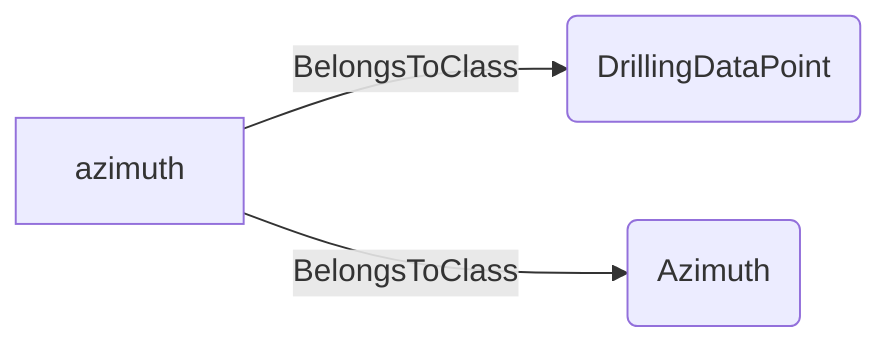
An example SparQL query looks like this:
```sparql
PREFIX rdf: <http://www.w3.org/1999/02/22-rdf-syntax-ns#>
PREFIX ddhub: <http://ddhub.no/>
PREFIX quantity: <http://ddhub.no/UnitAndQuantity>
SELECT ?azimuth
WHERE {
	?azimuth rdf:type ddhub:DrillingDataPoint .
	?azimuth rdf:type ddhub:Azimuth .
}
```
This example assigns a drilling data point to the Azimuth prototype.
## BitDepth <!-- NOUN -->
- Display name: BitDepth
- Parent class: [PrototypeData](./DrillingDataSemantics.md#PrototypeData)
- Description: 
Curvilinear abscissa of the bottom of the bit, in the reference frame centered in the wellbore.
- Definition set: SignalPrototypes
- Examples:
```dwis bitDepth
DrillingDataPoint:bitDepth
bitDepth BelongsToClass BitDepth
```
An example semantic graph looks like as follow:
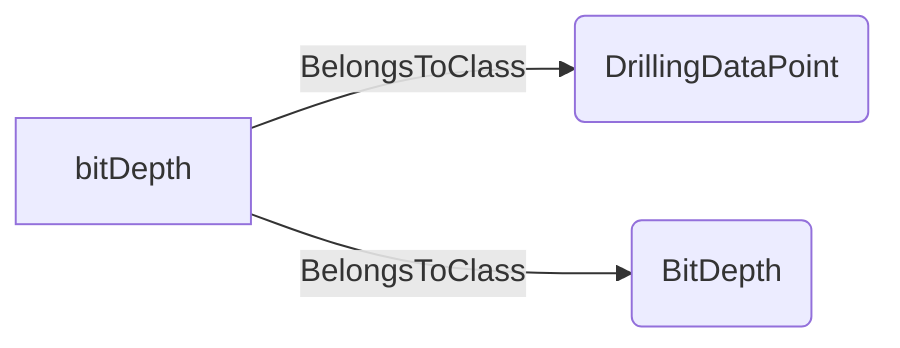
An example SparQL query looks like this:
```sparql
PREFIX rdf: <http://www.w3.org/1999/02/22-rdf-syntax-ns#>
PREFIX ddhub: <http://ddhub.no/>
PREFIX quantity: <http://ddhub.no/UnitAndQuantity>
SELECT ?bitDepth
WHERE {
	?bitDepth rdf:type ddhub:DrillingDataPoint .
	?bitDepth rdf:type ddhub:BitDepth .
}
```
This example assigns a drilling data point to the BitDepth prototype.
## DensityIn <!-- NOUN -->
- Display name: DensityIn
- Parent class: [PrototypeData](./DrillingDataSemantics.md#PrototypeData)
- Description: 
Prototype signal for DensityIn.
- Definition set: SignalPrototypes
- Examples:
```dwis densityIn
DrillingDataPoint:densityIn
densityIn BelongsToClass DensityIn
```
An example semantic graph looks like as follow:
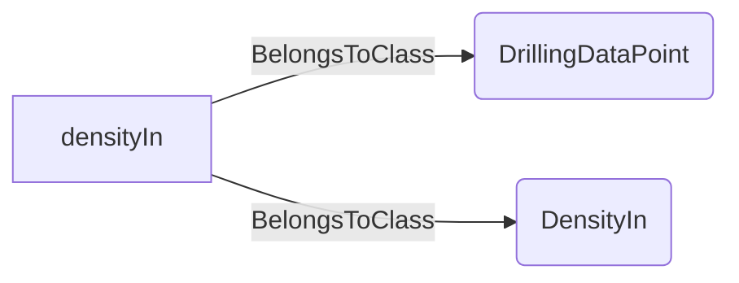
An example SparQL query looks like this:
```sparql
PREFIX rdf: <http://www.w3.org/1999/02/22-rdf-syntax-ns#>
PREFIX ddhub: <http://ddhub.no/>
PREFIX quantity: <http://ddhub.no/UnitAndQuantity>
SELECT ?densityIn
WHERE {
	?densityIn rdf:type ddhub:DrillingDataPoint .
	?densityIn rdf:type ddhub:DensityIn .
}
```
This example assigns a drilling data point to the DensityIn prototype.
## DensityOut <!-- NOUN -->
- Display name: DensityOut
- Parent class: [PrototypeData](./DrillingDataSemantics.md#PrototypeData)
- Description: 
Prototype signal for DensityOut.
- Definition set: SignalPrototypes
- Examples:
```dwis densityOut
DrillingDataPoint:densityOut
densityOut BelongsToClass DensityOut
```
An example semantic graph looks like as follow:
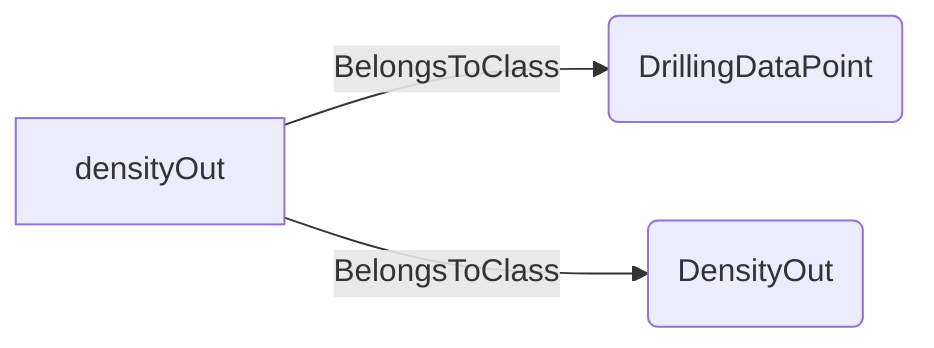
An example SparQL query looks like this:
```sparql
PREFIX rdf: <http://www.w3.org/1999/02/22-rdf-syntax-ns#>
PREFIX ddhub: <http://ddhub.no/>
PREFIX quantity: <http://ddhub.no/UnitAndQuantity>
SELECT ?densityOut
WHERE {
	?densityOut rdf:type ddhub:DrillingDataPoint .
	?densityOut rdf:type ddhub:DensityOut .
}
```
This example assigns a drilling data point to the DensityOut prototype.
## DownholeECD <!-- NOUN -->
- Display name: DownholeECD
- Parent class: [PrototypeData](./DrillingDataSemantics.md#PrototypeData)
- Description: 
Prototype signal for DownholeECD.
- Definition set: SignalPrototypes
- Examples:
```dwis downholeECD
DrillingDataPoint:downholeECD
downholeECD BelongsToClass DownholeECD
```
An example semantic graph looks like as follow:
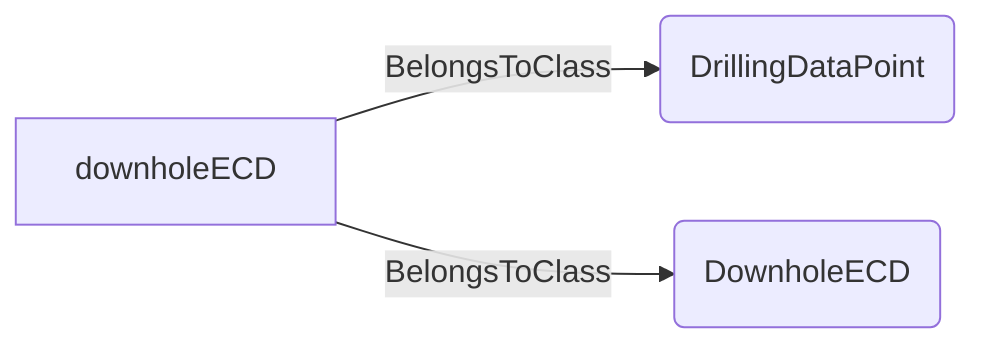
An example SparQL query looks like this:
```sparql
PREFIX rdf: <http://www.w3.org/1999/02/22-rdf-syntax-ns#>
PREFIX ddhub: <http://ddhub.no/>
PREFIX quantity: <http://ddhub.no/UnitAndQuantity>
SELECT ?downholeECD
WHERE {
	?downholeECD rdf:type ddhub:DrillingDataPoint .
	?downholeECD rdf:type ddhub:DownholeECD .
}
```
This example assigns a drilling data point to the DownholeECD prototype.
## DownholePressure <!-- NOUN -->
- Display name: DownholePressure
- Parent class: [PrototypeData](./DrillingDataSemantics.md#PrototypeData)
- Description: 
Prototype signal for DownholePressure.
- Definition set: SignalPrototypes
- Examples:
```dwis downholePressure
DrillingDataPoint:downholePressure
downholePressure BelongsToClass DownholePressure
```
An example semantic graph looks like as follow:
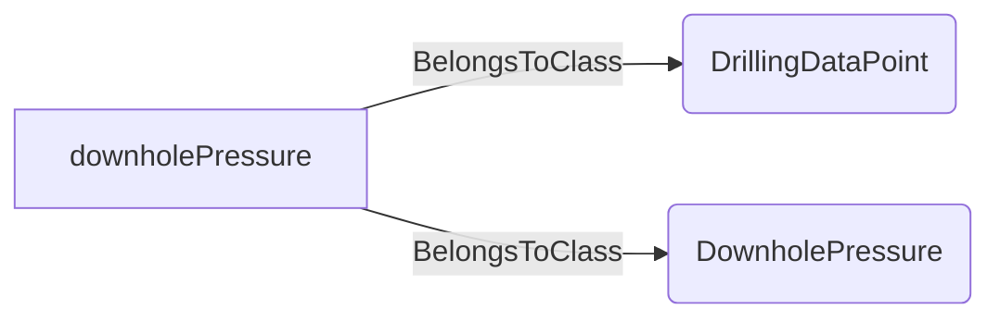
An example SparQL query looks like this:
```sparql
PREFIX rdf: <http://www.w3.org/1999/02/22-rdf-syntax-ns#>
PREFIX ddhub: <http://ddhub.no/>
PREFIX quantity: <http://ddhub.no/UnitAndQuantity>
SELECT ?downholePressure
WHERE {
	?downholePressure rdf:type ddhub:DrillingDataPoint .
	?downholePressure rdf:type ddhub:DownholePressure .
}
```
This example assigns a drilling data point to the DownholePressure prototype.
## DownholeRPM <!-- NOUN -->
- Display name: DownholeRPM
- Parent class: [PrototypeData](./DrillingDataSemantics.md#PrototypeData)
- Description: 
Prototype signal for DownholeRPM.
- Definition set: SignalPrototypes
- Examples:
```dwis downholeRPM
DrillingDataPoint:downholeRPM
downholeRPM BelongsToClass DownholeRPM
```
An example semantic graph looks like as follow:
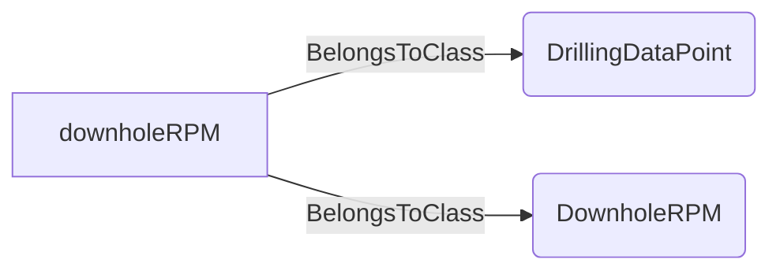
An example SparQL query looks like this:
```sparql
PREFIX rdf: <http://www.w3.org/1999/02/22-rdf-syntax-ns#>
PREFIX ddhub: <http://ddhub.no/>
PREFIX quantity: <http://ddhub.no/UnitAndQuantity>
SELECT ?downholeRPM
WHERE {
	?downholeRPM rdf:type ddhub:DrillingDataPoint .
	?downholeRPM rdf:type ddhub:DownholeRPM .
}
```
This example assigns a drilling data point to the DownholeRPM prototype.
## DownholeTemperature <!-- NOUN -->
- Display name: DownholeTemperature
- Parent class: [PrototypeData](./DrillingDataSemantics.md#PrototypeData)
- Description: 
Prototype signal for DownholeTemperature.
- Definition set: SignalPrototypes
- Examples:
```dwis downholeTemperature
DrillingDataPoint:downholeTemperature
downholeTemperature BelongsToClass DownholeTemperature
```
An example semantic graph looks like as follow:
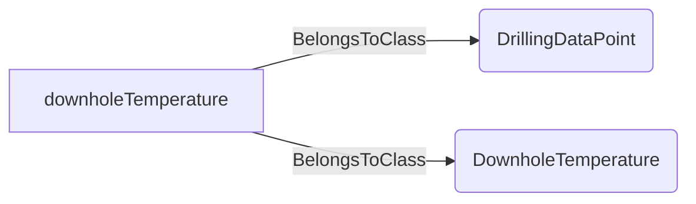
An example SparQL query looks like this:
```sparql
PREFIX rdf: <http://www.w3.org/1999/02/22-rdf-syntax-ns#>
PREFIX ddhub: <http://ddhub.no/>
PREFIX quantity: <http://ddhub.no/UnitAndQuantity>
SELECT ?downholeTemperature
WHERE {
	?downholeTemperature rdf:type ddhub:DrillingDataPoint .
	?downholeTemperature rdf:type ddhub:DownholeTemperature .
}
```
This example assigns a drilling data point to the DownholeTemperature prototype.
## DownholeTorque <!-- NOUN -->
- Display name: DownholeTorque
- Parent class: [PrototypeData](./DrillingDataSemantics.md#PrototypeData)
- Description: 
Prototype signal for DownholeTorque.
- Definition set: SignalPrototypes
- Examples:
```dwis downholeTorque
DrillingDataPoint:downholeTorque
downholeTorque BelongsToClass DownholeTorque
```
An example semantic graph looks like as follow:
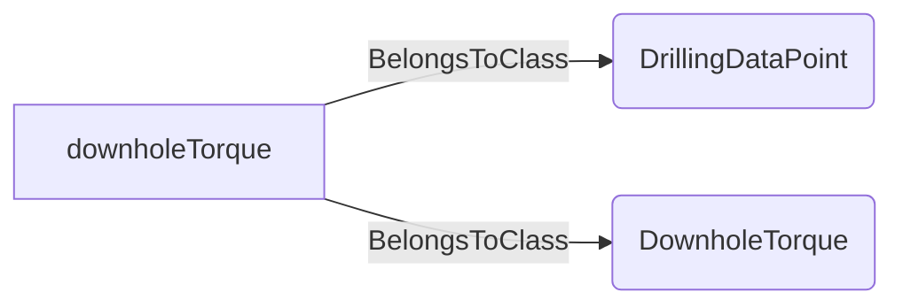
An example SparQL query looks like this:
```sparql
PREFIX rdf: <http://www.w3.org/1999/02/22-rdf-syntax-ns#>
PREFIX ddhub: <http://ddhub.no/>
PREFIX quantity: <http://ddhub.no/UnitAndQuantity>
SELECT ?downholeTorque
WHERE {
	?downholeTorque rdf:type ddhub:DrillingDataPoint .
	?downholeTorque rdf:type ddhub:DownholeTorque .
}
```
This example assigns a drilling data point to the DownholeTorque prototype.
## FlowRateIn <!-- NOUN -->
- Display name: FlowRateIn
- Parent class: [PrototypeData](./DrillingDataSemantics.md#PrototypeData)
- Description: 
Prototype signal for FlowRateIn.
- Definition set: SignalPrototypes
- Examples:
```dwis flowRateIn
DrillingDataPoint:flowRateIn
flowRateIn BelongsToClass FlowRateIn
```
An example semantic graph looks like as follow:
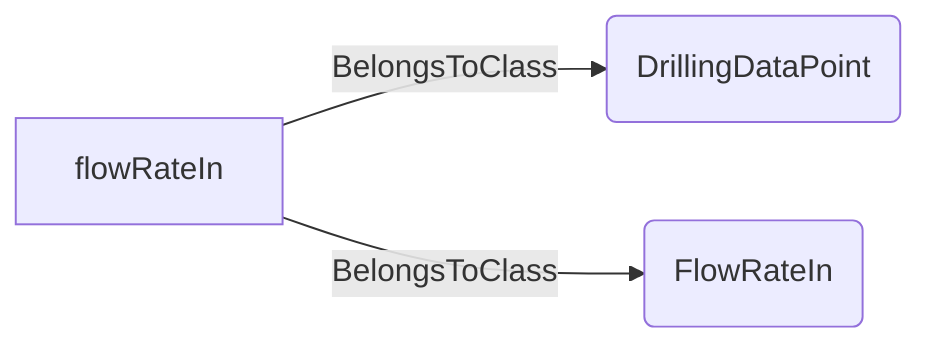
An example SparQL query looks like this:
```sparql
PREFIX rdf: <http://www.w3.org/1999/02/22-rdf-syntax-ns#>
PREFIX ddhub: <http://ddhub.no/>
PREFIX quantity: <http://ddhub.no/UnitAndQuantity>
SELECT ?flowRateIn
WHERE {
	?flowRateIn rdf:type ddhub:DrillingDataPoint .
	?flowRateIn rdf:type ddhub:FlowRateIn .
}
```
This example assigns a drilling data point to the FlowRateIn prototype.
## FlowRateOut <!-- NOUN -->
- Display name: FlowRateOut
- Parent class: [PrototypeData](./DrillingDataSemantics.md#PrototypeData)
- Description: 
Prototype signal for FlowRateOut.
- Definition set: SignalPrototypes
- Examples:
```dwis flowRateOut
DrillingDataPoint:flowRateOut
flowRateOut BelongsToClass FlowRateOut
```
An example semantic graph looks like as follow:
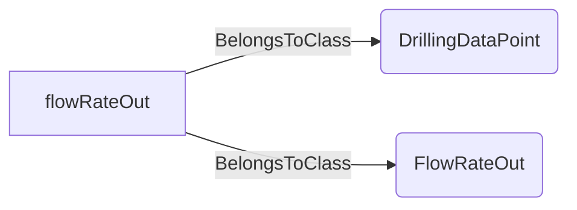
An example SparQL query looks like this:
```sparql
PREFIX rdf: <http://www.w3.org/1999/02/22-rdf-syntax-ns#>
PREFIX ddhub: <http://ddhub.no/>
PREFIX quantity: <http://ddhub.no/UnitAndQuantity>
SELECT ?flowRateOut
WHERE {
	?flowRateOut rdf:type ddhub:DrillingDataPoint .
	?flowRateOut rdf:type ddhub:FlowRateOut .
}
```
This example assigns a drilling data point to the FlowRateOut prototype.
## HoleDepth <!-- NOUN -->
- Display name: HoleDepth
- Parent class: [PrototypeData](./DrillingDataSemantics.md#PrototypeData)
- Description: 
Prototype signal for HoleDepth.
- Definition set: SignalPrototypes
- Examples:
```dwis holeDepth
DrillingDataPoint:holeDepth
holeDepth BelongsToClass HoleDepth
```
An example semantic graph looks like as follow:

An example SparQL query looks like this:
```sparql
PREFIX rdf: <http://www.w3.org/1999/02/22-rdf-syntax-ns#>
PREFIX ddhub: <http://ddhub.no/>
PREFIX quantity: <http://ddhub.no/UnitAndQuantity>
SELECT ?holeDepth
WHERE {
	?holeDepth rdf:type ddhub:DrillingDataPoint .
	?holeDepth rdf:type ddhub:HoleDepth .
}
```
This example assigns a drilling data point to the HoleDepth prototype.
## HookLoad <!-- NOUN -->
- Display name: HookLoad
- Parent class: [PrototypeData](./DrillingDataSemantics.md#PrototypeData)
- Description: 
Prototype signal for HookLoad.
- Definition set: SignalPrototypes
- Examples:
```dwis hookLoad
DrillingDataPoint:hookLoad
hookLoad BelongsToClass HookLoad
```
An example semantic graph looks like as follow:
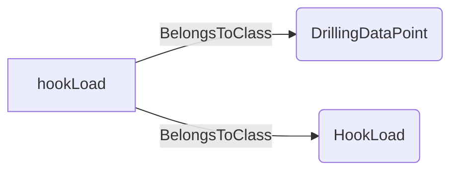
An example SparQL query looks like this:
```sparql
PREFIX rdf: <http://www.w3.org/1999/02/22-rdf-syntax-ns#>
PREFIX ddhub: <http://ddhub.no/>
PREFIX quantity: <http://ddhub.no/UnitAndQuantity>
SELECT ?hookLoad
WHERE {
	?hookLoad rdf:type ddhub:DrillingDataPoint .
	?hookLoad rdf:type ddhub:HookLoad .
}
```
This example assigns a drilling data point to the HookLoad prototype.
## HookPosition <!-- NOUN -->
- Display name: HookPosition
- Parent class: [PrototypeData](./DrillingDataSemantics.md#PrototypeData)
- Description: 
Prototype signal for HookPosition.
- Definition set: SignalPrototypes
- Examples:
```dwis hookPosition
DrillingDataPoint:hookPosition
hookPosition BelongsToClass HookPosition
```
An example semantic graph looks like as follow:
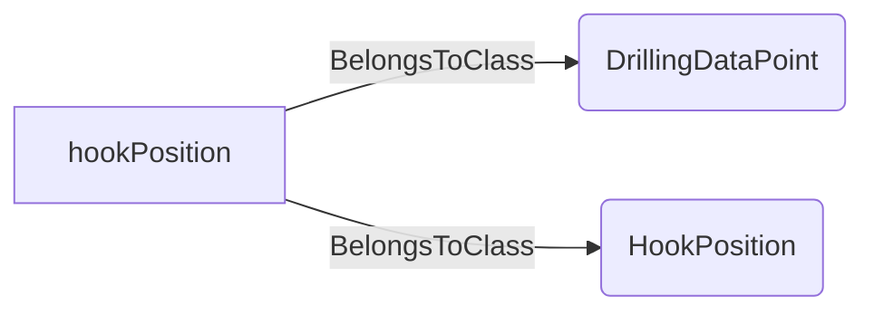
An example SparQL query looks like this:
```sparql
PREFIX rdf: <http://www.w3.org/1999/02/22-rdf-syntax-ns#>
PREFIX ddhub: <http://ddhub.no/>
PREFIX quantity: <http://ddhub.no/UnitAndQuantity>
SELECT ?hookPosition
WHERE {
	?hookPosition rdf:type ddhub:DrillingDataPoint .
	?hookPosition rdf:type ddhub:HookPosition .
}
```
This example assigns a drilling data point to the HookPosition prototype.
## HookVelocity <!-- NOUN -->
- Display name: HookVelocity
- Parent class: [PrototypeData](./DrillingDataSemantics.md#PrototypeData)
- Description: 
Prototype signal for HookVelocity.
- Definition set: SignalPrototypes
- Examples:
```dwis hookVelocity
DrillingDataPoint:hookVelocity
hookVelocity BelongsToClass HookVelocity
```
An example semantic graph looks like as follow:
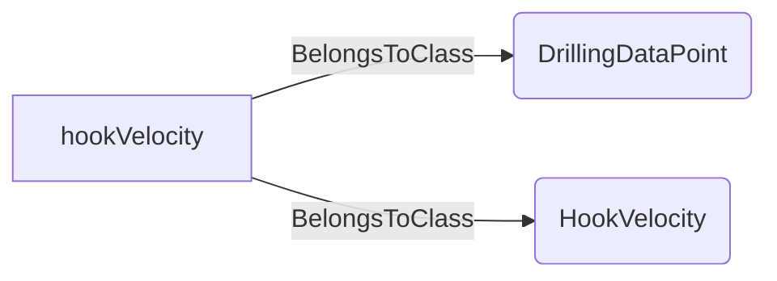
An example SparQL query looks like this:
```sparql
PREFIX rdf: <http://www.w3.org/1999/02/22-rdf-syntax-ns#>
PREFIX ddhub: <http://ddhub.no/>
PREFIX quantity: <http://ddhub.no/UnitAndQuantity>
SELECT ?hookVelocity
WHERE {
	?hookVelocity rdf:type ddhub:DrillingDataPoint .
	?hookVelocity rdf:type ddhub:HookVelocity .
}
```
This example assigns a drilling data point to the HookVelocity prototype.
## Inclination <!-- NOUN -->
- Display name: Inclination
- Parent class: [PrototypeData](./DrillingDataSemantics.md#PrototypeData)
- Description: 
Prototype signal for Inclination.
- Definition set: SignalPrototypes
- Examples:
```dwis inclination
DrillingDataPoint:inclination
inclination BelongsToClass Inclination
```
An example semantic graph looks like as follow:

An example SparQL query looks like this:
```sparql
PREFIX rdf: <http://www.w3.org/1999/02/22-rdf-syntax-ns#>
PREFIX ddhub: <http://ddhub.no/>
PREFIX quantity: <http://ddhub.no/UnitAndQuantity>
SELECT ?inclination
WHERE {
	?inclination rdf:type ddhub:DrillingDataPoint .
	?inclination rdf:type ddhub:Inclination .
}
```
This example assigns a drilling data point to the Inclination prototype.
## MeasuredDepth <!-- NOUN -->
- Display name: MeasuredDepth
- Parent class: [PrototypeData](./DrillingDataSemantics.md#PrototypeData)
- Description: 
Prototype signal for MeasuredDepth.
- Definition set: SignalPrototypes
- Examples:
```dwis measuredDepth
DrillingDataPoint:measuredDepth
measuredDepth BelongsToClass MeasuredDepth
```
An example semantic graph looks like as follow:
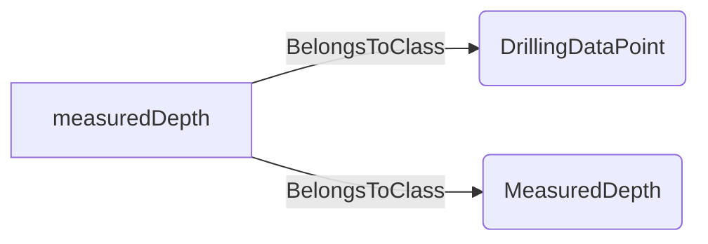
An example SparQL query looks like this:
```sparql
PREFIX rdf: <http://www.w3.org/1999/02/22-rdf-syntax-ns#>
PREFIX ddhub: <http://ddhub.no/>
PREFIX quantity: <http://ddhub.no/UnitAndQuantity>
SELECT ?measuredDepth
WHERE {
	?measuredDepth rdf:type ddhub:DrillingDataPoint .
	?measuredDepth rdf:type ddhub:MeasuredDepth .
}
```
This example assigns a drilling data point to the MeasuredDepth prototype.
## PumpRate <!-- NOUN -->
- Display name: PumpRate
- Parent class: [PrototypeData](./DrillingDataSemantics.md#PrototypeData)
- Description: 
Prototype signal for PumpRate.
- Definition set: SignalPrototypes
- Examples:
```dwis pumpRate
DrillingDataPoint:pumpRate
pumpRate BelongsToClass PumpRate
```
An example semantic graph looks like as follow:
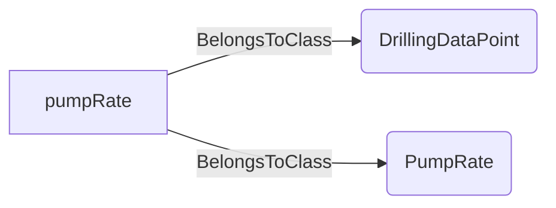
An example SparQL query looks like this:
```sparql
PREFIX rdf: <http://www.w3.org/1999/02/22-rdf-syntax-ns#>
PREFIX ddhub: <http://ddhub.no/>
PREFIX quantity: <http://ddhub.no/UnitAndQuantity>
SELECT ?pumpRate
WHERE {
	?pumpRate rdf:type ddhub:DrillingDataPoint .
	?pumpRate rdf:type ddhub:PumpRate .
}
```
This example assigns a drilling data point to the PumpRate prototype.
## ROP <!-- NOUN -->
- Display name: ROP
- Parent class: [PrototypeData](./DrillingDataSemantics.md#PrototypeData)
- Description: 
Prototype signal for ROP.
- Definition set: SignalPrototypes
- Examples:
```dwis rOP
DrillingDataPoint:rOP
rOP BelongsToClass ROP
```
An example semantic graph looks like as follow:
```mermaid
graph LR
	N0000[rOP] -->|BelongsToClass| N0001(DrillingDataPoint) 
	N0000[rOP] -->|BelongsToClass| N0002(ROP) 
```
An example SparQL query looks like this:
```sparql
PREFIX rdf: <http://www.w3.org/1999/02/22-rdf-syntax-ns#>
PREFIX ddhub: <http://ddhub.no/>
PREFIX quantity: <http://ddhub.no/UnitAndQuantity>
SELECT ?rOP
WHERE {
	?rOP rdf:type ddhub:DrillingDataPoint .
	?rOP rdf:type ddhub:ROP .
}
```
This example assigns a drilling data point to the ROP prototype.
## SPP <!-- NOUN -->
- Display name: SPP
- Parent class: [PrototypeData](./DrillingDataSemantics.md#PrototypeData)
- Description: 
Prototype signal for SPP.
- Definition set: SignalPrototypes
- Examples:
```dwis sPP
DrillingDataPoint:sPP
sPP BelongsToClass SPP
```
An example semantic graph looks like as follow:
```mermaid
graph LR
	N0000[sPP] -->|BelongsToClass| N0001(DrillingDataPoint) 
	N0000[sPP] -->|BelongsToClass| N0002(SPP) 
```
An example SparQL query looks like this:
```sparql
PREFIX rdf: <http://www.w3.org/1999/02/22-rdf-syntax-ns#>
PREFIX ddhub: <http://ddhub.no/>
PREFIX quantity: <http://ddhub.no/UnitAndQuantity>
SELECT ?sPP
WHERE {
	?sPP rdf:type ddhub:DrillingDataPoint .
	?sPP rdf:type ddhub:SPP .
}
```
This example assigns a drilling data point to the SPP prototype.
## SurfaceRPM <!-- NOUN -->
- Display name: SurfaceRPM
- Parent class: [PrototypeData](./DrillingDataSemantics.md#PrototypeData)
- Description: 
Prototype signal for SurfaceRPM.
- Definition set: SignalPrototypes
- Examples:
```dwis surfaceRPM
DrillingDataPoint:surfaceRPM
surfaceRPM BelongsToClass SurfaceRPM
```
An example semantic graph looks like as follow:
```mermaid
graph LR
	N0000[surfaceRPM] -->|BelongsToClass| N0001(DrillingDataPoint) 
	N0000[surfaceRPM] -->|BelongsToClass| N0002(SurfaceRPM) 
```
An example SparQL query looks like this:
```sparql
PREFIX rdf: <http://www.w3.org/1999/02/22-rdf-syntax-ns#>
PREFIX ddhub: <http://ddhub.no/>
PREFIX quantity: <http://ddhub.no/UnitAndQuantity>
SELECT ?surfaceRPM
WHERE {
	?surfaceRPM rdf:type ddhub:DrillingDataPoint .
	?surfaceRPM rdf:type ddhub:SurfaceRPM .
}
```
This example assigns a drilling data point to the SurfaceRPM prototype.
## SurfaceTorque <!-- NOUN -->
- Display name: SurfaceTorque
- Parent class: [PrototypeData](./DrillingDataSemantics.md#PrototypeData)
- Description: 
Prototype signal for SurfaceTorque.
- Definition set: SignalPrototypes
- Examples:
```dwis surfaceTorque
DrillingDataPoint:surfaceTorque
surfaceTorque BelongsToClass SurfaceTorque
```
An example semantic graph looks like as follow:
```mermaid
graph LR
	N0000[surfaceTorque] -->|BelongsToClass| N0001(DrillingDataPoint) 
	N0000[surfaceTorque] -->|BelongsToClass| N0002(SurfaceTorque) 
```
An example SparQL query looks like this:
```sparql
PREFIX rdf: <http://www.w3.org/1999/02/22-rdf-syntax-ns#>
PREFIX ddhub: <http://ddhub.no/>
PREFIX quantity: <http://ddhub.no/UnitAndQuantity>
SELECT ?surfaceTorque
WHERE {
	?surfaceTorque rdf:type ddhub:DrillingDataPoint .
	?surfaceTorque rdf:type ddhub:SurfaceTorque .
}
```
This example assigns a drilling data point to the SurfaceTorque prototype.
## TemperatureIn <!-- NOUN -->
- Display name: TemperatureIn
- Parent class: [PrototypeData](./DrillingDataSemantics.md#PrototypeData)
- Description: 
Prototype signal for TemperatureIn.
- Definition set: SignalPrototypes
- Examples:
```dwis temperatureIn
DrillingDataPoint:temperatureIn
temperatureIn BelongsToClass TemperatureIn
```
An example semantic graph looks like as follow:
```mermaid
graph LR
	N0000[temperatureIn] -->|BelongsToClass| N0001(DrillingDataPoint) 
	N0000[temperatureIn] -->|BelongsToClass| N0002(TemperatureIn) 
```
An example SparQL query looks like this:
```sparql
PREFIX rdf: <http://www.w3.org/1999/02/22-rdf-syntax-ns#>
PREFIX ddhub: <http://ddhub.no/>
PREFIX quantity: <http://ddhub.no/UnitAndQuantity>
SELECT ?temperatureIn
WHERE {
	?temperatureIn rdf:type ddhub:DrillingDataPoint .
	?temperatureIn rdf:type ddhub:TemperatureIn .
}
```
This example assigns a drilling data point to the TemperatureIn prototype.
## TemperatureOut <!-- NOUN -->
- Display name: TemperatureOut
- Parent class: [PrototypeData](./DrillingDataSemantics.md#PrototypeData)
- Description: 
Prototype signal for TemperatureOut.
- Definition set: SignalPrototypes
- Examples:
```dwis temperatureOut
DrillingDataPoint:temperatureOut
temperatureOut BelongsToClass TemperatureOut
```
An example semantic graph looks like as follow:
```mermaid
graph LR
	N0000[temperatureOut] -->|BelongsToClass| N0001(DrillingDataPoint) 
	N0000[temperatureOut] -->|BelongsToClass| N0002(TemperatureOut) 
```
An example SparQL query looks like this:
```sparql
PREFIX rdf: <http://www.w3.org/1999/02/22-rdf-syntax-ns#>
PREFIX ddhub: <http://ddhub.no/>
PREFIX quantity: <http://ddhub.no/UnitAndQuantity>
SELECT ?temperatureOut
WHERE {
	?temperatureOut rdf:type ddhub:DrillingDataPoint .
	?temperatureOut rdf:type ddhub:TemperatureOut .
}
```
This example assigns a drilling data point to the TemperatureOut prototype.
## TopOfStringPosition <!-- NOUN -->
- Display name: TopOfStringPosition
- Parent class: [PrototypeData](./DrillingDataSemantics.md#PrototypeData)
- Description: 
Prototype signal for TopOfStringPosition.
- Definition set: SignalPrototypes
- Examples:
```dwis topOfStringPosition
DrillingDataPoint:topOfStringPosition
topOfStringPosition BelongsToClass TopOfStringPosition
```
An example semantic graph looks like as follow:
```mermaid
graph LR
	N0000[topOfStringPosition] -->|BelongsToClass| N0001(DrillingDataPoint) 
	N0000[topOfStringPosition] -->|BelongsToClass| N0002(TopOfStringPosition) 
```
An example SparQL query looks like this:
```sparql
PREFIX rdf: <http://www.w3.org/1999/02/22-rdf-syntax-ns#>
PREFIX ddhub: <http://ddhub.no/>
PREFIX quantity: <http://ddhub.no/UnitAndQuantity>
SELECT ?topOfStringPosition
WHERE {
	?topOfStringPosition rdf:type ddhub:DrillingDataPoint .
	?topOfStringPosition rdf:type ddhub:TopOfStringPosition .
}
```
This example assigns a drilling data point to the TopOfStringPosition prototype.
## WOB <!-- NOUN -->
- Display name: WOB
- Parent class: [PrototypeData](./DrillingDataSemantics.md#PrototypeData)
- Description: 
Prototype signal for WOB.
- Definition set: SignalPrototypes
- Examples:
```dwis wOB
DrillingDataPoint:wOB
wOB BelongsToClass WOB
```
An example semantic graph looks like as follow:
```mermaid
graph LR
	N0000[wOB] -->|BelongsToClass| N0001(DrillingDataPoint) 
	N0000[wOB] -->|BelongsToClass| N0002(WOB) 
```
An example SparQL query looks like this:
```sparql
PREFIX rdf: <http://www.w3.org/1999/02/22-rdf-syntax-ns#>
PREFIX ddhub: <http://ddhub.no/>
PREFIX quantity: <http://ddhub.no/UnitAndQuantity>
SELECT ?wOB
WHERE {
	?wOB rdf:type ddhub:DrillingDataPoint .
	?wOB rdf:type ddhub:WOB .
}
```
This example assigns a drilling data point to the WOB prototype.
## PorePressure <!-- NOUN -->
- Display name: PorePressure
- Parent class: [PrototypeData](./DrillingDataSemantics.md#PrototypeData)
- Description: 
Prototype signal for PorePressure.
- Definition set: SignalPrototypes
- Examples:
```dwis porePressure
DrillingDataPoint:porePressure
porePressure BelongsToClass PorePressure
```
An example semantic graph looks like as follow:
```mermaid
graph LR
	N0000[porePressure] -->|BelongsToClass| N0001(DrillingDataPoint) 
	N0000[porePressure] -->|BelongsToClass| N0002(PorePressure) 
```
An example SparQL query looks like this:
```sparql
PREFIX rdf: <http://www.w3.org/1999/02/22-rdf-syntax-ns#>
PREFIX ddhub: <http://ddhub.no/>
PREFIX quantity: <http://ddhub.no/UnitAndQuantity>
SELECT ?porePressure
WHERE {
	?porePressure rdf:type ddhub:DrillingDataPoint .
	?porePressure rdf:type ddhub:PorePressure .
}
```
This example assigns a drilling data point to the PorePressure prototype.
## PorePressureGradient <!-- NOUN -->
- Display name: PorePressureGradient
- Parent class: [PrototypeData](./DrillingDataSemantics.md#PrototypeData)
- Description: 
Prototype signal for PorePressureGradient.
- Definition set: SignalPrototypes
- Examples:
```dwis porePressureGradient
DrillingDataPoint:porePressureGradient
porePressureGradient BelongsToClass PorePressureGradient
```
An example semantic graph looks like as follow:
```mermaid
graph LR
	N0000[porePressureGradient] -->|BelongsToClass| N0001(DrillingDataPoint) 
	N0000[porePressureGradient] -->|BelongsToClass| N0002(PorePressureGradient) 
```
An example SparQL query looks like this:
```sparql
PREFIX rdf: <http://www.w3.org/1999/02/22-rdf-syntax-ns#>
PREFIX ddhub: <http://ddhub.no/>
PREFIX quantity: <http://ddhub.no/UnitAndQuantity>
SELECT ?porePressureGradient
WHERE {
	?porePressureGradient rdf:type ddhub:DrillingDataPoint .
	?porePressureGradient rdf:type ddhub:PorePressureGradient .
}
```
This example assigns a drilling data point to the PorePressureGradient prototype.
## FracturingPressure <!-- NOUN -->
- Display name: FracturingPressure
- Parent class: [PrototypeData](./DrillingDataSemantics.md#PrototypeData)
- Description: 
Prototype signal for FracturingPressure.
- Definition set: SignalPrototypes
- Examples:
```dwis fracturingPressure
DrillingDataPoint:fracturingPressure
fracturingPressure BelongsToClass FracturingPressure
```
An example semantic graph looks like as follow:
```mermaid
graph LR
	N0000[fracturingPressure] -->|BelongsToClass| N0001(DrillingDataPoint) 
	N0000[fracturingPressure] -->|BelongsToClass| N0002(FracturingPressure) 
```
An example SparQL query looks like this:
```sparql
PREFIX rdf: <http://www.w3.org/1999/02/22-rdf-syntax-ns#>
PREFIX ddhub: <http://ddhub.no/>
PREFIX quantity: <http://ddhub.no/UnitAndQuantity>
SELECT ?fracturingPressure
WHERE {
	?fracturingPressure rdf:type ddhub:DrillingDataPoint .
	?fracturingPressure rdf:type ddhub:FracturingPressure .
}
```
This example assigns a drilling data point to the FracturingPressure prototype.
## FracturingPressureGradient <!-- NOUN -->
- Display name: FracturingPressureGradient
- Parent class: [PrototypeData](./DrillingDataSemantics.md#PrototypeData)
- Description: 
Prototype signal for FracturingPressureGradient.
- Definition set: SignalPrototypes
- Examples:
```dwis fracturingPressureGradient
DrillingDataPoint:fracturingPressureGradient
fracturingPressureGradient BelongsToClass FracturingPressureGradient
```
An example semantic graph looks like as follow:
```mermaid
graph LR
	N0000[fracturingPressureGradient] -->|BelongsToClass| N0001(DrillingDataPoint) 
	N0000[fracturingPressureGradient] -->|BelongsToClass| N0002(FracturingPressureGradient) 
```
An example SparQL query looks like this:
```sparql
PREFIX rdf: <http://www.w3.org/1999/02/22-rdf-syntax-ns#>
PREFIX ddhub: <http://ddhub.no/>
PREFIX quantity: <http://ddhub.no/UnitAndQuantity>
SELECT ?fracturingPressureGradient
WHERE {
	?fracturingPressureGradient rdf:type ddhub:DrillingDataPoint .
	?fracturingPressureGradient rdf:type ddhub:FracturingPressureGradient .
}
```
This example assigns a drilling data point to the FracturingPressureGradient prototype.
## CollapsePressure <!-- NOUN -->
- Display name: CollapsePressure
- Parent class: [PrototypeData](./DrillingDataSemantics.md#PrototypeData)
- Description: 
Prototype signal for CollapsePressure.
- Definition set: SignalPrototypes
- Examples:
```dwis collapsePressure
DrillingDataPoint:collapsePressure
collapsePressure BelongsToClass CollapsePressure
```
An example semantic graph looks like as follow:
```mermaid
graph LR
	N0000[collapsePressure] -->|BelongsToClass| N0001(DrillingDataPoint) 
	N0000[collapsePressure] -->|BelongsToClass| N0002(CollapsePressure) 
```
An example SparQL query looks like this:
```sparql
PREFIX rdf: <http://www.w3.org/1999/02/22-rdf-syntax-ns#>
PREFIX ddhub: <http://ddhub.no/>
PREFIX quantity: <http://ddhub.no/UnitAndQuantity>
SELECT ?collapsePressure
WHERE {
	?collapsePressure rdf:type ddhub:DrillingDataPoint .
	?collapsePressure rdf:type ddhub:CollapsePressure .
}
```
This example assigns a drilling data point to the CollapsePressure prototype.
## CollapsePressureGradient <!-- NOUN -->
- Display name: CollapsePressureGradient
- Parent class: [PrototypeData](./DrillingDataSemantics.md#PrototypeData)
- Description: 
Prototype signal for CollapsePressureGradient.
- Definition set: SignalPrototypes
- Examples:
```dwis collapsePressureGradient
DrillingDataPoint:collapsePressureGradient
collapsePressureGradient BelongsToClass CollapsePressureGradient
```
An example semantic graph looks like as follow:
```mermaid
graph LR
	N0000[collapsePressureGradient] -->|BelongsToClass| N0001(DrillingDataPoint) 
	N0000[collapsePressureGradient] -->|BelongsToClass| N0002(CollapsePressureGradient) 
```
An example SparQL query looks like this:
```sparql
PREFIX rdf: <http://www.w3.org/1999/02/22-rdf-syntax-ns#>
PREFIX ddhub: <http://ddhub.no/>
PREFIX quantity: <http://ddhub.no/UnitAndQuantity>
SELECT ?collapsePressureGradient
WHERE {
	?collapsePressureGradient rdf:type ddhub:DrillingDataPoint .
	?collapsePressureGradient rdf:type ddhub:CollapsePressureGradient .
}
```
This example assigns a drilling data point to the CollapsePressureGradient prototype.
## ShearRate <!-- NOUN -->
- Display name: Shear rate
- Parent class: [PrototypeData](./DrillingDataSemantics.md#PrototypeData)
- Description: 
Prototype signal for Shear rate.
- Definition set: SignalPrototypes
- Examples:
```dwis shearRate
DrillingDataPoint:shearRate
shearRate BelongsToClass ShearRate
```
An example semantic graph looks like as follow:
```mermaid
graph LR
	N0000[shearRate] -->|BelongsToClass| N0001(DrillingDataPoint) 
	N0000[shearRate] -->|BelongsToClass| N0002(ShearRate) 
```
An example SparQL query looks like this:
```sparql
PREFIX rdf: <http://www.w3.org/1999/02/22-rdf-syntax-ns#>
PREFIX ddhub: <http://ddhub.no/>
PREFIX quantity: <http://ddhub.no/UnitAndQuantity>
SELECT ?shearRate
WHERE {
	?shearRate rdf:type ddhub:DrillingDataPoint .
	?shearRate rdf:type ddhub:ShearRate .
}
```
This example assigns a drilling data point to the Shear rate prototype.
## ShearStress <!-- NOUN -->
- Display name: Shear stress
- Parent class: [PrototypeData](./DrillingDataSemantics.md#PrototypeData)
- Description: 
Prototype signal for Shear stress.
- Definition set: SignalPrototypes
- Examples:
```dwis shearStress
DrillingDataPoint:shearStress
shearStress BelongsToClass ShearStress
```
An example semantic graph looks like as follow:
```mermaid
graph LR
	N0000[shearStress] -->|BelongsToClass| N0001(DrillingDataPoint) 
	N0000[shearStress] -->|BelongsToClass| N0002(ShearStress) 
```
An example SparQL query looks like this:
```sparql
PREFIX rdf: <http://www.w3.org/1999/02/22-rdf-syntax-ns#>
PREFIX ddhub: <http://ddhub.no/>
PREFIX quantity: <http://ddhub.no/UnitAndQuantity>
SELECT ?shearStress
WHERE {
	?shearStress rdf:type ddhub:DrillingDataPoint .
	?shearStress rdf:type ddhub:ShearStress .
}
```
This example assigns a drilling data point to the Shear stress prototype.
## MinimumHorizontalStress <!-- NOUN -->
- Display name: MinimumHorizontalStress
- Parent class: [PrototypeData](./DrillingDataSemantics.md#PrototypeData)
- Description: 
Prototype signal for MinimumHorizontalStress.
- Definition set: SignalPrototypes
- Examples:
```dwis minimumHorizontalStress
DrillingDataPoint:minimumHorizontalStress
minimumHorizontalStress BelongsToClass MinimumHorizontalStress
```
An example semantic graph looks like as follow:
```mermaid
graph LR
	N0000[minimumHorizontalStress] -->|BelongsToClass| N0001(DrillingDataPoint) 
	N0000[minimumHorizontalStress] -->|BelongsToClass| N0002(MinimumHorizontalStress) 
```
An example SparQL query looks like this:
```sparql
PREFIX rdf: <http://www.w3.org/1999/02/22-rdf-syntax-ns#>
PREFIX ddhub: <http://ddhub.no/>
PREFIX quantity: <http://ddhub.no/UnitAndQuantity>
SELECT ?minimumHorizontalStress
WHERE {
	?minimumHorizontalStress rdf:type ddhub:DrillingDataPoint .
	?minimumHorizontalStress rdf:type ddhub:MinimumHorizontalStress .
}
```
This example assigns a drilling data point to the MinimumHorizontalStress prototype.
## MinimumHorizontalStressGradient <!-- NOUN -->
- Display name: MinimumHorizontalStressGradient
- Parent class: [PrototypeData](./DrillingDataSemantics.md#PrototypeData)
- Description: 
Prototype signal for MinimumHorizontalStressGradient.
- Definition set: SignalPrototypes
- Examples:
```dwis minimumHorizontalStressGradient
DrillingDataPoint:minimumHorizontalStressGradient
minimumHorizontalStressGradient BelongsToClass MinimumHorizontalStressGradient
```
An example semantic graph looks like as follow:
```mermaid
graph LR
	N0000[minimumHorizontalStressGradient] -->|BelongsToClass| N0001(DrillingDataPoint) 
	N0000[minimumHorizontalStressGradient] -->|BelongsToClass| N0002(MinimumHorizontalStressGradient) 
```
An example SparQL query looks like this:
```sparql
PREFIX rdf: <http://www.w3.org/1999/02/22-rdf-syntax-ns#>
PREFIX ddhub: <http://ddhub.no/>
PREFIX quantity: <http://ddhub.no/UnitAndQuantity>
SELECT ?minimumHorizontalStressGradient
WHERE {
	?minimumHorizontalStressGradient rdf:type ddhub:DrillingDataPoint .
	?minimumHorizontalStressGradient rdf:type ddhub:MinimumHorizontalStressGradient .
}
```
This example assigns a drilling data point to the MinimumHorizontalStressGradient prototype.
## OverburdenPressure <!-- NOUN -->
- Display name: OverburdenPressure
- Parent class: [PrototypeData](./DrillingDataSemantics.md#PrototypeData)
- Description: 
Prototype signal for OverburdenPressure.
- Definition set: SignalPrototypes
- Examples:
```dwis overburdenPressure
DrillingDataPoint:overburdenPressure
overburdenPressure BelongsToClass OverburdenPressure
```
An example semantic graph looks like as follow:
```mermaid
graph LR
	N0000[overburdenPressure] -->|BelongsToClass| N0001(DrillingDataPoint) 
	N0000[overburdenPressure] -->|BelongsToClass| N0002(OverburdenPressure) 
```
An example SparQL query looks like this:
```sparql
PREFIX rdf: <http://www.w3.org/1999/02/22-rdf-syntax-ns#>
PREFIX ddhub: <http://ddhub.no/>
PREFIX quantity: <http://ddhub.no/UnitAndQuantity>
SELECT ?overburdenPressure
WHERE {
	?overburdenPressure rdf:type ddhub:DrillingDataPoint .
	?overburdenPressure rdf:type ddhub:OverburdenPressure .
}
```
This example assigns a drilling data point to the OverburdenPressure prototype.
## OverburdenPressureGradient <!-- NOUN -->
- Display name: OverburdenPressureGradient
- Parent class: [PrototypeData](./DrillingDataSemantics.md#PrototypeData)
- Description: 
Prototype signal for OverburdenPressureGradient.
- Definition set: SignalPrototypes
- Examples:
```dwis overburdenPressureGradient
DrillingDataPoint:overburdenPressureGradient
overburdenPressureGradient BelongsToClass OverburdenPressureGradient
```
An example semantic graph looks like as follow:
```mermaid
graph LR
	N0000[overburdenPressureGradient] -->|BelongsToClass| N0001(DrillingDataPoint) 
	N0000[overburdenPressureGradient] -->|BelongsToClass| N0002(OverburdenPressureGradient) 
```
An example SparQL query looks like this:
```sparql
PREFIX rdf: <http://www.w3.org/1999/02/22-rdf-syntax-ns#>
PREFIX ddhub: <http://ddhub.no/>
PREFIX quantity: <http://ddhub.no/UnitAndQuantity>
SELECT ?overburdenPressureGradient
WHERE {
	?overburdenPressureGradient rdf:type ddhub:DrillingDataPoint .
	?overburdenPressureGradient rdf:type ddhub:OverburdenPressureGradient .
}
```
This example assigns a drilling data point to the OverburdenPressureGradient prototype.
## BOPOpening <!-- NOUN -->
- Display name: BOPOpening
- Parent class: [PrototypeData](./DrillingDataSemantics.md#PrototypeData)
- Description: 
Prototype signal for BOPOpening.
- Definition set: SignalPrototypes
- Examples:
```dwis bOPOpening
DrillingDataPoint:bOPOpening
bOPOpening BelongsToClass BOPOpening
```
An example semantic graph looks like as follow:
```mermaid
graph LR
	N0000[bOPOpening] -->|BelongsToClass| N0001(DrillingDataPoint) 
	N0000[bOPOpening] -->|BelongsToClass| N0002(BOPOpening) 
```
An example SparQL query looks like this:
```sparql
PREFIX rdf: <http://www.w3.org/1999/02/22-rdf-syntax-ns#>
PREFIX ddhub: <http://ddhub.no/>
PREFIX quantity: <http://ddhub.no/UnitAndQuantity>
SELECT ?bOPOpening
WHERE {
	?bOPOpening rdf:type ddhub:DrillingDataPoint .
	?bOPOpening rdf:type ddhub:BOPOpening .
}
```
This example assigns a drilling data point to the BOPOpening prototype.
## BOPPressure <!-- NOUN -->
- Display name: BOPPressure
- Parent class: [PrototypeData](./DrillingDataSemantics.md#PrototypeData)
- Description: 
Prototype signal for BOPPressure.
- Definition set: SignalPrototypes
- Examples:
```dwis bOPPressure
DrillingDataPoint:bOPPressure
bOPPressure BelongsToClass BOPPressure
```
An example semantic graph looks like as follow:
```mermaid
graph LR
	N0000[bOPPressure] -->|BelongsToClass| N0001(DrillingDataPoint) 
	N0000[bOPPressure] -->|BelongsToClass| N0002(BOPPressure) 
```
An example SparQL query looks like this:
```sparql
PREFIX rdf: <http://www.w3.org/1999/02/22-rdf-syntax-ns#>
PREFIX ddhub: <http://ddhub.no/>
PREFIX quantity: <http://ddhub.no/UnitAndQuantity>
SELECT ?bOPPressure
WHERE {
	?bOPPressure rdf:type ddhub:DrillingDataPoint .
	?bOPPressure rdf:type ddhub:BOPPressure .
}
```
This example assigns a drilling data point to the BOPPressure prototype.
## MPDChokeOpening <!-- NOUN -->
- Display name: MPDChokeOpening
- Parent class: [PrototypeData](./DrillingDataSemantics.md#PrototypeData)
- Description: 
Prototype signal for MPDChokeOpening.
- Definition set: SignalPrototypes
- Examples:
```dwis mPDChokeOpening
DrillingDataPoint:mPDChokeOpening
mPDChokeOpening BelongsToClass MPDChokeOpening
```
An example semantic graph looks like as follow:
```mermaid
graph LR
	N0000[mPDChokeOpening] -->|BelongsToClass| N0001(DrillingDataPoint) 
	N0000[mPDChokeOpening] -->|BelongsToClass| N0002(MPDChokeOpening) 
```
An example SparQL query looks like this:
```sparql
PREFIX rdf: <http://www.w3.org/1999/02/22-rdf-syntax-ns#>
PREFIX ddhub: <http://ddhub.no/>
PREFIX quantity: <http://ddhub.no/UnitAndQuantity>
SELECT ?mPDChokeOpening
WHERE {
	?mPDChokeOpening rdf:type ddhub:DrillingDataPoint .
	?mPDChokeOpening rdf:type ddhub:MPDChokeOpening .
}
```
This example assigns a drilling data point to the MPDChokeOpening prototype.
## MPDChokePressure <!-- NOUN -->
- Display name: MPDChokePressure
- Parent class: [PrototypeData](./DrillingDataSemantics.md#PrototypeData)
- Description: 
Prototype signal for MPDChokePressure.
- Definition set: SignalPrototypes
- Examples:
```dwis mPDChokePressure
DrillingDataPoint:mPDChokePressure
mPDChokePressure BelongsToClass MPDChokePressure
```
An example semantic graph looks like as follow:
```mermaid
graph LR
	N0000[mPDChokePressure] -->|BelongsToClass| N0001(DrillingDataPoint) 
	N0000[mPDChokePressure] -->|BelongsToClass| N0002(MPDChokePressure) 
```
An example SparQL query looks like this:
```sparql
PREFIX rdf: <http://www.w3.org/1999/02/22-rdf-syntax-ns#>
PREFIX ddhub: <http://ddhub.no/>
PREFIX quantity: <http://ddhub.no/UnitAndQuantity>
SELECT ?mPDChokePressure
WHERE {
	?mPDChokePressure rdf:type ddhub:DrillingDataPoint .
	?mPDChokePressure rdf:type ddhub:MPDChokePressure .
}
```
This example assigns a drilling data point to the MPDChokePressure prototype.
## MPDPumpRate <!-- NOUN -->
- Display name: MPDPumpRate
- Parent class: [PrototypeData](./DrillingDataSemantics.md#PrototypeData)
- Description: 
Prototype signal for MPDPumpRate.
- Definition set: SignalPrototypes
- Examples:
```dwis mPDPumpRate
DrillingDataPoint:mPDPumpRate
mPDPumpRate BelongsToClass MPDPumpRate
```
An example semantic graph looks like as follow:
```mermaid
graph LR
	N0000[mPDPumpRate] -->|BelongsToClass| N0001(DrillingDataPoint) 
	N0000[mPDPumpRate] -->|BelongsToClass| N0002(MPDPumpRate) 
```
An example SparQL query looks like this:
```sparql
PREFIX rdf: <http://www.w3.org/1999/02/22-rdf-syntax-ns#>
PREFIX ddhub: <http://ddhub.no/>
PREFIX quantity: <http://ddhub.no/UnitAndQuantity>
SELECT ?mPDPumpRate
WHERE {
	?mPDPumpRate rdf:type ddhub:DrillingDataPoint .
	?mPDPumpRate rdf:type ddhub:MPDPumpRate .
}
```
This example assigns a drilling data point to the MPDPumpRate prototype.
## MPDPumpFlowRate <!-- NOUN -->
- Display name: MPDPumpFlowRate
- Parent class: [PrototypeData](./DrillingDataSemantics.md#PrototypeData)
- Description: 
Prototype signal for MPDPumpFlowRate.
- Definition set: SignalPrototypes
- Examples:
```dwis mPDPumpFlowRate
DrillingDataPoint:mPDPumpFlowRate
mPDPumpFlowRate BelongsToClass MPDPumpFlowRate
```
An example semantic graph looks like as follow:
```mermaid
graph LR
	N0000[mPDPumpFlowRate] -->|BelongsToClass| N0001(DrillingDataPoint) 
	N0000[mPDPumpFlowRate] -->|BelongsToClass| N0002(MPDPumpFlowRate) 
```
An example SparQL query looks like this:
```sparql
PREFIX rdf: <http://www.w3.org/1999/02/22-rdf-syntax-ns#>
PREFIX ddhub: <http://ddhub.no/>
PREFIX quantity: <http://ddhub.no/UnitAndQuantity>
SELECT ?mPDPumpFlowRate
WHERE {
	?mPDPumpFlowRate rdf:type ddhub:DrillingDataPoint .
	?mPDPumpFlowRate rdf:type ddhub:MPDPumpFlowRate .
}
```
This example assigns a drilling data point to the MPDPumpFlowRate prototype.
## GasFlowRate <!-- NOUN -->
- Display name: GasFlowRate
- Parent class: [PrototypeData](./DrillingDataSemantics.md#PrototypeData)
- Description: 
Prototype signal for GasFlowRate.
- Definition set: SignalPrototypes
- Examples:
```dwis gasFlowRate
DrillingDataPoint:gasFlowRate
gasFlowRate BelongsToClass GasFlowRate
```
An example semantic graph looks like as follow:
```mermaid
graph LR
	N0000[gasFlowRate] -->|BelongsToClass| N0001(DrillingDataPoint) 
	N0000[gasFlowRate] -->|BelongsToClass| N0002(GasFlowRate) 
```
An example SparQL query looks like this:
```sparql
PREFIX rdf: <http://www.w3.org/1999/02/22-rdf-syntax-ns#>
PREFIX ddhub: <http://ddhub.no/>
PREFIX quantity: <http://ddhub.no/UnitAndQuantity>
SELECT ?gasFlowRate
WHERE {
	?gasFlowRate rdf:type ddhub:DrillingDataPoint .
	?gasFlowRate rdf:type ddhub:GasFlowRate .
}
```
This example assigns a drilling data point to the GasFlowRate prototype.
## BackPressurePumpPressure <!-- NOUN -->
- Display name: BackPressurePumpPressure
- Parent class: [PrototypeData](./DrillingDataSemantics.md#PrototypeData)
- Description: 
Prototype signal for BackPressurePumpPressure.
- Definition set: SignalPrototypes
- Examples:
```dwis backPressurePumpPressure
DrillingDataPoint:backPressurePumpPressure
backPressurePumpPressure BelongsToClass BackPressurePumpPressure
```
An example semantic graph looks like as follow:
```mermaid
graph LR
	N0000[backPressurePumpPressure] -->|BelongsToClass| N0001(DrillingDataPoint) 
	N0000[backPressurePumpPressure] -->|BelongsToClass| N0002(BackPressurePumpPressure) 
```
An example SparQL query looks like this:
```sparql
PREFIX rdf: <http://www.w3.org/1999/02/22-rdf-syntax-ns#>
PREFIX ddhub: <http://ddhub.no/>
PREFIX quantity: <http://ddhub.no/UnitAndQuantity>
SELECT ?backPressurePumpPressure
WHERE {
	?backPressurePumpPressure rdf:type ddhub:DrillingDataPoint .
	?backPressurePumpPressure rdf:type ddhub:BackPressurePumpPressure .
}
```
This example assigns a drilling data point to the BackPressurePumpPressure prototype.
## MechanicalSpecificEnergy <!-- NOUN -->
- Display name: Mechanical Specific Energy
- Parent class: [PrototypeData](./DrillingDataSemantics.md#PrototypeData)
- Description: 
Prototype signal for Mechanical Specific Energy.
- Definition set: SignalPrototypes
- Examples:
```dwis mechanicalSpecificEnergy
DrillingDataPoint:mechanicalSpecificEnergy
mechanicalSpecificEnergy BelongsToClass MechanicalSpecificEnergy
```
An example semantic graph looks like as follow:
```mermaid
graph LR
	N0000[mechanicalSpecificEnergy] -->|BelongsToClass| N0001(DrillingDataPoint) 
	N0000[mechanicalSpecificEnergy] -->|BelongsToClass| N0002(MechanicalSpecificEnergy) 
```
An example SparQL query looks like this:
```sparql
PREFIX rdf: <http://www.w3.org/1999/02/22-rdf-syntax-ns#>
PREFIX ddhub: <http://ddhub.no/>
PREFIX quantity: <http://ddhub.no/UnitAndQuantity>
SELECT ?mechanicalSpecificEnergy
WHERE {
	?mechanicalSpecificEnergy rdf:type ddhub:DrillingDataPoint .
	?mechanicalSpecificEnergy rdf:type ddhub:MechanicalSpecificEnergy .
}
```
This example assigns a drilling data point to the Mechanical Specific Energy prototype.
## DownholeAxialAcceleration <!-- NOUN -->
- Display name: Downhole Axial Acceleration
- Parent class: [PrototypeData](./DrillingDataSemantics.md#PrototypeData)
- Description: 
Prototype signal for Downhole Axial Acceleration.
- Definition set: SignalPrototypes
- Examples:
```dwis downholeAxialAcceleration
DrillingDataPoint:downholeAxialAcceleration
downholeAxialAcceleration BelongsToClass DownholeAxialAcceleration
```
An example semantic graph looks like as follow:
```mermaid
graph LR
	N0000[downholeAxialAcceleration] -->|BelongsToClass| N0001(DrillingDataPoint) 
	N0000[downholeAxialAcceleration] -->|BelongsToClass| N0002(DownholeAxialAcceleration) 
```
An example SparQL query looks like this:
```sparql
PREFIX rdf: <http://www.w3.org/1999/02/22-rdf-syntax-ns#>
PREFIX ddhub: <http://ddhub.no/>
PREFIX quantity: <http://ddhub.no/UnitAndQuantity>
SELECT ?downholeAxialAcceleration
WHERE {
	?downholeAxialAcceleration rdf:type ddhub:DrillingDataPoint .
	?downholeAxialAcceleration rdf:type ddhub:DownholeAxialAcceleration .
}
```
This example assigns a drilling data point to the Downhole Axial Acceleration prototype.
## DownholeAngularAcceleration <!-- NOUN -->
- Display name: Downhole Angular Acceleration
- Parent class: [PrototypeData](./DrillingDataSemantics.md#PrototypeData)
- Description: 
Prototype signal for Downhole Angular Acceleration.
- Definition set: SignalPrototypes
- Examples:
```dwis downholeAngularAcceleration
DrillingDataPoint:downholeAngularAcceleration
downholeAngularAcceleration BelongsToClass DownholeAngularAcceleration
```
An example semantic graph looks like as follow:
```mermaid
graph LR
	N0000[downholeAngularAcceleration] -->|BelongsToClass| N0001(DrillingDataPoint) 
	N0000[downholeAngularAcceleration] -->|BelongsToClass| N0002(DownholeAngularAcceleration) 
```
An example SparQL query looks like this:
```sparql
PREFIX rdf: <http://www.w3.org/1999/02/22-rdf-syntax-ns#>
PREFIX ddhub: <http://ddhub.no/>
PREFIX quantity: <http://ddhub.no/UnitAndQuantity>
SELECT ?downholeAngularAcceleration
WHERE {
	?downholeAngularAcceleration rdf:type ddhub:DrillingDataPoint .
	?downholeAngularAcceleration rdf:type ddhub:DownholeAngularAcceleration .
}
```
This example assigns a drilling data point to the Downhole Angular Acceleration prototype.
## StickSlipSeverityIndex <!-- NOUN -->
- Display name: Stickslip Severity Index
- Parent class: [PrototypeData](./DrillingDataSemantics.md#PrototypeData)
- Description: 
Prototype signal for Stickslip Severity Index.
- Definition set: SignalPrototypes
- Examples:
```dwis stickSlipSeverityIndex
DrillingDataPoint:stickSlipSeverityIndex
stickSlipSeverityIndex BelongsToClass StickSlipSeverityIndex
```
An example semantic graph looks like as follow:
```mermaid
graph LR
	N0000[stickSlipSeverityIndex] -->|BelongsToClass| N0001(DrillingDataPoint) 
	N0000[stickSlipSeverityIndex] -->|BelongsToClass| N0002(StickSlipSeverityIndex) 
```
An example SparQL query looks like this:
```sparql
PREFIX rdf: <http://www.w3.org/1999/02/22-rdf-syntax-ns#>
PREFIX ddhub: <http://ddhub.no/>
PREFIX quantity: <http://ddhub.no/UnitAndQuantity>
SELECT ?stickSlipSeverityIndex
WHERE {
	?stickSlipSeverityIndex rdf:type ddhub:DrillingDataPoint .
	?stickSlipSeverityIndex rdf:type ddhub:StickSlipSeverityIndex .
}
```
This example assigns a drilling data point to the Stickslip Severity Index prototype.
## FrictionCoefficient <!-- NOUN -->
- Display name: Friction coefficient
- Parent class: [PrototypeData](./DrillingDataSemantics.md#PrototypeData)
- Description: 
Prototype signal for Friction coefficient.
- Definition set: SignalPrototypes
- Examples:
```dwis frictionCoefficient
DrillingDataPoint:frictionCoefficient
frictionCoefficient BelongsToClass FrictionCoefficient
```
An example semantic graph looks like as follow:
```mermaid
graph LR
	N0000[frictionCoefficient] -->|BelongsToClass| N0001(DrillingDataPoint) 
	N0000[frictionCoefficient] -->|BelongsToClass| N0002(FrictionCoefficient) 
```
An example SparQL query looks like this:
```sparql
PREFIX rdf: <http://www.w3.org/1999/02/22-rdf-syntax-ns#>
PREFIX ddhub: <http://ddhub.no/>
PREFIX quantity: <http://ddhub.no/UnitAndQuantity>
SELECT ?frictionCoefficient
WHERE {
	?frictionCoefficient rdf:type ddhub:DrillingDataPoint .
	?frictionCoefficient rdf:type ddhub:FrictionCoefficient .
}
```
This example assigns a drilling data point to the Friction coefficient prototype.
## MechanicalFrictionCoefficient <!-- NOUN -->
- Display name: Mechanical Friction coefficient
- Parent class: [FrictionCoefficient](./SignalPrototypes.md#FrictionCoefficient)
- Description: 
Prototype signal for Mechanical Friction coefficient.
- Definition set: SignalPrototypes
- Examples:
```dwis mechanicalFrictionCoefficient
DrillingDataPoint:mechanicalFrictionCoefficient
mechanicalFrictionCoefficient BelongsToClass MechanicalFrictionCoefficient
```
An example semantic graph looks like as follow:
```mermaid
graph LR
	N0000[mechanicalFrictionCoefficient] -->|BelongsToClass| N0001(DrillingDataPoint) 
	N0000[mechanicalFrictionCoefficient] -->|BelongsToClass| N0002(MechanicalFrictionCoefficient) 
```
An example SparQL query looks like this:
```sparql
PREFIX rdf: <http://www.w3.org/1999/02/22-rdf-syntax-ns#>
PREFIX ddhub: <http://ddhub.no/>
PREFIX quantity: <http://ddhub.no/UnitAndQuantity>
SELECT ?mechanicalFrictionCoefficient
WHERE {
	?mechanicalFrictionCoefficient rdf:type ddhub:DrillingDataPoint .
	?mechanicalFrictionCoefficient rdf:type ddhub:MechanicalFrictionCoefficient .
}
```
This example assigns a drilling data point to the Mechanical Friction coefficient prototype.
## StaticFrictionCoefficient <!-- NOUN -->
- Display name: Static Friction coefficient
- Parent class: [MechanicalFrictionCoefficient](./SignalPrototypes.md#MechanicalFrictionCoefficient)
- Description: 
Prototype signal for Static Friction coefficient.
- Definition set: SignalPrototypes
- Examples:
```dwis staticFrictionCoefficient
DrillingDataPoint:staticFrictionCoefficient
staticFrictionCoefficient BelongsToClass StaticFrictionCoefficient
```
An example semantic graph looks like as follow:
```mermaid
graph LR
	N0000[staticFrictionCoefficient] -->|BelongsToClass| N0001(DrillingDataPoint) 
	N0000[staticFrictionCoefficient] -->|BelongsToClass| N0002(StaticFrictionCoefficient) 
```
An example SparQL query looks like this:
```sparql
PREFIX rdf: <http://www.w3.org/1999/02/22-rdf-syntax-ns#>
PREFIX ddhub: <http://ddhub.no/>
PREFIX quantity: <http://ddhub.no/UnitAndQuantity>
SELECT ?staticFrictionCoefficient
WHERE {
	?staticFrictionCoefficient rdf:type ddhub:DrillingDataPoint .
	?staticFrictionCoefficient rdf:type ddhub:StaticFrictionCoefficient .
}
```
This example assigns a drilling data point to the Static Friction coefficient prototype.
## KineticFrictionCoefficient <!-- NOUN -->
- Display name: Kinetic Friction coefficient
- Parent class: [MechanicalFrictionCoefficient](./SignalPrototypes.md#MechanicalFrictionCoefficient)
- Description: 
Prototype signal for Kinetic Friction coefficient.
- Definition set: SignalPrototypes
- Examples:
```dwis kineticFrictionCoefficient
DrillingDataPoint:kineticFrictionCoefficient
kineticFrictionCoefficient BelongsToClass KineticFrictionCoefficient
```
An example semantic graph looks like as follow:
```mermaid
graph LR
	N0000[kineticFrictionCoefficient] -->|BelongsToClass| N0001(DrillingDataPoint) 
	N0000[kineticFrictionCoefficient] -->|BelongsToClass| N0002(KineticFrictionCoefficient) 
```
An example SparQL query looks like this:
```sparql
PREFIX rdf: <http://www.w3.org/1999/02/22-rdf-syntax-ns#>
PREFIX ddhub: <http://ddhub.no/>
PREFIX quantity: <http://ddhub.no/UnitAndQuantity>
SELECT ?kineticFrictionCoefficient
WHERE {
	?kineticFrictionCoefficient rdf:type ddhub:DrillingDataPoint .
	?kineticFrictionCoefficient rdf:type ddhub:KineticFrictionCoefficient .
}
```
This example assigns a drilling data point to the Kinetic Friction coefficient prototype.
## AxialFrictionCoefficient <!-- NOUN -->
- Display name: Axial Friction coefficient
- Parent class: [MechanicalFrictionCoefficient](./SignalPrototypes.md#MechanicalFrictionCoefficient)
- Description: 
Prototype signal for Axial Friction coefficient.
- Definition set: SignalPrototypes
- Examples:
```dwis axialFrictionCoefficient
DrillingDataPoint:axialFrictionCoefficient
axialFrictionCoefficient BelongsToClass AxialFrictionCoefficient
```
An example semantic graph looks like as follow:
```mermaid
graph LR
	N0000[axialFrictionCoefficient] -->|BelongsToClass| N0001(DrillingDataPoint) 
	N0000[axialFrictionCoefficient] -->|BelongsToClass| N0002(AxialFrictionCoefficient) 
```
An example SparQL query looks like this:
```sparql
PREFIX rdf: <http://www.w3.org/1999/02/22-rdf-syntax-ns#>
PREFIX ddhub: <http://ddhub.no/>
PREFIX quantity: <http://ddhub.no/UnitAndQuantity>
SELECT ?axialFrictionCoefficient
WHERE {
	?axialFrictionCoefficient rdf:type ddhub:DrillingDataPoint .
	?axialFrictionCoefficient rdf:type ddhub:AxialFrictionCoefficient .
}
```
This example assigns a drilling data point to the Axial Friction coefficient prototype.
## RotationalFrictionCoefficient <!-- NOUN -->
- Display name: Rotational Friction coefficient
- Parent class: [MechanicalFrictionCoefficient](./SignalPrototypes.md#MechanicalFrictionCoefficient)
- Description: 
Prototype signal for Rotational Friction coefficient.
- Definition set: SignalPrototypes
- Examples:
```dwis rotationalFrictionCoefficient
DrillingDataPoint:rotationalFrictionCoefficient
rotationalFrictionCoefficient BelongsToClass RotationalFrictionCoefficient
```
An example semantic graph looks like as follow:
```mermaid
graph LR
	N0000[rotationalFrictionCoefficient] -->|BelongsToClass| N0001(DrillingDataPoint) 
	N0000[rotationalFrictionCoefficient] -->|BelongsToClass| N0002(RotationalFrictionCoefficient) 
```
An example SparQL query looks like this:
```sparql
PREFIX rdf: <http://www.w3.org/1999/02/22-rdf-syntax-ns#>
PREFIX ddhub: <http://ddhub.no/>
PREFIX quantity: <http://ddhub.no/UnitAndQuantity>
SELECT ?rotationalFrictionCoefficient
WHERE {
	?rotationalFrictionCoefficient rdf:type ddhub:DrillingDataPoint .
	?rotationalFrictionCoefficient rdf:type ddhub:RotationalFrictionCoefficient .
}
```
This example assigns a drilling data point to the Rotational Friction coefficient prototype.
## HydraulicFrictionCoefficient <!-- NOUN -->
- Display name: Hydraulic Friction coefficient
- Parent class: [FrictionCoefficient](./SignalPrototypes.md#FrictionCoefficient)
- Description: 
Prototype signal for Hydraulic Friction coefficient.
- Definition set: SignalPrototypes
- Examples:
```dwis hydraulicFrictionCoefficient
DrillingDataPoint:hydraulicFrictionCoefficient
hydraulicFrictionCoefficient BelongsToClass HydraulicFrictionCoefficient
```
An example semantic graph looks like as follow:
```mermaid
graph LR
	N0000[hydraulicFrictionCoefficient] -->|BelongsToClass| N0001(DrillingDataPoint) 
	N0000[hydraulicFrictionCoefficient] -->|BelongsToClass| N0002(HydraulicFrictionCoefficient) 
```
An example SparQL query looks like this:
```sparql
PREFIX rdf: <http://www.w3.org/1999/02/22-rdf-syntax-ns#>
PREFIX ddhub: <http://ddhub.no/>
PREFIX quantity: <http://ddhub.no/UnitAndQuantity>
SELECT ?hydraulicFrictionCoefficient
WHERE {
	?hydraulicFrictionCoefficient rdf:type ddhub:DrillingDataPoint .
	?hydraulicFrictionCoefficient rdf:type ddhub:HydraulicFrictionCoefficient .
}
```
This example assigns a drilling data point to the Hydraulic Friction coefficient prototype.
## AnnularHydraulicFrictionCoefficient <!-- NOUN -->
- Display name: Annular Hydraulic Friction coefficient
- Parent class: [HydraulicFrictionCoefficient](./SignalPrototypes.md#HydraulicFrictionCoefficient)
- Description: 
Prototype signal for Annular Hydraulic Friction coefficient.
- Definition set: SignalPrototypes
- Examples:
```dwis annularHydraulicFrictionCoefficient
DrillingDataPoint:annularHydraulicFrictionCoefficient
annularHydraulicFrictionCoefficient BelongsToClass AnnularHydraulicFrictionCoefficient
```
An example semantic graph looks like as follow:
```mermaid
graph LR
	N0000[annularHydraulicFrictionCoefficient] -->|BelongsToClass| N0001(DrillingDataPoint) 
	N0000[annularHydraulicFrictionCoefficient] -->|BelongsToClass| N0002(AnnularHydraulicFrictionCoefficient) 
```
An example SparQL query looks like this:
```sparql
PREFIX rdf: <http://www.w3.org/1999/02/22-rdf-syntax-ns#>
PREFIX ddhub: <http://ddhub.no/>
PREFIX quantity: <http://ddhub.no/UnitAndQuantity>
SELECT ?annularHydraulicFrictionCoefficient
WHERE {
	?annularHydraulicFrictionCoefficient rdf:type ddhub:DrillingDataPoint .
	?annularHydraulicFrictionCoefficient rdf:type ddhub:AnnularHydraulicFrictionCoefficient .
}
```
This example assigns a drilling data point to the Annular Hydraulic Friction coefficient prototype.
# Verbs
