# SignalPrototypes<!-- DEFINITION SET HEADER -->
- Description: 
this is description set for specialization of signa prototypes.

# Nouns
## Class Inheritance for Nouns
Here is a class inheritance diagram for the nouns contained in this definition set.

```mermaid
classDiagram
PrototypeData <|-- ActiveVolume
PrototypeData <|-- Azimuth
PrototypeData <|-- BitDepth
PrototypeData <|-- DensityIn
PrototypeData <|-- DensityOut
PrototypeData <|-- DownholeECD
PrototypeData <|-- DownholePressure
PrototypeData <|-- DownholeRPM
PrototypeData <|-- DownholeTemperature
PrototypeData <|-- DownholeTorque
PrototypeData <|-- FlowRateIn
PrototypeData <|-- FlowRateOut
PrototypeData <|-- HoleDepth
PrototypeData <|-- HookLoad
PrototypeData <|-- HookPosition
PrototypeData <|-- HookVelocity
PrototypeData <|-- Inclination
PrototypeData <|-- MeasuredDepth
PrototypeData <|-- PumpRate
PrototypeData <|-- ROP
PrototypeData <|-- SPP
PrototypeData <|-- SurfaceRPM
PrototypeData <|-- SurfaceTorque
PrototypeData <|-- TemperatureIn
PrototypeData <|-- TemperatureOut
PrototypeData <|-- TopOfStringPosition
PrototypeData <|-- WOB
PrototypeData <|-- PorePressure
PrototypeData <|-- PorePressureGradient
PrototypeData <|-- FracturingPressure
PrototypeData <|-- FracturingPressureGradient
PrototypeData <|-- CollapsePressure
PrototypeData <|-- CollapsePressureGradient
PrototypeData <|-- ShearRate
PrototypeData <|-- ShearStress
PrototypeData <|-- MinimumHorizontalStress
PrototypeData <|-- MinimumHorizontalStressGradient
PrototypeData <|-- OverburdenPressure
PrototypeData <|-- OverburdenPressureGradient
PrototypeData <|-- BOPOpening
PrototypeData <|-- BOPPressure
PrototypeData <|-- MPDChokeOpening
PrototypeData <|-- MPDChokePressure
PrototypeData <|-- MPDPumpRate
PrototypeData <|-- MPDPumpFlowRate
PrototypeData <|-- GasFlowRate
PrototypeData <|-- BackPressurePumpPressure
PrototypeData <|-- MechanicalSpecificEnergy
```

## ActiveVolume <!-- NOUN -->
- Display name: ActiveVolume
- Parent class: [PrototypeData](./DrillingDataSemantics.md#PrototypeData)
- Description: 

- Definition set: SignalPrototypes
- Examples:
## Azimuth <!-- NOUN -->
- Display name: Azimuth
- Parent class: [PrototypeData](./DrillingDataSemantics.md#PrototypeData)
- Description: 

- Definition set: SignalPrototypes
- Examples:
## BitDepth <!-- NOUN -->
- Display name: BitDepth
- Parent class: [PrototypeData](./DrillingDataSemantics.md#PrototypeData)
- Description: 
Curvilinear abscissa of the bottom of the bit, in the reference frame centered in the wellbore.
- Definition set: SignalPrototypes
- Examples:
## DensityIn <!-- NOUN -->
- Display name: DensityIn
- Parent class: [PrototypeData](./DrillingDataSemantics.md#PrototypeData)
- Description: 

- Definition set: SignalPrototypes
- Examples:
## DensityOut <!-- NOUN -->
- Display name: DensityOut
- Parent class: [PrototypeData](./DrillingDataSemantics.md#PrototypeData)
- Description: 

- Definition set: SignalPrototypes
- Examples:
## DownholeECD <!-- NOUN -->
- Display name: DownholeECD
- Parent class: [PrototypeData](./DrillingDataSemantics.md#PrototypeData)
- Description: 

- Definition set: SignalPrototypes
- Examples:
## DownholePressure <!-- NOUN -->
- Display name: DownholePressure
- Parent class: [PrototypeData](./DrillingDataSemantics.md#PrototypeData)
- Description: 

- Definition set: SignalPrototypes
- Examples:
## DownholeRPM <!-- NOUN -->
- Display name: DownholeRPM
- Parent class: [PrototypeData](./DrillingDataSemantics.md#PrototypeData)
- Description: 

- Definition set: SignalPrototypes
- Examples:
## DownholeTemperature <!-- NOUN -->
- Display name: DownholeTemperature
- Parent class: [PrototypeData](./DrillingDataSemantics.md#PrototypeData)
- Description: 

- Definition set: SignalPrototypes
- Examples:
## DownholeTorque <!-- NOUN -->
- Display name: DownholeTorque
- Parent class: [PrototypeData](./DrillingDataSemantics.md#PrototypeData)
- Description: 

- Definition set: SignalPrototypes
- Examples:
## FlowRateIn <!-- NOUN -->
- Display name: FlowRateIn
- Parent class: [PrototypeData](./DrillingDataSemantics.md#PrototypeData)
- Description: 

- Definition set: SignalPrototypes
- Examples:
## FlowRateOut <!-- NOUN -->
- Display name: FlowRateOut
- Parent class: [PrototypeData](./DrillingDataSemantics.md#PrototypeData)
- Description: 

- Definition set: SignalPrototypes
- Examples:
## HoleDepth <!-- NOUN -->
- Display name: HoleDepth
- Parent class: [PrototypeData](./DrillingDataSemantics.md#PrototypeData)
- Description: 

- Definition set: SignalPrototypes
- Examples:
## HookLoad <!-- NOUN -->
- Display name: HookLoad
- Parent class: [PrototypeData](./DrillingDataSemantics.md#PrototypeData)
- Description: 

- Definition set: SignalPrototypes
- Examples:
## HookPosition <!-- NOUN -->
- Display name: HookPosition
- Parent class: [PrototypeData](./DrillingDataSemantics.md#PrototypeData)
- Description: 

- Definition set: SignalPrototypes
- Examples:
## HookVelocity <!-- NOUN -->
- Display name: HookVelocity
- Parent class: [PrototypeData](./DrillingDataSemantics.md#PrototypeData)
- Description: 

- Definition set: SignalPrototypes
- Examples:
## Inclination <!-- NOUN -->
- Display name: Inclination
- Parent class: [PrototypeData](./DrillingDataSemantics.md#PrototypeData)
- Description: 

- Definition set: SignalPrototypes
- Examples:
## MeasuredDepth <!-- NOUN -->
- Display name: MeasuredDepth
- Parent class: [PrototypeData](./DrillingDataSemantics.md#PrototypeData)
- Description: 

- Definition set: SignalPrototypes
- Examples:
## PumpRate <!-- NOUN -->
- Display name: PumpRate
- Parent class: [PrototypeData](./DrillingDataSemantics.md#PrototypeData)
- Description: 

- Definition set: SignalPrototypes
- Examples:
## ROP <!-- NOUN -->
- Display name: ROP
- Parent class: [PrototypeData](./DrillingDataSemantics.md#PrototypeData)
- Description: 

- Definition set: SignalPrototypes
- Examples:
## SPP <!-- NOUN -->
- Display name: SPP
- Parent class: [PrototypeData](./DrillingDataSemantics.md#PrototypeData)
- Description: 

- Definition set: SignalPrototypes
- Examples:
## SurfaceRPM <!-- NOUN -->
- Display name: SurfaceRPM
- Parent class: [PrototypeData](./DrillingDataSemantics.md#PrototypeData)
- Description: 

- Definition set: SignalPrototypes
- Examples:
## SurfaceTorque <!-- NOUN -->
- Display name: SurfaceTorque
- Parent class: [PrototypeData](./DrillingDataSemantics.md#PrototypeData)
- Description: 

- Definition set: SignalPrototypes
- Examples:
## TemperatureIn <!-- NOUN -->
- Display name: TemperatureIn
- Parent class: [PrototypeData](./DrillingDataSemantics.md#PrototypeData)
- Description: 

- Definition set: SignalPrototypes
- Examples:
## TemperatureOut <!-- NOUN -->
- Display name: TemperatureOut
- Parent class: [PrototypeData](./DrillingDataSemantics.md#PrototypeData)
- Description: 

- Definition set: SignalPrototypes
- Examples:
## TopOfStringPosition <!-- NOUN -->
- Display name: TopOfStringPosition
- Parent class: [PrototypeData](./DrillingDataSemantics.md#PrototypeData)
- Description: 

- Definition set: SignalPrototypes
- Examples:
## WOB <!-- NOUN -->
- Display name: WOB
- Parent class: [PrototypeData](./DrillingDataSemantics.md#PrototypeData)
- Description: 

- Definition set: SignalPrototypes
- Examples:
## PorePressure <!-- NOUN -->
- Display name: PorePressure
- Parent class: [PrototypeData](./DrillingDataSemantics.md#PrototypeData)
- Description: 

- Definition set: SignalPrototypes
- Examples:
## PorePressureGradient <!-- NOUN -->
- Display name: PorePressureGradient
- Parent class: [PrototypeData](./DrillingDataSemantics.md#PrototypeData)
- Description: 

- Definition set: SignalPrototypes
- Examples:
## FracturingPressure <!-- NOUN -->
- Display name: FracturingPressure
- Parent class: [PrototypeData](./DrillingDataSemantics.md#PrototypeData)
- Description: 

- Definition set: SignalPrototypes
- Examples:
## FracturingPressureGradient <!-- NOUN -->
- Display name: FracturingPressureGradient
- Parent class: [PrototypeData](./DrillingDataSemantics.md#PrototypeData)
- Description: 

- Definition set: SignalPrototypes
- Examples:
## CollapsePressure <!-- NOUN -->
- Display name: CollapsePressure
- Parent class: [PrototypeData](./DrillingDataSemantics.md#PrototypeData)
- Description: 

- Definition set: SignalPrototypes
- Examples:
## CollapsePressureGradient <!-- NOUN -->
- Display name: CollapsePressureGradient
- Parent class: [PrototypeData](./DrillingDataSemantics.md#PrototypeData)
- Description: 

- Definition set: SignalPrototypes
- Examples:
## ShearRate <!-- NOUN -->
- Display name: Shear rate
- Parent class: [PrototypeData](./DrillingDataSemantics.md#PrototypeData)
- Description: 

- Definition set: SignalPrototypes
- Examples:
## ShearStress <!-- NOUN -->
- Display name: Shear stress
- Parent class: [PrototypeData](./DrillingDataSemantics.md#PrototypeData)
- Description: 

- Definition set: SignalPrototypes
- Examples:
## MinimumHorizontalStress <!-- NOUN -->
- Display name: MinimumHorizontalStress
- Parent class: [PrototypeData](./DrillingDataSemantics.md#PrototypeData)
- Description: 

- Definition set: SignalPrototypes
- Examples:
## MinimumHorizontalStressGradient <!-- NOUN -->
- Display name: MinimumHorizontalStressGradient
- Parent class: [PrototypeData](./DrillingDataSemantics.md#PrototypeData)
- Description: 

- Definition set: SignalPrototypes
- Examples:
## OverburdenPressure <!-- NOUN -->
- Display name: OverburdenPressure
- Parent class: [PrototypeData](./DrillingDataSemantics.md#PrototypeData)
- Description: 

- Definition set: SignalPrototypes
- Examples:
## OverburdenPressureGradient <!-- NOUN -->
- Display name: OverburdenPressureGradient
- Parent class: [PrototypeData](./DrillingDataSemantics.md#PrototypeData)
- Description: 

- Definition set: SignalPrototypes
- Examples:
## BOPOpening <!-- NOUN -->
- Display name: BOPOpening
- Parent class: [PrototypeData](./DrillingDataSemantics.md#PrototypeData)
- Description: 

- Definition set: SignalPrototypes
- Examples:
## BOPPressure <!-- NOUN -->
- Display name: BOPPressure
- Parent class: [PrototypeData](./DrillingDataSemantics.md#PrototypeData)
- Description: 

- Definition set: SignalPrototypes
- Examples:
## MPDChokeOpening <!-- NOUN -->
- Display name: MPDChokeOpening
- Parent class: [PrototypeData](./DrillingDataSemantics.md#PrototypeData)
- Description: 

- Definition set: SignalPrototypes
- Examples:
## MPDChokePressure <!-- NOUN -->
- Display name: MPDChokePressure
- Parent class: [PrototypeData](./DrillingDataSemantics.md#PrototypeData)
- Description: 

- Definition set: SignalPrototypes
- Examples:
## MPDPumpRate <!-- NOUN -->
- Display name: MPDPumpRate
- Parent class: [PrototypeData](./DrillingDataSemantics.md#PrototypeData)
- Description: 

- Definition set: SignalPrototypes
- Examples:
## MPDPumpFlowRate <!-- NOUN -->
- Display name: MPDPumpFlowRate
- Parent class: [PrototypeData](./DrillingDataSemantics.md#PrototypeData)
- Description: 

- Definition set: SignalPrototypes
- Examples:
## GasFlowRate <!-- NOUN -->
- Display name: GasFlowRate
- Parent class: [PrototypeData](./DrillingDataSemantics.md#PrototypeData)
- Description: 

- Definition set: SignalPrototypes
- Examples:
## BackPressurePumpPressure <!-- NOUN -->
- Display name: BackPressurePumpPressure
- Parent class: [PrototypeData](./DrillingDataSemantics.md#PrototypeData)
- Description: 

- Definition set: SignalPrototypes
- Examples:
## MechanicalSpecificEnergy <!-- NOUN -->
- Display name: Mechanical Specific Energy
- Parent class: [PrototypeData](./DrillingDataSemantics.md#PrototypeData)
- Description: 

- Definition set: SignalPrototypes
- Examples:
# Verbs
