# TimeManagement<!-- DEFINITION SET HEADER -->
- Description: 
this category referes mostly to the description of the various clocks that can be encoutered on a rig, and their synchronization status with respect to each other.

# Nouns
## Class Inheritance for Nouns
Here is a class inheritance diagram for the nouns contained in this definition set.
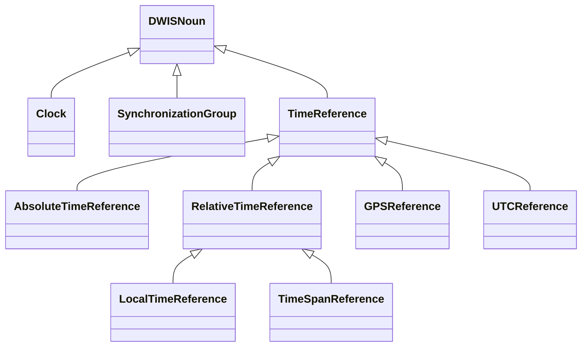
## Clock <!-- NOUN -->
- Display name: Clock
- Parent class: [DWISNoun](./DWISSemantics.md#DWISNoun)
- Attributes:
  - LeapSeconds
    - Type: int
    - Description: 
  - Stratum
    - Type: int
    - Description: 
  - NetworkSynchronizationLatencyAverage
    - Type: double
    - Description: 
  - NetworkSynchronizationLatencyStandardDeviation
    - Type: double
    - Description: 
  - Resolution
    - Type: double
    - Description: 
  - MaximumFluctuations
    - Type: double
    - Description: 
- Description: 
Represents a clock
- Definition set: TimeManagement
- Examples:
```dwis rigClock
Clock:rigClock
rigClock.Resolution = "0.01"
```
An example semantic graph looks like as follow:
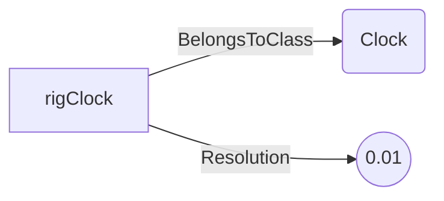
An example SparQL query looks like this:
```sparql
PREFIX rdf: <http://www.w3.org/1999/02/22-rdf-syntax-ns#>
PREFIX ddhub: <http://ddhub.no/>
PREFIX quantity: <http://ddhub.no/UnitAndQuantity>
SELECT ?rigClock
WHERE {
	?rigClock rdf:type ddhub:Clock .
	?rigClock ddhub:Resolution ?Attribute000 .
  FILTER (
	?Attribute000 = "0.01"
  )
}
```
This example defines a rig clock with 10 ms resolution.
## SynchronizationGroup <!-- NOUN -->
- Display name: SynchronizationGroup
- Parent class: [DWISNoun](./DWISSemantics.md#DWISNoun)
- Attributes:
  - SynchronizationDelay
    - Type: double
    - Description: 
  - SamplingRate
    - Type: double
    - Description: 
- Description: 
A group of signals that share a synchronization scheme and sampling characteristics.
- Definition set: TimeManagement
- Examples:
```dwis syncGroup
SynchronizationGroup:rigSyncGroup
rigSyncGroup.SynchronizationDelay = "0.5"
rigSyncGroup.SamplingRate = "10.0"
```
An example semantic graph looks like as follow:
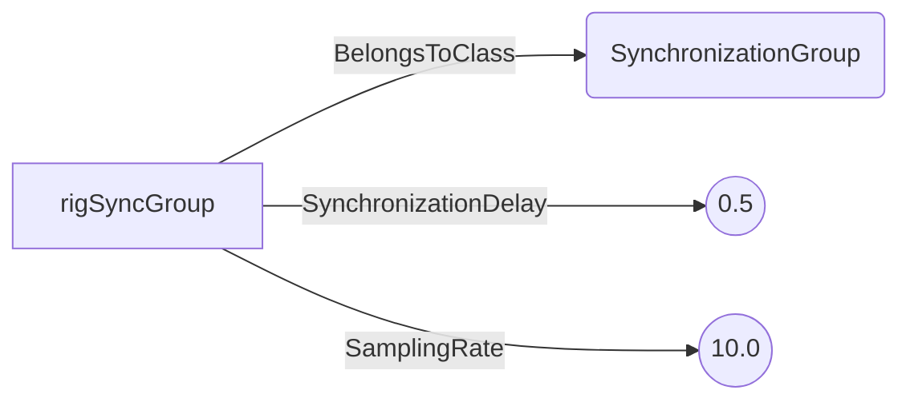
An example SparQL query looks like this:
```sparql
PREFIX rdf: <http://www.w3.org/1999/02/22-rdf-syntax-ns#>
PREFIX ddhub: <http://ddhub.no/>
PREFIX quantity: <http://ddhub.no/UnitAndQuantity>
SELECT ?syncGroup
WHERE {
	?rigSyncGroup rdf:type ddhub:SynchronizationGroup .
	?rigSyncGroup ddhub:SynchronizationDelay ?Attribute000 .
	?rigSyncGroup ddhub:SamplingRate ?Attribute001 .
  FILTER (
	?Attribute000 = "0.5"
	&& 	?Attribute001 = "10.0"
  )
}
```
This example defines a synchronization group with 0.5 s delay and 10 Hz sampling.
## TimeReference <!-- NOUN -->
- Display name: TimeReference
- Parent class: [DWISNoun](./DWISSemantics.md#DWISNoun)
- Description: 
Base time reference used to interpret timestamps.
- Definition set: TimeManagement
- Examples:
```dwis timeRef
TimeReference:timeRef
```
An example semantic graph looks like as follow:
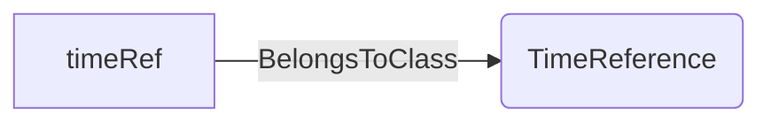
An example SparQL query looks like this:
```sparql
PREFIX rdf: <http://www.w3.org/1999/02/22-rdf-syntax-ns#>
PREFIX ddhub: <http://ddhub.no/>
PREFIX quantity: <http://ddhub.no/UnitAndQuantity>
SELECT ?timeRef
WHERE {
	?timeRef rdf:type ddhub:TimeReference .
}
```
This example declares a generic time reference.
## AbsoluteTimeReference <!-- NOUN -->
- Display name: AbsoluteTimeReference
- Parent class: [TimeReference](./TimeManagement.md#TimeReference)
- Description: 
Time reference tied to an absolute standard such as UTC or GPS.
- Definition set: TimeManagement
- Examples:
```dwis absoluteRef
AbsoluteTimeReference:absoluteRef
```
An example semantic graph looks like as follow:

An example SparQL query looks like this:
```sparql
PREFIX rdf: <http://www.w3.org/1999/02/22-rdf-syntax-ns#>
PREFIX ddhub: <http://ddhub.no/>
PREFIX quantity: <http://ddhub.no/UnitAndQuantity>
SELECT ?absoluteRef
WHERE {
	?absoluteRef rdf:type ddhub:AbsoluteTimeReference .
}
```
This example defines an absolute time reference.
## RelativeTimeReference <!-- NOUN -->
- Display name: RelativeTimeReference
- Parent class: [TimeReference](./TimeManagement.md#TimeReference)
- Description: 
Time reference relative to a local origin or offset.
- Definition set: TimeManagement
- Examples:
```dwis relativeRef
RelativeTimeReference:relativeRef
```
An example semantic graph looks like as follow:
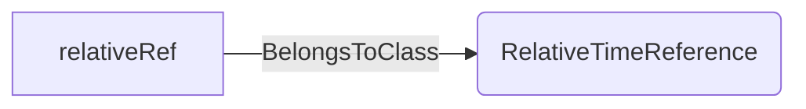
An example SparQL query looks like this:
```sparql
PREFIX rdf: <http://www.w3.org/1999/02/22-rdf-syntax-ns#>
PREFIX ddhub: <http://ddhub.no/>
PREFIX quantity: <http://ddhub.no/UnitAndQuantity>
SELECT ?relativeRef
WHERE {
	?relativeRef rdf:type ddhub:RelativeTimeReference .
}
```
This example defines a relative time reference.
## GPSReference <!-- NOUN -->
- Display name: AbsoluteTimeReference
- Parent class: [TimeReference](./TimeManagement.md#TimeReference)
- Description: 
Time reference derived from GPS.
- Definition set: TimeManagement
- Examples:
```dwis gpsRef
GPSReference:gpsTime
```
An example semantic graph looks like as follow:

An example SparQL query looks like this:
```sparql
PREFIX rdf: <http://www.w3.org/1999/02/22-rdf-syntax-ns#>
PREFIX ddhub: <http://ddhub.no/>
PREFIX quantity: <http://ddhub.no/UnitAndQuantity>
SELECT ?gpsRef
WHERE {
	?gpsTime rdf:type ddhub:GPSReference .
}
```
This example defines a GPS time reference.
## UTCReference <!-- NOUN -->
- Display name: AbsoluteTimeReference
- Parent class: [TimeReference](./TimeManagement.md#TimeReference)
- Description: 
Time reference based on coordinated universal time.
- Definition set: TimeManagement
- Examples:
```dwis utcRef
UTCReference:utcTime
```
An example semantic graph looks like as follow:

An example SparQL query looks like this:
```sparql
PREFIX rdf: <http://www.w3.org/1999/02/22-rdf-syntax-ns#>
PREFIX ddhub: <http://ddhub.no/>
PREFIX quantity: <http://ddhub.no/UnitAndQuantity>
SELECT ?utcRef
WHERE {
	?utcTime rdf:type ddhub:UTCReference .
}
```
This example defines a UTC time reference.
## LocalTimeReference <!-- NOUN -->
- Display name: LocalTimeReference
- Parent class: [RelativeTimeReference](./TimeManagement.md#RelativeTimeReference)
- Description: 
Time reference with respect to local clock or time zone.
- Definition set: TimeManagement
- Examples:
```dwis localRef
LocalTimeReference:localTime
```
An example semantic graph looks like as follow:
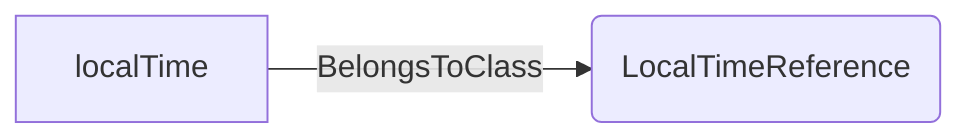
An example SparQL query looks like this:
```sparql
PREFIX rdf: <http://www.w3.org/1999/02/22-rdf-syntax-ns#>
PREFIX ddhub: <http://ddhub.no/>
PREFIX quantity: <http://ddhub.no/UnitAndQuantity>
SELECT ?localRef
WHERE {
	?localTime rdf:type ddhub:LocalTimeReference .
}
```
This example defines a local time reference.
## TimeSpanReference <!-- NOUN -->
- Display name: TimeSpanReference
- Parent class: [RelativeTimeReference](./TimeManagement.md#RelativeTimeReference)
- Description: 
Reference representing elapsed time from a defined event.
- Definition set: TimeManagement
- Examples:
```dwis spanRef
TimeSpanReference:elapsedSinceSpud
```
An example semantic graph looks like as follow:
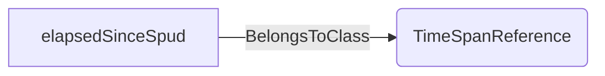
An example SparQL query looks like this:
```sparql
PREFIX rdf: <http://www.w3.org/1999/02/22-rdf-syntax-ns#>
PREFIX ddhub: <http://ddhub.no/>
PREFIX quantity: <http://ddhub.no/UnitAndQuantity>
SELECT ?spanRef
WHERE {
	?elapsedSinceSpud rdf:type ddhub:TimeSpanReference .
}
```
This example defines a time span reference since spud.
  
# Verbs
## Class Inheritance for Verbs
Here is a class inheritance diagram for the verbs contained in this definition set.

## Relations
Here is a graph representing the relations that can be made with the verbs defined in this definition set.
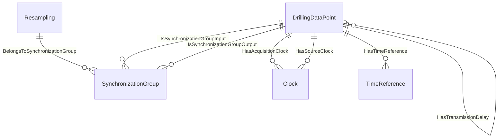
## BelongsToSynchronizationGroup <!-- VERB -->
- Display name: BelongsToSynchronizationGroup
- Parent verb: [DWISVerb](./DWISSemantics.md#DWISVerb)
- Subject class: [Resampling](./DataFlow.md#Resampling)
- Object class: [SynchronizationGroup](./TimeManagement.md#SynchronizationGroup)
- Definition set: TimeManagement
- Description: 
Associates a resampling process with a synchronization group.
- Examples:
```dwis resamplingSync
Resampling:resampleHookload
SynchronizationGroup:rigSyncGroup
resampleHookload BelongsToSynchronizationGroup rigSyncGroup
```
An example semantic graph looks like as follow:
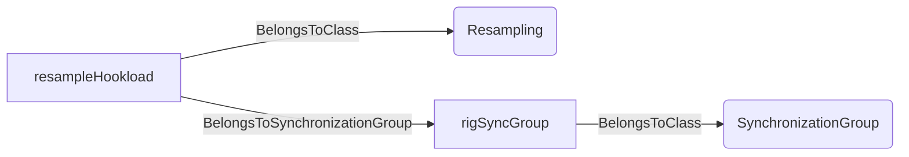
An example SparQL query looks like this:
```sparql
PREFIX rdf: <http://www.w3.org/1999/02/22-rdf-syntax-ns#>
PREFIX ddhub: <http://ddhub.no/>
PREFIX quantity: <http://ddhub.no/UnitAndQuantity>
SELECT ?resamplingSync
WHERE {
	?resampleHookload rdf:type ddhub:Resampling .
	?rigSyncGroup rdf:type ddhub:SynchronizationGroup .
	?resampleHookload ddhub:BelongsToSynchronizationGroup ?rigSyncGroup .
}
```
This example ties a resampling step to the rig synchronization group.
## HasAcquisitionClock <!-- VERB -->
- Display name: HasAcquisitionClock
- Parent verb: [DWISVerb](./DWISSemantics.md#DWISVerb)
- Subject class: [DrillingDataPoint](./DrillingDataSemantics.md#DrillingDataPoint)
- Object class: [Clock](./TimeManagement.md#Clock)
- Definition set: TimeManagement
- Description: 
Indicates which clock timestamped the acquisition of a signal.
- Examples:
```dwis acquisitionClock
DrillingDataPoint:standpipePressure
Clock:rigClock
standpipePressure HasAcquisitionClock rigClock
```
An example semantic graph looks like as follow:
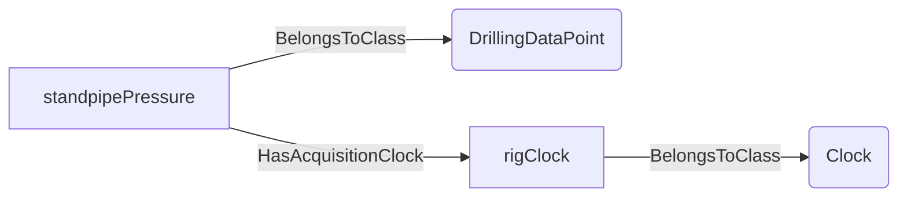
An example SparQL query looks like this:
```sparql
PREFIX rdf: <http://www.w3.org/1999/02/22-rdf-syntax-ns#>
PREFIX ddhub: <http://ddhub.no/>
PREFIX quantity: <http://ddhub.no/UnitAndQuantity>
SELECT ?acquisitionClock
WHERE {
	?standpipePressure rdf:type ddhub:DrillingDataPoint .
	?rigClock rdf:type ddhub:Clock .
	?standpipePressure ddhub:HasAcquisitionClock ?rigClock .
}
```
This example links standpipe pressure acquisition to the rig clock.
## HasSourceClock <!-- VERB -->
- Display name: HasSourceClock
- Parent verb: [DWISVerb](./DWISSemantics.md#DWISVerb)
- Subject class: [DrillingDataPoint](./DrillingDataSemantics.md#DrillingDataPoint)
- Object class: [Clock](./TimeManagement.md#Clock)
- Definition set: TimeManagement
- Description: 
Indicates the source clock at the origin of a signal.
- Examples:
```dwis sourceClock
DrillingDataPoint:downholePressure
Clock:downholeClock
downholePressure HasSourceClock downholeClock
```
An example semantic graph looks like as follow:
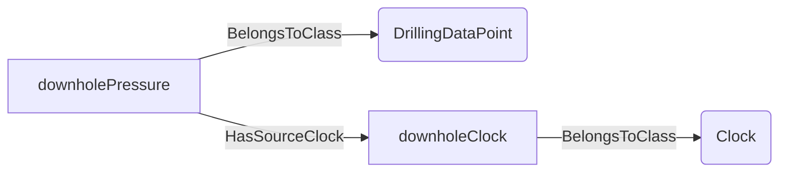
An example SparQL query looks like this:
```sparql
PREFIX rdf: <http://www.w3.org/1999/02/22-rdf-syntax-ns#>
PREFIX ddhub: <http://ddhub.no/>
PREFIX quantity: <http://ddhub.no/UnitAndQuantity>
SELECT ?sourceClock
WHERE {
	?downholePressure rdf:type ddhub:DrillingDataPoint .
	?downholeClock rdf:type ddhub:Clock .
	?downholePressure ddhub:HasSourceClock ?downholeClock .
}
```
This example connects downhole pressure to its source clock.
## HasSourceTime <!-- VERB -->
- Display name: HasSourceTime
- Parent verb: [DWISVerb](./DWISSemantics.md#DWISVerb)
- Subject class: [DrillingDataPoint](./DrillingDataSemantics.md#DrillingDataPoint)
- Object class: [DrillingDataPoint](./DrillingDataSemantics.md#DrillingDataPoint)
- Definition set: TimeManagement
- Description: 
Provides the timestamp at the source for a data point.
- Examples:
```dwis sourceTime
DrillingDataPoint:downholePressure
DrillingDataPoint:downholePressureSourceTime
downholePressure HasSourceTime downholePressureSourceTime
```
An example semantic graph looks like as follow:
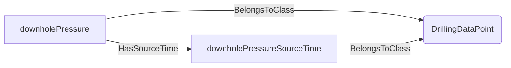
An example SparQL query looks like this:
```sparql
PREFIX rdf: <http://www.w3.org/1999/02/22-rdf-syntax-ns#>
PREFIX ddhub: <http://ddhub.no/>
PREFIX quantity: <http://ddhub.no/UnitAndQuantity>
SELECT ?sourceTime
WHERE {
	?downholePressure rdf:type ddhub:DrillingDataPoint .
	?downholePressureSourceTime rdf:type ddhub:DrillingDataPoint .
	?downholePressure ddhub:HasSourceTime ?downholePressureSourceTime .
}
```
This example records the source time for downhole pressure.
## HasAcquisitionTime <!-- VERB -->
- Display name: HasAcquisitionTime
- Parent verb: [DWISVerb](./DWISSemantics.md#DWISVerb)
- Subject class: [DrillingDataPoint](./DrillingDataSemantics.md#DrillingDataPoint)
- Object class: [DrillingDataPoint](./DrillingDataSemantics.md#DrillingDataPoint)
- Definition set: TimeManagement
- Description: 
Provides the acquisition system timestamp for a data point.
- Examples:
```dwis acquisitionTime
DrillingDataPoint:standpipePressure
DrillingDataPoint:standpipePressureAcqTime
standpipePressure HasAcquisitionTime standpipePressureAcqTime
```
An example semantic graph looks like as follow:
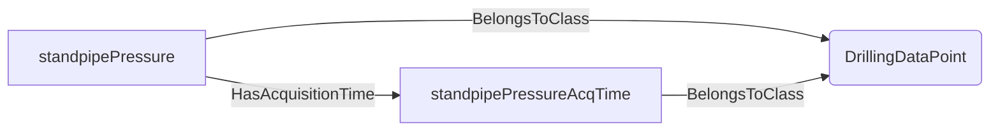
An example SparQL query looks like this:
```sparql
PREFIX rdf: <http://www.w3.org/1999/02/22-rdf-syntax-ns#>
PREFIX ddhub: <http://ddhub.no/>
PREFIX quantity: <http://ddhub.no/UnitAndQuantity>
SELECT ?acquisitionTime
WHERE {
	?standpipePressure rdf:type ddhub:DrillingDataPoint .
	?standpipePressureAcqTime rdf:type ddhub:DrillingDataPoint .
	?standpipePressure ddhub:HasAcquisitionTime ?standpipePressureAcqTime .
}
```
This example sets the acquisition time for standpipe pressure.
## HasTransmissionDelay <!-- VERB -->
- Display name: HasTransmissionDelay
- Parent verb: [DWISVerb](./DWISSemantics.md#DWISVerb)
- Subject class: [DrillingDataPoint](./DrillingDataSemantics.md#DrillingDataPoint)
- Object class: [DrillingDataPoint](./DrillingDataSemantics.md#DrillingDataPoint)
- Definition set: TimeManagement
- Description: 
Indicates the transmission delay associated with a data point.
- Examples:
```dwis transmissionDelay
DrillingDataPoint:downholePressure
DrillingDataPoint:downholePressureDelay
downholePressure HasTransmissionDelay downholePressureDelay
```
An example semantic graph looks like as follow:

An example SparQL query looks like this:
```sparql
PREFIX rdf: <http://www.w3.org/1999/02/22-rdf-syntax-ns#>
PREFIX ddhub: <http://ddhub.no/>
PREFIX quantity: <http://ddhub.no/UnitAndQuantity>
SELECT ?transmissionDelay
WHERE {
	?downholePressure rdf:type ddhub:DrillingDataPoint .
	?downholePressureDelay rdf:type ddhub:DrillingDataPoint .
	?downholePressure ddhub:HasTransmissionDelay ?downholePressureDelay .
}
```
This example records telemetry delay for downhole pressure.
## IsSynchronizationGroupInput <!-- VERB -->
- Display name: IsSynchronizationGroupInput
- Parent verb: [DWISVerb](./DWISSemantics.md#DWISVerb)
- Subject class: [DrillingDataPoint](./DrillingDataSemantics.md#DrillingDataPoint)
- Object class: [SynchronizationGroup](./TimeManagement.md#SynchronizationGroup)
- Definition set: TimeManagement
- Description: 
Marks a signal as input to a synchronization group.
- Examples:
```dwis syncInput
DrillingDataPoint:hookload
SynchronizationGroup:rigSyncGroup
hookload IsSynchronizationGroupInput rigSyncGroup
```
An example semantic graph looks like as follow:
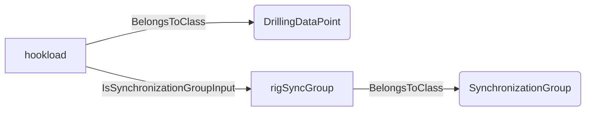
An example SparQL query looks like this:
```sparql
PREFIX rdf: <http://www.w3.org/1999/02/22-rdf-syntax-ns#>
PREFIX ddhub: <http://ddhub.no/>
PREFIX quantity: <http://ddhub.no/UnitAndQuantity>
SELECT ?syncInput
WHERE {
	?hookload rdf:type ddhub:DrillingDataPoint .
	?rigSyncGroup rdf:type ddhub:SynchronizationGroup .
	?hookload ddhub:IsSynchronizationGroupInput ?rigSyncGroup .
}
```
This example includes hookload as a sync group input.
## IsSynchronizationGroupOutput <!-- VERB -->
- Display name: IsSynchronizationGroupOutput
- Parent verb: [DWISVerb](./DWISSemantics.md#DWISVerb)
- Subject class: [DrillingDataPoint](./DrillingDataSemantics.md#DrillingDataPoint)
- Object class: [SynchronizationGroup](./TimeManagement.md#SynchronizationGroup)
- Definition set: TimeManagement
- Description: 
Marks a signal as output from a synchronization group.
- Examples:
```dwis syncOutput
DrillingDataPoint:resampledHookload
SynchronizationGroup:rigSyncGroup
resampledHookload IsSynchronizationGroupOutput rigSyncGroup
```
An example semantic graph looks like as follow:
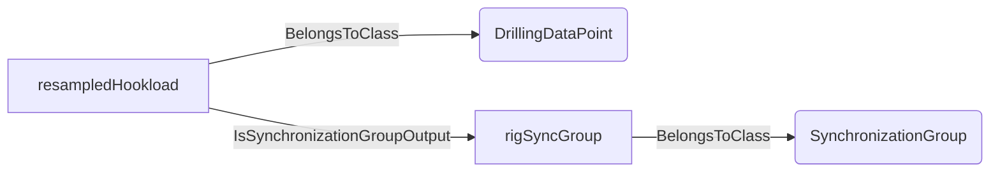
An example SparQL query looks like this:
```sparql
PREFIX rdf: <http://www.w3.org/1999/02/22-rdf-syntax-ns#>
PREFIX ddhub: <http://ddhub.no/>
PREFIX quantity: <http://ddhub.no/UnitAndQuantity>
SELECT ?syncOutput
WHERE {
	?resampledHookload rdf:type ddhub:DrillingDataPoint .
	?rigSyncGroup rdf:type ddhub:SynchronizationGroup .
	?resampledHookload ddhub:IsSynchronizationGroupOutput ?rigSyncGroup .
}
```
This example marks a resampled hookload as sync group output.
## HasTimeReference <!-- VERB -->
- Display name: HasTimeReference
- Parent verb: [DWISVerb](./DWISSemantics.md#DWISVerb)
- Subject class: [DrillingDataPoint](./DrillingDataSemantics.md#DrillingDataPoint)
- Object class: [TimeReference](./TimeManagement.md#TimeReference)
- Definition set: TimeManagement
- Description: 
Associates a data point with the time reference used for its timestamps.
- Examples:
```dwis timeReference
DrillingDataPoint:standpipePressure
UTCReference:utcTime
standpipePressure HasTimeReference utcTime
```
An example semantic graph looks like as follow:
```mermaid
graph LR
	N0000[standpipePressure] -->|BelongsToClass| N0001(DrillingDataPoint) 
	N0002[utcTime] -->|BelongsToClass| N0003(UTCReference) 
	N0000[standpipePressure] -->|HasTimeReference| N0002[utcTime] 
```
An example SparQL query looks like this:
```sparql
PREFIX rdf: <http://www.w3.org/1999/02/22-rdf-syntax-ns#>
PREFIX ddhub: <http://ddhub.no/>
PREFIX quantity: <http://ddhub.no/UnitAndQuantity>
SELECT ?timeReference
WHERE {
	?standpipePressure rdf:type ddhub:DrillingDataPoint .
	?utcTime rdf:type ddhub:UTCReference .
	?standpipePressure ddhub:HasTimeReference ?utcTime .
}
```
This example ties standpipe pressure to UTC time reference.
