# Uncertainty<!-- DEFINITION SET HEADER -->
- Description: 
this category contains the nouns and verbs required to describe the various types of uncertainty attached to drilling signals. Uncertainties can be related to sensor characteristics, calculations, model calibration, data assimilation.

# Nouns
## Class Inheritance for Nouns
Here is a class inheritance diagram for the nouns contained in this definition set.
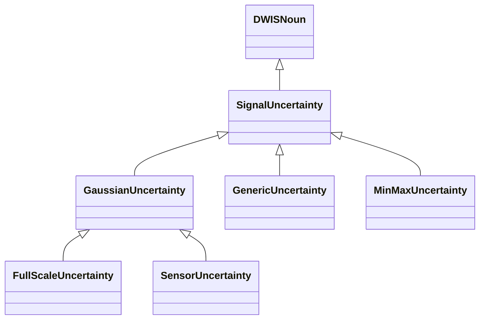
## SignalUncertainty <!-- NOUN -->
- Display name: SignalUncertainty
- Parent class: [DWISNoun](./DWISSemantics.md#DWISNoun)
- Description: 
Represent the uncertainty associated to a `DrillingDataPoint`.
- Definition set: Uncertainty
- Examples:
```dwis signalUncertainty
DrillingDataPoint:signalUncertainty
signalUncertainty BelongsToClass SignalUncertainty
```
An example semantic graph looks like as follow:
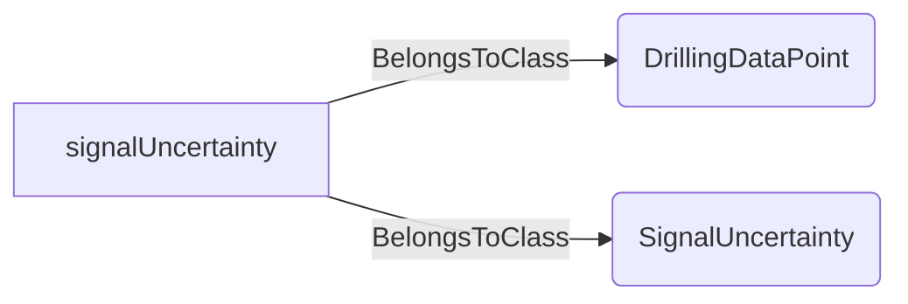
An example SparQL query looks like this:
```sparql
PREFIX rdf: <http://www.w3.org/1999/02/22-rdf-syntax-ns#>
PREFIX ddhub: <http://ddhub.no/>
PREFIX quantity: <http://ddhub.no/UnitAndQuantity>
SELECT ?signalUncertainty
WHERE {
	?signalUncertainty rdf:type ddhub:DrillingDataPoint .
	?signalUncertainty rdf:type ddhub:SignalUncertainty .
}
```
This example links a drilling data point to the SignalUncertainty definition.
This noun is not intended to be used directly in describing a signal. However, it can be useful when formulating a query and then it serves as a generic way to check if there are facts related to uncertainty description for a `DrillingDataPoint`.
```dwis dataPoint
DrillingDataPoint:dataPoint
SignalUncertainty:uncertainty
dataPoint HasUncertainty uncertainty
```
An example semantic graph looks like as follow:
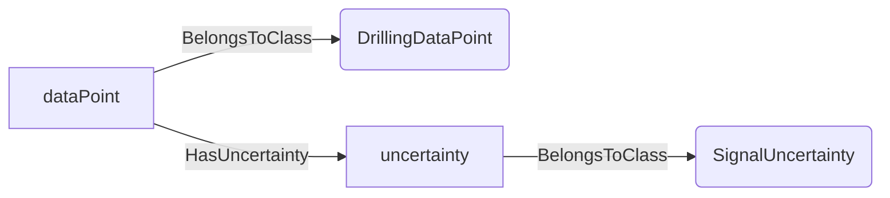
An example SparQL query looks like this:
```sparql
PREFIX rdf: <http://www.w3.org/1999/02/22-rdf-syntax-ns#>
PREFIX ddhub: <http://ddhub.no/>
PREFIX quantity: <http://ddhub.no/UnitAndQuantity>
SELECT ?dataPoint
WHERE {
	?dataPoint rdf:type ddhub:DrillingDataPoint .
	?uncertainty rdf:type ddhub:SignalUncertainty .
	?dataPoint ddhub:HasUncertainty ?uncertainty .
}
```
This query returns all the `DrillingDataPoint` for which an uncertainty is given.
## GaussianUncertainty <!-- NOUN -->
- Display name: GaussianUncertainty
- Parent class: [SignalUncertainty](./Uncertainty.md#SignalUncertainty)
- Description: 
The uncertainty is represented by a Gaussian distribution, i.e., with a `Mean` and a `StandardDeviation`, $\mathcal{N}(\overline{x},{\sigma_{x}}^2)$ where $\overline{x}$ is the `Mean` value and $\sigma_{x}$ is the `StandardDeviation`.
- Definition set: Uncertainty
- Examples:
```dwis Signal#01 Signal#02
DrillingDataPoint:ddp#01
GaussianUncertainty:GU#01
ddp#01 HasUncertainty GU#01
DrillingDataPoint:Mean#01
DrillingDataPoint:StdDev#01
GU#01 HasUncertaintyMean Mean#01
GU#01 HasUncertaintyStandardDeviation StdDev#01
DynamicDrillingSignal:Signal#01
DynamicDrillingSignal:Signal#02
Mean#01 HasDynamicValue Signal#01
StdDev#01 HasDynamicValue Signal#02
```
An example semantic graph looks like as follow:
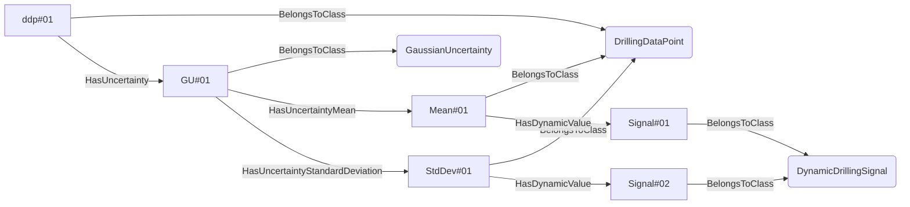
An example SparQL query looks like this:
```sparql
PREFIX rdf: <http://www.w3.org/1999/02/22-rdf-syntax-ns#>
PREFIX ddhub: <http://ddhub.no/>
PREFIX quantity: <http://ddhub.no/UnitAndQuantity>
SELECT ?Signal#01, ?Signal#02
WHERE {
	?ddp#01 rdf:type ddhub:DrillingDataPoint .
	?GU#01 rdf:type ddhub:GaussianUncertainty .
	?ddp#01 ddhub:HasUncertainty ?GU#01 .
	?Mean#01 rdf:type ddhub:DrillingDataPoint .
	?StdDev#01 rdf:type ddhub:DrillingDataPoint .
	?GU#01 ddhub:HasUncertaintyMean ?Mean#01 .
	?GU#01 ddhub:HasUncertaintyStandardDeviation ?StdDev#01 .
	?Signal#01 rdf:type ddhub:DynamicDrillingSignal .
	?Signal#02 rdf:type ddhub:DynamicDrillingSignal .
	?Mean#01 ddhub:HasDynamicValue ?Signal#01 .
	?StdDev#01 ddhub:HasDynamicValue ?Signal#02 .
}
```
In this example, `ddp#01` is a `DrillingDataPoint` that has an uncertainty `GU#01`, which is a Gaussian distribution that is described by a `Mean` value called `Mean#01` and a `StandardDeviation` value called `StdDev#01`. `Mean#01` is a live signal that is attached to `Signal#01`. Similarly `StdDev#01` is a live signal attached to `Signal#02`.
## GenericUncertainty <!-- NOUN -->
- Display name: GenericUncertainty
- Parent class: [SignalUncertainty](./Uncertainty.md#SignalUncertainty)
- Description: 
The uncertainty is represented by a `Histogram`.
- Definition set: Uncertainty
- Examples:
```dwis Signal#01
DrillingDataPoint:ddp#01
GenericUncertainty:GU#01
ddp#01 HasUncertainty GU#01
DrillingDataPoint:Histo#01
GU#01 HasUncertaintyHistogram Histo#01
DynamicDrillingSignal:Signal#01
Histo#01 HasDynamicValue Signal#01
```
An example semantic graph looks like as follow:
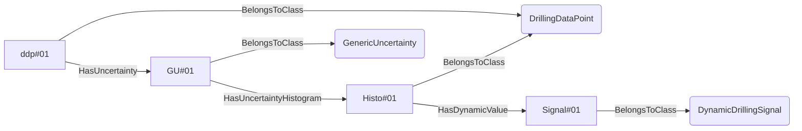
An example SparQL query looks like this:
```sparql
PREFIX rdf: <http://www.w3.org/1999/02/22-rdf-syntax-ns#>
PREFIX ddhub: <http://ddhub.no/>
PREFIX quantity: <http://ddhub.no/UnitAndQuantity>
SELECT ?Signal#01
WHERE {
	?ddp#01 rdf:type ddhub:DrillingDataPoint .
	?GU#01 rdf:type ddhub:GenericUncertainty .
	?ddp#01 ddhub:HasUncertainty ?GU#01 .
	?Histo#01 rdf:type ddhub:DrillingDataPoint .
	?GU#01 ddhub:HasUncertaintyHistogram ?Histo#01 .
	?Signal#01 rdf:type ddhub:DynamicDrillingSignal .
	?Histo#01 ddhub:HasDynamicValue ?Signal#01 .
}
```
In this example, `ddp#01` is a `DrillingDataPoint` that has an uncertainty `GU#01`, which is a general probability distribution that is described by a histogram called `Histo#01`. `Histo#01` is a live signal that is attached to `Signal#01`.
## MinMaxUncertainty <!-- NOUN -->
- Display name: MinMaxUncertainty
- Parent class: [SignalUncertainty](./Uncertainty.md#SignalUncertainty)
- Description: 
The uncertainty is represented by a uniform probability distribution between a `Min` and a `Max` value.
- Definition set: Uncertainty
- Examples:
```dwis Signal#01 Signal#02
DrillingDataPoint:ddp#01
MinMaxUncertainty:GU#01
ddp#01 HasUncertainty GU#01
DrillingDataPoint:Min#01
DrillingDataPoint:Max#01
GU#01 HasUncertaintyMin Min#01
GU#01 HasUncertaintyMax Max#01
DynamicDrillingSignal:Signal#01
DynamicDrillingSignal:Signal#02
Min#01 HasDynamicValue Signal#01
Max#01 HasDynamicValue Signal#02
```
An example semantic graph looks like as follow:
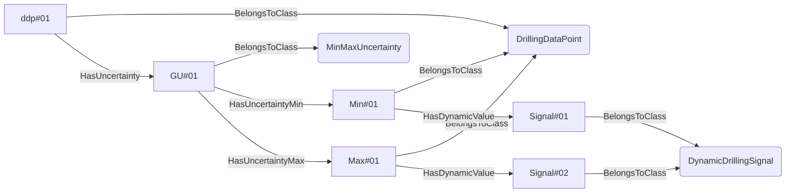
An example SparQL query looks like this:
```sparql
PREFIX rdf: <http://www.w3.org/1999/02/22-rdf-syntax-ns#>
PREFIX ddhub: <http://ddhub.no/>
PREFIX quantity: <http://ddhub.no/UnitAndQuantity>
SELECT ?Signal#01, ?Signal#02
WHERE {
	?ddp#01 rdf:type ddhub:DrillingDataPoint .
	?GU#01 rdf:type ddhub:MinMaxUncertainty .
	?ddp#01 ddhub:HasUncertainty ?GU#01 .
	?Min#01 rdf:type ddhub:DrillingDataPoint .
	?Max#01 rdf:type ddhub:DrillingDataPoint .
	?GU#01 ddhub:HasUncertaintyMin ?Min#01 .
	?GU#01 ddhub:HasUncertaintyMax ?Max#01 .
	?Signal#01 rdf:type ddhub:DynamicDrillingSignal .
	?Signal#02 rdf:type ddhub:DynamicDrillingSignal .
	?Min#01 ddhub:HasDynamicValue ?Signal#01 .
	?Max#01 ddhub:HasDynamicValue ?Signal#02 .
}
```
In this example, `ddp#01` is a `DrillingDataPoint` that has an uncertainty `GU#01`, which is a uniform probability distribution that is described by a `Min` value called `Min#01` and a `Max` value called `Max#01`. `Min#01` is a live signal that is attached to `Signal#01`. Similarly `Max#01` is a live signal attached to `Signal#02`.
## FullScaleUncertainty <!-- NOUN -->
- Display name: FullScaleUncertainty
- Parent class: [GaussianUncertainty](./Uncertainty.md#GaussianUncertainty)
- Attributes:
  - FullScale
    - Type: double
    - Description: The total range of measurement of the signal, i.e., $\left| max - min \right|$. The value is expected to be in the same physical quantity as the sensor value.
  - ProportionError
    - Type: double
    - Description: The proportion error on the signal. The value is expected to be a dimensionless physical quantity between 0 and 1 in SI unit. This proportion is applied to the `Fullscale` to obtain the standard deviation of the Gaussian probability distribution that describes the uncertainty of the signal. The mean value of that Gaussian distribution is the signal value.
- Description: 
The uncertainty on the signal is described as a Gaussian distribution with a standard deviation that is calculated using a proportion of the maximum range of the signal. The `Fullscale` or `ProportionError` can either be defined as attribute values, for example when they have fixed values, or using facts utilizing the verbs `HasFullScale` or repectively `HasProportionError` when these values may change through time.
- Definition set: Uncertainty
- Examples:
```dwis Signal#01 Signal#02
DrillingDataPoint:ddp#01
FullScaleUncertainty:GU#01
ddp#01 HasUncertainty GU#01
DrillingDataPoint:FullScale#01
DrillingDataPoint:ErrProp#01
GU#01 HasFullScale FullScale#01
GU#01 HasProportionError ErrProp#01
DrillingSignal:Signal#01
DrillingSignal:Signal#02
FullScale#01 HasStaticValue Signal#01
ErrProp#01 HasStaticValue Signal#02
```
An example semantic graph looks like as follow:
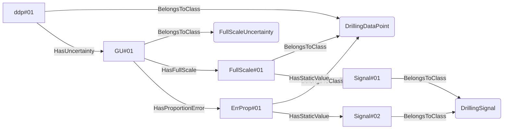
An example SparQL query looks like this:
```sparql
PREFIX rdf: <http://www.w3.org/1999/02/22-rdf-syntax-ns#>
PREFIX ddhub: <http://ddhub.no/>
PREFIX quantity: <http://ddhub.no/UnitAndQuantity>
SELECT ?Signal#01, ?Signal#02
WHERE {
	?ddp#01 rdf:type ddhub:DrillingDataPoint .
	?GU#01 rdf:type ddhub:FullScaleUncertainty .
	?ddp#01 ddhub:HasUncertainty ?GU#01 .
	?FullScale#01 rdf:type ddhub:DrillingDataPoint .
	?ErrProp#01 rdf:type ddhub:DrillingDataPoint .
	?GU#01 ddhub:HasFullScale ?FullScale#01 .
	?GU#01 ddhub:HasProportionError ?ErrProp#01 .
	?Signal#01 rdf:type ddhub:DrillingSignal .
	?Signal#02 rdf:type ddhub:DrillingSignal .
	?FullScale#01 ddhub:HasStaticValue ?Signal#01 .
	?ErrProp#01 ddhub:HasStaticValue ?Signal#02 .
}
```
In this example, `ddp#01` is a `DrillingDataPoint` that has an uncertainty `GU#01`, which is representing a sensor having a Gaussian probability distibution that is described using a `ProportionError` (called `ErrProp#01`) of a `FullScale` value called `FullScale#01`. `FullScale#01` is a static signal that is attached to `Signal#01`. Similarly `ErrProp#01` is a static signal attached to `Signal#02`.
## SensorUncertainty <!-- NOUN -->
- Display name: SensorUncertainty
- Parent class: [GaussianUncertainty](./Uncertainty.md#GaussianUncertainty)
- Attributes:
  - Accuracy
    - Type: double
    - Description: The standard deviation of the systematic bias component of the uncertainty of the sensor. The assumed mean value of the attached Gaussian distribution is the measured value. The value is expected to be in the same physical quantity as the sensor value.
  - Precision
    - Type: double
    - Description: The standard deviation of the repetitive error component of the uncertainty of the sensor. The assumed mean value of the attached Gaussian distribution is the measured value. The value is expected to be in the same physical quantity as the sensor value.
- Description: 
The uncertainty of the sensor is described by a systematic bias and repetitive error. The systematic bias is referred to as the `Accuracy` while the repetitive error is referred to as the `Precision`. The standard deviation of the overall Gaussian distribution is $\sqrt{\sigma^2{_a}+\sigma^2{_p}}$ where $\sigma_a$ is the accuracy and $\sigma_p$ is the precision. The `Accuracy` or the `Precision` can either be defined as attribute values, for example when they have fixed values, or using another facts utilizing the verbs `HasAccuracy` or respectively `HasPrecision` when these values may change through time.
- Definition set: Uncertainty
- Examples:
```dwis Signal#01 Signal#02
DrillingDataPoint:ddp#01
SensorUncertainty:GU#01
ddp#01 HasUncertainty GU#01
DrillingDataPoint:Acc#01
DrillingDataPoint:Prec#01
GU#01 HasUncertaintyAccuracy Acc#01
GU#01 HasUncertaintyPrecision Prec#01
DrillingSignal:Signal#01
DrillingSignal:Signal#02
Acc#01 HasStaticValue Signal#01
Prec#01 HasStaticValue Signal#02
```
An example semantic graph looks like as follow:
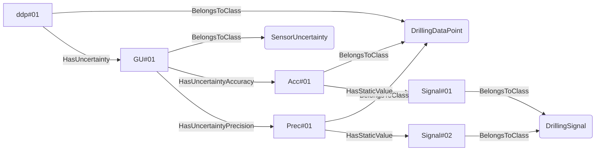
An example SparQL query looks like this:
```sparql
PREFIX rdf: <http://www.w3.org/1999/02/22-rdf-syntax-ns#>
PREFIX ddhub: <http://ddhub.no/>
PREFIX quantity: <http://ddhub.no/UnitAndQuantity>
SELECT ?Signal#01, ?Signal#02
WHERE {
	?ddp#01 rdf:type ddhub:DrillingDataPoint .
	?GU#01 rdf:type ddhub:SensorUncertainty .
	?ddp#01 ddhub:HasUncertainty ?GU#01 .
	?Acc#01 rdf:type ddhub:DrillingDataPoint .
	?Prec#01 rdf:type ddhub:DrillingDataPoint .
	?GU#01 ddhub:HasUncertaintyAccuracy ?Acc#01 .
	?GU#01 ddhub:HasUncertaintyPrecision ?Prec#01 .
	?Signal#01 rdf:type ddhub:DrillingSignal .
	?Signal#02 rdf:type ddhub:DrillingSignal .
	?Acc#01 ddhub:HasStaticValue ?Signal#01 .
	?Prec#01 ddhub:HasStaticValue ?Signal#02 .
}
```
In this example, `ddp#01` is a `DrillingDataPoint` that has an uncertainty `GU#01`, which is representing a sensor having a Gaussian probability distibution that is described using an `Accuracy` (called `Acc#01`)  and a `Precision` called `Prec#01`. `Acc#01` is a static signal that is attached to `Signal#01`. Similarly `Prec#01` is a static signal attached to `Signal#02`.
# Verbs
## Class Inheritance for Verbs
Here is a class inheritance diagram for the verbs contained in this definition set.
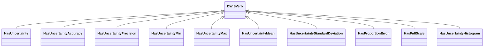
## Relations
Here is a graph representing the relations that can be made with the verbs defined in this definition set.
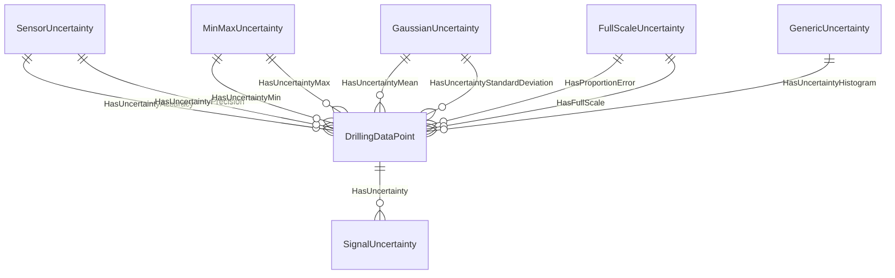
## HasUncertainty <!-- VERB -->
- Display name: HasUncertainty
- Parent verb: [DWISVerb](./DWISSemantics.md#DWISVerb)
- Subject class: [DrillingDataPoint](./DrillingDataSemantics.md#DrillingDataPoint)
- Object class: [SignalUncertainty](./Uncertainty.md#SignalUncertainty)
- Definition set: Uncertainty
- Description: 
This verb allows to associate a `SignalUncertainty` to a `DrillingDataPoint`.
- Examples:
```dwis Signal#01 Signal#02
DrillingDataPoint:ddp#01
GaussianUncertainty:GU#01
ddp#01 HasUncertainty GU#01
DrillingDataPoint:Mean#01
DrillingDataPoint:StdDev#01
GU#01 HasUncertaintyMean Mean#01
GU#01 HasUncertaintyStandardDeviation StdDev#01
DynamicDrillingSignal:Signal#01
DynamicDrillingSignal:Signal#02
Mean#01 HasDynamicValue Signal#01
StdDev#01 HasDynamicValue Signal#02
```
An example semantic graph looks like as follow:

An example SparQL query looks like this:
```sparql
PREFIX rdf: <http://www.w3.org/1999/02/22-rdf-syntax-ns#>
PREFIX ddhub: <http://ddhub.no/>
PREFIX quantity: <http://ddhub.no/UnitAndQuantity>
SELECT ?Signal#01, ?Signal#02
WHERE {
	?ddp#01 rdf:type ddhub:DrillingDataPoint .
	?GU#01 rdf:type ddhub:GaussianUncertainty .
	?ddp#01 ddhub:HasUncertainty ?GU#01 .
	?Mean#01 rdf:type ddhub:DrillingDataPoint .
	?StdDev#01 rdf:type ddhub:DrillingDataPoint .
	?GU#01 ddhub:HasUncertaintyMean ?Mean#01 .
	?GU#01 ddhub:HasUncertaintyStandardDeviation ?StdDev#01 .
	?Signal#01 rdf:type ddhub:DynamicDrillingSignal .
	?Signal#02 rdf:type ddhub:DynamicDrillingSignal .
	?Mean#01 ddhub:HasDynamicValue ?Signal#01 .
	?StdDev#01 ddhub:HasDynamicValue ?Signal#02 .
}
```
In this example, `ddp#01` is a `DrillingDataPoint` that has an uncertainty `GU#01`, which is a Gaussian distribution that is described by a `Mean` value called `Mean#01` and a `StandardDeviation` value called `StdDev#01`. `Mean#01` is a live signal that is attached to `Signal#01`. Similarly `StdDev#01` is a live signal attached to `Signal#02`.
```dwis TotalAccumulatedCuttingsRecoveryExample
DynamicDrillingSignal:CleanSightTotalAccumulatedCuttingsRecovery
ComputedData:CleanSightTotalAccumulatedCuttingsRecovery#01
CleanSightTotalAccumulatedCuttingsRecovery#01 BelongsToClass ContinuousDataType
CleanSightTotalAccumulatedCuttingsRecovery#01 HasDynamicValue CleanSightTotalAccumulatedCuttingsRecovery
CleanSightTotalAccumulatedCuttingsRecovery#01 IsOfMeasurableQuantity VolumeDrilling
TopSideTelemetry:topSideTelemetry
CleanSightTotalAccumulatedCuttingsRecovery#01 IsTransmittedBy topSideTelemetry
MovingAverage:movingAverageCleanSightTotalAccumulatedCuttingsRecovery
CleanSightTotalAccumulatedCuttingsRecovery#01 IsTransformationOutput movingAverageCleanSightTotalAccumulatedCuttingsRecovery
DynamicDrillingSignal:Sigma_TotalAccumulatedCuttingsRecovery
DrillingDataPoint:Sigma_TotalAccumulatedCuttingsRecovery#01
Sigma_TotalAccumulatedCuttingsRecovery#01 BelongsToClass ContinuousDataType
Sigma_TotalAccumulatedCuttingsRecovery#01 IsOfMeasurableQuantity VolumeDrilling
Sigma_TotalAccumulatedCuttingsRecovery#01 HasDynamicValue Sigma_TotalAccumulatedCuttingsRecovery
GaussianUncertainty:GaussianUncertaintyCleanSightTotalAccumulatedCuttingsRecovery#01
CleanSightTotalAccumulatedCuttingsRecovery#01 HasUncertainty GaussianUncertaintyCleanSightTotalAccumulatedCuttingsRecovery#01
GaussianUncertaintyCleanSightTotalAccumulatedCuttingsRecovery#01 HasUncertaintyMean CleanSightTotalAccumulatedCuttingsRecovery#01
GaussianUncertaintyCleanSightTotalAccumulatedCuttingsRecovery#01 HasUncertaintyStandardDeviation Sigma_TotalAccumulatedCuttingsRecovery#01
CuttingSeparatorLogical:ShaleShakerElement#01
DrillingLiquidType:DrillingFluid#01
CuttingsComponent:Cuttings#01
Cuttings#01 IsAComponentOf DrillingFluid#01
CleanSightTotalAccumulatedCuttingsRecovery#01 ConcernsAFluidComponent Cuttings#01
DrillingFluid#01 IsFluidTypeLocatedAt ShaleShakerElement#01
CleanSightTotalAccumulatedCuttingsRecovery#01 IsHydraulicEstimationAt ShaleShakerElement#01
Interpreter:ImageInterpreter#01
CleanSightTotalAccumulatedCuttingsRecovery#01 IsComputedBy ImageInterpreter#01
InstrumentationCompany:DrillDocs#01
CleanSightTotalAccumulatedCuttingsRecovery#01 IsProvidedBy DrillDocs#01
```
An example semantic graph looks like as follow:
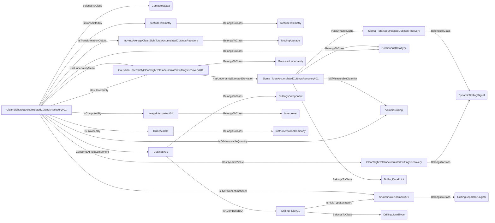
An example SparQL query looks like this:
```sparql
PREFIX rdf: <http://www.w3.org/1999/02/22-rdf-syntax-ns#>
PREFIX ddhub: <http://ddhub.no/>
PREFIX quantity: <http://ddhub.no/UnitAndQuantity>
SELECT ?TotalAccumulatedCuttingsRecoveryExample
WHERE {
	?CleanSightTotalAccumulatedCuttingsRecovery rdf:type ddhub:DynamicDrillingSignal .
	?CleanSightTotalAccumulatedCuttingsRecovery#01 rdf:type ddhub:ComputedData .
	?CleanSightTotalAccumulatedCuttingsRecovery#01 rdf:type ddhub:ContinuousDataType .
	?CleanSightTotalAccumulatedCuttingsRecovery#01 ddhub:HasDynamicValue ?CleanSightTotalAccumulatedCuttingsRecovery .
	?CleanSightTotalAccumulatedCuttingsRecovery#01 ddhub:IsOfMeasurableQuantity ?VolumeDrilling .
	?topSideTelemetry rdf:type ddhub:TopSideTelemetry .
	?CleanSightTotalAccumulatedCuttingsRecovery#01 ddhub:IsTransmittedBy ?topSideTelemetry .
	?movingAverageCleanSightTotalAccumulatedCuttingsRecovery rdf:type ddhub:MovingAverage .
	?CleanSightTotalAccumulatedCuttingsRecovery#01 ddhub:IsTransformationOutput ?movingAverageCleanSightTotalAccumulatedCuttingsRecovery .
	?Sigma_TotalAccumulatedCuttingsRecovery rdf:type ddhub:DynamicDrillingSignal .
	?Sigma_TotalAccumulatedCuttingsRecovery#01 rdf:type ddhub:DrillingDataPoint .
	?Sigma_TotalAccumulatedCuttingsRecovery#01 rdf:type ddhub:ContinuousDataType .
	?Sigma_TotalAccumulatedCuttingsRecovery#01 ddhub:IsOfMeasurableQuantity ?VolumeDrilling .
	?Sigma_TotalAccumulatedCuttingsRecovery#01 ddhub:HasDynamicValue ?Sigma_TotalAccumulatedCuttingsRecovery .
	?GaussianUncertaintyCleanSightTotalAccumulatedCuttingsRecovery#01 rdf:type ddhub:GaussianUncertainty .
	?CleanSightTotalAccumulatedCuttingsRecovery#01 ddhub:HasUncertainty ?GaussianUncertaintyCleanSightTotalAccumulatedCuttingsRecovery#01 .
	?GaussianUncertaintyCleanSightTotalAccumulatedCuttingsRecovery#01 ddhub:HasUncertaintyMean ?CleanSightTotalAccumulatedCuttingsRecovery#01 .
	?GaussianUncertaintyCleanSightTotalAccumulatedCuttingsRecovery#01 ddhub:HasUncertaintyStandardDeviation ?Sigma_TotalAccumulatedCuttingsRecovery#01 .
	?ShaleShakerElement#01 rdf:type ddhub:CuttingSeparatorLogical .
	?DrillingFluid#01 rdf:type ddhub:DrillingLiquidType .
	?Cuttings#01 rdf:type ddhub:CuttingsComponent .
	?Cuttings#01 ddhub:IsAComponentOf ?DrillingFluid#01 .
	?CleanSightTotalAccumulatedCuttingsRecovery#01 ddhub:ConcernsAFluidComponent ?Cuttings#01 .
	?DrillingFluid#01 ddhub:IsFluidTypeLocatedAt ?ShaleShakerElement#01 .
	?CleanSightTotalAccumulatedCuttingsRecovery#01 ddhub:IsHydraulicEstimationAt ?ShaleShakerElement#01 .
	?ImageInterpreter#01 rdf:type ddhub:Interpreter .
	?CleanSightTotalAccumulatedCuttingsRecovery#01 ddhub:IsComputedBy ?ImageInterpreter#01 .
	?DrillDocs#01 rdf:type ddhub:InstrumentationCompany .
	?CleanSightTotalAccumulatedCuttingsRecovery#01 ddhub:IsProvidedBy ?DrillDocs#01 .
}
```
This example shows how to define an uncertainty for a computed drilling data point called `CleanSightTotalAccumulatedCuttingsRecovery#01`. The uncertainty is defined as a Gaussian distribution (`GaussianUncertainty#01`) with a mean value equal to the computed data point and a standard deviation defined by a live signal called `Sigma_TotalAccumulatedCuttingsRecovery`.
## HasUncertaintyAccuracy <!-- VERB -->
- Display name: HasUncertaintyAccuracy
- Parent verb: [DWISVerb](./DWISSemantics.md#DWISVerb)
- Subject class: [SensorUncertainty](./Uncertainty.md#SensorUncertainty)
- Object class: [DrillingDataPoint](./DrillingDataSemantics.md#DrillingDataPoint)
- Definition set: Uncertainty
- Description: 
This verb allows to associate a `DrillingDataPoint` as the `Accuracy` of a `SensorUncertainty`
- Examples:
```dwis Signal#01 Signal#02
DrillingDataPoint:ddp#01
SensorUncertainty:GU#01
ddp#01 HasUncertainty GU#01
DrillingDataPoint:Acc#01
DrillingDataPoint:Prec#01
GU#01 HasUncertaintyAccuracy Acc#01
GU#01 HasUncertaintyPrecision Prec#01
DrillingSignal:Signal#01
DrillingSignal:Signal#02
Acc#01 HasStaticValue Signal#01
Prec#01 HasStaticValue Signal#02
```
An example semantic graph looks like as follow:

An example SparQL query looks like this:
```sparql
PREFIX rdf: <http://www.w3.org/1999/02/22-rdf-syntax-ns#>
PREFIX ddhub: <http://ddhub.no/>
PREFIX quantity: <http://ddhub.no/UnitAndQuantity>
SELECT ?Signal#01, ?Signal#02
WHERE {
	?ddp#01 rdf:type ddhub:DrillingDataPoint .
	?GU#01 rdf:type ddhub:SensorUncertainty .
	?ddp#01 ddhub:HasUncertainty ?GU#01 .
	?Acc#01 rdf:type ddhub:DrillingDataPoint .
	?Prec#01 rdf:type ddhub:DrillingDataPoint .
	?GU#01 ddhub:HasUncertaintyAccuracy ?Acc#01 .
	?GU#01 ddhub:HasUncertaintyPrecision ?Prec#01 .
	?Signal#01 rdf:type ddhub:DrillingSignal .
	?Signal#02 rdf:type ddhub:DrillingSignal .
	?Acc#01 ddhub:HasStaticValue ?Signal#01 .
	?Prec#01 ddhub:HasStaticValue ?Signal#02 .
}
```
In this example, `ddp#01` is a `DrillingDataPoint` that has an uncertainty `GU#01`, which is representing a sensor having a Gaussian probability distibution that is described using an `Accuracy` (called `Acc#01`)  and a `Precision` called `Prec#01`. `Acc#01` is a static signal that is attached to `Signal#01`. Similarly `Prec#01` is a static signal attached to `Signal#02`.
## HasUncertaintyPrecision <!-- VERB -->
- Display name: HasUncertaintyPrecision
- Parent verb: [DWISVerb](./DWISSemantics.md#DWISVerb)
- Subject class: [SensorUncertainty](./Uncertainty.md#SensorUncertainty)
- Object class: [DrillingDataPoint](./DrillingDataSemantics.md#DrillingDataPoint)
- Definition set: Uncertainty
- Description: 
This verb is used to associate a `DrillingDataPoint` as the `Precision` of a `SensorUncertainty`
- Examples:
```dwis Signal#01 Signal#02
DrillingDataPoint:ddp#01
SensorUncertainty:GU#01
ddp#01 HasUncertainty GU#01
DrillingDataPoint:Acc#01
DrillingDataPoint:Prec#01
GU#01 HasUncertaintyAccuracy Acc#01
GU#01 HasUncertaintyPrecision Prec#01
DrillingSignal:Signal#01
DrillingSignal:Signal#02
Acc#01 HasStaticValue Signal#01
Prec#01 HasStaticValue Signal#02
```
An example semantic graph looks like as follow:

An example SparQL query looks like this:
```sparql
PREFIX rdf: <http://www.w3.org/1999/02/22-rdf-syntax-ns#>
PREFIX ddhub: <http://ddhub.no/>
PREFIX quantity: <http://ddhub.no/UnitAndQuantity>
SELECT ?Signal#01, ?Signal#02
WHERE {
	?ddp#01 rdf:type ddhub:DrillingDataPoint .
	?GU#01 rdf:type ddhub:SensorUncertainty .
	?ddp#01 ddhub:HasUncertainty ?GU#01 .
	?Acc#01 rdf:type ddhub:DrillingDataPoint .
	?Prec#01 rdf:type ddhub:DrillingDataPoint .
	?GU#01 ddhub:HasUncertaintyAccuracy ?Acc#01 .
	?GU#01 ddhub:HasUncertaintyPrecision ?Prec#01 .
	?Signal#01 rdf:type ddhub:DrillingSignal .
	?Signal#02 rdf:type ddhub:DrillingSignal .
	?Acc#01 ddhub:HasStaticValue ?Signal#01 .
	?Prec#01 ddhub:HasStaticValue ?Signal#02 .
}
```
In this example, `ddp#01` is a `DrillingDataPoint` that has an uncertainty `GU#01`, which is representing a sensor having a Gaussian probability distibution that is described using an `Accuracy` (called `Acc#01`)  and a `Precision` called `Prec#01`. `Acc#01` is a static signal that is attached to `Signal#01`. Similarly `Prec#01` is a static signal attached to `Signal#02`.
## HasUncertaintyMin <!-- VERB -->
- Display name: HasUncertaintyMin
- Parent verb: [DWISVerb](./DWISSemantics.md#DWISVerb)
- Subject class: [MinMaxUncertainty](./Uncertainty.md#MinMaxUncertainty)
- Object class: [DrillingDataPoint](./DrillingDataSemantics.md#DrillingDataPoint)
- Definition set: Uncertainty
- Description: 
This verb is used to associate a `DrillingDataPoint` as the `Min` value of `MinMaxUncertainty`
- Examples:
```dwis Signal#01 Signal#02
DrillingDataPoint:ddp#01
MinMaxUncertainty:GU#01
ddp#01 HasUncertainty GU#01
DrillingDataPoint:Min#01
DrillingDataPoint:Max#01
GU#01 HasUncertaintyMin Min#01
GU#01 HasUncertaintyMax Max#01
DynamicDrillingSignal:Signal#01
DynamicDrillingSignal:Signal#02
Min#01 HasDynamicValue Signal#01
Max#01 HasDynamicValue Signal#02
```
An example semantic graph looks like as follow:

An example SparQL query looks like this:
```sparql
PREFIX rdf: <http://www.w3.org/1999/02/22-rdf-syntax-ns#>
PREFIX ddhub: <http://ddhub.no/>
PREFIX quantity: <http://ddhub.no/UnitAndQuantity>
SELECT ?Signal#01, ?Signal#02
WHERE {
	?ddp#01 rdf:type ddhub:DrillingDataPoint .
	?GU#01 rdf:type ddhub:MinMaxUncertainty .
	?ddp#01 ddhub:HasUncertainty ?GU#01 .
	?Min#01 rdf:type ddhub:DrillingDataPoint .
	?Max#01 rdf:type ddhub:DrillingDataPoint .
	?GU#01 ddhub:HasUncertaintyMin ?Min#01 .
	?GU#01 ddhub:HasUncertaintyMax ?Max#01 .
	?Signal#01 rdf:type ddhub:DynamicDrillingSignal .
	?Signal#02 rdf:type ddhub:DynamicDrillingSignal .
	?Min#01 ddhub:HasDynamicValue ?Signal#01 .
	?Max#01 ddhub:HasDynamicValue ?Signal#02 .
}
```
In this example, `ddp#01` is a `DrillingDataPoint` that has an uncertainty `GU#01`, which is a uniform probability distribution that is described by a `Min` value called `Min#01` and a `Max` value called `Max#01`. `Min#01` is a live signal that is attached to `Signal#01`. Similarly `Max#01` is a live signal attached to `Signal#02`.
## HasUncertaintyMax <!-- VERB -->
- Display name: HasUncertaintyMax
- Parent verb: [DWISVerb](./DWISSemantics.md#DWISVerb)
- Subject class: [MinMaxUncertainty](./Uncertainty.md#MinMaxUncertainty)
- Object class: [DrillingDataPoint](./DrillingDataSemantics.md#DrillingDataPoint)
- Definition set: Uncertainty
- Description: 
This verb is used to associate a `DrillingDataPoint` as the `Max` value of a `MinMaxUncertainty`
- Examples:
```dwis Signal#01 Signal#02
DrillingDataPoint:ddp#01
MinMaxUncertainty:GU#01
ddp#01 HasUncertainty GU#01
DrillingDataPoint:Min#01
DrillingDataPoint:Max#01
GU#01 HasUncertaintyMin Min#01
GU#01 HasUncertaintyMax Max#01
DynamicDrillingSignal:Signal#01
DynamicDrillingSignal:Signal#02
Min#01 HasDynamicValue Signal#01
Max#01 HasDynamicValue Signal#02
```
An example semantic graph looks like as follow:

An example SparQL query looks like this:
```sparql
PREFIX rdf: <http://www.w3.org/1999/02/22-rdf-syntax-ns#>
PREFIX ddhub: <http://ddhub.no/>
PREFIX quantity: <http://ddhub.no/UnitAndQuantity>
SELECT ?Signal#01, ?Signal#02
WHERE {
	?ddp#01 rdf:type ddhub:DrillingDataPoint .
	?GU#01 rdf:type ddhub:MinMaxUncertainty .
	?ddp#01 ddhub:HasUncertainty ?GU#01 .
	?Min#01 rdf:type ddhub:DrillingDataPoint .
	?Max#01 rdf:type ddhub:DrillingDataPoint .
	?GU#01 ddhub:HasUncertaintyMin ?Min#01 .
	?GU#01 ddhub:HasUncertaintyMax ?Max#01 .
	?Signal#01 rdf:type ddhub:DynamicDrillingSignal .
	?Signal#02 rdf:type ddhub:DynamicDrillingSignal .
	?Min#01 ddhub:HasDynamicValue ?Signal#01 .
	?Max#01 ddhub:HasDynamicValue ?Signal#02 .
}
```
In this example, `ddp#01` is a `DrillingDataPoint` that has an uncertainty `GU#01`, which is a uniform probability distribution that is described by a `Min` value called `Min#01` and a `Max` value called `Max#01`. `Min#01` is a live signal that is attached to `Signal#01`. Similarly `Max#01` is a live signal attached to `Signal#02`.
## HasUncertaintyMean <!-- VERB -->
- Display name: HasUncertaintyMean
- Parent verb: [DWISVerb](./DWISSemantics.md#DWISVerb)
- Subject class: [GaussianUncertainty](./Uncertainty.md#GaussianUncertainty)
- Object class: [DrillingDataPoint](./DrillingDataSemantics.md#DrillingDataPoint)
- Definition set: Uncertainty
- Description: 
This verb is used to associate a `DrillingDataPoint` as the `Mean` value of a `GaussianUncertainty`
- Examples:
```dwis Signal#01 Signal#02
DrillingDataPoint:ddp#01
GaussianUncertainty:GU#01
ddp#01 HasUncertainty GU#01
DrillingDataPoint:Mean#01
DrillingDataPoint:StdDev#01
GU#01 HasUncertaintyMean Mean#01
GU#01 HasUncertaintyStandardDeviation StdDev#01
DynamicDrillingSignal:Signal#01
DynamicDrillingSignal:Signal#02
Mean#01 HasDynamicValue Signal#01
StdDev#01 HasDynamicValue Signal#02
```
An example semantic graph looks like as follow:

An example SparQL query looks like this:
```sparql
PREFIX rdf: <http://www.w3.org/1999/02/22-rdf-syntax-ns#>
PREFIX ddhub: <http://ddhub.no/>
PREFIX quantity: <http://ddhub.no/UnitAndQuantity>
SELECT ?Signal#01, ?Signal#02
WHERE {
	?ddp#01 rdf:type ddhub:DrillingDataPoint .
	?GU#01 rdf:type ddhub:GaussianUncertainty .
	?ddp#01 ddhub:HasUncertainty ?GU#01 .
	?Mean#01 rdf:type ddhub:DrillingDataPoint .
	?StdDev#01 rdf:type ddhub:DrillingDataPoint .
	?GU#01 ddhub:HasUncertaintyMean ?Mean#01 .
	?GU#01 ddhub:HasUncertaintyStandardDeviation ?StdDev#01 .
	?Signal#01 rdf:type ddhub:DynamicDrillingSignal .
	?Signal#02 rdf:type ddhub:DynamicDrillingSignal .
	?Mean#01 ddhub:HasDynamicValue ?Signal#01 .
	?StdDev#01 ddhub:HasDynamicValue ?Signal#02 .
}
```
## HasUncertaintyStandardDeviation <!-- VERB -->
- Display name: HasUncertaintyStandardDeviation
- Parent verb: [DWISVerb](./DWISSemantics.md#DWISVerb)
- Subject class: [GaussianUncertainty](./Uncertainty.md#GaussianUncertainty)
- Object class: [DrillingDataPoint](./DrillingDataSemantics.md#DrillingDataPoint)
- Definition set: Uncertainty
- Description: 
This verb is used to associate a `DrillingDataPoint` as the `StandardDeviation` value of a `GaussianUncertainty`
- Examples:
```dwis Signal#01 Signal#02
DrillingDataPoint:ddp#01
GaussianUncertainty:GU#01
ddp#01 HasUncertainty GU#01
DrillingDataPoint:Mean#01
DrillingDataPoint:StdDev#01
GU#01 HasUncertaintyMean Mean#01
GU#01 HasUncertaintyStandardDeviation StdDev#01
DynamicDrillingSignal:Signal#01
DynamicDrillingSignal:Signal#02
Mean#01 HasDynamicValue Signal#01
StdDev#01 HasDynamicValue Signal#02
```
An example semantic graph looks like as follow:

An example SparQL query looks like this:
```sparql
PREFIX rdf: <http://www.w3.org/1999/02/22-rdf-syntax-ns#>
PREFIX ddhub: <http://ddhub.no/>
PREFIX quantity: <http://ddhub.no/UnitAndQuantity>
SELECT ?Signal#01, ?Signal#02
WHERE {
	?ddp#01 rdf:type ddhub:DrillingDataPoint .
	?GU#01 rdf:type ddhub:GaussianUncertainty .
	?ddp#01 ddhub:HasUncertainty ?GU#01 .
	?Mean#01 rdf:type ddhub:DrillingDataPoint .
	?StdDev#01 rdf:type ddhub:DrillingDataPoint .
	?GU#01 ddhub:HasUncertaintyMean ?Mean#01 .
	?GU#01 ddhub:HasUncertaintyStandardDeviation ?StdDev#01 .
	?Signal#01 rdf:type ddhub:DynamicDrillingSignal .
	?Signal#02 rdf:type ddhub:DynamicDrillingSignal .
	?Mean#01 ddhub:HasDynamicValue ?Signal#01 .
	?StdDev#01 ddhub:HasDynamicValue ?Signal#02 .
}
```
## HasProportionError <!-- VERB -->
- Display name: HasProportionError
- Parent verb: [DWISVerb](./DWISSemantics.md#DWISVerb)
- Subject class: [FullScaleUncertainty](./Uncertainty.md#FullScaleUncertainty)
- Object class: [DrillingDataPoint](./DrillingDataSemantics.md#DrillingDataPoint)
- Definition set: Uncertainty
- Description: 
This verb is used to associate a `DrillingDataPoint` as the `ProportionError` value of a `FullScaleUncertainty`
- Examples:
```dwis Signal#01 Signal#02
DrillingDataPoint:ddp#01
FullScaleUncertainty:GU#01
ddp#01 HasUncertainty GU#01
DrillingDataPoint:FullScale#01
DrillingDataPoint:ErrProp#01
GU#01 HasFullScale FullScale#01
GU#01 HasProportionError ErrProp#01
DrillingSignal:Signal#01
DrillingSignal:Signal#02
FullScale#01 HasStaticValue Signal#01
ErrProp#01 HasStaticValue Signal#02
```
An example semantic graph looks like as follow:

An example SparQL query looks like this:
```sparql
PREFIX rdf: <http://www.w3.org/1999/02/22-rdf-syntax-ns#>
PREFIX ddhub: <http://ddhub.no/>
PREFIX quantity: <http://ddhub.no/UnitAndQuantity>
SELECT ?Signal#01, ?Signal#02
WHERE {
	?ddp#01 rdf:type ddhub:DrillingDataPoint .
	?GU#01 rdf:type ddhub:FullScaleUncertainty .
	?ddp#01 ddhub:HasUncertainty ?GU#01 .
	?FullScale#01 rdf:type ddhub:DrillingDataPoint .
	?ErrProp#01 rdf:type ddhub:DrillingDataPoint .
	?GU#01 ddhub:HasFullScale ?FullScale#01 .
	?GU#01 ddhub:HasProportionError ?ErrProp#01 .
	?Signal#01 rdf:type ddhub:DrillingSignal .
	?Signal#02 rdf:type ddhub:DrillingSignal .
	?FullScale#01 ddhub:HasStaticValue ?Signal#01 .
	?ErrProp#01 ddhub:HasStaticValue ?Signal#02 .
}
```
In this example, `ddp#01` is a `DrillingDataPoint` that has an uncertainty `GU#01`, which is representing a sensor having a Gaussian probability distibution that is described using a `ProportionError` (called `ErrProp#01`) of a `FullScale` value called `FullScale#01`. `FullScale#01` is a static signal that is attached to `Signal#01`. Similarly `ErrProp#01` is a static signal attached to `Signal#02`.
## HasFullScale <!-- VERB -->
- Display name: HasFullScale
- Parent verb: [DWISVerb](./DWISSemantics.md#DWISVerb)
- Subject class: [FullScaleUncertainty](./Uncertainty.md#FullScaleUncertainty)
- Object class: [DrillingDataPoint](./DrillingDataSemantics.md#DrillingDataPoint)
- Definition set: Uncertainty
- Description: 
This verb is used to associate a `DrillingDataPoint` as the `FullScale` value of a `FullScaleUncertainty`
- Examples:
```dwis Signal#01 Signal#02
DrillingDataPoint:ddp#01
FullScaleUncertainty:GU#01
ddp#01 HasUncertainty GU#01
DrillingDataPoint:FullScale#01
DrillingDataPoint:ErrProp#01
GU#01 HasFullScale FullScale#01
GU#01 HasProportionError ErrProp#01
DrillingSignal:Signal#01
DrillingSignal:Signal#02
FullScale#01 HasStaticValue Signal#01
ErrProp#01 HasStaticValue Signal#02
```
An example semantic graph looks like as follow:

An example SparQL query looks like this:
```sparql
PREFIX rdf: <http://www.w3.org/1999/02/22-rdf-syntax-ns#>
PREFIX ddhub: <http://ddhub.no/>
PREFIX quantity: <http://ddhub.no/UnitAndQuantity>
SELECT ?Signal#01, ?Signal#02
WHERE {
	?ddp#01 rdf:type ddhub:DrillingDataPoint .
	?GU#01 rdf:type ddhub:FullScaleUncertainty .
	?ddp#01 ddhub:HasUncertainty ?GU#01 .
	?FullScale#01 rdf:type ddhub:DrillingDataPoint .
	?ErrProp#01 rdf:type ddhub:DrillingDataPoint .
	?GU#01 ddhub:HasFullScale ?FullScale#01 .
	?GU#01 ddhub:HasProportionError ?ErrProp#01 .
	?Signal#01 rdf:type ddhub:DrillingSignal .
	?Signal#02 rdf:type ddhub:DrillingSignal .
	?FullScale#01 ddhub:HasStaticValue ?Signal#01 .
	?ErrProp#01 ddhub:HasStaticValue ?Signal#02 .
}
```
In this example, `ddp#01` is a `DrillingDataPoint` that has an uncertainty `GU#01`, which is representing a sensor having a Gaussian probability distibution that is described using a `ProportionError` (called `ErrProp#01`) of a `FullScale` value called `FullScale#01`. `FullScale#01` is a static signal that is attached to `Signal#01`. Similarly `ErrProp#01` is a static signal attached to `Signal#02`.
## HasUncertaintyHistogram <!-- VERB -->
- Display name: HasUncertaintyHistogram
- Parent verb: [DWISVerb](./DWISSemantics.md#DWISVerb)
- Subject class: [GenericUncertainty](./Uncertainty.md#GenericUncertainty)
- Object class: [DrillingDataPoint](./DrillingDataSemantics.md#DrillingDataPoint)
- Definition set: Uncertainty
- Description: 
This verb is used to associated a `DrillingDataPoint` as the `Histogram` value of a `GenericUncertainty`
- Examples:
```dwis Signal#01
DrillingDataPoint:ddp#01
GenericUncertainty:GU#01
ddp#01 HasUncertainty GU#01
DrillingDataPoint:Histo#01
GU#01 HasUncertaintyHistogram Histo#01
DynamicDrillingSignal:Signal#01
Histo#01 HasDynamicValue Signal#01
```
An example semantic graph looks like as follow:
```mermaid
graph LR
	N0000[ddp#01] -->|BelongsToClass| N0001(DrillingDataPoint) 
	N0002[GU#01] -->|BelongsToClass| N0003(GenericUncertainty) 
	N0000[ddp#01] -->|HasUncertainty| N0002[GU#01] 
	N0004[Histo#01] -->|BelongsToClass| N0001(DrillingDataPoint) 
	N0002[GU#01] -->|HasUncertaintyHistogram| N0004[Histo#01] 
	N0005[Signal#01] -->|BelongsToClass| N0006(DynamicDrillingSignal) 
	N0004[Histo#01] -->|HasDynamicValue| N0005[Signal#01] 
```
An example SparQL query looks like this:
```sparql
PREFIX rdf: <http://www.w3.org/1999/02/22-rdf-syntax-ns#>
PREFIX ddhub: <http://ddhub.no/>
PREFIX quantity: <http://ddhub.no/UnitAndQuantity>
SELECT ?Signal#01
WHERE {
	?ddp#01 rdf:type ddhub:DrillingDataPoint .
	?GU#01 rdf:type ddhub:GenericUncertainty .
	?ddp#01 ddhub:HasUncertainty ?GU#01 .
	?Histo#01 rdf:type ddhub:DrillingDataPoint .
	?GU#01 ddhub:HasUncertaintyHistogram ?Histo#01 .
	?Signal#01 rdf:type ddhub:DynamicDrillingSignal .
	?Histo#01 ddhub:HasDynamicValue ?Signal#01 .
}
```
In this example, `ddp#01` is a `DrillingDataPoint` that has an uncertainty `GU#01`, which is a general probability distribution that is described by a histogram called `Histo#01`. `Histo#01` is a live signal that is attached to `Signal#01`.
