# UnitTypes<!-- DEFINITION SET HEADER -->
# Nouns
## Class Inheritance for Nouns
Here is a class inheritance diagram for the nouns contained in this definition set.
```mermaid
classDiagram
Unit <|-- MetrePerSecondSquared
Unit <|-- FootPerSecondSquared
Unit <|-- CentimetrePerSecondSquared
Unit <|-- CentimetrePerHourPerSecond
Unit <|-- CentimetrePerMinutePerSecond
Unit <|-- FootPerHourPerSecond
Unit <|-- FootPerMinutePerSecond
Unit <|-- Galileo
Unit <|-- GravityStandard
Unit <|-- InchPerHourPerSecond
Unit <|-- InchPerMinutePerSecond
Unit <|-- InchPerSecondSquared
Unit <|-- KnotPerSecond
Unit <|-- MetrePerSecondPerMillisecond
Unit <|-- MilePerHourPerSecond
Unit <|-- MilePerMinutePerSecond
Unit <|-- MilePerSecondSquared
Unit <|-- KilometrePerSecondSquared
Unit <|-- KilometrePerHourPerSecond
Unit <|-- KilometrePerMinutePerSecond
Unit <|-- Mole
Unit <|-- Decimole
Unit <|-- Centimole
Unit <|-- Millimole
Unit <|-- Micromole
Unit <|-- Nanomole
Unit <|-- Picomole
Unit <|-- Kilomole
Unit <|-- RadianPerMetre
Unit <|-- DegreePerMetre
Unit <|-- DegreePerCentimetre
Unit <|-- DegreePerFoot
Unit <|-- DegreePerInch
Unit <|-- DegreePerDecimetre
Unit <|-- DegreePerMillimetre
Unit <|-- RadianPerMillimetre
Unit <|-- RadianPerCentimetre
Unit <|-- RadianPerDecimetre
Unit <|-- RadianPerFoot
Unit <|-- RadianPerInch
Unit <|-- RadianTesla
Unit <|-- RadianGauss
Unit <|-- RadianMilligauss
Unit <|-- RadianMillitesla
Unit <|-- RadianMicrotesla
Unit <|-- RadianNanotesla
Unit <|-- RadianMaxwellPerSquareCentimetre
Unit <|-- RadianWeberPerSquareMetre
Unit <|-- DegreeTesla
Unit <|-- DegreeGauss
Unit <|-- DegreeMilligauss
Unit <|-- DegreeMillitesla
Unit <|-- DegreeMicrotesla
Unit <|-- DegreeNanotesla
Unit <|-- DegreeMaxwellPerSquareCentimetre
Unit <|-- DegreeWeberPerSquareMetre
Unit <|-- RadianPerSecondSquared
Unit <|-- DegreePerSecondSquared
Unit <|-- RadianPerDayPerSecond
Unit <|-- RadianPerHourPerSecond
Unit <|-- RadianPerMinutePerSecond
Unit <|-- DegreePerDayPerSecond
Unit <|-- DegreePerHourPerSecond
Unit <|-- DegreePerMinutePerSecond
Unit <|-- RadianPerSecondPerMinute
Unit <|-- DegreePerSecondPerMinute
Unit <|-- RadianPerDayPerMinute
Unit <|-- RadianPerHourPerMinute
Unit <|-- RadianPerMinuteSquared
Unit <|-- DegreePerDayPerMinute
Unit <|-- DegreePerHourPerMinute
Unit <|-- DegreePerMinuteSquared
Unit <|-- RadianPerSecondPerHour
Unit <|-- DegreePerSecondPerHour
Unit <|-- RadianPerDayPerHour
Unit <|-- RadianPerHourSquared
Unit <|-- RadianPerMinutePerHour
Unit <|-- DegreePerDayPerHour
Unit <|-- DegreePerHourSquared
Unit <|-- DegreePerMinutePerHour
Unit <|-- RadianPerSecondPerDay
Unit <|-- DegreePerSecondPerDay
Unit <|-- RadianPerDaySquared
Unit <|-- RadianPerHourPerDay
Unit <|-- RadianPerMinutePerDay
Unit <|-- DegreePerDaySquared
Unit <|-- DegreePerHourPerDay
Unit <|-- DegreePerMinutePerDay
Unit <|-- RadianPerSecond
Unit <|-- DegreePerSecond
Unit <|-- RadianPerDay
Unit <|-- RadianPerHour
Unit <|-- RadianPerMinute
Unit <|-- DegreePerDay
Unit <|-- DegreePerHour
Unit <|-- DegreePerMinute
Unit <|-- SquareMetre
Unit <|-- SquareKilometre
Unit <|-- Hectare
Unit <|-- SquareDecametre
Unit <|-- SquareDecimetre
Unit <|-- SquareCentimetre
Unit <|-- SquareMillimetre
Unit <|-- SquareMicrometre
Unit <|-- SquareFoot
Unit <|-- SquareInch
Unit <|-- SquareYard
Unit <|-- Acre
Unit <|-- SquareMile
Unit <|-- InversePascal
Unit <|-- InverseBar
Unit <|-- InversePoundPerSquareInch
Unit <|-- InverseAtmosphere
Unit <|-- PascalSecond
Unit <|-- MicropascalSecond
Unit <|-- Centipoise
Unit <|-- Micropoise
Unit <|-- PoundSecondPer100SquareFoot
Unit <|-- DyneSecondPerSquareCentimetre
Unit <|-- DegreePer10m
Unit <|-- DegreePer30m
Unit <|-- DegreePer30ft
Unit <|-- DegreePer100ft
Unit <|-- DegreePerDecimeter
Unit <|-- DegreePerCentimeter
Unit <|-- DegreePerMillimeter
Unit <|-- DegreePerMicrometer
Unit <|-- DegreePerNanometer
Unit <|-- DegreePerDecameter
Unit <|-- DegreePerHectometer
Unit <|-- DegreePerKilometer
Unit <|-- RadianPerDecimeter
Unit <|-- RadianPerCentimeter
Unit <|-- RadianPerMillimeter
Unit <|-- RadianPerMicrometer
Unit <|-- RadianPerNanometer
Unit <|-- RadianPerDecameter
Unit <|-- RadianPerHectometer
Unit <|-- RadianPerKilometer
Unit <|-- DegreePerYard
Unit <|-- DegreePerMile
Unit <|-- RadianPerYard
Unit <|-- RadianPerMile
Unit <|-- KilogramPerCubicMetrePerMetre
Unit <|-- SpecificGravityPerMetre
Unit <|-- SpecificGravityPer10Metre
Unit <|-- SpecificGravityPer30Metre
Unit <|-- SpecificGravityPer100Metre
Unit <|-- GramPerCubicCentimetrePer100Metre
Unit <|-- PoundPerGallonUkPerFoot
Unit <|-- PoundPerGallonUkPer30Foot
Unit <|-- PoundPerGallonUkPer100Foot
Unit <|-- PoundPerGallonUsPerFoot
Unit <|-- PoundPerGallonUsPer30Foot
Unit <|-- PoundPerGallonUsPer100Foot
Unit <|-- KilogramPerCubicMetrePer10Metre
Unit <|-- KilogramPerCubicMetrePer30Metre
Unit <|-- KilogramPerCubicMetrePer100Metre
Unit <|-- GramPerCubicCentimetrePerMetre
Unit <|-- GramPerCubicCentimetrePer10Metre
Unit <|-- GramPerCubicCentimetrePer30Metre
Unit <|-- PoundPerCubicFootPerFoot
Unit <|-- PoundPerCubicFootPer30Foot
Unit <|-- PoundPerCubicFootPer100Foot
Unit <|-- PoundPerCubicInchPerFoot
Unit <|-- PoundPerCubicInchPer30Foot
Unit <|-- PoundPerCubicInchPer100Foot
Unit <|-- PoundPerCubicYardPerFoot
Unit <|-- PoundPerCubicYardPer30Foot
Unit <|-- PoundPerCubicYardPer100Foot
Unit <|-- KilogramPerCubicMetrePerKelvin
Unit <|-- SpecificGravityPerCelsius
Unit <|-- GramPerCubicCentimetrePerCelsius
Unit <|-- PoundPerGallonUkPerCelsius
Unit <|-- PoundPerGallonUsPerFahrenheit
Unit <|-- PoundPerGallonUkPerFahrenheit
Unit <|-- PoundPerGallonUsPerCelsius
Unit <|-- PoundPerCubicFootPerCelsius
Unit <|-- PoundPerCubicFootPerFahrenheit
Unit <|-- PoundPerCubicInchPerCelsius
Unit <|-- PoundPerCubicInchPerFahrenheit
Unit <|-- PoundPerCubicYardPerCelsius
Unit <|-- PoundPerCubicYeardPerFahrenheit
Unit <|-- KilogramPerCubicMetre
Unit <|-- GramPerCubicMetre
Unit <|-- SpecificGravity
Unit <|-- GramPerCubicCentimetre
Unit <|-- PoundPerGallonUk
Unit <|-- PoundPerGallonUs
Unit <|-- PoundPerCubicFoot
Unit <|-- PoundPerCubicInch
Unit <|-- PoundPerCubicYard
Unit <|-- KilogramPerCubicMetrePerSecond
Unit <|-- SpecificGravityPerSecond
Unit <|-- SpecificGravityPerMinute
Unit <|-- SpecificGravityPerHour
Unit <|-- GramPerCubicCentimetrePerSecond
Unit <|-- GramPerCubicCentimetrePerMinute
Unit <|-- GramPerCubicCentimetrePerHour
Unit <|-- PoundPerGallonUkPerSecond
Unit <|-- PoundPerGallonUkPerMinute
Unit <|-- PoundPerGallonUkPerHour
Unit <|-- PoundPerGallonUsPerSecond
Unit <|-- PoundPerGallonUsPerMinute
Unit <|-- PoundPerGallonUsPerHour
Unit <|-- Dimensionless
Unit <|-- MillipascalSecond
Unit <|-- Poise
Unit <|-- Millipoise
Unit <|-- PoundSecondPerSquareFoot
Unit <|-- PoundSecondPerSquareInch
Unit <|-- Farad
Unit <|-- CoulombPerVolt
Unit <|-- Millifarad
Unit <|-- Microfarad
Unit <|-- Nanofarad
Unit <|-- Picofarad
Unit <|-- Ampere
Unit <|-- CoulombPerSecond
Unit <|-- SiemensVolt
Unit <|-- VoltPerOhm
Unit <|-- WattPerVolt
Unit <|-- WeberPerHenry
Unit <|-- Deciampere
Unit <|-- Centiampere
Unit <|-- Milliampere
Unit <|-- Microampere
Unit <|-- Nanoampere
Unit <|-- Picoampere
Unit <|-- Biot
Unit <|-- Abampere
Unit <|-- Kiloampere
Unit <|-- Megaampere
Unit <|-- Gigaampere
Unit <|-- Teraampere
Unit <|-- Statampere
Unit <|-- Volt
Unit <|-- Millivolt
Unit <|-- Centivolt
Unit <|-- Microvolt
Unit <|-- Nanovolt
Unit <|-- Picovolt
Unit <|-- Kilovolt
Unit <|-- Megavolt
Unit <|-- Gigavolt
Unit <|-- MetrePerMetre
Unit <|-- DecimetrePerMetre
Unit <|-- CentimetrePerMetre
Unit <|-- MillimetrePerMetre
Unit <|-- MicrometrePerMetre
Unit <|-- MetrePerKilometre
Unit <|-- DecimetrePerKilometre
Unit <|-- CentimetrePerKilometre
Unit <|-- MillimetrePerKilometre
Unit <|-- MicrometrePerKilometre
Unit <|-- InchPerFoot
Unit <|-- InchPerYard
Unit <|-- InchPerMile
Unit <|-- FootPerFoot
Unit <|-- FootPerYard
Unit <|-- FootPerMile
Unit <|-- YardPerFoot
Unit <|-- YardPerYard
Unit <|-- YardPerMile
Unit <|-- JoulePerCubicMetre
Unit <|-- JoulePerLitre
Unit <|-- KilojoulePerCubicMetre
Unit <|-- KilojoulePerLitre
Unit <|-- MegajoulePerCubicMetre
Unit <|-- MegajoulePerLitre
Unit <|-- GigajoulePerCubicMetre
Unit <|-- GigajoulePerLitre
Unit <|-- CaloriePerCubicMetre
Unit <|-- CaloriePerLitre
Unit <|-- KilocaloriePerCubicMetre
Unit <|-- KilocaloriePerLitre
Unit <|-- JoulePerCubicFoot
Unit <|-- KilojoulePerCubicFoot
Unit <|-- MegajoulePerCubicFoot
Unit <|-- GigajoulePerCubicFoot
Unit <|-- CaloriePerCubicFoot
Unit <|-- KilocaloriePerCubicFoot
Unit <|-- JoulePerCubicInch
Unit <|-- KilojoulePerCubicInch
Unit <|-- MegajoulePerCubicInch
Unit <|-- GigajoulePerCubicInch
Unit <|-- CaloriePerCubicInch
Unit <|-- KilocaloriePerCubicInch
Unit <|-- JoulePerGallonUk
Unit <|-- KilojoulePerGallonUk
Unit <|-- MegajoulePerGallonUk
Unit <|-- GigajoulePerGallonUk
Unit <|-- CaloriePerGallonUk
Unit <|-- KilocaloriePerGallonUk
Unit <|-- JoulePerGallonUs
Unit <|-- KilojoulePerGallonUs
Unit <|-- MegajoulePerGallonUs
Unit <|-- GigajoulePerGallonUs
Unit <|-- CaloriePerGallonUs
Unit <|-- KilocaloriePerGallonUs
Unit <|-- BritishThermalUnitPerCubicMetre
Unit <|-- BritishThermalUnitPerLitre
Unit <|-- BritishThermalUnitPerCubicFoot
Unit <|-- BritishThermalUnitPerCubicInch
Unit <|-- BritishThermalUnitPerGallonUk
Unit <|-- BritishThermalUnitPerGallonUs
Unit <|-- KiloBritishThermalUnitPerCubicMetre
Unit <|-- KiloBritishThermalUnitPerLitre
Unit <|-- KiloBritishThermalUnitPerCubicFoot
Unit <|-- KiloBritishThermalUnitPerCubicInch
Unit <|-- KiloBritishThermalUnitPerGallonUk
Unit <|-- KiloBritishThermalUnitPerGallonUs
Unit <|-- NewtonPerMetre
Unit <|-- NewtonPer30Metre
Unit <|-- NewtonPer10Metre
Unit <|-- NewtonPerDecimetre
Unit <|-- NewtonPerCentimetre
Unit <|-- NewtonPerMillimetre
Unit <|-- DecanewtonPerMetre
Unit <|-- DecanewtonPer30Metre
Unit <|-- DecanewtonPer10Metre
Unit <|-- DecanewtonPerDecimetre
Unit <|-- DecanewtonPerCentimetre
Unit <|-- DecanewtonPerMillimetre
Unit <|-- KilonewtonPerMetre
Unit <|-- KilonewtonPer30Metre
Unit <|-- KilonewtonPer10Metre
Unit <|-- KilonewtonPerDecimetre
Unit <|-- KilonewtonPerCentimetre
Unit <|-- KilonewtonPerMillimetre
Unit <|-- PoundPerFoot
Unit <|-- PoundPerInch
Unit <|-- KilopoundPerFoot
Unit <|-- KilopoundPerInch
Unit <|-- PoundPer30Foot
Unit <|-- PoundPer100Foot
Unit <|-- KilopoundPer30Foot
Unit <|-- KilopoundPer100Foot
Unit <|-- Newton
Unit <|-- Decanewton
Unit <|-- Kilonewton
Unit <|-- Kilodecanewton
Unit <|-- KilogramForce
Unit <|-- PoundForce
Unit <|-- KilopoundForce
Unit <|-- Hertz
Unit <|-- ReciprocalSecond
Unit <|-- Kilohertz
Unit <|-- Megahertz
Unit <|-- Gigahertz
Unit <|-- Terahertz
Unit <|-- Rpm
Unit <|-- Spm
Unit <|-- RotationPerSecond
Unit <|-- StrokePerSecond
Unit <|-- StrokePerHour
Unit <|-- RotationPerHour
Unit <|-- ShockPerSecond
Unit <|-- ShockPerMinute
Unit <|-- ShockPerHour
Unit <|-- HertzPerSecond
Unit <|-- KiloHertzPerSecond
Unit <|-- MegaHertzPerSecond
Unit <|-- GigaHertzPerSecond
Unit <|-- HertzPerMinute
Unit <|-- KiloHertzPerMinute
Unit <|-- MegaHertzPerMinute
Unit <|-- GigaHertzPerMinute
Unit <|-- HertzPerHour
Unit <|-- KiloHertzPerHour
Unit <|-- MegaHertzPerHour
Unit <|-- GigaHertzPerHour
Unit <|-- HertzPerDay
Unit <|-- KiloHertzPerDay
Unit <|-- MegaHertzPerDay
Unit <|-- GigaHertzPerDay
Unit <|-- HertzPerYear
Unit <|-- KiloHertzPerYear
Unit <|-- MegaHertzPerYear
Unit <|-- GigaHertzPerYear
Unit <|-- RpmPerSecond
Unit <|-- SpmPerSecond
Unit <|-- WattPerSquareMetrePerKelvin
Unit <|-- BritishThermalUnitPerHourPerSquareFootPerDegreeFahrenheit
Unit <|-- DotPerMetre
Unit <|-- DotPerInch
Unit <|-- DotPerMillimetre
Unit <|-- DotPerMicrometre
Unit <|-- MillinewtonPerMetre
Unit <|-- DynePerCentimetre
Unit <|-- PoundPerSecondSquared
Unit <|-- Metre
Unit <|-- Decimetre
Unit <|-- Centimetre
Unit <|-- Millimetre
Unit <|-- Micrometre
Unit <|-- Nanometre
Unit <|-- Aangstroem
Unit <|-- Picometre
Unit <|-- Decametre
Unit <|-- Hectometre
Unit <|-- Kilometre
Unit <|-- AstronomicalUnit
Unit <|-- LightYear
Unit <|-- Parsec
Unit <|-- Foot
Unit <|-- UsSurveyFoot
Unit <|-- Inch
Unit <|-- Yard
Unit <|-- Fathom
Unit <|-- SurveyorSChain
Unit <|-- Mile
Unit <|-- InternationalNauticalMile
Unit <|-- UkNauticalMile
Unit <|-- ScandinavianMile
Unit <|-- InchPer32
Unit <|-- Mil
Unit <|-- Thou
Unit <|-- Hand
Unit <|-- Furlong
Unit <|-- Candela
Unit <|-- LumenPerSteradian
Unit <|-- Millicandela
Unit <|-- Kilocandela
Unit <|-- Hefnerkerze
Unit <|-- InternationalCandle
Unit <|-- DecimalCandle
Unit <|-- BerlinerLichteinheit
Unit <|-- DvwgCandle
Unit <|-- Violle
Unit <|-- Carcel
Unit <|-- Tesla
Unit <|-- Gauss
Unit <|-- Milligauss
Unit <|-- Millitesla
Unit <|-- Microtesla
Unit <|-- Nanotesla
Unit <|-- MaxwellPerSquareCentimetre
Unit <|-- WeberPerSquareMetre
Unit <|-- Weber
Unit <|-- Milliweber
Unit <|-- Microweber
Unit <|-- VoltSecond
Unit <|-- UnitPole
Unit <|-- Megaline
Unit <|-- Kiloline
Unit <|-- Line
Unit <|-- Maxwell
Unit <|-- TeslaSquareMetre
Unit <|-- TeslaSquareCentimetre
Unit <|-- GaussSquareCentimetre
Unit <|-- MagneticFluxQuantum
Unit <|-- KilogramPerMetre
Unit <|-- GramPerMetre
Unit <|-- KilogramPerSecond
Unit <|-- KilogramPerMinute
Unit <|-- KilogramPerHour
Unit <|-- KilogramPerYear
Unit <|-- PoundPerSecond
Unit <|-- PoundPerMinute
Unit <|-- PoundPerHour
Unit <|-- PoundPerYear
Unit <|-- Pascal
Unit <|-- Megapascal
Unit <|-- Gigapascal
Unit <|-- Psi
Unit <|-- PoundPer100SquareFoot
Unit <|-- MegapoundPerSquareInch
Unit <|-- Darcy
Unit <|-- Millidarcy
Unit <|-- Microdarcy
Unit <|-- Nanodarcy
Unit <|-- Radian
Unit <|-- Milliradian
Unit <|-- Degree
Unit <|-- Grad
Unit <|-- Gon
Unit <|-- Circle
Unit <|-- Revolution
Unit <|-- Quadrant
Unit <|-- Sextant
Unit <|-- Octant
Unit <|-- ArcMinute
Unit <|-- ArcSecond
Unit <|-- Watt
Unit <|-- Decawatt
Unit <|-- Hectowatt
Unit <|-- Kilowatt
Unit <|-- Megawatt
Unit <|-- Gigawatt
Unit <|-- Terawatt
Unit <|-- Petawatt
Unit <|-- Exawatt
Unit <|-- Deciwatt
Unit <|-- Centiwatt
Unit <|-- Milliwatt
Unit <|-- Microwatt
Unit <|-- Nanowatt
Unit <|-- Picowatt
Unit <|-- Femtowatt
Unit <|-- Attowatt
Unit <|-- PascalPerMetre
Unit <|-- BarPerMetre
Unit <|-- PsiPerMetre
Unit <|-- PsiPerFoot
Unit <|-- PressureLossConstantSi
Unit <|-- PressureLossConstantMetric
Unit <|-- PressureLossConstantUk
Unit <|-- PressureLossConstantUs
Unit <|-- Kilopascal
Unit <|-- Bar
Unit <|-- Millibar
Unit <|-- Microbar
Unit <|-- PoundPerSquareInch
Unit <|-- KilopoundPerSquareInch
Unit <|-- StandardAtmosphere
Unit <|-- PoundPerSquareFoot
Unit <|-- NewtonPerSquareMetre
Unit <|-- NewtonPerSquareCentimetre
Unit <|-- NewtonPerSquareMillimetre
Unit <|-- KilonewtonPerSquareMetre
Unit <|-- Torr
Unit <|-- CentimetreMercuryAtZeroDegreeCelsius
Unit <|-- MillimetreMercuryAtZeroDegreeCelsius
Unit <|-- InchMercuryAt32DegreeFahrenheit
Unit <|-- InchMercuryAt60DegreeFahrenheit
Unit <|-- CentimetreWaterAt4DegreeCelsius
Unit <|-- MillimetreWaterAt4DegreeCelsius
Unit <|-- InchWaterAt4DegreeCelsius
Unit <|-- FootWaterAt4DegreeCelsius
Unit <|-- DynePerSquareCentimetre
Unit <|-- Proportion
Unit <|-- Percent
Unit <|-- PerThousand
Unit <|-- PartPerMillion
Unit <|-- RadianPerSquareRootSecond
Unit <|-- RadianPerSquareRootMinute
Unit <|-- RadianPerSquareRootHour
Unit <|-- RadianPerSquareRootDay
Unit <|-- DegreePerSquareRootSecond
Unit <|-- DegreePerSquareRootMinute
Unit <|-- DegreePerSquareRootHour
Unit <|-- DegreePerSquareRootDay
Unit <|-- Kelvin
Unit <|-- RelativeCelsius
Unit <|-- Rankine
Unit <|-- OhmMetre
Unit <|-- KiloOhmMetre
Unit <|-- MegaOhmMetre
Unit <|-- GigaOhmMetre
Unit <|-- Steradian
Unit <|-- Spat
Unit <|-- DegreeSquared
Unit <|-- JoulePerKilogramKelvin
Unit <|-- JoulePerGramKelvin
Unit <|-- JoulePerGramDegreeCelsius
Unit <|-- CaloriePerGramDegreeCelsius
Unit <|-- BritishThermalUnitPerPoundDegreeFahrenheit
Unit <|-- KilocaloriePerGramDegreeCelsius
Unit <|-- JoulePerKilogramSquaredKelvin
Unit <|-- JoulePerGramSquaredKelvin
Unit <|-- JoulePerGramDegreeSquaredCelsius
Unit <|-- CaloriePerGramDegreeSquaredCelsius
Unit <|-- BritishThermalUnitPerPoundSquaredDegreeFahrenheit
Unit <|-- KelvinPerMetre
Unit <|-- CelsiusPerMetre
Unit <|-- CelsiusPer10Metre
Unit <|-- CelsiusPer30Metre
Unit <|-- CelsiusPer100Metre
Unit <|-- CelsiusPerFoot
Unit <|-- CelsiusPer30Foot
Unit <|-- CelsiusPer100Foot
Unit <|-- FahrenheitPerFoot
Unit <|-- FahrenheitPer30Foot
Unit <|-- FahrenheitPer100Foot
Unit <|-- Celsius
Unit <|-- Fahrenheit
Unit <|-- Réaumur
Unit <|-- WattPerMetreKelvin
Unit <|-- CaloriePerMetreSecondDegreeCelsius
Unit <|-- CaloriePerCentimetreSecondDegreeCelsius
Unit <|-- BritishThermalUnitPerHourFootDegreeFahrenheit
Unit <|-- BritishThermalUnitInchPerHourSquareFootDegreeFahrenheit
Unit <|-- WattPerMetreKelvinPerKelvin
Unit <|-- CaloriePerMetreSecondDegreeCelsiusSquared
Unit <|-- CaloriePerCentimetreSecondDegreeCelsiusSquared
Unit <|-- BritishThermalUnitPerHourFootDegreeFahrenheitSquared
Unit <|-- BritishThermalUnitInchPerHourSquareFootDegreeFahrenheitSquared
Unit <|-- Second
Unit <|-- Millisecond
Unit <|-- Microsecond
Unit <|-- Shake
Unit <|-- Nanosecond
Unit <|-- Picosecond
Unit <|-- Minute
Unit <|-- Hour
Unit <|-- Day
Unit <|-- Week
Unit <|-- Fortnight
Unit <|-- MonthCommon
Unit <|-- MonthSideral
Unit <|-- MonthSynodic
Unit <|-- QuarterCommon
Unit <|-- YearCommon
Unit <|-- YearAverageGregorian
Unit <|-- YearJulian
Unit <|-- YearLeap
Unit <|-- YearTropical
Unit <|-- Decade
Unit <|-- Century
Unit <|-- Millenia
Unit <|-- MillionYear
Unit <|-- NewtonMetrePerMetre
Unit <|-- DecanewtonMetrePerMetre
Unit <|-- KilogramForceMetrePerMetre
Unit <|-- KilonewtonMetrePerMetre
Unit <|-- FootPoundPerMetre
Unit <|-- KilofootPoundPerMetre
Unit <|-- NewtonDecimetrePerMetre
Unit <|-- NewtonCentimetrePerMetre
Unit <|-- NewtonMillimetrePerMetre
Unit <|-- InchPoundPerMetre
Unit <|-- NewtonMetrePerDecimetre
Unit <|-- DecanewtonMetrePerDecimetre
Unit <|-- KilogramForceMetrePerDecimetre
Unit <|-- KilonewtonMetrePerDecimetre
Unit <|-- FootPoundPerDecimetre
Unit <|-- KilofootPoundPerDecimetre
Unit <|-- NewtonDecimetrePerDecimetre
Unit <|-- NewtonCentimetrePerDecimetre
Unit <|-- NewtonMillimetrePerDecimetre
Unit <|-- InchPoundPerDecimetre
Unit <|-- NewtonMetrePerCentimetre
Unit <|-- DecanewtonMetrePerCentimetre
Unit <|-- KilogramForceMetrePerCentimetre
Unit <|-- KilonewtonMetrePerCentimetre
Unit <|-- FootPoundPerCentimetre
Unit <|-- KilofootPoundPerCentimetre
Unit <|-- NewtonDecimetrePerCentimetre
Unit <|-- NewtonCentimetrePerCentimetre
Unit <|-- NewtonMillimetrePerCentimetre
Unit <|-- InchPoundPerCentimetre
Unit <|-- NewtonMetrePerMillimetre
Unit <|-- DecanewtonMetrePerMillimetre
Unit <|-- KilogramForceMetrePerMillimetre
Unit <|-- KilonewtonMetrePerMillimetre
Unit <|-- FootPoundPerMillimetre
Unit <|-- KilofootPoundPerMillimetre
Unit <|-- NewtonDecimetrePerMillimetre
Unit <|-- NewtonCentimetrePerMillimetre
Unit <|-- NewtonMillimetrePerMillimetre
Unit <|-- InchPoundPerMillimetre
Unit <|-- NewtonMetrePerFoot
Unit <|-- DecanewtonMetrePerFoot
Unit <|-- KilogramForceMetrePerFoot
Unit <|-- KilonewtonMetrePerFoot
Unit <|-- FootPoundPerFoot
Unit <|-- KilofootPoundPerFoot
Unit <|-- NewtonDecimetrePerFoot
Unit <|-- NewtonCentimetrePerFoot
Unit <|-- NewtonMillimetrePerFoot
Unit <|-- InchPoundPerFoot
Unit <|-- NewtonMetrePerInch
Unit <|-- DecanewtonMetrePerInch
Unit <|-- KilogramForceMetrePerInch
Unit <|-- KilonewtonMetrePerInch
Unit <|-- FootPoundPerInch
Unit <|-- KilofootPoundPerInch
Unit <|-- NewtonDecimetrePerInch
Unit <|-- NewtonCentimetrePerInch
Unit <|-- NewtonMillimetrePerInch
Unit <|-- InchPoundPerInch
Unit <|-- NewtonMetre
Unit <|-- DecanewtonMetre
Unit <|-- KilogramForceMetre
Unit <|-- KilonewtonMetre
Unit <|-- FootPound
Unit <|-- KilofootPound
Unit <|-- NewtonDecimetre
Unit <|-- NewtonCentimetre
Unit <|-- NewtonMillimetre
Unit <|-- InchPound
Unit <|-- MetrePerSecond
Unit <|-- MetrePerMinute
Unit <|-- CentimetrePerSecond
Unit <|-- MetrePerHour
Unit <|-- MetrePerDay
Unit <|-- FootPerHour
Unit <|-- FootPerDay
Unit <|-- FootPerMinute
Unit <|-- FootPerSecond
Unit <|-- InchPerSecond
Unit <|-- MilePerHour
Unit <|-- KilometrePerHour
Unit <|-- KilometrePerMinute
Unit <|-- KilometrePerSecond
Unit <|-- KilometrePerDay
Unit <|-- MilePerMinute
Unit <|-- MilePerSecond
Unit <|-- MilePerDay
Unit <|-- InchPerMinute
Unit <|-- InchPerHour
Unit <|-- InchPerDay
Unit <|-- CentimetrePerMinute
Unit <|-- CentimetrePerHour
Unit <|-- CentimetrePerDay
Unit <|-- MillimetrePerSecond
Unit <|-- MillimetrePerMinute
Unit <|-- MillimetrePerHour
Unit <|-- MillimetrePerDay
Unit <|-- DecimetrePerSecond
Unit <|-- DecimetrePerMinute
Unit <|-- DecimetrePerHour
Unit <|-- DecimetrePerDay
Unit <|-- FurlongPerFortnight
Unit <|-- CubicMetre
Unit <|-- Litre
Unit <|-- Decilitre
Unit <|-- Centilitre
Unit <|-- Millilitre
Unit <|-- UsGallon
Unit <|-- UkGallon
Unit <|-- Barrel
Unit <|-- MillionCubicMetre
Unit <|-- MillionLitre
Unit <|-- MillionUkGallon
Unit <|-- MillionBarrel
Unit <|-- ThousandStandardCubicFoot
Unit <|-- MillionStandardCubicFoot
Unit <|-- CubicFoot
Unit <|-- CubicInch
Unit <|-- MillionUsGallon
Unit <|-- CubicMetrePerSecondSquared
Unit <|-- LitrePerMinuteSquared
Unit <|-- LitrePerMinutePerSecond
Unit <|-- LitrePerSecondSquared
Unit <|-- UkGallonPerMinuteSquared
Unit <|-- UkGallonPerMinutePerSecond
Unit <|-- UsGallonPerMinuteSquared
Unit <|-- UsGallonPerMinutePerSecond
Unit <|-- CubicMetrePerSecond
Unit <|-- LitrePerSecond
Unit <|-- CubicFootPerSecond
Unit <|-- UkGallonPerSecond
Unit <|-- UsGallonPerSecond
Unit <|-- BarrelPerSecond
Unit <|-- CubicMetrePerMinute
Unit <|-- LitrePerMinute
Unit <|-- CubicFootPerMinute
Unit <|-- UkGallonPerMinute
Unit <|-- UsGallonPerMinute
Unit <|-- BarrelPerMinute
Unit <|-- CubicMetrePerHour
Unit <|-- LitrePerHour
Unit <|-- CubicFootPerHour
Unit <|-- UkGallonPerHour
Unit <|-- UsGallonPerHour
Unit <|-- BarrelPerHour
Unit <|-- CubicMetrePerDay
Unit <|-- MillionCubicMetrePerDay
Unit <|-- UkGallonPerDay
Unit <|-- UsGallonPerDay
Unit <|-- MillionUkGallonPerDay
Unit <|-- MillionUsGallonPerDay
Unit <|-- LitrePerDay
Unit <|-- MillionLiterPerDay
Unit <|-- CubicFootPerDay
Unit <|-- ThousandStandardCubicFootPerDay
Unit <|-- MillionStandardCubicFootPerDay
Unit <|-- BarrelPerDay
Unit <|-- CubicMetrePerYear
Unit <|-- LitrePerYear
Unit <|-- CubicFootPerYear
Unit <|-- UkGallonPerYear
Unit <|-- UsGallonPerYear
Unit <|-- BarrelPerYear
Unit <|-- ReciprocalMetre
Unit <|-- ReciprocalDecimetre
Unit <|-- ReciprocalCentimetre
Unit <|-- ReciprocalMillimetre
Unit <|-- ReciprocalMicrometre
Unit <|-- ReciprocalNanometre
Unit <|-- ReciprocalAangstroem
Unit <|-- ReciprocalPicometre
Unit <|-- ReciprocalDecametre
Unit <|-- ReciprocalHectometre
Unit <|-- ReciprocalKilometre
Unit <|-- ReciprocalAstronomicalUnit
Unit <|-- ReciprocalLightYear
Unit <|-- ReciprocalParsec
Unit <|-- ReciprocalFoot
Unit <|-- ReciprocalUsSurveyFoot
Unit <|-- ReciprocalInch
Unit <|-- ReciprocalYard
Unit <|-- ReciprocalFathom
Unit <|-- ReciprocalSurveyorsChain
Unit <|-- ReciprocalMile
Unit <|-- ReciprocalInternationalNauticalMile
Unit <|-- ReciprocalUkNauticalMile
Unit <|-- ReciprocalScandinavianMile
Unit <|-- ReciprocalInchPer32
Unit <|-- ReciprocalMil
Unit <|-- ReciprocalThou
Unit <|-- ReciprocalHand
Unit <|-- ReciprocalFurlong
Unit <|-- Kilogram
Unit <|-- Hectogram
Unit <|-- Decagram
Unit <|-- Gram
Unit <|-- Centigram
Unit <|-- Milligram
Unit <|-- Microgram
Unit <|-- Nanogram
Unit <|-- AtomMassUnit
Unit <|-- TonneMetric
Unit <|-- Kilotonne
Unit <|-- Megatonne
Unit <|-- Gigatonne
Unit <|-- Pound
Unit <|-- Kilopound
Unit <|-- Ounce
Unit <|-- Stone
Unit <|-- TonUk
Unit <|-- TonUs
Unit <|-- SolarMass
Unit <|-- EarthMass
Unit <|-- Grain
Unit <|-- HundredWeights
Unit <|-- Joule
Unit <|-- Kilojoule
Unit <|-- Megajoule
Unit <|-- Gigajoule
Unit <|-- Calorie
Unit <|-- Kilocalorie
Unit <|-- BritishThermalUnit
Unit <|-- KiloBritishThermalUnit
Unit <|-- MegaBritishThermalUnit
```
## MetrePerSecondSquared <!-- NOUN -->
- Display name: metre per second squared
- Parent class: [Unit](./Quantities.md#Unit)
- Description: 
No conversion necessary as the unit choice is SI
- Definition set: UnitTypes
- Examples:
``` dwis
MetrePerSecondSquared:MetrePerSecondSquared_1
MetrePerSecondSquared_1.Symbol = "m/s²"
```
An example semantic graph looks like as follow:
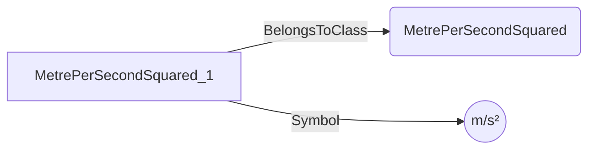
## FootPerSecondSquared <!-- NOUN -->
- Display name: foot per second squared
- Parent class: [Unit](./Quantities.md#Unit)
- Specialization:
  - ConversionFactorB = 3.280839895013124
- Description: 
[v] = a * [SI]
where
[v] is the value in foot per second squared
[SI] is the value in SI
a = 1.0/Foot, i.e., 3.280839895013124
and
Foot = 12.0 * Inch
Inch = 0.0254 reference: https://www.nist.gov/pml/owm/si-units-length
- Definition set: UnitTypes
- Examples:
``` dwis
FootPerSecondSquared:FootPerSecondSquared_1
FootPerSecondSquared_1.ConversionFactorB = "3.280839895013124"
FootPerSecondSquared_1.Symbol = "ft/s²"
```
An example semantic graph looks like as follow:
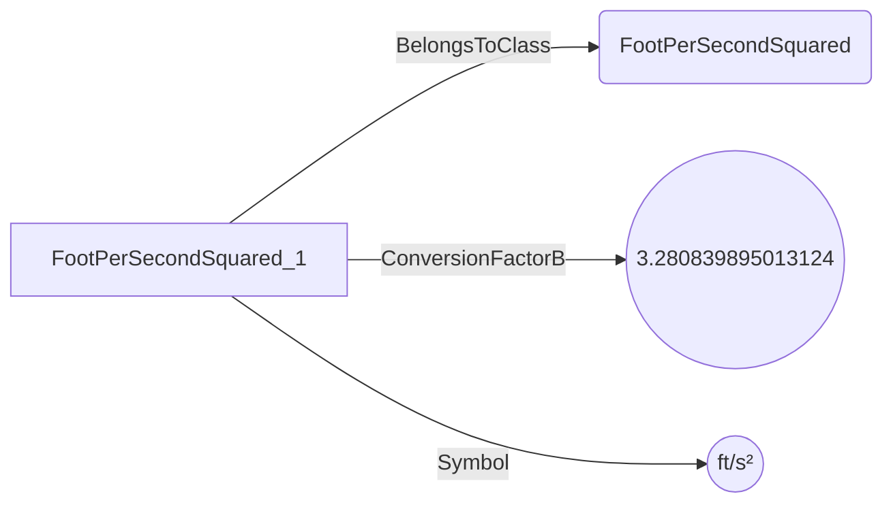
## CentimetrePerSecondSquared <!-- NOUN -->
- Display name: centimetre per second squared
- Parent class: [Unit](./Quantities.md#Unit)
- Specialization:
  - ConversionFactorB = 100
- Description: 
[v] = a * [SI]
where
[v] is the value in centimetre per second squared
[SI] is the value in SI
a = 1.0/Centi, i.e., 100
and
Centi = 0.01
- Definition set: UnitTypes
- Examples:
``` dwis
CentimetrePerSecondSquared:CentimetrePerSecondSquared_1
CentimetrePerSecondSquared_1.ConversionFactorB = "100"
CentimetrePerSecondSquared_1.Symbol = "cm/s²"
```
An example semantic graph looks like as follow:
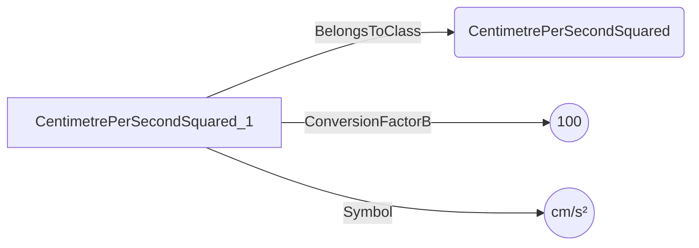
## CentimetrePerHourPerSecond <!-- NOUN -->
- Display name: centimetre per hour per second
- Parent class: [Unit](./Quantities.md#Unit)
- Specialization:
  - ConversionFactorB = 360000
- Description: 
[v] = a * [SI]
where
[v] is the value in centimetre per hour per second
[SI] is the value in SI
a = Hour/Centi, i.e., 360000
and
Hour = 60.0 * Minute
Centi = 0.01
Minute = 60.0
- Definition set: UnitTypes
- Examples:
``` dwis
CentimetrePerHourPerSecond:CentimetrePerHourPerSecond_1
CentimetrePerHourPerSecond_1.ConversionFactorB = "360000"
CentimetrePerHourPerSecond_1.Symbol = "cm/(h•s)"
```
An example semantic graph looks like as follow:
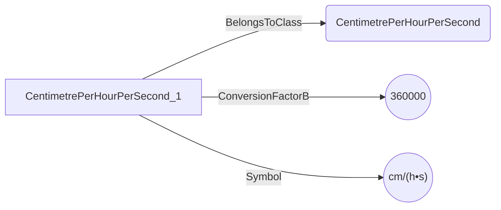
## CentimetrePerMinutePerSecond <!-- NOUN -->
- Display name: centimetre per minute per second
- Parent class: [Unit](./Quantities.md#Unit)
- Specialization:
  - ConversionFactorB = 6000
- Description: 
[v] = a * [SI]
where
[v] is the value in centimetre per minute per second
[SI] is the value in SI
a = Minute/Centi, i.e., 6000
and
Minute = 60.0
Centi = 0.01
- Definition set: UnitTypes
- Examples:
``` dwis
CentimetrePerMinutePerSecond:CentimetrePerMinutePerSecond_1
CentimetrePerMinutePerSecond_1.ConversionFactorB = "6000"
CentimetrePerMinutePerSecond_1.Symbol = "cm/(min•s)"
```
An example semantic graph looks like as follow:
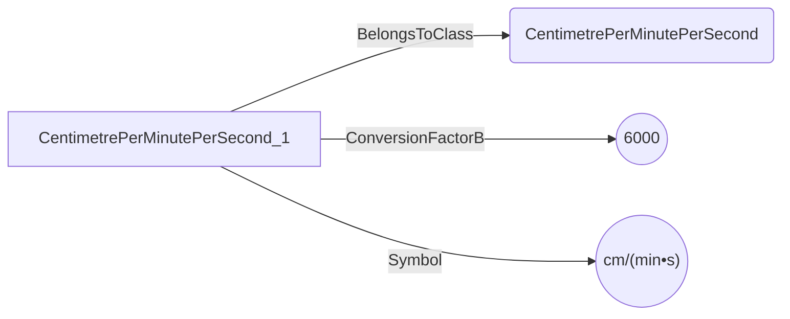
## FootPerHourPerSecond <!-- NOUN -->
- Display name: foot per hour per second
- Parent class: [Unit](./Quantities.md#Unit)
- Specialization:
  - ConversionFactorB = 11811.023622047245
- Description: 
[v] = a * [SI]
where
[v] is the value in foot per hour per second
[SI] is the value in SI
a = Hour/Foot, i.e., 11811.023622047245
and
Hour = 60.0 * Minute
Foot = 12.0 * Inch
Minute = 60.0
Inch = 0.0254 reference: https://www.nist.gov/pml/owm/si-units-length
- Definition set: UnitTypes
- Examples:
``` dwis
FootPerHourPerSecond:FootPerHourPerSecond_1
FootPerHourPerSecond_1.ConversionFactorB = "11811.023622047245"
FootPerHourPerSecond_1.Symbol = "ft/(h•s)"
```
An example semantic graph looks like as follow:
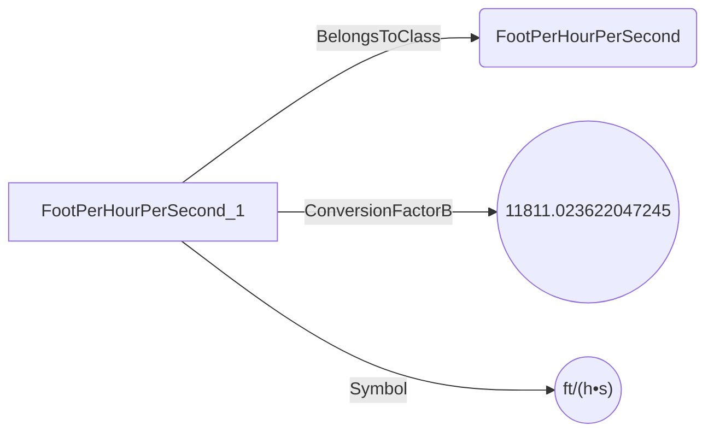
## FootPerMinutePerSecond <!-- NOUN -->
- Display name: foot per minute per second
- Parent class: [Unit](./Quantities.md#Unit)
- Specialization:
  - ConversionFactorB = 196.85039370078744
- Description: 
[v] = a * [SI]
where
[v] is the value in foot per minute per second
[SI] is the value in SI
a = Minute/Foot, i.e., 196.85039370078744
and
Minute = 60.0
Foot = 12.0 * Inch
Inch = 0.0254 reference: https://www.nist.gov/pml/owm/si-units-length
- Definition set: UnitTypes
- Examples:
``` dwis
FootPerMinutePerSecond:FootPerMinutePerSecond_1
FootPerMinutePerSecond_1.ConversionFactorB = "196.85039370078744"
FootPerMinutePerSecond_1.Symbol = "ft/(min•s)"
```
An example semantic graph looks like as follow:
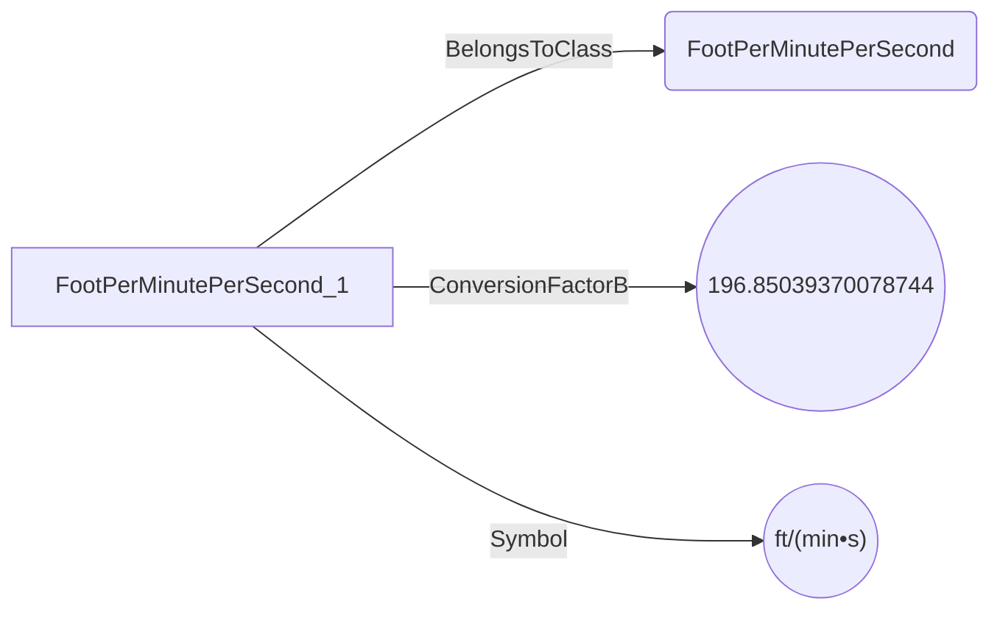
## Galileo <!-- NOUN -->
- Display name: galileo
- Parent class: [Unit](./Quantities.md#Unit)
- Specialization:
  - ConversionFactorB = 100
- Description: 
[v] = a * [SI]
where
[v] is the value in galileo
[SI] is the value in SI
a = 1.0/Centi, i.e., 100
and
Centi = 0.01
- Definition set: UnitTypes
- Examples:
``` dwis
Galileo:Galileo_1
Galileo_1.ConversionFactorB = "100"
Galileo_1.Symbol = "Gal"
```
An example semantic graph looks like as follow:
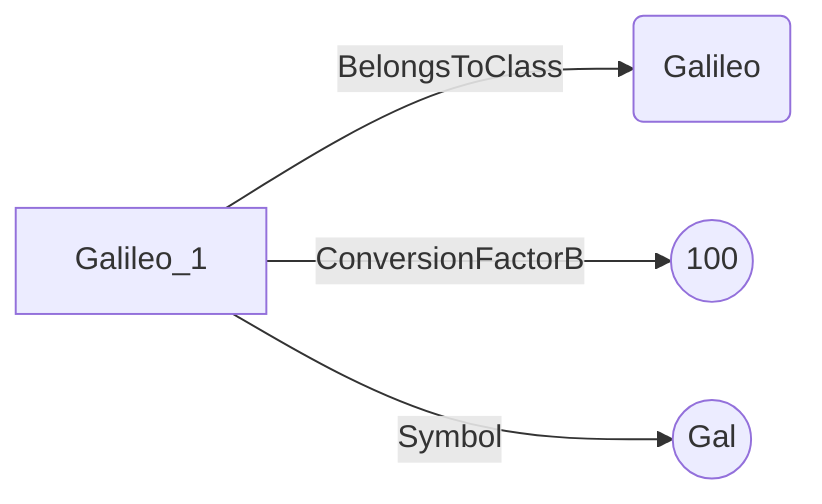
## GravityStandard <!-- NOUN -->
- Display name: gravity standard
- Parent class: [Unit](./Quantities.md#Unit)
- Specialization:
  - ConversionFactorB = 0.10197162129779283
- Description: 
[v] = a * [SI]
where
[v] is the value in gravity standard
[SI] is the value in SI
a = 1.0/G, i.e., 0.10197162129779283
and
G = 9.80665 reference: https://en.wikipedia.org/wiki/Gravity_of_Earth
- Definition set: UnitTypes
- Examples:
``` dwis
GravityStandard:GravityStandard_1
GravityStandard_1.ConversionFactorB = "0.10197162129779283"
GravityStandard_1.Symbol = "gn"
```
An example semantic graph looks like as follow:
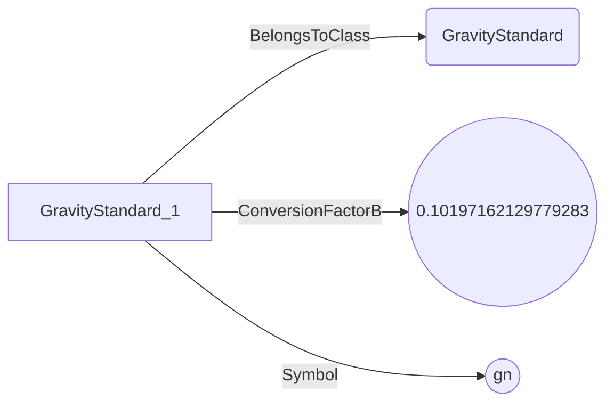
## InchPerHourPerSecond <!-- NOUN -->
- Display name: inch per hour per second
- Parent class: [Unit](./Quantities.md#Unit)
- Specialization:
  - ConversionFactorB = 141732.28346456692
- Description: 
[v] = a * [SI]
where
[v] is the value in inch per hour per second
[SI] is the value in SI
a = Hour/Inch, i.e., 141732.28346456692
and
Hour = 60.0 * Minute
Inch = 0.0254 reference: https://www.nist.gov/pml/owm/si-units-length
Minute = 60.0
- Definition set: UnitTypes
- Examples:
``` dwis
InchPerHourPerSecond:InchPerHourPerSecond_1
InchPerHourPerSecond_1.ConversionFactorB = "141732.28346456692"
InchPerHourPerSecond_1.Symbol = "in/(h•s)"
```
An example semantic graph looks like as follow:
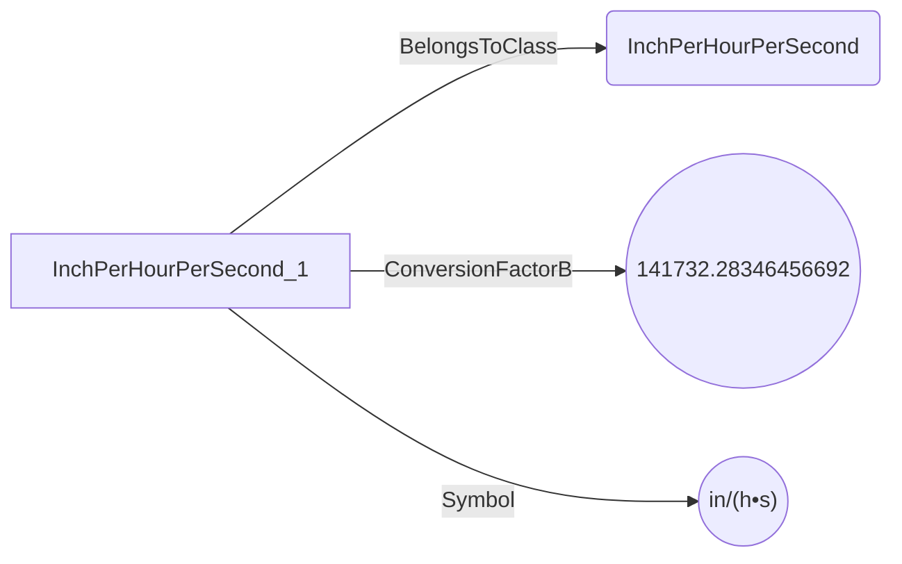
## InchPerMinutePerSecond <!-- NOUN -->
- Display name: inch per minute per second
- Parent class: [Unit](./Quantities.md#Unit)
- Specialization:
  - ConversionFactorB = 2362.2047244094488
- Description: 
[v] = a * [SI]
where
[v] is the value in inch per minute per second
[SI] is the value in SI
a = Minute/Inch, i.e., 2362.2047244094488
and
Minute = 60.0
Inch = 0.0254 reference: https://www.nist.gov/pml/owm/si-units-length
- Definition set: UnitTypes
- Examples:
``` dwis
InchPerMinutePerSecond:InchPerMinutePerSecond_1
InchPerMinutePerSecond_1.ConversionFactorB = "2362.2047244094488"
InchPerMinutePerSecond_1.Symbol = "in/(min•s)"
```
An example semantic graph looks like as follow:
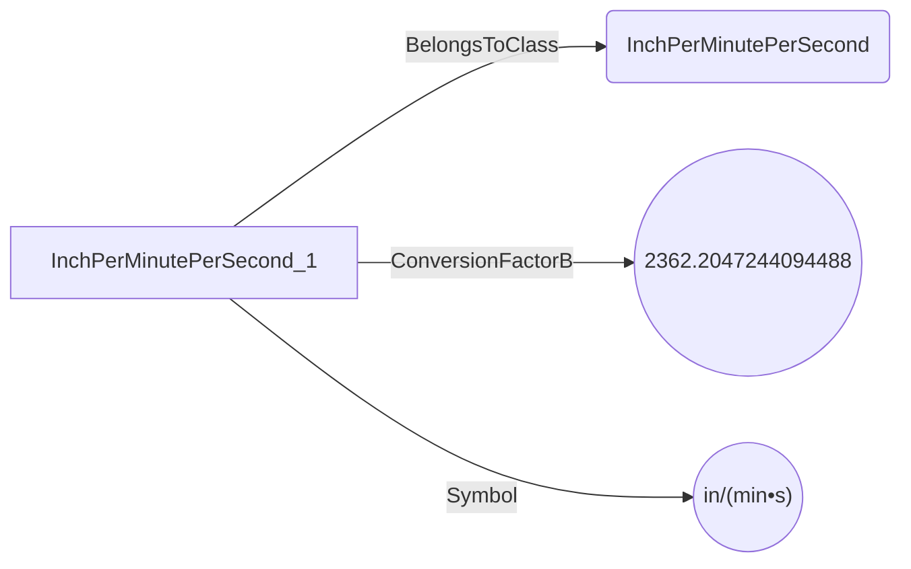
## InchPerSecondSquared <!-- NOUN -->
- Display name: inch per second squared
- Parent class: [Unit](./Quantities.md#Unit)
- Specialization:
  - ConversionFactorB = 39.37007874015748
- Description: 
[v] = a * [SI]
where
[v] is the value in inch per second squared
[SI] is the value in SI
a = 1.0/Inch, i.e., 39.37007874015748
and
Inch = 0.0254 reference: https://www.nist.gov/pml/owm/si-units-length
- Definition set: UnitTypes
- Examples:
``` dwis
InchPerSecondSquared:InchPerSecondSquared_1
InchPerSecondSquared_1.ConversionFactorB = "39.37007874015748"
InchPerSecondSquared_1.Symbol = "in/s²"
```
An example semantic graph looks like as follow:
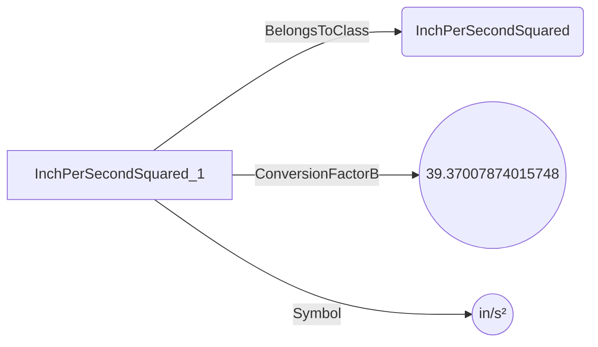
## KnotPerSecond <!-- NOUN -->
- Display name: knot per second
- Parent class: [Unit](./Quantities.md#Unit)
- Specialization:
  - ConversionFactorB = 1.9438444924406046
- Description: 
[v] = a * [SI]
where
[v] is the value in knot per second
[SI] is the value in SI
a = 1.0/Knot, i.e., 1.9438444924406046
and
Knot = 1.852 * Kilo / Hour reference: https://en.wikipedia.org/wiki/Knot_(unit)
Kilo = 1000.0
Hour = 60.0 * Minute
Minute = 60.0
- Definition set: UnitTypes
- Examples:
``` dwis
KnotPerSecond:KnotPerSecond_1
KnotPerSecond_1.ConversionFactorB = "1.9438444924406046"
KnotPerSecond_1.Symbol = "kn/s"
```
An example semantic graph looks like as follow:
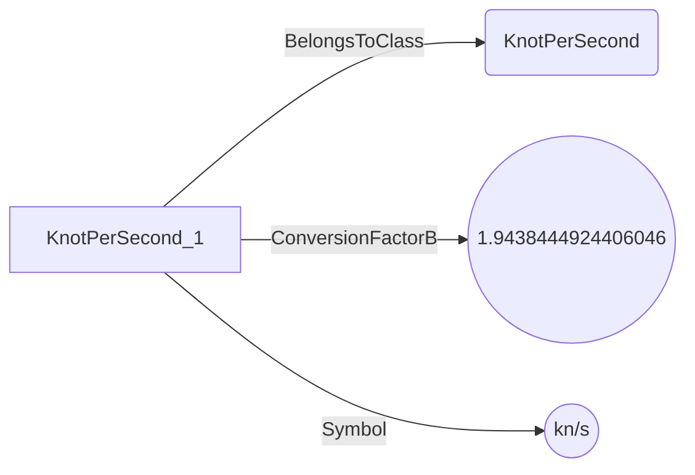
## MetrePerSecondPerMillisecond <!-- NOUN -->
- Display name: metre per second per millisecond
- Parent class: [Unit](./Quantities.md#Unit)
- Specialization:
  - ConversionFactorB = 0.001
- Description: 
[v] = a * [SI]
where
[v] is the value in metre per second per millisecond
[SI] is the value in SI
a = Milli /Unit, i.e., 0.001
and
Milli = 0.001
Unit = 1.0
- Definition set: UnitTypes
- Examples:
``` dwis
MetrePerSecondPerMillisecond:MetrePerSecondPerMillisecond_1
MetrePerSecondPerMillisecond_1.ConversionFactorB = "0.001"
MetrePerSecondPerMillisecond_1.Symbol = "m/(s•ms)"
```
An example semantic graph looks like as follow:
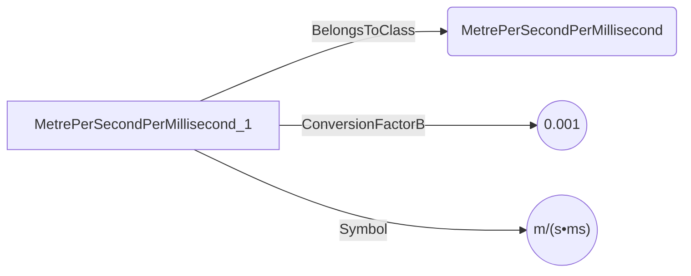
## MilePerHourPerSecond <!-- NOUN -->
- Display name: mile per hour per second
- Parent class: [Unit](./Quantities.md#Unit)
- Specialization:
  - ConversionFactorB = 2.2369362920544025
- Description: 
[v] = a * [SI]
where
[v] is the value in mile per hour per second
[SI] is the value in SI
a = Hour / Mile, i.e., 2.2369362920544025
and
Hour = 60.0 * Minute
Mile = 1760.0 * Yard reference: https://dictionary.cambridge.org/dictionary/english/mile
Minute = 60.0
Yard = 3.0 * Foot
Foot = 12.0 * Inch
Inch = 0.0254 reference: https://www.nist.gov/pml/owm/si-units-length
- Definition set: UnitTypes
- Examples:
``` dwis
MilePerHourPerSecond:MilePerHourPerSecond_1
MilePerHourPerSecond_1.ConversionFactorB = "2.2369362920544025"
MilePerHourPerSecond_1.Symbol = "mi/(h•s)"
```
An example semantic graph looks like as follow:
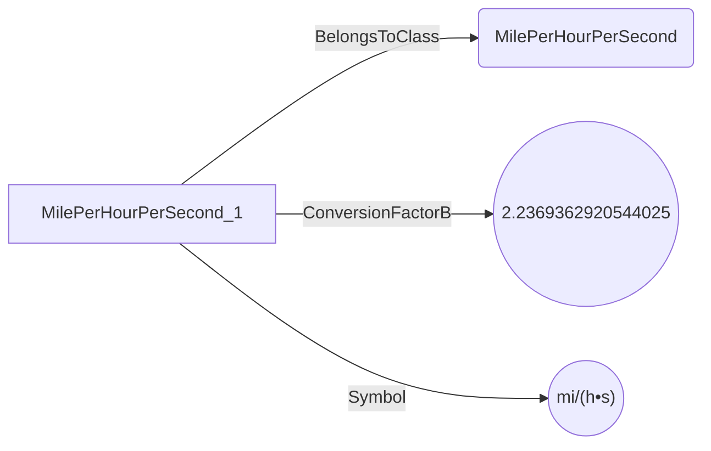
## MilePerMinutePerSecond <!-- NOUN -->
- Display name: mile per minute per second
- Parent class: [Unit](./Quantities.md#Unit)
- Specialization:
  - ConversionFactorB = 0.03728227153424004
- Description: 
[v] = a * [SI]
where
[v] is the value in mile per minute per second
[SI] is the value in SI
a = Minute /Mile, i.e., 0.03728227153424004
and
Minute = 60.0
Mile = 1760.0 * Yard reference: https://dictionary.cambridge.org/dictionary/english/mile
Yard = 3.0 * Foot
Foot = 12.0 * Inch
Inch = 0.0254 reference: https://www.nist.gov/pml/owm/si-units-length
- Definition set: UnitTypes
- Examples:
``` dwis
MilePerMinutePerSecond:MilePerMinutePerSecond_1
MilePerMinutePerSecond_1.ConversionFactorB = "0.03728227153424004"
MilePerMinutePerSecond_1.Symbol = "mi/(min•s)"
```
An example semantic graph looks like as follow:
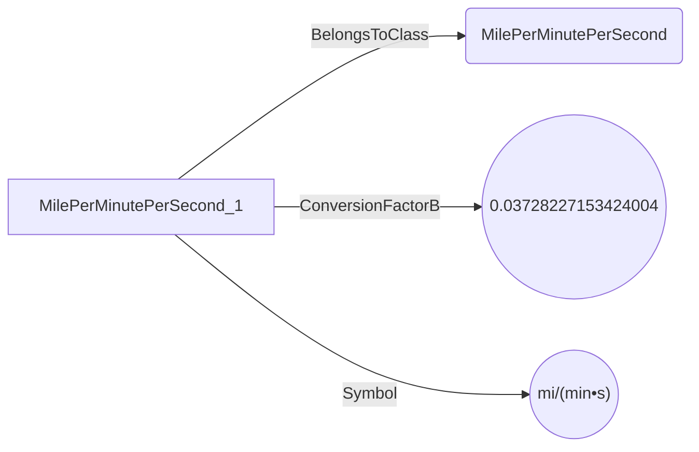
## MilePerSecondSquared <!-- NOUN -->
- Display name: mile per second squared
- Parent class: [Unit](./Quantities.md#Unit)
- Specialization:
  - ConversionFactorB = 0.000621371192237334
- Description: 
[v] = a * [SI]
where
[v] is the value in mile per second squared
[SI] is the value in SI
a = 1.0/Mile, i.e., 0.000621371192237334
and
Mile = 1760.0 * Yard reference: https://dictionary.cambridge.org/dictionary/english/mile
Yard = 3.0 * Foot
Foot = 12.0 * Inch
Inch = 0.0254 reference: https://www.nist.gov/pml/owm/si-units-length
- Definition set: UnitTypes
- Examples:
``` dwis
MilePerSecondSquared:MilePerSecondSquared_1
MilePerSecondSquared_1.ConversionFactorB = "0.000621371192237334"
MilePerSecondSquared_1.Symbol = "mi/s²"
```
An example semantic graph looks like as follow:
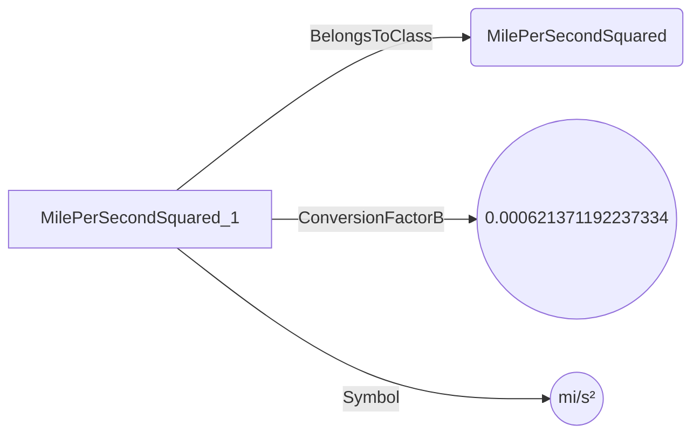
## KilometrePerSecondSquared <!-- NOUN -->
- Display name: kilometre per second squared
- Parent class: [Unit](./Quantities.md#Unit)
- Specialization:
  - ConversionFactorB = 0.001
- Description: 
[v] = a * [SI]
where
[v] is the value in kilometre per second squared
[SI] is the value in SI
a = 1.0/Kilo, i.e., 0.001
and
Kilo = 1000.0
- Definition set: UnitTypes
- Examples:
``` dwis
KilometrePerSecondSquared:KilometrePerSecondSquared_1
KilometrePerSecondSquared_1.ConversionFactorB = "0.001"
KilometrePerSecondSquared_1.Symbol = "km/s²"
```
An example semantic graph looks like as follow:
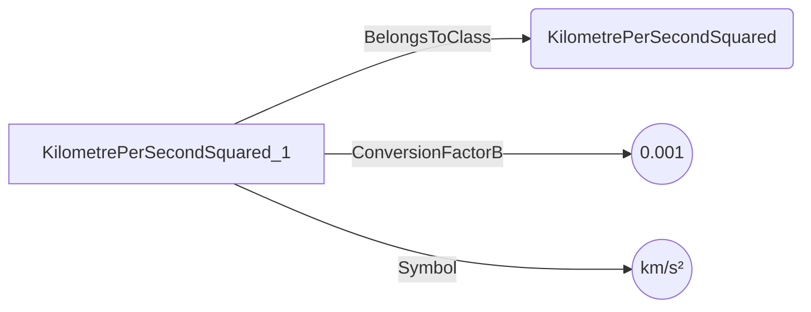
## KilometrePerHourPerSecond <!-- NOUN -->
- Display name: kilometre per hour per second
- Parent class: [Unit](./Quantities.md#Unit)
- Specialization:
  - ConversionFactorB = 3.6
- Description: 
[v] = a * [SI]
where
[v] is the value in kilometre per hour per second
[SI] is the value in SI
a = Hour/Kilo, i.e., 3.6
and
Hour = 60.0 * Minute
Kilo = 1000.0
Minute = 60.0
- Definition set: UnitTypes
- Examples:
``` dwis
KilometrePerHourPerSecond:KilometrePerHourPerSecond_1
KilometrePerHourPerSecond_1.ConversionFactorB = "3.6"
KilometrePerHourPerSecond_1.Symbol = "km/(h•s)"
```
An example semantic graph looks like as follow:
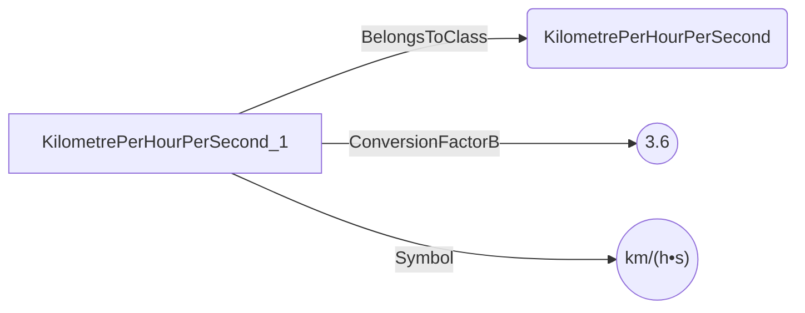
## KilometrePerMinutePerSecond <!-- NOUN -->
- Display name: kilometre per minute per second
- Parent class: [Unit](./Quantities.md#Unit)
- Specialization:
  - ConversionFactorB = 0.06
- Description: 
[v] = a * [SI]
where
[v] is the value in kilometre per minute per second
[SI] is the value in SI
a = Minute/Kilo, i.e., 0.06
and
Minute = 60.0
Kilo = 1000.0
- Definition set: UnitTypes
- Examples:
``` dwis
KilometrePerMinutePerSecond:KilometrePerMinutePerSecond_1
KilometrePerMinutePerSecond_1.ConversionFactorB = "0.06"
KilometrePerMinutePerSecond_1.Symbol = "km/(min•s)"
```
An example semantic graph looks like as follow:
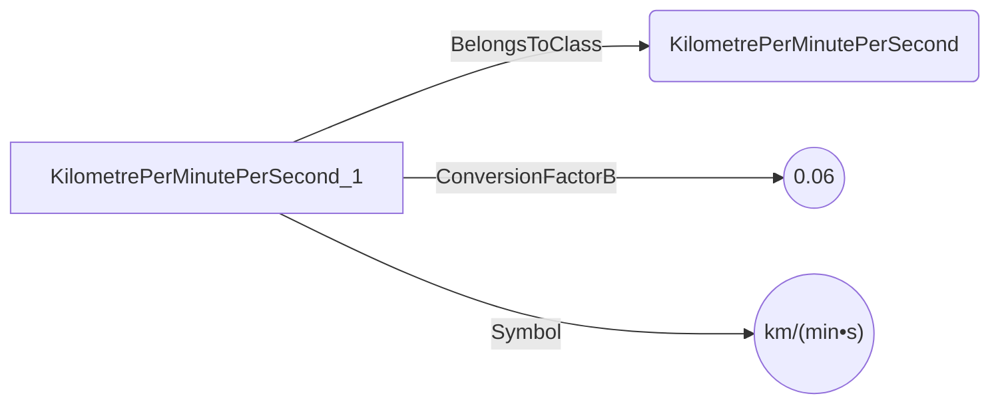
## Mole <!-- NOUN -->
- Display name: mole
- Parent class: [Unit](./Quantities.md#Unit)
- Description: 
No conversion necessary as the unit choice is SI
- Definition set: UnitTypes
- Examples:
``` dwis
Mole:Mole_1
Mole_1.Symbol = "mol"
```
An example semantic graph looks like as follow:
```mermaid
graph LR
	N0000[Mole_1] -->|BelongsToClass| N0001(Mole) 
	N0000[Mole_1] -->|Symbol| N0002(("mol")) 
```
## Decimole <!-- NOUN -->
- Display name: decimole
- Parent class: [Unit](./Quantities.md#Unit)
- Specialization:
  - ConversionFactorB = 10
- Description: 
[v] = a * [SI]
where
[v] is the value in decimole
[SI] is the value in SI
a = 1.0/Deci, i.e., 10
and
Deci = 0.1
- Definition set: UnitTypes
- Examples:
``` dwis
Decimole:Decimole_1
Decimole_1.ConversionFactorB = "10"
Decimole_1.Symbol = "dmol"
```
An example semantic graph looks like as follow:
```mermaid
graph LR
	N0000[Decimole_1] -->|BelongsToClass| N0001(Decimole) 
	N0000[Decimole_1] -->|ConversionFactorB| N0002(("10")) 
	N0000[Decimole_1] -->|Symbol| N0003(("dmol")) 
```
## Centimole <!-- NOUN -->
- Display name: centimole
- Parent class: [Unit](./Quantities.md#Unit)
- Specialization:
  - ConversionFactorB = 100
- Description: 
[v] = a * [SI]
where
[v] is the value in centimole
[SI] is the value in SI
a = 1.0/Centi, i.e., 100
and
Centi = 0.01
- Definition set: UnitTypes
- Examples:
``` dwis
Centimole:Centimole_1
Centimole_1.ConversionFactorB = "100"
Centimole_1.Symbol = "cmol"
```
An example semantic graph looks like as follow:
```mermaid
graph LR
	N0000[Centimole_1] -->|BelongsToClass| N0001(Centimole) 
	N0000[Centimole_1] -->|ConversionFactorB| N0002(("100")) 
	N0000[Centimole_1] -->|Symbol| N0003(("cmol")) 
```
## Millimole <!-- NOUN -->
- Display name: millimole
- Parent class: [Unit](./Quantities.md#Unit)
- Specialization:
  - ConversionFactorB = 1000
- Description: 
[v] = a * [SI]
where
[v] is the value in millimole
[SI] is the value in SI
a = 1.0/Milli, i.e., 1000
and
Milli = 0.001
- Definition set: UnitTypes
- Examples:
``` dwis
Millimole:Millimole_1
Millimole_1.ConversionFactorB = "1000"
Millimole_1.Symbol = "mmol"
```
An example semantic graph looks like as follow:
```mermaid
graph LR
	N0000[Millimole_1] -->|BelongsToClass| N0001(Millimole) 
	N0000[Millimole_1] -->|ConversionFactorB| N0002(("1000")) 
	N0000[Millimole_1] -->|Symbol| N0003(("mmol")) 
```
## Micromole <!-- NOUN -->
- Display name: micromole
- Parent class: [Unit](./Quantities.md#Unit)
- Specialization:
  - ConversionFactorB = 1000000
- Description: 
[v] = a * [SI]
where
[v] is the value in micromole
[SI] is the value in SI
a = 1.0/Micro, i.e., 1000000
and
Micro = 1e-6
- Definition set: UnitTypes
- Examples:
``` dwis
Micromole:Micromole_1
Micromole_1.ConversionFactorB = "1000000"
Micromole_1.Symbol = "µmol"
```
An example semantic graph looks like as follow:
```mermaid
graph LR
	N0000[Micromole_1] -->|BelongsToClass| N0001(Micromole) 
	N0000[Micromole_1] -->|ConversionFactorB| N0002(("1000000")) 
	N0000[Micromole_1] -->|Symbol| N0003(("µmol")) 
```
## Nanomole <!-- NOUN -->
- Display name: nanomole
- Parent class: [Unit](./Quantities.md#Unit)
- Specialization:
  - ConversionFactorB = 999999999.9999999
- Description: 
[v] = a * [SI]
where
[v] is the value in nanomole
[SI] is the value in SI
a = 1.0/Nano, i.e., 999999999.9999999
and
Nano = 1e-9
- Definition set: UnitTypes
- Examples:
``` dwis
Nanomole:Nanomole_1
Nanomole_1.ConversionFactorB = "999999999.9999999"
Nanomole_1.Symbol = "nmol"
```
An example semantic graph looks like as follow:
```mermaid
graph LR
	N0000[Nanomole_1] -->|BelongsToClass| N0001(Nanomole) 
	N0000[Nanomole_1] -->|ConversionFactorB| N0002(("999999999.9999999")) 
	N0000[Nanomole_1] -->|Symbol| N0003(("nmol")) 
```
## Picomole <!-- NOUN -->
- Display name: picomole
- Parent class: [Unit](./Quantities.md#Unit)
- Specialization:
  - ConversionFactorB = 1000000000000
- Description: 
[v] = a * [SI]
where
[v] is the value in picomole
[SI] is the value in SI
a = 1.0/Pico, i.e., 1000000000000
and
Pico = 1e-12
- Definition set: UnitTypes
- Examples:
``` dwis
Picomole:Picomole_1
Picomole_1.ConversionFactorB = "1000000000000"
Picomole_1.Symbol = "pmol"
```
An example semantic graph looks like as follow:
```mermaid
graph LR
	N0000[Picomole_1] -->|BelongsToClass| N0001(Picomole) 
	N0000[Picomole_1] -->|ConversionFactorB| N0002(("1000000000000")) 
	N0000[Picomole_1] -->|Symbol| N0003(("pmol")) 
```
## Kilomole <!-- NOUN -->
- Display name: kilomole
- Parent class: [Unit](./Quantities.md#Unit)
- Specialization:
  - ConversionFactorB = 0.001
- Description: 
[v] = a * [SI]
where
[v] is the value in kilomole
[SI] is the value in SI
a = 1.0/Kilo, i.e., 0.001
and
Kilo = 1000.0
- Definition set: UnitTypes
- Examples:
``` dwis
Kilomole:Kilomole_1
Kilomole_1.ConversionFactorB = "0.001"
Kilomole_1.Symbol = "kmol"
```
An example semantic graph looks like as follow:
```mermaid
graph LR
	N0000[Kilomole_1] -->|BelongsToClass| N0001(Kilomole) 
	N0000[Kilomole_1] -->|ConversionFactorB| N0002(("0.001")) 
	N0000[Kilomole_1] -->|Symbol| N0003(("kmol")) 
```
## RadianPerMetre <!-- NOUN -->
- Display name: radian per metre
- Parent class: [Unit](./Quantities.md#Unit)
- Description: 
No conversion necessary as the unit choice is SI
- Definition set: UnitTypes
- Examples:
``` dwis
RadianPerMetre:RadianPerMetre_1
RadianPerMetre_1.Symbol = "rad/m"
```
An example semantic graph looks like as follow:
```mermaid
graph LR
	N0000[RadianPerMetre_1] -->|BelongsToClass| N0001(RadianPerMetre) 
	N0000[RadianPerMetre_1] -->|Symbol| N0002(("rad/m")) 
```
## DegreePerMetre <!-- NOUN -->
- Display name: degree per metre
- Parent class: [Unit](./Quantities.md#Unit)
- Specialization:
  - ConversionFactorB = 57.29577951308232
- Description: 
[v] = a * [SI]
where
[v] is the value in degree per metre
[SI] is the value in SI
a = Degree, i.e., 57.29577951308232
and
Degree = 180.0 / System.Math.PI
- Definition set: UnitTypes
- Examples:
``` dwis
DegreePerMetre:DegreePerMetre_1
DegreePerMetre_1.ConversionFactorB = "57.29577951308232"
DegreePerMetre_1.Symbol = "°/m"
```
An example semantic graph looks like as follow:
```mermaid
graph LR
	N0000[DegreePerMetre_1] -->|BelongsToClass| N0001(DegreePerMetre) 
	N0000[DegreePerMetre_1] -->|ConversionFactorB| N0002(("57.29577951308232")) 
	N0000[DegreePerMetre_1] -->|Symbol| N0003(("°/m")) 
```
## DegreePerCentimetre <!-- NOUN -->
- Display name: degree per centimetre
- Parent class: [Unit](./Quantities.md#Unit)
- Specialization:
  - ConversionFactorB = 0.5729577951308232
- Description: 
[v] = a * [SI]
where
[v] is the value in degree per centimetre
[SI] is the value in SI
a = Degree*Centi, i.e., 0.5729577951308232
and
Degree = 180.0 / System.Math.PI
Centi = 0.01
- Definition set: UnitTypes
- Examples:
``` dwis
DegreePerCentimetre:DegreePerCentimetre_1
DegreePerCentimetre_1.ConversionFactorB = "0.5729577951308232"
DegreePerCentimetre_1.Symbol = "°/cm"
```
An example semantic graph looks like as follow:
```mermaid
graph LR
	N0000[DegreePerCentimetre_1] -->|BelongsToClass| N0001(DegreePerCentimetre) 
	N0000[DegreePerCentimetre_1] -->|ConversionFactorB| N0002(("0.5729577951308232")) 
	N0000[DegreePerCentimetre_1] -->|Symbol| N0003(("°/cm")) 
```
## DegreePerFoot <!-- NOUN -->
- Display name: degree per foot
- Parent class: [Unit](./Quantities.md#Unit)
- Specialization:
  - ConversionFactorB = 17.46375359558749
- Description: 
[v] = a * [SI]
where
[v] is the value in degree per foot
[SI] is the value in SI
a = Degree*Foot, i.e., 17.46375359558749
and
Degree = 180.0 / System.Math.PI
Foot = 12.0 * Inch
Inch = 0.0254 reference: https://www.nist.gov/pml/owm/si-units-length
- Definition set: UnitTypes
- Examples:
``` dwis
DegreePerFoot:DegreePerFoot_1
DegreePerFoot_1.ConversionFactorB = "17.46375359558749"
DegreePerFoot_1.Symbol = "°/ft"
```
An example semantic graph looks like as follow:
```mermaid
graph LR
	N0000[DegreePerFoot_1] -->|BelongsToClass| N0001(DegreePerFoot) 
	N0000[DegreePerFoot_1] -->|ConversionFactorB| N0002(("17.46375359558749")) 
	N0000[DegreePerFoot_1] -->|Symbol| N0003(("°/ft")) 
```
## DegreePerInch <!-- NOUN -->
- Display name: degree per inch
- Parent class: [Unit](./Quantities.md#Unit)
- Specialization:
  - ConversionFactorB = 1.455312799632291
- Description: 
[v] = a * [SI]
where
[v] is the value in degree per inch
[SI] is the value in SI
a = Degree*Inch, i.e., 1.455312799632291
and
Degree = 180.0 / System.Math.PI
Inch = 0.0254 reference: https://www.nist.gov/pml/owm/si-units-length
- Definition set: UnitTypes
- Examples:
``` dwis
DegreePerInch:DegreePerInch_1
DegreePerInch_1.ConversionFactorB = "1.455312799632291"
DegreePerInch_1.Symbol = "°/in"
```
An example semantic graph looks like as follow:
```mermaid
graph LR
	N0000[DegreePerInch_1] -->|BelongsToClass| N0001(DegreePerInch) 
	N0000[DegreePerInch_1] -->|ConversionFactorB| N0002(("1.455312799632291")) 
	N0000[DegreePerInch_1] -->|Symbol| N0003(("°/in")) 
```
## DegreePerDecimetre <!-- NOUN -->
- Display name: degree per decimetre
- Parent class: [Unit](./Quantities.md#Unit)
- Specialization:
  - ConversionFactorB = 5.729577951308233
- Description: 
[v] = a * [SI]
where
[v] is the value in degree per decimetre
[SI] is the value in SI
a = Degree*Deci, i.e., 5.729577951308233
and
Degree = 180.0 / System.Math.PI
Deci = 0.1
- Definition set: UnitTypes
- Examples:
``` dwis
DegreePerDecimetre:DegreePerDecimetre_1
DegreePerDecimetre_1.ConversionFactorB = "5.729577951308233"
DegreePerDecimetre_1.Symbol = "°/dm"
```
An example semantic graph looks like as follow:
```mermaid
graph LR
	N0000[DegreePerDecimetre_1] -->|BelongsToClass| N0001(DegreePerDecimetre) 
	N0000[DegreePerDecimetre_1] -->|ConversionFactorB| N0002(("5.729577951308233")) 
	N0000[DegreePerDecimetre_1] -->|Symbol| N0003(("°/dm")) 
```
## DegreePerMillimetre <!-- NOUN -->
- Display name: degree per millimetre
- Parent class: [Unit](./Quantities.md#Unit)
- Specialization:
  - ConversionFactorB = 0.057295779513082325
- Description: 
[v] = a * [SI]
where
[v] is the value in degree per millimetre
[SI] is the value in SI
a = Degree*Milli, i.e., 0.057295779513082325
and
Degree = 180.0 / System.Math.PI
Milli = 0.001
- Definition set: UnitTypes
- Examples:
``` dwis
DegreePerMillimetre:DegreePerMillimetre_1
DegreePerMillimetre_1.ConversionFactorB = "0.057295779513082325"
DegreePerMillimetre_1.Symbol = "°/mm"
```
An example semantic graph looks like as follow:
```mermaid
graph LR
	N0000[DegreePerMillimetre_1] -->|BelongsToClass| N0001(DegreePerMillimetre) 
	N0000[DegreePerMillimetre_1] -->|ConversionFactorB| N0002(("0.057295779513082325")) 
	N0000[DegreePerMillimetre_1] -->|Symbol| N0003(("°/mm")) 
```
## RadianPerMillimetre <!-- NOUN -->
- Display name: radian per millimetre
- Parent class: [Unit](./Quantities.md#Unit)
- Specialization:
  - ConversionFactorB = 0.001
- Description: 
[v] = a * [SI]
where
[v] is the value in radian per millimetre
[SI] is the value in SI
a = Milli, i.e., 0.001
and
Milli = 0.001
- Definition set: UnitTypes
- Examples:
``` dwis
RadianPerMillimetre:RadianPerMillimetre_1
RadianPerMillimetre_1.ConversionFactorB = "0.001"
RadianPerMillimetre_1.Symbol = "rad/mm"
```
An example semantic graph looks like as follow:
```mermaid
graph LR
	N0000[RadianPerMillimetre_1] -->|BelongsToClass| N0001(RadianPerMillimetre) 
	N0000[RadianPerMillimetre_1] -->|ConversionFactorB| N0002(("0.001")) 
	N0000[RadianPerMillimetre_1] -->|Symbol| N0003(("rad/mm")) 
```
## RadianPerCentimetre <!-- NOUN -->
- Display name: radian per centimetre
- Parent class: [Unit](./Quantities.md#Unit)
- Specialization:
  - ConversionFactorB = 0.01
- Description: 
[v] = a * [SI]
where
[v] is the value in radian per centimetre
[SI] is the value in SI
a = Centi, i.e., 0.01
and
Centi = 0.01
- Definition set: UnitTypes
- Examples:
``` dwis
RadianPerCentimetre:RadianPerCentimetre_1
RadianPerCentimetre_1.ConversionFactorB = "0.01"
RadianPerCentimetre_1.Symbol = "rad/cm"
```
An example semantic graph looks like as follow:
```mermaid
graph LR
	N0000[RadianPerCentimetre_1] -->|BelongsToClass| N0001(RadianPerCentimetre) 
	N0000[RadianPerCentimetre_1] -->|ConversionFactorB| N0002(("0.01")) 
	N0000[RadianPerCentimetre_1] -->|Symbol| N0003(("rad/cm")) 
```
## RadianPerDecimetre <!-- NOUN -->
- Display name: radian per decimetre
- Parent class: [Unit](./Quantities.md#Unit)
- Specialization:
  - ConversionFactorB = 0.1
- Description: 
[v] = a * [SI]
where
[v] is the value in radian per decimetre
[SI] is the value in SI
a = Deci, i.e., 0.1
and
Deci = 0.1
- Definition set: UnitTypes
- Examples:
``` dwis
RadianPerDecimetre:RadianPerDecimetre_1
RadianPerDecimetre_1.ConversionFactorB = "0.1"
RadianPerDecimetre_1.Symbol = "rad/dm"
```
An example semantic graph looks like as follow:
```mermaid
graph LR
	N0000[RadianPerDecimetre_1] -->|BelongsToClass| N0001(RadianPerDecimetre) 
	N0000[RadianPerDecimetre_1] -->|ConversionFactorB| N0002(("0.1")) 
	N0000[RadianPerDecimetre_1] -->|Symbol| N0003(("rad/dm")) 
```
## RadianPerFoot <!-- NOUN -->
- Display name: radian per foot
- Parent class: [Unit](./Quantities.md#Unit)
- Specialization:
  - ConversionFactorB = 0.30479999999999996
- Description: 
[v] = a * [SI]
where
[v] is the value in radian per foot
[SI] is the value in SI
a = Foot, i.e., 0.30479999999999996
and
Foot = 12.0 * Inch
Inch = 0.0254 reference: https://www.nist.gov/pml/owm/si-units-length
- Definition set: UnitTypes
- Examples:
``` dwis
RadianPerFoot:RadianPerFoot_1
RadianPerFoot_1.ConversionFactorB = "0.30479999999999996"
RadianPerFoot_1.Symbol = "rad/ft"
```
An example semantic graph looks like as follow:
```mermaid
graph LR
	N0000[RadianPerFoot_1] -->|BelongsToClass| N0001(RadianPerFoot) 
	N0000[RadianPerFoot_1] -->|ConversionFactorB| N0002(("0.30479999999999996")) 
	N0000[RadianPerFoot_1] -->|Symbol| N0003(("rad/ft")) 
```
## RadianPerInch <!-- NOUN -->
- Display name: radian per inch
- Parent class: [Unit](./Quantities.md#Unit)
- Specialization:
  - ConversionFactorB = 0.0254
- Description: 
[v] = a * [SI]
where
[v] is the value in radian per inch
[SI] is the value in SI
a = Inch, i.e., 0.0254
and
Inch = 0.0254 reference: https://www.nist.gov/pml/owm/si-units-length
- Definition set: UnitTypes
- Examples:
``` dwis
RadianPerInch:RadianPerInch_1
RadianPerInch_1.ConversionFactorB = "0.0254"
RadianPerInch_1.Symbol = "rad/in"
```
An example semantic graph looks like as follow:
```mermaid
graph LR
	N0000[RadianPerInch_1] -->|BelongsToClass| N0001(RadianPerInch) 
	N0000[RadianPerInch_1] -->|ConversionFactorB| N0002(("0.0254")) 
	N0000[RadianPerInch_1] -->|Symbol| N0003(("rad/in")) 
```
## RadianTesla <!-- NOUN -->
- Display name: radian tesla
- Parent class: [Unit](./Quantities.md#Unit)
- Description: 
No conversion necessary as the unit choice is SI
- Definition set: UnitTypes
- Examples:
``` dwis
RadianTesla:RadianTesla_1
RadianTesla_1.Symbol = "rad•T"
```
An example semantic graph looks like as follow:
```mermaid
graph LR
	N0000[RadianTesla_1] -->|BelongsToClass| N0001(RadianTesla) 
	N0000[RadianTesla_1] -->|Symbol| N0002(("rad•T")) 
```
## RadianGauss <!-- NOUN -->
- Display name: radian gauss
- Parent class: [Unit](./Quantities.md#Unit)
- Specialization:
  - ConversionFactorB = 10000
- Description: 
[v] = a * [SI]
where
[v] is the value in radian gauss
[SI] is the value in SI
a = 1.0/Gauss, i.e., 10000
and
Gauss = 1e-4 reference: https://en.wikipedia.org/wiki/Gauss_(unit)
- Definition set: UnitTypes
- Examples:
``` dwis
RadianGauss:RadianGauss_1
RadianGauss_1.ConversionFactorB = "10000"
RadianGauss_1.Symbol = "rad•G"
```
An example semantic graph looks like as follow:
```mermaid
graph LR
	N0000[RadianGauss_1] -->|BelongsToClass| N0001(RadianGauss) 
	N0000[RadianGauss_1] -->|ConversionFactorB| N0002(("10000")) 
	N0000[RadianGauss_1] -->|Symbol| N0003(("rad•G")) 
```
## RadianMilligauss <!-- NOUN -->
- Display name: radian milligauss
- Parent class: [Unit](./Quantities.md#Unit)
- Specialization:
  - ConversionFactorB = 10000000
- Description: 
[v] = a * [SI]
where
[v] is the value in radian milligauss
[SI] is the value in SI
a = 1.0/(Milli*Gauss), i.e., 10000000
and
Milli = 0.001
Gauss = 1e-4 reference: https://en.wikipedia.org/wiki/Gauss_(unit)
- Definition set: UnitTypes
- Examples:
``` dwis
RadianMilligauss:RadianMilligauss_1
RadianMilligauss_1.ConversionFactorB = "10000000"
RadianMilligauss_1.Symbol = "rad•mG"
```
An example semantic graph looks like as follow:
```mermaid
graph LR
	N0000[RadianMilligauss_1] -->|BelongsToClass| N0001(RadianMilligauss) 
	N0000[RadianMilligauss_1] -->|ConversionFactorB| N0002(("10000000")) 
	N0000[RadianMilligauss_1] -->|Symbol| N0003(("rad•mG")) 
```
## RadianMillitesla <!-- NOUN -->
- Display name: radian millitesla
- Parent class: [Unit](./Quantities.md#Unit)
- Specialization:
  - ConversionFactorB = 1000
- Description: 
[v] = a * [SI]
where
[v] is the value in radian millitesla
[SI] is the value in SI
a = 1.0/Milli, i.e., 1000
and
Milli = 0.001
- Definition set: UnitTypes
- Examples:
``` dwis
RadianMillitesla:RadianMillitesla_1
RadianMillitesla_1.ConversionFactorB = "1000"
RadianMillitesla_1.Symbol = "rad•mT"
```
An example semantic graph looks like as follow:
```mermaid
graph LR
	N0000[RadianMillitesla_1] -->|BelongsToClass| N0001(RadianMillitesla) 
	N0000[RadianMillitesla_1] -->|ConversionFactorB| N0002(("1000")) 
	N0000[RadianMillitesla_1] -->|Symbol| N0003(("rad•mT")) 
```
## RadianMicrotesla <!-- NOUN -->
- Display name: radian microtesla
- Parent class: [Unit](./Quantities.md#Unit)
- Specialization:
  - ConversionFactorB = 1000000
- Description: 
[v] = a * [SI]
where
[v] is the value in radian microtesla
[SI] is the value in SI
a = 1.0/Micro, i.e., 1000000
and
Micro = 1e-6
- Definition set: UnitTypes
- Examples:
``` dwis
RadianMicrotesla:RadianMicrotesla_1
RadianMicrotesla_1.ConversionFactorB = "1000000"
RadianMicrotesla_1.Symbol = "rad•µT"
```
An example semantic graph looks like as follow:
```mermaid
graph LR
	N0000[RadianMicrotesla_1] -->|BelongsToClass| N0001(RadianMicrotesla) 
	N0000[RadianMicrotesla_1] -->|ConversionFactorB| N0002(("1000000")) 
	N0000[RadianMicrotesla_1] -->|Symbol| N0003(("rad•µT")) 
```
## RadianNanotesla <!-- NOUN -->
- Display name: radian nanotesla
- Parent class: [Unit](./Quantities.md#Unit)
- Specialization:
  - ConversionFactorB = 999999999.9999999
- Description: 
[v] = a * [SI]
where
[v] is the value in radian nanotesla
[SI] is the value in SI
a = 1.0/Nano, i.e., 999999999.9999999
and
Nano = 1e-9
- Definition set: UnitTypes
- Examples:
``` dwis
RadianNanotesla:RadianNanotesla_1
RadianNanotesla_1.ConversionFactorB = "999999999.9999999"
RadianNanotesla_1.Symbol = "rad•nT"
```
An example semantic graph looks like as follow:
```mermaid
graph LR
	N0000[RadianNanotesla_1] -->|BelongsToClass| N0001(RadianNanotesla) 
	N0000[RadianNanotesla_1] -->|ConversionFactorB| N0002(("999999999.9999999")) 
	N0000[RadianNanotesla_1] -->|Symbol| N0003(("rad•nT")) 
```
## RadianMaxwellPerSquareCentimetre <!-- NOUN -->
- Display name: radian maxwell per square centimetre
- Parent class: [Unit](./Quantities.md#Unit)
- Specialization:
  - ConversionFactorB = 10000
- Description: 
[v] = a * [SI]
where
[v] is the value in radian maxwell per square centimetre
[SI] is the value in SI
a = 1.0/(Centi*Centi), i.e., 10000
and
Centi = 0.01
- Definition set: UnitTypes
- Examples:
``` dwis
RadianMaxwellPerSquareCentimetre:RadianMaxwellPerSquareCentimetre_1
RadianMaxwellPerSquareCentimetre_1.ConversionFactorB = "10000"
RadianMaxwellPerSquareCentimetre_1.Symbol = "rad•Mx/cm²"
```
An example semantic graph looks like as follow:
```mermaid
graph LR
	N0000[RadianMaxwellPerSquareCentimetre_1] -->|BelongsToClass| N0001(RadianMaxwellPerSquareCentimetre) 
	N0000[RadianMaxwellPerSquareCentimetre_1] -->|ConversionFactorB| N0002(("10000")) 
	N0000[RadianMaxwellPerSquareCentimetre_1] -->|Symbol| N0003(("rad•Mx/cm²")) 
```
## RadianWeberPerSquareMetre <!-- NOUN -->
- Display name: radian weber per square metre
- Parent class: [Unit](./Quantities.md#Unit)
- Description: 
[v] = a * [SI]
where
[v] is the value in radian weber per square metre
[SI] is the value in SI
a = 1.0/Unit, i.e., 1
and
Unit = 1.0
- Definition set: UnitTypes
- Examples:
``` dwis
RadianWeberPerSquareMetre:RadianWeberPerSquareMetre_1
RadianWeberPerSquareMetre_1.Symbol = "rad•Wb/m²"
```
An example semantic graph looks like as follow:
```mermaid
graph LR
	N0000[RadianWeberPerSquareMetre_1] -->|BelongsToClass| N0001(RadianWeberPerSquareMetre) 
	N0000[RadianWeberPerSquareMetre_1] -->|Symbol| N0002(("rad•Wb/m²")) 
```
## DegreeTesla <!-- NOUN -->
- Display name: degree tesla
- Parent class: [Unit](./Quantities.md#Unit)
- Specialization:
  - ConversionFactorB = 57.29577951308232
- Description: 
[v] = a * [SI]
where
[v] is the value in degree tesla
[SI] is the value in SI
a = Degree/Unit, i.e., 57.29577951308232
and
Degree = 180.0 / System.Math.PI
Unit = 1.0
- Definition set: UnitTypes
- Examples:
``` dwis
DegreeTesla:DegreeTesla_1
DegreeTesla_1.ConversionFactorB = "57.29577951308232"
DegreeTesla_1.Symbol = "°•T"
```
An example semantic graph looks like as follow:
```mermaid
graph LR
	N0000[DegreeTesla_1] -->|BelongsToClass| N0001(DegreeTesla) 
	N0000[DegreeTesla_1] -->|ConversionFactorB| N0002(("57.29577951308232")) 
	N0000[DegreeTesla_1] -->|Symbol| N0003(("°•T")) 
```
## DegreeGauss <!-- NOUN -->
- Display name: degree gauss
- Parent class: [Unit](./Quantities.md#Unit)
- Specialization:
  - ConversionFactorB = 572957.7951308232
- Description: 
[v] = a * [SI]
where
[v] is the value in degree gauss
[SI] is the value in SI
a = Degree/Gauss, i.e., 572957.7951308232
and
Degree = 180.0 / System.Math.PI
Gauss = 1e-4 reference: https://en.wikipedia.org/wiki/Gauss_(unit)
- Definition set: UnitTypes
- Examples:
``` dwis
DegreeGauss:DegreeGauss_1
DegreeGauss_1.ConversionFactorB = "572957.7951308232"
DegreeGauss_1.Symbol = "°•G"
```
An example semantic graph looks like as follow:
```mermaid
graph LR
	N0000[DegreeGauss_1] -->|BelongsToClass| N0001(DegreeGauss) 
	N0000[DegreeGauss_1] -->|ConversionFactorB| N0002(("572957.7951308232")) 
	N0000[DegreeGauss_1] -->|Symbol| N0003(("°•G")) 
```
## DegreeMilligauss <!-- NOUN -->
- Display name: degree milligauss
- Parent class: [Unit](./Quantities.md#Unit)
- Specialization:
  - ConversionFactorB = 572957795.1308231
- Description: 
[v] = a * [SI]
where
[v] is the value in degree milligauss
[SI] is the value in SI
a = Degree/(Milli*Gauss), i.e., 572957795.1308231
and
Degree = 180.0 / System.Math.PI
Milli = 0.001
Gauss = 1e-4 reference: https://en.wikipedia.org/wiki/Gauss_(unit)
- Definition set: UnitTypes
- Examples:
``` dwis
DegreeMilligauss:DegreeMilligauss_1
DegreeMilligauss_1.ConversionFactorB = "572957795.1308231"
DegreeMilligauss_1.Symbol = "°•mG"
```
An example semantic graph looks like as follow:
```mermaid
graph LR
	N0000[DegreeMilligauss_1] -->|BelongsToClass| N0001(DegreeMilligauss) 
	N0000[DegreeMilligauss_1] -->|ConversionFactorB| N0002(("572957795.1308231")) 
	N0000[DegreeMilligauss_1] -->|Symbol| N0003(("°•mG")) 
```
## DegreeMillitesla <!-- NOUN -->
- Display name: degree millitesla
- Parent class: [Unit](./Quantities.md#Unit)
- Specialization:
  - ConversionFactorB = 57295.77951308232
- Description: 
[v] = a * [SI]
where
[v] is the value in degree millitesla
[SI] is the value in SI
a = Degree/Milli, i.e., 57295.77951308232
and
Degree = 180.0 / System.Math.PI
Milli = 0.001
- Definition set: UnitTypes
- Examples:
``` dwis
DegreeMillitesla:DegreeMillitesla_1
DegreeMillitesla_1.ConversionFactorB = "57295.77951308232"
DegreeMillitesla_1.Symbol = "°•mT"
```
An example semantic graph looks like as follow:
```mermaid
graph LR
	N0000[DegreeMillitesla_1] -->|BelongsToClass| N0001(DegreeMillitesla) 
	N0000[DegreeMillitesla_1] -->|ConversionFactorB| N0002(("57295.77951308232")) 
	N0000[DegreeMillitesla_1] -->|Symbol| N0003(("°•mT")) 
```
## DegreeMicrotesla <!-- NOUN -->
- Display name: degree microtesla
- Parent class: [Unit](./Quantities.md#Unit)
- Specialization:
  - ConversionFactorB = 57295779.513082325
- Description: 
[v] = a * [SI]
where
[v] is the value in degree microtesla
[SI] is the value in SI
a = Degree/Micro, i.e., 57295779.513082325
and
Degree = 180.0 / System.Math.PI
Micro = 1e-6
- Definition set: UnitTypes
- Examples:
``` dwis
DegreeMicrotesla:DegreeMicrotesla_1
DegreeMicrotesla_1.ConversionFactorB = "57295779.513082325"
DegreeMicrotesla_1.Symbol = "°•µT"
```
An example semantic graph looks like as follow:
```mermaid
graph LR
	N0000[DegreeMicrotesla_1] -->|BelongsToClass| N0001(DegreeMicrotesla) 
	N0000[DegreeMicrotesla_1] -->|ConversionFactorB| N0002(("57295779.513082325")) 
	N0000[DegreeMicrotesla_1] -->|Symbol| N0003(("°•µT")) 
```
## DegreeNanotesla <!-- NOUN -->
- Display name: degree nanotesla
- Parent class: [Unit](./Quantities.md#Unit)
- Specialization:
  - ConversionFactorB = 57295779513.08232
- Description: 
[v] = a * [SI]
where
[v] is the value in degree nanotesla
[SI] is the value in SI
a = Degree/Nano, i.e., 57295779513.08232
and
Degree = 180.0 / System.Math.PI
Nano = 1e-9
- Definition set: UnitTypes
- Examples:
``` dwis
DegreeNanotesla:DegreeNanotesla_1
DegreeNanotesla_1.ConversionFactorB = "57295779513.08232"
DegreeNanotesla_1.Symbol = "°•nT"
```
An example semantic graph looks like as follow:
```mermaid
graph LR
	N0000[DegreeNanotesla_1] -->|BelongsToClass| N0001(DegreeNanotesla) 
	N0000[DegreeNanotesla_1] -->|ConversionFactorB| N0002(("57295779513.08232")) 
	N0000[DegreeNanotesla_1] -->|Symbol| N0003(("°•nT")) 
```
## DegreeMaxwellPerSquareCentimetre <!-- NOUN -->
- Display name: degree maxwell per square centimetre
- Parent class: [Unit](./Quantities.md#Unit)
- Specialization:
  - ConversionFactorB = 572957.7951308232
- Description: 
[v] = a * [SI]
where
[v] is the value in degree maxwell per square centimetre
[SI] is the value in SI
a = Degree/(Centi*Centi), i.e., 572957.7951308232
and
Degree = 180.0 / System.Math.PI
Centi = 0.01
- Definition set: UnitTypes
- Examples:
``` dwis
DegreeMaxwellPerSquareCentimetre:DegreeMaxwellPerSquareCentimetre_1
DegreeMaxwellPerSquareCentimetre_1.ConversionFactorB = "572957.7951308232"
DegreeMaxwellPerSquareCentimetre_1.Symbol = "°•Mx/cm²"
```
An example semantic graph looks like as follow:
```mermaid
graph LR
	N0000[DegreeMaxwellPerSquareCentimetre_1] -->|BelongsToClass| N0001(DegreeMaxwellPerSquareCentimetre) 
	N0000[DegreeMaxwellPerSquareCentimetre_1] -->|ConversionFactorB| N0002(("572957.7951308232")) 
	N0000[DegreeMaxwellPerSquareCentimetre_1] -->|Symbol| N0003(("°•Mx/cm²")) 
```
## DegreeWeberPerSquareMetre <!-- NOUN -->
- Display name: degree weber per square metre
- Parent class: [Unit](./Quantities.md#Unit)
- Specialization:
  - ConversionFactorB = 57.29577951308232
- Description: 
[v] = a * [SI]
where
[v] is the value in degree weber per square metre
[SI] is the value in SI
a = Degree/Unit, i.e., 57.29577951308232
and
Degree = 180.0 / System.Math.PI
Unit = 1.0
- Definition set: UnitTypes
- Examples:
``` dwis
DegreeWeberPerSquareMetre:DegreeWeberPerSquareMetre_1
DegreeWeberPerSquareMetre_1.ConversionFactorB = "57.29577951308232"
DegreeWeberPerSquareMetre_1.Symbol = "°•Wb/m²"
```
An example semantic graph looks like as follow:
```mermaid
graph LR
	N0000[DegreeWeberPerSquareMetre_1] -->|BelongsToClass| N0001(DegreeWeberPerSquareMetre) 
	N0000[DegreeWeberPerSquareMetre_1] -->|ConversionFactorB| N0002(("57.29577951308232")) 
	N0000[DegreeWeberPerSquareMetre_1] -->|Symbol| N0003(("°•Wb/m²")) 
```
## RadianPerSecondSquared <!-- NOUN -->
- Display name: radian per second squared
- Parent class: [Unit](./Quantities.md#Unit)
- Description: 
No conversion necessary as the unit choice is SI
- Definition set: UnitTypes
- Examples:
``` dwis
RadianPerSecondSquared:RadianPerSecondSquared_1
RadianPerSecondSquared_1.Symbol = "rad/s²"
```
An example semantic graph looks like as follow:
```mermaid
graph LR
	N0000[RadianPerSecondSquared_1] -->|BelongsToClass| N0001(RadianPerSecondSquared) 
	N0000[RadianPerSecondSquared_1] -->|Symbol| N0002(("rad/s²")) 
```
## DegreePerSecondSquared <!-- NOUN -->
- Display name: degree per second squared
- Parent class: [Unit](./Quantities.md#Unit)
- Specialization:
  - ConversionFactorB = 57.29577951308232
- Description: 
[v] = a * [SI]
where
[v] is the value in degree per second squared
[SI] is the value in SI
a = Degree, i.e., 57.29577951308232
and
Degree = 180.0 / System.Math.PI
- Definition set: UnitTypes
- Examples:
``` dwis
DegreePerSecondSquared:DegreePerSecondSquared_1
DegreePerSecondSquared_1.ConversionFactorB = "57.29577951308232"
DegreePerSecondSquared_1.Symbol = "°/s²"
```
An example semantic graph looks like as follow:
```mermaid
graph LR
	N0000[DegreePerSecondSquared_1] -->|BelongsToClass| N0001(DegreePerSecondSquared) 
	N0000[DegreePerSecondSquared_1] -->|ConversionFactorB| N0002(("57.29577951308232")) 
	N0000[DegreePerSecondSquared_1] -->|Symbol| N0003(("°/s²")) 
```
## RadianPerDayPerSecond <!-- NOUN -->
- Display name: radian per day per second
- Parent class: [Unit](./Quantities.md#Unit)
- Specialization:
  - ConversionFactorB = 86400
- Description: 
[v] = a * [SI]
where
[v] is the value in radian per day per second
[SI] is the value in SI
a = Day, i.e., 86400
and
Day = 24.0 * Hour
Hour = 60.0 * Minute
Minute = 60.0
- Definition set: UnitTypes
- Examples:
``` dwis
RadianPerDayPerSecond:RadianPerDayPerSecond_1
RadianPerDayPerSecond_1.ConversionFactorB = "86400"
RadianPerDayPerSecond_1.Symbol = "rad/d/s"
```
An example semantic graph looks like as follow:
```mermaid
graph LR
	N0000[RadianPerDayPerSecond_1] -->|BelongsToClass| N0001(RadianPerDayPerSecond) 
	N0000[RadianPerDayPerSecond_1] -->|ConversionFactorB| N0002(("86400")) 
	N0000[RadianPerDayPerSecond_1] -->|Symbol| N0003(("rad/d/s")) 
```
## RadianPerHourPerSecond <!-- NOUN -->
- Display name: radian per hour per second
- Parent class: [Unit](./Quantities.md#Unit)
- Specialization:
  - ConversionFactorB = 3600
- Description: 
[v] = a * [SI]
where
[v] is the value in radian per hour per second
[SI] is the value in SI
a = Hour, i.e., 3600
and
Hour = 60.0 * Minute
Minute = 60.0
- Definition set: UnitTypes
- Examples:
``` dwis
RadianPerHourPerSecond:RadianPerHourPerSecond_1
RadianPerHourPerSecond_1.ConversionFactorB = "3600"
RadianPerHourPerSecond_1.Symbol = "rad/h/s"
```
An example semantic graph looks like as follow:
```mermaid
graph LR
	N0000[RadianPerHourPerSecond_1] -->|BelongsToClass| N0001(RadianPerHourPerSecond) 
	N0000[RadianPerHourPerSecond_1] -->|ConversionFactorB| N0002(("3600")) 
	N0000[RadianPerHourPerSecond_1] -->|Symbol| N0003(("rad/h/s")) 
```
## RadianPerMinutePerSecond <!-- NOUN -->
- Display name: radian per minute per second
- Parent class: [Unit](./Quantities.md#Unit)
- Specialization:
  - ConversionFactorB = 60
- Description: 
[v] = a * [SI]
where
[v] is the value in radian per minute per second
[SI] is the value in SI
a = Minute, i.e., 60
and
Minute = 60.0
- Definition set: UnitTypes
- Examples:
``` dwis
RadianPerMinutePerSecond:RadianPerMinutePerSecond_1
RadianPerMinutePerSecond_1.ConversionFactorB = "60"
RadianPerMinutePerSecond_1.Symbol = "rad/min/s"
```
An example semantic graph looks like as follow:
```mermaid
graph LR
	N0000[RadianPerMinutePerSecond_1] -->|BelongsToClass| N0001(RadianPerMinutePerSecond) 
	N0000[RadianPerMinutePerSecond_1] -->|ConversionFactorB| N0002(("60")) 
	N0000[RadianPerMinutePerSecond_1] -->|Symbol| N0003(("rad/min/s")) 
```
## DegreePerDayPerSecond <!-- NOUN -->
- Display name: degree per day per second
- Parent class: [Unit](./Quantities.md#Unit)
- Specialization:
  - ConversionFactorB = 4950355.3499303125
- Description: 
[v] = a * [SI]
where
[v] is the value in degree per day per second
[SI] is the value in SI
a = Day*Degree, i.e., 4950355.3499303125
and
Day = 24.0 * Hour
Degree = 180.0 / System.Math.PI
Hour = 60.0 * Minute
Minute = 60.0
- Definition set: UnitTypes
- Examples:
``` dwis
DegreePerDayPerSecond:DegreePerDayPerSecond_1
DegreePerDayPerSecond_1.ConversionFactorB = "4950355.3499303125"
DegreePerDayPerSecond_1.Symbol = "°/d/s"
```
An example semantic graph looks like as follow:
```mermaid
graph LR
	N0000[DegreePerDayPerSecond_1] -->|BelongsToClass| N0001(DegreePerDayPerSecond) 
	N0000[DegreePerDayPerSecond_1] -->|ConversionFactorB| N0002(("4950355.3499303125")) 
	N0000[DegreePerDayPerSecond_1] -->|Symbol| N0003(("°/d/s")) 
```
## DegreePerHourPerSecond <!-- NOUN -->
- Display name: degree per hour per second
- Parent class: [Unit](./Quantities.md#Unit)
- Specialization:
  - ConversionFactorB = 206264.80624709636
- Description: 
[v] = a * [SI]
where
[v] is the value in degree per hour per second
[SI] is the value in SI
a = Hour*Degree, i.e., 206264.80624709636
and
Hour = 60.0 * Minute
Degree = 180.0 / System.Math.PI
Minute = 60.0
- Definition set: UnitTypes
- Examples:
``` dwis
DegreePerHourPerSecond:DegreePerHourPerSecond_1
DegreePerHourPerSecond_1.ConversionFactorB = "206264.80624709636"
DegreePerHourPerSecond_1.Symbol = "°/h/s"
```
An example semantic graph looks like as follow:
```mermaid
graph LR
	N0000[DegreePerHourPerSecond_1] -->|BelongsToClass| N0001(DegreePerHourPerSecond) 
	N0000[DegreePerHourPerSecond_1] -->|ConversionFactorB| N0002(("206264.80624709636")) 
	N0000[DegreePerHourPerSecond_1] -->|Symbol| N0003(("°/h/s")) 
```
## DegreePerMinutePerSecond <!-- NOUN -->
- Display name: degree per minute per second
- Parent class: [Unit](./Quantities.md#Unit)
- Specialization:
  - ConversionFactorB = 3437.746770784939
- Description: 
[v] = a * [SI]
where
[v] is the value in degree per minute per second
[SI] is the value in SI
a = Minute*Degree, i.e., 3437.746770784939
and
Minute = 60.0
Degree = 180.0 / System.Math.PI
- Definition set: UnitTypes
- Examples:
``` dwis
DegreePerMinutePerSecond:DegreePerMinutePerSecond_1
DegreePerMinutePerSecond_1.ConversionFactorB = "3437.746770784939"
DegreePerMinutePerSecond_1.Symbol = "°/min/s"
```
An example semantic graph looks like as follow:
```mermaid
graph LR
	N0000[DegreePerMinutePerSecond_1] -->|BelongsToClass| N0001(DegreePerMinutePerSecond) 
	N0000[DegreePerMinutePerSecond_1] -->|ConversionFactorB| N0002(("3437.746770784939")) 
	N0000[DegreePerMinutePerSecond_1] -->|Symbol| N0003(("°/min/s")) 
```
## RadianPerSecondPerMinute <!-- NOUN -->
- Display name: radian per second per minute
- Parent class: [Unit](./Quantities.md#Unit)
- Specialization:
  - ConversionFactorB = 60
- Description: 
[v] = a * [SI]
where
[v] is the value in radian per second per minute
[SI] is the value in SI
a = Unit * Minute, i.e., 60
and
Unit = 1.0
Minute = 60.0
- Definition set: UnitTypes
- Examples:
``` dwis
RadianPerSecondPerMinute:RadianPerSecondPerMinute_1
RadianPerSecondPerMinute_1.ConversionFactorB = "60"
RadianPerSecondPerMinute_1.Symbol = "rad/s/min"
```
An example semantic graph looks like as follow:
```mermaid
graph LR
	N0000[RadianPerSecondPerMinute_1] -->|BelongsToClass| N0001(RadianPerSecondPerMinute) 
	N0000[RadianPerSecondPerMinute_1] -->|ConversionFactorB| N0002(("60")) 
	N0000[RadianPerSecondPerMinute_1] -->|Symbol| N0003(("rad/s/min")) 
```
## DegreePerSecondPerMinute <!-- NOUN -->
- Display name: degree per second per minute
- Parent class: [Unit](./Quantities.md#Unit)
- Specialization:
  - ConversionFactorB = 3437.746770784939
- Description: 
[v] = a * [SI]
where
[v] is the value in degree per second per minute
[SI] is the value in SI
a = Unit * Minute * Degree, i.e., 3437.746770784939
and
Unit = 1.0
Minute = 60.0
Degree = 180.0 / System.Math.PI
- Definition set: UnitTypes
- Examples:
``` dwis
DegreePerSecondPerMinute:DegreePerSecondPerMinute_1
DegreePerSecondPerMinute_1.ConversionFactorB = "3437.746770784939"
DegreePerSecondPerMinute_1.Symbol = "°/s/min"
```
An example semantic graph looks like as follow:
```mermaid
graph LR
	N0000[DegreePerSecondPerMinute_1] -->|BelongsToClass| N0001(DegreePerSecondPerMinute) 
	N0000[DegreePerSecondPerMinute_1] -->|ConversionFactorB| N0002(("3437.746770784939")) 
	N0000[DegreePerSecondPerMinute_1] -->|Symbol| N0003(("°/s/min")) 
```
## RadianPerDayPerMinute <!-- NOUN -->
- Display name: radian per day per minute
- Parent class: [Unit](./Quantities.md#Unit)
- Specialization:
  - ConversionFactorB = 5184000
- Description: 
[v] = a * [SI]
where
[v] is the value in radian per day per minute
[SI] is the value in SI
a = Day*Minute, i.e., 5184000
and
Day = 24.0 * Hour
Minute = 60.0
Hour = 60.0 * Minute
- Definition set: UnitTypes
- Examples:
``` dwis
RadianPerDayPerMinute:RadianPerDayPerMinute_1
RadianPerDayPerMinute_1.ConversionFactorB = "5184000"
RadianPerDayPerMinute_1.Symbol = "rad/d/min"
```
An example semantic graph looks like as follow:
```mermaid
graph LR
	N0000[RadianPerDayPerMinute_1] -->|BelongsToClass| N0001(RadianPerDayPerMinute) 
	N0000[RadianPerDayPerMinute_1] -->|ConversionFactorB| N0002(("5184000")) 
	N0000[RadianPerDayPerMinute_1] -->|Symbol| N0003(("rad/d/min")) 
```
## RadianPerHourPerMinute <!-- NOUN -->
- Display name: radian per hour per minute
- Parent class: [Unit](./Quantities.md#Unit)
- Specialization:
  - ConversionFactorB = 216000
- Description: 
[v] = a * [SI]
where
[v] is the value in radian per hour per minute
[SI] is the value in SI
a = Hour*Minute, i.e., 216000
and
Hour = 60.0 * Minute
Minute = 60.0
- Definition set: UnitTypes
- Examples:
``` dwis
RadianPerHourPerMinute:RadianPerHourPerMinute_1
RadianPerHourPerMinute_1.ConversionFactorB = "216000"
RadianPerHourPerMinute_1.Symbol = "rad/h/min"
```
An example semantic graph looks like as follow:
```mermaid
graph LR
	N0000[RadianPerHourPerMinute_1] -->|BelongsToClass| N0001(RadianPerHourPerMinute) 
	N0000[RadianPerHourPerMinute_1] -->|ConversionFactorB| N0002(("216000")) 
	N0000[RadianPerHourPerMinute_1] -->|Symbol| N0003(("rad/h/min")) 
```
## RadianPerMinuteSquared <!-- NOUN -->
- Display name: radian per minute squared
- Parent class: [Unit](./Quantities.md#Unit)
- Specialization:
  - ConversionFactorB = 3600
- Description: 
[v] = a * [SI]
where
[v] is the value in radian per minute squared
[SI] is the value in SI
a = Minute*Minute, i.e., 3600
and
Minute = 60.0
- Definition set: UnitTypes
- Examples:
``` dwis
RadianPerMinuteSquared:RadianPerMinuteSquared_1
RadianPerMinuteSquared_1.ConversionFactorB = "3600"
RadianPerMinuteSquared_1.Symbol = "rad/min²"
```
An example semantic graph looks like as follow:
```mermaid
graph LR
	N0000[RadianPerMinuteSquared_1] -->|BelongsToClass| N0001(RadianPerMinuteSquared) 
	N0000[RadianPerMinuteSquared_1] -->|ConversionFactorB| N0002(("3600")) 
	N0000[RadianPerMinuteSquared_1] -->|Symbol| N0003(("rad/min²")) 
```
## DegreePerDayPerMinute <!-- NOUN -->
- Display name: degree per day per minute
- Parent class: [Unit](./Quantities.md#Unit)
- Specialization:
  - ConversionFactorB = 297021320.99581873
- Description: 
[v] = a * [SI]
where
[v] is the value in degree per day per minute
[SI] is the value in SI
a = Day*Minute*Degree, i.e., 297021320.99581873
and
Day = 24.0 * Hour
Minute = 60.0
Degree = 180.0 / System.Math.PI
Hour = 60.0 * Minute
- Definition set: UnitTypes
- Examples:
``` dwis
DegreePerDayPerMinute:DegreePerDayPerMinute_1
DegreePerDayPerMinute_1.ConversionFactorB = "297021320.99581873"
DegreePerDayPerMinute_1.Symbol = "°/d/min"
```
An example semantic graph looks like as follow:
```mermaid
graph LR
	N0000[DegreePerDayPerMinute_1] -->|BelongsToClass| N0001(DegreePerDayPerMinute) 
	N0000[DegreePerDayPerMinute_1] -->|ConversionFactorB| N0002(("297021320.99581873")) 
	N0000[DegreePerDayPerMinute_1] -->|Symbol| N0003(("°/d/min")) 
```
## DegreePerHourPerMinute <!-- NOUN -->
- Display name: degree per hour per minute
- Parent class: [Unit](./Quantities.md#Unit)
- Specialization:
  - ConversionFactorB = 12375888.374825781
- Description: 
[v] = a * [SI]
where
[v] is the value in degree per hour per minute
[SI] is the value in SI
a = Hour*Minute*Degree, i.e., 12375888.374825781
and
Hour = 60.0 * Minute
Minute = 60.0
Degree = 180.0 / System.Math.PI
- Definition set: UnitTypes
- Examples:
``` dwis
DegreePerHourPerMinute:DegreePerHourPerMinute_1
DegreePerHourPerMinute_1.ConversionFactorB = "12375888.374825781"
DegreePerHourPerMinute_1.Symbol = "°/h/min"
```
An example semantic graph looks like as follow:
```mermaid
graph LR
	N0000[DegreePerHourPerMinute_1] -->|BelongsToClass| N0001(DegreePerHourPerMinute) 
	N0000[DegreePerHourPerMinute_1] -->|ConversionFactorB| N0002(("12375888.374825781")) 
	N0000[DegreePerHourPerMinute_1] -->|Symbol| N0003(("°/h/min")) 
```
## DegreePerMinuteSquared <!-- NOUN -->
- Display name: degree per minute squared
- Parent class: [Unit](./Quantities.md#Unit)
- Specialization:
  - ConversionFactorB = 206264.80624709636
- Description: 
[v] = a * [SI]
where
[v] is the value in degree per minute squared
[SI] is the value in SI
a = Minute*Minute*Degree, i.e., 206264.80624709636
and
Minute = 60.0
Degree = 180.0 / System.Math.PI
- Definition set: UnitTypes
- Examples:
``` dwis
DegreePerMinuteSquared:DegreePerMinuteSquared_1
DegreePerMinuteSquared_1.ConversionFactorB = "206264.80624709636"
DegreePerMinuteSquared_1.Symbol = "°/min²"
```
An example semantic graph looks like as follow:
```mermaid
graph LR
	N0000[DegreePerMinuteSquared_1] -->|BelongsToClass| N0001(DegreePerMinuteSquared) 
	N0000[DegreePerMinuteSquared_1] -->|ConversionFactorB| N0002(("206264.80624709636")) 
	N0000[DegreePerMinuteSquared_1] -->|Symbol| N0003(("°/min²")) 
```
## RadianPerSecondPerHour <!-- NOUN -->
- Display name: radian per second per hour
- Parent class: [Unit](./Quantities.md#Unit)
- Specialization:
  - ConversionFactorB = 3600
- Description: 
[v] = a * [SI]
where
[v] is the value in radian per second per hour
[SI] is the value in SI
a = Unit*Hour, i.e., 3600
and
Unit = 1.0
Hour = 60.0 * Minute
Minute = 60.0
- Definition set: UnitTypes
- Examples:
``` dwis
RadianPerSecondPerHour:RadianPerSecondPerHour_1
RadianPerSecondPerHour_1.ConversionFactorB = "3600"
RadianPerSecondPerHour_1.Symbol = "rad/s/h"
```
An example semantic graph looks like as follow:
```mermaid
graph LR
	N0000[RadianPerSecondPerHour_1] -->|BelongsToClass| N0001(RadianPerSecondPerHour) 
	N0000[RadianPerSecondPerHour_1] -->|ConversionFactorB| N0002(("3600")) 
	N0000[RadianPerSecondPerHour_1] -->|Symbol| N0003(("rad/s/h")) 
```
## DegreePerSecondPerHour <!-- NOUN -->
- Display name: degree per second per hour
- Parent class: [Unit](./Quantities.md#Unit)
- Specialization:
  - ConversionFactorB = 206264.80624709636
- Description: 
[v] = a * [SI]
where
[v] is the value in degree per second per hour
[SI] is the value in SI
a = Unit*Hour*Degree, i.e., 206264.80624709636
and
Unit = 1.0
Hour = 60.0 * Minute
Degree = 180.0 / System.Math.PI
Minute = 60.0
- Definition set: UnitTypes
- Examples:
``` dwis
DegreePerSecondPerHour:DegreePerSecondPerHour_1
DegreePerSecondPerHour_1.ConversionFactorB = "206264.80624709636"
DegreePerSecondPerHour_1.Symbol = "°/s/h"
```
An example semantic graph looks like as follow:
```mermaid
graph LR
	N0000[DegreePerSecondPerHour_1] -->|BelongsToClass| N0001(DegreePerSecondPerHour) 
	N0000[DegreePerSecondPerHour_1] -->|ConversionFactorB| N0002(("206264.80624709636")) 
	N0000[DegreePerSecondPerHour_1] -->|Symbol| N0003(("°/s/h")) 
```
## RadianPerDayPerHour <!-- NOUN -->
- Display name: radian per day per hour
- Parent class: [Unit](./Quantities.md#Unit)
- Specialization:
  - ConversionFactorB = 311040000
- Description: 
[v] = a * [SI]
where
[v] is the value in radian per day per hour
[SI] is the value in SI
a = Day*Hour, i.e., 311040000
and
Day = 24.0 * Hour
Hour = 60.0 * Minute
Minute = 60.0
- Definition set: UnitTypes
- Examples:
``` dwis
RadianPerDayPerHour:RadianPerDayPerHour_1
RadianPerDayPerHour_1.ConversionFactorB = "311040000"
RadianPerDayPerHour_1.Symbol = "rad/d/h"
```
An example semantic graph looks like as follow:
```mermaid
graph LR
	N0000[RadianPerDayPerHour_1] -->|BelongsToClass| N0001(RadianPerDayPerHour) 
	N0000[RadianPerDayPerHour_1] -->|ConversionFactorB| N0002(("311040000")) 
	N0000[RadianPerDayPerHour_1] -->|Symbol| N0003(("rad/d/h")) 
```
## RadianPerHourSquared <!-- NOUN -->
- Display name: radian per hour squared
- Parent class: [Unit](./Quantities.md#Unit)
- Specialization:
  - ConversionFactorB = 12960000
- Description: 
[v] = a * [SI]
where
[v] is the value in radian per hour squared
[SI] is the value in SI
a = Hour*Hour, i.e., 12960000
and
Hour = 60.0 * Minute
Minute = 60.0
- Definition set: UnitTypes
- Examples:
``` dwis
RadianPerHourSquared:RadianPerHourSquared_1
RadianPerHourSquared_1.ConversionFactorB = "12960000"
RadianPerHourSquared_1.Symbol = "rad/h²"
```
An example semantic graph looks like as follow:
```mermaid
graph LR
	N0000[RadianPerHourSquared_1] -->|BelongsToClass| N0001(RadianPerHourSquared) 
	N0000[RadianPerHourSquared_1] -->|ConversionFactorB| N0002(("12960000")) 
	N0000[RadianPerHourSquared_1] -->|Symbol| N0003(("rad/h²")) 
```
## RadianPerMinutePerHour <!-- NOUN -->
- Display name: radian per minute per hour
- Parent class: [Unit](./Quantities.md#Unit)
- Specialization:
  - ConversionFactorB = 216000
- Description: 
[v] = a * [SI]
where
[v] is the value in radian per minute per hour
[SI] is the value in SI
a = Minute*Hour, i.e., 216000
and
Minute = 60.0
Hour = 60.0 * Minute
- Definition set: UnitTypes
- Examples:
``` dwis
RadianPerMinutePerHour:RadianPerMinutePerHour_1
RadianPerMinutePerHour_1.ConversionFactorB = "216000"
RadianPerMinutePerHour_1.Symbol = "rad/min/h"
```
An example semantic graph looks like as follow:
```mermaid
graph LR
	N0000[RadianPerMinutePerHour_1] -->|BelongsToClass| N0001(RadianPerMinutePerHour) 
	N0000[RadianPerMinutePerHour_1] -->|ConversionFactorB| N0002(("216000")) 
	N0000[RadianPerMinutePerHour_1] -->|Symbol| N0003(("rad/min/h")) 
```
## DegreePerDayPerHour <!-- NOUN -->
- Display name: degree per day per hour
- Parent class: [Unit](./Quantities.md#Unit)
- Specialization:
  - ConversionFactorB = 17821279259.749126
- Description: 
[v] = a * [SI]
where
[v] is the value in degree per day per hour
[SI] is the value in SI
a = Day*Hour*Degree, i.e., 17821279259.749126
and
Day = 24.0 * Hour
Hour = 60.0 * Minute
Degree = 180.0 / System.Math.PI
Minute = 60.0
- Definition set: UnitTypes
- Examples:
``` dwis
DegreePerDayPerHour:DegreePerDayPerHour_1
DegreePerDayPerHour_1.ConversionFactorB = "17821279259.749126"
DegreePerDayPerHour_1.Symbol = "°/d/h"
```
An example semantic graph looks like as follow:
```mermaid
graph LR
	N0000[DegreePerDayPerHour_1] -->|BelongsToClass| N0001(DegreePerDayPerHour) 
	N0000[DegreePerDayPerHour_1] -->|ConversionFactorB| N0002(("17821279259.749126")) 
	N0000[DegreePerDayPerHour_1] -->|Symbol| N0003(("°/d/h")) 
```
## DegreePerHourSquared <!-- NOUN -->
- Display name: degree per hour squared
- Parent class: [Unit](./Quantities.md#Unit)
- Specialization:
  - ConversionFactorB = 742553302.4895469
- Description: 
[v] = a * [SI]
where
[v] is the value in degree per hour squared
[SI] is the value in SI
a = Hour*Hour*Degree, i.e., 742553302.4895469
and
Hour = 60.0 * Minute
Degree = 180.0 / System.Math.PI
Minute = 60.0
- Definition set: UnitTypes
- Examples:
``` dwis
DegreePerHourSquared:DegreePerHourSquared_1
DegreePerHourSquared_1.ConversionFactorB = "742553302.4895469"
DegreePerHourSquared_1.Symbol = "°/h²"
```
An example semantic graph looks like as follow:
```mermaid
graph LR
	N0000[DegreePerHourSquared_1] -->|BelongsToClass| N0001(DegreePerHourSquared) 
	N0000[DegreePerHourSquared_1] -->|ConversionFactorB| N0002(("742553302.4895469")) 
	N0000[DegreePerHourSquared_1] -->|Symbol| N0003(("°/h²")) 
```
## DegreePerMinutePerHour <!-- NOUN -->
- Display name: degree per minute per hour
- Parent class: [Unit](./Quantities.md#Unit)
- Specialization:
  - ConversionFactorB = 12375888.374825781
- Description: 
[v] = a * [SI]
where
[v] is the value in degree per minute per hour
[SI] is the value in SI
a = Minute*Hour*Degree, i.e., 12375888.374825781
and
Minute = 60.0
Hour = 60.0 * Minute
Degree = 180.0 / System.Math.PI
- Definition set: UnitTypes
- Examples:
``` dwis
DegreePerMinutePerHour:DegreePerMinutePerHour_1
DegreePerMinutePerHour_1.ConversionFactorB = "12375888.374825781"
DegreePerMinutePerHour_1.Symbol = "°/min/h"
```
An example semantic graph looks like as follow:
```mermaid
graph LR
	N0000[DegreePerMinutePerHour_1] -->|BelongsToClass| N0001(DegreePerMinutePerHour) 
	N0000[DegreePerMinutePerHour_1] -->|ConversionFactorB| N0002(("12375888.374825781")) 
	N0000[DegreePerMinutePerHour_1] -->|Symbol| N0003(("°/min/h")) 
```
## RadianPerSecondPerDay <!-- NOUN -->
- Display name: radian per second per day
- Parent class: [Unit](./Quantities.md#Unit)
- Specialization:
  - ConversionFactorB = 86400
- Description: 
[v] = a * [SI]
where
[v] is the value in radian per second per day
[SI] is the value in SI
a = Unit*Day, i.e., 86400
and
Unit = 1.0
Day = 24.0 * Hour
Hour = 60.0 * Minute
Minute = 60.0
- Definition set: UnitTypes
- Examples:
``` dwis
RadianPerSecondPerDay:RadianPerSecondPerDay_1
RadianPerSecondPerDay_1.ConversionFactorB = "86400"
RadianPerSecondPerDay_1.Symbol = "rad/s/d"
```
An example semantic graph looks like as follow:
```mermaid
graph LR
	N0000[RadianPerSecondPerDay_1] -->|BelongsToClass| N0001(RadianPerSecondPerDay) 
	N0000[RadianPerSecondPerDay_1] -->|ConversionFactorB| N0002(("86400")) 
	N0000[RadianPerSecondPerDay_1] -->|Symbol| N0003(("rad/s/d")) 
```
## DegreePerSecondPerDay <!-- NOUN -->
- Display name: degree per second per day
- Parent class: [Unit](./Quantities.md#Unit)
- Specialization:
  - ConversionFactorB = 4950355.3499303125
- Description: 
[v] = a * [SI]
where
[v] is the value in degree per second per day
[SI] is the value in SI
a = Degree*Unit*Day, i.e., 4950355.3499303125
and
Degree = 180.0 / System.Math.PI
Unit = 1.0
Day = 24.0 * Hour
Hour = 60.0 * Minute
Minute = 60.0
- Definition set: UnitTypes
- Examples:
``` dwis
DegreePerSecondPerDay:DegreePerSecondPerDay_1
DegreePerSecondPerDay_1.ConversionFactorB = "4950355.3499303125"
DegreePerSecondPerDay_1.Symbol = "°/s/d"
```
An example semantic graph looks like as follow:
```mermaid
graph LR
	N0000[DegreePerSecondPerDay_1] -->|BelongsToClass| N0001(DegreePerSecondPerDay) 
	N0000[DegreePerSecondPerDay_1] -->|ConversionFactorB| N0002(("4950355.3499303125")) 
	N0000[DegreePerSecondPerDay_1] -->|Symbol| N0003(("°/s/d")) 
```
## RadianPerDaySquared <!-- NOUN -->
- Display name: radian per day squared
- Parent class: [Unit](./Quantities.md#Unit)
- Specialization:
  - ConversionFactorB = 7464960000
- Description: 
[v] = a * [SI]
where
[v] is the value in radian per day squared
[SI] is the value in SI
a = Day*Day, i.e., 7464960000
and
Day = 24.0 * Hour
Hour = 60.0 * Minute
Minute = 60.0
- Definition set: UnitTypes
- Examples:
``` dwis
RadianPerDaySquared:RadianPerDaySquared_1
RadianPerDaySquared_1.ConversionFactorB = "7464960000"
RadianPerDaySquared_1.Symbol = "rad/d²"
```
An example semantic graph looks like as follow:
```mermaid
graph LR
	N0000[RadianPerDaySquared_1] -->|BelongsToClass| N0001(RadianPerDaySquared) 
	N0000[RadianPerDaySquared_1] -->|ConversionFactorB| N0002(("7464960000")) 
	N0000[RadianPerDaySquared_1] -->|Symbol| N0003(("rad/d²")) 
```
## RadianPerHourPerDay <!-- NOUN -->
- Display name: radian per hour per day
- Parent class: [Unit](./Quantities.md#Unit)
- Specialization:
  - ConversionFactorB = 311040000
- Description: 
[v] = a * [SI]
where
[v] is the value in radian per hour per day
[SI] is the value in SI
a = Hour*Day, i.e., 311040000
and
Hour = 60.0 * Minute
Day = 24.0 * Hour
Minute = 60.0
- Definition set: UnitTypes
- Examples:
``` dwis
RadianPerHourPerDay:RadianPerHourPerDay_1
RadianPerHourPerDay_1.ConversionFactorB = "311040000"
RadianPerHourPerDay_1.Symbol = "rad/h/d"
```
An example semantic graph looks like as follow:
```mermaid
graph LR
	N0000[RadianPerHourPerDay_1] -->|BelongsToClass| N0001(RadianPerHourPerDay) 
	N0000[RadianPerHourPerDay_1] -->|ConversionFactorB| N0002(("311040000")) 
	N0000[RadianPerHourPerDay_1] -->|Symbol| N0003(("rad/h/d")) 
```
## RadianPerMinutePerDay <!-- NOUN -->
- Display name: radian per minute per day
- Parent class: [Unit](./Quantities.md#Unit)
- Specialization:
  - ConversionFactorB = 5184000
- Description: 
[v] = a * [SI]
where
[v] is the value in radian per minute per day
[SI] is the value in SI
a = Minute*Day, i.e., 5184000
and
Minute = 60.0
Day = 24.0 * Hour
Hour = 60.0 * Minute
- Definition set: UnitTypes
- Examples:
``` dwis
RadianPerMinutePerDay:RadianPerMinutePerDay_1
RadianPerMinutePerDay_1.ConversionFactorB = "5184000"
RadianPerMinutePerDay_1.Symbol = "rad/min/d"
```
An example semantic graph looks like as follow:
```mermaid
graph LR
	N0000[RadianPerMinutePerDay_1] -->|BelongsToClass| N0001(RadianPerMinutePerDay) 
	N0000[RadianPerMinutePerDay_1] -->|ConversionFactorB| N0002(("5184000")) 
	N0000[RadianPerMinutePerDay_1] -->|Symbol| N0003(("rad/min/d")) 
```
## DegreePerDaySquared <!-- NOUN -->
- Display name: degree per day squared
- Parent class: [Unit](./Quantities.md#Unit)
- Specialization:
  - ConversionFactorB = 427710702233.979
- Description: 
[v] = a * [SI]
where
[v] is the value in degree per day squared
[SI] is the value in SI
a = Day*Day*Degree, i.e., 427710702233.979
and
Day = 24.0 * Hour
Degree = 180.0 / System.Math.PI
Hour = 60.0 * Minute
Minute = 60.0
- Definition set: UnitTypes
- Examples:
``` dwis
DegreePerDaySquared:DegreePerDaySquared_1
DegreePerDaySquared_1.ConversionFactorB = "427710702233.979"
DegreePerDaySquared_1.Symbol = "°/d²"
```
An example semantic graph looks like as follow:
```mermaid
graph LR
	N0000[DegreePerDaySquared_1] -->|BelongsToClass| N0001(DegreePerDaySquared) 
	N0000[DegreePerDaySquared_1] -->|ConversionFactorB| N0002(("427710702233.979")) 
	N0000[DegreePerDaySquared_1] -->|Symbol| N0003(("°/d²")) 
```
## DegreePerHourPerDay <!-- NOUN -->
- Display name: degree per hour per day
- Parent class: [Unit](./Quantities.md#Unit)
- Specialization:
  - ConversionFactorB = 17821279259.749126
- Description: 
[v] = a * [SI]
where
[v] is the value in degree per hour per day
[SI] is the value in SI
a = Hour*Day*Degree, i.e., 17821279259.749126
and
Hour = 60.0 * Minute
Day = 24.0 * Hour
Degree = 180.0 / System.Math.PI
Minute = 60.0
- Definition set: UnitTypes
- Examples:
``` dwis
DegreePerHourPerDay:DegreePerHourPerDay_1
DegreePerHourPerDay_1.ConversionFactorB = "17821279259.749126"
DegreePerHourPerDay_1.Symbol = "°/h/d"
```
An example semantic graph looks like as follow:
```mermaid
graph LR
	N0000[DegreePerHourPerDay_1] -->|BelongsToClass| N0001(DegreePerHourPerDay) 
	N0000[DegreePerHourPerDay_1] -->|ConversionFactorB| N0002(("17821279259.749126")) 
	N0000[DegreePerHourPerDay_1] -->|Symbol| N0003(("°/h/d")) 
```
## DegreePerMinutePerDay <!-- NOUN -->
- Display name: degree per minute per day
- Parent class: [Unit](./Quantities.md#Unit)
- Specialization:
  - ConversionFactorB = 297021320.99581873
- Description: 
[v] = a * [SI]
where
[v] is the value in degree per minute per day
[SI] is the value in SI
a = Minute*Day*Degree, i.e., 297021320.99581873
and
Minute = 60.0
Day = 24.0 * Hour
Degree = 180.0 / System.Math.PI
Hour = 60.0 * Minute
- Definition set: UnitTypes
- Examples:
``` dwis
DegreePerMinutePerDay:DegreePerMinutePerDay_1
DegreePerMinutePerDay_1.ConversionFactorB = "297021320.99581873"
DegreePerMinutePerDay_1.Symbol = "°/min/d"
```
An example semantic graph looks like as follow:
```mermaid
graph LR
	N0000[DegreePerMinutePerDay_1] -->|BelongsToClass| N0001(DegreePerMinutePerDay) 
	N0000[DegreePerMinutePerDay_1] -->|ConversionFactorB| N0002(("297021320.99581873")) 
	N0000[DegreePerMinutePerDay_1] -->|Symbol| N0003(("°/min/d")) 
```
## RadianPerSecond <!-- NOUN -->
- Display name: radian per second
- Parent class: [Unit](./Quantities.md#Unit)
- Description: 
No conversion necessary as the unit choice is SI
- Definition set: UnitTypes
- Examples:
``` dwis
RadianPerSecond:RadianPerSecond_1
RadianPerSecond_1.Symbol = "rad/s"
```
An example semantic graph looks like as follow:
```mermaid
graph LR
	N0000[RadianPerSecond_1] -->|BelongsToClass| N0001(RadianPerSecond) 
	N0000[RadianPerSecond_1] -->|Symbol| N0002(("rad/s")) 
```
## DegreePerSecond <!-- NOUN -->
- Display name: degree per second
- Parent class: [Unit](./Quantities.md#Unit)
- Specialization:
  - ConversionFactorB = 57.29577951308232
- Description: 
[v] = a * [SI]
where
[v] is the value in degree per second
[SI] is the value in SI
a = Degree, i.e., 57.29577951308232
and
Degree = 180.0 / System.Math.PI
- Definition set: UnitTypes
- Examples:
``` dwis
DegreePerSecond:DegreePerSecond_1
DegreePerSecond_1.ConversionFactorB = "57.29577951308232"
DegreePerSecond_1.Symbol = "°/s"
```
An example semantic graph looks like as follow:
```mermaid
graph LR
	N0000[DegreePerSecond_1] -->|BelongsToClass| N0001(DegreePerSecond) 
	N0000[DegreePerSecond_1] -->|ConversionFactorB| N0002(("57.29577951308232")) 
	N0000[DegreePerSecond_1] -->|Symbol| N0003(("°/s")) 
```
## RadianPerDay <!-- NOUN -->
- Display name: radian per day
- Parent class: [Unit](./Quantities.md#Unit)
- Specialization:
  - ConversionFactorB = 86400
- Description: 
[v] = a * [SI]
where
[v] is the value in radian per day
[SI] is the value in SI
a = Day, i.e., 86400
and
Day = 24.0 * Hour
Hour = 60.0 * Minute
Minute = 60.0
- Definition set: UnitTypes
- Examples:
``` dwis
RadianPerDay:RadianPerDay_1
RadianPerDay_1.ConversionFactorB = "86400"
RadianPerDay_1.Symbol = "rad/d"
```
An example semantic graph looks like as follow:
```mermaid
graph LR
	N0000[RadianPerDay_1] -->|BelongsToClass| N0001(RadianPerDay) 
	N0000[RadianPerDay_1] -->|ConversionFactorB| N0002(("86400")) 
	N0000[RadianPerDay_1] -->|Symbol| N0003(("rad/d")) 
```
## RadianPerHour <!-- NOUN -->
- Display name: radian per hour
- Parent class: [Unit](./Quantities.md#Unit)
- Specialization:
  - ConversionFactorB = 3600
- Description: 
[v] = a * [SI]
where
[v] is the value in radian per hour
[SI] is the value in SI
a = Hour, i.e., 3600
and
Hour = 60.0 * Minute
Minute = 60.0
- Definition set: UnitTypes
- Examples:
``` dwis
RadianPerHour:RadianPerHour_1
RadianPerHour_1.ConversionFactorB = "3600"
RadianPerHour_1.Symbol = "rad/h"
```
An example semantic graph looks like as follow:
```mermaid
graph LR
	N0000[RadianPerHour_1] -->|BelongsToClass| N0001(RadianPerHour) 
	N0000[RadianPerHour_1] -->|ConversionFactorB| N0002(("3600")) 
	N0000[RadianPerHour_1] -->|Symbol| N0003(("rad/h")) 
```
## RadianPerMinute <!-- NOUN -->
- Display name: radian per minute
- Parent class: [Unit](./Quantities.md#Unit)
- Specialization:
  - ConversionFactorB = 60
- Description: 
[v] = a * [SI]
where
[v] is the value in radian per minute
[SI] is the value in SI
a = Minute, i.e., 60
and
Minute = 60.0
- Definition set: UnitTypes
- Examples:
``` dwis
RadianPerMinute:RadianPerMinute_1
RadianPerMinute_1.ConversionFactorB = "60"
RadianPerMinute_1.Symbol = "rad/min"
```
An example semantic graph looks like as follow:
```mermaid
graph LR
	N0000[RadianPerMinute_1] -->|BelongsToClass| N0001(RadianPerMinute) 
	N0000[RadianPerMinute_1] -->|ConversionFactorB| N0002(("60")) 
	N0000[RadianPerMinute_1] -->|Symbol| N0003(("rad/min")) 
```
## DegreePerDay <!-- NOUN -->
- Display name: degree per day
- Parent class: [Unit](./Quantities.md#Unit)
- Specialization:
  - ConversionFactorB = 4950355.3499303125
- Description: 
[v] = a * [SI]
where
[v] is the value in degree per day
[SI] is the value in SI
a = Degree*Day, i.e., 4950355.3499303125
and
Degree = 180.0 / System.Math.PI
Day = 24.0 * Hour
Hour = 60.0 * Minute
Minute = 60.0
- Definition set: UnitTypes
- Examples:
``` dwis
DegreePerDay:DegreePerDay_1
DegreePerDay_1.ConversionFactorB = "4950355.3499303125"
DegreePerDay_1.Symbol = "°/d"
```
An example semantic graph looks like as follow:
```mermaid
graph LR
	N0000[DegreePerDay_1] -->|BelongsToClass| N0001(DegreePerDay) 
	N0000[DegreePerDay_1] -->|ConversionFactorB| N0002(("4950355.3499303125")) 
	N0000[DegreePerDay_1] -->|Symbol| N0003(("°/d")) 
```
## DegreePerHour <!-- NOUN -->
- Display name: degree per hour
- Parent class: [Unit](./Quantities.md#Unit)
- Specialization:
  - ConversionFactorB = 206264.80624709636
- Description: 
[v] = a * [SI]
where
[v] is the value in degree per hour
[SI] is the value in SI
a = Degree*Hour, i.e., 206264.80624709636
and
Degree = 180.0 / System.Math.PI
Hour = 60.0 * Minute
Minute = 60.0
- Definition set: UnitTypes
- Examples:
``` dwis
DegreePerHour:DegreePerHour_1
DegreePerHour_1.ConversionFactorB = "206264.80624709636"
DegreePerHour_1.Symbol = "°/h"
```
An example semantic graph looks like as follow:
```mermaid
graph LR
	N0000[DegreePerHour_1] -->|BelongsToClass| N0001(DegreePerHour) 
	N0000[DegreePerHour_1] -->|ConversionFactorB| N0002(("206264.80624709636")) 
	N0000[DegreePerHour_1] -->|Symbol| N0003(("°/h")) 
```
## DegreePerMinute <!-- NOUN -->
- Display name: degree per minute
- Parent class: [Unit](./Quantities.md#Unit)
- Specialization:
  - ConversionFactorB = 3437.746770784939
- Description: 
[v] = a * [SI]
where
[v] is the value in degree per minute
[SI] is the value in SI
a = Degree*Minute, i.e., 3437.746770784939
and
Degree = 180.0 / System.Math.PI
Minute = 60.0
- Definition set: UnitTypes
- Examples:
``` dwis
DegreePerMinute:DegreePerMinute_1
DegreePerMinute_1.ConversionFactorB = "3437.746770784939"
DegreePerMinute_1.Symbol = "°/min"
```
An example semantic graph looks like as follow:
```mermaid
graph LR
	N0000[DegreePerMinute_1] -->|BelongsToClass| N0001(DegreePerMinute) 
	N0000[DegreePerMinute_1] -->|ConversionFactorB| N0002(("3437.746770784939")) 
	N0000[DegreePerMinute_1] -->|Symbol| N0003(("°/min")) 
```
## SquareMetre <!-- NOUN -->
- Display name: square metre
- Parent class: [Unit](./Quantities.md#Unit)
- Description: 
No conversion necessary as the unit choice is SI
- Definition set: UnitTypes
- Examples:
``` dwis
SquareMetre:SquareMetre_1
SquareMetre_1.Symbol = "m²"
```
An example semantic graph looks like as follow:
```mermaid
graph LR
	N0000[SquareMetre_1] -->|BelongsToClass| N0001(SquareMetre) 
	N0000[SquareMetre_1] -->|Symbol| N0002(("m²")) 
```
## SquareKilometre <!-- NOUN -->
- Display name: square kilometre
- Parent class: [Unit](./Quantities.md#Unit)
- Specialization:
  - ConversionFactorB = 1E-06
- Description: 
[v] = a * [SI]
where
[v] is the value in square kilometre
[SI] is the value in SI
a = 1.0/(Kilo*Kilo), i.e., 1E-06
and
Kilo = 1000.0
- Definition set: UnitTypes
- Examples:
``` dwis
SquareKilometre:SquareKilometre_1
SquareKilometre_1.ConversionFactorB = "1E-06"
SquareKilometre_1.Symbol = "km²"
```
An example semantic graph looks like as follow:
```mermaid
graph LR
	N0000[SquareKilometre_1] -->|BelongsToClass| N0001(SquareKilometre) 
	N0000[SquareKilometre_1] -->|ConversionFactorB| N0002(("1E-06")) 
	N0000[SquareKilometre_1] -->|Symbol| N0003(("km²")) 
```
## Hectare <!-- NOUN -->
- Display name: hectare
- Parent class: [Unit](./Quantities.md#Unit)
- Specialization:
  - ConversionFactorB = 0.0001
- Description: 
[v] = a * [SI]
where
[v] is the value in hectare
[SI] is the value in SI
a = 1.0/(Hecto*Hecto), i.e., 0.0001
and
Hecto = 100.0
- Definition set: UnitTypes
- Examples:
``` dwis
Hectare:Hectare_1
Hectare_1.ConversionFactorB = "0.0001"
Hectare_1.Symbol = "ha"
```
An example semantic graph looks like as follow:
```mermaid
graph LR
	N0000[Hectare_1] -->|BelongsToClass| N0001(Hectare) 
	N0000[Hectare_1] -->|ConversionFactorB| N0002(("0.0001")) 
	N0000[Hectare_1] -->|Symbol| N0003(("ha")) 
```
## SquareDecametre <!-- NOUN -->
- Display name: square decametre
- Parent class: [Unit](./Quantities.md#Unit)
- Specialization:
  - ConversionFactorB = 0.01
- Description: 
[v] = a * [SI]
where
[v] is the value in square decametre
[SI] is the value in SI
a = 1.0/(Deca*Deca), i.e., 0.01
and
Deca = 10.0
- Definition set: UnitTypes
- Examples:
``` dwis
SquareDecametre:SquareDecametre_1
SquareDecametre_1.ConversionFactorB = "0.01"
SquareDecametre_1.Symbol = "dam²"
```
An example semantic graph looks like as follow:
```mermaid
graph LR
	N0000[SquareDecametre_1] -->|BelongsToClass| N0001(SquareDecametre) 
	N0000[SquareDecametre_1] -->|ConversionFactorB| N0002(("0.01")) 
	N0000[SquareDecametre_1] -->|Symbol| N0003(("dam²")) 
```
## SquareDecimetre <!-- NOUN -->
- Display name: square decimetre
- Parent class: [Unit](./Quantities.md#Unit)
- Specialization:
  - ConversionFactorB = 99.99999999999999
- Description: 
[v] = a * [SI]
where
[v] is the value in square decimetre
[SI] is the value in SI
a = 1.0/(Deci*Deci), i.e., 99.99999999999999
and
Deci = 0.1
- Definition set: UnitTypes
- Examples:
``` dwis
SquareDecimetre:SquareDecimetre_1
SquareDecimetre_1.ConversionFactorB = "99.99999999999999"
SquareDecimetre_1.Symbol = "dm²"
```
An example semantic graph looks like as follow:
```mermaid
graph LR
	N0000[SquareDecimetre_1] -->|BelongsToClass| N0001(SquareDecimetre) 
	N0000[SquareDecimetre_1] -->|ConversionFactorB| N0002(("99.99999999999999")) 
	N0000[SquareDecimetre_1] -->|Symbol| N0003(("dm²")) 
```
## SquareCentimetre <!-- NOUN -->
- Display name: square centimetre
- Parent class: [Unit](./Quantities.md#Unit)
- Specialization:
  - ConversionFactorB = 10000
- Description: 
[v] = a * [SI]
where
[v] is the value in square centimetre
[SI] is the value in SI
a = 1.0/(Centi*Centi), i.e., 10000
and
Centi = 0.01
- Definition set: UnitTypes
- Examples:
``` dwis
SquareCentimetre:SquareCentimetre_1
SquareCentimetre_1.ConversionFactorB = "10000"
SquareCentimetre_1.Symbol = "cm²"
```
An example semantic graph looks like as follow:
```mermaid
graph LR
	N0000[SquareCentimetre_1] -->|BelongsToClass| N0001(SquareCentimetre) 
	N0000[SquareCentimetre_1] -->|ConversionFactorB| N0002(("10000")) 
	N0000[SquareCentimetre_1] -->|Symbol| N0003(("cm²")) 
```
## SquareMillimetre <!-- NOUN -->
- Display name: square millimetre
- Parent class: [Unit](./Quantities.md#Unit)
- Specialization:
  - ConversionFactorB = 1000000
- Description: 
[v] = a * [SI]
where
[v] is the value in square millimetre
[SI] is the value in SI
a = 1.0/(Milli*Milli), i.e., 1000000
and
Milli = 0.001
- Definition set: UnitTypes
- Examples:
``` dwis
SquareMillimetre:SquareMillimetre_1
SquareMillimetre_1.ConversionFactorB = "1000000"
SquareMillimetre_1.Symbol = "mm²"
```
An example semantic graph looks like as follow:
```mermaid
graph LR
	N0000[SquareMillimetre_1] -->|BelongsToClass| N0001(SquareMillimetre) 
	N0000[SquareMillimetre_1] -->|ConversionFactorB| N0002(("1000000")) 
	N0000[SquareMillimetre_1] -->|Symbol| N0003(("mm²")) 
```
## SquareMicrometre <!-- NOUN -->
- Display name: square micrometre
- Parent class: [Unit](./Quantities.md#Unit)
- Specialization:
  - ConversionFactorB = 1000000000000
- Description: 
[v] = a * [SI]
where
[v] is the value in square micrometre
[SI] is the value in SI
a = 1.0/(Micro*Micro), i.e., 1000000000000
and
Micro = 1e-6
- Definition set: UnitTypes
- Examples:
``` dwis
SquareMicrometre:SquareMicrometre_1
SquareMicrometre_1.ConversionFactorB = "1000000000000"
SquareMicrometre_1.Symbol = "µm²"
```
An example semantic graph looks like as follow:
```mermaid
graph LR
	N0000[SquareMicrometre_1] -->|BelongsToClass| N0001(SquareMicrometre) 
	N0000[SquareMicrometre_1] -->|ConversionFactorB| N0002(("1000000000000")) 
	N0000[SquareMicrometre_1] -->|Symbol| N0003(("µm²")) 
```
## SquareFoot <!-- NOUN -->
- Display name: square foot
- Parent class: [Unit](./Quantities.md#Unit)
- Specialization:
  - ConversionFactorB = 10.763910416709725
- Description: 
[v] = a * [SI]
where
[v] is the value in square foot
[SI] is the value in SI
a = 1.0/(Foot*Foot), i.e., 10.763910416709725
and
Foot = 12.0 * Inch
Inch = 0.0254 reference: https://www.nist.gov/pml/owm/si-units-length
- Definition set: UnitTypes
- Examples:
``` dwis
SquareFoot:SquareFoot_1
SquareFoot_1.ConversionFactorB = "10.763910416709725"
SquareFoot_1.Symbol = "ft²"
```
An example semantic graph looks like as follow:
```mermaid
graph LR
	N0000[SquareFoot_1] -->|BelongsToClass| N0001(SquareFoot) 
	N0000[SquareFoot_1] -->|ConversionFactorB| N0002(("10.763910416709725")) 
	N0000[SquareFoot_1] -->|Symbol| N0003(("ft²")) 
```
## SquareInch <!-- NOUN -->
- Display name: square inch
- Parent class: [Unit](./Quantities.md#Unit)
- Specialization:
  - ConversionFactorB = 1550.0031000062002
- Description: 
[v] = a * [SI]
where
[v] is the value in square inch
[SI] is the value in SI
a = 1.0/(Inch*Inch), i.e., 1550.0031000062002
and
Inch = 0.0254 reference: https://www.nist.gov/pml/owm/si-units-length
- Definition set: UnitTypes
- Examples:
``` dwis
SquareInch:SquareInch_1
SquareInch_1.ConversionFactorB = "1550.0031000062002"
SquareInch_1.Symbol = "in²"
```
An example semantic graph looks like as follow:
```mermaid
graph LR
	N0000[SquareInch_1] -->|BelongsToClass| N0001(SquareInch) 
	N0000[SquareInch_1] -->|ConversionFactorB| N0002(("1550.0031000062002")) 
	N0000[SquareInch_1] -->|Symbol| N0003(("in²")) 
```
## SquareYard <!-- NOUN -->
- Display name: square yard
- Parent class: [Unit](./Quantities.md#Unit)
- Specialization:
  - ConversionFactorB = 1.1959900463010806
- Description: 
[v] = a * [SI]
where
[v] is the value in square yard
[SI] is the value in SI
a = 1.0/(Yard*Yard), i.e., 1.1959900463010806
and
Yard = 3.0 * Foot
Foot = 12.0 * Inch
Inch = 0.0254 reference: https://www.nist.gov/pml/owm/si-units-length
- Definition set: UnitTypes
- Examples:
``` dwis
SquareYard:SquareYard_1
SquareYard_1.ConversionFactorB = "1.1959900463010806"
SquareYard_1.Symbol = "yd²"
```
An example semantic graph looks like as follow:
```mermaid
graph LR
	N0000[SquareYard_1] -->|BelongsToClass| N0001(SquareYard) 
	N0000[SquareYard_1] -->|ConversionFactorB| N0002(("1.1959900463010806")) 
	N0000[SquareYard_1] -->|Symbol| N0003(("yd²")) 
```
## Acre <!-- NOUN -->
- Display name: acre
- Parent class: [Unit](./Quantities.md#Unit)
- Specialization:
  - ConversionFactorB = 0.0002471053814671654
- Description: 
[v] = a * [SI]
where
[v] is the value in acre
[SI] is the value in SI
a = 1.0/Acre, i.e., 0.0002471053814671654
and
Acre = SurveyorChain * Furlong reference: https://en.wikipedia.org/wiki/Acre
SurveyorChain = 22.0 * Yard reference: https://www.britannica.com/technology/surveyors-chain
Furlong = 660.0 * Foot reference: https://www.britannica.com/science/furlong
Yard = 3.0 * Foot
Foot = 12.0 * Inch
Inch = 0.0254 reference: https://www.nist.gov/pml/owm/si-units-length
- Definition set: UnitTypes
- Examples:
``` dwis
Acre:Acre_1
Acre_1.ConversionFactorB = "0.0002471053814671654"
Acre_1.Symbol = "ac"
```
An example semantic graph looks like as follow:
```mermaid
graph LR
	N0000[Acre_1] -->|BelongsToClass| N0001(Acre) 
	N0000[Acre_1] -->|ConversionFactorB| N0002(("0.0002471053814671654")) 
	N0000[Acre_1] -->|Symbol| N0003(("ac")) 
```
## SquareMile <!-- NOUN -->
- Display name: square mile
- Parent class: [Unit](./Quantities.md#Unit)
- Specialization:
  - ConversionFactorB = 3.861021585424459E-07
- Description: 
[v] = a * [SI]
where
[v] is the value in square mile
[SI] is the value in SI
a = 1.0/(Mile*Mile), i.e., 3.861021585424459E-07
and
Mile = 1760.0 * Yard reference: https://dictionary.cambridge.org/dictionary/english/mile
Yard = 3.0 * Foot
Foot = 12.0 * Inch
Inch = 0.0254 reference: https://www.nist.gov/pml/owm/si-units-length
- Definition set: UnitTypes
- Examples:
``` dwis
SquareMile:SquareMile_1
SquareMile_1.ConversionFactorB = "3.861021585424459E-07"
SquareMile_1.Symbol = "mi²"
```
An example semantic graph looks like as follow:
```mermaid
graph LR
	N0000[SquareMile_1] -->|BelongsToClass| N0001(SquareMile) 
	N0000[SquareMile_1] -->|ConversionFactorB| N0002(("3.861021585424459E-07")) 
	N0000[SquareMile_1] -->|Symbol| N0003(("mi²")) 
```
## InversePascal <!-- NOUN -->
- Display name: inverse pascal
- Parent class: [Unit](./Quantities.md#Unit)
- Description: 
No conversion necessary as the unit choice is SI
- Definition set: UnitTypes
- Examples:
``` dwis
InversePascal:InversePascal_1
InversePascal_1.Symbol = "1/Pa"
```
An example semantic graph looks like as follow:
```mermaid
graph LR
	N0000[InversePascal_1] -->|BelongsToClass| N0001(InversePascal) 
	N0000[InversePascal_1] -->|Symbol| N0002(("1/Pa")) 
```
## InverseBar <!-- NOUN -->
- Display name: inverse bar
- Parent class: [Unit](./Quantities.md#Unit)
- Specialization:
  - ConversionFactorB = 100000
- Description: 
[v] = a * [SI]
where
[v] is the value in inverse bar
[SI] is the value in SI
a = Bar, i.e., 100000
and
Bar = 1e5 reference: https://en.wikipedia.org/wiki/Bar_(unit)
- Definition set: UnitTypes
- Examples:
``` dwis
InverseBar:InverseBar_1
InverseBar_1.ConversionFactorB = "100000"
InverseBar_1.Symbol = "1/bar"
```
An example semantic graph looks like as follow:
```mermaid
graph LR
	N0000[InverseBar_1] -->|BelongsToClass| N0001(InverseBar) 
	N0000[InverseBar_1] -->|ConversionFactorB| N0002(("100000")) 
	N0000[InverseBar_1] -->|Symbol| N0003(("1/bar")) 
```
## InversePoundPerSquareInch <!-- NOUN -->
- Display name: inverse pound per square inch
- Parent class: [Unit](./Quantities.md#Unit)
- Specialization:
  - ConversionFactorB = 6894.757293168361
- Description: 
[v] = a * [SI]
where
[v] is the value in inverse pound per square inch
[SI] is the value in SI
a = PSI, i.e., 6894.757293168361
and
PSI = PoundForce / (Inch * Inch) reference: https://en.wikipedia.org/wiki/Pound_per_square_inch
PoundForce = Pound * G reference: https://en.wikipedia.org/wiki/Pound_(force)
Inch = 0.0254 reference: https://www.nist.gov/pml/owm/si-units-length
Pound = 0.45359237 reference: https://en.wikipedia.org/wiki/Pound_(mass)
G = 9.80665 reference: https://en.wikipedia.org/wiki/Gravity_of_Earth
- Definition set: UnitTypes
- Examples:
``` dwis
InversePoundPerSquareInch:InversePoundPerSquareInch_1
InversePoundPerSquareInch_1.ConversionFactorB = "6894.757293168361"
InversePoundPerSquareInch_1.Symbol = "1/psi"
```
An example semantic graph looks like as follow:
```mermaid
graph LR
	N0000[InversePoundPerSquareInch_1] -->|BelongsToClass| N0001(InversePoundPerSquareInch) 
	N0000[InversePoundPerSquareInch_1] -->|ConversionFactorB| N0002(("6894.757293168361")) 
	N0000[InversePoundPerSquareInch_1] -->|Symbol| N0003(("1/psi")) 
```
## InverseAtmosphere <!-- NOUN -->
- Display name: inverse atmosphere
- Parent class: [Unit](./Quantities.md#Unit)
- Specialization:
  - ConversionFactorB = 101325
- Description: 
[v] = a * [SI]
where
[v] is the value in inverse atmosphere
[SI] is the value in SI
a = Atmosphere, i.e., 101325
and
Atmosphere = 101325.0 reference: https://en.wikipedia.org/wiki/Atmospheric_pressure
- Definition set: UnitTypes
- Examples:
``` dwis
InverseAtmosphere:InverseAtmosphere_1
InverseAtmosphere_1.ConversionFactorB = "101325"
InverseAtmosphere_1.Symbol = "1/atm"
```
An example semantic graph looks like as follow:
```mermaid
graph LR
	N0000[InverseAtmosphere_1] -->|BelongsToClass| N0001(InverseAtmosphere) 
	N0000[InverseAtmosphere_1] -->|ConversionFactorB| N0002(("101325")) 
	N0000[InverseAtmosphere_1] -->|Symbol| N0003(("1/atm")) 
```
## PascalSecond <!-- NOUN -->
- Display name: pascal second
- Parent class: [Unit](./Quantities.md#Unit)
- Description: 
No conversion necessary as the unit choice is SI
- Definition set: UnitTypes
- Examples:
``` dwis
PascalSecond:PascalSecond_1
PascalSecond_1.Symbol = "Pa•s"
```
An example semantic graph looks like as follow:
```mermaid
graph LR
	N0000[PascalSecond_1] -->|BelongsToClass| N0001(PascalSecond) 
	N0000[PascalSecond_1] -->|Symbol| N0002(("Pa•s")) 
```
## MicropascalSecond <!-- NOUN -->
- Display name: micropascal second
- Parent class: [Unit](./Quantities.md#Unit)
- Specialization:
  - ConversionFactorB = 1000000
- Description: 
[v] = a * [SI]
where
[v] is the value in micropascal second
[SI] is the value in SI
a = 1.0/Micro, i.e., 1000000
and
Micro = 1e-6
- Definition set: UnitTypes
- Examples:
``` dwis
MicropascalSecond:MicropascalSecond_1
MicropascalSecond_1.ConversionFactorB = "1000000"
MicropascalSecond_1.Symbol = "µPa•s"
```
An example semantic graph looks like as follow:
```mermaid
graph LR
	N0000[MicropascalSecond_1] -->|BelongsToClass| N0001(MicropascalSecond) 
	N0000[MicropascalSecond_1] -->|ConversionFactorB| N0002(("1000000")) 
	N0000[MicropascalSecond_1] -->|Symbol| N0003(("µPa•s")) 
```
## Centipoise <!-- NOUN -->
- Display name: centipoise
- Parent class: [Unit](./Quantities.md#Unit)
- Specialization:
  - ConversionFactorB = 1000
- Description: 
[v] = a * [SI]
where
[v] is the value in centipoise
[SI] is the value in SI
a = 1.0/(Centi * Poise), i.e., 1000
and
Centi = 0.01
Poise = 0.1 reference: https://en.wikipedia.org/wiki/Poise_(unit)
- Definition set: UnitTypes
- Examples:
``` dwis
Centipoise:Centipoise_1
Centipoise_1.ConversionFactorB = "1000"
Centipoise_1.Symbol = "cP"
```
An example semantic graph looks like as follow:
```mermaid
graph LR
	N0000[Centipoise_1] -->|BelongsToClass| N0001(Centipoise) 
	N0000[Centipoise_1] -->|ConversionFactorB| N0002(("1000")) 
	N0000[Centipoise_1] -->|Symbol| N0003(("cP")) 
```
## Micropoise <!-- NOUN -->
- Display name: micropoise
- Parent class: [Unit](./Quantities.md#Unit)
- Specialization:
  - ConversionFactorB = 10000000
- Description: 
[v] = a * [SI]
where
[v] is the value in micropoise
[SI] is the value in SI
a = 1.0/(Micro* Poise), i.e., 10000000
and
Micro = 1e-6
Poise = 0.1 reference: https://en.wikipedia.org/wiki/Poise_(unit)
- Definition set: UnitTypes
- Examples:
``` dwis
Micropoise:Micropoise_1
Micropoise_1.ConversionFactorB = "10000000"
Micropoise_1.Symbol = "µP"
```
An example semantic graph looks like as follow:
```mermaid
graph LR
	N0000[Micropoise_1] -->|BelongsToClass| N0001(Micropoise) 
	N0000[Micropoise_1] -->|ConversionFactorB| N0002(("10000000")) 
	N0000[Micropoise_1] -->|Symbol| N0003(("µP")) 
```
## PoundSecondPer100SquareFoot <!-- NOUN -->
- Display name: pound second per 100 square foot
- Parent class: [Unit](./Quantities.md#Unit)
- Specialization:
  - ConversionFactorB = 2.0885434233150124
- Description: 
[v] = a * [SI]
where
[v] is the value in pound second per 100 square foot
[SI] is the value in SI
a = (100.0*Foot*Foot)/(Pound * G), i.e., 2.0885434233150124
and
Foot = 12.0 * Inch
Pound = 0.45359237 reference: https://en.wikipedia.org/wiki/Pound_(mass)
G = 9.80665 reference: https://en.wikipedia.org/wiki/Gravity_of_Earth
Inch = 0.0254 reference: https://www.nist.gov/pml/owm/si-units-length
- Definition set: UnitTypes
- Examples:
``` dwis
PoundSecondPer100SquareFoot:PoundSecondPer100SquareFoot_1
PoundSecondPer100SquareFoot_1.ConversionFactorB = "2.0885434233150124"
PoundSecondPer100SquareFoot_1.Symbol = "lb•s/100ft²"
```
An example semantic graph looks like as follow:
```mermaid
graph LR
	N0000[PoundSecondPer100SquareFoot_1] -->|BelongsToClass| N0001(PoundSecondPer100SquareFoot) 
	N0000[PoundSecondPer100SquareFoot_1] -->|ConversionFactorB| N0002(("2.0885434233150124")) 
	N0000[PoundSecondPer100SquareFoot_1] -->|Symbol| N0003(("lb•s/100ft²")) 
```
## DyneSecondPerSquareCentimetre <!-- NOUN -->
- Display name: dyne second per square centimetre
- Parent class: [Unit](./Quantities.md#Unit)
- Specialization:
  - ConversionFactorB = 10
- Description: 
[v] = a * [SI]
where
[v] is the value in dyne second per square centimetre
[SI] is the value in SI
a = 1.0/Poise, i.e., 10
and
Poise = 0.1 reference: https://en.wikipedia.org/wiki/Poise_(unit)
- Definition set: UnitTypes
- Examples:
``` dwis
DyneSecondPerSquareCentimetre:DyneSecondPerSquareCentimetre_1
DyneSecondPerSquareCentimetre_1.ConversionFactorB = "10"
DyneSecondPerSquareCentimetre_1.Symbol = "dyne•s/cm²"
```
An example semantic graph looks like as follow:
```mermaid
graph LR
	N0000[DyneSecondPerSquareCentimetre_1] -->|BelongsToClass| N0001(DyneSecondPerSquareCentimetre) 
	N0000[DyneSecondPerSquareCentimetre_1] -->|ConversionFactorB| N0002(("10")) 
	N0000[DyneSecondPerSquareCentimetre_1] -->|Symbol| N0003(("dyne•s/cm²")) 
```
## DegreePer10m <!-- NOUN -->
- Display name: degree per 10m
- Parent class: [Unit](./Quantities.md#Unit)
- Specialization:
  - ConversionFactorB = 572.9577951308232
- Description: 
[v] = a * [SI]
where
[v] is the value in degree per 10m
[SI] is the value in SI
a = Degree*10.0, i.e., 572.9577951308232
and
Degree = 180.0 / System.Math.PI
- Definition set: UnitTypes
- Examples:
``` dwis
DegreePer10m:DegreePer10m_1
DegreePer10m_1.ConversionFactorB = "572.9577951308232"
DegreePer10m_1.Symbol = "°/10m"
```
An example semantic graph looks like as follow:
```mermaid
graph LR
	N0000[DegreePer10m_1] -->|BelongsToClass| N0001(DegreePer10m) 
	N0000[DegreePer10m_1] -->|ConversionFactorB| N0002(("572.9577951308232")) 
	N0000[DegreePer10m_1] -->|Symbol| N0003(("°/10m")) 
```
## DegreePer30m <!-- NOUN -->
- Display name: degree per 30m
- Parent class: [Unit](./Quantities.md#Unit)
- Specialization:
  - ConversionFactorB = 1718.8733853924696
- Description: 
[v] = a * [SI]
where
[v] is the value in degree per 30m
[SI] is the value in SI
a = Degree*30.0, i.e., 1718.8733853924696
and
Degree = 180.0 / System.Math.PI
- Definition set: UnitTypes
- Examples:
``` dwis
DegreePer30m:DegreePer30m_1
DegreePer30m_1.ConversionFactorB = "1718.8733853924696"
DegreePer30m_1.Symbol = "°/30m"
```
An example semantic graph looks like as follow:
```mermaid
graph LR
	N0000[DegreePer30m_1] -->|BelongsToClass| N0001(DegreePer30m) 
	N0000[DegreePer30m_1] -->|ConversionFactorB| N0002(("1718.8733853924696")) 
	N0000[DegreePer30m_1] -->|Symbol| N0003(("°/30m")) 
```
## DegreePer30ft <!-- NOUN -->
- Display name: degree per 30ft
- Parent class: [Unit](./Quantities.md#Unit)
- Specialization:
  - ConversionFactorB = 523.9126078676246
- Description: 
[v] = a * [SI]
where
[v] is the value in degree per 30ft
[SI] is the value in SI
a = Degree*30.0*Foot, i.e., 523.9126078676246
and
Degree = 180.0 / System.Math.PI
Foot = 12.0 * Inch
Inch = 0.0254 reference: https://www.nist.gov/pml/owm/si-units-length
- Definition set: UnitTypes
- Examples:
``` dwis
DegreePer30ft:DegreePer30ft_1
DegreePer30ft_1.ConversionFactorB = "523.9126078676246"
DegreePer30ft_1.Symbol = "°/30ft"
```
An example semantic graph looks like as follow:
```mermaid
graph LR
	N0000[DegreePer30ft_1] -->|BelongsToClass| N0001(DegreePer30ft) 
	N0000[DegreePer30ft_1] -->|ConversionFactorB| N0002(("523.9126078676246")) 
	N0000[DegreePer30ft_1] -->|Symbol| N0003(("°/30ft")) 
```
## DegreePer100ft <!-- NOUN -->
- Display name: degree per 100ft
- Parent class: [Unit](./Quantities.md#Unit)
- Specialization:
  - ConversionFactorB = 1746.375359558749
- Description: 
[v] = a * [SI]
where
[v] is the value in degree per 100ft
[SI] is the value in SI
a = Degree*100.0*Foot, i.e., 1746.375359558749
and
Degree = 180.0 / System.Math.PI
Foot = 12.0 * Inch
Inch = 0.0254 reference: https://www.nist.gov/pml/owm/si-units-length
- Definition set: UnitTypes
- Examples:
``` dwis
DegreePer100ft:DegreePer100ft_1
DegreePer100ft_1.ConversionFactorB = "1746.375359558749"
DegreePer100ft_1.Symbol = "°/100ft"
```
An example semantic graph looks like as follow:
```mermaid
graph LR
	N0000[DegreePer100ft_1] -->|BelongsToClass| N0001(DegreePer100ft) 
	N0000[DegreePer100ft_1] -->|ConversionFactorB| N0002(("1746.375359558749")) 
	N0000[DegreePer100ft_1] -->|Symbol| N0003(("°/100ft")) 
```
## DegreePerDecimeter <!-- NOUN -->
- Display name: degree per decimeter
- Parent class: [Unit](./Quantities.md#Unit)
- Specialization:
  - ConversionFactorB = 5.729577951308233
- Description: 
[v] = a * [SI]
where
[v] is the value in degree per decimeter
[SI] is the value in SI
a = Degree*Deci, i.e., 5.729577951308233
and
Degree = 180.0 / System.Math.PI
Deci = 0.1
- Definition set: UnitTypes
- Examples:
``` dwis
DegreePerDecimeter:DegreePerDecimeter_1
DegreePerDecimeter_1.ConversionFactorB = "5.729577951308233"
DegreePerDecimeter_1.Symbol = "°/dm"
```
An example semantic graph looks like as follow:
```mermaid
graph LR
	N0000[DegreePerDecimeter_1] -->|BelongsToClass| N0001(DegreePerDecimeter) 
	N0000[DegreePerDecimeter_1] -->|ConversionFactorB| N0002(("5.729577951308233")) 
	N0000[DegreePerDecimeter_1] -->|Symbol| N0003(("°/dm")) 
```
## DegreePerCentimeter <!-- NOUN -->
- Display name: degree per centimeter
- Parent class: [Unit](./Quantities.md#Unit)
- Specialization:
  - ConversionFactorB = 0.5729577951308232
- Description: 
[v] = a * [SI]
where
[v] is the value in degree per centimeter
[SI] is the value in SI
a = Degree*Centi, i.e., 0.5729577951308232
and
Degree = 180.0 / System.Math.PI
Centi = 0.01
- Definition set: UnitTypes
- Examples:
``` dwis
DegreePerCentimeter:DegreePerCentimeter_1
DegreePerCentimeter_1.ConversionFactorB = "0.5729577951308232"
DegreePerCentimeter_1.Symbol = "°/cm"
```
An example semantic graph looks like as follow:
```mermaid
graph LR
	N0000[DegreePerCentimeter_1] -->|BelongsToClass| N0001(DegreePerCentimeter) 
	N0000[DegreePerCentimeter_1] -->|ConversionFactorB| N0002(("0.5729577951308232")) 
	N0000[DegreePerCentimeter_1] -->|Symbol| N0003(("°/cm")) 
```
## DegreePerMillimeter <!-- NOUN -->
- Display name: degree per millimeter
- Parent class: [Unit](./Quantities.md#Unit)
- Specialization:
  - ConversionFactorB = 0.057295779513082325
- Description: 
[v] = a * [SI]
where
[v] is the value in degree per millimeter
[SI] is the value in SI
a = Degree*Milli, i.e., 0.057295779513082325
and
Degree = 180.0 / System.Math.PI
Milli = 0.001
- Definition set: UnitTypes
- Examples:
``` dwis
DegreePerMillimeter:DegreePerMillimeter_1
DegreePerMillimeter_1.ConversionFactorB = "0.057295779513082325"
DegreePerMillimeter_1.Symbol = "°/mm"
```
An example semantic graph looks like as follow:
```mermaid
graph LR
	N0000[DegreePerMillimeter_1] -->|BelongsToClass| N0001(DegreePerMillimeter) 
	N0000[DegreePerMillimeter_1] -->|ConversionFactorB| N0002(("0.057295779513082325")) 
	N0000[DegreePerMillimeter_1] -->|Symbol| N0003(("°/mm")) 
```
## DegreePerMicrometer <!-- NOUN -->
- Display name: degree per micrometer
- Parent class: [Unit](./Quantities.md#Unit)
- Specialization:
  - ConversionFactorB = 5.729577951308232E-05
- Description: 
[v] = a * [SI]
where
[v] is the value in degree per micrometer
[SI] is the value in SI
a = Degree*Micro, i.e., 5.729577951308232E-05
and
Degree = 180.0 / System.Math.PI
Micro = 1e-6
- Definition set: UnitTypes
- Examples:
``` dwis
DegreePerMicrometer:DegreePerMicrometer_1
DegreePerMicrometer_1.ConversionFactorB = "5.729577951308232E-05"
DegreePerMicrometer_1.Symbol = "°/mm"
```
An example semantic graph looks like as follow:
```mermaid
graph LR
	N0000[DegreePerMicrometer_1] -->|BelongsToClass| N0001(DegreePerMicrometer) 
	N0000[DegreePerMicrometer_1] -->|ConversionFactorB| N0002(("5.729577951308232E-05")) 
	N0000[DegreePerMicrometer_1] -->|Symbol| N0003(("°/mm")) 
```
## DegreePerNanometer <!-- NOUN -->
- Display name: degree per nanometer
- Parent class: [Unit](./Quantities.md#Unit)
- Specialization:
  - ConversionFactorB = 5.7295779513082324E-08
- Description: 
[v] = a * [SI]
where
[v] is the value in degree per nanometer
[SI] is the value in SI
a = Degree*Nano, i.e., 5.7295779513082324E-08
and
Degree = 180.0 / System.Math.PI
Nano = 1e-9
- Definition set: UnitTypes
- Examples:
``` dwis
DegreePerNanometer:DegreePerNanometer_1
DegreePerNanometer_1.ConversionFactorB = "5.7295779513082324E-08"
DegreePerNanometer_1.Symbol = "°/mm"
```
An example semantic graph looks like as follow:
```mermaid
graph LR
	N0000[DegreePerNanometer_1] -->|BelongsToClass| N0001(DegreePerNanometer) 
	N0000[DegreePerNanometer_1] -->|ConversionFactorB| N0002(("5.7295779513082324E-08")) 
	N0000[DegreePerNanometer_1] -->|Symbol| N0003(("°/mm")) 
```
## DegreePerDecameter <!-- NOUN -->
- Display name: degree per decameter
- Parent class: [Unit](./Quantities.md#Unit)
- Specialization:
  - ConversionFactorB = 572.9577951308232
- Description: 
[v] = a * [SI]
where
[v] is the value in degree per decameter
[SI] is the value in SI
a = Degree*Deca, i.e., 572.9577951308232
and
Degree = 180.0 / System.Math.PI
Deca = 10.0
- Definition set: UnitTypes
- Examples:
``` dwis
DegreePerDecameter:DegreePerDecameter_1
DegreePerDecameter_1.ConversionFactorB = "572.9577951308232"
DegreePerDecameter_1.Symbol = "°/dam"
```
An example semantic graph looks like as follow:
```mermaid
graph LR
	N0000[DegreePerDecameter_1] -->|BelongsToClass| N0001(DegreePerDecameter) 
	N0000[DegreePerDecameter_1] -->|ConversionFactorB| N0002(("572.9577951308232")) 
	N0000[DegreePerDecameter_1] -->|Symbol| N0003(("°/dam")) 
```
## DegreePerHectometer <!-- NOUN -->
- Display name: degree per hectometer
- Parent class: [Unit](./Quantities.md#Unit)
- Specialization:
  - ConversionFactorB = 5729.5779513082325
- Description: 
[v] = a * [SI]
where
[v] is the value in degree per hectometer
[SI] is the value in SI
a = Degree*Hecto, i.e., 5729.5779513082325
and
Degree = 180.0 / System.Math.PI
Hecto = 100.0
- Definition set: UnitTypes
- Examples:
``` dwis
DegreePerHectometer:DegreePerHectometer_1
DegreePerHectometer_1.ConversionFactorB = "5729.5779513082325"
DegreePerHectometer_1.Symbol = "°/hm"
```
An example semantic graph looks like as follow:
```mermaid
graph LR
	N0000[DegreePerHectometer_1] -->|BelongsToClass| N0001(DegreePerHectometer) 
	N0000[DegreePerHectometer_1] -->|ConversionFactorB| N0002(("5729.5779513082325")) 
	N0000[DegreePerHectometer_1] -->|Symbol| N0003(("°/hm")) 
```
## DegreePerKilometer <!-- NOUN -->
- Display name: degree per kilometer
- Parent class: [Unit](./Quantities.md#Unit)
- Specialization:
  - ConversionFactorB = 57295.77951308232
- Description: 
[v] = a * [SI]
where
[v] is the value in degree per kilometer
[SI] is the value in SI
a = Degree*Kilo, i.e., 57295.77951308232
and
Degree = 180.0 / System.Math.PI
Kilo = 1000.0
- Definition set: UnitTypes
- Examples:
``` dwis
DegreePerKilometer:DegreePerKilometer_1
DegreePerKilometer_1.ConversionFactorB = "57295.77951308232"
DegreePerKilometer_1.Symbol = "°/km"
```
An example semantic graph looks like as follow:
```mermaid
graph LR
	N0000[DegreePerKilometer_1] -->|BelongsToClass| N0001(DegreePerKilometer) 
	N0000[DegreePerKilometer_1] -->|ConversionFactorB| N0002(("57295.77951308232")) 
	N0000[DegreePerKilometer_1] -->|Symbol| N0003(("°/km")) 
```
## RadianPerDecimeter <!-- NOUN -->
- Display name: radian per decimeter
- Parent class: [Unit](./Quantities.md#Unit)
- Specialization:
  - ConversionFactorB = 0.1
- Description: 
[v] = a * [SI]
where
[v] is the value in radian per decimeter
[SI] is the value in SI
a = Deci, i.e., 0.1
and
Deci = 0.1
- Definition set: UnitTypes
- Examples:
``` dwis
RadianPerDecimeter:RadianPerDecimeter_1
RadianPerDecimeter_1.ConversionFactorB = "0.1"
RadianPerDecimeter_1.Symbol = "rad/dm"
```
An example semantic graph looks like as follow:
```mermaid
graph LR
	N0000[RadianPerDecimeter_1] -->|BelongsToClass| N0001(RadianPerDecimeter) 
	N0000[RadianPerDecimeter_1] -->|ConversionFactorB| N0002(("0.1")) 
	N0000[RadianPerDecimeter_1] -->|Symbol| N0003(("rad/dm")) 
```
## RadianPerCentimeter <!-- NOUN -->
- Display name: radian per centimeter
- Parent class: [Unit](./Quantities.md#Unit)
- Specialization:
  - ConversionFactorB = 0.01
- Description: 
[v] = a * [SI]
where
[v] is the value in radian per centimeter
[SI] is the value in SI
a = Centi, i.e., 0.01
and
Centi = 0.01
- Definition set: UnitTypes
- Examples:
``` dwis
RadianPerCentimeter:RadianPerCentimeter_1
RadianPerCentimeter_1.ConversionFactorB = "0.01"
RadianPerCentimeter_1.Symbol = "rad/cm"
```
An example semantic graph looks like as follow:
```mermaid
graph LR
	N0000[RadianPerCentimeter_1] -->|BelongsToClass| N0001(RadianPerCentimeter) 
	N0000[RadianPerCentimeter_1] -->|ConversionFactorB| N0002(("0.01")) 
	N0000[RadianPerCentimeter_1] -->|Symbol| N0003(("rad/cm")) 
```
## RadianPerMillimeter <!-- NOUN -->
- Display name: radian per millimeter
- Parent class: [Unit](./Quantities.md#Unit)
- Specialization:
  - ConversionFactorB = 0.001
- Description: 
[v] = a * [SI]
where
[v] is the value in radian per millimeter
[SI] is the value in SI
a = Milli, i.e., 0.001
and
Milli = 0.001
- Definition set: UnitTypes
- Examples:
``` dwis
RadianPerMillimeter:RadianPerMillimeter_1
RadianPerMillimeter_1.ConversionFactorB = "0.001"
RadianPerMillimeter_1.Symbol = "rad/mm"
```
An example semantic graph looks like as follow:
```mermaid
graph LR
	N0000[RadianPerMillimeter_1] -->|BelongsToClass| N0001(RadianPerMillimeter) 
	N0000[RadianPerMillimeter_1] -->|ConversionFactorB| N0002(("0.001")) 
	N0000[RadianPerMillimeter_1] -->|Symbol| N0003(("rad/mm")) 
```
## RadianPerMicrometer <!-- NOUN -->
- Display name: radian per micrometer
- Parent class: [Unit](./Quantities.md#Unit)
- Specialization:
  - ConversionFactorB = 1E-06
- Description: 
[v] = a * [SI]
where
[v] is the value in radian per micrometer
[SI] is the value in SI
a = Micro, i.e., 1E-06
and
Micro = 1e-6
- Definition set: UnitTypes
- Examples:
``` dwis
RadianPerMicrometer:RadianPerMicrometer_1
RadianPerMicrometer_1.ConversionFactorB = "1E-06"
RadianPerMicrometer_1.Symbol = "rad/mm"
```
An example semantic graph looks like as follow:
```mermaid
graph LR
	N0000[RadianPerMicrometer_1] -->|BelongsToClass| N0001(RadianPerMicrometer) 
	N0000[RadianPerMicrometer_1] -->|ConversionFactorB| N0002(("1E-06")) 
	N0000[RadianPerMicrometer_1] -->|Symbol| N0003(("rad/mm")) 
```
## RadianPerNanometer <!-- NOUN -->
- Display name: radian per nanometer
- Parent class: [Unit](./Quantities.md#Unit)
- Specialization:
  - ConversionFactorB = 1E-09
- Description: 
[v] = a * [SI]
where
[v] is the value in radian per nanometer
[SI] is the value in SI
a = Nano, i.e., 1E-09
and
Nano = 1e-9
- Definition set: UnitTypes
- Examples:
``` dwis
RadianPerNanometer:RadianPerNanometer_1
RadianPerNanometer_1.ConversionFactorB = "1E-09"
RadianPerNanometer_1.Symbol = "rad/mm"
```
An example semantic graph looks like as follow:
```mermaid
graph LR
	N0000[RadianPerNanometer_1] -->|BelongsToClass| N0001(RadianPerNanometer) 
	N0000[RadianPerNanometer_1] -->|ConversionFactorB| N0002(("1E-09")) 
	N0000[RadianPerNanometer_1] -->|Symbol| N0003(("rad/mm")) 
```
## RadianPerDecameter <!-- NOUN -->
- Display name: radian per decameter
- Parent class: [Unit](./Quantities.md#Unit)
- Specialization:
  - ConversionFactorB = 10
- Description: 
[v] = a * [SI]
where
[v] is the value in radian per decameter
[SI] is the value in SI
a = Deca, i.e., 10
and
Deca = 10.0
- Definition set: UnitTypes
- Examples:
``` dwis
RadianPerDecameter:RadianPerDecameter_1
RadianPerDecameter_1.ConversionFactorB = "10"
RadianPerDecameter_1.Symbol = "rad/dam"
```
An example semantic graph looks like as follow:
```mermaid
graph LR
	N0000[RadianPerDecameter_1] -->|BelongsToClass| N0001(RadianPerDecameter) 
	N0000[RadianPerDecameter_1] -->|ConversionFactorB| N0002(("10")) 
	N0000[RadianPerDecameter_1] -->|Symbol| N0003(("rad/dam")) 
```
## RadianPerHectometer <!-- NOUN -->
- Display name: radian per hectometer
- Parent class: [Unit](./Quantities.md#Unit)
- Specialization:
  - ConversionFactorB = 100
- Description: 
[v] = a * [SI]
where
[v] is the value in radian per hectometer
[SI] is the value in SI
a = Hecto, i.e., 100
and
Hecto = 100.0
- Definition set: UnitTypes
- Examples:
``` dwis
RadianPerHectometer:RadianPerHectometer_1
RadianPerHectometer_1.ConversionFactorB = "100"
RadianPerHectometer_1.Symbol = "rad/hm"
```
An example semantic graph looks like as follow:
```mermaid
graph LR
	N0000[RadianPerHectometer_1] -->|BelongsToClass| N0001(RadianPerHectometer) 
	N0000[RadianPerHectometer_1] -->|ConversionFactorB| N0002(("100")) 
	N0000[RadianPerHectometer_1] -->|Symbol| N0003(("rad/hm")) 
```
## RadianPerKilometer <!-- NOUN -->
- Display name: radian per kilometer
- Parent class: [Unit](./Quantities.md#Unit)
- Specialization:
  - ConversionFactorB = 1000
- Description: 
[v] = a * [SI]
where
[v] is the value in radian per kilometer
[SI] is the value in SI
a = Kilo, i.e., 1000
and
Kilo = 1000.0
- Definition set: UnitTypes
- Examples:
``` dwis
RadianPerKilometer:RadianPerKilometer_1
RadianPerKilometer_1.ConversionFactorB = "1000"
RadianPerKilometer_1.Symbol = "rad/km"
```
An example semantic graph looks like as follow:
```mermaid
graph LR
	N0000[RadianPerKilometer_1] -->|BelongsToClass| N0001(RadianPerKilometer) 
	N0000[RadianPerKilometer_1] -->|ConversionFactorB| N0002(("1000")) 
	N0000[RadianPerKilometer_1] -->|Symbol| N0003(("rad/km")) 
```
## DegreePerYard <!-- NOUN -->
- Display name: degree per yard
- Parent class: [Unit](./Quantities.md#Unit)
- Specialization:
  - ConversionFactorB = 52.391260786762466
- Description: 
[v] = a * [SI]
where
[v] is the value in degree per yard
[SI] is the value in SI
a = Degree*Yard, i.e., 52.391260786762466
and
Degree = 180.0 / System.Math.PI
Yard = 3.0 * Foot
Foot = 12.0 * Inch
Inch = 0.0254 reference: https://www.nist.gov/pml/owm/si-units-length
- Definition set: UnitTypes
- Examples:
``` dwis
DegreePerYard:DegreePerYard_1
DegreePerYard_1.ConversionFactorB = "52.391260786762466"
DegreePerYard_1.Symbol = "°/yd"
```
An example semantic graph looks like as follow:
```mermaid
graph LR
	N0000[DegreePerYard_1] -->|BelongsToClass| N0001(DegreePerYard) 
	N0000[DegreePerYard_1] -->|ConversionFactorB| N0002(("52.391260786762466")) 
	N0000[DegreePerYard_1] -->|Symbol| N0003(("°/yd")) 
```
## DegreePerMile <!-- NOUN -->
- Display name: degree per mile
- Parent class: [Unit](./Quantities.md#Unit)
- Specialization:
  - ConversionFactorB = 92208.61898470194
- Description: 
[v] = a * [SI]
where
[v] is the value in degree per mile
[SI] is the value in SI
a = Degree*Mile, i.e., 92208.61898470194
and
Degree = 180.0 / System.Math.PI
Mile = 1760.0 * Yard reference: https://dictionary.cambridge.org/dictionary/english/mile
Yard = 3.0 * Foot
Foot = 12.0 * Inch
Inch = 0.0254 reference: https://www.nist.gov/pml/owm/si-units-length
- Definition set: UnitTypes
- Examples:
``` dwis
DegreePerMile:DegreePerMile_1
DegreePerMile_1.ConversionFactorB = "92208.61898470194"
DegreePerMile_1.Symbol = "°/mi"
```
An example semantic graph looks like as follow:
```mermaid
graph LR
	N0000[DegreePerMile_1] -->|BelongsToClass| N0001(DegreePerMile) 
	N0000[DegreePerMile_1] -->|ConversionFactorB| N0002(("92208.61898470194")) 
	N0000[DegreePerMile_1] -->|Symbol| N0003(("°/mi")) 
```
## RadianPerYard <!-- NOUN -->
- Display name: radian per yard
- Parent class: [Unit](./Quantities.md#Unit)
- Specialization:
  - ConversionFactorB = 0.9143999999999999
- Description: 
[v] = a * [SI]
where
[v] is the value in radian per yard
[SI] is the value in SI
a = Yard, i.e., 0.9143999999999999
and
Yard = 3.0 * Foot
Foot = 12.0 * Inch
Inch = 0.0254 reference: https://www.nist.gov/pml/owm/si-units-length
- Definition set: UnitTypes
- Examples:
``` dwis
RadianPerYard:RadianPerYard_1
RadianPerYard_1.ConversionFactorB = "0.9143999999999999"
RadianPerYard_1.Symbol = "rad/yd"
```
An example semantic graph looks like as follow:
```mermaid
graph LR
	N0000[RadianPerYard_1] -->|BelongsToClass| N0001(RadianPerYard) 
	N0000[RadianPerYard_1] -->|ConversionFactorB| N0002(("0.9143999999999999")) 
	N0000[RadianPerYard_1] -->|Symbol| N0003(("rad/yd")) 
```
## RadianPerMile <!-- NOUN -->
- Display name: radian per mile
- Parent class: [Unit](./Quantities.md#Unit)
- Specialization:
  - ConversionFactorB = 1609.3439999999998
- Description: 
[v] = a * [SI]
where
[v] is the value in radian per mile
[SI] is the value in SI
a = Mile, i.e., 1609.3439999999998
and
Mile = 1760.0 * Yard reference: https://dictionary.cambridge.org/dictionary/english/mile
Yard = 3.0 * Foot
Foot = 12.0 * Inch
Inch = 0.0254 reference: https://www.nist.gov/pml/owm/si-units-length
- Definition set: UnitTypes
- Examples:
``` dwis
RadianPerMile:RadianPerMile_1
RadianPerMile_1.ConversionFactorB = "1609.3439999999998"
RadianPerMile_1.Symbol = "rad/mi"
```
An example semantic graph looks like as follow:
```mermaid
graph LR
	N0000[RadianPerMile_1] -->|BelongsToClass| N0001(RadianPerMile) 
	N0000[RadianPerMile_1] -->|ConversionFactorB| N0002(("1609.3439999999998")) 
	N0000[RadianPerMile_1] -->|Symbol| N0003(("rad/mi")) 
```
## KilogramPerCubicMetrePerMetre <!-- NOUN -->
- Display name: kilogram per cubic metre per metre
- Parent class: [Unit](./Quantities.md#Unit)
- Description: 
No conversion necessary as the unit choice is SI
- Definition set: UnitTypes
- Examples:
``` dwis
KilogramPerCubicMetrePerMetre:KilogramPerCubicMetrePerMetre_1
KilogramPerCubicMetrePerMetre_1.Symbol = "kg/m³/m"
```
An example semantic graph looks like as follow:
```mermaid
graph LR
	N0000[KilogramPerCubicMetrePerMetre_1] -->|BelongsToClass| N0001(KilogramPerCubicMetrePerMetre) 
	N0000[KilogramPerCubicMetrePerMetre_1] -->|Symbol| N0002(("kg/m³/m")) 
```
## SpecificGravityPerMetre <!-- NOUN -->
- Display name: specific gravity per metre
- Parent class: [Unit](./Quantities.md#Unit)
- Specialization:
  - ConversionFactorB = 0.001000028000784022
- Description: 
[v] = a * [SI]
where
[v] is the value in specific gravity per metre
[SI] is the value in SI
a = SpecificGavity4degC, i.e., 0.001000028000784022
and
SpecificGavity4degC = 1.0 / WaterDensity4degC1Atm
WaterDensity4degC1Atm = 999.9720 reference: https://en.wikipedia.org/wiki/Relative_density
- Definition set: UnitTypes
- Examples:
``` dwis
SpecificGravityPerMetre:SpecificGravityPerMetre_1
SpecificGravityPerMetre_1.ConversionFactorB = "0.001000028000784022"
SpecificGravityPerMetre_1.Symbol = "sg/m"
```
An example semantic graph looks like as follow:
```mermaid
graph LR
	N0000[SpecificGravityPerMetre_1] -->|BelongsToClass| N0001(SpecificGravityPerMetre) 
	N0000[SpecificGravityPerMetre_1] -->|ConversionFactorB| N0002(("0.001000028000784022")) 
	N0000[SpecificGravityPerMetre_1] -->|Symbol| N0003(("sg/m")) 
```
## SpecificGravityPer10Metre <!-- NOUN -->
- Display name: specific gravity per 10 metre
- Parent class: [Unit](./Quantities.md#Unit)
- Specialization:
  - ConversionFactorB = 0.01000028000784022
- Description: 
[v] = a * [SI]
where
[v] is the value in specific gravity per 10 metre
[SI] is the value in SI
a = Deca*SpecificGavity4degC, i.e., 0.01000028000784022
and
Deca = 10.0
SpecificGavity4degC = 1.0 / WaterDensity4degC1Atm
WaterDensity4degC1Atm = 999.9720 reference: https://en.wikipedia.org/wiki/Relative_density
- Definition set: UnitTypes
- Examples:
``` dwis
SpecificGravityPer10Metre:SpecificGravityPer10Metre_1
SpecificGravityPer10Metre_1.ConversionFactorB = "0.01000028000784022"
SpecificGravityPer10Metre_1.Symbol = "sg/10m"
```
An example semantic graph looks like as follow:
```mermaid
graph LR
	N0000[SpecificGravityPer10Metre_1] -->|BelongsToClass| N0001(SpecificGravityPer10Metre) 
	N0000[SpecificGravityPer10Metre_1] -->|ConversionFactorB| N0002(("0.01000028000784022")) 
	N0000[SpecificGravityPer10Metre_1] -->|Symbol| N0003(("sg/10m")) 
```
## SpecificGravityPer30Metre <!-- NOUN -->
- Display name: specific gravity per 30 metre
- Parent class: [Unit](./Quantities.md#Unit)
- Specialization:
  - ConversionFactorB = 0.03000084002352066
- Description: 
[v] = a * [SI]
where
[v] is the value in specific gravity per 30 metre
[SI] is the value in SI
a = 3.0*Deca*SpecificGavity4degC, i.e., 0.03000084002352066
and
Deca = 10.0
SpecificGavity4degC = 1.0 / WaterDensity4degC1Atm
WaterDensity4degC1Atm = 999.9720 reference: https://en.wikipedia.org/wiki/Relative_density
- Definition set: UnitTypes
- Examples:
``` dwis
SpecificGravityPer30Metre:SpecificGravityPer30Metre_1
SpecificGravityPer30Metre_1.ConversionFactorB = "0.03000084002352066"
SpecificGravityPer30Metre_1.Symbol = "sg/30m"
```
An example semantic graph looks like as follow:
```mermaid
graph LR
	N0000[SpecificGravityPer30Metre_1] -->|BelongsToClass| N0001(SpecificGravityPer30Metre) 
	N0000[SpecificGravityPer30Metre_1] -->|ConversionFactorB| N0002(("0.03000084002352066")) 
	N0000[SpecificGravityPer30Metre_1] -->|Symbol| N0003(("sg/30m")) 
```
## SpecificGravityPer100Metre <!-- NOUN -->
- Display name: specific gravity per 100 metre
- Parent class: [Unit](./Quantities.md#Unit)
- Specialization:
  - ConversionFactorB = 0.10000280007840219
- Description: 
[v] = a * [SI]
where
[v] is the value in specific gravity per 100 metre
[SI] is the value in SI
a = Hecto*SpecificGavity4degC, i.e., 0.10000280007840219
and
Hecto = 100.0
SpecificGavity4degC = 1.0 / WaterDensity4degC1Atm
WaterDensity4degC1Atm = 999.9720 reference: https://en.wikipedia.org/wiki/Relative_density
- Definition set: UnitTypes
- Examples:
``` dwis
SpecificGravityPer100Metre:SpecificGravityPer100Metre_1
SpecificGravityPer100Metre_1.ConversionFactorB = "0.10000280007840219"
SpecificGravityPer100Metre_1.Symbol = "sg/100m"
```
An example semantic graph looks like as follow:
```mermaid
graph LR
	N0000[SpecificGravityPer100Metre_1] -->|BelongsToClass| N0001(SpecificGravityPer100Metre) 
	N0000[SpecificGravityPer100Metre_1] -->|ConversionFactorB| N0002(("0.10000280007840219")) 
	N0000[SpecificGravityPer100Metre_1] -->|Symbol| N0003(("sg/100m")) 
```
## GramPerCubicCentimetrePer100Metre <!-- NOUN -->
- Display name: gram per cubic centimetre per 100 metre
- Parent class: [Unit](./Quantities.md#Unit)
- Specialization:
  - ConversionFactorB = 0.10000000000000002
- Description: 
[v] = a * [SI]
where
[v] is the value in gram per cubic centimetre per 100 metre
[SI] is the value in SI
a = Centi*Centi*Centi*Hecto/Milli, i.e., 0.10000000000000002
and
Centi = 0.01
Hecto = 100.0
Milli = 0.001
- Definition set: UnitTypes
- Examples:
``` dwis
GramPerCubicCentimetrePer100Metre:GramPerCubicCentimetrePer100Metre_1
GramPerCubicCentimetrePer100Metre_1.ConversionFactorB = "0.10000000000000002"
GramPerCubicCentimetrePer100Metre_1.Symbol = "g/cm³/100m"
```
An example semantic graph looks like as follow:
```mermaid
graph LR
	N0000[GramPerCubicCentimetrePer100Metre_1] -->|BelongsToClass| N0001(GramPerCubicCentimetrePer100Metre) 
	N0000[GramPerCubicCentimetrePer100Metre_1] -->|ConversionFactorB| N0002(("0.10000000000000002")) 
	N0000[GramPerCubicCentimetrePer100Metre_1] -->|Symbol| N0003(("g/cm³/100m")) 
```
## PoundPerGallonUkPerFoot <!-- NOUN -->
- Display name: pound per gallon (UK) per foot
- Parent class: [Unit](./Quantities.md#Unit)
- Specialization:
  - ConversionFactorB = 0.00305483143819196
- Description: 
[v] = a * [SI]
where
[v] is the value in pound per gallon (UK) per foot
[SI] is the value in SI
a = GallonUK*Foot/Pound, i.e., 0.00305483143819196
and
GallonUK = 4.54609e-3 reference: https://en.wikipedia.org/wiki/Gallon
Foot = 12.0 * Inch
Pound = 0.45359237 reference: https://en.wikipedia.org/wiki/Pound_(mass)
Inch = 0.0254 reference: https://www.nist.gov/pml/owm/si-units-length
- Definition set: UnitTypes
- Examples:
``` dwis
PoundPerGallonUkPerFoot:PoundPerGallonUkPerFoot_1
PoundPerGallonUkPerFoot_1.ConversionFactorB = "0.00305483143819196"
PoundPerGallonUkPerFoot_1.Symbol = "ppgUK/ft"
```
An example semantic graph looks like as follow:
```mermaid
graph LR
	N0000[PoundPerGallonUkPerFoot_1] -->|BelongsToClass| N0001(PoundPerGallonUkPerFoot) 
	N0000[PoundPerGallonUkPerFoot_1] -->|ConversionFactorB| N0002(("0.00305483143819196")) 
	N0000[PoundPerGallonUkPerFoot_1] -->|Symbol| N0003(("ppgUK/ft")) 
```
## PoundPerGallonUkPer30Foot <!-- NOUN -->
- Display name: pound per gallon (UK) per 30 foot
- Parent class: [Unit](./Quantities.md#Unit)
- Specialization:
  - ConversionFactorB = 0.0916449431457588
- Description: 
[v] = a * [SI]
where
[v] is the value in pound per gallon (UK) per 30 foot
[SI] is the value in SI
a = GallonUK*30.0*Foot/Pound, i.e., 0.0916449431457588
and
GallonUK = 4.54609e-3 reference: https://en.wikipedia.org/wiki/Gallon
Foot = 12.0 * Inch
Pound = 0.45359237 reference: https://en.wikipedia.org/wiki/Pound_(mass)
Inch = 0.0254 reference: https://www.nist.gov/pml/owm/si-units-length
- Definition set: UnitTypes
- Examples:
``` dwis
PoundPerGallonUkPer30Foot:PoundPerGallonUkPer30Foot_1
PoundPerGallonUkPer30Foot_1.ConversionFactorB = "0.0916449431457588"
PoundPerGallonUkPer30Foot_1.Symbol = "ppgUK/30ft"
```
An example semantic graph looks like as follow:
```mermaid
graph LR
	N0000[PoundPerGallonUkPer30Foot_1] -->|BelongsToClass| N0001(PoundPerGallonUkPer30Foot) 
	N0000[PoundPerGallonUkPer30Foot_1] -->|ConversionFactorB| N0002(("0.0916449431457588")) 
	N0000[PoundPerGallonUkPer30Foot_1] -->|Symbol| N0003(("ppgUK/30ft")) 
```
## PoundPerGallonUkPer100Foot <!-- NOUN -->
- Display name: pound per gallon (UK) per 100 foot
- Parent class: [Unit](./Quantities.md#Unit)
- Specialization:
  - ConversionFactorB = 0.305483143819196
- Description: 
[v] = a * [SI]
where
[v] is the value in pound per gallon (UK) per 100 foot
[SI] is the value in SI
a = GallonUK*100.0*Foot/Pound, i.e., 0.305483143819196
and
GallonUK = 4.54609e-3 reference: https://en.wikipedia.org/wiki/Gallon
Foot = 12.0 * Inch
Pound = 0.45359237 reference: https://en.wikipedia.org/wiki/Pound_(mass)
Inch = 0.0254 reference: https://www.nist.gov/pml/owm/si-units-length
- Definition set: UnitTypes
- Examples:
``` dwis
PoundPerGallonUkPer100Foot:PoundPerGallonUkPer100Foot_1
PoundPerGallonUkPer100Foot_1.ConversionFactorB = "0.305483143819196"
PoundPerGallonUkPer100Foot_1.Symbol = "ppgUK/100ft"
```
An example semantic graph looks like as follow:
```mermaid
graph LR
	N0000[PoundPerGallonUkPer100Foot_1] -->|BelongsToClass| N0001(PoundPerGallonUkPer100Foot) 
	N0000[PoundPerGallonUkPer100Foot_1] -->|ConversionFactorB| N0002(("0.305483143819196")) 
	N0000[PoundPerGallonUkPer100Foot_1] -->|Symbol| N0003(("ppgUK/100ft")) 
```
## PoundPerGallonUsPerFoot <!-- NOUN -->
- Display name: pound per gallon (US) per foot
- Parent class: [Unit](./Quantities.md#Unit)
- Specialization:
  - ConversionFactorB = 0.0025436792769754917
- Description: 
[v] = a * [SI]
where
[v] is the value in pound per gallon (US) per foot
[SI] is the value in SI
a = GallonUS*Foot/Pound, i.e., 0.0025436792769754917
and
GallonUS = 231.0 * Inch * Inch * Inch reference: https://en.wikipedia.org/wiki/Gallon
Foot = 12.0 * Inch
Pound = 0.45359237 reference: https://en.wikipedia.org/wiki/Pound_(mass)
Inch = 0.0254 reference: https://www.nist.gov/pml/owm/si-units-length
- Definition set: UnitTypes
- Examples:
``` dwis
PoundPerGallonUsPerFoot:PoundPerGallonUsPerFoot_1
PoundPerGallonUsPerFoot_1.ConversionFactorB = "0.0025436792769754917"
PoundPerGallonUsPerFoot_1.Symbol = "ppgUS/ft"
```
An example semantic graph looks like as follow:
```mermaid
graph LR
	N0000[PoundPerGallonUsPerFoot_1] -->|BelongsToClass| N0001(PoundPerGallonUsPerFoot) 
	N0000[PoundPerGallonUsPerFoot_1] -->|ConversionFactorB| N0002(("0.0025436792769754917")) 
	N0000[PoundPerGallonUsPerFoot_1] -->|Symbol| N0003(("ppgUS/ft")) 
```
## PoundPerGallonUsPer30Foot <!-- NOUN -->
- Display name: pound per gallon (US) per 30 foot
- Parent class: [Unit](./Quantities.md#Unit)
- Specialization:
  - ConversionFactorB = 0.07631037830926475
- Description: 
[v] = a * [SI]
where
[v] is the value in pound per gallon (US) per 30 foot
[SI] is the value in SI
a = GallonUS*30.0*Foot/Pound, i.e., 0.07631037830926475
and
GallonUS = 231.0 * Inch * Inch * Inch reference: https://en.wikipedia.org/wiki/Gallon
Foot = 12.0 * Inch
Pound = 0.45359237 reference: https://en.wikipedia.org/wiki/Pound_(mass)
Inch = 0.0254 reference: https://www.nist.gov/pml/owm/si-units-length
- Definition set: UnitTypes
- Examples:
``` dwis
PoundPerGallonUsPer30Foot:PoundPerGallonUsPer30Foot_1
PoundPerGallonUsPer30Foot_1.ConversionFactorB = "0.07631037830926475"
PoundPerGallonUsPer30Foot_1.Symbol = "ppgUS/30ft"
```
An example semantic graph looks like as follow:
```mermaid
graph LR
	N0000[PoundPerGallonUsPer30Foot_1] -->|BelongsToClass| N0001(PoundPerGallonUsPer30Foot) 
	N0000[PoundPerGallonUsPer30Foot_1] -->|ConversionFactorB| N0002(("0.07631037830926475")) 
	N0000[PoundPerGallonUsPer30Foot_1] -->|Symbol| N0003(("ppgUS/30ft")) 
```
## PoundPerGallonUsPer100Foot <!-- NOUN -->
- Display name: pound per gallon (US) per 100 foot
- Parent class: [Unit](./Quantities.md#Unit)
- Specialization:
  - ConversionFactorB = 0.2543679276975492
- Description: 
[v] = a * [SI]
where
[v] is the value in pound per gallon (US) per 100 foot
[SI] is the value in SI
a = GallonUS*100.0*Foot/Pound, i.e., 0.2543679276975492
and
GallonUS = 231.0 * Inch * Inch * Inch reference: https://en.wikipedia.org/wiki/Gallon
Foot = 12.0 * Inch
Pound = 0.45359237 reference: https://en.wikipedia.org/wiki/Pound_(mass)
Inch = 0.0254 reference: https://www.nist.gov/pml/owm/si-units-length
- Definition set: UnitTypes
- Examples:
``` dwis
PoundPerGallonUsPer100Foot:PoundPerGallonUsPer100Foot_1
PoundPerGallonUsPer100Foot_1.ConversionFactorB = "0.2543679276975492"
PoundPerGallonUsPer100Foot_1.Symbol = "ppgUS/100ft"
```
An example semantic graph looks like as follow:
```mermaid
graph LR
	N0000[PoundPerGallonUsPer100Foot_1] -->|BelongsToClass| N0001(PoundPerGallonUsPer100Foot) 
	N0000[PoundPerGallonUsPer100Foot_1] -->|ConversionFactorB| N0002(("0.2543679276975492")) 
	N0000[PoundPerGallonUsPer100Foot_1] -->|Symbol| N0003(("ppgUS/100ft")) 
```
## KilogramPerCubicMetrePer10Metre <!-- NOUN -->
- Display name: kilogram per cubic metre per 10 metre
- Parent class: [Unit](./Quantities.md#Unit)
- Specialization:
  - ConversionFactorB = 10
- Description: 
[v] = a * [SI]
where
[v] is the value in kilogram per cubic metre per 10 metre
[SI] is the value in SI
a = Deca/Unit, i.e., 10
and
Deca = 10.0
Unit = 1.0
- Definition set: UnitTypes
- Examples:
``` dwis
KilogramPerCubicMetrePer10Metre:KilogramPerCubicMetrePer10Metre_1
KilogramPerCubicMetrePer10Metre_1.ConversionFactorB = "10"
KilogramPerCubicMetrePer10Metre_1.Symbol = "kg/m³/10m"
```
An example semantic graph looks like as follow:
```mermaid
graph LR
	N0000[KilogramPerCubicMetrePer10Metre_1] -->|BelongsToClass| N0001(KilogramPerCubicMetrePer10Metre) 
	N0000[KilogramPerCubicMetrePer10Metre_1] -->|ConversionFactorB| N0002(("10")) 
	N0000[KilogramPerCubicMetrePer10Metre_1] -->|Symbol| N0003(("kg/m³/10m")) 
```
## KilogramPerCubicMetrePer30Metre <!-- NOUN -->
- Display name: kilogram per cubic metre per 30 metre
- Parent class: [Unit](./Quantities.md#Unit)
- Specialization:
  - ConversionFactorB = 30
- Description: 
[v] = a * [SI]
where
[v] is the value in kilogram per cubic metre per 30 metre
[SI] is the value in SI
a = 3.0 *Deca/Unit, i.e., 30
and
Deca = 10.0
Unit = 1.0
- Definition set: UnitTypes
- Examples:
``` dwis
KilogramPerCubicMetrePer30Metre:KilogramPerCubicMetrePer30Metre_1
KilogramPerCubicMetrePer30Metre_1.ConversionFactorB = "30"
KilogramPerCubicMetrePer30Metre_1.Symbol = "kg/m³/30m"
```
An example semantic graph looks like as follow:
```mermaid
graph LR
	N0000[KilogramPerCubicMetrePer30Metre_1] -->|BelongsToClass| N0001(KilogramPerCubicMetrePer30Metre) 
	N0000[KilogramPerCubicMetrePer30Metre_1] -->|ConversionFactorB| N0002(("30")) 
	N0000[KilogramPerCubicMetrePer30Metre_1] -->|Symbol| N0003(("kg/m³/30m")) 
```
## KilogramPerCubicMetrePer100Metre <!-- NOUN -->
- Display name: kilogram per cubic metre per 100 metre
- Parent class: [Unit](./Quantities.md#Unit)
- Specialization:
  - ConversionFactorB = 100
- Description: 
[v] = a * [SI]
where
[v] is the value in kilogram per cubic metre per 100 metre
[SI] is the value in SI
a = Hecto/Unit, i.e., 100
and
Hecto = 100.0
Unit = 1.0
- Definition set: UnitTypes
- Examples:
``` dwis
KilogramPerCubicMetrePer100Metre:KilogramPerCubicMetrePer100Metre_1
KilogramPerCubicMetrePer100Metre_1.ConversionFactorB = "100"
KilogramPerCubicMetrePer100Metre_1.Symbol = "kg/m³/30m"
```
An example semantic graph looks like as follow:
```mermaid
graph LR
	N0000[KilogramPerCubicMetrePer100Metre_1] -->|BelongsToClass| N0001(KilogramPerCubicMetrePer100Metre) 
	N0000[KilogramPerCubicMetrePer100Metre_1] -->|ConversionFactorB| N0002(("100")) 
	N0000[KilogramPerCubicMetrePer100Metre_1] -->|Symbol| N0003(("kg/m³/30m")) 
```
## GramPerCubicCentimetrePerMetre <!-- NOUN -->
- Display name: gram per cubic centimetre per metre
- Parent class: [Unit](./Quantities.md#Unit)
- Specialization:
  - ConversionFactorB = 0.0010000000000000002
- Description: 
[v] = a * [SI]
where
[v] is the value in gram per cubic centimetre per metre
[SI] is the value in SI
a = Centi*Centi*Centi/Milli, i.e., 0.0010000000000000002
and
Centi = 0.01
Milli = 0.001
- Definition set: UnitTypes
- Examples:
``` dwis
GramPerCubicCentimetrePerMetre:GramPerCubicCentimetrePerMetre_1
GramPerCubicCentimetrePerMetre_1.ConversionFactorB = "0.0010000000000000002"
GramPerCubicCentimetrePerMetre_1.Symbol = "g/cm³/m"
```
An example semantic graph looks like as follow:
```mermaid
graph LR
	N0000[GramPerCubicCentimetrePerMetre_1] -->|BelongsToClass| N0001(GramPerCubicCentimetrePerMetre) 
	N0000[GramPerCubicCentimetrePerMetre_1] -->|ConversionFactorB| N0002(("0.0010000000000000002")) 
	N0000[GramPerCubicCentimetrePerMetre_1] -->|Symbol| N0003(("g/cm³/m")) 
```
## GramPerCubicCentimetrePer10Metre <!-- NOUN -->
- Display name: gram per cubic centimetre per 10 metre
- Parent class: [Unit](./Quantities.md#Unit)
- Specialization:
  - ConversionFactorB = 0.010000000000000002
- Description: 
[v] = a * [SI]
where
[v] is the value in gram per cubic centimetre per 10 metre
[SI] is the value in SI
a = Centi*Centi*Centi*Deca/Milli, i.e., 0.010000000000000002
and
Centi = 0.01
Deca = 10.0
Milli = 0.001
- Definition set: UnitTypes
- Examples:
``` dwis
GramPerCubicCentimetrePer10Metre:GramPerCubicCentimetrePer10Metre_1
GramPerCubicCentimetrePer10Metre_1.ConversionFactorB = "0.010000000000000002"
GramPerCubicCentimetrePer10Metre_1.Symbol = "g/cm³/10m"
```
An example semantic graph looks like as follow:
```mermaid
graph LR
	N0000[GramPerCubicCentimetrePer10Metre_1] -->|BelongsToClass| N0001(GramPerCubicCentimetrePer10Metre) 
	N0000[GramPerCubicCentimetrePer10Metre_1] -->|ConversionFactorB| N0002(("0.010000000000000002")) 
	N0000[GramPerCubicCentimetrePer10Metre_1] -->|Symbol| N0003(("g/cm³/10m")) 
```
## GramPerCubicCentimetrePer30Metre <!-- NOUN -->
- Display name: gram per cubic centimetre per 30 metre
- Parent class: [Unit](./Quantities.md#Unit)
- Specialization:
  - ConversionFactorB = 0.030000000000000002
- Description: 
[v] = a * [SI]
where
[v] is the value in gram per cubic centimetre per 30 metre
[SI] is the value in SI
a = Centi*Centi*Centi*3.0*Deca/Milli, i.e., 0.030000000000000002
and
Centi = 0.01
Deca = 10.0
Milli = 0.001
- Definition set: UnitTypes
- Examples:
``` dwis
GramPerCubicCentimetrePer30Metre:GramPerCubicCentimetrePer30Metre_1
GramPerCubicCentimetrePer30Metre_1.ConversionFactorB = "0.030000000000000002"
GramPerCubicCentimetrePer30Metre_1.Symbol = "g/cm³/30m"
```
An example semantic graph looks like as follow:
```mermaid
graph LR
	N0000[GramPerCubicCentimetrePer30Metre_1] -->|BelongsToClass| N0001(GramPerCubicCentimetrePer30Metre) 
	N0000[GramPerCubicCentimetrePer30Metre_1] -->|ConversionFactorB| N0002(("0.030000000000000002")) 
	N0000[GramPerCubicCentimetrePer30Metre_1] -->|Symbol| N0003(("g/cm³/30m")) 
```
## PoundPerCubicFootPerFoot <!-- NOUN -->
- Display name: pound per cubic foot per foot
- Parent class: [Unit](./Quantities.md#Unit)
- Specialization:
  - ConversionFactorB = 0.019028042383608865
- Description: 
[v] = a * [SI]
where
[v] is the value in pound per cubic foot per foot
[SI] is the value in SI
a = Foot*Foot*Foot*Foot/Pound, i.e., 0.019028042383608865
and
Foot = 12.0 * Inch
Pound = 0.45359237 reference: https://en.wikipedia.org/wiki/Pound_(mass)
Inch = 0.0254 reference: https://www.nist.gov/pml/owm/si-units-length
- Definition set: UnitTypes
- Examples:
``` dwis
PoundPerCubicFootPerFoot:PoundPerCubicFootPerFoot_1
PoundPerCubicFootPerFoot_1.ConversionFactorB = "0.019028042383608865"
PoundPerCubicFootPerFoot_1.Symbol = "lb/ft³/ft"
```
An example semantic graph looks like as follow:
```mermaid
graph LR
	N0000[PoundPerCubicFootPerFoot_1] -->|BelongsToClass| N0001(PoundPerCubicFootPerFoot) 
	N0000[PoundPerCubicFootPerFoot_1] -->|ConversionFactorB| N0002(("0.019028042383608865")) 
	N0000[PoundPerCubicFootPerFoot_1] -->|Symbol| N0003(("lb/ft³/ft")) 
```
## PoundPerCubicFootPer30Foot <!-- NOUN -->
- Display name: pound per cubic foot per 30 foot
- Parent class: [Unit](./Quantities.md#Unit)
- Specialization:
  - ConversionFactorB = 0.570841271508266
- Description: 
[v] = a * [SI]
where
[v] is the value in pound per cubic foot per 30 foot
[SI] is the value in SI
a = Foot*Foot*Foot*30.0*Foot/Pound, i.e., 0.570841271508266
and
Foot = 12.0 * Inch
Pound = 0.45359237 reference: https://en.wikipedia.org/wiki/Pound_(mass)
Inch = 0.0254 reference: https://www.nist.gov/pml/owm/si-units-length
- Definition set: UnitTypes
- Examples:
``` dwis
PoundPerCubicFootPer30Foot:PoundPerCubicFootPer30Foot_1
PoundPerCubicFootPer30Foot_1.ConversionFactorB = "0.570841271508266"
PoundPerCubicFootPer30Foot_1.Symbol = "lb/ft³/30ft"
```
An example semantic graph looks like as follow:
```mermaid
graph LR
	N0000[PoundPerCubicFootPer30Foot_1] -->|BelongsToClass| N0001(PoundPerCubicFootPer30Foot) 
	N0000[PoundPerCubicFootPer30Foot_1] -->|ConversionFactorB| N0002(("0.570841271508266")) 
	N0000[PoundPerCubicFootPer30Foot_1] -->|Symbol| N0003(("lb/ft³/30ft")) 
```
## PoundPerCubicFootPer100Foot <!-- NOUN -->
- Display name: pound per cubic foot per 100 foot
- Parent class: [Unit](./Quantities.md#Unit)
- Specialization:
  - ConversionFactorB = 1.902804238360887
- Description: 
[v] = a * [SI]
where
[v] is the value in pound per cubic foot per 100 foot
[SI] is the value in SI
a = Foot*Foot*Foot*100.0*Foot/Pound, i.e., 1.902804238360887
and
Foot = 12.0 * Inch
Pound = 0.45359237 reference: https://en.wikipedia.org/wiki/Pound_(mass)
Inch = 0.0254 reference: https://www.nist.gov/pml/owm/si-units-length
- Definition set: UnitTypes
- Examples:
``` dwis
PoundPerCubicFootPer100Foot:PoundPerCubicFootPer100Foot_1
PoundPerCubicFootPer100Foot_1.ConversionFactorB = "1.902804238360887"
PoundPerCubicFootPer100Foot_1.Symbol = "lb/ft³/100ft"
```
An example semantic graph looks like as follow:
```mermaid
graph LR
	N0000[PoundPerCubicFootPer100Foot_1] -->|BelongsToClass| N0001(PoundPerCubicFootPer100Foot) 
	N0000[PoundPerCubicFootPer100Foot_1] -->|ConversionFactorB| N0002(("1.902804238360887")) 
	N0000[PoundPerCubicFootPer100Foot_1] -->|Symbol| N0003(("lb/ft³/100ft")) 
```
## PoundPerCubicInchPerFoot <!-- NOUN -->
- Display name: pound per cubic inch per foot
- Parent class: [Unit](./Quantities.md#Unit)
- Specialization:
  - ConversionFactorB = 1.1011598601625506E-05
- Description: 
[v] = a * [SI]
where
[v] is the value in pound per cubic inch per foot
[SI] is the value in SI
a = Inch*Inch*Inch*Foot/Pound, i.e., 1.1011598601625506E-05
and
Inch = 0.0254 reference: https://www.nist.gov/pml/owm/si-units-length
Foot = 12.0 * Inch
Pound = 0.45359237 reference: https://en.wikipedia.org/wiki/Pound_(mass)
- Definition set: UnitTypes
- Examples:
``` dwis
PoundPerCubicInchPerFoot:PoundPerCubicInchPerFoot_1
PoundPerCubicInchPerFoot_1.ConversionFactorB = "1.1011598601625506E-05"
PoundPerCubicInchPerFoot_1.Symbol = "lb/in³/ft"
```
An example semantic graph looks like as follow:
```mermaid
graph LR
	N0000[PoundPerCubicInchPerFoot_1] -->|BelongsToClass| N0001(PoundPerCubicInchPerFoot) 
	N0000[PoundPerCubicInchPerFoot_1] -->|ConversionFactorB| N0002(("1.1011598601625506E-05")) 
	N0000[PoundPerCubicInchPerFoot_1] -->|Symbol| N0003(("lb/in³/ft")) 
```
## PoundPerCubicInchPer30Foot <!-- NOUN -->
- Display name: pound per cubic inch per 30 foot
- Parent class: [Unit](./Quantities.md#Unit)
- Specialization:
  - ConversionFactorB = 0.00033034795804876514
- Description: 
[v] = a * [SI]
where
[v] is the value in pound per cubic inch per 30 foot
[SI] is the value in SI
a = Inch*Inch*Inch*30.0*Foot/Pound, i.e., 0.00033034795804876514
and
Inch = 0.0254 reference: https://www.nist.gov/pml/owm/si-units-length
Foot = 12.0 * Inch
Pound = 0.45359237 reference: https://en.wikipedia.org/wiki/Pound_(mass)
- Definition set: UnitTypes
- Examples:
``` dwis
PoundPerCubicInchPer30Foot:PoundPerCubicInchPer30Foot_1
PoundPerCubicInchPer30Foot_1.ConversionFactorB = "0.00033034795804876514"
PoundPerCubicInchPer30Foot_1.Symbol = "lb/in³/30ft"
```
An example semantic graph looks like as follow:
```mermaid
graph LR
	N0000[PoundPerCubicInchPer30Foot_1] -->|BelongsToClass| N0001(PoundPerCubicInchPer30Foot) 
	N0000[PoundPerCubicInchPer30Foot_1] -->|ConversionFactorB| N0002(("0.00033034795804876514")) 
	N0000[PoundPerCubicInchPer30Foot_1] -->|Symbol| N0003(("lb/in³/30ft")) 
```
## PoundPerCubicInchPer100Foot <!-- NOUN -->
- Display name: pound per cubic inch per 100 foot
- Parent class: [Unit](./Quantities.md#Unit)
- Specialization:
  - ConversionFactorB = 0.0011011598601625506
- Description: 
[v] = a * [SI]
where
[v] is the value in pound per cubic inch per 100 foot
[SI] is the value in SI
a = Inch*Inch*Inch*100.0*Foot/Pound, i.e., 0.0011011598601625506
and
Inch = 0.0254 reference: https://www.nist.gov/pml/owm/si-units-length
Foot = 12.0 * Inch
Pound = 0.45359237 reference: https://en.wikipedia.org/wiki/Pound_(mass)
- Definition set: UnitTypes
- Examples:
``` dwis
PoundPerCubicInchPer100Foot:PoundPerCubicInchPer100Foot_1
PoundPerCubicInchPer100Foot_1.ConversionFactorB = "0.0011011598601625506"
PoundPerCubicInchPer100Foot_1.Symbol = "lb/in³/100ft"
```
An example semantic graph looks like as follow:
```mermaid
graph LR
	N0000[PoundPerCubicInchPer100Foot_1] -->|BelongsToClass| N0001(PoundPerCubicInchPer100Foot) 
	N0000[PoundPerCubicInchPer100Foot_1] -->|ConversionFactorB| N0002(("0.0011011598601625506")) 
	N0000[PoundPerCubicInchPer100Foot_1] -->|Symbol| N0003(("lb/in³/100ft")) 
```
## PoundPerCubicYardPerFoot <!-- NOUN -->
- Display name: pound per cubic yard per foot
- Parent class: [Unit](./Quantities.md#Unit)
- Specialization:
  - ConversionFactorB = 0.5137571443574394
- Description: 
[v] = a * [SI]
where
[v] is the value in pound per cubic yard per foot
[SI] is the value in SI
a = Yard*Yard*Yard*Foot/Pound, i.e., 0.5137571443574394
and
Yard = 3.0 * Foot
Foot = 12.0 * Inch
Pound = 0.45359237 reference: https://en.wikipedia.org/wiki/Pound_(mass)
Inch = 0.0254 reference: https://www.nist.gov/pml/owm/si-units-length
- Definition set: UnitTypes
- Examples:
``` dwis
PoundPerCubicYardPerFoot:PoundPerCubicYardPerFoot_1
PoundPerCubicYardPerFoot_1.ConversionFactorB = "0.5137571443574394"
PoundPerCubicYardPerFoot_1.Symbol = "lb/yd³/ft"
```
An example semantic graph looks like as follow:
```mermaid
graph LR
	N0000[PoundPerCubicYardPerFoot_1] -->|BelongsToClass| N0001(PoundPerCubicYardPerFoot) 
	N0000[PoundPerCubicYardPerFoot_1] -->|ConversionFactorB| N0002(("0.5137571443574394")) 
	N0000[PoundPerCubicYardPerFoot_1] -->|Symbol| N0003(("lb/yd³/ft")) 
```
## PoundPerCubicYardPer30Foot <!-- NOUN -->
- Display name: pound per cubic yard per 30 foot
- Parent class: [Unit](./Quantities.md#Unit)
- Specialization:
  - ConversionFactorB = 15.412714330723183
- Description: 
[v] = a * [SI]
where
[v] is the value in pound per cubic yard per 30 foot
[SI] is the value in SI
a = Yard*Yard*Yard*30.0*Foot/Pound, i.e., 15.412714330723183
and
Yard = 3.0 * Foot
Foot = 12.0 * Inch
Pound = 0.45359237 reference: https://en.wikipedia.org/wiki/Pound_(mass)
Inch = 0.0254 reference: https://www.nist.gov/pml/owm/si-units-length
- Definition set: UnitTypes
- Examples:
``` dwis
PoundPerCubicYardPer30Foot:PoundPerCubicYardPer30Foot_1
PoundPerCubicYardPer30Foot_1.ConversionFactorB = "15.412714330723183"
PoundPerCubicYardPer30Foot_1.Symbol = "lb/yd³/30ft"
```
An example semantic graph looks like as follow:
```mermaid
graph LR
	N0000[PoundPerCubicYardPer30Foot_1] -->|BelongsToClass| N0001(PoundPerCubicYardPer30Foot) 
	N0000[PoundPerCubicYardPer30Foot_1] -->|ConversionFactorB| N0002(("15.412714330723183")) 
	N0000[PoundPerCubicYardPer30Foot_1] -->|Symbol| N0003(("lb/yd³/30ft")) 
```
## PoundPerCubicYardPer100Foot <!-- NOUN -->
- Display name: pound per cubic yard per 100 foot
- Parent class: [Unit](./Quantities.md#Unit)
- Specialization:
  - ConversionFactorB = 51.37571443574393
- Description: 
[v] = a * [SI]
where
[v] is the value in pound per cubic yard per 100 foot
[SI] is the value in SI
a = Yard*Yard*Yard*100.0*Foot/Pound, i.e., 51.37571443574393
and
Yard = 3.0 * Foot
Foot = 12.0 * Inch
Pound = 0.45359237 reference: https://en.wikipedia.org/wiki/Pound_(mass)
Inch = 0.0254 reference: https://www.nist.gov/pml/owm/si-units-length
- Definition set: UnitTypes
- Examples:
``` dwis
PoundPerCubicYardPer100Foot:PoundPerCubicYardPer100Foot_1
PoundPerCubicYardPer100Foot_1.ConversionFactorB = "51.37571443574393"
PoundPerCubicYardPer100Foot_1.Symbol = "lb/yd³/100ft"
```
An example semantic graph looks like as follow:
```mermaid
graph LR
	N0000[PoundPerCubicYardPer100Foot_1] -->|BelongsToClass| N0001(PoundPerCubicYardPer100Foot) 
	N0000[PoundPerCubicYardPer100Foot_1] -->|ConversionFactorB| N0002(("51.37571443574393")) 
	N0000[PoundPerCubicYardPer100Foot_1] -->|Symbol| N0003(("lb/yd³/100ft")) 
```
## KilogramPerCubicMetrePerKelvin <!-- NOUN -->
- Display name: kilogram per cubic metre per kelvin
- Parent class: [Unit](./Quantities.md#Unit)
- Description: 
No conversion necessary as the unit choice is SI
- Definition set: UnitTypes
- Examples:
``` dwis
KilogramPerCubicMetrePerKelvin:KilogramPerCubicMetrePerKelvin_1
KilogramPerCubicMetrePerKelvin_1.Symbol = "kg/m³/K"
```
An example semantic graph looks like as follow:
```mermaid
graph LR
	N0000[KilogramPerCubicMetrePerKelvin_1] -->|BelongsToClass| N0001(KilogramPerCubicMetrePerKelvin) 
	N0000[KilogramPerCubicMetrePerKelvin_1] -->|Symbol| N0002(("kg/m³/K")) 
```
## SpecificGravityPerCelsius <!-- NOUN -->
- Display name: specific gravity per celsius
- Parent class: [Unit](./Quantities.md#Unit)
- Specialization:
  - ConversionFactorB = 0.001000028000784022
- Description: 
[v] = a * [SI]
where
[v] is the value in specific gravity per celsius
[SI] is the value in SI
a = SpecificGavity4degC, i.e., 0.001000028000784022
and
SpecificGavity4degC = 1.0 / WaterDensity4degC1Atm
WaterDensity4degC1Atm = 999.9720 reference: https://en.wikipedia.org/wiki/Relative_density
- Definition set: UnitTypes
- Examples:
``` dwis
SpecificGravityPerCelsius:SpecificGravityPerCelsius_1
SpecificGravityPerCelsius_1.ConversionFactorB = "0.001000028000784022"
SpecificGravityPerCelsius_1.Symbol = "sg/°C"
```
An example semantic graph looks like as follow:
```mermaid
graph LR
	N0000[SpecificGravityPerCelsius_1] -->|BelongsToClass| N0001(SpecificGravityPerCelsius) 
	N0000[SpecificGravityPerCelsius_1] -->|ConversionFactorB| N0002(("0.001000028000784022")) 
	N0000[SpecificGravityPerCelsius_1] -->|Symbol| N0003(("sg/°C")) 
```
## GramPerCubicCentimetrePerCelsius <!-- NOUN -->
- Display name: gram per cubic centimetre per celsius
- Parent class: [Unit](./Quantities.md#Unit)
- Specialization:
  - ConversionFactorB = 0.0010000000000000002
- Description: 
[v] = a * [SI]
where
[v] is the value in gram per cubic centimetre per celsius
[SI] is the value in SI
a = Centi*Centi*Centi/Milli, i.e., 0.0010000000000000002
and
Centi = 0.01
Milli = 0.001
- Definition set: UnitTypes
- Examples:
``` dwis
GramPerCubicCentimetrePerCelsius:GramPerCubicCentimetrePerCelsius_1
GramPerCubicCentimetrePerCelsius_1.ConversionFactorB = "0.0010000000000000002"
GramPerCubicCentimetrePerCelsius_1.Symbol = "g/cm³/°C"
```
An example semantic graph looks like as follow:
```mermaid
graph LR
	N0000[GramPerCubicCentimetrePerCelsius_1] -->|BelongsToClass| N0001(GramPerCubicCentimetrePerCelsius) 
	N0000[GramPerCubicCentimetrePerCelsius_1] -->|ConversionFactorB| N0002(("0.0010000000000000002")) 
	N0000[GramPerCubicCentimetrePerCelsius_1] -->|Symbol| N0003(("g/cm³/°C")) 
```
## PoundPerGallonUkPerCelsius <!-- NOUN -->
- Display name: pound per gallon (UK) per celsius
- Parent class: [Unit](./Quantities.md#Unit)
- Specialization:
  - ConversionFactorB = 0.010022412854960501
- Description: 
[v] = a * [SI]
where
[v] is the value in pound per gallon (UK) per celsius
[SI] is the value in SI
a = GallonUK/Pound, i.e., 0.010022412854960501
and
GallonUK = 4.54609e-3 reference: https://en.wikipedia.org/wiki/Gallon
Pound = 0.45359237 reference: https://en.wikipedia.org/wiki/Pound_(mass)
- Definition set: UnitTypes
- Examples:
``` dwis
PoundPerGallonUkPerCelsius:PoundPerGallonUkPerCelsius_1
PoundPerGallonUkPerCelsius_1.ConversionFactorB = "0.010022412854960501"
PoundPerGallonUkPerCelsius_1.Symbol = "ppgUK/°C"
```
An example semantic graph looks like as follow:
```mermaid
graph LR
	N0000[PoundPerGallonUkPerCelsius_1] -->|BelongsToClass| N0001(PoundPerGallonUkPerCelsius) 
	N0000[PoundPerGallonUkPerCelsius_1] -->|ConversionFactorB| N0002(("0.010022412854960501")) 
	N0000[PoundPerGallonUkPerCelsius_1] -->|Symbol| N0003(("ppgUK/°C")) 
```
## PoundPerGallonUsPerFahrenheit <!-- NOUN -->
- Display name: pound per gallon (US) per fahrenheit
- Parent class: [Unit](./Quantities.md#Unit)
- Specialization:
  - ConversionFactorB = 0.004636335806677406
- Description: 
[v] = a * [SI]
where
[v] is the value in pound per gallon (US) per fahrenheit
[SI] is the value in SI
a = GallonUS*FahrenheitSlope/Pound, i.e., 0.004636335806677406
and
GallonUS = 231.0 * Inch * Inch * Inch reference: https://en.wikipedia.org/wiki/Gallon
FahrenheitSlope = 5.0 / 9.0 reference: https://nn.wikipedia.org/wiki/Fahrenheit
Pound = 0.45359237 reference: https://en.wikipedia.org/wiki/Pound_(mass)
Inch = 0.0254 reference: https://www.nist.gov/pml/owm/si-units-length
- Definition set: UnitTypes
- Examples:
``` dwis
PoundPerGallonUsPerFahrenheit:PoundPerGallonUsPerFahrenheit_1
PoundPerGallonUsPerFahrenheit_1.ConversionFactorB = "0.004636335806677406"
PoundPerGallonUsPerFahrenheit_1.Symbol = "ppgUS/°F"
```
An example semantic graph looks like as follow:
```mermaid
graph LR
	N0000[PoundPerGallonUsPerFahrenheit_1] -->|BelongsToClass| N0001(PoundPerGallonUsPerFahrenheit) 
	N0000[PoundPerGallonUsPerFahrenheit_1] -->|ConversionFactorB| N0002(("0.004636335806677406")) 
	N0000[PoundPerGallonUsPerFahrenheit_1] -->|Symbol| N0003(("ppgUS/°F")) 
```
## PoundPerGallonUkPerFahrenheit <!-- NOUN -->
- Display name: pound per gallon (UK) per fahrenheit
- Parent class: [Unit](./Quantities.md#Unit)
- Specialization:
  - ConversionFactorB = 0.005568007141644723
- Description: 
[v] = a * [SI]
where
[v] is the value in pound per gallon (UK) per fahrenheit
[SI] is the value in SI
a = GallonUK*FahrenheitSlope/Pound, i.e., 0.005568007141644723
and
GallonUK = 4.54609e-3 reference: https://en.wikipedia.org/wiki/Gallon
FahrenheitSlope = 5.0 / 9.0 reference: https://nn.wikipedia.org/wiki/Fahrenheit
Pound = 0.45359237 reference: https://en.wikipedia.org/wiki/Pound_(mass)
- Definition set: UnitTypes
- Examples:
``` dwis
PoundPerGallonUkPerFahrenheit:PoundPerGallonUkPerFahrenheit_1
PoundPerGallonUkPerFahrenheit_1.ConversionFactorB = "0.005568007141644723"
PoundPerGallonUkPerFahrenheit_1.Symbol = "ppgUK/°F"
```
An example semantic graph looks like as follow:
```mermaid
graph LR
	N0000[PoundPerGallonUkPerFahrenheit_1] -->|BelongsToClass| N0001(PoundPerGallonUkPerFahrenheit) 
	N0000[PoundPerGallonUkPerFahrenheit_1] -->|ConversionFactorB| N0002(("0.005568007141644723")) 
	N0000[PoundPerGallonUkPerFahrenheit_1] -->|Symbol| N0003(("ppgUK/°F")) 
```
## PoundPerGallonUsPerCelsius <!-- NOUN -->
- Display name: pound per gallon (US) per celsius
- Parent class: [Unit](./Quantities.md#Unit)
- Specialization:
  - ConversionFactorB = 0.00834540445201933
- Description: 
[v] = a * [SI]
where
[v] is the value in pound per gallon (US) per celsius
[SI] is the value in SI
a = GallonUS/Pound, i.e., 0.00834540445201933
and
GallonUS = 231.0 * Inch * Inch * Inch reference: https://en.wikipedia.org/wiki/Gallon
Pound = 0.45359237 reference: https://en.wikipedia.org/wiki/Pound_(mass)
Inch = 0.0254 reference: https://www.nist.gov/pml/owm/si-units-length
- Definition set: UnitTypes
- Examples:
``` dwis
PoundPerGallonUsPerCelsius:PoundPerGallonUsPerCelsius_1
PoundPerGallonUsPerCelsius_1.ConversionFactorB = "0.00834540445201933"
PoundPerGallonUsPerCelsius_1.Symbol = "ppgUS/°C"
```
An example semantic graph looks like as follow:
```mermaid
graph LR
	N0000[PoundPerGallonUsPerCelsius_1] -->|BelongsToClass| N0001(PoundPerGallonUsPerCelsius) 
	N0000[PoundPerGallonUsPerCelsius_1] -->|ConversionFactorB| N0002(("0.00834540445201933")) 
	N0000[PoundPerGallonUsPerCelsius_1] -->|Symbol| N0003(("ppgUS/°C")) 
```
## PoundPerCubicFootPerCelsius <!-- NOUN -->
- Display name: pound per cubic foot per celsius
- Parent class: [Unit](./Quantities.md#Unit)
- Specialization:
  - ConversionFactorB = 0.06242796057614459
- Description: 
[v] = a * [SI]
where
[v] is the value in pound per cubic foot per celsius
[SI] is the value in SI
a = Foot*Foot*Foot/Pound, i.e., 0.06242796057614459
and
Foot = 12.0 * Inch
Pound = 0.45359237 reference: https://en.wikipedia.org/wiki/Pound_(mass)
Inch = 0.0254 reference: https://www.nist.gov/pml/owm/si-units-length
- Definition set: UnitTypes
- Examples:
``` dwis
PoundPerCubicFootPerCelsius:PoundPerCubicFootPerCelsius_1
PoundPerCubicFootPerCelsius_1.ConversionFactorB = "0.06242796057614459"
PoundPerCubicFootPerCelsius_1.Symbol = "lb/ft³/°C"
```
An example semantic graph looks like as follow:
```mermaid
graph LR
	N0000[PoundPerCubicFootPerCelsius_1] -->|BelongsToClass| N0001(PoundPerCubicFootPerCelsius) 
	N0000[PoundPerCubicFootPerCelsius_1] -->|ConversionFactorB| N0002(("0.06242796057614459")) 
	N0000[PoundPerCubicFootPerCelsius_1] -->|Symbol| N0003(("lb/ft³/°C")) 
```
## PoundPerCubicFootPerFahrenheit <!-- NOUN -->
- Display name: pound per cubic foot per fahrenheit
- Parent class: [Unit](./Quantities.md#Unit)
- Specialization:
  - ConversionFactorB = 0.03468220032008033
- Description: 
[v] = a * [SI]
where
[v] is the value in pound per cubic foot per fahrenheit
[SI] is the value in SI
a = Foot*Foot*Foot*FahrenheitSlope/Pound, i.e., 0.03468220032008033
and
Foot = 12.0 * Inch
FahrenheitSlope = 5.0 / 9.0 reference: https://nn.wikipedia.org/wiki/Fahrenheit
Pound = 0.45359237 reference: https://en.wikipedia.org/wiki/Pound_(mass)
Inch = 0.0254 reference: https://www.nist.gov/pml/owm/si-units-length
- Definition set: UnitTypes
- Examples:
``` dwis
PoundPerCubicFootPerFahrenheit:PoundPerCubicFootPerFahrenheit_1
PoundPerCubicFootPerFahrenheit_1.ConversionFactorB = "0.03468220032008033"
PoundPerCubicFootPerFahrenheit_1.Symbol = "lb/ft³/°F"
```
An example semantic graph looks like as follow:
```mermaid
graph LR
	N0000[PoundPerCubicFootPerFahrenheit_1] -->|BelongsToClass| N0001(PoundPerCubicFootPerFahrenheit) 
	N0000[PoundPerCubicFootPerFahrenheit_1] -->|ConversionFactorB| N0002(("0.03468220032008033")) 
	N0000[PoundPerCubicFootPerFahrenheit_1] -->|Symbol| N0003(("lb/ft³/°F")) 
```
## PoundPerCubicInchPerCelsius <!-- NOUN -->
- Display name: pound per cubic inch per celsius
- Parent class: [Unit](./Quantities.md#Unit)
- Specialization:
  - ConversionFactorB = 3.612729200008369E-05
- Description: 
[v] = a * [SI]
where
[v] is the value in pound per cubic inch per celsius
[SI] is the value in SI
a = Inch*Inch*Inch/Pound, i.e., 3.612729200008369E-05
and
Inch = 0.0254 reference: https://www.nist.gov/pml/owm/si-units-length
Pound = 0.45359237 reference: https://en.wikipedia.org/wiki/Pound_(mass)
- Definition set: UnitTypes
- Examples:
``` dwis
PoundPerCubicInchPerCelsius:PoundPerCubicInchPerCelsius_1
PoundPerCubicInchPerCelsius_1.ConversionFactorB = "3.612729200008369E-05"
PoundPerCubicInchPerCelsius_1.Symbol = "lb/in³/°C"
```
An example semantic graph looks like as follow:
```mermaid
graph LR
	N0000[PoundPerCubicInchPerCelsius_1] -->|BelongsToClass| N0001(PoundPerCubicInchPerCelsius) 
	N0000[PoundPerCubicInchPerCelsius_1] -->|ConversionFactorB| N0002(("3.612729200008369E-05")) 
	N0000[PoundPerCubicInchPerCelsius_1] -->|Symbol| N0003(("lb/in³/°C")) 
```
## PoundPerCubicInchPerFahrenheit <!-- NOUN -->
- Display name: pound per cubic inch per fahrenheit
- Parent class: [Unit](./Quantities.md#Unit)
- Specialization:
  - ConversionFactorB = 2.0070717777824268E-05
- Description: 
[v] = a * [SI]
where
[v] is the value in pound per cubic inch per fahrenheit
[SI] is the value in SI
a = Inch*Inch*Inch*FahrenheitSlope/Pound, i.e., 2.0070717777824268E-05
and
Inch = 0.0254 reference: https://www.nist.gov/pml/owm/si-units-length
FahrenheitSlope = 5.0 / 9.0 reference: https://nn.wikipedia.org/wiki/Fahrenheit
Pound = 0.45359237 reference: https://en.wikipedia.org/wiki/Pound_(mass)
- Definition set: UnitTypes
- Examples:
``` dwis
PoundPerCubicInchPerFahrenheit:PoundPerCubicInchPerFahrenheit_1
PoundPerCubicInchPerFahrenheit_1.ConversionFactorB = "2.0070717777824268E-05"
PoundPerCubicInchPerFahrenheit_1.Symbol = "lb/in³/°F"
```
An example semantic graph looks like as follow:
```mermaid
graph LR
	N0000[PoundPerCubicInchPerFahrenheit_1] -->|BelongsToClass| N0001(PoundPerCubicInchPerFahrenheit) 
	N0000[PoundPerCubicInchPerFahrenheit_1] -->|ConversionFactorB| N0002(("2.0070717777824268E-05")) 
	N0000[PoundPerCubicInchPerFahrenheit_1] -->|Symbol| N0003(("lb/in³/°F")) 
```
## PoundPerCubicYardPerCelsius <!-- NOUN -->
- Display name: pound per cubic yard per celsius
- Parent class: [Unit](./Quantities.md#Unit)
- Specialization:
  - ConversionFactorB = 1.6855549355559039
- Description: 
[v] = a * [SI]
where
[v] is the value in pound per cubic yard per celsius
[SI] is the value in SI
a = Yard*Yard*Yard/Pound, i.e., 1.6855549355559039
and
Yard = 3.0 * Foot
Pound = 0.45359237 reference: https://en.wikipedia.org/wiki/Pound_(mass)
Foot = 12.0 * Inch
Inch = 0.0254 reference: https://www.nist.gov/pml/owm/si-units-length
- Definition set: UnitTypes
- Examples:
``` dwis
PoundPerCubicYardPerCelsius:PoundPerCubicYardPerCelsius_1
PoundPerCubicYardPerCelsius_1.ConversionFactorB = "1.6855549355559039"
PoundPerCubicYardPerCelsius_1.Symbol = "lb/yd³/°C"
```
An example semantic graph looks like as follow:
```mermaid
graph LR
	N0000[PoundPerCubicYardPerCelsius_1] -->|BelongsToClass| N0001(PoundPerCubicYardPerCelsius) 
	N0000[PoundPerCubicYardPerCelsius_1] -->|ConversionFactorB| N0002(("1.6855549355559039")) 
	N0000[PoundPerCubicYardPerCelsius_1] -->|Symbol| N0003(("lb/yd³/°C")) 
```
## PoundPerCubicYeardPerFahrenheit <!-- NOUN -->
- Display name: pound per cubic yeard per fahrenheit
- Parent class: [Unit](./Quantities.md#Unit)
- Specialization:
  - ConversionFactorB = 0.9364194086421688
- Description: 
[v] = a * [SI]
where
[v] is the value in pound per cubic yeard per fahrenheit
[SI] is the value in SI
a = Yard*Yard*Yard*FahrenheitSlope/Pound, i.e., 0.9364194086421688
and
Yard = 3.0 * Foot
FahrenheitSlope = 5.0 / 9.0 reference: https://nn.wikipedia.org/wiki/Fahrenheit
Pound = 0.45359237 reference: https://en.wikipedia.org/wiki/Pound_(mass)
Foot = 12.0 * Inch
Inch = 0.0254 reference: https://www.nist.gov/pml/owm/si-units-length
- Definition set: UnitTypes
- Examples:
``` dwis
PoundPerCubicYeardPerFahrenheit:PoundPerCubicYeardPerFahrenheit_1
PoundPerCubicYeardPerFahrenheit_1.ConversionFactorB = "0.9364194086421688"
PoundPerCubicYeardPerFahrenheit_1.Symbol = "lb/yd³/°F"
```
An example semantic graph looks like as follow:
```mermaid
graph LR
	N0000[PoundPerCubicYeardPerFahrenheit_1] -->|BelongsToClass| N0001(PoundPerCubicYeardPerFahrenheit) 
	N0000[PoundPerCubicYeardPerFahrenheit_1] -->|ConversionFactorB| N0002(("0.9364194086421688")) 
	N0000[PoundPerCubicYeardPerFahrenheit_1] -->|Symbol| N0003(("lb/yd³/°F")) 
```
## KilogramPerCubicMetre <!-- NOUN -->
- Display name: kilogram per cubic metre
- Parent class: [Unit](./Quantities.md#Unit)
- Description: 
No conversion necessary as the unit choice is SI
- Definition set: UnitTypes
- Examples:
``` dwis
KilogramPerCubicMetre:KilogramPerCubicMetre_1
KilogramPerCubicMetre_1.Symbol = "kg/m³"
```
An example semantic graph looks like as follow:
```mermaid
graph LR
	N0000[KilogramPerCubicMetre_1] -->|BelongsToClass| N0001(KilogramPerCubicMetre) 
	N0000[KilogramPerCubicMetre_1] -->|Symbol| N0002(("kg/m³")) 
```
## GramPerCubicMetre <!-- NOUN -->
- Display name: gram per cubic metre
- Parent class: [Unit](./Quantities.md#Unit)
- Specialization:
  - ConversionFactorB = 1000
- Description: 
[v] = a * [SI]
where
[v] is the value in gram per cubic metre
[SI] is the value in SI
a = 1.0/Milli, i.e., 1000
and
Milli = 0.001
- Definition set: UnitTypes
- Examples:
``` dwis
GramPerCubicMetre:GramPerCubicMetre_1
GramPerCubicMetre_1.ConversionFactorB = "1000"
GramPerCubicMetre_1.Symbol = "g/m³"
```
An example semantic graph looks like as follow:
```mermaid
graph LR
	N0000[GramPerCubicMetre_1] -->|BelongsToClass| N0001(GramPerCubicMetre) 
	N0000[GramPerCubicMetre_1] -->|ConversionFactorB| N0002(("1000")) 
	N0000[GramPerCubicMetre_1] -->|Symbol| N0003(("g/m³")) 
```
## SpecificGravity <!-- NOUN -->
- Display name: specific gravity
- Parent class: [Unit](./Quantities.md#Unit)
- Specialization:
  - ConversionFactorB = 999.972
- Description: 
[v] = a * [SI]
where
[v] is the value in specific gravity
[SI] is the value in SI
a = 1.0/SpecificGavity4degC, i.e., 999.972
and
SpecificGavity4degC = 1.0 / WaterDensity4degC1Atm
WaterDensity4degC1Atm = 999.9720 reference: https://en.wikipedia.org/wiki/Relative_density
- Definition set: UnitTypes
- Examples:
``` dwis
SpecificGravity:SpecificGravity_1
SpecificGravity_1.ConversionFactorB = "999.972"
SpecificGravity_1.Symbol = "s.g."
```
An example semantic graph looks like as follow:
```mermaid
graph LR
	N0000[SpecificGravity_1] -->|BelongsToClass| N0001(SpecificGravity) 
	N0000[SpecificGravity_1] -->|ConversionFactorB| N0002(("999.972")) 
	N0000[SpecificGravity_1] -->|Symbol| N0003(("s.g.")) 
```
## GramPerCubicCentimetre <!-- NOUN -->
- Display name: gram per cubic centimetre
- Parent class: [Unit](./Quantities.md#Unit)
- Specialization:
  - ConversionFactorB = 0.0010000000000000002
- Description: 
[v] = a * [SI]
where
[v] is the value in gram per cubic centimetre
[SI] is the value in SI
a = Centi*Centi*Centi / Milli, i.e., 0.0010000000000000002
and
Centi = 0.01
Milli = 0.001
- Definition set: UnitTypes
- Examples:
``` dwis
GramPerCubicCentimetre:GramPerCubicCentimetre_1
GramPerCubicCentimetre_1.ConversionFactorB = "0.0010000000000000002"
GramPerCubicCentimetre_1.Symbol = "g/cm³"
```
An example semantic graph looks like as follow:
```mermaid
graph LR
	N0000[GramPerCubicCentimetre_1] -->|BelongsToClass| N0001(GramPerCubicCentimetre) 
	N0000[GramPerCubicCentimetre_1] -->|ConversionFactorB| N0002(("0.0010000000000000002")) 
	N0000[GramPerCubicCentimetre_1] -->|Symbol| N0003(("g/cm³")) 
```
## PoundPerGallonUk <!-- NOUN -->
- Display name: pound per gallon (UK)
- Parent class: [Unit](./Quantities.md#Unit)
- Specialization:
  - ConversionFactorB = 0.010022412854960501
- Description: 
[v] = a * [SI]
where
[v] is the value in pound per gallon (UK)
[SI] is the value in SI
a = 1.0/PPGUK, i.e., 0.010022412854960501
and
PPGUK = Pound / GallonUK
Pound = 0.45359237 reference: https://en.wikipedia.org/wiki/Pound_(mass)
GallonUK = 4.54609e-3 reference: https://en.wikipedia.org/wiki/Gallon
- Definition set: UnitTypes
- Examples:
``` dwis
PoundPerGallonUk:PoundPerGallonUk_1
PoundPerGallonUk_1.ConversionFactorB = "0.010022412854960501"
PoundPerGallonUk_1.Symbol = "ppgUK"
```
An example semantic graph looks like as follow:
```mermaid
graph LR
	N0000[PoundPerGallonUk_1] -->|BelongsToClass| N0001(PoundPerGallonUk) 
	N0000[PoundPerGallonUk_1] -->|ConversionFactorB| N0002(("0.010022412854960501")) 
	N0000[PoundPerGallonUk_1] -->|Symbol| N0003(("ppgUK")) 
```
## PoundPerGallonUs <!-- NOUN -->
- Display name: pound per gallon (US)
- Parent class: [Unit](./Quantities.md#Unit)
- Specialization:
  - ConversionFactorB = 0.00834540445201933
- Description: 
[v] = a * [SI]
where
[v] is the value in pound per gallon (US)
[SI] is the value in SI
a = 1.0/PPGUS, i.e., 0.00834540445201933
and
PPGUS = Pound / GallonUS
Pound = 0.45359237 reference: https://en.wikipedia.org/wiki/Pound_(mass)
GallonUS = 231.0 * Inch * Inch * Inch reference: https://en.wikipedia.org/wiki/Gallon
Inch = 0.0254 reference: https://www.nist.gov/pml/owm/si-units-length
- Definition set: UnitTypes
- Examples:
``` dwis
PoundPerGallonUs:PoundPerGallonUs_1
PoundPerGallonUs_1.ConversionFactorB = "0.00834540445201933"
PoundPerGallonUs_1.Symbol = "ppgUS"
```
An example semantic graph looks like as follow:
```mermaid
graph LR
	N0000[PoundPerGallonUs_1] -->|BelongsToClass| N0001(PoundPerGallonUs) 
	N0000[PoundPerGallonUs_1] -->|ConversionFactorB| N0002(("0.00834540445201933")) 
	N0000[PoundPerGallonUs_1] -->|Symbol| N0003(("ppgUS")) 
```
## PoundPerCubicFoot <!-- NOUN -->
- Display name: pound per cubic foot
- Parent class: [Unit](./Quantities.md#Unit)
- Specialization:
  - ConversionFactorB = 0.06242796057614459
- Description: 
[v] = a * [SI]
where
[v] is the value in pound per cubic foot
[SI] is the value in SI
a = Foot*Foot*Foot/Pound, i.e., 0.06242796057614459
and
Foot = 12.0 * Inch
Pound = 0.45359237 reference: https://en.wikipedia.org/wiki/Pound_(mass)
Inch = 0.0254 reference: https://www.nist.gov/pml/owm/si-units-length
- Definition set: UnitTypes
- Examples:
``` dwis
PoundPerCubicFoot:PoundPerCubicFoot_1
PoundPerCubicFoot_1.ConversionFactorB = "0.06242796057614459"
PoundPerCubicFoot_1.Symbol = "lb/ft³"
```
An example semantic graph looks like as follow:
```mermaid
graph LR
	N0000[PoundPerCubicFoot_1] -->|BelongsToClass| N0001(PoundPerCubicFoot) 
	N0000[PoundPerCubicFoot_1] -->|ConversionFactorB| N0002(("0.06242796057614459")) 
	N0000[PoundPerCubicFoot_1] -->|Symbol| N0003(("lb/ft³")) 
```
## PoundPerCubicInch <!-- NOUN -->
- Display name: pound per cubic inch
- Parent class: [Unit](./Quantities.md#Unit)
- Specialization:
  - ConversionFactorB = 3.612729200008369E-05
- Description: 
[v] = a * [SI]
where
[v] is the value in pound per cubic inch
[SI] is the value in SI
a = Inch*Inch*Inch/Pound, i.e., 3.612729200008369E-05
and
Inch = 0.0254 reference: https://www.nist.gov/pml/owm/si-units-length
Pound = 0.45359237 reference: https://en.wikipedia.org/wiki/Pound_(mass)
- Definition set: UnitTypes
- Examples:
``` dwis
PoundPerCubicInch:PoundPerCubicInch_1
PoundPerCubicInch_1.ConversionFactorB = "3.612729200008369E-05"
PoundPerCubicInch_1.Symbol = "lb/in³"
```
An example semantic graph looks like as follow:
```mermaid
graph LR
	N0000[PoundPerCubicInch_1] -->|BelongsToClass| N0001(PoundPerCubicInch) 
	N0000[PoundPerCubicInch_1] -->|ConversionFactorB| N0002(("3.612729200008369E-05")) 
	N0000[PoundPerCubicInch_1] -->|Symbol| N0003(("lb/in³")) 
```
## PoundPerCubicYard <!-- NOUN -->
- Display name: pound per cubic yard
- Parent class: [Unit](./Quantities.md#Unit)
- Specialization:
  - ConversionFactorB = 1.6855549355559039
- Description: 
[v] = a * [SI]
where
[v] is the value in pound per cubic yard
[SI] is the value in SI
a = Yard*Yard*Yard/Pound, i.e., 1.6855549355559039
and
Yard = 3.0 * Foot
Pound = 0.45359237 reference: https://en.wikipedia.org/wiki/Pound_(mass)
Foot = 12.0 * Inch
Inch = 0.0254 reference: https://www.nist.gov/pml/owm/si-units-length
- Definition set: UnitTypes
- Examples:
``` dwis
PoundPerCubicYard:PoundPerCubicYard_1
PoundPerCubicYard_1.ConversionFactorB = "1.6855549355559039"
PoundPerCubicYard_1.Symbol = "lb/yd³"
```
An example semantic graph looks like as follow:
```mermaid
graph LR
	N0000[PoundPerCubicYard_1] -->|BelongsToClass| N0001(PoundPerCubicYard) 
	N0000[PoundPerCubicYard_1] -->|ConversionFactorB| N0002(("1.6855549355559039")) 
	N0000[PoundPerCubicYard_1] -->|Symbol| N0003(("lb/yd³")) 
```
## KilogramPerCubicMetrePerSecond <!-- NOUN -->
- Display name: kilogram per cubic metre per second
- Parent class: [Unit](./Quantities.md#Unit)
- Description: 
No conversion necessary as the unit choice is SI
- Definition set: UnitTypes
- Examples:
``` dwis
KilogramPerCubicMetrePerSecond:KilogramPerCubicMetrePerSecond_1
KilogramPerCubicMetrePerSecond_1.Symbol = "kg/m³/s"
```
An example semantic graph looks like as follow:
```mermaid
graph LR
	N0000[KilogramPerCubicMetrePerSecond_1] -->|BelongsToClass| N0001(KilogramPerCubicMetrePerSecond) 
	N0000[KilogramPerCubicMetrePerSecond_1] -->|Symbol| N0002(("kg/m³/s")) 
```
## SpecificGravityPerSecond <!-- NOUN -->
- Display name: specific gravity per second
- Parent class: [Unit](./Quantities.md#Unit)
- Specialization:
  - ConversionFactorB = 0.001000028000784022
- Description: 
[v] = a * [SI]
where
[v] is the value in specific gravity per second
[SI] is the value in SI
a = 1.0/WaterDensity4degC1Atm, i.e., 0.001000028000784022
and
WaterDensity4degC1Atm = 999.9720 reference: https://en.wikipedia.org/wiki/Relative_density
- Definition set: UnitTypes
- Examples:
``` dwis
SpecificGravityPerSecond:SpecificGravityPerSecond_1
SpecificGravityPerSecond_1.ConversionFactorB = "0.001000028000784022"
SpecificGravityPerSecond_1.Symbol = "sg/s"
```
An example semantic graph looks like as follow:
```mermaid
graph LR
	N0000[SpecificGravityPerSecond_1] -->|BelongsToClass| N0001(SpecificGravityPerSecond) 
	N0000[SpecificGravityPerSecond_1] -->|ConversionFactorB| N0002(("0.001000028000784022")) 
	N0000[SpecificGravityPerSecond_1] -->|Symbol| N0003(("sg/s")) 
```
## SpecificGravityPerMinute <!-- NOUN -->
- Display name: specific gravity per minute
- Parent class: [Unit](./Quantities.md#Unit)
- Specialization:
  - ConversionFactorB = 0.06000168004704132
- Description: 
[v] = a * [SI]
where
[v] is the value in specific gravity per minute
[SI] is the value in SI
a = Minute / WaterDensity4degC1Atm, i.e., 0.06000168004704132
and
Minute = 60.0
WaterDensity4degC1Atm = 999.9720 reference: https://en.wikipedia.org/wiki/Relative_density
- Definition set: UnitTypes
- Examples:
``` dwis
SpecificGravityPerMinute:SpecificGravityPerMinute_1
SpecificGravityPerMinute_1.ConversionFactorB = "0.06000168004704132"
SpecificGravityPerMinute_1.Symbol = "sg/min"
```
An example semantic graph looks like as follow:
```mermaid
graph LR
	N0000[SpecificGravityPerMinute_1] -->|BelongsToClass| N0001(SpecificGravityPerMinute) 
	N0000[SpecificGravityPerMinute_1] -->|ConversionFactorB| N0002(("0.06000168004704132")) 
	N0000[SpecificGravityPerMinute_1] -->|Symbol| N0003(("sg/min")) 
```
## SpecificGravityPerHour <!-- NOUN -->
- Display name: specific gravity per hour
- Parent class: [Unit](./Quantities.md#Unit)
- Specialization:
  - ConversionFactorB = 3.600100802822479
- Description: 
[v] = a * [SI]
where
[v] is the value in specific gravity per hour
[SI] is the value in SI
a = Hour / WaterDensity4degC1Atm, i.e., 3.600100802822479
and
Hour = 60.0 * Minute
WaterDensity4degC1Atm = 999.9720 reference: https://en.wikipedia.org/wiki/Relative_density
Minute = 60.0
- Definition set: UnitTypes
- Examples:
``` dwis
SpecificGravityPerHour:SpecificGravityPerHour_1
SpecificGravityPerHour_1.ConversionFactorB = "3.600100802822479"
SpecificGravityPerHour_1.Symbol = "sg/h"
```
An example semantic graph looks like as follow:
```mermaid
graph LR
	N0000[SpecificGravityPerHour_1] -->|BelongsToClass| N0001(SpecificGravityPerHour) 
	N0000[SpecificGravityPerHour_1] -->|ConversionFactorB| N0002(("3.600100802822479")) 
	N0000[SpecificGravityPerHour_1] -->|Symbol| N0003(("sg/h")) 
```
## GramPerCubicCentimetrePerSecond <!-- NOUN -->
- Display name: gram per cubic centimetre per second
- Parent class: [Unit](./Quantities.md#Unit)
- Specialization:
  - ConversionFactorB = 0.001
- Description: 
[v] = a * [SI]
where
[v] is the value in gram per cubic centimetre per second
[SI] is the value in SI
a = Milli, i.e., 0.001
and
Milli = 0.001
- Definition set: UnitTypes
- Examples:
``` dwis
GramPerCubicCentimetrePerSecond:GramPerCubicCentimetrePerSecond_1
GramPerCubicCentimetrePerSecond_1.ConversionFactorB = "0.001"
GramPerCubicCentimetrePerSecond_1.Symbol = "g/cm³/s"
```
An example semantic graph looks like as follow:
```mermaid
graph LR
	N0000[GramPerCubicCentimetrePerSecond_1] -->|BelongsToClass| N0001(GramPerCubicCentimetrePerSecond) 
	N0000[GramPerCubicCentimetrePerSecond_1] -->|ConversionFactorB| N0002(("0.001")) 
	N0000[GramPerCubicCentimetrePerSecond_1] -->|Symbol| N0003(("g/cm³/s")) 
```
## GramPerCubicCentimetrePerMinute <!-- NOUN -->
- Display name: gram per cubic centimetre per minute
- Parent class: [Unit](./Quantities.md#Unit)
- Specialization:
  - ConversionFactorB = 0.06
- Description: 
[v] = a * [SI]
where
[v] is the value in gram per cubic centimetre per minute
[SI] is the value in SI
a = Minute * Milli, i.e., 0.06
and
Minute = 60.0
Milli = 0.001
- Definition set: UnitTypes
- Examples:
``` dwis
GramPerCubicCentimetrePerMinute:GramPerCubicCentimetrePerMinute_1
GramPerCubicCentimetrePerMinute_1.ConversionFactorB = "0.06"
GramPerCubicCentimetrePerMinute_1.Symbol = "g/cm³/min"
```
An example semantic graph looks like as follow:
```mermaid
graph LR
	N0000[GramPerCubicCentimetrePerMinute_1] -->|BelongsToClass| N0001(GramPerCubicCentimetrePerMinute) 
	N0000[GramPerCubicCentimetrePerMinute_1] -->|ConversionFactorB| N0002(("0.06")) 
	N0000[GramPerCubicCentimetrePerMinute_1] -->|Symbol| N0003(("g/cm³/min")) 
```
## GramPerCubicCentimetrePerHour <!-- NOUN -->
- Display name: gram per cubic centimetre per hour
- Parent class: [Unit](./Quantities.md#Unit)
- Specialization:
  - ConversionFactorB = 3.6
- Description: 
[v] = a * [SI]
where
[v] is the value in gram per cubic centimetre per hour
[SI] is the value in SI
a = Hour *Milli, i.e., 3.6
and
Hour = 60.0 * Minute
Milli = 0.001
Minute = 60.0
- Definition set: UnitTypes
- Examples:
``` dwis
GramPerCubicCentimetrePerHour:GramPerCubicCentimetrePerHour_1
GramPerCubicCentimetrePerHour_1.ConversionFactorB = "3.6"
GramPerCubicCentimetrePerHour_1.Symbol = "g/cm³/h"
```
An example semantic graph looks like as follow:
```mermaid
graph LR
	N0000[GramPerCubicCentimetrePerHour_1] -->|BelongsToClass| N0001(GramPerCubicCentimetrePerHour) 
	N0000[GramPerCubicCentimetrePerHour_1] -->|ConversionFactorB| N0002(("3.6")) 
	N0000[GramPerCubicCentimetrePerHour_1] -->|Symbol| N0003(("g/cm³/h")) 
```
## PoundPerGallonUkPerSecond <!-- NOUN -->
- Display name: pound per gallon (UK) per second
- Parent class: [Unit](./Quantities.md#Unit)
- Specialization:
  - ConversionFactorB = 0.010022412854960501
- Description: 
[v] = a * [SI]
where
[v] is the value in pound per gallon (UK) per second
[SI] is the value in SI
a = 1.0 / PPGUK, i.e., 0.010022412854960501
and
PPGUK = Pound / GallonUK
Pound = 0.45359237 reference: https://en.wikipedia.org/wiki/Pound_(mass)
GallonUK = 4.54609e-3 reference: https://en.wikipedia.org/wiki/Gallon
- Definition set: UnitTypes
- Examples:
``` dwis
PoundPerGallonUkPerSecond:PoundPerGallonUkPerSecond_1
PoundPerGallonUkPerSecond_1.ConversionFactorB = "0.010022412854960501"
PoundPerGallonUkPerSecond_1.Symbol = "ppgUK/s"
```
An example semantic graph looks like as follow:
```mermaid
graph LR
	N0000[PoundPerGallonUkPerSecond_1] -->|BelongsToClass| N0001(PoundPerGallonUkPerSecond) 
	N0000[PoundPerGallonUkPerSecond_1] -->|ConversionFactorB| N0002(("0.010022412854960501")) 
	N0000[PoundPerGallonUkPerSecond_1] -->|Symbol| N0003(("ppgUK/s")) 
```
## PoundPerGallonUkPerMinute <!-- NOUN -->
- Display name: pound per gallon (UK) per minute
- Parent class: [Unit](./Quantities.md#Unit)
- Specialization:
  - ConversionFactorB = 0.6013447712976301
- Description: 
[v] = a * [SI]
where
[v] is the value in pound per gallon (UK) per minute
[SI] is the value in SI
a = Minute / PPGUK, i.e., 0.6013447712976301
and
Minute = 60.0
PPGUK = Pound / GallonUK
Pound = 0.45359237 reference: https://en.wikipedia.org/wiki/Pound_(mass)
GallonUK = 4.54609e-3 reference: https://en.wikipedia.org/wiki/Gallon
- Definition set: UnitTypes
- Examples:
``` dwis
PoundPerGallonUkPerMinute:PoundPerGallonUkPerMinute_1
PoundPerGallonUkPerMinute_1.ConversionFactorB = "0.6013447712976301"
PoundPerGallonUkPerMinute_1.Symbol = "ppgUK/min"
```
An example semantic graph looks like as follow:
```mermaid
graph LR
	N0000[PoundPerGallonUkPerMinute_1] -->|BelongsToClass| N0001(PoundPerGallonUkPerMinute) 
	N0000[PoundPerGallonUkPerMinute_1] -->|ConversionFactorB| N0002(("0.6013447712976301")) 
	N0000[PoundPerGallonUkPerMinute_1] -->|Symbol| N0003(("ppgUK/min")) 
```
## PoundPerGallonUkPerHour <!-- NOUN -->
- Display name: pound per gallon (UK) per hour
- Parent class: [Unit](./Quantities.md#Unit)
- Specialization:
  - ConversionFactorB = 36.08068627785781
- Description: 
[v] = a * [SI]
where
[v] is the value in pound per gallon (UK) per hour
[SI] is the value in SI
a = Hour / PPGUK, i.e., 36.08068627785781
and
Hour = 60.0 * Minute
PPGUK = Pound / GallonUK
Minute = 60.0
Pound = 0.45359237 reference: https://en.wikipedia.org/wiki/Pound_(mass)
GallonUK = 4.54609e-3 reference: https://en.wikipedia.org/wiki/Gallon
- Definition set: UnitTypes
- Examples:
``` dwis
PoundPerGallonUkPerHour:PoundPerGallonUkPerHour_1
PoundPerGallonUkPerHour_1.ConversionFactorB = "36.08068627785781"
PoundPerGallonUkPerHour_1.Symbol = "ppgUK/h"
```
An example semantic graph looks like as follow:
```mermaid
graph LR
	N0000[PoundPerGallonUkPerHour_1] -->|BelongsToClass| N0001(PoundPerGallonUkPerHour) 
	N0000[PoundPerGallonUkPerHour_1] -->|ConversionFactorB| N0002(("36.08068627785781")) 
	N0000[PoundPerGallonUkPerHour_1] -->|Symbol| N0003(("ppgUK/h")) 
```
## PoundPerGallonUsPerSecond <!-- NOUN -->
- Display name: pound per gallon (US) per second
- Parent class: [Unit](./Quantities.md#Unit)
- Specialization:
  - ConversionFactorB = 0.00834540445201933
- Description: 
[v] = a * [SI]
where
[v] is the value in pound per gallon (US) per second
[SI] is the value in SI
a = 1.0 /PPGUS, i.e., 0.00834540445201933
and
PPGUS = Pound / GallonUS
Pound = 0.45359237 reference: https://en.wikipedia.org/wiki/Pound_(mass)
GallonUS = 231.0 * Inch * Inch * Inch reference: https://en.wikipedia.org/wiki/Gallon
Inch = 0.0254 reference: https://www.nist.gov/pml/owm/si-units-length
- Definition set: UnitTypes
- Examples:
``` dwis
PoundPerGallonUsPerSecond:PoundPerGallonUsPerSecond_1
PoundPerGallonUsPerSecond_1.ConversionFactorB = "0.00834540445201933"
PoundPerGallonUsPerSecond_1.Symbol = "ppgUS/s"
```
An example semantic graph looks like as follow:
```mermaid
graph LR
	N0000[PoundPerGallonUsPerSecond_1] -->|BelongsToClass| N0001(PoundPerGallonUsPerSecond) 
	N0000[PoundPerGallonUsPerSecond_1] -->|ConversionFactorB| N0002(("0.00834540445201933")) 
	N0000[PoundPerGallonUsPerSecond_1] -->|Symbol| N0003(("ppgUS/s")) 
```
## PoundPerGallonUsPerMinute <!-- NOUN -->
- Display name: pound per gallon (US) per minute
- Parent class: [Unit](./Quantities.md#Unit)
- Specialization:
  - ConversionFactorB = 0.5007242671211598
- Description: 
[v] = a * [SI]
where
[v] is the value in pound per gallon (US) per minute
[SI] is the value in SI
a = Minute / PPGUS, i.e., 0.5007242671211598
and
Minute = 60.0
PPGUS = Pound / GallonUS
Pound = 0.45359237 reference: https://en.wikipedia.org/wiki/Pound_(mass)
GallonUS = 231.0 * Inch * Inch * Inch reference: https://en.wikipedia.org/wiki/Gallon
Inch = 0.0254 reference: https://www.nist.gov/pml/owm/si-units-length
- Definition set: UnitTypes
- Examples:
``` dwis
PoundPerGallonUsPerMinute:PoundPerGallonUsPerMinute_1
PoundPerGallonUsPerMinute_1.ConversionFactorB = "0.5007242671211598"
PoundPerGallonUsPerMinute_1.Symbol = "ppgUS/min"
```
An example semantic graph looks like as follow:
```mermaid
graph LR
	N0000[PoundPerGallonUsPerMinute_1] -->|BelongsToClass| N0001(PoundPerGallonUsPerMinute) 
	N0000[PoundPerGallonUsPerMinute_1] -->|ConversionFactorB| N0002(("0.5007242671211598")) 
	N0000[PoundPerGallonUsPerMinute_1] -->|Symbol| N0003(("ppgUS/min")) 
```
## PoundPerGallonUsPerHour <!-- NOUN -->
- Display name: pound per gallon (US) per hour
- Parent class: [Unit](./Quantities.md#Unit)
- Specialization:
  - ConversionFactorB = 30.043456027269592
- Description: 
[v] = a * [SI]
where
[v] is the value in pound per gallon (US) per hour
[SI] is the value in SI
a = Hour / PPGUS, i.e., 30.043456027269592
and
Hour = 60.0 * Minute
PPGUS = Pound / GallonUS
Minute = 60.0
Pound = 0.45359237 reference: https://en.wikipedia.org/wiki/Pound_(mass)
GallonUS = 231.0 * Inch * Inch * Inch reference: https://en.wikipedia.org/wiki/Gallon
Inch = 0.0254 reference: https://www.nist.gov/pml/owm/si-units-length
- Definition set: UnitTypes
- Examples:
``` dwis
PoundPerGallonUsPerHour:PoundPerGallonUsPerHour_1
PoundPerGallonUsPerHour_1.ConversionFactorB = "30.043456027269592"
PoundPerGallonUsPerHour_1.Symbol = "ppgUS/h"
```
An example semantic graph looks like as follow:
```mermaid
graph LR
	N0000[PoundPerGallonUsPerHour_1] -->|BelongsToClass| N0001(PoundPerGallonUsPerHour) 
	N0000[PoundPerGallonUsPerHour_1] -->|ConversionFactorB| N0002(("30.043456027269592")) 
	N0000[PoundPerGallonUsPerHour_1] -->|Symbol| N0003(("ppgUS/h")) 
```
## Dimensionless <!-- NOUN -->
- Display name: dimensionless
- Parent class: [Unit](./Quantities.md#Unit)
- Description: 
No conversion necessary as the unit choice is SI
- Definition set: UnitTypes
- Examples:
``` dwis
Dimensionless:Dimensionless_1
```
An example semantic graph looks like as follow:
```mermaid
graph LR
	N0000[Dimensionless_1] -->|BelongsToClass| N0001(Dimensionless) 
```
## MillipascalSecond <!-- NOUN -->
- Display name: millipascal second
- Parent class: [Unit](./Quantities.md#Unit)
- Specialization:
  - ConversionFactorB = 1000
- Description: 
[v] = a * [SI]
where
[v] is the value in millipascal second
[SI] is the value in SI
a = 1.0/Milli, i.e., 1000
and
Milli = 0.001
- Definition set: UnitTypes
- Examples:
``` dwis
MillipascalSecond:MillipascalSecond_1
MillipascalSecond_1.ConversionFactorB = "1000"
MillipascalSecond_1.Symbol = "mPa•s"
```
An example semantic graph looks like as follow:
```mermaid
graph LR
	N0000[MillipascalSecond_1] -->|BelongsToClass| N0001(MillipascalSecond) 
	N0000[MillipascalSecond_1] -->|ConversionFactorB| N0002(("1000")) 
	N0000[MillipascalSecond_1] -->|Symbol| N0003(("mPa•s")) 
```
## Poise <!-- NOUN -->
- Display name: poise
- Parent class: [Unit](./Quantities.md#Unit)
- Specialization:
  - ConversionFactorB = 10
- Description: 
[v] = a * [SI]
where
[v] is the value in poise
[SI] is the value in SI
a = 1.0/Poise, i.e., 10
and
Poise = 0.1 reference: https://en.wikipedia.org/wiki/Poise_(unit)
- Definition set: UnitTypes
- Examples:
``` dwis
Poise:Poise_1
Poise_1.ConversionFactorB = "10"
Poise_1.Symbol = "P"
```
An example semantic graph looks like as follow:
```mermaid
graph LR
	N0000[Poise_1] -->|BelongsToClass| N0001(Poise) 
	N0000[Poise_1] -->|ConversionFactorB| N0002(("10")) 
	N0000[Poise_1] -->|Symbol| N0003(("P")) 
```
## Millipoise <!-- NOUN -->
- Display name: millipoise
- Parent class: [Unit](./Quantities.md#Unit)
- Specialization:
  - ConversionFactorB = 10000
- Description: 
[v] = a * [SI]
where
[v] is the value in millipoise
[SI] is the value in SI
a = 1.0/(Milli* Poise), i.e., 10000
and
Milli = 0.001
Poise = 0.1 reference: https://en.wikipedia.org/wiki/Poise_(unit)
- Definition set: UnitTypes
- Examples:
``` dwis
Millipoise:Millipoise_1
Millipoise_1.ConversionFactorB = "10000"
Millipoise_1.Symbol = "mP"
```
An example semantic graph looks like as follow:
```mermaid
graph LR
	N0000[Millipoise_1] -->|BelongsToClass| N0001(Millipoise) 
	N0000[Millipoise_1] -->|ConversionFactorB| N0002(("10000")) 
	N0000[Millipoise_1] -->|Symbol| N0003(("mP")) 
```
## PoundSecondPerSquareFoot <!-- NOUN -->
- Display name: pound second per square foot
- Parent class: [Unit](./Quantities.md#Unit)
- Specialization:
  - ConversionFactorB = 0.020885434233150126
- Description: 
[v] = a * [SI]
where
[v] is the value in pound second per square foot
[SI] is the value in SI
a = (Foot*Foot)/(Pound * G), i.e., 0.020885434233150126
and
Foot = 12.0 * Inch
Pound = 0.45359237 reference: https://en.wikipedia.org/wiki/Pound_(mass)
G = 9.80665 reference: https://en.wikipedia.org/wiki/Gravity_of_Earth
Inch = 0.0254 reference: https://www.nist.gov/pml/owm/si-units-length
- Definition set: UnitTypes
- Examples:
``` dwis
PoundSecondPerSquareFoot:PoundSecondPerSquareFoot_1
PoundSecondPerSquareFoot_1.ConversionFactorB = "0.020885434233150126"
PoundSecondPerSquareFoot_1.Symbol = "lb•s/ft²"
```
An example semantic graph looks like as follow:
```mermaid
graph LR
	N0000[PoundSecondPerSquareFoot_1] -->|BelongsToClass| N0001(PoundSecondPerSquareFoot) 
	N0000[PoundSecondPerSquareFoot_1] -->|ConversionFactorB| N0002(("0.020885434233150126")) 
	N0000[PoundSecondPerSquareFoot_1] -->|Symbol| N0003(("lb•s/ft²")) 
```
## PoundSecondPerSquareInch <!-- NOUN -->
- Display name: pound second per square inch
- Parent class: [Unit](./Quantities.md#Unit)
- Specialization:
  - ConversionFactorB = 0.0001450377377302092
- Description: 
[v] = a * [SI]
where
[v] is the value in pound second per square inch
[SI] is the value in SI
a = (Inch*Inch)/(Pound * G), i.e., 0.0001450377377302092
and
Inch = 0.0254 reference: https://www.nist.gov/pml/owm/si-units-length
Pound = 0.45359237 reference: https://en.wikipedia.org/wiki/Pound_(mass)
G = 9.80665 reference: https://en.wikipedia.org/wiki/Gravity_of_Earth
- Definition set: UnitTypes
- Examples:
``` dwis
PoundSecondPerSquareInch:PoundSecondPerSquareInch_1
PoundSecondPerSquareInch_1.ConversionFactorB = "0.0001450377377302092"
PoundSecondPerSquareInch_1.Symbol = "lb•s/in²"
```
An example semantic graph looks like as follow:
```mermaid
graph LR
	N0000[PoundSecondPerSquareInch_1] -->|BelongsToClass| N0001(PoundSecondPerSquareInch) 
	N0000[PoundSecondPerSquareInch_1] -->|ConversionFactorB| N0002(("0.0001450377377302092")) 
	N0000[PoundSecondPerSquareInch_1] -->|Symbol| N0003(("lb•s/in²")) 
```
## Farad <!-- NOUN -->
- Display name: farad
- Parent class: [Unit](./Quantities.md#Unit)
- Description: 
No conversion necessary as the unit choice is SI
- Definition set: UnitTypes
- Examples:
``` dwis
Farad:Farad_1
Farad_1.Symbol = "F"
```
An example semantic graph looks like as follow:
```mermaid
graph LR
	N0000[Farad_1] -->|BelongsToClass| N0001(Farad) 
	N0000[Farad_1] -->|Symbol| N0002(("F")) 
```
## CoulombPerVolt <!-- NOUN -->
- Display name: coulomb per volt
- Parent class: [Unit](./Quantities.md#Unit)
- Description: 
[v] = a * [SI]
where
[v] is the value in coulomb per volt
[SI] is the value in SI
a = 1.0/Unit, i.e., 1
and
Unit = 1.0
- Definition set: UnitTypes
- Examples:
``` dwis
CoulombPerVolt:CoulombPerVolt_1
CoulombPerVolt_1.Symbol = "C/V"
```
An example semantic graph looks like as follow:
```mermaid
graph LR
	N0000[CoulombPerVolt_1] -->|BelongsToClass| N0001(CoulombPerVolt) 
	N0000[CoulombPerVolt_1] -->|Symbol| N0002(("C/V")) 
```
## Millifarad <!-- NOUN -->
- Display name: millifarad
- Parent class: [Unit](./Quantities.md#Unit)
- Specialization:
  - ConversionFactorB = 1000
- Description: 
[v] = a * [SI]
where
[v] is the value in millifarad
[SI] is the value in SI
a = 1.0/Milli, i.e., 1000
and
Milli = 0.001
- Definition set: UnitTypes
- Examples:
``` dwis
Millifarad:Millifarad_1
Millifarad_1.ConversionFactorB = "1000"
Millifarad_1.Symbol = "mF"
```
An example semantic graph looks like as follow:
```mermaid
graph LR
	N0000[Millifarad_1] -->|BelongsToClass| N0001(Millifarad) 
	N0000[Millifarad_1] -->|ConversionFactorB| N0002(("1000")) 
	N0000[Millifarad_1] -->|Symbol| N0003(("mF")) 
```
## Microfarad <!-- NOUN -->
- Display name: microfarad
- Parent class: [Unit](./Quantities.md#Unit)
- Specialization:
  - ConversionFactorB = 1000000
- Description: 
[v] = a * [SI]
where
[v] is the value in microfarad
[SI] is the value in SI
a = 1.0/Micro, i.e., 1000000
and
Micro = 1e-6
- Definition set: UnitTypes
- Examples:
``` dwis
Microfarad:Microfarad_1
Microfarad_1.ConversionFactorB = "1000000"
Microfarad_1.Symbol = "μF"
```
An example semantic graph looks like as follow:
```mermaid
graph LR
	N0000[Microfarad_1] -->|BelongsToClass| N0001(Microfarad) 
	N0000[Microfarad_1] -->|ConversionFactorB| N0002(("1000000")) 
	N0000[Microfarad_1] -->|Symbol| N0003(("μF")) 
```
## Nanofarad <!-- NOUN -->
- Display name: nanofarad
- Parent class: [Unit](./Quantities.md#Unit)
- Specialization:
  - ConversionFactorB = 999999999.9999999
- Description: 
[v] = a * [SI]
where
[v] is the value in nanofarad
[SI] is the value in SI
a = 1.0/Nano, i.e., 999999999.9999999
and
Nano = 1e-9
- Definition set: UnitTypes
- Examples:
``` dwis
Nanofarad:Nanofarad_1
Nanofarad_1.ConversionFactorB = "999999999.9999999"
Nanofarad_1.Symbol = "nF"
```
An example semantic graph looks like as follow:
```mermaid
graph LR
	N0000[Nanofarad_1] -->|BelongsToClass| N0001(Nanofarad) 
	N0000[Nanofarad_1] -->|ConversionFactorB| N0002(("999999999.9999999")) 
	N0000[Nanofarad_1] -->|Symbol| N0003(("nF")) 
```
## Picofarad <!-- NOUN -->
- Display name: picofarad
- Parent class: [Unit](./Quantities.md#Unit)
- Specialization:
  - ConversionFactorB = 1000000000000
- Description: 
[v] = a * [SI]
where
[v] is the value in picofarad
[SI] is the value in SI
a = 1.0/Pico, i.e., 1000000000000
and
Pico = 1e-12
- Definition set: UnitTypes
- Examples:
``` dwis
Picofarad:Picofarad_1
Picofarad_1.ConversionFactorB = "1000000000000"
Picofarad_1.Symbol = "pF"
```
An example semantic graph looks like as follow:
```mermaid
graph LR
	N0000[Picofarad_1] -->|BelongsToClass| N0001(Picofarad) 
	N0000[Picofarad_1] -->|ConversionFactorB| N0002(("1000000000000")) 
	N0000[Picofarad_1] -->|Symbol| N0003(("pF")) 
```
## Ampere <!-- NOUN -->
- Display name: ampere
- Parent class: [Unit](./Quantities.md#Unit)
- Description: 
No conversion necessary as the unit choice is SI
- Definition set: UnitTypes
- Examples:
``` dwis
Ampere:Ampere_1
Ampere_1.Symbol = "A"
```
An example semantic graph looks like as follow:
```mermaid
graph LR
	N0000[Ampere_1] -->|BelongsToClass| N0001(Ampere) 
	N0000[Ampere_1] -->|Symbol| N0002(("A")) 
```
## CoulombPerSecond <!-- NOUN -->
- Display name: coulomb per second
- Parent class: [Unit](./Quantities.md#Unit)
- Description: 
[v] = a * [SI]
where
[v] is the value in coulomb per second
[SI] is the value in SI
a = 1.0/Unit, i.e., 1
and
Unit = 1.0
- Definition set: UnitTypes
- Examples:
``` dwis
CoulombPerSecond:CoulombPerSecond_1
CoulombPerSecond_1.Symbol = "C/s"
```
An example semantic graph looks like as follow:
```mermaid
graph LR
	N0000[CoulombPerSecond_1] -->|BelongsToClass| N0001(CoulombPerSecond) 
	N0000[CoulombPerSecond_1] -->|Symbol| N0002(("C/s")) 
```
## SiemensVolt <!-- NOUN -->
- Display name: siemens volt
- Parent class: [Unit](./Quantities.md#Unit)
- Description: 
[v] = a * [SI]
where
[v] is the value in siemens volt
[SI] is the value in SI
a = 1.0/Unit, i.e., 1
and
Unit = 1.0
- Definition set: UnitTypes
- Examples:
``` dwis
SiemensVolt:SiemensVolt_1
SiemensVolt_1.Symbol = "S•V"
```
An example semantic graph looks like as follow:
```mermaid
graph LR
	N0000[SiemensVolt_1] -->|BelongsToClass| N0001(SiemensVolt) 
	N0000[SiemensVolt_1] -->|Symbol| N0002(("S•V")) 
```
## VoltPerOhm <!-- NOUN -->
- Display name: volt per ohm
- Parent class: [Unit](./Quantities.md#Unit)
- Description: 
[v] = a * [SI]
where
[v] is the value in volt per ohm
[SI] is the value in SI
a = 1.0/Unit, i.e., 1
and
Unit = 1.0
- Definition set: UnitTypes
- Examples:
``` dwis
VoltPerOhm:VoltPerOhm_1
VoltPerOhm_1.Symbol = "V/Ω"
```
An example semantic graph looks like as follow:
```mermaid
graph LR
	N0000[VoltPerOhm_1] -->|BelongsToClass| N0001(VoltPerOhm) 
	N0000[VoltPerOhm_1] -->|Symbol| N0002(("V/Ω")) 
```
## WattPerVolt <!-- NOUN -->
- Display name: watt per volt
- Parent class: [Unit](./Quantities.md#Unit)
- Description: 
[v] = a * [SI]
where
[v] is the value in watt per volt
[SI] is the value in SI
a = 1.0/Unit, i.e., 1
and
Unit = 1.0
- Definition set: UnitTypes
- Examples:
``` dwis
WattPerVolt:WattPerVolt_1
WattPerVolt_1.Symbol = "W/V"
```
An example semantic graph looks like as follow:
```mermaid
graph LR
	N0000[WattPerVolt_1] -->|BelongsToClass| N0001(WattPerVolt) 
	N0000[WattPerVolt_1] -->|Symbol| N0002(("W/V")) 
```
## WeberPerHenry <!-- NOUN -->
- Display name: weber per henry
- Parent class: [Unit](./Quantities.md#Unit)
- Description: 
[v] = a * [SI]
where
[v] is the value in weber per henry
[SI] is the value in SI
a = 1.0/Unit, i.e., 1
and
Unit = 1.0
- Definition set: UnitTypes
- Examples:
``` dwis
WeberPerHenry:WeberPerHenry_1
WeberPerHenry_1.Symbol = "Wb/H"
```
An example semantic graph looks like as follow:
```mermaid
graph LR
	N0000[WeberPerHenry_1] -->|BelongsToClass| N0001(WeberPerHenry) 
	N0000[WeberPerHenry_1] -->|Symbol| N0002(("Wb/H")) 
```
## Deciampere <!-- NOUN -->
- Display name: deciampere
- Parent class: [Unit](./Quantities.md#Unit)
- Specialization:
  - ConversionFactorB = 10
- Description: 
[v] = a * [SI]
where
[v] is the value in deciampere
[SI] is the value in SI
a = 1.0/Deci, i.e., 10
and
Deci = 0.1
- Definition set: UnitTypes
- Examples:
``` dwis
Deciampere:Deciampere_1
Deciampere_1.ConversionFactorB = "10"
Deciampere_1.Symbol = "dA"
```
An example semantic graph looks like as follow:
```mermaid
graph LR
	N0000[Deciampere_1] -->|BelongsToClass| N0001(Deciampere) 
	N0000[Deciampere_1] -->|ConversionFactorB| N0002(("10")) 
	N0000[Deciampere_1] -->|Symbol| N0003(("dA")) 
```
## Centiampere <!-- NOUN -->
- Display name: centiampere
- Parent class: [Unit](./Quantities.md#Unit)
- Specialization:
  - ConversionFactorB = 100
- Description: 
[v] = a * [SI]
where
[v] is the value in centiampere
[SI] is the value in SI
a = 1.0/Centi, i.e., 100
and
Centi = 0.01
- Definition set: UnitTypes
- Examples:
``` dwis
Centiampere:Centiampere_1
Centiampere_1.ConversionFactorB = "100"
Centiampere_1.Symbol = "cA"
```
An example semantic graph looks like as follow:
```mermaid
graph LR
	N0000[Centiampere_1] -->|BelongsToClass| N0001(Centiampere) 
	N0000[Centiampere_1] -->|ConversionFactorB| N0002(("100")) 
	N0000[Centiampere_1] -->|Symbol| N0003(("cA")) 
```
## Milliampere <!-- NOUN -->
- Display name: milliampere
- Parent class: [Unit](./Quantities.md#Unit)
- Specialization:
  - ConversionFactorB = 1000
- Description: 
[v] = a * [SI]
where
[v] is the value in milliampere
[SI] is the value in SI
a = 1.0/Milli, i.e., 1000
and
Milli = 0.001
- Definition set: UnitTypes
- Examples:
``` dwis
Milliampere:Milliampere_1
Milliampere_1.ConversionFactorB = "1000"
Milliampere_1.Symbol = "mA"
```
An example semantic graph looks like as follow:
```mermaid
graph LR
	N0000[Milliampere_1] -->|BelongsToClass| N0001(Milliampere) 
	N0000[Milliampere_1] -->|ConversionFactorB| N0002(("1000")) 
	N0000[Milliampere_1] -->|Symbol| N0003(("mA")) 
```
## Microampere <!-- NOUN -->
- Display name: microampere
- Parent class: [Unit](./Quantities.md#Unit)
- Specialization:
  - ConversionFactorB = 1000000
- Description: 
[v] = a * [SI]
where
[v] is the value in microampere
[SI] is the value in SI
a = 1.0/Micro, i.e., 1000000
and
Micro = 1e-6
- Definition set: UnitTypes
- Examples:
``` dwis
Microampere:Microampere_1
Microampere_1.ConversionFactorB = "1000000"
Microampere_1.Symbol = "µA"
```
An example semantic graph looks like as follow:
```mermaid
graph LR
	N0000[Microampere_1] -->|BelongsToClass| N0001(Microampere) 
	N0000[Microampere_1] -->|ConversionFactorB| N0002(("1000000")) 
	N0000[Microampere_1] -->|Symbol| N0003(("µA")) 
```
## Nanoampere <!-- NOUN -->
- Display name: nanoampere
- Parent class: [Unit](./Quantities.md#Unit)
- Specialization:
  - ConversionFactorB = 999999999.9999999
- Description: 
[v] = a * [SI]
where
[v] is the value in nanoampere
[SI] is the value in SI
a = 1.0/Nano, i.e., 999999999.9999999
and
Nano = 1e-9
- Definition set: UnitTypes
- Examples:
``` dwis
Nanoampere:Nanoampere_1
Nanoampere_1.ConversionFactorB = "999999999.9999999"
Nanoampere_1.Symbol = "nA"
```
An example semantic graph looks like as follow:
```mermaid
graph LR
	N0000[Nanoampere_1] -->|BelongsToClass| N0001(Nanoampere) 
	N0000[Nanoampere_1] -->|ConversionFactorB| N0002(("999999999.9999999")) 
	N0000[Nanoampere_1] -->|Symbol| N0003(("nA")) 
```
## Picoampere <!-- NOUN -->
- Display name: picoampere
- Parent class: [Unit](./Quantities.md#Unit)
- Specialization:
  - ConversionFactorB = 1000000000000
- Description: 
[v] = a * [SI]
where
[v] is the value in picoampere
[SI] is the value in SI
a = 1.0/Pico, i.e., 1000000000000
and
Pico = 1e-12
- Definition set: UnitTypes
- Examples:
``` dwis
Picoampere:Picoampere_1
Picoampere_1.ConversionFactorB = "1000000000000"
Picoampere_1.Symbol = "pA"
```
An example semantic graph looks like as follow:
```mermaid
graph LR
	N0000[Picoampere_1] -->|BelongsToClass| N0001(Picoampere) 
	N0000[Picoampere_1] -->|ConversionFactorB| N0002(("1000000000000")) 
	N0000[Picoampere_1] -->|Symbol| N0003(("pA")) 
```
## Biot <!-- NOUN -->
- Display name: biot
- Parent class: [Unit](./Quantities.md#Unit)
- Specialization:
  - ConversionFactorB = 0.1
- Description: 
[v] = a * [SI]
where
[v] is the value in biot
[SI] is the value in SI
a = 1.0/Deca, i.e., 0.1
and
Deca = 10.0
- Definition set: UnitTypes
- Examples:
``` dwis
Biot:Biot_1
Biot_1.ConversionFactorB = "0.1"
Biot_1.Symbol = "Bi"
```
An example semantic graph looks like as follow:
```mermaid
graph LR
	N0000[Biot_1] -->|BelongsToClass| N0001(Biot) 
	N0000[Biot_1] -->|ConversionFactorB| N0002(("0.1")) 
	N0000[Biot_1] -->|Symbol| N0003(("Bi")) 
```
## Abampere <!-- NOUN -->
- Display name: abampere
- Parent class: [Unit](./Quantities.md#Unit)
- Specialization:
  - ConversionFactorB = 0.1
- Description: 
[v] = a * [SI]
where
[v] is the value in abampere
[SI] is the value in SI
a = 1.0/Deca, i.e., 0.1
and
Deca = 10.0
- Definition set: UnitTypes
- Examples:
``` dwis
Abampere:Abampere_1
Abampere_1.ConversionFactorB = "0.1"
Abampere_1.Symbol = "abA"
```
An example semantic graph looks like as follow:
```mermaid
graph LR
	N0000[Abampere_1] -->|BelongsToClass| N0001(Abampere) 
	N0000[Abampere_1] -->|ConversionFactorB| N0002(("0.1")) 
	N0000[Abampere_1] -->|Symbol| N0003(("abA")) 
```
## Kiloampere <!-- NOUN -->
- Display name: kiloampere
- Parent class: [Unit](./Quantities.md#Unit)
- Specialization:
  - ConversionFactorB = 0.001
- Description: 
[v] = a * [SI]
where
[v] is the value in kiloampere
[SI] is the value in SI
a = 1.0/Kilo, i.e., 0.001
and
Kilo = 1000.0
- Definition set: UnitTypes
- Examples:
``` dwis
Kiloampere:Kiloampere_1
Kiloampere_1.ConversionFactorB = "0.001"
Kiloampere_1.Symbol = "kA"
```
An example semantic graph looks like as follow:
```mermaid
graph LR
	N0000[Kiloampere_1] -->|BelongsToClass| N0001(Kiloampere) 
	N0000[Kiloampere_1] -->|ConversionFactorB| N0002(("0.001")) 
	N0000[Kiloampere_1] -->|Symbol| N0003(("kA")) 
```
## Megaampere <!-- NOUN -->
- Display name: megaampere
- Parent class: [Unit](./Quantities.md#Unit)
- Specialization:
  - ConversionFactorB = 1E-06
- Description: 
[v] = a * [SI]
where
[v] is the value in megaampere
[SI] is the value in SI
a = 1.0/Mega, i.e., 1E-06
and
Mega = 1e6
- Definition set: UnitTypes
- Examples:
``` dwis
Megaampere:Megaampere_1
Megaampere_1.ConversionFactorB = "1E-06"
Megaampere_1.Symbol = "MA"
```
An example semantic graph looks like as follow:
```mermaid
graph LR
	N0000[Megaampere_1] -->|BelongsToClass| N0001(Megaampere) 
	N0000[Megaampere_1] -->|ConversionFactorB| N0002(("1E-06")) 
	N0000[Megaampere_1] -->|Symbol| N0003(("MA")) 
```
## Gigaampere <!-- NOUN -->
- Display name: gigaampere
- Parent class: [Unit](./Quantities.md#Unit)
- Specialization:
  - ConversionFactorB = 1E-09
- Description: 
[v] = a * [SI]
where
[v] is the value in gigaampere
[SI] is the value in SI
a = 1.0/Giga, i.e., 1E-09
and
Giga = 1e9
- Definition set: UnitTypes
- Examples:
``` dwis
Gigaampere:Gigaampere_1
Gigaampere_1.ConversionFactorB = "1E-09"
Gigaampere_1.Symbol = "GA"
```
An example semantic graph looks like as follow:
```mermaid
graph LR
	N0000[Gigaampere_1] -->|BelongsToClass| N0001(Gigaampere) 
	N0000[Gigaampere_1] -->|ConversionFactorB| N0002(("1E-09")) 
	N0000[Gigaampere_1] -->|Symbol| N0003(("GA")) 
```
## Teraampere <!-- NOUN -->
- Display name: teraampere
- Parent class: [Unit](./Quantities.md#Unit)
- Specialization:
  - ConversionFactorB = 1E-12
- Description: 
[v] = a * [SI]
where
[v] is the value in teraampere
[SI] is the value in SI
a = 1.0/Tera, i.e., 1E-12
and
Tera = 1e12
- Definition set: UnitTypes
- Examples:
``` dwis
Teraampere:Teraampere_1
Teraampere_1.ConversionFactorB = "1E-12"
Teraampere_1.Symbol = "TA"
```
An example semantic graph looks like as follow:
```mermaid
graph LR
	N0000[Teraampere_1] -->|BelongsToClass| N0001(Teraampere) 
	N0000[Teraampere_1] -->|ConversionFactorB| N0002(("1E-12")) 
	N0000[Teraampere_1] -->|Symbol| N0003(("TA")) 
```
## Statampere <!-- NOUN -->
- Display name: statampere
- Parent class: [Unit](./Quantities.md#Unit)
- Specialization:
  - ConversionFactorB = 2997924580
- Description: 
[v] = a * [SI]
where
[v] is the value in statampere
[SI] is the value in SI
a = C_cgs/10.0, i.e., 2997924580
and
C_cgs = 2.99792458e10 reference: https://en.wikipedia.org/wiki/Statampere
- Definition set: UnitTypes
- Examples:
``` dwis
Statampere:Statampere_1
Statampere_1.ConversionFactorB = "2997924580"
Statampere_1.Symbol = "stA"
```
An example semantic graph looks like as follow:
```mermaid
graph LR
	N0000[Statampere_1] -->|BelongsToClass| N0001(Statampere) 
	N0000[Statampere_1] -->|ConversionFactorB| N0002(("2997924580")) 
	N0000[Statampere_1] -->|Symbol| N0003(("stA")) 
```
## Volt <!-- NOUN -->
- Display name: volt
- Parent class: [Unit](./Quantities.md#Unit)
- Description: 
No conversion necessary as the unit choice is SI
- Definition set: UnitTypes
- Examples:
``` dwis
Volt:Volt_1
Volt_1.Symbol = "V"
```
An example semantic graph looks like as follow:
```mermaid
graph LR
	N0000[Volt_1] -->|BelongsToClass| N0001(Volt) 
	N0000[Volt_1] -->|Symbol| N0002(("V")) 
```
## Millivolt <!-- NOUN -->
- Display name: millivolt
- Parent class: [Unit](./Quantities.md#Unit)
- Specialization:
  - ConversionFactorB = 1000
- Description: 
[v] = a * [SI]
where
[v] is the value in millivolt
[SI] is the value in SI
a = 1.0/Milli, i.e., 1000
and
Milli = 0.001
- Definition set: UnitTypes
- Examples:
``` dwis
Millivolt:Millivolt_1
Millivolt_1.ConversionFactorB = "1000"
Millivolt_1.Symbol = "mV"
```
An example semantic graph looks like as follow:
```mermaid
graph LR
	N0000[Millivolt_1] -->|BelongsToClass| N0001(Millivolt) 
	N0000[Millivolt_1] -->|ConversionFactorB| N0002(("1000")) 
	N0000[Millivolt_1] -->|Symbol| N0003(("mV")) 
```
## Centivolt <!-- NOUN -->
- Display name: centivolt
- Parent class: [Unit](./Quantities.md#Unit)
- Specialization:
  - ConversionFactorB = 100
- Description: 
[v] = a * [SI]
where
[v] is the value in centivolt
[SI] is the value in SI
a = 1.0/Centi, i.e., 100
and
Centi = 0.01
- Definition set: UnitTypes
- Examples:
``` dwis
Centivolt:Centivolt_1
Centivolt_1.ConversionFactorB = "100"
Centivolt_1.Symbol = "cV"
```
An example semantic graph looks like as follow:
```mermaid
graph LR
	N0000[Centivolt_1] -->|BelongsToClass| N0001(Centivolt) 
	N0000[Centivolt_1] -->|ConversionFactorB| N0002(("100")) 
	N0000[Centivolt_1] -->|Symbol| N0003(("cV")) 
```
## Microvolt <!-- NOUN -->
- Display name: microvolt
- Parent class: [Unit](./Quantities.md#Unit)
- Specialization:
  - ConversionFactorB = 1000000
- Description: 
[v] = a * [SI]
where
[v] is the value in microvolt
[SI] is the value in SI
a = 1.0/Micro, i.e., 1000000
and
Micro = 1e-6
- Definition set: UnitTypes
- Examples:
``` dwis
Microvolt:Microvolt_1
Microvolt_1.ConversionFactorB = "1000000"
Microvolt_1.Symbol = "µV"
```
An example semantic graph looks like as follow:
```mermaid
graph LR
	N0000[Microvolt_1] -->|BelongsToClass| N0001(Microvolt) 
	N0000[Microvolt_1] -->|ConversionFactorB| N0002(("1000000")) 
	N0000[Microvolt_1] -->|Symbol| N0003(("µV")) 
```
## Nanovolt <!-- NOUN -->
- Display name: nanovolt
- Parent class: [Unit](./Quantities.md#Unit)
- Specialization:
  - ConversionFactorB = 999999999.9999999
- Description: 
[v] = a * [SI]
where
[v] is the value in nanovolt
[SI] is the value in SI
a = 1.0/Nano, i.e., 999999999.9999999
and
Nano = 1e-9
- Definition set: UnitTypes
- Examples:
``` dwis
Nanovolt:Nanovolt_1
Nanovolt_1.ConversionFactorB = "999999999.9999999"
Nanovolt_1.Symbol = "nV"
```
An example semantic graph looks like as follow:
```mermaid
graph LR
	N0000[Nanovolt_1] -->|BelongsToClass| N0001(Nanovolt) 
	N0000[Nanovolt_1] -->|ConversionFactorB| N0002(("999999999.9999999")) 
	N0000[Nanovolt_1] -->|Symbol| N0003(("nV")) 
```
## Picovolt <!-- NOUN -->
- Display name: picovolt
- Parent class: [Unit](./Quantities.md#Unit)
- Specialization:
  - ConversionFactorB = 1000000000000
- Description: 
[v] = a * [SI]
where
[v] is the value in picovolt
[SI] is the value in SI
a = 1.0/Pico, i.e., 1000000000000
and
Pico = 1e-12
- Definition set: UnitTypes
- Examples:
``` dwis
Picovolt:Picovolt_1
Picovolt_1.ConversionFactorB = "1000000000000"
Picovolt_1.Symbol = "pV"
```
An example semantic graph looks like as follow:
```mermaid
graph LR
	N0000[Picovolt_1] -->|BelongsToClass| N0001(Picovolt) 
	N0000[Picovolt_1] -->|ConversionFactorB| N0002(("1000000000000")) 
	N0000[Picovolt_1] -->|Symbol| N0003(("pV")) 
```
## Kilovolt <!-- NOUN -->
- Display name: kilovolt
- Parent class: [Unit](./Quantities.md#Unit)
- Specialization:
  - ConversionFactorB = 0.001
- Description: 
[v] = a * [SI]
where
[v] is the value in kilovolt
[SI] is the value in SI
a = 1.0/Kilo, i.e., 0.001
and
Kilo = 1000.0
- Definition set: UnitTypes
- Examples:
``` dwis
Kilovolt:Kilovolt_1
Kilovolt_1.ConversionFactorB = "0.001"
Kilovolt_1.Symbol = "kV"
```
An example semantic graph looks like as follow:
```mermaid
graph LR
	N0000[Kilovolt_1] -->|BelongsToClass| N0001(Kilovolt) 
	N0000[Kilovolt_1] -->|ConversionFactorB| N0002(("0.001")) 
	N0000[Kilovolt_1] -->|Symbol| N0003(("kV")) 
```
## Megavolt <!-- NOUN -->
- Display name: megavolt
- Parent class: [Unit](./Quantities.md#Unit)
- Specialization:
  - ConversionFactorB = 1E-06
- Description: 
[v] = a * [SI]
where
[v] is the value in megavolt
[SI] is the value in SI
a = 1.0/Mega, i.e., 1E-06
and
Mega = 1e6
- Definition set: UnitTypes
- Examples:
``` dwis
Megavolt:Megavolt_1
Megavolt_1.ConversionFactorB = "1E-06"
Megavolt_1.Symbol = "MV"
```
An example semantic graph looks like as follow:
```mermaid
graph LR
	N0000[Megavolt_1] -->|BelongsToClass| N0001(Megavolt) 
	N0000[Megavolt_1] -->|ConversionFactorB| N0002(("1E-06")) 
	N0000[Megavolt_1] -->|Symbol| N0003(("MV")) 
```
## Gigavolt <!-- NOUN -->
- Display name: gigavolt
- Parent class: [Unit](./Quantities.md#Unit)
- Specialization:
  - ConversionFactorB = 1E-09
- Description: 
[v] = a * [SI]
where
[v] is the value in gigavolt
[SI] is the value in SI
a = 1.0/Giga, i.e., 1E-09
and
Giga = 1e9
- Definition set: UnitTypes
- Examples:
``` dwis
Gigavolt:Gigavolt_1
Gigavolt_1.ConversionFactorB = "1E-09"
Gigavolt_1.Symbol = "GV"
```
An example semantic graph looks like as follow:
```mermaid
graph LR
	N0000[Gigavolt_1] -->|BelongsToClass| N0001(Gigavolt) 
	N0000[Gigavolt_1] -->|ConversionFactorB| N0002(("1E-09")) 
	N0000[Gigavolt_1] -->|Symbol| N0003(("GV")) 
```
## MetrePerMetre <!-- NOUN -->
- Display name: metre per metre
- Parent class: [Unit](./Quantities.md#Unit)
- Description: 
No conversion necessary as the unit choice is SI
- Definition set: UnitTypes
- Examples:
``` dwis
MetrePerMetre:MetrePerMetre_1
MetrePerMetre_1.Symbol = "m/m"
```
An example semantic graph looks like as follow:
```mermaid
graph LR
	N0000[MetrePerMetre_1] -->|BelongsToClass| N0001(MetrePerMetre) 
	N0000[MetrePerMetre_1] -->|Symbol| N0002(("m/m")) 
```
## DecimetrePerMetre <!-- NOUN -->
- Display name: decimetre per metre
- Parent class: [Unit](./Quantities.md#Unit)
- Specialization:
  - ConversionFactorB = 10
- Description: 
[v] = a * [SI]
where
[v] is the value in decimetre per metre
[SI] is the value in SI
a = 1.0 / Deci, i.e., 10
and
Deci = 0.1
- Definition set: UnitTypes
- Examples:
``` dwis
DecimetrePerMetre:DecimetrePerMetre_1
DecimetrePerMetre_1.ConversionFactorB = "10"
DecimetrePerMetre_1.Symbol = "dm/m"
```
An example semantic graph looks like as follow:
```mermaid
graph LR
	N0000[DecimetrePerMetre_1] -->|BelongsToClass| N0001(DecimetrePerMetre) 
	N0000[DecimetrePerMetre_1] -->|ConversionFactorB| N0002(("10")) 
	N0000[DecimetrePerMetre_1] -->|Symbol| N0003(("dm/m")) 
```
## CentimetrePerMetre <!-- NOUN -->
- Display name: centimetre per metre
- Parent class: [Unit](./Quantities.md#Unit)
- Specialization:
  - ConversionFactorB = 100
- Description: 
[v] = a * [SI]
where
[v] is the value in centimetre per metre
[SI] is the value in SI
a = 1.0 / Centi, i.e., 100
and
Centi = 0.01
- Definition set: UnitTypes
- Examples:
``` dwis
CentimetrePerMetre:CentimetrePerMetre_1
CentimetrePerMetre_1.ConversionFactorB = "100"
CentimetrePerMetre_1.Symbol = "cm/m"
```
An example semantic graph looks like as follow:
```mermaid
graph LR
	N0000[CentimetrePerMetre_1] -->|BelongsToClass| N0001(CentimetrePerMetre) 
	N0000[CentimetrePerMetre_1] -->|ConversionFactorB| N0002(("100")) 
	N0000[CentimetrePerMetre_1] -->|Symbol| N0003(("cm/m")) 
```
## MillimetrePerMetre <!-- NOUN -->
- Display name: millimetre per metre
- Parent class: [Unit](./Quantities.md#Unit)
- Specialization:
  - ConversionFactorB = 1000
- Description: 
[v] = a * [SI]
where
[v] is the value in millimetre per metre
[SI] is the value in SI
a = 1.0/Milli, i.e., 1000
and
Milli = 0.001
- Definition set: UnitTypes
- Examples:
``` dwis
MillimetrePerMetre:MillimetrePerMetre_1
MillimetrePerMetre_1.ConversionFactorB = "1000"
MillimetrePerMetre_1.Symbol = "mm/m"
```
An example semantic graph looks like as follow:
```mermaid
graph LR
	N0000[MillimetrePerMetre_1] -->|BelongsToClass| N0001(MillimetrePerMetre) 
	N0000[MillimetrePerMetre_1] -->|ConversionFactorB| N0002(("1000")) 
	N0000[MillimetrePerMetre_1] -->|Symbol| N0003(("mm/m")) 
```
## MicrometrePerMetre <!-- NOUN -->
- Display name: micrometre per metre
- Parent class: [Unit](./Quantities.md#Unit)
- Specialization:
  - ConversionFactorB = 1000000
- Description: 
[v] = a * [SI]
where
[v] is the value in micrometre per metre
[SI] is the value in SI
a = 1.0 / Micro, i.e., 1000000
and
Micro = 1e-6
- Definition set: UnitTypes
- Examples:
``` dwis
MicrometrePerMetre:MicrometrePerMetre_1
MicrometrePerMetre_1.ConversionFactorB = "1000000"
MicrometrePerMetre_1.Symbol = "µm/m"
```
An example semantic graph looks like as follow:
```mermaid
graph LR
	N0000[MicrometrePerMetre_1] -->|BelongsToClass| N0001(MicrometrePerMetre) 
	N0000[MicrometrePerMetre_1] -->|ConversionFactorB| N0002(("1000000")) 
	N0000[MicrometrePerMetre_1] -->|Symbol| N0003(("µm/m")) 
```
## MetrePerKilometre <!-- NOUN -->
- Display name: metre per kilometre
- Parent class: [Unit](./Quantities.md#Unit)
- Specialization:
  - ConversionFactorB = 1000
- Description: 
[v] = a * [SI]
where
[v] is the value in metre per kilometre
[SI] is the value in SI
a = Kilo/Unit, i.e., 1000
and
Kilo = 1000.0
Unit = 1.0
- Definition set: UnitTypes
- Examples:
``` dwis
MetrePerKilometre:MetrePerKilometre_1
MetrePerKilometre_1.ConversionFactorB = "1000"
MetrePerKilometre_1.Symbol = "m/km"
```
An example semantic graph looks like as follow:
```mermaid
graph LR
	N0000[MetrePerKilometre_1] -->|BelongsToClass| N0001(MetrePerKilometre) 
	N0000[MetrePerKilometre_1] -->|ConversionFactorB| N0002(("1000")) 
	N0000[MetrePerKilometre_1] -->|Symbol| N0003(("m/km")) 
```
## DecimetrePerKilometre <!-- NOUN -->
- Display name: decimetre per kilometre
- Parent class: [Unit](./Quantities.md#Unit)
- Specialization:
  - ConversionFactorB = 10000
- Description: 
[v] = a * [SI]
where
[v] is the value in decimetre per kilometre
[SI] is the value in SI
a = Kilo / Deci, i.e., 10000
and
Kilo = 1000.0
Deci = 0.1
- Definition set: UnitTypes
- Examples:
``` dwis
DecimetrePerKilometre:DecimetrePerKilometre_1
DecimetrePerKilometre_1.ConversionFactorB = "10000"
DecimetrePerKilometre_1.Symbol = "dm/km"
```
An example semantic graph looks like as follow:
```mermaid
graph LR
	N0000[DecimetrePerKilometre_1] -->|BelongsToClass| N0001(DecimetrePerKilometre) 
	N0000[DecimetrePerKilometre_1] -->|ConversionFactorB| N0002(("10000")) 
	N0000[DecimetrePerKilometre_1] -->|Symbol| N0003(("dm/km")) 
```
## CentimetrePerKilometre <!-- NOUN -->
- Display name: centimetre per kilometre
- Parent class: [Unit](./Quantities.md#Unit)
- Specialization:
  - ConversionFactorB = 100000
- Description: 
[v] = a * [SI]
where
[v] is the value in centimetre per kilometre
[SI] is the value in SI
a = Kilo / Centi, i.e., 100000
and
Kilo = 1000.0
Centi = 0.01
- Definition set: UnitTypes
- Examples:
``` dwis
CentimetrePerKilometre:CentimetrePerKilometre_1
CentimetrePerKilometre_1.ConversionFactorB = "100000"
CentimetrePerKilometre_1.Symbol = "cm/km"
```
An example semantic graph looks like as follow:
```mermaid
graph LR
	N0000[CentimetrePerKilometre_1] -->|BelongsToClass| N0001(CentimetrePerKilometre) 
	N0000[CentimetrePerKilometre_1] -->|ConversionFactorB| N0002(("100000")) 
	N0000[CentimetrePerKilometre_1] -->|Symbol| N0003(("cm/km")) 
```
## MillimetrePerKilometre <!-- NOUN -->
- Display name: millimetre per kilometre
- Parent class: [Unit](./Quantities.md#Unit)
- Specialization:
  - ConversionFactorB = 1000000
- Description: 
[v] = a * [SI]
where
[v] is the value in millimetre per kilometre
[SI] is the value in SI
a = Kilo / Milli, i.e., 1000000
and
Kilo = 1000.0
Milli = 0.001
- Definition set: UnitTypes
- Examples:
``` dwis
MillimetrePerKilometre:MillimetrePerKilometre_1
MillimetrePerKilometre_1.ConversionFactorB = "1000000"
MillimetrePerKilometre_1.Symbol = "mm/km"
```
An example semantic graph looks like as follow:
```mermaid
graph LR
	N0000[MillimetrePerKilometre_1] -->|BelongsToClass| N0001(MillimetrePerKilometre) 
	N0000[MillimetrePerKilometre_1] -->|ConversionFactorB| N0002(("1000000")) 
	N0000[MillimetrePerKilometre_1] -->|Symbol| N0003(("mm/km")) 
```
## MicrometrePerKilometre <!-- NOUN -->
- Display name: micrometre per kilometre
- Parent class: [Unit](./Quantities.md#Unit)
- Specialization:
  - ConversionFactorB = 1000000000
- Description: 
[v] = a * [SI]
where
[v] is the value in micrometre per kilometre
[SI] is the value in SI
a = Kilo / Micro, i.e., 1000000000
and
Kilo = 1000.0
Micro = 1e-6
- Definition set: UnitTypes
- Examples:
``` dwis
MicrometrePerKilometre:MicrometrePerKilometre_1
MicrometrePerKilometre_1.ConversionFactorB = "1000000000"
MicrometrePerKilometre_1.Symbol = "µm/km"
```
An example semantic graph looks like as follow:
```mermaid
graph LR
	N0000[MicrometrePerKilometre_1] -->|BelongsToClass| N0001(MicrometrePerKilometre) 
	N0000[MicrometrePerKilometre_1] -->|ConversionFactorB| N0002(("1000000000")) 
	N0000[MicrometrePerKilometre_1] -->|Symbol| N0003(("µm/km")) 
```
## InchPerFoot <!-- NOUN -->
- Display name: inch per foot
- Parent class: [Unit](./Quantities.md#Unit)
- Specialization:
  - ConversionFactorB = 11.999999999999998
- Description: 
[v] = a * [SI]
where
[v] is the value in inch per foot
[SI] is the value in SI
a = Foot / Inch, i.e., 11.999999999999998
and
Foot = 12.0 * Inch
Inch = 0.0254 reference: https://www.nist.gov/pml/owm/si-units-length
- Definition set: UnitTypes
- Examples:
``` dwis
InchPerFoot:InchPerFoot_1
InchPerFoot_1.ConversionFactorB = "11.999999999999998"
InchPerFoot_1.Symbol = "in/ft"
```
An example semantic graph looks like as follow:
```mermaid
graph LR
	N0000[InchPerFoot_1] -->|BelongsToClass| N0001(InchPerFoot) 
	N0000[InchPerFoot_1] -->|ConversionFactorB| N0002(("11.999999999999998")) 
	N0000[InchPerFoot_1] -->|Symbol| N0003(("in/ft")) 
```
## InchPerYard <!-- NOUN -->
- Display name: inch per yard
- Parent class: [Unit](./Quantities.md#Unit)
- Specialization:
  - ConversionFactorB = 36
- Description: 
[v] = a * [SI]
where
[v] is the value in inch per yard
[SI] is the value in SI
a = Yard / Inch, i.e., 36
and
Yard = 3.0 * Foot
Inch = 0.0254 reference: https://www.nist.gov/pml/owm/si-units-length
Foot = 12.0 * Inch
- Definition set: UnitTypes
- Examples:
``` dwis
InchPerYard:InchPerYard_1
InchPerYard_1.ConversionFactorB = "36"
InchPerYard_1.Symbol = "in/yd"
```
An example semantic graph looks like as follow:
```mermaid
graph LR
	N0000[InchPerYard_1] -->|BelongsToClass| N0001(InchPerYard) 
	N0000[InchPerYard_1] -->|ConversionFactorB| N0002(("36")) 
	N0000[InchPerYard_1] -->|Symbol| N0003(("in/yd")) 
```
## InchPerMile <!-- NOUN -->
- Display name: inch per mile
- Parent class: [Unit](./Quantities.md#Unit)
- Specialization:
  - ConversionFactorB = 63359.99999999999
- Description: 
[v] = a * [SI]
where
[v] is the value in inch per mile
[SI] is the value in SI
a = Mile / Inch, i.e., 63359.99999999999
and
Mile = 1760.0 * Yard reference: https://dictionary.cambridge.org/dictionary/english/mile
Inch = 0.0254 reference: https://www.nist.gov/pml/owm/si-units-length
Yard = 3.0 * Foot
Foot = 12.0 * Inch
- Definition set: UnitTypes
- Examples:
``` dwis
InchPerMile:InchPerMile_1
InchPerMile_1.ConversionFactorB = "63359.99999999999"
InchPerMile_1.Symbol = "in/mi"
```
An example semantic graph looks like as follow:
```mermaid
graph LR
	N0000[InchPerMile_1] -->|BelongsToClass| N0001(InchPerMile) 
	N0000[InchPerMile_1] -->|ConversionFactorB| N0002(("63359.99999999999")) 
	N0000[InchPerMile_1] -->|Symbol| N0003(("in/mi")) 
```
## FootPerFoot <!-- NOUN -->
- Display name: foot per foot
- Parent class: [Unit](./Quantities.md#Unit)
- Description: 
[v] = a * [SI]
where
[v] is the value in foot per foot
[SI] is the value in SI
a = Foot / Foot, i.e., 1
and
Foot = 12.0 * Inch
Inch = 0.0254 reference: https://www.nist.gov/pml/owm/si-units-length
- Definition set: UnitTypes
- Examples:
``` dwis
FootPerFoot:FootPerFoot_1
FootPerFoot_1.Symbol = "ft/ft"
```
An example semantic graph looks like as follow:
```mermaid
graph LR
	N0000[FootPerFoot_1] -->|BelongsToClass| N0001(FootPerFoot) 
	N0000[FootPerFoot_1] -->|Symbol| N0002(("ft/ft")) 
```
## FootPerYard <!-- NOUN -->
- Display name: foot per yard
- Parent class: [Unit](./Quantities.md#Unit)
- Specialization:
  - ConversionFactorB = 3
- Description: 
[v] = a * [SI]
where
[v] is the value in foot per yard
[SI] is the value in SI
a = Yard / Foot, i.e., 3
and
Yard = 3.0 * Foot
Foot = 12.0 * Inch
Inch = 0.0254 reference: https://www.nist.gov/pml/owm/si-units-length
- Definition set: UnitTypes
- Examples:
``` dwis
FootPerYard:FootPerYard_1
FootPerYard_1.ConversionFactorB = "3"
FootPerYard_1.Symbol = "ft/yd"
```
An example semantic graph looks like as follow:
```mermaid
graph LR
	N0000[FootPerYard_1] -->|BelongsToClass| N0001(FootPerYard) 
	N0000[FootPerYard_1] -->|ConversionFactorB| N0002(("3")) 
	N0000[FootPerYard_1] -->|Symbol| N0003(("ft/yd")) 
```
## FootPerMile <!-- NOUN -->
- Display name: foot per mile
- Parent class: [Unit](./Quantities.md#Unit)
- Specialization:
  - ConversionFactorB = 5280
- Description: 
[v] = a * [SI]
where
[v] is the value in foot per mile
[SI] is the value in SI
a = Mile / Foot, i.e., 5280
and
Mile = 1760.0 * Yard reference: https://dictionary.cambridge.org/dictionary/english/mile
Foot = 12.0 * Inch
Yard = 3.0 * Foot
Inch = 0.0254 reference: https://www.nist.gov/pml/owm/si-units-length
- Definition set: UnitTypes
- Examples:
``` dwis
FootPerMile:FootPerMile_1
FootPerMile_1.ConversionFactorB = "5280"
FootPerMile_1.Symbol = "ft/mi"
```
An example semantic graph looks like as follow:
```mermaid
graph LR
	N0000[FootPerMile_1] -->|BelongsToClass| N0001(FootPerMile) 
	N0000[FootPerMile_1] -->|ConversionFactorB| N0002(("5280")) 
	N0000[FootPerMile_1] -->|Symbol| N0003(("ft/mi")) 
```
## YardPerFoot <!-- NOUN -->
- Display name: yard per foot
- Parent class: [Unit](./Quantities.md#Unit)
- Specialization:
  - ConversionFactorB = 0.3333333333333333
- Description: 
[v] = a * [SI]
where
[v] is the value in yard per foot
[SI] is the value in SI
a = Foot / Yard, i.e., 0.3333333333333333
and
Foot = 12.0 * Inch
Yard = 3.0 * Foot
Inch = 0.0254 reference: https://www.nist.gov/pml/owm/si-units-length
- Definition set: UnitTypes
- Examples:
``` dwis
YardPerFoot:YardPerFoot_1
YardPerFoot_1.ConversionFactorB = "0.3333333333333333"
YardPerFoot_1.Symbol = "yd/ft"
```
An example semantic graph looks like as follow:
```mermaid
graph LR
	N0000[YardPerFoot_1] -->|BelongsToClass| N0001(YardPerFoot) 
	N0000[YardPerFoot_1] -->|ConversionFactorB| N0002(("0.3333333333333333")) 
	N0000[YardPerFoot_1] -->|Symbol| N0003(("yd/ft")) 
```
## YardPerYard <!-- NOUN -->
- Display name: yard per yard
- Parent class: [Unit](./Quantities.md#Unit)
- Description: 
[v] = a * [SI]
where
[v] is the value in yard per yard
[SI] is the value in SI
a = Yard / Yard, i.e., 1
and
Yard = 3.0 * Foot
Foot = 12.0 * Inch
Inch = 0.0254 reference: https://www.nist.gov/pml/owm/si-units-length
- Definition set: UnitTypes
- Examples:
``` dwis
YardPerYard:YardPerYard_1
YardPerYard_1.Symbol = "yd/yd"
```
An example semantic graph looks like as follow:
```mermaid
graph LR
	N0000[YardPerYard_1] -->|BelongsToClass| N0001(YardPerYard) 
	N0000[YardPerYard_1] -->|Symbol| N0002(("yd/yd")) 
```
## YardPerMile <!-- NOUN -->
- Display name: yard per mile
- Parent class: [Unit](./Quantities.md#Unit)
- Specialization:
  - ConversionFactorB = 1760
- Description: 
[v] = a * [SI]
where
[v] is the value in yard per mile
[SI] is the value in SI
a = Mile / Yard, i.e., 1760
and
Mile = 1760.0 * Yard reference: https://dictionary.cambridge.org/dictionary/english/mile
Yard = 3.0 * Foot
Foot = 12.0 * Inch
Inch = 0.0254 reference: https://www.nist.gov/pml/owm/si-units-length
- Definition set: UnitTypes
- Examples:
``` dwis
YardPerMile:YardPerMile_1
YardPerMile_1.ConversionFactorB = "1760"
YardPerMile_1.Symbol = "yd/mi"
```
An example semantic graph looks like as follow:
```mermaid
graph LR
	N0000[YardPerMile_1] -->|BelongsToClass| N0001(YardPerMile) 
	N0000[YardPerMile_1] -->|ConversionFactorB| N0002(("1760")) 
	N0000[YardPerMile_1] -->|Symbol| N0003(("yd/mi")) 
```
## JoulePerCubicMetre <!-- NOUN -->
- Display name: joule per cubic metre
- Parent class: [Unit](./Quantities.md#Unit)
- Description: 
No conversion necessary as the unit choice is SI
- Definition set: UnitTypes
- Examples:
``` dwis
JoulePerCubicMetre:JoulePerCubicMetre_1
JoulePerCubicMetre_1.Symbol = "J/m³"
```
An example semantic graph looks like as follow:
```mermaid
graph LR
	N0000[JoulePerCubicMetre_1] -->|BelongsToClass| N0001(JoulePerCubicMetre) 
	N0000[JoulePerCubicMetre_1] -->|Symbol| N0002(("J/m³")) 
```
## JoulePerLitre <!-- NOUN -->
- Display name: joule per litre
- Parent class: [Unit](./Quantities.md#Unit)
- Specialization:
  - ConversionFactorB = 0.001
- Description: 
[v] = a * [SI]
where
[v] is the value in joule per litre
[SI] is the value in SI
a = Litre/Unit, i.e., 0.001
and
Litre = 0.001
Unit = 1.0
- Definition set: UnitTypes
- Examples:
``` dwis
JoulePerLitre:JoulePerLitre_1
JoulePerLitre_1.ConversionFactorB = "0.001"
JoulePerLitre_1.Symbol = "J/L"
```
An example semantic graph looks like as follow:
```mermaid
graph LR
	N0000[JoulePerLitre_1] -->|BelongsToClass| N0001(JoulePerLitre) 
	N0000[JoulePerLitre_1] -->|ConversionFactorB| N0002(("0.001")) 
	N0000[JoulePerLitre_1] -->|Symbol| N0003(("J/L")) 
```
## KilojoulePerCubicMetre <!-- NOUN -->
- Display name: kilojoule per cubic metre
- Parent class: [Unit](./Quantities.md#Unit)
- Specialization:
  - ConversionFactorB = 0.001
- Description: 
[v] = a * [SI]
where
[v] is the value in kilojoule per cubic metre
[SI] is the value in SI
a = 1.0/Kilo, i.e., 0.001
and
Kilo = 1000.0
- Definition set: UnitTypes
- Examples:
``` dwis
KilojoulePerCubicMetre:KilojoulePerCubicMetre_1
KilojoulePerCubicMetre_1.ConversionFactorB = "0.001"
KilojoulePerCubicMetre_1.Symbol = "kJ/m³"
```
An example semantic graph looks like as follow:
```mermaid
graph LR
	N0000[KilojoulePerCubicMetre_1] -->|BelongsToClass| N0001(KilojoulePerCubicMetre) 
	N0000[KilojoulePerCubicMetre_1] -->|ConversionFactorB| N0002(("0.001")) 
	N0000[KilojoulePerCubicMetre_1] -->|Symbol| N0003(("kJ/m³")) 
```
## KilojoulePerLitre <!-- NOUN -->
- Display name: kilojoule per litre
- Parent class: [Unit](./Quantities.md#Unit)
- Specialization:
  - ConversionFactorB = 1E-06
- Description: 
[v] = a * [SI]
where
[v] is the value in kilojoule per litre
[SI] is the value in SI
a = Litre/Kilo, i.e., 1E-06
and
Litre = 0.001
Kilo = 1000.0
- Definition set: UnitTypes
- Examples:
``` dwis
KilojoulePerLitre:KilojoulePerLitre_1
KilojoulePerLitre_1.ConversionFactorB = "1E-06"
KilojoulePerLitre_1.Symbol = "kJ/L"
```
An example semantic graph looks like as follow:
```mermaid
graph LR
	N0000[KilojoulePerLitre_1] -->|BelongsToClass| N0001(KilojoulePerLitre) 
	N0000[KilojoulePerLitre_1] -->|ConversionFactorB| N0002(("1E-06")) 
	N0000[KilojoulePerLitre_1] -->|Symbol| N0003(("kJ/L")) 
```
## MegajoulePerCubicMetre <!-- NOUN -->
- Display name: megajoule per cubic metre
- Parent class: [Unit](./Quantities.md#Unit)
- Specialization:
  - ConversionFactorB = 1E-06
- Description: 
[v] = a * [SI]
where
[v] is the value in megajoule per cubic metre
[SI] is the value in SI
a = 1.0/Mega, i.e., 1E-06
and
Mega = 1e6
- Definition set: UnitTypes
- Examples:
``` dwis
MegajoulePerCubicMetre:MegajoulePerCubicMetre_1
MegajoulePerCubicMetre_1.ConversionFactorB = "1E-06"
MegajoulePerCubicMetre_1.Symbol = "MJ/m³"
```
An example semantic graph looks like as follow:
```mermaid
graph LR
	N0000[MegajoulePerCubicMetre_1] -->|BelongsToClass| N0001(MegajoulePerCubicMetre) 
	N0000[MegajoulePerCubicMetre_1] -->|ConversionFactorB| N0002(("1E-06")) 
	N0000[MegajoulePerCubicMetre_1] -->|Symbol| N0003(("MJ/m³")) 
```
## MegajoulePerLitre <!-- NOUN -->
- Display name: megajoule per litre
- Parent class: [Unit](./Quantities.md#Unit)
- Specialization:
  - ConversionFactorB = 1E-09
- Description: 
[v] = a * [SI]
where
[v] is the value in megajoule per litre
[SI] is the value in SI
a = Litre/Mega, i.e., 1E-09
and
Litre = 0.001
Mega = 1e6
- Definition set: UnitTypes
- Examples:
``` dwis
MegajoulePerLitre:MegajoulePerLitre_1
MegajoulePerLitre_1.ConversionFactorB = "1E-09"
MegajoulePerLitre_1.Symbol = "MJ/L"
```
An example semantic graph looks like as follow:
```mermaid
graph LR
	N0000[MegajoulePerLitre_1] -->|BelongsToClass| N0001(MegajoulePerLitre) 
	N0000[MegajoulePerLitre_1] -->|ConversionFactorB| N0002(("1E-09")) 
	N0000[MegajoulePerLitre_1] -->|Symbol| N0003(("MJ/L")) 
```
## GigajoulePerCubicMetre <!-- NOUN -->
- Display name: gigajoule per cubic metre
- Parent class: [Unit](./Quantities.md#Unit)
- Specialization:
  - ConversionFactorB = 1E-09
- Description: 
[v] = a * [SI]
where
[v] is the value in gigajoule per cubic metre
[SI] is the value in SI
a = 1.0/Giga, i.e., 1E-09
and
Giga = 1e9
- Definition set: UnitTypes
- Examples:
``` dwis
GigajoulePerCubicMetre:GigajoulePerCubicMetre_1
GigajoulePerCubicMetre_1.ConversionFactorB = "1E-09"
GigajoulePerCubicMetre_1.Symbol = "GJ/m³"
```
An example semantic graph looks like as follow:
```mermaid
graph LR
	N0000[GigajoulePerCubicMetre_1] -->|BelongsToClass| N0001(GigajoulePerCubicMetre) 
	N0000[GigajoulePerCubicMetre_1] -->|ConversionFactorB| N0002(("1E-09")) 
	N0000[GigajoulePerCubicMetre_1] -->|Symbol| N0003(("GJ/m³")) 
```
## GigajoulePerLitre <!-- NOUN -->
- Display name: gigajoule per litre
- Parent class: [Unit](./Quantities.md#Unit)
- Specialization:
  - ConversionFactorB = 1E-12
- Description: 
[v] = a * [SI]
where
[v] is the value in gigajoule per litre
[SI] is the value in SI
a = Litre/Giga, i.e., 1E-12
and
Litre = 0.001
Giga = 1e9
- Definition set: UnitTypes
- Examples:
``` dwis
GigajoulePerLitre:GigajoulePerLitre_1
GigajoulePerLitre_1.ConversionFactorB = "1E-12"
GigajoulePerLitre_1.Symbol = "GJ/L"
```
An example semantic graph looks like as follow:
```mermaid
graph LR
	N0000[GigajoulePerLitre_1] -->|BelongsToClass| N0001(GigajoulePerLitre) 
	N0000[GigajoulePerLitre_1] -->|ConversionFactorB| N0002(("1E-12")) 
	N0000[GigajoulePerLitre_1] -->|Symbol| N0003(("GJ/L")) 
```
## CaloriePerCubicMetre <!-- NOUN -->
- Display name: calorie per cubic metre
- Parent class: [Unit](./Quantities.md#Unit)
- Specialization:
  - ConversionFactorB = 0.2390057361376673
- Description: 
[v] = a * [SI]
where
[v] is the value in calorie per cubic metre
[SI] is the value in SI
a = 1.0/Calorie, i.e., 0.2390057361376673
and
Calorie = 4.184 reference: https://en.wikipedia.org/wiki/Calorie
- Definition set: UnitTypes
- Examples:
``` dwis
CaloriePerCubicMetre:CaloriePerCubicMetre_1
CaloriePerCubicMetre_1.ConversionFactorB = "0.2390057361376673"
CaloriePerCubicMetre_1.Symbol = "cal/m³"
```
An example semantic graph looks like as follow:
```mermaid
graph LR
	N0000[CaloriePerCubicMetre_1] -->|BelongsToClass| N0001(CaloriePerCubicMetre) 
	N0000[CaloriePerCubicMetre_1] -->|ConversionFactorB| N0002(("0.2390057361376673")) 
	N0000[CaloriePerCubicMetre_1] -->|Symbol| N0003(("cal/m³")) 
```
## CaloriePerLitre <!-- NOUN -->
- Display name: calorie per litre
- Parent class: [Unit](./Quantities.md#Unit)
- Specialization:
  - ConversionFactorB = 0.0002390057361376673
- Description: 
[v] = a * [SI]
where
[v] is the value in calorie per litre
[SI] is the value in SI
a = Litre/Calorie, i.e., 0.0002390057361376673
and
Litre = 0.001
Calorie = 4.184 reference: https://en.wikipedia.org/wiki/Calorie
- Definition set: UnitTypes
- Examples:
``` dwis
CaloriePerLitre:CaloriePerLitre_1
CaloriePerLitre_1.ConversionFactorB = "0.0002390057361376673"
CaloriePerLitre_1.Symbol = "cal/L"
```
An example semantic graph looks like as follow:
```mermaid
graph LR
	N0000[CaloriePerLitre_1] -->|BelongsToClass| N0001(CaloriePerLitre) 
	N0000[CaloriePerLitre_1] -->|ConversionFactorB| N0002(("0.0002390057361376673")) 
	N0000[CaloriePerLitre_1] -->|Symbol| N0003(("cal/L")) 
```
## KilocaloriePerCubicMetre <!-- NOUN -->
- Display name: kilocalorie per cubic metre
- Parent class: [Unit](./Quantities.md#Unit)
- Specialization:
  - ConversionFactorB = 0.0002390057361376673
- Description: 
[v] = a * [SI]
where
[v] is the value in kilocalorie per cubic metre
[SI] is the value in SI
a = 1.0 / (Kilo * Calorie), i.e., 0.0002390057361376673
and
Kilo = 1000.0
Calorie = 4.184 reference: https://en.wikipedia.org/wiki/Calorie
- Definition set: UnitTypes
- Examples:
``` dwis
KilocaloriePerCubicMetre:KilocaloriePerCubicMetre_1
KilocaloriePerCubicMetre_1.ConversionFactorB = "0.0002390057361376673"
KilocaloriePerCubicMetre_1.Symbol = "Cal/m³"
```
An example semantic graph looks like as follow:
```mermaid
graph LR
	N0000[KilocaloriePerCubicMetre_1] -->|BelongsToClass| N0001(KilocaloriePerCubicMetre) 
	N0000[KilocaloriePerCubicMetre_1] -->|ConversionFactorB| N0002(("0.0002390057361376673")) 
	N0000[KilocaloriePerCubicMetre_1] -->|Symbol| N0003(("Cal/m³")) 
```
## KilocaloriePerLitre <!-- NOUN -->
- Display name: kilocalorie per litre
- Parent class: [Unit](./Quantities.md#Unit)
- Specialization:
  - ConversionFactorB = 2.390057361376673E-07
- Description: 
[v] = a * [SI]
where
[v] is the value in kilocalorie per litre
[SI] is the value in SI
a = Litre/(Kilo * Calorie), i.e., 2.390057361376673E-07
and
Litre = 0.001
Kilo = 1000.0
Calorie = 4.184 reference: https://en.wikipedia.org/wiki/Calorie
- Definition set: UnitTypes
- Examples:
``` dwis
KilocaloriePerLitre:KilocaloriePerLitre_1
KilocaloriePerLitre_1.ConversionFactorB = "2.390057361376673E-07"
KilocaloriePerLitre_1.Symbol = "Cal/L"
```
An example semantic graph looks like as follow:
```mermaid
graph LR
	N0000[KilocaloriePerLitre_1] -->|BelongsToClass| N0001(KilocaloriePerLitre) 
	N0000[KilocaloriePerLitre_1] -->|ConversionFactorB| N0002(("2.390057361376673E-07")) 
	N0000[KilocaloriePerLitre_1] -->|Symbol| N0003(("Cal/L")) 
```
## JoulePerCubicFoot <!-- NOUN -->
- Display name: joule per cubic foot
- Parent class: [Unit](./Quantities.md#Unit)
- Specialization:
  - ConversionFactorB = 0.02831684659199999
- Description: 
[v] = a * [SI]
where
[v] is the value in joule per cubic foot
[SI] is the value in SI
a = Foot * Foot * Foot / Unit, i.e., 0.02831684659199999
and
Foot = 12.0 * Inch
Unit = 1.0
Inch = 0.0254 reference: https://www.nist.gov/pml/owm/si-units-length
- Definition set: UnitTypes
- Examples:
``` dwis
JoulePerCubicFoot:JoulePerCubicFoot_1
JoulePerCubicFoot_1.ConversionFactorB = "0.02831684659199999"
JoulePerCubicFoot_1.Symbol = "J/ft³"
```
An example semantic graph looks like as follow:
```mermaid
graph LR
	N0000[JoulePerCubicFoot_1] -->|BelongsToClass| N0001(JoulePerCubicFoot) 
	N0000[JoulePerCubicFoot_1] -->|ConversionFactorB| N0002(("0.02831684659199999")) 
	N0000[JoulePerCubicFoot_1] -->|Symbol| N0003(("J/ft³")) 
```
## KilojoulePerCubicFoot <!-- NOUN -->
- Display name: kilojoule per cubic foot
- Parent class: [Unit](./Quantities.md#Unit)
- Specialization:
  - ConversionFactorB = 2.831684659199999E-05
- Description: 
[v] = a * [SI]
where
[v] is the value in kilojoule per cubic foot
[SI] is the value in SI
a = Foot * Foot * Foot / Kilo, i.e., 2.831684659199999E-05
and
Foot = 12.0 * Inch
Kilo = 1000.0
Inch = 0.0254 reference: https://www.nist.gov/pml/owm/si-units-length
- Definition set: UnitTypes
- Examples:
``` dwis
KilojoulePerCubicFoot:KilojoulePerCubicFoot_1
KilojoulePerCubicFoot_1.ConversionFactorB = "2.831684659199999E-05"
KilojoulePerCubicFoot_1.Symbol = "kJ/ft³"
```
An example semantic graph looks like as follow:
```mermaid
graph LR
	N0000[KilojoulePerCubicFoot_1] -->|BelongsToClass| N0001(KilojoulePerCubicFoot) 
	N0000[KilojoulePerCubicFoot_1] -->|ConversionFactorB| N0002(("2.831684659199999E-05")) 
	N0000[KilojoulePerCubicFoot_1] -->|Symbol| N0003(("kJ/ft³")) 
```
## MegajoulePerCubicFoot <!-- NOUN -->
- Display name: megajoule per cubic foot
- Parent class: [Unit](./Quantities.md#Unit)
- Specialization:
  - ConversionFactorB = 2.831684659199999E-08
- Description: 
[v] = a * [SI]
where
[v] is the value in megajoule per cubic foot
[SI] is the value in SI
a = Foot * Foot * Foot / Mega, i.e., 2.831684659199999E-08
and
Foot = 12.0 * Inch
Mega = 1e6
Inch = 0.0254 reference: https://www.nist.gov/pml/owm/si-units-length
- Definition set: UnitTypes
- Examples:
``` dwis
MegajoulePerCubicFoot:MegajoulePerCubicFoot_1
MegajoulePerCubicFoot_1.ConversionFactorB = "2.831684659199999E-08"
MegajoulePerCubicFoot_1.Symbol = "MJ/ft³"
```
An example semantic graph looks like as follow:
```mermaid
graph LR
	N0000[MegajoulePerCubicFoot_1] -->|BelongsToClass| N0001(MegajoulePerCubicFoot) 
	N0000[MegajoulePerCubicFoot_1] -->|ConversionFactorB| N0002(("2.831684659199999E-08")) 
	N0000[MegajoulePerCubicFoot_1] -->|Symbol| N0003(("MJ/ft³")) 
```
## GigajoulePerCubicFoot <!-- NOUN -->
- Display name: gigajoule per cubic foot
- Parent class: [Unit](./Quantities.md#Unit)
- Specialization:
  - ConversionFactorB = 2.831684659199999E-11
- Description: 
[v] = a * [SI]
where
[v] is the value in gigajoule per cubic foot
[SI] is the value in SI
a = Foot * Foot * Foot / Giga, i.e., 2.831684659199999E-11
and
Foot = 12.0 * Inch
Giga = 1e9
Inch = 0.0254 reference: https://www.nist.gov/pml/owm/si-units-length
- Definition set: UnitTypes
- Examples:
``` dwis
GigajoulePerCubicFoot:GigajoulePerCubicFoot_1
GigajoulePerCubicFoot_1.ConversionFactorB = "2.831684659199999E-11"
GigajoulePerCubicFoot_1.Symbol = "GJ/ft³"
```
An example semantic graph looks like as follow:
```mermaid
graph LR
	N0000[GigajoulePerCubicFoot_1] -->|BelongsToClass| N0001(GigajoulePerCubicFoot) 
	N0000[GigajoulePerCubicFoot_1] -->|ConversionFactorB| N0002(("2.831684659199999E-11")) 
	N0000[GigajoulePerCubicFoot_1] -->|Symbol| N0003(("GJ/ft³")) 
```
## CaloriePerCubicFoot <!-- NOUN -->
- Display name: calorie per cubic foot
- Parent class: [Unit](./Quantities.md#Unit)
- Specialization:
  - ConversionFactorB = 0.006767888764818353
- Description: 
[v] = a * [SI]
where
[v] is the value in calorie per cubic foot
[SI] is the value in SI
a = Foot * Foot * Foot / Calorie, i.e., 0.006767888764818353
and
Foot = 12.0 * Inch
Calorie = 4.184 reference: https://en.wikipedia.org/wiki/Calorie
Inch = 0.0254 reference: https://www.nist.gov/pml/owm/si-units-length
- Definition set: UnitTypes
- Examples:
``` dwis
CaloriePerCubicFoot:CaloriePerCubicFoot_1
CaloriePerCubicFoot_1.ConversionFactorB = "0.006767888764818353"
CaloriePerCubicFoot_1.Symbol = "cal/ft³"
```
An example semantic graph looks like as follow:
```mermaid
graph LR
	N0000[CaloriePerCubicFoot_1] -->|BelongsToClass| N0001(CaloriePerCubicFoot) 
	N0000[CaloriePerCubicFoot_1] -->|ConversionFactorB| N0002(("0.006767888764818353")) 
	N0000[CaloriePerCubicFoot_1] -->|Symbol| N0003(("cal/ft³")) 
```
## KilocaloriePerCubicFoot <!-- NOUN -->
- Display name: kilocalorie per cubic foot
- Parent class: [Unit](./Quantities.md#Unit)
- Specialization:
  - ConversionFactorB = 6.767888764818354E-06
- Description: 
[v] = a * [SI]
where
[v] is the value in kilocalorie per cubic foot
[SI] is the value in SI
a = Foot * Foot * Foot / (Kilo * Calorie), i.e., 6.767888764818354E-06
and
Foot = 12.0 * Inch
Kilo = 1000.0
Calorie = 4.184 reference: https://en.wikipedia.org/wiki/Calorie
Inch = 0.0254 reference: https://www.nist.gov/pml/owm/si-units-length
- Definition set: UnitTypes
- Examples:
``` dwis
KilocaloriePerCubicFoot:KilocaloriePerCubicFoot_1
KilocaloriePerCubicFoot_1.ConversionFactorB = "6.767888764818354E-06"
KilocaloriePerCubicFoot_1.Symbol = "Cal/ft³"
```
An example semantic graph looks like as follow:
```mermaid
graph LR
	N0000[KilocaloriePerCubicFoot_1] -->|BelongsToClass| N0001(KilocaloriePerCubicFoot) 
	N0000[KilocaloriePerCubicFoot_1] -->|ConversionFactorB| N0002(("6.767888764818354E-06")) 
	N0000[KilocaloriePerCubicFoot_1] -->|Symbol| N0003(("Cal/ft³")) 
```
## JoulePerCubicInch <!-- NOUN -->
- Display name: joule per cubic inch
- Parent class: [Unit](./Quantities.md#Unit)
- Specialization:
  - ConversionFactorB = 1.6387064E-05
- Description: 
[v] = a * [SI]
where
[v] is the value in joule per cubic inch
[SI] is the value in SI
a = Inch*Inch*Inch/Unit, i.e., 1.6387064E-05
and
Inch = 0.0254 reference: https://www.nist.gov/pml/owm/si-units-length
Unit = 1.0
- Definition set: UnitTypes
- Examples:
``` dwis
JoulePerCubicInch:JoulePerCubicInch_1
JoulePerCubicInch_1.ConversionFactorB = "1.6387064E-05"
JoulePerCubicInch_1.Symbol = "J/in³"
```
An example semantic graph looks like as follow:
```mermaid
graph LR
	N0000[JoulePerCubicInch_1] -->|BelongsToClass| N0001(JoulePerCubicInch) 
	N0000[JoulePerCubicInch_1] -->|ConversionFactorB| N0002(("1.6387064E-05")) 
	N0000[JoulePerCubicInch_1] -->|Symbol| N0003(("J/in³")) 
```
## KilojoulePerCubicInch <!-- NOUN -->
- Display name: kilojoule per cubic inch
- Parent class: [Unit](./Quantities.md#Unit)
- Specialization:
  - ConversionFactorB = 1.6387064E-08
- Description: 
[v] = a * [SI]
where
[v] is the value in kilojoule per cubic inch
[SI] is the value in SI
a = Inch*Inch*Inch/Kilo, i.e., 1.6387064E-08
and
Inch = 0.0254 reference: https://www.nist.gov/pml/owm/si-units-length
Kilo = 1000.0
- Definition set: UnitTypes
- Examples:
``` dwis
KilojoulePerCubicInch:KilojoulePerCubicInch_1
KilojoulePerCubicInch_1.ConversionFactorB = "1.6387064E-08"
KilojoulePerCubicInch_1.Symbol = "kJ/in³"
```
An example semantic graph looks like as follow:
```mermaid
graph LR
	N0000[KilojoulePerCubicInch_1] -->|BelongsToClass| N0001(KilojoulePerCubicInch) 
	N0000[KilojoulePerCubicInch_1] -->|ConversionFactorB| N0002(("1.6387064E-08")) 
	N0000[KilojoulePerCubicInch_1] -->|Symbol| N0003(("kJ/in³")) 
```
## MegajoulePerCubicInch <!-- NOUN -->
- Display name: megajoule per cubic inch
- Parent class: [Unit](./Quantities.md#Unit)
- Specialization:
  - ConversionFactorB = 1.6387064E-11
- Description: 
[v] = a * [SI]
where
[v] is the value in megajoule per cubic inch
[SI] is the value in SI
a = Inch*Inch*Inch/Mega, i.e., 1.6387064E-11
and
Inch = 0.0254 reference: https://www.nist.gov/pml/owm/si-units-length
Mega = 1e6
- Definition set: UnitTypes
- Examples:
``` dwis
MegajoulePerCubicInch:MegajoulePerCubicInch_1
MegajoulePerCubicInch_1.ConversionFactorB = "1.6387064E-11"
MegajoulePerCubicInch_1.Symbol = "MJ/in³"
```
An example semantic graph looks like as follow:
```mermaid
graph LR
	N0000[MegajoulePerCubicInch_1] -->|BelongsToClass| N0001(MegajoulePerCubicInch) 
	N0000[MegajoulePerCubicInch_1] -->|ConversionFactorB| N0002(("1.6387064E-11")) 
	N0000[MegajoulePerCubicInch_1] -->|Symbol| N0003(("MJ/in³")) 
```
## GigajoulePerCubicInch <!-- NOUN -->
- Display name: gigajoule per cubic inch
- Parent class: [Unit](./Quantities.md#Unit)
- Specialization:
  - ConversionFactorB = 1.6387064E-14
- Description: 
[v] = a * [SI]
where
[v] is the value in gigajoule per cubic inch
[SI] is the value in SI
a = Inch*Inch*Inch/Giga, i.e., 1.6387064E-14
and
Inch = 0.0254 reference: https://www.nist.gov/pml/owm/si-units-length
Giga = 1e9
- Definition set: UnitTypes
- Examples:
``` dwis
GigajoulePerCubicInch:GigajoulePerCubicInch_1
GigajoulePerCubicInch_1.ConversionFactorB = "1.6387064E-14"
GigajoulePerCubicInch_1.Symbol = "GJ/in³"
```
An example semantic graph looks like as follow:
```mermaid
graph LR
	N0000[GigajoulePerCubicInch_1] -->|BelongsToClass| N0001(GigajoulePerCubicInch) 
	N0000[GigajoulePerCubicInch_1] -->|ConversionFactorB| N0002(("1.6387064E-14")) 
	N0000[GigajoulePerCubicInch_1] -->|Symbol| N0003(("GJ/in³")) 
```
## CaloriePerCubicInch <!-- NOUN -->
- Display name: calorie per cubic inch
- Parent class: [Unit](./Quantities.md#Unit)
- Specialization:
  - ConversionFactorB = 3.916602294455067E-06
- Description: 
[v] = a * [SI]
where
[v] is the value in calorie per cubic inch
[SI] is the value in SI
a = Inch*Inch*Inch/Calorie, i.e., 3.916602294455067E-06
and
Inch = 0.0254 reference: https://www.nist.gov/pml/owm/si-units-length
Calorie = 4.184 reference: https://en.wikipedia.org/wiki/Calorie
- Definition set: UnitTypes
- Examples:
``` dwis
CaloriePerCubicInch:CaloriePerCubicInch_1
CaloriePerCubicInch_1.ConversionFactorB = "3.916602294455067E-06"
CaloriePerCubicInch_1.Symbol = "cal/in³"
```
An example semantic graph looks like as follow:
```mermaid
graph LR
	N0000[CaloriePerCubicInch_1] -->|BelongsToClass| N0001(CaloriePerCubicInch) 
	N0000[CaloriePerCubicInch_1] -->|ConversionFactorB| N0002(("3.916602294455067E-06")) 
	N0000[CaloriePerCubicInch_1] -->|Symbol| N0003(("cal/in³")) 
```
## KilocaloriePerCubicInch <!-- NOUN -->
- Display name: kilocalorie per cubic inch
- Parent class: [Unit](./Quantities.md#Unit)
- Specialization:
  - ConversionFactorB = 3.916602294455067E-09
- Description: 
[v] = a * [SI]
where
[v] is the value in kilocalorie per cubic inch
[SI] is the value in SI
a = Inch*Inch*Inch/(Kilo * Calorie), i.e., 3.916602294455067E-09
and
Inch = 0.0254 reference: https://www.nist.gov/pml/owm/si-units-length
Kilo = 1000.0
Calorie = 4.184 reference: https://en.wikipedia.org/wiki/Calorie
- Definition set: UnitTypes
- Examples:
``` dwis
KilocaloriePerCubicInch:KilocaloriePerCubicInch_1
KilocaloriePerCubicInch_1.ConversionFactorB = "3.916602294455067E-09"
KilocaloriePerCubicInch_1.Symbol = "Cal/in³"
```
An example semantic graph looks like as follow:
```mermaid
graph LR
	N0000[KilocaloriePerCubicInch_1] -->|BelongsToClass| N0001(KilocaloriePerCubicInch) 
	N0000[KilocaloriePerCubicInch_1] -->|ConversionFactorB| N0002(("3.916602294455067E-09")) 
	N0000[KilocaloriePerCubicInch_1] -->|Symbol| N0003(("Cal/in³")) 
```
## JoulePerGallonUk <!-- NOUN -->
- Display name: joule per gallon (UK)
- Parent class: [Unit](./Quantities.md#Unit)
- Specialization:
  - ConversionFactorB = 0.00454609
- Description: 
[v] = a * [SI]
where
[v] is the value in joule per gallon (UK)
[SI] is the value in SI
a = GallonUK / Unit, i.e., 0.00454609
and
GallonUK = 4.54609e-3 reference: https://en.wikipedia.org/wiki/Gallon
Unit = 1.0
- Definition set: UnitTypes
- Examples:
``` dwis
JoulePerGallonUk:JoulePerGallonUk_1
JoulePerGallonUk_1.ConversionFactorB = "0.00454609"
JoulePerGallonUk_1.Symbol = "J/gal(UK)"
```
An example semantic graph looks like as follow:
```mermaid
graph LR
	N0000[JoulePerGallonUk_1] -->|BelongsToClass| N0001(JoulePerGallonUk) 
	N0000[JoulePerGallonUk_1] -->|ConversionFactorB| N0002(("0.00454609")) 
	N0000[JoulePerGallonUk_1] -->|Symbol| N0003(("J/gal(UK)")) 
```
## KilojoulePerGallonUk <!-- NOUN -->
- Display name: kilojoule per gallon (UK)
- Parent class: [Unit](./Quantities.md#Unit)
- Specialization:
  - ConversionFactorB = 4.54609E-06
- Description: 
[v] = a * [SI]
where
[v] is the value in kilojoule per gallon (UK)
[SI] is the value in SI
a = GallonUK / Kilo, i.e., 4.54609E-06
and
GallonUK = 4.54609e-3 reference: https://en.wikipedia.org/wiki/Gallon
Kilo = 1000.0
- Definition set: UnitTypes
- Examples:
``` dwis
KilojoulePerGallonUk:KilojoulePerGallonUk_1
KilojoulePerGallonUk_1.ConversionFactorB = "4.54609E-06"
KilojoulePerGallonUk_1.Symbol = "kJ/gal(UK)"
```
An example semantic graph looks like as follow:
```mermaid
graph LR
	N0000[KilojoulePerGallonUk_1] -->|BelongsToClass| N0001(KilojoulePerGallonUk) 
	N0000[KilojoulePerGallonUk_1] -->|ConversionFactorB| N0002(("4.54609E-06")) 
	N0000[KilojoulePerGallonUk_1] -->|Symbol| N0003(("kJ/gal(UK)")) 
```
## MegajoulePerGallonUk <!-- NOUN -->
- Display name: megajoule per gallon (UK)
- Parent class: [Unit](./Quantities.md#Unit)
- Specialization:
  - ConversionFactorB = 4.54609E-09
- Description: 
[v] = a * [SI]
where
[v] is the value in megajoule per gallon (UK)
[SI] is the value in SI
a = GallonUK / Mega, i.e., 4.54609E-09
and
GallonUK = 4.54609e-3 reference: https://en.wikipedia.org/wiki/Gallon
Mega = 1e6
- Definition set: UnitTypes
- Examples:
``` dwis
MegajoulePerGallonUk:MegajoulePerGallonUk_1
MegajoulePerGallonUk_1.ConversionFactorB = "4.54609E-09"
MegajoulePerGallonUk_1.Symbol = "MJ/gal(UK)"
```
An example semantic graph looks like as follow:
```mermaid
graph LR
	N0000[MegajoulePerGallonUk_1] -->|BelongsToClass| N0001(MegajoulePerGallonUk) 
	N0000[MegajoulePerGallonUk_1] -->|ConversionFactorB| N0002(("4.54609E-09")) 
	N0000[MegajoulePerGallonUk_1] -->|Symbol| N0003(("MJ/gal(UK)")) 
```
## GigajoulePerGallonUk <!-- NOUN -->
- Display name: gigajoule per gallon (UK)
- Parent class: [Unit](./Quantities.md#Unit)
- Specialization:
  - ConversionFactorB = 4.54609E-12
- Description: 
[v] = a * [SI]
where
[v] is the value in gigajoule per gallon (UK)
[SI] is the value in SI
a = GallonUK / Giga, i.e., 4.54609E-12
and
GallonUK = 4.54609e-3 reference: https://en.wikipedia.org/wiki/Gallon
Giga = 1e9
- Definition set: UnitTypes
- Examples:
``` dwis
GigajoulePerGallonUk:GigajoulePerGallonUk_1
GigajoulePerGallonUk_1.ConversionFactorB = "4.54609E-12"
GigajoulePerGallonUk_1.Symbol = "GJ/gal(UK)"
```
An example semantic graph looks like as follow:
```mermaid
graph LR
	N0000[GigajoulePerGallonUk_1] -->|BelongsToClass| N0001(GigajoulePerGallonUk) 
	N0000[GigajoulePerGallonUk_1] -->|ConversionFactorB| N0002(("4.54609E-12")) 
	N0000[GigajoulePerGallonUk_1] -->|Symbol| N0003(("GJ/gal(UK)")) 
```
## CaloriePerGallonUk <!-- NOUN -->
- Display name: calorie per gallon (UK)
- Parent class: [Unit](./Quantities.md#Unit)
- Specialization:
  - ConversionFactorB = 0.0010865415869980878
- Description: 
[v] = a * [SI]
where
[v] is the value in calorie per gallon (UK)
[SI] is the value in SI
a = GallonUK / Calorie, i.e., 0.0010865415869980878
and
GallonUK = 4.54609e-3 reference: https://en.wikipedia.org/wiki/Gallon
Calorie = 4.184 reference: https://en.wikipedia.org/wiki/Calorie
- Definition set: UnitTypes
- Examples:
``` dwis
CaloriePerGallonUk:CaloriePerGallonUk_1
CaloriePerGallonUk_1.ConversionFactorB = "0.0010865415869980878"
CaloriePerGallonUk_1.Symbol = "cal/gal(UK)"
```
An example semantic graph looks like as follow:
```mermaid
graph LR
	N0000[CaloriePerGallonUk_1] -->|BelongsToClass| N0001(CaloriePerGallonUk) 
	N0000[CaloriePerGallonUk_1] -->|ConversionFactorB| N0002(("0.0010865415869980878")) 
	N0000[CaloriePerGallonUk_1] -->|Symbol| N0003(("cal/gal(UK)")) 
```
## KilocaloriePerGallonUk <!-- NOUN -->
- Display name: kilocalorie per gallon (UK)
- Parent class: [Unit](./Quantities.md#Unit)
- Specialization:
  - ConversionFactorB = 1.086541586998088E-06
- Description: 
[v] = a * [SI]
where
[v] is the value in kilocalorie per gallon (UK)
[SI] is the value in SI
a = GallonUK / (Kilo * Calorie), i.e., 1.086541586998088E-06
and
GallonUK = 4.54609e-3 reference: https://en.wikipedia.org/wiki/Gallon
Kilo = 1000.0
Calorie = 4.184 reference: https://en.wikipedia.org/wiki/Calorie
- Definition set: UnitTypes
- Examples:
``` dwis
KilocaloriePerGallonUk:KilocaloriePerGallonUk_1
KilocaloriePerGallonUk_1.ConversionFactorB = "1.086541586998088E-06"
KilocaloriePerGallonUk_1.Symbol = "Cal/gal(UK)"
```
An example semantic graph looks like as follow:
```mermaid
graph LR
	N0000[KilocaloriePerGallonUk_1] -->|BelongsToClass| N0001(KilocaloriePerGallonUk) 
	N0000[KilocaloriePerGallonUk_1] -->|ConversionFactorB| N0002(("1.086541586998088E-06")) 
	N0000[KilocaloriePerGallonUk_1] -->|Symbol| N0003(("Cal/gal(UK)")) 
```
## JoulePerGallonUs <!-- NOUN -->
- Display name: joule per gallon (US)
- Parent class: [Unit](./Quantities.md#Unit)
- Specialization:
  - ConversionFactorB = 0.0037854117839999997
- Description: 
[v] = a * [SI]
where
[v] is the value in joule per gallon (US)
[SI] is the value in SI
a = GallonUS / Unit, i.e., 0.0037854117839999997
and
GallonUS = 231.0 * Inch * Inch * Inch reference: https://en.wikipedia.org/wiki/Gallon
Unit = 1.0
Inch = 0.0254 reference: https://www.nist.gov/pml/owm/si-units-length
- Definition set: UnitTypes
- Examples:
``` dwis
JoulePerGallonUs:JoulePerGallonUs_1
JoulePerGallonUs_1.ConversionFactorB = "0.0037854117839999997"
JoulePerGallonUs_1.Symbol = "J/gal(US)"
```
An example semantic graph looks like as follow:
```mermaid
graph LR
	N0000[JoulePerGallonUs_1] -->|BelongsToClass| N0001(JoulePerGallonUs) 
	N0000[JoulePerGallonUs_1] -->|ConversionFactorB| N0002(("0.0037854117839999997")) 
	N0000[JoulePerGallonUs_1] -->|Symbol| N0003(("J/gal(US)")) 
```
## KilojoulePerGallonUs <!-- NOUN -->
- Display name: kilojoule per gallon (US)
- Parent class: [Unit](./Quantities.md#Unit)
- Specialization:
  - ConversionFactorB = 3.7854117839999998E-06
- Description: 
[v] = a * [SI]
where
[v] is the value in kilojoule per gallon (US)
[SI] is the value in SI
a = GallonUS / Kilo, i.e., 3.7854117839999998E-06
and
GallonUS = 231.0 * Inch * Inch * Inch reference: https://en.wikipedia.org/wiki/Gallon
Kilo = 1000.0
Inch = 0.0254 reference: https://www.nist.gov/pml/owm/si-units-length
- Definition set: UnitTypes
- Examples:
``` dwis
KilojoulePerGallonUs:KilojoulePerGallonUs_1
KilojoulePerGallonUs_1.ConversionFactorB = "3.7854117839999998E-06"
KilojoulePerGallonUs_1.Symbol = "kJ/gal(US)"
```
An example semantic graph looks like as follow:
```mermaid
graph LR
	N0000[KilojoulePerGallonUs_1] -->|BelongsToClass| N0001(KilojoulePerGallonUs) 
	N0000[KilojoulePerGallonUs_1] -->|ConversionFactorB| N0002(("3.7854117839999998E-06")) 
	N0000[KilojoulePerGallonUs_1] -->|Symbol| N0003(("kJ/gal(US)")) 
```
## MegajoulePerGallonUs <!-- NOUN -->
- Display name: megajoule per gallon (US)
- Parent class: [Unit](./Quantities.md#Unit)
- Specialization:
  - ConversionFactorB = 3.7854117839999995E-09
- Description: 
[v] = a * [SI]
where
[v] is the value in megajoule per gallon (US)
[SI] is the value in SI
a = GallonUS / Mega, i.e., 3.7854117839999995E-09
and
GallonUS = 231.0 * Inch * Inch * Inch reference: https://en.wikipedia.org/wiki/Gallon
Mega = 1e6
Inch = 0.0254 reference: https://www.nist.gov/pml/owm/si-units-length
- Definition set: UnitTypes
- Examples:
``` dwis
MegajoulePerGallonUs:MegajoulePerGallonUs_1
MegajoulePerGallonUs_1.ConversionFactorB = "3.7854117839999995E-09"
MegajoulePerGallonUs_1.Symbol = "MJ/gal(US)"
```
An example semantic graph looks like as follow:
```mermaid
graph LR
	N0000[MegajoulePerGallonUs_1] -->|BelongsToClass| N0001(MegajoulePerGallonUs) 
	N0000[MegajoulePerGallonUs_1] -->|ConversionFactorB| N0002(("3.7854117839999995E-09")) 
	N0000[MegajoulePerGallonUs_1] -->|Symbol| N0003(("MJ/gal(US)")) 
```
## GigajoulePerGallonUs <!-- NOUN -->
- Display name: gigajoule per gallon (US)
- Parent class: [Unit](./Quantities.md#Unit)
- Specialization:
  - ConversionFactorB = 3.785411784E-12
- Description: 
[v] = a * [SI]
where
[v] is the value in gigajoule per gallon (US)
[SI] is the value in SI
a = GallonUS / Giga, i.e., 3.785411784E-12
and
GallonUS = 231.0 * Inch * Inch * Inch reference: https://en.wikipedia.org/wiki/Gallon
Giga = 1e9
Inch = 0.0254 reference: https://www.nist.gov/pml/owm/si-units-length
- Definition set: UnitTypes
- Examples:
``` dwis
GigajoulePerGallonUs:GigajoulePerGallonUs_1
GigajoulePerGallonUs_1.ConversionFactorB = "3.785411784E-12"
GigajoulePerGallonUs_1.Symbol = "GJ/gal(US)"
```
An example semantic graph looks like as follow:
```mermaid
graph LR
	N0000[GigajoulePerGallonUs_1] -->|BelongsToClass| N0001(GigajoulePerGallonUs) 
	N0000[GigajoulePerGallonUs_1] -->|ConversionFactorB| N0002(("3.785411784E-12")) 
	N0000[GigajoulePerGallonUs_1] -->|Symbol| N0003(("GJ/gal(US)")) 
```
## CaloriePerGallonUs <!-- NOUN -->
- Display name: calorie per gallon (US)
- Parent class: [Unit](./Quantities.md#Unit)
- Specialization:
  - ConversionFactorB = 0.0009047351300191204
- Description: 
[v] = a * [SI]
where
[v] is the value in calorie per gallon (US)
[SI] is the value in SI
a = GallonUS / Calorie, i.e., 0.0009047351300191204
and
GallonUS = 231.0 * Inch * Inch * Inch reference: https://en.wikipedia.org/wiki/Gallon
Calorie = 4.184 reference: https://en.wikipedia.org/wiki/Calorie
Inch = 0.0254 reference: https://www.nist.gov/pml/owm/si-units-length
- Definition set: UnitTypes
- Examples:
``` dwis
CaloriePerGallonUs:CaloriePerGallonUs_1
CaloriePerGallonUs_1.ConversionFactorB = "0.0009047351300191204"
CaloriePerGallonUs_1.Symbol = "cal/gal(US)"
```
An example semantic graph looks like as follow:
```mermaid
graph LR
	N0000[CaloriePerGallonUs_1] -->|BelongsToClass| N0001(CaloriePerGallonUs) 
	N0000[CaloriePerGallonUs_1] -->|ConversionFactorB| N0002(("0.0009047351300191204")) 
	N0000[CaloriePerGallonUs_1] -->|Symbol| N0003(("cal/gal(US)")) 
```
## KilocaloriePerGallonUs <!-- NOUN -->
- Display name: kilocalorie per gallon (US)
- Parent class: [Unit](./Quantities.md#Unit)
- Specialization:
  - ConversionFactorB = 9.047351300191203E-07
- Description: 
[v] = a * [SI]
where
[v] is the value in kilocalorie per gallon (US)
[SI] is the value in SI
a = GallonUS / (Kilo * Calorie), i.e., 9.047351300191203E-07
and
GallonUS = 231.0 * Inch * Inch * Inch reference: https://en.wikipedia.org/wiki/Gallon
Kilo = 1000.0
Calorie = 4.184 reference: https://en.wikipedia.org/wiki/Calorie
Inch = 0.0254 reference: https://www.nist.gov/pml/owm/si-units-length
- Definition set: UnitTypes
- Examples:
``` dwis
KilocaloriePerGallonUs:KilocaloriePerGallonUs_1
KilocaloriePerGallonUs_1.ConversionFactorB = "9.047351300191203E-07"
KilocaloriePerGallonUs_1.Symbol = "Cal/gal(US)"
```
An example semantic graph looks like as follow:
```mermaid
graph LR
	N0000[KilocaloriePerGallonUs_1] -->|BelongsToClass| N0001(KilocaloriePerGallonUs) 
	N0000[KilocaloriePerGallonUs_1] -->|ConversionFactorB| N0002(("9.047351300191203E-07")) 
	N0000[KilocaloriePerGallonUs_1] -->|Symbol| N0003(("Cal/gal(US)")) 
```
## BritishThermalUnitPerCubicMetre <!-- NOUN -->
- Display name: british thermal unit per cubic metre
- Parent class: [Unit](./Quantities.md#Unit)
- Specialization:
  - ConversionFactorB = 0.0009484516526770049
- Description: 
[v] = a * [SI]
where
[v] is the value in british thermal unit per cubic metre
[SI] is the value in SI
a = 1.0/BTU, i.e., 0.0009484516526770049
and
BTU = 1054.35 reference: https://en.wikipedia.org/wiki/British_thermal_unit
- Definition set: UnitTypes
- Examples:
``` dwis
BritishThermalUnitPerCubicMetre:BritishThermalUnitPerCubicMetre_1
BritishThermalUnitPerCubicMetre_1.ConversionFactorB = "0.0009484516526770049"
BritishThermalUnitPerCubicMetre_1.Symbol = "BTU/m³"
```
An example semantic graph looks like as follow:
```mermaid
graph LR
	N0000[BritishThermalUnitPerCubicMetre_1] -->|BelongsToClass| N0001(BritishThermalUnitPerCubicMetre) 
	N0000[BritishThermalUnitPerCubicMetre_1] -->|ConversionFactorB| N0002(("0.0009484516526770049")) 
	N0000[BritishThermalUnitPerCubicMetre_1] -->|Symbol| N0003(("BTU/m³")) 
```
## BritishThermalUnitPerLitre <!-- NOUN -->
- Display name: british thermal unit per litre
- Parent class: [Unit](./Quantities.md#Unit)
- Specialization:
  - ConversionFactorB = 9.484516526770049E-07
- Description: 
[v] = a * [SI]
where
[v] is the value in british thermal unit per litre
[SI] is the value in SI
a = Litre/BTU, i.e., 9.484516526770049E-07
and
Litre = 0.001
BTU = 1054.35 reference: https://en.wikipedia.org/wiki/British_thermal_unit
- Definition set: UnitTypes
- Examples:
``` dwis
BritishThermalUnitPerLitre:BritishThermalUnitPerLitre_1
BritishThermalUnitPerLitre_1.ConversionFactorB = "9.484516526770049E-07"
BritishThermalUnitPerLitre_1.Symbol = "BTU/L"
```
An example semantic graph looks like as follow:
```mermaid
graph LR
	N0000[BritishThermalUnitPerLitre_1] -->|BelongsToClass| N0001(BritishThermalUnitPerLitre) 
	N0000[BritishThermalUnitPerLitre_1] -->|ConversionFactorB| N0002(("9.484516526770049E-07")) 
	N0000[BritishThermalUnitPerLitre_1] -->|Symbol| N0003(("BTU/L")) 
```
## BritishThermalUnitPerCubicFoot <!-- NOUN -->
- Display name: british thermal unit per cubic foot
- Parent class: [Unit](./Quantities.md#Unit)
- Specialization:
  - ConversionFactorB = 2.6857159948783606E-05
- Description: 
[v] = a * [SI]
where
[v] is the value in british thermal unit per cubic foot
[SI] is the value in SI
a = Foot * Foot * Foot / BTU, i.e., 2.6857159948783606E-05
and
Foot = 12.0 * Inch
BTU = 1054.35 reference: https://en.wikipedia.org/wiki/British_thermal_unit
Inch = 0.0254 reference: https://www.nist.gov/pml/owm/si-units-length
- Definition set: UnitTypes
- Examples:
``` dwis
BritishThermalUnitPerCubicFoot:BritishThermalUnitPerCubicFoot_1
BritishThermalUnitPerCubicFoot_1.ConversionFactorB = "2.6857159948783606E-05"
BritishThermalUnitPerCubicFoot_1.Symbol = "BTU/ft³"
```
An example semantic graph looks like as follow:
```mermaid
graph LR
	N0000[BritishThermalUnitPerCubicFoot_1] -->|BelongsToClass| N0001(BritishThermalUnitPerCubicFoot) 
	N0000[BritishThermalUnitPerCubicFoot_1] -->|ConversionFactorB| N0002(("2.6857159948783606E-05")) 
	N0000[BritishThermalUnitPerCubicFoot_1] -->|Symbol| N0003(("BTU/ft³")) 
```
## BritishThermalUnitPerCubicInch <!-- NOUN -->
- Display name: british thermal unit per cubic inch
- Parent class: [Unit](./Quantities.md#Unit)
- Specialization:
  - ConversionFactorB = 1.554233793332385E-08
- Description: 
[v] = a * [SI]
where
[v] is the value in british thermal unit per cubic inch
[SI] is the value in SI
a = Inch*Inch*Inch/BTU, i.e., 1.554233793332385E-08
and
Inch = 0.0254 reference: https://www.nist.gov/pml/owm/si-units-length
BTU = 1054.35 reference: https://en.wikipedia.org/wiki/British_thermal_unit
- Definition set: UnitTypes
- Examples:
``` dwis
BritishThermalUnitPerCubicInch:BritishThermalUnitPerCubicInch_1
BritishThermalUnitPerCubicInch_1.ConversionFactorB = "1.554233793332385E-08"
BritishThermalUnitPerCubicInch_1.Symbol = "BTU/in³"
```
An example semantic graph looks like as follow:
```mermaid
graph LR
	N0000[BritishThermalUnitPerCubicInch_1] -->|BelongsToClass| N0001(BritishThermalUnitPerCubicInch) 
	N0000[BritishThermalUnitPerCubicInch_1] -->|ConversionFactorB| N0002(("1.554233793332385E-08")) 
	N0000[BritishThermalUnitPerCubicInch_1] -->|Symbol| N0003(("BTU/in³")) 
```
## BritishThermalUnitPerGallonUk <!-- NOUN -->
- Display name: british thermal unit per gallon (UK)
- Parent class: [Unit](./Quantities.md#Unit)
- Specialization:
  - ConversionFactorB = 4.311746573718405E-06
- Description: 
[v] = a * [SI]
where
[v] is the value in british thermal unit per gallon (UK)
[SI] is the value in SI
a = GallonUK / BTU, i.e., 4.311746573718405E-06
and
GallonUK = 4.54609e-3 reference: https://en.wikipedia.org/wiki/Gallon
BTU = 1054.35 reference: https://en.wikipedia.org/wiki/British_thermal_unit
- Definition set: UnitTypes
- Examples:
``` dwis
BritishThermalUnitPerGallonUk:BritishThermalUnitPerGallonUk_1
BritishThermalUnitPerGallonUk_1.ConversionFactorB = "4.311746573718405E-06"
BritishThermalUnitPerGallonUk_1.Symbol = "BTU/gal(UK)"
```
An example semantic graph looks like as follow:
```mermaid
graph LR
	N0000[BritishThermalUnitPerGallonUk_1] -->|BelongsToClass| N0001(BritishThermalUnitPerGallonUk) 
	N0000[BritishThermalUnitPerGallonUk_1] -->|ConversionFactorB| N0002(("4.311746573718405E-06")) 
	N0000[BritishThermalUnitPerGallonUk_1] -->|Symbol| N0003(("BTU/gal(UK)")) 
```
## BritishThermalUnitPerGallonUs <!-- NOUN -->
- Display name: british thermal unit per gallon (US)
- Parent class: [Unit](./Quantities.md#Unit)
- Specialization:
  - ConversionFactorB = 3.5902800625978092E-06
- Description: 
[v] = a * [SI]
where
[v] is the value in british thermal unit per gallon (US)
[SI] is the value in SI
a = GallonUS / BTU, i.e., 3.5902800625978092E-06
and
GallonUS = 231.0 * Inch * Inch * Inch reference: https://en.wikipedia.org/wiki/Gallon
BTU = 1054.35 reference: https://en.wikipedia.org/wiki/British_thermal_unit
Inch = 0.0254 reference: https://www.nist.gov/pml/owm/si-units-length
- Definition set: UnitTypes
- Examples:
``` dwis
BritishThermalUnitPerGallonUs:BritishThermalUnitPerGallonUs_1
BritishThermalUnitPerGallonUs_1.ConversionFactorB = "3.5902800625978092E-06"
BritishThermalUnitPerGallonUs_1.Symbol = "BTU/gal(US)"
```
An example semantic graph looks like as follow:
```mermaid
graph LR
	N0000[BritishThermalUnitPerGallonUs_1] -->|BelongsToClass| N0001(BritishThermalUnitPerGallonUs) 
	N0000[BritishThermalUnitPerGallonUs_1] -->|ConversionFactorB| N0002(("3.5902800625978092E-06")) 
	N0000[BritishThermalUnitPerGallonUs_1] -->|Symbol| N0003(("BTU/gal(US)")) 
```
## KiloBritishThermalUnitPerCubicMetre <!-- NOUN -->
- Display name: kilo british thermal unit per cubic metre
- Parent class: [Unit](./Quantities.md#Unit)
- Specialization:
  - ConversionFactorB = 9.484516526770048E-07
- Description: 
[v] = a * [SI]
where
[v] is the value in kilo british thermal unit per cubic metre
[SI] is the value in SI
a = 1.0/(Kilo * BTU), i.e., 9.484516526770048E-07
and
Kilo = 1000.0
BTU = 1054.35 reference: https://en.wikipedia.org/wiki/British_thermal_unit
- Definition set: UnitTypes
- Examples:
``` dwis
KiloBritishThermalUnitPerCubicMetre:KiloBritishThermalUnitPerCubicMetre_1
KiloBritishThermalUnitPerCubicMetre_1.ConversionFactorB = "9.484516526770048E-07"
KiloBritishThermalUnitPerCubicMetre_1.Symbol = "kBTU/m³"
```
An example semantic graph looks like as follow:
```mermaid
graph LR
	N0000[KiloBritishThermalUnitPerCubicMetre_1] -->|BelongsToClass| N0001(KiloBritishThermalUnitPerCubicMetre) 
	N0000[KiloBritishThermalUnitPerCubicMetre_1] -->|ConversionFactorB| N0002(("9.484516526770048E-07")) 
	N0000[KiloBritishThermalUnitPerCubicMetre_1] -->|Symbol| N0003(("kBTU/m³")) 
```
## KiloBritishThermalUnitPerLitre <!-- NOUN -->
- Display name: kilo british thermal unit per litre
- Parent class: [Unit](./Quantities.md#Unit)
- Specialization:
  - ConversionFactorB = 9.48451652677005E-10
- Description: 
[v] = a * [SI]
where
[v] is the value in kilo british thermal unit per litre
[SI] is the value in SI
a = Litre/(Kilo * BTU), i.e., 9.48451652677005E-10
and
Litre = 0.001
Kilo = 1000.0
BTU = 1054.35 reference: https://en.wikipedia.org/wiki/British_thermal_unit
- Definition set: UnitTypes
- Examples:
``` dwis
KiloBritishThermalUnitPerLitre:KiloBritishThermalUnitPerLitre_1
KiloBritishThermalUnitPerLitre_1.ConversionFactorB = "9.48451652677005E-10"
KiloBritishThermalUnitPerLitre_1.Symbol = "kBTU/L"
```
An example semantic graph looks like as follow:
```mermaid
graph LR
	N0000[KiloBritishThermalUnitPerLitre_1] -->|BelongsToClass| N0001(KiloBritishThermalUnitPerLitre) 
	N0000[KiloBritishThermalUnitPerLitre_1] -->|ConversionFactorB| N0002(("9.48451652677005E-10")) 
	N0000[KiloBritishThermalUnitPerLitre_1] -->|Symbol| N0003(("kBTU/L")) 
```
## KiloBritishThermalUnitPerCubicFoot <!-- NOUN -->
- Display name: kilo british thermal unit per cubic foot
- Parent class: [Unit](./Quantities.md#Unit)
- Specialization:
  - ConversionFactorB = 2.6857159948783602E-08
- Description: 
[v] = a * [SI]
where
[v] is the value in kilo british thermal unit per cubic foot
[SI] is the value in SI
a = Foot * Foot * Foot / (Kilo * BTU), i.e., 2.6857159948783602E-08
and
Foot = 12.0 * Inch
Kilo = 1000.0
BTU = 1054.35 reference: https://en.wikipedia.org/wiki/British_thermal_unit
Inch = 0.0254 reference: https://www.nist.gov/pml/owm/si-units-length
- Definition set: UnitTypes
- Examples:
``` dwis
KiloBritishThermalUnitPerCubicFoot:KiloBritishThermalUnitPerCubicFoot_1
KiloBritishThermalUnitPerCubicFoot_1.ConversionFactorB = "2.6857159948783602E-08"
KiloBritishThermalUnitPerCubicFoot_1.Symbol = "kBTU/ft³"
```
An example semantic graph looks like as follow:
```mermaid
graph LR
	N0000[KiloBritishThermalUnitPerCubicFoot_1] -->|BelongsToClass| N0001(KiloBritishThermalUnitPerCubicFoot) 
	N0000[KiloBritishThermalUnitPerCubicFoot_1] -->|ConversionFactorB| N0002(("2.6857159948783602E-08")) 
	N0000[KiloBritishThermalUnitPerCubicFoot_1] -->|Symbol| N0003(("kBTU/ft³")) 
```
## KiloBritishThermalUnitPerCubicInch <!-- NOUN -->
- Display name: kilo british thermal unit per cubic inch
- Parent class: [Unit](./Quantities.md#Unit)
- Specialization:
  - ConversionFactorB = 1.5542337933323848E-11
- Description: 
[v] = a * [SI]
where
[v] is the value in kilo british thermal unit per cubic inch
[SI] is the value in SI
a = Inch*Inch*Inch/(Kilo * BTU), i.e., 1.5542337933323848E-11
and
Inch = 0.0254 reference: https://www.nist.gov/pml/owm/si-units-length
Kilo = 1000.0
BTU = 1054.35 reference: https://en.wikipedia.org/wiki/British_thermal_unit
- Definition set: UnitTypes
- Examples:
``` dwis
KiloBritishThermalUnitPerCubicInch:KiloBritishThermalUnitPerCubicInch_1
KiloBritishThermalUnitPerCubicInch_1.ConversionFactorB = "1.5542337933323848E-11"
KiloBritishThermalUnitPerCubicInch_1.Symbol = "kBTU/in³"
```
An example semantic graph looks like as follow:
```mermaid
graph LR
	N0000[KiloBritishThermalUnitPerCubicInch_1] -->|BelongsToClass| N0001(KiloBritishThermalUnitPerCubicInch) 
	N0000[KiloBritishThermalUnitPerCubicInch_1] -->|ConversionFactorB| N0002(("1.5542337933323848E-11")) 
	N0000[KiloBritishThermalUnitPerCubicInch_1] -->|Symbol| N0003(("kBTU/in³")) 
```
## KiloBritishThermalUnitPerGallonUk <!-- NOUN -->
- Display name: kilo british thermal unit per gallon (UK)
- Parent class: [Unit](./Quantities.md#Unit)
- Specialization:
  - ConversionFactorB = 4.311746573718405E-09
- Description: 
[v] = a * [SI]
where
[v] is the value in kilo british thermal unit per gallon (UK)
[SI] is the value in SI
a = GallonUK / (Kilo * BTU), i.e., 4.311746573718405E-09
and
GallonUK = 4.54609e-3 reference: https://en.wikipedia.org/wiki/Gallon
Kilo = 1000.0
BTU = 1054.35 reference: https://en.wikipedia.org/wiki/British_thermal_unit
- Definition set: UnitTypes
- Examples:
``` dwis
KiloBritishThermalUnitPerGallonUk:KiloBritishThermalUnitPerGallonUk_1
KiloBritishThermalUnitPerGallonUk_1.ConversionFactorB = "4.311746573718405E-09"
KiloBritishThermalUnitPerGallonUk_1.Symbol = "kBTU/gal(UK)"
```
An example semantic graph looks like as follow:
```mermaid
graph LR
	N0000[KiloBritishThermalUnitPerGallonUk_1] -->|BelongsToClass| N0001(KiloBritishThermalUnitPerGallonUk) 
	N0000[KiloBritishThermalUnitPerGallonUk_1] -->|ConversionFactorB| N0002(("4.311746573718405E-09")) 
	N0000[KiloBritishThermalUnitPerGallonUk_1] -->|Symbol| N0003(("kBTU/gal(UK)")) 
```
## KiloBritishThermalUnitPerGallonUs <!-- NOUN -->
- Display name: kilo british thermal unit per gallon (US)
- Parent class: [Unit](./Quantities.md#Unit)
- Specialization:
  - ConversionFactorB = 3.5902800625978087E-09
- Description: 
[v] = a * [SI]
where
[v] is the value in kilo british thermal unit per gallon (US)
[SI] is the value in SI
a = GallonUS / (Kilo * BTU), i.e., 3.5902800625978087E-09
and
GallonUS = 231.0 * Inch * Inch * Inch reference: https://en.wikipedia.org/wiki/Gallon
Kilo = 1000.0
BTU = 1054.35 reference: https://en.wikipedia.org/wiki/British_thermal_unit
Inch = 0.0254 reference: https://www.nist.gov/pml/owm/si-units-length
- Definition set: UnitTypes
- Examples:
``` dwis
KiloBritishThermalUnitPerGallonUs:KiloBritishThermalUnitPerGallonUs_1
KiloBritishThermalUnitPerGallonUs_1.ConversionFactorB = "3.5902800625978087E-09"
KiloBritishThermalUnitPerGallonUs_1.Symbol = "kBTU/gal(US)"
```
An example semantic graph looks like as follow:
```mermaid
graph LR
	N0000[KiloBritishThermalUnitPerGallonUs_1] -->|BelongsToClass| N0001(KiloBritishThermalUnitPerGallonUs) 
	N0000[KiloBritishThermalUnitPerGallonUs_1] -->|ConversionFactorB| N0002(("3.5902800625978087E-09")) 
	N0000[KiloBritishThermalUnitPerGallonUs_1] -->|Symbol| N0003(("kBTU/gal(US)")) 
```
## NewtonPerMetre <!-- NOUN -->
- Display name: newton per metre
- Parent class: [Unit](./Quantities.md#Unit)
- Description: 
No conversion necessary as the unit choice is SI
- Definition set: UnitTypes
- Examples:
``` dwis
NewtonPerMetre:NewtonPerMetre_1
NewtonPerMetre_1.Symbol = "N/m"
```
An example semantic graph looks like as follow:
```mermaid
graph LR
	N0000[NewtonPerMetre_1] -->|BelongsToClass| N0001(NewtonPerMetre) 
	N0000[NewtonPerMetre_1] -->|Symbol| N0002(("N/m")) 
```
## NewtonPer30Metre <!-- NOUN -->
- Display name: newton per 30 metre
- Parent class: [Unit](./Quantities.md#Unit)
- Specialization:
  - ConversionFactorB = 30
- Description: 
[v] = a * [SI]
where
[v] is the value in newton per 30 metre
[SI] is the value in SI
a = 3*Deca/Unit, i.e., 30
and
Deca = 10.0
Unit = 1.0
- Definition set: UnitTypes
- Examples:
``` dwis
NewtonPer30Metre:NewtonPer30Metre_1
NewtonPer30Metre_1.ConversionFactorB = "30"
NewtonPer30Metre_1.Symbol = "N/30m"
```
An example semantic graph looks like as follow:
```mermaid
graph LR
	N0000[NewtonPer30Metre_1] -->|BelongsToClass| N0001(NewtonPer30Metre) 
	N0000[NewtonPer30Metre_1] -->|ConversionFactorB| N0002(("30")) 
	N0000[NewtonPer30Metre_1] -->|Symbol| N0003(("N/30m")) 
```
## NewtonPer10Metre <!-- NOUN -->
- Display name: newton per 10 metre
- Parent class: [Unit](./Quantities.md#Unit)
- Specialization:
  - ConversionFactorB = 10
- Description: 
[v] = a * [SI]
where
[v] is the value in newton per 10 metre
[SI] is the value in SI
a = Deca/Unit, i.e., 10
and
Deca = 10.0
Unit = 1.0
- Definition set: UnitTypes
- Examples:
``` dwis
NewtonPer10Metre:NewtonPer10Metre_1
NewtonPer10Metre_1.ConversionFactorB = "10"
NewtonPer10Metre_1.Symbol = "N/10m"
```
An example semantic graph looks like as follow:
```mermaid
graph LR
	N0000[NewtonPer10Metre_1] -->|BelongsToClass| N0001(NewtonPer10Metre) 
	N0000[NewtonPer10Metre_1] -->|ConversionFactorB| N0002(("10")) 
	N0000[NewtonPer10Metre_1] -->|Symbol| N0003(("N/10m")) 
```
## NewtonPerDecimetre <!-- NOUN -->
- Display name: newton per decimetre
- Parent class: [Unit](./Quantities.md#Unit)
- Specialization:
  - ConversionFactorB = 0.1
- Description: 
[v] = a * [SI]
where
[v] is the value in newton per decimetre
[SI] is the value in SI
a = Deci/Unit, i.e., 0.1
and
Deci = 0.1
Unit = 1.0
- Definition set: UnitTypes
- Examples:
``` dwis
NewtonPerDecimetre:NewtonPerDecimetre_1
NewtonPerDecimetre_1.ConversionFactorB = "0.1"
NewtonPerDecimetre_1.Symbol = "N/dm"
```
An example semantic graph looks like as follow:
```mermaid
graph LR
	N0000[NewtonPerDecimetre_1] -->|BelongsToClass| N0001(NewtonPerDecimetre) 
	N0000[NewtonPerDecimetre_1] -->|ConversionFactorB| N0002(("0.1")) 
	N0000[NewtonPerDecimetre_1] -->|Symbol| N0003(("N/dm")) 
```
## NewtonPerCentimetre <!-- NOUN -->
- Display name: newton per centimetre
- Parent class: [Unit](./Quantities.md#Unit)
- Specialization:
  - ConversionFactorB = 0.01
- Description: 
[v] = a * [SI]
where
[v] is the value in newton per centimetre
[SI] is the value in SI
a = Centi/Unit, i.e., 0.01
and
Centi = 0.01
Unit = 1.0
- Definition set: UnitTypes
- Examples:
``` dwis
NewtonPerCentimetre:NewtonPerCentimetre_1
NewtonPerCentimetre_1.ConversionFactorB = "0.01"
NewtonPerCentimetre_1.Symbol = "N/cm"
```
An example semantic graph looks like as follow:
```mermaid
graph LR
	N0000[NewtonPerCentimetre_1] -->|BelongsToClass| N0001(NewtonPerCentimetre) 
	N0000[NewtonPerCentimetre_1] -->|ConversionFactorB| N0002(("0.01")) 
	N0000[NewtonPerCentimetre_1] -->|Symbol| N0003(("N/cm")) 
```
## NewtonPerMillimetre <!-- NOUN -->
- Display name: newton per millimetre
- Parent class: [Unit](./Quantities.md#Unit)
- Specialization:
  - ConversionFactorB = 0.001
- Description: 
[v] = a * [SI]
where
[v] is the value in newton per millimetre
[SI] is the value in SI
a = Milli/Unit, i.e., 0.001
and
Milli = 0.001
Unit = 1.0
- Definition set: UnitTypes
- Examples:
``` dwis
NewtonPerMillimetre:NewtonPerMillimetre_1
NewtonPerMillimetre_1.ConversionFactorB = "0.001"
NewtonPerMillimetre_1.Symbol = "N/mm"
```
An example semantic graph looks like as follow:
```mermaid
graph LR
	N0000[NewtonPerMillimetre_1] -->|BelongsToClass| N0001(NewtonPerMillimetre) 
	N0000[NewtonPerMillimetre_1] -->|ConversionFactorB| N0002(("0.001")) 
	N0000[NewtonPerMillimetre_1] -->|Symbol| N0003(("N/mm")) 
```
## DecanewtonPerMetre <!-- NOUN -->
- Display name: decanewton per metre
- Parent class: [Unit](./Quantities.md#Unit)
- Specialization:
  - ConversionFactorB = 0.1
- Description: 
[v] = a * [SI]
where
[v] is the value in decanewton per metre
[SI] is the value in SI
a = 1.0/Deca, i.e., 0.1
and
Deca = 10.0
- Definition set: UnitTypes
- Examples:
``` dwis
DecanewtonPerMetre:DecanewtonPerMetre_1
DecanewtonPerMetre_1.ConversionFactorB = "0.1"
DecanewtonPerMetre_1.Symbol = "daN/m"
```
An example semantic graph looks like as follow:
```mermaid
graph LR
	N0000[DecanewtonPerMetre_1] -->|BelongsToClass| N0001(DecanewtonPerMetre) 
	N0000[DecanewtonPerMetre_1] -->|ConversionFactorB| N0002(("0.1")) 
	N0000[DecanewtonPerMetre_1] -->|Symbol| N0003(("daN/m")) 
```
## DecanewtonPer30Metre <!-- NOUN -->
- Display name: decanewton per 30 metre
- Parent class: [Unit](./Quantities.md#Unit)
- Specialization:
  - ConversionFactorB = 3
- Description: 
[v] = a * [SI]
where
[v] is the value in decanewton per 30 metre
[SI] is the value in SI
a = 3*Deca/Deca, i.e., 3
and
Deca = 10.0
- Definition set: UnitTypes
- Examples:
``` dwis
DecanewtonPer30Metre:DecanewtonPer30Metre_1
DecanewtonPer30Metre_1.ConversionFactorB = "3"
DecanewtonPer30Metre_1.Symbol = "daN/30m"
```
An example semantic graph looks like as follow:
```mermaid
graph LR
	N0000[DecanewtonPer30Metre_1] -->|BelongsToClass| N0001(DecanewtonPer30Metre) 
	N0000[DecanewtonPer30Metre_1] -->|ConversionFactorB| N0002(("3")) 
	N0000[DecanewtonPer30Metre_1] -->|Symbol| N0003(("daN/30m")) 
```
## DecanewtonPer10Metre <!-- NOUN -->
- Display name: decanewton per 10 metre
- Parent class: [Unit](./Quantities.md#Unit)
- Description: 
[v] = a * [SI]
where
[v] is the value in decanewton per 10 metre
[SI] is the value in SI
a = Deca/Deca, i.e., 1
and
Deca = 10.0
- Definition set: UnitTypes
- Examples:
``` dwis
DecanewtonPer10Metre:DecanewtonPer10Metre_1
DecanewtonPer10Metre_1.Symbol = "daN/10m"
```
An example semantic graph looks like as follow:
```mermaid
graph LR
	N0000[DecanewtonPer10Metre_1] -->|BelongsToClass| N0001(DecanewtonPer10Metre) 
	N0000[DecanewtonPer10Metre_1] -->|Symbol| N0002(("daN/10m")) 
```
## DecanewtonPerDecimetre <!-- NOUN -->
- Display name: decanewton per decimetre
- Parent class: [Unit](./Quantities.md#Unit)
- Specialization:
  - ConversionFactorB = 0.01
- Description: 
[v] = a * [SI]
where
[v] is the value in decanewton per decimetre
[SI] is the value in SI
a = Deci/Deca, i.e., 0.01
and
Deci = 0.1
Deca = 10.0
- Definition set: UnitTypes
- Examples:
``` dwis
DecanewtonPerDecimetre:DecanewtonPerDecimetre_1
DecanewtonPerDecimetre_1.ConversionFactorB = "0.01"
DecanewtonPerDecimetre_1.Symbol = "daN/dm"
```
An example semantic graph looks like as follow:
```mermaid
graph LR
	N0000[DecanewtonPerDecimetre_1] -->|BelongsToClass| N0001(DecanewtonPerDecimetre) 
	N0000[DecanewtonPerDecimetre_1] -->|ConversionFactorB| N0002(("0.01")) 
	N0000[DecanewtonPerDecimetre_1] -->|Symbol| N0003(("daN/dm")) 
```
## DecanewtonPerCentimetre <!-- NOUN -->
- Display name: decanewton per centimetre
- Parent class: [Unit](./Quantities.md#Unit)
- Specialization:
  - ConversionFactorB = 0.001
- Description: 
[v] = a * [SI]
where
[v] is the value in decanewton per centimetre
[SI] is the value in SI
a = Centi/Deca, i.e., 0.001
and
Centi = 0.01
Deca = 10.0
- Definition set: UnitTypes
- Examples:
``` dwis
DecanewtonPerCentimetre:DecanewtonPerCentimetre_1
DecanewtonPerCentimetre_1.ConversionFactorB = "0.001"
DecanewtonPerCentimetre_1.Symbol = "daN/cm"
```
An example semantic graph looks like as follow:
```mermaid
graph LR
	N0000[DecanewtonPerCentimetre_1] -->|BelongsToClass| N0001(DecanewtonPerCentimetre) 
	N0000[DecanewtonPerCentimetre_1] -->|ConversionFactorB| N0002(("0.001")) 
	N0000[DecanewtonPerCentimetre_1] -->|Symbol| N0003(("daN/cm")) 
```
## DecanewtonPerMillimetre <!-- NOUN -->
- Display name: decanewton per millimetre
- Parent class: [Unit](./Quantities.md#Unit)
- Specialization:
  - ConversionFactorB = 0.0001
- Description: 
[v] = a * [SI]
where
[v] is the value in decanewton per millimetre
[SI] is the value in SI
a = Milli/Deca, i.e., 0.0001
and
Milli = 0.001
Deca = 10.0
- Definition set: UnitTypes
- Examples:
``` dwis
DecanewtonPerMillimetre:DecanewtonPerMillimetre_1
DecanewtonPerMillimetre_1.ConversionFactorB = "0.0001"
DecanewtonPerMillimetre_1.Symbol = "daN/mm"
```
An example semantic graph looks like as follow:
```mermaid
graph LR
	N0000[DecanewtonPerMillimetre_1] -->|BelongsToClass| N0001(DecanewtonPerMillimetre) 
	N0000[DecanewtonPerMillimetre_1] -->|ConversionFactorB| N0002(("0.0001")) 
	N0000[DecanewtonPerMillimetre_1] -->|Symbol| N0003(("daN/mm")) 
```
## KilonewtonPerMetre <!-- NOUN -->
- Display name: kilonewton per metre
- Parent class: [Unit](./Quantities.md#Unit)
- Specialization:
  - ConversionFactorB = 0.001
- Description: 
[v] = a * [SI]
where
[v] is the value in kilonewton per metre
[SI] is the value in SI
a = 1.0/Kilo, i.e., 0.001
and
Kilo = 1000.0
- Definition set: UnitTypes
- Examples:
``` dwis
KilonewtonPerMetre:KilonewtonPerMetre_1
KilonewtonPerMetre_1.ConversionFactorB = "0.001"
KilonewtonPerMetre_1.Symbol = "kN/m"
```
An example semantic graph looks like as follow:
```mermaid
graph LR
	N0000[KilonewtonPerMetre_1] -->|BelongsToClass| N0001(KilonewtonPerMetre) 
	N0000[KilonewtonPerMetre_1] -->|ConversionFactorB| N0002(("0.001")) 
	N0000[KilonewtonPerMetre_1] -->|Symbol| N0003(("kN/m")) 
```
## KilonewtonPer30Metre <!-- NOUN -->
- Display name: kilonewton per 30 metre
- Parent class: [Unit](./Quantities.md#Unit)
- Specialization:
  - ConversionFactorB = 0.03
- Description: 
[v] = a * [SI]
where
[v] is the value in kilonewton per 30 metre
[SI] is the value in SI
a = 3*Deca/Kilo, i.e., 0.03
and
Deca = 10.0
Kilo = 1000.0
- Definition set: UnitTypes
- Examples:
``` dwis
KilonewtonPer30Metre:KilonewtonPer30Metre_1
KilonewtonPer30Metre_1.ConversionFactorB = "0.03"
KilonewtonPer30Metre_1.Symbol = "kN/30m"
```
An example semantic graph looks like as follow:
```mermaid
graph LR
	N0000[KilonewtonPer30Metre_1] -->|BelongsToClass| N0001(KilonewtonPer30Metre) 
	N0000[KilonewtonPer30Metre_1] -->|ConversionFactorB| N0002(("0.03")) 
	N0000[KilonewtonPer30Metre_1] -->|Symbol| N0003(("kN/30m")) 
```
## KilonewtonPer10Metre <!-- NOUN -->
- Display name: kilonewton per 10 metre
- Parent class: [Unit](./Quantities.md#Unit)
- Specialization:
  - ConversionFactorB = 0.01
- Description: 
[v] = a * [SI]
where
[v] is the value in kilonewton per 10 metre
[SI] is the value in SI
a = Deca/Kilo, i.e., 0.01
and
Deca = 10.0
Kilo = 1000.0
- Definition set: UnitTypes
- Examples:
``` dwis
KilonewtonPer10Metre:KilonewtonPer10Metre_1
KilonewtonPer10Metre_1.ConversionFactorB = "0.01"
KilonewtonPer10Metre_1.Symbol = "kN/10m"
```
An example semantic graph looks like as follow:
```mermaid
graph LR
	N0000[KilonewtonPer10Metre_1] -->|BelongsToClass| N0001(KilonewtonPer10Metre) 
	N0000[KilonewtonPer10Metre_1] -->|ConversionFactorB| N0002(("0.01")) 
	N0000[KilonewtonPer10Metre_1] -->|Symbol| N0003(("kN/10m")) 
```
## KilonewtonPerDecimetre <!-- NOUN -->
- Display name: kilonewton per decimetre
- Parent class: [Unit](./Quantities.md#Unit)
- Specialization:
  - ConversionFactorB = 0.0001
- Description: 
[v] = a * [SI]
where
[v] is the value in kilonewton per decimetre
[SI] is the value in SI
a = Deci/Kilo, i.e., 0.0001
and
Deci = 0.1
Kilo = 1000.0
- Definition set: UnitTypes
- Examples:
``` dwis
KilonewtonPerDecimetre:KilonewtonPerDecimetre_1
KilonewtonPerDecimetre_1.ConversionFactorB = "0.0001"
KilonewtonPerDecimetre_1.Symbol = "kN/dm"
```
An example semantic graph looks like as follow:
```mermaid
graph LR
	N0000[KilonewtonPerDecimetre_1] -->|BelongsToClass| N0001(KilonewtonPerDecimetre) 
	N0000[KilonewtonPerDecimetre_1] -->|ConversionFactorB| N0002(("0.0001")) 
	N0000[KilonewtonPerDecimetre_1] -->|Symbol| N0003(("kN/dm")) 
```
## KilonewtonPerCentimetre <!-- NOUN -->
- Display name: kilonewton per centimetre
- Parent class: [Unit](./Quantities.md#Unit)
- Specialization:
  - ConversionFactorB = 1E-05
- Description: 
[v] = a * [SI]
where
[v] is the value in kilonewton per centimetre
[SI] is the value in SI
a = Centi/Kilo, i.e., 1E-05
and
Centi = 0.01
Kilo = 1000.0
- Definition set: UnitTypes
- Examples:
``` dwis
KilonewtonPerCentimetre:KilonewtonPerCentimetre_1
KilonewtonPerCentimetre_1.ConversionFactorB = "1E-05"
KilonewtonPerCentimetre_1.Symbol = "kN/cm"
```
An example semantic graph looks like as follow:
```mermaid
graph LR
	N0000[KilonewtonPerCentimetre_1] -->|BelongsToClass| N0001(KilonewtonPerCentimetre) 
	N0000[KilonewtonPerCentimetre_1] -->|ConversionFactorB| N0002(("1E-05")) 
	N0000[KilonewtonPerCentimetre_1] -->|Symbol| N0003(("kN/cm")) 
```
## KilonewtonPerMillimetre <!-- NOUN -->
- Display name: kilonewton per millimetre
- Parent class: [Unit](./Quantities.md#Unit)
- Specialization:
  - ConversionFactorB = 1E-06
- Description: 
[v] = a * [SI]
where
[v] is the value in kilonewton per millimetre
[SI] is the value in SI
a = Milli/Kilo, i.e., 1E-06
and
Milli = 0.001
Kilo = 1000.0
- Definition set: UnitTypes
- Examples:
``` dwis
KilonewtonPerMillimetre:KilonewtonPerMillimetre_1
KilonewtonPerMillimetre_1.ConversionFactorB = "1E-06"
KilonewtonPerMillimetre_1.Symbol = "kN/mm"
```
An example semantic graph looks like as follow:
```mermaid
graph LR
	N0000[KilonewtonPerMillimetre_1] -->|BelongsToClass| N0001(KilonewtonPerMillimetre) 
	N0000[KilonewtonPerMillimetre_1] -->|ConversionFactorB| N0002(("1E-06")) 
	N0000[KilonewtonPerMillimetre_1] -->|Symbol| N0003(("kN/mm")) 
```
## PoundPerFoot <!-- NOUN -->
- Display name: pound per foot
- Parent class: [Unit](./Quantities.md#Unit)
- Specialization:
  - ConversionFactorB = 0.06852176585679175
- Description: 
[v] = a * [SI]
where
[v] is the value in pound per foot
[SI] is the value in SI
a = Foot/PoundForce, i.e., 0.06852176585679175
and
Foot = 12.0 * Inch
PoundForce = Pound * G reference: https://en.wikipedia.org/wiki/Pound_(force)
Inch = 0.0254 reference: https://www.nist.gov/pml/owm/si-units-length
Pound = 0.45359237 reference: https://en.wikipedia.org/wiki/Pound_(mass)
G = 9.80665 reference: https://en.wikipedia.org/wiki/Gravity_of_Earth
- Definition set: UnitTypes
- Examples:
``` dwis
PoundPerFoot:PoundPerFoot_1
PoundPerFoot_1.ConversionFactorB = "0.06852176585679175"
PoundPerFoot_1.Symbol = "lbf/ft"
```
An example semantic graph looks like as follow:
```mermaid
graph LR
	N0000[PoundPerFoot_1] -->|BelongsToClass| N0001(PoundPerFoot) 
	N0000[PoundPerFoot_1] -->|ConversionFactorB| N0002(("0.06852176585679175")) 
	N0000[PoundPerFoot_1] -->|Symbol| N0003(("lbf/ft")) 
```
## PoundPerInch <!-- NOUN -->
- Display name: pound per inch
- Parent class: [Unit](./Quantities.md#Unit)
- Specialization:
  - ConversionFactorB = 0.0057101471547326465
- Description: 
[v] = a * [SI]
where
[v] is the value in pound per inch
[SI] is the value in SI
a = Inch/PoundForce, i.e., 0.0057101471547326465
and
Inch = 0.0254 reference: https://www.nist.gov/pml/owm/si-units-length
PoundForce = Pound * G reference: https://en.wikipedia.org/wiki/Pound_(force)
Pound = 0.45359237 reference: https://en.wikipedia.org/wiki/Pound_(mass)
G = 9.80665 reference: https://en.wikipedia.org/wiki/Gravity_of_Earth
- Definition set: UnitTypes
- Examples:
``` dwis
PoundPerInch:PoundPerInch_1
PoundPerInch_1.ConversionFactorB = "0.0057101471547326465"
PoundPerInch_1.Symbol = "lbf/in"
```
An example semantic graph looks like as follow:
```mermaid
graph LR
	N0000[PoundPerInch_1] -->|BelongsToClass| N0001(PoundPerInch) 
	N0000[PoundPerInch_1] -->|ConversionFactorB| N0002(("0.0057101471547326465")) 
	N0000[PoundPerInch_1] -->|Symbol| N0003(("lbf/in")) 
```
## KilopoundPerFoot <!-- NOUN -->
- Display name: kilopound per foot
- Parent class: [Unit](./Quantities.md#Unit)
- Specialization:
  - ConversionFactorB = 6.852176585679175E-05
- Description: 
[v] = a * [SI]
where
[v] is the value in kilopound per foot
[SI] is the value in SI
a = Foot/(Kilo*PoundForce), i.e., 6.852176585679175E-05
and
Foot = 12.0 * Inch
Kilo = 1000.0
PoundForce = Pound * G reference: https://en.wikipedia.org/wiki/Pound_(force)
Inch = 0.0254 reference: https://www.nist.gov/pml/owm/si-units-length
Pound = 0.45359237 reference: https://en.wikipedia.org/wiki/Pound_(mass)
G = 9.80665 reference: https://en.wikipedia.org/wiki/Gravity_of_Earth
- Definition set: UnitTypes
- Examples:
``` dwis
KilopoundPerFoot:KilopoundPerFoot_1
KilopoundPerFoot_1.ConversionFactorB = "6.852176585679175E-05"
KilopoundPerFoot_1.Symbol = "klbf/ft"
```
An example semantic graph looks like as follow:
```mermaid
graph LR
	N0000[KilopoundPerFoot_1] -->|BelongsToClass| N0001(KilopoundPerFoot) 
	N0000[KilopoundPerFoot_1] -->|ConversionFactorB| N0002(("6.852176585679175E-05")) 
	N0000[KilopoundPerFoot_1] -->|Symbol| N0003(("klbf/ft")) 
```
## KilopoundPerInch <!-- NOUN -->
- Display name: kilopound per inch
- Parent class: [Unit](./Quantities.md#Unit)
- Specialization:
  - ConversionFactorB = 5.7101471547326466E-06
- Description: 
[v] = a * [SI]
where
[v] is the value in kilopound per inch
[SI] is the value in SI
a = Inch/(Kilo*PoundForce), i.e., 5.7101471547326466E-06
and
Inch = 0.0254 reference: https://www.nist.gov/pml/owm/si-units-length
Kilo = 1000.0
PoundForce = Pound * G reference: https://en.wikipedia.org/wiki/Pound_(force)
Pound = 0.45359237 reference: https://en.wikipedia.org/wiki/Pound_(mass)
G = 9.80665 reference: https://en.wikipedia.org/wiki/Gravity_of_Earth
- Definition set: UnitTypes
- Examples:
``` dwis
KilopoundPerInch:KilopoundPerInch_1
KilopoundPerInch_1.ConversionFactorB = "5.7101471547326466E-06"
KilopoundPerInch_1.Symbol = "klbf/in"
```
An example semantic graph looks like as follow:
```mermaid
graph LR
	N0000[KilopoundPerInch_1] -->|BelongsToClass| N0001(KilopoundPerInch) 
	N0000[KilopoundPerInch_1] -->|ConversionFactorB| N0002(("5.7101471547326466E-06")) 
	N0000[KilopoundPerInch_1] -->|Symbol| N0003(("klbf/in")) 
```
## PoundPer30Foot <!-- NOUN -->
- Display name: pound per 30 foot
- Parent class: [Unit](./Quantities.md#Unit)
- Specialization:
  - ConversionFactorB = 2.0556529757037523
- Description: 
[v] = a * [SI]
where
[v] is the value in pound per 30 foot
[SI] is the value in SI
a = 30.0*Foot/PoundForce, i.e., 2.0556529757037523
and
Foot = 12.0 * Inch
PoundForce = Pound * G reference: https://en.wikipedia.org/wiki/Pound_(force)
Inch = 0.0254 reference: https://www.nist.gov/pml/owm/si-units-length
Pound = 0.45359237 reference: https://en.wikipedia.org/wiki/Pound_(mass)
G = 9.80665 reference: https://en.wikipedia.org/wiki/Gravity_of_Earth
- Definition set: UnitTypes
- Examples:
``` dwis
PoundPer30Foot:PoundPer30Foot_1
PoundPer30Foot_1.ConversionFactorB = "2.0556529757037523"
PoundPer30Foot_1.Symbol = "lbf/30ft"
```
An example semantic graph looks like as follow:
```mermaid
graph LR
	N0000[PoundPer30Foot_1] -->|BelongsToClass| N0001(PoundPer30Foot) 
	N0000[PoundPer30Foot_1] -->|ConversionFactorB| N0002(("2.0556529757037523")) 
	N0000[PoundPer30Foot_1] -->|Symbol| N0003(("lbf/30ft")) 
```
## PoundPer100Foot <!-- NOUN -->
- Display name: pound per 100 foot
- Parent class: [Unit](./Quantities.md#Unit)
- Specialization:
  - ConversionFactorB = 6.852176585679175
- Description: 
[v] = a * [SI]
where
[v] is the value in pound per 100 foot
[SI] is the value in SI
a = 100.0*Foot/PoundForce, i.e., 6.852176585679175
and
Foot = 12.0 * Inch
PoundForce = Pound * G reference: https://en.wikipedia.org/wiki/Pound_(force)
Inch = 0.0254 reference: https://www.nist.gov/pml/owm/si-units-length
Pound = 0.45359237 reference: https://en.wikipedia.org/wiki/Pound_(mass)
G = 9.80665 reference: https://en.wikipedia.org/wiki/Gravity_of_Earth
- Definition set: UnitTypes
- Examples:
``` dwis
PoundPer100Foot:PoundPer100Foot_1
PoundPer100Foot_1.ConversionFactorB = "6.852176585679175"
PoundPer100Foot_1.Symbol = "lbf/100ft"
```
An example semantic graph looks like as follow:
```mermaid
graph LR
	N0000[PoundPer100Foot_1] -->|BelongsToClass| N0001(PoundPer100Foot) 
	N0000[PoundPer100Foot_1] -->|ConversionFactorB| N0002(("6.852176585679175")) 
	N0000[PoundPer100Foot_1] -->|Symbol| N0003(("lbf/100ft")) 
```
## KilopoundPer30Foot <!-- NOUN -->
- Display name: kilopound per 30 foot
- Parent class: [Unit](./Quantities.md#Unit)
- Specialization:
  - ConversionFactorB = 0.0020556529757037524
- Description: 
[v] = a * [SI]
where
[v] is the value in kilopound per 30 foot
[SI] is the value in SI
a = 30.0*Foot/(Kilo*PoundForce), i.e., 0.0020556529757037524
and
Foot = 12.0 * Inch
Kilo = 1000.0
PoundForce = Pound * G reference: https://en.wikipedia.org/wiki/Pound_(force)
Inch = 0.0254 reference: https://www.nist.gov/pml/owm/si-units-length
Pound = 0.45359237 reference: https://en.wikipedia.org/wiki/Pound_(mass)
G = 9.80665 reference: https://en.wikipedia.org/wiki/Gravity_of_Earth
- Definition set: UnitTypes
- Examples:
``` dwis
KilopoundPer30Foot:KilopoundPer30Foot_1
KilopoundPer30Foot_1.ConversionFactorB = "0.0020556529757037524"
KilopoundPer30Foot_1.Symbol = "klbf/30ft"
```
An example semantic graph looks like as follow:
```mermaid
graph LR
	N0000[KilopoundPer30Foot_1] -->|BelongsToClass| N0001(KilopoundPer30Foot) 
	N0000[KilopoundPer30Foot_1] -->|ConversionFactorB| N0002(("0.0020556529757037524")) 
	N0000[KilopoundPer30Foot_1] -->|Symbol| N0003(("klbf/30ft")) 
```
## KilopoundPer100Foot <!-- NOUN -->
- Display name: kilopound per 100 foot
- Parent class: [Unit](./Quantities.md#Unit)
- Specialization:
  - ConversionFactorB = 0.006852176585679175
- Description: 
[v] = a * [SI]
where
[v] is the value in kilopound per 100 foot
[SI] is the value in SI
a = 100.0*Foot/(Kilo*PoundForce), i.e., 0.006852176585679175
and
Foot = 12.0 * Inch
Kilo = 1000.0
PoundForce = Pound * G reference: https://en.wikipedia.org/wiki/Pound_(force)
Inch = 0.0254 reference: https://www.nist.gov/pml/owm/si-units-length
Pound = 0.45359237 reference: https://en.wikipedia.org/wiki/Pound_(mass)
G = 9.80665 reference: https://en.wikipedia.org/wiki/Gravity_of_Earth
- Definition set: UnitTypes
- Examples:
``` dwis
KilopoundPer100Foot:KilopoundPer100Foot_1
KilopoundPer100Foot_1.ConversionFactorB = "0.006852176585679175"
KilopoundPer100Foot_1.Symbol = "klbf/100ft"
```
An example semantic graph looks like as follow:
```mermaid
graph LR
	N0000[KilopoundPer100Foot_1] -->|BelongsToClass| N0001(KilopoundPer100Foot) 
	N0000[KilopoundPer100Foot_1] -->|ConversionFactorB| N0002(("0.006852176585679175")) 
	N0000[KilopoundPer100Foot_1] -->|Symbol| N0003(("klbf/100ft")) 
```
## Newton <!-- NOUN -->
- Display name: newton
- Parent class: [Unit](./Quantities.md#Unit)
- Description: 
No conversion necessary as the unit choice is SI
- Definition set: UnitTypes
- Examples:
``` dwis
Newton:Newton_1
Newton_1.Symbol = "N"
```
An example semantic graph looks like as follow:
```mermaid
graph LR
	N0000[Newton_1] -->|BelongsToClass| N0001(Newton) 
	N0000[Newton_1] -->|Symbol| N0002(("N")) 
```
## Decanewton <!-- NOUN -->
- Display name: decanewton
- Parent class: [Unit](./Quantities.md#Unit)
- Specialization:
  - ConversionFactorB = 0.1
- Description: 
[v] = a * [SI]
where
[v] is the value in decanewton
[SI] is the value in SI
a = 1.0/(Deca), i.e., 0.1
and
Deca = 10.0
- Definition set: UnitTypes
- Examples:
``` dwis
Decanewton:Decanewton_1
Decanewton_1.ConversionFactorB = "0.1"
Decanewton_1.Symbol = "daN"
```
An example semantic graph looks like as follow:
```mermaid
graph LR
	N0000[Decanewton_1] -->|BelongsToClass| N0001(Decanewton) 
	N0000[Decanewton_1] -->|ConversionFactorB| N0002(("0.1")) 
	N0000[Decanewton_1] -->|Symbol| N0003(("daN")) 
```
## Kilonewton <!-- NOUN -->
- Display name: kilonewton
- Parent class: [Unit](./Quantities.md#Unit)
- Specialization:
  - ConversionFactorB = 0.001
- Description: 
[v] = a * [SI]
where
[v] is the value in kilonewton
[SI] is the value in SI
a = 1.0/Kilo, i.e., 0.001
and
Kilo = 1000.0
- Definition set: UnitTypes
- Examples:
``` dwis
Kilonewton:Kilonewton_1
Kilonewton_1.ConversionFactorB = "0.001"
Kilonewton_1.Symbol = "kN"
```
An example semantic graph looks like as follow:
```mermaid
graph LR
	N0000[Kilonewton_1] -->|BelongsToClass| N0001(Kilonewton) 
	N0000[Kilonewton_1] -->|ConversionFactorB| N0002(("0.001")) 
	N0000[Kilonewton_1] -->|Symbol| N0003(("kN")) 
```
## Kilodecanewton <!-- NOUN -->
- Display name: kilodecanewton
- Parent class: [Unit](./Quantities.md#Unit)
- Specialization:
  - ConversionFactorB = 0.0001
- Description: 
[v] = a * [SI]
where
[v] is the value in kilodecanewton
[SI] is the value in SI
a = 1.0/(Kilo*Deca), i.e., 0.0001
and
Kilo = 1000.0
Deca = 10.0
- Definition set: UnitTypes
- Examples:
``` dwis
Kilodecanewton:Kilodecanewton_1
Kilodecanewton_1.ConversionFactorB = "0.0001"
Kilodecanewton_1.Symbol = "kdaN"
```
An example semantic graph looks like as follow:
```mermaid
graph LR
	N0000[Kilodecanewton_1] -->|BelongsToClass| N0001(Kilodecanewton) 
	N0000[Kilodecanewton_1] -->|ConversionFactorB| N0002(("0.0001")) 
	N0000[Kilodecanewton_1] -->|Symbol| N0003(("kdaN")) 
```
## KilogramForce <!-- NOUN -->
- Display name: kilogram force
- Parent class: [Unit](./Quantities.md#Unit)
- Specialization:
  - ConversionFactorB = 0.10197162129779283
- Description: 
[v] = a * [SI]
where
[v] is the value in kilogram force
[SI] is the value in SI
a = 1.0/KilogramForce, i.e., 0.10197162129779283
and
KilogramForce = 1.0 * G reference: https://en.wikipedia.org/wiki/Kilogram-force
G = 9.80665 reference: https://en.wikipedia.org/wiki/Gravity_of_Earth
- Definition set: UnitTypes
- Examples:
``` dwis
KilogramForce:KilogramForce_1
KilogramForce_1.ConversionFactorB = "0.10197162129779283"
KilogramForce_1.Symbol = "kgf"
```
An example semantic graph looks like as follow:
```mermaid
graph LR
	N0000[KilogramForce_1] -->|BelongsToClass| N0001(KilogramForce) 
	N0000[KilogramForce_1] -->|ConversionFactorB| N0002(("0.10197162129779283")) 
	N0000[KilogramForce_1] -->|Symbol| N0003(("kgf")) 
```
## PoundForce <!-- NOUN -->
- Display name: pound force
- Parent class: [Unit](./Quantities.md#Unit)
- Specialization:
  - ConversionFactorB = 0.2248089430997105
- Description: 
[v] = a * [SI]
where
[v] is the value in pound force
[SI] is the value in SI
a = 1.0/PoundForce, i.e., 0.2248089430997105
and
PoundForce = Pound * G reference: https://en.wikipedia.org/wiki/Pound_(force)
Pound = 0.45359237 reference: https://en.wikipedia.org/wiki/Pound_(mass)
G = 9.80665 reference: https://en.wikipedia.org/wiki/Gravity_of_Earth
- Definition set: UnitTypes
- Examples:
``` dwis
PoundForce:PoundForce_1
PoundForce_1.ConversionFactorB = "0.2248089430997105"
PoundForce_1.Symbol = "lbf"
```
An example semantic graph looks like as follow:
```mermaid
graph LR
	N0000[PoundForce_1] -->|BelongsToClass| N0001(PoundForce) 
	N0000[PoundForce_1] -->|ConversionFactorB| N0002(("0.2248089430997105")) 
	N0000[PoundForce_1] -->|Symbol| N0003(("lbf")) 
```
## KilopoundForce <!-- NOUN -->
- Display name: kilopound force
- Parent class: [Unit](./Quantities.md#Unit)
- Specialization:
  - ConversionFactorB = 0.0002248089430997105
- Description: 
[v] = a * [SI]
where
[v] is the value in kilopound force
[SI] is the value in SI
a = 1.0/(Kilo*PoundForce), i.e., 0.0002248089430997105
and
Kilo = 1000.0
PoundForce = Pound * G reference: https://en.wikipedia.org/wiki/Pound_(force)
Pound = 0.45359237 reference: https://en.wikipedia.org/wiki/Pound_(mass)
G = 9.80665 reference: https://en.wikipedia.org/wiki/Gravity_of_Earth
- Definition set: UnitTypes
- Examples:
``` dwis
KilopoundForce:KilopoundForce_1
KilopoundForce_1.ConversionFactorB = "0.0002248089430997105"
KilopoundForce_1.Symbol = "klbf"
```
An example semantic graph looks like as follow:
```mermaid
graph LR
	N0000[KilopoundForce_1] -->|BelongsToClass| N0001(KilopoundForce) 
	N0000[KilopoundForce_1] -->|ConversionFactorB| N0002(("0.0002248089430997105")) 
	N0000[KilopoundForce_1] -->|Symbol| N0003(("klbf")) 
```
## Hertz <!-- NOUN -->
- Display name: hertz
- Parent class: [Unit](./Quantities.md#Unit)
- Description: 
No conversion necessary as the unit choice is SI
- Definition set: UnitTypes
- Examples:
``` dwis
Hertz:Hertz_1
Hertz_1.Symbol = "Hz"
```
An example semantic graph looks like as follow:
```mermaid
graph LR
	N0000[Hertz_1] -->|BelongsToClass| N0001(Hertz) 
	N0000[Hertz_1] -->|Symbol| N0002(("Hz")) 
```
## ReciprocalSecond <!-- NOUN -->
- Display name: reciprocal second
- Parent class: [Unit](./Quantities.md#Unit)
- Description: 
[v] = a * [SI]
where
[v] is the value in reciprocal second
[SI] is the value in SI
a = 1.0/Unit, i.e., 1
and
Unit = 1.0
- Definition set: UnitTypes
- Examples:
``` dwis
ReciprocalSecond:ReciprocalSecond_1
ReciprocalSecond_1.Symbol = "1/s"
```
An example semantic graph looks like as follow:
```mermaid
graph LR
	N0000[ReciprocalSecond_1] -->|BelongsToClass| N0001(ReciprocalSecond) 
	N0000[ReciprocalSecond_1] -->|Symbol| N0002(("1/s")) 
```
## Kilohertz <!-- NOUN -->
- Display name: kilohertz
- Parent class: [Unit](./Quantities.md#Unit)
- Specialization:
  - ConversionFactorB = 0.001
- Description: 
[v] = a * [SI]
where
[v] is the value in kilohertz
[SI] is the value in SI
a = 1.0/Kilo, i.e., 0.001
and
Kilo = 1000.0
- Definition set: UnitTypes
- Examples:
``` dwis
Kilohertz:Kilohertz_1
Kilohertz_1.ConversionFactorB = "0.001"
Kilohertz_1.Symbol = "kHz"
```
An example semantic graph looks like as follow:
```mermaid
graph LR
	N0000[Kilohertz_1] -->|BelongsToClass| N0001(Kilohertz) 
	N0000[Kilohertz_1] -->|ConversionFactorB| N0002(("0.001")) 
	N0000[Kilohertz_1] -->|Symbol| N0003(("kHz")) 
```
## Megahertz <!-- NOUN -->
- Display name: megahertz
- Parent class: [Unit](./Quantities.md#Unit)
- Specialization:
  - ConversionFactorB = 1E-06
- Description: 
[v] = a * [SI]
where
[v] is the value in megahertz
[SI] is the value in SI
a = 1.0/Mega, i.e., 1E-06
and
Mega = 1e6
- Definition set: UnitTypes
- Examples:
``` dwis
Megahertz:Megahertz_1
Megahertz_1.ConversionFactorB = "1E-06"
Megahertz_1.Symbol = "MHz"
```
An example semantic graph looks like as follow:
```mermaid
graph LR
	N0000[Megahertz_1] -->|BelongsToClass| N0001(Megahertz) 
	N0000[Megahertz_1] -->|ConversionFactorB| N0002(("1E-06")) 
	N0000[Megahertz_1] -->|Symbol| N0003(("MHz")) 
```
## Gigahertz <!-- NOUN -->
- Display name: gigahertz
- Parent class: [Unit](./Quantities.md#Unit)
- Specialization:
  - ConversionFactorB = 1E-09
- Description: 
[v] = a * [SI]
where
[v] is the value in gigahertz
[SI] is the value in SI
a = 1.0/Giga, i.e., 1E-09
and
Giga = 1e9
- Definition set: UnitTypes
- Examples:
``` dwis
Gigahertz:Gigahertz_1
Gigahertz_1.ConversionFactorB = "1E-09"
Gigahertz_1.Symbol = "GHz"
```
An example semantic graph looks like as follow:
```mermaid
graph LR
	N0000[Gigahertz_1] -->|BelongsToClass| N0001(Gigahertz) 
	N0000[Gigahertz_1] -->|ConversionFactorB| N0002(("1E-09")) 
	N0000[Gigahertz_1] -->|Symbol| N0003(("GHz")) 
```
## Terahertz <!-- NOUN -->
- Display name: terahertz
- Parent class: [Unit](./Quantities.md#Unit)
- Specialization:
  - ConversionFactorB = 1E-12
- Description: 
[v] = a * [SI]
where
[v] is the value in terahertz
[SI] is the value in SI
a = 1.0/Tera, i.e., 1E-12
and
Tera = 1e12
- Definition set: UnitTypes
- Examples:
``` dwis
Terahertz:Terahertz_1
Terahertz_1.ConversionFactorB = "1E-12"
Terahertz_1.Symbol = "THz"
```
An example semantic graph looks like as follow:
```mermaid
graph LR
	N0000[Terahertz_1] -->|BelongsToClass| N0001(Terahertz) 
	N0000[Terahertz_1] -->|ConversionFactorB| N0002(("1E-12")) 
	N0000[Terahertz_1] -->|Symbol| N0003(("THz")) 
```
## Rpm <!-- NOUN -->
- Display name: rpm
- Parent class: [Unit](./Quantities.md#Unit)
- Specialization:
  - ConversionFactorB = 60
- Description: 
[v] = a * [SI]
where
[v] is the value in rpm
[SI] is the value in SI
a = Minute, i.e., 60
and
Minute = 60.0
- Definition set: UnitTypes
- Examples:
``` dwis
Rpm:Rpm_1
Rpm_1.ConversionFactorB = "60"
Rpm_1.Symbol = "rpm"
```
An example semantic graph looks like as follow:
```mermaid
graph LR
	N0000[Rpm_1] -->|BelongsToClass| N0001(Rpm) 
	N0000[Rpm_1] -->|ConversionFactorB| N0002(("60")) 
	N0000[Rpm_1] -->|Symbol| N0003(("rpm")) 
```
## Spm <!-- NOUN -->
- Display name: spm
- Parent class: [Unit](./Quantities.md#Unit)
- Specialization:
  - ConversionFactorB = 60
- Description: 
[v] = a * [SI]
where
[v] is the value in spm
[SI] is the value in SI
a = Minute, i.e., 60
and
Minute = 60.0
- Definition set: UnitTypes
- Examples:
``` dwis
Spm:Spm_1
Spm_1.ConversionFactorB = "60"
Spm_1.Symbol = "spm"
```
An example semantic graph looks like as follow:
```mermaid
graph LR
	N0000[Spm_1] -->|BelongsToClass| N0001(Spm) 
	N0000[Spm_1] -->|ConversionFactorB| N0002(("60")) 
	N0000[Spm_1] -->|Symbol| N0003(("spm")) 
```
## RotationPerSecond <!-- NOUN -->
- Display name: rotation per second
- Parent class: [Unit](./Quantities.md#Unit)
- Description: 
[v] = a * [SI]
where
[v] is the value in rotation per second
[SI] is the value in SI
a = Unit, i.e., 1
and
Unit = 1.0
- Definition set: UnitTypes
- Examples:
``` dwis
RotationPerSecond:RotationPerSecond_1
RotationPerSecond_1.Symbol = "rps"
```
An example semantic graph looks like as follow:
```mermaid
graph LR
	N0000[RotationPerSecond_1] -->|BelongsToClass| N0001(RotationPerSecond) 
	N0000[RotationPerSecond_1] -->|Symbol| N0002(("rps")) 
```
## StrokePerSecond <!-- NOUN -->
- Display name: stroke per second
- Parent class: [Unit](./Quantities.md#Unit)
- Description: 
[v] = a * [SI]
where
[v] is the value in stroke per second
[SI] is the value in SI
a = Unit, i.e., 1
and
Unit = 1.0
- Definition set: UnitTypes
- Examples:
``` dwis
StrokePerSecond:StrokePerSecond_1
StrokePerSecond_1.Symbol = "sps"
```
An example semantic graph looks like as follow:
```mermaid
graph LR
	N0000[StrokePerSecond_1] -->|BelongsToClass| N0001(StrokePerSecond) 
	N0000[StrokePerSecond_1] -->|Symbol| N0002(("sps")) 
```
## StrokePerHour <!-- NOUN -->
- Display name: stroke per hour
- Parent class: [Unit](./Quantities.md#Unit)
- Specialization:
  - ConversionFactorB = 3600
- Description: 
[v] = a * [SI]
where
[v] is the value in stroke per hour
[SI] is the value in SI
a = Hour, i.e., 3600
and
Hour = 60.0 * Minute
Minute = 60.0
- Definition set: UnitTypes
- Examples:
``` dwis
StrokePerHour:StrokePerHour_1
StrokePerHour_1.ConversionFactorB = "3600"
StrokePerHour_1.Symbol = "sph"
```
An example semantic graph looks like as follow:
```mermaid
graph LR
	N0000[StrokePerHour_1] -->|BelongsToClass| N0001(StrokePerHour) 
	N0000[StrokePerHour_1] -->|ConversionFactorB| N0002(("3600")) 
	N0000[StrokePerHour_1] -->|Symbol| N0003(("sph")) 
```
## RotationPerHour <!-- NOUN -->
- Display name: rotation per hour
- Parent class: [Unit](./Quantities.md#Unit)
- Specialization:
  - ConversionFactorB = 3600
- Description: 
[v] = a * [SI]
where
[v] is the value in rotation per hour
[SI] is the value in SI
a = Hour, i.e., 3600
and
Hour = 60.0 * Minute
Minute = 60.0
- Definition set: UnitTypes
- Examples:
``` dwis
RotationPerHour:RotationPerHour_1
RotationPerHour_1.ConversionFactorB = "3600"
RotationPerHour_1.Symbol = "rph"
```
An example semantic graph looks like as follow:
```mermaid
graph LR
	N0000[RotationPerHour_1] -->|BelongsToClass| N0001(RotationPerHour) 
	N0000[RotationPerHour_1] -->|ConversionFactorB| N0002(("3600")) 
	N0000[RotationPerHour_1] -->|Symbol| N0003(("rph")) 
```
## ShockPerSecond <!-- NOUN -->
- Display name: shock per second
- Parent class: [Unit](./Quantities.md#Unit)
- Description: 
[v] = a * [SI]
where
[v] is the value in shock per second
[SI] is the value in SI
a = Unit, i.e., 1
and
Unit = 1.0
- Definition set: UnitTypes
- Examples:
``` dwis
ShockPerSecond:ShockPerSecond_1
ShockPerSecond_1.Symbol = "sps"
```
An example semantic graph looks like as follow:
```mermaid
graph LR
	N0000[ShockPerSecond_1] -->|BelongsToClass| N0001(ShockPerSecond) 
	N0000[ShockPerSecond_1] -->|Symbol| N0002(("sps")) 
```
## ShockPerMinute <!-- NOUN -->
- Display name: shock per minute
- Parent class: [Unit](./Quantities.md#Unit)
- Specialization:
  - ConversionFactorB = 60
- Description: 
[v] = a * [SI]
where
[v] is the value in shock per minute
[SI] is the value in SI
a = Minute, i.e., 60
and
Minute = 60.0
- Definition set: UnitTypes
- Examples:
``` dwis
ShockPerMinute:ShockPerMinute_1
ShockPerMinute_1.ConversionFactorB = "60"
ShockPerMinute_1.Symbol = "spm"
```
An example semantic graph looks like as follow:
```mermaid
graph LR
	N0000[ShockPerMinute_1] -->|BelongsToClass| N0001(ShockPerMinute) 
	N0000[ShockPerMinute_1] -->|ConversionFactorB| N0002(("60")) 
	N0000[ShockPerMinute_1] -->|Symbol| N0003(("spm")) 
```
## ShockPerHour <!-- NOUN -->
- Display name: shock per hour
- Parent class: [Unit](./Quantities.md#Unit)
- Specialization:
  - ConversionFactorB = 3600
- Description: 
[v] = a * [SI]
where
[v] is the value in shock per hour
[SI] is the value in SI
a = Hour, i.e., 3600
and
Hour = 60.0 * Minute
Minute = 60.0
- Definition set: UnitTypes
- Examples:
``` dwis
ShockPerHour:ShockPerHour_1
ShockPerHour_1.ConversionFactorB = "3600"
ShockPerHour_1.Symbol = "spm"
```
An example semantic graph looks like as follow:
```mermaid
graph LR
	N0000[ShockPerHour_1] -->|BelongsToClass| N0001(ShockPerHour) 
	N0000[ShockPerHour_1] -->|ConversionFactorB| N0002(("3600")) 
	N0000[ShockPerHour_1] -->|Symbol| N0003(("spm")) 
```
## HertzPerSecond <!-- NOUN -->
- Display name: hertz per second
- Parent class: [Unit](./Quantities.md#Unit)
- Description: 
No conversion necessary as the unit choice is SI
- Definition set: UnitTypes
- Examples:
``` dwis
HertzPerSecond:HertzPerSecond_1
HertzPerSecond_1.Symbol = "Hz/s"
```
An example semantic graph looks like as follow:
```mermaid
graph LR
	N0000[HertzPerSecond_1] -->|BelongsToClass| N0001(HertzPerSecond) 
	N0000[HertzPerSecond_1] -->|Symbol| N0002(("Hz/s")) 
```
## KiloHertzPerSecond <!-- NOUN -->
- Display name: kilo hertz per second
- Parent class: [Unit](./Quantities.md#Unit)
- Specialization:
  - ConversionFactorB = 0.001
- Description: 
[v] = a * [SI]
where
[v] is the value in kilo hertz per second
[SI] is the value in SI
a = 1.0/Kilo, i.e., 0.001
and
Kilo = 1000.0
- Definition set: UnitTypes
- Examples:
``` dwis
KiloHertzPerSecond:KiloHertzPerSecond_1
KiloHertzPerSecond_1.ConversionFactorB = "0.001"
KiloHertzPerSecond_1.Symbol = "kHz/s"
```
An example semantic graph looks like as follow:
```mermaid
graph LR
	N0000[KiloHertzPerSecond_1] -->|BelongsToClass| N0001(KiloHertzPerSecond) 
	N0000[KiloHertzPerSecond_1] -->|ConversionFactorB| N0002(("0.001")) 
	N0000[KiloHertzPerSecond_1] -->|Symbol| N0003(("kHz/s")) 
```
## MegaHertzPerSecond <!-- NOUN -->
- Display name: mega hertz per second
- Parent class: [Unit](./Quantities.md#Unit)
- Specialization:
  - ConversionFactorB = 1E-06
- Description: 
[v] = a * [SI]
where
[v] is the value in mega hertz per second
[SI] is the value in SI
a = 1.0/Mega, i.e., 1E-06
and
Mega = 1e6
- Definition set: UnitTypes
- Examples:
``` dwis
MegaHertzPerSecond:MegaHertzPerSecond_1
MegaHertzPerSecond_1.ConversionFactorB = "1E-06"
MegaHertzPerSecond_1.Symbol = "MHz/s"
```
An example semantic graph looks like as follow:
```mermaid
graph LR
	N0000[MegaHertzPerSecond_1] -->|BelongsToClass| N0001(MegaHertzPerSecond) 
	N0000[MegaHertzPerSecond_1] -->|ConversionFactorB| N0002(("1E-06")) 
	N0000[MegaHertzPerSecond_1] -->|Symbol| N0003(("MHz/s")) 
```
## GigaHertzPerSecond <!-- NOUN -->
- Display name: giga hertz per second
- Parent class: [Unit](./Quantities.md#Unit)
- Specialization:
  - ConversionFactorB = 1E-09
- Description: 
[v] = a * [SI]
where
[v] is the value in giga hertz per second
[SI] is the value in SI
a = 1.0/Giga, i.e., 1E-09
and
Giga = 1e9
- Definition set: UnitTypes
- Examples:
``` dwis
GigaHertzPerSecond:GigaHertzPerSecond_1
GigaHertzPerSecond_1.ConversionFactorB = "1E-09"
GigaHertzPerSecond_1.Symbol = "GHz/s"
```
An example semantic graph looks like as follow:
```mermaid
graph LR
	N0000[GigaHertzPerSecond_1] -->|BelongsToClass| N0001(GigaHertzPerSecond) 
	N0000[GigaHertzPerSecond_1] -->|ConversionFactorB| N0002(("1E-09")) 
	N0000[GigaHertzPerSecond_1] -->|Symbol| N0003(("GHz/s")) 
```
## HertzPerMinute <!-- NOUN -->
- Display name: hertz per minute
- Parent class: [Unit](./Quantities.md#Unit)
- Specialization:
  - ConversionFactorB = 60
- Description: 
[v] = a * [SI]
where
[v] is the value in hertz per minute
[SI] is the value in SI
a = Minute/Unit, i.e., 60
and
Minute = 60.0
Unit = 1.0
- Definition set: UnitTypes
- Examples:
``` dwis
HertzPerMinute:HertzPerMinute_1
HertzPerMinute_1.ConversionFactorB = "60"
HertzPerMinute_1.Symbol = "Hz/min"
```
An example semantic graph looks like as follow:
```mermaid
graph LR
	N0000[HertzPerMinute_1] -->|BelongsToClass| N0001(HertzPerMinute) 
	N0000[HertzPerMinute_1] -->|ConversionFactorB| N0002(("60")) 
	N0000[HertzPerMinute_1] -->|Symbol| N0003(("Hz/min")) 
```
## KiloHertzPerMinute <!-- NOUN -->
- Display name: kilo hertz per minute
- Parent class: [Unit](./Quantities.md#Unit)
- Specialization:
  - ConversionFactorB = 0.06
- Description: 
[v] = a * [SI]
where
[v] is the value in kilo hertz per minute
[SI] is the value in SI
a = Minute/Kilo, i.e., 0.06
and
Minute = 60.0
Kilo = 1000.0
- Definition set: UnitTypes
- Examples:
``` dwis
KiloHertzPerMinute:KiloHertzPerMinute_1
KiloHertzPerMinute_1.ConversionFactorB = "0.06"
KiloHertzPerMinute_1.Symbol = "kHz/min"
```
An example semantic graph looks like as follow:
```mermaid
graph LR
	N0000[KiloHertzPerMinute_1] -->|BelongsToClass| N0001(KiloHertzPerMinute) 
	N0000[KiloHertzPerMinute_1] -->|ConversionFactorB| N0002(("0.06")) 
	N0000[KiloHertzPerMinute_1] -->|Symbol| N0003(("kHz/min")) 
```
## MegaHertzPerMinute <!-- NOUN -->
- Display name: mega hertz per minute
- Parent class: [Unit](./Quantities.md#Unit)
- Specialization:
  - ConversionFactorB = 6E-05
- Description: 
[v] = a * [SI]
where
[v] is the value in mega hertz per minute
[SI] is the value in SI
a = Minute/Mega, i.e., 6E-05
and
Minute = 60.0
Mega = 1e6
- Definition set: UnitTypes
- Examples:
``` dwis
MegaHertzPerMinute:MegaHertzPerMinute_1
MegaHertzPerMinute_1.ConversionFactorB = "6E-05"
MegaHertzPerMinute_1.Symbol = "MHz/min"
```
An example semantic graph looks like as follow:
```mermaid
graph LR
	N0000[MegaHertzPerMinute_1] -->|BelongsToClass| N0001(MegaHertzPerMinute) 
	N0000[MegaHertzPerMinute_1] -->|ConversionFactorB| N0002(("6E-05")) 
	N0000[MegaHertzPerMinute_1] -->|Symbol| N0003(("MHz/min")) 
```
## GigaHertzPerMinute <!-- NOUN -->
- Display name: giga hertz per minute
- Parent class: [Unit](./Quantities.md#Unit)
- Specialization:
  - ConversionFactorB = 6E-08
- Description: 
[v] = a * [SI]
where
[v] is the value in giga hertz per minute
[SI] is the value in SI
a = Minute/Giga, i.e., 6E-08
and
Minute = 60.0
Giga = 1e9
- Definition set: UnitTypes
- Examples:
``` dwis
GigaHertzPerMinute:GigaHertzPerMinute_1
GigaHertzPerMinute_1.ConversionFactorB = "6E-08"
GigaHertzPerMinute_1.Symbol = "GHz/min"
```
An example semantic graph looks like as follow:
```mermaid
graph LR
	N0000[GigaHertzPerMinute_1] -->|BelongsToClass| N0001(GigaHertzPerMinute) 
	N0000[GigaHertzPerMinute_1] -->|ConversionFactorB| N0002(("6E-08")) 
	N0000[GigaHertzPerMinute_1] -->|Symbol| N0003(("GHz/min")) 
```
## HertzPerHour <!-- NOUN -->
- Display name: hertz per hour
- Parent class: [Unit](./Quantities.md#Unit)
- Specialization:
  - ConversionFactorB = 3600
- Description: 
[v] = a * [SI]
where
[v] is the value in hertz per hour
[SI] is the value in SI
a = Hour/Unit, i.e., 3600
and
Hour = 60.0 * Minute
Unit = 1.0
Minute = 60.0
- Definition set: UnitTypes
- Examples:
``` dwis
HertzPerHour:HertzPerHour_1
HertzPerHour_1.ConversionFactorB = "3600"
HertzPerHour_1.Symbol = "Hz/h"
```
An example semantic graph looks like as follow:
```mermaid
graph LR
	N0000[HertzPerHour_1] -->|BelongsToClass| N0001(HertzPerHour) 
	N0000[HertzPerHour_1] -->|ConversionFactorB| N0002(("3600")) 
	N0000[HertzPerHour_1] -->|Symbol| N0003(("Hz/h")) 
```
## KiloHertzPerHour <!-- NOUN -->
- Display name: kilo hertz per hour
- Parent class: [Unit](./Quantities.md#Unit)
- Specialization:
  - ConversionFactorB = 3.6
- Description: 
[v] = a * [SI]
where
[v] is the value in kilo hertz per hour
[SI] is the value in SI
a = Hour/Kilo, i.e., 3.6
and
Hour = 60.0 * Minute
Kilo = 1000.0
Minute = 60.0
- Definition set: UnitTypes
- Examples:
``` dwis
KiloHertzPerHour:KiloHertzPerHour_1
KiloHertzPerHour_1.ConversionFactorB = "3.6"
KiloHertzPerHour_1.Symbol = "kHz/h"
```
An example semantic graph looks like as follow:
```mermaid
graph LR
	N0000[KiloHertzPerHour_1] -->|BelongsToClass| N0001(KiloHertzPerHour) 
	N0000[KiloHertzPerHour_1] -->|ConversionFactorB| N0002(("3.6")) 
	N0000[KiloHertzPerHour_1] -->|Symbol| N0003(("kHz/h")) 
```
## MegaHertzPerHour <!-- NOUN -->
- Display name: mega hertz per hour
- Parent class: [Unit](./Quantities.md#Unit)
- Specialization:
  - ConversionFactorB = 0.0036
- Description: 
[v] = a * [SI]
where
[v] is the value in mega hertz per hour
[SI] is the value in SI
a = Hour/Mega, i.e., 0.0036
and
Hour = 60.0 * Minute
Mega = 1e6
Minute = 60.0
- Definition set: UnitTypes
- Examples:
``` dwis
MegaHertzPerHour:MegaHertzPerHour_1
MegaHertzPerHour_1.ConversionFactorB = "0.0036"
MegaHertzPerHour_1.Symbol = "MHz/h"
```
An example semantic graph looks like as follow:
```mermaid
graph LR
	N0000[MegaHertzPerHour_1] -->|BelongsToClass| N0001(MegaHertzPerHour) 
	N0000[MegaHertzPerHour_1] -->|ConversionFactorB| N0002(("0.0036")) 
	N0000[MegaHertzPerHour_1] -->|Symbol| N0003(("MHz/h")) 
```
## GigaHertzPerHour <!-- NOUN -->
- Display name: giga hertz per hour
- Parent class: [Unit](./Quantities.md#Unit)
- Specialization:
  - ConversionFactorB = 3.6E-06
- Description: 
[v] = a * [SI]
where
[v] is the value in giga hertz per hour
[SI] is the value in SI
a = Hour/Giga, i.e., 3.6E-06
and
Hour = 60.0 * Minute
Giga = 1e9
Minute = 60.0
- Definition set: UnitTypes
- Examples:
``` dwis
GigaHertzPerHour:GigaHertzPerHour_1
GigaHertzPerHour_1.ConversionFactorB = "3.6E-06"
GigaHertzPerHour_1.Symbol = "GHz/h"
```
An example semantic graph looks like as follow:
```mermaid
graph LR
	N0000[GigaHertzPerHour_1] -->|BelongsToClass| N0001(GigaHertzPerHour) 
	N0000[GigaHertzPerHour_1] -->|ConversionFactorB| N0002(("3.6E-06")) 
	N0000[GigaHertzPerHour_1] -->|Symbol| N0003(("GHz/h")) 
```
## HertzPerDay <!-- NOUN -->
- Display name: hertz per day
- Parent class: [Unit](./Quantities.md#Unit)
- Specialization:
  - ConversionFactorB = 86400
- Description: 
[v] = a * [SI]
where
[v] is the value in hertz per day
[SI] is the value in SI
a = Day/Unit, i.e., 86400
and
Day = 24.0 * Hour
Unit = 1.0
Hour = 60.0 * Minute
Minute = 60.0
- Definition set: UnitTypes
- Examples:
``` dwis
HertzPerDay:HertzPerDay_1
HertzPerDay_1.ConversionFactorB = "86400"
HertzPerDay_1.Symbol = "Hz/d"
```
An example semantic graph looks like as follow:
```mermaid
graph LR
	N0000[HertzPerDay_1] -->|BelongsToClass| N0001(HertzPerDay) 
	N0000[HertzPerDay_1] -->|ConversionFactorB| N0002(("86400")) 
	N0000[HertzPerDay_1] -->|Symbol| N0003(("Hz/d")) 
```
## KiloHertzPerDay <!-- NOUN -->
- Display name: kilo hertz per day
- Parent class: [Unit](./Quantities.md#Unit)
- Specialization:
  - ConversionFactorB = 86.4
- Description: 
[v] = a * [SI]
where
[v] is the value in kilo hertz per day
[SI] is the value in SI
a = Day/Kilo, i.e., 86.4
and
Day = 24.0 * Hour
Kilo = 1000.0
Hour = 60.0 * Minute
Minute = 60.0
- Definition set: UnitTypes
- Examples:
``` dwis
KiloHertzPerDay:KiloHertzPerDay_1
KiloHertzPerDay_1.ConversionFactorB = "86.4"
KiloHertzPerDay_1.Symbol = "kHz/d"
```
An example semantic graph looks like as follow:
```mermaid
graph LR
	N0000[KiloHertzPerDay_1] -->|BelongsToClass| N0001(KiloHertzPerDay) 
	N0000[KiloHertzPerDay_1] -->|ConversionFactorB| N0002(("86.4")) 
	N0000[KiloHertzPerDay_1] -->|Symbol| N0003(("kHz/d")) 
```
## MegaHertzPerDay <!-- NOUN -->
- Display name: mega hertz per day
- Parent class: [Unit](./Quantities.md#Unit)
- Specialization:
  - ConversionFactorB = 0.0864
- Description: 
[v] = a * [SI]
where
[v] is the value in mega hertz per day
[SI] is the value in SI
a = Day/Mega, i.e., 0.0864
and
Day = 24.0 * Hour
Mega = 1e6
Hour = 60.0 * Minute
Minute = 60.0
- Definition set: UnitTypes
- Examples:
``` dwis
MegaHertzPerDay:MegaHertzPerDay_1
MegaHertzPerDay_1.ConversionFactorB = "0.0864"
MegaHertzPerDay_1.Symbol = "MHz/d"
```
An example semantic graph looks like as follow:
```mermaid
graph LR
	N0000[MegaHertzPerDay_1] -->|BelongsToClass| N0001(MegaHertzPerDay) 
	N0000[MegaHertzPerDay_1] -->|ConversionFactorB| N0002(("0.0864")) 
	N0000[MegaHertzPerDay_1] -->|Symbol| N0003(("MHz/d")) 
```
## GigaHertzPerDay <!-- NOUN -->
- Display name: giga hertz per day
- Parent class: [Unit](./Quantities.md#Unit)
- Specialization:
  - ConversionFactorB = 8.64E-05
- Description: 
[v] = a * [SI]
where
[v] is the value in giga hertz per day
[SI] is the value in SI
a = Day/Giga, i.e., 8.64E-05
and
Day = 24.0 * Hour
Giga = 1e9
Hour = 60.0 * Minute
Minute = 60.0
- Definition set: UnitTypes
- Examples:
``` dwis
GigaHertzPerDay:GigaHertzPerDay_1
GigaHertzPerDay_1.ConversionFactorB = "8.64E-05"
GigaHertzPerDay_1.Symbol = "GHz/d"
```
An example semantic graph looks like as follow:
```mermaid
graph LR
	N0000[GigaHertzPerDay_1] -->|BelongsToClass| N0001(GigaHertzPerDay) 
	N0000[GigaHertzPerDay_1] -->|ConversionFactorB| N0002(("8.64E-05")) 
	N0000[GigaHertzPerDay_1] -->|Symbol| N0003(("GHz/d")) 
```
## HertzPerYear <!-- NOUN -->
- Display name: hertz per year
- Parent class: [Unit](./Quantities.md#Unit)
- Specialization:
  - ConversionFactorB = 31557600
- Description: 
[v] = a * [SI]
where
[v] is the value in hertz per year
[SI] is the value in SI
a = YearJulian/Unit, i.e., 31557600
and
YearJulian = 365.25 * Day
Unit = 1.0
Day = 24.0 * Hour
Hour = 60.0 * Minute
Minute = 60.0
- Definition set: UnitTypes
- Examples:
``` dwis
HertzPerYear:HertzPerYear_1
HertzPerYear_1.ConversionFactorB = "31557600"
HertzPerYear_1.Symbol = "Hz/y"
```
An example semantic graph looks like as follow:
```mermaid
graph LR
	N0000[HertzPerYear_1] -->|BelongsToClass| N0001(HertzPerYear) 
	N0000[HertzPerYear_1] -->|ConversionFactorB| N0002(("31557600")) 
	N0000[HertzPerYear_1] -->|Symbol| N0003(("Hz/y")) 
```
## KiloHertzPerYear <!-- NOUN -->
- Display name: kilo hertz per year
- Parent class: [Unit](./Quantities.md#Unit)
- Specialization:
  - ConversionFactorB = 31557.6
- Description: 
[v] = a * [SI]
where
[v] is the value in kilo hertz per year
[SI] is the value in SI
a = YearJulian/Kilo, i.e., 31557.6
and
YearJulian = 365.25 * Day
Kilo = 1000.0
Day = 24.0 * Hour
Hour = 60.0 * Minute
Minute = 60.0
- Definition set: UnitTypes
- Examples:
``` dwis
KiloHertzPerYear:KiloHertzPerYear_1
KiloHertzPerYear_1.ConversionFactorB = "31557.6"
KiloHertzPerYear_1.Symbol = "kHz/y"
```
An example semantic graph looks like as follow:
```mermaid
graph LR
	N0000[KiloHertzPerYear_1] -->|BelongsToClass| N0001(KiloHertzPerYear) 
	N0000[KiloHertzPerYear_1] -->|ConversionFactorB| N0002(("31557.6")) 
	N0000[KiloHertzPerYear_1] -->|Symbol| N0003(("kHz/y")) 
```
## MegaHertzPerYear <!-- NOUN -->
- Display name: mega hertz per year
- Parent class: [Unit](./Quantities.md#Unit)
- Specialization:
  - ConversionFactorB = 31.5576
- Description: 
[v] = a * [SI]
where
[v] is the value in mega hertz per year
[SI] is the value in SI
a = YearJulian/Mega, i.e., 31.5576
and
YearJulian = 365.25 * Day
Mega = 1e6
Day = 24.0 * Hour
Hour = 60.0 * Minute
Minute = 60.0
- Definition set: UnitTypes
- Examples:
``` dwis
MegaHertzPerYear:MegaHertzPerYear_1
MegaHertzPerYear_1.ConversionFactorB = "31.5576"
MegaHertzPerYear_1.Symbol = "MHz/y"
```
An example semantic graph looks like as follow:
```mermaid
graph LR
	N0000[MegaHertzPerYear_1] -->|BelongsToClass| N0001(MegaHertzPerYear) 
	N0000[MegaHertzPerYear_1] -->|ConversionFactorB| N0002(("31.5576")) 
	N0000[MegaHertzPerYear_1] -->|Symbol| N0003(("MHz/y")) 
```
## GigaHertzPerYear <!-- NOUN -->
- Display name: giga hertz per year
- Parent class: [Unit](./Quantities.md#Unit)
- Specialization:
  - ConversionFactorB = 0.0315576
- Description: 
[v] = a * [SI]
where
[v] is the value in giga hertz per year
[SI] is the value in SI
a = YearJulian/Giga, i.e., 0.0315576
and
YearJulian = 365.25 * Day
Giga = 1e9
Day = 24.0 * Hour
Hour = 60.0 * Minute
Minute = 60.0
- Definition set: UnitTypes
- Examples:
``` dwis
GigaHertzPerYear:GigaHertzPerYear_1
GigaHertzPerYear_1.ConversionFactorB = "0.0315576"
GigaHertzPerYear_1.Symbol = "GHz/y"
```
An example semantic graph looks like as follow:
```mermaid
graph LR
	N0000[GigaHertzPerYear_1] -->|BelongsToClass| N0001(GigaHertzPerYear) 
	N0000[GigaHertzPerYear_1] -->|ConversionFactorB| N0002(("0.0315576")) 
	N0000[GigaHertzPerYear_1] -->|Symbol| N0003(("GHz/y")) 
```
## RpmPerSecond <!-- NOUN -->
- Display name: rpm per second
- Parent class: [Unit](./Quantities.md#Unit)
- Definition set: UnitTypes
- Examples:
``` dwis
RpmPerSecond:RpmPerSecond_1
RpmPerSecond_1.Symbol = "rpm/s"
```
An example semantic graph looks like as follow:
```mermaid
graph LR
	N0000[RpmPerSecond_1] -->|BelongsToClass| N0001(RpmPerSecond) 
	N0000[RpmPerSecond_1] -->|Symbol| N0002(("rpm/s")) 
```
## SpmPerSecond <!-- NOUN -->
- Display name: spm per second
- Parent class: [Unit](./Quantities.md#Unit)
- Definition set: UnitTypes
- Examples:
``` dwis
SpmPerSecond:SpmPerSecond_1
SpmPerSecond_1.Symbol = "spm/s"
```
An example semantic graph looks like as follow:
```mermaid
graph LR
	N0000[SpmPerSecond_1] -->|BelongsToClass| N0001(SpmPerSecond) 
	N0000[SpmPerSecond_1] -->|Symbol| N0002(("spm/s")) 
```
## WattPerSquareMetrePerKelvin <!-- NOUN -->
- Display name: watt per square metre per kelvin
- Parent class: [Unit](./Quantities.md#Unit)
- Description: 
No conversion necessary as the unit choice is SI
- Definition set: UnitTypes
- Examples:
``` dwis
WattPerSquareMetrePerKelvin:WattPerSquareMetrePerKelvin_1
WattPerSquareMetrePerKelvin_1.Symbol = "W/m²/K"
```
An example semantic graph looks like as follow:
```mermaid
graph LR
	N0000[WattPerSquareMetrePerKelvin_1] -->|BelongsToClass| N0001(WattPerSquareMetrePerKelvin) 
	N0000[WattPerSquareMetrePerKelvin_1] -->|Symbol| N0002(("W/m²/K")) 
```
## BritishThermalUnitPerHourPerSquareFootPerDegreeFahrenheit <!-- NOUN -->
- Display name: british thermal unit per hour per square foot per degree fahrenheit
- Parent class: [Unit](./Quantities.md#Unit)
- Specialization:
  - ConversionFactorB = 0.17622808365343573
- Description: 
[v] = a * [SI]
where
[v] is the value in british thermal unit per hour per square foot per degree fahrenheit
[SI] is the value in SI
a = Hour * Foot*Foot * FahrenheitSlope / BTU, i.e., 0.17622808365343573
and
Hour = 60.0 * Minute
Foot = 12.0 * Inch
FahrenheitSlope = 5.0 / 9.0 reference: https://nn.wikipedia.org/wiki/Fahrenheit
BTU = 1054.35 reference: https://en.wikipedia.org/wiki/British_thermal_unit
Minute = 60.0
Inch = 0.0254 reference: https://www.nist.gov/pml/owm/si-units-length
- Definition set: UnitTypes
- Examples:
``` dwis
BritishThermalUnitPerHourPerSquareFootPerDegreeFahrenheit:BritishThermalUnitPerHourPerSquareFootPerDegreeFahrenheit_1
BritishThermalUnitPerHourPerSquareFootPerDegreeFahrenheit_1.ConversionFactorB = "0.17622808365343573"
BritishThermalUnitPerHourPerSquareFootPerDegreeFahrenheit_1.Symbol = "BTU/h/ft²/°F"
```
An example semantic graph looks like as follow:
```mermaid
graph LR
	N0000[BritishThermalUnitPerHourPerSquareFootPerDegreeFahrenheit_1] -->|BelongsToClass| N0001(BritishThermalUnitPerHourPerSquareFootPerDegreeFahrenheit) 
	N0000[BritishThermalUnitPerHourPerSquareFootPerDegreeFahrenheit_1] -->|ConversionFactorB| N0002(("0.17622808365343573")) 
	N0000[BritishThermalUnitPerHourPerSquareFootPerDegreeFahrenheit_1] -->|Symbol| N0003(("BTU/h/ft²/°F")) 
```
## DotPerMetre <!-- NOUN -->
- Display name: dot per metre
- Parent class: [Unit](./Quantities.md#Unit)
- Description: 
No conversion necessary as the unit choice is SI
- Definition set: UnitTypes
- Examples:
``` dwis
DotPerMetre:DotPerMetre_1
DotPerMetre_1.Symbol = "dpm"
```
An example semantic graph looks like as follow:
```mermaid
graph LR
	N0000[DotPerMetre_1] -->|BelongsToClass| N0001(DotPerMetre) 
	N0000[DotPerMetre_1] -->|Symbol| N0002(("dpm")) 
```
## DotPerInch <!-- NOUN -->
- Display name: dot per inch
- Parent class: [Unit](./Quantities.md#Unit)
- Specialization:
  - ConversionFactorB = 0.0254
- Description: 
[v] = a * [SI]
where
[v] is the value in dot per inch
[SI] is the value in SI
a = Inch, i.e., 0.0254
and
Inch = 0.0254 reference: https://www.nist.gov/pml/owm/si-units-length
- Definition set: UnitTypes
- Examples:
``` dwis
DotPerInch:DotPerInch_1
DotPerInch_1.ConversionFactorB = "0.0254"
DotPerInch_1.Symbol = "dpi"
```
An example semantic graph looks like as follow:
```mermaid
graph LR
	N0000[DotPerInch_1] -->|BelongsToClass| N0001(DotPerInch) 
	N0000[DotPerInch_1] -->|ConversionFactorB| N0002(("0.0254")) 
	N0000[DotPerInch_1] -->|Symbol| N0003(("dpi")) 
```
## DotPerMillimetre <!-- NOUN -->
- Display name: dot per millimetre
- Parent class: [Unit](./Quantities.md#Unit)
- Specialization:
  - ConversionFactorB = 0.001
- Description: 
[v] = a * [SI]
where
[v] is the value in dot per millimetre
[SI] is the value in SI
a = Milli, i.e., 0.001
and
Milli = 0.001
- Definition set: UnitTypes
- Examples:
``` dwis
DotPerMillimetre:DotPerMillimetre_1
DotPerMillimetre_1.ConversionFactorB = "0.001"
DotPerMillimetre_1.Symbol = "dpmm"
```
An example semantic graph looks like as follow:
```mermaid
graph LR
	N0000[DotPerMillimetre_1] -->|BelongsToClass| N0001(DotPerMillimetre) 
	N0000[DotPerMillimetre_1] -->|ConversionFactorB| N0002(("0.001")) 
	N0000[DotPerMillimetre_1] -->|Symbol| N0003(("dpmm")) 
```
## DotPerMicrometre <!-- NOUN -->
- Display name: dot per micrometre
- Parent class: [Unit](./Quantities.md#Unit)
- Specialization:
  - ConversionFactorB = 1E-06
- Description: 
[v] = a * [SI]
where
[v] is the value in dot per micrometre
[SI] is the value in SI
a = Micro, i.e., 1E-06
and
Micro = 1e-6
- Definition set: UnitTypes
- Examples:
``` dwis
DotPerMicrometre:DotPerMicrometre_1
DotPerMicrometre_1.ConversionFactorB = "1E-06"
DotPerMicrometre_1.Symbol = "dpµm"
```
An example semantic graph looks like as follow:
```mermaid
graph LR
	N0000[DotPerMicrometre_1] -->|BelongsToClass| N0001(DotPerMicrometre) 
	N0000[DotPerMicrometre_1] -->|ConversionFactorB| N0002(("1E-06")) 
	N0000[DotPerMicrometre_1] -->|Symbol| N0003(("dpµm")) 
```
## MillinewtonPerMetre <!-- NOUN -->
- Display name: millinewton per metre
- Parent class: [Unit](./Quantities.md#Unit)
- Specialization:
  - ConversionFactorB = 1000
- Description: 
[v] = a * [SI]
where
[v] is the value in millinewton per metre
[SI] is the value in SI
a = 1.0/Milli, i.e., 1000
and
Milli = 0.001
- Definition set: UnitTypes
- Examples:
``` dwis
MillinewtonPerMetre:MillinewtonPerMetre_1
MillinewtonPerMetre_1.ConversionFactorB = "1000"
MillinewtonPerMetre_1.Symbol = "mN/m"
```
An example semantic graph looks like as follow:
```mermaid
graph LR
	N0000[MillinewtonPerMetre_1] -->|BelongsToClass| N0001(MillinewtonPerMetre) 
	N0000[MillinewtonPerMetre_1] -->|ConversionFactorB| N0002(("1000")) 
	N0000[MillinewtonPerMetre_1] -->|Symbol| N0003(("mN/m")) 
```
## DynePerCentimetre <!-- NOUN -->
- Display name: dyne per centimetre
- Parent class: [Unit](./Quantities.md#Unit)
- Specialization:
  - ConversionFactorB = 999.9999999999999
- Description: 
[v] = a * [SI]
where
[v] is the value in dyne per centimetre
[SI] is the value in SI
a = Centi/Dyne, i.e., 999.9999999999999
and
Centi = 0.01
Dyne = 1e-5 reference: https://en.wikipedia.org/wiki/Dyne
- Definition set: UnitTypes
- Examples:
``` dwis
DynePerCentimetre:DynePerCentimetre_1
DynePerCentimetre_1.ConversionFactorB = "999.9999999999999"
DynePerCentimetre_1.Symbol = "dyne/cm"
```
An example semantic graph looks like as follow:
```mermaid
graph LR
	N0000[DynePerCentimetre_1] -->|BelongsToClass| N0001(DynePerCentimetre) 
	N0000[DynePerCentimetre_1] -->|ConversionFactorB| N0002(("999.9999999999999")) 
	N0000[DynePerCentimetre_1] -->|Symbol| N0003(("dyne/cm")) 
```
## PoundPerSecondSquared <!-- NOUN -->
- Display name: pound per second squared
- Parent class: [Unit](./Quantities.md#Unit)
- Specialization:
  - ConversionFactorB = 2.2046226218487757
- Description: 
[v] = a * [SI]
where
[v] is the value in pound per second squared
[SI] is the value in SI
a = 1.0/Pound, i.e., 2.2046226218487757
and
Pound = 0.45359237 reference: https://en.wikipedia.org/wiki/Pound_(mass)
- Definition set: UnitTypes
- Examples:
``` dwis
PoundPerSecondSquared:PoundPerSecondSquared_1
PoundPerSecondSquared_1.ConversionFactorB = "2.2046226218487757"
PoundPerSecondSquared_1.Symbol = "lb/s²"
```
An example semantic graph looks like as follow:
```mermaid
graph LR
	N0000[PoundPerSecondSquared_1] -->|BelongsToClass| N0001(PoundPerSecondSquared) 
	N0000[PoundPerSecondSquared_1] -->|ConversionFactorB| N0002(("2.2046226218487757")) 
	N0000[PoundPerSecondSquared_1] -->|Symbol| N0003(("lb/s²")) 
```
## Metre <!-- NOUN -->
- Display name: metre
- Parent class: [Unit](./Quantities.md#Unit)
- Description: 
No conversion necessary as the unit choice is SI
- Definition set: UnitTypes
- Examples:
``` dwis
Metre:Metre_1
Metre_1.Symbol = "m"
```
An example semantic graph looks like as follow:
```mermaid
graph LR
	N0000[Metre_1] -->|BelongsToClass| N0001(Metre) 
	N0000[Metre_1] -->|Symbol| N0002(("m")) 
```
## Decimetre <!-- NOUN -->
- Display name: decimetre
- Parent class: [Unit](./Quantities.md#Unit)
- Specialization:
  - ConversionFactorB = 10
- Description: 
[v] = a * [SI]
where
[v] is the value in decimetre
[SI] is the value in SI
a = 1.0/Deci, i.e., 10
and
Deci = 0.1
- Definition set: UnitTypes
- Examples:
``` dwis
Decimetre:Decimetre_1
Decimetre_1.ConversionFactorB = "10"
Decimetre_1.Symbol = "dm"
```
An example semantic graph looks like as follow:
```mermaid
graph LR
	N0000[Decimetre_1] -->|BelongsToClass| N0001(Decimetre) 
	N0000[Decimetre_1] -->|ConversionFactorB| N0002(("10")) 
	N0000[Decimetre_1] -->|Symbol| N0003(("dm")) 
```
## Centimetre <!-- NOUN -->
- Display name: centimetre
- Parent class: [Unit](./Quantities.md#Unit)
- Specialization:
  - ConversionFactorB = 100
- Description: 
[v] = a * [SI]
where
[v] is the value in centimetre
[SI] is the value in SI
a = 1.0/Centi, i.e., 100
and
Centi = 0.01
- Definition set: UnitTypes
- Examples:
``` dwis
Centimetre:Centimetre_1
Centimetre_1.ConversionFactorB = "100"
Centimetre_1.Symbol = "cm"
```
An example semantic graph looks like as follow:
```mermaid
graph LR
	N0000[Centimetre_1] -->|BelongsToClass| N0001(Centimetre) 
	N0000[Centimetre_1] -->|ConversionFactorB| N0002(("100")) 
	N0000[Centimetre_1] -->|Symbol| N0003(("cm")) 
```
## Millimetre <!-- NOUN -->
- Display name: millimetre
- Parent class: [Unit](./Quantities.md#Unit)
- Specialization:
  - ConversionFactorB = 1000
- Description: 
[v] = a * [SI]
where
[v] is the value in millimetre
[SI] is the value in SI
a = 1.0/Milli, i.e., 1000
and
Milli = 0.001
- Definition set: UnitTypes
- Examples:
``` dwis
Millimetre:Millimetre_1
Millimetre_1.ConversionFactorB = "1000"
Millimetre_1.Symbol = "mm"
```
An example semantic graph looks like as follow:
```mermaid
graph LR
	N0000[Millimetre_1] -->|BelongsToClass| N0001(Millimetre) 
	N0000[Millimetre_1] -->|ConversionFactorB| N0002(("1000")) 
	N0000[Millimetre_1] -->|Symbol| N0003(("mm")) 
```
## Micrometre <!-- NOUN -->
- Display name: micrometre
- Parent class: [Unit](./Quantities.md#Unit)
- Specialization:
  - ConversionFactorB = 1000000
- Description: 
[v] = a * [SI]
where
[v] is the value in micrometre
[SI] is the value in SI
a = 1.0/Micro, i.e., 1000000
and
Micro = 1e-6
- Definition set: UnitTypes
- Examples:
``` dwis
Micrometre:Micrometre_1
Micrometre_1.ConversionFactorB = "1000000"
Micrometre_1.Symbol = "µm"
```
An example semantic graph looks like as follow:
```mermaid
graph LR
	N0000[Micrometre_1] -->|BelongsToClass| N0001(Micrometre) 
	N0000[Micrometre_1] -->|ConversionFactorB| N0002(("1000000")) 
	N0000[Micrometre_1] -->|Symbol| N0003(("µm")) 
```
## Nanometre <!-- NOUN -->
- Display name: nanometre
- Parent class: [Unit](./Quantities.md#Unit)
- Specialization:
  - ConversionFactorB = 999999999.9999999
- Description: 
[v] = a * [SI]
where
[v] is the value in nanometre
[SI] is the value in SI
a = 1.0/Nano, i.e., 999999999.9999999
and
Nano = 1e-9
- Definition set: UnitTypes
- Examples:
``` dwis
Nanometre:Nanometre_1
Nanometre_1.ConversionFactorB = "999999999.9999999"
Nanometre_1.Symbol = "nm"
```
An example semantic graph looks like as follow:
```mermaid
graph LR
	N0000[Nanometre_1] -->|BelongsToClass| N0001(Nanometre) 
	N0000[Nanometre_1] -->|ConversionFactorB| N0002(("999999999.9999999")) 
	N0000[Nanometre_1] -->|Symbol| N0003(("nm")) 
```
## Aangstroem <!-- NOUN -->
- Display name: ångstrøm
- Parent class: [Unit](./Quantities.md#Unit)
- Specialization:
  - ConversionFactorB = 10000000000
- Description: 
[v] = a * [SI]
where
[v] is the value in ångstrøm
[SI] is the value in SI
a = 1.0/Angstrom, i.e., 10000000000
and
Angstrom = 1e-10
- Definition set: UnitTypes
- Examples:
``` dwis
Aangstroem:Aangstroem_1
Aangstroem_1.ConversionFactorB = "10000000000"
Aangstroem_1.Symbol = "Å"
```
An example semantic graph looks like as follow:
```mermaid
graph LR
	N0000[Aangstroem_1] -->|BelongsToClass| N0001(Aangstroem) 
	N0000[Aangstroem_1] -->|ConversionFactorB| N0002(("10000000000")) 
	N0000[Aangstroem_1] -->|Symbol| N0003(("Å")) 
```
## Picometre <!-- NOUN -->
- Display name: picometre
- Parent class: [Unit](./Quantities.md#Unit)
- Specialization:
  - ConversionFactorB = 1000000000000
- Description: 
[v] = a * [SI]
where
[v] is the value in picometre
[SI] is the value in SI
a = 1.0/Pico, i.e., 1000000000000
and
Pico = 1e-12
- Definition set: UnitTypes
- Examples:
``` dwis
Picometre:Picometre_1
Picometre_1.ConversionFactorB = "1000000000000"
Picometre_1.Symbol = "pm"
```
An example semantic graph looks like as follow:
```mermaid
graph LR
	N0000[Picometre_1] -->|BelongsToClass| N0001(Picometre) 
	N0000[Picometre_1] -->|ConversionFactorB| N0002(("1000000000000")) 
	N0000[Picometre_1] -->|Symbol| N0003(("pm")) 
```
## Decametre <!-- NOUN -->
- Display name: decametre
- Parent class: [Unit](./Quantities.md#Unit)
- Specialization:
  - ConversionFactorB = 0.1
- Description: 
[v] = a * [SI]
where
[v] is the value in decametre
[SI] is the value in SI
a = 1.0/Deca, i.e., 0.1
and
Deca = 10.0
- Definition set: UnitTypes
- Examples:
``` dwis
Decametre:Decametre_1
Decametre_1.ConversionFactorB = "0.1"
Decametre_1.Symbol = "dam"
```
An example semantic graph looks like as follow:
```mermaid
graph LR
	N0000[Decametre_1] -->|BelongsToClass| N0001(Decametre) 
	N0000[Decametre_1] -->|ConversionFactorB| N0002(("0.1")) 
	N0000[Decametre_1] -->|Symbol| N0003(("dam")) 
```
## Hectometre <!-- NOUN -->
- Display name: hectometre
- Parent class: [Unit](./Quantities.md#Unit)
- Specialization:
  - ConversionFactorB = 0.01
- Description: 
[v] = a * [SI]
where
[v] is the value in hectometre
[SI] is the value in SI
a = 1.0/Hecto, i.e., 0.01
and
Hecto = 100.0
- Definition set: UnitTypes
- Examples:
``` dwis
Hectometre:Hectometre_1
Hectometre_1.ConversionFactorB = "0.01"
Hectometre_1.Symbol = "hm"
```
An example semantic graph looks like as follow:
```mermaid
graph LR
	N0000[Hectometre_1] -->|BelongsToClass| N0001(Hectometre) 
	N0000[Hectometre_1] -->|ConversionFactorB| N0002(("0.01")) 
	N0000[Hectometre_1] -->|Symbol| N0003(("hm")) 
```
## Kilometre <!-- NOUN -->
- Display name: kilometre
- Parent class: [Unit](./Quantities.md#Unit)
- Specialization:
  - ConversionFactorB = 0.001
- Description: 
[v] = a * [SI]
where
[v] is the value in kilometre
[SI] is the value in SI
a = 1.0/Kilo, i.e., 0.001
and
Kilo = 1000.0
- Definition set: UnitTypes
- Examples:
``` dwis
Kilometre:Kilometre_1
Kilometre_1.ConversionFactorB = "0.001"
Kilometre_1.Symbol = "km"
```
An example semantic graph looks like as follow:
```mermaid
graph LR
	N0000[Kilometre_1] -->|BelongsToClass| N0001(Kilometre) 
	N0000[Kilometre_1] -->|ConversionFactorB| N0002(("0.001")) 
	N0000[Kilometre_1] -->|Symbol| N0003(("km")) 
```
## AstronomicalUnit <!-- NOUN -->
- Display name: astronomical unit
- Parent class: [Unit](./Quantities.md#Unit)
- Specialization:
  - ConversionFactorB = 6.684587122268445E-12
- Description: 
[v] = a * [SI]
where
[v] is the value in astronomical unit
[SI] is the value in SI
a = 1.0/AstronomicalUnit, i.e., 6.684587122268445E-12
and
AstronomicalUnit = 149597870700.0 reference: https://www.iau.org/static/resolutions/IAU2012_English.pdf
- Definition set: UnitTypes
- Examples:
``` dwis
AstronomicalUnit:AstronomicalUnit_1
AstronomicalUnit_1.ConversionFactorB = "6.684587122268445E-12"
AstronomicalUnit_1.Symbol = "au"
```
An example semantic graph looks like as follow:
```mermaid
graph LR
	N0000[AstronomicalUnit_1] -->|BelongsToClass| N0001(AstronomicalUnit) 
	N0000[AstronomicalUnit_1] -->|ConversionFactorB| N0002(("6.684587122268445E-12")) 
	N0000[AstronomicalUnit_1] -->|Symbol| N0003(("au")) 
```
## LightYear <!-- NOUN -->
- Display name: light year
- Parent class: [Unit](./Quantities.md#Unit)
- Specialization:
  - ConversionFactorB = 1.0570008340246154E-16
- Description: 
[v] = a * [SI]
where
[v] is the value in light year
[SI] is the value in SI
a = 1.0/LightYear, i.e., 1.0570008340246154E-16
and
LightYear = 9460730472580800.0 reference: https://www.iau.org/public/themes/measuring/
- Definition set: UnitTypes
- Examples:
``` dwis
LightYear:LightYear_1
LightYear_1.ConversionFactorB = "1.0570008340246154E-16"
LightYear_1.Symbol = "ly"
```
An example semantic graph looks like as follow:
```mermaid
graph LR
	N0000[LightYear_1] -->|BelongsToClass| N0001(LightYear) 
	N0000[LightYear_1] -->|ConversionFactorB| N0002(("1.0570008340246154E-16")) 
	N0000[LightYear_1] -->|Symbol| N0003(("ly")) 
```
## Parsec <!-- NOUN -->
- Display name: parsec
- Parent class: [Unit](./Quantities.md#Unit)
- Specialization:
  - ConversionFactorB = 3.240779289444365E-17
- Description: 
[v] = a * [SI]
where
[v] is the value in parsec
[SI] is the value in SI
a = 1.0/Parsec, i.e., 3.240779289444365E-17
and
Parsec = (60.0*60.0*180.0 / System.Math.PI) * AstronomicalUnit reference: https://imagine.gsfc.nasa.gov/features/cosmic/milkyway_info.html
AstronomicalUnit = 149597870700.0 reference: https://www.iau.org/static/resolutions/IAU2012_English.pdf
- Definition set: UnitTypes
- Examples:
``` dwis
Parsec:Parsec_1
Parsec_1.ConversionFactorB = "3.240779289444365E-17"
Parsec_1.Symbol = "pc"
```
An example semantic graph looks like as follow:
```mermaid
graph LR
	N0000[Parsec_1] -->|BelongsToClass| N0001(Parsec) 
	N0000[Parsec_1] -->|ConversionFactorB| N0002(("3.240779289444365E-17")) 
	N0000[Parsec_1] -->|Symbol| N0003(("pc")) 
```
## Foot <!-- NOUN -->
- Display name: foot
- Parent class: [Unit](./Quantities.md#Unit)
- Specialization:
  - ConversionFactorB = 3.280839895013124
- Description: 
[v] = a * [SI]
where
[v] is the value in foot
[SI] is the value in SI
a = 1.0/Foot, i.e., 3.280839895013124
and
Foot = 12.0 * Inch
Inch = 0.0254 reference: https://www.nist.gov/pml/owm/si-units-length
- Definition set: UnitTypes
- Examples:
``` dwis
Foot:Foot_1
Foot_1.ConversionFactorB = "3.280839895013124"
Foot_1.Symbol = "ft"
```
An example semantic graph looks like as follow:
```mermaid
graph LR
	N0000[Foot_1] -->|BelongsToClass| N0001(Foot) 
	N0000[Foot_1] -->|ConversionFactorB| N0002(("3.280839895013124")) 
	N0000[Foot_1] -->|Symbol| N0003(("ft")) 
```
## UsSurveyFoot <!-- NOUN -->
- Display name: US survey foot
- Parent class: [Unit](./Quantities.md#Unit)
- Specialization:
  - ConversionFactorB = 3.2808333333333337
- Description: 
[v] = a * [SI]
where
[v] is the value in US survey foot
[SI] is the value in SI
a = 1.0/USSurveyFoot, i.e., 3.2808333333333337
and
USSurveyFoot = 1200.0 / 3937.0 reference: https://www.nist.gov/pml/us-surveyfoot
- Definition set: UnitTypes
- Examples:
``` dwis
UsSurveyFoot:UsSurveyFoot_1
UsSurveyFoot_1.ConversionFactorB = "3.2808333333333337"
UsSurveyFoot_1.Symbol = "ft"
```
An example semantic graph looks like as follow:
```mermaid
graph LR
	N0000[UsSurveyFoot_1] -->|BelongsToClass| N0001(UsSurveyFoot) 
	N0000[UsSurveyFoot_1] -->|ConversionFactorB| N0002(("3.2808333333333337")) 
	N0000[UsSurveyFoot_1] -->|Symbol| N0003(("ft")) 
```
## Inch <!-- NOUN -->
- Display name: inch
- Parent class: [Unit](./Quantities.md#Unit)
- Specialization:
  - ConversionFactorB = 39.37007874015748
- Description: 
[v] = a * [SI]
where
[v] is the value in inch
[SI] is the value in SI
a = 1.0/Inch, i.e., 39.37007874015748
and
Inch = 0.0254 reference: https://www.nist.gov/pml/owm/si-units-length
- Definition set: UnitTypes
- Examples:
``` dwis
Inch:Inch_1
Inch_1.ConversionFactorB = "39.37007874015748"
Inch_1.Symbol = "in"
```
An example semantic graph looks like as follow:
```mermaid
graph LR
	N0000[Inch_1] -->|BelongsToClass| N0001(Inch) 
	N0000[Inch_1] -->|ConversionFactorB| N0002(("39.37007874015748")) 
	N0000[Inch_1] -->|Symbol| N0003(("in")) 
```
## Yard <!-- NOUN -->
- Display name: yard
- Parent class: [Unit](./Quantities.md#Unit)
- Specialization:
  - ConversionFactorB = 1.093613298337708
- Description: 
[v] = a * [SI]
where
[v] is the value in yard
[SI] is the value in SI
a = 1.0/Yard, i.e., 1.093613298337708
and
Yard = 3.0 * Foot
Foot = 12.0 * Inch
Inch = 0.0254 reference: https://www.nist.gov/pml/owm/si-units-length
- Definition set: UnitTypes
- Examples:
``` dwis
Yard:Yard_1
Yard_1.ConversionFactorB = "1.093613298337708"
Yard_1.Symbol = "yd"
```
An example semantic graph looks like as follow:
```mermaid
graph LR
	N0000[Yard_1] -->|BelongsToClass| N0001(Yard) 
	N0000[Yard_1] -->|ConversionFactorB| N0002(("1.093613298337708")) 
	N0000[Yard_1] -->|Symbol| N0003(("yd")) 
```
## Fathom <!-- NOUN -->
- Display name: fathom
- Parent class: [Unit](./Quantities.md#Unit)
- Specialization:
  - ConversionFactorB = 0.546806649168854
- Description: 
[v] = a * [SI]
where
[v] is the value in fathom
[SI] is the value in SI
a = 1.0/Fathom, i.e., 0.546806649168854
and
Fathom = 6.0 * Foot reference: https://www.britannica.com/science/fathom
Foot = 12.0 * Inch
Inch = 0.0254 reference: https://www.nist.gov/pml/owm/si-units-length
- Definition set: UnitTypes
- Examples:
``` dwis
Fathom:Fathom_1
Fathom_1.ConversionFactorB = "0.546806649168854"
Fathom_1.Symbol = "fathom"
```
An example semantic graph looks like as follow:
```mermaid
graph LR
	N0000[Fathom_1] -->|BelongsToClass| N0001(Fathom) 
	N0000[Fathom_1] -->|ConversionFactorB| N0002(("0.546806649168854")) 
	N0000[Fathom_1] -->|Symbol| N0003(("fathom")) 
```
## SurveyorSChain <!-- NOUN -->
- Display name: surveyor's chain
- Parent class: [Unit](./Quantities.md#Unit)
- Specialization:
  - ConversionFactorB = 0.04970969537898672
- Description: 
[v] = a * [SI]
where
[v] is the value in surveyor's chain
[SI] is the value in SI
a = 1.0/SurveyorChain, i.e., 0.04970969537898672
and
SurveyorChain = 22.0 * Yard reference: https://www.britannica.com/technology/surveyors-chain
Yard = 3.0 * Foot
Foot = 12.0 * Inch
Inch = 0.0254 reference: https://www.nist.gov/pml/owm/si-units-length
- Definition set: UnitTypes
- Examples:
``` dwis
SurveyorSChain:SurveyorSChain_1
SurveyorSChain_1.ConversionFactorB = "0.04970969537898672"
SurveyorSChain_1.Symbol = "chain"
```
An example semantic graph looks like as follow:
```mermaid
graph LR
	N0000[SurveyorSChain_1] -->|BelongsToClass| N0001(SurveyorSChain) 
	N0000[SurveyorSChain_1] -->|ConversionFactorB| N0002(("0.04970969537898672")) 
	N0000[SurveyorSChain_1] -->|Symbol| N0003(("chain")) 
```
## Mile <!-- NOUN -->
- Display name: mile
- Parent class: [Unit](./Quantities.md#Unit)
- Specialization:
  - ConversionFactorB = 0.000621371192237334
- Description: 
[v] = a * [SI]
where
[v] is the value in mile
[SI] is the value in SI
a = 1.0/Mile, i.e., 0.000621371192237334
and
Mile = 1760.0 * Yard reference: https://dictionary.cambridge.org/dictionary/english/mile
Yard = 3.0 * Foot
Foot = 12.0 * Inch
Inch = 0.0254 reference: https://www.nist.gov/pml/owm/si-units-length
- Definition set: UnitTypes
- Examples:
``` dwis
Mile:Mile_1
Mile_1.ConversionFactorB = "0.000621371192237334"
Mile_1.Symbol = "mi"
```
An example semantic graph looks like as follow:
```mermaid
graph LR
	N0000[Mile_1] -->|BelongsToClass| N0001(Mile) 
	N0000[Mile_1] -->|ConversionFactorB| N0002(("0.000621371192237334")) 
	N0000[Mile_1] -->|Symbol| N0003(("mi")) 
```
## InternationalNauticalMile <!-- NOUN -->
- Display name: international nautical mile
- Parent class: [Unit](./Quantities.md#Unit)
- Specialization:
  - ConversionFactorB = 0.0005399568034557236
- Description: 
[v] = a * [SI]
where
[v] is the value in international nautical mile
[SI] is the value in SI
a = 1.0/InternationalNauticalMile, i.e., 0.0005399568034557236
and
InternationalNauticalMile = 1852.0 reference: https://www.merriam-webster.com/dictionary/nautical%20mile
- Definition set: UnitTypes
- Examples:
``` dwis
InternationalNauticalMile:InternationalNauticalMile_1
InternationalNauticalMile_1.ConversionFactorB = "0.0005399568034557236"
InternationalNauticalMile_1.Symbol = "nmi"
```
An example semantic graph looks like as follow:
```mermaid
graph LR
	N0000[InternationalNauticalMile_1] -->|BelongsToClass| N0001(InternationalNauticalMile) 
	N0000[InternationalNauticalMile_1] -->|ConversionFactorB| N0002(("0.0005399568034557236")) 
	N0000[InternationalNauticalMile_1] -->|Symbol| N0003(("nmi")) 
```
## UkNauticalMile <!-- NOUN -->
- Display name: UK nautical mile
- Parent class: [Unit](./Quantities.md#Unit)
- Specialization:
  - ConversionFactorB = 0.0005396118248376849
- Description: 
[v] = a * [SI]
where
[v] is the value in UK nautical mile
[SI] is the value in SI
a = 1.0/UKNauticalMile, i.e., 0.0005396118248376849
and
UKNauticalMile = 6080 * Foot reference: https://www.rmg.co.uk/stories/topics/nautical-mile
Foot = 12.0 * Inch
Inch = 0.0254 reference: https://www.nist.gov/pml/owm/si-units-length
- Definition set: UnitTypes
- Examples:
``` dwis
UkNauticalMile:UkNauticalMile_1
UkNauticalMile_1.ConversionFactorB = "0.0005396118248376849"
UkNauticalMile_1.Symbol = "UK nmi"
```
An example semantic graph looks like as follow:
```mermaid
graph LR
	N0000[UkNauticalMile_1] -->|BelongsToClass| N0001(UkNauticalMile) 
	N0000[UkNauticalMile_1] -->|ConversionFactorB| N0002(("0.0005396118248376849")) 
	N0000[UkNauticalMile_1] -->|Symbol| N0003(("UK nmi")) 
```
## ScandinavianMile <!-- NOUN -->
- Display name: scandinavian mile
- Parent class: [Unit](./Quantities.md#Unit)
- Specialization:
  - ConversionFactorB = 0.0001
- Description: 
[v] = a * [SI]
where
[v] is the value in scandinavian mile
[SI] is the value in SI
a = 1.0/ScandinavianMile, i.e., 0.0001
and
ScandinavianMile = 10000.0
- Definition set: UnitTypes
- Examples:
``` dwis
ScandinavianMile:ScandinavianMile_1
ScandinavianMile_1.ConversionFactorB = "0.0001"
ScandinavianMile_1.Symbol = "mil"
```
An example semantic graph looks like as follow:
```mermaid
graph LR
	N0000[ScandinavianMile_1] -->|BelongsToClass| N0001(ScandinavianMile) 
	N0000[ScandinavianMile_1] -->|ConversionFactorB| N0002(("0.0001")) 
	N0000[ScandinavianMile_1] -->|Symbol| N0003(("mil")) 
```
## InchPer32 <!-- NOUN -->
- Display name: inch per 32
- Parent class: [Unit](./Quantities.md#Unit)
- Specialization:
  - ConversionFactorB = 1259.8425196850394
- Description: 
[v] = a * [SI]
where
[v] is the value in inch per 32
[SI] is the value in SI
a = 1.0/InchPer32, i.e., 1259.8425196850394
and
InchPer32 = Inch / 32.0
Inch = 0.0254 reference: https://www.nist.gov/pml/owm/si-units-length
- Definition set: UnitTypes
- Examples:
``` dwis
InchPer32:InchPer32_1
InchPer32_1.ConversionFactorB = "1259.8425196850394"
InchPer32_1.Symbol = "in/32"
```
An example semantic graph looks like as follow:
```mermaid
graph LR
	N0000[InchPer32_1] -->|BelongsToClass| N0001(InchPer32) 
	N0000[InchPer32_1] -->|ConversionFactorB| N0002(("1259.8425196850394")) 
	N0000[InchPer32_1] -->|Symbol| N0003(("in/32")) 
```
## Mil <!-- NOUN -->
- Display name: mil
- Parent class: [Unit](./Quantities.md#Unit)
- Specialization:
  - ConversionFactorB = 39370.07874015748
- Description: 
[v] = a * [SI]
where
[v] is the value in mil
[SI] is the value in SI
a = 1.0/Mil, i.e., 39370.07874015748
and
Mil = 0.001 * Inch reference: https://en.wikipedia.org/wiki/Thousandth_of_an_inch
Inch = 0.0254 reference: https://www.nist.gov/pml/owm/si-units-length
- Definition set: UnitTypes
- Examples:
``` dwis
Mil:Mil_1
Mil_1.ConversionFactorB = "39370.07874015748"
Mil_1.Symbol = "mil"
```
An example semantic graph looks like as follow:
```mermaid
graph LR
	N0000[Mil_1] -->|BelongsToClass| N0001(Mil) 
	N0000[Mil_1] -->|ConversionFactorB| N0002(("39370.07874015748")) 
	N0000[Mil_1] -->|Symbol| N0003(("mil")) 
```
## Thou <!-- NOUN -->
- Display name: thou
- Parent class: [Unit](./Quantities.md#Unit)
- Specialization:
  - ConversionFactorB = 39370.07874015748
- Description: 
[v] = a * [SI]
where
[v] is the value in thou
[SI] is the value in SI
a = 1.0/Thou, i.e., 39370.07874015748
and
Thou = Mil
Mil = 0.001 * Inch reference: https://en.wikipedia.org/wiki/Thousandth_of_an_inch
Inch = 0.0254 reference: https://www.nist.gov/pml/owm/si-units-length
- Definition set: UnitTypes
- Examples:
``` dwis
Thou:Thou_1
Thou_1.ConversionFactorB = "39370.07874015748"
Thou_1.Symbol = "thou"
```
An example semantic graph looks like as follow:
```mermaid
graph LR
	N0000[Thou_1] -->|BelongsToClass| N0001(Thou) 
	N0000[Thou_1] -->|ConversionFactorB| N0002(("39370.07874015748")) 
	N0000[Thou_1] -->|Symbol| N0003(("thou")) 
```
## Hand <!-- NOUN -->
- Display name: hand
- Parent class: [Unit](./Quantities.md#Unit)
- Specialization:
  - ConversionFactorB = 9.84251968503937
- Description: 
[v] = a * [SI]
where
[v] is the value in hand
[SI] is the value in SI
a = 1.0/Hand, i.e., 9.84251968503937
and
Hand = 4.0 * Inch reference: https://en.wikipedia.org/wiki/Hand_(unit)
Inch = 0.0254 reference: https://www.nist.gov/pml/owm/si-units-length
- Definition set: UnitTypes
- Examples:
``` dwis
Hand:Hand_1
Hand_1.ConversionFactorB = "9.84251968503937"
Hand_1.Symbol = "hand"
```
An example semantic graph looks like as follow:
```mermaid
graph LR
	N0000[Hand_1] -->|BelongsToClass| N0001(Hand) 
	N0000[Hand_1] -->|ConversionFactorB| N0002(("9.84251968503937")) 
	N0000[Hand_1] -->|Symbol| N0003(("hand")) 
```
## Furlong <!-- NOUN -->
- Display name: furlong
- Parent class: [Unit](./Quantities.md#Unit)
- Specialization:
  - ConversionFactorB = 0.004970969537898672
- Description: 
[v] = a * [SI]
where
[v] is the value in furlong
[SI] is the value in SI
a = 1.0/Furlong, i.e., 0.004970969537898672
and
Furlong = 660.0 * Foot reference: https://www.britannica.com/science/furlong
Foot = 12.0 * Inch
Inch = 0.0254 reference: https://www.nist.gov/pml/owm/si-units-length
- Definition set: UnitTypes
- Examples:
``` dwis
Furlong:Furlong_1
Furlong_1.ConversionFactorB = "0.004970969537898672"
Furlong_1.Symbol = "furlong"
```
An example semantic graph looks like as follow:
```mermaid
graph LR
	N0000[Furlong_1] -->|BelongsToClass| N0001(Furlong) 
	N0000[Furlong_1] -->|ConversionFactorB| N0002(("0.004970969537898672")) 
	N0000[Furlong_1] -->|Symbol| N0003(("furlong")) 
```
## Candela <!-- NOUN -->
- Display name: candela
- Parent class: [Unit](./Quantities.md#Unit)
- Description: 
No conversion necessary as the unit choice is SI
- Definition set: UnitTypes
- Examples:
``` dwis
Candela:Candela_1
Candela_1.Symbol = "cd"
```
An example semantic graph looks like as follow:
```mermaid
graph LR
	N0000[Candela_1] -->|BelongsToClass| N0001(Candela) 
	N0000[Candela_1] -->|Symbol| N0002(("cd")) 
```
## LumenPerSteradian <!-- NOUN -->
- Display name: lumen per steradian
- Parent class: [Unit](./Quantities.md#Unit)
- Description: 
[v] = a * [SI]
where
[v] is the value in lumen per steradian
[SI] is the value in SI
a = 1.0/Unit, i.e., 1
and
Unit = 1.0
- Definition set: UnitTypes
- Examples:
``` dwis
LumenPerSteradian:LumenPerSteradian_1
LumenPerSteradian_1.Symbol = "lm/st"
```
An example semantic graph looks like as follow:
```mermaid
graph LR
	N0000[LumenPerSteradian_1] -->|BelongsToClass| N0001(LumenPerSteradian) 
	N0000[LumenPerSteradian_1] -->|Symbol| N0002(("lm/st")) 
```
## Millicandela <!-- NOUN -->
- Display name: millicandela
- Parent class: [Unit](./Quantities.md#Unit)
- Specialization:
  - ConversionFactorB = 1000
- Description: 
[v] = a * [SI]
where
[v] is the value in millicandela
[SI] is the value in SI
a = 1.0/Milli, i.e., 1000
and
Milli = 0.001
- Definition set: UnitTypes
- Examples:
``` dwis
Millicandela:Millicandela_1
Millicandela_1.ConversionFactorB = "1000"
Millicandela_1.Symbol = "mcd"
```
An example semantic graph looks like as follow:
```mermaid
graph LR
	N0000[Millicandela_1] -->|BelongsToClass| N0001(Millicandela) 
	N0000[Millicandela_1] -->|ConversionFactorB| N0002(("1000")) 
	N0000[Millicandela_1] -->|Symbol| N0003(("mcd")) 
```
## Kilocandela <!-- NOUN -->
- Display name: kilocandela
- Parent class: [Unit](./Quantities.md#Unit)
- Specialization:
  - ConversionFactorB = 0.001
- Description: 
[v] = a * [SI]
where
[v] is the value in kilocandela
[SI] is the value in SI
a = 1.0/Kilo, i.e., 0.001
and
Kilo = 1000.0
- Definition set: UnitTypes
- Examples:
``` dwis
Kilocandela:Kilocandela_1
Kilocandela_1.ConversionFactorB = "0.001"
Kilocandela_1.Symbol = "kcd"
```
An example semantic graph looks like as follow:
```mermaid
graph LR
	N0000[Kilocandela_1] -->|BelongsToClass| N0001(Kilocandela) 
	N0000[Kilocandela_1] -->|ConversionFactorB| N0002(("0.001")) 
	N0000[Kilocandela_1] -->|Symbol| N0003(("kcd")) 
```
## Hefnerkerze <!-- NOUN -->
- Display name: hefnerkerze
- Parent class: [Unit](./Quantities.md#Unit)
- Specialization:
  - ConversionFactorB = 1.0869565217391304
- Description: 
[v] = a * [SI]
where
[v] is the value in hefnerkerze
[SI] is the value in SI
a = 1.0/Hefnerkerze, i.e., 1.0869565217391304
and
Hefnerkerze = 0.92 reference: https://en.wikipedia.org/wiki/Hefner_lamp
- Definition set: UnitTypes
- Examples:
``` dwis
Hefnerkerze:Hefnerkerze_1
Hefnerkerze_1.ConversionFactorB = "1.0869565217391304"
Hefnerkerze_1.Symbol = "hefnerkerze"
```
An example semantic graph looks like as follow:
```mermaid
graph LR
	N0000[Hefnerkerze_1] -->|BelongsToClass| N0001(Hefnerkerze) 
	N0000[Hefnerkerze_1] -->|ConversionFactorB| N0002(("1.0869565217391304")) 
	N0000[Hefnerkerze_1] -->|Symbol| N0003(("hefnerkerze")) 
```
## InternationalCandle <!-- NOUN -->
- Display name: international candle
- Parent class: [Unit](./Quantities.md#Unit)
- Specialization:
  - ConversionFactorB = 0.9803921568627451
- Description: 
[v] = a * [SI]
where
[v] is the value in international candle
[SI] is the value in SI
a = 1.0/InternationalCandle, i.e., 0.9803921568627451
and
InternationalCandle = 1.02
- Definition set: UnitTypes
- Examples:
``` dwis
InternationalCandle:InternationalCandle_1
InternationalCandle_1.ConversionFactorB = "0.9803921568627451"
InternationalCandle_1.Symbol = "int. candle"
```
An example semantic graph looks like as follow:
```mermaid
graph LR
	N0000[InternationalCandle_1] -->|BelongsToClass| N0001(InternationalCandle) 
	N0000[InternationalCandle_1] -->|ConversionFactorB| N0002(("0.9803921568627451")) 
	N0000[InternationalCandle_1] -->|Symbol| N0003(("int. candle")) 
```
## DecimalCandle <!-- NOUN -->
- Display name: decimal candle
- Parent class: [Unit](./Quantities.md#Unit)
- Description: 
[v] = a * [SI]
where
[v] is the value in decimal candle
[SI] is the value in SI
a = 1.0 / Unit, i.e., 1
and
Unit = 1.0
- Definition set: UnitTypes
- Examples:
``` dwis
DecimalCandle:DecimalCandle_1
DecimalCandle_1.Symbol = "dec. candle"
```
An example semantic graph looks like as follow:
```mermaid
graph LR
	N0000[DecimalCandle_1] -->|BelongsToClass| N0001(DecimalCandle) 
	N0000[DecimalCandle_1] -->|Symbol| N0002(("dec. candle")) 
```
## BerlinerLichteinheit <!-- NOUN -->
- Display name: berliner lichteinheit
- Parent class: [Unit](./Quantities.md#Unit)
- Specialization:
  - ConversionFactorB = 1.0869565217391304
- Description: 
[v] = a * [SI]
where
[v] is the value in berliner lichteinheit
[SI] is the value in SI
a = 1.0/ Hefnerkerze, i.e., 1.0869565217391304
and
Hefnerkerze = 0.92 reference: https://en.wikipedia.org/wiki/Hefner_lamp
- Definition set: UnitTypes
- Examples:
``` dwis
BerlinerLichteinheit:BerlinerLichteinheit_1
BerlinerLichteinheit_1.ConversionFactorB = "1.0869565217391304"
BerlinerLichteinheit_1.Symbol = "berliner lichteinheit"
```
An example semantic graph looks like as follow:
```mermaid
graph LR
	N0000[BerlinerLichteinheit_1] -->|BelongsToClass| N0001(BerlinerLichteinheit) 
	N0000[BerlinerLichteinheit_1] -->|ConversionFactorB| N0002(("1.0869565217391304")) 
	N0000[BerlinerLichteinheit_1] -->|Symbol| N0003(("berliner lichteinheit")) 
```
## DvwgCandle <!-- NOUN -->
- Display name: DVWG candle
- Parent class: [Unit](./Quantities.md#Unit)
- Specialization:
  - ConversionFactorB = 0.9354186934071691
- Description: 
[v] = a * [SI]
where
[v] is the value in DVWG candle
[SI] is the value in SI
a = 1.0/DVGWCandle, i.e., 0.9354186934071691
and
DVGWCandle = 1.162 * Hefnerkerze reference: https://fr.wikipedia.org/wiki/Bougie_(unit%C3%A9)
Hefnerkerze = 0.92 reference: https://en.wikipedia.org/wiki/Hefner_lamp
- Definition set: UnitTypes
- Examples:
``` dwis
DvwgCandle:DvwgCandle_1
DvwgCandle_1.ConversionFactorB = "0.9354186934071691"
DvwgCandle_1.Symbol = "DVWG candle"
```
An example semantic graph looks like as follow:
```mermaid
graph LR
	N0000[DvwgCandle_1] -->|BelongsToClass| N0001(DvwgCandle) 
	N0000[DvwgCandle_1] -->|ConversionFactorB| N0002(("0.9354186934071691")) 
	N0000[DvwgCandle_1] -->|Symbol| N0003(("DVWG candle")) 
```
## Violle <!-- NOUN -->
- Display name: violle
- Parent class: [Unit](./Quantities.md#Unit)
- Specialization:
  - ConversionFactorB = 0.016666666666666666
- Description: 
[v] = a * [SI]
where
[v] is the value in violle
[SI] is the value in SI
a = 1.0/Violle, i.e., 0.016666666666666666
and
Violle = 60.0 reference: https://en.wikipedia.org/wiki/Jules_Violle
- Definition set: UnitTypes
- Examples:
``` dwis
Violle:Violle_1
Violle_1.ConversionFactorB = "0.016666666666666666"
Violle_1.Symbol = "violle"
```
An example semantic graph looks like as follow:
```mermaid
graph LR
	N0000[Violle_1] -->|BelongsToClass| N0001(Violle) 
	N0000[Violle_1] -->|ConversionFactorB| N0002(("0.016666666666666666")) 
	N0000[Violle_1] -->|Symbol| N0003(("violle")) 
```
## Carcel <!-- NOUN -->
- Display name: carcel
- Parent class: [Unit](./Quantities.md#Unit)
- Specialization:
  - ConversionFactorB = 0.1026694045174538
- Description: 
[v] = a * [SI]
where
[v] is the value in carcel
[SI] is the value in SI
a = 1.0/Carcel, i.e., 0.1026694045174538
and
Carcel = 9.74 reference: https://en.wikipedia.org/wiki/Carcel
- Definition set: UnitTypes
- Examples:
``` dwis
Carcel:Carcel_1
Carcel_1.ConversionFactorB = "0.1026694045174538"
Carcel_1.Symbol = "carcel"
```
An example semantic graph looks like as follow:
```mermaid
graph LR
	N0000[Carcel_1] -->|BelongsToClass| N0001(Carcel) 
	N0000[Carcel_1] -->|ConversionFactorB| N0002(("0.1026694045174538")) 
	N0000[Carcel_1] -->|Symbol| N0003(("carcel")) 
```
## Tesla <!-- NOUN -->
- Display name: tesla
- Parent class: [Unit](./Quantities.md#Unit)
- Description: 
No conversion necessary as the unit choice is SI
- Definition set: UnitTypes
- Examples:
``` dwis
Tesla:Tesla_1
Tesla_1.Symbol = "T"
```
An example semantic graph looks like as follow:
```mermaid
graph LR
	N0000[Tesla_1] -->|BelongsToClass| N0001(Tesla) 
	N0000[Tesla_1] -->|Symbol| N0002(("T")) 
```
## Gauss <!-- NOUN -->
- Display name: gauss
- Parent class: [Unit](./Quantities.md#Unit)
- Specialization:
  - ConversionFactorB = 10000
- Description: 
[v] = a * [SI]
where
[v] is the value in gauss
[SI] is the value in SI
a = 1.0/Gauss, i.e., 10000
and
Gauss = 1e-4 reference: https://en.wikipedia.org/wiki/Gauss_(unit)
- Definition set: UnitTypes
- Examples:
``` dwis
Gauss:Gauss_1
Gauss_1.ConversionFactorB = "10000"
Gauss_1.Symbol = "G"
```
An example semantic graph looks like as follow:
```mermaid
graph LR
	N0000[Gauss_1] -->|BelongsToClass| N0001(Gauss) 
	N0000[Gauss_1] -->|ConversionFactorB| N0002(("10000")) 
	N0000[Gauss_1] -->|Symbol| N0003(("G")) 
```
## Milligauss <!-- NOUN -->
- Display name: milligauss
- Parent class: [Unit](./Quantities.md#Unit)
- Specialization:
  - ConversionFactorB = 10000000
- Description: 
[v] = a * [SI]
where
[v] is the value in milligauss
[SI] is the value in SI
a = 1.0/(Milli*Gauss), i.e., 10000000
and
Milli = 0.001
Gauss = 1e-4 reference: https://en.wikipedia.org/wiki/Gauss_(unit)
- Definition set: UnitTypes
- Examples:
``` dwis
Milligauss:Milligauss_1
Milligauss_1.ConversionFactorB = "10000000"
Milligauss_1.Symbol = "mG"
```
An example semantic graph looks like as follow:
```mermaid
graph LR
	N0000[Milligauss_1] -->|BelongsToClass| N0001(Milligauss) 
	N0000[Milligauss_1] -->|ConversionFactorB| N0002(("10000000")) 
	N0000[Milligauss_1] -->|Symbol| N0003(("mG")) 
```
## Millitesla <!-- NOUN -->
- Display name: millitesla
- Parent class: [Unit](./Quantities.md#Unit)
- Specialization:
  - ConversionFactorB = 1000
- Description: 
[v] = a * [SI]
where
[v] is the value in millitesla
[SI] is the value in SI
a = 1.0/Milli, i.e., 1000
and
Milli = 0.001
- Definition set: UnitTypes
- Examples:
``` dwis
Millitesla:Millitesla_1
Millitesla_1.ConversionFactorB = "1000"
Millitesla_1.Symbol = "mT"
```
An example semantic graph looks like as follow:
```mermaid
graph LR
	N0000[Millitesla_1] -->|BelongsToClass| N0001(Millitesla) 
	N0000[Millitesla_1] -->|ConversionFactorB| N0002(("1000")) 
	N0000[Millitesla_1] -->|Symbol| N0003(("mT")) 
```
## Microtesla <!-- NOUN -->
- Display name: microtesla
- Parent class: [Unit](./Quantities.md#Unit)
- Specialization:
  - ConversionFactorB = 1000000
- Description: 
[v] = a * [SI]
where
[v] is the value in microtesla
[SI] is the value in SI
a = 1.0/Micro, i.e., 1000000
and
Micro = 1e-6
- Definition set: UnitTypes
- Examples:
``` dwis
Microtesla:Microtesla_1
Microtesla_1.ConversionFactorB = "1000000"
Microtesla_1.Symbol = "µT"
```
An example semantic graph looks like as follow:
```mermaid
graph LR
	N0000[Microtesla_1] -->|BelongsToClass| N0001(Microtesla) 
	N0000[Microtesla_1] -->|ConversionFactorB| N0002(("1000000")) 
	N0000[Microtesla_1] -->|Symbol| N0003(("µT")) 
```
## Nanotesla <!-- NOUN -->
- Display name: nanotesla
- Parent class: [Unit](./Quantities.md#Unit)
- Specialization:
  - ConversionFactorB = 999999999.9999999
- Description: 
[v] = a * [SI]
where
[v] is the value in nanotesla
[SI] is the value in SI
a = 1.0/Nano, i.e., 999999999.9999999
and
Nano = 1e-9
- Definition set: UnitTypes
- Examples:
``` dwis
Nanotesla:Nanotesla_1
Nanotesla_1.ConversionFactorB = "999999999.9999999"
Nanotesla_1.Symbol = "nT"
```
An example semantic graph looks like as follow:
```mermaid
graph LR
	N0000[Nanotesla_1] -->|BelongsToClass| N0001(Nanotesla) 
	N0000[Nanotesla_1] -->|ConversionFactorB| N0002(("999999999.9999999")) 
	N0000[Nanotesla_1] -->|Symbol| N0003(("nT")) 
```
## MaxwellPerSquareCentimetre <!-- NOUN -->
- Display name: maxwell per square centimetre
- Parent class: [Unit](./Quantities.md#Unit)
- Specialization:
  - ConversionFactorB = 0.0001
- Description: 
[v] = a * [SI]
where
[v] is the value in maxwell per square centimetre
[SI] is the value in SI
a = Centi*Centi/Unit, i.e., 0.0001
and
Centi = 0.01
Unit = 1.0
- Definition set: UnitTypes
- Examples:
``` dwis
MaxwellPerSquareCentimetre:MaxwellPerSquareCentimetre_1
MaxwellPerSquareCentimetre_1.ConversionFactorB = "0.0001"
MaxwellPerSquareCentimetre_1.Symbol = "Mx/cm²"
```
An example semantic graph looks like as follow:
```mermaid
graph LR
	N0000[MaxwellPerSquareCentimetre_1] -->|BelongsToClass| N0001(MaxwellPerSquareCentimetre) 
	N0000[MaxwellPerSquareCentimetre_1] -->|ConversionFactorB| N0002(("0.0001")) 
	N0000[MaxwellPerSquareCentimetre_1] -->|Symbol| N0003(("Mx/cm²")) 
```
## WeberPerSquareMetre <!-- NOUN -->
- Display name: weber per square metre
- Parent class: [Unit](./Quantities.md#Unit)
- Description: 
[v] = a * [SI]
where
[v] is the value in weber per square metre
[SI] is the value in SI
a = 1.0/Unit, i.e., 1
and
Unit = 1.0
- Definition set: UnitTypes
- Examples:
``` dwis
WeberPerSquareMetre:WeberPerSquareMetre_1
WeberPerSquareMetre_1.Symbol = "Wb/m²"
```
An example semantic graph looks like as follow:
```mermaid
graph LR
	N0000[WeberPerSquareMetre_1] -->|BelongsToClass| N0001(WeberPerSquareMetre) 
	N0000[WeberPerSquareMetre_1] -->|Symbol| N0002(("Wb/m²")) 
```
## Weber <!-- NOUN -->
- Display name: weber
- Parent class: [Unit](./Quantities.md#Unit)
- Description: 
No conversion necessary as the unit choice is SI
- Definition set: UnitTypes
- Examples:
``` dwis
Weber:Weber_1
Weber_1.Symbol = "Wb"
```
An example semantic graph looks like as follow:
```mermaid
graph LR
	N0000[Weber_1] -->|BelongsToClass| N0001(Weber) 
	N0000[Weber_1] -->|Symbol| N0002(("Wb")) 
```
## Milliweber <!-- NOUN -->
- Display name: milliweber
- Parent class: [Unit](./Quantities.md#Unit)
- Specialization:
  - ConversionFactorB = 1000
- Description: 
[v] = a * [SI]
where
[v] is the value in milliweber
[SI] is the value in SI
a = 1.0/Milli, i.e., 1000
and
Milli = 0.001
- Definition set: UnitTypes
- Examples:
``` dwis
Milliweber:Milliweber_1
Milliweber_1.ConversionFactorB = "1000"
Milliweber_1.Symbol = "mWb"
```
An example semantic graph looks like as follow:
```mermaid
graph LR
	N0000[Milliweber_1] -->|BelongsToClass| N0001(Milliweber) 
	N0000[Milliweber_1] -->|ConversionFactorB| N0002(("1000")) 
	N0000[Milliweber_1] -->|Symbol| N0003(("mWb")) 
```
## Microweber <!-- NOUN -->
- Display name: microweber
- Parent class: [Unit](./Quantities.md#Unit)
- Specialization:
  - ConversionFactorB = 1000000
- Description: 
[v] = a * [SI]
where
[v] is the value in microweber
[SI] is the value in SI
a = 1.0/Micro, i.e., 1000000
and
Micro = 1e-6
- Definition set: UnitTypes
- Examples:
``` dwis
Microweber:Microweber_1
Microweber_1.ConversionFactorB = "1000000"
Microweber_1.Symbol = "µWb"
```
An example semantic graph looks like as follow:
```mermaid
graph LR
	N0000[Microweber_1] -->|BelongsToClass| N0001(Microweber) 
	N0000[Microweber_1] -->|ConversionFactorB| N0002(("1000000")) 
	N0000[Microweber_1] -->|Symbol| N0003(("µWb")) 
```
## VoltSecond <!-- NOUN -->
- Display name: volt second
- Parent class: [Unit](./Quantities.md#Unit)
- Description: 
[v] = a * [SI]
where
[v] is the value in volt second
[SI] is the value in SI
a = 1.0/Unit, i.e., 1
and
Unit = 1.0
- Definition set: UnitTypes
- Examples:
``` dwis
VoltSecond:VoltSecond_1
VoltSecond_1.Symbol = "V•s"
```
An example semantic graph looks like as follow:
```mermaid
graph LR
	N0000[VoltSecond_1] -->|BelongsToClass| N0001(VoltSecond) 
	N0000[VoltSecond_1] -->|Symbol| N0002(("V•s")) 
```
## UnitPole <!-- NOUN -->
- Display name: unit pole
- Parent class: [Unit](./Quantities.md#Unit)
- Specialization:
  - ConversionFactorB = 795774715459476.8
- Description: 
[v] = a * [SI]
where
[v] is the value in unit pole
[SI] is the value in SI
a = 1e16/(4.0*PI), i.e., 795774715459476.8
- Definition set: UnitTypes
- Examples:
``` dwis
UnitPole:UnitPole_1
UnitPole_1.ConversionFactorB = "795774715459476.8"
UnitPole_1.Symbol = "unit pole"
```
An example semantic graph looks like as follow:
```mermaid
graph LR
	N0000[UnitPole_1] -->|BelongsToClass| N0001(UnitPole) 
	N0000[UnitPole_1] -->|ConversionFactorB| N0002(("795774715459476.8")) 
	N0000[UnitPole_1] -->|Symbol| N0003(("unit pole")) 
```
## Megaline <!-- NOUN -->
- Display name: megaline
- Parent class: [Unit](./Quantities.md#Unit)
- Specialization:
  - ConversionFactorB = 100
- Description: 
[v] = a * [SI]
where
[v] is the value in megaline
[SI] is the value in SI
a = 1.0/(Mega*Line), i.e., 100
and
Mega = 1e6
Line = 1e-8 reference: https://en.wikipedia.org/wiki/Maxwell_(unit)
- Definition set: UnitTypes
- Examples:
``` dwis
Megaline:Megaline_1
Megaline_1.ConversionFactorB = "100"
Megaline_1.Symbol = "megaline"
```
An example semantic graph looks like as follow:
```mermaid
graph LR
	N0000[Megaline_1] -->|BelongsToClass| N0001(Megaline) 
	N0000[Megaline_1] -->|ConversionFactorB| N0002(("100")) 
	N0000[Megaline_1] -->|Symbol| N0003(("megaline")) 
```
## Kiloline <!-- NOUN -->
- Display name: kiloline
- Parent class: [Unit](./Quantities.md#Unit)
- Specialization:
  - ConversionFactorB = 99999.99999999999
- Description: 
[v] = a * [SI]
where
[v] is the value in kiloline
[SI] is the value in SI
a = 1.0/(Kilo*Line), i.e., 99999.99999999999
and
Kilo = 1000.0
Line = 1e-8 reference: https://en.wikipedia.org/wiki/Maxwell_(unit)
- Definition set: UnitTypes
- Examples:
``` dwis
Kiloline:Kiloline_1
Kiloline_1.ConversionFactorB = "99999.99999999999"
Kiloline_1.Symbol = "kiloline"
```
An example semantic graph looks like as follow:
```mermaid
graph LR
	N0000[Kiloline_1] -->|BelongsToClass| N0001(Kiloline) 
	N0000[Kiloline_1] -->|ConversionFactorB| N0002(("99999.99999999999")) 
	N0000[Kiloline_1] -->|Symbol| N0003(("kiloline")) 
```
## Line <!-- NOUN -->
- Display name: line
- Parent class: [Unit](./Quantities.md#Unit)
- Specialization:
  - ConversionFactorB = 100000000
- Description: 
[v] = a * [SI]
where
[v] is the value in line
[SI] is the value in SI
a = 1.0/Line, i.e., 100000000
and
Line = 1e-8 reference: https://en.wikipedia.org/wiki/Maxwell_(unit)
- Definition set: UnitTypes
- Examples:
``` dwis
Line:Line_1
Line_1.ConversionFactorB = "100000000"
Line_1.Symbol = "line"
```
An example semantic graph looks like as follow:
```mermaid
graph LR
	N0000[Line_1] -->|BelongsToClass| N0001(Line) 
	N0000[Line_1] -->|ConversionFactorB| N0002(("100000000")) 
	N0000[Line_1] -->|Symbol| N0003(("line")) 
```
## Maxwell <!-- NOUN -->
- Display name: maxwell
- Parent class: [Unit](./Quantities.md#Unit)
- Specialization:
  - ConversionFactorB = 100000000
- Description: 
[v] = a * [SI]
where
[v] is the value in maxwell
[SI] is the value in SI
a = 1.0/Maxwell, i.e., 100000000
and
Maxwell = 1e-8 reference: https://en.wikipedia.org/wiki/Maxwell_(unit)
- Definition set: UnitTypes
- Examples:
``` dwis
Maxwell:Maxwell_1
Maxwell_1.ConversionFactorB = "100000000"
Maxwell_1.Symbol = "Mx"
```
An example semantic graph looks like as follow:
```mermaid
graph LR
	N0000[Maxwell_1] -->|BelongsToClass| N0001(Maxwell) 
	N0000[Maxwell_1] -->|ConversionFactorB| N0002(("100000000")) 
	N0000[Maxwell_1] -->|Symbol| N0003(("Mx")) 
```
## TeslaSquareMetre <!-- NOUN -->
- Display name: tesla square metre
- Parent class: [Unit](./Quantities.md#Unit)
- Description: 
[v] = a * [SI]
where
[v] is the value in tesla square metre
[SI] is the value in SI
a = 1.0/Unit, i.e., 1
and
Unit = 1.0
- Definition set: UnitTypes
- Examples:
``` dwis
TeslaSquareMetre:TeslaSquareMetre_1
TeslaSquareMetre_1.Symbol = "T•m²"
```
An example semantic graph looks like as follow:
```mermaid
graph LR
	N0000[TeslaSquareMetre_1] -->|BelongsToClass| N0001(TeslaSquareMetre) 
	N0000[TeslaSquareMetre_1] -->|Symbol| N0002(("T•m²")) 
```
## TeslaSquareCentimetre <!-- NOUN -->
- Display name: tesla square centimetre
- Parent class: [Unit](./Quantities.md#Unit)
- Specialization:
  - ConversionFactorB = 10000
- Description: 
[v] = a * [SI]
where
[v] is the value in tesla square centimetre
[SI] is the value in SI
a = 1.0/(Unit *Centi*Centi), i.e., 10000
and
Unit = 1.0
Centi = 0.01
- Definition set: UnitTypes
- Examples:
``` dwis
TeslaSquareCentimetre:TeslaSquareCentimetre_1
TeslaSquareCentimetre_1.ConversionFactorB = "10000"
TeslaSquareCentimetre_1.Symbol = "T•cm²"
```
An example semantic graph looks like as follow:
```mermaid
graph LR
	N0000[TeslaSquareCentimetre_1] -->|BelongsToClass| N0001(TeslaSquareCentimetre) 
	N0000[TeslaSquareCentimetre_1] -->|ConversionFactorB| N0002(("10000")) 
	N0000[TeslaSquareCentimetre_1] -->|Symbol| N0003(("T•cm²")) 
```
## GaussSquareCentimetre <!-- NOUN -->
- Display name: gauss square centimetre
- Parent class: [Unit](./Quantities.md#Unit)
- Specialization:
  - ConversionFactorB = 99999999.99999999
- Description: 
[v] = a * [SI]
where
[v] is the value in gauss square centimetre
[SI] is the value in SI
a = 1.0/(Gauss *Centi*Centi), i.e., 99999999.99999999
and
Gauss = 1e-4 reference: https://en.wikipedia.org/wiki/Gauss_(unit)
Centi = 0.01
- Definition set: UnitTypes
- Examples:
``` dwis
GaussSquareCentimetre:GaussSquareCentimetre_1
GaussSquareCentimetre_1.ConversionFactorB = "99999999.99999999"
GaussSquareCentimetre_1.Symbol = "G•cm²"
```
An example semantic graph looks like as follow:
```mermaid
graph LR
	N0000[GaussSquareCentimetre_1] -->|BelongsToClass| N0001(GaussSquareCentimetre) 
	N0000[GaussSquareCentimetre_1] -->|ConversionFactorB| N0002(("99999999.99999999")) 
	N0000[GaussSquareCentimetre_1] -->|Symbol| N0003(("G•cm²")) 
```
## MagneticFluxQuantum <!-- NOUN -->
- Display name: magnetic flux quantum
- Parent class: [Unit](./Quantities.md#Unit)
- Specialization:
  - ConversionFactorB = 483597848416983.56
- Description: 
[v] = a * [SI]
where
[v] is the value in magnetic flux quantum
[SI] is the value in SI
a = 1.0/MagneticFluxQuantum, i.e., 483597848416983.56
and
MagneticFluxQuantum = PlanckConstant / (2.0*ElectronCharge) reference: https://en.wikipedia.org/wiki/Magnetic_flux_quantum
PlanckConstant = 6.62607015e-34 reference: https://en.wikipedia.org/wiki/Planck_constant
ElectronCharge = 1.602176634e-19 reference: https://en.wikipedia.org/wiki/Elementary_charge
- Definition set: UnitTypes
- Examples:
``` dwis
MagneticFluxQuantum:MagneticFluxQuantum_1
MagneticFluxQuantum_1.ConversionFactorB = "483597848416983.56"
MagneticFluxQuantum_1.Symbol = "mag flux quant"
```
An example semantic graph looks like as follow:
```mermaid
graph LR
	N0000[MagneticFluxQuantum_1] -->|BelongsToClass| N0001(MagneticFluxQuantum) 
	N0000[MagneticFluxQuantum_1] -->|ConversionFactorB| N0002(("483597848416983.56")) 
	N0000[MagneticFluxQuantum_1] -->|Symbol| N0003(("mag flux quant")) 
```
## KilogramPerMetre <!-- NOUN -->
- Display name: kilogram per metre
- Parent class: [Unit](./Quantities.md#Unit)
- Description: 
No conversion necessary as the unit choice is SI
- Definition set: UnitTypes
- Examples:
``` dwis
KilogramPerMetre:KilogramPerMetre_1
KilogramPerMetre_1.Symbol = "kg/m"
```
An example semantic graph looks like as follow:
```mermaid
graph LR
	N0000[KilogramPerMetre_1] -->|BelongsToClass| N0001(KilogramPerMetre) 
	N0000[KilogramPerMetre_1] -->|Symbol| N0002(("kg/m")) 
```
## GramPerMetre <!-- NOUN -->
- Display name: gram per metre
- Parent class: [Unit](./Quantities.md#Unit)
- Specialization:
  - ConversionFactorB = 1000
- Description: 
[v] = a * [SI]
where
[v] is the value in gram per metre
[SI] is the value in SI
a = 1.0/Milli, i.e., 1000
and
Milli = 0.001
- Definition set: UnitTypes
- Examples:
``` dwis
GramPerMetre:GramPerMetre_1
GramPerMetre_1.ConversionFactorB = "1000"
GramPerMetre_1.Symbol = "g/m"
```
An example semantic graph looks like as follow:
```mermaid
graph LR
	N0000[GramPerMetre_1] -->|BelongsToClass| N0001(GramPerMetre) 
	N0000[GramPerMetre_1] -->|ConversionFactorB| N0002(("1000")) 
	N0000[GramPerMetre_1] -->|Symbol| N0003(("g/m")) 
```
## KilogramPerSecond <!-- NOUN -->
- Display name: kilogram per second
- Parent class: [Unit](./Quantities.md#Unit)
- Description: 
No conversion necessary as the unit choice is SI
- Definition set: UnitTypes
- Examples:
``` dwis
KilogramPerSecond:KilogramPerSecond_1
KilogramPerSecond_1.Symbol = "kg/s"
```
An example semantic graph looks like as follow:
```mermaid
graph LR
	N0000[KilogramPerSecond_1] -->|BelongsToClass| N0001(KilogramPerSecond) 
	N0000[KilogramPerSecond_1] -->|Symbol| N0002(("kg/s")) 
```
## KilogramPerMinute <!-- NOUN -->
- Display name: kilogram per minute
- Parent class: [Unit](./Quantities.md#Unit)
- Specialization:
  - ConversionFactorB = 60
- Description: 
[v] = a * [SI]
where
[v] is the value in kilogram per minute
[SI] is the value in SI
a = Minute/Unit, i.e., 60
and
Minute = 60.0
Unit = 1.0
- Definition set: UnitTypes
- Examples:
``` dwis
KilogramPerMinute:KilogramPerMinute_1
KilogramPerMinute_1.ConversionFactorB = "60"
KilogramPerMinute_1.Symbol = "kg/min"
```
An example semantic graph looks like as follow:
```mermaid
graph LR
	N0000[KilogramPerMinute_1] -->|BelongsToClass| N0001(KilogramPerMinute) 
	N0000[KilogramPerMinute_1] -->|ConversionFactorB| N0002(("60")) 
	N0000[KilogramPerMinute_1] -->|Symbol| N0003(("kg/min")) 
```
## KilogramPerHour <!-- NOUN -->
- Display name: kilogram per hour
- Parent class: [Unit](./Quantities.md#Unit)
- Specialization:
  - ConversionFactorB = 3600
- Description: 
[v] = a * [SI]
where
[v] is the value in kilogram per hour
[SI] is the value in SI
a = Hour/Unit, i.e., 3600
and
Hour = 60.0 * Minute
Unit = 1.0
Minute = 60.0
- Definition set: UnitTypes
- Examples:
``` dwis
KilogramPerHour:KilogramPerHour_1
KilogramPerHour_1.ConversionFactorB = "3600"
KilogramPerHour_1.Symbol = "kg/h"
```
An example semantic graph looks like as follow:
```mermaid
graph LR
	N0000[KilogramPerHour_1] -->|BelongsToClass| N0001(KilogramPerHour) 
	N0000[KilogramPerHour_1] -->|ConversionFactorB| N0002(("3600")) 
	N0000[KilogramPerHour_1] -->|Symbol| N0003(("kg/h")) 
```
## KilogramPerYear <!-- NOUN -->
- Display name: kilogram per year
- Parent class: [Unit](./Quantities.md#Unit)
- Specialization:
  - ConversionFactorB = 31557600
- Description: 
[v] = a * [SI]
where
[v] is the value in kilogram per year
[SI] is the value in SI
a = YearJulian/Unit, i.e., 31557600
and
YearJulian = 365.25 * Day
Unit = 1.0
Day = 24.0 * Hour
Hour = 60.0 * Minute
Minute = 60.0
- Definition set: UnitTypes
- Examples:
``` dwis
KilogramPerYear:KilogramPerYear_1
KilogramPerYear_1.ConversionFactorB = "31557600"
KilogramPerYear_1.Symbol = "kg/y"
```
An example semantic graph looks like as follow:
```mermaid
graph LR
	N0000[KilogramPerYear_1] -->|BelongsToClass| N0001(KilogramPerYear) 
	N0000[KilogramPerYear_1] -->|ConversionFactorB| N0002(("31557600")) 
	N0000[KilogramPerYear_1] -->|Symbol| N0003(("kg/y")) 
```
## PoundPerSecond <!-- NOUN -->
- Display name: pound per second
- Parent class: [Unit](./Quantities.md#Unit)
- Specialization:
  - ConversionFactorB = 2.2046226218487757
- Description: 
[v] = a * [SI]
where
[v] is the value in pound per second
[SI] is the value in SI
a = Unit/Pound, i.e., 2.2046226218487757
and
Unit = 1.0
Pound = 0.45359237 reference: https://en.wikipedia.org/wiki/Pound_(mass)
- Definition set: UnitTypes
- Examples:
``` dwis
PoundPerSecond:PoundPerSecond_1
PoundPerSecond_1.ConversionFactorB = "2.2046226218487757"
PoundPerSecond_1.Symbol = "lb/s"
```
An example semantic graph looks like as follow:
```mermaid
graph LR
	N0000[PoundPerSecond_1] -->|BelongsToClass| N0001(PoundPerSecond) 
	N0000[PoundPerSecond_1] -->|ConversionFactorB| N0002(("2.2046226218487757")) 
	N0000[PoundPerSecond_1] -->|Symbol| N0003(("lb/s")) 
```
## PoundPerMinute <!-- NOUN -->
- Display name: pound per minute
- Parent class: [Unit](./Quantities.md#Unit)
- Specialization:
  - ConversionFactorB = 132.27735731092653
- Description: 
[v] = a * [SI]
where
[v] is the value in pound per minute
[SI] is the value in SI
a = Minute/Pound, i.e., 132.27735731092653
and
Minute = 60.0
Pound = 0.45359237 reference: https://en.wikipedia.org/wiki/Pound_(mass)
- Definition set: UnitTypes
- Examples:
``` dwis
PoundPerMinute:PoundPerMinute_1
PoundPerMinute_1.ConversionFactorB = "132.27735731092653"
PoundPerMinute_1.Symbol = "lb/min"
```
An example semantic graph looks like as follow:
```mermaid
graph LR
	N0000[PoundPerMinute_1] -->|BelongsToClass| N0001(PoundPerMinute) 
	N0000[PoundPerMinute_1] -->|ConversionFactorB| N0002(("132.27735731092653")) 
	N0000[PoundPerMinute_1] -->|Symbol| N0003(("lb/min")) 
```
## PoundPerHour <!-- NOUN -->
- Display name: pound per hour
- Parent class: [Unit](./Quantities.md#Unit)
- Specialization:
  - ConversionFactorB = 7936.6414386555925
- Description: 
[v] = a * [SI]
where
[v] is the value in pound per hour
[SI] is the value in SI
a = Hour/Pound, i.e., 7936.6414386555925
and
Hour = 60.0 * Minute
Pound = 0.45359237 reference: https://en.wikipedia.org/wiki/Pound_(mass)
Minute = 60.0
- Definition set: UnitTypes
- Examples:
``` dwis
PoundPerHour:PoundPerHour_1
PoundPerHour_1.ConversionFactorB = "7936.6414386555925"
PoundPerHour_1.Symbol = "lb/h"
```
An example semantic graph looks like as follow:
```mermaid
graph LR
	N0000[PoundPerHour_1] -->|BelongsToClass| N0001(PoundPerHour) 
	N0000[PoundPerHour_1] -->|ConversionFactorB| N0002(("7936.6414386555925")) 
	N0000[PoundPerHour_1] -->|Symbol| N0003(("lb/h")) 
```
## PoundPerYear <!-- NOUN -->
- Display name: pound per year
- Parent class: [Unit](./Quantities.md#Unit)
- Specialization:
  - ConversionFactorB = 69572598.85125493
- Description: 
[v] = a * [SI]
where
[v] is the value in pound per year
[SI] is the value in SI
a = YearJulian/Pound, i.e., 69572598.85125493
and
YearJulian = 365.25 * Day
Pound = 0.45359237 reference: https://en.wikipedia.org/wiki/Pound_(mass)
Day = 24.0 * Hour
Hour = 60.0 * Minute
Minute = 60.0
- Definition set: UnitTypes
- Examples:
``` dwis
PoundPerYear:PoundPerYear_1
PoundPerYear_1.ConversionFactorB = "69572598.85125493"
PoundPerYear_1.Symbol = "lb/y"
```
An example semantic graph looks like as follow:
```mermaid
graph LR
	N0000[PoundPerYear_1] -->|BelongsToClass| N0001(PoundPerYear) 
	N0000[PoundPerYear_1] -->|ConversionFactorB| N0002(("69572598.85125493")) 
	N0000[PoundPerYear_1] -->|Symbol| N0003(("lb/y")) 
```
## Pascal <!-- NOUN -->
- Display name: pascal
- Parent class: [Unit](./Quantities.md#Unit)
- Description: 
No conversion necessary as the unit choice is SI
- Definition set: UnitTypes
- Examples:
``` dwis
Pascal:Pascal_1
Pascal_1.Symbol = "Pa"
```
An example semantic graph looks like as follow:
```mermaid
graph LR
	N0000[Pascal_1] -->|BelongsToClass| N0001(Pascal) 
	N0000[Pascal_1] -->|Symbol| N0002(("Pa")) 
```
## Megapascal <!-- NOUN -->
- Display name: megapascal
- Parent class: [Unit](./Quantities.md#Unit)
- Specialization:
  - ConversionFactorB = 1E-06
- Description: 
[v] = a * [SI]
where
[v] is the value in megapascal
[SI] is the value in SI
a = 1.0/Mega, i.e., 1E-06
and
Mega = 1e6
- Definition set: UnitTypes
- Examples:
``` dwis
Megapascal:Megapascal_1
Megapascal_1.ConversionFactorB = "1E-06"
Megapascal_1.Symbol = "MPa"
```
An example semantic graph looks like as follow:
```mermaid
graph LR
	N0000[Megapascal_1] -->|BelongsToClass| N0001(Megapascal) 
	N0000[Megapascal_1] -->|ConversionFactorB| N0002(("1E-06")) 
	N0000[Megapascal_1] -->|Symbol| N0003(("MPa")) 
```
## Gigapascal <!-- NOUN -->
- Display name: gigapascal
- Parent class: [Unit](./Quantities.md#Unit)
- Specialization:
  - ConversionFactorB = 1E-09
- Description: 
[v] = a * [SI]
where
[v] is the value in gigapascal
[SI] is the value in SI
a = 1.0/Giga, i.e., 1E-09
and
Giga = 1e9
- Definition set: UnitTypes
- Examples:
``` dwis
Gigapascal:Gigapascal_1
Gigapascal_1.ConversionFactorB = "1E-09"
Gigapascal_1.Symbol = "GPa"
```
An example semantic graph looks like as follow:
```mermaid
graph LR
	N0000[Gigapascal_1] -->|BelongsToClass| N0001(Gigapascal) 
	N0000[Gigapascal_1] -->|ConversionFactorB| N0002(("1E-09")) 
	N0000[Gigapascal_1] -->|Symbol| N0003(("GPa")) 
```
## Psi <!-- NOUN -->
- Display name: psi
- Parent class: [Unit](./Quantities.md#Unit)
- Specialization:
  - ConversionFactorB = 0.00014503773773020924
- Description: 
[v] = a * [SI]
where
[v] is the value in psi
[SI] is the value in SI
a = 1.0/PSI, i.e., 0.00014503773773020924
and
PSI = PoundForce / (Inch * Inch) reference: https://en.wikipedia.org/wiki/Pound_per_square_inch
PoundForce = Pound * G reference: https://en.wikipedia.org/wiki/Pound_(force)
Inch = 0.0254 reference: https://www.nist.gov/pml/owm/si-units-length
Pound = 0.45359237 reference: https://en.wikipedia.org/wiki/Pound_(mass)
G = 9.80665 reference: https://en.wikipedia.org/wiki/Gravity_of_Earth
- Definition set: UnitTypes
- Examples:
``` dwis
Psi:Psi_1
Psi_1.ConversionFactorB = "0.00014503773773020924"
Psi_1.Symbol = "psi"
```
An example semantic graph looks like as follow:
```mermaid
graph LR
	N0000[Psi_1] -->|BelongsToClass| N0001(Psi) 
	N0000[Psi_1] -->|ConversionFactorB| N0002(("0.00014503773773020924")) 
	N0000[Psi_1] -->|Symbol| N0003(("psi")) 
```
## PoundPer100SquareFoot <!-- NOUN -->
- Display name: pound per 100 square foot
- Parent class: [Unit](./Quantities.md#Unit)
- Specialization:
  - ConversionFactorB = 2.0885434233150124
- Description: 
[v] = a * [SI]
where
[v] is the value in pound per 100 square foot
[SI] is the value in SI
a = 100.0*Foot*Foot/(PoundForce), i.e., 2.0885434233150124
and
Foot = 12.0 * Inch
PoundForce = Pound * G reference: https://en.wikipedia.org/wiki/Pound_(force)
Inch = 0.0254 reference: https://www.nist.gov/pml/owm/si-units-length
Pound = 0.45359237 reference: https://en.wikipedia.org/wiki/Pound_(mass)
G = 9.80665 reference: https://en.wikipedia.org/wiki/Gravity_of_Earth
- Definition set: UnitTypes
- Examples:
``` dwis
PoundPer100SquareFoot:PoundPer100SquareFoot_1
PoundPer100SquareFoot_1.ConversionFactorB = "2.0885434233150124"
PoundPer100SquareFoot_1.Symbol = "lbf/100ft²"
```
An example semantic graph looks like as follow:
```mermaid
graph LR
	N0000[PoundPer100SquareFoot_1] -->|BelongsToClass| N0001(PoundPer100SquareFoot) 
	N0000[PoundPer100SquareFoot_1] -->|ConversionFactorB| N0002(("2.0885434233150124")) 
	N0000[PoundPer100SquareFoot_1] -->|Symbol| N0003(("lbf/100ft²")) 
```
## MegapoundPerSquareInch <!-- NOUN -->
- Display name: megapound per square inch
- Parent class: [Unit](./Quantities.md#Unit)
- Specialization:
  - ConversionFactorB = 1.4503773773020922E-10
- Description: 
[v] = a * [SI]
where
[v] is the value in megapound per square inch
[SI] is the value in SI
a = 1.0/(Mega*PSI), i.e., 1.4503773773020922E-10
and
Mega = 1e6
PSI = PoundForce / (Inch * Inch) reference: https://en.wikipedia.org/wiki/Pound_per_square_inch
PoundForce = Pound * G reference: https://en.wikipedia.org/wiki/Pound_(force)
Inch = 0.0254 reference: https://www.nist.gov/pml/owm/si-units-length
Pound = 0.45359237 reference: https://en.wikipedia.org/wiki/Pound_(mass)
G = 9.80665 reference: https://en.wikipedia.org/wiki/Gravity_of_Earth
- Definition set: UnitTypes
- Examples:
``` dwis
MegapoundPerSquareInch:MegapoundPerSquareInch_1
MegapoundPerSquareInch_1.ConversionFactorB = "1.4503773773020922E-10"
MegapoundPerSquareInch_1.Symbol = "Mpsi"
```
An example semantic graph looks like as follow:
```mermaid
graph LR
	N0000[MegapoundPerSquareInch_1] -->|BelongsToClass| N0001(MegapoundPerSquareInch) 
	N0000[MegapoundPerSquareInch_1] -->|ConversionFactorB| N0002(("1.4503773773020922E-10")) 
	N0000[MegapoundPerSquareInch_1] -->|Symbol| N0003(("Mpsi")) 
```
## Darcy <!-- NOUN -->
- Display name: darcy
- Parent class: [Unit](./Quantities.md#Unit)
- Specialization:
  - ConversionFactorB = 1013250000000
- Description: 
[v] = a * [SI]
where
[v] is the value in darcy
[SI] is the value in SI
a = 1.0/Darcy, i.e., 1013250000000
and
Darcy = 0.0000001 / Atmosphere reference: https://en.wikipedia.org/wiki/Darcy_(unit)
Atmosphere = 101325.0 reference: https://en.wikipedia.org/wiki/Atmospheric_pressure
- Definition set: UnitTypes
- Examples:
``` dwis
Darcy:Darcy_1
Darcy_1.ConversionFactorB = "1013250000000"
Darcy_1.Symbol = "D"
```
An example semantic graph looks like as follow:
```mermaid
graph LR
	N0000[Darcy_1] -->|BelongsToClass| N0001(Darcy) 
	N0000[Darcy_1] -->|ConversionFactorB| N0002(("1013250000000")) 
	N0000[Darcy_1] -->|Symbol| N0003(("D")) 
```
## Millidarcy <!-- NOUN -->
- Display name: millidarcy
- Parent class: [Unit](./Quantities.md#Unit)
- Specialization:
  - ConversionFactorB = 1013250000000000.1
- Description: 
[v] = a * [SI]
where
[v] is the value in millidarcy
[SI] is the value in SI
a = 1.0/(Milli*Darcy), i.e., 1013250000000000.1
and
Milli = 0.001
Darcy = 0.0000001 / Atmosphere reference: https://en.wikipedia.org/wiki/Darcy_(unit)
Atmosphere = 101325.0 reference: https://en.wikipedia.org/wiki/Atmospheric_pressure
- Definition set: UnitTypes
- Examples:
``` dwis
Millidarcy:Millidarcy_1
Millidarcy_1.ConversionFactorB = "1013250000000000.1"
Millidarcy_1.Symbol = "mD"
```
An example semantic graph looks like as follow:
```mermaid
graph LR
	N0000[Millidarcy_1] -->|BelongsToClass| N0001(Millidarcy) 
	N0000[Millidarcy_1] -->|ConversionFactorB| N0002(("1013250000000000.1")) 
	N0000[Millidarcy_1] -->|Symbol| N0003(("mD")) 
```
## Microdarcy <!-- NOUN -->
- Display name: microdarcy
- Parent class: [Unit](./Quantities.md#Unit)
- Specialization:
  - ConversionFactorB = 1.01325E+18
- Description: 
[v] = a * [SI]
where
[v] is the value in microdarcy
[SI] is the value in SI
a = 1.0/(Micro*Darcy), i.e., 1.01325E+18
and
Micro = 1e-6
Darcy = 0.0000001 / Atmosphere reference: https://en.wikipedia.org/wiki/Darcy_(unit)
Atmosphere = 101325.0 reference: https://en.wikipedia.org/wiki/Atmospheric_pressure
- Definition set: UnitTypes
- Examples:
``` dwis
Microdarcy:Microdarcy_1
Microdarcy_1.ConversionFactorB = "1.01325E+18"
Microdarcy_1.Symbol = "µD"
```
An example semantic graph looks like as follow:
```mermaid
graph LR
	N0000[Microdarcy_1] -->|BelongsToClass| N0001(Microdarcy) 
	N0000[Microdarcy_1] -->|ConversionFactorB| N0002(("1.01325E+18")) 
	N0000[Microdarcy_1] -->|Symbol| N0003(("µD")) 
```
## Nanodarcy <!-- NOUN -->
- Display name: nanodarcy
- Parent class: [Unit](./Quantities.md#Unit)
- Specialization:
  - ConversionFactorB = 1.01325E+21
- Description: 
[v] = a * [SI]
where
[v] is the value in nanodarcy
[SI] is the value in SI
a = 1.0/(Nano*Darcy), i.e., 1.01325E+21
and
Nano = 1e-9
Darcy = 0.0000001 / Atmosphere reference: https://en.wikipedia.org/wiki/Darcy_(unit)
Atmosphere = 101325.0 reference: https://en.wikipedia.org/wiki/Atmospheric_pressure
- Definition set: UnitTypes
- Examples:
``` dwis
Nanodarcy:Nanodarcy_1
Nanodarcy_1.ConversionFactorB = "1.01325E+21"
Nanodarcy_1.Symbol = "nD"
```
An example semantic graph looks like as follow:
```mermaid
graph LR
	N0000[Nanodarcy_1] -->|BelongsToClass| N0001(Nanodarcy) 
	N0000[Nanodarcy_1] -->|ConversionFactorB| N0002(("1.01325E+21")) 
	N0000[Nanodarcy_1] -->|Symbol| N0003(("nD")) 
```
## Radian <!-- NOUN -->
- Display name: radian
- Parent class: [Unit](./Quantities.md#Unit)
- Description: 
No conversion necessary as the unit choice is SI
- Definition set: UnitTypes
- Examples:
``` dwis
Radian:Radian_1
Radian_1.Symbol = "rad"
```
An example semantic graph looks like as follow:
```mermaid
graph LR
	N0000[Radian_1] -->|BelongsToClass| N0001(Radian) 
	N0000[Radian_1] -->|Symbol| N0002(("rad")) 
```
## Milliradian <!-- NOUN -->
- Display name: milliradian
- Parent class: [Unit](./Quantities.md#Unit)
- Specialization:
  - ConversionFactorB = 1000
- Description: 
[v] = a * [SI]
where
[v] is the value in milliradian
[SI] is the value in SI
a = 1.0/Milli, i.e., 1000
and
Milli = 0.001
- Definition set: UnitTypes
- Examples:
``` dwis
Milliradian:Milliradian_1
Milliradian_1.ConversionFactorB = "1000"
Milliradian_1.Symbol = "mrad"
```
An example semantic graph looks like as follow:
```mermaid
graph LR
	N0000[Milliradian_1] -->|BelongsToClass| N0001(Milliradian) 
	N0000[Milliradian_1] -->|ConversionFactorB| N0002(("1000")) 
	N0000[Milliradian_1] -->|Symbol| N0003(("mrad")) 
```
## Degree <!-- NOUN -->
- Display name: degree
- Parent class: [Unit](./Quantities.md#Unit)
- Specialization:
  - ConversionFactorB = 57.29577951308232
- Description: 
[v] = a * [SI]
where
[v] is the value in degree
[SI] is the value in SI
a = Degree, i.e., 57.29577951308232
and
Degree = 180.0 / System.Math.PI
- Definition set: UnitTypes
- Examples:
``` dwis
Degree:Degree_1
Degree_1.ConversionFactorB = "57.29577951308232"
Degree_1.Symbol = "°"
```
An example semantic graph looks like as follow:
```mermaid
graph LR
	N0000[Degree_1] -->|BelongsToClass| N0001(Degree) 
	N0000[Degree_1] -->|ConversionFactorB| N0002(("57.29577951308232")) 
	N0000[Degree_1] -->|Symbol| N0003(("°")) 
```
## Grad <!-- NOUN -->
- Display name: grad
- Parent class: [Unit](./Quantities.md#Unit)
- Specialization:
  - ConversionFactorB = 63.66197723675813
- Description: 
[v] = a * [SI]
where
[v] is the value in grad
[SI] is the value in SI
a = Grad, i.e., 63.66197723675813
and
Grad = 200.0 / System.Math.PI
- Definition set: UnitTypes
- Examples:
``` dwis
Grad:Grad_1
Grad_1.ConversionFactorB = "63.66197723675813"
Grad_1.Symbol = "grad"
```
An example semantic graph looks like as follow:
```mermaid
graph LR
	N0000[Grad_1] -->|BelongsToClass| N0001(Grad) 
	N0000[Grad_1] -->|ConversionFactorB| N0002(("63.66197723675813")) 
	N0000[Grad_1] -->|Symbol| N0003(("grad")) 
```
## Gon <!-- NOUN -->
- Display name: gon
- Parent class: [Unit](./Quantities.md#Unit)
- Specialization:
  - ConversionFactorB = 63.66197723675813
- Description: 
[v] = a * [SI]
where
[v] is the value in gon
[SI] is the value in SI
a = Grad, i.e., 63.66197723675813
and
Grad = 200.0 / System.Math.PI
- Definition set: UnitTypes
- Examples:
``` dwis
Gon:Gon_1
Gon_1.ConversionFactorB = "63.66197723675813"
Gon_1.Symbol = "gon"
```
An example semantic graph looks like as follow:
```mermaid
graph LR
	N0000[Gon_1] -->|BelongsToClass| N0001(Gon) 
	N0000[Gon_1] -->|ConversionFactorB| N0002(("63.66197723675813")) 
	N0000[Gon_1] -->|Symbol| N0003(("gon")) 
```
## Circle <!-- NOUN -->
- Display name: circle
- Parent class: [Unit](./Quantities.md#Unit)
- Specialization:
  - ConversionFactorB = 0.15915494309189535
- Description: 
[v] = a * [SI]
where
[v] is the value in circle
[SI] is the value in SI
a = 1.0/(2.0*PI), i.e., 0.15915494309189535
- Definition set: UnitTypes
- Examples:
``` dwis
Circle:Circle_1
Circle_1.ConversionFactorB = "0.15915494309189535"
Circle_1.Symbol = "circle"
```
An example semantic graph looks like as follow:
```mermaid
graph LR
	N0000[Circle_1] -->|BelongsToClass| N0001(Circle) 
	N0000[Circle_1] -->|ConversionFactorB| N0002(("0.15915494309189535")) 
	N0000[Circle_1] -->|Symbol| N0003(("circle")) 
```
## Revolution <!-- NOUN -->
- Display name: revolution
- Parent class: [Unit](./Quantities.md#Unit)
- Specialization:
  - ConversionFactorB = 0.15915494309189535
- Description: 
[v] = a * [SI]
where
[v] is the value in revolution
[SI] is the value in SI
a = 1.0/(2.0*PI), i.e., 0.15915494309189535
- Definition set: UnitTypes
- Examples:
``` dwis
Revolution:Revolution_1
Revolution_1.ConversionFactorB = "0.15915494309189535"
Revolution_1.Symbol = "revolution"
```
An example semantic graph looks like as follow:
```mermaid
graph LR
	N0000[Revolution_1] -->|BelongsToClass| N0001(Revolution) 
	N0000[Revolution_1] -->|ConversionFactorB| N0002(("0.15915494309189535")) 
	N0000[Revolution_1] -->|Symbol| N0003(("revolution")) 
```
## Quadrant <!-- NOUN -->
- Display name: quadrant
- Parent class: [Unit](./Quantities.md#Unit)
- Specialization:
  - ConversionFactorB = 0.6366197723675814
- Description: 
[v] = a * [SI]
where
[v] is the value in quadrant
[SI] is the value in SI
a = 2.0/PI, i.e., 0.6366197723675814
- Definition set: UnitTypes
- Examples:
``` dwis
Quadrant:Quadrant_1
Quadrant_1.ConversionFactorB = "0.6366197723675814"
Quadrant_1.Symbol = "quadrant"
```
An example semantic graph looks like as follow:
```mermaid
graph LR
	N0000[Quadrant_1] -->|BelongsToClass| N0001(Quadrant) 
	N0000[Quadrant_1] -->|ConversionFactorB| N0002(("0.6366197723675814")) 
	N0000[Quadrant_1] -->|Symbol| N0003(("quadrant")) 
```
## Sextant <!-- NOUN -->
- Display name: sextant
- Parent class: [Unit](./Quantities.md#Unit)
- Specialization:
  - ConversionFactorB = 0.954929658551372
- Description: 
[v] = a * [SI]
where
[v] is the value in sextant
[SI] is the value in SI
a = 3.0/PI, i.e., 0.954929658551372
- Definition set: UnitTypes
- Examples:
``` dwis
Sextant:Sextant_1
Sextant_1.ConversionFactorB = "0.954929658551372"
Sextant_1.Symbol = "sextant"
```
An example semantic graph looks like as follow:
```mermaid
graph LR
	N0000[Sextant_1] -->|BelongsToClass| N0001(Sextant) 
	N0000[Sextant_1] -->|ConversionFactorB| N0002(("0.954929658551372")) 
	N0000[Sextant_1] -->|Symbol| N0003(("sextant")) 
```
## Octant <!-- NOUN -->
- Display name: octant
- Parent class: [Unit](./Quantities.md#Unit)
- Specialization:
  - ConversionFactorB = 1.2732395447351628
- Description: 
[v] = a * [SI]
where
[v] is the value in octant
[SI] is the value in SI
a = 4.0/PI, i.e., 1.2732395447351628
- Definition set: UnitTypes
- Examples:
``` dwis
Octant:Octant_1
Octant_1.ConversionFactorB = "1.2732395447351628"
Octant_1.Symbol = "octant"
```
An example semantic graph looks like as follow:
```mermaid
graph LR
	N0000[Octant_1] -->|BelongsToClass| N0001(Octant) 
	N0000[Octant_1] -->|ConversionFactorB| N0002(("1.2732395447351628")) 
	N0000[Octant_1] -->|Symbol| N0003(("octant")) 
```
## ArcMinute <!-- NOUN -->
- Display name: arc minute
- Parent class: [Unit](./Quantities.md#Unit)
- Specialization:
  - ConversionFactorB = 3437.746770784939
- Description: 
[v] = a * [SI]
where
[v] is the value in arc minute
[SI] is the value in SI
a = 60.0*Degree, i.e., 3437.746770784939
and
Degree = 180.0 / System.Math.PI
- Definition set: UnitTypes
- Examples:
``` dwis
ArcMinute:ArcMinute_1
ArcMinute_1.ConversionFactorB = "3437.746770784939"
ArcMinute_1.Symbol = "'"
```
An example semantic graph looks like as follow:
```mermaid
graph LR
	N0000[ArcMinute_1] -->|BelongsToClass| N0001(ArcMinute) 
	N0000[ArcMinute_1] -->|ConversionFactorB| N0002(("3437.746770784939")) 
	N0000[ArcMinute_1] -->|Symbol| N0003(("'")) 
```
## ArcSecond <!-- NOUN -->
- Display name: arc second
- Parent class: [Unit](./Quantities.md#Unit)
- Specialization:
  - ConversionFactorB = 206264.80624709636
- Description: 
[v] = a * [SI]
where
[v] is the value in arc second
[SI] is the value in SI
a = 60.0*60.0*Degree, i.e., 206264.80624709636
and
Degree = 180.0 / System.Math.PI
- Definition set: UnitTypes
- Examples:
``` dwis
ArcSecond:ArcSecond_1
ArcSecond_1.ConversionFactorB = "206264.80624709636"
ArcSecond_1.Symbol = """
```
An example semantic graph looks like as follow:
```mermaid
graph LR
	N0000[ArcSecond_1] -->|BelongsToClass| N0001(ArcSecond) 
	N0000[ArcSecond_1] -->|ConversionFactorB| N0002(("206264.80624709636")) 
	N0000[ArcSecond_1] -->|Symbol| N0003(("''")) 
```
## Watt <!-- NOUN -->
- Display name: watt
- Parent class: [Unit](./Quantities.md#Unit)
- Description: 
No conversion necessary as the unit choice is SI
- Definition set: UnitTypes
- Examples:
``` dwis
Watt:Watt_1
Watt_1.Symbol = "W"
```
An example semantic graph looks like as follow:
```mermaid
graph LR
	N0000[Watt_1] -->|BelongsToClass| N0001(Watt) 
	N0000[Watt_1] -->|Symbol| N0002(("W")) 
```
## Decawatt <!-- NOUN -->
- Display name: decawatt
- Parent class: [Unit](./Quantities.md#Unit)
- Specialization:
  - ConversionFactorB = 0.1
- Description: 
[v] = a * [SI]
where
[v] is the value in decawatt
[SI] is the value in SI
a = 1.0/Deca, i.e., 0.1
and
Deca = 10.0
- Definition set: UnitTypes
- Examples:
``` dwis
Decawatt:Decawatt_1
Decawatt_1.ConversionFactorB = "0.1"
Decawatt_1.Symbol = "daW"
```
An example semantic graph looks like as follow:
```mermaid
graph LR
	N0000[Decawatt_1] -->|BelongsToClass| N0001(Decawatt) 
	N0000[Decawatt_1] -->|ConversionFactorB| N0002(("0.1")) 
	N0000[Decawatt_1] -->|Symbol| N0003(("daW")) 
```
## Hectowatt <!-- NOUN -->
- Display name: hectowatt
- Parent class: [Unit](./Quantities.md#Unit)
- Specialization:
  - ConversionFactorB = 0.01
- Description: 
[v] = a * [SI]
where
[v] is the value in hectowatt
[SI] is the value in SI
a = 1.0/Hecto, i.e., 0.01
and
Hecto = 100.0
- Definition set: UnitTypes
- Examples:
``` dwis
Hectowatt:Hectowatt_1
Hectowatt_1.ConversionFactorB = "0.01"
Hectowatt_1.Symbol = "hW"
```
An example semantic graph looks like as follow:
```mermaid
graph LR
	N0000[Hectowatt_1] -->|BelongsToClass| N0001(Hectowatt) 
	N0000[Hectowatt_1] -->|ConversionFactorB| N0002(("0.01")) 
	N0000[Hectowatt_1] -->|Symbol| N0003(("hW")) 
```
## Kilowatt <!-- NOUN -->
- Display name: kilowatt
- Parent class: [Unit](./Quantities.md#Unit)
- Specialization:
  - ConversionFactorB = 0.001
- Description: 
[v] = a * [SI]
where
[v] is the value in kilowatt
[SI] is the value in SI
a = 1.0/Kilo, i.e., 0.001
and
Kilo = 1000.0
- Definition set: UnitTypes
- Examples:
``` dwis
Kilowatt:Kilowatt_1
Kilowatt_1.ConversionFactorB = "0.001"
Kilowatt_1.Symbol = "kW"
```
An example semantic graph looks like as follow:
```mermaid
graph LR
	N0000[Kilowatt_1] -->|BelongsToClass| N0001(Kilowatt) 
	N0000[Kilowatt_1] -->|ConversionFactorB| N0002(("0.001")) 
	N0000[Kilowatt_1] -->|Symbol| N0003(("kW")) 
```
## Megawatt <!-- NOUN -->
- Display name: megawatt
- Parent class: [Unit](./Quantities.md#Unit)
- Specialization:
  - ConversionFactorB = 1E-06
- Description: 
[v] = a * [SI]
where
[v] is the value in megawatt
[SI] is the value in SI
a = 1.0/Mega, i.e., 1E-06
and
Mega = 1e6
- Definition set: UnitTypes
- Examples:
``` dwis
Megawatt:Megawatt_1
Megawatt_1.ConversionFactorB = "1E-06"
Megawatt_1.Symbol = "MW"
```
An example semantic graph looks like as follow:
```mermaid
graph LR
	N0000[Megawatt_1] -->|BelongsToClass| N0001(Megawatt) 
	N0000[Megawatt_1] -->|ConversionFactorB| N0002(("1E-06")) 
	N0000[Megawatt_1] -->|Symbol| N0003(("MW")) 
```
## Gigawatt <!-- NOUN -->
- Display name: gigawatt
- Parent class: [Unit](./Quantities.md#Unit)
- Specialization:
  - ConversionFactorB = 1E-09
- Description: 
[v] = a * [SI]
where
[v] is the value in gigawatt
[SI] is the value in SI
a = 1.0/Giga, i.e., 1E-09
and
Giga = 1e9
- Definition set: UnitTypes
- Examples:
``` dwis
Gigawatt:Gigawatt_1
Gigawatt_1.ConversionFactorB = "1E-09"
Gigawatt_1.Symbol = "GW"
```
An example semantic graph looks like as follow:
```mermaid
graph LR
	N0000[Gigawatt_1] -->|BelongsToClass| N0001(Gigawatt) 
	N0000[Gigawatt_1] -->|ConversionFactorB| N0002(("1E-09")) 
	N0000[Gigawatt_1] -->|Symbol| N0003(("GW")) 
```
## Terawatt <!-- NOUN -->
- Display name: terawatt
- Parent class: [Unit](./Quantities.md#Unit)
- Specialization:
  - ConversionFactorB = 1E-12
- Description: 
[v] = a * [SI]
where
[v] is the value in terawatt
[SI] is the value in SI
a = 1.0/Tera, i.e., 1E-12
and
Tera = 1e12
- Definition set: UnitTypes
- Examples:
``` dwis
Terawatt:Terawatt_1
Terawatt_1.ConversionFactorB = "1E-12"
Terawatt_1.Symbol = "TW"
```
An example semantic graph looks like as follow:
```mermaid
graph LR
	N0000[Terawatt_1] -->|BelongsToClass| N0001(Terawatt) 
	N0000[Terawatt_1] -->|ConversionFactorB| N0002(("1E-12")) 
	N0000[Terawatt_1] -->|Symbol| N0003(("TW")) 
```
## Petawatt <!-- NOUN -->
- Display name: petawatt
- Parent class: [Unit](./Quantities.md#Unit)
- Specialization:
  - ConversionFactorB = 1E-15
- Description: 
[v] = a * [SI]
where
[v] is the value in petawatt
[SI] is the value in SI
a = 1.0/Peta, i.e., 1E-15
and
Peta = 1e15
- Definition set: UnitTypes
- Examples:
``` dwis
Petawatt:Petawatt_1
Petawatt_1.ConversionFactorB = "1E-15"
Petawatt_1.Symbol = "PW"
```
An example semantic graph looks like as follow:
```mermaid
graph LR
	N0000[Petawatt_1] -->|BelongsToClass| N0001(Petawatt) 
	N0000[Petawatt_1] -->|ConversionFactorB| N0002(("1E-15")) 
	N0000[Petawatt_1] -->|Symbol| N0003(("PW")) 
```
## Exawatt <!-- NOUN -->
- Display name: exawatt
- Parent class: [Unit](./Quantities.md#Unit)
- Specialization:
  - ConversionFactorB = 1E-18
- Description: 
[v] = a * [SI]
where
[v] is the value in exawatt
[SI] is the value in SI
a = 1.0/Exa, i.e., 1E-18
and
Exa = 1e18
- Definition set: UnitTypes
- Examples:
``` dwis
Exawatt:Exawatt_1
Exawatt_1.ConversionFactorB = "1E-18"
Exawatt_1.Symbol = "EW"
```
An example semantic graph looks like as follow:
```mermaid
graph LR
	N0000[Exawatt_1] -->|BelongsToClass| N0001(Exawatt) 
	N0000[Exawatt_1] -->|ConversionFactorB| N0002(("1E-18")) 
	N0000[Exawatt_1] -->|Symbol| N0003(("EW")) 
```
## Deciwatt <!-- NOUN -->
- Display name: deciwatt
- Parent class: [Unit](./Quantities.md#Unit)
- Specialization:
  - ConversionFactorB = 10
- Description: 
[v] = a * [SI]
where
[v] is the value in deciwatt
[SI] is the value in SI
a = 1.0/Deci, i.e., 10
and
Deci = 0.1
- Definition set: UnitTypes
- Examples:
``` dwis
Deciwatt:Deciwatt_1
Deciwatt_1.ConversionFactorB = "10"
Deciwatt_1.Symbol = "dW"
```
An example semantic graph looks like as follow:
```mermaid
graph LR
	N0000[Deciwatt_1] -->|BelongsToClass| N0001(Deciwatt) 
	N0000[Deciwatt_1] -->|ConversionFactorB| N0002(("10")) 
	N0000[Deciwatt_1] -->|Symbol| N0003(("dW")) 
```
## Centiwatt <!-- NOUN -->
- Display name: centiwatt
- Parent class: [Unit](./Quantities.md#Unit)
- Specialization:
  - ConversionFactorB = 100
- Description: 
[v] = a * [SI]
where
[v] is the value in centiwatt
[SI] is the value in SI
a = 1.0/Centi, i.e., 100
and
Centi = 0.01
- Definition set: UnitTypes
- Examples:
``` dwis
Centiwatt:Centiwatt_1
Centiwatt_1.ConversionFactorB = "100"
Centiwatt_1.Symbol = "cW"
```
An example semantic graph looks like as follow:
```mermaid
graph LR
	N0000[Centiwatt_1] -->|BelongsToClass| N0001(Centiwatt) 
	N0000[Centiwatt_1] -->|ConversionFactorB| N0002(("100")) 
	N0000[Centiwatt_1] -->|Symbol| N0003(("cW")) 
```
## Milliwatt <!-- NOUN -->
- Display name: milliwatt
- Parent class: [Unit](./Quantities.md#Unit)
- Specialization:
  - ConversionFactorB = 1000
- Description: 
[v] = a * [SI]
where
[v] is the value in milliwatt
[SI] is the value in SI
a = 1.0/Milli, i.e., 1000
and
Milli = 0.001
- Definition set: UnitTypes
- Examples:
``` dwis
Milliwatt:Milliwatt_1
Milliwatt_1.ConversionFactorB = "1000"
Milliwatt_1.Symbol = "mW"
```
An example semantic graph looks like as follow:
```mermaid
graph LR
	N0000[Milliwatt_1] -->|BelongsToClass| N0001(Milliwatt) 
	N0000[Milliwatt_1] -->|ConversionFactorB| N0002(("1000")) 
	N0000[Milliwatt_1] -->|Symbol| N0003(("mW")) 
```
## Microwatt <!-- NOUN -->
- Display name: microwatt
- Parent class: [Unit](./Quantities.md#Unit)
- Specialization:
  - ConversionFactorB = 1000000
- Description: 
[v] = a * [SI]
where
[v] is the value in microwatt
[SI] is the value in SI
a = 1.0/Micro, i.e., 1000000
and
Micro = 1e-6
- Definition set: UnitTypes
- Examples:
``` dwis
Microwatt:Microwatt_1
Microwatt_1.ConversionFactorB = "1000000"
Microwatt_1.Symbol = "µW"
```
An example semantic graph looks like as follow:
```mermaid
graph LR
	N0000[Microwatt_1] -->|BelongsToClass| N0001(Microwatt) 
	N0000[Microwatt_1] -->|ConversionFactorB| N0002(("1000000")) 
	N0000[Microwatt_1] -->|Symbol| N0003(("µW")) 
```
## Nanowatt <!-- NOUN -->
- Display name: nanowatt
- Parent class: [Unit](./Quantities.md#Unit)
- Specialization:
  - ConversionFactorB = 999999999.9999999
- Description: 
[v] = a * [SI]
where
[v] is the value in nanowatt
[SI] is the value in SI
a = 1.0/Nano, i.e., 999999999.9999999
and
Nano = 1e-9
- Definition set: UnitTypes
- Examples:
``` dwis
Nanowatt:Nanowatt_1
Nanowatt_1.ConversionFactorB = "999999999.9999999"
Nanowatt_1.Symbol = "nW"
```
An example semantic graph looks like as follow:
```mermaid
graph LR
	N0000[Nanowatt_1] -->|BelongsToClass| N0001(Nanowatt) 
	N0000[Nanowatt_1] -->|ConversionFactorB| N0002(("999999999.9999999")) 
	N0000[Nanowatt_1] -->|Symbol| N0003(("nW")) 
```
## Picowatt <!-- NOUN -->
- Display name: picowatt
- Parent class: [Unit](./Quantities.md#Unit)
- Specialization:
  - ConversionFactorB = 1000000000000
- Description: 
[v] = a * [SI]
where
[v] is the value in picowatt
[SI] is the value in SI
a = 1.0/Pico, i.e., 1000000000000
and
Pico = 1e-12
- Definition set: UnitTypes
- Examples:
``` dwis
Picowatt:Picowatt_1
Picowatt_1.ConversionFactorB = "1000000000000"
Picowatt_1.Symbol = "pW"
```
An example semantic graph looks like as follow:
```mermaid
graph LR
	N0000[Picowatt_1] -->|BelongsToClass| N0001(Picowatt) 
	N0000[Picowatt_1] -->|ConversionFactorB| N0002(("1000000000000")) 
	N0000[Picowatt_1] -->|Symbol| N0003(("pW")) 
```
## Femtowatt <!-- NOUN -->
- Display name: femtowatt
- Parent class: [Unit](./Quantities.md#Unit)
- Specialization:
  - ConversionFactorB = 999999999999999.9
- Description: 
[v] = a * [SI]
where
[v] is the value in femtowatt
[SI] is the value in SI
a = 1.0/Femto, i.e., 999999999999999.9
and
Femto = 1e-15
- Definition set: UnitTypes
- Examples:
``` dwis
Femtowatt:Femtowatt_1
Femtowatt_1.ConversionFactorB = "999999999999999.9"
Femtowatt_1.Symbol = "fW"
```
An example semantic graph looks like as follow:
```mermaid
graph LR
	N0000[Femtowatt_1] -->|BelongsToClass| N0001(Femtowatt) 
	N0000[Femtowatt_1] -->|ConversionFactorB| N0002(("999999999999999.9")) 
	N0000[Femtowatt_1] -->|Symbol| N0003(("fW")) 
```
## Attowatt <!-- NOUN -->
- Display name: attowatt
- Parent class: [Unit](./Quantities.md#Unit)
- Specialization:
  - ConversionFactorB = 9.999999999999999E+17
- Description: 
[v] = a * [SI]
where
[v] is the value in attowatt
[SI] is the value in SI
a = 1.0/Atto, i.e., 9.999999999999999E+17
and
Atto = 1e-18
- Definition set: UnitTypes
- Examples:
``` dwis
Attowatt:Attowatt_1
Attowatt_1.ConversionFactorB = "9.999999999999999E+17"
Attowatt_1.Symbol = "aW"
```
An example semantic graph looks like as follow:
```mermaid
graph LR
	N0000[Attowatt_1] -->|BelongsToClass| N0001(Attowatt) 
	N0000[Attowatt_1] -->|ConversionFactorB| N0002(("9.999999999999999E+17")) 
	N0000[Attowatt_1] -->|Symbol| N0003(("aW")) 
```
## PascalPerMetre <!-- NOUN -->
- Display name: pascal per metre
- Parent class: [Unit](./Quantities.md#Unit)
- Description: 
No conversion necessary as the unit choice is SI
- Definition set: UnitTypes
- Examples:
``` dwis
PascalPerMetre:PascalPerMetre_1
PascalPerMetre_1.Symbol = "Pa/m"
```
An example semantic graph looks like as follow:
```mermaid
graph LR
	N0000[PascalPerMetre_1] -->|BelongsToClass| N0001(PascalPerMetre) 
	N0000[PascalPerMetre_1] -->|Symbol| N0002(("Pa/m")) 
```
## BarPerMetre <!-- NOUN -->
- Display name: bar per metre
- Parent class: [Unit](./Quantities.md#Unit)
- Specialization:
  - ConversionFactorB = 1E-05
- Description: 
[v] = a * [SI]
where
[v] is the value in bar per metre
[SI] is the value in SI
a = 1.0/Bar, i.e., 1E-05
and
Bar = 1e5 reference: https://en.wikipedia.org/wiki/Bar_(unit)
- Definition set: UnitTypes
- Examples:
``` dwis
BarPerMetre:BarPerMetre_1
BarPerMetre_1.ConversionFactorB = "1E-05"
BarPerMetre_1.Symbol = "bar/m"
```
An example semantic graph looks like as follow:
```mermaid
graph LR
	N0000[BarPerMetre_1] -->|BelongsToClass| N0001(BarPerMetre) 
	N0000[BarPerMetre_1] -->|ConversionFactorB| N0002(("1E-05")) 
	N0000[BarPerMetre_1] -->|Symbol| N0003(("bar/m")) 
```
## PsiPerMetre <!-- NOUN -->
- Display name: psi per metre
- Parent class: [Unit](./Quantities.md#Unit)
- Specialization:
  - ConversionFactorB = 0.00014503773773020924
- Description: 
[v] = a * [SI]
where
[v] is the value in psi per metre
[SI] is the value in SI
a = 1.0/PSI, i.e., 0.00014503773773020924
and
PSI = PoundForce / (Inch * Inch) reference: https://en.wikipedia.org/wiki/Pound_per_square_inch
PoundForce = Pound * G reference: https://en.wikipedia.org/wiki/Pound_(force)
Inch = 0.0254 reference: https://www.nist.gov/pml/owm/si-units-length
Pound = 0.45359237 reference: https://en.wikipedia.org/wiki/Pound_(mass)
G = 9.80665 reference: https://en.wikipedia.org/wiki/Gravity_of_Earth
- Definition set: UnitTypes
- Examples:
``` dwis
PsiPerMetre:PsiPerMetre_1
PsiPerMetre_1.ConversionFactorB = "0.00014503773773020924"
PsiPerMetre_1.Symbol = "psi/m"
```
An example semantic graph looks like as follow:
```mermaid
graph LR
	N0000[PsiPerMetre_1] -->|BelongsToClass| N0001(PsiPerMetre) 
	N0000[PsiPerMetre_1] -->|ConversionFactorB| N0002(("0.00014503773773020924")) 
	N0000[PsiPerMetre_1] -->|Symbol| N0003(("psi/m")) 
```
## PsiPerFoot <!-- NOUN -->
- Display name: psi per foot
- Parent class: [Unit](./Quantities.md#Unit)
- Specialization:
  - ConversionFactorB = 4.4207502460167764E-05
- Description: 
[v] = a * [SI]
where
[v] is the value in psi per foot
[SI] is the value in SI
a = Foot/PSI, i.e., 4.4207502460167764E-05
and
Foot = 12.0 * Inch
PSI = PoundForce / (Inch * Inch) reference: https://en.wikipedia.org/wiki/Pound_per_square_inch
Inch = 0.0254 reference: https://www.nist.gov/pml/owm/si-units-length
PoundForce = Pound * G reference: https://en.wikipedia.org/wiki/Pound_(force)
Pound = 0.45359237 reference: https://en.wikipedia.org/wiki/Pound_(mass)
G = 9.80665 reference: https://en.wikipedia.org/wiki/Gravity_of_Earth
- Definition set: UnitTypes
- Examples:
``` dwis
PsiPerFoot:PsiPerFoot_1
PsiPerFoot_1.ConversionFactorB = "4.4207502460167764E-05"
PsiPerFoot_1.Symbol = "psi/ft"
```
An example semantic graph looks like as follow:
```mermaid
graph LR
	N0000[PsiPerFoot_1] -->|BelongsToClass| N0001(PsiPerFoot) 
	N0000[PsiPerFoot_1] -->|ConversionFactorB| N0002(("4.4207502460167764E-05")) 
	N0000[PsiPerFoot_1] -->|Symbol| N0003(("psi/ft")) 
```
## PressureLossConstantSi <!-- NOUN -->
- Display name: pressure loss constant SI
- Parent class: [Unit](./Quantities.md#Unit)
- Description: 
No conversion necessary as the unit choice is SI
- Definition set: UnitTypes
- Examples:
``` dwis
PressureLossConstantSi:PressureLossConstantSi_1
PressureLossConstantSi_1.Symbol = "(m³/s)²•(kg/m³)/Pa"
```
An example semantic graph looks like as follow:
```mermaid
graph LR
	N0000[PressureLossConstantSi_1] -->|BelongsToClass| N0001(PressureLossConstantSi) 
	N0000[PressureLossConstantSi_1] -->|Symbol| N0002(("(m³/s)²•(kg/m³)/Pa")) 
```
## PressureLossConstantMetric <!-- NOUN -->
- Display name: pressure loss constant metric
- Parent class: [Unit](./Quantities.md#Unit)
- Specialization:
  - ConversionFactorB = 360010080282.2479
- Description: 
[v] = a * [SI]
where
[v] is the value in pressure loss constant metric
[SI] is the value in SI
a = Minute*Minute*Bar*SpecificGavity4degC/(Milli*Milli), i.e., 360010080282.2479
and
Minute = 60.0
Bar = 1e5 reference: https://en.wikipedia.org/wiki/Bar_(unit)
SpecificGavity4degC = 1.0 / WaterDensity4degC1Atm
Milli = 0.001
WaterDensity4degC1Atm = 999.9720 reference: https://en.wikipedia.org/wiki/Relative_density
- Definition set: UnitTypes
- Examples:
``` dwis
PressureLossConstantMetric:PressureLossConstantMetric_1
PressureLossConstantMetric_1.ConversionFactorB = "360010080282.2479"
PressureLossConstantMetric_1.Symbol = "(l/min)²•sg/bar"
```
An example semantic graph looks like as follow:
```mermaid
graph LR
	N0000[PressureLossConstantMetric_1] -->|BelongsToClass| N0001(PressureLossConstantMetric) 
	N0000[PressureLossConstantMetric_1] -->|ConversionFactorB| N0002(("360010080282.2479")) 
	N0000[PressureLossConstantMetric_1] -->|Symbol| N0003(("(l/min)²•sg/bar")) 
```
## PressureLossConstantUk <!-- NOUN -->
- Display name: pressure loss constant UK
- Parent class: [Unit](./Quantities.md#Unit)
- Specialization:
  - ConversionFactorB = 12036984846.853645
- Description: 
[v] = a * [SI]
where
[v] is the value in pressure loss constant UK
[SI] is the value in SI
a = Minute*Minute*PSI/(PPGUK*GallonUK*GallonUK), i.e., 12036984846.853645
and
Minute = 60.0
PSI = PoundForce / (Inch * Inch) reference: https://en.wikipedia.org/wiki/Pound_per_square_inch
PPGUK = Pound / GallonUK
GallonUK = 4.54609e-3 reference: https://en.wikipedia.org/wiki/Gallon
PoundForce = Pound * G reference: https://en.wikipedia.org/wiki/Pound_(force)
Inch = 0.0254 reference: https://www.nist.gov/pml/owm/si-units-length
Pound = 0.45359237 reference: https://en.wikipedia.org/wiki/Pound_(mass)
G = 9.80665 reference: https://en.wikipedia.org/wiki/Gravity_of_Earth
- Definition set: UnitTypes
- Examples:
``` dwis
PressureLossConstantUk:PressureLossConstantUk_1
PressureLossConstantUk_1.ConversionFactorB = "12036984846.853645"
PressureLossConstantUk_1.Symbol = "gpmuk²•ppguk/psi"
```
An example semantic graph looks like as follow:
```mermaid
graph LR
	N0000[PressureLossConstantUk_1] -->|BelongsToClass| N0001(PressureLossConstantUk) 
	N0000[PressureLossConstantUk_1] -->|ConversionFactorB| N0002(("12036984846.853645")) 
	N0000[PressureLossConstantUk_1] -->|Symbol| N0003(("gpmuk²•ppguk/psi")) 
```
## PressureLossConstantUs <!-- NOUN -->
- Display name: pressure loss constant US
- Parent class: [Unit](./Quantities.md#Unit)
- Specialization:
  - ConversionFactorB = 14455816055.131952
- Description: 
[v] = a * [SI]
where
[v] is the value in pressure loss constant US
[SI] is the value in SI
a = Minute*Minute*PSI/(PPGUS*GallonUS*GallonUS), i.e., 14455816055.131952
and
Minute = 60.0
PSI = PoundForce / (Inch * Inch) reference: https://en.wikipedia.org/wiki/Pound_per_square_inch
PPGUS = Pound / GallonUS
GallonUS = 231.0 * Inch * Inch * Inch reference: https://en.wikipedia.org/wiki/Gallon
PoundForce = Pound * G reference: https://en.wikipedia.org/wiki/Pound_(force)
Inch = 0.0254 reference: https://www.nist.gov/pml/owm/si-units-length
Pound = 0.45359237 reference: https://en.wikipedia.org/wiki/Pound_(mass)
G = 9.80665 reference: https://en.wikipedia.org/wiki/Gravity_of_Earth
- Definition set: UnitTypes
- Examples:
``` dwis
PressureLossConstantUs:PressureLossConstantUs_1
PressureLossConstantUs_1.ConversionFactorB = "14455816055.131952"
PressureLossConstantUs_1.Symbol = "gpmus²•ppgus/psi"
```
An example semantic graph looks like as follow:
```mermaid
graph LR
	N0000[PressureLossConstantUs_1] -->|BelongsToClass| N0001(PressureLossConstantUs) 
	N0000[PressureLossConstantUs_1] -->|ConversionFactorB| N0002(("14455816055.131952")) 
	N0000[PressureLossConstantUs_1] -->|Symbol| N0003(("gpmus²•ppgus/psi")) 
```
## Kilopascal <!-- NOUN -->
- Display name: kilopascal
- Parent class: [Unit](./Quantities.md#Unit)
- Specialization:
  - ConversionFactorB = 0.001
- Description: 
[v] = a * [SI]
where
[v] is the value in kilopascal
[SI] is the value in SI
a = 1.0/Kilo, i.e., 0.001
and
Kilo = 1000.0
- Definition set: UnitTypes
- Examples:
``` dwis
Kilopascal:Kilopascal_1
Kilopascal_1.ConversionFactorB = "0.001"
Kilopascal_1.Symbol = "KPa"
```
An example semantic graph looks like as follow:
```mermaid
graph LR
	N0000[Kilopascal_1] -->|BelongsToClass| N0001(Kilopascal) 
	N0000[Kilopascal_1] -->|ConversionFactorB| N0002(("0.001")) 
	N0000[Kilopascal_1] -->|Symbol| N0003(("KPa")) 
```
## Bar <!-- NOUN -->
- Display name: bar
- Parent class: [Unit](./Quantities.md#Unit)
- Specialization:
  - ConversionFactorB = 1E-05
- Description: 
[v] = a * [SI]
where
[v] is the value in bar
[SI] is the value in SI
a = 1.0/Bar, i.e., 1E-05
and
Bar = 1e5 reference: https://en.wikipedia.org/wiki/Bar_(unit)
- Definition set: UnitTypes
- Examples:
``` dwis
Bar:Bar_1
Bar_1.ConversionFactorB = "1E-05"
Bar_1.Symbol = "bar"
```
An example semantic graph looks like as follow:
```mermaid
graph LR
	N0000[Bar_1] -->|BelongsToClass| N0001(Bar) 
	N0000[Bar_1] -->|ConversionFactorB| N0002(("1E-05")) 
	N0000[Bar_1] -->|Symbol| N0003(("bar")) 
```
## Millibar <!-- NOUN -->
- Display name: millibar
- Parent class: [Unit](./Quantities.md#Unit)
- Specialization:
  - ConversionFactorB = 0.01
- Description: 
[v] = a * [SI]
where
[v] is the value in millibar
[SI] is the value in SI
a = 1.0/(Milli*Bar), i.e., 0.01
and
Milli = 0.001
Bar = 1e5 reference: https://en.wikipedia.org/wiki/Bar_(unit)
- Definition set: UnitTypes
- Examples:
``` dwis
Millibar:Millibar_1
Millibar_1.ConversionFactorB = "0.01"
Millibar_1.Symbol = "mbar"
```
An example semantic graph looks like as follow:
```mermaid
graph LR
	N0000[Millibar_1] -->|BelongsToClass| N0001(Millibar) 
	N0000[Millibar_1] -->|ConversionFactorB| N0002(("0.01")) 
	N0000[Millibar_1] -->|Symbol| N0003(("mbar")) 
```
## Microbar <!-- NOUN -->
- Display name: microbar
- Parent class: [Unit](./Quantities.md#Unit)
- Specialization:
  - ConversionFactorB = 10
- Description: 
[v] = a * [SI]
where
[v] is the value in microbar
[SI] is the value in SI
a = 1.0/(Micro*Bar), i.e., 10
and
Micro = 1e-6
Bar = 1e5 reference: https://en.wikipedia.org/wiki/Bar_(unit)
- Definition set: UnitTypes
- Examples:
``` dwis
Microbar:Microbar_1
Microbar_1.ConversionFactorB = "10"
Microbar_1.Symbol = "µbar"
```
An example semantic graph looks like as follow:
```mermaid
graph LR
	N0000[Microbar_1] -->|BelongsToClass| N0001(Microbar) 
	N0000[Microbar_1] -->|ConversionFactorB| N0002(("10")) 
	N0000[Microbar_1] -->|Symbol| N0003(("µbar")) 
```
## PoundPerSquareInch <!-- NOUN -->
- Display name: pound per square inch
- Parent class: [Unit](./Quantities.md#Unit)
- Specialization:
  - ConversionFactorB = 0.00014503773773020924
- Description: 
[v] = a * [SI]
where
[v] is the value in pound per square inch
[SI] is the value in SI
a = 1.0/PSI, i.e., 0.00014503773773020924
and
PSI = PoundForce / (Inch * Inch) reference: https://en.wikipedia.org/wiki/Pound_per_square_inch
PoundForce = Pound * G reference: https://en.wikipedia.org/wiki/Pound_(force)
Inch = 0.0254 reference: https://www.nist.gov/pml/owm/si-units-length
Pound = 0.45359237 reference: https://en.wikipedia.org/wiki/Pound_(mass)
G = 9.80665 reference: https://en.wikipedia.org/wiki/Gravity_of_Earth
- Definition set: UnitTypes
- Examples:
``` dwis
PoundPerSquareInch:PoundPerSquareInch_1
PoundPerSquareInch_1.ConversionFactorB = "0.00014503773773020924"
PoundPerSquareInch_1.Symbol = "psi"
```
An example semantic graph looks like as follow:
```mermaid
graph LR
	N0000[PoundPerSquareInch_1] -->|BelongsToClass| N0001(PoundPerSquareInch) 
	N0000[PoundPerSquareInch_1] -->|ConversionFactorB| N0002(("0.00014503773773020924")) 
	N0000[PoundPerSquareInch_1] -->|Symbol| N0003(("psi")) 
```
## KilopoundPerSquareInch <!-- NOUN -->
- Display name: kilopound per square inch
- Parent class: [Unit](./Quantities.md#Unit)
- Specialization:
  - ConversionFactorB = 1.4503773773020924E-07
- Description: 
[v] = a * [SI]
where
[v] is the value in kilopound per square inch
[SI] is the value in SI
a = 1.0/(Kilo*PSI), i.e., 1.4503773773020924E-07
and
Kilo = 1000.0
PSI = PoundForce / (Inch * Inch) reference: https://en.wikipedia.org/wiki/Pound_per_square_inch
PoundForce = Pound * G reference: https://en.wikipedia.org/wiki/Pound_(force)
Inch = 0.0254 reference: https://www.nist.gov/pml/owm/si-units-length
Pound = 0.45359237 reference: https://en.wikipedia.org/wiki/Pound_(mass)
G = 9.80665 reference: https://en.wikipedia.org/wiki/Gravity_of_Earth
- Definition set: UnitTypes
- Examples:
``` dwis
KilopoundPerSquareInch:KilopoundPerSquareInch_1
KilopoundPerSquareInch_1.ConversionFactorB = "1.4503773773020924E-07"
KilopoundPerSquareInch_1.Symbol = "ksi"
```
An example semantic graph looks like as follow:
```mermaid
graph LR
	N0000[KilopoundPerSquareInch_1] -->|BelongsToClass| N0001(KilopoundPerSquareInch) 
	N0000[KilopoundPerSquareInch_1] -->|ConversionFactorB| N0002(("1.4503773773020924E-07")) 
	N0000[KilopoundPerSquareInch_1] -->|Symbol| N0003(("ksi")) 
```
## StandardAtmosphere <!-- NOUN -->
- Display name: standard atmosphere
- Parent class: [Unit](./Quantities.md#Unit)
- Specialization:
  - ConversionFactorB = 9.869232667160129E-06
- Description: 
[v] = a * [SI]
where
[v] is the value in standard atmosphere
[SI] is the value in SI
a = 1.0/Atmosphere, i.e., 9.869232667160129E-06
and
Atmosphere = 101325.0 reference: https://en.wikipedia.org/wiki/Atmospheric_pressure
- Definition set: UnitTypes
- Examples:
``` dwis
StandardAtmosphere:StandardAtmosphere_1
StandardAtmosphere_1.ConversionFactorB = "9.869232667160129E-06"
StandardAtmosphere_1.Symbol = "atm"
```
An example semantic graph looks like as follow:
```mermaid
graph LR
	N0000[StandardAtmosphere_1] -->|BelongsToClass| N0001(StandardAtmosphere) 
	N0000[StandardAtmosphere_1] -->|ConversionFactorB| N0002(("9.869232667160129E-06")) 
	N0000[StandardAtmosphere_1] -->|Symbol| N0003(("atm")) 
```
## PoundPerSquareFoot <!-- NOUN -->
- Display name: pound per square foot
- Parent class: [Unit](./Quantities.md#Unit)
- Specialization:
  - ConversionFactorB = 0.020885434233150126
- Description: 
[v] = a * [SI]
where
[v] is the value in pound per square foot
[SI] is the value in SI
a = Foot*Foot/PoundForce, i.e., 0.020885434233150126
and
Foot = 12.0 * Inch
PoundForce = Pound * G reference: https://en.wikipedia.org/wiki/Pound_(force)
Inch = 0.0254 reference: https://www.nist.gov/pml/owm/si-units-length
Pound = 0.45359237 reference: https://en.wikipedia.org/wiki/Pound_(mass)
G = 9.80665 reference: https://en.wikipedia.org/wiki/Gravity_of_Earth
- Definition set: UnitTypes
- Examples:
``` dwis
PoundPerSquareFoot:PoundPerSquareFoot_1
PoundPerSquareFoot_1.ConversionFactorB = "0.020885434233150126"
PoundPerSquareFoot_1.Symbol = "lb/ft²"
```
An example semantic graph looks like as follow:
```mermaid
graph LR
	N0000[PoundPerSquareFoot_1] -->|BelongsToClass| N0001(PoundPerSquareFoot) 
	N0000[PoundPerSquareFoot_1] -->|ConversionFactorB| N0002(("0.020885434233150126")) 
	N0000[PoundPerSquareFoot_1] -->|Symbol| N0003(("lb/ft²")) 
```
## NewtonPerSquareMetre <!-- NOUN -->
- Display name: newton per square metre
- Parent class: [Unit](./Quantities.md#Unit)
- Description: 
[v] = a * [SI]
where
[v] is the value in newton per square metre
[SI] is the value in SI
a = 1.0/Unit, i.e., 1
and
Unit = 1.0
- Definition set: UnitTypes
- Examples:
``` dwis
NewtonPerSquareMetre:NewtonPerSquareMetre_1
NewtonPerSquareMetre_1.Symbol = "N/m²"
```
An example semantic graph looks like as follow:
```mermaid
graph LR
	N0000[NewtonPerSquareMetre_1] -->|BelongsToClass| N0001(NewtonPerSquareMetre) 
	N0000[NewtonPerSquareMetre_1] -->|Symbol| N0002(("N/m²")) 
```
## NewtonPerSquareCentimetre <!-- NOUN -->
- Display name: newton per square centimetre
- Parent class: [Unit](./Quantities.md#Unit)
- Specialization:
  - ConversionFactorB = 0.0001
- Description: 
[v] = a * [SI]
where
[v] is the value in newton per square centimetre
[SI] is the value in SI
a = Centi*Centi, i.e., 0.0001
and
Centi = 0.01
- Definition set: UnitTypes
- Examples:
``` dwis
NewtonPerSquareCentimetre:NewtonPerSquareCentimetre_1
NewtonPerSquareCentimetre_1.ConversionFactorB = "0.0001"
NewtonPerSquareCentimetre_1.Symbol = "N/cm²"
```
An example semantic graph looks like as follow:
```mermaid
graph LR
	N0000[NewtonPerSquareCentimetre_1] -->|BelongsToClass| N0001(NewtonPerSquareCentimetre) 
	N0000[NewtonPerSquareCentimetre_1] -->|ConversionFactorB| N0002(("0.0001")) 
	N0000[NewtonPerSquareCentimetre_1] -->|Symbol| N0003(("N/cm²")) 
```
## NewtonPerSquareMillimetre <!-- NOUN -->
- Display name: newton per square millimetre
- Parent class: [Unit](./Quantities.md#Unit)
- Specialization:
  - ConversionFactorB = 1E-06
- Description: 
[v] = a * [SI]
where
[v] is the value in newton per square millimetre
[SI] is the value in SI
a = Milli*Milli, i.e., 1E-06
and
Milli = 0.001
- Definition set: UnitTypes
- Examples:
``` dwis
NewtonPerSquareMillimetre:NewtonPerSquareMillimetre_1
NewtonPerSquareMillimetre_1.ConversionFactorB = "1E-06"
NewtonPerSquareMillimetre_1.Symbol = "N/mm²"
```
An example semantic graph looks like as follow:
```mermaid
graph LR
	N0000[NewtonPerSquareMillimetre_1] -->|BelongsToClass| N0001(NewtonPerSquareMillimetre) 
	N0000[NewtonPerSquareMillimetre_1] -->|ConversionFactorB| N0002(("1E-06")) 
	N0000[NewtonPerSquareMillimetre_1] -->|Symbol| N0003(("N/mm²")) 
```
## KilonewtonPerSquareMetre <!-- NOUN -->
- Display name: kilonewton per square metre
- Parent class: [Unit](./Quantities.md#Unit)
- Specialization:
  - ConversionFactorB = 0.001
- Description: 
[v] = a * [SI]
where
[v] is the value in kilonewton per square metre
[SI] is the value in SI
a = 1.0/Kilo, i.e., 0.001
and
Kilo = 1000.0
- Definition set: UnitTypes
- Examples:
``` dwis
KilonewtonPerSquareMetre:KilonewtonPerSquareMetre_1
KilonewtonPerSquareMetre_1.ConversionFactorB = "0.001"
KilonewtonPerSquareMetre_1.Symbol = "kN/m²"
```
An example semantic graph looks like as follow:
```mermaid
graph LR
	N0000[KilonewtonPerSquareMetre_1] -->|BelongsToClass| N0001(KilonewtonPerSquareMetre) 
	N0000[KilonewtonPerSquareMetre_1] -->|ConversionFactorB| N0002(("0.001")) 
	N0000[KilonewtonPerSquareMetre_1] -->|Symbol| N0003(("kN/m²")) 
```
## Torr <!-- NOUN -->
- Display name: torr
- Parent class: [Unit](./Quantities.md#Unit)
- Specialization:
  - ConversionFactorB = 0.007500616827041697
- Description: 
[v] = a * [SI]
where
[v] is the value in torr
[SI] is the value in SI
a = 1.0/Torr, i.e., 0.007500616827041697
and
Torr = (1.0 / 760.0) * Atmosphere reference: https://en.wikipedia.org/wiki/Torr
Atmosphere = 101325.0 reference: https://en.wikipedia.org/wiki/Atmospheric_pressure
- Definition set: UnitTypes
- Examples:
``` dwis
Torr:Torr_1
Torr_1.ConversionFactorB = "0.007500616827041697"
Torr_1.Symbol = "Torr"
```
An example semantic graph looks like as follow:
```mermaid
graph LR
	N0000[Torr_1] -->|BelongsToClass| N0001(Torr) 
	N0000[Torr_1] -->|ConversionFactorB| N0002(("0.007500616827041697")) 
	N0000[Torr_1] -->|Symbol| N0003(("Torr")) 
```
## CentimetreMercuryAtZeroDegreeCelsius <!-- NOUN -->
- Display name: centimetre mercury at zero degree celsius
- Parent class: [Unit](./Quantities.md#Unit)
- Specialization:
  - ConversionFactorB = 0.0007500615758456563
- Description: 
[v] = a * [SI]
where
[v] is the value in centimetre mercury at zero degree celsius
[SI] is the value in SI
a = 1.0/(Deca*MillimetreMercury), i.e., 0.0007500615758456563
and
Deca = 10.0
MillimetreMercury = 133.322387415 reference: https://en.wikipedia.org/wiki/Millimetre_of_mercury
- Definition set: UnitTypes
- Examples:
``` dwis
CentimetreMercuryAtZeroDegreeCelsius:CentimetreMercuryAtZeroDegreeCelsius_1
CentimetreMercuryAtZeroDegreeCelsius_1.ConversionFactorB = "0.0007500615758456563"
CentimetreMercuryAtZeroDegreeCelsius_1.Symbol = "cm Hg 0°C"
```
An example semantic graph looks like as follow:
```mermaid
graph LR
	N0000[CentimetreMercuryAtZeroDegreeCelsius_1] -->|BelongsToClass| N0001(CentimetreMercuryAtZeroDegreeCelsius) 
	N0000[CentimetreMercuryAtZeroDegreeCelsius_1] -->|ConversionFactorB| N0002(("0.0007500615758456563")) 
	N0000[CentimetreMercuryAtZeroDegreeCelsius_1] -->|Symbol| N0003(("cm Hg 0°C")) 
```
## MillimetreMercuryAtZeroDegreeCelsius <!-- NOUN -->
- Display name: millimetre mercury at zero degree celsius
- Parent class: [Unit](./Quantities.md#Unit)
- Specialization:
  - ConversionFactorB = 0.007500615758456563
- Description: 
[v] = a * [SI]
where
[v] is the value in millimetre mercury at zero degree celsius
[SI] is the value in SI
a = 1.0/MillimetreMercury, i.e., 0.007500615758456563
and
MillimetreMercury = 133.322387415 reference: https://en.wikipedia.org/wiki/Millimetre_of_mercury
- Definition set: UnitTypes
- Examples:
``` dwis
MillimetreMercuryAtZeroDegreeCelsius:MillimetreMercuryAtZeroDegreeCelsius_1
MillimetreMercuryAtZeroDegreeCelsius_1.ConversionFactorB = "0.007500615758456563"
MillimetreMercuryAtZeroDegreeCelsius_1.Symbol = "mm Hg 0°C"
```
An example semantic graph looks like as follow:
```mermaid
graph LR
	N0000[MillimetreMercuryAtZeroDegreeCelsius_1] -->|BelongsToClass| N0001(MillimetreMercuryAtZeroDegreeCelsius) 
	N0000[MillimetreMercuryAtZeroDegreeCelsius_1] -->|ConversionFactorB| N0002(("0.007500615758456563")) 
	N0000[MillimetreMercuryAtZeroDegreeCelsius_1] -->|Symbol| N0003(("mm Hg 0°C")) 
```
## InchMercuryAt32DegreeFahrenheit <!-- NOUN -->
- Display name: inch mercury at 32 degree fahrenheit
- Parent class: [Unit](./Quantities.md#Unit)
- Specialization:
  - ConversionFactorB = 3386.3890000000006
- Description: 
[v] = a * [SI]
where
[v] is the value in inch mercury at 32 degree fahrenheit
[SI] is the value in SI
a = 1.0/InchMercury32degF, i.e., 3386.3890000000006
and
InchMercury32degF = 1.0/3386.389 reference: https://en.wikipedia.org/wiki/Inch_of_mercury
- Definition set: UnitTypes
- Examples:
``` dwis
InchMercuryAt32DegreeFahrenheit:InchMercuryAt32DegreeFahrenheit_1
InchMercuryAt32DegreeFahrenheit_1.ConversionFactorB = "3386.3890000000006"
InchMercuryAt32DegreeFahrenheit_1.Symbol = "in Hg 32°F"
```
An example semantic graph looks like as follow:
```mermaid
graph LR
	N0000[InchMercuryAt32DegreeFahrenheit_1] -->|BelongsToClass| N0001(InchMercuryAt32DegreeFahrenheit) 
	N0000[InchMercuryAt32DegreeFahrenheit_1] -->|ConversionFactorB| N0002(("3386.3890000000006")) 
	N0000[InchMercuryAt32DegreeFahrenheit_1] -->|Symbol| N0003(("in Hg 32°F")) 
```
## InchMercuryAt60DegreeFahrenheit <!-- NOUN -->
- Display name: inch mercury at 60 degree fahrenheit
- Parent class: [Unit](./Quantities.md#Unit)
- Specialization:
  - ConversionFactorB = 3376.85
- Description: 
[v] = a * [SI]
where
[v] is the value in inch mercury at 60 degree fahrenheit
[SI] is the value in SI
a = 1.0/InchMercury60degF, i.e., 3376.85
and
InchMercury60degF = 1.0 / 3376.85 reference: https://en.wikipedia.org/wiki/Inch_of_mercury
- Definition set: UnitTypes
- Examples:
``` dwis
InchMercuryAt60DegreeFahrenheit:InchMercuryAt60DegreeFahrenheit_1
InchMercuryAt60DegreeFahrenheit_1.ConversionFactorB = "3376.85"
InchMercuryAt60DegreeFahrenheit_1.Symbol = "in Hg 60°F"
```
An example semantic graph looks like as follow:
```mermaid
graph LR
	N0000[InchMercuryAt60DegreeFahrenheit_1] -->|BelongsToClass| N0001(InchMercuryAt60DegreeFahrenheit) 
	N0000[InchMercuryAt60DegreeFahrenheit_1] -->|ConversionFactorB| N0002(("3376.85")) 
	N0000[InchMercuryAt60DegreeFahrenheit_1] -->|Symbol| N0003(("in Hg 60°F")) 
```
## CentimetreWaterAt4DegreeCelsius <!-- NOUN -->
- Display name: centimetre water at 4 degree celsius
- Parent class: [Unit](./Quantities.md#Unit)
- Specialization:
  - ConversionFactorB = 0.010104429276573386
- Description: 
[v] = a * [SI]
where
[v] is the value in centimetre water at 4 degree celsius
[SI] is the value in SI
a = 1.0/(Deca*MillimetreWater4degC), i.e., 0.010104429276573386
and
Deca = 10.0
MillimetreWater4degC = 9.89665 reference: https://en.wikipedia.org/wiki/Centimetre_or_millimetre_of_water
- Definition set: UnitTypes
- Examples:
``` dwis
CentimetreWaterAt4DegreeCelsius:CentimetreWaterAt4DegreeCelsius_1
CentimetreWaterAt4DegreeCelsius_1.ConversionFactorB = "0.010104429276573386"
CentimetreWaterAt4DegreeCelsius_1.Symbol = "cm Aq 4°C"
```
An example semantic graph looks like as follow:
```mermaid
graph LR
	N0000[CentimetreWaterAt4DegreeCelsius_1] -->|BelongsToClass| N0001(CentimetreWaterAt4DegreeCelsius) 
	N0000[CentimetreWaterAt4DegreeCelsius_1] -->|ConversionFactorB| N0002(("0.010104429276573386")) 
	N0000[CentimetreWaterAt4DegreeCelsius_1] -->|Symbol| N0003(("cm Aq 4°C")) 
```
## MillimetreWaterAt4DegreeCelsius <!-- NOUN -->
- Display name: millimetre water at 4 degree celsius
- Parent class: [Unit](./Quantities.md#Unit)
- Specialization:
  - ConversionFactorB = 0.10104429276573387
- Description: 
[v] = a * [SI]
where
[v] is the value in millimetre water at 4 degree celsius
[SI] is the value in SI
a = 1.0/MillimetreWater4degC, i.e., 0.10104429276573387
and
MillimetreWater4degC = 9.89665 reference: https://en.wikipedia.org/wiki/Centimetre_or_millimetre_of_water
- Definition set: UnitTypes
- Examples:
``` dwis
MillimetreWaterAt4DegreeCelsius:MillimetreWaterAt4DegreeCelsius_1
MillimetreWaterAt4DegreeCelsius_1.ConversionFactorB = "0.10104429276573387"
MillimetreWaterAt4DegreeCelsius_1.Symbol = "mm Aq 4°C"
```
An example semantic graph looks like as follow:
```mermaid
graph LR
	N0000[MillimetreWaterAt4DegreeCelsius_1] -->|BelongsToClass| N0001(MillimetreWaterAt4DegreeCelsius) 
	N0000[MillimetreWaterAt4DegreeCelsius_1] -->|ConversionFactorB| N0002(("0.10104429276573387")) 
	N0000[MillimetreWaterAt4DegreeCelsius_1] -->|Symbol| N0003(("mm Aq 4°C")) 
```
## InchWaterAt4DegreeCelsius <!-- NOUN -->
- Display name: inch water at 4 degree celsius
- Parent class: [Unit](./Quantities.md#Unit)
- Specialization:
  - ConversionFactorB = 0.00401474213311279
- Description: 
[v] = a * [SI]
where
[v] is the value in inch water at 4 degree celsius
[SI] is the value in SI
a = 1.0/InchWater4degC, i.e., 0.00401474213311279
and
InchWater4degC = 249.082 reference: https://en.wikipedia.org/wiki/Inch_of_water
- Definition set: UnitTypes
- Examples:
``` dwis
InchWaterAt4DegreeCelsius:InchWaterAt4DegreeCelsius_1
InchWaterAt4DegreeCelsius_1.ConversionFactorB = "0.00401474213311279"
InchWaterAt4DegreeCelsius_1.Symbol = "in Aq 4°C"
```
An example semantic graph looks like as follow:
```mermaid
graph LR
	N0000[InchWaterAt4DegreeCelsius_1] -->|BelongsToClass| N0001(InchWaterAt4DegreeCelsius) 
	N0000[InchWaterAt4DegreeCelsius_1] -->|ConversionFactorB| N0002(("0.00401474213311279")) 
	N0000[InchWaterAt4DegreeCelsius_1] -->|Symbol| N0003(("in Aq 4°C")) 
```
## FootWaterAt4DegreeCelsius <!-- NOUN -->
- Display name: foot water at 4 degree celsius
- Parent class: [Unit](./Quantities.md#Unit)
- Specialization:
  - ConversionFactorB = 0.0003345525543589354
- Description: 
[v] = a * [SI]
where
[v] is the value in foot water at 4 degree celsius
[SI] is the value in SI
a = 1.0/FootWater4degC, i.e., 0.0003345525543589354
and
FootWater4degC = 2989.067 reference: https://en.wikipedia.org/wiki/Inch_of_water
- Definition set: UnitTypes
- Examples:
``` dwis
FootWaterAt4DegreeCelsius:FootWaterAt4DegreeCelsius_1
FootWaterAt4DegreeCelsius_1.ConversionFactorB = "0.0003345525543589354"
FootWaterAt4DegreeCelsius_1.Symbol = "ft Aq 4°C"
```
An example semantic graph looks like as follow:
```mermaid
graph LR
	N0000[FootWaterAt4DegreeCelsius_1] -->|BelongsToClass| N0001(FootWaterAt4DegreeCelsius) 
	N0000[FootWaterAt4DegreeCelsius_1] -->|ConversionFactorB| N0002(("0.0003345525543589354")) 
	N0000[FootWaterAt4DegreeCelsius_1] -->|Symbol| N0003(("ft Aq 4°C")) 
```
## DynePerSquareCentimetre <!-- NOUN -->
- Display name: dyne per square centimetre
- Parent class: [Unit](./Quantities.md#Unit)
- Specialization:
  - ConversionFactorB = 10
- Description: 
[v] = a * [SI]
where
[v] is the value in dyne per square centimetre
[SI] is the value in SI
a = Centi*Centi/Dyne, i.e., 10
and
Centi = 0.01
Dyne = 1e-5 reference: https://en.wikipedia.org/wiki/Dyne
- Definition set: UnitTypes
- Examples:
``` dwis
DynePerSquareCentimetre:DynePerSquareCentimetre_1
DynePerSquareCentimetre_1.ConversionFactorB = "10"
DynePerSquareCentimetre_1.Symbol = "dyne/cm²"
```
An example semantic graph looks like as follow:
```mermaid
graph LR
	N0000[DynePerSquareCentimetre_1] -->|BelongsToClass| N0001(DynePerSquareCentimetre) 
	N0000[DynePerSquareCentimetre_1] -->|ConversionFactorB| N0002(("10")) 
	N0000[DynePerSquareCentimetre_1] -->|Symbol| N0003(("dyne/cm²")) 
```
## Proportion <!-- NOUN -->
- Display name: proportion
- Parent class: [Unit](./Quantities.md#Unit)
- Description: 
No conversion necessary as the unit choice is SI
- Definition set: UnitTypes
- Examples:
``` dwis
Proportion:Proportion_1
```
An example semantic graph looks like as follow:
```mermaid
graph LR
	N0000[Proportion_1] -->|BelongsToClass| N0001(Proportion) 
```
## Percent <!-- NOUN -->
- Display name: percent
- Parent class: [Unit](./Quantities.md#Unit)
- Specialization:
  - ConversionFactorB = 100
- Description: 
[v] = a * [SI]
where
[v] is the value in percent
[SI] is the value in SI
a = 1.0/Centi, i.e., 100
and
Centi = 0.01
- Definition set: UnitTypes
- Examples:
``` dwis
Percent:Percent_1
Percent_1.ConversionFactorB = "100"
Percent_1.Symbol = "%"
```
An example semantic graph looks like as follow:
```mermaid
graph LR
	N0000[Percent_1] -->|BelongsToClass| N0001(Percent) 
	N0000[Percent_1] -->|ConversionFactorB| N0002(("100")) 
	N0000[Percent_1] -->|Symbol| N0003(("%")) 
```
## PerThousand <!-- NOUN -->
- Display name: per thousand
- Parent class: [Unit](./Quantities.md#Unit)
- Specialization:
  - ConversionFactorB = 1000
- Description: 
[v] = a * [SI]
where
[v] is the value in per thousand
[SI] is the value in SI
a = 1.0/Milli, i.e., 1000
and
Milli = 0.001
- Definition set: UnitTypes
- Examples:
``` dwis
PerThousand:PerThousand_1
PerThousand_1.ConversionFactorB = "1000"
PerThousand_1.Symbol = "‰"
```
An example semantic graph looks like as follow:
```mermaid
graph LR
	N0000[PerThousand_1] -->|BelongsToClass| N0001(PerThousand) 
	N0000[PerThousand_1] -->|ConversionFactorB| N0002(("1000")) 
	N0000[PerThousand_1] -->|Symbol| N0003(("‰")) 
```
## PartPerMillion <!-- NOUN -->
- Display name: part per million
- Parent class: [Unit](./Quantities.md#Unit)
- Specialization:
  - ConversionFactorB = 1000000
- Description: 
[v] = a * [SI]
where
[v] is the value in part per million
[SI] is the value in SI
a = 1.0/Micro, i.e., 1000000
and
Micro = 1e-6
- Definition set: UnitTypes
- Examples:
``` dwis
PartPerMillion:PartPerMillion_1
PartPerMillion_1.ConversionFactorB = "1000000"
PartPerMillion_1.Symbol = "ppm"
```
An example semantic graph looks like as follow:
```mermaid
graph LR
	N0000[PartPerMillion_1] -->|BelongsToClass| N0001(PartPerMillion) 
	N0000[PartPerMillion_1] -->|ConversionFactorB| N0002(("1000000")) 
	N0000[PartPerMillion_1] -->|Symbol| N0003(("ppm")) 
```
## RadianPerSquareRootSecond <!-- NOUN -->
- Display name: radian per square root second
- Parent class: [Unit](./Quantities.md#Unit)
- Description: 
No conversion necessary as the unit choice is SI
- Definition set: UnitTypes
- Examples:
``` dwis
RadianPerSquareRootSecond:RadianPerSquareRootSecond_1
RadianPerSquareRootSecond_1.Symbol = "rad/√s"
```
An example semantic graph looks like as follow:
```mermaid
graph LR
	N0000[RadianPerSquareRootSecond_1] -->|BelongsToClass| N0001(RadianPerSquareRootSecond) 
	N0000[RadianPerSquareRootSecond_1] -->|Symbol| N0002(("rad/√s")) 
```
## RadianPerSquareRootMinute <!-- NOUN -->
- Display name: radian per square root minute
- Parent class: [Unit](./Quantities.md#Unit)
- Specialization:
  - ConversionFactorB = 7.745966692414834
- Description: 
[v] = a * [SI]
where
[v] is the value in radian per square root minute
[SI] is the value in SI
a = Sqrt(Minute), i.e., 7.745966692414834
and
Minute = 60.0
- Definition set: UnitTypes
- Examples:
``` dwis
RadianPerSquareRootMinute:RadianPerSquareRootMinute_1
RadianPerSquareRootMinute_1.ConversionFactorB = "7.745966692414834"
RadianPerSquareRootMinute_1.Symbol = "rad/√min"
```
An example semantic graph looks like as follow:
```mermaid
graph LR
	N0000[RadianPerSquareRootMinute_1] -->|BelongsToClass| N0001(RadianPerSquareRootMinute) 
	N0000[RadianPerSquareRootMinute_1] -->|ConversionFactorB| N0002(("7.745966692414834")) 
	N0000[RadianPerSquareRootMinute_1] -->|Symbol| N0003(("rad/√min")) 
```
## RadianPerSquareRootHour <!-- NOUN -->
- Display name: radian per square root hour
- Parent class: [Unit](./Quantities.md#Unit)
- Specialization:
  - ConversionFactorB = 60
- Description: 
[v] = a * [SI]
where
[v] is the value in radian per square root hour
[SI] is the value in SI
a = Sqrt(Hour), i.e., 60
and
Hour = 60.0 * Minute
Minute = 60.0
- Definition set: UnitTypes
- Examples:
``` dwis
RadianPerSquareRootHour:RadianPerSquareRootHour_1
RadianPerSquareRootHour_1.ConversionFactorB = "60"
RadianPerSquareRootHour_1.Symbol = "rad/√h"
```
An example semantic graph looks like as follow:
```mermaid
graph LR
	N0000[RadianPerSquareRootHour_1] -->|BelongsToClass| N0001(RadianPerSquareRootHour) 
	N0000[RadianPerSquareRootHour_1] -->|ConversionFactorB| N0002(("60")) 
	N0000[RadianPerSquareRootHour_1] -->|Symbol| N0003(("rad/√h")) 
```
## RadianPerSquareRootDay <!-- NOUN -->
- Display name: radian per square root day
- Parent class: [Unit](./Quantities.md#Unit)
- Specialization:
  - ConversionFactorB = 293.9387691339814
- Description: 
[v] = a * [SI]
where
[v] is the value in radian per square root day
[SI] is the value in SI
a = Sqrt(Day), i.e., 293.9387691339814
and
Day = 24.0 * Hour
Hour = 60.0 * Minute
Minute = 60.0
- Definition set: UnitTypes
- Examples:
``` dwis
RadianPerSquareRootDay:RadianPerSquareRootDay_1
RadianPerSquareRootDay_1.ConversionFactorB = "293.9387691339814"
RadianPerSquareRootDay_1.Symbol = "rad/√d"
```
An example semantic graph looks like as follow:
```mermaid
graph LR
	N0000[RadianPerSquareRootDay_1] -->|BelongsToClass| N0001(RadianPerSquareRootDay) 
	N0000[RadianPerSquareRootDay_1] -->|ConversionFactorB| N0002(("293.9387691339814")) 
	N0000[RadianPerSquareRootDay_1] -->|Symbol| N0003(("rad/√d")) 
```
## DegreePerSquareRootSecond <!-- NOUN -->
- Display name: degree per square root second
- Parent class: [Unit](./Quantities.md#Unit)
- Specialization:
  - ConversionFactorB = 57.29577951308232
- Description: 
[v] = a * [SI]
where
[v] is the value in degree per square root second
[SI] is the value in SI
a = Degree, i.e., 57.29577951308232
and
Degree = 180.0 / System.Math.PI
- Definition set: UnitTypes
- Examples:
``` dwis
DegreePerSquareRootSecond:DegreePerSquareRootSecond_1
DegreePerSquareRootSecond_1.ConversionFactorB = "57.29577951308232"
DegreePerSquareRootSecond_1.Symbol = "°/√s"
```
An example semantic graph looks like as follow:
```mermaid
graph LR
	N0000[DegreePerSquareRootSecond_1] -->|BelongsToClass| N0001(DegreePerSquareRootSecond) 
	N0000[DegreePerSquareRootSecond_1] -->|ConversionFactorB| N0002(("57.29577951308232")) 
	N0000[DegreePerSquareRootSecond_1] -->|Symbol| N0003(("°/√s")) 
```
## DegreePerSquareRootMinute <!-- NOUN -->
- Display name: degree per square root minute
- Parent class: [Unit](./Quantities.md#Unit)
- Specialization:
  - ConversionFactorB = 443.8111997242799
- Description: 
[v] = a * [SI]
where
[v] is the value in degree per square root minute
[SI] is the value in SI
a = Sqrt(Minute)*Degree, i.e., 443.8111997242799
and
Minute = 60.0
Degree = 180.0 / System.Math.PI
- Definition set: UnitTypes
- Examples:
``` dwis
DegreePerSquareRootMinute:DegreePerSquareRootMinute_1
DegreePerSquareRootMinute_1.ConversionFactorB = "443.8111997242799"
DegreePerSquareRootMinute_1.Symbol = "°/√min"
```
An example semantic graph looks like as follow:
```mermaid
graph LR
	N0000[DegreePerSquareRootMinute_1] -->|BelongsToClass| N0001(DegreePerSquareRootMinute) 
	N0000[DegreePerSquareRootMinute_1] -->|ConversionFactorB| N0002(("443.8111997242799")) 
	N0000[DegreePerSquareRootMinute_1] -->|Symbol| N0003(("°/√min")) 
```
## DegreePerSquareRootHour <!-- NOUN -->
- Display name: degree per square root hour
- Parent class: [Unit](./Quantities.md#Unit)
- Specialization:
  - ConversionFactorB = 3437.746770784939
- Description: 
[v] = a * [SI]
where
[v] is the value in degree per square root hour
[SI] is the value in SI
a = Sqrt(Hour)*Degree, i.e., 3437.746770784939
and
Hour = 60.0 * Minute
Degree = 180.0 / System.Math.PI
Minute = 60.0
- Definition set: UnitTypes
- Examples:
``` dwis
DegreePerSquareRootHour:DegreePerSquareRootHour_1
DegreePerSquareRootHour_1.ConversionFactorB = "3437.746770784939"
DegreePerSquareRootHour_1.Symbol = "°/√h"
```
An example semantic graph looks like as follow:
```mermaid
graph LR
	N0000[DegreePerSquareRootHour_1] -->|BelongsToClass| N0001(DegreePerSquareRootHour) 
	N0000[DegreePerSquareRootHour_1] -->|ConversionFactorB| N0002(("3437.746770784939")) 
	N0000[DegreePerSquareRootHour_1] -->|Symbol| N0003(("°/√h")) 
```
## DegreePerSquareRootDay <!-- NOUN -->
- Display name: degree per square root day
- Parent class: [Unit](./Quantities.md#Unit)
- Specialization:
  - ConversionFactorB = 16841.450906647406
- Description: 
[v] = a * [SI]
where
[v] is the value in degree per square root day
[SI] is the value in SI
a = Sqrt(Day)*Degree, i.e., 16841.450906647406
and
Day = 24.0 * Hour
Degree = 180.0 / System.Math.PI
Hour = 60.0 * Minute
Minute = 60.0
- Definition set: UnitTypes
- Examples:
``` dwis
DegreePerSquareRootDay:DegreePerSquareRootDay_1
DegreePerSquareRootDay_1.ConversionFactorB = "16841.450906647406"
DegreePerSquareRootDay_1.Symbol = "°/√d"
```
An example semantic graph looks like as follow:
```mermaid
graph LR
	N0000[DegreePerSquareRootDay_1] -->|BelongsToClass| N0001(DegreePerSquareRootDay) 
	N0000[DegreePerSquareRootDay_1] -->|ConversionFactorB| N0002(("16841.450906647406")) 
	N0000[DegreePerSquareRootDay_1] -->|Symbol| N0003(("°/√d")) 
```
## Kelvin <!-- NOUN -->
- Display name: kelvin
- Parent class: [Unit](./Quantities.md#Unit)
- Description: 
No conversion necessary as the unit choice is SI
- Definition set: UnitTypes
- Examples:
``` dwis
Kelvin:Kelvin_1
Kelvin_1.Symbol = "K"
```
An example semantic graph looks like as follow:
```mermaid
graph LR
	N0000[Kelvin_1] -->|BelongsToClass| N0001(Kelvin) 
	N0000[Kelvin_1] -->|Symbol| N0002(("K")) 
```
## RelativeCelsius <!-- NOUN -->
- Display name: relative celsius
- Parent class: [Unit](./Quantities.md#Unit)
- Description: 
[v] = a * [SI]
where
[v] is the value in relative celsius
[SI] is the value in SI
a = 1.0/Unit, i.e., 1
and
Unit = 1.0
- Definition set: UnitTypes
- Examples:
``` dwis
RelativeCelsius:RelativeCelsius_1
RelativeCelsius_1.Symbol = "°C"
```
An example semantic graph looks like as follow:
```mermaid
graph LR
	N0000[RelativeCelsius_1] -->|BelongsToClass| N0001(RelativeCelsius) 
	N0000[RelativeCelsius_1] -->|Symbol| N0002(("°C")) 
```
## Rankine <!-- NOUN -->
- Display name: rankine
- Parent class: [Unit](./Quantities.md#Unit)
- Specialization:
  - ConversionFactorB = 1.7999999999999998
- Description: 
[v] = a * [SI]
where
[v] is the value in rankine
[SI] is the value in SI
a = 1.0/FahrenheitSlope, i.e., 1.7999999999999998
and
FahrenheitSlope = 5.0 / 9.0 reference: https://nn.wikipedia.org/wiki/Fahrenheit
- Definition set: UnitTypes
- Examples:
``` dwis
Rankine:Rankine_1
Rankine_1.ConversionFactorB = "1.7999999999999998"
Rankine_1.Symbol = "°R"
```
An example semantic graph looks like as follow:
```mermaid
graph LR
	N0000[Rankine_1] -->|BelongsToClass| N0001(Rankine) 
	N0000[Rankine_1] -->|ConversionFactorB| N0002(("1.7999999999999998")) 
	N0000[Rankine_1] -->|Symbol| N0003(("°R")) 
```
## OhmMetre <!-- NOUN -->
- Display name: ohm metre
- Parent class: [Unit](./Quantities.md#Unit)
- Description: 
No conversion necessary as the unit choice is SI
- Definition set: UnitTypes
- Examples:
``` dwis
OhmMetre:OhmMetre_1
OhmMetre_1.Symbol = "Ω•m"
```
An example semantic graph looks like as follow:
```mermaid
graph LR
	N0000[OhmMetre_1] -->|BelongsToClass| N0001(OhmMetre) 
	N0000[OhmMetre_1] -->|Symbol| N0002(("Ω•m")) 
```
## KiloOhmMetre <!-- NOUN -->
- Display name: kilo ohm metre
- Parent class: [Unit](./Quantities.md#Unit)
- Specialization:
  - ConversionFactorB = 0.001
- Description: 
[v] = a * [SI]
where
[v] is the value in kilo ohm metre
[SI] is the value in SI
a = 1.0/Kilo, i.e., 0.001
and
Kilo = 1000.0
- Definition set: UnitTypes
- Examples:
``` dwis
KiloOhmMetre:KiloOhmMetre_1
KiloOhmMetre_1.ConversionFactorB = "0.001"
KiloOhmMetre_1.Symbol = "kΩ•m"
```
An example semantic graph looks like as follow:
```mermaid
graph LR
	N0000[KiloOhmMetre_1] -->|BelongsToClass| N0001(KiloOhmMetre) 
	N0000[KiloOhmMetre_1] -->|ConversionFactorB| N0002(("0.001")) 
	N0000[KiloOhmMetre_1] -->|Symbol| N0003(("kΩ•m")) 
```
## MegaOhmMetre <!-- NOUN -->
- Display name: mega ohm metre
- Parent class: [Unit](./Quantities.md#Unit)
- Specialization:
  - ConversionFactorB = 1E-06
- Description: 
[v] = a * [SI]
where
[v] is the value in mega ohm metre
[SI] is the value in SI
a = 1.0/Mega, i.e., 1E-06
and
Mega = 1e6
- Definition set: UnitTypes
- Examples:
``` dwis
MegaOhmMetre:MegaOhmMetre_1
MegaOhmMetre_1.ConversionFactorB = "1E-06"
MegaOhmMetre_1.Symbol = "MΩ•m"
```
An example semantic graph looks like as follow:
```mermaid
graph LR
	N0000[MegaOhmMetre_1] -->|BelongsToClass| N0001(MegaOhmMetre) 
	N0000[MegaOhmMetre_1] -->|ConversionFactorB| N0002(("1E-06")) 
	N0000[MegaOhmMetre_1] -->|Symbol| N0003(("MΩ•m")) 
```
## GigaOhmMetre <!-- NOUN -->
- Display name: giga ohm metre
- Parent class: [Unit](./Quantities.md#Unit)
- Specialization:
  - ConversionFactorB = 1E-09
- Description: 
[v] = a * [SI]
where
[v] is the value in giga ohm metre
[SI] is the value in SI
a = 1.0/Giga, i.e., 1E-09
and
Giga = 1e9
- Definition set: UnitTypes
- Examples:
``` dwis
GigaOhmMetre:GigaOhmMetre_1
GigaOhmMetre_1.ConversionFactorB = "1E-09"
GigaOhmMetre_1.Symbol = "GΩ•m"
```
An example semantic graph looks like as follow:
```mermaid
graph LR
	N0000[GigaOhmMetre_1] -->|BelongsToClass| N0001(GigaOhmMetre) 
	N0000[GigaOhmMetre_1] -->|ConversionFactorB| N0002(("1E-09")) 
	N0000[GigaOhmMetre_1] -->|Symbol| N0003(("GΩ•m")) 
```
## Steradian <!-- NOUN -->
- Display name: steradian
- Parent class: [Unit](./Quantities.md#Unit)
- Description: 
No conversion necessary as the unit choice is SI
- Definition set: UnitTypes
- Examples:
``` dwis
Steradian:Steradian_1
Steradian_1.Symbol = "sr"
```
An example semantic graph looks like as follow:
```mermaid
graph LR
	N0000[Steradian_1] -->|BelongsToClass| N0001(Steradian) 
	N0000[Steradian_1] -->|Symbol| N0002(("sr")) 
```
## Spat <!-- NOUN -->
- Display name: spat
- Parent class: [Unit](./Quantities.md#Unit)
- Specialization:
  - ConversionFactorB = 0.07957747154594767
- Description: 
[v] = a * [SI]
where
[v] is the value in spat
[SI] is the value in SI
a = 1/(4.0*PI), i.e., 0.07957747154594767
- Definition set: UnitTypes
- Examples:
``` dwis
Spat:Spat_1
Spat_1.ConversionFactorB = "0.07957747154594767"
Spat_1.Symbol = "spat"
```
An example semantic graph looks like as follow:
```mermaid
graph LR
	N0000[Spat_1] -->|BelongsToClass| N0001(Spat) 
	N0000[Spat_1] -->|ConversionFactorB| N0002(("0.07957747154594767")) 
	N0000[Spat_1] -->|Symbol| N0003(("spat")) 
```
## DegreeSquared <!-- NOUN -->
- Display name: degree squared
- Parent class: [Unit](./Quantities.md#Unit)
- Specialization:
  - ConversionFactorB = 3282.806350011744
- Description: 
[v] = a * [SI]
where
[v] is the value in degree squared
[SI] is the value in SI
a = (180.0*180.0)/(PI*PI), i.e., 3282.806350011744
- Definition set: UnitTypes
- Examples:
``` dwis
DegreeSquared:DegreeSquared_1
DegreeSquared_1.ConversionFactorB = "3282.806350011744"
DegreeSquared_1.Symbol = "(°)²"
```
An example semantic graph looks like as follow:
```mermaid
graph LR
	N0000[DegreeSquared_1] -->|BelongsToClass| N0001(DegreeSquared) 
	N0000[DegreeSquared_1] -->|ConversionFactorB| N0002(("3282.806350011744")) 
	N0000[DegreeSquared_1] -->|Symbol| N0003(("(°)²")) 
```
## JoulePerKilogramKelvin <!-- NOUN -->
- Display name: joule per kilogram kelvin
- Parent class: [Unit](./Quantities.md#Unit)
- Description: 
No conversion necessary as the unit choice is SI
- Definition set: UnitTypes
- Examples:
``` dwis
JoulePerKilogramKelvin:JoulePerKilogramKelvin_1
JoulePerKilogramKelvin_1.Symbol = "J/kg•K"
```
An example semantic graph looks like as follow:
```mermaid
graph LR
	N0000[JoulePerKilogramKelvin_1] -->|BelongsToClass| N0001(JoulePerKilogramKelvin) 
	N0000[JoulePerKilogramKelvin_1] -->|Symbol| N0002(("J/kg•K")) 
```
## JoulePerGramKelvin <!-- NOUN -->
- Display name: joule per gram kelvin
- Parent class: [Unit](./Quantities.md#Unit)
- Specialization:
  - ConversionFactorB = 0.001
- Description: 
[v] = a * [SI]
where
[v] is the value in joule per gram kelvin
[SI] is the value in SI
a = Milli/Unit, i.e., 0.001
and
Milli = 0.001
Unit = 1.0
- Definition set: UnitTypes
- Examples:
``` dwis
JoulePerGramKelvin:JoulePerGramKelvin_1
JoulePerGramKelvin_1.ConversionFactorB = "0.001"
JoulePerGramKelvin_1.Symbol = "J/g•K"
```
An example semantic graph looks like as follow:
```mermaid
graph LR
	N0000[JoulePerGramKelvin_1] -->|BelongsToClass| N0001(JoulePerGramKelvin) 
	N0000[JoulePerGramKelvin_1] -->|ConversionFactorB| N0002(("0.001")) 
	N0000[JoulePerGramKelvin_1] -->|Symbol| N0003(("J/g•K")) 
```
## JoulePerGramDegreeCelsius <!-- NOUN -->
- Display name: joule per gram degree celsius
- Parent class: [Unit](./Quantities.md#Unit)
- Specialization:
  - ConversionFactorB = 0.001
- Description: 
[v] = a * [SI]
where
[v] is the value in joule per gram degree celsius
[SI] is the value in SI
a = Milli/Unit, i.e., 0.001
and
Milli = 0.001
Unit = 1.0
- Definition set: UnitTypes
- Examples:
``` dwis
JoulePerGramDegreeCelsius:JoulePerGramDegreeCelsius_1
JoulePerGramDegreeCelsius_1.ConversionFactorB = "0.001"
JoulePerGramDegreeCelsius_1.Symbol = "J/g•°C"
```
An example semantic graph looks like as follow:
```mermaid
graph LR
	N0000[JoulePerGramDegreeCelsius_1] -->|BelongsToClass| N0001(JoulePerGramDegreeCelsius) 
	N0000[JoulePerGramDegreeCelsius_1] -->|ConversionFactorB| N0002(("0.001")) 
	N0000[JoulePerGramDegreeCelsius_1] -->|Symbol| N0003(("J/g•°C")) 
```
## CaloriePerGramDegreeCelsius <!-- NOUN -->
- Display name: calorie per gram degree celsius
- Parent class: [Unit](./Quantities.md#Unit)
- Specialization:
  - ConversionFactorB = 0.0002390057361376673
- Description: 
[v] = a * [SI]
where
[v] is the value in calorie per gram degree celsius
[SI] is the value in SI
a = Milli/Calorie, i.e., 0.0002390057361376673
and
Milli = 0.001
Calorie = 4.184 reference: https://en.wikipedia.org/wiki/Calorie
- Definition set: UnitTypes
- Examples:
``` dwis
CaloriePerGramDegreeCelsius:CaloriePerGramDegreeCelsius_1
CaloriePerGramDegreeCelsius_1.ConversionFactorB = "0.0002390057361376673"
CaloriePerGramDegreeCelsius_1.Symbol = "cal/g•°C"
```
An example semantic graph looks like as follow:
```mermaid
graph LR
	N0000[CaloriePerGramDegreeCelsius_1] -->|BelongsToClass| N0001(CaloriePerGramDegreeCelsius) 
	N0000[CaloriePerGramDegreeCelsius_1] -->|ConversionFactorB| N0002(("0.0002390057361376673")) 
	N0000[CaloriePerGramDegreeCelsius_1] -->|Symbol| N0003(("cal/g•°C")) 
```
## BritishThermalUnitPerPoundDegreeFahrenheit <!-- NOUN -->
- Display name: british thermal unit per pound degree fahrenheit
- Parent class: [Unit](./Quantities.md#Unit)
- Specialization:
  - ConversionFactorB = 0.0002390057960934331
- Description: 
[v] = a * [SI]
where
[v] is the value in british thermal unit per pound degree fahrenheit
[SI] is the value in SI
a = Pound*FahrenheitSlope/BTU, i.e., 0.0002390057960934331
and
Pound = 0.45359237 reference: https://en.wikipedia.org/wiki/Pound_(mass)
FahrenheitSlope = 5.0 / 9.0 reference: https://nn.wikipedia.org/wiki/Fahrenheit
BTU = 1054.35 reference: https://en.wikipedia.org/wiki/British_thermal_unit
- Definition set: UnitTypes
- Examples:
``` dwis
BritishThermalUnitPerPoundDegreeFahrenheit:BritishThermalUnitPerPoundDegreeFahrenheit_1
BritishThermalUnitPerPoundDegreeFahrenheit_1.ConversionFactorB = "0.0002390057960934331"
BritishThermalUnitPerPoundDegreeFahrenheit_1.Symbol = "BTU/lb•°F"
```
An example semantic graph looks like as follow:
```mermaid
graph LR
	N0000[BritishThermalUnitPerPoundDegreeFahrenheit_1] -->|BelongsToClass| N0001(BritishThermalUnitPerPoundDegreeFahrenheit) 
	N0000[BritishThermalUnitPerPoundDegreeFahrenheit_1] -->|ConversionFactorB| N0002(("0.0002390057960934331")) 
	N0000[BritishThermalUnitPerPoundDegreeFahrenheit_1] -->|Symbol| N0003(("BTU/lb•°F")) 
```
## KilocaloriePerGramDegreeCelsius <!-- NOUN -->
- Display name: kilocalorie per gram degree celsius
- Parent class: [Unit](./Quantities.md#Unit)
- Specialization:
  - ConversionFactorB = 2.390057361376673E-07
- Description: 
[v] = a * [SI]
where
[v] is the value in kilocalorie per gram degree celsius
[SI] is the value in SI
a = Milli/(Kilo*Calorie), i.e., 2.390057361376673E-07
and
Milli = 0.001
Kilo = 1000.0
Calorie = 4.184 reference: https://en.wikipedia.org/wiki/Calorie
- Definition set: UnitTypes
- Examples:
``` dwis
KilocaloriePerGramDegreeCelsius:KilocaloriePerGramDegreeCelsius_1
KilocaloriePerGramDegreeCelsius_1.ConversionFactorB = "2.390057361376673E-07"
KilocaloriePerGramDegreeCelsius_1.Symbol = "Cal/g•°C"
```
An example semantic graph looks like as follow:
```mermaid
graph LR
	N0000[KilocaloriePerGramDegreeCelsius_1] -->|BelongsToClass| N0001(KilocaloriePerGramDegreeCelsius) 
	N0000[KilocaloriePerGramDegreeCelsius_1] -->|ConversionFactorB| N0002(("2.390057361376673E-07")) 
	N0000[KilocaloriePerGramDegreeCelsius_1] -->|Symbol| N0003(("Cal/g•°C")) 
```
## JoulePerKilogramSquaredKelvin <!-- NOUN -->
- Display name: joule per kilogram squared kelvin
- Parent class: [Unit](./Quantities.md#Unit)
- Description: 
No conversion necessary as the unit choice is SI
- Definition set: UnitTypes
- Examples:
``` dwis
JoulePerKilogramSquaredKelvin:JoulePerKilogramSquaredKelvin_1
JoulePerKilogramSquaredKelvin_1.Symbol = "J/kg•K²"
```
An example semantic graph looks like as follow:
```mermaid
graph LR
	N0000[JoulePerKilogramSquaredKelvin_1] -->|BelongsToClass| N0001(JoulePerKilogramSquaredKelvin) 
	N0000[JoulePerKilogramSquaredKelvin_1] -->|Symbol| N0002(("J/kg•K²")) 
```
## JoulePerGramSquaredKelvin <!-- NOUN -->
- Display name: joule per gram squared kelvin
- Parent class: [Unit](./Quantities.md#Unit)
- Specialization:
  - ConversionFactorB = 0.001
- Description: 
[v] = a * [SI]
where
[v] is the value in joule per gram squared kelvin
[SI] is the value in SI
a = Milli, i.e., 0.001
and
Milli = 0.001
- Definition set: UnitTypes
- Examples:
``` dwis
JoulePerGramSquaredKelvin:JoulePerGramSquaredKelvin_1
JoulePerGramSquaredKelvin_1.ConversionFactorB = "0.001"
JoulePerGramSquaredKelvin_1.Symbol = "J/g•K²"
```
An example semantic graph looks like as follow:
```mermaid
graph LR
	N0000[JoulePerGramSquaredKelvin_1] -->|BelongsToClass| N0001(JoulePerGramSquaredKelvin) 
	N0000[JoulePerGramSquaredKelvin_1] -->|ConversionFactorB| N0002(("0.001")) 
	N0000[JoulePerGramSquaredKelvin_1] -->|Symbol| N0003(("J/g•K²")) 
```
## JoulePerGramDegreeSquaredCelsius <!-- NOUN -->
- Display name: joule per gram degree squared celsius
- Parent class: [Unit](./Quantities.md#Unit)
- Specialization:
  - ConversionFactorB = 0.001
- Description: 
[v] = a * [SI]
where
[v] is the value in joule per gram degree squared celsius
[SI] is the value in SI
a = Milli, i.e., 0.001
and
Milli = 0.001
- Definition set: UnitTypes
- Examples:
``` dwis
JoulePerGramDegreeSquaredCelsius:JoulePerGramDegreeSquaredCelsius_1
JoulePerGramDegreeSquaredCelsius_1.ConversionFactorB = "0.001"
JoulePerGramDegreeSquaredCelsius_1.Symbol = "J/g•°C²"
```
An example semantic graph looks like as follow:
```mermaid
graph LR
	N0000[JoulePerGramDegreeSquaredCelsius_1] -->|BelongsToClass| N0001(JoulePerGramDegreeSquaredCelsius) 
	N0000[JoulePerGramDegreeSquaredCelsius_1] -->|ConversionFactorB| N0002(("0.001")) 
	N0000[JoulePerGramDegreeSquaredCelsius_1] -->|Symbol| N0003(("J/g•°C²")) 
```
## CaloriePerGramDegreeSquaredCelsius <!-- NOUN -->
- Display name: calorie per gram degree squared celsius
- Parent class: [Unit](./Quantities.md#Unit)
- Specialization:
  - ConversionFactorB = 0.0002390057361376673
- Description: 
[v] = a * [SI]
where
[v] is the value in calorie per gram degree squared celsius
[SI] is the value in SI
a = Milli/Calorie, i.e., 0.0002390057361376673
and
Milli = 0.001
Calorie = 4.184 reference: https://en.wikipedia.org/wiki/Calorie
- Definition set: UnitTypes
- Examples:
``` dwis
CaloriePerGramDegreeSquaredCelsius:CaloriePerGramDegreeSquaredCelsius_1
CaloriePerGramDegreeSquaredCelsius_1.ConversionFactorB = "0.0002390057361376673"
CaloriePerGramDegreeSquaredCelsius_1.Symbol = "cal/g•°C²"
```
An example semantic graph looks like as follow:
```mermaid
graph LR
	N0000[CaloriePerGramDegreeSquaredCelsius_1] -->|BelongsToClass| N0001(CaloriePerGramDegreeSquaredCelsius) 
	N0000[CaloriePerGramDegreeSquaredCelsius_1] -->|ConversionFactorB| N0002(("0.0002390057361376673")) 
	N0000[CaloriePerGramDegreeSquaredCelsius_1] -->|Symbol| N0003(("cal/g•°C²")) 
```
## BritishThermalUnitPerPoundSquaredDegreeFahrenheit <!-- NOUN -->
- Display name: british thermal unit per pound squared degree fahrenheit
- Parent class: [Unit](./Quantities.md#Unit)
- Specialization:
  - ConversionFactorB = 0.00013278099782968505
- Description: 
[v] = a * [SI]
where
[v] is the value in british thermal unit per pound squared degree fahrenheit 
[SI] is the value in SI
a = Pound*FahrenheitSlope*FahrenheitSlope/BTU, i.e., 0.00013278099782968505
and
Pound = 0.45359237 reference: https://en.wikipedia.org/wiki/Pound_(mass)
FahrenheitSlope = 5.0 / 9.0 reference: https://nn.wikipedia.org/wiki/Fahrenheit
BTU = 1054.35 reference: https://en.wikipedia.org/wiki/British_thermal_unit
- Definition set: UnitTypes
- Examples:
``` dwis
BritishThermalUnitPerPoundSquaredDegreeFahrenheit:BritishThermalUnitPerPoundSquaredDegreeFahrenheit_1
BritishThermalUnitPerPoundSquaredDegreeFahrenheit_1.ConversionFactorB = "0.00013278099782968505"
BritishThermalUnitPerPoundSquaredDegreeFahrenheit_1.Symbol = "BTU/lb•°F²"
```
An example semantic graph looks like as follow:
```mermaid
graph LR
	N0000[BritishThermalUnitPerPoundSquaredDegreeFahrenheit_1] -->|BelongsToClass| N0001(BritishThermalUnitPerPoundSquaredDegreeFahrenheit) 
	N0000[BritishThermalUnitPerPoundSquaredDegreeFahrenheit_1] -->|ConversionFactorB| N0002(("0.00013278099782968505")) 
	N0000[BritishThermalUnitPerPoundSquaredDegreeFahrenheit_1] -->|Symbol| N0003(("BTU/lb•°F²")) 
```
## KelvinPerMetre <!-- NOUN -->
- Display name: kelvin per metre
- Parent class: [Unit](./Quantities.md#Unit)
- Description: 
No conversion necessary as the unit choice is SI
- Definition set: UnitTypes
- Examples:
``` dwis
KelvinPerMetre:KelvinPerMetre_1
KelvinPerMetre_1.Symbol = "K/m"
```
An example semantic graph looks like as follow:
```mermaid
graph LR
	N0000[KelvinPerMetre_1] -->|BelongsToClass| N0001(KelvinPerMetre) 
	N0000[KelvinPerMetre_1] -->|Symbol| N0002(("K/m")) 
```
## CelsiusPerMetre <!-- NOUN -->
- Display name: celsius per metre
- Parent class: [Unit](./Quantities.md#Unit)
- Description: 
[v] = a * [SI]
where
[v] is the value in celsius per metre
[SI] is the value in SI
a = 1.0/Unit, i.e., 1
and
Unit = 1.0
- Definition set: UnitTypes
- Examples:
``` dwis
CelsiusPerMetre:CelsiusPerMetre_1
CelsiusPerMetre_1.Symbol = "°C/m"
```
An example semantic graph looks like as follow:
```mermaid
graph LR
	N0000[CelsiusPerMetre_1] -->|BelongsToClass| N0001(CelsiusPerMetre) 
	N0000[CelsiusPerMetre_1] -->|Symbol| N0002(("°C/m")) 
```
## CelsiusPer10Metre <!-- NOUN -->
- Display name: celsius per 10 metre
- Parent class: [Unit](./Quantities.md#Unit)
- Specialization:
  - ConversionFactorB = 10
- Description: 
[v] = a * [SI]
where
[v] is the value in celsius per 10 metre
[SI] is the value in SI
a = Deca/Unit, i.e., 10
and
Deca = 10.0
Unit = 1.0
- Definition set: UnitTypes
- Examples:
``` dwis
CelsiusPer10Metre:CelsiusPer10Metre_1
CelsiusPer10Metre_1.ConversionFactorB = "10"
CelsiusPer10Metre_1.Symbol = "°C/10m"
```
An example semantic graph looks like as follow:
```mermaid
graph LR
	N0000[CelsiusPer10Metre_1] -->|BelongsToClass| N0001(CelsiusPer10Metre) 
	N0000[CelsiusPer10Metre_1] -->|ConversionFactorB| N0002(("10")) 
	N0000[CelsiusPer10Metre_1] -->|Symbol| N0003(("°C/10m")) 
```
## CelsiusPer30Metre <!-- NOUN -->
- Display name: celsius per 30 metre
- Parent class: [Unit](./Quantities.md#Unit)
- Specialization:
  - ConversionFactorB = 30
- Description: 
[v] = a * [SI]
where
[v] is the value in celsius per 30 metre
[SI] is the value in SI
a = 3.0*Deca/Unit, i.e., 30
and
Deca = 10.0
Unit = 1.0
- Definition set: UnitTypes
- Examples:
``` dwis
CelsiusPer30Metre:CelsiusPer30Metre_1
CelsiusPer30Metre_1.ConversionFactorB = "30"
CelsiusPer30Metre_1.Symbol = "°C/30m"
```
An example semantic graph looks like as follow:
```mermaid
graph LR
	N0000[CelsiusPer30Metre_1] -->|BelongsToClass| N0001(CelsiusPer30Metre) 
	N0000[CelsiusPer30Metre_1] -->|ConversionFactorB| N0002(("30")) 
	N0000[CelsiusPer30Metre_1] -->|Symbol| N0003(("°C/30m")) 
```
## CelsiusPer100Metre <!-- NOUN -->
- Display name: celsius per 100 metre
- Parent class: [Unit](./Quantities.md#Unit)
- Specialization:
  - ConversionFactorB = 100
- Description: 
[v] = a * [SI]
where
[v] is the value in celsius per 100 metre
[SI] is the value in SI
a = Hecto/Unit, i.e., 100
and
Hecto = 100.0
Unit = 1.0
- Definition set: UnitTypes
- Examples:
``` dwis
CelsiusPer100Metre:CelsiusPer100Metre_1
CelsiusPer100Metre_1.ConversionFactorB = "100"
CelsiusPer100Metre_1.Symbol = "°C/100m"
```
An example semantic graph looks like as follow:
```mermaid
graph LR
	N0000[CelsiusPer100Metre_1] -->|BelongsToClass| N0001(CelsiusPer100Metre) 
	N0000[CelsiusPer100Metre_1] -->|ConversionFactorB| N0002(("100")) 
	N0000[CelsiusPer100Metre_1] -->|Symbol| N0003(("°C/100m")) 
```
## CelsiusPerFoot <!-- NOUN -->
- Display name: celsius per foot
- Parent class: [Unit](./Quantities.md#Unit)
- Specialization:
  - ConversionFactorB = 0.30479999999999996
- Description: 
[v] = a * [SI]
where
[v] is the value in celsius per foot
[SI] is the value in SI
a = Foot/Unit, i.e., 0.30479999999999996
and
Foot = 12.0 * Inch
Unit = 1.0
Inch = 0.0254 reference: https://www.nist.gov/pml/owm/si-units-length
- Definition set: UnitTypes
- Examples:
``` dwis
CelsiusPerFoot:CelsiusPerFoot_1
CelsiusPerFoot_1.ConversionFactorB = "0.30479999999999996"
CelsiusPerFoot_1.Symbol = "°C/ft"
```
An example semantic graph looks like as follow:
```mermaid
graph LR
	N0000[CelsiusPerFoot_1] -->|BelongsToClass| N0001(CelsiusPerFoot) 
	N0000[CelsiusPerFoot_1] -->|ConversionFactorB| N0002(("0.30479999999999996")) 
	N0000[CelsiusPerFoot_1] -->|Symbol| N0003(("°C/ft")) 
```
## CelsiusPer30Foot <!-- NOUN -->
- Display name: celsius per 30 foot
- Parent class: [Unit](./Quantities.md#Unit)
- Specialization:
  - ConversionFactorB = 9.143999999999998
- Description: 
[v] = a * [SI]
where
[v] is the value in celsius per 30 foot
[SI] is the value in SI
a = 30.0*Foot/Unit, i.e., 9.143999999999998
and
Foot = 12.0 * Inch
Unit = 1.0
Inch = 0.0254 reference: https://www.nist.gov/pml/owm/si-units-length
- Definition set: UnitTypes
- Examples:
``` dwis
CelsiusPer30Foot:CelsiusPer30Foot_1
CelsiusPer30Foot_1.ConversionFactorB = "9.143999999999998"
CelsiusPer30Foot_1.Symbol = "°C/30ft"
```
An example semantic graph looks like as follow:
```mermaid
graph LR
	N0000[CelsiusPer30Foot_1] -->|BelongsToClass| N0001(CelsiusPer30Foot) 
	N0000[CelsiusPer30Foot_1] -->|ConversionFactorB| N0002(("9.143999999999998")) 
	N0000[CelsiusPer30Foot_1] -->|Symbol| N0003(("°C/30ft")) 
```
## CelsiusPer100Foot <!-- NOUN -->
- Display name: celsius per 100 foot
- Parent class: [Unit](./Quantities.md#Unit)
- Specialization:
  - ConversionFactorB = 30.479999999999997
- Description: 
[v] = a * [SI]
where
[v] is the value in celsius per 100 foot
[SI] is the value in SI
a = 100.0*Foot/Unit, i.e., 30.479999999999997
and
Foot = 12.0 * Inch
Unit = 1.0
Inch = 0.0254 reference: https://www.nist.gov/pml/owm/si-units-length
- Definition set: UnitTypes
- Examples:
``` dwis
CelsiusPer100Foot:CelsiusPer100Foot_1
CelsiusPer100Foot_1.ConversionFactorB = "30.479999999999997"
CelsiusPer100Foot_1.Symbol = "°C/100ft"
```
An example semantic graph looks like as follow:
```mermaid
graph LR
	N0000[CelsiusPer100Foot_1] -->|BelongsToClass| N0001(CelsiusPer100Foot) 
	N0000[CelsiusPer100Foot_1] -->|ConversionFactorB| N0002(("30.479999999999997")) 
	N0000[CelsiusPer100Foot_1] -->|Symbol| N0003(("°C/100ft")) 
```
## FahrenheitPerFoot <!-- NOUN -->
- Display name: fahrenheit per foot
- Parent class: [Unit](./Quantities.md#Unit)
- Specialization:
  - ConversionFactorB = 0.5486399999999999
- Description: 
[v] = a * [SI]
where
[v] is the value in fahrenheit per foot
[SI] is the value in SI
a = Foot/FahrenheitSlope, i.e., 0.5486399999999999
and
Foot = 12.0 * Inch
FahrenheitSlope = 5.0 / 9.0 reference: https://nn.wikipedia.org/wiki/Fahrenheit
Inch = 0.0254 reference: https://www.nist.gov/pml/owm/si-units-length
- Definition set: UnitTypes
- Examples:
``` dwis
FahrenheitPerFoot:FahrenheitPerFoot_1
FahrenheitPerFoot_1.ConversionFactorB = "0.5486399999999999"
FahrenheitPerFoot_1.Symbol = "°F/ft"
```
An example semantic graph looks like as follow:
```mermaid
graph LR
	N0000[FahrenheitPerFoot_1] -->|BelongsToClass| N0001(FahrenheitPerFoot) 
	N0000[FahrenheitPerFoot_1] -->|ConversionFactorB| N0002(("0.5486399999999999")) 
	N0000[FahrenheitPerFoot_1] -->|Symbol| N0003(("°F/ft")) 
```
## FahrenheitPer30Foot <!-- NOUN -->
- Display name: fahrenheit per 30 foot
- Parent class: [Unit](./Quantities.md#Unit)
- Specialization:
  - ConversionFactorB = 16.459199999999996
- Description: 
[v] = a * [SI]
where
[v] is the value in fahrenheit per 30 foot
[SI] is the value in SI
a = 30.0*Foot/FahrenheitSlope, i.e., 16.459199999999996
and
Foot = 12.0 * Inch
FahrenheitSlope = 5.0 / 9.0 reference: https://nn.wikipedia.org/wiki/Fahrenheit
Inch = 0.0254 reference: https://www.nist.gov/pml/owm/si-units-length
- Definition set: UnitTypes
- Examples:
``` dwis
FahrenheitPer30Foot:FahrenheitPer30Foot_1
FahrenheitPer30Foot_1.ConversionFactorB = "16.459199999999996"
FahrenheitPer30Foot_1.Symbol = "°F/30ft"
```
An example semantic graph looks like as follow:
```mermaid
graph LR
	N0000[FahrenheitPer30Foot_1] -->|BelongsToClass| N0001(FahrenheitPer30Foot) 
	N0000[FahrenheitPer30Foot_1] -->|ConversionFactorB| N0002(("16.459199999999996")) 
	N0000[FahrenheitPer30Foot_1] -->|Symbol| N0003(("°F/30ft")) 
```
## FahrenheitPer100Foot <!-- NOUN -->
- Display name: fahrenheit per 100 foot
- Parent class: [Unit](./Quantities.md#Unit)
- Specialization:
  - ConversionFactorB = 54.86399999999999
- Description: 
[v] = a * [SI]
where
[v] is the value in fahrenheit per 100 foot
[SI] is the value in SI
a = 100.0*Foot/FahrenheitSlope, i.e., 54.86399999999999
and
Foot = 12.0 * Inch
FahrenheitSlope = 5.0 / 9.0 reference: https://nn.wikipedia.org/wiki/Fahrenheit
Inch = 0.0254 reference: https://www.nist.gov/pml/owm/si-units-length
- Definition set: UnitTypes
- Examples:
``` dwis
FahrenheitPer100Foot:FahrenheitPer100Foot_1
FahrenheitPer100Foot_1.ConversionFactorB = "54.86399999999999"
FahrenheitPer100Foot_1.Symbol = "°F/100ft"
```
An example semantic graph looks like as follow:
```mermaid
graph LR
	N0000[FahrenheitPer100Foot_1] -->|BelongsToClass| N0001(FahrenheitPer100Foot) 
	N0000[FahrenheitPer100Foot_1] -->|ConversionFactorB| N0002(("54.86399999999999")) 
	N0000[FahrenheitPer100Foot_1] -->|Symbol| N0003(("°F/100ft")) 
```
## Celsius <!-- NOUN -->
- Display name: celsius
- Parent class: [Unit](./Quantities.md#Unit)
- Specialization:
  - ConversionFactorA = -273.15
- Description: 
[v] = a * [SI] + b
where
[v] is the value in celsius
[SI] is the value in SI
a = Unit, i.e., 1
b = -ZeroCelsius, i.e., -273.15
and
Unit = 1.0
ZeroCelsius = 273.15 reference: https://www.nist.gov/pml/owm/si-units-temperature
- Definition set: UnitTypes
- Examples:
``` dwis
Celsius:Celsius_1
Celsius_1.ConversionFactorA = "-273.15"
Celsius_1.Symbol = "°C"
```
An example semantic graph looks like as follow:
```mermaid
graph LR
	N0000[Celsius_1] -->|BelongsToClass| N0001(Celsius) 
	N0000[Celsius_1] -->|ConversionFactorA| N0002(("-273.15")) 
	N0000[Celsius_1] -->|Symbol| N0003(("°C")) 
```
## Fahrenheit <!-- NOUN -->
- Display name: fahrenheit
- Parent class: [Unit](./Quantities.md#Unit)
- Specialization:
  - ConversionFactorA = -459.67
  - ConversionFactorB = 1.7999999999999998
- Description: 
[v] = a * [SI] + b
where
[v] is the value in fahrenheit
[SI] is the value in SI
a = 1.0/FahrenheitSlope, i.e., 1.7999999999999998
b = -FahrenheitBias, i.e., -459.67
and
FahrenheitSlope = 5.0 / 9.0 reference: https://nn.wikipedia.org/wiki/Fahrenheit
FahrenheitBias = 459.67 reference: https://nn.wikipedia.org/wiki/Fahrenheit
- Definition set: UnitTypes
- Examples:
``` dwis
Fahrenheit:Fahrenheit_1
Fahrenheit_1.ConversionFactorA = "-459.67"
Fahrenheit_1.ConversionFactorB = "1.7999999999999998"
Fahrenheit_1.Symbol = "°F"
```
An example semantic graph looks like as follow:
```mermaid
graph LR
	N0000[Fahrenheit_1] -->|BelongsToClass| N0001(Fahrenheit) 
	N0000[Fahrenheit_1] -->|ConversionFactorA| N0002(("-459.67")) 
	N0000[Fahrenheit_1] -->|ConversionFactorB| N0003(("1.7999999999999998")) 
	N0000[Fahrenheit_1] -->|Symbol| N0004(("°F")) 
```
## Réaumur <!-- NOUN -->
- Display name: réaumur
- Parent class: [Unit](./Quantities.md#Unit)
- Specialization:
  - ConversionFactorA = -218.51999999999998
  - ConversionFactorB = 0.8
- Description: 
[v] = a * [SI] + b
where
[v] is the value in réaumur
[SI] is the value in SI
a = 1.0/ReaumurSlope, i.e., 0.8
b = -ReaumurBias, i.e., -218.51999999999998
and
ReaumurSlope = 5.0 / 4.0 reference: https://en.wikipedia.org/wiki/R%C3%A9aumur_scale
ReaumurBias = ZeroCelsius / ReaumurSlope
ZeroCelsius = 273.15 reference: https://www.nist.gov/pml/owm/si-units-temperature
- Definition set: UnitTypes
- Examples:
``` dwis
Réaumur:Réaumur_1
Réaumur_1.ConversionFactorA = "-218.51999999999998"
Réaumur_1.ConversionFactorB = "0.8"
Réaumur_1.Symbol = "°Ré"
```
An example semantic graph looks like as follow:
```mermaid
graph LR
	N0000[Réaumur_1] -->|BelongsToClass| N0001(Réaumur) 
	N0000[Réaumur_1] -->|ConversionFactorA| N0002(("-218.51999999999998")) 
	N0000[Réaumur_1] -->|ConversionFactorB| N0003(("0.8")) 
	N0000[Réaumur_1] -->|Symbol| N0004(("°Ré")) 
```
## WattPerMetreKelvin <!-- NOUN -->
- Display name: watt per metre kelvin
- Parent class: [Unit](./Quantities.md#Unit)
- Description: 
No conversion necessary as the unit choice is SI
- Definition set: UnitTypes
- Examples:
``` dwis
WattPerMetreKelvin:WattPerMetreKelvin_1
WattPerMetreKelvin_1.Symbol = "W/m•K"
```
An example semantic graph looks like as follow:
```mermaid
graph LR
	N0000[WattPerMetreKelvin_1] -->|BelongsToClass| N0001(WattPerMetreKelvin) 
	N0000[WattPerMetreKelvin_1] -->|Symbol| N0002(("W/m•K")) 
```
## CaloriePerMetreSecondDegreeCelsius <!-- NOUN -->
- Display name: calorie per metre second degree celsius
- Parent class: [Unit](./Quantities.md#Unit)
- Specialization:
  - ConversionFactorB = 0.2390057361376673
- Description: 
[v] = a * [SI]
where
[v] is the value in calorie per metre second degree celsius
[SI] is the value in SI
a = 1.0/Calorie, i.e., 0.2390057361376673
and
Calorie = 4.184 reference: https://en.wikipedia.org/wiki/Calorie
- Definition set: UnitTypes
- Examples:
``` dwis
CaloriePerMetreSecondDegreeCelsius:CaloriePerMetreSecondDegreeCelsius_1
CaloriePerMetreSecondDegreeCelsius_1.ConversionFactorB = "0.2390057361376673"
CaloriePerMetreSecondDegreeCelsius_1.Symbol = "cal/m•s•°C"
```
An example semantic graph looks like as follow:
```mermaid
graph LR
	N0000[CaloriePerMetreSecondDegreeCelsius_1] -->|BelongsToClass| N0001(CaloriePerMetreSecondDegreeCelsius) 
	N0000[CaloriePerMetreSecondDegreeCelsius_1] -->|ConversionFactorB| N0002(("0.2390057361376673")) 
	N0000[CaloriePerMetreSecondDegreeCelsius_1] -->|Symbol| N0003(("cal/m•s•°C")) 
```
## CaloriePerCentimetreSecondDegreeCelsius <!-- NOUN -->
- Display name: calorie per centimetre second degree celsius
- Parent class: [Unit](./Quantities.md#Unit)
- Specialization:
  - ConversionFactorB = 0.002390057361376673
- Description: 
[v] = a * [SI]
where
[v] is the value in calorie per centimetre second degree celsius
[SI] is the value in SI
a = Centi/Calorie, i.e., 0.002390057361376673
and
Centi = 0.01
Calorie = 4.184 reference: https://en.wikipedia.org/wiki/Calorie
- Definition set: UnitTypes
- Examples:
``` dwis
CaloriePerCentimetreSecondDegreeCelsius:CaloriePerCentimetreSecondDegreeCelsius_1
CaloriePerCentimetreSecondDegreeCelsius_1.ConversionFactorB = "0.002390057361376673"
CaloriePerCentimetreSecondDegreeCelsius_1.Symbol = "cal/cm•s•°C"
```
An example semantic graph looks like as follow:
```mermaid
graph LR
	N0000[CaloriePerCentimetreSecondDegreeCelsius_1] -->|BelongsToClass| N0001(CaloriePerCentimetreSecondDegreeCelsius) 
	N0000[CaloriePerCentimetreSecondDegreeCelsius_1] -->|ConversionFactorB| N0002(("0.002390057361376673")) 
	N0000[CaloriePerCentimetreSecondDegreeCelsius_1] -->|Symbol| N0003(("cal/cm•s•°C")) 
```
## BritishThermalUnitPerHourFootDegreeFahrenheit <!-- NOUN -->
- Display name: british thermal unit per hour foot degree fahrenheit
- Parent class: [Unit](./Quantities.md#Unit)
- Specialization:
  - ConversionFactorB = 0.5781761274719021
- Description: 
[v] = a * [SI]
where
[v] is the value in british thermal unit per hour foot degree fahrenheit
[SI] is the value in SI
a = Hour*Foot*FahrenheitSlope/BTU, i.e., 0.5781761274719021
and
Hour = 60.0 * Minute
Foot = 12.0 * Inch
FahrenheitSlope = 5.0 / 9.0 reference: https://nn.wikipedia.org/wiki/Fahrenheit
BTU = 1054.35 reference: https://en.wikipedia.org/wiki/British_thermal_unit
Minute = 60.0
Inch = 0.0254 reference: https://www.nist.gov/pml/owm/si-units-length
- Definition set: UnitTypes
- Examples:
``` dwis
BritishThermalUnitPerHourFootDegreeFahrenheit:BritishThermalUnitPerHourFootDegreeFahrenheit_1
BritishThermalUnitPerHourFootDegreeFahrenheit_1.ConversionFactorB = "0.5781761274719021"
BritishThermalUnitPerHourFootDegreeFahrenheit_1.Symbol = "BTU/h•ft•°F"
```
An example semantic graph looks like as follow:
```mermaid
graph LR
	N0000[BritishThermalUnitPerHourFootDegreeFahrenheit_1] -->|BelongsToClass| N0001(BritishThermalUnitPerHourFootDegreeFahrenheit) 
	N0000[BritishThermalUnitPerHourFootDegreeFahrenheit_1] -->|ConversionFactorB| N0002(("0.5781761274719021")) 
	N0000[BritishThermalUnitPerHourFootDegreeFahrenheit_1] -->|Symbol| N0003(("BTU/h•ft•°F")) 
```
## BritishThermalUnitInchPerHourSquareFootDegreeFahrenheit <!-- NOUN -->
- Display name: british thermal unit inch per hour square foot degree fahrenheit
- Parent class: [Unit](./Quantities.md#Unit)
- Specialization:
  - ConversionFactorB = 6.938113529662824
- Description: 
[v] = a * [SI]
where
[v] is the value in british thermal unit inch per hour square foot degree fahrenheit
[SI] is the value in SI
a = Hour*Foot*Foot*FahrenheitSlope/(BTU*Inch), i.e., 6.938113529662824
and
Hour = 60.0 * Minute
Foot = 12.0 * Inch
FahrenheitSlope = 5.0 / 9.0 reference: https://nn.wikipedia.org/wiki/Fahrenheit
BTU = 1054.35 reference: https://en.wikipedia.org/wiki/British_thermal_unit
Inch = 0.0254 reference: https://www.nist.gov/pml/owm/si-units-length
Minute = 60.0
- Definition set: UnitTypes
- Examples:
``` dwis
BritishThermalUnitInchPerHourSquareFootDegreeFahrenheit:BritishThermalUnitInchPerHourSquareFootDegreeFahrenheit_1
BritishThermalUnitInchPerHourSquareFootDegreeFahrenheit_1.ConversionFactorB = "6.938113529662824"
BritishThermalUnitInchPerHourSquareFootDegreeFahrenheit_1.Symbol = "BTU•in/h•ft²•°F"
```
An example semantic graph looks like as follow:
```mermaid
graph LR
	N0000[BritishThermalUnitInchPerHourSquareFootDegreeFahrenheit_1] -->|BelongsToClass| N0001(BritishThermalUnitInchPerHourSquareFootDegreeFahrenheit) 
	N0000[BritishThermalUnitInchPerHourSquareFootDegreeFahrenheit_1] -->|ConversionFactorB| N0002(("6.938113529662824")) 
	N0000[BritishThermalUnitInchPerHourSquareFootDegreeFahrenheit_1] -->|Symbol| N0003(("BTU•in/h•ft²•°F")) 
```
## WattPerMetreKelvinPerKelvin <!-- NOUN -->
- Display name: watt per metre kelvin per kelvin
- Parent class: [Unit](./Quantities.md#Unit)
- Description: 
No conversion necessary as the unit choice is SI
- Definition set: UnitTypes
- Examples:
``` dwis
WattPerMetreKelvinPerKelvin:WattPerMetreKelvinPerKelvin_1
WattPerMetreKelvinPerKelvin_1.Symbol = "(W/(m•K))/K"
```
An example semantic graph looks like as follow:
```mermaid
graph LR
	N0000[WattPerMetreKelvinPerKelvin_1] -->|BelongsToClass| N0001(WattPerMetreKelvinPerKelvin) 
	N0000[WattPerMetreKelvinPerKelvin_1] -->|Symbol| N0002(("(W/(m•K))/K")) 
```
## CaloriePerMetreSecondDegreeCelsiusSquared <!-- NOUN -->
- Display name: calorie per metre second degree celsius squared
- Parent class: [Unit](./Quantities.md#Unit)
- Specialization:
  - ConversionFactorB = 0.2390057361376673
- Description: 
[v] = a * [SI]
where
[v] is the value in calorie per metre second degree celsius squared
[SI] is the value in SI
a = 1.0/Calorie, i.e., 0.2390057361376673
and
Calorie = 4.184 reference: https://en.wikipedia.org/wiki/Calorie
- Definition set: UnitTypes
- Examples:
``` dwis
CaloriePerMetreSecondDegreeCelsiusSquared:CaloriePerMetreSecondDegreeCelsiusSquared_1
CaloriePerMetreSecondDegreeCelsiusSquared_1.ConversionFactorB = "0.2390057361376673"
CaloriePerMetreSecondDegreeCelsiusSquared_1.Symbol = "Cal/m•s•°C²"
```
An example semantic graph looks like as follow:
```mermaid
graph LR
	N0000[CaloriePerMetreSecondDegreeCelsiusSquared_1] -->|BelongsToClass| N0001(CaloriePerMetreSecondDegreeCelsiusSquared) 
	N0000[CaloriePerMetreSecondDegreeCelsiusSquared_1] -->|ConversionFactorB| N0002(("0.2390057361376673")) 
	N0000[CaloriePerMetreSecondDegreeCelsiusSquared_1] -->|Symbol| N0003(("Cal/m•s•°C²")) 
```
## CaloriePerCentimetreSecondDegreeCelsiusSquared <!-- NOUN -->
- Display name: calorie per centimetre second degree celsius squared
- Parent class: [Unit](./Quantities.md#Unit)
- Specialization:
  - ConversionFactorB = 0.002390057361376673
- Description: 
[v] = a * [SI]
where
[v] is the value in calorie per centimetre second degree celsius squared
[SI] is the value in SI
a = Centi/Calorie, i.e., 0.002390057361376673
and
Centi = 0.01
Calorie = 4.184 reference: https://en.wikipedia.org/wiki/Calorie
- Definition set: UnitTypes
- Examples:
``` dwis
CaloriePerCentimetreSecondDegreeCelsiusSquared:CaloriePerCentimetreSecondDegreeCelsiusSquared_1
CaloriePerCentimetreSecondDegreeCelsiusSquared_1.ConversionFactorB = "0.002390057361376673"
CaloriePerCentimetreSecondDegreeCelsiusSquared_1.Symbol = "Cal/cm•s•°C²"
```
An example semantic graph looks like as follow:
```mermaid
graph LR
	N0000[CaloriePerCentimetreSecondDegreeCelsiusSquared_1] -->|BelongsToClass| N0001(CaloriePerCentimetreSecondDegreeCelsiusSquared) 
	N0000[CaloriePerCentimetreSecondDegreeCelsiusSquared_1] -->|ConversionFactorB| N0002(("0.002390057361376673")) 
	N0000[CaloriePerCentimetreSecondDegreeCelsiusSquared_1] -->|Symbol| N0003(("Cal/cm•s•°C²")) 
```
## BritishThermalUnitPerHourFootDegreeFahrenheitSquared <!-- NOUN -->
- Display name: british thermal unit per hour foot degree fahrenheit squared
- Parent class: [Unit](./Quantities.md#Unit)
- Specialization:
  - ConversionFactorB = 0.3212089597066123
- Description: 
[v] = a * [SI]
where
[v] is the value in british thermal unit per hour foot degree fahrenheit squared
[SI] is the value in SI
a = Hour*Foot*FahrenheitSlope*FahrenheitSlope/BTU, i.e., 0.3212089597066123
and
Hour = 60.0 * Minute
Foot = 12.0 * Inch
FahrenheitSlope = 5.0 / 9.0 reference: https://nn.wikipedia.org/wiki/Fahrenheit
BTU = 1054.35 reference: https://en.wikipedia.org/wiki/British_thermal_unit
Minute = 60.0
Inch = 0.0254 reference: https://www.nist.gov/pml/owm/si-units-length
- Definition set: UnitTypes
- Examples:
``` dwis
BritishThermalUnitPerHourFootDegreeFahrenheitSquared:BritishThermalUnitPerHourFootDegreeFahrenheitSquared_1
BritishThermalUnitPerHourFootDegreeFahrenheitSquared_1.ConversionFactorB = "0.3212089597066123"
BritishThermalUnitPerHourFootDegreeFahrenheitSquared_1.Symbol = "BTU/h•ft•°F²"
```
An example semantic graph looks like as follow:
```mermaid
graph LR
	N0000[BritishThermalUnitPerHourFootDegreeFahrenheitSquared_1] -->|BelongsToClass| N0001(BritishThermalUnitPerHourFootDegreeFahrenheitSquared) 
	N0000[BritishThermalUnitPerHourFootDegreeFahrenheitSquared_1] -->|ConversionFactorB| N0002(("0.3212089597066123")) 
	N0000[BritishThermalUnitPerHourFootDegreeFahrenheitSquared_1] -->|Symbol| N0003(("BTU/h•ft•°F²")) 
```
## BritishThermalUnitInchPerHourSquareFootDegreeFahrenheitSquared <!-- NOUN -->
- Display name: british thermal unit inch per hour square foot degree fahrenheit squared
- Parent class: [Unit](./Quantities.md#Unit)
- Specialization:
  - ConversionFactorB = 3.8545075164793468
- Description: 
[v] = a * [SI]
where
[v] is the value in british thermal unit inch per hour square foot degree fahrenheit squared
[SI] is the value in SI
a = Hour*Foot*Foot*FahrenheitSlope*FahrenheitSlope/(BTU*Inch), i.e., 3.8545075164793468
and
Hour = 60.0 * Minute
Foot = 12.0 * Inch
FahrenheitSlope = 5.0 / 9.0 reference: https://nn.wikipedia.org/wiki/Fahrenheit
BTU = 1054.35 reference: https://en.wikipedia.org/wiki/British_thermal_unit
Inch = 0.0254 reference: https://www.nist.gov/pml/owm/si-units-length
Minute = 60.0
- Definition set: UnitTypes
- Examples:
``` dwis
BritishThermalUnitInchPerHourSquareFootDegreeFahrenheitSquared:BritishThermalUnitInchPerHourSquareFootDegreeFahrenheitSquared_1
BritishThermalUnitInchPerHourSquareFootDegreeFahrenheitSquared_1.ConversionFactorB = "3.8545075164793468"
BritishThermalUnitInchPerHourSquareFootDegreeFahrenheitSquared_1.Symbol = "BTU•in/h•ft²•°F²"
```
An example semantic graph looks like as follow:
```mermaid
graph LR
	N0000[BritishThermalUnitInchPerHourSquareFootDegreeFahrenheitSquared_1] -->|BelongsToClass| N0001(BritishThermalUnitInchPerHourSquareFootDegreeFahrenheitSquared) 
	N0000[BritishThermalUnitInchPerHourSquareFootDegreeFahrenheitSquared_1] -->|ConversionFactorB| N0002(("3.8545075164793468")) 
	N0000[BritishThermalUnitInchPerHourSquareFootDegreeFahrenheitSquared_1] -->|Symbol| N0003(("BTU•in/h•ft²•°F²")) 
```
## Second <!-- NOUN -->
- Display name: second
- Parent class: [Unit](./Quantities.md#Unit)
- Description: 
No conversion necessary as the unit choice is SI
- Definition set: UnitTypes
- Examples:
``` dwis
Second:Second_1
Second_1.Symbol = "s"
```
An example semantic graph looks like as follow:
```mermaid
graph LR
	N0000[Second_1] -->|BelongsToClass| N0001(Second) 
	N0000[Second_1] -->|Symbol| N0002(("s")) 
```
## Millisecond <!-- NOUN -->
- Display name: millisecond
- Parent class: [Unit](./Quantities.md#Unit)
- Specialization:
  - ConversionFactorB = 1000
- Description: 
[v] = a * [SI]
where
[v] is the value in millisecond
[SI] is the value in SI
a = 1.0/Milli, i.e., 1000
and
Milli = 0.001
- Definition set: UnitTypes
- Examples:
``` dwis
Millisecond:Millisecond_1
Millisecond_1.ConversionFactorB = "1000"
Millisecond_1.Symbol = "ms"
```
An example semantic graph looks like as follow:
```mermaid
graph LR
	N0000[Millisecond_1] -->|BelongsToClass| N0001(Millisecond) 
	N0000[Millisecond_1] -->|ConversionFactorB| N0002(("1000")) 
	N0000[Millisecond_1] -->|Symbol| N0003(("ms")) 
```
## Microsecond <!-- NOUN -->
- Display name: microsecond
- Parent class: [Unit](./Quantities.md#Unit)
- Specialization:
  - ConversionFactorB = 1000000
- Description: 
[v] = a * [SI]
where
[v] is the value in microsecond
[SI] is the value in SI
a = 1.0/Micro, i.e., 1000000
and
Micro = 1e-6
- Definition set: UnitTypes
- Examples:
``` dwis
Microsecond:Microsecond_1
Microsecond_1.ConversionFactorB = "1000000"
Microsecond_1.Symbol = "µs"
```
An example semantic graph looks like as follow:
```mermaid
graph LR
	N0000[Microsecond_1] -->|BelongsToClass| N0001(Microsecond) 
	N0000[Microsecond_1] -->|ConversionFactorB| N0002(("1000000")) 
	N0000[Microsecond_1] -->|Symbol| N0003(("µs")) 
```
## Shake <!-- NOUN -->
- Display name: shake
- Parent class: [Unit](./Quantities.md#Unit)
- Specialization:
  - ConversionFactorB = 100000000
- Description: 
[v] = a * [SI]
where
[v] is the value in shake
[SI] is the value in SI
a = 1.0/(10.0*Nano), i.e., 100000000
and
Nano = 1e-9
- Definition set: UnitTypes
- Examples:
``` dwis
Shake:Shake_1
Shake_1.ConversionFactorB = "100000000"
Shake_1.Symbol = "shake"
```
An example semantic graph looks like as follow:
```mermaid
graph LR
	N0000[Shake_1] -->|BelongsToClass| N0001(Shake) 
	N0000[Shake_1] -->|ConversionFactorB| N0002(("100000000")) 
	N0000[Shake_1] -->|Symbol| N0003(("shake")) 
```
## Nanosecond <!-- NOUN -->
- Display name: nanosecond
- Parent class: [Unit](./Quantities.md#Unit)
- Specialization:
  - ConversionFactorB = 999999999.9999999
- Description: 
[v] = a * [SI]
where
[v] is the value in nanosecond
[SI] is the value in SI
a = 1.0/Nano, i.e., 999999999.9999999
and
Nano = 1e-9
- Definition set: UnitTypes
- Examples:
``` dwis
Nanosecond:Nanosecond_1
Nanosecond_1.ConversionFactorB = "999999999.9999999"
Nanosecond_1.Symbol = "ns"
```
An example semantic graph looks like as follow:
```mermaid
graph LR
	N0000[Nanosecond_1] -->|BelongsToClass| N0001(Nanosecond) 
	N0000[Nanosecond_1] -->|ConversionFactorB| N0002(("999999999.9999999")) 
	N0000[Nanosecond_1] -->|Symbol| N0003(("ns")) 
```
## Picosecond <!-- NOUN -->
- Display name: picosecond
- Parent class: [Unit](./Quantities.md#Unit)
- Specialization:
  - ConversionFactorB = 1000000000000
- Description: 
[v] = a * [SI]
where
[v] is the value in picosecond
[SI] is the value in SI
a = 1.0/Pico, i.e., 1000000000000
and
Pico = 1e-12
- Definition set: UnitTypes
- Examples:
``` dwis
Picosecond:Picosecond_1
Picosecond_1.ConversionFactorB = "1000000000000"
Picosecond_1.Symbol = "ps"
```
An example semantic graph looks like as follow:
```mermaid
graph LR
	N0000[Picosecond_1] -->|BelongsToClass| N0001(Picosecond) 
	N0000[Picosecond_1] -->|ConversionFactorB| N0002(("1000000000000")) 
	N0000[Picosecond_1] -->|Symbol| N0003(("ps")) 
```
## Minute <!-- NOUN -->
- Display name: minute
- Parent class: [Unit](./Quantities.md#Unit)
- Specialization:
  - ConversionFactorB = 0.016666666666666666
- Description: 
[v] = a * [SI]
where
[v] is the value in minute
[SI] is the value in SI
a = 1.0/Minute, i.e., 0.016666666666666666
and
Minute = 60.0
- Definition set: UnitTypes
- Examples:
``` dwis
Minute:Minute_1
Minute_1.ConversionFactorB = "0.016666666666666666"
Minute_1.Symbol = "min"
```
An example semantic graph looks like as follow:
```mermaid
graph LR
	N0000[Minute_1] -->|BelongsToClass| N0001(Minute) 
	N0000[Minute_1] -->|ConversionFactorB| N0002(("0.016666666666666666")) 
	N0000[Minute_1] -->|Symbol| N0003(("min")) 
```
## Hour <!-- NOUN -->
- Display name: hour
- Parent class: [Unit](./Quantities.md#Unit)
- Specialization:
  - ConversionFactorB = 0.0002777777777777778
- Description: 
[v] = a * [SI]
where
[v] is the value in hour
[SI] is the value in SI
a = 1.0/Hour, i.e., 0.0002777777777777778
and
Hour = 60.0 * Minute
Minute = 60.0
- Definition set: UnitTypes
- Examples:
``` dwis
Hour:Hour_1
Hour_1.ConversionFactorB = "0.0002777777777777778"
Hour_1.Symbol = "h"
```
An example semantic graph looks like as follow:
```mermaid
graph LR
	N0000[Hour_1] -->|BelongsToClass| N0001(Hour) 
	N0000[Hour_1] -->|ConversionFactorB| N0002(("0.0002777777777777778")) 
	N0000[Hour_1] -->|Symbol| N0003(("h")) 
```
## Day <!-- NOUN -->
- Display name: day
- Parent class: [Unit](./Quantities.md#Unit)
- Specialization:
  - ConversionFactorB = 1.1574074074074073E-05
- Description: 
[v] = a * [SI]
where
[v] is the value in day
[SI] is the value in SI
a = 1.0/Day, i.e., 1.1574074074074073E-05
and
Day = 24.0 * Hour
Hour = 60.0 * Minute
Minute = 60.0
- Definition set: UnitTypes
- Examples:
``` dwis
Day:Day_1
Day_1.ConversionFactorB = "1.1574074074074073E-05"
Day_1.Symbol = "d"
```
An example semantic graph looks like as follow:
```mermaid
graph LR
	N0000[Day_1] -->|BelongsToClass| N0001(Day) 
	N0000[Day_1] -->|ConversionFactorB| N0002(("1.1574074074074073E-05")) 
	N0000[Day_1] -->|Symbol| N0003(("d")) 
```
## Week <!-- NOUN -->
- Display name: week
- Parent class: [Unit](./Quantities.md#Unit)
- Specialization:
  - ConversionFactorB = 1.6534391534391535E-06
- Description: 
[v] = a * [SI]
where
[v] is the value in week
[SI] is the value in SI
a = 1.0/Week, i.e., 1.6534391534391535E-06
and
Week = 7.0 * Day
Day = 24.0 * Hour
Hour = 60.0 * Minute
Minute = 60.0
- Definition set: UnitTypes
- Examples:
``` dwis
Week:Week_1
Week_1.ConversionFactorB = "1.6534391534391535E-06"
Week_1.Symbol = "week"
```
An example semantic graph looks like as follow:
```mermaid
graph LR
	N0000[Week_1] -->|BelongsToClass| N0001(Week) 
	N0000[Week_1] -->|ConversionFactorB| N0002(("1.6534391534391535E-06")) 
	N0000[Week_1] -->|Symbol| N0003(("week")) 
```
## Fortnight <!-- NOUN -->
- Display name: fortnight
- Parent class: [Unit](./Quantities.md#Unit)
- Specialization:
  - ConversionFactorB = 8.267195767195768E-07
- Description: 
[v] = a * [SI]
where
[v] is the value in fortnight
[SI] is the value in SI
a = 1.0/Fortnight, i.e., 8.267195767195768E-07
and
Fortnight = 14.0 * Day
Day = 24.0 * Hour
Hour = 60.0 * Minute
Minute = 60.0
- Definition set: UnitTypes
- Examples:
``` dwis
Fortnight:Fortnight_1
Fortnight_1.ConversionFactorB = "8.267195767195768E-07"
Fortnight_1.Symbol = "14d"
```
An example semantic graph looks like as follow:
```mermaid
graph LR
	N0000[Fortnight_1] -->|BelongsToClass| N0001(Fortnight) 
	N0000[Fortnight_1] -->|ConversionFactorB| N0002(("8.267195767195768E-07")) 
	N0000[Fortnight_1] -->|Symbol| N0003(("14d")) 
```
## MonthCommon <!-- NOUN -->
- Display name: month common
- Parent class: [Unit](./Quantities.md#Unit)
- Specialization:
  - ConversionFactorB = 3.802570537683474E-07
- Description: 
[v] = a * [SI]
where
[v] is the value in month common
[SI] is the value in SI
a = 1.0/MonthCommon, i.e., 3.802570537683474E-07
and
MonthCommon = YearJulian / 12.0
YearJulian = 365.25 * Day
Day = 24.0 * Hour
Hour = 60.0 * Minute
Minute = 60.0
- Definition set: UnitTypes
- Examples:
``` dwis
MonthCommon:MonthCommon_1
MonthCommon_1.ConversionFactorB = "3.802570537683474E-07"
MonthCommon_1.Symbol = "month common"
```
An example semantic graph looks like as follow:
```mermaid
graph LR
	N0000[MonthCommon_1] -->|BelongsToClass| N0001(MonthCommon) 
	N0000[MonthCommon_1] -->|ConversionFactorB| N0002(("3.802570537683474E-07")) 
	N0000[MonthCommon_1] -->|Symbol| N0003(("month common")) 
```
## MonthSideral <!-- NOUN -->
- Display name: month sideral
- Parent class: [Unit](./Quantities.md#Unit)
- Specialization:
  - ConversionFactorB = 4.2362265228665E-07
- Description: 
[v] = a * [SI]
where
[v] is the value in month sideral
[SI] is the value in SI
a = 1.0/MonthSideral, i.e., 4.2362265228665E-07
and
MonthSideral = 27.32166 * Day reference: https://en.wikipedia.org/wiki/Month
Day = 24.0 * Hour
Hour = 60.0 * Minute
Minute = 60.0
- Definition set: UnitTypes
- Examples:
``` dwis
MonthSideral:MonthSideral_1
MonthSideral_1.ConversionFactorB = "4.2362265228665E-07"
MonthSideral_1.Symbol = "month sideral"
```
An example semantic graph looks like as follow:
```mermaid
graph LR
	N0000[MonthSideral_1] -->|BelongsToClass| N0001(MonthSideral) 
	N0000[MonthSideral_1] -->|ConversionFactorB| N0002(("4.2362265228665E-07")) 
	N0000[MonthSideral_1] -->|Symbol| N0003(("month sideral")) 
```
## MonthSynodic <!-- NOUN -->
- Display name: month synodic
- Parent class: [Unit](./Quantities.md#Unit)
- Specialization:
  - ConversionFactorB = 3.9193507729016165E-07
- Description: 
[v] = a * [SI]
where
[v] is the value in month synodic
[SI] is the value in SI
a = 1.0/MonthSynodic, i.e., 3.9193507729016165E-07
and
MonthSynodic = 29.53059 * Day reference: https://en.wikipedia.org/wiki/Month
Day = 24.0 * Hour
Hour = 60.0 * Minute
Minute = 60.0
- Definition set: UnitTypes
- Examples:
``` dwis
MonthSynodic:MonthSynodic_1
MonthSynodic_1.ConversionFactorB = "3.9193507729016165E-07"
MonthSynodic_1.Symbol = "month synodic"
```
An example semantic graph looks like as follow:
```mermaid
graph LR
	N0000[MonthSynodic_1] -->|BelongsToClass| N0001(MonthSynodic) 
	N0000[MonthSynodic_1] -->|ConversionFactorB| N0002(("3.9193507729016165E-07")) 
	N0000[MonthSynodic_1] -->|Symbol| N0003(("month synodic")) 
```
## QuarterCommon <!-- NOUN -->
- Display name: quarter common
- Parent class: [Unit](./Quantities.md#Unit)
- Specialization:
  - ConversionFactorB = 1.267523512561158E-07
- Description: 
[v] = a * [SI]
where
[v] is the value in quarter common
[SI] is the value in SI
a = 1.0/QuarterCommon, i.e., 1.267523512561158E-07
and
QuarterCommon = YearJulian / 4.0
YearJulian = 365.25 * Day
Day = 24.0 * Hour
Hour = 60.0 * Minute
Minute = 60.0
- Definition set: UnitTypes
- Examples:
``` dwis
QuarterCommon:QuarterCommon_1
QuarterCommon_1.ConversionFactorB = "1.267523512561158E-07"
QuarterCommon_1.Symbol = "quarter common"
```
An example semantic graph looks like as follow:
```mermaid
graph LR
	N0000[QuarterCommon_1] -->|BelongsToClass| N0001(QuarterCommon) 
	N0000[QuarterCommon_1] -->|ConversionFactorB| N0002(("1.267523512561158E-07")) 
	N0000[QuarterCommon_1] -->|Symbol| N0003(("quarter common")) 
```
## YearCommon <!-- NOUN -->
- Display name: year common
- Parent class: [Unit](./Quantities.md#Unit)
- Specialization:
  - ConversionFactorB = 3.1709791983764586E-08
- Description: 
[v] = a * [SI]
where
[v] is the value in year common
[SI] is the value in SI
a = 1.0/YearCommon, i.e., 3.1709791983764586E-08
and
YearCommon = 365 * Day
Day = 24.0 * Hour
Hour = 60.0 * Minute
Minute = 60.0
- Definition set: UnitTypes
- Examples:
``` dwis
YearCommon:YearCommon_1
YearCommon_1.ConversionFactorB = "3.1709791983764586E-08"
YearCommon_1.Symbol = "y"
```
An example semantic graph looks like as follow:
```mermaid
graph LR
	N0000[YearCommon_1] -->|BelongsToClass| N0001(YearCommon) 
	N0000[YearCommon_1] -->|ConversionFactorB| N0002(("3.1709791983764586E-08")) 
	N0000[YearCommon_1] -->|Symbol| N0003(("y")) 
```
## YearAverageGregorian <!-- NOUN -->
- Display name: year average gregorian
- Parent class: [Unit](./Quantities.md#Unit)
- Specialization:
  - ConversionFactorB = 3.1709791983764586E-08
- Description: 
[v] = a * [SI]
where
[v] is the value in year average gregorian
[SI] is the value in SI
a = 1.0/YearAverageGregorian, i.e., 3.1709791983764586E-08
and
YearAverageGregorian = (365.0 + 97 / 400) * Day reference: https://en.wikipedia.org/wiki/Gregorian_calendar
Day = 24.0 * Hour
Hour = 60.0 * Minute
Minute = 60.0
- Definition set: UnitTypes
- Examples:
``` dwis
YearAverageGregorian:YearAverageGregorian_1
YearAverageGregorian_1.ConversionFactorB = "3.1709791983764586E-08"
YearAverageGregorian_1.Symbol = "year average gregorian"
```
An example semantic graph looks like as follow:
```mermaid
graph LR
	N0000[YearAverageGregorian_1] -->|BelongsToClass| N0001(YearAverageGregorian) 
	N0000[YearAverageGregorian_1] -->|ConversionFactorB| N0002(("3.1709791983764586E-08")) 
	N0000[YearAverageGregorian_1] -->|Symbol| N0003(("year average gregorian")) 
```
## YearJulian <!-- NOUN -->
- Display name: year julian
- Parent class: [Unit](./Quantities.md#Unit)
- Specialization:
  - ConversionFactorB = 3.168808781402895E-08
- Description: 
[v] = a * [SI]
where
[v] is the value in year julian
[SI] is the value in SI
a = 1.0/YearJulian, i.e., 3.168808781402895E-08
and
YearJulian = 365.25 * Day
Day = 24.0 * Hour
Hour = 60.0 * Minute
Minute = 60.0
- Definition set: UnitTypes
- Examples:
``` dwis
YearJulian:YearJulian_1
YearJulian_1.ConversionFactorB = "3.168808781402895E-08"
YearJulian_1.Symbol = "year julian"
```
An example semantic graph looks like as follow:
```mermaid
graph LR
	N0000[YearJulian_1] -->|BelongsToClass| N0001(YearJulian) 
	N0000[YearJulian_1] -->|ConversionFactorB| N0002(("3.168808781402895E-08")) 
	N0000[YearJulian_1] -->|Symbol| N0003(("year julian")) 
```
## YearLeap <!-- NOUN -->
- Display name: year leap
- Parent class: [Unit](./Quantities.md#Unit)
- Specialization:
  - ConversionFactorB = 3.1623153207852664E-08
- Description: 
[v] = a * [SI]
where
[v] is the value in year leap
[SI] is the value in SI
a = 1.0/YearLeap, i.e., 3.1623153207852664E-08
and
YearLeap = 366 * Day
Day = 24.0 * Hour
Hour = 60.0 * Minute
Minute = 60.0
- Definition set: UnitTypes
- Examples:
``` dwis
YearLeap:YearLeap_1
YearLeap_1.ConversionFactorB = "3.1623153207852664E-08"
YearLeap_1.Symbol = "year leap"
```
An example semantic graph looks like as follow:
```mermaid
graph LR
	N0000[YearLeap_1] -->|BelongsToClass| N0001(YearLeap) 
	N0000[YearLeap_1] -->|ConversionFactorB| N0002(("3.1623153207852664E-08")) 
	N0000[YearLeap_1] -->|Symbol| N0003(("year leap")) 
```
## YearTropical <!-- NOUN -->
- Display name: year tropical
- Parent class: [Unit](./Quantities.md#Unit)
- Specialization:
  - ConversionFactorB = 3.1688764535078565E-08
- Description: 
[v] = a * [SI]
where
[v] is the value in year tropical
[SI] is the value in SI
a = 1.0/YearTropical, i.e., 3.1688764535078565E-08
and
YearTropical = 365.2422 * Day reference: https://www.grc.nasa.gov/www/k-12/Numbers/Math/Mathematical_Thinking/calendar_calculations.htm
Day = 24.0 * Hour
Hour = 60.0 * Minute
Minute = 60.0
- Definition set: UnitTypes
- Examples:
``` dwis
YearTropical:YearTropical_1
YearTropical_1.ConversionFactorB = "3.1688764535078565E-08"
YearTropical_1.Symbol = "year tropical"
```
An example semantic graph looks like as follow:
```mermaid
graph LR
	N0000[YearTropical_1] -->|BelongsToClass| N0001(YearTropical) 
	N0000[YearTropical_1] -->|ConversionFactorB| N0002(("3.1688764535078565E-08")) 
	N0000[YearTropical_1] -->|Symbol| N0003(("year tropical")) 
```
## Decade <!-- NOUN -->
- Display name: decade
- Parent class: [Unit](./Quantities.md#Unit)
- Specialization:
  - ConversionFactorB = 3.168808781402895E-09
- Description: 
[v] = a * [SI]
where
[v] is the value in decade
[SI] is the value in SI
a = 1.0/Decade, i.e., 3.168808781402895E-09
and
Decade = 10.0 * YearJulian
YearJulian = 365.25 * Day
Day = 24.0 * Hour
Hour = 60.0 * Minute
Minute = 60.0
- Definition set: UnitTypes
- Examples:
``` dwis
Decade:Decade_1
Decade_1.ConversionFactorB = "3.168808781402895E-09"
Decade_1.Symbol = "decade"
```
An example semantic graph looks like as follow:
```mermaid
graph LR
	N0000[Decade_1] -->|BelongsToClass| N0001(Decade) 
	N0000[Decade_1] -->|ConversionFactorB| N0002(("3.168808781402895E-09")) 
	N0000[Decade_1] -->|Symbol| N0003(("decade")) 
```
## Century <!-- NOUN -->
- Display name: century
- Parent class: [Unit](./Quantities.md#Unit)
- Specialization:
  - ConversionFactorB = 3.168808781402895E-10
- Description: 
[v] = a * [SI]
where
[v] is the value in century
[SI] is the value in SI
a = 1.0/Century, i.e., 3.168808781402895E-10
and
Century = 10.0 * Decade
Decade = 10.0 * YearJulian
YearJulian = 365.25 * Day
Day = 24.0 * Hour
Hour = 60.0 * Minute
Minute = 60.0
- Definition set: UnitTypes
- Examples:
``` dwis
Century:Century_1
Century_1.ConversionFactorB = "3.168808781402895E-10"
Century_1.Symbol = "century"
```
An example semantic graph looks like as follow:
```mermaid
graph LR
	N0000[Century_1] -->|BelongsToClass| N0001(Century) 
	N0000[Century_1] -->|ConversionFactorB| N0002(("3.168808781402895E-10")) 
	N0000[Century_1] -->|Symbol| N0003(("century")) 
```
## Millenia <!-- NOUN -->
- Display name: millenia
- Parent class: [Unit](./Quantities.md#Unit)
- Specialization:
  - ConversionFactorB = 3.168808781402895E-11
- Description: 
[v] = a * [SI]
where
[v] is the value in millenia
[SI] is the value in SI
a = 1.0/Millenia, i.e., 3.168808781402895E-11
and
Millenia = 10.0 * Century
Century = 10.0 * Decade
Decade = 10.0 * YearJulian
YearJulian = 365.25 * Day
Day = 24.0 * Hour
Hour = 60.0 * Minute
Minute = 60.0
- Definition set: UnitTypes
- Examples:
``` dwis
Millenia:Millenia_1
Millenia_1.ConversionFactorB = "3.168808781402895E-11"
Millenia_1.Symbol = "millenia"
```
An example semantic graph looks like as follow:
```mermaid
graph LR
	N0000[Millenia_1] -->|BelongsToClass| N0001(Millenia) 
	N0000[Millenia_1] -->|ConversionFactorB| N0002(("3.168808781402895E-11")) 
	N0000[Millenia_1] -->|Symbol| N0003(("millenia")) 
```
## MillionYear <!-- NOUN -->
- Display name: million year
- Parent class: [Unit](./Quantities.md#Unit)
- Specialization:
  - ConversionFactorB = 3.168808781402895E-14
- Description: 
[v] = a * [SI]
where
[v] is the value in million year
[SI] is the value in SI
a = 1.0/MillionYear, i.e., 3.168808781402895E-14
and
MillionYear = 1000.0 * Millenia
Millenia = 10.0 * Century
Century = 10.0 * Decade
Decade = 10.0 * YearJulian
YearJulian = 365.25 * Day
Day = 24.0 * Hour
Hour = 60.0 * Minute
Minute = 60.0
- Definition set: UnitTypes
- Examples:
``` dwis
MillionYear:MillionYear_1
MillionYear_1.ConversionFactorB = "3.168808781402895E-14"
MillionYear_1.Symbol = "My"
```
An example semantic graph looks like as follow:
```mermaid
graph LR
	N0000[MillionYear_1] -->|BelongsToClass| N0001(MillionYear) 
	N0000[MillionYear_1] -->|ConversionFactorB| N0002(("3.168808781402895E-14")) 
	N0000[MillionYear_1] -->|Symbol| N0003(("My")) 
```
## NewtonMetrePerMetre <!-- NOUN -->
- Display name: newton metre per metre
- Parent class: [Unit](./Quantities.md#Unit)
- Description: 
No conversion necessary as the unit choice is SI
- Definition set: UnitTypes
- Examples:
``` dwis
NewtonMetrePerMetre:NewtonMetrePerMetre_1
NewtonMetrePerMetre_1.Symbol = "N•m/m"
```
An example semantic graph looks like as follow:
```mermaid
graph LR
	N0000[NewtonMetrePerMetre_1] -->|BelongsToClass| N0001(NewtonMetrePerMetre) 
	N0000[NewtonMetrePerMetre_1] -->|Symbol| N0002(("N•m/m")) 
```
## DecanewtonMetrePerMetre <!-- NOUN -->
- Display name: decanewton metre per metre
- Parent class: [Unit](./Quantities.md#Unit)
- Specialization:
  - ConversionFactorB = 0.1
- Description: 
[v] = a * [SI]
where
[v] is the value in decanewton metre per metre
[SI] is the value in SI
a = Unit/Deca, i.e., 0.1
and
Unit = 1.0
Deca = 10.0
- Definition set: UnitTypes
- Examples:
``` dwis
DecanewtonMetrePerMetre:DecanewtonMetrePerMetre_1
DecanewtonMetrePerMetre_1.ConversionFactorB = "0.1"
DecanewtonMetrePerMetre_1.Symbol = "daN•m/m"
```
An example semantic graph looks like as follow:
```mermaid
graph LR
	N0000[DecanewtonMetrePerMetre_1] -->|BelongsToClass| N0001(DecanewtonMetrePerMetre) 
	N0000[DecanewtonMetrePerMetre_1] -->|ConversionFactorB| N0002(("0.1")) 
	N0000[DecanewtonMetrePerMetre_1] -->|Symbol| N0003(("daN•m/m")) 
```
## KilogramForceMetrePerMetre <!-- NOUN -->
- Display name: kilogram force metre per metre
- Parent class: [Unit](./Quantities.md#Unit)
- Specialization:
  - ConversionFactorB = 0.10197162129779283
- Description: 
[v] = a * [SI]
where
[v] is the value in kilogram force metre per metre
[SI] is the value in SI
a = Unit/(KilogramForce), i.e., 0.10197162129779283
and
Unit = 1.0
KilogramForce = 1.0 * G reference: https://en.wikipedia.org/wiki/Kilogram-force
G = 9.80665 reference: https://en.wikipedia.org/wiki/Gravity_of_Earth
- Definition set: UnitTypes
- Examples:
``` dwis
KilogramForceMetrePerMetre:KilogramForceMetrePerMetre_1
KilogramForceMetrePerMetre_1.ConversionFactorB = "0.10197162129779283"
KilogramForceMetrePerMetre_1.Symbol = "kgf•m/m"
```
An example semantic graph looks like as follow:
```mermaid
graph LR
	N0000[KilogramForceMetrePerMetre_1] -->|BelongsToClass| N0001(KilogramForceMetrePerMetre) 
	N0000[KilogramForceMetrePerMetre_1] -->|ConversionFactorB| N0002(("0.10197162129779283")) 
	N0000[KilogramForceMetrePerMetre_1] -->|Symbol| N0003(("kgf•m/m")) 
```
## KilonewtonMetrePerMetre <!-- NOUN -->
- Display name: kilonewton metre per metre
- Parent class: [Unit](./Quantities.md#Unit)
- Specialization:
  - ConversionFactorB = 0.001
- Description: 
[v] = a * [SI]
where
[v] is the value in kilonewton metre per metre
[SI] is the value in SI
a = Unit/Kilo, i.e., 0.001
and
Unit = 1.0
Kilo = 1000.0
- Definition set: UnitTypes
- Examples:
``` dwis
KilonewtonMetrePerMetre:KilonewtonMetrePerMetre_1
KilonewtonMetrePerMetre_1.ConversionFactorB = "0.001"
KilonewtonMetrePerMetre_1.Symbol = "kN•m/m"
```
An example semantic graph looks like as follow:
```mermaid
graph LR
	N0000[KilonewtonMetrePerMetre_1] -->|BelongsToClass| N0001(KilonewtonMetrePerMetre) 
	N0000[KilonewtonMetrePerMetre_1] -->|ConversionFactorB| N0002(("0.001")) 
	N0000[KilonewtonMetrePerMetre_1] -->|Symbol| N0003(("kN•m/m")) 
```
## FootPoundPerMetre <!-- NOUN -->
- Display name: foot pound per metre
- Parent class: [Unit](./Quantities.md#Unit)
- Specialization:
  - ConversionFactorB = 0.7375621492772655
- Description: 
[v] = a * [SI]
where
[v] is the value in foot pound per metre
[SI] is the value in SI
a = Unit/(PoundForce*Foot), i.e., 0.7375621492772655
and
Unit = 1.0
PoundForce = Pound * G reference: https://en.wikipedia.org/wiki/Pound_(force)
Foot = 12.0 * Inch
Pound = 0.45359237 reference: https://en.wikipedia.org/wiki/Pound_(mass)
G = 9.80665 reference: https://en.wikipedia.org/wiki/Gravity_of_Earth
Inch = 0.0254 reference: https://www.nist.gov/pml/owm/si-units-length
- Definition set: UnitTypes
- Examples:
``` dwis
FootPoundPerMetre:FootPoundPerMetre_1
FootPoundPerMetre_1.ConversionFactorB = "0.7375621492772655"
FootPoundPerMetre_1.Symbol = "ft•lbf/m"
```
An example semantic graph looks like as follow:
```mermaid
graph LR
	N0000[FootPoundPerMetre_1] -->|BelongsToClass| N0001(FootPoundPerMetre) 
	N0000[FootPoundPerMetre_1] -->|ConversionFactorB| N0002(("0.7375621492772655")) 
	N0000[FootPoundPerMetre_1] -->|Symbol| N0003(("ft•lbf/m")) 
```
## KilofootPoundPerMetre <!-- NOUN -->
- Display name: kilofoot pound per metre
- Parent class: [Unit](./Quantities.md#Unit)
- Specialization:
  - ConversionFactorB = 0.0007375621492772654
- Description: 
[v] = a * [SI]
where
[v] is the value in kilofoot pound per metre
[SI] is the value in SI
a = Unit/(Kilo*PoundForce*Foot), i.e., 0.0007375621492772654
and
Unit = 1.0
Kilo = 1000.0
PoundForce = Pound * G reference: https://en.wikipedia.org/wiki/Pound_(force)
Foot = 12.0 * Inch
Pound = 0.45359237 reference: https://en.wikipedia.org/wiki/Pound_(mass)
G = 9.80665 reference: https://en.wikipedia.org/wiki/Gravity_of_Earth
Inch = 0.0254 reference: https://www.nist.gov/pml/owm/si-units-length
- Definition set: UnitTypes
- Examples:
``` dwis
KilofootPoundPerMetre:KilofootPoundPerMetre_1
KilofootPoundPerMetre_1.ConversionFactorB = "0.0007375621492772654"
KilofootPoundPerMetre_1.Symbol = "kft•lbf/m"
```
An example semantic graph looks like as follow:
```mermaid
graph LR
	N0000[KilofootPoundPerMetre_1] -->|BelongsToClass| N0001(KilofootPoundPerMetre) 
	N0000[KilofootPoundPerMetre_1] -->|ConversionFactorB| N0002(("0.0007375621492772654")) 
	N0000[KilofootPoundPerMetre_1] -->|Symbol| N0003(("kft•lbf/m")) 
```
## NewtonDecimetrePerMetre <!-- NOUN -->
- Display name: newton decimetre per metre
- Parent class: [Unit](./Quantities.md#Unit)
- Specialization:
  - ConversionFactorB = 10
- Description: 
[v] = a * [SI]
where
[v] is the value in newton decimetre per metre
[SI] is the value in SI
a = Unit/Deci, i.e., 10
and
Unit = 1.0
Deci = 0.1
- Definition set: UnitTypes
- Examples:
``` dwis
NewtonDecimetrePerMetre:NewtonDecimetrePerMetre_1
NewtonDecimetrePerMetre_1.ConversionFactorB = "10"
NewtonDecimetrePerMetre_1.Symbol = "N•dm/m"
```
An example semantic graph looks like as follow:
```mermaid
graph LR
	N0000[NewtonDecimetrePerMetre_1] -->|BelongsToClass| N0001(NewtonDecimetrePerMetre) 
	N0000[NewtonDecimetrePerMetre_1] -->|ConversionFactorB| N0002(("10")) 
	N0000[NewtonDecimetrePerMetre_1] -->|Symbol| N0003(("N•dm/m")) 
```
## NewtonCentimetrePerMetre <!-- NOUN -->
- Display name: newton centimetre per metre
- Parent class: [Unit](./Quantities.md#Unit)
- Specialization:
  - ConversionFactorB = 100
- Description: 
[v] = a * [SI]
where
[v] is the value in newton centimetre per metre
[SI] is the value in SI
a = Unit/Centi, i.e., 100
and
Unit = 1.0
Centi = 0.01
- Definition set: UnitTypes
- Examples:
``` dwis
NewtonCentimetrePerMetre:NewtonCentimetrePerMetre_1
NewtonCentimetrePerMetre_1.ConversionFactorB = "100"
NewtonCentimetrePerMetre_1.Symbol = "N•cm/m"
```
An example semantic graph looks like as follow:
```mermaid
graph LR
	N0000[NewtonCentimetrePerMetre_1] -->|BelongsToClass| N0001(NewtonCentimetrePerMetre) 
	N0000[NewtonCentimetrePerMetre_1] -->|ConversionFactorB| N0002(("100")) 
	N0000[NewtonCentimetrePerMetre_1] -->|Symbol| N0003(("N•cm/m")) 
```
## NewtonMillimetrePerMetre <!-- NOUN -->
- Display name: newton millimetre per metre
- Parent class: [Unit](./Quantities.md#Unit)
- Specialization:
  - ConversionFactorB = 1000
- Description: 
[v] = a * [SI]
where
[v] is the value in newton millimetre per metre
[SI] is the value in SI
a = Unit/Milli, i.e., 1000
and
Unit = 1.0
Milli = 0.001
- Definition set: UnitTypes
- Examples:
``` dwis
NewtonMillimetrePerMetre:NewtonMillimetrePerMetre_1
NewtonMillimetrePerMetre_1.ConversionFactorB = "1000"
NewtonMillimetrePerMetre_1.Symbol = "N•mm/m"
```
An example semantic graph looks like as follow:
```mermaid
graph LR
	N0000[NewtonMillimetrePerMetre_1] -->|BelongsToClass| N0001(NewtonMillimetrePerMetre) 
	N0000[NewtonMillimetrePerMetre_1] -->|ConversionFactorB| N0002(("1000")) 
	N0000[NewtonMillimetrePerMetre_1] -->|Symbol| N0003(("N•mm/m")) 
```
## InchPoundPerMetre <!-- NOUN -->
- Display name: inch pound per metre
- Parent class: [Unit](./Quantities.md#Unit)
- Specialization:
  - ConversionFactorB = 8.850745791327185
- Description: 
[v] = a * [SI]
where
[v] is the value in inch pound per metre
[SI] is the value in SI
a = Unit/(Inch*PoundForce), i.e., 8.850745791327185
and
Unit = 1.0
Inch = 0.0254 reference: https://www.nist.gov/pml/owm/si-units-length
PoundForce = Pound * G reference: https://en.wikipedia.org/wiki/Pound_(force)
Pound = 0.45359237 reference: https://en.wikipedia.org/wiki/Pound_(mass)
G = 9.80665 reference: https://en.wikipedia.org/wiki/Gravity_of_Earth
- Definition set: UnitTypes
- Examples:
``` dwis
InchPoundPerMetre:InchPoundPerMetre_1
InchPoundPerMetre_1.ConversionFactorB = "8.850745791327185"
InchPoundPerMetre_1.Symbol = "in•lbf/m"
```
An example semantic graph looks like as follow:
```mermaid
graph LR
	N0000[InchPoundPerMetre_1] -->|BelongsToClass| N0001(InchPoundPerMetre) 
	N0000[InchPoundPerMetre_1] -->|ConversionFactorB| N0002(("8.850745791327185")) 
	N0000[InchPoundPerMetre_1] -->|Symbol| N0003(("in•lbf/m")) 
```
## NewtonMetrePerDecimetre <!-- NOUN -->
- Display name: Newton metre per decimetre
- Parent class: [Unit](./Quantities.md#Unit)
- Specialization:
  - ConversionFactorB = 0.1
- Description: 
[v] = a * [SI]
where
[v] is the value in Newton metre per decimetre
[SI] is the value in SI
a = Deci/Unit, i.e., 0.1
and
Deci = 0.1
Unit = 1.0
- Definition set: UnitTypes
- Examples:
``` dwis
NewtonMetrePerDecimetre:NewtonMetrePerDecimetre_1
NewtonMetrePerDecimetre_1.ConversionFactorB = "0.1"
NewtonMetrePerDecimetre_1.Symbol = "N•m/dm"
```
An example semantic graph looks like as follow:
```mermaid
graph LR
	N0000[NewtonMetrePerDecimetre_1] -->|BelongsToClass| N0001(NewtonMetrePerDecimetre) 
	N0000[NewtonMetrePerDecimetre_1] -->|ConversionFactorB| N0002(("0.1")) 
	N0000[NewtonMetrePerDecimetre_1] -->|Symbol| N0003(("N•m/dm")) 
```
## DecanewtonMetrePerDecimetre <!-- NOUN -->
- Display name: decanewton metre per decimetre
- Parent class: [Unit](./Quantities.md#Unit)
- Specialization:
  - ConversionFactorB = 0.01
- Description: 
[v] = a * [SI]
where
[v] is the value in decanewton metre per decimetre
[SI] is the value in SI
a = Deci/Deca, i.e., 0.01
and
Deci = 0.1
Deca = 10.0
- Definition set: UnitTypes
- Examples:
``` dwis
DecanewtonMetrePerDecimetre:DecanewtonMetrePerDecimetre_1
DecanewtonMetrePerDecimetre_1.ConversionFactorB = "0.01"
DecanewtonMetrePerDecimetre_1.Symbol = "daN•m/dm"
```
An example semantic graph looks like as follow:
```mermaid
graph LR
	N0000[DecanewtonMetrePerDecimetre_1] -->|BelongsToClass| N0001(DecanewtonMetrePerDecimetre) 
	N0000[DecanewtonMetrePerDecimetre_1] -->|ConversionFactorB| N0002(("0.01")) 
	N0000[DecanewtonMetrePerDecimetre_1] -->|Symbol| N0003(("daN•m/dm")) 
```
## KilogramForceMetrePerDecimetre <!-- NOUN -->
- Display name: kilogram force metre per decimetre
- Parent class: [Unit](./Quantities.md#Unit)
- Specialization:
  - ConversionFactorB = 0.010197162129779284
- Description: 
[v] = a * [SI]
where
[v] is the value in kilogram force metre per decimetre
[SI] is the value in SI
a = Deci/(KilogramForce), i.e., 0.010197162129779284
and
Deci = 0.1
KilogramForce = 1.0 * G reference: https://en.wikipedia.org/wiki/Kilogram-force
G = 9.80665 reference: https://en.wikipedia.org/wiki/Gravity_of_Earth
- Definition set: UnitTypes
- Examples:
``` dwis
KilogramForceMetrePerDecimetre:KilogramForceMetrePerDecimetre_1
KilogramForceMetrePerDecimetre_1.ConversionFactorB = "0.010197162129779284"
KilogramForceMetrePerDecimetre_1.Symbol = "kgf•m/dm"
```
An example semantic graph looks like as follow:
```mermaid
graph LR
	N0000[KilogramForceMetrePerDecimetre_1] -->|BelongsToClass| N0001(KilogramForceMetrePerDecimetre) 
	N0000[KilogramForceMetrePerDecimetre_1] -->|ConversionFactorB| N0002(("0.010197162129779284")) 
	N0000[KilogramForceMetrePerDecimetre_1] -->|Symbol| N0003(("kgf•m/dm")) 
```
## KilonewtonMetrePerDecimetre <!-- NOUN -->
- Display name: kilonewton metre per decimetre
- Parent class: [Unit](./Quantities.md#Unit)
- Specialization:
  - ConversionFactorB = 0.0001
- Description: 
[v] = a * [SI]
where
[v] is the value in kilonewton metre per decimetre
[SI] is the value in SI
a = Deci/(Kilo*Unit), i.e., 0.0001
and
Deci = 0.1
Kilo = 1000.0
Unit = 1.0
- Definition set: UnitTypes
- Examples:
``` dwis
KilonewtonMetrePerDecimetre:KilonewtonMetrePerDecimetre_1
KilonewtonMetrePerDecimetre_1.ConversionFactorB = "0.0001"
KilonewtonMetrePerDecimetre_1.Symbol = "kN•m/dm"
```
An example semantic graph looks like as follow:
```mermaid
graph LR
	N0000[KilonewtonMetrePerDecimetre_1] -->|BelongsToClass| N0001(KilonewtonMetrePerDecimetre) 
	N0000[KilonewtonMetrePerDecimetre_1] -->|ConversionFactorB| N0002(("0.0001")) 
	N0000[KilonewtonMetrePerDecimetre_1] -->|Symbol| N0003(("kN•m/dm")) 
```
## FootPoundPerDecimetre <!-- NOUN -->
- Display name: foot pound per decimetre
- Parent class: [Unit](./Quantities.md#Unit)
- Specialization:
  - ConversionFactorB = 0.07375621492772655
- Description: 
[v] = a * [SI]
where
[v] is the value in foot pound per decimetre
[SI] is the value in SI
a = Deci/(Foot*PoundForce), i.e., 0.07375621492772655
and
Deci = 0.1
Foot = 12.0 * Inch
PoundForce = Pound * G reference: https://en.wikipedia.org/wiki/Pound_(force)
Inch = 0.0254 reference: https://www.nist.gov/pml/owm/si-units-length
Pound = 0.45359237 reference: https://en.wikipedia.org/wiki/Pound_(mass)
G = 9.80665 reference: https://en.wikipedia.org/wiki/Gravity_of_Earth
- Definition set: UnitTypes
- Examples:
``` dwis
FootPoundPerDecimetre:FootPoundPerDecimetre_1
FootPoundPerDecimetre_1.ConversionFactorB = "0.07375621492772655"
FootPoundPerDecimetre_1.Symbol = "ft•lbf/dm"
```
An example semantic graph looks like as follow:
```mermaid
graph LR
	N0000[FootPoundPerDecimetre_1] -->|BelongsToClass| N0001(FootPoundPerDecimetre) 
	N0000[FootPoundPerDecimetre_1] -->|ConversionFactorB| N0002(("0.07375621492772655")) 
	N0000[FootPoundPerDecimetre_1] -->|Symbol| N0003(("ft•lbf/dm")) 
```
## KilofootPoundPerDecimetre <!-- NOUN -->
- Display name: kilofoot pound per decimetre
- Parent class: [Unit](./Quantities.md#Unit)
- Specialization:
  - ConversionFactorB = 7.375621492772657E-05
- Description: 
[v] = a * [SI]
where
[v] is the value in kilofoot pound per decimetre
[SI] is the value in SI
a = Deci/(Kilo*Foot*PoundForce), i.e., 7.375621492772657E-05
and
Deci = 0.1
Kilo = 1000.0
Foot = 12.0 * Inch
PoundForce = Pound * G reference: https://en.wikipedia.org/wiki/Pound_(force)
Inch = 0.0254 reference: https://www.nist.gov/pml/owm/si-units-length
Pound = 0.45359237 reference: https://en.wikipedia.org/wiki/Pound_(mass)
G = 9.80665 reference: https://en.wikipedia.org/wiki/Gravity_of_Earth
- Definition set: UnitTypes
- Examples:
``` dwis
KilofootPoundPerDecimetre:KilofootPoundPerDecimetre_1
KilofootPoundPerDecimetre_1.ConversionFactorB = "7.375621492772657E-05"
KilofootPoundPerDecimetre_1.Symbol = "kft•lbf/dm"
```
An example semantic graph looks like as follow:
```mermaid
graph LR
	N0000[KilofootPoundPerDecimetre_1] -->|BelongsToClass| N0001(KilofootPoundPerDecimetre) 
	N0000[KilofootPoundPerDecimetre_1] -->|ConversionFactorB| N0002(("7.375621492772657E-05")) 
	N0000[KilofootPoundPerDecimetre_1] -->|Symbol| N0003(("kft•lbf/dm")) 
```
## NewtonDecimetrePerDecimetre <!-- NOUN -->
- Display name: newton decimetre per decimetre
- Parent class: [Unit](./Quantities.md#Unit)
- Description: 
[v] = a * [SI]
where
[v] is the value in newton decimetre per decimetre
[SI] is the value in SI
a = Deci/(Deci*Unit), i.e., 1
and
Deci = 0.1
Unit = 1.0
- Definition set: UnitTypes
- Examples:
``` dwis
NewtonDecimetrePerDecimetre:NewtonDecimetrePerDecimetre_1
NewtonDecimetrePerDecimetre_1.Symbol = "N•dm/dm"
```
An example semantic graph looks like as follow:
```mermaid
graph LR
	N0000[NewtonDecimetrePerDecimetre_1] -->|BelongsToClass| N0001(NewtonDecimetrePerDecimetre) 
	N0000[NewtonDecimetrePerDecimetre_1] -->|Symbol| N0002(("N•dm/dm")) 
```
## NewtonCentimetrePerDecimetre <!-- NOUN -->
- Display name: newton centimetre per decimetre
- Parent class: [Unit](./Quantities.md#Unit)
- Specialization:
  - ConversionFactorB = 10
- Description: 
[v] = a * [SI]
where
[v] is the value in newton centimetre per decimetre
[SI] is the value in SI
a = Deci/(Centi*Unit), i.e., 10
and
Deci = 0.1
Centi = 0.01
Unit = 1.0
- Definition set: UnitTypes
- Examples:
``` dwis
NewtonCentimetrePerDecimetre:NewtonCentimetrePerDecimetre_1
NewtonCentimetrePerDecimetre_1.ConversionFactorB = "10"
NewtonCentimetrePerDecimetre_1.Symbol = "N•cm/dm"
```
An example semantic graph looks like as follow:
```mermaid
graph LR
	N0000[NewtonCentimetrePerDecimetre_1] -->|BelongsToClass| N0001(NewtonCentimetrePerDecimetre) 
	N0000[NewtonCentimetrePerDecimetre_1] -->|ConversionFactorB| N0002(("10")) 
	N0000[NewtonCentimetrePerDecimetre_1] -->|Symbol| N0003(("N•cm/dm")) 
```
## NewtonMillimetrePerDecimetre <!-- NOUN -->
- Display name: newton millimetre per decimetre
- Parent class: [Unit](./Quantities.md#Unit)
- Specialization:
  - ConversionFactorB = 100
- Description: 
[v] = a * [SI]
where
[v] is the value in newton millimetre per decimetre
[SI] is the value in SI
a = Deci/(Milli*Unit), i.e., 100
and
Deci = 0.1
Milli = 0.001
Unit = 1.0
- Definition set: UnitTypes
- Examples:
``` dwis
NewtonMillimetrePerDecimetre:NewtonMillimetrePerDecimetre_1
NewtonMillimetrePerDecimetre_1.ConversionFactorB = "100"
NewtonMillimetrePerDecimetre_1.Symbol = "N•mm/dm"
```
An example semantic graph looks like as follow:
```mermaid
graph LR
	N0000[NewtonMillimetrePerDecimetre_1] -->|BelongsToClass| N0001(NewtonMillimetrePerDecimetre) 
	N0000[NewtonMillimetrePerDecimetre_1] -->|ConversionFactorB| N0002(("100")) 
	N0000[NewtonMillimetrePerDecimetre_1] -->|Symbol| N0003(("N•mm/dm")) 
```
## InchPoundPerDecimetre <!-- NOUN -->
- Display name: inch pound per decimetre
- Parent class: [Unit](./Quantities.md#Unit)
- Specialization:
  - ConversionFactorB = 0.8850745791327186
- Description: 
[v] = a * [SI]
where
[v] is the value in inch pound per decimetre
[SI] is the value in SI
a = Deci/(Inch*PoundForce), i.e., 0.8850745791327186
and
Deci = 0.1
Inch = 0.0254 reference: https://www.nist.gov/pml/owm/si-units-length
PoundForce = Pound * G reference: https://en.wikipedia.org/wiki/Pound_(force)
Pound = 0.45359237 reference: https://en.wikipedia.org/wiki/Pound_(mass)
G = 9.80665 reference: https://en.wikipedia.org/wiki/Gravity_of_Earth
- Definition set: UnitTypes
- Examples:
``` dwis
InchPoundPerDecimetre:InchPoundPerDecimetre_1
InchPoundPerDecimetre_1.ConversionFactorB = "0.8850745791327186"
InchPoundPerDecimetre_1.Symbol = "in•lbf/dm"
```
An example semantic graph looks like as follow:
```mermaid
graph LR
	N0000[InchPoundPerDecimetre_1] -->|BelongsToClass| N0001(InchPoundPerDecimetre) 
	N0000[InchPoundPerDecimetre_1] -->|ConversionFactorB| N0002(("0.8850745791327186")) 
	N0000[InchPoundPerDecimetre_1] -->|Symbol| N0003(("in•lbf/dm")) 
```
## NewtonMetrePerCentimetre <!-- NOUN -->
- Display name: Newton metre per centimetre
- Parent class: [Unit](./Quantities.md#Unit)
- Specialization:
  - ConversionFactorB = 0.01
- Description: 
[v] = a * [SI]
where
[v] is the value in Newton metre per centimetre
[SI] is the value in SI
a = Centi/(Unit*Unit), i.e., 0.01
and
Centi = 0.01
Unit = 1.0
- Definition set: UnitTypes
- Examples:
``` dwis
NewtonMetrePerCentimetre:NewtonMetrePerCentimetre_1
NewtonMetrePerCentimetre_1.ConversionFactorB = "0.01"
NewtonMetrePerCentimetre_1.Symbol = "N•m/cm"
```
An example semantic graph looks like as follow:
```mermaid
graph LR
	N0000[NewtonMetrePerCentimetre_1] -->|BelongsToClass| N0001(NewtonMetrePerCentimetre) 
	N0000[NewtonMetrePerCentimetre_1] -->|ConversionFactorB| N0002(("0.01")) 
	N0000[NewtonMetrePerCentimetre_1] -->|Symbol| N0003(("N•m/cm")) 
```
## DecanewtonMetrePerCentimetre <!-- NOUN -->
- Display name: decanewton metre per centimetre
- Parent class: [Unit](./Quantities.md#Unit)
- Specialization:
  - ConversionFactorB = 0.001
- Description: 
[v] = a * [SI]
where
[v] is the value in decanewton metre per centimetre
[SI] is the value in SI
a = Centi/(Deca), i.e., 0.001
and
Centi = 0.01
Deca = 10.0
- Definition set: UnitTypes
- Examples:
``` dwis
DecanewtonMetrePerCentimetre:DecanewtonMetrePerCentimetre_1
DecanewtonMetrePerCentimetre_1.ConversionFactorB = "0.001"
DecanewtonMetrePerCentimetre_1.Symbol = "daN•m/cm"
```
An example semantic graph looks like as follow:
```mermaid
graph LR
	N0000[DecanewtonMetrePerCentimetre_1] -->|BelongsToClass| N0001(DecanewtonMetrePerCentimetre) 
	N0000[DecanewtonMetrePerCentimetre_1] -->|ConversionFactorB| N0002(("0.001")) 
	N0000[DecanewtonMetrePerCentimetre_1] -->|Symbol| N0003(("daN•m/cm")) 
```
## KilogramForceMetrePerCentimetre <!-- NOUN -->
- Display name: kilogram force metre per centimetre
- Parent class: [Unit](./Quantities.md#Unit)
- Specialization:
  - ConversionFactorB = 0.0010197162129779284
- Description: 
[v] = a * [SI]
where
[v] is the value in kilogram force metre per centimetre
[SI] is the value in SI
a = Centi/(KilogramForce), i.e., 0.0010197162129779284
and
Centi = 0.01
KilogramForce = 1.0 * G reference: https://en.wikipedia.org/wiki/Kilogram-force
G = 9.80665 reference: https://en.wikipedia.org/wiki/Gravity_of_Earth
- Definition set: UnitTypes
- Examples:
``` dwis
KilogramForceMetrePerCentimetre:KilogramForceMetrePerCentimetre_1
KilogramForceMetrePerCentimetre_1.ConversionFactorB = "0.0010197162129779284"
KilogramForceMetrePerCentimetre_1.Symbol = "kgf•m/cm"
```
An example semantic graph looks like as follow:
```mermaid
graph LR
	N0000[KilogramForceMetrePerCentimetre_1] -->|BelongsToClass| N0001(KilogramForceMetrePerCentimetre) 
	N0000[KilogramForceMetrePerCentimetre_1] -->|ConversionFactorB| N0002(("0.0010197162129779284")) 
	N0000[KilogramForceMetrePerCentimetre_1] -->|Symbol| N0003(("kgf•m/cm")) 
```
## KilonewtonMetrePerCentimetre <!-- NOUN -->
- Display name: kilonewton metre per centimetre
- Parent class: [Unit](./Quantities.md#Unit)
- Specialization:
  - ConversionFactorB = 1E-05
- Description: 
[v] = a * [SI]
where
[v] is the value in kilonewton metre per centimetre
[SI] is the value in SI
a = Centi/(Kilo), i.e., 1E-05
and
Centi = 0.01
Kilo = 1000.0
- Definition set: UnitTypes
- Examples:
``` dwis
KilonewtonMetrePerCentimetre:KilonewtonMetrePerCentimetre_1
KilonewtonMetrePerCentimetre_1.ConversionFactorB = "1E-05"
KilonewtonMetrePerCentimetre_1.Symbol = "kN•m/cm"
```
An example semantic graph looks like as follow:
```mermaid
graph LR
	N0000[KilonewtonMetrePerCentimetre_1] -->|BelongsToClass| N0001(KilonewtonMetrePerCentimetre) 
	N0000[KilonewtonMetrePerCentimetre_1] -->|ConversionFactorB| N0002(("1E-05")) 
	N0000[KilonewtonMetrePerCentimetre_1] -->|Symbol| N0003(("kN•m/cm")) 
```
## FootPoundPerCentimetre <!-- NOUN -->
- Display name: foot pound per centimetre
- Parent class: [Unit](./Quantities.md#Unit)
- Specialization:
  - ConversionFactorB = 0.007375621492772655
- Description: 
[v] = a * [SI]
where
[v] is the value in foot pound per centimetre
[SI] is the value in SI
a = Centi/(Foot*PoundForce), i.e., 0.007375621492772655
and
Centi = 0.01
Foot = 12.0 * Inch
PoundForce = Pound * G reference: https://en.wikipedia.org/wiki/Pound_(force)
Inch = 0.0254 reference: https://www.nist.gov/pml/owm/si-units-length
Pound = 0.45359237 reference: https://en.wikipedia.org/wiki/Pound_(mass)
G = 9.80665 reference: https://en.wikipedia.org/wiki/Gravity_of_Earth
- Definition set: UnitTypes
- Examples:
``` dwis
FootPoundPerCentimetre:FootPoundPerCentimetre_1
FootPoundPerCentimetre_1.ConversionFactorB = "0.007375621492772655"
FootPoundPerCentimetre_1.Symbol = "ft•lbf/cm"
```
An example semantic graph looks like as follow:
```mermaid
graph LR
	N0000[FootPoundPerCentimetre_1] -->|BelongsToClass| N0001(FootPoundPerCentimetre) 
	N0000[FootPoundPerCentimetre_1] -->|ConversionFactorB| N0002(("0.007375621492772655")) 
	N0000[FootPoundPerCentimetre_1] -->|Symbol| N0003(("ft•lbf/cm")) 
```
## KilofootPoundPerCentimetre <!-- NOUN -->
- Display name: kilofoot pound per centimetre
- Parent class: [Unit](./Quantities.md#Unit)
- Specialization:
  - ConversionFactorB = 7.3756214927726565E-06
- Description: 
[v] = a * [SI]
where
[v] is the value in kilofoot pound per centimetre
[SI] is the value in SI
a = Centi/(Kilo*Foot*PoundForce), i.e., 7.3756214927726565E-06
and
Centi = 0.01
Kilo = 1000.0
Foot = 12.0 * Inch
PoundForce = Pound * G reference: https://en.wikipedia.org/wiki/Pound_(force)
Inch = 0.0254 reference: https://www.nist.gov/pml/owm/si-units-length
Pound = 0.45359237 reference: https://en.wikipedia.org/wiki/Pound_(mass)
G = 9.80665 reference: https://en.wikipedia.org/wiki/Gravity_of_Earth
- Definition set: UnitTypes
- Examples:
``` dwis
KilofootPoundPerCentimetre:KilofootPoundPerCentimetre_1
KilofootPoundPerCentimetre_1.ConversionFactorB = "7.3756214927726565E-06"
KilofootPoundPerCentimetre_1.Symbol = "kft•lbf/cm"
```
An example semantic graph looks like as follow:
```mermaid
graph LR
	N0000[KilofootPoundPerCentimetre_1] -->|BelongsToClass| N0001(KilofootPoundPerCentimetre) 
	N0000[KilofootPoundPerCentimetre_1] -->|ConversionFactorB| N0002(("7.3756214927726565E-06")) 
	N0000[KilofootPoundPerCentimetre_1] -->|Symbol| N0003(("kft•lbf/cm")) 
```
## NewtonDecimetrePerCentimetre <!-- NOUN -->
- Display name: newton decimetre per centimetre
- Parent class: [Unit](./Quantities.md#Unit)
- Specialization:
  - ConversionFactorB = 0.09999999999999999
- Description: 
[v] = a * [SI]
where
[v] is the value in newton decimetre per centimetre
[SI] is the value in SI
a = Centi/(Deci), i.e., 0.09999999999999999
and
Centi = 0.01
Deci = 0.1
- Definition set: UnitTypes
- Examples:
``` dwis
NewtonDecimetrePerCentimetre:NewtonDecimetrePerCentimetre_1
NewtonDecimetrePerCentimetre_1.ConversionFactorB = "0.09999999999999999"
NewtonDecimetrePerCentimetre_1.Symbol = "N•dm/cm"
```
An example semantic graph looks like as follow:
```mermaid
graph LR
	N0000[NewtonDecimetrePerCentimetre_1] -->|BelongsToClass| N0001(NewtonDecimetrePerCentimetre) 
	N0000[NewtonDecimetrePerCentimetre_1] -->|ConversionFactorB| N0002(("0.09999999999999999")) 
	N0000[NewtonDecimetrePerCentimetre_1] -->|Symbol| N0003(("N•dm/cm")) 
```
## NewtonCentimetrePerCentimetre <!-- NOUN -->
- Display name: newton centimetre per centimetre
- Parent class: [Unit](./Quantities.md#Unit)
- Description: 
[v] = a * [SI]
where
[v] is the value in newton centimetre per centimetre
[SI] is the value in SI
a = Centi/Centi, i.e., 1
and
Centi = 0.01
- Definition set: UnitTypes
- Examples:
``` dwis
NewtonCentimetrePerCentimetre:NewtonCentimetrePerCentimetre_1
NewtonCentimetrePerCentimetre_1.Symbol = "N•cm/cm"
```
An example semantic graph looks like as follow:
```mermaid
graph LR
	N0000[NewtonCentimetrePerCentimetre_1] -->|BelongsToClass| N0001(NewtonCentimetrePerCentimetre) 
	N0000[NewtonCentimetrePerCentimetre_1] -->|Symbol| N0002(("N•cm/cm")) 
```
## NewtonMillimetrePerCentimetre <!-- NOUN -->
- Display name: newton millimetre per centimetre
- Parent class: [Unit](./Quantities.md#Unit)
- Specialization:
  - ConversionFactorB = 10
- Description: 
[v] = a * [SI]
where
[v] is the value in newton millimetre per centimetre
[SI] is the value in SI
a = Centi/Milli, i.e., 10
and
Centi = 0.01
Milli = 0.001
- Definition set: UnitTypes
- Examples:
``` dwis
NewtonMillimetrePerCentimetre:NewtonMillimetrePerCentimetre_1
NewtonMillimetrePerCentimetre_1.ConversionFactorB = "10"
NewtonMillimetrePerCentimetre_1.Symbol = "N•mm/cm"
```
An example semantic graph looks like as follow:
```mermaid
graph LR
	N0000[NewtonMillimetrePerCentimetre_1] -->|BelongsToClass| N0001(NewtonMillimetrePerCentimetre) 
	N0000[NewtonMillimetrePerCentimetre_1] -->|ConversionFactorB| N0002(("10")) 
	N0000[NewtonMillimetrePerCentimetre_1] -->|Symbol| N0003(("N•mm/cm")) 
```
## InchPoundPerCentimetre <!-- NOUN -->
- Display name: inch pound per centimetre
- Parent class: [Unit](./Quantities.md#Unit)
- Specialization:
  - ConversionFactorB = 0.08850745791327186
- Description: 
[v] = a * [SI]
where
[v] is the value in inch pound per centimetre
[SI] is the value in SI
a = Centi/(Inch*PoundForce), i.e., 0.08850745791327186
and
Centi = 0.01
Inch = 0.0254 reference: https://www.nist.gov/pml/owm/si-units-length
PoundForce = Pound * G reference: https://en.wikipedia.org/wiki/Pound_(force)
Pound = 0.45359237 reference: https://en.wikipedia.org/wiki/Pound_(mass)
G = 9.80665 reference: https://en.wikipedia.org/wiki/Gravity_of_Earth
- Definition set: UnitTypes
- Examples:
``` dwis
InchPoundPerCentimetre:InchPoundPerCentimetre_1
InchPoundPerCentimetre_1.ConversionFactorB = "0.08850745791327186"
InchPoundPerCentimetre_1.Symbol = "in•lbf/cm"
```
An example semantic graph looks like as follow:
```mermaid
graph LR
	N0000[InchPoundPerCentimetre_1] -->|BelongsToClass| N0001(InchPoundPerCentimetre) 
	N0000[InchPoundPerCentimetre_1] -->|ConversionFactorB| N0002(("0.08850745791327186")) 
	N0000[InchPoundPerCentimetre_1] -->|Symbol| N0003(("in•lbf/cm")) 
```
## NewtonMetrePerMillimetre <!-- NOUN -->
- Display name: Newton metre per millimetre
- Parent class: [Unit](./Quantities.md#Unit)
- Specialization:
  - ConversionFactorB = 0.001
- Description: 
[v] = a * [SI]
where
[v] is the value in Newton metre per millimetre
[SI] is the value in SI
a = Milli/(Unit*Unit), i.e., 0.001
and
Milli = 0.001
Unit = 1.0
- Definition set: UnitTypes
- Examples:
``` dwis
NewtonMetrePerMillimetre:NewtonMetrePerMillimetre_1
NewtonMetrePerMillimetre_1.ConversionFactorB = "0.001"
NewtonMetrePerMillimetre_1.Symbol = "N•m/mm"
```
An example semantic graph looks like as follow:
```mermaid
graph LR
	N0000[NewtonMetrePerMillimetre_1] -->|BelongsToClass| N0001(NewtonMetrePerMillimetre) 
	N0000[NewtonMetrePerMillimetre_1] -->|ConversionFactorB| N0002(("0.001")) 
	N0000[NewtonMetrePerMillimetre_1] -->|Symbol| N0003(("N•m/mm")) 
```
## DecanewtonMetrePerMillimetre <!-- NOUN -->
- Display name: decanewton metre per millimetre
- Parent class: [Unit](./Quantities.md#Unit)
- Specialization:
  - ConversionFactorB = 0.0001
- Description: 
[v] = a * [SI]
where
[v] is the value in decanewton metre per millimetre
[SI] is the value in SI
a = Milli/(Deca), i.e., 0.0001
and
Milli = 0.001
Deca = 10.0
- Definition set: UnitTypes
- Examples:
``` dwis
DecanewtonMetrePerMillimetre:DecanewtonMetrePerMillimetre_1
DecanewtonMetrePerMillimetre_1.ConversionFactorB = "0.0001"
DecanewtonMetrePerMillimetre_1.Symbol = "daN•m/mm"
```
An example semantic graph looks like as follow:
```mermaid
graph LR
	N0000[DecanewtonMetrePerMillimetre_1] -->|BelongsToClass| N0001(DecanewtonMetrePerMillimetre) 
	N0000[DecanewtonMetrePerMillimetre_1] -->|ConversionFactorB| N0002(("0.0001")) 
	N0000[DecanewtonMetrePerMillimetre_1] -->|Symbol| N0003(("daN•m/mm")) 
```
## KilogramForceMetrePerMillimetre <!-- NOUN -->
- Display name: kilogram force metre per millimetre
- Parent class: [Unit](./Quantities.md#Unit)
- Specialization:
  - ConversionFactorB = 0.00010197162129779284
- Description: 
[v] = a * [SI]
where
[v] is the value in kilogram force metre per millimetre
[SI] is the value in SI
a = Milli/(KilogramForce), i.e., 0.00010197162129779284
and
Milli = 0.001
KilogramForce = 1.0 * G reference: https://en.wikipedia.org/wiki/Kilogram-force
G = 9.80665 reference: https://en.wikipedia.org/wiki/Gravity_of_Earth
- Definition set: UnitTypes
- Examples:
``` dwis
KilogramForceMetrePerMillimetre:KilogramForceMetrePerMillimetre_1
KilogramForceMetrePerMillimetre_1.ConversionFactorB = "0.00010197162129779284"
KilogramForceMetrePerMillimetre_1.Symbol = "kgf•m/mm"
```
An example semantic graph looks like as follow:
```mermaid
graph LR
	N0000[KilogramForceMetrePerMillimetre_1] -->|BelongsToClass| N0001(KilogramForceMetrePerMillimetre) 
	N0000[KilogramForceMetrePerMillimetre_1] -->|ConversionFactorB| N0002(("0.00010197162129779284")) 
	N0000[KilogramForceMetrePerMillimetre_1] -->|Symbol| N0003(("kgf•m/mm")) 
```
## KilonewtonMetrePerMillimetre <!-- NOUN -->
- Display name: kilonewton metre per millimetre
- Parent class: [Unit](./Quantities.md#Unit)
- Specialization:
  - ConversionFactorB = 1E-06
- Description: 
[v] = a * [SI]
where
[v] is the value in kilonewton metre per millimetre
[SI] is the value in SI
a = Milli/(Kilo), i.e., 1E-06
and
Milli = 0.001
Kilo = 1000.0
- Definition set: UnitTypes
- Examples:
``` dwis
KilonewtonMetrePerMillimetre:KilonewtonMetrePerMillimetre_1
KilonewtonMetrePerMillimetre_1.ConversionFactorB = "1E-06"
KilonewtonMetrePerMillimetre_1.Symbol = "kN•m/mm"
```
An example semantic graph looks like as follow:
```mermaid
graph LR
	N0000[KilonewtonMetrePerMillimetre_1] -->|BelongsToClass| N0001(KilonewtonMetrePerMillimetre) 
	N0000[KilonewtonMetrePerMillimetre_1] -->|ConversionFactorB| N0002(("1E-06")) 
	N0000[KilonewtonMetrePerMillimetre_1] -->|Symbol| N0003(("kN•m/mm")) 
```
## FootPoundPerMillimetre <!-- NOUN -->
- Display name: foot pound per millimetre
- Parent class: [Unit](./Quantities.md#Unit)
- Specialization:
  - ConversionFactorB = 0.0007375621492772656
- Description: 
[v] = a * [SI]
where
[v] is the value in foot pound per millimetre
[SI] is the value in SI
a = Milli/(Foot*PoundForce), i.e., 0.0007375621492772656
and
Milli = 0.001
Foot = 12.0 * Inch
PoundForce = Pound * G reference: https://en.wikipedia.org/wiki/Pound_(force)
Inch = 0.0254 reference: https://www.nist.gov/pml/owm/si-units-length
Pound = 0.45359237 reference: https://en.wikipedia.org/wiki/Pound_(mass)
G = 9.80665 reference: https://en.wikipedia.org/wiki/Gravity_of_Earth
- Definition set: UnitTypes
- Examples:
``` dwis
FootPoundPerMillimetre:FootPoundPerMillimetre_1
FootPoundPerMillimetre_1.ConversionFactorB = "0.0007375621492772656"
FootPoundPerMillimetre_1.Symbol = "ft•lbf/mm"
```
An example semantic graph looks like as follow:
```mermaid
graph LR
	N0000[FootPoundPerMillimetre_1] -->|BelongsToClass| N0001(FootPoundPerMillimetre) 
	N0000[FootPoundPerMillimetre_1] -->|ConversionFactorB| N0002(("0.0007375621492772656")) 
	N0000[FootPoundPerMillimetre_1] -->|Symbol| N0003(("ft•lbf/mm")) 
```
## KilofootPoundPerMillimetre <!-- NOUN -->
- Display name: kilofoot pound per millimetre
- Parent class: [Unit](./Quantities.md#Unit)
- Specialization:
  - ConversionFactorB = 7.375621492772656E-07
- Description: 
[v] = a * [SI]
where
[v] is the value in kilofoot pound per millimetre
[SI] is the value in SI
a = Milli/(Kilo*Foot*PoundForce), i.e., 7.375621492772656E-07
and
Milli = 0.001
Kilo = 1000.0
Foot = 12.0 * Inch
PoundForce = Pound * G reference: https://en.wikipedia.org/wiki/Pound_(force)
Inch = 0.0254 reference: https://www.nist.gov/pml/owm/si-units-length
Pound = 0.45359237 reference: https://en.wikipedia.org/wiki/Pound_(mass)
G = 9.80665 reference: https://en.wikipedia.org/wiki/Gravity_of_Earth
- Definition set: UnitTypes
- Examples:
``` dwis
KilofootPoundPerMillimetre:KilofootPoundPerMillimetre_1
KilofootPoundPerMillimetre_1.ConversionFactorB = "7.375621492772656E-07"
KilofootPoundPerMillimetre_1.Symbol = "kft•lbf/mm"
```
An example semantic graph looks like as follow:
```mermaid
graph LR
	N0000[KilofootPoundPerMillimetre_1] -->|BelongsToClass| N0001(KilofootPoundPerMillimetre) 
	N0000[KilofootPoundPerMillimetre_1] -->|ConversionFactorB| N0002(("7.375621492772656E-07")) 
	N0000[KilofootPoundPerMillimetre_1] -->|Symbol| N0003(("kft•lbf/mm")) 
```
## NewtonDecimetrePerMillimetre <!-- NOUN -->
- Display name: newton decimetre per millimetre
- Parent class: [Unit](./Quantities.md#Unit)
- Specialization:
  - ConversionFactorB = 0.01
- Description: 
[v] = a * [SI]
where
[v] is the value in newton decimetre per millimetre
[SI] is the value in SI
a = Milli/(Deci), i.e., 0.01
and
Milli = 0.001
Deci = 0.1
- Definition set: UnitTypes
- Examples:
``` dwis
NewtonDecimetrePerMillimetre:NewtonDecimetrePerMillimetre_1
NewtonDecimetrePerMillimetre_1.ConversionFactorB = "0.01"
NewtonDecimetrePerMillimetre_1.Symbol = "N•dm/mm"
```
An example semantic graph looks like as follow:
```mermaid
graph LR
	N0000[NewtonDecimetrePerMillimetre_1] -->|BelongsToClass| N0001(NewtonDecimetrePerMillimetre) 
	N0000[NewtonDecimetrePerMillimetre_1] -->|ConversionFactorB| N0002(("0.01")) 
	N0000[NewtonDecimetrePerMillimetre_1] -->|Symbol| N0003(("N•dm/mm")) 
```
## NewtonCentimetrePerMillimetre <!-- NOUN -->
- Display name: newton centimetre per millimetre
- Parent class: [Unit](./Quantities.md#Unit)
- Specialization:
  - ConversionFactorB = 0.1
- Description: 
[v] = a * [SI]
where
[v] is the value in newton centimetre per millimetre
[SI] is the value in SI
a = Milli/Centi, i.e., 0.1
and
Milli = 0.001
Centi = 0.01
- Definition set: UnitTypes
- Examples:
``` dwis
NewtonCentimetrePerMillimetre:NewtonCentimetrePerMillimetre_1
NewtonCentimetrePerMillimetre_1.ConversionFactorB = "0.1"
NewtonCentimetrePerMillimetre_1.Symbol = "N•cm/mm"
```
An example semantic graph looks like as follow:
```mermaid
graph LR
	N0000[NewtonCentimetrePerMillimetre_1] -->|BelongsToClass| N0001(NewtonCentimetrePerMillimetre) 
	N0000[NewtonCentimetrePerMillimetre_1] -->|ConversionFactorB| N0002(("0.1")) 
	N0000[NewtonCentimetrePerMillimetre_1] -->|Symbol| N0003(("N•cm/mm")) 
```
## NewtonMillimetrePerMillimetre <!-- NOUN -->
- Display name: newton millimetre per millimetre
- Parent class: [Unit](./Quantities.md#Unit)
- Description: 
[v] = a * [SI]
where
[v] is the value in newton millimetre per millimetre
[SI] is the value in SI
a = Milli/Milli, i.e., 1
and
Milli = 0.001
- Definition set: UnitTypes
- Examples:
``` dwis
NewtonMillimetrePerMillimetre:NewtonMillimetrePerMillimetre_1
NewtonMillimetrePerMillimetre_1.Symbol = "N•mm/mm"
```
An example semantic graph looks like as follow:
```mermaid
graph LR
	N0000[NewtonMillimetrePerMillimetre_1] -->|BelongsToClass| N0001(NewtonMillimetrePerMillimetre) 
	N0000[NewtonMillimetrePerMillimetre_1] -->|Symbol| N0002(("N•mm/mm")) 
```
## InchPoundPerMillimetre <!-- NOUN -->
- Display name: inch pound per millimetre
- Parent class: [Unit](./Quantities.md#Unit)
- Specialization:
  - ConversionFactorB = 0.008850745791327186
- Description: 
[v] = a * [SI]
where
[v] is the value in inch pound per millimetre
[SI] is the value in SI
a = Milli/(Inch*PoundForce), i.e., 0.008850745791327186
and
Milli = 0.001
Inch = 0.0254 reference: https://www.nist.gov/pml/owm/si-units-length
PoundForce = Pound * G reference: https://en.wikipedia.org/wiki/Pound_(force)
Pound = 0.45359237 reference: https://en.wikipedia.org/wiki/Pound_(mass)
G = 9.80665 reference: https://en.wikipedia.org/wiki/Gravity_of_Earth
- Definition set: UnitTypes
- Examples:
``` dwis
InchPoundPerMillimetre:InchPoundPerMillimetre_1
InchPoundPerMillimetre_1.ConversionFactorB = "0.008850745791327186"
InchPoundPerMillimetre_1.Symbol = "in•lbf/mm"
```
An example semantic graph looks like as follow:
```mermaid
graph LR
	N0000[InchPoundPerMillimetre_1] -->|BelongsToClass| N0001(InchPoundPerMillimetre) 
	N0000[InchPoundPerMillimetre_1] -->|ConversionFactorB| N0002(("0.008850745791327186")) 
	N0000[InchPoundPerMillimetre_1] -->|Symbol| N0003(("in•lbf/mm")) 
```
## NewtonMetrePerFoot <!-- NOUN -->
- Display name: Newton metre per foot
- Parent class: [Unit](./Quantities.md#Unit)
- Specialization:
  - ConversionFactorB = 0.30479999999999996
- Description: 
[v] = a * [SI]
where
[v] is the value in Newton metre per foot
[SI] is the value in SI
a = Foot/Unit, i.e., 0.30479999999999996
and
Foot = 12.0 * Inch
Unit = 1.0
Inch = 0.0254 reference: https://www.nist.gov/pml/owm/si-units-length
- Definition set: UnitTypes
- Examples:
``` dwis
NewtonMetrePerFoot:NewtonMetrePerFoot_1
NewtonMetrePerFoot_1.ConversionFactorB = "0.30479999999999996"
NewtonMetrePerFoot_1.Symbol = "N•m/ft"
```
An example semantic graph looks like as follow:
```mermaid
graph LR
	N0000[NewtonMetrePerFoot_1] -->|BelongsToClass| N0001(NewtonMetrePerFoot) 
	N0000[NewtonMetrePerFoot_1] -->|ConversionFactorB| N0002(("0.30479999999999996")) 
	N0000[NewtonMetrePerFoot_1] -->|Symbol| N0003(("N•m/ft")) 
```
## DecanewtonMetrePerFoot <!-- NOUN -->
- Display name: decanewton metre per foot
- Parent class: [Unit](./Quantities.md#Unit)
- Specialization:
  - ConversionFactorB = 0.030479999999999997
- Description: 
[v] = a * [SI]
where
[v] is the value in decanewton metre per foot
[SI] is the value in SI
a = Foot/(Deca), i.e., 0.030479999999999997
and
Foot = 12.0 * Inch
Deca = 10.0
Inch = 0.0254 reference: https://www.nist.gov/pml/owm/si-units-length
- Definition set: UnitTypes
- Examples:
``` dwis
DecanewtonMetrePerFoot:DecanewtonMetrePerFoot_1
DecanewtonMetrePerFoot_1.ConversionFactorB = "0.030479999999999997"
DecanewtonMetrePerFoot_1.Symbol = "daN•m/ft"
```
An example semantic graph looks like as follow:
```mermaid
graph LR
	N0000[DecanewtonMetrePerFoot_1] -->|BelongsToClass| N0001(DecanewtonMetrePerFoot) 
	N0000[DecanewtonMetrePerFoot_1] -->|ConversionFactorB| N0002(("0.030479999999999997")) 
	N0000[DecanewtonMetrePerFoot_1] -->|Symbol| N0003(("daN•m/ft")) 
```
## KilogramForceMetrePerFoot <!-- NOUN -->
- Display name: kilogram force metre per foot
- Parent class: [Unit](./Quantities.md#Unit)
- Specialization:
  - ConversionFactorB = 0.03108095017156725
- Description: 
[v] = a * [SI]
where
[v] is the value in kilogram force metre per foot
[SI] is the value in SI
a = Foot/KilogramForce, i.e., 0.03108095017156725
and
Foot = 12.0 * Inch
KilogramForce = 1.0 * G reference: https://en.wikipedia.org/wiki/Kilogram-force
Inch = 0.0254 reference: https://www.nist.gov/pml/owm/si-units-length
G = 9.80665 reference: https://en.wikipedia.org/wiki/Gravity_of_Earth
- Definition set: UnitTypes
- Examples:
``` dwis
KilogramForceMetrePerFoot:KilogramForceMetrePerFoot_1
KilogramForceMetrePerFoot_1.ConversionFactorB = "0.03108095017156725"
KilogramForceMetrePerFoot_1.Symbol = "kgf•m/ft"
```
An example semantic graph looks like as follow:
```mermaid
graph LR
	N0000[KilogramForceMetrePerFoot_1] -->|BelongsToClass| N0001(KilogramForceMetrePerFoot) 
	N0000[KilogramForceMetrePerFoot_1] -->|ConversionFactorB| N0002(("0.03108095017156725")) 
	N0000[KilogramForceMetrePerFoot_1] -->|Symbol| N0003(("kgf•m/ft")) 
```
## KilonewtonMetrePerFoot <!-- NOUN -->
- Display name: kilonewton metre per foot
- Parent class: [Unit](./Quantities.md#Unit)
- Specialization:
  - ConversionFactorB = 0.0003048
- Description: 
[v] = a * [SI]
where
[v] is the value in kilonewton metre per foot
[SI] is the value in SI
a = Foot/Kilo, i.e., 0.0003048
and
Foot = 12.0 * Inch
Kilo = 1000.0
Inch = 0.0254 reference: https://www.nist.gov/pml/owm/si-units-length
- Definition set: UnitTypes
- Examples:
``` dwis
KilonewtonMetrePerFoot:KilonewtonMetrePerFoot_1
KilonewtonMetrePerFoot_1.ConversionFactorB = "0.0003048"
KilonewtonMetrePerFoot_1.Symbol = "kN•m/ft"
```
An example semantic graph looks like as follow:
```mermaid
graph LR
	N0000[KilonewtonMetrePerFoot_1] -->|BelongsToClass| N0001(KilonewtonMetrePerFoot) 
	N0000[KilonewtonMetrePerFoot_1] -->|ConversionFactorB| N0002(("0.0003048")) 
	N0000[KilonewtonMetrePerFoot_1] -->|Symbol| N0003(("kN•m/ft")) 
```
## FootPoundPerFoot <!-- NOUN -->
- Display name: foot pound per foot
- Parent class: [Unit](./Quantities.md#Unit)
- Specialization:
  - ConversionFactorB = 0.2248089430997105
- Description: 
[v] = a * [SI]
where
[v] is the value in foot pound per foot
[SI] is the value in SI
a = Foot/(Foot*PoundForce), i.e., 0.2248089430997105
and
Foot = 12.0 * Inch
PoundForce = Pound * G reference: https://en.wikipedia.org/wiki/Pound_(force)
Inch = 0.0254 reference: https://www.nist.gov/pml/owm/si-units-length
Pound = 0.45359237 reference: https://en.wikipedia.org/wiki/Pound_(mass)
G = 9.80665 reference: https://en.wikipedia.org/wiki/Gravity_of_Earth
- Definition set: UnitTypes
- Examples:
``` dwis
FootPoundPerFoot:FootPoundPerFoot_1
FootPoundPerFoot_1.ConversionFactorB = "0.2248089430997105"
FootPoundPerFoot_1.Symbol = "ft•lbf/ft"
```
An example semantic graph looks like as follow:
```mermaid
graph LR
	N0000[FootPoundPerFoot_1] -->|BelongsToClass| N0001(FootPoundPerFoot) 
	N0000[FootPoundPerFoot_1] -->|ConversionFactorB| N0002(("0.2248089430997105")) 
	N0000[FootPoundPerFoot_1] -->|Symbol| N0003(("ft•lbf/ft")) 
```
## KilofootPoundPerFoot <!-- NOUN -->
- Display name: kilofoot pound per foot
- Parent class: [Unit](./Quantities.md#Unit)
- Specialization:
  - ConversionFactorB = 0.00022480894309971053
- Description: 
[v] = a * [SI]
where
[v] is the value in kilofoot pound per foot
[SI] is the value in SI
a = Foot/(Kilo*Foot*PoundForce), i.e., 0.00022480894309971053
and
Foot = 12.0 * Inch
Kilo = 1000.0
PoundForce = Pound * G reference: https://en.wikipedia.org/wiki/Pound_(force)
Inch = 0.0254 reference: https://www.nist.gov/pml/owm/si-units-length
Pound = 0.45359237 reference: https://en.wikipedia.org/wiki/Pound_(mass)
G = 9.80665 reference: https://en.wikipedia.org/wiki/Gravity_of_Earth
- Definition set: UnitTypes
- Examples:
``` dwis
KilofootPoundPerFoot:KilofootPoundPerFoot_1
KilofootPoundPerFoot_1.ConversionFactorB = "0.00022480894309971053"
KilofootPoundPerFoot_1.Symbol = "kft•lbf/ft"
```
An example semantic graph looks like as follow:
```mermaid
graph LR
	N0000[KilofootPoundPerFoot_1] -->|BelongsToClass| N0001(KilofootPoundPerFoot) 
	N0000[KilofootPoundPerFoot_1] -->|ConversionFactorB| N0002(("0.00022480894309971053")) 
	N0000[KilofootPoundPerFoot_1] -->|Symbol| N0003(("kft•lbf/ft")) 
```
## NewtonDecimetrePerFoot <!-- NOUN -->
- Display name: newton decimetre per foot
- Parent class: [Unit](./Quantities.md#Unit)
- Specialization:
  - ConversionFactorB = 3.0479999999999996
- Description: 
[v] = a * [SI]
where
[v] is the value in newton decimetre per foot
[SI] is the value in SI
a = Foot/(Deci), i.e., 3.0479999999999996
and
Foot = 12.0 * Inch
Deci = 0.1
Inch = 0.0254 reference: https://www.nist.gov/pml/owm/si-units-length
- Definition set: UnitTypes
- Examples:
``` dwis
NewtonDecimetrePerFoot:NewtonDecimetrePerFoot_1
NewtonDecimetrePerFoot_1.ConversionFactorB = "3.0479999999999996"
NewtonDecimetrePerFoot_1.Symbol = "N•dm/ft"
```
An example semantic graph looks like as follow:
```mermaid
graph LR
	N0000[NewtonDecimetrePerFoot_1] -->|BelongsToClass| N0001(NewtonDecimetrePerFoot) 
	N0000[NewtonDecimetrePerFoot_1] -->|ConversionFactorB| N0002(("3.0479999999999996")) 
	N0000[NewtonDecimetrePerFoot_1] -->|Symbol| N0003(("N•dm/ft")) 
```
## NewtonCentimetrePerFoot <!-- NOUN -->
- Display name: newton centimetre per foot
- Parent class: [Unit](./Quantities.md#Unit)
- Specialization:
  - ConversionFactorB = 30.479999999999997
- Description: 
[v] = a * [SI]
where
[v] is the value in newton centimetre per foot
[SI] is the value in SI
a = Foot/Centi, i.e., 30.479999999999997
and
Foot = 12.0 * Inch
Centi = 0.01
Inch = 0.0254 reference: https://www.nist.gov/pml/owm/si-units-length
- Definition set: UnitTypes
- Examples:
``` dwis
NewtonCentimetrePerFoot:NewtonCentimetrePerFoot_1
NewtonCentimetrePerFoot_1.ConversionFactorB = "30.479999999999997"
NewtonCentimetrePerFoot_1.Symbol = "N•cm/ft"
```
An example semantic graph looks like as follow:
```mermaid
graph LR
	N0000[NewtonCentimetrePerFoot_1] -->|BelongsToClass| N0001(NewtonCentimetrePerFoot) 
	N0000[NewtonCentimetrePerFoot_1] -->|ConversionFactorB| N0002(("30.479999999999997")) 
	N0000[NewtonCentimetrePerFoot_1] -->|Symbol| N0003(("N•cm/ft")) 
```
## NewtonMillimetrePerFoot <!-- NOUN -->
- Display name: newton millimetre per foot
- Parent class: [Unit](./Quantities.md#Unit)
- Specialization:
  - ConversionFactorB = 304.79999999999995
- Description: 
[v] = a * [SI]
where
[v] is the value in newton millimetre per foot
[SI] is the value in SI
a = Foot/Milli, i.e., 304.79999999999995
and
Foot = 12.0 * Inch
Milli = 0.001
Inch = 0.0254 reference: https://www.nist.gov/pml/owm/si-units-length
- Definition set: UnitTypes
- Examples:
``` dwis
NewtonMillimetrePerFoot:NewtonMillimetrePerFoot_1
NewtonMillimetrePerFoot_1.ConversionFactorB = "304.79999999999995"
NewtonMillimetrePerFoot_1.Symbol = "N•mm/ft"
```
An example semantic graph looks like as follow:
```mermaid
graph LR
	N0000[NewtonMillimetrePerFoot_1] -->|BelongsToClass| N0001(NewtonMillimetrePerFoot) 
	N0000[NewtonMillimetrePerFoot_1] -->|ConversionFactorB| N0002(("304.79999999999995")) 
	N0000[NewtonMillimetrePerFoot_1] -->|Symbol| N0003(("N•mm/ft")) 
```
## InchPoundPerFoot <!-- NOUN -->
- Display name: inch pound per foot
- Parent class: [Unit](./Quantities.md#Unit)
- Specialization:
  - ConversionFactorB = 2.697707317196526
- Description: 
[v] = a * [SI]
where
[v] is the value in inch pound per foot
[SI] is the value in SI
a = Foot/(Inch*PoundForce), i.e., 2.697707317196526
and
Foot = 12.0 * Inch
Inch = 0.0254 reference: https://www.nist.gov/pml/owm/si-units-length
PoundForce = Pound * G reference: https://en.wikipedia.org/wiki/Pound_(force)
Pound = 0.45359237 reference: https://en.wikipedia.org/wiki/Pound_(mass)
G = 9.80665 reference: https://en.wikipedia.org/wiki/Gravity_of_Earth
- Definition set: UnitTypes
- Examples:
``` dwis
InchPoundPerFoot:InchPoundPerFoot_1
InchPoundPerFoot_1.ConversionFactorB = "2.697707317196526"
InchPoundPerFoot_1.Symbol = "in•lbf/ft"
```
An example semantic graph looks like as follow:
```mermaid
graph LR
	N0000[InchPoundPerFoot_1] -->|BelongsToClass| N0001(InchPoundPerFoot) 
	N0000[InchPoundPerFoot_1] -->|ConversionFactorB| N0002(("2.697707317196526")) 
	N0000[InchPoundPerFoot_1] -->|Symbol| N0003(("in•lbf/ft")) 
```
## NewtonMetrePerInch <!-- NOUN -->
- Display name: Newton metre per inch
- Parent class: [Unit](./Quantities.md#Unit)
- Specialization:
  - ConversionFactorB = 0.0254
- Description: 
[v] = a * [SI]
where
[v] is the value in Newton metre per inch
[SI] is the value in SI
a = Inch/Unit, i.e., 0.0254
and
Inch = 0.0254 reference: https://www.nist.gov/pml/owm/si-units-length
Unit = 1.0
- Definition set: UnitTypes
- Examples:
``` dwis
NewtonMetrePerInch:NewtonMetrePerInch_1
NewtonMetrePerInch_1.ConversionFactorB = "0.0254"
NewtonMetrePerInch_1.Symbol = "N•m/in"
```
An example semantic graph looks like as follow:
```mermaid
graph LR
	N0000[NewtonMetrePerInch_1] -->|BelongsToClass| N0001(NewtonMetrePerInch) 
	N0000[NewtonMetrePerInch_1] -->|ConversionFactorB| N0002(("0.0254")) 
	N0000[NewtonMetrePerInch_1] -->|Symbol| N0003(("N•m/in")) 
```
## DecanewtonMetrePerInch <!-- NOUN -->
- Display name: decanewton metre per inch
- Parent class: [Unit](./Quantities.md#Unit)
- Specialization:
  - ConversionFactorB = 0.0025399999999999997
- Description: 
[v] = a * [SI]
where
[v] is the value in decanewton metre per inch
[SI] is the value in SI
a = Inch/Deca, i.e., 0.0025399999999999997
and
Inch = 0.0254 reference: https://www.nist.gov/pml/owm/si-units-length
Deca = 10.0
- Definition set: UnitTypes
- Examples:
``` dwis
DecanewtonMetrePerInch:DecanewtonMetrePerInch_1
DecanewtonMetrePerInch_1.ConversionFactorB = "0.0025399999999999997"
DecanewtonMetrePerInch_1.Symbol = "daN•m/in"
```
An example semantic graph looks like as follow:
```mermaid
graph LR
	N0000[DecanewtonMetrePerInch_1] -->|BelongsToClass| N0001(DecanewtonMetrePerInch) 
	N0000[DecanewtonMetrePerInch_1] -->|ConversionFactorB| N0002(("0.0025399999999999997")) 
	N0000[DecanewtonMetrePerInch_1] -->|Symbol| N0003(("daN•m/in")) 
```
## KilogramForceMetrePerInch <!-- NOUN -->
- Display name: kilogram force metre per inch
- Parent class: [Unit](./Quantities.md#Unit)
- Specialization:
  - ConversionFactorB = 0.0025900791809639378
- Description: 
[v] = a * [SI]
where
[v] is the value in kilogram force metre per inch
[SI] is the value in SI
a = Inch/KilogramForce, i.e., 0.0025900791809639378
and
Inch = 0.0254 reference: https://www.nist.gov/pml/owm/si-units-length
KilogramForce = 1.0 * G reference: https://en.wikipedia.org/wiki/Kilogram-force
G = 9.80665 reference: https://en.wikipedia.org/wiki/Gravity_of_Earth
- Definition set: UnitTypes
- Examples:
``` dwis
KilogramForceMetrePerInch:KilogramForceMetrePerInch_1
KilogramForceMetrePerInch_1.ConversionFactorB = "0.0025900791809639378"
KilogramForceMetrePerInch_1.Symbol = "kgf•m/in"
```
An example semantic graph looks like as follow:
```mermaid
graph LR
	N0000[KilogramForceMetrePerInch_1] -->|BelongsToClass| N0001(KilogramForceMetrePerInch) 
	N0000[KilogramForceMetrePerInch_1] -->|ConversionFactorB| N0002(("0.0025900791809639378")) 
	N0000[KilogramForceMetrePerInch_1] -->|Symbol| N0003(("kgf•m/in")) 
```
## KilonewtonMetrePerInch <!-- NOUN -->
- Display name: kilonewton metre per inch
- Parent class: [Unit](./Quantities.md#Unit)
- Specialization:
  - ConversionFactorB = 2.5399999999999997E-05
- Description: 
[v] = a * [SI]
where
[v] is the value in kilonewton metre per inch
[SI] is the value in SI
a = Inch/Kilo, i.e., 2.5399999999999997E-05
and
Inch = 0.0254 reference: https://www.nist.gov/pml/owm/si-units-length
Kilo = 1000.0
- Definition set: UnitTypes
- Examples:
``` dwis
KilonewtonMetrePerInch:KilonewtonMetrePerInch_1
KilonewtonMetrePerInch_1.ConversionFactorB = "2.5399999999999997E-05"
KilonewtonMetrePerInch_1.Symbol = "kN•m/in"
```
An example semantic graph looks like as follow:
```mermaid
graph LR
	N0000[KilonewtonMetrePerInch_1] -->|BelongsToClass| N0001(KilonewtonMetrePerInch) 
	N0000[KilonewtonMetrePerInch_1] -->|ConversionFactorB| N0002(("2.5399999999999997E-05")) 
	N0000[KilonewtonMetrePerInch_1] -->|Symbol| N0003(("kN•m/in")) 
```
## FootPoundPerInch <!-- NOUN -->
- Display name: foot pound per inch
- Parent class: [Unit](./Quantities.md#Unit)
- Specialization:
  - ConversionFactorB = 0.018734078591642542
- Description: 
[v] = a * [SI]
where
[v] is the value in foot pound per inch
[SI] is the value in SI
a = Inch/(Foot*PoundForce), i.e., 0.018734078591642542
and
Inch = 0.0254 reference: https://www.nist.gov/pml/owm/si-units-length
Foot = 12.0 * Inch
PoundForce = Pound * G reference: https://en.wikipedia.org/wiki/Pound_(force)
Pound = 0.45359237 reference: https://en.wikipedia.org/wiki/Pound_(mass)
G = 9.80665 reference: https://en.wikipedia.org/wiki/Gravity_of_Earth
- Definition set: UnitTypes
- Examples:
``` dwis
FootPoundPerInch:FootPoundPerInch_1
FootPoundPerInch_1.ConversionFactorB = "0.018734078591642542"
FootPoundPerInch_1.Symbol = "ft•lbf/in"
```
An example semantic graph looks like as follow:
```mermaid
graph LR
	N0000[FootPoundPerInch_1] -->|BelongsToClass| N0001(FootPoundPerInch) 
	N0000[FootPoundPerInch_1] -->|ConversionFactorB| N0002(("0.018734078591642542")) 
	N0000[FootPoundPerInch_1] -->|Symbol| N0003(("ft•lbf/in")) 
```
## KilofootPoundPerInch <!-- NOUN -->
- Display name: kilofoot pound per inch
- Parent class: [Unit](./Quantities.md#Unit)
- Specialization:
  - ConversionFactorB = 1.8734078591642546E-05
- Description: 
[v] = a * [SI]
where
[v] is the value in kilofoot pound per inch
[SI] is the value in SI
a = Inch/(Kilo*Foot*PoundForce), i.e., 1.8734078591642546E-05
and
Inch = 0.0254 reference: https://www.nist.gov/pml/owm/si-units-length
Kilo = 1000.0
Foot = 12.0 * Inch
PoundForce = Pound * G reference: https://en.wikipedia.org/wiki/Pound_(force)
Pound = 0.45359237 reference: https://en.wikipedia.org/wiki/Pound_(mass)
G = 9.80665 reference: https://en.wikipedia.org/wiki/Gravity_of_Earth
- Definition set: UnitTypes
- Examples:
``` dwis
KilofootPoundPerInch:KilofootPoundPerInch_1
KilofootPoundPerInch_1.ConversionFactorB = "1.8734078591642546E-05"
KilofootPoundPerInch_1.Symbol = "kft•lbf/in"
```
An example semantic graph looks like as follow:
```mermaid
graph LR
	N0000[KilofootPoundPerInch_1] -->|BelongsToClass| N0001(KilofootPoundPerInch) 
	N0000[KilofootPoundPerInch_1] -->|ConversionFactorB| N0002(("1.8734078591642546E-05")) 
	N0000[KilofootPoundPerInch_1] -->|Symbol| N0003(("kft•lbf/in")) 
```
## NewtonDecimetrePerInch <!-- NOUN -->
- Display name: newton decimetre per inch
- Parent class: [Unit](./Quantities.md#Unit)
- Specialization:
  - ConversionFactorB = 0.25399999999999995
- Description: 
[v] = a * [SI]
where
[v] is the value in newton decimetre per inch
[SI] is the value in SI
a = Inch/Deci, i.e., 0.25399999999999995
and
Inch = 0.0254 reference: https://www.nist.gov/pml/owm/si-units-length
Deci = 0.1
- Definition set: UnitTypes
- Examples:
``` dwis
NewtonDecimetrePerInch:NewtonDecimetrePerInch_1
NewtonDecimetrePerInch_1.ConversionFactorB = "0.25399999999999995"
NewtonDecimetrePerInch_1.Symbol = "N•dm/in"
```
An example semantic graph looks like as follow:
```mermaid
graph LR
	N0000[NewtonDecimetrePerInch_1] -->|BelongsToClass| N0001(NewtonDecimetrePerInch) 
	N0000[NewtonDecimetrePerInch_1] -->|ConversionFactorB| N0002(("0.25399999999999995")) 
	N0000[NewtonDecimetrePerInch_1] -->|Symbol| N0003(("N•dm/in")) 
```
## NewtonCentimetrePerInch <!-- NOUN -->
- Display name: newton centimetre per inch
- Parent class: [Unit](./Quantities.md#Unit)
- Specialization:
  - ConversionFactorB = 2.54
- Description: 
[v] = a * [SI]
where
[v] is the value in newton centimetre per inch
[SI] is the value in SI
a = Inch/Centi, i.e., 2.54
and
Inch = 0.0254 reference: https://www.nist.gov/pml/owm/si-units-length
Centi = 0.01
- Definition set: UnitTypes
- Examples:
``` dwis
NewtonCentimetrePerInch:NewtonCentimetrePerInch_1
NewtonCentimetrePerInch_1.ConversionFactorB = "2.54"
NewtonCentimetrePerInch_1.Symbol = "N•cm/in"
```
An example semantic graph looks like as follow:
```mermaid
graph LR
	N0000[NewtonCentimetrePerInch_1] -->|BelongsToClass| N0001(NewtonCentimetrePerInch) 
	N0000[NewtonCentimetrePerInch_1] -->|ConversionFactorB| N0002(("2.54")) 
	N0000[NewtonCentimetrePerInch_1] -->|Symbol| N0003(("N•cm/in")) 
```
## NewtonMillimetrePerInch <!-- NOUN -->
- Display name: newton millimetre per inch
- Parent class: [Unit](./Quantities.md#Unit)
- Specialization:
  - ConversionFactorB = 25.4
- Description: 
[v] = a * [SI]
where
[v] is the value in newton millimetre per inch
[SI] is the value in SI
a = Inch/Milli, i.e., 25.4
and
Inch = 0.0254 reference: https://www.nist.gov/pml/owm/si-units-length
Milli = 0.001
- Definition set: UnitTypes
- Examples:
``` dwis
NewtonMillimetrePerInch:NewtonMillimetrePerInch_1
NewtonMillimetrePerInch_1.ConversionFactorB = "25.4"
NewtonMillimetrePerInch_1.Symbol = "N•mm/in"
```
An example semantic graph looks like as follow:
```mermaid
graph LR
	N0000[NewtonMillimetrePerInch_1] -->|BelongsToClass| N0001(NewtonMillimetrePerInch) 
	N0000[NewtonMillimetrePerInch_1] -->|ConversionFactorB| N0002(("25.4")) 
	N0000[NewtonMillimetrePerInch_1] -->|Symbol| N0003(("N•mm/in")) 
```
## InchPoundPerInch <!-- NOUN -->
- Display name: inch pound per inch
- Parent class: [Unit](./Quantities.md#Unit)
- Specialization:
  - ConversionFactorB = 0.2248089430997105
- Description: 
[v] = a * [SI]
where
[v] is the value in inch pound per inch
[SI] is the value in SI
a = Inch/(Inch*PoundForce), i.e., 0.2248089430997105
and
Inch = 0.0254 reference: https://www.nist.gov/pml/owm/si-units-length
PoundForce = Pound * G reference: https://en.wikipedia.org/wiki/Pound_(force)
Pound = 0.45359237 reference: https://en.wikipedia.org/wiki/Pound_(mass)
G = 9.80665 reference: https://en.wikipedia.org/wiki/Gravity_of_Earth
- Definition set: UnitTypes
- Examples:
``` dwis
InchPoundPerInch:InchPoundPerInch_1
InchPoundPerInch_1.ConversionFactorB = "0.2248089430997105"
InchPoundPerInch_1.Symbol = "in•lbf/in"
```
An example semantic graph looks like as follow:
```mermaid
graph LR
	N0000[InchPoundPerInch_1] -->|BelongsToClass| N0001(InchPoundPerInch) 
	N0000[InchPoundPerInch_1] -->|ConversionFactorB| N0002(("0.2248089430997105")) 
	N0000[InchPoundPerInch_1] -->|Symbol| N0003(("in•lbf/in")) 
```
## NewtonMetre <!-- NOUN -->
- Display name: newton metre
- Parent class: [Unit](./Quantities.md#Unit)
- Description: 
No conversion necessary as the unit choice is SI
- Definition set: UnitTypes
- Examples:
``` dwis
NewtonMetre:NewtonMetre_1
NewtonMetre_1.Symbol = "N•m"
```
An example semantic graph looks like as follow:
```mermaid
graph LR
	N0000[NewtonMetre_1] -->|BelongsToClass| N0001(NewtonMetre) 
	N0000[NewtonMetre_1] -->|Symbol| N0002(("N•m")) 
```
## DecanewtonMetre <!-- NOUN -->
- Display name: decanewton metre
- Parent class: [Unit](./Quantities.md#Unit)
- Specialization:
  - ConversionFactorB = 0.1
- Description: 
[v] = a * [SI]
where
[v] is the value in decanewton metre
[SI] is the value in SI
a = 1.0/(Deca), i.e., 0.1
and
Deca = 10.0
- Definition set: UnitTypes
- Examples:
``` dwis
DecanewtonMetre:DecanewtonMetre_1
DecanewtonMetre_1.ConversionFactorB = "0.1"
DecanewtonMetre_1.Symbol = "daN•m"
```
An example semantic graph looks like as follow:
```mermaid
graph LR
	N0000[DecanewtonMetre_1] -->|BelongsToClass| N0001(DecanewtonMetre) 
	N0000[DecanewtonMetre_1] -->|ConversionFactorB| N0002(("0.1")) 
	N0000[DecanewtonMetre_1] -->|Symbol| N0003(("daN•m")) 
```
## KilogramForceMetre <!-- NOUN -->
- Display name: kilogram force metre
- Parent class: [Unit](./Quantities.md#Unit)
- Specialization:
  - ConversionFactorB = 0.10197162129779283
- Description: 
[v] = a * [SI]
where
[v] is the value in kilogram force metre
[SI] is the value in SI
a = 1.0/ KilogramForce, i.e., 0.10197162129779283
and
KilogramForce = 1.0 * G reference: https://en.wikipedia.org/wiki/Kilogram-force
G = 9.80665 reference: https://en.wikipedia.org/wiki/Gravity_of_Earth
- Definition set: UnitTypes
- Examples:
``` dwis
KilogramForceMetre:KilogramForceMetre_1
KilogramForceMetre_1.ConversionFactorB = "0.10197162129779283"
KilogramForceMetre_1.Symbol = "kgf•m"
```
An example semantic graph looks like as follow:
```mermaid
graph LR
	N0000[KilogramForceMetre_1] -->|BelongsToClass| N0001(KilogramForceMetre) 
	N0000[KilogramForceMetre_1] -->|ConversionFactorB| N0002(("0.10197162129779283")) 
	N0000[KilogramForceMetre_1] -->|Symbol| N0003(("kgf•m")) 
```
## KilonewtonMetre <!-- NOUN -->
- Display name: kilonewton metre
- Parent class: [Unit](./Quantities.md#Unit)
- Specialization:
  - ConversionFactorB = 0.001
- Description: 
[v] = a * [SI]
where
[v] is the value in kilonewton metre
[SI] is the value in SI
a = 1.0/Kilo, i.e., 0.001
and
Kilo = 1000.0
- Definition set: UnitTypes
- Examples:
``` dwis
KilonewtonMetre:KilonewtonMetre_1
KilonewtonMetre_1.ConversionFactorB = "0.001"
KilonewtonMetre_1.Symbol = "kN•m"
```
An example semantic graph looks like as follow:
```mermaid
graph LR
	N0000[KilonewtonMetre_1] -->|BelongsToClass| N0001(KilonewtonMetre) 
	N0000[KilonewtonMetre_1] -->|ConversionFactorB| N0002(("0.001")) 
	N0000[KilonewtonMetre_1] -->|Symbol| N0003(("kN•m")) 
```
## FootPound <!-- NOUN -->
- Display name: foot pound
- Parent class: [Unit](./Quantities.md#Unit)
- Specialization:
  - ConversionFactorB = 0.7375621492772655
- Description: 
[v] = a * [SI]
where
[v] is the value in foot pound
[SI] is the value in SI
a = 1.0/(Foot*PoundForce), i.e., 0.7375621492772655
and
Foot = 12.0 * Inch
PoundForce = Pound * G reference: https://en.wikipedia.org/wiki/Pound_(force)
Inch = 0.0254 reference: https://www.nist.gov/pml/owm/si-units-length
Pound = 0.45359237 reference: https://en.wikipedia.org/wiki/Pound_(mass)
G = 9.80665 reference: https://en.wikipedia.org/wiki/Gravity_of_Earth
- Definition set: UnitTypes
- Examples:
``` dwis
FootPound:FootPound_1
FootPound_1.ConversionFactorB = "0.7375621492772655"
FootPound_1.Symbol = "ft•lbf"
```
An example semantic graph looks like as follow:
```mermaid
graph LR
	N0000[FootPound_1] -->|BelongsToClass| N0001(FootPound) 
	N0000[FootPound_1] -->|ConversionFactorB| N0002(("0.7375621492772655")) 
	N0000[FootPound_1] -->|Symbol| N0003(("ft•lbf")) 
```
## KilofootPound <!-- NOUN -->
- Display name: kilofoot pound
- Parent class: [Unit](./Quantities.md#Unit)
- Specialization:
  - ConversionFactorB = 0.0007375621492772656
- Description: 
[v] = a * [SI]
where
[v] is the value in kilofoot pound
[SI] is the value in SI
a = 1.0/(Kilo*Foot*PoundForce), i.e., 0.0007375621492772656
and
Kilo = 1000.0
Foot = 12.0 * Inch
PoundForce = Pound * G reference: https://en.wikipedia.org/wiki/Pound_(force)
Inch = 0.0254 reference: https://www.nist.gov/pml/owm/si-units-length
Pound = 0.45359237 reference: https://en.wikipedia.org/wiki/Pound_(mass)
G = 9.80665 reference: https://en.wikipedia.org/wiki/Gravity_of_Earth
- Definition set: UnitTypes
- Examples:
``` dwis
KilofootPound:KilofootPound_1
KilofootPound_1.ConversionFactorB = "0.0007375621492772656"
KilofootPound_1.Symbol = "kft•lbf"
```
An example semantic graph looks like as follow:
```mermaid
graph LR
	N0000[KilofootPound_1] -->|BelongsToClass| N0001(KilofootPound) 
	N0000[KilofootPound_1] -->|ConversionFactorB| N0002(("0.0007375621492772656")) 
	N0000[KilofootPound_1] -->|Symbol| N0003(("kft•lbf")) 
```
## NewtonDecimetre <!-- NOUN -->
- Display name: newton decimetre
- Parent class: [Unit](./Quantities.md#Unit)
- Specialization:
  - ConversionFactorB = 10
- Description: 
[v] = a * [SI]
where
[v] is the value in newton decimetre
[SI] is the value in SI
a = 1.0/Deci, i.e., 10
and
Deci = 0.1
- Definition set: UnitTypes
- Examples:
``` dwis
NewtonDecimetre:NewtonDecimetre_1
NewtonDecimetre_1.ConversionFactorB = "10"
NewtonDecimetre_1.Symbol = "N•dm"
```
An example semantic graph looks like as follow:
```mermaid
graph LR
	N0000[NewtonDecimetre_1] -->|BelongsToClass| N0001(NewtonDecimetre) 
	N0000[NewtonDecimetre_1] -->|ConversionFactorB| N0002(("10")) 
	N0000[NewtonDecimetre_1] -->|Symbol| N0003(("N•dm")) 
```
## NewtonCentimetre <!-- NOUN -->
- Display name: newton centimetre
- Parent class: [Unit](./Quantities.md#Unit)
- Specialization:
  - ConversionFactorB = 100
- Description: 
[v] = a * [SI]
where
[v] is the value in newton centimetre
[SI] is the value in SI
a = 1.0/Centi, i.e., 100
and
Centi = 0.01
- Definition set: UnitTypes
- Examples:
``` dwis
NewtonCentimetre:NewtonCentimetre_1
NewtonCentimetre_1.ConversionFactorB = "100"
NewtonCentimetre_1.Symbol = "N•cm"
```
An example semantic graph looks like as follow:
```mermaid
graph LR
	N0000[NewtonCentimetre_1] -->|BelongsToClass| N0001(NewtonCentimetre) 
	N0000[NewtonCentimetre_1] -->|ConversionFactorB| N0002(("100")) 
	N0000[NewtonCentimetre_1] -->|Symbol| N0003(("N•cm")) 
```
## NewtonMillimetre <!-- NOUN -->
- Display name: newton millimetre
- Parent class: [Unit](./Quantities.md#Unit)
- Specialization:
  - ConversionFactorB = 1000
- Description: 
[v] = a * [SI]
where
[v] is the value in newton millimetre
[SI] is the value in SI
a = 1.0/Milli, i.e., 1000
and
Milli = 0.001
- Definition set: UnitTypes
- Examples:
``` dwis
NewtonMillimetre:NewtonMillimetre_1
NewtonMillimetre_1.ConversionFactorB = "1000"
NewtonMillimetre_1.Symbol = "N•mm"
```
An example semantic graph looks like as follow:
```mermaid
graph LR
	N0000[NewtonMillimetre_1] -->|BelongsToClass| N0001(NewtonMillimetre) 
	N0000[NewtonMillimetre_1] -->|ConversionFactorB| N0002(("1000")) 
	N0000[NewtonMillimetre_1] -->|Symbol| N0003(("N•mm")) 
```
## InchPound <!-- NOUN -->
- Display name: inch pound
- Parent class: [Unit](./Quantities.md#Unit)
- Specialization:
  - ConversionFactorB = 8.850745791327185
- Description: 
[v] = a * [SI]
where
[v] is the value in inch pound
[SI] is the value in SI
a = 1.0/(PoundForce*Inch), i.e., 8.850745791327185
and
PoundForce = Pound * G reference: https://en.wikipedia.org/wiki/Pound_(force)
Inch = 0.0254 reference: https://www.nist.gov/pml/owm/si-units-length
Pound = 0.45359237 reference: https://en.wikipedia.org/wiki/Pound_(mass)
G = 9.80665 reference: https://en.wikipedia.org/wiki/Gravity_of_Earth
- Definition set: UnitTypes
- Examples:
``` dwis
InchPound:InchPound_1
InchPound_1.ConversionFactorB = "8.850745791327185"
InchPound_1.Symbol = "in•lbf"
```
An example semantic graph looks like as follow:
```mermaid
graph LR
	N0000[InchPound_1] -->|BelongsToClass| N0001(InchPound) 
	N0000[InchPound_1] -->|ConversionFactorB| N0002(("8.850745791327185")) 
	N0000[InchPound_1] -->|Symbol| N0003(("in•lbf")) 
```
## MetrePerSecond <!-- NOUN -->
- Display name: metre per second
- Parent class: [Unit](./Quantities.md#Unit)
- Description: 
No conversion necessary as the unit choice is SI
- Definition set: UnitTypes
- Examples:
``` dwis
MetrePerSecond:MetrePerSecond_1
MetrePerSecond_1.Symbol = "m/s"
```
An example semantic graph looks like as follow:
```mermaid
graph LR
	N0000[MetrePerSecond_1] -->|BelongsToClass| N0001(MetrePerSecond) 
	N0000[MetrePerSecond_1] -->|Symbol| N0002(("m/s")) 
```
## MetrePerMinute <!-- NOUN -->
- Display name: metre per minute
- Parent class: [Unit](./Quantities.md#Unit)
- Specialization:
  - ConversionFactorB = 60
- Description: 
[v] = a * [SI]
where
[v] is the value in metre per minute
[SI] is the value in SI
a = Minute/Unit, i.e., 60
and
Minute = 60.0
Unit = 1.0
- Definition set: UnitTypes
- Examples:
``` dwis
MetrePerMinute:MetrePerMinute_1
MetrePerMinute_1.ConversionFactorB = "60"
MetrePerMinute_1.Symbol = "m/min"
```
An example semantic graph looks like as follow:
```mermaid
graph LR
	N0000[MetrePerMinute_1] -->|BelongsToClass| N0001(MetrePerMinute) 
	N0000[MetrePerMinute_1] -->|ConversionFactorB| N0002(("60")) 
	N0000[MetrePerMinute_1] -->|Symbol| N0003(("m/min")) 
```
## CentimetrePerSecond <!-- NOUN -->
- Display name: centimetre per second
- Parent class: [Unit](./Quantities.md#Unit)
- Specialization:
  - ConversionFactorB = 100
- Description: 
[v] = a * [SI]
where
[v] is the value in centimetre per second
[SI] is the value in SI
a = Unit/Centi, i.e., 100
and
Unit = 1.0
Centi = 0.01
- Definition set: UnitTypes
- Examples:
``` dwis
CentimetrePerSecond:CentimetrePerSecond_1
CentimetrePerSecond_1.ConversionFactorB = "100"
CentimetrePerSecond_1.Symbol = "cm/s"
```
An example semantic graph looks like as follow:
```mermaid
graph LR
	N0000[CentimetrePerSecond_1] -->|BelongsToClass| N0001(CentimetrePerSecond) 
	N0000[CentimetrePerSecond_1] -->|ConversionFactorB| N0002(("100")) 
	N0000[CentimetrePerSecond_1] -->|Symbol| N0003(("cm/s")) 
```
## MetrePerHour <!-- NOUN -->
- Display name: metre per hour
- Parent class: [Unit](./Quantities.md#Unit)
- Specialization:
  - ConversionFactorB = 3600
- Description: 
[v] = a * [SI]
where
[v] is the value in metre per hour
[SI] is the value in SI
a = Hour/Unit, i.e., 3600
and
Hour = 60.0 * Minute
Unit = 1.0
Minute = 60.0
- Definition set: UnitTypes
- Examples:
``` dwis
MetrePerHour:MetrePerHour_1
MetrePerHour_1.ConversionFactorB = "3600"
MetrePerHour_1.Symbol = "m/h"
```
An example semantic graph looks like as follow:
```mermaid
graph LR
	N0000[MetrePerHour_1] -->|BelongsToClass| N0001(MetrePerHour) 
	N0000[MetrePerHour_1] -->|ConversionFactorB| N0002(("3600")) 
	N0000[MetrePerHour_1] -->|Symbol| N0003(("m/h")) 
```
## MetrePerDay <!-- NOUN -->
- Display name: metre per day
- Parent class: [Unit](./Quantities.md#Unit)
- Specialization:
  - ConversionFactorB = 86400
- Description: 
[v] = a * [SI]
where
[v] is the value in metre per day
[SI] is the value in SI
a = Day/Unit, i.e., 86400
and
Day = 24.0 * Hour
Unit = 1.0
Hour = 60.0 * Minute
Minute = 60.0
- Definition set: UnitTypes
- Examples:
``` dwis
MetrePerDay:MetrePerDay_1
MetrePerDay_1.ConversionFactorB = "86400"
MetrePerDay_1.Symbol = "m/d"
```
An example semantic graph looks like as follow:
```mermaid
graph LR
	N0000[MetrePerDay_1] -->|BelongsToClass| N0001(MetrePerDay) 
	N0000[MetrePerDay_1] -->|ConversionFactorB| N0002(("86400")) 
	N0000[MetrePerDay_1] -->|Symbol| N0003(("m/d")) 
```
## FootPerHour <!-- NOUN -->
- Display name: foot per hour
- Parent class: [Unit](./Quantities.md#Unit)
- Specialization:
  - ConversionFactorB = 11811.023622047245
- Description: 
[v] = a * [SI]
where
[v] is the value in foot per hour
[SI] is the value in SI
a = Hour/Foot, i.e., 11811.023622047245
and
Hour = 60.0 * Minute
Foot = 12.0 * Inch
Minute = 60.0
Inch = 0.0254 reference: https://www.nist.gov/pml/owm/si-units-length
- Definition set: UnitTypes
- Examples:
``` dwis
FootPerHour:FootPerHour_1
FootPerHour_1.ConversionFactorB = "11811.023622047245"
FootPerHour_1.Symbol = "ft/h"
```
An example semantic graph looks like as follow:
```mermaid
graph LR
	N0000[FootPerHour_1] -->|BelongsToClass| N0001(FootPerHour) 
	N0000[FootPerHour_1] -->|ConversionFactorB| N0002(("11811.023622047245")) 
	N0000[FootPerHour_1] -->|Symbol| N0003(("ft/h")) 
```
## FootPerDay <!-- NOUN -->
- Display name: foot per day
- Parent class: [Unit](./Quantities.md#Unit)
- Specialization:
  - ConversionFactorB = 283464.5669291339
- Description: 
[v] = a * [SI]
where
[v] is the value in foot per day
[SI] is the value in SI
a = Day/Foot, i.e., 283464.5669291339
and
Day = 24.0 * Hour
Foot = 12.0 * Inch
Hour = 60.0 * Minute
Inch = 0.0254 reference: https://www.nist.gov/pml/owm/si-units-length
Minute = 60.0
- Definition set: UnitTypes
- Examples:
``` dwis
FootPerDay:FootPerDay_1
FootPerDay_1.ConversionFactorB = "283464.5669291339"
FootPerDay_1.Symbol = "ft/d"
```
An example semantic graph looks like as follow:
```mermaid
graph LR
	N0000[FootPerDay_1] -->|BelongsToClass| N0001(FootPerDay) 
	N0000[FootPerDay_1] -->|ConversionFactorB| N0002(("283464.5669291339")) 
	N0000[FootPerDay_1] -->|Symbol| N0003(("ft/d")) 
```
## FootPerMinute <!-- NOUN -->
- Display name: foot per minute
- Parent class: [Unit](./Quantities.md#Unit)
- Specialization:
  - ConversionFactorB = 196.85039370078744
- Description: 
[v] = a * [SI]
where
[v] is the value in foot per minute
[SI] is the value in SI
a = Minute/Foot, i.e., 196.85039370078744
and
Minute = 60.0
Foot = 12.0 * Inch
Inch = 0.0254 reference: https://www.nist.gov/pml/owm/si-units-length
- Definition set: UnitTypes
- Examples:
``` dwis
FootPerMinute:FootPerMinute_1
FootPerMinute_1.ConversionFactorB = "196.85039370078744"
FootPerMinute_1.Symbol = "ft/m"
```
An example semantic graph looks like as follow:
```mermaid
graph LR
	N0000[FootPerMinute_1] -->|BelongsToClass| N0001(FootPerMinute) 
	N0000[FootPerMinute_1] -->|ConversionFactorB| N0002(("196.85039370078744")) 
	N0000[FootPerMinute_1] -->|Symbol| N0003(("ft/m")) 
```
## FootPerSecond <!-- NOUN -->
- Display name: foot per second
- Parent class: [Unit](./Quantities.md#Unit)
- Specialization:
  - ConversionFactorB = 3.280839895013124
- Description: 
[v] = a * [SI]
where
[v] is the value in foot per second
[SI] is the value in SI
a = Unit/Foot, i.e., 3.280839895013124
and
Unit = 1.0
Foot = 12.0 * Inch
Inch = 0.0254 reference: https://www.nist.gov/pml/owm/si-units-length
- Definition set: UnitTypes
- Examples:
``` dwis
FootPerSecond:FootPerSecond_1
FootPerSecond_1.ConversionFactorB = "3.280839895013124"
FootPerSecond_1.Symbol = "ft/s"
```
An example semantic graph looks like as follow:
```mermaid
graph LR
	N0000[FootPerSecond_1] -->|BelongsToClass| N0001(FootPerSecond) 
	N0000[FootPerSecond_1] -->|ConversionFactorB| N0002(("3.280839895013124")) 
	N0000[FootPerSecond_1] -->|Symbol| N0003(("ft/s")) 
```
## InchPerSecond <!-- NOUN -->
- Display name: inch per second
- Parent class: [Unit](./Quantities.md#Unit)
- Specialization:
  - ConversionFactorB = 39.37007874015748
- Description: 
[v] = a * [SI]
where
[v] is the value in inch per second
[SI] is the value in SI
a = Unit/Inch, i.e., 39.37007874015748
and
Unit = 1.0
Inch = 0.0254 reference: https://www.nist.gov/pml/owm/si-units-length
- Definition set: UnitTypes
- Examples:
``` dwis
InchPerSecond:InchPerSecond_1
InchPerSecond_1.ConversionFactorB = "39.37007874015748"
InchPerSecond_1.Symbol = "in/s"
```
An example semantic graph looks like as follow:
```mermaid
graph LR
	N0000[InchPerSecond_1] -->|BelongsToClass| N0001(InchPerSecond) 
	N0000[InchPerSecond_1] -->|ConversionFactorB| N0002(("39.37007874015748")) 
	N0000[InchPerSecond_1] -->|Symbol| N0003(("in/s")) 
```
## MilePerHour <!-- NOUN -->
- Display name: mile per hour
- Parent class: [Unit](./Quantities.md#Unit)
- Specialization:
  - ConversionFactorB = 2.2369362920544025
- Description: 
[v] = a * [SI]
where
[v] is the value in mile per hour
[SI] is the value in SI
a = Hour/Mile, i.e., 2.2369362920544025
and
Hour = 60.0 * Minute
Mile = 1760.0 * Yard reference: https://dictionary.cambridge.org/dictionary/english/mile
Minute = 60.0
Yard = 3.0 * Foot
Foot = 12.0 * Inch
Inch = 0.0254 reference: https://www.nist.gov/pml/owm/si-units-length
- Definition set: UnitTypes
- Examples:
``` dwis
MilePerHour:MilePerHour_1
MilePerHour_1.ConversionFactorB = "2.2369362920544025"
MilePerHour_1.Symbol = "mph"
```
An example semantic graph looks like as follow:
```mermaid
graph LR
	N0000[MilePerHour_1] -->|BelongsToClass| N0001(MilePerHour) 
	N0000[MilePerHour_1] -->|ConversionFactorB| N0002(("2.2369362920544025")) 
	N0000[MilePerHour_1] -->|Symbol| N0003(("mph")) 
```
## KilometrePerHour <!-- NOUN -->
- Display name: kilometre per hour
- Parent class: [Unit](./Quantities.md#Unit)
- Specialization:
  - ConversionFactorB = 3.6
- Description: 
[v] = a * [SI]
where
[v] is the value in kilometre per hour
[SI] is the value in SI
a = Hour/Kilo, i.e., 3.6
and
Hour = 60.0 * Minute
Kilo = 1000.0
Minute = 60.0
- Definition set: UnitTypes
- Examples:
``` dwis
KilometrePerHour:KilometrePerHour_1
KilometrePerHour_1.ConversionFactorB = "3.6"
KilometrePerHour_1.Symbol = "km/h"
```
An example semantic graph looks like as follow:
```mermaid
graph LR
	N0000[KilometrePerHour_1] -->|BelongsToClass| N0001(KilometrePerHour) 
	N0000[KilometrePerHour_1] -->|ConversionFactorB| N0002(("3.6")) 
	N0000[KilometrePerHour_1] -->|Symbol| N0003(("km/h")) 
```
## KilometrePerMinute <!-- NOUN -->
- Display name: kilometre per minute
- Parent class: [Unit](./Quantities.md#Unit)
- Specialization:
  - ConversionFactorB = 0.06
- Description: 
[v] = a * [SI]
where
[v] is the value in kilometre per minute
[SI] is the value in SI
a = Minute/Kilo, i.e., 0.06
and
Minute = 60.0
Kilo = 1000.0
- Definition set: UnitTypes
- Examples:
``` dwis
KilometrePerMinute:KilometrePerMinute_1
KilometrePerMinute_1.ConversionFactorB = "0.06"
KilometrePerMinute_1.Symbol = "km/min"
```
An example semantic graph looks like as follow:
```mermaid
graph LR
	N0000[KilometrePerMinute_1] -->|BelongsToClass| N0001(KilometrePerMinute) 
	N0000[KilometrePerMinute_1] -->|ConversionFactorB| N0002(("0.06")) 
	N0000[KilometrePerMinute_1] -->|Symbol| N0003(("km/min")) 
```
## KilometrePerSecond <!-- NOUN -->
- Display name: kilometre per second
- Parent class: [Unit](./Quantities.md#Unit)
- Specialization:
  - ConversionFactorB = 0.001
- Description: 
[v] = a * [SI]
where
[v] is the value in kilometre per second
[SI] is the value in SI
a = Unit/Kilo, i.e., 0.001
and
Unit = 1.0
Kilo = 1000.0
- Definition set: UnitTypes
- Examples:
``` dwis
KilometrePerSecond:KilometrePerSecond_1
KilometrePerSecond_1.ConversionFactorB = "0.001"
KilometrePerSecond_1.Symbol = "km/s"
```
An example semantic graph looks like as follow:
```mermaid
graph LR
	N0000[KilometrePerSecond_1] -->|BelongsToClass| N0001(KilometrePerSecond) 
	N0000[KilometrePerSecond_1] -->|ConversionFactorB| N0002(("0.001")) 
	N0000[KilometrePerSecond_1] -->|Symbol| N0003(("km/s")) 
```
## KilometrePerDay <!-- NOUN -->
- Display name: kilometre per day
- Parent class: [Unit](./Quantities.md#Unit)
- Specialization:
  - ConversionFactorB = 86.4
- Description: 
[v] = a * [SI]
where
[v] is the value in kilometre per day
[SI] is the value in SI
a = Day/Kilo, i.e., 86.4
and
Day = 24.0 * Hour
Kilo = 1000.0
Hour = 60.0 * Minute
Minute = 60.0
- Definition set: UnitTypes
- Examples:
``` dwis
KilometrePerDay:KilometrePerDay_1
KilometrePerDay_1.ConversionFactorB = "86.4"
KilometrePerDay_1.Symbol = "km/d"
```
An example semantic graph looks like as follow:
```mermaid
graph LR
	N0000[KilometrePerDay_1] -->|BelongsToClass| N0001(KilometrePerDay) 
	N0000[KilometrePerDay_1] -->|ConversionFactorB| N0002(("86.4")) 
	N0000[KilometrePerDay_1] -->|Symbol| N0003(("km/d")) 
```
## MilePerMinute <!-- NOUN -->
- Display name: mile per minute
- Parent class: [Unit](./Quantities.md#Unit)
- Specialization:
  - ConversionFactorB = 0.03728227153424004
- Description: 
[v] = a * [SI]
where
[v] is the value in mile per minute
[SI] is the value in SI
a = Minute/Mile, i.e., 0.03728227153424004
and
Minute = 60.0
Mile = 1760.0 * Yard reference: https://dictionary.cambridge.org/dictionary/english/mile
Yard = 3.0 * Foot
Foot = 12.0 * Inch
Inch = 0.0254 reference: https://www.nist.gov/pml/owm/si-units-length
- Definition set: UnitTypes
- Examples:
``` dwis
MilePerMinute:MilePerMinute_1
MilePerMinute_1.ConversionFactorB = "0.03728227153424004"
MilePerMinute_1.Symbol = "mi/min"
```
An example semantic graph looks like as follow:
```mermaid
graph LR
	N0000[MilePerMinute_1] -->|BelongsToClass| N0001(MilePerMinute) 
	N0000[MilePerMinute_1] -->|ConversionFactorB| N0002(("0.03728227153424004")) 
	N0000[MilePerMinute_1] -->|Symbol| N0003(("mi/min")) 
```
## MilePerSecond <!-- NOUN -->
- Display name: mile per second
- Parent class: [Unit](./Quantities.md#Unit)
- Specialization:
  - ConversionFactorB = 0.000621371192237334
- Description: 
[v] = a * [SI]
where
[v] is the value in mile per second
[SI] is the value in SI
a = Unit/Mile, i.e., 0.000621371192237334
and
Unit = 1.0
Mile = 1760.0 * Yard reference: https://dictionary.cambridge.org/dictionary/english/mile
Yard = 3.0 * Foot
Foot = 12.0 * Inch
Inch = 0.0254 reference: https://www.nist.gov/pml/owm/si-units-length
- Definition set: UnitTypes
- Examples:
``` dwis
MilePerSecond:MilePerSecond_1
MilePerSecond_1.ConversionFactorB = "0.000621371192237334"
MilePerSecond_1.Symbol = "mi/s"
```
An example semantic graph looks like as follow:
```mermaid
graph LR
	N0000[MilePerSecond_1] -->|BelongsToClass| N0001(MilePerSecond) 
	N0000[MilePerSecond_1] -->|ConversionFactorB| N0002(("0.000621371192237334")) 
	N0000[MilePerSecond_1] -->|Symbol| N0003(("mi/s")) 
```
## MilePerDay <!-- NOUN -->
- Display name: mile per day
- Parent class: [Unit](./Quantities.md#Unit)
- Specialization:
  - ConversionFactorB = 53.68647100930566
- Description: 
[v] = a * [SI]
where
[v] is the value in mile per day
[SI] is the value in SI
a = Day/Mile, i.e., 53.68647100930566
and
Day = 24.0 * Hour
Mile = 1760.0 * Yard reference: https://dictionary.cambridge.org/dictionary/english/mile
Hour = 60.0 * Minute
Yard = 3.0 * Foot
Minute = 60.0
Foot = 12.0 * Inch
Inch = 0.0254 reference: https://www.nist.gov/pml/owm/si-units-length
- Definition set: UnitTypes
- Examples:
``` dwis
MilePerDay:MilePerDay_1
MilePerDay_1.ConversionFactorB = "53.68647100930566"
MilePerDay_1.Symbol = "mi/d"
```
An example semantic graph looks like as follow:
```mermaid
graph LR
	N0000[MilePerDay_1] -->|BelongsToClass| N0001(MilePerDay) 
	N0000[MilePerDay_1] -->|ConversionFactorB| N0002(("53.68647100930566")) 
	N0000[MilePerDay_1] -->|Symbol| N0003(("mi/d")) 
```
## InchPerMinute <!-- NOUN -->
- Display name: inch per minute
- Parent class: [Unit](./Quantities.md#Unit)
- Specialization:
  - ConversionFactorB = 2362.2047244094488
- Description: 
[v] = a * [SI]
where
[v] is the value in inch per minute
[SI] is the value in SI
a = Minute/Inch, i.e., 2362.2047244094488
and
Minute = 60.0
Inch = 0.0254 reference: https://www.nist.gov/pml/owm/si-units-length
- Definition set: UnitTypes
- Examples:
``` dwis
InchPerMinute:InchPerMinute_1
InchPerMinute_1.ConversionFactorB = "2362.2047244094488"
InchPerMinute_1.Symbol = "in/min"
```
An example semantic graph looks like as follow:
```mermaid
graph LR
	N0000[InchPerMinute_1] -->|BelongsToClass| N0001(InchPerMinute) 
	N0000[InchPerMinute_1] -->|ConversionFactorB| N0002(("2362.2047244094488")) 
	N0000[InchPerMinute_1] -->|Symbol| N0003(("in/min")) 
```
## InchPerHour <!-- NOUN -->
- Display name: inch per hour
- Parent class: [Unit](./Quantities.md#Unit)
- Specialization:
  - ConversionFactorB = 141732.28346456692
- Description: 
[v] = a * [SI]
where
[v] is the value in inch per hour
[SI] is the value in SI
a = Hour/Inch, i.e., 141732.28346456692
and
Hour = 60.0 * Minute
Inch = 0.0254 reference: https://www.nist.gov/pml/owm/si-units-length
Minute = 60.0
- Definition set: UnitTypes
- Examples:
``` dwis
InchPerHour:InchPerHour_1
InchPerHour_1.ConversionFactorB = "141732.28346456692"
InchPerHour_1.Symbol = "in/h"
```
An example semantic graph looks like as follow:
```mermaid
graph LR
	N0000[InchPerHour_1] -->|BelongsToClass| N0001(InchPerHour) 
	N0000[InchPerHour_1] -->|ConversionFactorB| N0002(("141732.28346456692")) 
	N0000[InchPerHour_1] -->|Symbol| N0003(("in/h")) 
```
## InchPerDay <!-- NOUN -->
- Display name: inch per day
- Parent class: [Unit](./Quantities.md#Unit)
- Specialization:
  - ConversionFactorB = 3401574.8031496066
- Description: 
[v] = a * [SI]
where
[v] is the value in inch per day
[SI] is the value in SI
a = Day/Inch, i.e., 3401574.8031496066
and
Day = 24.0 * Hour
Inch = 0.0254 reference: https://www.nist.gov/pml/owm/si-units-length
Hour = 60.0 * Minute
Minute = 60.0
- Definition set: UnitTypes
- Examples:
``` dwis
InchPerDay:InchPerDay_1
InchPerDay_1.ConversionFactorB = "3401574.8031496066"
InchPerDay_1.Symbol = "in/d"
```
An example semantic graph looks like as follow:
```mermaid
graph LR
	N0000[InchPerDay_1] -->|BelongsToClass| N0001(InchPerDay) 
	N0000[InchPerDay_1] -->|ConversionFactorB| N0002(("3401574.8031496066")) 
	N0000[InchPerDay_1] -->|Symbol| N0003(("in/d")) 
```
## CentimetrePerMinute <!-- NOUN -->
- Display name: centimetre per minute
- Parent class: [Unit](./Quantities.md#Unit)
- Specialization:
  - ConversionFactorB = 6000
- Description: 
[v] = a * [SI]
where
[v] is the value in centimetre per minute
[SI] is the value in SI
a = Minute/Centi, i.e., 6000
and
Minute = 60.0
Centi = 0.01
- Definition set: UnitTypes
- Examples:
``` dwis
CentimetrePerMinute:CentimetrePerMinute_1
CentimetrePerMinute_1.ConversionFactorB = "6000"
CentimetrePerMinute_1.Symbol = "cm/min"
```
An example semantic graph looks like as follow:
```mermaid
graph LR
	N0000[CentimetrePerMinute_1] -->|BelongsToClass| N0001(CentimetrePerMinute) 
	N0000[CentimetrePerMinute_1] -->|ConversionFactorB| N0002(("6000")) 
	N0000[CentimetrePerMinute_1] -->|Symbol| N0003(("cm/min")) 
```
## CentimetrePerHour <!-- NOUN -->
- Display name: centimetre per hour
- Parent class: [Unit](./Quantities.md#Unit)
- Specialization:
  - ConversionFactorB = 360000
- Description: 
[v] = a * [SI]
where
[v] is the value in centimetre per hour
[SI] is the value in SI
a = Hour/Centi, i.e., 360000
and
Hour = 60.0 * Minute
Centi = 0.01
Minute = 60.0
- Definition set: UnitTypes
- Examples:
``` dwis
CentimetrePerHour:CentimetrePerHour_1
CentimetrePerHour_1.ConversionFactorB = "360000"
CentimetrePerHour_1.Symbol = "cm/h"
```
An example semantic graph looks like as follow:
```mermaid
graph LR
	N0000[CentimetrePerHour_1] -->|BelongsToClass| N0001(CentimetrePerHour) 
	N0000[CentimetrePerHour_1] -->|ConversionFactorB| N0002(("360000")) 
	N0000[CentimetrePerHour_1] -->|Symbol| N0003(("cm/h")) 
```
## CentimetrePerDay <!-- NOUN -->
- Display name: centimetre per day
- Parent class: [Unit](./Quantities.md#Unit)
- Specialization:
  - ConversionFactorB = 8640000
- Description: 
[v] = a * [SI]
where
[v] is the value in centimetre per day
[SI] is the value in SI
a = Day/Centi, i.e., 8640000
and
Day = 24.0 * Hour
Centi = 0.01
Hour = 60.0 * Minute
Minute = 60.0
- Definition set: UnitTypes
- Examples:
``` dwis
CentimetrePerDay:CentimetrePerDay_1
CentimetrePerDay_1.ConversionFactorB = "8640000"
CentimetrePerDay_1.Symbol = "cm/d"
```
An example semantic graph looks like as follow:
```mermaid
graph LR
	N0000[CentimetrePerDay_1] -->|BelongsToClass| N0001(CentimetrePerDay) 
	N0000[CentimetrePerDay_1] -->|ConversionFactorB| N0002(("8640000")) 
	N0000[CentimetrePerDay_1] -->|Symbol| N0003(("cm/d")) 
```
## MillimetrePerSecond <!-- NOUN -->
- Display name: millimetre per second
- Parent class: [Unit](./Quantities.md#Unit)
- Specialization:
  - ConversionFactorB = 1000
- Description: 
[v] = a * [SI]
where
[v] is the value in millimetre per second
[SI] is the value in SI
a = Unit/Milli, i.e., 1000
and
Unit = 1.0
Milli = 0.001
- Definition set: UnitTypes
- Examples:
``` dwis
MillimetrePerSecond:MillimetrePerSecond_1
MillimetrePerSecond_1.ConversionFactorB = "1000"
MillimetrePerSecond_1.Symbol = "mm/s"
```
An example semantic graph looks like as follow:
```mermaid
graph LR
	N0000[MillimetrePerSecond_1] -->|BelongsToClass| N0001(MillimetrePerSecond) 
	N0000[MillimetrePerSecond_1] -->|ConversionFactorB| N0002(("1000")) 
	N0000[MillimetrePerSecond_1] -->|Symbol| N0003(("mm/s")) 
```
## MillimetrePerMinute <!-- NOUN -->
- Display name: millimetre per minute
- Parent class: [Unit](./Quantities.md#Unit)
- Specialization:
  - ConversionFactorB = 60000
- Description: 
[v] = a * [SI]
where
[v] is the value in millimetre per minute
[SI] is the value in SI
a = Minute/Milli, i.e., 60000
and
Minute = 60.0
Milli = 0.001
- Definition set: UnitTypes
- Examples:
``` dwis
MillimetrePerMinute:MillimetrePerMinute_1
MillimetrePerMinute_1.ConversionFactorB = "60000"
MillimetrePerMinute_1.Symbol = "mm/min"
```
An example semantic graph looks like as follow:
```mermaid
graph LR
	N0000[MillimetrePerMinute_1] -->|BelongsToClass| N0001(MillimetrePerMinute) 
	N0000[MillimetrePerMinute_1] -->|ConversionFactorB| N0002(("60000")) 
	N0000[MillimetrePerMinute_1] -->|Symbol| N0003(("mm/min")) 
```
## MillimetrePerHour <!-- NOUN -->
- Display name: millimetre per hour
- Parent class: [Unit](./Quantities.md#Unit)
- Specialization:
  - ConversionFactorB = 3600000
- Description: 
[v] = a * [SI]
where
[v] is the value in millimetre per hour
[SI] is the value in SI
a = Hour/Milli, i.e., 3600000
and
Hour = 60.0 * Minute
Milli = 0.001
Minute = 60.0
- Definition set: UnitTypes
- Examples:
``` dwis
MillimetrePerHour:MillimetrePerHour_1
MillimetrePerHour_1.ConversionFactorB = "3600000"
MillimetrePerHour_1.Symbol = "mm/h"
```
An example semantic graph looks like as follow:
```mermaid
graph LR
	N0000[MillimetrePerHour_1] -->|BelongsToClass| N0001(MillimetrePerHour) 
	N0000[MillimetrePerHour_1] -->|ConversionFactorB| N0002(("3600000")) 
	N0000[MillimetrePerHour_1] -->|Symbol| N0003(("mm/h")) 
```
## MillimetrePerDay <!-- NOUN -->
- Display name: millimetre per day
- Parent class: [Unit](./Quantities.md#Unit)
- Specialization:
  - ConversionFactorB = 86400000
- Description: 
[v] = a * [SI]
where
[v] is the value in millimetre per day
[SI] is the value in SI
a = Day/Milli, i.e., 86400000
and
Day = 24.0 * Hour
Milli = 0.001
Hour = 60.0 * Minute
Minute = 60.0
- Definition set: UnitTypes
- Examples:
``` dwis
MillimetrePerDay:MillimetrePerDay_1
MillimetrePerDay_1.ConversionFactorB = "86400000"
MillimetrePerDay_1.Symbol = "mm/d"
```
An example semantic graph looks like as follow:
```mermaid
graph LR
	N0000[MillimetrePerDay_1] -->|BelongsToClass| N0001(MillimetrePerDay) 
	N0000[MillimetrePerDay_1] -->|ConversionFactorB| N0002(("86400000")) 
	N0000[MillimetrePerDay_1] -->|Symbol| N0003(("mm/d")) 
```
## DecimetrePerSecond <!-- NOUN -->
- Display name: decimetre per second
- Parent class: [Unit](./Quantities.md#Unit)
- Specialization:
  - ConversionFactorB = 10
- Description: 
[v] = a * [SI]
where
[v] is the value in decimetre per second
[SI] is the value in SI
a = Unit/Deci, i.e., 10
and
Unit = 1.0
Deci = 0.1
- Definition set: UnitTypes
- Examples:
``` dwis
DecimetrePerSecond:DecimetrePerSecond_1
DecimetrePerSecond_1.ConversionFactorB = "10"
DecimetrePerSecond_1.Symbol = "dm/s"
```
An example semantic graph looks like as follow:
```mermaid
graph LR
	N0000[DecimetrePerSecond_1] -->|BelongsToClass| N0001(DecimetrePerSecond) 
	N0000[DecimetrePerSecond_1] -->|ConversionFactorB| N0002(("10")) 
	N0000[DecimetrePerSecond_1] -->|Symbol| N0003(("dm/s")) 
```
## DecimetrePerMinute <!-- NOUN -->
- Display name: decimetre per minute
- Parent class: [Unit](./Quantities.md#Unit)
- Specialization:
  - ConversionFactorB = 600
- Description: 
[v] = a * [SI]
where
[v] is the value in decimetre per minute
[SI] is the value in SI
a = Minute/Deci, i.e., 600
and
Minute = 60.0
Deci = 0.1
- Definition set: UnitTypes
- Examples:
``` dwis
DecimetrePerMinute:DecimetrePerMinute_1
DecimetrePerMinute_1.ConversionFactorB = "600"
DecimetrePerMinute_1.Symbol = "dm/min"
```
An example semantic graph looks like as follow:
```mermaid
graph LR
	N0000[DecimetrePerMinute_1] -->|BelongsToClass| N0001(DecimetrePerMinute) 
	N0000[DecimetrePerMinute_1] -->|ConversionFactorB| N0002(("600")) 
	N0000[DecimetrePerMinute_1] -->|Symbol| N0003(("dm/min")) 
```
## DecimetrePerHour <!-- NOUN -->
- Display name: decimetre per hour
- Parent class: [Unit](./Quantities.md#Unit)
- Specialization:
  - ConversionFactorB = 36000
- Description: 
[v] = a * [SI]
where
[v] is the value in decimetre per hour
[SI] is the value in SI
a = Hour/Deci, i.e., 36000
and
Hour = 60.0 * Minute
Deci = 0.1
Minute = 60.0
- Definition set: UnitTypes
- Examples:
``` dwis
DecimetrePerHour:DecimetrePerHour_1
DecimetrePerHour_1.ConversionFactorB = "36000"
DecimetrePerHour_1.Symbol = "dm/h"
```
An example semantic graph looks like as follow:
```mermaid
graph LR
	N0000[DecimetrePerHour_1] -->|BelongsToClass| N0001(DecimetrePerHour) 
	N0000[DecimetrePerHour_1] -->|ConversionFactorB| N0002(("36000")) 
	N0000[DecimetrePerHour_1] -->|Symbol| N0003(("dm/h")) 
```
## DecimetrePerDay <!-- NOUN -->
- Display name: decimetre per day
- Parent class: [Unit](./Quantities.md#Unit)
- Specialization:
  - ConversionFactorB = 864000
- Description: 
[v] = a * [SI]
where
[v] is the value in decimetre per day
[SI] is the value in SI
a = Day/Deci, i.e., 864000
and
Day = 24.0 * Hour
Deci = 0.1
Hour = 60.0 * Minute
Minute = 60.0
- Definition set: UnitTypes
- Examples:
``` dwis
DecimetrePerDay:DecimetrePerDay_1
DecimetrePerDay_1.ConversionFactorB = "864000"
DecimetrePerDay_1.Symbol = "dm/d"
```
An example semantic graph looks like as follow:
```mermaid
graph LR
	N0000[DecimetrePerDay_1] -->|BelongsToClass| N0001(DecimetrePerDay) 
	N0000[DecimetrePerDay_1] -->|ConversionFactorB| N0002(("864000")) 
	N0000[DecimetrePerDay_1] -->|Symbol| N0003(("dm/d")) 
```
## FurlongPerFortnight <!-- NOUN -->
- Display name: furlong per fortnight
- Parent class: [Unit](./Quantities.md#Unit)
- Specialization:
  - ConversionFactorB = 6012.884753042234
- Description: 
[v] = a * [SI]
where
[v] is the value in furlong per fortnight
[SI] is the value in SI
a = Fortnight/Furlong, i.e., 6012.884753042234
and
Fortnight = 14.0 * Day
Furlong = 660.0 * Foot reference: https://www.britannica.com/science/furlong
Day = 24.0 * Hour
Foot = 12.0 * Inch
Hour = 60.0 * Minute
Inch = 0.0254 reference: https://www.nist.gov/pml/owm/si-units-length
Minute = 60.0
- Definition set: UnitTypes
- Examples:
``` dwis
FurlongPerFortnight:FurlongPerFortnight_1
FurlongPerFortnight_1.ConversionFactorB = "6012.884753042234"
FurlongPerFortnight_1.Symbol = "furlong/14d"
```
An example semantic graph looks like as follow:
```mermaid
graph LR
	N0000[FurlongPerFortnight_1] -->|BelongsToClass| N0001(FurlongPerFortnight) 
	N0000[FurlongPerFortnight_1] -->|ConversionFactorB| N0002(("6012.884753042234")) 
	N0000[FurlongPerFortnight_1] -->|Symbol| N0003(("furlong/14d")) 
```
## CubicMetre <!-- NOUN -->
- Display name: cubic metre
- Parent class: [Unit](./Quantities.md#Unit)
- Description: 
No conversion necessary as the unit choice is SI
- Definition set: UnitTypes
- Examples:
``` dwis
CubicMetre:CubicMetre_1
CubicMetre_1.Symbol = "m³"
```
An example semantic graph looks like as follow:
```mermaid
graph LR
	N0000[CubicMetre_1] -->|BelongsToClass| N0001(CubicMetre) 
	N0000[CubicMetre_1] -->|Symbol| N0002(("m³")) 
```
## Litre <!-- NOUN -->
- Display name: litre
- Parent class: [Unit](./Quantities.md#Unit)
- Specialization:
  - ConversionFactorB = 1000
- Description: 
[v] = a * [SI]
where
[v] is the value in litre
[SI] is the value in SI
a = 1.0/Milli, i.e., 1000
and
Milli = 0.001
- Definition set: UnitTypes
- Examples:
``` dwis
Litre:Litre_1
Litre_1.ConversionFactorB = "1000"
Litre_1.Symbol = "l"
```
An example semantic graph looks like as follow:
```mermaid
graph LR
	N0000[Litre_1] -->|BelongsToClass| N0001(Litre) 
	N0000[Litre_1] -->|ConversionFactorB| N0002(("1000")) 
	N0000[Litre_1] -->|Symbol| N0003(("l")) 
```
## Decilitre <!-- NOUN -->
- Display name: decilitre
- Parent class: [Unit](./Quantities.md#Unit)
- Specialization:
  - ConversionFactorB = 10000
- Description: 
[v] = a * [SI]
where
[v] is the value in decilitre
[SI] is the value in SI
a = 1.0/(Deci*Milli), i.e., 10000
and
Deci = 0.1
Milli = 0.001
- Definition set: UnitTypes
- Examples:
``` dwis
Decilitre:Decilitre_1
Decilitre_1.ConversionFactorB = "10000"
Decilitre_1.Symbol = "dl"
```
An example semantic graph looks like as follow:
```mermaid
graph LR
	N0000[Decilitre_1] -->|BelongsToClass| N0001(Decilitre) 
	N0000[Decilitre_1] -->|ConversionFactorB| N0002(("10000")) 
	N0000[Decilitre_1] -->|Symbol| N0003(("dl")) 
```
## Centilitre <!-- NOUN -->
- Display name: centilitre
- Parent class: [Unit](./Quantities.md#Unit)
- Specialization:
  - ConversionFactorB = 99999.99999999999
- Description: 
[v] = a * [SI]
where
[v] is the value in centilitre
[SI] is the value in SI
a = 1.0/(Centi*Milli), i.e., 99999.99999999999
and
Centi = 0.01
Milli = 0.001
- Definition set: UnitTypes
- Examples:
``` dwis
Centilitre:Centilitre_1
Centilitre_1.ConversionFactorB = "99999.99999999999"
Centilitre_1.Symbol = "cl"
```
An example semantic graph looks like as follow:
```mermaid
graph LR
	N0000[Centilitre_1] -->|BelongsToClass| N0001(Centilitre) 
	N0000[Centilitre_1] -->|ConversionFactorB| N0002(("99999.99999999999")) 
	N0000[Centilitre_1] -->|Symbol| N0003(("cl")) 
```
## Millilitre <!-- NOUN -->
- Display name: millilitre
- Parent class: [Unit](./Quantities.md#Unit)
- Specialization:
  - ConversionFactorB = 1000000
- Description: 
[v] = a * [SI]
where
[v] is the value in millilitre
[SI] is the value in SI
a = 1.0/(Milli*Milli), i.e., 1000000
and
Milli = 0.001
- Definition set: UnitTypes
- Examples:
``` dwis
Millilitre:Millilitre_1
Millilitre_1.ConversionFactorB = "1000000"
Millilitre_1.Symbol = "ml"
```
An example semantic graph looks like as follow:
```mermaid
graph LR
	N0000[Millilitre_1] -->|BelongsToClass| N0001(Millilitre) 
	N0000[Millilitre_1] -->|ConversionFactorB| N0002(("1000000")) 
	N0000[Millilitre_1] -->|Symbol| N0003(("ml")) 
```
## UsGallon <!-- NOUN -->
- Display name: US gallon
- Parent class: [Unit](./Quantities.md#Unit)
- Specialization:
  - ConversionFactorB = 264.17205235814845
- Description: 
[v] = a * [SI]
where
[v] is the value in US gallon
[SI] is the value in SI
a = 1.0/GallonUS, i.e., 264.17205235814845
and
GallonUS = 231.0 * Inch * Inch * Inch reference: https://en.wikipedia.org/wiki/Gallon
Inch = 0.0254 reference: https://www.nist.gov/pml/owm/si-units-length
- Definition set: UnitTypes
- Examples:
``` dwis
UsGallon:UsGallon_1
UsGallon_1.ConversionFactorB = "264.17205235814845"
UsGallon_1.Symbol = "US Gal."
```
An example semantic graph looks like as follow:
```mermaid
graph LR
	N0000[UsGallon_1] -->|BelongsToClass| N0001(UsGallon) 
	N0000[UsGallon_1] -->|ConversionFactorB| N0002(("264.17205235814845")) 
	N0000[UsGallon_1] -->|Symbol| N0003(("US Gal.")) 
```
## UkGallon <!-- NOUN -->
- Display name: UK gallon
- Parent class: [Unit](./Quantities.md#Unit)
- Specialization:
  - ConversionFactorB = 219.96924829908778
- Description: 
[v] = a * [SI]
where
[v] is the value in UK gallon
[SI] is the value in SI
a = 1.0/GallonUK, i.e., 219.96924829908778
and
GallonUK = 4.54609e-3 reference: https://en.wikipedia.org/wiki/Gallon
- Definition set: UnitTypes
- Examples:
``` dwis
UkGallon:UkGallon_1
UkGallon_1.ConversionFactorB = "219.96924829908778"
UkGallon_1.Symbol = "UK Gal."
```
An example semantic graph looks like as follow:
```mermaid
graph LR
	N0000[UkGallon_1] -->|BelongsToClass| N0001(UkGallon) 
	N0000[UkGallon_1] -->|ConversionFactorB| N0002(("219.96924829908778")) 
	N0000[UkGallon_1] -->|Symbol| N0003(("UK Gal.")) 
```
## Barrel <!-- NOUN -->
- Display name: barrel
- Parent class: [Unit](./Quantities.md#Unit)
- Specialization:
  - ConversionFactorB = 6.289810770432106
- Description: 
[v] = a * [SI]
where
[v] is the value in barrel
[SI] is the value in SI
a = 1.0/Barrel, i.e., 6.289810770432106
and
Barrel = 42.0 * GallonUS reference: https://en.wikipedia.org/wiki/Barrel_(unit)
GallonUS = 231.0 * Inch * Inch * Inch reference: https://en.wikipedia.org/wiki/Gallon
Inch = 0.0254 reference: https://www.nist.gov/pml/owm/si-units-length
- Definition set: UnitTypes
- Examples:
``` dwis
Barrel:Barrel_1
Barrel_1.ConversionFactorB = "6.289810770432106"
Barrel_1.Symbol = "bbl"
```
An example semantic graph looks like as follow:
```mermaid
graph LR
	N0000[Barrel_1] -->|BelongsToClass| N0001(Barrel) 
	N0000[Barrel_1] -->|ConversionFactorB| N0002(("6.289810770432106")) 
	N0000[Barrel_1] -->|Symbol| N0003(("bbl")) 
```
## MillionCubicMetre <!-- NOUN -->
- Display name: million cubic metre
- Parent class: [Unit](./Quantities.md#Unit)
- Specialization:
  - ConversionFactorB = 1E-06
- Description: 
[v] = a * [SI]
where
[v] is the value in million cubic metre
[SI] is the value in SI
a = 1.0/Mega, i.e., 1E-06
and
Mega = 1e6
- Definition set: UnitTypes
- Examples:
``` dwis
MillionCubicMetre:MillionCubicMetre_1
MillionCubicMetre_1.ConversionFactorB = "1E-06"
MillionCubicMetre_1.Symbol = "Mm³"
```
An example semantic graph looks like as follow:
```mermaid
graph LR
	N0000[MillionCubicMetre_1] -->|BelongsToClass| N0001(MillionCubicMetre) 
	N0000[MillionCubicMetre_1] -->|ConversionFactorB| N0002(("1E-06")) 
	N0000[MillionCubicMetre_1] -->|Symbol| N0003(("Mm³")) 
```
## MillionLitre <!-- NOUN -->
- Display name: million litre
- Parent class: [Unit](./Quantities.md#Unit)
- Specialization:
  - ConversionFactorB = 0.001
- Description: 
[v] = a * [SI]
where
[v] is the value in million litre
[SI] is the value in SI
a = 1.0/(Mega*Milli), i.e., 0.001
and
Mega = 1e6
Milli = 0.001
- Definition set: UnitTypes
- Examples:
``` dwis
MillionLitre:MillionLitre_1
MillionLitre_1.ConversionFactorB = "0.001"
MillionLitre_1.Symbol = "Ml"
```
An example semantic graph looks like as follow:
```mermaid
graph LR
	N0000[MillionLitre_1] -->|BelongsToClass| N0001(MillionLitre) 
	N0000[MillionLitre_1] -->|ConversionFactorB| N0002(("0.001")) 
	N0000[MillionLitre_1] -->|Symbol| N0003(("Ml")) 
```
## MillionUkGallon <!-- NOUN -->
- Display name: million UK gallon
- Parent class: [Unit](./Quantities.md#Unit)
- Specialization:
  - ConversionFactorB = 0.0002199692482990878
- Description: 
[v] = a * [SI]
where
[v] is the value in million UK gallon
[SI] is the value in SI
a = 1.0/(Mega*GallonUK), i.e., 0.0002199692482990878
and
Mega = 1e6
GallonUK = 4.54609e-3 reference: https://en.wikipedia.org/wiki/Gallon
- Definition set: UnitTypes
- Examples:
``` dwis
MillionUkGallon:MillionUkGallon_1
MillionUkGallon_1.ConversionFactorB = "0.0002199692482990878"
MillionUkGallon_1.Symbol = "M UK Gal."
```
An example semantic graph looks like as follow:
```mermaid
graph LR
	N0000[MillionUkGallon_1] -->|BelongsToClass| N0001(MillionUkGallon) 
	N0000[MillionUkGallon_1] -->|ConversionFactorB| N0002(("0.0002199692482990878")) 
	N0000[MillionUkGallon_1] -->|Symbol| N0003(("M UK Gal.")) 
```
## MillionBarrel <!-- NOUN -->
- Display name: million barrel
- Parent class: [Unit](./Quantities.md#Unit)
- Specialization:
  - ConversionFactorB = 6.289810770432106E-06
- Description: 
[v] = a * [SI]
where
[v] is the value in million barrel
[SI] is the value in SI
a = 1.0/(Mega*Barrel), i.e., 6.289810770432106E-06
and
Mega = 1e6
Barrel = 42.0 * GallonUS reference: https://en.wikipedia.org/wiki/Barrel_(unit)
GallonUS = 231.0 * Inch * Inch * Inch reference: https://en.wikipedia.org/wiki/Gallon
Inch = 0.0254 reference: https://www.nist.gov/pml/owm/si-units-length
- Definition set: UnitTypes
- Examples:
``` dwis
MillionBarrel:MillionBarrel_1
MillionBarrel_1.ConversionFactorB = "6.289810770432106E-06"
MillionBarrel_1.Symbol = "Mbbl"
```
An example semantic graph looks like as follow:
```mermaid
graph LR
	N0000[MillionBarrel_1] -->|BelongsToClass| N0001(MillionBarrel) 
	N0000[MillionBarrel_1] -->|ConversionFactorB| N0002(("6.289810770432106E-06")) 
	N0000[MillionBarrel_1] -->|Symbol| N0003(("Mbbl")) 
```
## ThousandStandardCubicFoot <!-- NOUN -->
- Display name: thousand standard cubic foot
- Parent class: [Unit](./Quantities.md#Unit)
- Specialization:
  - ConversionFactorB = 0.0353146667214886
- Description: 
[v] = a * [SI]
where
[v] is the value in thousand standard cubic foot
[SI] is the value in SI
a = 1.0/(Kilo*Foot*Foot*Foot), i.e., 0.0353146667214886
and
Kilo = 1000.0
Foot = 12.0 * Inch
Inch = 0.0254 reference: https://www.nist.gov/pml/owm/si-units-length
- Definition set: UnitTypes
- Examples:
``` dwis
ThousandStandardCubicFoot:ThousandStandardCubicFoot_1
ThousandStandardCubicFoot_1.ConversionFactorB = "0.0353146667214886"
ThousandStandardCubicFoot_1.Symbol = "Mscf"
```
An example semantic graph looks like as follow:
```mermaid
graph LR
	N0000[ThousandStandardCubicFoot_1] -->|BelongsToClass| N0001(ThousandStandardCubicFoot) 
	N0000[ThousandStandardCubicFoot_1] -->|ConversionFactorB| N0002(("0.0353146667214886")) 
	N0000[ThousandStandardCubicFoot_1] -->|Symbol| N0003(("Mscf")) 
```
## MillionStandardCubicFoot <!-- NOUN -->
- Display name: million standard cubic foot
- Parent class: [Unit](./Quantities.md#Unit)
- Specialization:
  - ConversionFactorB = 3.531466672148861E-05
- Description: 
[v] = a * [SI]
where
[v] is the value in million standard cubic foot
[SI] is the value in SI
a = 1.0/(Mega*Foot*Foot*Foot), i.e., 3.531466672148861E-05
and
Mega = 1e6
Foot = 12.0 * Inch
Inch = 0.0254 reference: https://www.nist.gov/pml/owm/si-units-length
- Definition set: UnitTypes
- Examples:
``` dwis
MillionStandardCubicFoot:MillionStandardCubicFoot_1
MillionStandardCubicFoot_1.ConversionFactorB = "3.531466672148861E-05"
MillionStandardCubicFoot_1.Symbol = "MMscf"
```
An example semantic graph looks like as follow:
```mermaid
graph LR
	N0000[MillionStandardCubicFoot_1] -->|BelongsToClass| N0001(MillionStandardCubicFoot) 
	N0000[MillionStandardCubicFoot_1] -->|ConversionFactorB| N0002(("3.531466672148861E-05")) 
	N0000[MillionStandardCubicFoot_1] -->|Symbol| N0003(("MMscf")) 
```
## CubicFoot <!-- NOUN -->
- Display name: cubic foot
- Parent class: [Unit](./Quantities.md#Unit)
- Specialization:
  - ConversionFactorB = 35.3146667214886
- Description: 
[v] = a * [SI]
where
[v] is the value in cubic foot
[SI] is the value in SI
a = 1.0/(Foot*Foot*Foot), i.e., 35.3146667214886
and
Foot = 12.0 * Inch
Inch = 0.0254 reference: https://www.nist.gov/pml/owm/si-units-length
- Definition set: UnitTypes
- Examples:
``` dwis
CubicFoot:CubicFoot_1
CubicFoot_1.ConversionFactorB = "35.3146667214886"
CubicFoot_1.Symbol = "ft³"
```
An example semantic graph looks like as follow:
```mermaid
graph LR
	N0000[CubicFoot_1] -->|BelongsToClass| N0001(CubicFoot) 
	N0000[CubicFoot_1] -->|ConversionFactorB| N0002(("35.3146667214886")) 
	N0000[CubicFoot_1] -->|Symbol| N0003(("ft³")) 
```
## CubicInch <!-- NOUN -->
- Display name: cubic inch
- Parent class: [Unit](./Quantities.md#Unit)
- Specialization:
  - ConversionFactorB = 61023.74409473229
- Description: 
[v] = a * [SI]
where
[v] is the value in cubic inch
[SI] is the value in SI
a = 1.0/(Inch*Inch*Inch), i.e., 61023.74409473229
and
Inch = 0.0254 reference: https://www.nist.gov/pml/owm/si-units-length
- Definition set: UnitTypes
- Examples:
``` dwis
CubicInch:CubicInch_1
CubicInch_1.ConversionFactorB = "61023.74409473229"
CubicInch_1.Symbol = "in³"
```
An example semantic graph looks like as follow:
```mermaid
graph LR
	N0000[CubicInch_1] -->|BelongsToClass| N0001(CubicInch) 
	N0000[CubicInch_1] -->|ConversionFactorB| N0002(("61023.74409473229")) 
	N0000[CubicInch_1] -->|Symbol| N0003(("in³")) 
```
## MillionUsGallon <!-- NOUN -->
- Display name: million US gallon
- Parent class: [Unit](./Quantities.md#Unit)
- Specialization:
  - ConversionFactorB = 0.00026417205235814843
- Description: 
[v] = a * [SI]
where
[v] is the value in million US gallon
[SI] is the value in SI
a = 1.0/(Mega*GallonUS), i.e., 0.00026417205235814843
and
Mega = 1e6
GallonUS = 231.0 * Inch * Inch * Inch reference: https://en.wikipedia.org/wiki/Gallon
Inch = 0.0254 reference: https://www.nist.gov/pml/owm/si-units-length
- Definition set: UnitTypes
- Examples:
``` dwis
MillionUsGallon:MillionUsGallon_1
MillionUsGallon_1.ConversionFactorB = "0.00026417205235814843"
MillionUsGallon_1.Symbol = "M US Gal."
```
An example semantic graph looks like as follow:
```mermaid
graph LR
	N0000[MillionUsGallon_1] -->|BelongsToClass| N0001(MillionUsGallon) 
	N0000[MillionUsGallon_1] -->|ConversionFactorB| N0002(("0.00026417205235814843")) 
	N0000[MillionUsGallon_1] -->|Symbol| N0003(("M US Gal.")) 
```
## CubicMetrePerSecondSquared <!-- NOUN -->
- Display name: cubic metre per second squared
- Parent class: [Unit](./Quantities.md#Unit)
- Description: 
No conversion necessary as the unit choice is SI
- Definition set: UnitTypes
- Examples:
``` dwis
CubicMetrePerSecondSquared:CubicMetrePerSecondSquared_1
CubicMetrePerSecondSquared_1.Symbol = "m³/s²"
```
An example semantic graph looks like as follow:
```mermaid
graph LR
	N0000[CubicMetrePerSecondSquared_1] -->|BelongsToClass| N0001(CubicMetrePerSecondSquared) 
	N0000[CubicMetrePerSecondSquared_1] -->|Symbol| N0002(("m³/s²")) 
```
## LitrePerMinuteSquared <!-- NOUN -->
- Display name: litre per minute squared
- Parent class: [Unit](./Quantities.md#Unit)
- Specialization:
  - ConversionFactorB = 3600000
- Description: 
[v] = a * [SI]
where
[v] is the value in litre per minute squared
[SI] is the value in SI
a = Minute*Minute/Milli, i.e., 3600000
and
Minute = 60.0
Milli = 0.001
- Definition set: UnitTypes
- Examples:
``` dwis
LitrePerMinuteSquared:LitrePerMinuteSquared_1
LitrePerMinuteSquared_1.ConversionFactorB = "3600000"
LitrePerMinuteSquared_1.Symbol = "L/min²"
```
An example semantic graph looks like as follow:
```mermaid
graph LR
	N0000[LitrePerMinuteSquared_1] -->|BelongsToClass| N0001(LitrePerMinuteSquared) 
	N0000[LitrePerMinuteSquared_1] -->|ConversionFactorB| N0002(("3600000")) 
	N0000[LitrePerMinuteSquared_1] -->|Symbol| N0003(("L/min²")) 
```
## LitrePerMinutePerSecond <!-- NOUN -->
- Display name: litre per minute per second
- Parent class: [Unit](./Quantities.md#Unit)
- Specialization:
  - ConversionFactorB = 60000
- Description: 
[v] = a * [SI]
where
[v] is the value in litre per minute per second
[SI] is the value in SI
a = Minute/Milli, i.e., 60000
and
Minute = 60.0
Milli = 0.001
- Definition set: UnitTypes
- Examples:
``` dwis
LitrePerMinutePerSecond:LitrePerMinutePerSecond_1
LitrePerMinutePerSecond_1.ConversionFactorB = "60000"
LitrePerMinutePerSecond_1.Symbol = "L/min/s"
```
An example semantic graph looks like as follow:
```mermaid
graph LR
	N0000[LitrePerMinutePerSecond_1] -->|BelongsToClass| N0001(LitrePerMinutePerSecond) 
	N0000[LitrePerMinutePerSecond_1] -->|ConversionFactorB| N0002(("60000")) 
	N0000[LitrePerMinutePerSecond_1] -->|Symbol| N0003(("L/min/s")) 
```
## LitrePerSecondSquared <!-- NOUN -->
- Display name: litre per second squared
- Parent class: [Unit](./Quantities.md#Unit)
- Specialization:
  - ConversionFactorB = 1000
- Description: 
[v] = a * [SI]
where
[v] is the value in litre per second squared
[SI] is the value in SI
a = 1.0/Milli, i.e., 1000
and
Milli = 0.001
- Definition set: UnitTypes
- Examples:
``` dwis
LitrePerSecondSquared:LitrePerSecondSquared_1
LitrePerSecondSquared_1.ConversionFactorB = "1000"
LitrePerSecondSquared_1.Symbol = "L/s²"
```
An example semantic graph looks like as follow:
```mermaid
graph LR
	N0000[LitrePerSecondSquared_1] -->|BelongsToClass| N0001(LitrePerSecondSquared) 
	N0000[LitrePerSecondSquared_1] -->|ConversionFactorB| N0002(("1000")) 
	N0000[LitrePerSecondSquared_1] -->|Symbol| N0003(("L/s²")) 
```
## UkGallonPerMinuteSquared <!-- NOUN -->
- Display name: UK gallon per minute squared
- Parent class: [Unit](./Quantities.md#Unit)
- Specialization:
  - ConversionFactorB = 791889.293876716
- Description: 
[v] = a * [SI]
where
[v] is the value in UK gallon per minute squared
[SI] is the value in SI
a = Minute*Minute/GallonUK, i.e., 791889.293876716
and
Minute = 60.0
GallonUK = 4.54609e-3 reference: https://en.wikipedia.org/wiki/Gallon
- Definition set: UnitTypes
- Examples:
``` dwis
UkGallonPerMinuteSquared:UkGallonPerMinuteSquared_1
UkGallonPerMinuteSquared_1.ConversionFactorB = "791889.293876716"
UkGallonPerMinuteSquared_1.Symbol = "UKGal/min²"
```
An example semantic graph looks like as follow:
```mermaid
graph LR
	N0000[UkGallonPerMinuteSquared_1] -->|BelongsToClass| N0001(UkGallonPerMinuteSquared) 
	N0000[UkGallonPerMinuteSquared_1] -->|ConversionFactorB| N0002(("791889.293876716")) 
	N0000[UkGallonPerMinuteSquared_1] -->|Symbol| N0003(("UKGal/min²")) 
```
## UkGallonPerMinutePerSecond <!-- NOUN -->
- Display name: UK gallon per minute per second
- Parent class: [Unit](./Quantities.md#Unit)
- Specialization:
  - ConversionFactorB = 13198.154897945267
- Description: 
[v] = a * [SI]
where
[v] is the value in UK gallon per minute per second
[SI] is the value in SI
a = Minute*Unit/GallonUK, i.e., 13198.154897945267
and
Minute = 60.0
Unit = 1.0
GallonUK = 4.54609e-3 reference: https://en.wikipedia.org/wiki/Gallon
- Definition set: UnitTypes
- Examples:
``` dwis
UkGallonPerMinutePerSecond:UkGallonPerMinutePerSecond_1
UkGallonPerMinutePerSecond_1.ConversionFactorB = "13198.154897945267"
UkGallonPerMinutePerSecond_1.Symbol = "UKGal/min/s"
```
An example semantic graph looks like as follow:
```mermaid
graph LR
	N0000[UkGallonPerMinutePerSecond_1] -->|BelongsToClass| N0001(UkGallonPerMinutePerSecond) 
	N0000[UkGallonPerMinutePerSecond_1] -->|ConversionFactorB| N0002(("13198.154897945267")) 
	N0000[UkGallonPerMinutePerSecond_1] -->|Symbol| N0003(("UKGal/min/s")) 
```
## UsGallonPerMinuteSquared <!-- NOUN -->
- Display name: US gallon per minute squared
- Parent class: [Unit](./Quantities.md#Unit)
- Specialization:
  - ConversionFactorB = 951019.3884893344
- Description: 
[v] = a * [SI]
where
[v] is the value in US gallon per minute squared
[SI] is the value in SI
a = Minute*Minute/GallonUS, i.e., 951019.3884893344
and
Minute = 60.0
GallonUS = 231.0 * Inch * Inch * Inch reference: https://en.wikipedia.org/wiki/Gallon
Inch = 0.0254 reference: https://www.nist.gov/pml/owm/si-units-length
- Definition set: UnitTypes
- Examples:
``` dwis
UsGallonPerMinuteSquared:UsGallonPerMinuteSquared_1
UsGallonPerMinuteSquared_1.ConversionFactorB = "951019.3884893344"
UsGallonPerMinuteSquared_1.Symbol = "USGal/min²"
```
An example semantic graph looks like as follow:
```mermaid
graph LR
	N0000[UsGallonPerMinuteSquared_1] -->|BelongsToClass| N0001(UsGallonPerMinuteSquared) 
	N0000[UsGallonPerMinuteSquared_1] -->|ConversionFactorB| N0002(("951019.3884893344")) 
	N0000[UsGallonPerMinuteSquared_1] -->|Symbol| N0003(("USGal/min²")) 
```
## UsGallonPerMinutePerSecond <!-- NOUN -->
- Display name: US gallon per minute per second
- Parent class: [Unit](./Quantities.md#Unit)
- Specialization:
  - ConversionFactorB = 15850.323141488907
- Description: 
[v] = a * [SI]
where
[v] is the value in US gallon per minute per second
[SI] is the value in SI
a = Minute*Unit/GallonUS, i.e., 15850.323141488907
and
Minute = 60.0
Unit = 1.0
GallonUS = 231.0 * Inch * Inch * Inch reference: https://en.wikipedia.org/wiki/Gallon
Inch = 0.0254 reference: https://www.nist.gov/pml/owm/si-units-length
- Definition set: UnitTypes
- Examples:
``` dwis
UsGallonPerMinutePerSecond:UsGallonPerMinutePerSecond_1
UsGallonPerMinutePerSecond_1.ConversionFactorB = "15850.323141488907"
UsGallonPerMinutePerSecond_1.Symbol = "USGal/min/s"
```
An example semantic graph looks like as follow:
```mermaid
graph LR
	N0000[UsGallonPerMinutePerSecond_1] -->|BelongsToClass| N0001(UsGallonPerMinutePerSecond) 
	N0000[UsGallonPerMinutePerSecond_1] -->|ConversionFactorB| N0002(("15850.323141488907")) 
	N0000[UsGallonPerMinutePerSecond_1] -->|Symbol| N0003(("USGal/min/s")) 
```
## CubicMetrePerSecond <!-- NOUN -->
- Display name: cubic metre per second
- Parent class: [Unit](./Quantities.md#Unit)
- Description: 
No conversion necessary as the unit choice is SI
- Definition set: UnitTypes
- Examples:
``` dwis
CubicMetrePerSecond:CubicMetrePerSecond_1
CubicMetrePerSecond_1.Symbol = "m³/s"
```
An example semantic graph looks like as follow:
```mermaid
graph LR
	N0000[CubicMetrePerSecond_1] -->|BelongsToClass| N0001(CubicMetrePerSecond) 
	N0000[CubicMetrePerSecond_1] -->|Symbol| N0002(("m³/s")) 
```
## LitrePerSecond <!-- NOUN -->
- Display name: litre per second
- Parent class: [Unit](./Quantities.md#Unit)
- Specialization:
  - ConversionFactorB = 1000
- Description: 
[v] = a * [SI]
where
[v] is the value in litre per second
[SI] is the value in SI
a = 1.0/Milli, i.e., 1000
and
Milli = 0.001
- Definition set: UnitTypes
- Examples:
``` dwis
LitrePerSecond:LitrePerSecond_1
LitrePerSecond_1.ConversionFactorB = "1000"
LitrePerSecond_1.Symbol = "L/s"
```
An example semantic graph looks like as follow:
```mermaid
graph LR
	N0000[LitrePerSecond_1] -->|BelongsToClass| N0001(LitrePerSecond) 
	N0000[LitrePerSecond_1] -->|ConversionFactorB| N0002(("1000")) 
	N0000[LitrePerSecond_1] -->|Symbol| N0003(("L/s")) 
```
## CubicFootPerSecond <!-- NOUN -->
- Display name: cubic foot per second
- Parent class: [Unit](./Quantities.md#Unit)
- Specialization:
  - ConversionFactorB = 35.3146667214886
- Description: 
[v] = a * [SI]
where
[v] is the value in cubic foot per second
[SI] is the value in SI
a = 1.0/(Foot*Foot*Foot), i.e., 35.3146667214886
and
Foot = 12.0 * Inch
Inch = 0.0254 reference: https://www.nist.gov/pml/owm/si-units-length
- Definition set: UnitTypes
- Examples:
``` dwis
CubicFootPerSecond:CubicFootPerSecond_1
CubicFootPerSecond_1.ConversionFactorB = "35.3146667214886"
CubicFootPerSecond_1.Symbol = "ft³/s"
```
An example semantic graph looks like as follow:
```mermaid
graph LR
	N0000[CubicFootPerSecond_1] -->|BelongsToClass| N0001(CubicFootPerSecond) 
	N0000[CubicFootPerSecond_1] -->|ConversionFactorB| N0002(("35.3146667214886")) 
	N0000[CubicFootPerSecond_1] -->|Symbol| N0003(("ft³/s")) 
```
## UkGallonPerSecond <!-- NOUN -->
- Display name: UK gallon per second
- Parent class: [Unit](./Quantities.md#Unit)
- Specialization:
  - ConversionFactorB = 219.96924829908778
- Description: 
[v] = a * [SI]
where
[v] is the value in UK gallon per second
[SI] is the value in SI
a = 1.0/GallonUK, i.e., 219.96924829908778
and
GallonUK = 4.54609e-3 reference: https://en.wikipedia.org/wiki/Gallon
- Definition set: UnitTypes
- Examples:
``` dwis
UkGallonPerSecond:UkGallonPerSecond_1
UkGallonPerSecond_1.ConversionFactorB = "219.96924829908778"
UkGallonPerSecond_1.Symbol = "gpsUK"
```
An example semantic graph looks like as follow:
```mermaid
graph LR
	N0000[UkGallonPerSecond_1] -->|BelongsToClass| N0001(UkGallonPerSecond) 
	N0000[UkGallonPerSecond_1] -->|ConversionFactorB| N0002(("219.96924829908778")) 
	N0000[UkGallonPerSecond_1] -->|Symbol| N0003(("gpsUK")) 
```
## UsGallonPerSecond <!-- NOUN -->
- Display name: US gallon per second
- Parent class: [Unit](./Quantities.md#Unit)
- Specialization:
  - ConversionFactorB = 264.17205235814845
- Description: 
[v] = a * [SI]
where
[v] is the value in US gallon per second
[SI] is the value in SI
a = 1.0/GallonUS, i.e., 264.17205235814845
and
GallonUS = 231.0 * Inch * Inch * Inch reference: https://en.wikipedia.org/wiki/Gallon
Inch = 0.0254 reference: https://www.nist.gov/pml/owm/si-units-length
- Definition set: UnitTypes
- Examples:
``` dwis
UsGallonPerSecond:UsGallonPerSecond_1
UsGallonPerSecond_1.ConversionFactorB = "264.17205235814845"
UsGallonPerSecond_1.Symbol = "gpsUS"
```
An example semantic graph looks like as follow:
```mermaid
graph LR
	N0000[UsGallonPerSecond_1] -->|BelongsToClass| N0001(UsGallonPerSecond) 
	N0000[UsGallonPerSecond_1] -->|ConversionFactorB| N0002(("264.17205235814845")) 
	N0000[UsGallonPerSecond_1] -->|Symbol| N0003(("gpsUS")) 
```
## BarrelPerSecond <!-- NOUN -->
- Display name: barrel per second
- Parent class: [Unit](./Quantities.md#Unit)
- Specialization:
  - ConversionFactorB = 6.289810770432106
- Description: 
[v] = a * [SI]
where
[v] is the value in barrel per second
[SI] is the value in SI
a = 1.0/Barrel, i.e., 6.289810770432106
and
Barrel = 42.0 * GallonUS reference: https://en.wikipedia.org/wiki/Barrel_(unit)
GallonUS = 231.0 * Inch * Inch * Inch reference: https://en.wikipedia.org/wiki/Gallon
Inch = 0.0254 reference: https://www.nist.gov/pml/owm/si-units-length
- Definition set: UnitTypes
- Examples:
``` dwis
BarrelPerSecond:BarrelPerSecond_1
BarrelPerSecond_1.ConversionFactorB = "6.289810770432106"
BarrelPerSecond_1.Symbol = "bbl/s"
```
An example semantic graph looks like as follow:
```mermaid
graph LR
	N0000[BarrelPerSecond_1] -->|BelongsToClass| N0001(BarrelPerSecond) 
	N0000[BarrelPerSecond_1] -->|ConversionFactorB| N0002(("6.289810770432106")) 
	N0000[BarrelPerSecond_1] -->|Symbol| N0003(("bbl/s")) 
```
## CubicMetrePerMinute <!-- NOUN -->
- Display name: cubic metre per minute
- Parent class: [Unit](./Quantities.md#Unit)
- Specialization:
  - ConversionFactorB = 60
- Description: 
[v] = a * [SI]
where
[v] is the value in cubic metre per minute
[SI] is the value in SI
a = Minute / Unit, i.e., 60
and
Minute = 60.0
Unit = 1.0
- Definition set: UnitTypes
- Examples:
``` dwis
CubicMetrePerMinute:CubicMetrePerMinute_1
CubicMetrePerMinute_1.ConversionFactorB = "60"
CubicMetrePerMinute_1.Symbol = "m³/min"
```
An example semantic graph looks like as follow:
```mermaid
graph LR
	N0000[CubicMetrePerMinute_1] -->|BelongsToClass| N0001(CubicMetrePerMinute) 
	N0000[CubicMetrePerMinute_1] -->|ConversionFactorB| N0002(("60")) 
	N0000[CubicMetrePerMinute_1] -->|Symbol| N0003(("m³/min")) 
```
## LitrePerMinute <!-- NOUN -->
- Display name: litre per minute
- Parent class: [Unit](./Quantities.md#Unit)
- Specialization:
  - ConversionFactorB = 60000
- Description: 
[v] = a * [SI]
where
[v] is the value in litre per minute
[SI] is the value in SI
a = Minute / Milli, i.e., 60000
and
Minute = 60.0
Milli = 0.001
- Definition set: UnitTypes
- Examples:
``` dwis
LitrePerMinute:LitrePerMinute_1
LitrePerMinute_1.ConversionFactorB = "60000"
LitrePerMinute_1.Symbol = "L/min"
```
An example semantic graph looks like as follow:
```mermaid
graph LR
	N0000[LitrePerMinute_1] -->|BelongsToClass| N0001(LitrePerMinute) 
	N0000[LitrePerMinute_1] -->|ConversionFactorB| N0002(("60000")) 
	N0000[LitrePerMinute_1] -->|Symbol| N0003(("L/min")) 
```
## CubicFootPerMinute <!-- NOUN -->
- Display name: cubic foot per minute
- Parent class: [Unit](./Quantities.md#Unit)
- Specialization:
  - ConversionFactorB = 2118.880003289316
- Description: 
[v] = a * [SI]
where
[v] is the value in cubic foot per minute
[SI] is the value in SI
a = Minute / (Foot*Foot*Foot), i.e., 2118.880003289316
and
Minute = 60.0
Foot = 12.0 * Inch
Inch = 0.0254 reference: https://www.nist.gov/pml/owm/si-units-length
- Definition set: UnitTypes
- Examples:
``` dwis
CubicFootPerMinute:CubicFootPerMinute_1
CubicFootPerMinute_1.ConversionFactorB = "2118.880003289316"
CubicFootPerMinute_1.Symbol = "ft³/min"
```
An example semantic graph looks like as follow:
```mermaid
graph LR
	N0000[CubicFootPerMinute_1] -->|BelongsToClass| N0001(CubicFootPerMinute) 
	N0000[CubicFootPerMinute_1] -->|ConversionFactorB| N0002(("2118.880003289316")) 
	N0000[CubicFootPerMinute_1] -->|Symbol| N0003(("ft³/min")) 
```
## UkGallonPerMinute <!-- NOUN -->
- Display name: UK gallon per minute
- Parent class: [Unit](./Quantities.md#Unit)
- Specialization:
  - ConversionFactorB = 13198.154897945267
- Description: 
[v] = a * [SI]
where
[v] is the value in UK gallon per minute
[SI] is the value in SI
a = Minute / GallonUK, i.e., 13198.154897945267
and
Minute = 60.0
GallonUK = 4.54609e-3 reference: https://en.wikipedia.org/wiki/Gallon
- Definition set: UnitTypes
- Examples:
``` dwis
UkGallonPerMinute:UkGallonPerMinute_1
UkGallonPerMinute_1.ConversionFactorB = "13198.154897945267"
UkGallonPerMinute_1.Symbol = "gpmUK"
```
An example semantic graph looks like as follow:
```mermaid
graph LR
	N0000[UkGallonPerMinute_1] -->|BelongsToClass| N0001(UkGallonPerMinute) 
	N0000[UkGallonPerMinute_1] -->|ConversionFactorB| N0002(("13198.154897945267")) 
	N0000[UkGallonPerMinute_1] -->|Symbol| N0003(("gpmUK")) 
```
## UsGallonPerMinute <!-- NOUN -->
- Display name: US gallon per minute
- Parent class: [Unit](./Quantities.md#Unit)
- Specialization:
  - ConversionFactorB = 15850.323141488907
- Description: 
[v] = a * [SI]
where
[v] is the value in US gallon per minute
[SI] is the value in SI
a = Minute / GallonUS, i.e., 15850.323141488907
and
Minute = 60.0
GallonUS = 231.0 * Inch * Inch * Inch reference: https://en.wikipedia.org/wiki/Gallon
Inch = 0.0254 reference: https://www.nist.gov/pml/owm/si-units-length
- Definition set: UnitTypes
- Examples:
``` dwis
UsGallonPerMinute:UsGallonPerMinute_1
UsGallonPerMinute_1.ConversionFactorB = "15850.323141488907"
UsGallonPerMinute_1.Symbol = "gpmUS"
```
An example semantic graph looks like as follow:
```mermaid
graph LR
	N0000[UsGallonPerMinute_1] -->|BelongsToClass| N0001(UsGallonPerMinute) 
	N0000[UsGallonPerMinute_1] -->|ConversionFactorB| N0002(("15850.323141488907")) 
	N0000[UsGallonPerMinute_1] -->|Symbol| N0003(("gpmUS")) 
```
## BarrelPerMinute <!-- NOUN -->
- Display name: barrel per minute
- Parent class: [Unit](./Quantities.md#Unit)
- Specialization:
  - ConversionFactorB = 377.3886462259263
- Description: 
[v] = a * [SI]
where
[v] is the value in barrel per minute
[SI] is the value in SI
a = Minute /Barrel, i.e., 377.3886462259263
and
Minute = 60.0
Barrel = 42.0 * GallonUS reference: https://en.wikipedia.org/wiki/Barrel_(unit)
GallonUS = 231.0 * Inch * Inch * Inch reference: https://en.wikipedia.org/wiki/Gallon
Inch = 0.0254 reference: https://www.nist.gov/pml/owm/si-units-length
- Definition set: UnitTypes
- Examples:
``` dwis
BarrelPerMinute:BarrelPerMinute_1
BarrelPerMinute_1.ConversionFactorB = "377.3886462259263"
BarrelPerMinute_1.Symbol = "bbl/m"
```
An example semantic graph looks like as follow:
```mermaid
graph LR
	N0000[BarrelPerMinute_1] -->|BelongsToClass| N0001(BarrelPerMinute) 
	N0000[BarrelPerMinute_1] -->|ConversionFactorB| N0002(("377.3886462259263")) 
	N0000[BarrelPerMinute_1] -->|Symbol| N0003(("bbl/m")) 
```
## CubicMetrePerHour <!-- NOUN -->
- Display name: cubic metre per hour
- Parent class: [Unit](./Quantities.md#Unit)
- Specialization:
  - ConversionFactorB = 3600
- Description: 
[v] = a * [SI]
where
[v] is the value in cubic metre per hour
[SI] is the value in SI
a = Hour/ Unit, i.e., 3600
and
Hour = 60.0 * Minute
Unit = 1.0
Minute = 60.0
- Definition set: UnitTypes
- Examples:
``` dwis
CubicMetrePerHour:CubicMetrePerHour_1
CubicMetrePerHour_1.ConversionFactorB = "3600"
CubicMetrePerHour_1.Symbol = "m³/h"
```
An example semantic graph looks like as follow:
```mermaid
graph LR
	N0000[CubicMetrePerHour_1] -->|BelongsToClass| N0001(CubicMetrePerHour) 
	N0000[CubicMetrePerHour_1] -->|ConversionFactorB| N0002(("3600")) 
	N0000[CubicMetrePerHour_1] -->|Symbol| N0003(("m³/h")) 
```
## LitrePerHour <!-- NOUN -->
- Display name: litre per hour
- Parent class: [Unit](./Quantities.md#Unit)
- Specialization:
  - ConversionFactorB = 3600000
- Description: 
[v] = a * [SI]
where
[v] is the value in litre per hour
[SI] is the value in SI
a = Hour/ Milli, i.e., 3600000
and
Hour = 60.0 * Minute
Milli = 0.001
Minute = 60.0
- Definition set: UnitTypes
- Examples:
``` dwis
LitrePerHour:LitrePerHour_1
LitrePerHour_1.ConversionFactorB = "3600000"
LitrePerHour_1.Symbol = "L/h"
```
An example semantic graph looks like as follow:
```mermaid
graph LR
	N0000[LitrePerHour_1] -->|BelongsToClass| N0001(LitrePerHour) 
	N0000[LitrePerHour_1] -->|ConversionFactorB| N0002(("3600000")) 
	N0000[LitrePerHour_1] -->|Symbol| N0003(("L/h")) 
```
## CubicFootPerHour <!-- NOUN -->
- Display name: cubic foot per hour
- Parent class: [Unit](./Quantities.md#Unit)
- Specialization:
  - ConversionFactorB = 127132.80019735897
- Description: 
[v] = a * [SI]
where
[v] is the value in cubic foot per hour
[SI] is the value in SI
a = Hour / (Foot*Foot*Foot), i.e., 127132.80019735897
and
Hour = 60.0 * Minute
Foot = 12.0 * Inch
Minute = 60.0
Inch = 0.0254 reference: https://www.nist.gov/pml/owm/si-units-length
- Definition set: UnitTypes
- Examples:
``` dwis
CubicFootPerHour:CubicFootPerHour_1
CubicFootPerHour_1.ConversionFactorB = "127132.80019735897"
CubicFootPerHour_1.Symbol = "ft³/h"
```
An example semantic graph looks like as follow:
```mermaid
graph LR
	N0000[CubicFootPerHour_1] -->|BelongsToClass| N0001(CubicFootPerHour) 
	N0000[CubicFootPerHour_1] -->|ConversionFactorB| N0002(("127132.80019735897")) 
	N0000[CubicFootPerHour_1] -->|Symbol| N0003(("ft³/h")) 
```
## UkGallonPerHour <!-- NOUN -->
- Display name: UK gallon per hour
- Parent class: [Unit](./Quantities.md#Unit)
- Specialization:
  - ConversionFactorB = 791889.293876716
- Description: 
[v] = a * [SI]
where
[v] is the value in UK gallon per hour
[SI] is the value in SI
a = Hour/ GallonUK, i.e., 791889.293876716
and
Hour = 60.0 * Minute
GallonUK = 4.54609e-3 reference: https://en.wikipedia.org/wiki/Gallon
Minute = 60.0
- Definition set: UnitTypes
- Examples:
``` dwis
UkGallonPerHour:UkGallonPerHour_1
UkGallonPerHour_1.ConversionFactorB = "791889.293876716"
UkGallonPerHour_1.Symbol = "gphUK"
```
An example semantic graph looks like as follow:
```mermaid
graph LR
	N0000[UkGallonPerHour_1] -->|BelongsToClass| N0001(UkGallonPerHour) 
	N0000[UkGallonPerHour_1] -->|ConversionFactorB| N0002(("791889.293876716")) 
	N0000[UkGallonPerHour_1] -->|Symbol| N0003(("gphUK")) 
```
## UsGallonPerHour <!-- NOUN -->
- Display name: US gallon per hour
- Parent class: [Unit](./Quantities.md#Unit)
- Specialization:
  - ConversionFactorB = 951019.3884893344
- Description: 
[v] = a * [SI]
where
[v] is the value in US gallon per hour
[SI] is the value in SI
a = Hour/ GallonUS, i.e., 951019.3884893344
and
Hour = 60.0 * Minute
GallonUS = 231.0 * Inch * Inch * Inch reference: https://en.wikipedia.org/wiki/Gallon
Minute = 60.0
Inch = 0.0254 reference: https://www.nist.gov/pml/owm/si-units-length
- Definition set: UnitTypes
- Examples:
``` dwis
UsGallonPerHour:UsGallonPerHour_1
UsGallonPerHour_1.ConversionFactorB = "951019.3884893344"
UsGallonPerHour_1.Symbol = "gphUS"
```
An example semantic graph looks like as follow:
```mermaid
graph LR
	N0000[UsGallonPerHour_1] -->|BelongsToClass| N0001(UsGallonPerHour) 
	N0000[UsGallonPerHour_1] -->|ConversionFactorB| N0002(("951019.3884893344")) 
	N0000[UsGallonPerHour_1] -->|Symbol| N0003(("gphUS")) 
```
## BarrelPerHour <!-- NOUN -->
- Display name: barrel per hour
- Parent class: [Unit](./Quantities.md#Unit)
- Specialization:
  - ConversionFactorB = 22643.31877355558
- Description: 
[v] = a * [SI]
where
[v] is the value in barrel per hour
[SI] is the value in SI
a = Hour/ Barrel, i.e., 22643.31877355558
and
Hour = 60.0 * Minute
Barrel = 42.0 * GallonUS reference: https://en.wikipedia.org/wiki/Barrel_(unit)
Minute = 60.0
GallonUS = 231.0 * Inch * Inch * Inch reference: https://en.wikipedia.org/wiki/Gallon
Inch = 0.0254 reference: https://www.nist.gov/pml/owm/si-units-length
- Definition set: UnitTypes
- Examples:
``` dwis
BarrelPerHour:BarrelPerHour_1
BarrelPerHour_1.ConversionFactorB = "22643.31877355558"
BarrelPerHour_1.Symbol = "bbl/h"
```
An example semantic graph looks like as follow:
```mermaid
graph LR
	N0000[BarrelPerHour_1] -->|BelongsToClass| N0001(BarrelPerHour) 
	N0000[BarrelPerHour_1] -->|ConversionFactorB| N0002(("22643.31877355558")) 
	N0000[BarrelPerHour_1] -->|Symbol| N0003(("bbl/h")) 
```
## CubicMetrePerDay <!-- NOUN -->
- Display name: cubic metre per day
- Parent class: [Unit](./Quantities.md#Unit)
- Specialization:
  - ConversionFactorB = 86400
- Description: 
[v] = a * [SI]
where
[v] is the value in cubic metre per day
[SI] is the value in SI
a = Day / Unit, i.e., 86400
and
Day = 24.0 * Hour
Unit = 1.0
Hour = 60.0 * Minute
Minute = 60.0
- Definition set: UnitTypes
- Examples:
``` dwis
CubicMetrePerDay:CubicMetrePerDay_1
CubicMetrePerDay_1.ConversionFactorB = "86400"
CubicMetrePerDay_1.Symbol = "m³/d"
```
An example semantic graph looks like as follow:
```mermaid
graph LR
	N0000[CubicMetrePerDay_1] -->|BelongsToClass| N0001(CubicMetrePerDay) 
	N0000[CubicMetrePerDay_1] -->|ConversionFactorB| N0002(("86400")) 
	N0000[CubicMetrePerDay_1] -->|Symbol| N0003(("m³/d")) 
```
## MillionCubicMetrePerDay <!-- NOUN -->
- Display name: million cubic metre per day
- Parent class: [Unit](./Quantities.md#Unit)
- Specialization:
  - ConversionFactorB = 0.0864
- Description: 
[v] = a * [SI]
where
[v] is the value in million cubic metre per day
[SI] is the value in SI
a = Day / Mega, i.e., 0.0864
and
Day = 24.0 * Hour
Mega = 1e6
Hour = 60.0 * Minute
Minute = 60.0
- Definition set: UnitTypes
- Examples:
``` dwis
MillionCubicMetrePerDay:MillionCubicMetrePerDay_1
MillionCubicMetrePerDay_1.ConversionFactorB = "0.0864"
MillionCubicMetrePerDay_1.Symbol = "Mm³/d"
```
An example semantic graph looks like as follow:
```mermaid
graph LR
	N0000[MillionCubicMetrePerDay_1] -->|BelongsToClass| N0001(MillionCubicMetrePerDay) 
	N0000[MillionCubicMetrePerDay_1] -->|ConversionFactorB| N0002(("0.0864")) 
	N0000[MillionCubicMetrePerDay_1] -->|Symbol| N0003(("Mm³/d")) 
```
## UkGallonPerDay <!-- NOUN -->
- Display name: UK gallon per day
- Parent class: [Unit](./Quantities.md#Unit)
- Specialization:
  - ConversionFactorB = 19005343.053041186
- Description: 
[v] = a * [SI]
where
[v] is the value in UK gallon per day
[SI] is the value in SI
a = Day / GallonUK, i.e., 19005343.053041186
and
Day = 24.0 * Hour
GallonUK = 4.54609e-3 reference: https://en.wikipedia.org/wiki/Gallon
Hour = 60.0 * Minute
Minute = 60.0
- Definition set: UnitTypes
- Examples:
``` dwis
UkGallonPerDay:UkGallonPerDay_1
UkGallonPerDay_1.ConversionFactorB = "19005343.053041186"
UkGallonPerDay_1.Symbol = "gpdUK"
```
An example semantic graph looks like as follow:
```mermaid
graph LR
	N0000[UkGallonPerDay_1] -->|BelongsToClass| N0001(UkGallonPerDay) 
	N0000[UkGallonPerDay_1] -->|ConversionFactorB| N0002(("19005343.053041186")) 
	N0000[UkGallonPerDay_1] -->|Symbol| N0003(("gpdUK")) 
```
## UsGallonPerDay <!-- NOUN -->
- Display name: US gallon per day
- Parent class: [Unit](./Quantities.md#Unit)
- Specialization:
  - ConversionFactorB = 22824465.323744025
- Description: 
[v] = a * [SI]
where
[v] is the value in US gallon per day
[SI] is the value in SI
a = Day / GallonUS, i.e., 22824465.323744025
and
Day = 24.0 * Hour
GallonUS = 231.0 * Inch * Inch * Inch reference: https://en.wikipedia.org/wiki/Gallon
Hour = 60.0 * Minute
Inch = 0.0254 reference: https://www.nist.gov/pml/owm/si-units-length
Minute = 60.0
- Definition set: UnitTypes
- Examples:
``` dwis
UsGallonPerDay:UsGallonPerDay_1
UsGallonPerDay_1.ConversionFactorB = "22824465.323744025"
UsGallonPerDay_1.Symbol = "gpdUS"
```
An example semantic graph looks like as follow:
```mermaid
graph LR
	N0000[UsGallonPerDay_1] -->|BelongsToClass| N0001(UsGallonPerDay) 
	N0000[UsGallonPerDay_1] -->|ConversionFactorB| N0002(("22824465.323744025")) 
	N0000[UsGallonPerDay_1] -->|Symbol| N0003(("gpdUS")) 
```
## MillionUkGallonPerDay <!-- NOUN -->
- Display name: million UK gallon per day
- Parent class: [Unit](./Quantities.md#Unit)
- Specialization:
  - ConversionFactorB = 19.005343053041184
- Description: 
[v] = a * [SI]
where
[v] is the value in million UK gallon per day
[SI] is the value in SI
a = Day / (Mega*GallonUK), i.e., 19.005343053041184
and
Day = 24.0 * Hour
Mega = 1e6
GallonUK = 4.54609e-3 reference: https://en.wikipedia.org/wiki/Gallon
Hour = 60.0 * Minute
Minute = 60.0
- Definition set: UnitTypes
- Examples:
``` dwis
MillionUkGallonPerDay:MillionUkGallonPerDay_1
MillionUkGallonPerDay_1.ConversionFactorB = "19.005343053041184"
MillionUkGallonPerDay_1.Symbol = "MillionUKGallonPerDay"
```
An example semantic graph looks like as follow:
```mermaid
graph LR
	N0000[MillionUkGallonPerDay_1] -->|BelongsToClass| N0001(MillionUkGallonPerDay) 
	N0000[MillionUkGallonPerDay_1] -->|ConversionFactorB| N0002(("19.005343053041184")) 
	N0000[MillionUkGallonPerDay_1] -->|Symbol| N0003(("MillionUKGallonPerDay")) 
```
## MillionUsGallonPerDay <!-- NOUN -->
- Display name: million US gallon per day
- Parent class: [Unit](./Quantities.md#Unit)
- Specialization:
  - ConversionFactorB = 22.824465323744025
- Description: 
[v] = a * [SI]
where
[v] is the value in million US gallon per day
[SI] is the value in SI
a = Day / (Mega*GallonUS), i.e., 22.824465323744025
and
Day = 24.0 * Hour
Mega = 1e6
GallonUS = 231.0 * Inch * Inch * Inch reference: https://en.wikipedia.org/wiki/Gallon
Hour = 60.0 * Minute
Inch = 0.0254 reference: https://www.nist.gov/pml/owm/si-units-length
Minute = 60.0
- Definition set: UnitTypes
- Examples:
``` dwis
MillionUsGallonPerDay:MillionUsGallonPerDay_1
MillionUsGallonPerDay_1.ConversionFactorB = "22.824465323744025"
MillionUsGallonPerDay_1.Symbol = "MillionUSGallonPerDay"
```
An example semantic graph looks like as follow:
```mermaid
graph LR
	N0000[MillionUsGallonPerDay_1] -->|BelongsToClass| N0001(MillionUsGallonPerDay) 
	N0000[MillionUsGallonPerDay_1] -->|ConversionFactorB| N0002(("22.824465323744025")) 
	N0000[MillionUsGallonPerDay_1] -->|Symbol| N0003(("MillionUSGallonPerDay")) 
```
## LitrePerDay <!-- NOUN -->
- Display name: litre per day
- Parent class: [Unit](./Quantities.md#Unit)
- Specialization:
  - ConversionFactorB = 86400000
- Description: 
[v] = a * [SI]
where
[v] is the value in litre per day
[SI] is the value in SI
a = Day / Milli, i.e., 86400000
and
Day = 24.0 * Hour
Milli = 0.001
Hour = 60.0 * Minute
Minute = 60.0
- Definition set: UnitTypes
- Examples:
``` dwis
LitrePerDay:LitrePerDay_1
LitrePerDay_1.ConversionFactorB = "86400000"
LitrePerDay_1.Symbol = "L/d"
```
An example semantic graph looks like as follow:
```mermaid
graph LR
	N0000[LitrePerDay_1] -->|BelongsToClass| N0001(LitrePerDay) 
	N0000[LitrePerDay_1] -->|ConversionFactorB| N0002(("86400000")) 
	N0000[LitrePerDay_1] -->|Symbol| N0003(("L/d")) 
```
## MillionLiterPerDay <!-- NOUN -->
- Display name: million liter per day
- Parent class: [Unit](./Quantities.md#Unit)
- Specialization:
  - ConversionFactorB = 86.4
- Description: 
[v] = a * [SI]
where
[v] is the value in million liter per day
[SI] is the value in SI
a = Day / (Mega*Milli), i.e., 86.4
and
Day = 24.0 * Hour
Mega = 1e6
Milli = 0.001
Hour = 60.0 * Minute
Minute = 60.0
- Definition set: UnitTypes
- Examples:
``` dwis
MillionLiterPerDay:MillionLiterPerDay_1
MillionLiterPerDay_1.ConversionFactorB = "86.4"
MillionLiterPerDay_1.Symbol = "MillionLiterPerDay"
```
An example semantic graph looks like as follow:
```mermaid
graph LR
	N0000[MillionLiterPerDay_1] -->|BelongsToClass| N0001(MillionLiterPerDay) 
	N0000[MillionLiterPerDay_1] -->|ConversionFactorB| N0002(("86.4")) 
	N0000[MillionLiterPerDay_1] -->|Symbol| N0003(("MillionLiterPerDay")) 
```
## CubicFootPerDay <!-- NOUN -->
- Display name: cubic foot per day
- Parent class: [Unit](./Quantities.md#Unit)
- Specialization:
  - ConversionFactorB = 3051187.204736615
- Description: 
[v] = a * [SI]
where
[v] is the value in cubic foot per day
[SI] is the value in SI
a = Day / (Foot*Foot*Foot), i.e., 3051187.204736615
and
Day = 24.0 * Hour
Foot = 12.0 * Inch
Hour = 60.0 * Minute
Inch = 0.0254 reference: https://www.nist.gov/pml/owm/si-units-length
Minute = 60.0
- Definition set: UnitTypes
- Examples:
``` dwis
CubicFootPerDay:CubicFootPerDay_1
CubicFootPerDay_1.ConversionFactorB = "3051187.204736615"
CubicFootPerDay_1.Symbol = "ft³/d"
```
An example semantic graph looks like as follow:
```mermaid
graph LR
	N0000[CubicFootPerDay_1] -->|BelongsToClass| N0001(CubicFootPerDay) 
	N0000[CubicFootPerDay_1] -->|ConversionFactorB| N0002(("3051187.204736615")) 
	N0000[CubicFootPerDay_1] -->|Symbol| N0003(("ft³/d")) 
```
## ThousandStandardCubicFootPerDay <!-- NOUN -->
- Display name: thousand standard cubic foot per day
- Parent class: [Unit](./Quantities.md#Unit)
- Specialization:
  - ConversionFactorB = 3051.187204736615
- Description: 
[v] = a * [SI]
where
[v] is the value in thousand standard cubic foot per day
[SI] is the value in SI
a = Day / (1000.0*Foot*Foot*Foot), i.e., 3051.187204736615
and
Day = 24.0 * Hour
Foot = 12.0 * Inch
Hour = 60.0 * Minute
Inch = 0.0254 reference: https://www.nist.gov/pml/owm/si-units-length
Minute = 60.0
- Definition set: UnitTypes
- Examples:
``` dwis
ThousandStandardCubicFootPerDay:ThousandStandardCubicFootPerDay_1
ThousandStandardCubicFootPerDay_1.ConversionFactorB = "3051.187204736615"
ThousandStandardCubicFootPerDay_1.Symbol = "Mscf/d"
```
An example semantic graph looks like as follow:
```mermaid
graph LR
	N0000[ThousandStandardCubicFootPerDay_1] -->|BelongsToClass| N0001(ThousandStandardCubicFootPerDay) 
	N0000[ThousandStandardCubicFootPerDay_1] -->|ConversionFactorB| N0002(("3051.187204736615")) 
	N0000[ThousandStandardCubicFootPerDay_1] -->|Symbol| N0003(("Mscf/d")) 
```
## MillionStandardCubicFootPerDay <!-- NOUN -->
- Display name: million standard cubic foot per day
- Parent class: [Unit](./Quantities.md#Unit)
- Specialization:
  - ConversionFactorB = 3.0511872047366158
- Description: 
[v] = a * [SI]
where
[v] is the value in million standard cubic foot per day
[SI] is the value in SI
a = Day / (Mega*Foot*Foot*Foot), i.e., 3.0511872047366158
and
Day = 24.0 * Hour
Mega = 1e6
Foot = 12.0 * Inch
Hour = 60.0 * Minute
Inch = 0.0254 reference: https://www.nist.gov/pml/owm/si-units-length
Minute = 60.0
- Definition set: UnitTypes
- Examples:
``` dwis
MillionStandardCubicFootPerDay:MillionStandardCubicFootPerDay_1
MillionStandardCubicFootPerDay_1.ConversionFactorB = "3.0511872047366158"
MillionStandardCubicFootPerDay_1.Symbol = "MMscf/d"
```
An example semantic graph looks like as follow:
```mermaid
graph LR
	N0000[MillionStandardCubicFootPerDay_1] -->|BelongsToClass| N0001(MillionStandardCubicFootPerDay) 
	N0000[MillionStandardCubicFootPerDay_1] -->|ConversionFactorB| N0002(("3.0511872047366158")) 
	N0000[MillionStandardCubicFootPerDay_1] -->|Symbol| N0003(("MMscf/d")) 
```
## BarrelPerDay <!-- NOUN -->
- Display name: barrel per day
- Parent class: [Unit](./Quantities.md#Unit)
- Specialization:
  - ConversionFactorB = 543439.6505653339
- Description: 
[v] = a * [SI]
where
[v] is the value in barrel per day
[SI] is the value in SI
a = Day / Barrel, i.e., 543439.6505653339
and
Day = 24.0 * Hour
Barrel = 42.0 * GallonUS reference: https://en.wikipedia.org/wiki/Barrel_(unit)
Hour = 60.0 * Minute
GallonUS = 231.0 * Inch * Inch * Inch reference: https://en.wikipedia.org/wiki/Gallon
Minute = 60.0
Inch = 0.0254 reference: https://www.nist.gov/pml/owm/si-units-length
- Definition set: UnitTypes
- Examples:
``` dwis
BarrelPerDay:BarrelPerDay_1
BarrelPerDay_1.ConversionFactorB = "543439.6505653339"
BarrelPerDay_1.Symbol = "bbl/d"
```
An example semantic graph looks like as follow:
```mermaid
graph LR
	N0000[BarrelPerDay_1] -->|BelongsToClass| N0001(BarrelPerDay) 
	N0000[BarrelPerDay_1] -->|ConversionFactorB| N0002(("543439.6505653339")) 
	N0000[BarrelPerDay_1] -->|Symbol| N0003(("bbl/d")) 
```
## CubicMetrePerYear <!-- NOUN -->
- Display name: cubic metre per year
- Parent class: [Unit](./Quantities.md#Unit)
- Specialization:
  - ConversionFactorB = 31557600
- Description: 
[v] = a * [SI]
where
[v] is the value in cubic metre per year
[SI] is the value in SI
a = YearJulian/Unit, i.e., 31557600
and
YearJulian = 365.25 * Day
Unit = 1.0
Day = 24.0 * Hour
Hour = 60.0 * Minute
Minute = 60.0
- Definition set: UnitTypes
- Examples:
``` dwis
CubicMetrePerYear:CubicMetrePerYear_1
CubicMetrePerYear_1.ConversionFactorB = "31557600"
CubicMetrePerYear_1.Symbol = "m³/year"
```
An example semantic graph looks like as follow:
```mermaid
graph LR
	N0000[CubicMetrePerYear_1] -->|BelongsToClass| N0001(CubicMetrePerYear) 
	N0000[CubicMetrePerYear_1] -->|ConversionFactorB| N0002(("31557600")) 
	N0000[CubicMetrePerYear_1] -->|Symbol| N0003(("m³/year")) 
```
## LitrePerYear <!-- NOUN -->
- Display name: litre per year
- Parent class: [Unit](./Quantities.md#Unit)
- Specialization:
  - ConversionFactorB = 31557600000
- Description: 
[v] = a * [SI]
where
[v] is the value in litre per year
[SI] is the value in SI
a = YearJulian/Milli, i.e., 31557600000
and
YearJulian = 365.25 * Day
Milli = 0.001
Day = 24.0 * Hour
Hour = 60.0 * Minute
Minute = 60.0
- Definition set: UnitTypes
- Examples:
``` dwis
LitrePerYear:LitrePerYear_1
LitrePerYear_1.ConversionFactorB = "31557600000"
LitrePerYear_1.Symbol = "L/year"
```
An example semantic graph looks like as follow:
```mermaid
graph LR
	N0000[LitrePerYear_1] -->|BelongsToClass| N0001(LitrePerYear) 
	N0000[LitrePerYear_1] -->|ConversionFactorB| N0002(("31557600000")) 
	N0000[LitrePerYear_1] -->|Symbol| N0003(("L/year")) 
```
## CubicFootPerYear <!-- NOUN -->
- Display name: cubic foot per year
- Parent class: [Unit](./Quantities.md#Unit)
- Specialization:
  - ConversionFactorB = 1114446126.5300486
- Description: 
[v] = a * [SI]
where
[v] is the value in cubic foot per year
[SI] is the value in SI
a = YearJulian / (Foot*Foot*Foot), i.e., 1114446126.5300486
and
YearJulian = 365.25 * Day
Foot = 12.0 * Inch
Day = 24.0 * Hour
Inch = 0.0254 reference: https://www.nist.gov/pml/owm/si-units-length
Hour = 60.0 * Minute
Minute = 60.0
- Definition set: UnitTypes
- Examples:
``` dwis
CubicFootPerYear:CubicFootPerYear_1
CubicFootPerYear_1.ConversionFactorB = "1114446126.5300486"
CubicFootPerYear_1.Symbol = "ft³/year"
```
An example semantic graph looks like as follow:
```mermaid
graph LR
	N0000[CubicFootPerYear_1] -->|BelongsToClass| N0001(CubicFootPerYear) 
	N0000[CubicFootPerYear_1] -->|ConversionFactorB| N0002(("1114446126.5300486")) 
	N0000[CubicFootPerYear_1] -->|Symbol| N0003(("ft³/year")) 
```
## UkGallonPerYear <!-- NOUN -->
- Display name: UK gallon per year
- Parent class: [Unit](./Quantities.md#Unit)
- Specialization:
  - ConversionFactorB = 6941701550.123293
- Description: 
[v] = a * [SI]
where
[v] is the value in UK gallon per year
[SI] is the value in SI
a = YearJulian /GallonUK, i.e., 6941701550.123293
and
YearJulian = 365.25 * Day
GallonUK = 4.54609e-3 reference: https://en.wikipedia.org/wiki/Gallon
Day = 24.0 * Hour
Hour = 60.0 * Minute
Minute = 60.0
- Definition set: UnitTypes
- Examples:
``` dwis
UkGallonPerYear:UkGallonPerYear_1
UkGallonPerYear_1.ConversionFactorB = "6941701550.123293"
UkGallonPerYear_1.Symbol = "gpyUK"
```
An example semantic graph looks like as follow:
```mermaid
graph LR
	N0000[UkGallonPerYear_1] -->|BelongsToClass| N0001(UkGallonPerYear) 
	N0000[UkGallonPerYear_1] -->|ConversionFactorB| N0002(("6941701550.123293")) 
	N0000[UkGallonPerYear_1] -->|Symbol| N0003(("gpyUK")) 
```
## UsGallonPerYear <!-- NOUN -->
- Display name: US gallon per year
- Parent class: [Unit](./Quantities.md#Unit)
- Specialization:
  - ConversionFactorB = 8336635959.497505
- Description: 
[v] = a * [SI]
where
[v] is the value in US gallon per year
[SI] is the value in SI
a = YearJulian /GallonUS, i.e., 8336635959.497505
and
YearJulian = 365.25 * Day
GallonUS = 231.0 * Inch * Inch * Inch reference: https://en.wikipedia.org/wiki/Gallon
Day = 24.0 * Hour
Inch = 0.0254 reference: https://www.nist.gov/pml/owm/si-units-length
Hour = 60.0 * Minute
Minute = 60.0
- Definition set: UnitTypes
- Examples:
``` dwis
UsGallonPerYear:UsGallonPerYear_1
UsGallonPerYear_1.ConversionFactorB = "8336635959.497505"
UsGallonPerYear_1.Symbol = "gpyUS"
```
An example semantic graph looks like as follow:
```mermaid
graph LR
	N0000[UsGallonPerYear_1] -->|BelongsToClass| N0001(UsGallonPerYear) 
	N0000[UsGallonPerYear_1] -->|ConversionFactorB| N0002(("8336635959.497505")) 
	N0000[UsGallonPerYear_1] -->|Symbol| N0003(("gpyUS")) 
```
## BarrelPerYear <!-- NOUN -->
- Display name: barrel per year
- Parent class: [Unit](./Quantities.md#Unit)
- Specialization:
  - ConversionFactorB = 198491332.36898822
- Description: 
[v] = a * [SI]
where
[v] is the value in barrel per year
[SI] is the value in SI
a = YearJulian /Barrel, i.e., 198491332.36898822
and
YearJulian = 365.25 * Day
Barrel = 42.0 * GallonUS reference: https://en.wikipedia.org/wiki/Barrel_(unit)
Day = 24.0 * Hour
GallonUS = 231.0 * Inch * Inch * Inch reference: https://en.wikipedia.org/wiki/Gallon
Hour = 60.0 * Minute
Inch = 0.0254 reference: https://www.nist.gov/pml/owm/si-units-length
Minute = 60.0
- Definition set: UnitTypes
- Examples:
``` dwis
BarrelPerYear:BarrelPerYear_1
BarrelPerYear_1.ConversionFactorB = "198491332.36898822"
BarrelPerYear_1.Symbol = "bbl/year"
```
An example semantic graph looks like as follow:
```mermaid
graph LR
	N0000[BarrelPerYear_1] -->|BelongsToClass| N0001(BarrelPerYear) 
	N0000[BarrelPerYear_1] -->|ConversionFactorB| N0002(("198491332.36898822")) 
	N0000[BarrelPerYear_1] -->|Symbol| N0003(("bbl/year")) 
```
## ReciprocalMetre <!-- NOUN -->
- Display name: reciprocal metre
- Parent class: [Unit](./Quantities.md#Unit)
- Description: 
No conversion necessary as the unit choice is SI
- Definition set: UnitTypes
- Examples:
``` dwis
ReciprocalMetre:ReciprocalMetre_1
ReciprocalMetre_1.Symbol = "1/m"
```
An example semantic graph looks like as follow:
```mermaid
graph LR
	N0000[ReciprocalMetre_1] -->|BelongsToClass| N0001(ReciprocalMetre) 
	N0000[ReciprocalMetre_1] -->|Symbol| N0002(("1/m")) 
```
## ReciprocalDecimetre <!-- NOUN -->
- Display name: reciprocal decimetre
- Parent class: [Unit](./Quantities.md#Unit)
- Specialization:
  - ConversionFactorB = 0.1
- Description: 
[v] = a * [SI]
where
[v] is the value in reciprocal decimetre
[SI] is the value in SI
a = Deci, i.e., 0.1
and
Deci = 0.1
- Definition set: UnitTypes
- Examples:
``` dwis
ReciprocalDecimetre:ReciprocalDecimetre_1
ReciprocalDecimetre_1.ConversionFactorB = "0.1"
ReciprocalDecimetre_1.Symbol = "1/dm"
```
An example semantic graph looks like as follow:
```mermaid
graph LR
	N0000[ReciprocalDecimetre_1] -->|BelongsToClass| N0001(ReciprocalDecimetre) 
	N0000[ReciprocalDecimetre_1] -->|ConversionFactorB| N0002(("0.1")) 
	N0000[ReciprocalDecimetre_1] -->|Symbol| N0003(("1/dm")) 
```
## ReciprocalCentimetre <!-- NOUN -->
- Display name: reciprocal centimetre
- Parent class: [Unit](./Quantities.md#Unit)
- Specialization:
  - ConversionFactorB = 0.01
- Description: 
[v] = a * [SI]
where
[v] is the value in reciprocal centimetre
[SI] is the value in SI
a = Centi, i.e., 0.01
and
Centi = 0.01
- Definition set: UnitTypes
- Examples:
``` dwis
ReciprocalCentimetre:ReciprocalCentimetre_1
ReciprocalCentimetre_1.ConversionFactorB = "0.01"
ReciprocalCentimetre_1.Symbol = "1/cm"
```
An example semantic graph looks like as follow:
```mermaid
graph LR
	N0000[ReciprocalCentimetre_1] -->|BelongsToClass| N0001(ReciprocalCentimetre) 
	N0000[ReciprocalCentimetre_1] -->|ConversionFactorB| N0002(("0.01")) 
	N0000[ReciprocalCentimetre_1] -->|Symbol| N0003(("1/cm")) 
```
## ReciprocalMillimetre <!-- NOUN -->
- Display name: reciprocal millimetre
- Parent class: [Unit](./Quantities.md#Unit)
- Specialization:
  - ConversionFactorB = 0.001
- Description: 
[v] = a * [SI]
where
[v] is the value in reciprocal millimetre
[SI] is the value in SI
a = Milli, i.e., 0.001
and
Milli = 0.001
- Definition set: UnitTypes
- Examples:
``` dwis
ReciprocalMillimetre:ReciprocalMillimetre_1
ReciprocalMillimetre_1.ConversionFactorB = "0.001"
ReciprocalMillimetre_1.Symbol = "1/mm"
```
An example semantic graph looks like as follow:
```mermaid
graph LR
	N0000[ReciprocalMillimetre_1] -->|BelongsToClass| N0001(ReciprocalMillimetre) 
	N0000[ReciprocalMillimetre_1] -->|ConversionFactorB| N0002(("0.001")) 
	N0000[ReciprocalMillimetre_1] -->|Symbol| N0003(("1/mm")) 
```
## ReciprocalMicrometre <!-- NOUN -->
- Display name: reciprocal micrometre
- Parent class: [Unit](./Quantities.md#Unit)
- Specialization:
  - ConversionFactorB = 1E-06
- Description: 
[v] = a * [SI]
where
[v] is the value in reciprocal micrometre
[SI] is the value in SI
a = Micro, i.e., 1E-06
and
Micro = 1e-6
- Definition set: UnitTypes
- Examples:
``` dwis
ReciprocalMicrometre:ReciprocalMicrometre_1
ReciprocalMicrometre_1.ConversionFactorB = "1E-06"
ReciprocalMicrometre_1.Symbol = "1/µm"
```
An example semantic graph looks like as follow:
```mermaid
graph LR
	N0000[ReciprocalMicrometre_1] -->|BelongsToClass| N0001(ReciprocalMicrometre) 
	N0000[ReciprocalMicrometre_1] -->|ConversionFactorB| N0002(("1E-06")) 
	N0000[ReciprocalMicrometre_1] -->|Symbol| N0003(("1/µm")) 
```
## ReciprocalNanometre <!-- NOUN -->
- Display name: reciprocal nanometre
- Parent class: [Unit](./Quantities.md#Unit)
- Specialization:
  - ConversionFactorB = 1E-09
- Description: 
[v] = a * [SI]
where
[v] is the value in reciprocal nanometre
[SI] is the value in SI
a = Nano, i.e., 1E-09
and
Nano = 1e-9
- Definition set: UnitTypes
- Examples:
``` dwis
ReciprocalNanometre:ReciprocalNanometre_1
ReciprocalNanometre_1.ConversionFactorB = "1E-09"
ReciprocalNanometre_1.Symbol = "1/nm"
```
An example semantic graph looks like as follow:
```mermaid
graph LR
	N0000[ReciprocalNanometre_1] -->|BelongsToClass| N0001(ReciprocalNanometre) 
	N0000[ReciprocalNanometre_1] -->|ConversionFactorB| N0002(("1E-09")) 
	N0000[ReciprocalNanometre_1] -->|Symbol| N0003(("1/nm")) 
```
## ReciprocalAangstroem <!-- NOUN -->
- Display name: reciprocal ångstrøm
- Parent class: [Unit](./Quantities.md#Unit)
- Specialization:
  - ConversionFactorB = 1E-10
- Description: 
[v] = a * [SI]
where
[v] is the value in reciprocal ångstrøm
[SI] is the value in SI
a = Angstrom, i.e., 1E-10
and
Angstrom = 1e-10
- Definition set: UnitTypes
- Examples:
``` dwis
ReciprocalAangstroem:ReciprocalAangstroem_1
ReciprocalAangstroem_1.ConversionFactorB = "1E-10"
ReciprocalAangstroem_1.Symbol = "1/Å"
```
An example semantic graph looks like as follow:
```mermaid
graph LR
	N0000[ReciprocalAangstroem_1] -->|BelongsToClass| N0001(ReciprocalAangstroem) 
	N0000[ReciprocalAangstroem_1] -->|ConversionFactorB| N0002(("1E-10")) 
	N0000[ReciprocalAangstroem_1] -->|Symbol| N0003(("1/Å")) 
```
## ReciprocalPicometre <!-- NOUN -->
- Display name: reciprocal picometre
- Parent class: [Unit](./Quantities.md#Unit)
- Specialization:
  - ConversionFactorB = 1E-12
- Description: 
[v] = a * [SI]
where
[v] is the value in reciprocal picometre
[SI] is the value in SI
a = Pico, i.e., 1E-12
and
Pico = 1e-12
- Definition set: UnitTypes
- Examples:
``` dwis
ReciprocalPicometre:ReciprocalPicometre_1
ReciprocalPicometre_1.ConversionFactorB = "1E-12"
ReciprocalPicometre_1.Symbol = "1/pm"
```
An example semantic graph looks like as follow:
```mermaid
graph LR
	N0000[ReciprocalPicometre_1] -->|BelongsToClass| N0001(ReciprocalPicometre) 
	N0000[ReciprocalPicometre_1] -->|ConversionFactorB| N0002(("1E-12")) 
	N0000[ReciprocalPicometre_1] -->|Symbol| N0003(("1/pm")) 
```
## ReciprocalDecametre <!-- NOUN -->
- Display name: reciprocal decametre
- Parent class: [Unit](./Quantities.md#Unit)
- Specialization:
  - ConversionFactorB = 10
- Description: 
[v] = a * [SI]
where
[v] is the value in reciprocal decametre
[SI] is the value in SI
a = Deca, i.e., 10
and
Deca = 10.0
- Definition set: UnitTypes
- Examples:
``` dwis
ReciprocalDecametre:ReciprocalDecametre_1
ReciprocalDecametre_1.ConversionFactorB = "10"
ReciprocalDecametre_1.Symbol = "1/dam"
```
An example semantic graph looks like as follow:
```mermaid
graph LR
	N0000[ReciprocalDecametre_1] -->|BelongsToClass| N0001(ReciprocalDecametre) 
	N0000[ReciprocalDecametre_1] -->|ConversionFactorB| N0002(("10")) 
	N0000[ReciprocalDecametre_1] -->|Symbol| N0003(("1/dam")) 
```
## ReciprocalHectometre <!-- NOUN -->
- Display name: reciprocal hectometre
- Parent class: [Unit](./Quantities.md#Unit)
- Specialization:
  - ConversionFactorB = 100
- Description: 
[v] = a * [SI]
where
[v] is the value in reciprocal hectometre
[SI] is the value in SI
a = Hecto, i.e., 100
and
Hecto = 100.0
- Definition set: UnitTypes
- Examples:
``` dwis
ReciprocalHectometre:ReciprocalHectometre_1
ReciprocalHectometre_1.ConversionFactorB = "100"
ReciprocalHectometre_1.Symbol = "1/hm"
```
An example semantic graph looks like as follow:
```mermaid
graph LR
	N0000[ReciprocalHectometre_1] -->|BelongsToClass| N0001(ReciprocalHectometre) 
	N0000[ReciprocalHectometre_1] -->|ConversionFactorB| N0002(("100")) 
	N0000[ReciprocalHectometre_1] -->|Symbol| N0003(("1/hm")) 
```
## ReciprocalKilometre <!-- NOUN -->
- Display name: reciprocal kilometre
- Parent class: [Unit](./Quantities.md#Unit)
- Specialization:
  - ConversionFactorB = 1000
- Description: 
[v] = a * [SI]
where
[v] is the value in reciprocal kilometre
[SI] is the value in SI
a = Kilo, i.e., 1000
and
Kilo = 1000.0
- Definition set: UnitTypes
- Examples:
``` dwis
ReciprocalKilometre:ReciprocalKilometre_1
ReciprocalKilometre_1.ConversionFactorB = "1000"
ReciprocalKilometre_1.Symbol = "1/km"
```
An example semantic graph looks like as follow:
```mermaid
graph LR
	N0000[ReciprocalKilometre_1] -->|BelongsToClass| N0001(ReciprocalKilometre) 
	N0000[ReciprocalKilometre_1] -->|ConversionFactorB| N0002(("1000")) 
	N0000[ReciprocalKilometre_1] -->|Symbol| N0003(("1/km")) 
```
## ReciprocalAstronomicalUnit <!-- NOUN -->
- Display name: reciprocal astronomical unit
- Parent class: [Unit](./Quantities.md#Unit)
- Specialization:
  - ConversionFactorB = 149597870700
- Description: 
[v] = a * [SI]
where
[v] is the value in reciprocal astronomical unit
[SI] is the value in SI
a = AstronomicalUnit, i.e., 149597870700
and
AstronomicalUnit = 149597870700.0 reference: https://www.iau.org/static/resolutions/IAU2012_English.pdf
- Definition set: UnitTypes
- Examples:
``` dwis
ReciprocalAstronomicalUnit:ReciprocalAstronomicalUnit_1
ReciprocalAstronomicalUnit_1.ConversionFactorB = "149597870700"
ReciprocalAstronomicalUnit_1.Symbol = "1/au"
```
An example semantic graph looks like as follow:
```mermaid
graph LR
	N0000[ReciprocalAstronomicalUnit_1] -->|BelongsToClass| N0001(ReciprocalAstronomicalUnit) 
	N0000[ReciprocalAstronomicalUnit_1] -->|ConversionFactorB| N0002(("149597870700")) 
	N0000[ReciprocalAstronomicalUnit_1] -->|Symbol| N0003(("1/au")) 
```
## ReciprocalLightYear <!-- NOUN -->
- Display name: reciprocal light year
- Parent class: [Unit](./Quantities.md#Unit)
- Specialization:
  - ConversionFactorB = 9460730472580800
- Description: 
[v] = a * [SI]
where
[v] is the value in reciprocal light year
[SI] is the value in SI
a = LightYear, i.e., 9460730472580800
and
LightYear = 9460730472580800.0 reference: https://www.iau.org/public/themes/measuring/
- Definition set: UnitTypes
- Examples:
``` dwis
ReciprocalLightYear:ReciprocalLightYear_1
ReciprocalLightYear_1.ConversionFactorB = "9460730472580800"
ReciprocalLightYear_1.Symbol = "1/ly"
```
An example semantic graph looks like as follow:
```mermaid
graph LR
	N0000[ReciprocalLightYear_1] -->|BelongsToClass| N0001(ReciprocalLightYear) 
	N0000[ReciprocalLightYear_1] -->|ConversionFactorB| N0002(("9460730472580800")) 
	N0000[ReciprocalLightYear_1] -->|Symbol| N0003(("1/ly")) 
```
## ReciprocalParsec <!-- NOUN -->
- Display name: reciprocal parsec
- Parent class: [Unit](./Quantities.md#Unit)
- Specialization:
  - ConversionFactorB = 30856775814913670
- Description: 
[v] = a * [SI]
where
[v] is the value in reciprocal parsec
[SI] is the value in SI
a = Parsec, i.e., 30856775814913670
and
Parsec = (60.0*60.0*180.0 / System.Math.PI) * AstronomicalUnit reference: https://imagine.gsfc.nasa.gov/features/cosmic/milkyway_info.html
AstronomicalUnit = 149597870700.0 reference: https://www.iau.org/static/resolutions/IAU2012_English.pdf
- Definition set: UnitTypes
- Examples:
``` dwis
ReciprocalParsec:ReciprocalParsec_1
ReciprocalParsec_1.ConversionFactorB = "30856775814913670"
ReciprocalParsec_1.Symbol = "1/pc"
```
An example semantic graph looks like as follow:
```mermaid
graph LR
	N0000[ReciprocalParsec_1] -->|BelongsToClass| N0001(ReciprocalParsec) 
	N0000[ReciprocalParsec_1] -->|ConversionFactorB| N0002(("30856775814913670")) 
	N0000[ReciprocalParsec_1] -->|Symbol| N0003(("1/pc")) 
```
## ReciprocalFoot <!-- NOUN -->
- Display name: reciprocal foot
- Parent class: [Unit](./Quantities.md#Unit)
- Specialization:
  - ConversionFactorB = 0.30479999999999996
- Description: 
[v] = a * [SI]
where
[v] is the value in reciprocal foot
[SI] is the value in SI
a = Foot, i.e., 0.30479999999999996
and
Foot = 12.0 * Inch
Inch = 0.0254 reference: https://www.nist.gov/pml/owm/si-units-length
- Definition set: UnitTypes
- Examples:
``` dwis
ReciprocalFoot:ReciprocalFoot_1
ReciprocalFoot_1.ConversionFactorB = "0.30479999999999996"
ReciprocalFoot_1.Symbol = "1/ft"
```
An example semantic graph looks like as follow:
```mermaid
graph LR
	N0000[ReciprocalFoot_1] -->|BelongsToClass| N0001(ReciprocalFoot) 
	N0000[ReciprocalFoot_1] -->|ConversionFactorB| N0002(("0.30479999999999996")) 
	N0000[ReciprocalFoot_1] -->|Symbol| N0003(("1/ft")) 
```
## ReciprocalUsSurveyFoot <!-- NOUN -->
- Display name: reciprocal US survey foot
- Parent class: [Unit](./Quantities.md#Unit)
- Specialization:
  - ConversionFactorB = 0.3048006096012192
- Description: 
[v] = a * [SI]
where
[v] is the value in reciprocal US survey foot
[SI] is the value in SI
a = USSurveyFoot, i.e., 0.3048006096012192
and
USSurveyFoot = 1200.0 / 3937.0 reference: https://www.nist.gov/pml/us-surveyfoot
- Definition set: UnitTypes
- Examples:
``` dwis
ReciprocalUsSurveyFoot:ReciprocalUsSurveyFoot_1
ReciprocalUsSurveyFoot_1.ConversionFactorB = "0.3048006096012192"
ReciprocalUsSurveyFoot_1.Symbol = "1/ft"
```
An example semantic graph looks like as follow:
```mermaid
graph LR
	N0000[ReciprocalUsSurveyFoot_1] -->|BelongsToClass| N0001(ReciprocalUsSurveyFoot) 
	N0000[ReciprocalUsSurveyFoot_1] -->|ConversionFactorB| N0002(("0.3048006096012192")) 
	N0000[ReciprocalUsSurveyFoot_1] -->|Symbol| N0003(("1/ft")) 
```
## ReciprocalInch <!-- NOUN -->
- Display name: reciprocal inch
- Parent class: [Unit](./Quantities.md#Unit)
- Specialization:
  - ConversionFactorB = 0.0254
- Description: 
[v] = a * [SI]
where
[v] is the value in reciprocal inch
[SI] is the value in SI
a = Inch, i.e., 0.0254
and
Inch = 0.0254 reference: https://www.nist.gov/pml/owm/si-units-length
- Definition set: UnitTypes
- Examples:
``` dwis
ReciprocalInch:ReciprocalInch_1
ReciprocalInch_1.ConversionFactorB = "0.0254"
ReciprocalInch_1.Symbol = "1/in"
```
An example semantic graph looks like as follow:
```mermaid
graph LR
	N0000[ReciprocalInch_1] -->|BelongsToClass| N0001(ReciprocalInch) 
	N0000[ReciprocalInch_1] -->|ConversionFactorB| N0002(("0.0254")) 
	N0000[ReciprocalInch_1] -->|Symbol| N0003(("1/in")) 
```
## ReciprocalYard <!-- NOUN -->
- Display name: reciprocal yard
- Parent class: [Unit](./Quantities.md#Unit)
- Specialization:
  - ConversionFactorB = 0.9143999999999999
- Description: 
[v] = a * [SI]
where
[v] is the value in reciprocal yard
[SI] is the value in SI
a = Yard, i.e., 0.9143999999999999
and
Yard = 3.0 * Foot
Foot = 12.0 * Inch
Inch = 0.0254 reference: https://www.nist.gov/pml/owm/si-units-length
- Definition set: UnitTypes
- Examples:
``` dwis
ReciprocalYard:ReciprocalYard_1
ReciprocalYard_1.ConversionFactorB = "0.9143999999999999"
ReciprocalYard_1.Symbol = "1/yd"
```
An example semantic graph looks like as follow:
```mermaid
graph LR
	N0000[ReciprocalYard_1] -->|BelongsToClass| N0001(ReciprocalYard) 
	N0000[ReciprocalYard_1] -->|ConversionFactorB| N0002(("0.9143999999999999")) 
	N0000[ReciprocalYard_1] -->|Symbol| N0003(("1/yd")) 
```
## ReciprocalFathom <!-- NOUN -->
- Display name: reciprocal fathom
- Parent class: [Unit](./Quantities.md#Unit)
- Specialization:
  - ConversionFactorB = 1.8287999999999998
- Description: 
[v] = a * [SI]
where
[v] is the value in reciprocal fathom
[SI] is the value in SI
a = Fathom, i.e., 1.8287999999999998
and
Fathom = 6.0 * Foot reference: https://www.britannica.com/science/fathom
Foot = 12.0 * Inch
Inch = 0.0254 reference: https://www.nist.gov/pml/owm/si-units-length
- Definition set: UnitTypes
- Examples:
``` dwis
ReciprocalFathom:ReciprocalFathom_1
ReciprocalFathom_1.ConversionFactorB = "1.8287999999999998"
ReciprocalFathom_1.Symbol = "1/fathom"
```
An example semantic graph looks like as follow:
```mermaid
graph LR
	N0000[ReciprocalFathom_1] -->|BelongsToClass| N0001(ReciprocalFathom) 
	N0000[ReciprocalFathom_1] -->|ConversionFactorB| N0002(("1.8287999999999998")) 
	N0000[ReciprocalFathom_1] -->|Symbol| N0003(("1/fathom")) 
```
## ReciprocalSurveyorsChain <!-- NOUN -->
- Display name: reciprocal surveyors chain
- Parent class: [Unit](./Quantities.md#Unit)
- Specialization:
  - ConversionFactorB = 20.116799999999998
- Description: 
[v] = a * [SI]
where
[v] is the value in reciprocal surveyors chain
[SI] is the value in SI
a = SurveyorChain, i.e., 20.116799999999998
and
SurveyorChain = 22.0 * Yard reference: https://www.britannica.com/technology/surveyors-chain
Yard = 3.0 * Foot
Foot = 12.0 * Inch
Inch = 0.0254 reference: https://www.nist.gov/pml/owm/si-units-length
- Definition set: UnitTypes
- Examples:
``` dwis
ReciprocalSurveyorsChain:ReciprocalSurveyorsChain_1
ReciprocalSurveyorsChain_1.ConversionFactorB = "20.116799999999998"
ReciprocalSurveyorsChain_1.Symbol = "1/chain"
```
An example semantic graph looks like as follow:
```mermaid
graph LR
	N0000[ReciprocalSurveyorsChain_1] -->|BelongsToClass| N0001(ReciprocalSurveyorsChain) 
	N0000[ReciprocalSurveyorsChain_1] -->|ConversionFactorB| N0002(("20.116799999999998")) 
	N0000[ReciprocalSurveyorsChain_1] -->|Symbol| N0003(("1/chain")) 
```
## ReciprocalMile <!-- NOUN -->
- Display name: reciprocal mile
- Parent class: [Unit](./Quantities.md#Unit)
- Specialization:
  - ConversionFactorB = 1609.3439999999998
- Description: 
[v] = a * [SI]
where
[v] is the value in reciprocal mile
[SI] is the value in SI
a = Mile, i.e., 1609.3439999999998
and
Mile = 1760.0 * Yard reference: https://dictionary.cambridge.org/dictionary/english/mile
Yard = 3.0 * Foot
Foot = 12.0 * Inch
Inch = 0.0254 reference: https://www.nist.gov/pml/owm/si-units-length
- Definition set: UnitTypes
- Examples:
``` dwis
ReciprocalMile:ReciprocalMile_1
ReciprocalMile_1.ConversionFactorB = "1609.3439999999998"
ReciprocalMile_1.Symbol = "1/mi"
```
An example semantic graph looks like as follow:
```mermaid
graph LR
	N0000[ReciprocalMile_1] -->|BelongsToClass| N0001(ReciprocalMile) 
	N0000[ReciprocalMile_1] -->|ConversionFactorB| N0002(("1609.3439999999998")) 
	N0000[ReciprocalMile_1] -->|Symbol| N0003(("1/mi")) 
```
## ReciprocalInternationalNauticalMile <!-- NOUN -->
- Display name: reciprocal international nautical mile
- Parent class: [Unit](./Quantities.md#Unit)
- Specialization:
  - ConversionFactorB = 1852
- Description: 
[v] = a * [SI]
where
[v] is the value in reciprocal international nautical mile
[SI] is the value in SI
a = InternationalNauticalMile, i.e., 1852
and
InternationalNauticalMile = 1852.0 reference: https://www.merriam-webster.com/dictionary/nautical%20mile
- Definition set: UnitTypes
- Examples:
``` dwis
ReciprocalInternationalNauticalMile:ReciprocalInternationalNauticalMile_1
ReciprocalInternationalNauticalMile_1.ConversionFactorB = "1852"
ReciprocalInternationalNauticalMile_1.Symbol = "1/nmi"
```
An example semantic graph looks like as follow:
```mermaid
graph LR
	N0000[ReciprocalInternationalNauticalMile_1] -->|BelongsToClass| N0001(ReciprocalInternationalNauticalMile) 
	N0000[ReciprocalInternationalNauticalMile_1] -->|ConversionFactorB| N0002(("1852")) 
	N0000[ReciprocalInternationalNauticalMile_1] -->|Symbol| N0003(("1/nmi")) 
```
## ReciprocalUkNauticalMile <!-- NOUN -->
- Display name: reciprocal UK nautical mile
- Parent class: [Unit](./Quantities.md#Unit)
- Specialization:
  - ConversionFactorB = 1853.1839999999997
- Description: 
[v] = a * [SI]
where
[v] is the value in reciprocal UK nautical mile
[SI] is the value in SI
a = UKNauticalMile, i.e., 1853.1839999999997
and
UKNauticalMile = 6080 * Foot reference: https://www.rmg.co.uk/stories/topics/nautical-mile
Foot = 12.0 * Inch
Inch = 0.0254 reference: https://www.nist.gov/pml/owm/si-units-length
- Definition set: UnitTypes
- Examples:
``` dwis
ReciprocalUkNauticalMile:ReciprocalUkNauticalMile_1
ReciprocalUkNauticalMile_1.ConversionFactorB = "1853.1839999999997"
ReciprocalUkNauticalMile_1.Symbol = "1/(UK nmi)"
```
An example semantic graph looks like as follow:
```mermaid
graph LR
	N0000[ReciprocalUkNauticalMile_1] -->|BelongsToClass| N0001(ReciprocalUkNauticalMile) 
	N0000[ReciprocalUkNauticalMile_1] -->|ConversionFactorB| N0002(("1853.1839999999997")) 
	N0000[ReciprocalUkNauticalMile_1] -->|Symbol| N0003(("1/(UK nmi)")) 
```
## ReciprocalScandinavianMile <!-- NOUN -->
- Display name: reciprocal scandinavian mile
- Parent class: [Unit](./Quantities.md#Unit)
- Specialization:
  - ConversionFactorB = 10000
- Description: 
[v] = a * [SI]
where
[v] is the value in reciprocal scandinavian mile
[SI] is the value in SI
a = ScandinavianMile, i.e., 10000
and
ScandinavianMile = 10000.0
- Definition set: UnitTypes
- Examples:
``` dwis
ReciprocalScandinavianMile:ReciprocalScandinavianMile_1
ReciprocalScandinavianMile_1.ConversionFactorB = "10000"
ReciprocalScandinavianMile_1.Symbol = "1/mil"
```
An example semantic graph looks like as follow:
```mermaid
graph LR
	N0000[ReciprocalScandinavianMile_1] -->|BelongsToClass| N0001(ReciprocalScandinavianMile) 
	N0000[ReciprocalScandinavianMile_1] -->|ConversionFactorB| N0002(("10000")) 
	N0000[ReciprocalScandinavianMile_1] -->|Symbol| N0003(("1/mil")) 
```
## ReciprocalInchPer32 <!-- NOUN -->
- Display name: reciprocal inch per 32
- Parent class: [Unit](./Quantities.md#Unit)
- Specialization:
  - ConversionFactorB = 0.00079375
- Description: 
[v] = a * [SI]
where
[v] is the value in reciprocal inch per 32
[SI] is the value in SI
a = InchPer32, i.e., 0.00079375
and
InchPer32 = Inch / 32.0
Inch = 0.0254 reference: https://www.nist.gov/pml/owm/si-units-length
- Definition set: UnitTypes
- Examples:
``` dwis
ReciprocalInchPer32:ReciprocalInchPer32_1
ReciprocalInchPer32_1.ConversionFactorB = "0.00079375"
ReciprocalInchPer32_1.Symbol = "1/in/32"
```
An example semantic graph looks like as follow:
```mermaid
graph LR
	N0000[ReciprocalInchPer32_1] -->|BelongsToClass| N0001(ReciprocalInchPer32) 
	N0000[ReciprocalInchPer32_1] -->|ConversionFactorB| N0002(("0.00079375")) 
	N0000[ReciprocalInchPer32_1] -->|Symbol| N0003(("1/in/32")) 
```
## ReciprocalMil <!-- NOUN -->
- Display name: reciprocal mil
- Parent class: [Unit](./Quantities.md#Unit)
- Specialization:
  - ConversionFactorB = 2.54E-05
- Description: 
[v] = a * [SI]
where
[v] is the value in reciprocal mil
[SI] is the value in SI
a = Mil, i.e., 2.54E-05
and
Mil = 0.001 * Inch reference: https://en.wikipedia.org/wiki/Thousandth_of_an_inch
Inch = 0.0254 reference: https://www.nist.gov/pml/owm/si-units-length
- Definition set: UnitTypes
- Examples:
``` dwis
ReciprocalMil:ReciprocalMil_1
ReciprocalMil_1.ConversionFactorB = "2.54E-05"
ReciprocalMil_1.Symbol = "1/mil"
```
An example semantic graph looks like as follow:
```mermaid
graph LR
	N0000[ReciprocalMil_1] -->|BelongsToClass| N0001(ReciprocalMil) 
	N0000[ReciprocalMil_1] -->|ConversionFactorB| N0002(("2.54E-05")) 
	N0000[ReciprocalMil_1] -->|Symbol| N0003(("1/mil")) 
```
## ReciprocalThou <!-- NOUN -->
- Display name: reciprocal thou
- Parent class: [Unit](./Quantities.md#Unit)
- Specialization:
  - ConversionFactorB = 2.54E-05
- Description: 
[v] = a * [SI]
where
[v] is the value in reciprocal thou
[SI] is the value in SI
a = Thou, i.e., 2.54E-05
and
Thou = Mil
Mil = 0.001 * Inch reference: https://en.wikipedia.org/wiki/Thousandth_of_an_inch
Inch = 0.0254 reference: https://www.nist.gov/pml/owm/si-units-length
- Definition set: UnitTypes
- Examples:
``` dwis
ReciprocalThou:ReciprocalThou_1
ReciprocalThou_1.ConversionFactorB = "2.54E-05"
ReciprocalThou_1.Symbol = "1/thou"
```
An example semantic graph looks like as follow:
```mermaid
graph LR
	N0000[ReciprocalThou_1] -->|BelongsToClass| N0001(ReciprocalThou) 
	N0000[ReciprocalThou_1] -->|ConversionFactorB| N0002(("2.54E-05")) 
	N0000[ReciprocalThou_1] -->|Symbol| N0003(("1/thou")) 
```
## ReciprocalHand <!-- NOUN -->
- Display name: reciprocal hand
- Parent class: [Unit](./Quantities.md#Unit)
- Specialization:
  - ConversionFactorB = 0.1016
- Description: 
[v] = a * [SI]
where
[v] is the value in reciprocal hand
[SI] is the value in SI
a = Hand, i.e., 0.1016
and
Hand = 4.0 * Inch reference: https://en.wikipedia.org/wiki/Hand_(unit)
Inch = 0.0254 reference: https://www.nist.gov/pml/owm/si-units-length
- Definition set: UnitTypes
- Examples:
``` dwis
ReciprocalHand:ReciprocalHand_1
ReciprocalHand_1.ConversionFactorB = "0.1016"
ReciprocalHand_1.Symbol = "1/hand"
```
An example semantic graph looks like as follow:
```mermaid
graph LR
	N0000[ReciprocalHand_1] -->|BelongsToClass| N0001(ReciprocalHand) 
	N0000[ReciprocalHand_1] -->|ConversionFactorB| N0002(("0.1016")) 
	N0000[ReciprocalHand_1] -->|Symbol| N0003(("1/hand")) 
```
## ReciprocalFurlong <!-- NOUN -->
- Display name: reciprocal furlong
- Parent class: [Unit](./Quantities.md#Unit)
- Specialization:
  - ConversionFactorB = 201.16799999999998
- Description: 
[v] = a * [SI]
where
[v] is the value in reciprocal furlong
[SI] is the value in SI
a = Furlong, i.e., 201.16799999999998
and
Furlong = 660.0 * Foot reference: https://www.britannica.com/science/furlong
Foot = 12.0 * Inch
Inch = 0.0254 reference: https://www.nist.gov/pml/owm/si-units-length
- Definition set: UnitTypes
- Examples:
``` dwis
ReciprocalFurlong:ReciprocalFurlong_1
ReciprocalFurlong_1.ConversionFactorB = "201.16799999999998"
ReciprocalFurlong_1.Symbol = "1/furlong"
```
An example semantic graph looks like as follow:
```mermaid
graph LR
	N0000[ReciprocalFurlong_1] -->|BelongsToClass| N0001(ReciprocalFurlong) 
	N0000[ReciprocalFurlong_1] -->|ConversionFactorB| N0002(("201.16799999999998")) 
	N0000[ReciprocalFurlong_1] -->|Symbol| N0003(("1/furlong")) 
```
## Kilogram <!-- NOUN -->
- Display name: kilogram
- Parent class: [Unit](./Quantities.md#Unit)
- Description: 
No conversion necessary as the unit choice is SI
- Definition set: UnitTypes
- Examples:
``` dwis
Kilogram:Kilogram_1
Kilogram_1.Symbol = "kg"
```
An example semantic graph looks like as follow:
```mermaid
graph LR
	N0000[Kilogram_1] -->|BelongsToClass| N0001(Kilogram) 
	N0000[Kilogram_1] -->|Symbol| N0002(("kg")) 
```
## Hectogram <!-- NOUN -->
- Display name: hectogram
- Parent class: [Unit](./Quantities.md#Unit)
- Specialization:
  - ConversionFactorB = 10
- Description: 
[v] = a * [SI]
where
[v] is the value in hectogram
[SI] is the value in SI
a = 1.0/Deci, i.e., 10
and
Deci = 0.1
- Definition set: UnitTypes
- Examples:
``` dwis
Hectogram:Hectogram_1
Hectogram_1.ConversionFactorB = "10"
Hectogram_1.Symbol = "hg"
```
An example semantic graph looks like as follow:
```mermaid
graph LR
	N0000[Hectogram_1] -->|BelongsToClass| N0001(Hectogram) 
	N0000[Hectogram_1] -->|ConversionFactorB| N0002(("10")) 
	N0000[Hectogram_1] -->|Symbol| N0003(("hg")) 
```
## Decagram <!-- NOUN -->
- Display name: decagram
- Parent class: [Unit](./Quantities.md#Unit)
- Specialization:
  - ConversionFactorB = 100
- Description: 
[v] = a * [SI]
where
[v] is the value in decagram
[SI] is the value in SI
a = 1.0/Centi, i.e., 100
and
Centi = 0.01
- Definition set: UnitTypes
- Examples:
``` dwis
Decagram:Decagram_1
Decagram_1.ConversionFactorB = "100"
Decagram_1.Symbol = "dag"
```
An example semantic graph looks like as follow:
```mermaid
graph LR
	N0000[Decagram_1] -->|BelongsToClass| N0001(Decagram) 
	N0000[Decagram_1] -->|ConversionFactorB| N0002(("100")) 
	N0000[Decagram_1] -->|Symbol| N0003(("dag")) 
```
## Gram <!-- NOUN -->
- Display name: gram
- Parent class: [Unit](./Quantities.md#Unit)
- Specialization:
  - ConversionFactorB = 1000
- Description: 
[v] = a * [SI]
where
[v] is the value in gram
[SI] is the value in SI
a = 1.0/Milli, i.e., 1000
and
Milli = 0.001
- Definition set: UnitTypes
- Examples:
``` dwis
Gram:Gram_1
Gram_1.ConversionFactorB = "1000"
Gram_1.Symbol = "g"
```
An example semantic graph looks like as follow:
```mermaid
graph LR
	N0000[Gram_1] -->|BelongsToClass| N0001(Gram) 
	N0000[Gram_1] -->|ConversionFactorB| N0002(("1000")) 
	N0000[Gram_1] -->|Symbol| N0003(("g")) 
```
## Centigram <!-- NOUN -->
- Display name: centigram
- Parent class: [Unit](./Quantities.md#Unit)
- Specialization:
  - ConversionFactorB = 10000
- Description: 
[v] = a * [SI]
where
[v] is the value in centigram
[SI] is the value in SI
a = 1.0/(0.1*Milli), i.e., 10000
and
Milli = 0.001
- Definition set: UnitTypes
- Examples:
``` dwis
Centigram:Centigram_1
Centigram_1.ConversionFactorB = "10000"
Centigram_1.Symbol = "cg"
```
An example semantic graph looks like as follow:
```mermaid
graph LR
	N0000[Centigram_1] -->|BelongsToClass| N0001(Centigram) 
	N0000[Centigram_1] -->|ConversionFactorB| N0002(("10000")) 
	N0000[Centigram_1] -->|Symbol| N0003(("cg")) 
```
## Milligram <!-- NOUN -->
- Display name: milligram
- Parent class: [Unit](./Quantities.md#Unit)
- Specialization:
  - ConversionFactorB = 1000000
- Description: 
[v] = a * [SI]
where
[v] is the value in milligram
[SI] is the value in SI
a = 1.0/Micro, i.e., 1000000
and
Micro = 1e-6
- Definition set: UnitTypes
- Examples:
``` dwis
Milligram:Milligram_1
Milligram_1.ConversionFactorB = "1000000"
Milligram_1.Symbol = "mg"
```
An example semantic graph looks like as follow:
```mermaid
graph LR
	N0000[Milligram_1] -->|BelongsToClass| N0001(Milligram) 
	N0000[Milligram_1] -->|ConversionFactorB| N0002(("1000000")) 
	N0000[Milligram_1] -->|Symbol| N0003(("mg")) 
```
## Microgram <!-- NOUN -->
- Display name: microgram
- Parent class: [Unit](./Quantities.md#Unit)
- Specialization:
  - ConversionFactorB = 999999999.9999999
- Description: 
[v] = a * [SI]
where
[v] is the value in microgram
[SI] is the value in SI
a = 1.0/Nano, i.e., 999999999.9999999
and
Nano = 1e-9
- Definition set: UnitTypes
- Examples:
``` dwis
Microgram:Microgram_1
Microgram_1.ConversionFactorB = "999999999.9999999"
Microgram_1.Symbol = "µg"
```
An example semantic graph looks like as follow:
```mermaid
graph LR
	N0000[Microgram_1] -->|BelongsToClass| N0001(Microgram) 
	N0000[Microgram_1] -->|ConversionFactorB| N0002(("999999999.9999999")) 
	N0000[Microgram_1] -->|Symbol| N0003(("µg")) 
```
## Nanogram <!-- NOUN -->
- Display name: nanogram
- Parent class: [Unit](./Quantities.md#Unit)
- Specialization:
  - ConversionFactorB = 1000000000000
- Description: 
[v] = a * [SI]
where
[v] is the value in nanogram
[SI] is the value in SI
a = 1.0/Pico, i.e., 1000000000000
and
Pico = 1e-12
- Definition set: UnitTypes
- Examples:
``` dwis
Nanogram:Nanogram_1
Nanogram_1.ConversionFactorB = "1000000000000"
Nanogram_1.Symbol = "ng"
```
An example semantic graph looks like as follow:
```mermaid
graph LR
	N0000[Nanogram_1] -->|BelongsToClass| N0001(Nanogram) 
	N0000[Nanogram_1] -->|ConversionFactorB| N0002(("1000000000000")) 
	N0000[Nanogram_1] -->|Symbol| N0003(("ng")) 
```
## AtomMassUnit <!-- NOUN -->
- Display name: atom mass unit
- Parent class: [Unit](./Quantities.md#Unit)
- Specialization:
  - ConversionFactorB = 6.022140762081123E+26
- Description: 
[v] = a * [SI]
where
[v] is the value in atom mass unit
[SI] is the value in SI
a = 1.0/AtomicMass, i.e., 6.022140762081123E+26
and
AtomicMass = 1.66053906660e-27 reference: https://en.wikipedia.org/wiki/Atomic_mass
- Definition set: UnitTypes
- Examples:
``` dwis
AtomMassUnit:AtomMassUnit_1
AtomMassUnit_1.ConversionFactorB = "6.022140762081123E+26"
AtomMassUnit_1.Symbol = "u"
```
An example semantic graph looks like as follow:
```mermaid
graph LR
	N0000[AtomMassUnit_1] -->|BelongsToClass| N0001(AtomMassUnit) 
	N0000[AtomMassUnit_1] -->|ConversionFactorB| N0002(("6.022140762081123E+26")) 
	N0000[AtomMassUnit_1] -->|Symbol| N0003(("u")) 
```
## TonneMetric <!-- NOUN -->
- Display name: tonne metric
- Parent class: [Unit](./Quantities.md#Unit)
- Specialization:
  - ConversionFactorB = 0.001
- Description: 
[v] = a * [SI]
where
[v] is the value in tonne metric
[SI] is the value in SI
a = 1.0/Kilo, i.e., 0.001
and
Kilo = 1000.0
- Definition set: UnitTypes
- Examples:
``` dwis
TonneMetric:TonneMetric_1
TonneMetric_1.ConversionFactorB = "0.001"
TonneMetric_1.Symbol = "t"
```
An example semantic graph looks like as follow:
```mermaid
graph LR
	N0000[TonneMetric_1] -->|BelongsToClass| N0001(TonneMetric) 
	N0000[TonneMetric_1] -->|ConversionFactorB| N0002(("0.001")) 
	N0000[TonneMetric_1] -->|Symbol| N0003(("t")) 
```
## Kilotonne <!-- NOUN -->
- Display name: kilotonne
- Parent class: [Unit](./Quantities.md#Unit)
- Specialization:
  - ConversionFactorB = 1E-06
- Description: 
[v] = a * [SI]
where
[v] is the value in kilotonne
[SI] is the value in SI
a = 1.0/Mega, i.e., 1E-06
and
Mega = 1e6
- Definition set: UnitTypes
- Examples:
``` dwis
Kilotonne:Kilotonne_1
Kilotonne_1.ConversionFactorB = "1E-06"
Kilotonne_1.Symbol = "kt"
```
An example semantic graph looks like as follow:
```mermaid
graph LR
	N0000[Kilotonne_1] -->|BelongsToClass| N0001(Kilotonne) 
	N0000[Kilotonne_1] -->|ConversionFactorB| N0002(("1E-06")) 
	N0000[Kilotonne_1] -->|Symbol| N0003(("kt")) 
```
## Megatonne <!-- NOUN -->
- Display name: megatonne
- Parent class: [Unit](./Quantities.md#Unit)
- Specialization:
  - ConversionFactorB = 1E-09
- Description: 
[v] = a * [SI]
where
[v] is the value in megatonne
[SI] is the value in SI
a = 1.0/Giga, i.e., 1E-09
and
Giga = 1e9
- Definition set: UnitTypes
- Examples:
``` dwis
Megatonne:Megatonne_1
Megatonne_1.ConversionFactorB = "1E-09"
Megatonne_1.Symbol = "Mt"
```
An example semantic graph looks like as follow:
```mermaid
graph LR
	N0000[Megatonne_1] -->|BelongsToClass| N0001(Megatonne) 
	N0000[Megatonne_1] -->|ConversionFactorB| N0002(("1E-09")) 
	N0000[Megatonne_1] -->|Symbol| N0003(("Mt")) 
```
## Gigatonne <!-- NOUN -->
- Display name: gigatonne
- Parent class: [Unit](./Quantities.md#Unit)
- Specialization:
  - ConversionFactorB = 1E-12
- Description: 
[v] = a * [SI]
where
[v] is the value in gigatonne
[SI] is the value in SI
a = 1.0/Tera, i.e., 1E-12
and
Tera = 1e12
- Definition set: UnitTypes
- Examples:
``` dwis
Gigatonne:Gigatonne_1
Gigatonne_1.ConversionFactorB = "1E-12"
Gigatonne_1.Symbol = "Gt"
```
An example semantic graph looks like as follow:
```mermaid
graph LR
	N0000[Gigatonne_1] -->|BelongsToClass| N0001(Gigatonne) 
	N0000[Gigatonne_1] -->|ConversionFactorB| N0002(("1E-12")) 
	N0000[Gigatonne_1] -->|Symbol| N0003(("Gt")) 
```
## Pound <!-- NOUN -->
- Display name: pound
- Parent class: [Unit](./Quantities.md#Unit)
- Specialization:
  - ConversionFactorB = 2.2046226218487757
- Description: 
[v] = a * [SI]
where
[v] is the value in pound
[SI] is the value in SI
a = 1.0/Pound, i.e., 2.2046226218487757
and
Pound = 0.45359237 reference: https://en.wikipedia.org/wiki/Pound_(mass)
- Definition set: UnitTypes
- Examples:
``` dwis
Pound:Pound_1
Pound_1.ConversionFactorB = "2.2046226218487757"
Pound_1.Symbol = "lb"
```
An example semantic graph looks like as follow:
```mermaid
graph LR
	N0000[Pound_1] -->|BelongsToClass| N0001(Pound) 
	N0000[Pound_1] -->|ConversionFactorB| N0002(("2.2046226218487757")) 
	N0000[Pound_1] -->|Symbol| N0003(("lb")) 
```
## Kilopound <!-- NOUN -->
- Display name: kilopound
- Parent class: [Unit](./Quantities.md#Unit)
- Specialization:
  - ConversionFactorB = 0.002204622621848776
- Description: 
[v] = a * [SI]
where
[v] is the value in kilopound
[SI] is the value in SI
a = 1.0/(Kilo * Pound), i.e., 0.002204622621848776
and
Kilo = 1000.0
Pound = 0.45359237 reference: https://en.wikipedia.org/wiki/Pound_(mass)
- Definition set: UnitTypes
- Examples:
``` dwis
Kilopound:Kilopound_1
Kilopound_1.ConversionFactorB = "0.002204622621848776"
Kilopound_1.Symbol = "klb"
```
An example semantic graph looks like as follow:
```mermaid
graph LR
	N0000[Kilopound_1] -->|BelongsToClass| N0001(Kilopound) 
	N0000[Kilopound_1] -->|ConversionFactorB| N0002(("0.002204622621848776")) 
	N0000[Kilopound_1] -->|Symbol| N0003(("klb")) 
```
## Ounce <!-- NOUN -->
- Display name: ounce
- Parent class: [Unit](./Quantities.md#Unit)
- Specialization:
  - ConversionFactorB = 35.27396194958041
- Description: 
[v] = a * [SI]
where
[v] is the value in ounce
[SI] is the value in SI
a = 1.0/Ounce, i.e., 35.27396194958041
and
Ounce = (1.0 / 16.0) * Pound reference: https://en.wikipedia.org/wiki/Ounce
Pound = 0.45359237 reference: https://en.wikipedia.org/wiki/Pound_(mass)
- Definition set: UnitTypes
- Examples:
``` dwis
Ounce:Ounce_1
Ounce_1.ConversionFactorB = "35.27396194958041"
Ounce_1.Symbol = "oz"
```
An example semantic graph looks like as follow:
```mermaid
graph LR
	N0000[Ounce_1] -->|BelongsToClass| N0001(Ounce) 
	N0000[Ounce_1] -->|ConversionFactorB| N0002(("35.27396194958041")) 
	N0000[Ounce_1] -->|Symbol| N0003(("oz")) 
```
## Stone <!-- NOUN -->
- Display name: stone
- Parent class: [Unit](./Quantities.md#Unit)
- Specialization:
  - ConversionFactorB = 0.1574730444177697
- Description: 
[v] = a * [SI]
where
[v] is the value in stone
[SI] is the value in SI
a = 1.0/ Stone, i.e., 0.1574730444177697
and
Stone = 14.0 * Pound reference: https://simple.wikipedia.org/wiki/Stone_(unit)
Pound = 0.45359237 reference: https://en.wikipedia.org/wiki/Pound_(mass)
- Definition set: UnitTypes
- Examples:
``` dwis
Stone:Stone_1
Stone_1.ConversionFactorB = "0.1574730444177697"
Stone_1.Symbol = "st"
```
An example semantic graph looks like as follow:
```mermaid
graph LR
	N0000[Stone_1] -->|BelongsToClass| N0001(Stone) 
	N0000[Stone_1] -->|ConversionFactorB| N0002(("0.1574730444177697")) 
	N0000[Stone_1] -->|Symbol| N0003(("st")) 
```
## TonUk <!-- NOUN -->
- Display name: ton UK
- Parent class: [Unit](./Quantities.md#Unit)
- Specialization:
  - ConversionFactorB = 0.0009842065276110606
- Description: 
[v] = a * [SI]
where
[v] is the value in ton UK
[SI] is the value in SI
a = 1.0 / TonUK, i.e., 0.0009842065276110606
and
TonUK = 2240.0 * Pound reference: https://en.wikipedia.org/wiki/Ton
Pound = 0.45359237 reference: https://en.wikipedia.org/wiki/Pound_(mass)
- Definition set: UnitTypes
- Examples:
``` dwis
TonUk:TonUk_1
TonUk_1.ConversionFactorB = "0.0009842065276110606"
TonUk_1.Symbol = "LT"
```
An example semantic graph looks like as follow:
```mermaid
graph LR
	N0000[TonUk_1] -->|BelongsToClass| N0001(TonUk) 
	N0000[TonUk_1] -->|ConversionFactorB| N0002(("0.0009842065276110606")) 
	N0000[TonUk_1] -->|Symbol| N0003(("LT")) 
```
## TonUs <!-- NOUN -->
- Display name: ton US
- Parent class: [Unit](./Quantities.md#Unit)
- Specialization:
  - ConversionFactorB = 0.001102311310924388
- Description: 
[v] = a * [SI]
where
[v] is the value in ton US
[SI] is the value in SI
a = 1.0/ TonUS, i.e., 0.001102311310924388
and
TonUS = 2000.0 * Pound reference: https://en.wikipedia.org/wiki/Ton
Pound = 0.45359237 reference: https://en.wikipedia.org/wiki/Pound_(mass)
- Definition set: UnitTypes
- Examples:
``` dwis
TonUs:TonUs_1
TonUs_1.ConversionFactorB = "0.001102311310924388"
TonUs_1.Symbol = "ST"
```
An example semantic graph looks like as follow:
```mermaid
graph LR
	N0000[TonUs_1] -->|BelongsToClass| N0001(TonUs) 
	N0000[TonUs_1] -->|ConversionFactorB| N0002(("0.001102311310924388")) 
	N0000[TonUs_1] -->|Symbol| N0003(("ST")) 
```
## SolarMass <!-- NOUN -->
- Display name: solar mass
- Parent class: [Unit](./Quantities.md#Unit)
- Specialization:
  - ConversionFactorB = 5.0291176051105175E-31
- Description: 
[v] = a * [SI]
where
[v] is the value in solar mass
[SI] is the value in SI
a = 1.0/SolarMass, i.e., 5.0291176051105175E-31
and
SolarMass = 332946.0487 * EarthMass reference: https://en.wikipedia.org/wiki/Earth_mass
EarthMass = 5.9722e24 reference: https://en.wikipedia.org/wiki/Earth_mass
- Definition set: UnitTypes
- Examples:
``` dwis
SolarMass:SolarMass_1
SolarMass_1.ConversionFactorB = "5.0291176051105175E-31"
SolarMass_1.Symbol = "M☉"
```
An example semantic graph looks like as follow:
```mermaid
graph LR
	N0000[SolarMass_1] -->|BelongsToClass| N0001(SolarMass) 
	N0000[SolarMass_1] -->|ConversionFactorB| N0002(("5.0291176051105175E-31")) 
	N0000[SolarMass_1] -->|Symbol| N0003(("M☉")) 
```
## EarthMass <!-- NOUN -->
- Display name: earth mass
- Parent class: [Unit](./Quantities.md#Unit)
- Specialization:
  - ConversionFactorB = 1.6744248350691536E-25
- Description: 
[v] = a * [SI]
where
[v] is the value in earth mass
[SI] is the value in SI
a = 1.0/EarthMass, i.e., 1.6744248350691536E-25
and
EarthMass = 5.9722e24 reference: https://en.wikipedia.org/wiki/Earth_mass
- Definition set: UnitTypes
- Examples:
``` dwis
EarthMass:EarthMass_1
EarthMass_1.ConversionFactorB = "1.6744248350691536E-25"
EarthMass_1.Symbol = "M🜨"
```
An example semantic graph looks like as follow:
```mermaid
graph LR
	N0000[EarthMass_1] -->|BelongsToClass| N0001(EarthMass) 
	N0000[EarthMass_1] -->|ConversionFactorB| N0002(("1.6744248350691536E-25")) 
	N0000[EarthMass_1] -->|Symbol| N0003(("M🜨")) 
```
## Grain <!-- NOUN -->
- Display name: grain
- Parent class: [Unit](./Quantities.md#Unit)
- Specialization:
  - ConversionFactorB = 15432.358352941428
- Description: 
[v] = a * [SI]
where
[v] is the value in grain
[SI] is the value in SI
a = 1.0/Grain, i.e., 15432.358352941428
and
Grain = (1.0 / 7000.0) * Pound reference: https://en.wikipedia.org/wiki/Grain_(unit)
Pound = 0.45359237 reference: https://en.wikipedia.org/wiki/Pound_(mass)
- Definition set: UnitTypes
- Examples:
``` dwis
Grain:Grain_1
Grain_1.ConversionFactorB = "15432.358352941428"
Grain_1.Symbol = "gr"
```
An example semantic graph looks like as follow:
```mermaid
graph LR
	N0000[Grain_1] -->|BelongsToClass| N0001(Grain) 
	N0000[Grain_1] -->|ConversionFactorB| N0002(("15432.358352941428")) 
	N0000[Grain_1] -->|Symbol| N0003(("gr")) 
```
## HundredWeights <!-- NOUN -->
- Display name: hundred weights
- Parent class: [Unit](./Quantities.md#Unit)
- Specialization:
  - ConversionFactorB = 0.022046226218487758
- Description: 
[v] = a * [SI]
where
[v] is the value in hundred weights
[SI] is the value in SI
a = 1.0/(100.0*Pound), i.e., 0.022046226218487758
and
Pound = 0.45359237 reference: https://en.wikipedia.org/wiki/Pound_(mass)
- Definition set: UnitTypes
- Examples:
``` dwis
HundredWeights:HundredWeights_1
HundredWeights_1.ConversionFactorB = "0.022046226218487758"
HundredWeights_1.Symbol = "cwt"
```
An example semantic graph looks like as follow:
```mermaid
graph LR
	N0000[HundredWeights_1] -->|BelongsToClass| N0001(HundredWeights) 
	N0000[HundredWeights_1] -->|ConversionFactorB| N0002(("0.022046226218487758")) 
	N0000[HundredWeights_1] -->|Symbol| N0003(("cwt")) 
```
## Joule <!-- NOUN -->
- Display name: joule
- Parent class: [Unit](./Quantities.md#Unit)
- Description: 
No conversion necessary as the unit choice is SI
- Definition set: UnitTypes
- Examples:
``` dwis
Joule:Joule_1
Joule_1.Symbol = "J"
```
An example semantic graph looks like as follow:
```mermaid
graph LR
	N0000[Joule_1] -->|BelongsToClass| N0001(Joule) 
	N0000[Joule_1] -->|Symbol| N0002(("J")) 
```
## Kilojoule <!-- NOUN -->
- Display name: kilojoule
- Parent class: [Unit](./Quantities.md#Unit)
- Specialization:
  - ConversionFactorB = 0.001
- Description: 
[v] = a * [SI]
where
[v] is the value in kilojoule
[SI] is the value in SI
a = 1.0/Kilo, i.e., 0.001
and
Kilo = 1000.0
- Definition set: UnitTypes
- Examples:
``` dwis
Kilojoule:Kilojoule_1
Kilojoule_1.ConversionFactorB = "0.001"
Kilojoule_1.Symbol = "kJ"
```
An example semantic graph looks like as follow:
```mermaid
graph LR
	N0000[Kilojoule_1] -->|BelongsToClass| N0001(Kilojoule) 
	N0000[Kilojoule_1] -->|ConversionFactorB| N0002(("0.001")) 
	N0000[Kilojoule_1] -->|Symbol| N0003(("kJ")) 
```
## Megajoule <!-- NOUN -->
- Display name: megajoule
- Parent class: [Unit](./Quantities.md#Unit)
- Specialization:
  - ConversionFactorB = 1E-06
- Description: 
[v] = a * [SI]
where
[v] is the value in megajoule
[SI] is the value in SI
a = 1.0/Mega, i.e., 1E-06
and
Mega = 1e6
- Definition set: UnitTypes
- Examples:
``` dwis
Megajoule:Megajoule_1
Megajoule_1.ConversionFactorB = "1E-06"
Megajoule_1.Symbol = "MJ"
```
An example semantic graph looks like as follow:
```mermaid
graph LR
	N0000[Megajoule_1] -->|BelongsToClass| N0001(Megajoule) 
	N0000[Megajoule_1] -->|ConversionFactorB| N0002(("1E-06")) 
	N0000[Megajoule_1] -->|Symbol| N0003(("MJ")) 
```
## Gigajoule <!-- NOUN -->
- Display name: gigajoule
- Parent class: [Unit](./Quantities.md#Unit)
- Specialization:
  - ConversionFactorB = 1E-09
- Description: 
[v] = a * [SI]
where
[v] is the value in gigajoule
[SI] is the value in SI
a = 1.0/Giga, i.e., 1E-09
and
Giga = 1e9
- Definition set: UnitTypes
- Examples:
``` dwis
Gigajoule:Gigajoule_1
Gigajoule_1.ConversionFactorB = "1E-09"
Gigajoule_1.Symbol = "GJ"
```
An example semantic graph looks like as follow:
```mermaid
graph LR
	N0000[Gigajoule_1] -->|BelongsToClass| N0001(Gigajoule) 
	N0000[Gigajoule_1] -->|ConversionFactorB| N0002(("1E-09")) 
	N0000[Gigajoule_1] -->|Symbol| N0003(("GJ")) 
```
## Calorie <!-- NOUN -->
- Display name: calorie
- Parent class: [Unit](./Quantities.md#Unit)
- Specialization:
  - ConversionFactorB = 0.2390057361376673
- Description: 
[v] = a * [SI]
where
[v] is the value in calorie
[SI] is the value in SI
a = 1.0/Calorie, i.e., 0.2390057361376673
and
Calorie = 4.184 reference: https://en.wikipedia.org/wiki/Calorie
- Definition set: UnitTypes
- Examples:
``` dwis
Calorie:Calorie_1
Calorie_1.ConversionFactorB = "0.2390057361376673"
Calorie_1.Symbol = "cal"
```
An example semantic graph looks like as follow:
```mermaid
graph LR
	N0000[Calorie_1] -->|BelongsToClass| N0001(Calorie) 
	N0000[Calorie_1] -->|ConversionFactorB| N0002(("0.2390057361376673")) 
	N0000[Calorie_1] -->|Symbol| N0003(("cal")) 
```
## Kilocalorie <!-- NOUN -->
- Display name: kilocalorie
- Parent class: [Unit](./Quantities.md#Unit)
- Specialization:
  - ConversionFactorB = 0.0002390057361376673
- Description: 
[v] = a * [SI]
where
[v] is the value in kilocalorie
[SI] is the value in SI
a = 1.0/(Kilo * Calorie), i.e., 0.0002390057361376673
and
Kilo = 1000.0
Calorie = 4.184 reference: https://en.wikipedia.org/wiki/Calorie
- Definition set: UnitTypes
- Examples:
``` dwis
Kilocalorie:Kilocalorie_1
Kilocalorie_1.ConversionFactorB = "0.0002390057361376673"
Kilocalorie_1.Symbol = "Cal"
```
An example semantic graph looks like as follow:
```mermaid
graph LR
	N0000[Kilocalorie_1] -->|BelongsToClass| N0001(Kilocalorie) 
	N0000[Kilocalorie_1] -->|ConversionFactorB| N0002(("0.0002390057361376673")) 
	N0000[Kilocalorie_1] -->|Symbol| N0003(("Cal")) 
```
## BritishThermalUnit <!-- NOUN -->
- Display name: british thermal unit
- Parent class: [Unit](./Quantities.md#Unit)
- Specialization:
  - ConversionFactorB = 0.0009484516526770049
- Description: 
[v] = a * [SI]
where
[v] is the value in british thermal unit
[SI] is the value in SI
a = 1.0/BTU, i.e., 0.0009484516526770049
and
BTU = 1054.35 reference: https://en.wikipedia.org/wiki/British_thermal_unit
- Definition set: UnitTypes
- Examples:
``` dwis
BritishThermalUnit:BritishThermalUnit_1
BritishThermalUnit_1.ConversionFactorB = "0.0009484516526770049"
BritishThermalUnit_1.Symbol = "BTU"
```
An example semantic graph looks like as follow:
```mermaid
graph LR
	N0000[BritishThermalUnit_1] -->|BelongsToClass| N0001(BritishThermalUnit) 
	N0000[BritishThermalUnit_1] -->|ConversionFactorB| N0002(("0.0009484516526770049")) 
	N0000[BritishThermalUnit_1] -->|Symbol| N0003(("BTU")) 
```
## KiloBritishThermalUnit <!-- NOUN -->
- Display name: kilo british thermal unit
- Parent class: [Unit](./Quantities.md#Unit)
- Specialization:
  - ConversionFactorB = 9.484516526770048E-07
- Description: 
[v] = a * [SI]
where
[v] is the value in kilo british thermal unit
[SI] is the value in SI
a = 1.0/(Kilo * BTU), i.e., 9.484516526770048E-07
and
Kilo = 1000.0
BTU = 1054.35 reference: https://en.wikipedia.org/wiki/British_thermal_unit
- Definition set: UnitTypes
- Examples:
``` dwis
KiloBritishThermalUnit:KiloBritishThermalUnit_1
KiloBritishThermalUnit_1.ConversionFactorB = "9.484516526770048E-07"
KiloBritishThermalUnit_1.Symbol = "kBTU"
```
An example semantic graph looks like as follow:
```mermaid
graph LR
	N0000[KiloBritishThermalUnit_1] -->|BelongsToClass| N0001(KiloBritishThermalUnit) 
	N0000[KiloBritishThermalUnit_1] -->|ConversionFactorB| N0002(("9.484516526770048E-07")) 
	N0000[KiloBritishThermalUnit_1] -->|Symbol| N0003(("kBTU")) 
```
## MegaBritishThermalUnit <!-- NOUN -->
- Display name: mega british thermal unit
- Parent class: [Unit](./Quantities.md#Unit)
- Specialization:
  - ConversionFactorB = 9.48451652677005E-10
- Description: 
[v] = a * [SI]
where
[v] is the value in mega british thermal unit
[SI] is the value in SI
a = 1.0/(Mega * BTU), i.e., 9.48451652677005E-10
and
Mega = 1e6
BTU = 1054.35 reference: https://en.wikipedia.org/wiki/British_thermal_unit
- Definition set: UnitTypes
- Examples:
``` dwis
MegaBritishThermalUnit:MegaBritishThermalUnit_1
MegaBritishThermalUnit_1.ConversionFactorB = "9.48451652677005E-10"
MegaBritishThermalUnit_1.Symbol = "MMBTU"
```
An example semantic graph looks like as follow:
```mermaid
graph LR
	N0000[MegaBritishThermalUnit_1] -->|BelongsToClass| N0001(MegaBritishThermalUnit) 
	N0000[MegaBritishThermalUnit_1] -->|ConversionFactorB| N0002(("9.48451652677005E-10")) 
	N0000[MegaBritishThermalUnit_1] -->|Symbol| N0003(("MMBTU")) 
```
# Verbs
