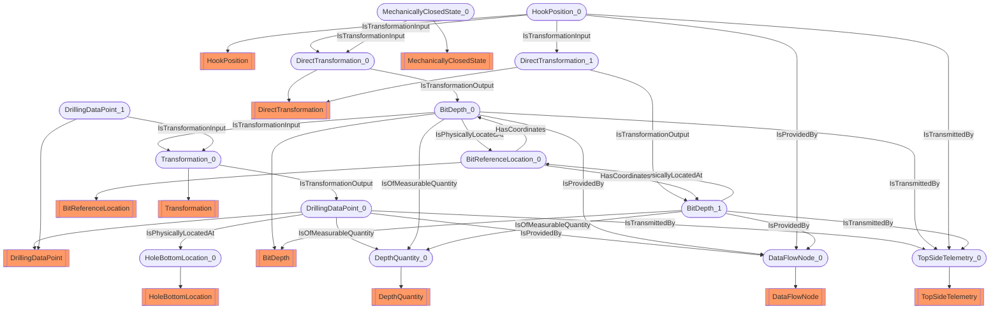

# Bit depth
- DrillingDataPoint:DrillingDataPoint_0
- DepthQuantity:DepthQuantity_0
- BitDepth:BitDepth_0
- BitReferenceLocation:BitReferenceLocation_0
- HoleBottomLocation:HoleBottomLocation_0
- Transformation:Transformation_0
- HookPosition:HookPosition_0
- DirectTransformation:DirectTransformation_0
- DrillingDataPoint:DrillingDataPoint_1
- MechanicallyClosedState:MechanicallyClosedState_0
- TopSideTelemetry:TopSideTelemetry_0
- DataFlowNode:DataFlowNode_0
- BitDepth:BitDepth_1
- DirectTransformation:DirectTransformation_1
- DrillingDataPoint_0 IsOfMeasurableQuantity DepthQuantity_0
- BitDepth_0 IsPhysicallyLocatedAt BitReferenceLocation_0
- DrillingDataPoint_0 IsPhysicallyLocatedAt HoleBottomLocation_0
- BitDepth_0 IsTransformationInput Transformation_0
- HookPosition_0 IsTransformationInput DirectTransformation_0
- DrillingDataPoint_1 IsTransformationInput Transformation_0
- MechanicallyClosedState_0 IsTransformationInput DirectTransformation_0
- Transformation_0 IsTransformationOutput DrillingDataPoint_0
- DirectTransformation_0 IsTransformationOutput BitDepth_0
- DrillingDataPoint_0 IsTransmittedBy TopSideTelemetry_0
- BitDepth_0 IsTransmittedBy TopSideTelemetry_0
- HookPosition_0 IsTransmittedBy TopSideTelemetry_0
- DrillingDataPoint_0 IsProvidedBy DataFlowNode_0
- BitDepth_0 IsProvidedBy DataFlowNode_0
- HookPosition_0 IsProvidedBy DataFlowNode_0
- BitReferenceLocation_0 HasCoordinates BitDepth_0
- BitDepth_0 IsOfMeasurableQuantity DepthQuantity_0
- BitDepth_1 IsPhysicallyLocatedAt BitReferenceLocation_0
- BitDepth_1 IsOfMeasurableQuantity DepthQuantity_0
- BitDepth_1 IsTransmittedBy TopSideTelemetry_0
- HookPosition_0 IsTransformationInput DirectTransformation_1
- DirectTransformation_1 IsTransformationOutput BitDepth_1
- BitDepth_1 IsProvidedBy DataFlowNode_0
- BitReferenceLocation_0 HasCoordinates BitDepth_1

