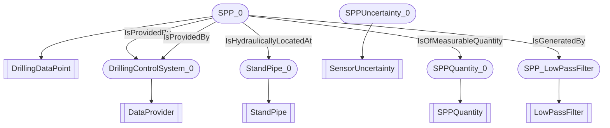

# DWIS-SPP
- DrillingDataPoint:SPP_0
- StandPipe:StandPipe_0
- SPPQuantity:SPPQuantity_0
- SensorUncertainty:SPPUncertainty_0
- LowPassFilter:SPP_LowPassFilter
- DataProvider:DrillingControlSystem_0
- SPP_0 IsProvidedBy DrillingControlSystem_0
- SPP_0 IsHydraulicallyLocatedAt StandPipe_0
- SPP_0 IsOfMeasurableQuantity SPPQuantity_0
- SPP_0 IsProvidedBy DrillingControlSystem_0
- SPP_0 IsGeneratedBy SPP_LowPassFilter

