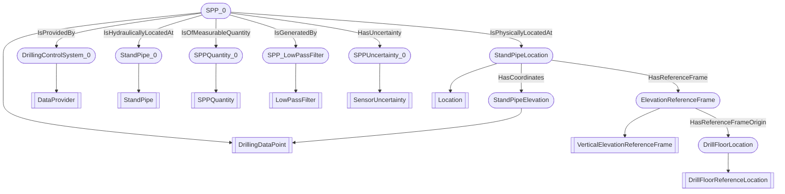

# DWIS-SPP
- DrillingDataPoint:SPP_0
- StandPipe:StandPipe_0
- SPPQuantity:SPPQuantity_0
- SensorUncertainty:SPPUncertainty_0
- LowPassFilter:SPP_LowPassFilter
- DataProvider:DrillingControlSystem_0
- Location:StandPipeLocation
- DrillFloorReferenceLocation:DrillFloorLocation
- DrillingDataPoint:StandPipeElevation
- VerticalElevationReferenceFrame:ElevationReferenceFrame
- SPP_0 IsProvidedBy DrillingControlSystem_0
- SPP_0 IsHydraulicallyLocatedAt StandPipe_0
- SPP_0 IsOfMeasurableQuantity SPPQuantity_0
- SPP_0 IsGeneratedBy SPP_LowPassFilter
- SPP_0 HasUncertainty SPPUncertainty_0
- SPP_0 IsPhysicallyLocatedAt StandPipeLocation
- StandPipeLocation HasCoordinates StandPipeElevation
- StandPipeLocation HasReferenceFrame ElevationReferenceFrame
- ElevationReferenceFrame HasReferenceFrameOrigin DrillFloorLocation

