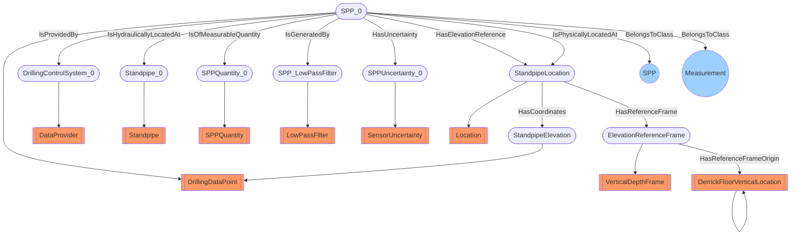

# DWIS-SPP0
- DrillingDataPoint:SPP_0
- Standpipe:Standpipe_0
- SPPQuantity:SPPQuantity_0
- SensorUncertainty:SPPUncertainty_0
- LowPassFilter:SPP_LowPassFilter
- DataProvider:DrillingControlSystem_0
- Location:StandpipeLocation
- DerrickFloorVerticalLocation:DerrickFloorVerticalLocation
- DrillingDataPoint:StandpipeElevation
- VerticalDepthFrame:ElevationReferenceFrame
- SPP_0 BelongsToClass SPP
- SPP_0 BelongsToClass Measurement
- SPP_0 IsProvidedBy DrillingControlSystem_0
- SPP_0 IsHydraulicallyLocatedAt Standpipe_0
- SPP_0 IsOfMeasurableQuantity SPPQuantity_0
- SPP_0 IsGeneratedBy SPP_LowPassFilter
- SPP_0 HasUncertainty SPPUncertainty_0
- SPP_0 HasElevationReference StandpipeLocation
- SPP_0 IsPhysicallyLocatedAt StandpipeLocation
- StandpipeLocation HasCoordinates StandpipeElevation
- StandpipeLocation HasReferenceFrame ElevationReferenceFrame
- ElevationReferenceFrame HasReferenceFrameOrigin DerrickFloorVerticalLocation

