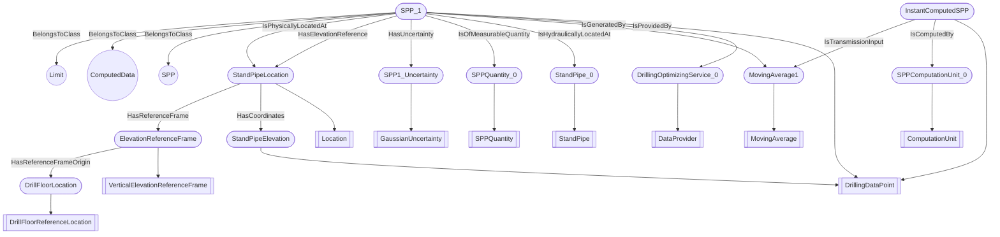

# DWIS-SPP1
- StandPipe:StandPipe_0
- SPPQuantity:SPPQuantity_0
- Location:StandPipeLocation
- DrillFloorReferenceLocation:DrillFloorLocation
- DrillingDataPoint:StandPipeElevation
- VerticalElevationReferenceFrame:ElevationReferenceFrame
- DrillingDataPoint:SPP_1
- DataProvider:DrillingOptimizingService_0
- MovingAverage:MovingAverage1
- GaussianUncertainty:SPP1_Uncertainty
- ComputationUnit:SPPComputationUnit_0
- DrillingDataPoint:InstantComputedSPP
- SPP_1 BelongsToClass SPP
- SPP_1 BelongsToClass ComputedData
- SPP_1 BelongsToClass Limit
- StandPipeLocation HasCoordinates StandPipeElevation
- StandPipeLocation HasReferenceFrame ElevationReferenceFrame
- ElevationReferenceFrame HasReferenceFrameOrigin DrillFloorLocation
- SPP_1 IsProvidedBy DrillingOptimizingService_0
- SPP_1 IsGeneratedBy MovingAverage1
- SPP_1 IsHydraulicallyLocatedAt StandPipe_0
- SPP_1 IsOfMeasurableQuantity SPPQuantity_0
- SPP_1 HasUncertainty SPP1_Uncertainty
- SPP_1 HasElevationReference StandPipeLocation
- SPP_1 IsPhysicallyLocatedAt StandPipeLocation
- InstantComputedSPP IsComputedBy SPPComputationUnit_0
- InstantComputedSPP IsTransmissionInput MovingAverage1

