# DWIS-SPPs
- DrillingDataPoint:SPP_0
- StandPipe:StandPipe_0
- SPPQuantity:SPPQuantity_0
- SensorUncertainty:SPPUncertainty_0
- LowPassFilter:SPP_LowPassFilter
- DataProvider:DrillingControlSystem_0
- Location:StandPipeLocation
- DrillFloorReferenceLocation:DrillFloorLocation
- DrillingDataPoint:StandPipeElevation
- VerticalElevationReferenceFrame:ElevationReferenceFrame
- DrillingDataPoint:SPP_1
- DataProvider:DrillingOptimizingService_0
- MovingAverage:MovingAverage1
- GaussianUncertainty:SPP1_Uncertainty
- ComputationUnit:SPPComputationUnit_0
- DrillingDataPoint:InstantComputedSPP
- SPP_0 BelongsToClass SPP
- SPP_0 BelongsToClass Measurement
- SPP_1 BelongsToClass SPP
- SPP_1 BelongsToClass ComputedData
- SPP_1 BelongsToClass Limit
- SPP_0 IsProvidedBy DrillingControlSystem_0
- SPP_0 IsHydraulicallyLocatedAt StandPipe_0
- SPP_0 IsOfMeasurableQuantity SPPQuantity_0
- SPP_0 IsGeneratedBy SPP_LowPassFilter
- SPP_0 HasUncertainty SPPUncertainty_0
- SPP_0 HasElevationReference StandPipeLocation
- SPP_0 IsPhysicallyLocatedAt StandPipeLocation
- StandPipeLocation HasCoordinates StandPipeElevation
- StandPipeLocation HasReferenceFrame ElevationReferenceFrame
- ElevationReferenceFrame HasReferenceFrameOrigin DrillFloorLocation
- SPP_1 IsProvidedBy DrillingOptimizingService_0
- SPP_1 IsGeneratedBy MovingAverage1
- SPP_1 IsHydraulicallyLocatedAt StandPipe_0
- SPP_1 IsOfMeasurableQuantity SPPQuantity_0
- SPP_1 HasUncertainty SPP1_Uncertainty
- SPP_1 HasElevationReference StandPipeLocation
- SPP_1 IsPhysicallyLocatedAt StandPipeLocation
- InstantComputedSPP IsComputedBy SPPComputationUnit_0
- InstantComputedSPP IsTransmissionInput MovingAverage1

```mermaid
flowchart TD
	SPP_0([SPP_0]) --> DrillingDataPoint[[DrillingDataPoint]]
	StandPipe_0([StandPipe_0]) --> StandPipe[[StandPipe]]
	SPPQuantity_0([SPPQuantity_0]) --> SPPQuantity[[SPPQuantity]]
	SPPUncertainty_0([SPPUncertainty_0]) --> SensorUncertainty[[SensorUncertainty]]
	SPP_LowPassFilter([SPP_LowPassFilter]) --> LowPassFilter[[LowPassFilter]]
	DrillingControlSystem_0([DrillingControlSystem_0]) --> DataProvider[[DataProvider]]
	StandPipeLocation([StandPipeLocation]) --> Location[[Location]]
	DrillFloorLocation([DrillFloorLocation]) --> DrillFloorReferenceLocation[[DrillFloorReferenceLocation]]
	StandPipeElevation([StandPipeElevation]) --> DrillingDataPoint[[DrillingDataPoint]]
	ElevationReferenceFrame([ElevationReferenceFrame]) --> VerticalElevationReferenceFrame[[VerticalElevationReferenceFrame]]
	SPP_1([SPP_1]) --> DrillingDataPoint[[DrillingDataPoint]]
	DrillingOptimizingService_0([DrillingOptimizingService_0]) --> DataProvider[[DataProvider]]
	MovingAverage1([MovingAverage1]) --> MovingAverage[[MovingAverage]]
	SPP1_Uncertainty([SPP1_Uncertainty]) --> GaussianUncertainty[[GaussianUncertainty]]
	SPPComputationUnit_0([SPPComputationUnit_0]) --> ComputationUnit[[ComputationUnit]]
	InstantComputedSPP([InstantComputedSPP]) --> DrillingDataPoint[[DrillingDataPoint]]
	 SPP_0 -- IsProvidedBy --> DrillingControlSystem_0 
	 SPP_0 -- IsHydraulicallyLocatedAt --> StandPipe_0 
	 SPP_0 -- IsOfMeasurableQuantity --> SPPQuantity_0 
	 SPP_0 -- IsGeneratedBy --> SPP_LowPassFilter 
	 SPP_0 -- HasUncertainty --> SPPUncertainty_0 
	 SPP_0 -- HasElevationReference --> StandPipeLocation 
	 SPP_0 -- IsPhysicallyLocatedAt --> StandPipeLocation 
	 StandPipeLocation -- HasCoordinates --> StandPipeElevation 
	 StandPipeLocation -- HasReferenceFrame --> ElevationReferenceFrame 
	 ElevationReferenceFrame -- HasReferenceFrameOrigin --> DrillFloorLocation 
	 SPP_1 -- IsProvidedBy --> DrillingOptimizingService_0 
	 SPP_1 -- IsGeneratedBy --> MovingAverage1 
	 SPP_1 -- IsHydraulicallyLocatedAt --> StandPipe_0 
	 SPP_1 -- IsOfMeasurableQuantity --> SPPQuantity_0 
	 SPP_1 -- HasUncertainty --> SPP1_Uncertainty 
	 SPP_1 -- HasElevationReference --> StandPipeLocation 
	 SPP_1 -- IsPhysicallyLocatedAt --> StandPipeLocation 
	 InstantComputedSPP -- IsComputedBy --> SPPComputationUnit_0 
	 InstantComputedSPP -- IsTransmissionInput --> MovingAverage1 
	 SPP_0 -- BelongsToClass --> SPP((SPP)) 
	 SPP_0 -- BelongsToClass --> Measurement((Measurement)) 
	 SPP_1 -- BelongsToClass --> SPP((SPP)) 
	 SPP_1 -- BelongsToClass --> ComputedData((ComputedData)) 
	 SPP_1 -- BelongsToClass --> Limit((Limit)) 
```

