# DWIS-SPPs
- DrillingDataPoint:SPP_0
- Standpipe:Standpipe_0
- SPPQuantity:SPPQuantity_0
- SensorUncertainty:SPPUncertainty_0
- LowPassFilter:SPP_LowPassFilter
- DataProvider:DrillingControlSystem_0
- Location:StandpipeLocation
- DerrickFloorVerticalLocation:DrillFloorLocation
- DrillingDataPoint:StandpipeElevation
- VerticalDepthFrame:ElevationReferenceFrame
- DrillingDataPoint:SPP_1
- DataProvider:DrillingOptimizingService_0
- MovingAverage:MovingAverage1
- GaussianUncertainty:SPP1_Uncertainty
- ComputationUnit:SPPComputationUnit_0
- DrillingDataPoint:InstantComputedSPP
- SPP_0 BelongsToClass SPP
- SPP_0 BelongsToClass Measurement
- SPP_1 BelongsToClass SPP
- SPP_1 BelongsToClass ComputedData
- SPP_1 BelongsToClass Limit
- SPP_0 IsProvidedBy DrillingControlSystem_0
- SPP_0 IsHydraulicallyLocatedAt Standpipe_0
- SPP_0 IsOfMeasurableQuantity SPPQuantity_0
- SPP_0 IsGeneratedBy SPP_LowPassFilter
- SPP_0 HasUncertainty SPPUncertainty_0
- SPP_0 HasElevationReference StandpipeLocation
- SPP_0 IsPhysicallyLocatedAt StandpipeLocation
- StandpipeLocation HasCoordinates StandpipeElevation
- StandpipeLocation HasReferenceFrame ElevationReferenceFrame
- ElevationReferenceFrame HasReferenceFrameOrigin DrillFloorLocation
- SPP_1 IsProvidedBy DrillingOptimizingService_0
- SPP_1 IsGeneratedBy MovingAverage1
- SPP_1 IsHydraulicallyLocatedAt Standpipe_0
- SPP_1 IsOfMeasurableQuantity SPPQuantity_0
- SPP_1 HasUncertainty SPP1_Uncertainty
- SPP_1 HasElevationReference StandpipeLocation
- SPP_1 IsPhysicallyLocatedAt StandpipeLocation
- InstantComputedSPP IsComputedBy SPPComputationUnit_0
- InstantComputedSPP IsTransmissionInput MovingAverage1

```mermaid
flowchart TD
	 classDef typeClass fill:#f96;
	 classDef classClass fill:#9dd0ff;
	SPP_0([SPP_0]) --> DrillingDataPoint[[DrillingDataPoint]]:::typeClass
	Standpipe_0([Standpipe_0]) --> Standpipe[[Standpipe]]:::typeClass
	SPPQuantity_0([SPPQuantity_0]) --> SPPQuantity[[SPPQuantity]]:::typeClass
	SPPUncertainty_0([SPPUncertainty_0]) --> SensorUncertainty[[SensorUncertainty]]:::typeClass
	SPP_LowPassFilter([SPP_LowPassFilter]) --> LowPassFilter[[LowPassFilter]]:::typeClass
	DrillingControlSystem_0([DrillingControlSystem_0]) --> DataProvider[[DataProvider]]:::typeClass
	StandpipeLocation([StandpipeLocation]) --> Location[[Location]]:::typeClass
	DrillFloorLocation([DrillFloorLocation]) --> DerrickFloorVerticalLocation[[DerrickFloorVerticalLocation]]:::typeClass
	StandpipeElevation([StandpipeElevation]) --> DrillingDataPoint[[DrillingDataPoint]]:::typeClass
	ElevationReferenceFrame([ElevationReferenceFrame]) --> VerticalDepthFrame[[VerticalDepthFrame]]:::typeClass
	SPP_1([SPP_1]) --> DrillingDataPoint[[DrillingDataPoint]]:::typeClass
	DrillingOptimizingService_0([DrillingOptimizingService_0]) --> DataProvider[[DataProvider]]:::typeClass
	MovingAverage1([MovingAverage1]) --> MovingAverage[[MovingAverage]]:::typeClass
	SPP1_Uncertainty([SPP1_Uncertainty]) --> GaussianUncertainty[[GaussianUncertainty]]:::typeClass
	SPPComputationUnit_0([SPPComputationUnit_0]) --> ComputationUnit[[ComputationUnit]]:::typeClass
	InstantComputedSPP([InstantComputedSPP]) --> DrillingDataPoint[[DrillingDataPoint]]:::typeClass
	 SPP_0 -- IsProvidedBy --> DrillingControlSystem_0 
	 SPP_0 -- IsHydraulicallyLocatedAt --> Standpipe_0 
	 SPP_0 -- IsOfMeasurableQuantity --> SPPQuantity_0 
	 SPP_0 -- IsGeneratedBy --> SPP_LowPassFilter 
	 SPP_0 -- HasUncertainty --> SPPUncertainty_0 
	 SPP_0 -- HasElevationReference --> StandpipeLocation 
	 SPP_0 -- IsPhysicallyLocatedAt --> StandpipeLocation 
	 StandpipeLocation -- HasCoordinates --> StandpipeElevation 
	 StandpipeLocation -- HasReferenceFrame --> ElevationReferenceFrame 
	 ElevationReferenceFrame -- HasReferenceFrameOrigin --> DrillFloorLocation 
	 SPP_1 -- IsProvidedBy --> DrillingOptimizingService_0 
	 SPP_1 -- IsGeneratedBy --> MovingAverage1 
	 SPP_1 -- IsHydraulicallyLocatedAt --> Standpipe_0 
	 SPP_1 -- IsOfMeasurableQuantity --> SPPQuantity_0 
	 SPP_1 -- HasUncertainty --> SPP1_Uncertainty 
	 SPP_1 -- HasElevationReference --> StandpipeLocation 
	 SPP_1 -- IsPhysicallyLocatedAt --> StandpipeLocation 
	 InstantComputedSPP -- IsComputedBy --> SPPComputationUnit_0 
	 InstantComputedSPP -- IsTransmissionInput --> MovingAverage1 
	 SPP_0 -- BelongsToClass --> SPP((SPP)):::classClass
	 SPP_0 -- BelongsToClass --> Measurement((Measurement)):::classClass
	 SPP_1 -- BelongsToClass --> SPP((SPP)):::classClass
	 SPP_1 -- BelongsToClass --> ComputedData((ComputedData)):::classClass
	 SPP_1 -- BelongsToClass --> Limit((Limit)):::classClass
```

