# Density use case
- DensityIn:DensityIn_0
- TemperatureIn:TemperatureIn_0
- DrillingDataPoint:DrillingDataPoint_0
- DensityIn:DensityIn_1
- SPP:SPP_0
- TemperatureIn:TemperatureIn_1
- ActiveDrillingSystem:ActivePit_0
- MudMixing:MudMixing_0
- MudStandpipe:StandPipe_0
- DrillingTemperatureQuantity:FluidTemperatureInQuantity_0
- PressureQuantity:PressureQuantity_0
- DrillingDensityQuantity:FluidDensityInQuantity_0
- DensityIn_0 IsDependentOn TemperatureIn_0
- DensityIn_0 IsDependentOn DrillingDataPoint_0
- DensityIn_1 IsDependentOn SPP_0
- DensityIn_1 IsDependentOn TemperatureIn_1
- TemperatureIn_0 IsHydraulicallyLocatedAt ActivePit_0
- DensityIn_0 IsHydraulicallyLocatedAt MudMixing_0
- DensityIn_1 IsHydraulicallyLocatedAt StandPipe_0
- TemperatureIn_0 IsOfMeasurableQuantity FluidTemperatureInQuantity_0
- DrillingDataPoint_0 IsOfMeasurableQuantity PressureQuantity_0
- DensityIn_0 IsOfMeasurableQuantity FluidDensityInQuantity_0
- DensityIn_1 IsOfMeasurableQuantity FluidDensityInQuantity_0
- TemperatureIn_1 IsOfMeasurableQuantity FluidTemperatureInQuantity_0

```mermaid
flowchart TD
	 classDef typeClass fill:#f96;
	 classDef classClass fill:#9dd0ff;
	DensityIn_0([DensityIn_0]) --> DensityIn[[DensityIn]]:::typeClass
	TemperatureIn_0([TemperatureIn_0]) --> TemperatureIn[[TemperatureIn]]:::typeClass
	DrillingDataPoint_0([DrillingDataPoint_0]) --> DrillingDataPoint[[DrillingDataPoint]]:::typeClass
	DensityIn_1([DensityIn_1]) --> DensityIn[[DensityIn]]:::typeClass
	SPP_0([SPP_0]) --> SPP[[SPP]]:::typeClass
	TemperatureIn_1([TemperatureIn_1]) --> TemperatureIn[[TemperatureIn]]:::typeClass
	ActivePit_0([ActivePit_0]) --> ActiveDrillingSystem[[ActiveDrillingSystem]]:::typeClass
	MudMixing_0([MudMixing_0]) --> MudMixing[[MudMixing]]:::typeClass
	StandPipe_0([StandPipe_0]) --> MudStandpipe[[MudStandpipe]]:::typeClass
	FluidTemperatureInQuantity_0([FluidTemperatureInQuantity_0]) --> DrillingTemperatureQuantity[[DrillingTemperatureQuantity]]:::typeClass
	PressureQuantity_0([PressureQuantity_0]) --> PressureQuantity[[PressureQuantity]]:::typeClass
	FluidDensityInQuantity_0([FluidDensityInQuantity_0]) --> DrillingDensityQuantity[[DrillingDensityQuantity]]:::typeClass
	 DensityIn_0 -- IsDependentOn --> TemperatureIn_0 
	 DensityIn_0 -- IsDependentOn --> DrillingDataPoint_0 
	 DensityIn_1 -- IsDependentOn --> SPP_0 
	 DensityIn_1 -- IsDependentOn --> TemperatureIn_1 
	 TemperatureIn_0 -- IsHydraulicallyLocatedAt --> ActivePit_0 
	 DensityIn_0 -- IsHydraulicallyLocatedAt --> MudMixing_0 
	 DensityIn_1 -- IsHydraulicallyLocatedAt --> StandPipe_0 
	 TemperatureIn_0 -- IsOfMeasurableQuantity --> FluidTemperatureInQuantity_0 
	 DrillingDataPoint_0 -- IsOfMeasurableQuantity --> PressureQuantity_0 
	 DensityIn_0 -- IsOfMeasurableQuantity --> FluidDensityInQuantity_0 
	 DensityIn_1 -- IsOfMeasurableQuantity --> FluidDensityInQuantity_0 
	 TemperatureIn_1 -- IsOfMeasurableQuantity --> FluidTemperatureInQuantity_0 
```

