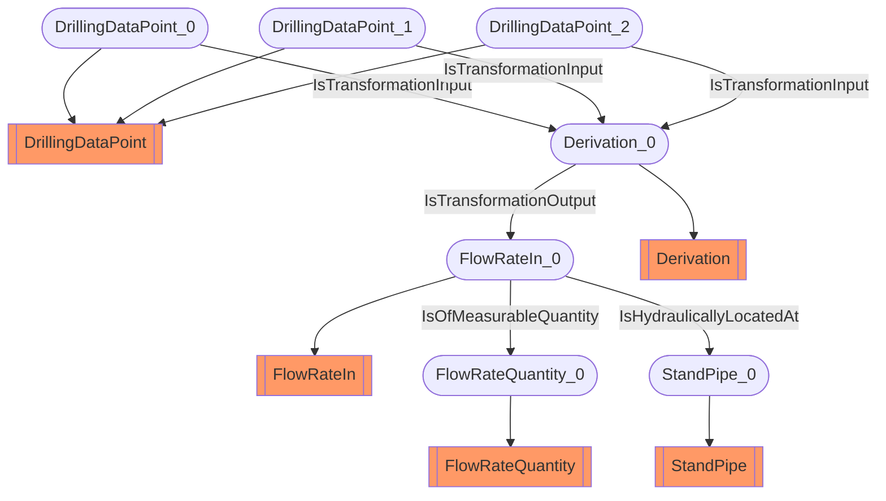

# Flow-rate In
- FlowRateIn:FlowRateIn_0
- FlowRateQuantity:FlowRateQuantity_0
- DrillingDataPoint:DrillingDataPoint_0
- Derivation:Derivation_0
- DrillingDataPoint:DrillingDataPoint_1
- DrillingDataPoint:DrillingDataPoint_2
- StandPipe:StandPipe_0
- FlowRateIn_0 IsOfMeasurableQuantity FlowRateQuantity_0
- DrillingDataPoint_0 IsTransformationInput Derivation_0
- DrillingDataPoint_1 IsTransformationInput Derivation_0
- DrillingDataPoint_2 IsTransformationInput Derivation_0
- Derivation_0 IsTransformationOutput FlowRateIn_0
- FlowRateIn_0 IsHydraulicallyLocatedAt StandPipe_0

