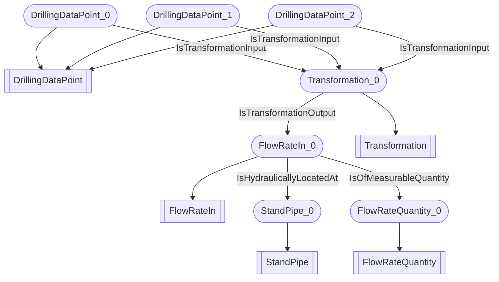

# Flow-rate aggregation
- (#FlowRateIn):FlowRateIn_0
- (#StandPipe):StandPipe_0
- (#FlowRateQuantity):FlowRateQuantity_0
- (#DrillingDataPoint):DrillingDataPoint_0
- (#Transformation):Transformation_0
- (#DrillingDataPoint):DrillingDataPoint_1
- (#DrillingDataPoint):DrillingDataPoint_2
- FlowRateIn_0 (#IsHydraulicallyLocatedAt) StandPipe_0
- FlowRateIn_0 (#IsOfMeasurableQuantity) FlowRateQuantity_0
- DrillingDataPoint_0 (#IsTransformationInput) Transformation_0
- DrillingDataPoint_1 (#IsTransformationInput) Transformation_0
- DrillingDataPoint_2 (#IsTransformationInput) Transformation_0
- Transformation_0 (#IsTransformationOutput) FlowRateIn_0

