# Flow-rates
- DrillingDataPoint:DrillingDataPoint_0
- DrillingDataPoint:DrillingDataPoint_1
- DrillingDataPoint:DrillingDataPoint_2
- PumpRate:PumpRate_0
- PumpRate:PumpRate_1
- PumpRate:PumpRate_2
- DrillingDataPoint:DrillingDataPoint_3
- VolumeQuantity:VolumeQuantity_0
- DrillingDataPoint:DrillingDataPoint_4
- DrillingDataPoint:DrillingDataPoint_5
- DrillingDataPoint:DrillingDataPoint_6
- ProportionQuantity:ProportionQuantity_0
- DrillingDataPoint:DrillingDataPoint_7
- DrillingDataPoint:DrillingDataPoint_8
- DrillingDataPoint:DrillingDataPoint_9
- Derivation:Derivation_0
- DrillingDataPoint:DrillingDataPoint_10
- Derivation:Derivation_1
- DrillingDataPoint:DrillingDataPoint_11
- Derivation:Derivation_2
- Transformation:Transformation_0
- Transformation:Transformation_1
- Transformation:Transformation_2
- MudPump:MudPump_0
- MudPump:MudPump_1
- CementPump:CementPump_0
- DrillingDataPoint_3 IsOfMeasurableQuantity VolumeQuantity_0
- DrillingDataPoint_4 IsOfMeasurableQuantity VolumeQuantity_0
- DrillingDataPoint_5 IsOfMeasurableQuantity VolumeQuantity_0
- DrillingDataPoint_6 IsOfMeasurableQuantity ProportionQuantity_0
- DrillingDataPoint_7 IsOfMeasurableQuantity ProportionQuantity_0
- DrillingDataPoint_8 IsOfMeasurableQuantity ProportionQuantity_0
- DrillingDataPoint_9 IsTransformationInput Derivation_0
- DrillingDataPoint_10 IsTransformationInput Derivation_1
- DrillingDataPoint_11 IsTransformationInput Derivation_2
- Derivation_0 IsTransformationOutput PumpRate_0
- Derivation_1 IsTransformationOutput PumpRate_1
- Derivation_2 IsTransformationOutput PumpRate_2
- PumpRate_0 IsTransformationInput Transformation_0
- PumpRate_1 IsTransformationInput Transformation_1
- PumpRate_2 IsTransformationInput Transformation_2
- DrillingDataPoint_6 IsTransformationInput Transformation_0
- DrillingDataPoint_7 IsTransformationInput Transformation_1
- DrillingDataPoint_8 IsTransformationInput Transformation_2
- DrillingDataPoint_3 IsTransformationInput Transformation_0
- DrillingDataPoint_4 IsTransformationInput Transformation_1
- DrillingDataPoint_5 IsTransformationInput Transformation_2
- Transformation_0 IsTransformationOutput DrillingDataPoint_0
- Transformation_1 IsTransformationOutput DrillingDataPoint_1
- Transformation_2 IsTransformationOutput DrillingDataPoint_2
- DrillingDataPoint_0 IsDependentOn DrillingDataPoint_6
- DrillingDataPoint_1 IsDependentOn DrillingDataPoint_7
- DrillingDataPoint_2 IsDependentOn DrillingDataPoint_8
- DrillingDataPoint_0 IsDependentOn DrillingDataPoint_3
- DrillingDataPoint_1 IsDependentOn DrillingDataPoint_4
- DrillingDataPoint_2 IsDependentOn DrillingDataPoint_5
- DrillingDataPoint_0 IsHydraulicallyLocatedAt MudPump_0
- PumpRate_0 IsHydraulicallyLocatedAt MudPump_0
- DrillingDataPoint_9 IsHydraulicallyLocatedAt MudPump_0
- DrillingDataPoint_6 IsHydraulicallyLocatedAt MudPump_0
- DrillingDataPoint_3 IsHydraulicallyLocatedAt MudPump_0
- DrillingDataPoint_1 IsHydraulicallyLocatedAt MudPump_1
- PumpRate_1 IsHydraulicallyLocatedAt MudPump_1
- DrillingDataPoint_10 IsHydraulicallyLocatedAt MudPump_1
- DrillingDataPoint_7 IsHydraulicallyLocatedAt MudPump_1
- DrillingDataPoint_4 IsHydraulicallyLocatedAt MudPump_1
- DrillingDataPoint_2 IsHydraulicallyLocatedAt CementPump_0
- PumpRate_2 IsHydraulicallyLocatedAt CementPump_0
- DrillingDataPoint_11 IsHydraulicallyLocatedAt CementPump_0
- DrillingDataPoint_8 IsHydraulicallyLocatedAt CementPump_0
- DrillingDataPoint_5 IsHydraulicallyLocatedAt CementPump_0

```mermaid
flowchart TD
	 classDef typeClass fill:#f96;
	 classDef classClass fill:#9dd0ff;
	DrillingDataPoint_0([DrillingDataPoint_0]) --> DrillingDataPoint[[DrillingDataPoint]]:::typeClass
	DrillingDataPoint_1([DrillingDataPoint_1]) --> DrillingDataPoint[[DrillingDataPoint]]:::typeClass
	DrillingDataPoint_2([DrillingDataPoint_2]) --> DrillingDataPoint[[DrillingDataPoint]]:::typeClass
	PumpRate_0([PumpRate_0]) --> PumpRate[[PumpRate]]:::typeClass
	PumpRate_1([PumpRate_1]) --> PumpRate[[PumpRate]]:::typeClass
	PumpRate_2([PumpRate_2]) --> PumpRate[[PumpRate]]:::typeClass
	DrillingDataPoint_3([DrillingDataPoint_3]) --> DrillingDataPoint[[DrillingDataPoint]]:::typeClass
	VolumeQuantity_0([VolumeQuantity_0]) --> VolumeQuantity[[VolumeQuantity]]:::typeClass
	DrillingDataPoint_4([DrillingDataPoint_4]) --> DrillingDataPoint[[DrillingDataPoint]]:::typeClass
	DrillingDataPoint_5([DrillingDataPoint_5]) --> DrillingDataPoint[[DrillingDataPoint]]:::typeClass
	DrillingDataPoint_6([DrillingDataPoint_6]) --> DrillingDataPoint[[DrillingDataPoint]]:::typeClass
	ProportionQuantity_0([ProportionQuantity_0]) --> ProportionQuantity[[ProportionQuantity]]:::typeClass
	DrillingDataPoint_7([DrillingDataPoint_7]) --> DrillingDataPoint[[DrillingDataPoint]]:::typeClass
	DrillingDataPoint_8([DrillingDataPoint_8]) --> DrillingDataPoint[[DrillingDataPoint]]:::typeClass
	DrillingDataPoint_9([DrillingDataPoint_9]) --> DrillingDataPoint[[DrillingDataPoint]]:::typeClass
	Derivation_0([Derivation_0]) --> Derivation[[Derivation]]:::typeClass
	DrillingDataPoint_10([DrillingDataPoint_10]) --> DrillingDataPoint[[DrillingDataPoint]]:::typeClass
	Derivation_1([Derivation_1]) --> Derivation[[Derivation]]:::typeClass
	DrillingDataPoint_11([DrillingDataPoint_11]) --> DrillingDataPoint[[DrillingDataPoint]]:::typeClass
	Derivation_2([Derivation_2]) --> Derivation[[Derivation]]:::typeClass
	Transformation_0([Transformation_0]) --> Transformation[[Transformation]]:::typeClass
	Transformation_1([Transformation_1]) --> Transformation[[Transformation]]:::typeClass
	Transformation_2([Transformation_2]) --> Transformation[[Transformation]]:::typeClass
	MudPump_0([MudPump_0]) --> MudPump[[MudPump]]:::typeClass
	MudPump_1([MudPump_1]) --> MudPump[[MudPump]]:::typeClass
	CementPump_0([CementPump_0]) --> CementPump[[CementPump]]:::typeClass
	 DrillingDataPoint_3 -- IsOfMeasurableQuantity --> VolumeQuantity_0 
	 DrillingDataPoint_4 -- IsOfMeasurableQuantity --> VolumeQuantity_0 
	 DrillingDataPoint_5 -- IsOfMeasurableQuantity --> VolumeQuantity_0 
	 DrillingDataPoint_6 -- IsOfMeasurableQuantity --> ProportionQuantity_0 
	 DrillingDataPoint_7 -- IsOfMeasurableQuantity --> ProportionQuantity_0 
	 DrillingDataPoint_8 -- IsOfMeasurableQuantity --> ProportionQuantity_0 
	 DrillingDataPoint_9 -- IsTransformationInput --> Derivation_0 
	 DrillingDataPoint_10 -- IsTransformationInput --> Derivation_1 
	 DrillingDataPoint_11 -- IsTransformationInput --> Derivation_2 
	 Derivation_0 -- IsTransformationOutput --> PumpRate_0 
	 Derivation_1 -- IsTransformationOutput --> PumpRate_1 
	 Derivation_2 -- IsTransformationOutput --> PumpRate_2 
	 PumpRate_0 -- IsTransformationInput --> Transformation_0 
	 PumpRate_1 -- IsTransformationInput --> Transformation_1 
	 PumpRate_2 -- IsTransformationInput --> Transformation_2 
	 DrillingDataPoint_6 -- IsTransformationInput --> Transformation_0 
	 DrillingDataPoint_7 -- IsTransformationInput --> Transformation_1 
	 DrillingDataPoint_8 -- IsTransformationInput --> Transformation_2 
	 DrillingDataPoint_3 -- IsTransformationInput --> Transformation_0 
	 DrillingDataPoint_4 -- IsTransformationInput --> Transformation_1 
	 DrillingDataPoint_5 -- IsTransformationInput --> Transformation_2 
	 Transformation_0 -- IsTransformationOutput --> DrillingDataPoint_0 
	 Transformation_1 -- IsTransformationOutput --> DrillingDataPoint_1 
	 Transformation_2 -- IsTransformationOutput --> DrillingDataPoint_2 
	 DrillingDataPoint_0 -- IsDependentOn --> DrillingDataPoint_6 
	 DrillingDataPoint_1 -- IsDependentOn --> DrillingDataPoint_7 
	 DrillingDataPoint_2 -- IsDependentOn --> DrillingDataPoint_8 
	 DrillingDataPoint_0 -- IsDependentOn --> DrillingDataPoint_3 
	 DrillingDataPoint_1 -- IsDependentOn --> DrillingDataPoint_4 
	 DrillingDataPoint_2 -- IsDependentOn --> DrillingDataPoint_5 
	 DrillingDataPoint_0 -- IsHydraulicallyLocatedAt --> MudPump_0 
	 PumpRate_0 -- IsHydraulicallyLocatedAt --> MudPump_0 
	 DrillingDataPoint_9 -- IsHydraulicallyLocatedAt --> MudPump_0 
	 DrillingDataPoint_6 -- IsHydraulicallyLocatedAt --> MudPump_0 
	 DrillingDataPoint_3 -- IsHydraulicallyLocatedAt --> MudPump_0 
	 DrillingDataPoint_1 -- IsHydraulicallyLocatedAt --> MudPump_1 
	 PumpRate_1 -- IsHydraulicallyLocatedAt --> MudPump_1 
	 DrillingDataPoint_10 -- IsHydraulicallyLocatedAt --> MudPump_1 
	 DrillingDataPoint_7 -- IsHydraulicallyLocatedAt --> MudPump_1 
	 DrillingDataPoint_4 -- IsHydraulicallyLocatedAt --> MudPump_1 
	 DrillingDataPoint_2 -- IsHydraulicallyLocatedAt --> CementPump_0 
	 PumpRate_2 -- IsHydraulicallyLocatedAt --> CementPump_0 
	 DrillingDataPoint_11 -- IsHydraulicallyLocatedAt --> CementPump_0 
	 DrillingDataPoint_8 -- IsHydraulicallyLocatedAt --> CementPump_0 
	 DrillingDataPoint_5 -- IsHydraulicallyLocatedAt --> CementPump_0 
```

