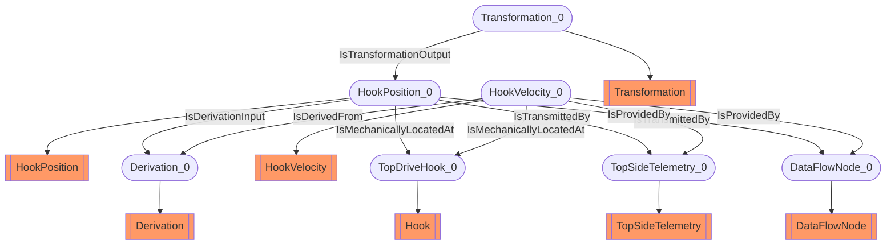

# Hook position and velocity
- HookPosition:HookPosition_0
- Derivation:Derivation_0
- HookVelocity:HookVelocity_0
- Hook:TopDriveHook_0
- Transformation:Transformation_0
- TopSideTelemetry:TopSideTelemetry_0
- DataFlowNode:DataFlowNode_0
- HookPosition_0 IsDerivationInput Derivation_0
- HookVelocity_0 IsDerivedFrom Derivation_0
- HookPosition_0 IsMechanicallyLocatedAt TopDriveHook_0
- HookVelocity_0 IsMechanicallyLocatedAt TopDriveHook_0
- Transformation_0 IsTransformationOutput HookPosition_0
- HookPosition_0 IsTransmittedBy TopSideTelemetry_0
- HookVelocity_0 IsTransmittedBy TopSideTelemetry_0
- HookPosition_0 IsProvidedBy DataFlowNode_0
- HookVelocity_0 IsProvidedBy DataFlowNode_0

