# Hookloads
- (#DrillingDataPoint):DrillingDataPoint_0
- (#DeadLine):DeadLine_0
- (#HookLoad):HookLoad_0
- (#TravellingBlock):TravellingBlock_0
- (#HookLoad):HookLoad_1
- (#TopDriveShaft):TopDriveShaft_0
- (#DrillingDataPoint):DrillingDataPoint_1
- (#DrillingDataPoint):DrillingDataPoint_2
- (#HookloadQuantity):HookloadQuantity_0
- (#Transformation):Transformation_0
- (#ForceToLoadTransformation):ForceToLoadTransformation_0
- (#ForceToLoadTransformation):ForceToLoadTransformation_1
- (#DrillingDataPoint):DrillingDataPoint_3
- (#TopSideTelemetry):TopSideTelemetry_0
- (#DataFlowNode):DataFlowNode_0
- (#TimeWindowMovingAverage):TimeWindowMovingAverage_0
- (#TimeWindowMovingAverage):TimeWindowMovingAverage_1
- DrillingDataPoint_0 (#IsMechanicallyLocatedAt) DeadLine_0
- HookLoad_0 (#IsMechanicallyLocatedAt) TravellingBlock_0
- HookLoad_1 (#IsMechanicallyLocatedAt) TopDriveShaft_0
- DrillingDataPoint_1 (#IsMechanicallyLocatedAt) TopDriveShaft_0
- DrillingDataPoint_2 (#IsMechanicallyLocatedAt) TravellingBlock_0
- HookLoad_0 (#IsOfMeasurableQuantity) HookloadQuantity_0
- HookLoad_1 (#IsOfMeasurableQuantity) HookloadQuantity_0
- DrillingDataPoint_0 (#IsTransformationInput) Transformation_0
- DrillingDataPoint_1 (#IsTransformationInput) ForceToLoadTransformation_0
- DrillingDataPoint_2 (#IsTransformationInput) ForceToLoadTransformation_1
- ForceToLoadTransformation_1 (#IsTransformationOutput) HookLoad_0
- ForceToLoadTransformation_0 (#IsTransformationOutput) HookLoad_1
- Transformation_0 (#IsTransformationOutput) DrillingDataPoint_2
- HookLoad_1 (#IsValidBy) DrillingDataPoint_3
- DrillingDataPoint_0 (#IsTransmittedBy) TopSideTelemetry_0
- DrillingDataPoint_1 (#IsTransmittedBy) TopSideTelemetry_0
- HookLoad_0 (#IsTransmittedBy) TopSideTelemetry_0
- HookLoad_1 (#IsTransmittedBy) TopSideTelemetry_0
- DrillingDataPoint_2 (#IsTransmittedBy) TopSideTelemetry_0
- DrillingDataPoint_0 (#IsProvidedBy) DataFlowNode_0
- DrillingDataPoint_1 (#IsProvidedBy) DataFlowNode_0
- HookLoad_0 (#IsProvidedBy) DataFlowNode_0
- HookLoad_1 (#IsProvidedBy) DataFlowNode_0
- DrillingDataPoint_2 (#IsProvidedBy) DataFlowNode_0
- HookLoad_0 (#IsProcessedBy) TimeWindowMovingAverage_0
- HookLoad_1 (#IsProcessedBy) TimeWindowMovingAverage_1

```mermaid
flowchart TD
	DrillingDataPoint_0([DrillingDataPoint_0]) --> DrillingDataPoint[[DrillingDataPoint]]
	DeadLine_0([DeadLine_0]) --> DeadLine[[DeadLine]]
	HookLoad_0([HookLoad_0]) --> HookLoad[[HookLoad]]
	TravellingBlock_0([TravellingBlock_0]) --> TravellingBlock[[TravellingBlock]]
	HookLoad_1([HookLoad_1]) --> HookLoad[[HookLoad]]
	TopDriveShaft_0([TopDriveShaft_0]) --> TopDriveShaft[[TopDriveShaft]]
	DrillingDataPoint_1([DrillingDataPoint_1]) --> DrillingDataPoint[[DrillingDataPoint]]
	DrillingDataPoint_2([DrillingDataPoint_2]) --> DrillingDataPoint[[DrillingDataPoint]]
	HookloadQuantity_0([HookloadQuantity_0]) --> HookloadQuantity[[HookloadQuantity]]
	Transformation_0([Transformation_0]) --> Transformation[[Transformation]]
	ForceToLoadTransformation_0([ForceToLoadTransformation_0]) --> ForceToLoadTransformation[[ForceToLoadTransformation]]
	ForceToLoadTransformation_1([ForceToLoadTransformation_1]) --> ForceToLoadTransformation[[ForceToLoadTransformation]]
	DrillingDataPoint_3([DrillingDataPoint_3]) --> DrillingDataPoint[[DrillingDataPoint]]
	TopSideTelemetry_0([TopSideTelemetry_0]) --> TopSideTelemetry[[TopSideTelemetry]]
	DataFlowNode_0([DataFlowNode_0]) --> DataFlowNode[[DataFlowNode]]
	TimeWindowMovingAverage_0([TimeWindowMovingAverage_0]) --> TimeWindowMovingAverage[[TimeWindowMovingAverage]]
	TimeWindowMovingAverage_1([TimeWindowMovingAverage_1]) --> TimeWindowMovingAverage[[TimeWindowMovingAverage]]
	 DrillingDataPoint_0 -- IsMechanicallyLocatedAt --> DeadLine_0 
	 HookLoad_0 -- IsMechanicallyLocatedAt --> TravellingBlock_0 
	 HookLoad_1 -- IsMechanicallyLocatedAt --> TopDriveShaft_0 
	 DrillingDataPoint_1 -- IsMechanicallyLocatedAt --> TopDriveShaft_0 
	 DrillingDataPoint_2 -- IsMechanicallyLocatedAt --> TravellingBlock_0 
	 HookLoad_0 -- IsOfMeasurableQuantity --> HookloadQuantity_0 
	 HookLoad_1 -- IsOfMeasurableQuantity --> HookloadQuantity_0 
	 DrillingDataPoint_0 -- IsTransformationInput --> Transformation_0 
	 DrillingDataPoint_1 -- IsTransformationInput --> ForceToLoadTransformation_0 
	 DrillingDataPoint_2 -- IsTransformationInput --> ForceToLoadTransformation_1 
	 ForceToLoadTransformation_1 -- IsTransformationOutput --> HookLoad_0 
	 ForceToLoadTransformation_0 -- IsTransformationOutput --> HookLoad_1 
	 Transformation_0 -- IsTransformationOutput --> DrillingDataPoint_2 
	 HookLoad_1 -- IsValidBy --> DrillingDataPoint_3 
	 DrillingDataPoint_0 -- IsTransmittedBy --> TopSideTelemetry_0 
	 DrillingDataPoint_1 -- IsTransmittedBy --> TopSideTelemetry_0 
	 HookLoad_0 -- IsTransmittedBy --> TopSideTelemetry_0 
	 HookLoad_1 -- IsTransmittedBy --> TopSideTelemetry_0 
	 DrillingDataPoint_2 -- IsTransmittedBy --> TopSideTelemetry_0 
	 DrillingDataPoint_0 -- IsProvidedBy --> DataFlowNode_0 
	 DrillingDataPoint_1 -- IsProvidedBy --> DataFlowNode_0 
	 HookLoad_0 -- IsProvidedBy --> DataFlowNode_0 
	 HookLoad_1 -- IsProvidedBy --> DataFlowNode_0 
	 DrillingDataPoint_2 -- IsProvidedBy --> DataFlowNode_0 
	 HookLoad_0 -- IsProcessedBy --> TimeWindowMovingAverage_0 
	 HookLoad_1 -- IsProcessedBy --> TimeWindowMovingAverage_1 
```

