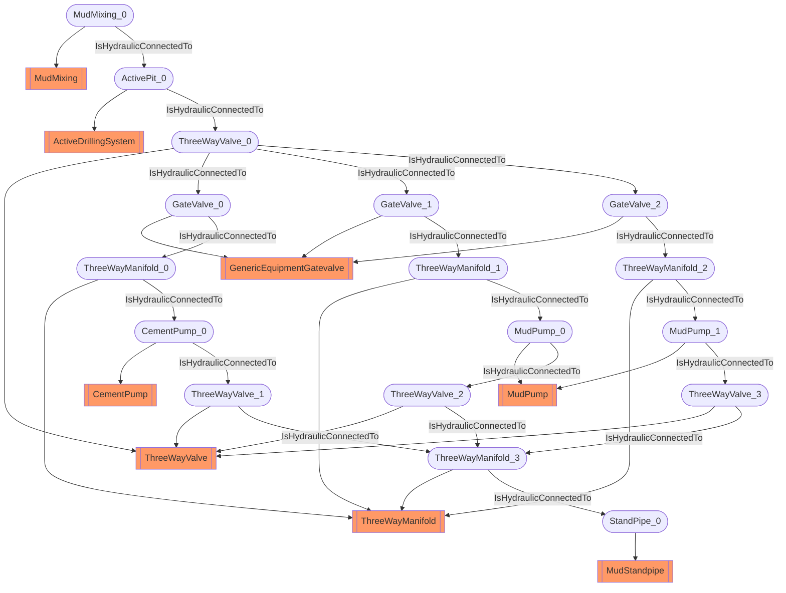

# Hydraulic circuit
- ActiveDrillingSystem:ActivePit_0
- ThreeWayValve:ThreeWayValve_0
- GenericEquipmentGatevalve:GateValve_0
- GenericEquipmentGatevalve:GateValve_1
- GenericEquipmentGatevalve:GateValve_2
- ThreeWayManifold:ThreeWayManifold_0
- ThreeWayManifold:ThreeWayManifold_1
- ThreeWayManifold:ThreeWayManifold_2
- CementPump:CementPump_0
- MudPump:MudPump_0
- MudPump:MudPump_1
- ThreeWayValve:ThreeWayValve_1
- ThreeWayValve:ThreeWayValve_2
- ThreeWayValve:ThreeWayValve_3
- ThreeWayManifold:ThreeWayManifold_3
- MudStandpipe:StandPipe_0
- MudMixing:MudMixing_0
- ActivePit_0 IsHydraulicConnectedTo ThreeWayValve_0
- ThreeWayValve_0 IsHydraulicConnectedTo GateValve_0
- ThreeWayValve_0 IsHydraulicConnectedTo GateValve_1
- ThreeWayValve_0 IsHydraulicConnectedTo GateValve_2
- GateValve_0 IsHydraulicConnectedTo ThreeWayManifold_0
- GateValve_1 IsHydraulicConnectedTo ThreeWayManifold_1
- GateValve_2 IsHydraulicConnectedTo ThreeWayManifold_2
- ThreeWayManifold_0 IsHydraulicConnectedTo CementPump_0
- ThreeWayManifold_1 IsHydraulicConnectedTo MudPump_0
- ThreeWayManifold_2 IsHydraulicConnectedTo MudPump_1
- CementPump_0 IsHydraulicConnectedTo ThreeWayValve_1
- MudPump_0 IsHydraulicConnectedTo ThreeWayValve_2
- MudPump_1 IsHydraulicConnectedTo ThreeWayValve_3
- ThreeWayValve_1 IsHydraulicConnectedTo ThreeWayManifold_3
- ThreeWayValve_2 IsHydraulicConnectedTo ThreeWayManifold_3
- ThreeWayValve_3 IsHydraulicConnectedTo ThreeWayManifold_3
- ThreeWayManifold_3 IsHydraulicConnectedTo StandPipe_0
- MudMixing_0 IsHydraulicConnectedTo ActivePit_0

