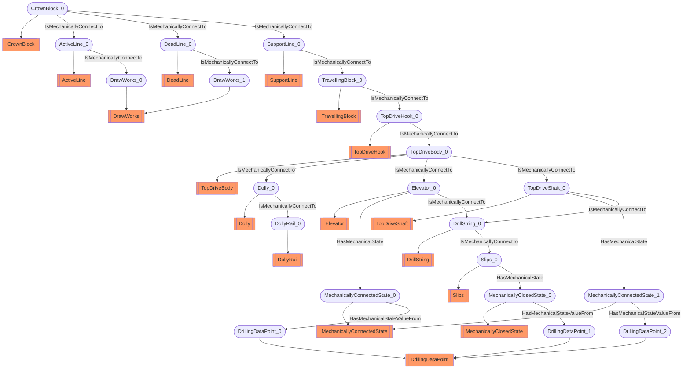

# Mechanical circuit
- Elevator:Elevator_0
- MechanicallyConnectedState:MechanicallyConnectedState_0
- Slips:Slips_0
- MechanicallyClosedState:MechanicallyClosedState_0
- TopDriveShaft:TopDriveShaft_0
- MechanicallyConnectedState:MechanicallyConnectedState_1
- DrillingDataPoint:DrillingDataPoint_0
- DrillingDataPoint:DrillingDataPoint_1
- DrillingDataPoint:DrillingDataPoint_2
- ActiveLine:ActiveLine_0
- DrawWorks:DrawWorks_0
- CrownBlock:CrownBlock_0
- DeadLine:DeadLine_0
- SupportLine:SupportLine_0
- DrawWorks:DrawWorks_1
- Dolly:Dolly_0
- DollyRail:DollyRail_0
- DrillString:DrillString_0
- TravellingBlock:TravellingBlock_0
- TopDriveBody:TopDriveBody_0
- TopDriveHook:TopDriveHook_0
- Elevator_0 HasMechanicalState MechanicallyConnectedState_0
- Slips_0 HasMechanicalState MechanicallyClosedState_0
- TopDriveShaft_0 HasMechanicalState MechanicallyConnectedState_1
- MechanicallyConnectedState_0 HasMechanicalStateValueFrom DrillingDataPoint_0
- MechanicallyClosedState_0 HasMechanicalStateValueFrom DrillingDataPoint_1
- MechanicallyConnectedState_1 HasMechanicalStateValueFrom DrillingDataPoint_2
- ActiveLine_0 IsMechanicallyConnectTo DrawWorks_0
- CrownBlock_0 IsMechanicallyConnectTo ActiveLine_0
- CrownBlock_0 IsMechanicallyConnectTo DeadLine_0
- CrownBlock_0 IsMechanicallyConnectTo SupportLine_0
- DeadLine_0 IsMechanicallyConnectTo DrawWorks_1
- Dolly_0 IsMechanicallyConnectTo DollyRail_0
- DrillString_0 IsMechanicallyConnectTo Slips_0
- Elevator_0 IsMechanicallyConnectTo DrillString_0
- SupportLine_0 IsMechanicallyConnectTo TravellingBlock_0
- TopDriveBody_0 IsMechanicallyConnectTo Dolly_0
- TopDriveBody_0 IsMechanicallyConnectTo Elevator_0
- TopDriveBody_0 IsMechanicallyConnectTo TopDriveShaft_0
- TopDriveHook_0 IsMechanicallyConnectTo TopDriveBody_0
- TopDriveShaft_0 IsMechanicallyConnectTo DrillString_0
- TravellingBlock_0 IsMechanicallyConnectTo TopDriveHook_0

