# Mechanical circuit
- Elevator:Elevator_0
- MechanicallyConnectedState:MechanicallyConnectedState_0
- Slips:Slips_0
- MechanicallyClosedState:MechanicallyClosedState_0
- Quill:Quill_0
- MechanicallyConnectedState:MechanicallyConnectedState_1
- DrillingDataPoint:DrillingDataPoint_0
- DrillingDataPoint:DrillingDataPoint_1
- DrillingDataPoint:DrillingDataPoint_2
- ActiveLine:ActiveLine_0
- Drawworks:Drawworks_0
- CrownBlock:CrownBlock_0
- DeadLine:DeadLine_0
- SupportLine:SupportLine_0
- Drawworks:Drawworks_1
- Dolly:Dolly_0
- DollyRail:DollyRail_0
- DrillString:DrillString_0
- TravellingBlock:TravellingBlock_0
- MainframeAssembly:MainframeAssembly_0
- LoadNut:LoadNut_0
- Elevator_0 HasMechanicalState MechanicallyConnectedState_0
- Slips_0 HasMechanicalState MechanicallyClosedState_0
- Quill_0 HasMechanicalState MechanicallyConnectedState_1
- MechanicallyConnectedState_0 HasMechanicalStateValueFrom DrillingDataPoint_0
- MechanicallyClosedState_0 HasMechanicalStateValueFrom DrillingDataPoint_1
- MechanicallyConnectedState_1 HasMechanicalStateValueFrom DrillingDataPoint_2

```mermaid
flowchart TD
	 classDef typeClass fill:#f96;
	 classDef classClass fill:#9dd0ff;
	Elevator_0([Elevator_0]) --> Elevator[[Elevator]]:::typeClass
	MechanicallyConnectedState_0([MechanicallyConnectedState_0]) --> MechanicallyConnectedState[[MechanicallyConnectedState]]:::typeClass
	Slips_0([Slips_0]) --> Slips[[Slips]]:::typeClass
	MechanicallyClosedState_0([MechanicallyClosedState_0]) --> MechanicallyClosedState[[MechanicallyClosedState]]:::typeClass
	Quill_0([Quill_0]) --> Quill[[Quill]]:::typeClass
	MechanicallyConnectedState_1([MechanicallyConnectedState_1]) --> MechanicallyConnectedState[[MechanicallyConnectedState]]:::typeClass
	DrillingDataPoint_0([DrillingDataPoint_0]) --> DrillingDataPoint[[DrillingDataPoint]]:::typeClass
	DrillingDataPoint_1([DrillingDataPoint_1]) --> DrillingDataPoint[[DrillingDataPoint]]:::typeClass
	DrillingDataPoint_2([DrillingDataPoint_2]) --> DrillingDataPoint[[DrillingDataPoint]]:::typeClass
	ActiveLine_0([ActiveLine_0]) --> ActiveLine[[ActiveLine]]:::typeClass
	Drawworks_0([Drawworks_0]) --> Drawworks[[Drawworks]]:::typeClass
	CrownBlock_0([CrownBlock_0]) --> CrownBlock[[CrownBlock]]:::typeClass
	DeadLine_0([DeadLine_0]) --> DeadLine[[DeadLine]]:::typeClass
	SupportLine_0([SupportLine_0]) --> SupportLine[[SupportLine]]:::typeClass
	Drawworks_1([Drawworks_1]) --> Drawworks[[Drawworks]]:::typeClass
	Dolly_0([Dolly_0]) --> Dolly[[Dolly]]:::typeClass
	DollyRail_0([DollyRail_0]) --> DollyRail[[DollyRail]]:::typeClass
	DrillString_0([DrillString_0]) --> DrillString[[DrillString]]:::typeClass
	TravellingBlock_0([TravellingBlock_0]) --> TravellingBlock[[TravellingBlock]]:::typeClass
	MainframeAssembly_0([MainframeAssembly_0]) --> MainframeAssembly[[MainframeAssembly]]:::typeClass
	LoadNut_0([LoadNut_0]) --> LoadNut[[LoadNut]]:::typeClass
	 Elevator_0 -- HasMechanicalState --> MechanicallyConnectedState_0 
	 Slips_0 -- HasMechanicalState --> MechanicallyClosedState_0 
	 Quill_0 -- HasMechanicalState --> MechanicallyConnectedState_1 
	 MechanicallyConnectedState_0 -- HasMechanicalStateValueFrom --> DrillingDataPoint_0 
	 MechanicallyClosedState_0 -- HasMechanicalStateValueFrom --> DrillingDataPoint_1 
	 MechanicallyConnectedState_1 -- HasMechanicalStateValueFrom --> DrillingDataPoint_2 
```

