# Quantities
- DrillingTorqueQuantity:BitTorqueQuantity_0
- TorqueQuantity:TorqueQuantity_0
- DrillingAccelerationQuantity:BlockAccelerationQuantity_0
- AccelerationQuantity:AccelerationQuantity_0
- PositionQuantity:BlockPositionQuantity_0
- LengthQuantity:LengthQuantity_0
- BlockVelocityQuantity:BlockVelocityQuantity_0
- VelocityQuantity:VelocityQuantity_0
- DepthQuantity:DepthQuantity_0
- DrillingDensityQuantity:EMWQuantity_0
- DrillingDensityQuantity:MassDensityQuantity_0
- DrillingVolumetricFlowrateQuantity:FlowRateQuantity_0
- DrillingVolumetricFlowrateQuantity:VolumetricRateQuantity_0
- DrillingDensityQuantity:FluidDensityInQuantity_0
- DrillingTemperatureQuantity:FluidTemperatureInQuantity_0
- TemperatureQuantity:TemperatureQuantity_0
- HookLoadQuantity:HookloadQuantity_0
- MassQuantity:MassQuantity_0
- RotationFrequencyQuantity:PumpRateQuantity_0
- FrequencyQuantity:FrequencyQuantity_0
- DrillingPressureQuantity:SPPQuantity_0
- PressureQuantity:PressureQuantity_0
- RotationFrequencyQuantity:SurfaceRPMQuantity_0
- DrillingTorqueQuantity:SurfaceTorqueQuantity_0
- DrillingForceQuantity:TopOfStringForceQuantity_0
- ForceQuantity:ForceQuantity_0
- DepthQuantity:TVDQuantity_0
- WeightOnBitQuantity:WOBQuantity_0
- FormationResistivityQuantity:Resistivity_0
- FormationResistivityQuantity:ElectricResistivityQuantity_0
- DrillingDensityQuantity:RockDensityQuantity_0
- PorosityQuantity:FormationPorosityQuantity_0
- ProportionQuantity:ProportionQuantity_0
- BitTorqueQuantity_0 IsObservableFrom TorqueQuantity_0
- BlockAccelerationQuantity_0 IsObservableFrom AccelerationQuantity_0
- BlockPositionQuantity_0 IsObservableFrom LengthQuantity_0
- BlockVelocityQuantity_0 IsObservableFrom VelocityQuantity_0
- DepthQuantity_0 IsObservableFrom LengthQuantity_0
- EMWQuantity_0 IsObservableFrom MassDensityQuantity_0
- FlowRateQuantity_0 IsObservableFrom VolumetricRateQuantity_0
- FluidDensityInQuantity_0 IsObservableFrom MassDensityQuantity_0
- FluidTemperatureInQuantity_0 IsObservableFrom TemperatureQuantity_0
- HookloadQuantity_0 IsObservableFrom MassQuantity_0
- PumpRateQuantity_0 IsObservableFrom FrequencyQuantity_0
- SPPQuantity_0 IsObservableFrom PressureQuantity_0
- SurfaceRPMQuantity_0 IsObservableFrom FrequencyQuantity_0
- SurfaceTorqueQuantity_0 IsObservableFrom TorqueQuantity_0
- TopOfStringForceQuantity_0 IsObservableFrom ForceQuantity_0
- TVDQuantity_0 IsObservableFrom LengthQuantity_0
- WOBQuantity_0 IsObservableFrom MassQuantity_0
- Resistivity_0 IsObservableFrom ElectricResistivityQuantity_0
- RockDensityQuantity_0 IsObservableFrom MassDensityQuantity_0
- FormationPorosityQuantity_0 IsObservableFrom ProportionQuantity_0

```mermaid
flowchart TD
	 classDef typeClass fill:#f96;
	 classDef classClass fill:#9dd0ff;
	BitTorqueQuantity_0([BitTorqueQuantity_0]) --> DrillingTorqueQuantity[[DrillingTorqueQuantity]]:::typeClass
	TorqueQuantity_0([TorqueQuantity_0]) --> TorqueQuantity[[TorqueQuantity]]:::typeClass
	BlockAccelerationQuantity_0([BlockAccelerationQuantity_0]) --> DrillingAccelerationQuantity[[DrillingAccelerationQuantity]]:::typeClass
	AccelerationQuantity_0([AccelerationQuantity_0]) --> AccelerationQuantity[[AccelerationQuantity]]:::typeClass
	BlockPositionQuantity_0([BlockPositionQuantity_0]) --> PositionQuantity[[PositionQuantity]]:::typeClass
	LengthQuantity_0([LengthQuantity_0]) --> LengthQuantity[[LengthQuantity]]:::typeClass
	BlockVelocityQuantity_0([BlockVelocityQuantity_0]) --> BlockVelocityQuantity[[BlockVelocityQuantity]]:::typeClass
	VelocityQuantity_0([VelocityQuantity_0]) --> VelocityQuantity[[VelocityQuantity]]:::typeClass
	DepthQuantity_0([DepthQuantity_0]) --> DepthQuantity[[DepthQuantity]]:::typeClass
	EMWQuantity_0([EMWQuantity_0]) --> DrillingDensityQuantity[[DrillingDensityQuantity]]:::typeClass
	MassDensityQuantity_0([MassDensityQuantity_0]) --> DrillingDensityQuantity[[DrillingDensityQuantity]]:::typeClass
	FlowRateQuantity_0([FlowRateQuantity_0]) --> DrillingVolumetricFlowrateQuantity[[DrillingVolumetricFlowrateQuantity]]:::typeClass
	VolumetricRateQuantity_0([VolumetricRateQuantity_0]) --> DrillingVolumetricFlowrateQuantity[[DrillingVolumetricFlowrateQuantity]]:::typeClass
	FluidDensityInQuantity_0([FluidDensityInQuantity_0]) --> DrillingDensityQuantity[[DrillingDensityQuantity]]:::typeClass
	FluidTemperatureInQuantity_0([FluidTemperatureInQuantity_0]) --> DrillingTemperatureQuantity[[DrillingTemperatureQuantity]]:::typeClass
	TemperatureQuantity_0([TemperatureQuantity_0]) --> TemperatureQuantity[[TemperatureQuantity]]:::typeClass
	HookloadQuantity_0([HookloadQuantity_0]) --> HookLoadQuantity[[HookLoadQuantity]]:::typeClass
	MassQuantity_0([MassQuantity_0]) --> MassQuantity[[MassQuantity]]:::typeClass
	PumpRateQuantity_0([PumpRateQuantity_0]) --> RotationFrequencyQuantity[[RotationFrequencyQuantity]]:::typeClass
	FrequencyQuantity_0([FrequencyQuantity_0]) --> FrequencyQuantity[[FrequencyQuantity]]:::typeClass
	SPPQuantity_0([SPPQuantity_0]) --> DrillingPressureQuantity[[DrillingPressureQuantity]]:::typeClass
	PressureQuantity_0([PressureQuantity_0]) --> PressureQuantity[[PressureQuantity]]:::typeClass
	SurfaceRPMQuantity_0([SurfaceRPMQuantity_0]) --> RotationFrequencyQuantity[[RotationFrequencyQuantity]]:::typeClass
	SurfaceTorqueQuantity_0([SurfaceTorqueQuantity_0]) --> DrillingTorqueQuantity[[DrillingTorqueQuantity]]:::typeClass
	TopOfStringForceQuantity_0([TopOfStringForceQuantity_0]) --> DrillingForceQuantity[[DrillingForceQuantity]]:::typeClass
	ForceQuantity_0([ForceQuantity_0]) --> ForceQuantity[[ForceQuantity]]:::typeClass
	TVDQuantity_0([TVDQuantity_0]) --> DepthQuantity[[DepthQuantity]]:::typeClass
	WOBQuantity_0([WOBQuantity_0]) --> WeightOnBitQuantity[[WeightOnBitQuantity]]:::typeClass
	Resistivity_0([Resistivity_0]) --> FormationResistivityQuantity[[FormationResistivityQuantity]]:::typeClass
	ElectricResistivityQuantity_0([ElectricResistivityQuantity_0]) --> FormationResistivityQuantity[[FormationResistivityQuantity]]:::typeClass
	RockDensityQuantity_0([RockDensityQuantity_0]) --> DrillingDensityQuantity[[DrillingDensityQuantity]]:::typeClass
	FormationPorosityQuantity_0([FormationPorosityQuantity_0]) --> PorosityQuantity[[PorosityQuantity]]:::typeClass
	ProportionQuantity_0([ProportionQuantity_0]) --> ProportionQuantity[[ProportionQuantity]]:::typeClass
	 BitTorqueQuantity_0 -- IsObservableFrom --> TorqueQuantity_0 
	 BlockAccelerationQuantity_0 -- IsObservableFrom --> AccelerationQuantity_0 
	 BlockPositionQuantity_0 -- IsObservableFrom --> LengthQuantity_0 
	 BlockVelocityQuantity_0 -- IsObservableFrom --> VelocityQuantity_0 
	 DepthQuantity_0 -- IsObservableFrom --> LengthQuantity_0 
	 EMWQuantity_0 -- IsObservableFrom --> MassDensityQuantity_0 
	 FlowRateQuantity_0 -- IsObservableFrom --> VolumetricRateQuantity_0 
	 FluidDensityInQuantity_0 -- IsObservableFrom --> MassDensityQuantity_0 
	 FluidTemperatureInQuantity_0 -- IsObservableFrom --> TemperatureQuantity_0 
	 HookloadQuantity_0 -- IsObservableFrom --> MassQuantity_0 
	 PumpRateQuantity_0 -- IsObservableFrom --> FrequencyQuantity_0 
	 SPPQuantity_0 -- IsObservableFrom --> PressureQuantity_0 
	 SurfaceRPMQuantity_0 -- IsObservableFrom --> FrequencyQuantity_0 
	 SurfaceTorqueQuantity_0 -- IsObservableFrom --> TorqueQuantity_0 
	 TopOfStringForceQuantity_0 -- IsObservableFrom --> ForceQuantity_0 
	 TVDQuantity_0 -- IsObservableFrom --> LengthQuantity_0 
	 WOBQuantity_0 -- IsObservableFrom --> MassQuantity_0 
	 Resistivity_0 -- IsObservableFrom --> ElectricResistivityQuantity_0 
	 RockDensityQuantity_0 -- IsObservableFrom --> MassDensityQuantity_0 
	 FormationPorosityQuantity_0 -- IsObservableFrom --> ProportionQuantity_0 
```

