# Quantities
- TorqueQuantity:TorqueQuantity_0
- AccelerationQuantity:AccelerationQuantity_0
- LengthQuantity:LengthQuantity_0
- VelocityQuantity:VelocityQuantity_0
- TemperatureQuantity:TemperatureQuantity_0
- MassQuantity:MassQuantity_0
- FrequencyQuantity:FrequencyQuantity_0
- PressureQuantity:PressureQuantity_0
- ForceQuantity:ForceQuantity_0
- PorosityQuantity:FormationPorosityQuantity_0
- ProportionQuantity:ProportionQuantity_0
- FormationPorosityQuantity_0 IsObservableFrom ProportionQuantity_0

```mermaid
flowchart TD
	 classDef typeClass fill:#f96;
	 classDef classClass fill:#9dd0ff;
	TorqueQuantity_0([TorqueQuantity_0]) --> TorqueQuantity[[TorqueQuantity]]:::typeClass
	AccelerationQuantity_0([AccelerationQuantity_0]) --> AccelerationQuantity[[AccelerationQuantity]]:::typeClass
	LengthQuantity_0([LengthQuantity_0]) --> LengthQuantity[[LengthQuantity]]:::typeClass
	VelocityQuantity_0([VelocityQuantity_0]) --> VelocityQuantity[[VelocityQuantity]]:::typeClass
	TemperatureQuantity_0([TemperatureQuantity_0]) --> TemperatureQuantity[[TemperatureQuantity]]:::typeClass
	MassQuantity_0([MassQuantity_0]) --> MassQuantity[[MassQuantity]]:::typeClass
	FrequencyQuantity_0([FrequencyQuantity_0]) --> FrequencyQuantity[[FrequencyQuantity]]:::typeClass
	PressureQuantity_0([PressureQuantity_0]) --> PressureQuantity[[PressureQuantity]]:::typeClass
	ForceQuantity_0([ForceQuantity_0]) --> ForceQuantity[[ForceQuantity]]:::typeClass
	FormationPorosityQuantity_0([FormationPorosityQuantity_0]) --> PorosityQuantity[[PorosityQuantity]]:::typeClass
	ProportionQuantity_0([ProportionQuantity_0]) --> ProportionQuantity[[ProportionQuantity]]:::typeClass
	 FormationPorosityQuantity_0 -- IsObservableFrom --> ProportionQuantity_0 
```

