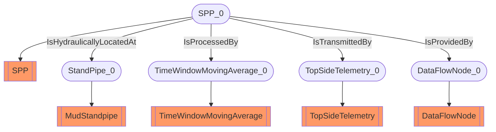

# SPP
- SPP:SPP_0
- MudStandpipe:StandPipe_0
- TimeWindowMovingAverage:TimeWindowMovingAverage_0
- TopSideTelemetry:TopSideTelemetry_0
- DataFlowNode:DataFlowNode_0
- SPP_0 IsHydraulicallyLocatedAt StandPipe_0
- SPP_0 IsProcessedBy TimeWindowMovingAverage_0
- SPP_0 IsTransmittedBy TopSideTelemetry_0
- SPP_0 IsProvidedBy DataFlowNode_0

