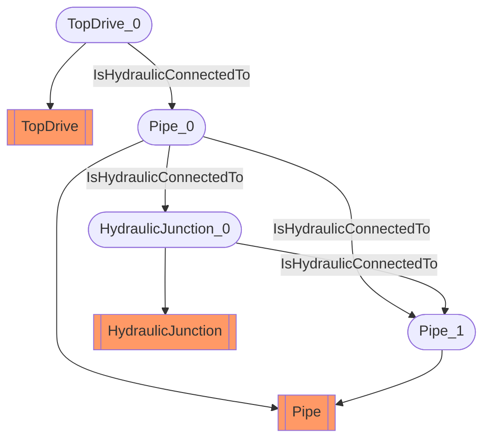

# Sub surface circuit
- TopDrive:TopDrive_0
- Pipe:Pipe_0
- Pipe:Pipe_1
- HydraulicJunction:HydraulicJunction_0
- TopDrive_0 IsHydraulicConnectedTo Pipe_0
- Pipe_0 IsHydraulicConnectedTo Pipe_1
- Pipe_0 IsHydraulicConnectedTo HydraulicJunction_0
- HydraulicJunction_0 IsHydraulicConnectedTo Pipe_1

