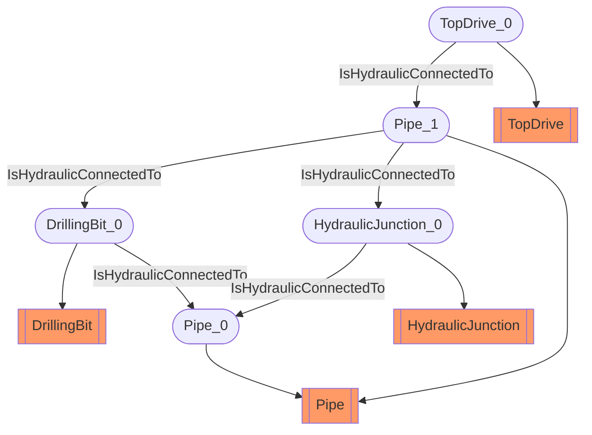

# Sub-Surface Hydraulic Circuit
- DrillingBit:DrillingBit_0
- Pipe:Pipe_0
- Pipe:Pipe_1
- HydraulicJunction:HydraulicJunction_0
- TopDrive:TopDrive_0
- DrillingBit_0 IsHydraulicConnectedTo Pipe_0
- Pipe_1 IsHydraulicConnectedTo DrillingBit_0
- Pipe_1 IsHydraulicConnectedTo HydraulicJunction_0
- TopDrive_0 IsHydraulicConnectedTo Pipe_1
- HydraulicJunction_0 IsHydraulicConnectedTo Pipe_0

