# Surface mechanical circuit
- ActiveLine:ActiveLine_0
- Drawworks:Drawworks_0
- CrownBlock:CrownBlock_0
- DeadLine:DeadLine_0
- SupportLine:SupportLine_0
- Drawworks:Drawworks_1
- Dolly:Dolly_0
- DollyRail:DollyRail_0
- Elevator:Elevator_0
- DrillString:DrillString_0
- TravellingBlock:TravellingBlock_0
- MainframeAssembly:MainframeAssembly_0
- Quill:Quill_0
- LoadNut:LoadNut_0

```mermaid
flowchart TD
	 classDef typeClass fill:#f96;
	 classDef classClass fill:#9dd0ff;
	ActiveLine_0([ActiveLine_0]) --> ActiveLine[[ActiveLine]]:::typeClass
	Drawworks_0([Drawworks_0]) --> Drawworks[[Drawworks]]:::typeClass
	CrownBlock_0([CrownBlock_0]) --> CrownBlock[[CrownBlock]]:::typeClass
	DeadLine_0([DeadLine_0]) --> DeadLine[[DeadLine]]:::typeClass
	SupportLine_0([SupportLine_0]) --> SupportLine[[SupportLine]]:::typeClass
	Drawworks_1([Drawworks_1]) --> Drawworks[[Drawworks]]:::typeClass
	Dolly_0([Dolly_0]) --> Dolly[[Dolly]]:::typeClass
	DollyRail_0([DollyRail_0]) --> DollyRail[[DollyRail]]:::typeClass
	Elevator_0([Elevator_0]) --> Elevator[[Elevator]]:::typeClass
	DrillString_0([DrillString_0]) --> DrillString[[DrillString]]:::typeClass
	TravellingBlock_0([TravellingBlock_0]) --> TravellingBlock[[TravellingBlock]]:::typeClass
	MainframeAssembly_0([MainframeAssembly_0]) --> MainframeAssembly[[MainframeAssembly]]:::typeClass
	Quill_0([Quill_0]) --> Quill[[Quill]]:::typeClass
	LoadNut_0([LoadNut_0]) --> LoadNut[[LoadNut]]:::typeClass
```

