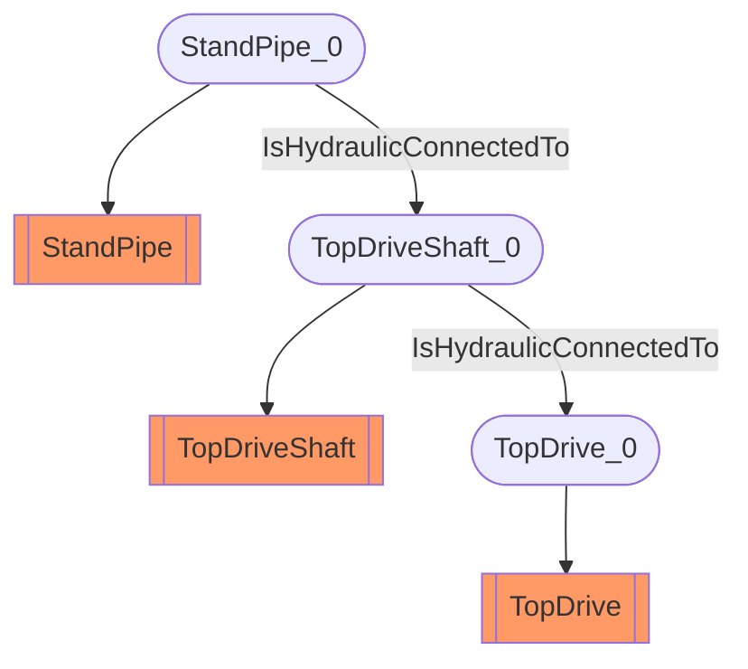

# Top-drive hydraulic circuit
- StandPipe:StandPipe_0
- TopDriveShaft:TopDriveShaft_0
- TopDrive:TopDrive_0
- StandPipe_0 IsHydraulicConnectedTo TopDriveShaft_0
- TopDriveShaft_0 IsHydraulicConnectedTo TopDrive_0

