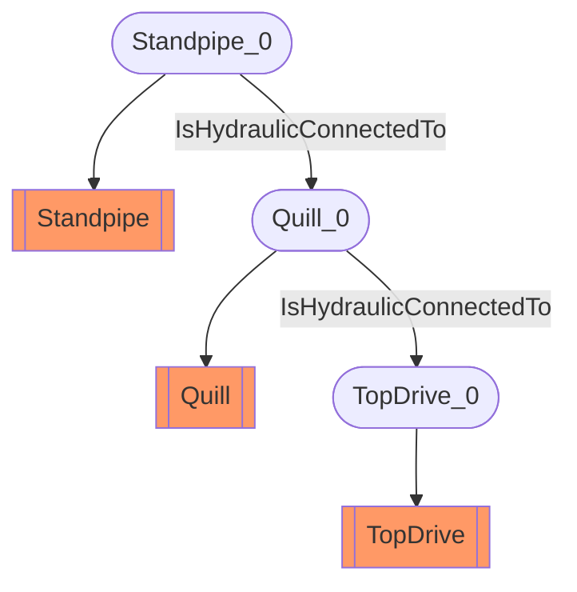

# Top-drive hydraulic circuit
- Standpipe:Standpipe_0
- Quill:Quill_0
- TopDrive:TopDrive_0
- Standpipe_0 IsHydraulicConnectedTo Quill_0
- Quill_0 IsHydraulicConnectedTo TopDrive_0

```mermaid
flowchart TD
	 classDef typeClass fill:#f96;
	 classDef classClass fill:#9dd0ff;
	Standpipe_0([Standpipe_0]) --> Standpipe[[Standpipe]]:::typeClass
	Quill_0([Quill_0]) --> Quill[[Quill]]:::typeClass
	TopDrive_0([TopDrive_0]) --> TopDrive[[TopDrive]]:::typeClass
	 Standpipe_0 -- IsHydraulicConnectedTo --> Quill_0 
	 Quill_0 -- IsHydraulicConnectedTo --> TopDrive_0 
```
