# Typical list model
- HookVelocity:HookVelocity_0
- DynamicDrillingSignal:DynamicDrillingSignal_0
- FlowRateIn:FlowRateIn_0
- DynamicDrillingSignal:DynamicDrillingSignal_1
- BitDepth:BitDepth_0
- DynamicDrillingSignal:DynamicDrillingSignal_2
- SurfaceRPM:SurfaceRPM_0
- DynamicDrillingSignal:DynamicDrillingSignal_3
- SurfaceTorque:SurfaceTorque_0
- DynamicDrillingSignal:DynamicDrillingSignal_4
- SPP:SPP_0
- DynamicDrillingSignal:DynamicDrillingSignal_5
- DownholeECD:DownholeECD_0
- DynamicDrillingSignal:DynamicDrillingSignal_6
- HookPosition:HookPosition_0
- DynamicDrillingSignal:DynamicDrillingSignal_7
- TemperatureIn:TemperatureIn_0
- DynamicDrillingSignal:DynamicDrillingSignal_8
- DownholePressure:DownholePressure_0
- DynamicDrillingSignal:DynamicDrillingSignal_9
- HookLoad:HookLoad_0
- DynamicDrillingSignal:DynamicDrillingSignal_10
- DynamicDrillingSignal:DynamicDrillingSignal_11
- DynamicDrillingSignal:DynamicDrillingSignal_12
- DynamicDrillingSignal:DynamicDrillingSignal_13
- DynamicDrillingSignal:DynamicDrillingSignal_14
- DynamicDrillingSignal:DynamicDrillingSignal_15
- DynamicDrillingSignal:DynamicDrillingSignal_16
- DynamicDrillingSignal:DynamicDrillingSignal_17
- HookVelocity_0 HasValue DynamicDrillingSignal_0
- FlowRateIn_0 HasValue DynamicDrillingSignal_1
- BitDepth_0 HasValue DynamicDrillingSignal_2
- SurfaceRPM_0 HasValue DynamicDrillingSignal_3
- SurfaceTorque_0 HasValue DynamicDrillingSignal_4
- SPP_0 HasValue DynamicDrillingSignal_5
- DownholeECD_0 HasValue DynamicDrillingSignal_6
- HookPosition_0 HasValue DynamicDrillingSignal_7
- TemperatureIn_0 HasValue DynamicDrillingSignal_8
- DownholePressure_0 HasValue DynamicDrillingSignal_9
- HookLoad_0 HasValue DynamicDrillingSignal_10

```mermaid
flowchart TD
	HookVelocity_0([HookVelocity_0]) --> HookVelocity[[HookVelocity]]
	DynamicDrillingSignal_0([DynamicDrillingSignal_0]) --> DynamicDrillingSignal[[DynamicDrillingSignal]]
	FlowRateIn_0([FlowRateIn_0]) --> FlowRateIn[[FlowRateIn]]
	DynamicDrillingSignal_1([DynamicDrillingSignal_1]) --> DynamicDrillingSignal[[DynamicDrillingSignal]]
	BitDepth_0([BitDepth_0]) --> BitDepth[[BitDepth]]
	DynamicDrillingSignal_2([DynamicDrillingSignal_2]) --> DynamicDrillingSignal[[DynamicDrillingSignal]]
	SurfaceRPM_0([SurfaceRPM_0]) --> SurfaceRPM[[SurfaceRPM]]
	DynamicDrillingSignal_3([DynamicDrillingSignal_3]) --> DynamicDrillingSignal[[DynamicDrillingSignal]]
	SurfaceTorque_0([SurfaceTorque_0]) --> SurfaceTorque[[SurfaceTorque]]
	DynamicDrillingSignal_4([DynamicDrillingSignal_4]) --> DynamicDrillingSignal[[DynamicDrillingSignal]]
	SPP_0([SPP_0]) --> SPP[[SPP]]
	DynamicDrillingSignal_5([DynamicDrillingSignal_5]) --> DynamicDrillingSignal[[DynamicDrillingSignal]]
	DownholeECD_0([DownholeECD_0]) --> DownholeECD[[DownholeECD]]
	DynamicDrillingSignal_6([DynamicDrillingSignal_6]) --> DynamicDrillingSignal[[DynamicDrillingSignal]]
	HookPosition_0([HookPosition_0]) --> HookPosition[[HookPosition]]
	DynamicDrillingSignal_7([DynamicDrillingSignal_7]) --> DynamicDrillingSignal[[DynamicDrillingSignal]]
	TemperatureIn_0([TemperatureIn_0]) --> TemperatureIn[[TemperatureIn]]
	DynamicDrillingSignal_8([DynamicDrillingSignal_8]) --> DynamicDrillingSignal[[DynamicDrillingSignal]]
	DownholePressure_0([DownholePressure_0]) --> DownholePressure[[DownholePressure]]
	DynamicDrillingSignal_9([DynamicDrillingSignal_9]) --> DynamicDrillingSignal[[DynamicDrillingSignal]]
	HookLoad_0([HookLoad_0]) --> HookLoad[[HookLoad]]
	DynamicDrillingSignal_10([DynamicDrillingSignal_10]) --> DynamicDrillingSignal[[DynamicDrillingSignal]]
	DynamicDrillingSignal_11([DynamicDrillingSignal_11]) --> DynamicDrillingSignal[[DynamicDrillingSignal]]
	DynamicDrillingSignal_12([DynamicDrillingSignal_12]) --> DynamicDrillingSignal[[DynamicDrillingSignal]]
	DynamicDrillingSignal_13([DynamicDrillingSignal_13]) --> DynamicDrillingSignal[[DynamicDrillingSignal]]
	DynamicDrillingSignal_14([DynamicDrillingSignal_14]) --> DynamicDrillingSignal[[DynamicDrillingSignal]]
	DynamicDrillingSignal_15([DynamicDrillingSignal_15]) --> DynamicDrillingSignal[[DynamicDrillingSignal]]
	DynamicDrillingSignal_16([DynamicDrillingSignal_16]) --> DynamicDrillingSignal[[DynamicDrillingSignal]]
	DynamicDrillingSignal_17([DynamicDrillingSignal_17]) --> DynamicDrillingSignal[[DynamicDrillingSignal]]
	 HookVelocity_0 -- HasValue --> DynamicDrillingSignal_0 
	 FlowRateIn_0 -- HasValue --> DynamicDrillingSignal_1 
	 BitDepth_0 -- HasValue --> DynamicDrillingSignal_2 
	 SurfaceRPM_0 -- HasValue --> DynamicDrillingSignal_3 
	 SurfaceTorque_0 -- HasValue --> DynamicDrillingSignal_4 
	 SPP_0 -- HasValue --> DynamicDrillingSignal_5 
	 DownholeECD_0 -- HasValue --> DynamicDrillingSignal_6 
	 HookPosition_0 -- HasValue --> DynamicDrillingSignal_7 
	 TemperatureIn_0 -- HasValue --> DynamicDrillingSignal_8 
	 DownholePressure_0 -- HasValue --> DynamicDrillingSignal_9 
	 HookLoad_0 -- HasValue --> DynamicDrillingSignal_10 
```

