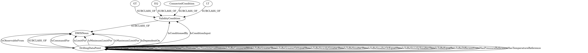

# Generated Diagrams

[Mechanics.md](/home/runner/work/DDHub-Semantic-Interoperability/DDHub-Semantic-Interoperability/docs/vocabulary_development/auto-generated/md/definition-files/Mechanics.md)

---
[DrillingDataSemantics.md](/home/runner/work/DDHub-Semantic-Interoperability/DDHub-Semantic-Interoperability/docs/vocabulary_development/auto-generated/md/definition-files/DrillingDataSemantics.md)

---
[DrillingEquipment.md](/home/runner/work/DDHub-Semantic-Interoperability/DDHub-Semantic-Interoperability/docs/vocabulary_development/auto-generated/md/definition-files/DrillingEquipment.md)

---
[Hydraulics.md](/home/runner/work/DDHub-Semantic-Interoperability/DDHub-Semantic-Interoperability/docs/vocabulary_development/auto-generated/md/definition-files/Hydraulics.md)

---
[Quantities.md](/home/runner/work/DDHub-Semantic-Interoperability/DDHub-Semantic-Interoperability/docs/vocabulary_development/auto-generated/md/definition-files/Quantities.md)

---
[DataFlow.md](/home/runner/work/DDHub-Semantic-Interoperability/DDHub-Semantic-Interoperability/docs/vocabulary_development/auto-generated/md/definition-files/DataFlow.md)

---
[DWISSemantics.md](/home/runner/work/DDHub-Semantic-Interoperability/DDHub-Semantic-Interoperability/docs/vocabulary_development/auto-generated/md/definition-files/DWISSemantics.md)

---
[TimeManagement.md](/home/runner/work/DDHub-Semantic-Interoperability/DDHub-Semantic-Interoperability/docs/vocabulary_development/auto-generated/md/definition-files/TimeManagement.md)

---
[Model.md](/home/runner/work/DDHub-Semantic-Interoperability/DDHub-Semantic-Interoperability/docs/vocabulary_development/auto-generated/md/definition-files/Model.md)

---
[DataValidity.md](/home/runner/work/DDHub-Semantic-Interoperability/DDHub-Semantic-Interoperability/docs/vocabulary_development/auto-generated/md/definition-files/DataValidity.md)

---
[DataTransmission.md](/home/runner/work/DDHub-Semantic-Interoperability/DDHub-Semantic-Interoperability/docs/vocabulary_development/auto-generated/md/definition-files/DataTransmission.md)

---
[Uncertainty.md](/home/runner/work/DDHub-Semantic-Interoperability/DDHub-Semantic-Interoperability/docs/vocabulary_development/auto-generated/md/definition-files/Uncertainty.md)

---
[PhysicalLocation.md](/home/runner/work/DDHub-Semantic-Interoperability/DDHub-Semantic-Interoperability/docs/vocabulary_development/auto-generated/md/definition-files/PhysicalLocation.md)

---
[MechanicalModel.md](/home/runner/work/DDHub-Semantic-Interoperability/DDHub-Semantic-Interoperability/docs/vocabulary_development/auto-generated/md/definition-files/MechanicalModel.md)

---

# Ignored Relationships

The following top level relationships have been omitted from the diagrams due to preserve clarity:

| SubjectClass | Relationship | ObjectClass |
| ------------ | ------------ | ----------- |
| DWISNoun | IsMechanicallyConnectTo | DWISNoun |
| DWISNoun | IsMechanicallyLocatedAt | DWISNoun |
| DWISNoun | HasHydraulicStateValueFrom | DWISNoun |
| DWISNoun | IsEquivalentCirculationDensityAt | DWISNoun |
| DWISNoun | IsFluidDensityAt | DWISNoun |
| DWISNoun | IsFluidTemperatureAt | DWISNoun |
| DWISNoun | IsFluidVelocityAt | DWISNoun |
| DWISNoun | IsHydraulicEstimationAt | DWISNoun |
| DWISNoun | IsHydraulicMaximumAllowedRateOfChangeAt | DWISNoun |
| DWISNoun | IsHydraulicMaximumAllowedValueAt | DWISNoun |
| DWISNoun | IsHydraulicMeasurementAt | DWISNoun |
| DWISNoun | IsMassFlowRateAt | DWISNoun |
| DWISNoun | IsPressureAt | DWISNoun |
| DWISNoun | IsPressureGradientAt | DWISNoun |
| DWISNoun | IsVolumetricFlowRateAt | DWISNoun |
| DWISNoun | StartsHydraulicBranchDecomposition | DWISNoun |
| DWISNoun | IsObservableFrom | DWISNoun |
| DWISNoun | IsOfBaseQuantity | DWISNoun |
| DWISNoun | IsOfMeasurableQuantity | DWISNoun |
| DWISNoun | Controls | DWISNoun |
| DWISNoun | IsDerivationInput | DWISNoun |
| DWISNoun | IsComputedBy | DWISNoun |
| DWISNoun | IsMeasuredBy | DWISNoun |
| DWISNoun | IsRecordedFrom | DWISNoun |
| DWISNoun | IsDerivedFrom | DWISNoun |
| DWISNoun | IsIntegratedFrom | DWISNoun |
| DWISNoun | IsProcessedBy | DWISNoun |
| DWISNoun | DWISVerb | DWISNoun |
| DWISNoun | IsConditionLeft | DWISNoun |
| DWISNoun | IsConditionRight | DWISNoun |
| DWISNoun | IsValidBy | DWISNoun |
| DWISNoun | IsTransmittedBy | DWISNoun |
| DWISNoun | HasUncertaintyMax | DWISNoun |
| DWISNoun | HasUncertaintyMean | DWISNoun |
| DWISNoun | HasUncertaintyMin | DWISNoun |
| DWISNoun | HasUncertaintyRelativeValue | DWISNoun |
| DWISNoun | HasUncertaintyStandardDeviation | DWISNoun |
| DWISNoun | HasReferenceFrameOrigin | DWISNoun |
| DWISNoun | IsPhysicallyLocatedAt | DWISNoun |