# Density In and Out
- DensityOut:DensityOut_0
- DrillingDataPoint:DrillingDataPoint_0
- TemperatureOut:TemperatureOut_0
- DensityIn:DensityIn_0
- TemperatureIn:TemperatureIn_0
- DensityIn:DensityIn_1
- SPP:SPP_0
- TemperatureIn:TemperatureIn_1
- ActiveDrillingSystem:ActiveDrillingSystem_0
- ReturnFlowLine:ReturnFlowLine_0
- MudMixing:MudMixing_0
- Standpipe:Standpipe_0
- FluidTemperatureInQuantity:FluidTemperatureInQuantity_0
- PressureQuantity:PressureQuantity_0
- FluidDensityInQuantity:FluidDensityInQuantity_0
- TimeWindowMovingAverage:TimeWindowMovingAverage_0
- TopSideTelemetry:TopSideTelemetry_0
- DataFlowNode:DataFlowNode_0
- TimeWindowMovingAverage:TimeWindowMovingAverage_1
- TopSideTelemetry:TopSideTelemetry_1
- DataFlowNode:DataFlowNode_1
- TimeWindowMovingAverage:TimeWindowMovingAverage_2
- TimeWindowMovingAverage:TimeWindowMovingAverage_3
- TopSideTelemetry:TopSideTelemetry_2
- DataFlowNode:DataFlowNode_2
- TimeWindowMovingAverage:TimeWindowMovingAverage_4
- TimeWindowMovingAverage:TimeWindowMovingAverage_5
- TimeWindowMovingAverage:TimeWindowMovingAverage_6
- DensityOut_0 IsDependentOn DrillingDataPoint_0
- DensityOut_0 IsDependentOn TemperatureOut_0
- DensityIn_0 IsDependentOn TemperatureIn_0
- DensityIn_0 IsDependentOn DrillingDataPoint_0
- DensityIn_1 IsDependentOn SPP_0
- DensityIn_1 IsDependentOn TemperatureIn_1
- TemperatureIn_0 IsHydraulicallyLocatedAt ActiveDrillingSystem_0
- DensityOut_0 IsHydraulicallyLocatedAt ReturnFlowLine_0
- DensityIn_0 IsHydraulicallyLocatedAt MudMixing_0
- DensityIn_1 IsHydraulicallyLocatedAt Standpipe_0
- TemperatureOut_0 IsMechanicallyLocatedAt ReturnFlowLine_0
- TemperatureIn_0 IsOfMeasurableQuantity FluidTemperatureInQuantity_0
- DrillingDataPoint_0 IsOfMeasurableQuantity PressureQuantity_0
- DensityOut_0 IsOfMeasurableQuantity FluidDensityInQuantity_0
- DensityIn_0 IsOfMeasurableQuantity FluidDensityInQuantity_0
- DensityIn_1 IsOfMeasurableQuantity FluidDensityInQuantity_0
- TemperatureIn_1 IsOfMeasurableQuantity FluidTemperatureInQuantity_0
- TemperatureOut_0 IsOfMeasurableQuantity FluidTemperatureInQuantity_0
- SPP_0 IsProcessedBy TimeWindowMovingAverage_0
- SPP_0 IsTransmittedBy TopSideTelemetry_0
- SPP_0 IsProvidedBy DataFlowNode_0
- TemperatureIn_0 IsProcessedBy TimeWindowMovingAverage_1
- TemperatureIn_0 IsTransmittedBy TopSideTelemetry_1
- TemperatureIn_0 IsProvidedBy DataFlowNode_1
- DensityIn_0 IsProcessedBy TimeWindowMovingAverage_2
- DensityIn_0 IsTransmittedBy TopSideTelemetry_1
- DensityIn_0 IsProvidedBy DataFlowNode_1
- DensityOut_0 IsProcessedBy TimeWindowMovingAverage_3
- DensityOut_0 IsTransmittedBy TopSideTelemetry_2
- DensityOut_0 IsProvidedBy DataFlowNode_2
- TemperatureIn_1 IsProcessedBy TimeWindowMovingAverage_4
- TemperatureIn_1 IsTransmittedBy TopSideTelemetry_2
- TemperatureIn_1 IsProvidedBy DataFlowNode_2
- DensityIn_1 IsProcessedBy TimeWindowMovingAverage_5
- DensityIn_1 IsTransmittedBy TopSideTelemetry_2
- DensityIn_1 IsProvidedBy DataFlowNode_2
- TemperatureOut_0 IsProcessedBy TimeWindowMovingAverage_6
- TemperatureOut_0 IsTransmittedBy TopSideTelemetry_2
- TemperatureOut_0 IsProvidedBy DataFlowNode_2

```mermaid
flowchart TD
	DensityOut_0([DensityOut_0]) --> DensityOut[[DensityOut]]
	DrillingDataPoint_0([DrillingDataPoint_0]) --> DrillingDataPoint[[DrillingDataPoint]]
	TemperatureOut_0([TemperatureOut_0]) --> TemperatureOut[[TemperatureOut]]
	DensityIn_0([DensityIn_0]) --> DensityIn[[DensityIn]]
	TemperatureIn_0([TemperatureIn_0]) --> TemperatureIn[[TemperatureIn]]
	DensityIn_1([DensityIn_1]) --> DensityIn[[DensityIn]]
	SPP_0([SPP_0]) --> SPP[[SPP]]
	TemperatureIn_1([TemperatureIn_1]) --> TemperatureIn[[TemperatureIn]]
	ActiveDrillingSystem_0([ActiveDrillingSystem_0]) --> ActiveDrillingSystem[[ActiveDrillingSystem]]
	ReturnFlowLine_0([ReturnFlowLine_0]) --> ReturnFlowLine[[ReturnFlowLine]]
	MudMixing_0([MudMixing_0]) --> MudMixing[[MudMixing]]
	Standpipe_0([Standpipe_0]) --> Standpipe[[Standpipe]]
	FluidTemperatureInQuantity_0([FluidTemperatureInQuantity_0]) --> FluidTemperatureInQuantity[[FluidTemperatureInQuantity]]
	PressureQuantity_0([PressureQuantity_0]) --> PressureQuantity[[PressureQuantity]]
	FluidDensityInQuantity_0([FluidDensityInQuantity_0]) --> FluidDensityInQuantity[[FluidDensityInQuantity]]
	TimeWindowMovingAverage_0([TimeWindowMovingAverage_0]) --> TimeWindowMovingAverage[[TimeWindowMovingAverage]]
	TopSideTelemetry_0([TopSideTelemetry_0]) --> TopSideTelemetry[[TopSideTelemetry]]
	DataFlowNode_0([DataFlowNode_0]) --> DataFlowNode[[DataFlowNode]]
	TimeWindowMovingAverage_1([TimeWindowMovingAverage_1]) --> TimeWindowMovingAverage[[TimeWindowMovingAverage]]
	TopSideTelemetry_1([TopSideTelemetry_1]) --> TopSideTelemetry[[TopSideTelemetry]]
	DataFlowNode_1([DataFlowNode_1]) --> DataFlowNode[[DataFlowNode]]
	TimeWindowMovingAverage_2([TimeWindowMovingAverage_2]) --> TimeWindowMovingAverage[[TimeWindowMovingAverage]]
	TimeWindowMovingAverage_3([TimeWindowMovingAverage_3]) --> TimeWindowMovingAverage[[TimeWindowMovingAverage]]
	TopSideTelemetry_2([TopSideTelemetry_2]) --> TopSideTelemetry[[TopSideTelemetry]]
	DataFlowNode_2([DataFlowNode_2]) --> DataFlowNode[[DataFlowNode]]
	TimeWindowMovingAverage_4([TimeWindowMovingAverage_4]) --> TimeWindowMovingAverage[[TimeWindowMovingAverage]]
	TimeWindowMovingAverage_5([TimeWindowMovingAverage_5]) --> TimeWindowMovingAverage[[TimeWindowMovingAverage]]
	TimeWindowMovingAverage_6([TimeWindowMovingAverage_6]) --> TimeWindowMovingAverage[[TimeWindowMovingAverage]]
	 DensityOut_0 -- IsDependentOn --> DrillingDataPoint_0 
	 DensityOut_0 -- IsDependentOn --> TemperatureOut_0 
	 DensityIn_0 -- IsDependentOn --> TemperatureIn_0 
	 DensityIn_0 -- IsDependentOn --> DrillingDataPoint_0 
	 DensityIn_1 -- IsDependentOn --> SPP_0 
	 DensityIn_1 -- IsDependentOn --> TemperatureIn_1 
	 TemperatureIn_0 -- IsHydraulicallyLocatedAt --> ActiveDrillingSystem_0 
	 DensityOut_0 -- IsHydraulicallyLocatedAt --> ReturnFlowLine_0 
	 DensityIn_0 -- IsHydraulicallyLocatedAt --> MudMixing_0 
	 DensityIn_1 -- IsHydraulicallyLocatedAt --> Standpipe_0 
	 TemperatureOut_0 -- IsMechanicallyLocatedAt --> ReturnFlowLine_0 
	 TemperatureIn_0 -- IsOfMeasurableQuantity --> FluidTemperatureInQuantity_0 
	 DrillingDataPoint_0 -- IsOfMeasurableQuantity --> PressureQuantity_0 
	 DensityOut_0 -- IsOfMeasurableQuantity --> FluidDensityInQuantity_0 
	 DensityIn_0 -- IsOfMeasurableQuantity --> FluidDensityInQuantity_0 
	 DensityIn_1 -- IsOfMeasurableQuantity --> FluidDensityInQuantity_0 
	 TemperatureIn_1 -- IsOfMeasurableQuantity --> FluidTemperatureInQuantity_0 
	 TemperatureOut_0 -- IsOfMeasurableQuantity --> FluidTemperatureInQuantity_0 
	 SPP_0 -- IsProcessedBy --> TimeWindowMovingAverage_0 
	 SPP_0 -- IsTransmittedBy --> TopSideTelemetry_0 
	 SPP_0 -- IsProvidedBy --> DataFlowNode_0 
	 TemperatureIn_0 -- IsProcessedBy --> TimeWindowMovingAverage_1 
	 TemperatureIn_0 -- IsTransmittedBy --> TopSideTelemetry_1 
	 TemperatureIn_0 -- IsProvidedBy --> DataFlowNode_1 
	 DensityIn_0 -- IsProcessedBy --> TimeWindowMovingAverage_2 
	 DensityIn_0 -- IsTransmittedBy --> TopSideTelemetry_1 
	 DensityIn_0 -- IsProvidedBy --> DataFlowNode_1 
	 DensityOut_0 -- IsProcessedBy --> TimeWindowMovingAverage_3 
	 DensityOut_0 -- IsTransmittedBy --> TopSideTelemetry_2 
	 DensityOut_0 -- IsProvidedBy --> DataFlowNode_2 
	 TemperatureIn_1 -- IsProcessedBy --> TimeWindowMovingAverage_4 
	 TemperatureIn_1 -- IsTransmittedBy --> TopSideTelemetry_2 
	 TemperatureIn_1 -- IsProvidedBy --> DataFlowNode_2 
	 DensityIn_1 -- IsProcessedBy --> TimeWindowMovingAverage_5 
	 DensityIn_1 -- IsTransmittedBy --> TopSideTelemetry_2 
	 DensityIn_1 -- IsProvidedBy --> DataFlowNode_2 
	 TemperatureOut_0 -- IsProcessedBy --> TimeWindowMovingAverage_6 
	 TemperatureOut_0 -- IsTransmittedBy --> TopSideTelemetry_2 
	 TemperatureOut_0 -- IsProvidedBy --> DataFlowNode_2 
```

