# Downhole ECD
- DownholePressureQuantity:DownholePressureQuantity_0
- PressureQuantity:PressureQuantity_0
- DownholeECD:DownholeECD_0
- EMWQuantity:EMWQuantity_0
- DownholePressure:DownholePressure_0
- DrillingDataPoint:DrillingDataPoint_0
- TVDQuantity:TVDQuantity_0
- DrillingDataPoint:DrillingDataPoint_1
- AccelerationQuantity:AccelerationQuantity_0
- DrillingDataPoint:DrillingDataPoint_2
- DrillingDataPoint:DrillingDataPoint_3
- LengthQuantity:LengthQuantity_0
- DrillingDataPoint:DrillingDataPoint_4
- DepthQuantity:DepthQuantity_0
- BitDepth:BitDepth_0
- DirectTransformation:DirectTransformation_0
- DirectTransformation:DirectTransformation_1
- DirectTransformation:DirectTransformation_2
- BHAAnnular:BHAAnnular_0
- FlowRateIn:FlowRateIn_0
- GT:GT_0
- DrillingDataPoint:DrillingDataPoint_5
- HydraulicConnectedState:HydraulicConnectedState_0
- DrillingDataPoint:DrillingDataPoint_6
- TopDriveShaft:TopDriveShaft_0
- ConnectedCondition:ConnectedCondition_0
- DownholePressureQuantity_0 IsObservableFrom PressureQuantity_0
- DownholeECD_0 IsOfMeasurableQuantity EMWQuantity_0
- DownholePressure_0 IsOfMeasurableQuantity DownholePressureQuantity_0
- DrillingDataPoint_0 IsOfMeasurableQuantity TVDQuantity_0
- DrillingDataPoint_1 IsOfBaseQuantity AccelerationQuantity_0
- DrillingDataPoint_2 IsOfBaseQuantity PressureQuantity_0
- DrillingDataPoint_3 IsOfBaseQuantity LengthQuantity_0
- DrillingDataPoint_4 IsOfMeasurableQuantity DepthQuantity_0
- BitDepth_0 IsOfMeasurableQuantity DepthQuantity_0
- BitDepth_0 IsTransformationInput DirectTransformation_0
- DrillingDataPoint_3 IsTransformationInput DirectTransformation_0
- DirectTransformation_0 IsTransformationOutput DrillingDataPoint_4
- DrillingDataPoint_4 IsTransformationInput DirectTransformation_1
- DirectTransformation_1 IsTransformationOutput DrillingDataPoint_0
- DrillingDataPoint_2 IsTransformationInput DirectTransformation_2
- DrillingDataPoint_1 IsTransformationInput DirectTransformation_2
- DrillingDataPoint_0 IsTransformationInput DirectTransformation_2
- DownholePressure_0 IsTransformationInput DirectTransformation_2
- DirectTransformation_2 IsTransformationOutput DownholeECD_0
- DownholePressure_0 IsHydraulicallyLocatedAt BHAAnnular_0
- DownholeECD_0 IsHydraulicallyLocatedAt BHAAnnular_0
- FlowRateIn_0 IsConditionLeft GT_0
- DrillingDataPoint_5 IsConditionRight GT_0
- DownholePressure_0 IsConditionedBy GT_0
- HydraulicConnectedState_0 HasHydraulicStateValueFrom DrillingDataPoint_6
- TopDriveShaft_0 HasHydraulicState HydraulicConnectedState_0
- DownholePressure_0 IsConditionedBy ConnectedCondition_0
- HydraulicConnectedState_0 IsConditionInput ConnectedCondition_0
- DownholePressure_0 IsValidBy DrillingDataPoint_6

```mermaid
flowchart TD
	DownholePressureQuantity_0([DownholePressureQuantity_0]) --> DownholePressureQuantity[[DownholePressureQuantity]]
	PressureQuantity_0([PressureQuantity_0]) --> PressureQuantity[[PressureQuantity]]
	DownholeECD_0([DownholeECD_0]) --> DownholeECD[[DownholeECD]]
	EMWQuantity_0([EMWQuantity_0]) --> EMWQuantity[[EMWQuantity]]
	DownholePressure_0([DownholePressure_0]) --> DownholePressure[[DownholePressure]]
	DrillingDataPoint_0([DrillingDataPoint_0]) --> DrillingDataPoint[[DrillingDataPoint]]
	TVDQuantity_0([TVDQuantity_0]) --> TVDQuantity[[TVDQuantity]]
	DrillingDataPoint_1([DrillingDataPoint_1]) --> DrillingDataPoint[[DrillingDataPoint]]
	AccelerationQuantity_0([AccelerationQuantity_0]) --> AccelerationQuantity[[AccelerationQuantity]]
	DrillingDataPoint_2([DrillingDataPoint_2]) --> DrillingDataPoint[[DrillingDataPoint]]
	DrillingDataPoint_3([DrillingDataPoint_3]) --> DrillingDataPoint[[DrillingDataPoint]]
	LengthQuantity_0([LengthQuantity_0]) --> LengthQuantity[[LengthQuantity]]
	DrillingDataPoint_4([DrillingDataPoint_4]) --> DrillingDataPoint[[DrillingDataPoint]]
	DepthQuantity_0([DepthQuantity_0]) --> DepthQuantity[[DepthQuantity]]
	BitDepth_0([BitDepth_0]) --> BitDepth[[BitDepth]]
	DirectTransformation_0([DirectTransformation_0]) --> DirectTransformation[[DirectTransformation]]
	DirectTransformation_1([DirectTransformation_1]) --> DirectTransformation[[DirectTransformation]]
	DirectTransformation_2([DirectTransformation_2]) --> DirectTransformation[[DirectTransformation]]
	BHAAnnular_0([BHAAnnular_0]) --> BHAAnnular[[BHAAnnular]]
	FlowRateIn_0([FlowRateIn_0]) --> FlowRateIn[[FlowRateIn]]
	GT_0([GT_0]) --> GT[[GT]]
	DrillingDataPoint_5([DrillingDataPoint_5]) --> DrillingDataPoint[[DrillingDataPoint]]
	HydraulicConnectedState_0([HydraulicConnectedState_0]) --> HydraulicConnectedState[[HydraulicConnectedState]]
	DrillingDataPoint_6([DrillingDataPoint_6]) --> DrillingDataPoint[[DrillingDataPoint]]
	TopDriveShaft_0([TopDriveShaft_0]) --> TopDriveShaft[[TopDriveShaft]]
	ConnectedCondition_0([ConnectedCondition_0]) --> ConnectedCondition[[ConnectedCondition]]
	 DownholePressureQuantity_0 -- IsObservableFrom --> PressureQuantity_0 
	 DownholeECD_0 -- IsOfMeasurableQuantity --> EMWQuantity_0 
	 DownholePressure_0 -- IsOfMeasurableQuantity --> DownholePressureQuantity_0 
	 DrillingDataPoint_0 -- IsOfMeasurableQuantity --> TVDQuantity_0 
	 DrillingDataPoint_1 -- IsOfBaseQuantity --> AccelerationQuantity_0 
	 DrillingDataPoint_2 -- IsOfBaseQuantity --> PressureQuantity_0 
	 DrillingDataPoint_3 -- IsOfBaseQuantity --> LengthQuantity_0 
	 DrillingDataPoint_4 -- IsOfMeasurableQuantity --> DepthQuantity_0 
	 BitDepth_0 -- IsOfMeasurableQuantity --> DepthQuantity_0 
	 BitDepth_0 -- IsTransformationInput --> DirectTransformation_0 
	 DrillingDataPoint_3 -- IsTransformationInput --> DirectTransformation_0 
	 DirectTransformation_0 -- IsTransformationOutput --> DrillingDataPoint_4 
	 DrillingDataPoint_4 -- IsTransformationInput --> DirectTransformation_1 
	 DirectTransformation_1 -- IsTransformationOutput --> DrillingDataPoint_0 
	 DrillingDataPoint_2 -- IsTransformationInput --> DirectTransformation_2 
	 DrillingDataPoint_1 -- IsTransformationInput --> DirectTransformation_2 
	 DrillingDataPoint_0 -- IsTransformationInput --> DirectTransformation_2 
	 DownholePressure_0 -- IsTransformationInput --> DirectTransformation_2 
	 DirectTransformation_2 -- IsTransformationOutput --> DownholeECD_0 
	 DownholePressure_0 -- IsHydraulicallyLocatedAt --> BHAAnnular_0 
	 DownholeECD_0 -- IsHydraulicallyLocatedAt --> BHAAnnular_0 
	 FlowRateIn_0 -- IsConditionLeft --> GT_0 
	 DrillingDataPoint_5 -- IsConditionRight --> GT_0 
	 DownholePressure_0 -- IsConditionedBy --> GT_0 
	 HydraulicConnectedState_0 -- HasHydraulicStateValueFrom --> DrillingDataPoint_6 
	 TopDriveShaft_0 -- HasHydraulicState --> HydraulicConnectedState_0 
	 DownholePressure_0 -- IsConditionedBy --> ConnectedCondition_0 
	 HydraulicConnectedState_0 -- IsConditionInput --> ConnectedCondition_0 
	 DownholePressure_0 -- IsValidBy --> DrillingDataPoint_6 
```

