# Downhole ECD
- DynamicDrillingSignal:DynamicDrillingSignal_0
- DownholeECD:DownholeECD_0
- TopDriveShaft:TopDriveShaft_0
- HydraulicConnectedState:HydraulicConnectedState_0
- DrillingDataPoint:DrillingDataPoint_0
- DownholePressure:DownholePressure_0
- GT:GT_0
- ConnectedCondition:ConnectedCondition_0
- DownholePressure:DownholePressure_1
- FlowRateIn:FlowRateIn_0
- DrillingDataPoint:DrillingDataPoint_1
- DownholeECD:DownholeECD_1
- BHAAnnular:BHAAnnular_0
- DownholePressureQuantity:DownholePressureQuantity_0
- PressureQuantity:PressureQuantity_0
- DrillingDataPoint:DrillingDataPoint_2
- DrillingDataPoint:DrillingDataPoint_3
- AccelerationQuantity:AccelerationQuantity_0
- DrillingDataPoint:DrillingDataPoint_4
- LengthQuantity:LengthQuantity_0
- BitDepth:BitDepth_0
- DepthQuantity:DepthQuantity_0
- EMWQuantity:EMWQuantity_0
- DownholeECD:DownholeECD_2
- DownholePressure:DownholePressure_2
- DrillingDataPoint:DrillingDataPoint_5
- TVDQuantity:TVDQuantity_0
- NumberOfSampleMovingAverage:NumberOfSampleMovingAverage_0
- NumberOfSampleMovingAverage:NumberOfSampleMovingAverage_1
- DirectTransformation:DirectTransformation_0
- DirectTransformation:DirectTransformation_1
- DirectTransformation:DirectTransformation_2
- DirectTransformation:DirectTransformation_3
- MudPulseTelemetry:MudPulseTelemetry_0
- WiredPipeTelemetry:WiredPipeTelemetry_0
- DownholeECD_0 HasValue DynamicDrillingSignal_0
- TopDriveShaft_0 HasHydraulicState HydraulicConnectedState_0
- HydraulicConnectedState_0 HasHydraulicStateValueFrom DrillingDataPoint_0
- DownholePressure_0 IsConditionedBy GT_0
- DownholePressure_0 IsConditionedBy ConnectedCondition_0
- DownholePressure_1 IsConditionedBy ConnectedCondition_0
- HydraulicConnectedState_0 IsConditionInput ConnectedCondition_0
- FlowRateIn_0 IsConditionLeft GT_0
- DrillingDataPoint_1 IsConditionRight GT_0
- DownholeECD_1 IsHydraulicallyLocatedAt BHAAnnular_0
- DownholeECD_0 IsHydraulicallyLocatedAt BHAAnnular_0
- DownholePressure_0 IsHydraulicallyLocatedAt BHAAnnular_0
- DownholePressure_1 IsHydraulicallyLocatedAt BHAAnnular_0
- DownholePressureQuantity_0 IsObservableFrom PressureQuantity_0
- DrillingDataPoint_2 IsOfBaseQuantity PressureQuantity_0
- DrillingDataPoint_3 IsOfBaseQuantity AccelerationQuantity_0
- DrillingDataPoint_4 IsOfBaseQuantity LengthQuantity_0
- BitDepth_0 IsOfMeasurableQuantity DepthQuantity_0
- DownholeECD_1 IsOfMeasurableQuantity EMWQuantity_0
- DownholeECD_0 IsOfMeasurableQuantity EMWQuantity_0
- DownholeECD_2 IsOfMeasurableQuantity DepthQuantity_0
- DownholePressure_2 IsOfMeasurableQuantity DownholePressureQuantity_0
- DrillingDataPoint_5 IsOfMeasurableQuantity TVDQuantity_0
- DownholePressure_1 IsIntegratedFrom DownholePressure_2
- DownholePressure_0 IsIntegratedFrom DownholePressure_2
- DownholePressure_0 IsProcessedBy NumberOfSampleMovingAverage_0
- DownholePressure_1 IsProcessedBy NumberOfSampleMovingAverage_1
- DrillingDataPoint_2 IsTransformationInput DirectTransformation_0
- DrillingDataPoint_2 IsTransformationInput DirectTransformation_1
- BitDepth_0 IsTransformationInput DirectTransformation_2
- DrillingDataPoint_3 IsTransformationInput DirectTransformation_0
- DrillingDataPoint_3 IsTransformationInput DirectTransformation_1
- DrillingDataPoint_4 IsTransformationInput DirectTransformation_2
- DownholeECD_2 IsTransformationInput DirectTransformation_3
- DownholePressure_0 IsTransformationInput DirectTransformation_0
- DownholePressure_1 IsTransformationInput DirectTransformation_1
- DrillingDataPoint_5 IsTransformationInput DirectTransformation_0
- DrillingDataPoint_5 IsTransformationInput DirectTransformation_1
- DirectTransformation_2 IsTransformationOutput DownholeECD_2
- DirectTransformation_0 IsTransformationOutput DownholeECD_1
- DirectTransformation_1 IsTransformationOutput DownholeECD_0
- DirectTransformation_3 IsTransformationOutput DrillingDataPoint_5
- DownholeECD_1 IsTransmittedBy MudPulseTelemetry_0
- DownholeECD_0 IsTransmittedBy WiredPipeTelemetry_0
- DownholePressure_0 IsTransmittedBy MudPulseTelemetry_0
- DownholePressure_1 IsTransmittedBy WiredPipeTelemetry_0
- DownholePressure_0 IsValidBy DrillingDataPoint_0
- DownholePressure_1 IsValidBy DrillingDataPoint_0

```mermaid
flowchart TD
	DynamicDrillingSignal_0([DynamicDrillingSignal_0]) --> DynamicDrillingSignal[[DynamicDrillingSignal]]
	DownholeECD_0([DownholeECD_0]) --> DownholeECD[[DownholeECD]]
	TopDriveShaft_0([TopDriveShaft_0]) --> TopDriveShaft[[TopDriveShaft]]
	HydraulicConnectedState_0([HydraulicConnectedState_0]) --> HydraulicConnectedState[[HydraulicConnectedState]]
	DrillingDataPoint_0([DrillingDataPoint_0]) --> DrillingDataPoint[[DrillingDataPoint]]
	DownholePressure_0([DownholePressure_0]) --> DownholePressure[[DownholePressure]]
	GT_0([GT_0]) --> GT[[GT]]
	ConnectedCondition_0([ConnectedCondition_0]) --> ConnectedCondition[[ConnectedCondition]]
	DownholePressure_1([DownholePressure_1]) --> DownholePressure[[DownholePressure]]
	FlowRateIn_0([FlowRateIn_0]) --> FlowRateIn[[FlowRateIn]]
	DrillingDataPoint_1([DrillingDataPoint_1]) --> DrillingDataPoint[[DrillingDataPoint]]
	DownholeECD_1([DownholeECD_1]) --> DownholeECD[[DownholeECD]]
	BHAAnnular_0([BHAAnnular_0]) --> BHAAnnular[[BHAAnnular]]
	DownholePressureQuantity_0([DownholePressureQuantity_0]) --> DownholePressureQuantity[[DownholePressureQuantity]]
	PressureQuantity_0([PressureQuantity_0]) --> PressureQuantity[[PressureQuantity]]
	DrillingDataPoint_2([DrillingDataPoint_2]) --> DrillingDataPoint[[DrillingDataPoint]]
	DrillingDataPoint_3([DrillingDataPoint_3]) --> DrillingDataPoint[[DrillingDataPoint]]
	AccelerationQuantity_0([AccelerationQuantity_0]) --> AccelerationQuantity[[AccelerationQuantity]]
	DrillingDataPoint_4([DrillingDataPoint_4]) --> DrillingDataPoint[[DrillingDataPoint]]
	LengthQuantity_0([LengthQuantity_0]) --> LengthQuantity[[LengthQuantity]]
	BitDepth_0([BitDepth_0]) --> BitDepth[[BitDepth]]
	DepthQuantity_0([DepthQuantity_0]) --> DepthQuantity[[DepthQuantity]]
	EMWQuantity_0([EMWQuantity_0]) --> EMWQuantity[[EMWQuantity]]
	DownholeECD_2([DownholeECD_2]) --> DownholeECD[[DownholeECD]]
	DownholePressure_2([DownholePressure_2]) --> DownholePressure[[DownholePressure]]
	DrillingDataPoint_5([DrillingDataPoint_5]) --> DrillingDataPoint[[DrillingDataPoint]]
	TVDQuantity_0([TVDQuantity_0]) --> TVDQuantity[[TVDQuantity]]
	NumberOfSampleMovingAverage_0([NumberOfSampleMovingAverage_0]) --> NumberOfSampleMovingAverage[[NumberOfSampleMovingAverage]]
	NumberOfSampleMovingAverage_1([NumberOfSampleMovingAverage_1]) --> NumberOfSampleMovingAverage[[NumberOfSampleMovingAverage]]
	DirectTransformation_0([DirectTransformation_0]) --> DirectTransformation[[DirectTransformation]]
	DirectTransformation_1([DirectTransformation_1]) --> DirectTransformation[[DirectTransformation]]
	DirectTransformation_2([DirectTransformation_2]) --> DirectTransformation[[DirectTransformation]]
	DirectTransformation_3([DirectTransformation_3]) --> DirectTransformation[[DirectTransformation]]
	MudPulseTelemetry_0([MudPulseTelemetry_0]) --> MudPulseTelemetry[[MudPulseTelemetry]]
	WiredPipeTelemetry_0([WiredPipeTelemetry_0]) --> WiredPipeTelemetry[[WiredPipeTelemetry]]
	 DownholeECD_0 -- HasValue --> DynamicDrillingSignal_0 
	 TopDriveShaft_0 -- HasHydraulicState --> HydraulicConnectedState_0 
	 HydraulicConnectedState_0 -- HasHydraulicStateValueFrom --> DrillingDataPoint_0 
	 DownholePressure_0 -- IsConditionedBy --> GT_0 
	 DownholePressure_0 -- IsConditionedBy --> ConnectedCondition_0 
	 DownholePressure_1 -- IsConditionedBy --> ConnectedCondition_0 
	 HydraulicConnectedState_0 -- IsConditionInput --> ConnectedCondition_0 
	 FlowRateIn_0 -- IsConditionLeft --> GT_0 
	 DrillingDataPoint_1 -- IsConditionRight --> GT_0 
	 DownholeECD_1 -- IsHydraulicallyLocatedAt --> BHAAnnular_0 
	 DownholeECD_0 -- IsHydraulicallyLocatedAt --> BHAAnnular_0 
	 DownholePressure_0 -- IsHydraulicallyLocatedAt --> BHAAnnular_0 
	 DownholePressure_1 -- IsHydraulicallyLocatedAt --> BHAAnnular_0 
	 DownholePressureQuantity_0 -- IsObservableFrom --> PressureQuantity_0 
	 DrillingDataPoint_2 -- IsOfBaseQuantity --> PressureQuantity_0 
	 DrillingDataPoint_3 -- IsOfBaseQuantity --> AccelerationQuantity_0 
	 DrillingDataPoint_4 -- IsOfBaseQuantity --> LengthQuantity_0 
	 BitDepth_0 -- IsOfMeasurableQuantity --> DepthQuantity_0 
	 DownholeECD_1 -- IsOfMeasurableQuantity --> EMWQuantity_0 
	 DownholeECD_0 -- IsOfMeasurableQuantity --> EMWQuantity_0 
	 DownholeECD_2 -- IsOfMeasurableQuantity --> DepthQuantity_0 
	 DownholePressure_2 -- IsOfMeasurableQuantity --> DownholePressureQuantity_0 
	 DrillingDataPoint_5 -- IsOfMeasurableQuantity --> TVDQuantity_0 
	 DownholePressure_1 -- IsIntegratedFrom --> DownholePressure_2 
	 DownholePressure_0 -- IsIntegratedFrom --> DownholePressure_2 
	 DownholePressure_0 -- IsProcessedBy --> NumberOfSampleMovingAverage_0 
	 DownholePressure_1 -- IsProcessedBy --> NumberOfSampleMovingAverage_1 
	 DrillingDataPoint_2 -- IsTransformationInput --> DirectTransformation_0 
	 DrillingDataPoint_2 -- IsTransformationInput --> DirectTransformation_1 
	 BitDepth_0 -- IsTransformationInput --> DirectTransformation_2 
	 DrillingDataPoint_3 -- IsTransformationInput --> DirectTransformation_0 
	 DrillingDataPoint_3 -- IsTransformationInput --> DirectTransformation_1 
	 DrillingDataPoint_4 -- IsTransformationInput --> DirectTransformation_2 
	 DownholeECD_2 -- IsTransformationInput --> DirectTransformation_3 
	 DownholePressure_0 -- IsTransformationInput --> DirectTransformation_0 
	 DownholePressure_1 -- IsTransformationInput --> DirectTransformation_1 
	 DrillingDataPoint_5 -- IsTransformationInput --> DirectTransformation_0 
	 DrillingDataPoint_5 -- IsTransformationInput --> DirectTransformation_1 
	 DirectTransformation_2 -- IsTransformationOutput --> DownholeECD_2 
	 DirectTransformation_0 -- IsTransformationOutput --> DownholeECD_1 
	 DirectTransformation_1 -- IsTransformationOutput --> DownholeECD_0 
	 DirectTransformation_3 -- IsTransformationOutput --> DrillingDataPoint_5 
	 DownholeECD_1 -- IsTransmittedBy --> MudPulseTelemetry_0 
	 DownholeECD_0 -- IsTransmittedBy --> WiredPipeTelemetry_0 
	 DownholePressure_0 -- IsTransmittedBy --> MudPulseTelemetry_0 
	 DownholePressure_1 -- IsTransmittedBy --> WiredPipeTelemetry_0 
	 DownholePressure_0 -- IsValidBy --> DrillingDataPoint_0 
	 DownholePressure_1 -- IsValidBy --> DrillingDataPoint_0 
```

