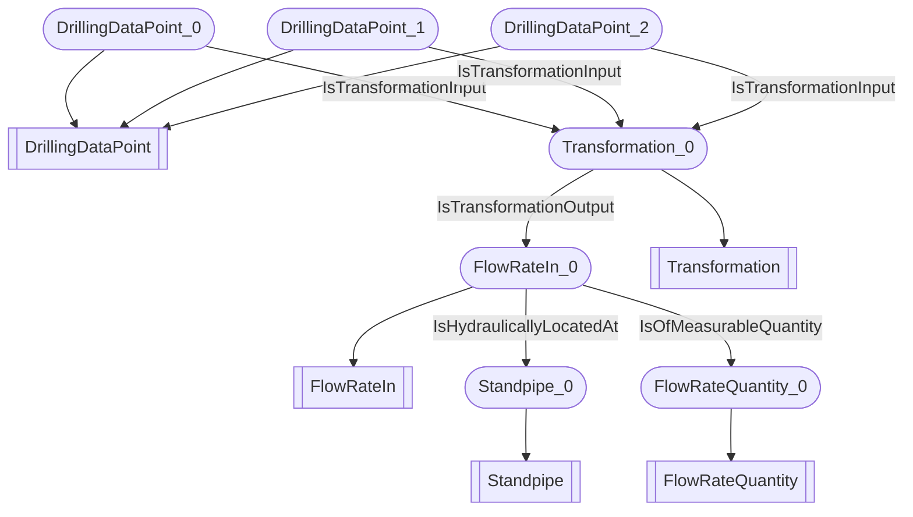

# Flow-rate aggregation
- FlowRateIn:FlowRateIn_0
- Standpipe:Standpipe_0
- FlowRateQuantity:FlowRateQuantity_0
- DrillingDataPoint:DrillingDataPoint_0
- Transformation:Transformation_0
- DrillingDataPoint:DrillingDataPoint_1
- DrillingDataPoint:DrillingDataPoint_2
- FlowRateIn_0 IsHydraulicallyLocatedAt Standpipe_0
- FlowRateIn_0 IsOfMeasurableQuantity FlowRateQuantity_0
- DrillingDataPoint_0 IsTransformationInput Transformation_0
- DrillingDataPoint_1 IsTransformationInput Transformation_0
- DrillingDataPoint_2 IsTransformationInput Transformation_0
- Transformation_0 IsTransformationOutput FlowRateIn_0

