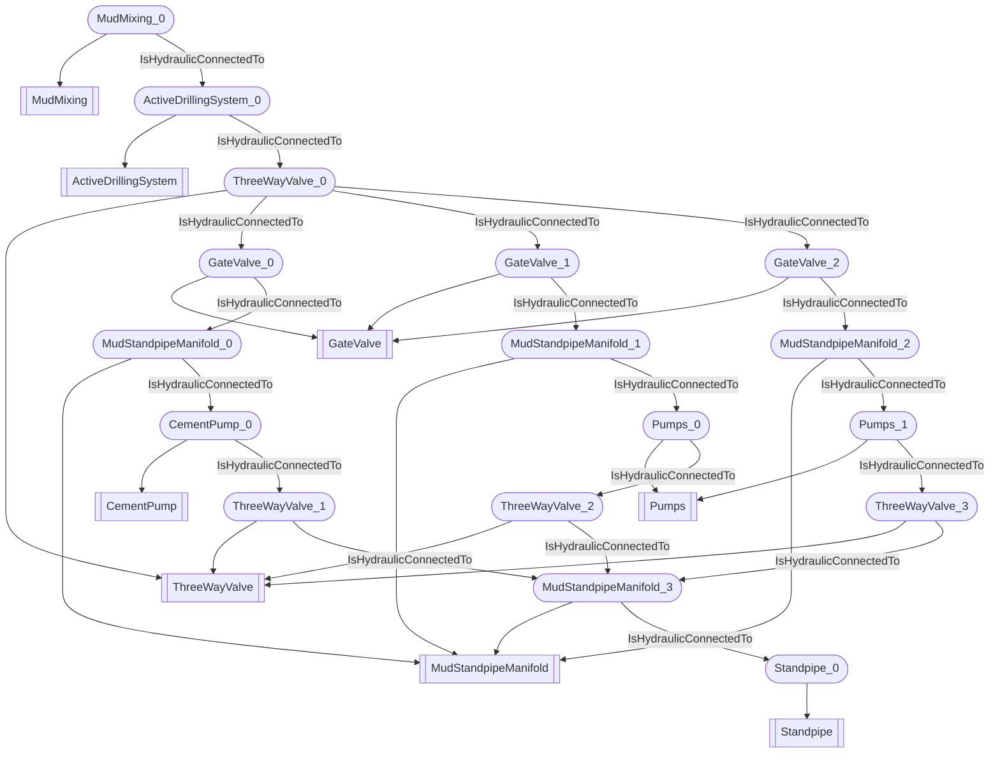

# Hydraulic circuit
- ActiveDrillingSystem:ActiveDrillingSystem_0
- ThreeWayValve:ThreeWayValve_0
- GateValve:GateValve_0
- GateValve:GateValve_1
- GateValve:GateValve_2
- MudStandpipeManifold:MudStandpipeManifold_0
- MudStandpipeManifold:MudStandpipeManifold_1
- MudStandpipeManifold:MudStandpipeManifold_2
- CementPump:CementPump_0
- Pumps:Pumps_0
- Pumps:Pumps_1
- ThreeWayValve:ThreeWayValve_1
- ThreeWayValve:ThreeWayValve_2
- ThreeWayValve:ThreeWayValve_3
- MudStandpipeManifold:MudStandpipeManifold_3
- Standpipe:Standpipe_0
- MudMixing:MudMixing_0
- ActiveDrillingSystem_0 IsHydraulicConnectedTo ThreeWayValve_0
- ThreeWayValve_0 IsHydraulicConnectedTo GateValve_0
- ThreeWayValve_0 IsHydraulicConnectedTo GateValve_1
- ThreeWayValve_0 IsHydraulicConnectedTo GateValve_2
- GateValve_0 IsHydraulicConnectedTo MudStandpipeManifold_0
- GateValve_1 IsHydraulicConnectedTo MudStandpipeManifold_1
- GateValve_2 IsHydraulicConnectedTo MudStandpipeManifold_2
- MudStandpipeManifold_0 IsHydraulicConnectedTo CementPump_0
- MudStandpipeManifold_1 IsHydraulicConnectedTo Pumps_0
- MudStandpipeManifold_2 IsHydraulicConnectedTo Pumps_1
- CementPump_0 IsHydraulicConnectedTo ThreeWayValve_1
- Pumps_0 IsHydraulicConnectedTo ThreeWayValve_2
- Pumps_1 IsHydraulicConnectedTo ThreeWayValve_3
- ThreeWayValve_1 IsHydraulicConnectedTo MudStandpipeManifold_3
- ThreeWayValve_2 IsHydraulicConnectedTo MudStandpipeManifold_3
- ThreeWayValve_3 IsHydraulicConnectedTo MudStandpipeManifold_3
- MudStandpipeManifold_3 IsHydraulicConnectedTo Standpipe_0
- MudMixing_0 IsHydraulicConnectedTo ActiveDrillingSystem_0

