# LWD Signals
- DrillingDataPoint:DrillingDataPoint_0
- Resistivity:Resistivity_0
- Location:Location_0
- MudPulseTelemetry:MudPulseTelemetry_0
- DataFlowNode:DataFlowNode_0
- DrillingDataPoint:DrillingDataPoint_1
- RockDensityQuantity:RockDensityQuantity_0
- Location:Location_1
- DrillingDataPoint:DrillingDataPoint_2
- DrillingDataPoint:DrillingDataPoint_3
- DepthQuantity:DepthQuantity_0
- DrillingDataPoint:DrillingDataPoint_4
- FormationPorosityQuantity:FormationPorosityQuantity_0
- DrillingDataPoint:DrillingDataPoint_5
- DrillingDataPoint:DrillingDataPoint_6
- Location:Location_2
- DrillingDataPoint:DrillingDataPoint_7
- MassDensityQuantity:MassDensityQuantity_0
- DrillingDataPoint_0 IsOfMeasurableQuantity Resistivity_0
- DrillingDataPoint_0 IsPhysicallyLocatedAt Location_0
- DrillingDataPoint_0 IsTransmittedBy MudPulseTelemetry_0
- DrillingDataPoint_0 IsProvidedBy DataFlowNode_0
- DrillingDataPoint_1 IsOfMeasurableQuantity RockDensityQuantity_0
- DrillingDataPoint_1 IsPhysicallyLocatedAt Location_1
- DrillingDataPoint_1 IsTransmittedBy MudPulseTelemetry_0
- DrillingDataPoint_1 IsProvidedBy DataFlowNode_0
- Location_0 HasCoordinates DrillingDataPoint_2
- Location_1 HasCoordinates DrillingDataPoint_3
- DrillingDataPoint_2 IsOfMeasurableQuantity DepthQuantity_0
- DrillingDataPoint_3 IsOfMeasurableQuantity DepthQuantity_0
- DrillingDataPoint_4 IsOfMeasurableQuantity FormationPorosityQuantity_0
- DrillingDataPoint_5 IsOfMeasurableQuantity FormationPorosityQuantity_0
- DrillingDataPoint_6 IsOfMeasurableQuantity FormationPorosityQuantity_0
- DrillingDataPoint_4 IsPhysicallyLocatedAt Location_2
- DrillingDataPoint_5 IsPhysicallyLocatedAt Location_2
- DrillingDataPoint_6 IsPhysicallyLocatedAt Location_2
- Location_2 HasCoordinates DrillingDataPoint_7
- DrillingDataPoint_5 IsTransmittedBy MudPulseTelemetry_0
- DrillingDataPoint_6 IsTransmittedBy MudPulseTelemetry_0
- DrillingDataPoint_4 IsTransmittedBy MudPulseTelemetry_0
- RockDensityQuantity_0 IsObservableFrom MassDensityQuantity_0

```mermaid
flowchart TD
	DrillingDataPoint_0([DrillingDataPoint_0]) --> DrillingDataPoint[[DrillingDataPoint]]
	Resistivity_0([Resistivity_0]) --> Resistivity[[Resistivity]]
	Location_0([Location_0]) --> Location[[Location]]
	MudPulseTelemetry_0([MudPulseTelemetry_0]) --> MudPulseTelemetry[[MudPulseTelemetry]]
	DataFlowNode_0([DataFlowNode_0]) --> DataFlowNode[[DataFlowNode]]
	DrillingDataPoint_1([DrillingDataPoint_1]) --> DrillingDataPoint[[DrillingDataPoint]]
	RockDensityQuantity_0([RockDensityQuantity_0]) --> RockDensityQuantity[[RockDensityQuantity]]
	Location_1([Location_1]) --> Location[[Location]]
	DrillingDataPoint_2([DrillingDataPoint_2]) --> DrillingDataPoint[[DrillingDataPoint]]
	DrillingDataPoint_3([DrillingDataPoint_3]) --> DrillingDataPoint[[DrillingDataPoint]]
	DepthQuantity_0([DepthQuantity_0]) --> DepthQuantity[[DepthQuantity]]
	DrillingDataPoint_4([DrillingDataPoint_4]) --> DrillingDataPoint[[DrillingDataPoint]]
	FormationPorosityQuantity_0([FormationPorosityQuantity_0]) --> FormationPorosityQuantity[[FormationPorosityQuantity]]
	DrillingDataPoint_5([DrillingDataPoint_5]) --> DrillingDataPoint[[DrillingDataPoint]]
	DrillingDataPoint_6([DrillingDataPoint_6]) --> DrillingDataPoint[[DrillingDataPoint]]
	Location_2([Location_2]) --> Location[[Location]]
	DrillingDataPoint_7([DrillingDataPoint_7]) --> DrillingDataPoint[[DrillingDataPoint]]
	MassDensityQuantity_0([MassDensityQuantity_0]) --> MassDensityQuantity[[MassDensityQuantity]]
	 DrillingDataPoint_0 -- IsOfMeasurableQuantity --> Resistivity_0 
	 DrillingDataPoint_0 -- IsPhysicallyLocatedAt --> Location_0 
	 DrillingDataPoint_0 -- IsTransmittedBy --> MudPulseTelemetry_0 
	 DrillingDataPoint_0 -- IsProvidedBy --> DataFlowNode_0 
	 DrillingDataPoint_1 -- IsOfMeasurableQuantity --> RockDensityQuantity_0 
	 DrillingDataPoint_1 -- IsPhysicallyLocatedAt --> Location_1 
	 DrillingDataPoint_1 -- IsTransmittedBy --> MudPulseTelemetry_0 
	 DrillingDataPoint_1 -- IsProvidedBy --> DataFlowNode_0 
	 Location_0 -- HasCoordinates --> DrillingDataPoint_2 
	 Location_1 -- HasCoordinates --> DrillingDataPoint_3 
	 DrillingDataPoint_2 -- IsOfMeasurableQuantity --> DepthQuantity_0 
	 DrillingDataPoint_3 -- IsOfMeasurableQuantity --> DepthQuantity_0 
	 DrillingDataPoint_4 -- IsOfMeasurableQuantity --> FormationPorosityQuantity_0 
	 DrillingDataPoint_5 -- IsOfMeasurableQuantity --> FormationPorosityQuantity_0 
	 DrillingDataPoint_6 -- IsOfMeasurableQuantity --> FormationPorosityQuantity_0 
	 DrillingDataPoint_4 -- IsPhysicallyLocatedAt --> Location_2 
	 DrillingDataPoint_5 -- IsPhysicallyLocatedAt --> Location_2 
	 DrillingDataPoint_6 -- IsPhysicallyLocatedAt --> Location_2 
	 Location_2 -- HasCoordinates --> DrillingDataPoint_7 
	 DrillingDataPoint_5 -- IsTransmittedBy --> MudPulseTelemetry_0 
	 DrillingDataPoint_6 -- IsTransmittedBy --> MudPulseTelemetry_0 
	 DrillingDataPoint_4 -- IsTransmittedBy --> MudPulseTelemetry_0 
	 RockDensityQuantity_0 -- IsObservableFrom --> MassDensityQuantity_0 
```

