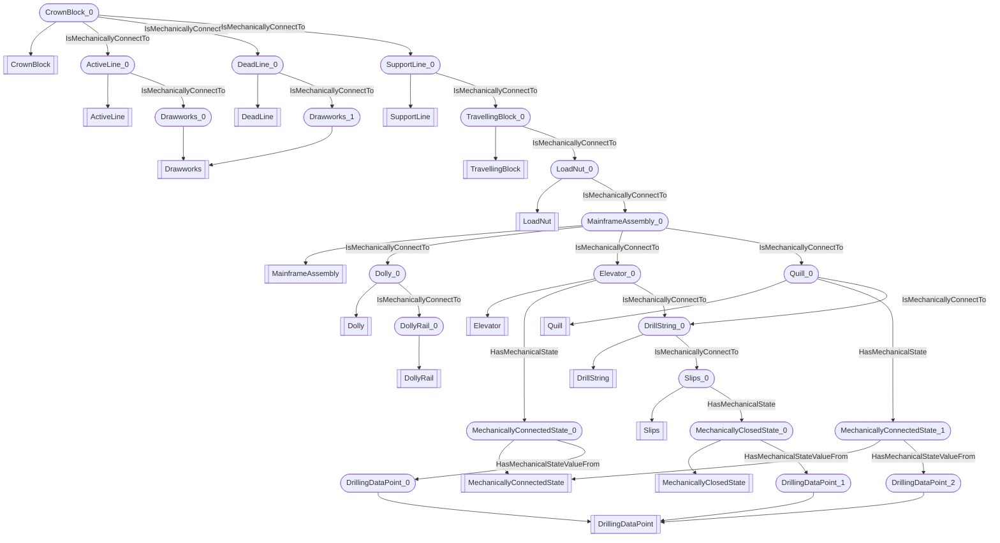

# Mechanical circuit
- Elevator:Elevator_0
- MechanicallyConnectedState:MechanicallyConnectedState_0
- Slips:Slips_0
- MechanicallyClosedState:MechanicallyClosedState_0
- Quill:Quill_0
- MechanicallyConnectedState:MechanicallyConnectedState_1
- DrillingDataPoint:DrillingDataPoint_0
- DrillingDataPoint:DrillingDataPoint_1
- DrillingDataPoint:DrillingDataPoint_2
- ActiveLine:ActiveLine_0
- Drawworks:Drawworks_0
- CrownBlock:CrownBlock_0
- DeadLine:DeadLine_0
- SupportLine:SupportLine_0
- Drawworks:Drawworks_1
- Dolly:Dolly_0
- DollyRail:DollyRail_0
- DrillString:DrillString_0
- TravellingBlock:TravellingBlock_0
- MainframeAssembly:MainframeAssembly_0
- LoadNut:LoadNut_0
- Elevator_0 HasMechanicalState MechanicallyConnectedState_0
- Slips_0 HasMechanicalState MechanicallyClosedState_0
- Quill_0 HasMechanicalState MechanicallyConnectedState_1
- MechanicallyConnectedState_0 HasMechanicalStateValueFrom DrillingDataPoint_0
- MechanicallyClosedState_0 HasMechanicalStateValueFrom DrillingDataPoint_1
- MechanicallyConnectedState_1 HasMechanicalStateValueFrom DrillingDataPoint_2
- ActiveLine_0 IsMechanicallyConnectTo Drawworks_0
- CrownBlock_0 IsMechanicallyConnectTo ActiveLine_0
- CrownBlock_0 IsMechanicallyConnectTo DeadLine_0
- CrownBlock_0 IsMechanicallyConnectTo SupportLine_0
- DeadLine_0 IsMechanicallyConnectTo Drawworks_1
- Dolly_0 IsMechanicallyConnectTo DollyRail_0
- DrillString_0 IsMechanicallyConnectTo Slips_0
- Elevator_0 IsMechanicallyConnectTo DrillString_0
- SupportLine_0 IsMechanicallyConnectTo TravellingBlock_0
- MainframeAssembly_0 IsMechanicallyConnectTo Dolly_0
- MainframeAssembly_0 IsMechanicallyConnectTo Elevator_0
- MainframeAssembly_0 IsMechanicallyConnectTo Quill_0
- LoadNut_0 IsMechanicallyConnectTo MainframeAssembly_0
- Quill_0 IsMechanicallyConnectTo DrillString_0
- TravellingBlock_0 IsMechanicallyConnectTo LoadNut_0

